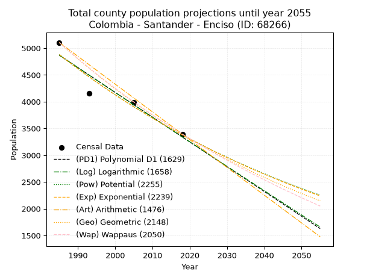
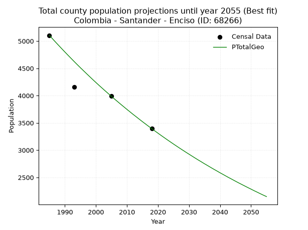
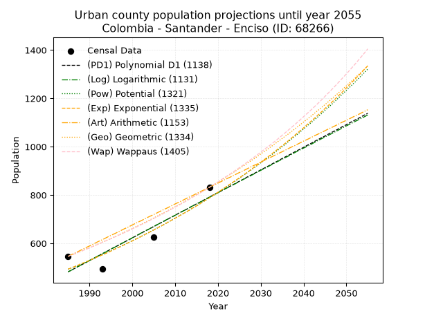
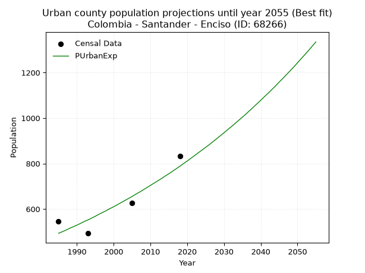
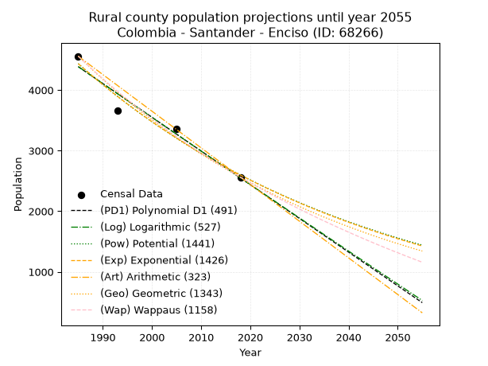
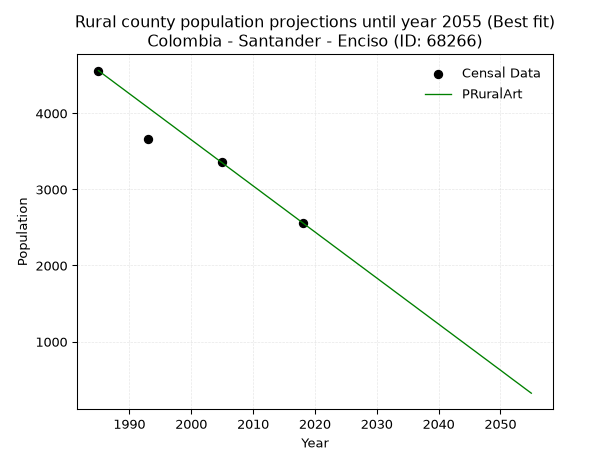

<div align="center">


</div>

# 📜 _“Population and Public Services Demand Projections (PPSD) until Year 2050 for Colombia - Santander - Enciso (ID: 68266)”_
Keywords: `population` `public-service` `projection` `lineal` `polynomial` `logarithmic` `potential` `exponential` `arithmetic` `geometric` `wappaus` `dane` `colombia` `south-america`

PPSD are analytical estimates used by governments and planners to anticipate future changes in population size, age distribution, and the resulting community needs for utilities, healthcare, education, and infrastructure as sizing future water treatment facilities, electrical grids, and road networks based on spatial growth.

<div align="center">

</img>

</div>


> **General running parameters**: • app_version: _v20260806_. • Python version: _3.14.7_. • Pandas version: _3.0.5_. • NumPy version: _2.5.1_. • Creates, save and include plots into reports (create_plot): _False_. • Projection until year: _2050_. • Process polynomial degree 2 and up: _False_. • Process Wappaus: _True_. • Process Wappaus: _True_. • Set negative values to zero: _True_. • Set infinite values to zero: _True_. • Drop dataset notes: _True_. 
<div align="center">

Dynamic map: [:earth_americas:Google](http://maps.google.com/maps?q=6.66803389,-72.699647) [:earth_americas:OSM](https://www.openstreetmap.org/#map=18/6.66803389/-72.699647&layers=P) [:earth_americas:Bing](https://www.bing.com/maps?cp=6.66803389~-72.699647&lvl=18) [:earth_americas:Apple](https://maps.apple.com/frame?center=6.66803389%2C-72.699647&span=0.003%2C0.006)

</div>


<div align="center">

```geojson
{
  "type": "Feature",
  "geometry": {
    "type": "Point", 
    "coordinates": [-72.699647, 6.66803389]
  }, 
  "properties": {
    "Name": "Colombia - Santander - Enciso (ID: 68266)"
  }
}
```

</div>


## 0. Census Data (4 records)

Census data are official statistics collected by a government about the people and housing in a country. They usually include counts of total population, age, sex, race, income, education, and jobs.

📅Global census file: [Population.xlsx](../data/Population.xlsx)

| Source   |   Year |   CountryID | CountryName   |   StateID | StateName   |   CountyID | CountyName   |   PTotal |   PUrban |   PRural |
|:---------|-------:|------------:|:--------------|----------:|:------------|-----------:|:-------------|---------:|---------:|---------:|
| DANE     |   1985 |          57 | Colombia      |        68 | Santander   |      68266 | Enciso       |     5105 |      546 |     4559 |
| DANE     |   1993 |          57 | Colombia      |        68 | Santander   |      68266 | Enciso       |     4159 |      494 |     3665 |
| DANE     |   2005 |          57 | Colombia      |        68 | Santander   |      68266 | Enciso       |     3989 |      627 |     3362 |
| DANE     |   2018 |          57 | Colombia      |        68 | Santander   |      68266 | Enciso       |     3394 |      832 |     2562 |

> 🔥Some records could had specific notes about the registered values or the corresponding urban or rural distribution.

📅[SUI-RUPS](https://www.datos.gov.co/Hacienda-y-Cr-dito-P-blico/Registro-nico-de-Prestadores-de-Servicios-P-blicos/4qkq-csdn/about_data) - Local public utility companies: [RUPS.csv](../data/RUPS.csv)

 | SERVICIO       | ESTADO    | NOMBRE                                                | NIT         | DEPARTAMENTO_DOMICILIO   | MUNICIPIO_DOMICILIO   | DIRECCION                                                 |   TELEFONO | EMAIL                     | TIPO_PRESTADOR                             | CLASIFICACION                 |
|:---------------|:----------|:------------------------------------------------------|:------------|:-------------------------|:----------------------|:----------------------------------------------------------|-----------:|:--------------------------|:-------------------------------------------|:------------------------------|
| ACUEDUCTO      | OPERATIVA | EMPRESA DE SERVICIOS PUBLICOS DE SANTANDER S.A.E.S.P. | 900648934-0 | SANTANDER                | BUCARAMANGA           | CALLE 36 No. 31-39 OFIC 131 CENTRO EMPRESARIAL CHICAMOCHA |    7000420 | favio.garcia@esant.com.co | SOCIEDADES (EMPRESA DE SERVICIOS PUBLICOS) | MENOR O IGUAL A 2500 USUARIOS |
| ALCANTARILLADO | OPERATIVA | EMPRESA DE SERVICIOS PUBLICOS DE SANTANDER S.A.E.S.P. | 900648934-0 | SANTANDER                | BUCARAMANGA           | CALLE 36 No. 31-39 OFIC 131 CENTRO EMPRESARIAL CHICAMOCHA |    7000420 | favio.garcia@esant.com.co | SOCIEDADES (EMPRESA DE SERVICIOS PUBLICOS) | MENOR O IGUAL A 2500 USUARIOS |

## 1. Total

### 1.1. Coefficients and Parameters

* (PD1) Polynomial Deg 1: -46.26696105981494, 96707.23885989485 (lineal)
* (Log) Logarithmic: -92653.57423804028, 708422.3102624908
* (Pow) Potential: -22.286347782562338, 77.18356429892384
* (Exp) Exponential: -0.011130666793046928, 19223079777598.59
* (Art) Arithmetic: Year diff. 2018 - 1985 = 33, Population diff. 3394 - 5105 = -1711, Annual growth = -51.84848484848485
* (Geo) Geometric: Year diff. 2018 - 1985 = 33, Population diff. 3394 - 5105 = -1711, Annual growth % = -0.012293844501491624
* (Wap) Wappaus: i = -1.2201078914809942, Condition values only valid for < 200)

<sub>
Wappaus condition values: ['-0.00', '-1.22', '-2.44', '-3.66', '-4.88', '-6.10', '-7.32', '-8.54', '-9.76', '-10.98', '-12.20', '-13.42', '-14.64', '-15.86', '-17.08', '-18.30', '-19.52', '-20.74', '-21.96', '-23.18', '-24.40', '-25.62', '-26.84', '-28.06', '-29.28', '-30.50', '-31.72', '-32.94', '-34.16', '-35.38', '-36.60', '-37.82', '-39.04', '-40.26', '-41.48', '-42.70', '-43.92', '-45.14', '-46.36', '-47.58', '-48.80', '-50.02', '-51.24', '-52.46', '-53.68', '-54.90', '-56.12', '-57.35', '-58.57', '-59.79', '-61.01', '-62.23', '-63.45', '-64.67', '-65.89', '-67.11', '-68.33', '-69.55', '-70.77', '-71.99', '-73.21', '-74.43', '-75.65', '-76.87', '-78.09', '-79.31']
</sub>


### 1.2. Projected Dataset

|   Year |   CountyID |   PTotalPD1 |   PTotalLog |   PTotalPow |   PTotalExp |   PTotalArt |   PTotalGeo |   PTotalWap |
|-------:|-----------:|------------:|------------:|------------:|------------:|------------:|------------:|------------:|
|   1985 |      68266 |        4867 |        4869 |        4881 |        4879 |        5105 |        5105 |        5105 |
|   1986 |      68266 |        4821 |        4822 |        4827 |        4825 |        5053 |        5042 |        5043 |
|   1987 |      68266 |        4775 |        4776 |        4773 |        4772 |        5001 |        4980 |        4982 |
|   1988 |      68266 |        4729 |        4729 |        4720 |        4719 |        4949 |        4919 |        4921 |
|   1989 |      68266 |        4682 |        4683 |        4667 |        4667 |        4898 |        4859 |        4862 |
|   1990 |      68266 |        4636 |        4636 |        4615 |        4615 |        4846 |        4799 |        4803 |
|   1991 |      68266 |        4590 |        4589 |        4564 |        4564 |        4794 |        4740 |        4744 |
|   1992 |      68266 |        4543 |        4543 |        4513 |        4514 |        4742 |        4682 |        4687 |
|   1993 |      68266 |        4497 |        4496 |        4463 |        4464 |        4690 |        4624 |        4630 |
|   1994 |      68266 |        4451 |        4450 |        4413 |        4414 |        4638 |        4567 |        4574 |
|   1995 |      68266 |        4405 |        4403 |        4364 |        4365 |        4587 |        4511 |        4518 |
|   1996 |      68266 |        4358 |        4357 |        4316 |        4317 |        4535 |        4456 |        4463 |
|   1997 |      68266 |        4312 |        4311 |        4268 |        4269 |        4483 |        4401 |        4409 |
|   1998 |      68266 |        4266 |        4264 |        4220 |        4222 |        4431 |        4347 |        4355 |
|   1999 |      68266 |        4220 |        4218 |        4174 |        4175 |        4379 |        4293 |        4302 |
|   2000 |      68266 |        4173 |        4172 |        4127 |        4129 |        4327 |        4240 |        4249 |
|   2001 |      68266 |        4127 |        4125 |        4082 |        4083 |        4275 |        4188 |        4197 |
|   2002 |      68266 |        4081 |        4079 |        4036 |        4038 |        4224 |        4137 |        4146 |
|   2003 |      68266 |        4035 |        4033 |        3992 |        3993 |        4172 |        4086 |        4095 |
|   2004 |      68266 |        3988 |        3986 |        3948 |        3949 |        4120 |        4036 |        4044 |
|   2005 |      68266 |        3942 |        3940 |        3904 |        3906 |        4068 |        3986 |        3995 |
|   2006 |      68266 |        3896 |        3894 |        3861 |        3862 |        4016 |        3937 |        3946 |
|   2007 |      68266 |        3849 |        3848 |        3818 |        3820 |        3964 |        3889 |        3897 |
|   2008 |      68266 |        3803 |        3802 |        3776 |        3777 |        3912 |        3841 |        3849 |
|   2009 |      68266 |        3757 |        3756 |        3734 |        3735 |        3861 |        3794 |        3801 |
|   2010 |      68266 |        3711 |        3709 |        3693 |        3694 |        3809 |        3747 |        3754 |
|   2011 |      68266 |        3664 |        3663 |        3652 |        3653 |        3757 |        3701 |        3707 |
|   2012 |      68266 |        3618 |        3617 |        3612 |        3613 |        3705 |        3655 |        3661 |
|   2013 |      68266 |        3572 |        3571 |        3572 |        3573 |        3653 |        3611 |        3615 |
|   2014 |      68266 |        3526 |        3525 |        3533 |        3533 |        3601 |        3566 |        3570 |
|   2015 |      68266 |        3479 |        3479 |        3494 |        3494 |        3550 |        3522 |        3525 |
|   2016 |      68266 |        3433 |        3433 |        3456 |        3455 |        3498 |        3479 |        3481 |
|   2017 |      68266 |        3387 |        3387 |        3418 |        3417 |        3446 |        3436 |        3437 |
|   2018 |      68266 |        3341 |        3341 |        3380 |        3379 |        3394 |        3394 |        3394 |
|   2019 |      68266 |        3294 |        3295 |        3343 |        3342 |        3342 |        3352 |        3351 |
|   2020 |      68266 |        3248 |        3250 |        3306 |        3305 |        3290 |        3311 |        3309 |
|   2021 |      68266 |        3202 |        3204 |        3270 |        3268 |        3238 |        3270 |        3266 |
|   2022 |      68266 |        3155 |        3158 |        3234 |        3232 |        3187 |        3230 |        3225 |
|   2023 |      68266 |        3109 |        3112 |        3199 |        3196 |        3135 |        3190 |        3184 |
|   2024 |      68266 |        3063 |        3066 |        3164 |        3161 |        3083 |        3151 |        3143 |
|   2025 |      68266 |        3017 |        3021 |        3129 |        3126 |        3031 |        3112 |        3102 |
|   2026 |      68266 |        2970 |        2975 |        3095 |        3091 |        2979 |        3074 |        3062 |
|   2027 |      68266 |        2924 |        2929 |        3061 |        3057 |        2927 |        3036 |        3023 |
|   2028 |      68266 |        2878 |        2883 |        3028 |        3023 |        2876 |        2999 |        2983 |
|   2029 |      68266 |        2832 |        2838 |        2995 |        2990 |        2824 |        2962 |        2944 |
|   2030 |      68266 |        2785 |        2792 |        2962 |        2957 |        2772 |        2926 |        2906 |
|   2031 |      68266 |        2739 |        2746 |        2929 |        2924 |        2720 |        2890 |        2868 |
|   2032 |      68266 |        2693 |        2701 |        2898 |        2892 |        2668 |        2854 |        2830 |
|   2033 |      68266 |        2647 |        2655 |        2866 |        2860 |        2616 |        2819 |        2792 |
|   2034 |      68266 |        2600 |        2610 |        2835 |        2828 |        2564 |        2785 |        2755 |
|   2035 |      68266 |        2554 |        2564 |        2804 |        2797 |        2513 |        2750 |        2719 |
|   2036 |      68266 |        2508 |        2519 |        2773 |        2766 |        2461 |        2717 |        2682 |
|   2037 |      68266 |        2461 |        2473 |        2743 |        2735 |        2409 |        2683 |        2646 |
|   2038 |      68266 |        2415 |        2428 |        2713 |        2705 |        2357 |        2650 |        2610 |
|   2039 |      68266 |        2369 |        2382 |        2684 |        2675 |        2305 |        2618 |        2575 |
|   2040 |      68266 |        2323 |        2337 |        2655 |        2645 |        2253 |        2585 |        2540 |
|   2041 |      68266 |        2276 |        2291 |        2626 |        2616 |        2201 |        2554 |        2505 |
|   2042 |      68266 |        2230 |        2246 |        2597 |        2587 |        2150 |        2522 |        2471 |
|   2043 |      68266 |        2184 |        2201 |        2569 |        2559 |        2098 |        2491 |        2437 |
|   2044 |      68266 |        2138 |        2155 |        2541 |        2530 |        2046 |        2461 |        2403 |
|   2045 |      68266 |        2091 |        2110 |        2514 |        2502 |        1994 |        2430 |        2369 |
|   2046 |      68266 |        2045 |        2065 |        2486 |        2474 |        1942 |        2400 |        2336 |
|   2047 |      68266 |        1999 |        2019 |        2459 |        2447 |        1890 |        2371 |        2303 |
|   2048 |      68266 |        1953 |        1974 |        2433 |        2420 |        1839 |        2342 |        2270 |
|   2049 |      68266 |        1906 |        1929 |        2407 |        2393 |        1787 |        2313 |        2238 |
|   2050 |      68266 |        1860 |        1884 |        2380 |        2367 |        1735 |        2285 |        2206 |
<div align="center">

</img>

</div>


### 1.3. Best fit with absolute and relative error (%)

Relative error puts that difference into context by dividing the absolute error by the true value, creating a unitless ratio or percentage that shows the scale of the mistake.

Absolute and relative error

|   Year | Source   |   CountryID | CountryName   |   StateID | StateName   |   CountyID_x | CountyName   |   PTotal |   PUrban |   PRural |   CountyID_y |   PTotalPD1 |   PTotalLog |   PTotalPow |   PTotalExp |   PTotalArt |   PTotalGeo |   PTotalWap |   PTotalPD1AbsError |   PTotalLogAbsError |   PTotalPowAbsError |   PTotalExpAbsError |   PTotalArtAbsError |   PTotalGeoAbsError |   PTotalWapAbsError |   PTotalPD1RelError |   PTotalLogRelError |   PTotalPowRelError |   PTotalExpRelError |   PTotalArtRelError |   PTotalGeoRelError |   PTotalWapRelError |
|-------:|:---------|------------:|:--------------|----------:|:------------|-------------:|:-------------|---------:|---------:|---------:|-------------:|------------:|------------:|------------:|------------:|------------:|------------:|------------:|--------------------:|--------------------:|--------------------:|--------------------:|--------------------:|--------------------:|--------------------:|--------------------:|--------------------:|--------------------:|--------------------:|--------------------:|--------------------:|--------------------:|
|   1985 | DANE     |          57 | Colombia      |        68 | Santander   |        68266 | Enciso       |     5105 |      546 |     4559 |        68266 |        4867 |        4869 |        4881 |        4879 |        5105 |        5105 |        5105 |                 238 |                 236 |                 224 |                 226 |                   0 |                   0 |                   0 |             4.6621  |             4.62292 |            4.38786  |            4.42703  |             0       |           0         |            0        |
|   1993 | DANE     |          57 | Colombia      |        68 | Santander   |        68266 | Enciso       |     4159 |      494 |     3665 |        68266 |        4497 |        4496 |        4463 |        4464 |        4690 |        4624 |        4630 |                 338 |                 337 |                 304 |                 305 |                 531 |                 465 |                 471 |             8.12695 |             8.10291 |            7.30945  |            7.33349  |            12.7675  |          11.1806    |           11.3248   |
|   2005 | DANE     |          57 | Colombia      |        68 | Santander   |        68266 | Enciso       |     3989 |      627 |     3362 |        68266 |        3942 |        3940 |        3904 |        3906 |        4068 |        3986 |        3995 |                  47 |                  49 |                  85 |                  83 |                  79 |                   3 |                   6 |             1.17824 |             1.22838 |            2.13086  |            2.08072  |             1.98045 |           0.0752068 |            0.150414 |
|   2018 | DANE     |          57 | Colombia      |        68 | Santander   |        68266 | Enciso       |     3394 |      832 |     2562 |        68266 |        3341 |        3341 |        3380 |        3379 |        3394 |        3394 |        3394 |                  53 |                  53 |                  14 |                  15 |                   0 |                   0 |                   0 |             1.56158 |             1.56158 |            0.412493 |            0.441956 |             0       |           0         |            0        |

Relative error mean

| Method    |   RelError | Best   |
|:----------|-----------:|:-------|
| PTotalPD1 |    3.88222 |        |
| PTotalLog |    3.87895 |        |
| PTotalPow |    3.56016 |        |
| PTotalExp |    3.5708  |        |
| PTotalArt |    3.68698 |        |
| PTotalGeo |    2.81394 | True   |
| PTotalWap |    2.86881 |        |

💙Best method: _**PTotalGeo**_
<div align="center">

</img>

</div>


### 1.4. Fresh water supply demand in liters per capita per day (lpcd)

The fresh water supply demand typically ranges from 100 to 300 liters per capita per day (lpcd) for standard domestic and municipal planning, though absolute survival minimums set by the World Health Organization are as low as 7.5 to 20 liters per day, and total consumption in high-income nations can exceed 400 liters.

> `CZ`: Level in meters above the sea level (masl)<br> `WS`: Fresh water supply demand in liters per capita per day (lpcd or l/h/d)<br> `WSAll`: Zonal fresh water supply demand in liters per second (l/s)<br> `A`: Zonal area in square meters<br> `DP`: Population density (people/hectare or p/ha)

Reference values (RAS Colombia)

|    CZ |   WS |
|------:|-----:|
|  1000 |  120 |
|  2000 |  130 |
| 99999 |  140 |

County shapefile geometry properties and water supply values

|   CountyID |      ATotal |   CZTotal |   WSTotal |
|-----------:|------------:|----------:|----------:|
|      68266 | 7.46546e+07 |   2062.81 |       140 |

Projected values for best method: PTotalGeo

|   CountyID |   Year |   PTotalGeo |   DPTotal |   WSTotal |   WSTotalAll |
|-----------:|-------:|------------:|----------:|----------:|-------------:|
|      68266 |   1985 |        5105 |      0.68 |       140 |      8.27199 |
|      68266 |   1986 |        5042 |      0.68 |       140 |      8.16991 |
|      68266 |   1987 |        4980 |      0.67 |       140 |      8.06944 |
|      68266 |   1988 |        4919 |      0.66 |       140 |      7.9706  |
|      68266 |   1989 |        4859 |      0.65 |       140 |      7.87338 |
|      68266 |   1990 |        4799 |      0.64 |       140 |      7.77616 |
|      68266 |   1991 |        4740 |      0.63 |       140 |      7.68056 |
|      68266 |   1992 |        4682 |      0.63 |       140 |      7.58657 |
|      68266 |   1993 |        4624 |      0.62 |       140 |      7.49259 |
|      68266 |   1994 |        4567 |      0.61 |       140 |      7.40023 |
|      68266 |   1995 |        4511 |      0.6  |       140 |      7.30949 |
|      68266 |   1996 |        4456 |      0.6  |       140 |      7.22037 |
|      68266 |   1997 |        4401 |      0.59 |       140 |      7.13125 |
|      68266 |   1998 |        4347 |      0.58 |       140 |      7.04375 |
|      68266 |   1999 |        4293 |      0.58 |       140 |      6.95625 |
|      68266 |   2000 |        4240 |      0.57 |       140 |      6.87037 |
|      68266 |   2001 |        4188 |      0.56 |       140 |      6.78611 |
|      68266 |   2002 |        4137 |      0.55 |       140 |      6.70347 |
|      68266 |   2003 |        4086 |      0.55 |       140 |      6.62083 |
|      68266 |   2004 |        4036 |      0.54 |       140 |      6.53981 |
|      68266 |   2005 |        3986 |      0.53 |       140 |      6.4588  |
|      68266 |   2006 |        3937 |      0.53 |       140 |      6.3794  |
|      68266 |   2007 |        3889 |      0.52 |       140 |      6.30162 |
|      68266 |   2008 |        3841 |      0.51 |       140 |      6.22384 |
|      68266 |   2009 |        3794 |      0.51 |       140 |      6.14769 |
|      68266 |   2010 |        3747 |      0.5  |       140 |      6.07153 |
|      68266 |   2011 |        3701 |      0.5  |       140 |      5.99699 |
|      68266 |   2012 |        3655 |      0.49 |       140 |      5.92245 |
|      68266 |   2013 |        3611 |      0.48 |       140 |      5.85116 |
|      68266 |   2014 |        3566 |      0.48 |       140 |      5.77824 |
|      68266 |   2015 |        3522 |      0.47 |       140 |      5.70694 |
|      68266 |   2016 |        3479 |      0.47 |       140 |      5.63727 |
|      68266 |   2017 |        3436 |      0.46 |       140 |      5.56759 |
|      68266 |   2018 |        3394 |      0.45 |       140 |      5.49954 |
|      68266 |   2019 |        3352 |      0.45 |       140 |      5.43148 |
|      68266 |   2020 |        3311 |      0.44 |       140 |      5.36505 |
|      68266 |   2021 |        3270 |      0.44 |       140 |      5.29861 |
|      68266 |   2022 |        3230 |      0.43 |       140 |      5.2338  |
|      68266 |   2023 |        3190 |      0.43 |       140 |      5.16898 |
|      68266 |   2024 |        3151 |      0.42 |       140 |      5.10579 |
|      68266 |   2025 |        3112 |      0.42 |       140 |      5.04259 |
|      68266 |   2026 |        3074 |      0.41 |       140 |      4.98102 |
|      68266 |   2027 |        3036 |      0.41 |       140 |      4.91944 |
|      68266 |   2028 |        2999 |      0.4  |       140 |      4.85949 |
|      68266 |   2029 |        2962 |      0.4  |       140 |      4.79954 |
|      68266 |   2030 |        2926 |      0.39 |       140 |      4.7412  |
|      68266 |   2031 |        2890 |      0.39 |       140 |      4.68287 |
|      68266 |   2032 |        2854 |      0.38 |       140 |      4.62454 |
|      68266 |   2033 |        2819 |      0.38 |       140 |      4.56782 |
|      68266 |   2034 |        2785 |      0.37 |       140 |      4.51273 |
|      68266 |   2035 |        2750 |      0.37 |       140 |      4.45602 |
|      68266 |   2036 |        2717 |      0.36 |       140 |      4.40255 |
|      68266 |   2037 |        2683 |      0.36 |       140 |      4.34745 |
|      68266 |   2038 |        2650 |      0.35 |       140 |      4.29398 |
|      68266 |   2039 |        2618 |      0.35 |       140 |      4.24213 |
|      68266 |   2040 |        2585 |      0.35 |       140 |      4.18866 |
|      68266 |   2041 |        2554 |      0.34 |       140 |      4.13843 |
|      68266 |   2042 |        2522 |      0.34 |       140 |      4.08657 |
|      68266 |   2043 |        2491 |      0.33 |       140 |      4.03634 |
|      68266 |   2044 |        2461 |      0.33 |       140 |      3.98773 |
|      68266 |   2045 |        2430 |      0.33 |       140 |      3.9375  |
|      68266 |   2046 |        2400 |      0.32 |       140 |      3.88889 |
|      68266 |   2047 |        2371 |      0.32 |       140 |      3.8419  |
|      68266 |   2048 |        2342 |      0.31 |       140 |      3.79491 |
|      68266 |   2049 |        2313 |      0.31 |       140 |      3.74792 |
|      68266 |   2050 |        2285 |      0.31 |       140 |      3.70255 |

## 2. Urban

### 2.1. Coefficients and Parameters

* (PD1) Polynomial Deg 1: 9.37494981934953, -18127.493376153896 (lineal)
* (Log) Logarithmic: 18746.165536603647, -141865.00446606713
* (Pow) Potential: 28.447717198387657, -91.12099425138989
* (Exp) Exponential: 0.014225933380747395, 2.6856184958272245e-10
* (Art) Arithmetic: Year diff. 2018 - 1985 = 33, Population diff. 832 - 546 = 286, Annual growth = 8.666666666666666
* (Geo) Geometric: Year diff. 2018 - 1985 = 33, Population diff. 832 - 546 = 286, Annual growth % = 0.012845852507838762
* (Wap) Wappaus: i = 1.2578616352201257, Condition values only valid for < 200)

<sub>
Wappaus condition values: ['0.00', '1.26', '2.52', '3.77', '5.03', '6.29', '7.55', '8.81', '10.06', '11.32', '12.58', '13.84', '15.09', '16.35', '17.61', '18.87', '20.13', '21.38', '22.64', '23.90', '25.16', '26.42', '27.67', '28.93', '30.19', '31.45', '32.70', '33.96', '35.22', '36.48', '37.74', '38.99', '40.25', '41.51', '42.77', '44.03', '45.28', '46.54', '47.80', '49.06', '50.31', '51.57', '52.83', '54.09', '55.35', '56.60', '57.86', '59.12', '60.38', '61.64', '62.89', '64.15', '65.41', '66.67', '67.92', '69.18', '70.44', '71.70', '72.96', '74.21', '75.47', '76.73', '77.99', '79.25', '80.50', '81.76']
</sub>


### 2.2. Projected Dataset

|   Year |   CountyID |   PUrbanPD1 |   PUrbanLog |   PUrbanPow |   PUrbanExp |   PUrbanArt |   PUrbanGeo |   PUrbanWap |
|-------:|-----------:|------------:|------------:|------------:|------------:|------------:|------------:|------------:|
|   1985 |      68266 |         482 |         482 |         493 |         493 |         546 |         546 |         546 |
|   1986 |      68266 |         491 |         491 |         500 |         500 |         555 |         553 |         553 |
|   1987 |      68266 |         501 |         501 |         507 |         507 |         563 |         560 |         560 |
|   1988 |      68266 |         510 |         510 |         515 |         515 |         572 |         567 |         567 |
|   1989 |      68266 |         519 |         519 |         522 |         522 |         581 |         575 |         574 |
|   1990 |      68266 |         529 |         529 |         529 |         529 |         589 |         582 |         581 |
|   1991 |      68266 |         538 |         538 |         537 |         537 |         598 |         589 |         589 |
|   1992 |      68266 |         547 |         548 |         545 |         545 |         607 |         597 |         596 |
|   1993 |      68266 |         557 |         557 |         553 |         552 |         615 |         605 |         604 |
|   1994 |      68266 |         566 |         566 |         561 |         560 |         624 |         612 |         612 |
|   1995 |      68266 |         576 |         576 |         569 |         568 |         633 |         620 |         619 |
|   1996 |      68266 |         585 |         585 |         577 |         577 |         641 |         628 |         627 |
|   1997 |      68266 |         594 |         595 |         585 |         585 |         650 |         636 |         635 |
|   1998 |      68266 |         604 |         604 |         593 |         593 |         659 |         645 |         643 |
|   1999 |      68266 |         613 |         613 |         602 |         602 |         667 |         653 |         651 |
|   2000 |      68266 |         622 |         623 |         611 |         610 |         676 |         661 |         660 |
|   2001 |      68266 |         632 |         632 |         619 |         619 |         685 |         670 |         668 |
|   2002 |      68266 |         641 |         642 |         628 |         628 |         693 |         678 |         677 |
|   2003 |      68266 |         651 |         651 |         637 |         637 |         702 |         687 |         685 |
|   2004 |      68266 |         660 |         660 |         646 |         646 |         711 |         696 |         694 |
|   2005 |      68266 |         669 |         670 |         656 |         655 |         719 |         705 |         703 |
|   2006 |      68266 |         679 |         679 |         665 |         665 |         728 |         714 |         712 |
|   2007 |      68266 |         688 |         688 |         674 |         674 |         737 |         723 |         721 |
|   2008 |      68266 |         697 |         698 |         684 |         684 |         745 |         732 |         731 |
|   2009 |      68266 |         707 |         707 |         694 |         694 |         754 |         742 |         740 |
|   2010 |      68266 |         716 |         716 |         704 |         704 |         763 |         751 |         750 |
|   2011 |      68266 |         726 |         726 |         714 |         714 |         771 |         761 |         759 |
|   2012 |      68266 |         735 |         735 |         724 |         724 |         780 |         771 |         769 |
|   2013 |      68266 |         744 |         744 |         734 |         734 |         789 |         781 |         779 |
|   2014 |      68266 |         754 |         754 |         745 |         745 |         797 |         791 |         790 |
|   2015 |      68266 |         763 |         763 |         755 |         755 |         806 |         801 |         800 |
|   2016 |      68266 |         772 |         772 |         766 |         766 |         815 |         811 |         810 |
|   2017 |      68266 |         782 |         781 |         777 |         777 |         823 |         821 |         821 |
|   2018 |      68266 |         791 |         791 |         788 |         788 |         832 |         832 |         832 |
|   2019 |      68266 |         801 |         800 |         799 |         800 |         841 |         843 |         843 |
|   2020 |      68266 |         810 |         809 |         810 |         811 |         849 |         854 |         854 |
|   2021 |      68266 |         819 |         819 |         822 |         823 |         858 |         864 |         866 |
|   2022 |      68266 |         829 |         828 |         834 |         835 |         867 |         876 |         877 |
|   2023 |      68266 |         838 |         837 |         845 |         847 |         875 |         887 |         889 |
|   2024 |      68266 |         847 |         846 |         857 |         859 |         884 |         898 |         901 |
|   2025 |      68266 |         857 |         856 |         869 |         871 |         893 |         910 |         913 |
|   2026 |      68266 |         866 |         865 |         882 |         883 |         901 |         921 |         925 |
|   2027 |      68266 |         876 |         874 |         894 |         896 |         910 |         933 |         938 |
|   2028 |      68266 |         885 |         883 |         907 |         909 |         919 |         945 |         951 |
|   2029 |      68266 |         894 |         893 |         920 |         922 |         927 |         957 |         964 |
|   2030 |      68266 |         904 |         902 |         933 |         935 |         936 |         970 |         977 |
|   2031 |      68266 |         913 |         911 |         946 |         949 |         945 |         982 |         991 |
|   2032 |      68266 |         922 |         920 |         959 |         962 |         953 |         995 |        1004 |
|   2033 |      68266 |         932 |         930 |         973 |         976 |         962 |        1008 |        1018 |
|   2034 |      68266 |         941 |         939 |         986 |         990 |         971 |        1021 |        1032 |
|   2035 |      68266 |         951 |         948 |        1000 |        1004 |         979 |        1034 |        1047 |
|   2036 |      68266 |         960 |         957 |        1014 |        1018 |         988 |        1047 |        1062 |
|   2037 |      68266 |         969 |         966 |        1029 |        1033 |         997 |        1060 |        1077 |
|   2038 |      68266 |         979 |         976 |        1043 |        1048 |        1005 |        1074 |        1092 |
|   2039 |      68266 |         988 |         985 |        1058 |        1063 |        1014 |        1088 |        1108 |
|   2040 |      68266 |         997 |         994 |        1073 |        1078 |        1023 |        1102 |        1124 |
|   2041 |      68266 |        1007 |        1003 |        1088 |        1094 |        1031 |        1116 |        1140 |
|   2042 |      68266 |        1016 |        1012 |        1103 |        1109 |        1040 |        1130 |        1156 |
|   2043 |      68266 |        1026 |        1022 |        1118 |        1125 |        1049 |        1145 |        1173 |
|   2044 |      68266 |        1035 |        1031 |        1134 |        1141 |        1057 |        1159 |        1190 |
|   2045 |      68266 |        1044 |        1040 |        1150 |        1158 |        1066 |        1174 |        1208 |
|   2046 |      68266 |        1054 |        1049 |        1166 |        1174 |        1075 |        1189 |        1226 |
|   2047 |      68266 |        1063 |        1058 |        1182 |        1191 |        1083 |        1205 |        1244 |
|   2048 |      68266 |        1072 |        1067 |        1199 |        1208 |        1092 |        1220 |        1263 |
|   2049 |      68266 |        1082 |        1077 |        1216 |        1225 |        1101 |        1236 |        1282 |
|   2050 |      68266 |        1091 |        1086 |        1233 |        1243 |        1109 |        1252 |        1301 |
<div align="center">

</img>

</div>


### 2.3. Best fit with absolute and relative error (%)

Relative error puts that difference into context by dividing the absolute error by the true value, creating a unitless ratio or percentage that shows the scale of the mistake.

Absolute and relative error

|   Year | Source   |   CountryID | CountryName   |   StateID | StateName   |   CountyID_x | CountyName   |   PTotal |   PUrban |   PRural |   CountyID_y |   PUrbanPD1 |   PUrbanLog |   PUrbanPow |   PUrbanExp |   PUrbanArt |   PUrbanGeo |   PUrbanWap |   PUrbanPD1AbsError |   PUrbanLogAbsError |   PUrbanPowAbsError |   PUrbanExpAbsError |   PUrbanArtAbsError |   PUrbanGeoAbsError |   PUrbanWapAbsError |   PUrbanPD1RelError |   PUrbanLogRelError |   PUrbanPowRelError |   PUrbanExpRelError |   PUrbanArtRelError |   PUrbanGeoRelError |   PUrbanWapRelError |
|-------:|:---------|------------:|:--------------|----------:|:------------|-------------:|:-------------|---------:|---------:|---------:|-------------:|------------:|------------:|------------:|------------:|------------:|------------:|------------:|--------------------:|--------------------:|--------------------:|--------------------:|--------------------:|--------------------:|--------------------:|--------------------:|--------------------:|--------------------:|--------------------:|--------------------:|--------------------:|--------------------:|
|   1985 | DANE     |          57 | Colombia      |        68 | Santander   |        68266 | Enciso       |     5105 |      546 |     4559 |        68266 |         482 |         482 |         493 |         493 |         546 |         546 |         546 |                  64 |                  64 |                  53 |                  53 |                   0 |                   0 |                   0 |            11.7216  |            11.7216  |             9.70696 |             9.70696 |              0      |              0      |              0      |
|   1993 | DANE     |          57 | Colombia      |        68 | Santander   |        68266 | Enciso       |     4159 |      494 |     3665 |        68266 |         557 |         557 |         553 |         552 |         615 |         605 |         604 |                  63 |                  63 |                  59 |                  58 |                 121 |                 111 |                 110 |            12.753   |            12.753   |            11.9433  |            11.7409  |             24.4939 |             22.4696 |             22.2672 |
|   2005 | DANE     |          57 | Colombia      |        68 | Santander   |        68266 | Enciso       |     3989 |      627 |     3362 |        68266 |         669 |         670 |         656 |         655 |         719 |         705 |         703 |                  42 |                  43 |                  29 |                  28 |                  92 |                  78 |                  76 |             6.69856 |             6.85805 |             4.6252  |             4.46571 |             14.673  |             12.4402 |             12.1212 |
|   2018 | DANE     |          57 | Colombia      |        68 | Santander   |        68266 | Enciso       |     3394 |      832 |     2562 |        68266 |         791 |         791 |         788 |         788 |         832 |         832 |         832 |                  41 |                  41 |                  44 |                  44 |                   0 |                   0 |                   0 |             4.92788 |             4.92788 |             5.28846 |             5.28846 |              0      |              0      |              0      |

Relative error mean

| Method    |   RelError | Best   |
|:----------|-----------:|:-------|
| PUrbanPD1 |    9.02527 |        |
| PUrbanLog |    9.06515 |        |
| PUrbanPow |    7.89099 |        |
| PUrbanExp |    7.80051 | True   |
| PUrbanArt |    9.79174 |        |
| PUrbanGeo |    8.72746 |        |
| PUrbanWap |    8.5971  |        |

💙Best method: _**PUrbanExp**_
<div align="center">

</img>

</div>


### 2.4. Fresh water supply demand in liters per capita per day (lpcd)

The fresh water supply demand typically ranges from 100 to 300 liters per capita per day (lpcd) for standard domestic and municipal planning, though absolute survival minimums set by the World Health Organization are as low as 7.5 to 20 liters per day, and total consumption in high-income nations can exceed 400 liters.

> `CZ`: Level in meters above the sea level (masl)<br> `WS`: Fresh water supply demand in liters per capita per day (lpcd or l/h/d)<br> `WSAll`: Zonal fresh water supply demand in liters per second (l/s)<br> `A`: Zonal area in square meters<br> `DP`: Population density (people/hectare or p/ha)

Reference values (RAS Colombia)

|    CZ |   WS |
|------:|-----:|
|  1000 |  120 |
|  2000 |  130 |
| 99999 |  140 |

County shapefile geometry properties and water supply values

|   CountyID |   AUrban |   CZUrban |   WSUrban |
|-----------:|---------:|----------:|----------:|
|      68266 |   164535 |   1579.14 |       130 |

Projected values for best method: PUrbanExp

|   CountyID |   Year |   PUrbanExp |   DPUrban |   WSUrban |   WSUrbanAll |
|-----------:|-------:|------------:|----------:|----------:|-------------:|
|      68266 |   1985 |         493 |     29.96 |       130 |     0.741782 |
|      68266 |   1986 |         500 |     30.39 |       130 |     0.752315 |
|      68266 |   1987 |         507 |     30.81 |       130 |     0.762847 |
|      68266 |   1988 |         515 |     31.3  |       130 |     0.774884 |
|      68266 |   1989 |         522 |     31.73 |       130 |     0.785417 |
|      68266 |   1990 |         529 |     32.15 |       130 |     0.795949 |
|      68266 |   1991 |         537 |     32.64 |       130 |     0.807986 |
|      68266 |   1992 |         545 |     33.12 |       130 |     0.820023 |
|      68266 |   1993 |         552 |     33.55 |       130 |     0.830556 |
|      68266 |   1994 |         560 |     34.04 |       130 |     0.842593 |
|      68266 |   1995 |         568 |     34.52 |       130 |     0.85463  |
|      68266 |   1996 |         577 |     35.07 |       130 |     0.868171 |
|      68266 |   1997 |         585 |     35.55 |       130 |     0.880208 |
|      68266 |   1998 |         593 |     36.04 |       130 |     0.892245 |
|      68266 |   1999 |         602 |     36.59 |       130 |     0.905787 |
|      68266 |   2000 |         610 |     37.07 |       130 |     0.917824 |
|      68266 |   2001 |         619 |     37.62 |       130 |     0.931366 |
|      68266 |   2002 |         628 |     38.17 |       130 |     0.944907 |
|      68266 |   2003 |         637 |     38.72 |       130 |     0.958449 |
|      68266 |   2004 |         646 |     39.26 |       130 |     0.971991 |
|      68266 |   2005 |         655 |     39.81 |       130 |     0.985532 |
|      68266 |   2006 |         665 |     40.42 |       130 |     1.00058  |
|      68266 |   2007 |         674 |     40.96 |       130 |     1.01412  |
|      68266 |   2008 |         684 |     41.57 |       130 |     1.02917  |
|      68266 |   2009 |         694 |     42.18 |       130 |     1.04421  |
|      68266 |   2010 |         704 |     42.79 |       130 |     1.05926  |
|      68266 |   2011 |         714 |     43.4  |       130 |     1.07431  |
|      68266 |   2012 |         724 |     44    |       130 |     1.08935  |
|      68266 |   2013 |         734 |     44.61 |       130 |     1.1044   |
|      68266 |   2014 |         745 |     45.28 |       130 |     1.12095  |
|      68266 |   2015 |         755 |     45.89 |       130 |     1.136    |
|      68266 |   2016 |         766 |     46.56 |       130 |     1.15255  |
|      68266 |   2017 |         777 |     47.22 |       130 |     1.1691   |
|      68266 |   2018 |         788 |     47.89 |       130 |     1.18565  |
|      68266 |   2019 |         800 |     48.62 |       130 |     1.2037   |
|      68266 |   2020 |         811 |     49.29 |       130 |     1.22025  |
|      68266 |   2021 |         823 |     50.02 |       130 |     1.23831  |
|      68266 |   2022 |         835 |     50.75 |       130 |     1.25637  |
|      68266 |   2023 |         847 |     51.48 |       130 |     1.27442  |
|      68266 |   2024 |         859 |     52.21 |       130 |     1.29248  |
|      68266 |   2025 |         871 |     52.94 |       130 |     1.31053  |
|      68266 |   2026 |         883 |     53.67 |       130 |     1.32859  |
|      68266 |   2027 |         896 |     54.46 |       130 |     1.34815  |
|      68266 |   2028 |         909 |     55.25 |       130 |     1.36771  |
|      68266 |   2029 |         922 |     56.04 |       130 |     1.38727  |
|      68266 |   2030 |         935 |     56.83 |       130 |     1.40683  |
|      68266 |   2031 |         949 |     57.68 |       130 |     1.42789  |
|      68266 |   2032 |         962 |     58.47 |       130 |     1.44745  |
|      68266 |   2033 |         976 |     59.32 |       130 |     1.46852  |
|      68266 |   2034 |         990 |     60.17 |       130 |     1.48958  |
|      68266 |   2035 |        1004 |     61.02 |       130 |     1.51065  |
|      68266 |   2036 |        1018 |     61.87 |       130 |     1.53171  |
|      68266 |   2037 |        1033 |     62.78 |       130 |     1.55428  |
|      68266 |   2038 |        1048 |     63.69 |       130 |     1.57685  |
|      68266 |   2039 |        1063 |     64.61 |       130 |     1.59942  |
|      68266 |   2040 |        1078 |     65.52 |       130 |     1.62199  |
|      68266 |   2041 |        1094 |     66.49 |       130 |     1.64606  |
|      68266 |   2042 |        1109 |     67.4  |       130 |     1.66863  |
|      68266 |   2043 |        1125 |     68.37 |       130 |     1.69271  |
|      68266 |   2044 |        1141 |     69.35 |       130 |     1.71678  |
|      68266 |   2045 |        1158 |     70.38 |       130 |     1.74236  |
|      68266 |   2046 |        1174 |     71.35 |       130 |     1.76644  |
|      68266 |   2047 |        1191 |     72.39 |       130 |     1.79201  |
|      68266 |   2048 |        1208 |     73.42 |       130 |     1.81759  |
|      68266 |   2049 |        1225 |     74.45 |       130 |     1.84317  |
|      68266 |   2050 |        1243 |     75.55 |       130 |     1.87025  |

## 3. Rural

### 3.1. Coefficients and Parameters

* (PD1) Polynomial Deg 1: -55.641910879164485, 114834.73223604876 (lineal)
* (Log) Logarithmic: -111399.73977464392, 850287.3147285578
* (Pow) Potential: -32.44309036345903, 110.63663178317142
* (Exp) Exponential: -0.01620842070995364, 4.1662493387579866e+17
* (Art) Arithmetic: Year diff. 2018 - 1985 = 33, Population diff. 2562 - 4559 = -1997, Annual growth = -60.515151515151516
* (Geo) Geometric: Year diff. 2018 - 1985 = 33, Population diff. 2562 - 4559 = -1997, Annual growth % = -0.01731248046395084
* (Wap) Wappaus: i = -1.6996250952156022, Condition values only valid for < 200)

<sub>
Wappaus condition values: ['-0.00', '-1.70', '-3.40', '-5.10', '-6.80', '-8.50', '-10.20', '-11.90', '-13.60', '-15.30', '-17.00', '-18.70', '-20.40', '-22.10', '-23.79', '-25.49', '-27.19', '-28.89', '-30.59', '-32.29', '-33.99', '-35.69', '-37.39', '-39.09', '-40.79', '-42.49', '-44.19', '-45.89', '-47.59', '-49.29', '-50.99', '-52.69', '-54.39', '-56.09', '-57.79', '-59.49', '-61.19', '-62.89', '-64.59', '-66.29', '-67.99', '-69.68', '-71.38', '-73.08', '-74.78', '-76.48', '-78.18', '-79.88', '-81.58', '-83.28', '-84.98', '-86.68', '-88.38', '-90.08', '-91.78', '-93.48', '-95.18', '-96.88', '-98.58', '-100.28', '-101.98', '-103.68', '-105.38', '-107.08', '-108.78', '-110.48']
</sub>


### 3.2. Projected Dataset

|   Year |   CountyID |   PRuralPD1 |   PRuralLog |   PRuralPow |   PRuralExp |   PRuralArt |   PRuralGeo |   PRuralWap |
|-------:|-----------:|------------:|------------:|------------:|------------:|------------:|------------:|------------:|
|   1985 |      68266 |        4386 |        4387 |        4437 |        4435 |        4559 |        4559 |        4559 |
|   1986 |      68266 |        4330 |        4331 |        4365 |        4364 |        4498 |        4480 |        4482 |
|   1987 |      68266 |        4274 |        4275 |        4294 |        4293 |        4438 |        4403 |        4407 |
|   1988 |      68266 |        4219 |        4219 |        4225 |        4224 |        4377 |        4326 |        4332 |
|   1989 |      68266 |        4163 |        4163 |        4156 |        4156 |        4317 |        4251 |        4259 |
|   1990 |      68266 |        4107 |        4107 |        4089 |        4090 |        4256 |        4178 |        4187 |
|   1991 |      68266 |        4052 |        4051 |        4023 |        4024 |        4196 |        4105 |        4117 |
|   1992 |      68266 |        3996 |        3995 |        3958 |        3959 |        4135 |        4034 |        4047 |
|   1993 |      68266 |        3940 |        3939 |        3894 |        3896 |        4075 |        3965 |        3979 |
|   1994 |      68266 |        3885 |        3883 |        3831 |        3833 |        4014 |        3896 |        3911 |
|   1995 |      68266 |        3829 |        3828 |        3770 |        3771 |        3954 |        3828 |        3845 |
|   1996 |      68266 |        3773 |        3772 |        3709 |        3711 |        3893 |        3762 |        3780 |
|   1997 |      68266 |        3718 |        3716 |        3649 |        3651 |        3833 |        3697 |        3715 |
|   1998 |      68266 |        3662 |        3660 |        3590 |        3592 |        3772 |        3633 |        3652 |
|   1999 |      68266 |        3607 |        3604 |        3532 |        3535 |        3712 |        3570 |        3590 |
|   2000 |      68266 |        3551 |        3549 |        3476 |        3478 |        3651 |        3508 |        3528 |
|   2001 |      68266 |        3495 |        3493 |        3420 |        3422 |        3591 |        3448 |        3468 |
|   2002 |      68266 |        3440 |        3437 |        3365 |        3367 |        3530 |        3388 |        3408 |
|   2003 |      68266 |        3384 |        3382 |        3311 |        3313 |        3470 |        3329 |        3349 |
|   2004 |      68266 |        3328 |        3326 |        3257 |        3259 |        3409 |        3272 |        3291 |
|   2005 |      68266 |        3273 |        3271 |        3205 |        3207 |        3349 |        3215 |        3234 |
|   2006 |      68266 |        3217 |        3215 |        3154 |        3155 |        3288 |        3159 |        3178 |
|   2007 |      68266 |        3161 |        3160 |        3103 |        3105 |        3228 |        3105 |        3123 |
|   2008 |      68266 |        3106 |        3104 |        3053 |        3055 |        3167 |        3051 |        3068 |
|   2009 |      68266 |        3050 |        3049 |        3004 |        3006 |        3107 |        2998 |        3014 |
|   2010 |      68266 |        2994 |        2993 |        2956 |        2957 |        3046 |        2946 |        2961 |
|   2011 |      68266 |        2939 |        2938 |        2909 |        2910 |        2986 |        2895 |        2909 |
|   2012 |      68266 |        2883 |        2882 |        2862 |        2863 |        2925 |        2845 |        2857 |
|   2013 |      68266 |        2828 |        2827 |        2817 |        2817 |        2865 |        2796 |        2806 |
|   2014 |      68266 |        2772 |        2772 |        2772 |        2772 |        2804 |        2747 |        2756 |
|   2015 |      68266 |        2716 |        2716 |        2727 |        2727 |        2744 |        2700 |        2707 |
|   2016 |      68266 |        2661 |        2661 |        2684 |        2683 |        2683 |        2653 |        2658 |
|   2017 |      68266 |        2605 |        2606 |        2641 |        2640 |        2623 |        2607 |        2610 |
|   2018 |      68266 |        2549 |        2551 |        2599 |        2598 |        2562 |        2562 |        2562 |
|   2019 |      68266 |        2494 |        2495 |        2557 |        2556 |        2501 |        2518 |        2515 |
|   2020 |      68266 |        2438 |        2440 |        2517 |        2515 |        2441 |        2474 |        2469 |
|   2021 |      68266 |        2382 |        2385 |        2477 |        2474 |        2380 |        2431 |        2423 |
|   2022 |      68266 |        2327 |        2330 |        2437 |        2435 |        2320 |        2389 |        2378 |
|   2023 |      68266 |        2271 |        2275 |        2398 |        2395 |        2259 |        2348 |        2333 |
|   2024 |      68266 |        2216 |        2220 |        2360 |        2357 |        2199 |        2307 |        2289 |
|   2025 |      68266 |        2160 |        2165 |        2323 |        2319 |        2138 |        2267 |        2246 |
|   2026 |      68266 |        2104 |        2110 |        2286 |        2282 |        2078 |        2228 |        2203 |
|   2027 |      68266 |        2049 |        2055 |        2249 |        2245 |        2017 |        2189 |        2161 |
|   2028 |      68266 |        1993 |        2000 |        2214 |        2209 |        1957 |        2151 |        2119 |
|   2029 |      68266 |        1937 |        1945 |        2179 |        2173 |        1896 |        2114 |        2077 |
|   2030 |      68266 |        1882 |        1890 |        2144 |        2139 |        1836 |        2078 |        2037 |
|   2031 |      68266 |        1826 |        1835 |        2110 |        2104 |        1775 |        2042 |        1996 |
|   2032 |      68266 |        1770 |        1780 |        2077 |        2070 |        1715 |        2006 |        1957 |
|   2033 |      68266 |        1715 |        1726 |        2044 |        2037 |        1654 |        1972 |        1917 |
|   2034 |      68266 |        1659 |        1671 |        2011 |        2004 |        1594 |        1937 |        1878 |
|   2035 |      68266 |        1603 |        1616 |        1980 |        1972 |        1533 |        1904 |        1840 |
|   2036 |      68266 |        1548 |        1561 |        1948 |        1940 |        1473 |        1871 |        1802 |
|   2037 |      68266 |        1492 |        1507 |        1918 |        1909 |        1412 |        1839 |        1765 |
|   2038 |      68266 |        1437 |        1452 |        1887 |        1878 |        1352 |        1807 |        1728 |
|   2039 |      68266 |        1381 |        1397 |        1857 |        1848 |        1291 |        1775 |        1691 |
|   2040 |      68266 |        1325 |        1343 |        1828 |        1819 |        1231 |        1745 |        1655 |
|   2041 |      68266 |        1270 |        1288 |        1799 |        1789 |        1170 |        1714 |        1619 |
|   2042 |      68266 |        1214 |        1234 |        1771 |        1761 |        1110 |        1685 |        1584 |
|   2043 |      68266 |        1158 |        1179 |        1743 |        1732 |        1049 |        1656 |        1549 |
|   2044 |      68266 |        1103 |        1125 |        1716 |        1704 |         989 |        1627 |        1514 |
|   2045 |      68266 |        1047 |        1070 |        1689 |        1677 |         928 |        1599 |        1480 |
|   2046 |      68266 |         991 |        1016 |        1662 |        1650 |         868 |        1571 |        1446 |
|   2047 |      68266 |         936 |         961 |        1636 |        1623 |         807 |        1544 |        1413 |
|   2048 |      68266 |         880 |         907 |        1610 |        1597 |         747 |        1517 |        1380 |
|   2049 |      68266 |         824 |         852 |        1585 |        1572 |         686 |        1491 |        1347 |
|   2050 |      68266 |         769 |         798 |        1560 |        1546 |         626 |        1465 |        1315 |
<div align="center">

</img>

</div>


### 3.3. Best fit with absolute and relative error (%)

Relative error puts that difference into context by dividing the absolute error by the true value, creating a unitless ratio or percentage that shows the scale of the mistake.

Absolute and relative error

|   Year | Source   |   CountryID | CountryName   |   StateID | StateName   |   CountyID_x | CountyName   |   PTotal |   PUrban |   PRural |   CountyID_y |   PRuralPD1 |   PRuralLog |   PRuralPow |   PRuralExp |   PRuralArt |   PRuralGeo |   PRuralWap |   PRuralPD1AbsError |   PRuralLogAbsError |   PRuralPowAbsError |   PRuralExpAbsError |   PRuralArtAbsError |   PRuralGeoAbsError |   PRuralWapAbsError |   PRuralPD1RelError |   PRuralLogRelError |   PRuralPowRelError |   PRuralExpRelError |   PRuralArtRelError |   PRuralGeoRelError |   PRuralWapRelError |
|-------:|:---------|------------:|:--------------|----------:|:------------|-------------:|:-------------|---------:|---------:|---------:|-------------:|------------:|------------:|------------:|------------:|------------:|------------:|------------:|--------------------:|--------------------:|--------------------:|--------------------:|--------------------:|--------------------:|--------------------:|--------------------:|--------------------:|--------------------:|--------------------:|--------------------:|--------------------:|--------------------:|
|   1985 | DANE     |          57 | Colombia      |        68 | Santander   |        68266 | Enciso       |     5105 |      546 |     4559 |        68266 |        4386 |        4387 |        4437 |        4435 |        4559 |        4559 |        4559 |                 173 |                 172 |                 122 |                 124 |                   0 |                   0 |                   0 |            3.79469  |            3.77276  |             2.67603 |             2.71989 |            0        |             0       |             0       |
|   1993 | DANE     |          57 | Colombia      |        68 | Santander   |        68266 | Enciso       |     4159 |      494 |     3665 |        68266 |        3940 |        3939 |        3894 |        3896 |        4075 |        3965 |        3979 |                 275 |                 274 |                 229 |                 231 |                 410 |                 300 |                 314 |            7.50341  |            7.47613  |             6.24829 |             6.30286 |           11.1869   |             8.18554 |             8.56753 |
|   2005 | DANE     |          57 | Colombia      |        68 | Santander   |        68266 | Enciso       |     3989 |      627 |     3362 |        68266 |        3273 |        3271 |        3205 |        3207 |        3349 |        3215 |        3234 |                  89 |                  91 |                 157 |                 155 |                  13 |                 147 |                 128 |            2.64723  |            2.70672  |             4.66984 |             4.61035 |            0.386675 |             4.3724  |             3.80726 |
|   2018 | DANE     |          57 | Colombia      |        68 | Santander   |        68266 | Enciso       |     3394 |      832 |     2562 |        68266 |        2549 |        2551 |        2599 |        2598 |        2562 |        2562 |        2562 |                  13 |                  11 |                  37 |                  36 |                   0 |                   0 |                   0 |            0.507416 |            0.429352 |             1.44418 |             1.40515 |            0        |             0       |             0       |

Relative error mean

| Method    |   RelError | Best   |
|:----------|-----------:|:-------|
| PRuralPD1 |    3.61319 |        |
| PRuralLog |    3.59624 |        |
| PRuralPow |    3.75959 |        |
| PRuralExp |    3.75957 |        |
| PRuralArt |    2.89339 | True   |
| PRuralGeo |    3.13948 |        |
| PRuralWap |    3.0937  |        |

💙Best method: _**PRuralArt**_
<div align="center">

</img>

</div>


### 3.4. Fresh water supply demand in liters per capita per day (lpcd)

The fresh water supply demand typically ranges from 100 to 300 liters per capita per day (lpcd) for standard domestic and municipal planning, though absolute survival minimums set by the World Health Organization are as low as 7.5 to 20 liters per day, and total consumption in high-income nations can exceed 400 liters.

> `CZ`: Level in meters above the sea level (masl)<br> `WS`: Fresh water supply demand in liters per capita per day (lpcd or l/h/d)<br> `WSAll`: Zonal fresh water supply demand in liters per second (l/s)<br> `A`: Zonal area in square meters<br> `DP`: Population density (people/hectare or p/ha)

Reference values (RAS Colombia)

|    CZ |   WS |
|------:|-----:|
|  1000 |  120 |
|  2000 |  130 |
| 99999 |  140 |

County shapefile geometry properties and water supply values

|   CountyID |    ARural |   CZRural |   WSRural |
|-----------:|----------:|----------:|----------:|
|      68266 | 7.449e+07 |   2063.86 |       140 |

Projected values for best method: PRuralArt

|   CountyID |   Year |   PRuralArt |   DPRural |   WSRural |   WSRuralAll |
|-----------:|-------:|------------:|----------:|----------:|-------------:|
|      68266 |   1985 |        4559 |      0.61 |       140 |      7.38727 |
|      68266 |   1986 |        4498 |      0.6  |       140 |      7.28843 |
|      68266 |   1987 |        4438 |      0.6  |       140 |      7.1912  |
|      68266 |   1988 |        4377 |      0.59 |       140 |      7.09236 |
|      68266 |   1989 |        4317 |      0.58 |       140 |      6.99514 |
|      68266 |   1990 |        4256 |      0.57 |       140 |      6.8963  |
|      68266 |   1991 |        4196 |      0.56 |       140 |      6.79907 |
|      68266 |   1992 |        4135 |      0.56 |       140 |      6.70023 |
|      68266 |   1993 |        4075 |      0.55 |       140 |      6.60301 |
|      68266 |   1994 |        4014 |      0.54 |       140 |      6.50417 |
|      68266 |   1995 |        3954 |      0.53 |       140 |      6.40694 |
|      68266 |   1996 |        3893 |      0.52 |       140 |      6.3081  |
|      68266 |   1997 |        3833 |      0.51 |       140 |      6.21088 |
|      68266 |   1998 |        3772 |      0.51 |       140 |      6.11204 |
|      68266 |   1999 |        3712 |      0.5  |       140 |      6.01481 |
|      68266 |   2000 |        3651 |      0.49 |       140 |      5.91597 |
|      68266 |   2001 |        3591 |      0.48 |       140 |      5.81875 |
|      68266 |   2002 |        3530 |      0.47 |       140 |      5.71991 |
|      68266 |   2003 |        3470 |      0.47 |       140 |      5.62269 |
|      68266 |   2004 |        3409 |      0.46 |       140 |      5.52384 |
|      68266 |   2005 |        3349 |      0.45 |       140 |      5.42662 |
|      68266 |   2006 |        3288 |      0.44 |       140 |      5.32778 |
|      68266 |   2007 |        3228 |      0.43 |       140 |      5.23056 |
|      68266 |   2008 |        3167 |      0.43 |       140 |      5.13171 |
|      68266 |   2009 |        3107 |      0.42 |       140 |      5.03449 |
|      68266 |   2010 |        3046 |      0.41 |       140 |      4.93565 |
|      68266 |   2011 |        2986 |      0.4  |       140 |      4.83843 |
|      68266 |   2012 |        2925 |      0.39 |       140 |      4.73958 |
|      68266 |   2013 |        2865 |      0.38 |       140 |      4.64236 |
|      68266 |   2014 |        2804 |      0.38 |       140 |      4.54352 |
|      68266 |   2015 |        2744 |      0.37 |       140 |      4.4463  |
|      68266 |   2016 |        2683 |      0.36 |       140 |      4.34745 |
|      68266 |   2017 |        2623 |      0.35 |       140 |      4.25023 |
|      68266 |   2018 |        2562 |      0.34 |       140 |      4.15139 |
|      68266 |   2019 |        2501 |      0.34 |       140 |      4.05255 |
|      68266 |   2020 |        2441 |      0.33 |       140 |      3.95532 |
|      68266 |   2021 |        2380 |      0.32 |       140 |      3.85648 |
|      68266 |   2022 |        2320 |      0.31 |       140 |      3.75926 |
|      68266 |   2023 |        2259 |      0.3  |       140 |      3.66042 |
|      68266 |   2024 |        2199 |      0.3  |       140 |      3.56319 |
|      68266 |   2025 |        2138 |      0.29 |       140 |      3.46435 |
|      68266 |   2026 |        2078 |      0.28 |       140 |      3.36713 |
|      68266 |   2027 |        2017 |      0.27 |       140 |      3.26829 |
|      68266 |   2028 |        1957 |      0.26 |       140 |      3.17106 |
|      68266 |   2029 |        1896 |      0.25 |       140 |      3.07222 |
|      68266 |   2030 |        1836 |      0.25 |       140 |      2.975   |
|      68266 |   2031 |        1775 |      0.24 |       140 |      2.87616 |
|      68266 |   2032 |        1715 |      0.23 |       140 |      2.77894 |
|      68266 |   2033 |        1654 |      0.22 |       140 |      2.68009 |
|      68266 |   2034 |        1594 |      0.21 |       140 |      2.58287 |
|      68266 |   2035 |        1533 |      0.21 |       140 |      2.48403 |
|      68266 |   2036 |        1473 |      0.2  |       140 |      2.38681 |
|      68266 |   2037 |        1412 |      0.19 |       140 |      2.28796 |
|      68266 |   2038 |        1352 |      0.18 |       140 |      2.19074 |
|      68266 |   2039 |        1291 |      0.17 |       140 |      2.0919  |
|      68266 |   2040 |        1231 |      0.17 |       140 |      1.99468 |
|      68266 |   2041 |        1170 |      0.16 |       140 |      1.89583 |
|      68266 |   2042 |        1110 |      0.15 |       140 |      1.79861 |
|      68266 |   2043 |        1049 |      0.14 |       140 |      1.69977 |
|      68266 |   2044 |         989 |      0.13 |       140 |      1.60255 |
|      68266 |   2045 |         928 |      0.12 |       140 |      1.5037  |
|      68266 |   2046 |         868 |      0.12 |       140 |      1.40648 |
|      68266 |   2047 |         807 |      0.11 |       140 |      1.30764 |
|      68266 |   2048 |         747 |      0.1  |       140 |      1.21042 |
|      68266 |   2049 |         686 |      0.09 |       140 |      1.11157 |
|      68266 |   2050 |         626 |      0.08 |       140 |      1.01435 |

#

<div align="center"><br><sub>Share this research</sub></div><br>

<sub>**APPS & TOOLS & CONTENT DISCLAIMER**: • NO WARRANTY - This content and software is provided by <a href="https://github.com/rcfdtools" target="_blank">github.com/rcfdtools</a> "as is", without any express or implied warranty, including warranties of merchantability, fitness for a particular purpose, or non-infringement. There is no guarantee that the software will be error-free or operate without interruption. • LIMITATION OF LIABILITY - Neither the authors nor copyright holders will be liable for claims or damages arising from the software or its use. You are responsible for determining if the software is appropriate for your use and assume all associated risks, including errors, legal compliance, and data loss. • NO PROFESSIONAL ADVICE - The software provides general information and does not offer professional advice. It should not replace consultation with professional advisors. [Clauses and global license for rcfdtools use.](https://github.com/rcfdtools/rcfdtools/blob/main/LICENSE.md)</sub>

| [:house: Home](Readme.md)  | [:beginner: Help / Collab](https://github.com/rcfdtools/R.HydroTools/discussions/31) |
|----------------------------|-------------------------------------------------------------------------------------------|