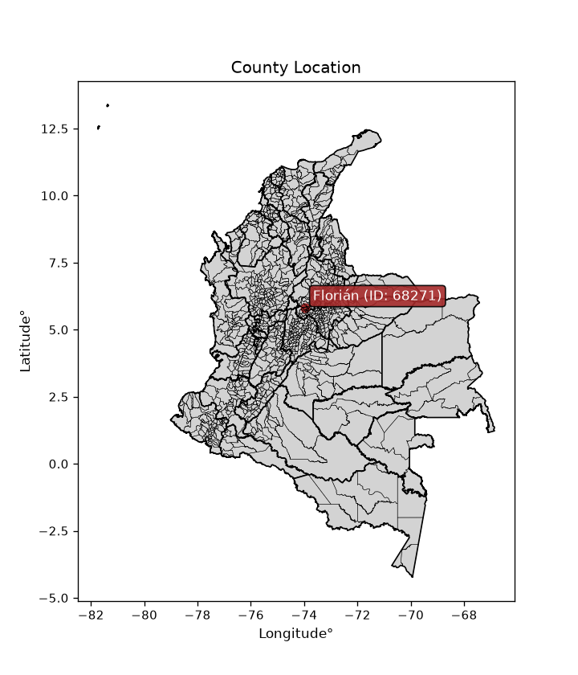
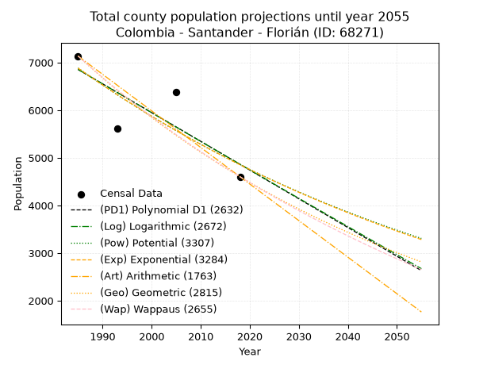
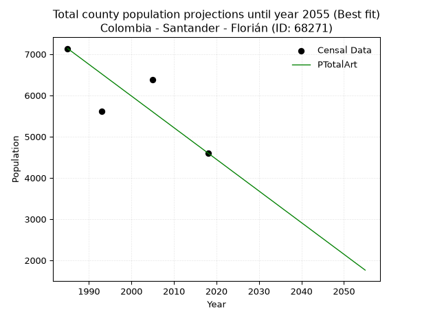
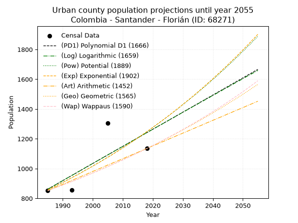
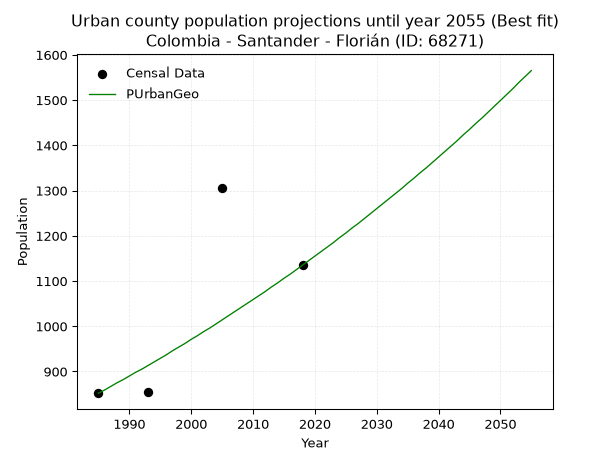
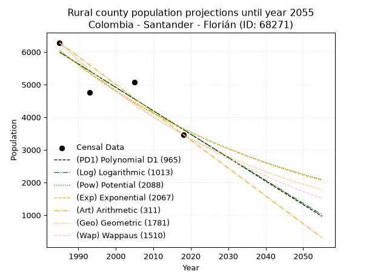
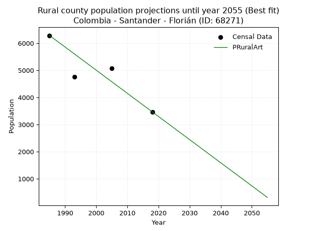

<div align="center">


</div>

# _“Population and Public Services Demand Projections (PPSD) until Year 2050 for Colombia - Santander - Florián (ID: 68271)”_
Keywords: `population` `public-service` `projection` `lineal` `polynomial` `logarithmic` `potential` `exponential` `arithmetic` `geometric` `wappaus` `dane` `colombia` `south-america`

PPSD are analytical estimates used by governments and planners to anticipate future changes in population size, age distribution, and the resulting community needs for utilities, healthcare, education, and infrastructure as sizing future water treatment facilities, electrical grids, and road networks based on spatial growth.

<div align="center">

</img>

</div>


> **General running parameters**: • app_version: _v20260806_. • Python version: _3.14.7_. • Pandas version: _3.0.5_. • NumPy version: _2.5.1_. • Creates, save and include plots into reports (create_plot): _False_. • Projection until year: _2050_. • Process polynomial degree 2 and up: _False_. • Process Wappaus: _True_. • Process Wappaus: _True_. • Set negative values to zero: _True_. • Set infinite values to zero: _True_. • Drop dataset notes: _True_. 
<div align="center">

Dynamic map: [:earth_americas:Google](http://maps.google.com/maps?q=5.80465923,-73.9714302) [:earth_americas:OSM](https://www.openstreetmap.org/#map=18/5.80465923/-73.9714302&layers=P) [:earth_americas:Bing](https://www.bing.com/maps?cp=5.80465923~-73.9714302&lvl=18) [:earth_americas:Apple](https://maps.apple.com/frame?center=5.80465923%2C-73.9714302&span=0.003%2C0.006)

</div>


<div align="center">

```geojson
{
  "type": "Feature",
  "geometry": {
    "type": "Point", 
    "coordinates": [-73.9714302, 5.80465923]
  }, 
  "properties": {
    "Name": "Colombia - Santander - Florián (ID: 68271)"
  }
}
```

</div>


## 0. Census Data (4 records)

Census data are official statistics collected by a government about the people and housing in a country. They usually include counts of total population, age, sex, race, income, education, and jobs.

📅Global census file: [Population.xlsx](../data/Population.xlsx)

| Source   |   Year |   CountryID | CountryName   |   StateID | StateName   |   CountyID | CountyName   |   PTotal |   PUrban |   PRural |
|:---------|-------:|------------:|:--------------|----------:|:------------|-----------:|:-------------|---------:|---------:|---------:|
| DANE     |   1985 |          57 | Colombia      |        68 | Santander   |      68271 | Florián      |     7136 |      852 |     6284 |
| DANE     |   1993 |          57 | Colombia      |        68 | Santander   |      68271 | Florián      |     5619 |      855 |     4764 |
| DANE     |   2005 |          57 | Colombia      |        68 | Santander   |      68271 | Florián      |     6378 |     1306 |     5072 |
| DANE     |   2018 |          57 | Colombia      |        68 | Santander   |      68271 | Florián      |     4603 |     1135 |     3468 |

> 🔥Some records could had specific notes about the registered values or the corresponding urban or rural distribution.

📅[SUI-RUPS](https://www.datos.gov.co/Hacienda-y-Cr-dito-P-blico/Registro-nico-de-Prestadores-de-Servicios-P-blicos/4qkq-csdn/about_data) - Local public utility companies: [RUPS.csv](../data/RUPS.xlsx)

 | SERVICIO       | ESTADO    | NOMBRE                         | NIT         | DEPARTAMENTO_DOMICILIO   | MUNICIPIO_DOMICILIO   | DIRECCION                            |   TELEFONO | EMAIL                    | TIPO_PRESTADOR                 | CLASIFICACION                 |
|:---------------|:----------|:-------------------------------|:------------|:-------------------------|:----------------------|:-------------------------------------|-----------:|:-------------------------|:-------------------------------|:------------------------------|
| ACUEDUCTO      | OPERATIVA | MUNICIPIO DE FLORIAN SANTANDER | 890209640-2 | SANTANDER                | FLORIAN               | CALLE 4 N. 1A - 45 PALACIO MUNICIPAL |    4856025 | aaalabellezana@gmail.com | MUNICIPIO (PRESTACIÓN DIRECTA) | MENOR O IGUAL A 2500 USUARIOS |
| ALCANTARILLADO | OPERATIVA | MUNICIPIO DE FLORIAN SANTANDER | 890209640-2 | SANTANDER                | FLORIAN               | CALLE 4 N. 1A - 45 PALACIO MUNICIPAL |    4856025 | aaalabellezana@gmail.com | MUNICIPIO (PRESTACIÓN DIRECTA) | MENOR O IGUAL A 2500 USUARIOS |

## 1. Total

### 1.1. Coefficients and Parameters

* (PD1) Polynomial Deg 1: -60.31794460056093, 126584.968687272 (lineal)
* (Log) Logarithmic: -120702.476433612, 923394.4906208273
* (Pow) Potential: -21.149840027871985, 73.58493571671194
* (Exp) Exponential: -0.01057094747380561, 8926184917696.715
* (Art) Arithmetic: Year diff. 2018 - 1985 = 33, Population diff. 4603 - 7136 = -2533, Annual growth = -76.75757575757575
* (Geo) Geometric: Year diff. 2018 - 1985 = 33, Population diff. 4603 - 7136 = -2533, Annual growth % = -0.013198313995550714
* (Wap) Wappaus: i = -1.3077361914571217, Condition values only valid for < 200)

<sub>
Wappaus condition values: ['-0.00', '-1.31', '-2.62', '-3.92', '-5.23', '-6.54', '-7.85', '-9.15', '-10.46', '-11.77', '-13.08', '-14.39', '-15.69', '-17.00', '-18.31', '-19.62', '-20.92', '-22.23', '-23.54', '-24.85', '-26.15', '-27.46', '-28.77', '-30.08', '-31.39', '-32.69', '-34.00', '-35.31', '-36.62', '-37.92', '-39.23', '-40.54', '-41.85', '-43.16', '-44.46', '-45.77', '-47.08', '-48.39', '-49.69', '-51.00', '-52.31', '-53.62', '-54.92', '-56.23', '-57.54', '-58.85', '-60.16', '-61.46', '-62.77', '-64.08', '-65.39', '-66.69', '-68.00', '-69.31', '-70.62', '-71.93', '-73.23', '-74.54', '-75.85', '-77.16', '-78.46', '-79.77', '-81.08', '-82.39', '-83.70', '-85.00']
</sub>


### 1.2. Projected Dataset

|   Year |   CountyID |   PTotalPD1 |   PTotalLog |   PTotalPow |   PTotalExp |   PTotalArt |   PTotalGeo |   PTotalWap |
|-------:|-----------:|------------:|------------:|------------:|------------:|------------:|------------:|------------:|
|   1985 |      68271 |        6854 |        6855 |        6884 |        6882 |        7136 |        7136 |        7136 |
|   1986 |      68271 |        6794 |        6795 |        6811 |        6810 |        7059 |        7042 |        7043 |
|   1987 |      68271 |        6733 |        6734 |        6739 |        6738 |        6982 |        6949 |        6952 |
|   1988 |      68271 |        6673 |        6673 |        6667 |        6667 |        6906 |        6857 |        6861 |
|   1989 |      68271 |        6613 |        6612 |        6597 |        6597 |        6829 |        6767 |        6772 |
|   1990 |      68271 |        6552 |        6552 |        6527 |        6528 |        6752 |        6677 |        6684 |
|   1991 |      68271 |        6492 |        6491 |        6458 |        6459 |        6675 |        6589 |        6597 |
|   1992 |      68271 |        6432 |        6431 |        6390 |        6391 |        6599 |        6502 |        6511 |
|   1993 |      68271 |        6371 |        6370 |        6322 |        6324 |        6522 |        6416 |        6427 |
|   1994 |      68271 |        6311 |        6309 |        6256 |        6258 |        6445 |        6332 |        6343 |
|   1995 |      68271 |        6251 |        6249 |        6190 |        6192 |        6368 |        6248 |        6260 |
|   1996 |      68271 |        6190 |        6188 |        6124 |        6127 |        6292 |        6166 |        6178 |
|   1997 |      68271 |        6130 |        6128 |        6060 |        6062 |        6215 |        6084 |        6098 |
|   1998 |      68271 |        6070 |        6068 |        5996 |        5998 |        6138 |        6004 |        6018 |
|   1999 |      68271 |        6009 |        6007 |        5933 |        5935 |        6061 |        5925 |        5939 |
|   2000 |      68271 |        5949 |        5947 |        5871 |        5873 |        5985 |        5847 |        5861 |
|   2001 |      68271 |        5889 |        5886 |        5809 |        5811 |        5908 |        5769 |        5784 |
|   2002 |      68271 |        5828 |        5826 |        5748 |        5750 |        5831 |        5693 |        5708 |
|   2003 |      68271 |        5768 |        5766 |        5687 |        5690 |        5754 |        5618 |        5633 |
|   2004 |      68271 |        5708 |        5706 |        5628 |        5630 |        5678 |        5544 |        5559 |
|   2005 |      68271 |        5647 |        5645 |        5569 |        5571 |        5601 |        5471 |        5485 |
|   2006 |      68271 |        5587 |        5585 |        5510 |        5512 |        5524 |        5399 |        5413 |
|   2007 |      68271 |        5527 |        5525 |        5452 |        5454 |        5447 |        5327 |        5341 |
|   2008 |      68271 |        5467 |        5465 |        5395 |        5397 |        5371 |        5257 |        5270 |
|   2009 |      68271 |        5406 |        5405 |        5339 |        5340 |        5294 |        5188 |        5200 |
|   2010 |      68271 |        5346 |        5345 |        5283 |        5284 |        5217 |        5119 |        5131 |
|   2011 |      68271 |        5286 |        5285 |        5228 |        5228 |        5140 |        5052 |        5062 |
|   2012 |      68271 |        5225 |        5225 |        5173 |        5173 |        5064 |        4985 |        4994 |
|   2013 |      68271 |        5165 |        5165 |        5119 |        5119 |        4987 |        4919 |        4927 |
|   2014 |      68271 |        5105 |        5105 |        5065 |        5065 |        4910 |        4854 |        4861 |
|   2015 |      68271 |        5044 |        5045 |        5012 |        5012 |        4833 |        4790 |        4796 |
|   2016 |      68271 |        4984 |        4985 |        4960 |        4959 |        4757 |        4727 |        4731 |
|   2017 |      68271 |        4924 |        4925 |        4908 |        4907 |        4680 |        4665 |        4666 |
|   2018 |      68271 |        4863 |        4865 |        4857 |        4855 |        4603 |        4603 |        4603 |
|   2019 |      68271 |        4803 |        4805 |        4807 |        4804 |        4526 |        4542 |        4540 |
|   2020 |      68271 |        4743 |        4746 |        4756 |        4754 |        4449 |        4482 |        4478 |
|   2021 |      68271 |        4682 |        4686 |        4707 |        4704 |        4373 |        4423 |        4417 |
|   2022 |      68271 |        4622 |        4626 |        4658 |        4654 |        4296 |        4365 |        4356 |
|   2023 |      68271 |        4562 |        4567 |        4609 |        4605 |        4219 |        4307 |        4296 |
|   2024 |      68271 |        4501 |        4507 |        4562 |        4557 |        4142 |        4250 |        4236 |
|   2025 |      68271 |        4441 |        4447 |        4514 |        4509 |        4066 |        4194 |        4177 |
|   2026 |      68271 |        4381 |        4388 |        4467 |        4462 |        3989 |        4139 |        4119 |
|   2027 |      68271 |        4320 |        4328 |        4421 |        4415 |        3912 |        4084 |        4061 |
|   2028 |      68271 |        4260 |        4269 |        4375 |        4368 |        3835 |        4030 |        4004 |
|   2029 |      68271 |        4200 |        4209 |        4330 |        4322 |        3759 |        3977 |        3947 |
|   2030 |      68271 |        4140 |        4150 |        4285 |        4277 |        3682 |        3925 |        3891 |
|   2031 |      68271 |        4079 |        4090 |        4240 |        4232 |        3605 |        3873 |        3836 |
|   2032 |      68271 |        4019 |        4031 |        4196 |        4187 |        3528 |        3822 |        3781 |
|   2033 |      68271 |        3959 |        3971 |        4153 |        4143 |        3452 |        3771 |        3727 |
|   2034 |      68271 |        3898 |        3912 |        4110 |        4100 |        3375 |        3722 |        3673 |
|   2035 |      68271 |        3838 |        3853 |        4068 |        4057 |        3298 |        3672 |        3620 |
|   2036 |      68271 |        3778 |        3793 |        4025 |        4014 |        3221 |        3624 |        3567 |
|   2037 |      68271 |        3717 |        3734 |        3984 |        3972 |        3145 |        3576 |        3515 |
|   2038 |      68271 |        3657 |        3675 |        3943 |        3930 |        3068 |        3529 |        3463 |
|   2039 |      68271 |        3597 |        3616 |        3902 |        3889 |        2991 |        3482 |        3412 |
|   2040 |      68271 |        3536 |        3557 |        3862 |        3848 |        2914 |        3436 |        3361 |
|   2041 |      68271 |        3476 |        3497 |        3822 |        3807 |        2838 |        3391 |        3311 |
|   2042 |      68271 |        3416 |        3438 |        3783 |        3767 |        2761 |        3346 |        3261 |
|   2043 |      68271 |        3355 |        3379 |        3744 |        3728 |        2684 |        3302 |        3212 |
|   2044 |      68271 |        3295 |        3320 |        3705 |        3689 |        2607 |        3259 |        3163 |
|   2045 |      68271 |        3235 |        3261 |        3667 |        3650 |        2531 |        3215 |        3115 |
|   2046 |      68271 |        3174 |        3202 |        3629 |        3611 |        2454 |        3173 |        3067 |
|   2047 |      68271 |        3114 |        3143 |        3592 |        3573 |        2377 |        3131 |        3019 |
|   2048 |      68271 |        3054 |        3084 |        3555 |        3536 |        2300 |        3090 |        2972 |
|   2049 |      68271 |        2994 |        3025 |        3518 |        3499 |        2224 |        3049 |        2926 |
|   2050 |      68271 |        2933 |        2966 |        3482 |        3462 |        2147 |        3009 |        2879 |
<div align="center">

</img>

</div>


### 1.3. Best fit with absolute and relative error (%)

Relative error puts that difference into context by dividing the absolute error by the true value, creating a unitless ratio or percentage that shows the scale of the mistake.

Absolute and relative error

|   Year | Source   |   CountryID | CountryName   |   StateID | StateName   |   CountyID_x | CountyName   |   PTotal |   PUrban |   PRural |   CountyID_y |   PTotalPD1 |   PTotalLog |   PTotalPow |   PTotalExp |   PTotalArt |   PTotalGeo |   PTotalWap |   PTotalPD1AbsError |   PTotalLogAbsError |   PTotalPowAbsError |   PTotalExpAbsError |   PTotalArtAbsError |   PTotalGeoAbsError |   PTotalWapAbsError |   PTotalPD1RelError |   PTotalLogRelError |   PTotalPowRelError |   PTotalExpRelError |   PTotalArtRelError |   PTotalGeoRelError |   PTotalWapRelError |
|-------:|:---------|------------:|:--------------|----------:|:------------|-------------:|:-------------|---------:|---------:|---------:|-------------:|------------:|------------:|------------:|------------:|------------:|------------:|------------:|--------------------:|--------------------:|--------------------:|--------------------:|--------------------:|--------------------:|--------------------:|--------------------:|--------------------:|--------------------:|--------------------:|--------------------:|--------------------:|--------------------:|
|   1985 | DANE     |          57 | Colombia      |        68 | Santander   |        68271 | Florián      |     7136 |      852 |     6284 |        68271 |        6854 |        6855 |        6884 |        6882 |        7136 |        7136 |        7136 |                 282 |                 281 |                 252 |                 254 |                   0 |                   0 |                   0 |             3.95179 |             3.93778 |             3.53139 |             3.55942 |              0      |              0      |              0      |
|   1993 | DANE     |          57 | Colombia      |        68 | Santander   |        68271 | Florián      |     5619 |      855 |     4764 |        68271 |        6371 |        6370 |        6322 |        6324 |        6522 |        6416 |        6427 |                 752 |                 751 |                 703 |                 705 |                 903 |                 797 |                 808 |            13.3832  |            13.3654  |            12.5111  |            12.5467  |             16.0705 |             14.184  |             14.3798 |
|   2005 | DANE     |          57 | Colombia      |        68 | Santander   |        68271 | Florián      |     6378 |     1306 |     5072 |        68271 |        5647 |        5645 |        5569 |        5571 |        5601 |        5471 |        5485 |                 731 |                 733 |                 809 |                 807 |                 777 |                 907 |                 893 |            11.4613  |            11.4926  |            12.6842  |            12.6529  |             12.1825 |             14.2208 |             14.0013 |
|   2018 | DANE     |          57 | Colombia      |        68 | Santander   |        68271 | Florián      |     4603 |     1135 |     3468 |        68271 |        4863 |        4865 |        4857 |        4855 |        4603 |        4603 |        4603 |                 260 |                 262 |                 254 |                 252 |                   0 |                   0 |                   0 |             5.64849 |             5.69194 |             5.51814 |             5.47469 |              0      |              0      |              0      |

Relative error mean

| Method    |   RelError | Best   |
|:----------|-----------:|:-------|
| PTotalPD1 |    8.61118 |        |
| PTotalLog |    8.62193 |        |
| PTotalPow |    8.56122 |        |
| PTotalExp |    8.55842 |        |
| PTotalArt |    7.06324 | True   |
| PTotalGeo |    7.10119 |        |
| PTotalWap |    7.09526 |        |

💙Best method: _**PTotalArt**_
<div align="center">

</img>

</div>


### 1.4. Fresh water supply demand in liters per capita per day (lpcd)

The fresh water supply demand typically ranges from 100 to 300 liters per capita per day (lpcd) for standard domestic and municipal planning, though absolute survival minimums set by the World Health Organization are as low as 7.5 to 20 liters per day, and total consumption in high-income nations can exceed 400 liters.

> `CZ`: Level in meters above the sea level (masl)<br> `WS`: Fresh water supply demand in liters per capita per day (lpcd or l/h/d)<br> `WSAll`: Zonal fresh water supply demand in liters per second (l/s)<br> `A`: Zonal area in square meters<br> `DP`: Population density (people/hectare or p/ha)

Reference values (RAS Colombia)

|    CZ |   WS |
|------:|-----:|
|  1000 |  120 |
|  2000 |  130 |
| 99999 |  140 |

County shapefile geometry properties and water supply values

|   CountyID |      ATotal |   CZTotal |   WSTotal |
|-----------:|------------:|----------:|----------:|
|      68271 | 1.76365e+08 |   1687.16 |       130 |

Projected values for best method: PTotalArt

|   CountyID |   Year |   PTotalArt |   DPTotal |   WSTotal |   WSTotalAll |
|-----------:|-------:|------------:|----------:|----------:|-------------:|
|      68271 |   1985 |        7136 |      0.4  |       130 |     10.737   |
|      68271 |   1986 |        7059 |      0.4  |       130 |     10.6212  |
|      68271 |   1987 |        6982 |      0.4  |       130 |     10.5053  |
|      68271 |   1988 |        6906 |      0.39 |       130 |     10.391   |
|      68271 |   1989 |        6829 |      0.39 |       130 |     10.2751  |
|      68271 |   1990 |        6752 |      0.38 |       130 |     10.1593  |
|      68271 |   1991 |        6675 |      0.38 |       130 |     10.0434  |
|      68271 |   1992 |        6599 |      0.37 |       130 |      9.92905 |
|      68271 |   1993 |        6522 |      0.37 |       130 |      9.81319 |
|      68271 |   1994 |        6445 |      0.37 |       130 |      9.69734 |
|      68271 |   1995 |        6368 |      0.36 |       130 |      9.58148 |
|      68271 |   1996 |        6292 |      0.36 |       130 |      9.46713 |
|      68271 |   1997 |        6215 |      0.35 |       130 |      9.35127 |
|      68271 |   1998 |        6138 |      0.35 |       130 |      9.23542 |
|      68271 |   1999 |        6061 |      0.34 |       130 |      9.11956 |
|      68271 |   2000 |        5985 |      0.34 |       130 |      9.00521 |
|      68271 |   2001 |        5908 |      0.33 |       130 |      8.88935 |
|      68271 |   2002 |        5831 |      0.33 |       130 |      8.7735  |
|      68271 |   2003 |        5754 |      0.33 |       130 |      8.65764 |
|      68271 |   2004 |        5678 |      0.32 |       130 |      8.54329 |
|      68271 |   2005 |        5601 |      0.32 |       130 |      8.42743 |
|      68271 |   2006 |        5524 |      0.31 |       130 |      8.31157 |
|      68271 |   2007 |        5447 |      0.31 |       130 |      8.19572 |
|      68271 |   2008 |        5371 |      0.3  |       130 |      8.08137 |
|      68271 |   2009 |        5294 |      0.3  |       130 |      7.96551 |
|      68271 |   2010 |        5217 |      0.3  |       130 |      7.84965 |
|      68271 |   2011 |        5140 |      0.29 |       130 |      7.7338  |
|      68271 |   2012 |        5064 |      0.29 |       130 |      7.61944 |
|      68271 |   2013 |        4987 |      0.28 |       130 |      7.50359 |
|      68271 |   2014 |        4910 |      0.28 |       130 |      7.38773 |
|      68271 |   2015 |        4833 |      0.27 |       130 |      7.27187 |
|      68271 |   2016 |        4757 |      0.27 |       130 |      7.15752 |
|      68271 |   2017 |        4680 |      0.27 |       130 |      7.04167 |
|      68271 |   2018 |        4603 |      0.26 |       130 |      6.92581 |
|      68271 |   2019 |        4526 |      0.26 |       130 |      6.80995 |
|      68271 |   2020 |        4449 |      0.25 |       130 |      6.6941  |
|      68271 |   2021 |        4373 |      0.25 |       130 |      6.57975 |
|      68271 |   2022 |        4296 |      0.24 |       130 |      6.46389 |
|      68271 |   2023 |        4219 |      0.24 |       130 |      6.34803 |
|      68271 |   2024 |        4142 |      0.23 |       130 |      6.23218 |
|      68271 |   2025 |        4066 |      0.23 |       130 |      6.11782 |
|      68271 |   2026 |        3989 |      0.23 |       130 |      6.00197 |
|      68271 |   2027 |        3912 |      0.22 |       130 |      5.88611 |
|      68271 |   2028 |        3835 |      0.22 |       130 |      5.77025 |
|      68271 |   2029 |        3759 |      0.21 |       130 |      5.6559  |
|      68271 |   2030 |        3682 |      0.21 |       130 |      5.54005 |
|      68271 |   2031 |        3605 |      0.2  |       130 |      5.42419 |
|      68271 |   2032 |        3528 |      0.2  |       130 |      5.30833 |
|      68271 |   2033 |        3452 |      0.2  |       130 |      5.19398 |
|      68271 |   2034 |        3375 |      0.19 |       130 |      5.07812 |
|      68271 |   2035 |        3298 |      0.19 |       130 |      4.96227 |
|      68271 |   2036 |        3221 |      0.18 |       130 |      4.84641 |
|      68271 |   2037 |        3145 |      0.18 |       130 |      4.73206 |
|      68271 |   2038 |        3068 |      0.17 |       130 |      4.6162  |
|      68271 |   2039 |        2991 |      0.17 |       130 |      4.50035 |
|      68271 |   2040 |        2914 |      0.17 |       130 |      4.38449 |
|      68271 |   2041 |        2838 |      0.16 |       130 |      4.27014 |
|      68271 |   2042 |        2761 |      0.16 |       130 |      4.15428 |
|      68271 |   2043 |        2684 |      0.15 |       130 |      4.03843 |
|      68271 |   2044 |        2607 |      0.15 |       130 |      3.92257 |
|      68271 |   2045 |        2531 |      0.14 |       130 |      3.80822 |
|      68271 |   2046 |        2454 |      0.14 |       130 |      3.69236 |
|      68271 |   2047 |        2377 |      0.13 |       130 |      3.5765  |
|      68271 |   2048 |        2300 |      0.13 |       130 |      3.46065 |
|      68271 |   2049 |        2224 |      0.13 |       130 |      3.3463  |
|      68271 |   2050 |        2147 |      0.12 |       130 |      3.23044 |

## 2. Urban

### 2.1. Coefficients and Parameters

* (PD1) Polynomial Deg 1: 11.494179044560495, -21954.231633882133 (lineal)
* (Log) Logarithmic: 23035.808377444726, -174058.3640743405
* (Pow) Potential: 22.82711740196521, -72.34570950074654
* (Exp) Exponential: 0.011391643586968205, 1.2955180127373073e-07
* (Art) Arithmetic: Year diff. 2018 - 1985 = 33, Population diff. 1135 - 852 = 283, Annual growth = 8.575757575757576
* (Geo) Geometric: Year diff. 2018 - 1985 = 33, Population diff. 1135 - 852 = 283, Annual growth % = 0.008728827575153808
* (Wap) Wappaus: i = 0.8631864696283418, Condition values only valid for < 200)

<sub>
Wappaus condition values: ['0.00', '0.86', '1.73', '2.59', '3.45', '4.32', '5.18', '6.04', '6.91', '7.77', '8.63', '9.50', '10.36', '11.22', '12.08', '12.95', '13.81', '14.67', '15.54', '16.40', '17.26', '18.13', '18.99', '19.85', '20.72', '21.58', '22.44', '23.31', '24.17', '25.03', '25.90', '26.76', '27.62', '28.49', '29.35', '30.21', '31.07', '31.94', '32.80', '33.66', '34.53', '35.39', '36.25', '37.12', '37.98', '38.84', '39.71', '40.57', '41.43', '42.30', '43.16', '44.02', '44.89', '45.75', '46.61', '47.48', '48.34', '49.20', '50.06', '50.93', '51.79', '52.65', '53.52', '54.38', '55.24', '56.11']
</sub>


### 2.2. Projected Dataset

|   Year |   CountyID |   PUrbanPD1 |   PUrbanLog |   PUrbanPow |   PUrbanExp |   PUrbanArt |   PUrbanGeo |   PUrbanWap |
|-------:|-----------:|------------:|------------:|------------:|------------:|------------:|------------:|------------:|
|   1985 |      68271 |         862 |         861 |         856 |         857 |         852 |         852 |         852 |
|   1986 |      68271 |         873 |         873 |         866 |         867 |         861 |         859 |         859 |
|   1987 |      68271 |         885 |         884 |         876 |         877 |         869 |         867 |         867 |
|   1988 |      68271 |         896 |         896 |         886 |         887 |         878 |         875 |         874 |
|   1989 |      68271 |         908 |         908 |         897 |         897 |         886 |         882 |         882 |
|   1990 |      68271 |         919 |         919 |         907 |         907 |         895 |         890 |         890 |
|   1991 |      68271 |         931 |         931 |         917 |         917 |         903 |         898 |         897 |
|   1992 |      68271 |         942 |         942 |         928 |         928 |         912 |         905 |         905 |
|   1993 |      68271 |         954 |         954 |         939 |         939 |         921 |         913 |         913 |
|   1994 |      68271 |         965 |         965 |         950 |         949 |         929 |         921 |         921 |
|   1995 |      68271 |         977 |         977 |         960 |         960 |         938 |         929 |         929 |
|   1996 |      68271 |         988 |         988 |         971 |         971 |         946 |         937 |         937 |
|   1997 |      68271 |        1000 |        1000 |         983 |         982 |         955 |         946 |         945 |
|   1998 |      68271 |        1011 |        1012 |         994 |         994 |         963 |         954 |         953 |
|   1999 |      68271 |        1023 |        1023 |        1005 |        1005 |         972 |         962 |         962 |
|   2000 |      68271 |        1034 |        1035 |        1017 |        1016 |         981 |         971 |         970 |
|   2001 |      68271 |        1046 |        1046 |        1029 |        1028 |         989 |         979 |         978 |
|   2002 |      68271 |        1057 |        1058 |        1040 |        1040 |         998 |         988 |         987 |
|   2003 |      68271 |        1069 |        1069 |        1052 |        1052 |        1006 |         996 |         996 |
|   2004 |      68271 |        1080 |        1081 |        1064 |        1064 |        1015 |        1005 |        1004 |
|   2005 |      68271 |        1092 |        1092 |        1077 |        1076 |        1024 |        1014 |        1013 |
|   2006 |      68271 |        1103 |        1104 |        1089 |        1088 |        1032 |        1023 |        1022 |
|   2007 |      68271 |        1115 |        1115 |        1101 |        1101 |        1041 |        1032 |        1031 |
|   2008 |      68271 |        1126 |        1127 |        1114 |        1113 |        1049 |        1041 |        1040 |
|   2009 |      68271 |        1138 |        1138 |        1127 |        1126 |        1058 |        1050 |        1049 |
|   2010 |      68271 |        1149 |        1149 |        1140 |        1139 |        1066 |        1059 |        1058 |
|   2011 |      68271 |        1161 |        1161 |        1153 |        1152 |        1075 |        1068 |        1067 |
|   2012 |      68271 |        1172 |        1172 |        1166 |        1165 |        1084 |        1077 |        1077 |
|   2013 |      68271 |        1184 |        1184 |        1179 |        1179 |        1092 |        1087 |        1086 |
|   2014 |      68271 |        1195 |        1195 |        1192 |        1192 |        1101 |        1096 |        1096 |
|   2015 |      68271 |        1207 |        1207 |        1206 |        1206 |        1109 |        1106 |        1105 |
|   2016 |      68271 |        1218 |        1218 |        1220 |        1220 |        1118 |        1115 |        1115 |
|   2017 |      68271 |        1230 |        1230 |        1234 |        1234 |        1126 |        1125 |        1125 |
|   2018 |      68271 |        1241 |        1241 |        1248 |        1248 |        1135 |        1135 |        1135 |
|   2019 |      68271 |        1253 |        1252 |        1262 |        1262 |        1144 |        1145 |        1145 |
|   2020 |      68271 |        1264 |        1264 |        1276 |        1277 |        1152 |        1155 |        1155 |
|   2021 |      68271 |        1276 |        1275 |        1291 |        1291 |        1161 |        1165 |        1165 |
|   2022 |      68271 |        1287 |        1287 |        1305 |        1306 |        1169 |        1175 |        1176 |
|   2023 |      68271 |        1298 |        1298 |        1320 |        1321 |        1178 |        1185 |        1186 |
|   2024 |      68271 |        1310 |        1309 |        1335 |        1336 |        1186 |        1196 |        1197 |
|   2025 |      68271 |        1321 |        1321 |        1350 |        1351 |        1195 |        1206 |        1208 |
|   2026 |      68271 |        1333 |        1332 |        1366 |        1367 |        1204 |        1217 |        1218 |
|   2027 |      68271 |        1344 |        1343 |        1381 |        1383 |        1212 |        1227 |        1229 |
|   2028 |      68271 |        1356 |        1355 |        1397 |        1398 |        1221 |        1238 |        1240 |
|   2029 |      68271 |        1367 |        1366 |        1413 |        1414 |        1229 |        1249 |        1251 |
|   2030 |      68271 |        1379 |        1378 |        1429 |        1431 |        1238 |        1260 |        1263 |
|   2031 |      68271 |        1390 |        1389 |        1445 |        1447 |        1246 |        1271 |        1274 |
|   2032 |      68271 |        1402 |        1400 |        1461 |        1464 |        1255 |        1282 |        1286 |
|   2033 |      68271 |        1413 |        1412 |        1478 |        1480 |        1264 |        1293 |        1297 |
|   2034 |      68271 |        1425 |        1423 |        1494 |        1497 |        1272 |        1304 |        1309 |
|   2035 |      68271 |        1436 |        1434 |        1511 |        1514 |        1281 |        1316 |        1321 |
|   2036 |      68271 |        1448 |        1446 |        1528 |        1532 |        1289 |        1327 |        1333 |
|   2037 |      68271 |        1459 |        1457 |        1545 |        1549 |        1298 |        1339 |        1345 |
|   2038 |      68271 |        1471 |        1468 |        1563 |        1567 |        1307 |        1350 |        1357 |
|   2039 |      68271 |        1482 |        1479 |        1580 |        1585 |        1315 |        1362 |        1370 |
|   2040 |      68271 |        1494 |        1491 |        1598 |        1603 |        1324 |        1374 |        1382 |
|   2041 |      68271 |        1505 |        1502 |        1616 |        1622 |        1332 |        1386 |        1395 |
|   2042 |      68271 |        1517 |        1513 |        1634 |        1640 |        1341 |        1398 |        1408 |
|   2043 |      68271 |        1528 |        1525 |        1653 |        1659 |        1349 |        1410 |        1421 |
|   2044 |      68271 |        1540 |        1536 |        1671 |        1678 |        1358 |        1423 |        1434 |
|   2045 |      68271 |        1551 |        1547 |        1690 |        1697 |        1367 |        1435 |        1447 |
|   2046 |      68271 |        1563 |        1558 |        1709 |        1717 |        1375 |        1448 |        1461 |
|   2047 |      68271 |        1574 |        1570 |        1728 |        1736 |        1384 |        1460 |        1475 |
|   2048 |      68271 |        1586 |        1581 |        1747 |        1756 |        1392 |        1473 |        1488 |
|   2049 |      68271 |        1597 |        1592 |        1767 |        1776 |        1401 |        1486 |        1502 |
|   2050 |      68271 |        1609 |        1603 |        1787 |        1797 |        1409 |        1499 |        1516 |
<div align="center">

</img>

</div>


### 2.3. Best fit with absolute and relative error (%)

Relative error puts that difference into context by dividing the absolute error by the true value, creating a unitless ratio or percentage that shows the scale of the mistake.

Absolute and relative error

|   Year | Source   |   CountryID | CountryName   |   StateID | StateName   |   CountyID_x | CountyName   |   PTotal |   PUrban |   PRural |   CountyID_y |   PUrbanPD1 |   PUrbanLog |   PUrbanPow |   PUrbanExp |   PUrbanArt |   PUrbanGeo |   PUrbanWap |   PUrbanPD1AbsError |   PUrbanLogAbsError |   PUrbanPowAbsError |   PUrbanExpAbsError |   PUrbanArtAbsError |   PUrbanGeoAbsError |   PUrbanWapAbsError |   PUrbanPD1RelError |   PUrbanLogRelError |   PUrbanPowRelError |   PUrbanExpRelError |   PUrbanArtRelError |   PUrbanGeoRelError |   PUrbanWapRelError |
|-------:|:---------|------------:|:--------------|----------:|:------------|-------------:|:-------------|---------:|---------:|---------:|-------------:|------------:|------------:|------------:|------------:|------------:|------------:|------------:|--------------------:|--------------------:|--------------------:|--------------------:|--------------------:|--------------------:|--------------------:|--------------------:|--------------------:|--------------------:|--------------------:|--------------------:|--------------------:|--------------------:|
|   1985 | DANE     |          57 | Colombia      |        68 | Santander   |        68271 | Florián      |     7136 |      852 |     6284 |        68271 |         862 |         861 |         856 |         857 |         852 |         852 |         852 |                  10 |                   9 |                   4 |                   5 |                   0 |                   0 |                   0 |             1.17371 |             1.05634 |            0.469484 |            0.586854 |              0      |             0       |             0       |
|   1993 | DANE     |          57 | Colombia      |        68 | Santander   |        68271 | Florián      |     5619 |      855 |     4764 |        68271 |         954 |         954 |         939 |         939 |         921 |         913 |         913 |                  99 |                  99 |                  84 |                  84 |                  66 |                  58 |                  58 |            11.5789  |            11.5789  |            9.82456  |            9.82456  |              7.7193 |             6.78363 |             6.78363 |
|   2005 | DANE     |          57 | Colombia      |        68 | Santander   |        68271 | Florián      |     6378 |     1306 |     5072 |        68271 |        1092 |        1092 |        1077 |        1076 |        1024 |        1014 |        1013 |                 214 |                 214 |                 229 |                 230 |                 282 |                 292 |                 293 |            16.3859  |            16.3859  |           17.5345   |           17.611    |             21.5926 |            22.3583  |            22.4349  |
|   2018 | DANE     |          57 | Colombia      |        68 | Santander   |        68271 | Florián      |     4603 |     1135 |     3468 |        68271 |        1241 |        1241 |        1248 |        1248 |        1135 |        1135 |        1135 |                 106 |                 106 |                 113 |                 113 |                   0 |                   0 |                   0 |             9.33921 |             9.33921 |            9.95595  |            9.95595  |              0      |             0       |             0       |

Relative error mean

| Method    |   RelError | Best   |
|:----------|-----------:|:-------|
| PUrbanPD1 |    9.61944 |        |
| PUrbanLog |    9.5901  |        |
| PUrbanPow |    9.44611 |        |
| PUrbanExp |    9.4946  |        |
| PUrbanArt |    7.32799 |        |
| PUrbanGeo |    7.28549 | True   |
| PUrbanWap |    7.30464 |        |

💙Best method: _**PUrbanGeo**_
<div align="center">

</img>

</div>


### 2.4. Fresh water supply demand in liters per capita per day (lpcd)

The fresh water supply demand typically ranges from 100 to 300 liters per capita per day (lpcd) for standard domestic and municipal planning, though absolute survival minimums set by the World Health Organization are as low as 7.5 to 20 liters per day, and total consumption in high-income nations can exceed 400 liters.

> `CZ`: Level in meters above the sea level (masl)<br> `WS`: Fresh water supply demand in liters per capita per day (lpcd or l/h/d)<br> `WSAll`: Zonal fresh water supply demand in liters per second (l/s)<br> `A`: Zonal area in square meters<br> `DP`: Population density (people/hectare or p/ha)

Reference values (RAS Colombia)

|    CZ |   WS |
|------:|-----:|
|  1000 |  120 |
|  2000 |  130 |
| 99999 |  140 |

County shapefile geometry properties and water supply values

|   CountyID |   AUrban |   CZUrban |   WSUrban |
|-----------:|---------:|----------:|----------:|
|      68271 |   370748 |   1635.37 |       130 |

Projected values for best method: PUrbanGeo

|   CountyID |   Year |   PUrbanGeo |   DPUrban |   WSUrban |   WSUrbanAll |
|-----------:|-------:|------------:|----------:|----------:|-------------:|
|      68271 |   1985 |         852 |     22.98 |       130 |      1.28194 |
|      68271 |   1986 |         859 |     23.17 |       130 |      1.29248 |
|      68271 |   1987 |         867 |     23.39 |       130 |      1.30451 |
|      68271 |   1988 |         875 |     23.6  |       130 |      1.31655 |
|      68271 |   1989 |         882 |     23.79 |       130 |      1.32708 |
|      68271 |   1990 |         890 |     24.01 |       130 |      1.33912 |
|      68271 |   1991 |         898 |     24.22 |       130 |      1.35116 |
|      68271 |   1992 |         905 |     24.41 |       130 |      1.36169 |
|      68271 |   1993 |         913 |     24.63 |       130 |      1.37373 |
|      68271 |   1994 |         921 |     24.84 |       130 |      1.38576 |
|      68271 |   1995 |         929 |     25.06 |       130 |      1.3978  |
|      68271 |   1996 |         937 |     25.27 |       130 |      1.40984 |
|      68271 |   1997 |         946 |     25.52 |       130 |      1.42338 |
|      68271 |   1998 |         954 |     25.73 |       130 |      1.43542 |
|      68271 |   1999 |         962 |     25.95 |       130 |      1.44745 |
|      68271 |   2000 |         971 |     26.19 |       130 |      1.461   |
|      68271 |   2001 |         979 |     26.41 |       130 |      1.47303 |
|      68271 |   2002 |         988 |     26.65 |       130 |      1.48657 |
|      68271 |   2003 |         996 |     26.86 |       130 |      1.49861 |
|      68271 |   2004 |        1005 |     27.11 |       130 |      1.51215 |
|      68271 |   2005 |        1014 |     27.35 |       130 |      1.52569 |
|      68271 |   2006 |        1023 |     27.59 |       130 |      1.53924 |
|      68271 |   2007 |        1032 |     27.84 |       130 |      1.55278 |
|      68271 |   2008 |        1041 |     28.08 |       130 |      1.56632 |
|      68271 |   2009 |        1050 |     28.32 |       130 |      1.57986 |
|      68271 |   2010 |        1059 |     28.56 |       130 |      1.5934  |
|      68271 |   2011 |        1068 |     28.81 |       130 |      1.60694 |
|      68271 |   2012 |        1077 |     29.05 |       130 |      1.62049 |
|      68271 |   2013 |        1087 |     29.32 |       130 |      1.63553 |
|      68271 |   2014 |        1096 |     29.56 |       130 |      1.64907 |
|      68271 |   2015 |        1106 |     29.83 |       130 |      1.66412 |
|      68271 |   2016 |        1115 |     30.07 |       130 |      1.67766 |
|      68271 |   2017 |        1125 |     30.34 |       130 |      1.69271 |
|      68271 |   2018 |        1135 |     30.61 |       130 |      1.70775 |
|      68271 |   2019 |        1145 |     30.88 |       130 |      1.7228  |
|      68271 |   2020 |        1155 |     31.15 |       130 |      1.73785 |
|      68271 |   2021 |        1165 |     31.42 |       130 |      1.75289 |
|      68271 |   2022 |        1175 |     31.69 |       130 |      1.76794 |
|      68271 |   2023 |        1185 |     31.96 |       130 |      1.78299 |
|      68271 |   2024 |        1196 |     32.26 |       130 |      1.79954 |
|      68271 |   2025 |        1206 |     32.53 |       130 |      1.81458 |
|      68271 |   2026 |        1217 |     32.83 |       130 |      1.83113 |
|      68271 |   2027 |        1227 |     33.1  |       130 |      1.84618 |
|      68271 |   2028 |        1238 |     33.39 |       130 |      1.86273 |
|      68271 |   2029 |        1249 |     33.69 |       130 |      1.87928 |
|      68271 |   2030 |        1260 |     33.99 |       130 |      1.89583 |
|      68271 |   2031 |        1271 |     34.28 |       130 |      1.91238 |
|      68271 |   2032 |        1282 |     34.58 |       130 |      1.92894 |
|      68271 |   2033 |        1293 |     34.88 |       130 |      1.94549 |
|      68271 |   2034 |        1304 |     35.17 |       130 |      1.96204 |
|      68271 |   2035 |        1316 |     35.5  |       130 |      1.98009 |
|      68271 |   2036 |        1327 |     35.79 |       130 |      1.99664 |
|      68271 |   2037 |        1339 |     36.12 |       130 |      2.0147  |
|      68271 |   2038 |        1350 |     36.41 |       130 |      2.03125 |
|      68271 |   2039 |        1362 |     36.74 |       130 |      2.04931 |
|      68271 |   2040 |        1374 |     37.06 |       130 |      2.06736 |
|      68271 |   2041 |        1386 |     37.38 |       130 |      2.08542 |
|      68271 |   2042 |        1398 |     37.71 |       130 |      2.10347 |
|      68271 |   2043 |        1410 |     38.03 |       130 |      2.12153 |
|      68271 |   2044 |        1423 |     38.38 |       130 |      2.14109 |
|      68271 |   2045 |        1435 |     38.71 |       130 |      2.15914 |
|      68271 |   2046 |        1448 |     39.06 |       130 |      2.1787  |
|      68271 |   2047 |        1460 |     39.38 |       130 |      2.19676 |
|      68271 |   2048 |        1473 |     39.73 |       130 |      2.21632 |
|      68271 |   2049 |        1486 |     40.08 |       130 |      2.23588 |
|      68271 |   2050 |        1499 |     40.43 |       130 |      2.25544 |

## 3. Rural

### 3.1. Coefficients and Parameters

* (PD1) Polynomial Deg 1: -71.81212364512149, 148539.20032115426 (lineal)
* (Log) Logarithmic: -143738.2848110567, 1097452.8546951679
* (Pow) Potential: -30.723072928814116, 105.0995602544553
* (Exp) Exponential: -0.015353247903866414, 1.0415861856683923e+17
* (Art) Arithmetic: Year diff. 2018 - 1985 = 33, Population diff. 3468 - 6284 = -2816, Annual growth = -85.33333333333333
* (Geo) Geometric: Year diff. 2018 - 1985 = 33, Population diff. 3468 - 6284 = -2816, Annual growth % = -0.017851725576925714
* (Wap) Wappaus: i = -1.7500683620453923, Condition values only valid for < 200)

<sub>
Wappaus condition values: ['-0.00', '-1.75', '-3.50', '-5.25', '-7.00', '-8.75', '-10.50', '-12.25', '-14.00', '-15.75', '-17.50', '-19.25', '-21.00', '-22.75', '-24.50', '-26.25', '-28.00', '-29.75', '-31.50', '-33.25', '-35.00', '-36.75', '-38.50', '-40.25', '-42.00', '-43.75', '-45.50', '-47.25', '-49.00', '-50.75', '-52.50', '-54.25', '-56.00', '-57.75', '-59.50', '-61.25', '-63.00', '-64.75', '-66.50', '-68.25', '-70.00', '-71.75', '-73.50', '-75.25', '-77.00', '-78.75', '-80.50', '-82.25', '-84.00', '-85.75', '-87.50', '-89.25', '-91.00', '-92.75', '-94.50', '-96.25', '-98.00', '-99.75', '-101.50', '-103.25', '-105.00', '-106.75', '-108.50', '-110.25', '-112.00', '-113.75']
</sub>


### 3.2. Projected Dataset

|   Year |   CountyID |   PRuralPD1 |   PRuralLog |   PRuralPow |   PRuralExp |   PRuralArt |   PRuralGeo |   PRuralWap |
|-------:|-----------:|------------:|------------:|------------:|------------:|------------:|------------:|------------:|
|   1985 |      68271 |        5992 |        5994 |        6057 |        6054 |        6284 |        6284 |        6284 |
|   1986 |      68271 |        5920 |        5922 |        5964 |        5962 |        6199 |        6172 |        6175 |
|   1987 |      68271 |        5849 |        5850 |        5872 |        5871 |        6113 |        6062 |        6068 |
|   1988 |      68271 |        5777 |        5777 |        5782 |        5782 |        6028 |        5953 |        5963 |
|   1989 |      68271 |        5705 |        5705 |        5693 |        5694 |        5943 |        5847 |        5859 |
|   1990 |      68271 |        5633 |        5633 |        5606 |        5607 |        5857 |        5743 |        5757 |
|   1991 |      68271 |        5561 |        5560 |        5520 |        5521 |        5772 |        5640 |        5657 |
|   1992 |      68271 |        5489 |        5488 |        5436 |        5437 |        5687 |        5540 |        5559 |
|   1993 |      68271 |        5418 |        5416 |        5353 |        5354 |        5601 |        5441 |        5462 |
|   1994 |      68271 |        5346 |        5344 |        5271 |        5273 |        5516 |        5344 |        5366 |
|   1995 |      68271 |        5274 |        5272 |        5190 |        5192 |        5431 |        5248 |        5273 |
|   1996 |      68271 |        5202 |        5200 |        5111 |        5113 |        5345 |        5154 |        5180 |
|   1997 |      68271 |        5130 |        5128 |        5033 |        5035 |        5260 |        5062 |        5090 |
|   1998 |      68271 |        5059 |        5056 |        4956 |        4959 |        5175 |        4972 |        5000 |
|   1999 |      68271 |        4987 |        4984 |        4880 |        4883 |        5089 |        4883 |        4912 |
|   2000 |      68271 |        4915 |        4912 |        4806 |        4809 |        5004 |        4796 |        4826 |
|   2001 |      68271 |        4843 |        4840 |        4733 |        4735 |        4919 |        4711 |        4741 |
|   2002 |      68271 |        4771 |        4769 |        4661 |        4663 |        4833 |        4626 |        4657 |
|   2003 |      68271 |        4700 |        4697 |        4590 |        4592 |        4748 |        4544 |        4574 |
|   2004 |      68271 |        4628 |        4625 |        4520 |        4522 |        4663 |        4463 |        4492 |
|   2005 |      68271 |        4556 |        4553 |        4451 |        4453 |        4577 |        4383 |        4412 |
|   2006 |      68271 |        4484 |        4482 |        4383 |        4386 |        4492 |        4305 |        4333 |
|   2007 |      68271 |        4412 |        4410 |        4317 |        4319 |        4407 |        4228 |        4255 |
|   2008 |      68271 |        4340 |        4338 |        4251 |        4253 |        4321 |        4152 |        4178 |
|   2009 |      68271 |        4269 |        4267 |        4187 |        4188 |        4236 |        4078 |        4103 |
|   2010 |      68271 |        4197 |        4195 |        4123 |        4124 |        4151 |        4006 |        4028 |
|   2011 |      68271 |        4125 |        4124 |        4061 |        4062 |        4065 |        3934 |        3955 |
|   2012 |      68271 |        4053 |        4052 |        3999 |        4000 |        3980 |        3864 |        3882 |
|   2013 |      68271 |        3981 |        3981 |        3938 |        3939 |        3895 |        3795 |        3811 |
|   2014 |      68271 |        3910 |        3910 |        3879 |        3879 |        3809 |        3727 |        3740 |
|   2015 |      68271 |        3838 |        3838 |        3820 |        3820 |        3724 |        3661 |        3671 |
|   2016 |      68271 |        3766 |        3767 |        3762 |        3761 |        3639 |        3595 |        3602 |
|   2017 |      68271 |        3694 |        3696 |        3705 |        3704 |        3553 |        3531 |        3535 |
|   2018 |      68271 |        3622 |        3624 |        3649 |        3648 |        3468 |        3468 |        3468 |
|   2019 |      68271 |        3551 |        3553 |        3594 |        3592 |        3383 |        3406 |        3402 |
|   2020 |      68271 |        3479 |        3482 |        3540 |        3537 |        3297 |        3345 |        3337 |
|   2021 |      68271 |        3407 |        3411 |        3487 |        3483 |        3212 |        3286 |        3273 |
|   2022 |      68271 |        3335 |        3340 |        3434 |        3430 |        3127 |        3227 |        3210 |
|   2023 |      68271 |        3263 |        3269 |        3382 |        3378 |        3041 |        3169 |        3148 |
|   2024 |      68271 |        3191 |        3198 |        3331 |        3327 |        2956 |        3113 |        3086 |
|   2025 |      68271 |        3120 |        3127 |        3281 |        3276 |        2871 |        3057 |        3026 |
|   2026 |      68271 |        3048 |        3056 |        3232 |        3226 |        2785 |        3003 |        2966 |
|   2027 |      68271 |        2976 |        2985 |        3183 |        3177 |        2700 |        2949 |        2906 |
|   2028 |      68271 |        2904 |        2914 |        3135 |        3128 |        2615 |        2896 |        2848 |
|   2029 |      68271 |        2832 |        2843 |        3088 |        3081 |        2529 |        2845 |        2790 |
|   2030 |      68271 |        2761 |        2772 |        3042 |        3034 |        2444 |        2794 |        2733 |
|   2031 |      68271 |        2689 |        2701 |        2996 |        2988 |        2359 |        2744 |        2677 |
|   2032 |      68271 |        2617 |        2631 |        2951 |        2942 |        2273 |        2695 |        2621 |
|   2033 |      68271 |        2545 |        2560 |        2907 |        2897 |        2188 |        2647 |        2567 |
|   2034 |      68271 |        2473 |        2489 |        2863 |        2853 |        2103 |        2600 |        2512 |
|   2035 |      68271 |        2402 |        2419 |        2820 |        2810 |        2017 |        2553 |        2459 |
|   2036 |      68271 |        2330 |        2348 |        2778 |        2767 |        1932 |        2508 |        2406 |
|   2037 |      68271 |        2258 |        2277 |        2736 |        2725 |        1847 |        2463 |        2354 |
|   2038 |      68271 |        2186 |        2207 |        2695 |        2683 |        1761 |        2419 |        2302 |
|   2039 |      68271 |        2114 |        2136 |        2655 |        2642 |        1676 |        2376 |        2251 |
|   2040 |      68271 |        2042 |        2066 |        2615 |        2602 |        1591 |        2333 |        2201 |
|   2041 |      68271 |        1971 |        1995 |        2576 |        2562 |        1505 |        2292 |        2151 |
|   2042 |      68271 |        1899 |        1925 |        2538 |        2523 |        1420 |        2251 |        2102 |
|   2043 |      68271 |        1827 |        1855 |        2500 |        2485 |        1335 |        2211 |        2053 |
|   2044 |      68271 |        1755 |        1784 |        2463 |        2447 |        1249 |        2171 |        2005 |
|   2045 |      68271 |        1683 |        1714 |        2426 |        2410 |        1164 |        2132 |        1957 |
|   2046 |      68271 |        1612 |        1644 |        2390 |        2373 |        1079 |        2094 |        1910 |
|   2047 |      68271 |        1540 |        1573 |        2354 |        2337 |         993 |        2057 |        1864 |
|   2048 |      68271 |        1468 |        1503 |        2319 |        2301 |         908 |        2020 |        1818 |
|   2049 |      68271 |        1396 |        1433 |        2285 |        2266 |         823 |        1984 |        1772 |
|   2050 |      68271 |        1324 |        1363 |        2251 |        2232 |         737 |        1949 |        1727 |
<div align="center">

</img>

</div>


### 3.3. Best fit with absolute and relative error (%)

Relative error puts that difference into context by dividing the absolute error by the true value, creating a unitless ratio or percentage that shows the scale of the mistake.

Absolute and relative error

|   Year | Source   |   CountryID | CountryName   |   StateID | StateName   |   CountyID_x | CountyName   |   PTotal |   PUrban |   PRural |   CountyID_y |   PRuralPD1 |   PRuralLog |   PRuralPow |   PRuralExp |   PRuralArt |   PRuralGeo |   PRuralWap |   PRuralPD1AbsError |   PRuralLogAbsError |   PRuralPowAbsError |   PRuralExpAbsError |   PRuralArtAbsError |   PRuralGeoAbsError |   PRuralWapAbsError |   PRuralPD1RelError |   PRuralLogRelError |   PRuralPowRelError |   PRuralExpRelError |   PRuralArtRelError |   PRuralGeoRelError |   PRuralWapRelError |
|-------:|:---------|------------:|:--------------|----------:|:------------|-------------:|:-------------|---------:|---------:|---------:|-------------:|------------:|------------:|------------:|------------:|------------:|------------:|------------:|--------------------:|--------------------:|--------------------:|--------------------:|--------------------:|--------------------:|--------------------:|--------------------:|--------------------:|--------------------:|--------------------:|--------------------:|--------------------:|--------------------:|
|   1985 | DANE     |          57 | Colombia      |        68 | Santander   |        68271 | Florián      |     7136 |      852 |     6284 |        68271 |        5992 |        5994 |        6057 |        6054 |        6284 |        6284 |        6284 |                 292 |                 290 |                 227 |                 230 |                   0 |                   0 |                   0 |             4.64672 |             4.61489 |             3.61235 |             3.66009 |             0       |              0      |              0      |
|   1993 | DANE     |          57 | Colombia      |        68 | Santander   |        68271 | Florián      |     5619 |      855 |     4764 |        68271 |        5418 |        5416 |        5353 |        5354 |        5601 |        5441 |        5462 |                 654 |                 652 |                 589 |                 590 |                 837 |                 677 |                 698 |            13.728   |            13.686   |            12.3636  |            12.3846  |            17.5693  |             14.2107 |             14.6516 |
|   2005 | DANE     |          57 | Colombia      |        68 | Santander   |        68271 | Florián      |     6378 |     1306 |     5072 |        68271 |        4556 |        4553 |        4451 |        4453 |        4577 |        4383 |        4412 |                 516 |                 519 |                 621 |                 619 |                 495 |                 689 |                 660 |            10.1735  |            10.2326  |            12.2437  |            12.2043  |             9.75946 |             13.5844 |             13.0126 |
|   2018 | DANE     |          57 | Colombia      |        68 | Santander   |        68271 | Florián      |     4603 |     1135 |     3468 |        68271 |        3622 |        3624 |        3649 |        3648 |        3468 |        3468 |        3468 |                 154 |                 156 |                 181 |                 180 |                   0 |                   0 |                   0 |             4.4406  |             4.49827 |             5.21915 |             5.19031 |             0       |              0      |              0      |

Relative error mean

| Method    |   RelError | Best   |
|:----------|-----------:|:-------|
| PRuralPD1 |    8.2472  |        |
| PRuralLog |    8.25795 |        |
| PRuralPow |    8.35969 |        |
| PRuralExp |    8.3598  |        |
| PRuralArt |    6.83218 | True   |
| PRuralGeo |    6.94878 |        |
| PRuralWap |    6.91604 |        |

💙Best method: _**PRuralArt**_
<div align="center">

</img>

</div>


### 3.4. Fresh water supply demand in liters per capita per day (lpcd)

The fresh water supply demand typically ranges from 100 to 300 liters per capita per day (lpcd) for standard domestic and municipal planning, though absolute survival minimums set by the World Health Organization are as low as 7.5 to 20 liters per day, and total consumption in high-income nations can exceed 400 liters.

> `CZ`: Level in meters above the sea level (masl)<br> `WS`: Fresh water supply demand in liters per capita per day (lpcd or l/h/d)<br> `WSAll`: Zonal fresh water supply demand in liters per second (l/s)<br> `A`: Zonal area in square meters<br> `DP`: Population density (people/hectare or p/ha)

Reference values (RAS Colombia)

|    CZ |   WS |
|------:|-----:|
|  1000 |  120 |
|  2000 |  130 |
| 99999 |  140 |

County shapefile geometry properties and water supply values

|   CountyID |      ARural |   CZRural |   WSRural |
|-----------:|------------:|----------:|----------:|
|      68271 | 1.75995e+08 |   1687.27 |       130 |

Projected values for best method: PRuralArt

|   CountyID |   Year |   PRuralArt |   DPRural |   WSRural |   WSRuralAll |
|-----------:|-------:|------------:|----------:|----------:|-------------:|
|      68271 |   1985 |        6284 |      0.36 |       130 |      9.45509 |
|      68271 |   1986 |        6199 |      0.35 |       130 |      9.3272  |
|      68271 |   1987 |        6113 |      0.35 |       130 |      9.1978  |
|      68271 |   1988 |        6028 |      0.34 |       130 |      9.06991 |
|      68271 |   1989 |        5943 |      0.34 |       130 |      8.94201 |
|      68271 |   1990 |        5857 |      0.33 |       130 |      8.81262 |
|      68271 |   1991 |        5772 |      0.33 |       130 |      8.68472 |
|      68271 |   1992 |        5687 |      0.32 |       130 |      8.55683 |
|      68271 |   1993 |        5601 |      0.32 |       130 |      8.42743 |
|      68271 |   1994 |        5516 |      0.31 |       130 |      8.29954 |
|      68271 |   1995 |        5431 |      0.31 |       130 |      8.17164 |
|      68271 |   1996 |        5345 |      0.3  |       130 |      8.04225 |
|      68271 |   1997 |        5260 |      0.3  |       130 |      7.91435 |
|      68271 |   1998 |        5175 |      0.29 |       130 |      7.78646 |
|      68271 |   1999 |        5089 |      0.29 |       130 |      7.65706 |
|      68271 |   2000 |        5004 |      0.28 |       130 |      7.52917 |
|      68271 |   2001 |        4919 |      0.28 |       130 |      7.40127 |
|      68271 |   2002 |        4833 |      0.27 |       130 |      7.27187 |
|      68271 |   2003 |        4748 |      0.27 |       130 |      7.14398 |
|      68271 |   2004 |        4663 |      0.26 |       130 |      7.01609 |
|      68271 |   2005 |        4577 |      0.26 |       130 |      6.88669 |
|      68271 |   2006 |        4492 |      0.26 |       130 |      6.7588  |
|      68271 |   2007 |        4407 |      0.25 |       130 |      6.6309  |
|      68271 |   2008 |        4321 |      0.25 |       130 |      6.5015  |
|      68271 |   2009 |        4236 |      0.24 |       130 |      6.37361 |
|      68271 |   2010 |        4151 |      0.24 |       130 |      6.24572 |
|      68271 |   2011 |        4065 |      0.23 |       130 |      6.11632 |
|      68271 |   2012 |        3980 |      0.23 |       130 |      5.98843 |
|      68271 |   2013 |        3895 |      0.22 |       130 |      5.86053 |
|      68271 |   2014 |        3809 |      0.22 |       130 |      5.73113 |
|      68271 |   2015 |        3724 |      0.21 |       130 |      5.60324 |
|      68271 |   2016 |        3639 |      0.21 |       130 |      5.47535 |
|      68271 |   2017 |        3553 |      0.2  |       130 |      5.34595 |
|      68271 |   2018 |        3468 |      0.2  |       130 |      5.21806 |
|      68271 |   2019 |        3383 |      0.19 |       130 |      5.09016 |
|      68271 |   2020 |        3297 |      0.19 |       130 |      4.96076 |
|      68271 |   2021 |        3212 |      0.18 |       130 |      4.83287 |
|      68271 |   2022 |        3127 |      0.18 |       130 |      4.70498 |
|      68271 |   2023 |        3041 |      0.17 |       130 |      4.57558 |
|      68271 |   2024 |        2956 |      0.17 |       130 |      4.44769 |
|      68271 |   2025 |        2871 |      0.16 |       130 |      4.31979 |
|      68271 |   2026 |        2785 |      0.16 |       130 |      4.19039 |
|      68271 |   2027 |        2700 |      0.15 |       130 |      4.0625  |
|      68271 |   2028 |        2615 |      0.15 |       130 |      3.93461 |
|      68271 |   2029 |        2529 |      0.14 |       130 |      3.80521 |
|      68271 |   2030 |        2444 |      0.14 |       130 |      3.67731 |
|      68271 |   2031 |        2359 |      0.13 |       130 |      3.54942 |
|      68271 |   2032 |        2273 |      0.13 |       130 |      3.42002 |
|      68271 |   2033 |        2188 |      0.12 |       130 |      3.29213 |
|      68271 |   2034 |        2103 |      0.12 |       130 |      3.16424 |
|      68271 |   2035 |        2017 |      0.11 |       130 |      3.03484 |
|      68271 |   2036 |        1932 |      0.11 |       130 |      2.90694 |
|      68271 |   2037 |        1847 |      0.1  |       130 |      2.77905 |
|      68271 |   2038 |        1761 |      0.1  |       130 |      2.64965 |
|      68271 |   2039 |        1676 |      0.1  |       130 |      2.52176 |
|      68271 |   2040 |        1591 |      0.09 |       130 |      2.39387 |
|      68271 |   2041 |        1505 |      0.09 |       130 |      2.26447 |
|      68271 |   2042 |        1420 |      0.08 |       130 |      2.13657 |
|      68271 |   2043 |        1335 |      0.08 |       130 |      2.00868 |
|      68271 |   2044 |        1249 |      0.07 |       130 |      1.87928 |
|      68271 |   2045 |        1164 |      0.07 |       130 |      1.75139 |
|      68271 |   2046 |        1079 |      0.06 |       130 |      1.6235  |
|      68271 |   2047 |         993 |      0.06 |       130 |      1.4941  |
|      68271 |   2048 |         908 |      0.05 |       130 |      1.3662  |
|      68271 |   2049 |         823 |      0.05 |       130 |      1.23831 |
|      68271 |   2050 |         737 |      0.04 |       130 |      1.10891 |

<div align="center"><br><sub>Share this research</sub></div><br>

<sub>**APPS & TOOLS & CONTENT DISCLAIMER**: • NO WARRANTY - This content and software is provided by <a href="https://github.com/rcfdtools" target="_blank">github.com/rcfdtools</a> "as is", without any express or implied warranty, including warranties of merchantability, fitness for a particular purpose, or non-infringement. There is no guarantee that the software will be error-free or operate without interruption. • LIMITATION OF LIABILITY - Neither the authors nor copyright holders will be liable for claims or damages arising from the software or its use. You are responsible for determining if the software is appropriate for your use and assume all associated risks, including errors, legal compliance, and data loss. • NO PROFESSIONAL ADVICE - The software provides general information and does not offer professional advice. It should not replace consultation with professional advisors. [Clauses and global license for rcfdtools use.](https://github.com/rcfdtools/rcfdtools/blob/main/LICENSE.md)</sub>

| [:house: Home](Readme.md)  | [:beginner: Help / Collab](https://github.com/rcfdtools/R.HydroTools/discussions/31) |
|----------------------------|-------------------------------------------------------------------------------------------|