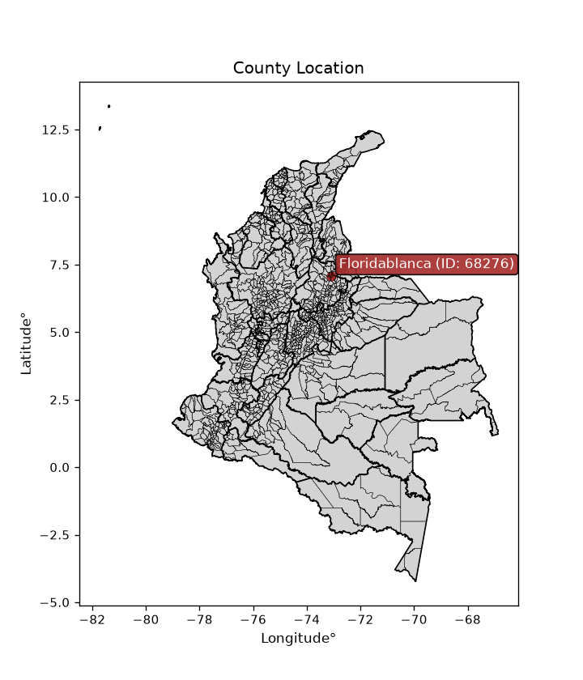
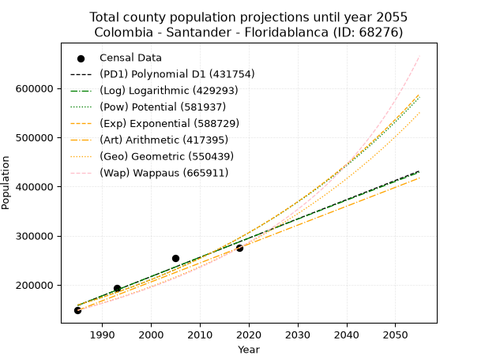
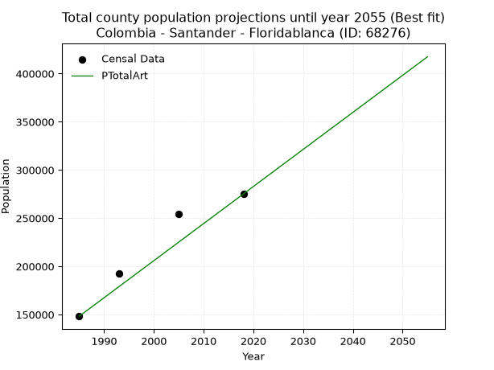
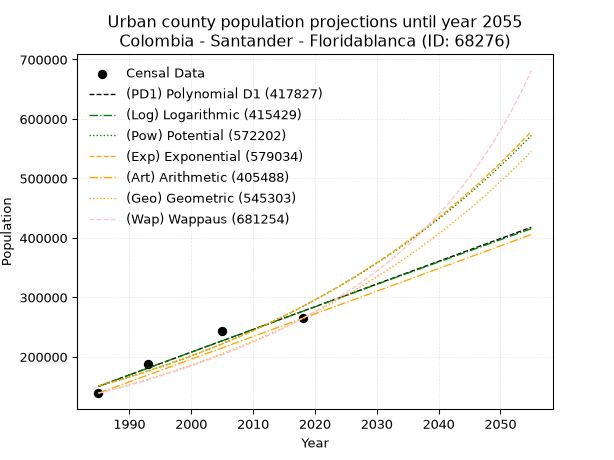
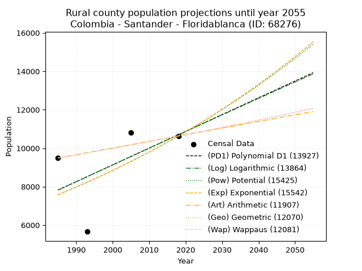
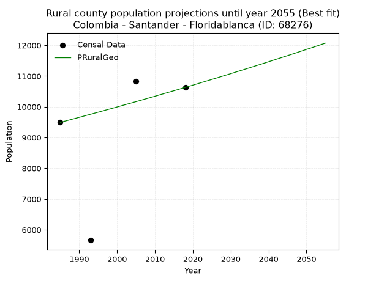

<div align="center">


</div>

# _“Population and Public Services Demand Projections (PPSD) until Year 2050 for Colombia - Santander - Floridablanca (ID: 68276)”_
Keywords: `population` `public-service` `projection` `lineal` `polynomial` `logarithmic` `potential` `exponential` `arithmetic` `geometric` `wappaus` `dane` `colombia` `south-america`

PPSD are analytical estimates used by governments and planners to anticipate future changes in population size, age distribution, and the resulting community needs for utilities, healthcare, education, and infrastructure as sizing future water treatment facilities, electrical grids, and road networks based on spatial growth.

> **General running parameters**: • app_version: _v20260806_. • Python version: _3.14.7_. • Pandas version: _3.0.5_. • NumPy version: _2.5.1_. • Creates, save and include plots into reports (create_plot): _False_. • Projection until year: _2050_. • Process polynomial degree 2 and up: _False_. • Process Wappaus: _True_. • Process Wappaus: _True_. • Set negative values to zero: _True_. • Set infinite values to zero: _True_. • Drop dataset notes: _True_. 
<div align="center">

Dynamic map: [:earth_americas:Google](http://maps.google.com/maps?q=7.072328735,-73.0991044) [:earth_americas:OSM](https://www.openstreetmap.org/#map=18/7.072328735/-73.0991044&layers=P) [:earth_americas:Bing](https://www.bing.com/maps?cp=7.072328735~-73.0991044&lvl=18) [:earth_americas:Apple](https://maps.apple.com/frame?center=7.072328735%2C-73.0991044&span=0.003%2C0.006)

</div>


<div align="center">

```geojson
{
  "type": "Feature",
  "geometry": {
    "type": "Point", 
    "coordinates": [-73.0991044, 7.072328735]
  }, 
  "properties": {
    "Name": "Colombia - Santander - Floridablanca (ID: 68276)"
  }
}
```

</div>


<div align="center">

</img>

</div>


## 0. Census Data (4 records)

Census data are official statistics collected by a government about the people and housing in a country. They usually include counts of total population, age, sex, race, income, education, and jobs.

📅Global census file: [Population.xlsx](../data/Population.xlsx)

| Source   |   Year |   CountryID | CountryName   |   StateID | StateName   |   CountyID | CountyName    |   PTotal |   PUrban |   PRural |
|:---------|-------:|------------:|:--------------|----------:|:------------|-----------:|:--------------|---------:|---------:|---------:|
| DANE     |   1985 |          57 | Colombia      |        68 | Santander   |      68276 | Floridablanca |   148205 |   138712 |     9493 |
| DANE     |   1993 |          57 | Colombia      |        68 | Santander   |      68276 | Floridablanca |   192856 |   187197 |     5659 |
| DANE     |   2005 |          57 | Colombia      |        68 | Santander   |      68276 | Floridablanca |   254683 |   243859 |    10824 |
| DANE     |   2018 |          57 | Colombia      |        68 | Santander   |      68276 | Floridablanca |   275109 |   264478 |    10631 |

> 🔥Some records could had specific notes about the registered values or the corresponding urban or rural distribution.

📅   [RUPS](https://www.datos.gov.co/Hacienda-y-Cr-dito-P-blico/Registro-nico-de-Prestadores-de-Servicios-P-blicos/4qkq-csdn/about_data) - Local public utility companies: [RUPS.csv](../data/RUPS.xlsx)

 | SERVICIO       | ESTADO    | NOMBRE                                                     | NIT         | DEPARTAMENTO_DOMICILIO   | MUNICIPIO_DOMICILIO   | DIRECCION                                                   |   TELEFONO | EMAIL                        | TIPO_PRESTADOR                             | CLASIFICACION                  |
|:---------------|:----------|:-----------------------------------------------------------|:------------|:-------------------------|:----------------------|:------------------------------------------------------------|-----------:|:-----------------------------|:-------------------------------------------|:-------------------------------|
| ACUEDUCTO      | OPERATIVA | ACUEDUCTO METROPOLITANO DE BUCARAMANGA S. A. E.S.P.        | 890200162-2 | SANTANDER                | BUCARAMANGA           | DIAGONAL 32 No. 30A - 51 PARQUE DEL AGUA                    |    6320220 | contabilidad.jefe@amb.com.co | SOCIEDADES (EMPRESA DE SERVICIOS PUBLICOS) | MAYOR O IGUAL A 5001 USUARIOS  |
| ACUEDUCTO      | OPERATIVA | RUITOQUE S.A. E.S.P.                                       | 804001062-8 | SANTANDER                | FLORIDABLANCA         | CALLE 31A # 26-15 OFICINA 705 CENTRO EMPRESARIAL LA FLORIDA |    6185871 | msereno@ruitoqueesp.com      | SOCIEDADES (EMPRESA DE SERVICIOS PUBLICOS) | DESDE 2501 HASTA 5000 USUARIOS |
| ALCANTARILLADO | OPERATIVA | RUITOQUE S.A. E.S.P.                                       | 804001062-8 | SANTANDER                | FLORIDABLANCA         | CALLE 31A # 26-15 OFICINA 705 CENTRO EMPRESARIAL LA FLORIDA |    6185871 | msereno@ruitoqueesp.com      | SOCIEDADES (EMPRESA DE SERVICIOS PUBLICOS) | MENOR O IGUAL A 2500 USUARIOS  |
| ALCANTARILLADO | OPERATIVA | EMPRESA PUBLICA DE ALCANTARILLADO DE SANTANDER S.A. E.S.P. | 900115931-1 | SANTANDER                | BUCARAMANGA           | Calle 24 # 23-68                                            |    6059370 | felix.herrera@empas.gov.co   | SOCIEDADES (EMPRESA DE SERVICIOS PUBLICOS) | MAYOR O IGUAL A 5001 USUARIOS  |
| ACUEDUCTO      | OPERATIVA | ENERGIA & AGUA SAS ESP                                     | 900483036-1 | SANTANDER                | FLORIDABLANCA         | Calle 31 A #26-15 Oficina 705 Centro Empresarial La Florida |    6185871 | escribanos@ruitoqueesp.com   | SOCIEDADES (EMPRESA DE SERVICIOS PUBLICOS) | MENOR O IGUAL A 2500 USUARIOS  |

## 1. Total

### 1.1. Coefficients and Parameters

* (PD1) Polynomial Deg 1: 3909.4287434764983, -7602121.594138867 (lineal)
* (Log) Logarithmic: 7829592.500843918, -59295082.09133125
* (Pow) Potential: 37.446822792594816, -118.28940170775964
* (Exp) Exponential: 0.01869470239158354, 1.2171896784011253e-11
* (Art) Arithmetic: Year diff. 2018 - 1985 = 33, Population diff. 275109 - 148205 = 126904, Annual growth = 3845.5757575757575
* (Geo) Geometric: Year diff. 2018 - 1985 = 33, Population diff. 275109 - 148205 = 126904, Annual growth % = 0.01892135606984846
* (Wap) Wappaus: i = 1.8168904206219296, Condition values only valid for < 200)

<sub>
Wappaus condition values: ['0.00', '1.82', '3.63', '5.45', '7.27', '9.08', '10.90', '12.72', '14.54', '16.35', '18.17', '19.99', '21.80', '23.62', '25.44', '27.25', '29.07', '30.89', '32.70', '34.52', '36.34', '38.15', '39.97', '41.79', '43.61', '45.42', '47.24', '49.06', '50.87', '52.69', '54.51', '56.32', '58.14', '59.96', '61.77', '63.59', '65.41', '67.22', '69.04', '70.86', '72.68', '74.49', '76.31', '78.13', '79.94', '81.76', '83.58', '85.39', '87.21', '89.03', '90.84', '92.66', '94.48', '96.30', '98.11', '99.93', '101.75', '103.56', '105.38', '107.20', '109.01', '110.83', '112.65', '114.46', '116.28', '118.10']
</sub>


### 1.2. Projected Dataset

|   Year |   CountyID |   PTotalPD1 |   PTotalLog |   PTotalPow |   PTotalExp |   PTotalArt |   PTotalGeo |   PTotalWap |
|-------:|-----------:|------------:|------------:|------------:|------------:|------------:|------------:|------------:|
|   1985 |      68276 |      158094 |      157944 |      158947 |      159069 |      148205 |      148205 |      148205 |
|   1986 |      68276 |      162004 |      161887 |      161973 |      162071 |      152051 |      151009 |      150922 |
|   1987 |      68276 |      165913 |      165828 |      165055 |      165129 |      155896 |      153867 |      153690 |
|   1988 |      68276 |      169823 |      169768 |      168195 |      168245 |      159742 |      156778 |      156509 |
|   1989 |      68276 |      173732 |      173705 |      171392 |      171420 |      163587 |      159744 |      159382 |
|   1990 |      68276 |      177642 |      177641 |      174649 |      174655 |      167433 |      162767 |      162309 |
|   1991 |      68276 |      181551 |      181574 |      177965 |      177951 |      171278 |      165847 |      165293 |
|   1992 |      68276 |      185460 |      185506 |      181343 |      181309 |      175124 |      168985 |      168334 |
|   1993 |      68276 |      189370 |      189435 |      184784 |      184730 |      178970 |      172182 |      171435 |
|   1994 |      68276 |      193279 |      193363 |      188287 |      188216 |      182815 |      175440 |      174597 |
|   1995 |      68276 |      197189 |      197288 |      191856 |      191768 |      186661 |      178760 |      177823 |
|   1996 |      68276 |      201098 |      201212 |      195490 |      195386 |      190506 |      182142 |      181113 |
|   1997 |      68276 |      205008 |      205134 |      199192 |      199073 |      194352 |      185588 |      184471 |
|   1998 |      68276 |      208917 |      209053 |      202961 |      202830 |      198197 |      189100 |      187898 |
|   1999 |      68276 |      212826 |      212971 |      206800 |      206658 |      202043 |      192678 |      191396 |
|   2000 |      68276 |      216736 |      216887 |      210709 |      210557 |      205889 |      196324 |      194968 |
|   2001 |      68276 |      220645 |      220801 |      214691 |      214531 |      209734 |      200038 |      198616 |
|   2002 |      68276 |      224555 |      224712 |      218745 |      218579 |      213580 |      203823 |      202342 |
|   2003 |      68276 |      228464 |      228622 |      222874 |      222704 |      217425 |      207680 |      206149 |
|   2004 |      68276 |      232374 |      232530 |      227079 |      226906 |      221271 |      211610 |      210040 |
|   2005 |      68276 |      236283 |      236436 |      231361 |      231188 |      225117 |      215614 |      214017 |
|   2006 |      68276 |      240192 |      240340 |      235722 |      235551 |      228962 |      219693 |      218083 |
|   2007 |      68276 |      244102 |      244243 |      240162 |      239996 |      232808 |      223850 |      222242 |
|   2008 |      68276 |      248011 |      248143 |      244684 |      244525 |      236653 |      228086 |      226496 |
|   2009 |      68276 |      251921 |      252041 |      249289 |      249139 |      240499 |      232401 |      230849 |
|   2010 |      68276 |      255830 |      255937 |      253978 |      253840 |      244344 |      236799 |      235304 |
|   2011 |      68276 |      259740 |      259832 |      258753 |      258630 |      248190 |      241279 |      239866 |
|   2012 |      68276 |      263649 |      263724 |      263615 |      263511 |      252036 |      245845 |      244537 |
|   2013 |      68276 |      267558 |      267614 |      268566 |      268483 |      255881 |      250496 |      249322 |
|   2014 |      68276 |      271468 |      271503 |      273607 |      273550 |      259727 |      255236 |      254225 |
|   2015 |      68276 |      275377 |      275390 |      278741 |      278712 |      263572 |      260066 |      259250 |
|   2016 |      68276 |      279287 |      279274 |      283968 |      283971 |      267418 |      264986 |      264403 |
|   2017 |      68276 |      283196 |      283157 |      289291 |      289330 |      271263 |      270000 |      269687 |
|   2018 |      68276 |      287106 |      287038 |      294710 |      294790 |      275109 |      275109 |      275109 |
|   2019 |      68276 |      291015 |      290917 |      300229 |      300353 |      278955 |      280314 |      280673 |
|   2020 |      68276 |      294924 |      294794 |      305848 |      306021 |      282800 |      285618 |      286386 |
|   2021 |      68276 |      298834 |      298669 |      311569 |      311795 |      286646 |      291023 |      292252 |
|   2022 |      68276 |      302743 |      302542 |      317394 |      317679 |      290491 |      296529 |      298279 |
|   2023 |      68276 |      306653 |      306413 |      323326 |      323674 |      294337 |      302140 |      304474 |
|   2024 |      68276 |      310562 |      310283 |      329365 |      329782 |      298182 |      307857 |      310843 |
|   2025 |      68276 |      314472 |      314150 |      335514 |      336005 |      302028 |      313682 |      317393 |
|   2026 |      68276 |      318381 |      318016 |      341774 |      342345 |      305874 |      319617 |      324133 |
|   2027 |      68276 |      322290 |      321879 |      348149 |      348806 |      309719 |      325665 |      331072 |
|   2028 |      68276 |      326200 |      325741 |      354638 |      355388 |      313565 |      331827 |      338217 |
|   2029 |      68276 |      330109 |      329601 |      361246 |      362094 |      317410 |      338105 |      345578 |
|   2030 |      68276 |      334019 |      333459 |      367973 |      368927 |      321256 |      344503 |      353165 |
|   2031 |      68276 |      337928 |      337315 |      374822 |      375889 |      325101 |      351021 |      360990 |
|   2032 |      68276 |      341838 |      341169 |      381796 |      382982 |      328947 |      357663 |      369062 |
|   2033 |      68276 |      345747 |      345021 |      388895 |      390209 |      332793 |      364431 |      377395 |
|   2034 |      68276 |      349656 |      348871 |      396123 |      397573 |      336638 |      371326 |      386000 |
|   2035 |      68276 |      353566 |      352720 |      403481 |      405075 |      340484 |      378352 |      394892 |
|   2036 |      68276 |      357475 |      356566 |      410973 |      412719 |      344329 |      385511 |      404085 |
|   2037 |      68276 |      361385 |      360411 |      418600 |      420507 |      348175 |      392805 |      413594 |
|   2038 |      68276 |      365294 |      364253 |      426364 |      428443 |      352021 |      400238 |      423437 |
|   2039 |      68276 |      369204 |      368094 |      434269 |      436528 |      355866 |      407811 |      433630 |
|   2040 |      68276 |      373113 |      371933 |      442316 |      444765 |      359712 |      415527 |      444194 |
|   2041 |      68276 |      377022 |      375770 |      450508 |      453158 |      363557 |      423390 |      455149 |
|   2042 |      68276 |      380932 |      379606 |      458848 |      461709 |      367403 |      431401 |      466516 |
|   2043 |      68276 |      384841 |      383439 |      467338 |      470422 |      371248 |      439563 |      478320 |
|   2044 |      68276 |      388751 |      387270 |      475981 |      479299 |      375094 |      447880 |      490586 |
|   2045 |      68276 |      392660 |      391100 |      484779 |      488344 |      378940 |      456355 |      503342 |
|   2046 |      68276 |      396570 |      394928 |      493736 |      497559 |      382785 |      464990 |      516617 |
|   2047 |      68276 |      400479 |      398754 |      502853 |      506948 |      386631 |      473788 |      530445 |
|   2048 |      68276 |      404388 |      402578 |      512135 |      516515 |      390476 |      482753 |      544861 |
|   2049 |      68276 |      408298 |      406400 |      521583 |      526262 |      394322 |      491887 |      559902 |
|   2050 |      68276 |      412207 |      410220 |      531200 |      536193 |      398167 |      501194 |      575610 |
<div align="center">

</img>

</div>


### 1.3. Best fit with absolute and relative error (%)

Relative error puts that difference into context by dividing the absolute error by the true value, creating a unitless ratio or percentage that shows the scale of the mistake.

Absolute and relative error

|   Year | Source   |   CountryID | CountryName   |   StateID | StateName   |   CountyID_x | CountyName    |   PTotal |   PUrban |   PRural |   CountyID_y |   PTotalPD1 |   PTotalLog |   PTotalPow |   PTotalExp |   PTotalArt |   PTotalGeo |   PTotalWap |   PTotalPD1AbsError |   PTotalLogAbsError |   PTotalPowAbsError |   PTotalExpAbsError |   PTotalArtAbsError |   PTotalGeoAbsError |   PTotalWapAbsError |   PTotalPD1RelError |   PTotalLogRelError |   PTotalPowRelError |   PTotalExpRelError |   PTotalArtRelError |   PTotalGeoRelError |   PTotalWapRelError |
|-------:|:---------|------------:|:--------------|----------:|:------------|-------------:|:--------------|---------:|---------:|---------:|-------------:|------------:|------------:|------------:|------------:|------------:|------------:|------------:|--------------------:|--------------------:|--------------------:|--------------------:|--------------------:|--------------------:|--------------------:|--------------------:|--------------------:|--------------------:|--------------------:|--------------------:|--------------------:|--------------------:|
|   1985 | DANE     |          57 | Colombia      |        68 | Santander   |        68276 | Floridablanca |   148205 |   138712 |     9493 |        68276 |      158094 |      157944 |      158947 |      159069 |      148205 |      148205 |      148205 |                9889 |                9739 |               10742 |               10864 |                   0 |                   0 |                   0 |             6.67251 |             6.5713  |             7.24807 |             7.33039 |             0       |              0      |              0      |
|   1993 | DANE     |          57 | Colombia      |        68 | Santander   |        68276 | Floridablanca |   192856 |   187197 |     5659 |        68276 |      189370 |      189435 |      184784 |      184730 |      178970 |      172182 |      171435 |                3486 |                3421 |                8072 |                8126 |               13886 |               20674 |               21421 |             1.80757 |             1.77386 |             4.18551 |             4.21351 |             7.20019 |             10.7199 |             11.1073 |
|   2005 | DANE     |          57 | Colombia      |        68 | Santander   |        68276 | Floridablanca |   254683 |   243859 |    10824 |        68276 |      236283 |      236436 |      231361 |      231188 |      225117 |      215614 |      214017 |               18400 |               18247 |               23322 |               23495 |               29566 |               39069 |               40666 |             7.22467 |             7.16459 |             9.15727 |             9.22519 |            11.6089  |             15.3402 |             15.9673 |
|   2018 | DANE     |          57 | Colombia      |        68 | Santander   |        68276 | Floridablanca |   275109 |   264478 |    10631 |        68276 |      287106 |      287038 |      294710 |      294790 |      275109 |      275109 |      275109 |               11997 |               11929 |               19601 |               19681 |                   0 |                   0 |                   0 |             4.36082 |             4.3361  |             7.12481 |             7.15389 |             0       |              0      |              0      |

Relative error mean

| Method    |   RelError | Best   |
|:----------|-----------:|:-------|
| PTotalPD1 |    5.01639 |        |
| PTotalLog |    4.96146 |        |
| PTotalPow |    6.92891 |        |
| PTotalExp |    6.98074 |        |
| PTotalArt |    4.70228 | True   |
| PTotalGeo |    6.51504 |        |
| PTotalWap |    6.76864 |        |

💙Best method: _**PTotalArt**_
<div align="center">

</img>

</div>


### 1.4. Fresh water supply demand in liters per capita per day (lpcd)

The fresh water supply demand typically ranges from 100 to 300 liters per capita per day (lpcd) for standard domestic and municipal planning, though absolute survival minimums set by the World Health Organization are as low as 7.5 to 20 liters per day, and total consumption in high-income nations can exceed 400 liters.

> `CZ`: Level in meters above the sea level (masl)<br> `WS`: Fresh water supply demand in liters per capita per day (lpcd or l/h/d)<br> `WSAll`: Zonal fresh water supply demand in liters per second (l/s)<br> `A`: Zonal area in square meters<br> `DP`: Population density (people/hectare or p/ha)

Reference values (RAS Colombia)

|    CZ |   WS |
|------:|-----:|
|  1000 |  120 |
|  2000 |  130 |
| 99999 |  140 |

County shapefile geometry properties and water supply values

|   CountyID |      ATotal |   CZTotal |   WSTotal |
|-----------:|------------:|----------:|----------:|
|      68276 | 9.99334e+07 |   1445.42 |       130 |

Projected values for best method: PTotalArt

|   CountyID |   Year |   PTotalArt |   DPTotal |   WSTotal |   WSTotalAll |
|-----------:|-------:|------------:|----------:|----------:|-------------:|
|      68276 |   1985 |      148205 |     14.83 |       130 |      222.994 |
|      68276 |   1986 |      152051 |     15.22 |       130 |      228.78  |
|      68276 |   1987 |      155896 |     15.6  |       130 |      234.566 |
|      68276 |   1988 |      159742 |     15.98 |       130 |      240.353 |
|      68276 |   1989 |      163587 |     16.37 |       130 |      246.138 |
|      68276 |   1990 |      167433 |     16.75 |       130 |      251.925 |
|      68276 |   1991 |      171278 |     17.14 |       130 |      257.71  |
|      68276 |   1992 |      175124 |     17.52 |       130 |      263.497 |
|      68276 |   1993 |      178970 |     17.91 |       130 |      269.284 |
|      68276 |   1994 |      182815 |     18.29 |       130 |      275.069 |
|      68276 |   1995 |      186661 |     18.68 |       130 |      280.856 |
|      68276 |   1996 |      190506 |     19.06 |       130 |      286.641 |
|      68276 |   1997 |      194352 |     19.45 |       130 |      292.428 |
|      68276 |   1998 |      198197 |     19.83 |       130 |      298.213 |
|      68276 |   1999 |      202043 |     20.22 |       130 |      304     |
|      68276 |   2000 |      205889 |     20.6  |       130 |      309.787 |
|      68276 |   2001 |      209734 |     20.99 |       130 |      315.572 |
|      68276 |   2002 |      213580 |     21.37 |       130 |      321.359 |
|      68276 |   2003 |      217425 |     21.76 |       130 |      327.144 |
|      68276 |   2004 |      221271 |     22.14 |       130 |      332.931 |
|      68276 |   2005 |      225117 |     22.53 |       130 |      338.718 |
|      68276 |   2006 |      228962 |     22.91 |       130 |      344.503 |
|      68276 |   2007 |      232808 |     23.3  |       130 |      350.29  |
|      68276 |   2008 |      236653 |     23.68 |       130 |      356.075 |
|      68276 |   2009 |      240499 |     24.07 |       130 |      361.862 |
|      68276 |   2010 |      244344 |     24.45 |       130 |      367.647 |
|      68276 |   2011 |      248190 |     24.84 |       130 |      373.434 |
|      68276 |   2012 |      252036 |     25.22 |       130 |      379.221 |
|      68276 |   2013 |      255881 |     25.61 |       130 |      385.006 |
|      68276 |   2014 |      259727 |     25.99 |       130 |      390.793 |
|      68276 |   2015 |      263572 |     26.37 |       130 |      396.578 |
|      68276 |   2016 |      267418 |     26.76 |       130 |      402.365 |
|      68276 |   2017 |      271263 |     27.14 |       130 |      408.15  |
|      68276 |   2018 |      275109 |     27.53 |       130 |      413.937 |
|      68276 |   2019 |      278955 |     27.91 |       130 |      419.724 |
|      68276 |   2020 |      282800 |     28.3  |       130 |      425.509 |
|      68276 |   2021 |      286646 |     28.68 |       130 |      431.296 |
|      68276 |   2022 |      290491 |     29.07 |       130 |      437.081 |
|      68276 |   2023 |      294337 |     29.45 |       130 |      442.868 |
|      68276 |   2024 |      298182 |     29.84 |       130 |      448.653 |
|      68276 |   2025 |      302028 |     30.22 |       130 |      454.44  |
|      68276 |   2026 |      305874 |     30.61 |       130 |      460.227 |
|      68276 |   2027 |      309719 |     30.99 |       130 |      466.012 |
|      68276 |   2028 |      313565 |     31.38 |       130 |      471.799 |
|      68276 |   2029 |      317410 |     31.76 |       130 |      477.584 |
|      68276 |   2030 |      321256 |     32.15 |       130 |      483.371 |
|      68276 |   2031 |      325101 |     32.53 |       130 |      489.157 |
|      68276 |   2032 |      328947 |     32.92 |       130 |      494.943 |
|      68276 |   2033 |      332793 |     33.3  |       130 |      500.73  |
|      68276 |   2034 |      336638 |     33.69 |       130 |      506.516 |
|      68276 |   2035 |      340484 |     34.07 |       130 |      512.302 |
|      68276 |   2036 |      344329 |     34.46 |       130 |      518.088 |
|      68276 |   2037 |      348175 |     34.84 |       130 |      523.874 |
|      68276 |   2038 |      352021 |     35.23 |       130 |      529.661 |
|      68276 |   2039 |      355866 |     35.61 |       130 |      535.447 |
|      68276 |   2040 |      359712 |     36    |       130 |      541.233 |
|      68276 |   2041 |      363557 |     36.38 |       130 |      547.019 |
|      68276 |   2042 |      367403 |     36.76 |       130 |      552.805 |
|      68276 |   2043 |      371248 |     37.15 |       130 |      558.591 |
|      68276 |   2044 |      375094 |     37.53 |       130 |      564.378 |
|      68276 |   2045 |      378940 |     37.92 |       130 |      570.164 |
|      68276 |   2046 |      382785 |     38.3  |       130 |      575.95  |
|      68276 |   2047 |      386631 |     38.69 |       130 |      581.736 |
|      68276 |   2048 |      390476 |     39.07 |       130 |      587.522 |
|      68276 |   2049 |      394322 |     39.46 |       130 |      593.309 |
|      68276 |   2050 |      398167 |     39.84 |       130 |      599.094 |

## 2. Urban

### 2.1. Coefficients and Parameters

* (PD1) Polynomial Deg 1: 3822.2055399437813, -7436805.131272549 (lineal)
* (Log) Logarithmic: 7655203.082804111, -57978698.4773416
* (Pow) Potential: 38.47687654259238, -121.70910212962296
* (Exp) Exponential: 0.01920793327482643, 4.169663229258226e-12
* (Art) Arithmetic: Year diff. 2018 - 1985 = 33, Population diff. 264478 - 138712 = 125766, Annual growth = 3811.090909090909
* (Geo) Geometric: Year diff. 2018 - 1985 = 33, Population diff. 264478 - 138712 = 125766, Annual growth % = 0.019748787322697137
* (Wap) Wappaus: i = 1.8904689645531432, Condition values only valid for < 200)

<sub>
Wappaus condition values: ['0.00', '1.89', '3.78', '5.67', '7.56', '9.45', '11.34', '13.23', '15.12', '17.01', '18.90', '20.80', '22.69', '24.58', '26.47', '28.36', '30.25', '32.14', '34.03', '35.92', '37.81', '39.70', '41.59', '43.48', '45.37', '47.26', '49.15', '51.04', '52.93', '54.82', '56.71', '58.60', '60.50', '62.39', '64.28', '66.17', '68.06', '69.95', '71.84', '73.73', '75.62', '77.51', '79.40', '81.29', '83.18', '85.07', '86.96', '88.85', '90.74', '92.63', '94.52', '96.41', '98.30', '100.19', '102.09', '103.98', '105.87', '107.76', '109.65', '111.54', '113.43', '115.32', '117.21', '119.10', '120.99', '122.88']
</sub>


### 2.2. Projected Dataset

|   Year |   CountyID |   PUrbanPD1 |   PUrbanLog |   PUrbanPow |   PUrbanExp |   PUrbanArt |   PUrbanGeo |   PUrbanWap |
|-------:|-----------:|------------:|------------:|------------:|------------:|------------:|------------:|------------:|
|   1985 |      68276 |      150273 |      150123 |      150807 |      150929 |      138712 |      138712 |      138712 |
|   1986 |      68276 |      154095 |      153979 |      153758 |      153856 |      142523 |      141451 |      141359 |
|   1987 |      68276 |      157917 |      157832 |      156765 |      156839 |      146334 |      144245 |      144058 |
|   1988 |      68276 |      161739 |      161684 |      159830 |      159881 |      150145 |      147094 |      146809 |
|   1989 |      68276 |      165562 |      165534 |      162953 |      162982 |      153956 |      149998 |      149613 |
|   1990 |      68276 |      169384 |      169381 |      166135 |      166143 |      157767 |      152961 |      152474 |
|   1991 |      68276 |      173206 |      173227 |      169377 |      169365 |      161579 |      155982 |      155392 |
|   1992 |      68276 |      177028 |      177071 |      172682 |      172649 |      165390 |      159062 |      158369 |
|   1993 |      68276 |      180851 |      180913 |      176049 |      175998 |      169201 |      162203 |      161407 |
|   1994 |      68276 |      184673 |      184753 |      179480 |      179411 |      173012 |      165407 |      164507 |
|   1995 |      68276 |      188495 |      188591 |      182976 |      182890 |      176823 |      168673 |      167673 |
|   1996 |      68276 |      192317 |      192428 |      186538 |      186437 |      180634 |      172004 |      170905 |
|   1997 |      68276 |      196139 |      196262 |      190168 |      190053 |      184445 |      175401 |      174206 |
|   1998 |      68276 |      199962 |      200094 |      193867 |      193739 |      188256 |      178865 |      177578 |
|   1999 |      68276 |      203784 |      203925 |      197635 |      197496 |      192067 |      182397 |      181024 |
|   2000 |      68276 |      207606 |      207753 |      201475 |      201326 |      195878 |      186000 |      184545 |
|   2001 |      68276 |      211428 |      211580 |      205388 |      205230 |      199689 |      189673 |      188145 |
|   2002 |      68276 |      215250 |      215405 |      209374 |      209211 |      203501 |      193419 |      191826 |
|   2003 |      68276 |      219073 |      219228 |      213436 |      213268 |      207312 |      197238 |      195591 |
|   2004 |      68276 |      222895 |      223049 |      217575 |      217404 |      211123 |      201134 |      199443 |
|   2005 |      68276 |      226717 |      226868 |      221792 |      221620 |      214934 |      205106 |      203384 |
|   2006 |      68276 |      230539 |      230685 |      226088 |      225918 |      218745 |      209156 |      207419 |
|   2007 |      68276 |      234361 |      234500 |      230465 |      230300 |      222556 |      213287 |      211549 |
|   2008 |      68276 |      238184 |      238313 |      234925 |      234766 |      226367 |      217499 |      215780 |
|   2009 |      68276 |      242006 |      242125 |      239469 |      239319 |      230178 |      221795 |      220114 |
|   2010 |      68276 |      245828 |      245934 |      244098 |      243960 |      233989 |      226175 |      224555 |
|   2011 |      68276 |      249650 |      249742 |      248815 |      248691 |      237800 |      230641 |      229108 |
|   2012 |      68276 |      253472 |      253547 |      253620 |      253514 |      241611 |      235196 |      233776 |
|   2013 |      68276 |      257295 |      257351 |      258516 |      258431 |      245423 |      239841 |      238564 |
|   2014 |      68276 |      261117 |      261153 |      263503 |      263443 |      249234 |      244578 |      243477 |
|   2015 |      68276 |      264939 |      264953 |      268585 |      268552 |      253045 |      249408 |      248519 |
|   2016 |      68276 |      268761 |      268751 |      273761 |      273760 |      256856 |      254333 |      253697 |
|   2017 |      68276 |      272583 |      272548 |      279035 |      279069 |      260667 |      259356 |      259014 |
|   2018 |      68276 |      276406 |      276342 |      284408 |      284482 |      264478 |      264478 |      264478 |
|   2019 |      68276 |      280228 |      280135 |      289881 |      289999 |      268289 |      269701 |      270094 |
|   2020 |      68276 |      284050 |      283925 |      295457 |      295623 |      272100 |      275027 |      275869 |
|   2021 |      68276 |      287872 |      287714 |      301137 |      301356 |      275911 |      280459 |      281809 |
|   2022 |      68276 |      291694 |      291501 |      306924 |      307200 |      279722 |      285998 |      287921 |
|   2023 |      68276 |      295517 |      295286 |      312819 |      313158 |      283533 |      291646 |      294214 |
|   2024 |      68276 |      299339 |      299069 |      318824 |      319231 |      287345 |      297405 |      300696 |
|   2025 |      68276 |      303161 |      302850 |      324942 |      325422 |      291156 |      303279 |      307375 |
|   2026 |      68276 |      306983 |      306630 |      331173 |      331733 |      294967 |      309268 |      314259 |
|   2027 |      68276 |      310805 |      310407 |      337521 |      338167 |      298778 |      315376 |      321360 |
|   2028 |      68276 |      314628 |      314183 |      343988 |      344725 |      302589 |      321604 |      328687 |
|   2029 |      68276 |      318450 |      317957 |      350575 |      351411 |      306400 |      327955 |      336250 |
|   2030 |      68276 |      322272 |      321729 |      357285 |      358226 |      310211 |      334432 |      344063 |
|   2031 |      68276 |      326094 |      325499 |      364120 |      365173 |      314022 |      341037 |      352137 |
|   2032 |      68276 |      329917 |      329267 |      371082 |      372255 |      317833 |      347772 |      360486 |
|   2033 |      68276 |      333739 |      333034 |      378174 |      379474 |      321644 |      354640 |      369123 |
|   2034 |      68276 |      337561 |      336798 |      385397 |      386834 |      325455 |      361644 |      378065 |
|   2035 |      68276 |      341383 |      340561 |      392756 |      394336 |      329267 |      368786 |      387327 |
|   2036 |      68276 |      345205 |      344322 |      400250 |      401983 |      333078 |      376069 |      396928 |
|   2037 |      68276 |      349028 |      348081 |      407884 |      409779 |      336889 |      383496 |      406885 |
|   2038 |      68276 |      352850 |      351838 |      415660 |      417726 |      340700 |      391069 |      417219 |
|   2039 |      68276 |      356672 |      355593 |      423580 |      425828 |      344511 |      398792 |      427953 |
|   2040 |      68276 |      360494 |      359347 |      431647 |      434086 |      348322 |      406668 |      439109 |
|   2041 |      68276 |      364316 |      363098 |      439864 |      442505 |      352133 |      414699 |      450713 |
|   2042 |      68276 |      368139 |      366848 |      448233 |      451086 |      355944 |      422889 |      462793 |
|   2043 |      68276 |      371961 |      370596 |      456757 |      459834 |      359755 |      431240 |      475379 |
|   2044 |      68276 |      375783 |      374342 |      465439 |      468752 |      363566 |      439757 |      488502 |
|   2045 |      68276 |      379605 |      378086 |      474281 |      477843 |      367377 |      448442 |      502198 |
|   2046 |      68276 |      383427 |      381829 |      483287 |      487110 |      371189 |      457298 |      516506 |
|   2047 |      68276 |      387250 |      385569 |      492459 |      496557 |      375000 |      466329 |      531468 |
|   2048 |      68276 |      391072 |      389308 |      501801 |      506187 |      378811 |      475538 |      547128 |
|   2049 |      68276 |      394894 |      393045 |      511316 |      516004 |      382622 |      484930 |      563538 |
|   2050 |      68276 |      398716 |      396780 |      521006 |      526011 |      386433 |      494506 |      580753 |
<div align="center">

</img>

</div>


### 2.3. Best fit with absolute and relative error (%)

Relative error puts that difference into context by dividing the absolute error by the true value, creating a unitless ratio or percentage that shows the scale of the mistake.

Absolute and relative error

|   Year | Source   |   CountryID | CountryName   |   StateID | StateName   |   CountyID_x | CountyName    |   PTotal |   PUrban |   PRural |   CountyID_y |   PUrbanPD1 |   PUrbanLog |   PUrbanPow |   PUrbanExp |   PUrbanArt |   PUrbanGeo |   PUrbanWap |   PUrbanPD1AbsError |   PUrbanLogAbsError |   PUrbanPowAbsError |   PUrbanExpAbsError |   PUrbanArtAbsError |   PUrbanGeoAbsError |   PUrbanWapAbsError |   PUrbanPD1RelError |   PUrbanLogRelError |   PUrbanPowRelError |   PUrbanExpRelError |   PUrbanArtRelError |   PUrbanGeoRelError |   PUrbanWapRelError |
|-------:|:---------|------------:|:--------------|----------:|:------------|-------------:|:--------------|---------:|---------:|---------:|-------------:|------------:|------------:|------------:|------------:|------------:|------------:|------------:|--------------------:|--------------------:|--------------------:|--------------------:|--------------------:|--------------------:|--------------------:|--------------------:|--------------------:|--------------------:|--------------------:|--------------------:|--------------------:|--------------------:|
|   1985 | DANE     |          57 | Colombia      |        68 | Santander   |        68276 | Floridablanca |   148205 |   138712 |     9493 |        68276 |      150273 |      150123 |      150807 |      150929 |      138712 |      138712 |      138712 |               11561 |               11411 |               12095 |               12217 |                   0 |                   0 |                   0 |             8.33453 |             8.2264  |             8.71951 |             8.80746 |              0      |              0      |              0      |
|   1993 | DANE     |          57 | Colombia      |        68 | Santander   |        68276 | Floridablanca |   192856 |   187197 |     5659 |        68276 |      180851 |      180913 |      176049 |      175998 |      169201 |      162203 |      161407 |                6346 |                6284 |               11148 |               11199 |               17996 |               24994 |               25790 |             3.39001 |             3.35689 |             5.95522 |             5.98247 |              9.6134 |             13.3517 |             13.7769 |
|   2005 | DANE     |          57 | Colombia      |        68 | Santander   |        68276 | Floridablanca |   254683 |   243859 |    10824 |        68276 |      226717 |      226868 |      221792 |      221620 |      214934 |      205106 |      203384 |               17142 |               16991 |               22067 |               22239 |               28925 |               38753 |               40475 |             7.02947 |             6.96755 |             9.04908 |             9.11961 |             11.8614 |             15.8916 |             16.5977 |
|   2018 | DANE     |          57 | Colombia      |        68 | Santander   |        68276 | Floridablanca |   275109 |   264478 |    10631 |        68276 |      276406 |      276342 |      284408 |      284482 |      264478 |      264478 |      264478 |               11928 |               11864 |               19930 |               20004 |                   0 |                   0 |                   0 |             4.51002 |             4.48582 |             7.5356  |             7.56358 |              0      |              0      |              0      |

Relative error mean

| Method    |   RelError | Best   |
|:----------|-----------:|:-------|
| PUrbanPD1 |    5.81601 |        |
| PUrbanLog |    5.75916 |        |
| PUrbanPow |    7.81485 |        |
| PUrbanExp |    7.86828 |        |
| PUrbanArt |    5.36869 | True   |
| PUrbanGeo |    7.31082 |        |
| PUrbanWap |    7.59366 |        |

💙Best method: _**PUrbanArt**_
<div align="center">

</img>

</div>


### 2.4. Fresh water supply demand in liters per capita per day (lpcd)

The fresh water supply demand typically ranges from 100 to 300 liters per capita per day (lpcd) for standard domestic and municipal planning, though absolute survival minimums set by the World Health Organization are as low as 7.5 to 20 liters per day, and total consumption in high-income nations can exceed 400 liters.

> `CZ`: Level in meters above the sea level (masl)<br> `WS`: Fresh water supply demand in liters per capita per day (lpcd or l/h/d)<br> `WSAll`: Zonal fresh water supply demand in liters per second (l/s)<br> `A`: Zonal area in square meters<br> `DP`: Population density (people/hectare or p/ha)

Reference values (RAS Colombia)

|    CZ |   WS |
|------:|-----:|
|  1000 |  120 |
|  2000 |  130 |
| 99999 |  140 |

County shapefile geometry properties and water supply values

|   CountyID |      AUrban |   CZUrban |   WSUrban |
|-----------:|------------:|----------:|----------:|
|      68276 | 1.71238e+07 |   899.568 |       120 |

Projected values for best method: PUrbanArt

|   CountyID |   Year |   PUrbanArt |   DPUrban |   WSUrban |   WSUrbanAll |
|-----------:|-------:|------------:|----------:|----------:|-------------:|
|      68276 |   1985 |      138712 |     81.01 |       120 |      192.656 |
|      68276 |   1986 |      142523 |     83.23 |       120 |      197.949 |
|      68276 |   1987 |      146334 |     85.46 |       120 |      203.242 |
|      68276 |   1988 |      150145 |     87.68 |       120 |      208.535 |
|      68276 |   1989 |      153956 |     89.91 |       120 |      213.828 |
|      68276 |   1990 |      157767 |     92.13 |       120 |      219.121 |
|      68276 |   1991 |      161579 |     94.36 |       120 |      224.415 |
|      68276 |   1992 |      165390 |     96.59 |       120 |      229.708 |
|      68276 |   1993 |      169201 |     98.81 |       120 |      235.001 |
|      68276 |   1994 |      173012 |    101.04 |       120 |      240.294 |
|      68276 |   1995 |      176823 |    103.26 |       120 |      245.588 |
|      68276 |   1996 |      180634 |    105.49 |       120 |      250.881 |
|      68276 |   1997 |      184445 |    107.71 |       120 |      256.174 |
|      68276 |   1998 |      188256 |    109.94 |       120 |      261.467 |
|      68276 |   1999 |      192067 |    112.16 |       120 |      266.76  |
|      68276 |   2000 |      195878 |    114.39 |       120 |      272.053 |
|      68276 |   2001 |      199689 |    116.62 |       120 |      277.346 |
|      68276 |   2002 |      203501 |    118.84 |       120 |      282.64  |
|      68276 |   2003 |      207312 |    121.07 |       120 |      287.933 |
|      68276 |   2004 |      211123 |    123.29 |       120 |      293.226 |
|      68276 |   2005 |      214934 |    125.52 |       120 |      298.519 |
|      68276 |   2006 |      218745 |    127.74 |       120 |      303.812 |
|      68276 |   2007 |      222556 |    129.97 |       120 |      309.106 |
|      68276 |   2008 |      226367 |    132.19 |       120 |      314.399 |
|      68276 |   2009 |      230178 |    134.42 |       120 |      319.692 |
|      68276 |   2010 |      233989 |    136.65 |       120 |      324.985 |
|      68276 |   2011 |      237800 |    138.87 |       120 |      330.278 |
|      68276 |   2012 |      241611 |    141.1  |       120 |      335.571 |
|      68276 |   2013 |      245423 |    143.32 |       120 |      340.865 |
|      68276 |   2014 |      249234 |    145.55 |       120 |      346.158 |
|      68276 |   2015 |      253045 |    147.77 |       120 |      351.451 |
|      68276 |   2016 |      256856 |    150    |       120 |      356.744 |
|      68276 |   2017 |      260667 |    152.23 |       120 |      362.038 |
|      68276 |   2018 |      264478 |    154.45 |       120 |      367.331 |
|      68276 |   2019 |      268289 |    156.68 |       120 |      372.624 |
|      68276 |   2020 |      272100 |    158.9  |       120 |      377.917 |
|      68276 |   2021 |      275911 |    161.13 |       120 |      383.21  |
|      68276 |   2022 |      279722 |    163.35 |       120 |      388.503 |
|      68276 |   2023 |      283533 |    165.58 |       120 |      393.796 |
|      68276 |   2024 |      287345 |    167.8  |       120 |      399.09  |
|      68276 |   2025 |      291156 |    170.03 |       120 |      404.383 |
|      68276 |   2026 |      294967 |    172.26 |       120 |      409.676 |
|      68276 |   2027 |      298778 |    174.48 |       120 |      414.969 |
|      68276 |   2028 |      302589 |    176.71 |       120 |      420.262 |
|      68276 |   2029 |      306400 |    178.93 |       120 |      425.556 |
|      68276 |   2030 |      310211 |    181.16 |       120 |      430.849 |
|      68276 |   2031 |      314022 |    183.38 |       120 |      436.142 |
|      68276 |   2032 |      317833 |    185.61 |       120 |      441.435 |
|      68276 |   2033 |      321644 |    187.83 |       120 |      446.728 |
|      68276 |   2034 |      325455 |    190.06 |       120 |      452.021 |
|      68276 |   2035 |      329267 |    192.29 |       120 |      457.315 |
|      68276 |   2036 |      333078 |    194.51 |       120 |      462.608 |
|      68276 |   2037 |      336889 |    196.74 |       120 |      467.901 |
|      68276 |   2038 |      340700 |    198.96 |       120 |      473.194 |
|      68276 |   2039 |      344511 |    201.19 |       120 |      478.488 |
|      68276 |   2040 |      348322 |    203.41 |       120 |      483.781 |
|      68276 |   2041 |      352133 |    205.64 |       120 |      489.074 |
|      68276 |   2042 |      355944 |    207.87 |       120 |      494.367 |
|      68276 |   2043 |      359755 |    210.09 |       120 |      499.66  |
|      68276 |   2044 |      363566 |    212.32 |       120 |      504.953 |
|      68276 |   2045 |      367377 |    214.54 |       120 |      510.246 |
|      68276 |   2046 |      371189 |    216.77 |       120 |      515.54  |
|      68276 |   2047 |      375000 |    218.99 |       120 |      520.833 |
|      68276 |   2048 |      378811 |    221.22 |       120 |      526.126 |
|      68276 |   2049 |      382622 |    223.45 |       120 |      531.419 |
|      68276 |   2050 |      386433 |    225.67 |       120 |      536.712 |

## 3. Rural

### 3.1. Coefficients and Parameters

* (PD1) Polynomial Deg 1: 87.22320353271766, -165316.4628663185 (lineal)
* (Log) Logarithmic: 174389.41803980357, -1316383.6139896393
* (Pow) Potential: 20.488306706770878, -63.685677944992975
* (Exp) Exponential: 0.010250309094231183, 1.1049891180748853e-05
* (Art) Arithmetic: Year diff. 2018 - 1985 = 33, Population diff. 10631 - 9493 = 1138, Annual growth = 34.484848484848484
* (Geo) Geometric: Year diff. 2018 - 1985 = 33, Population diff. 10631 - 9493 = 1138, Annual growth % = 0.003436788515958966
* (Wap) Wappaus: i = 0.342723598537552, Condition values only valid for < 200)

<sub>
Wappaus condition values: ['0.00', '0.34', '0.69', '1.03', '1.37', '1.71', '2.06', '2.40', '2.74', '3.08', '3.43', '3.77', '4.11', '4.46', '4.80', '5.14', '5.48', '5.83', '6.17', '6.51', '6.85', '7.20', '7.54', '7.88', '8.23', '8.57', '8.91', '9.25', '9.60', '9.94', '10.28', '10.62', '10.97', '11.31', '11.65', '12.00', '12.34', '12.68', '13.02', '13.37', '13.71', '14.05', '14.39', '14.74', '15.08', '15.42', '15.77', '16.11', '16.45', '16.79', '17.14', '17.48', '17.82', '18.16', '18.51', '18.85', '19.19', '19.54', '19.88', '20.22', '20.56', '20.91', '21.25', '21.59', '21.93', '22.28']
</sub>


### 3.2. Projected Dataset

|   Year |   CountyID |   PRuralPD1 |   PRuralLog |   PRuralPow |   PRuralExp |   PRuralArt |   PRuralGeo |   PRuralWap |
|-------:|-----------:|------------:|------------:|------------:|------------:|------------:|------------:|------------:|
|   1985 |      68276 |        7822 |        7820 |        7583 |        7584 |        9493 |        9493 |        9493 |
|   1986 |      68276 |        7909 |        7908 |        7662 |        7662 |        9527 |        9526 |        9526 |
|   1987 |      68276 |        7996 |        7996 |        7741 |        7741 |        9562 |        9558 |        9558 |
|   1988 |      68276 |        8083 |        8084 |        7821 |        7821 |        9596 |        9591 |        9591 |
|   1989 |      68276 |        8170 |        8172 |        7902 |        7901 |        9631 |        9624 |        9624 |
|   1990 |      68276 |        8258 |        8259 |        7984 |        7983 |        9665 |        9657 |        9657 |
|   1991 |      68276 |        8345 |        8347 |        8067 |        8065 |        9700 |        9690 |        9690 |
|   1992 |      68276 |        8432 |        8434 |        8150 |        8148 |        9734 |        9724 |        9724 |
|   1993 |      68276 |        8519 |        8522 |        8235 |        8232 |        9769 |        9757 |        9757 |
|   1994 |      68276 |        8607 |        8609 |        8320 |        8317 |        9803 |        9791 |        9790 |
|   1995 |      68276 |        8694 |        8697 |        8406 |        8402 |        9838 |        9824 |        9824 |
|   1996 |      68276 |        8781 |        8784 |        8492 |        8489 |        9872 |        9858 |        9858 |
|   1997 |      68276 |        8868 |        8872 |        8580 |        8576 |        9907 |        9892 |        9892 |
|   1998 |      68276 |        8955 |        8959 |        8668 |        8665 |        9941 |        9926 |        9926 |
|   1999 |      68276 |        9043 |        9046 |        8758 |        8754 |        9976 |        9960 |        9960 |
|   2000 |      68276 |        9130 |        9133 |        8848 |        8844 |       10010 |        9994 |        9994 |
|   2001 |      68276 |        9217 |        9221 |        8939 |        8935 |       10045 |       10029 |       10028 |
|   2002 |      68276 |        9304 |        9308 |        9031 |        9027 |       10079 |       10063 |       10063 |
|   2003 |      68276 |        9392 |        9395 |        9124 |        9120 |       10114 |       10098 |       10097 |
|   2004 |      68276 |        9479 |        9482 |        9218 |        9214 |       10148 |       10132 |       10132 |
|   2005 |      68276 |        9566 |        9569 |        9312 |        9309 |       10183 |       10167 |       10167 |
|   2006 |      68276 |        9653 |        9656 |        9408 |        9405 |       10217 |       10202 |       10202 |
|   2007 |      68276 |        9741 |        9743 |        9504 |        9502 |       10252 |       10237 |       10237 |
|   2008 |      68276 |        9828 |        9830 |        9602 |        9600 |       10286 |       10272 |       10272 |
|   2009 |      68276 |        9915 |        9916 |        9700 |        9699 |       10321 |       10308 |       10307 |
|   2010 |      68276 |       10002 |       10003 |        9800 |        9799 |       10355 |       10343 |       10343 |
|   2011 |      68276 |       10089 |       10090 |        9900 |        9900 |       10390 |       10379 |       10378 |
|   2012 |      68276 |       10177 |       10177 |       10002 |       10002 |       10424 |       10414 |       10414 |
|   2013 |      68276 |       10264 |       10263 |       10104 |       10105 |       10459 |       10450 |       10450 |
|   2014 |      68276 |       10351 |       10350 |       10207 |       10209 |       10493 |       10486 |       10486 |
|   2015 |      68276 |       10438 |       10436 |       10312 |       10314 |       10528 |       10522 |       10522 |
|   2016 |      68276 |       10526 |       10523 |       10417 |       10421 |       10562 |       10558 |       10558 |
|   2017 |      68276 |       10613 |       10609 |       10523 |       10528 |       10597 |       10595 |       10595 |
|   2018 |      68276 |       10700 |       10696 |       10631 |       10636 |       10631 |       10631 |       10631 |
|   2019 |      68276 |       10787 |       10782 |       10739 |       10746 |       10665 |       10668 |       10668 |
|   2020 |      68276 |       10874 |       10869 |       10849 |       10857 |       10700 |       10704 |       10704 |
|   2021 |      68276 |       10962 |       10955 |       10959 |       10969 |       10734 |       10741 |       10741 |
|   2022 |      68276 |       11049 |       11041 |       11071 |       11082 |       10769 |       10778 |       10778 |
|   2023 |      68276 |       11136 |       11127 |       11184 |       11196 |       10803 |       10815 |       10815 |
|   2024 |      68276 |       11223 |       11214 |       11297 |       11311 |       10838 |       10852 |       10853 |
|   2025 |      68276 |       11311 |       11300 |       11412 |       11428 |       10872 |       10889 |       10890 |
|   2026 |      68276 |       11398 |       11386 |       11528 |       11545 |       10907 |       10927 |       10928 |
|   2027 |      68276 |       11485 |       11472 |       11645 |       11664 |       10941 |       10964 |       10965 |
|   2028 |      68276 |       11572 |       11558 |       11764 |       11784 |       10976 |       11002 |       11003 |
|   2029 |      68276 |       11659 |       11644 |       11883 |       11906 |       11010 |       11040 |       11041 |
|   2030 |      68276 |       11747 |       11730 |       12004 |       12029 |       11045 |       11078 |       11079 |
|   2031 |      68276 |       11834 |       11816 |       12125 |       12152 |       11079 |       11116 |       11118 |
|   2032 |      68276 |       11921 |       11901 |       12248 |       12278 |       11114 |       11154 |       11156 |
|   2033 |      68276 |       12008 |       11987 |       12372 |       12404 |       11148 |       11192 |       11195 |
|   2034 |      68276 |       12096 |       12073 |       12498 |       12532 |       11183 |       11231 |       11233 |
|   2035 |      68276 |       12183 |       12159 |       12624 |       12661 |       11217 |       11269 |       11272 |
|   2036 |      68276 |       12270 |       12244 |       12752 |       12792 |       11252 |       11308 |       11311 |
|   2037 |      68276 |       12357 |       12330 |       12881 |       12923 |       11286 |       11347 |       11350 |
|   2038 |      68276 |       12444 |       12416 |       13011 |       13056 |       11321 |       11386 |       11390 |
|   2039 |      68276 |       12532 |       12501 |       13142 |       13191 |       11355 |       11425 |       11429 |
|   2040 |      68276 |       12619 |       12587 |       13275 |       13327 |       11390 |       11464 |       11469 |
|   2041 |      68276 |       12706 |       12672 |       13409 |       13464 |       11424 |       11504 |       11508 |
|   2042 |      68276 |       12793 |       12758 |       13544 |       13603 |       11459 |       11543 |       11548 |
|   2043 |      68276 |       12881 |       12843 |       13681 |       13743 |       11493 |       11583 |       11588 |
|   2044 |      68276 |       12968 |       12928 |       13819 |       13885 |       11528 |       11623 |       11628 |
|   2045 |      68276 |       13055 |       13014 |       13958 |       14028 |       11562 |       11663 |       11669 |
|   2046 |      68276 |       13142 |       13099 |       14098 |       14172 |       11597 |       11703 |       11709 |
|   2047 |      68276 |       13229 |       13184 |       14240 |       14318 |       11631 |       11743 |       11750 |
|   2048 |      68276 |       13317 |       13269 |       14384 |       14466 |       11666 |       11784 |       11791 |
|   2049 |      68276 |       13404 |       13354 |       14528 |       14615 |       11700 |       11824 |       11832 |
|   2050 |      68276 |       13491 |       13439 |       14674 |       14765 |       11735 |       11865 |       11873 |
<div align="center">

</img>

</div>


### 3.3. Best fit with absolute and relative error (%)

Relative error puts that difference into context by dividing the absolute error by the true value, creating a unitless ratio or percentage that shows the scale of the mistake.

Absolute and relative error

|   Year | Source   |   CountryID | CountryName   |   StateID | StateName   |   CountyID_x | CountyName    |   PTotal |   PUrban |   PRural |   CountyID_y |   PRuralPD1 |   PRuralLog |   PRuralPow |   PRuralExp |   PRuralArt |   PRuralGeo |   PRuralWap |   PRuralPD1AbsError |   PRuralLogAbsError |   PRuralPowAbsError |   PRuralExpAbsError |   PRuralArtAbsError |   PRuralGeoAbsError |   PRuralWapAbsError |   PRuralPD1RelError |   PRuralLogRelError |   PRuralPowRelError |   PRuralExpRelError |   PRuralArtRelError |   PRuralGeoRelError |   PRuralWapRelError |
|-------:|:---------|------------:|:--------------|----------:|:------------|-------------:|:--------------|---------:|---------:|---------:|-------------:|------------:|------------:|------------:|------------:|------------:|------------:|------------:|--------------------:|--------------------:|--------------------:|--------------------:|--------------------:|--------------------:|--------------------:|--------------------:|--------------------:|--------------------:|--------------------:|--------------------:|--------------------:|--------------------:|
|   1985 | DANE     |          57 | Colombia      |        68 | Santander   |        68276 | Floridablanca |   148205 |   138712 |     9493 |        68276 |        7822 |        7820 |        7583 |        7584 |        9493 |        9493 |        9493 |                1671 |                1673 |                1910 |                1909 |                   0 |                   0 |                   0 |           17.6024   |           17.6235   |             20.1201 |          20.1096    |             0       |             0       |             0       |
|   1993 | DANE     |          57 | Colombia      |        68 | Santander   |        68276 | Floridablanca |   192856 |   187197 |     5659 |        68276 |        8519 |        8522 |        8235 |        8232 |        9769 |        9757 |        9757 |                2860 |                2863 |                2576 |                2573 |                4110 |                4098 |                4098 |           50.539    |           50.592    |             45.5204 |          45.4674    |            72.6277  |            72.4156  |            72.4156  |
|   2005 | DANE     |          57 | Colombia      |        68 | Santander   |        68276 | Floridablanca |   254683 |   243859 |    10824 |        68276 |        9566 |        9569 |        9312 |        9309 |       10183 |       10167 |       10167 |                1258 |                1255 |                1512 |                1515 |                 641 |                 657 |                 657 |           11.6223   |           11.5946   |             13.969  |          13.9967    |             5.92203 |             6.06984 |             6.06984 |
|   2018 | DANE     |          57 | Colombia      |        68 | Santander   |        68276 | Floridablanca |   275109 |   264478 |    10631 |        68276 |       10700 |       10696 |       10631 |       10636 |       10631 |       10631 |       10631 |                  69 |                  65 |                   0 |                   5 |                   0 |                   0 |                   0 |            0.649045 |            0.611419 |              0      |           0.0470323 |             0       |             0       |             0       |

Relative error mean

| Method    |   RelError | Best   |
|:----------|-----------:|:-------|
| PRuralPD1 |    20.1032 |        |
| PRuralLog |    20.1054 |        |
| PRuralPow |    19.9024 |        |
| PRuralExp |    19.9052 |        |
| PRuralArt |    19.6374 |        |
| PRuralGeo |    19.6214 | True   |
| PRuralWap |    19.6214 | True   |

💙Best method: _**PRuralGeo**_
<div align="center">

</img>

</div>


### 3.4. Fresh water supply demand in liters per capita per day (lpcd)

The fresh water supply demand typically ranges from 100 to 300 liters per capita per day (lpcd) for standard domestic and municipal planning, though absolute survival minimums set by the World Health Organization are as low as 7.5 to 20 liters per day, and total consumption in high-income nations can exceed 400 liters.

> `CZ`: Level in meters above the sea level (masl)<br> `WS`: Fresh water supply demand in liters per capita per day (lpcd or l/h/d)<br> `WSAll`: Zonal fresh water supply demand in liters per second (l/s)<br> `A`: Zonal area in square meters<br> `DP`: Population density (people/hectare or p/ha)

Reference values (RAS Colombia)

|    CZ |   WS |
|------:|-----:|
|  1000 |  120 |
|  2000 |  130 |
| 99999 |  140 |

County shapefile geometry properties and water supply values

|   CountyID |      ARural |   CZRural |   WSRural |
|-----------:|------------:|----------:|----------:|
|      68276 | 8.28096e+07 |    1558.2 |       130 |

Projected values for best method: PRuralGeo

|   CountyID |   Year |   PRuralGeo |   DPRural |   WSRural |   WSRuralAll |
|-----------:|-------:|------------:|----------:|----------:|-------------:|
|      68276 |   1985 |        9493 |      1.15 |       130 |      14.2834 |
|      68276 |   1986 |        9526 |      1.15 |       130 |      14.3331 |
|      68276 |   1987 |        9558 |      1.15 |       130 |      14.3812 |
|      68276 |   1988 |        9591 |      1.16 |       130 |      14.4309 |
|      68276 |   1989 |        9624 |      1.16 |       130 |      14.4806 |
|      68276 |   1990 |        9657 |      1.17 |       130 |      14.5302 |
|      68276 |   1991 |        9690 |      1.17 |       130 |      14.5799 |
|      68276 |   1992 |        9724 |      1.17 |       130 |      14.631  |
|      68276 |   1993 |        9757 |      1.18 |       130 |      14.6807 |
|      68276 |   1994 |        9791 |      1.18 |       130 |      14.7318 |
|      68276 |   1995 |        9824 |      1.19 |       130 |      14.7815 |
|      68276 |   1996 |        9858 |      1.19 |       130 |      14.8326 |
|      68276 |   1997 |        9892 |      1.19 |       130 |      14.8838 |
|      68276 |   1998 |        9926 |      1.2  |       130 |      14.935  |
|      68276 |   1999 |        9960 |      1.2  |       130 |      14.9861 |
|      68276 |   2000 |        9994 |      1.21 |       130 |      15.0373 |
|      68276 |   2001 |       10029 |      1.21 |       130 |      15.0899 |
|      68276 |   2002 |       10063 |      1.22 |       130 |      15.1411 |
|      68276 |   2003 |       10098 |      1.22 |       130 |      15.1937 |
|      68276 |   2004 |       10132 |      1.22 |       130 |      15.2449 |
|      68276 |   2005 |       10167 |      1.23 |       130 |      15.2976 |
|      68276 |   2006 |       10202 |      1.23 |       130 |      15.3502 |
|      68276 |   2007 |       10237 |      1.24 |       130 |      15.4029 |
|      68276 |   2008 |       10272 |      1.24 |       130 |      15.4556 |
|      68276 |   2009 |       10308 |      1.24 |       130 |      15.5097 |
|      68276 |   2010 |       10343 |      1.25 |       130 |      15.5624 |
|      68276 |   2011 |       10379 |      1.25 |       130 |      15.6166 |
|      68276 |   2012 |       10414 |      1.26 |       130 |      15.6692 |
|      68276 |   2013 |       10450 |      1.26 |       130 |      15.7234 |
|      68276 |   2014 |       10486 |      1.27 |       130 |      15.7775 |
|      68276 |   2015 |       10522 |      1.27 |       130 |      15.8317 |
|      68276 |   2016 |       10558 |      1.27 |       130 |      15.8859 |
|      68276 |   2017 |       10595 |      1.28 |       130 |      15.9416 |
|      68276 |   2018 |       10631 |      1.28 |       130 |      15.9957 |
|      68276 |   2019 |       10668 |      1.29 |       130 |      16.0514 |
|      68276 |   2020 |       10704 |      1.29 |       130 |      16.1056 |
|      68276 |   2021 |       10741 |      1.3  |       130 |      16.1612 |
|      68276 |   2022 |       10778 |      1.3  |       130 |      16.2169 |
|      68276 |   2023 |       10815 |      1.31 |       130 |      16.2726 |
|      68276 |   2024 |       10852 |      1.31 |       130 |      16.3282 |
|      68276 |   2025 |       10889 |      1.31 |       130 |      16.3839 |
|      68276 |   2026 |       10927 |      1.32 |       130 |      16.4411 |
|      68276 |   2027 |       10964 |      1.32 |       130 |      16.4968 |
|      68276 |   2028 |       11002 |      1.33 |       130 |      16.5539 |
|      68276 |   2029 |       11040 |      1.33 |       130 |      16.6111 |
|      68276 |   2030 |       11078 |      1.34 |       130 |      16.6683 |
|      68276 |   2031 |       11116 |      1.34 |       130 |      16.7255 |
|      68276 |   2032 |       11154 |      1.35 |       130 |      16.7826 |
|      68276 |   2033 |       11192 |      1.35 |       130 |      16.8398 |
|      68276 |   2034 |       11231 |      1.36 |       130 |      16.8985 |
|      68276 |   2035 |       11269 |      1.36 |       130 |      16.9557 |
|      68276 |   2036 |       11308 |      1.37 |       130 |      17.0144 |
|      68276 |   2037 |       11347 |      1.37 |       130 |      17.073  |
|      68276 |   2038 |       11386 |      1.37 |       130 |      17.1317 |
|      68276 |   2039 |       11425 |      1.38 |       130 |      17.1904 |
|      68276 |   2040 |       11464 |      1.38 |       130 |      17.2491 |
|      68276 |   2041 |       11504 |      1.39 |       130 |      17.3093 |
|      68276 |   2042 |       11543 |      1.39 |       130 |      17.3679 |
|      68276 |   2043 |       11583 |      1.4  |       130 |      17.4281 |
|      68276 |   2044 |       11623 |      1.4  |       130 |      17.4883 |
|      68276 |   2045 |       11663 |      1.41 |       130 |      17.5485 |
|      68276 |   2046 |       11703 |      1.41 |       130 |      17.6087 |
|      68276 |   2047 |       11743 |      1.42 |       130 |      17.6689 |
|      68276 |   2048 |       11784 |      1.42 |       130 |      17.7306 |
|      68276 |   2049 |       11824 |      1.43 |       130 |      17.7907 |
|      68276 |   2050 |       11865 |      1.43 |       130 |      17.8524 |

<div align="center"><br><sub>Share this research</sub></div><br>

<sub>**APPS & TOOLS & CONTENT DISCLAIMER**: • NO WARRANTY - This content and software is provided by <a href="https://github.com/rcfdtools" target="_blank">github.com/rcfdtools</a> "as is", without any express or implied warranty, including warranties of merchantability, fitness for a particular purpose, or non-infringement. There is no guarantee that the software will be error-free or operate without interruption. • LIMITATION OF LIABILITY - Neither the authors nor copyright holders will be liable for claims or damages arising from the software or its use. You are responsible for determining if the software is appropriate for your use and assume all associated risks, including errors, legal compliance, and data loss. • NO PROFESSIONAL ADVICE - The software provides general information and does not offer professional advice. It should not replace consultation with professional advisors. [Clauses and global license for rcfdtools use.](https://github.com/rcfdtools/rcfdtools/blob/main/LICENSE.md)</sub>

| [:house: Home](Readme.md)  | [:beginner: Help / Collab](https://github.com/rcfdtools/R.HydroTools/discussions/31) |
|----------------------------|-------------------------------------------------------------------------------------------|