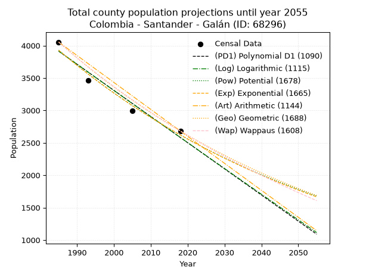
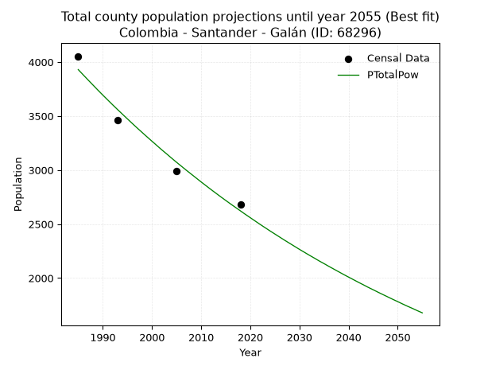
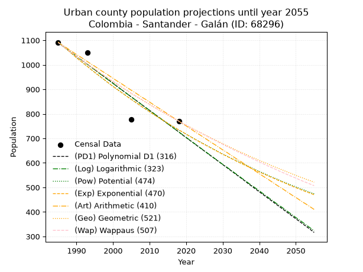
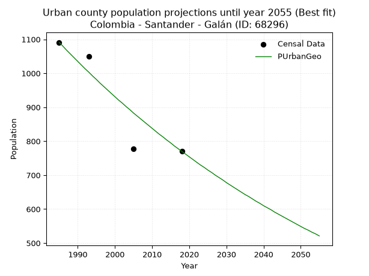
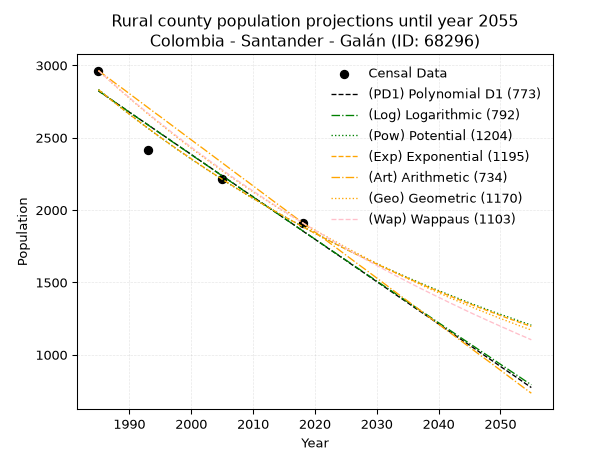
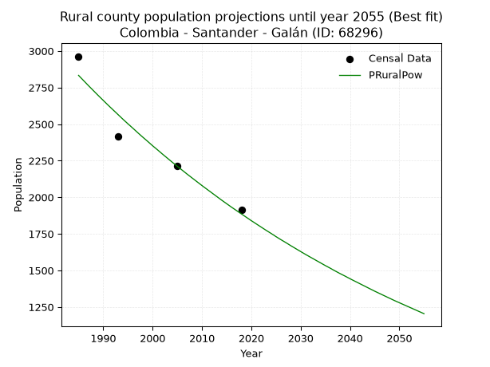

<div align="center">


</div>

# 📜 _“Population and Public Services Demand Projections (PPSD) until Year 2050 for Colombia - Santander - Galán (ID: 68296)”_
Keywords: `population` `public-service` `projection` `lineal` `polynomial` `logarithmic` `potential` `exponential` `arithmetic` `geometric` `wappaus` `dane` `colombia` `south-america`

PPSD are analytical estimates used by governments and planners to anticipate future changes in population size, age distribution, and the resulting community needs for utilities, healthcare, education, and infrastructure as sizing future water treatment facilities, electrical grids, and road networks based on spatial growth.

<div align="center">

</img>

</div>


> **General running parameters**: • app_version: _v20260806_. • Python version: _3.14.7_. • Pandas version: _3.0.5_. • NumPy version: _2.5.1_. • Creates, save and include plots into reports (create_plot): _False_. • Projection until year: _2050_. • Process polynomial degree 2 and up: _False_. • Process Wappaus: _True_. • Process Wappaus: _True_. • Set negative values to zero: _True_. • Set infinite values to zero: _True_. • Drop dataset notes: _True_. 
<div align="center">

Dynamic map: [:earth_americas:Google](http://maps.google.com/maps?q=6.63842335,-73.2877689) [:earth_americas:OSM](https://www.openstreetmap.org/#map=18/6.63842335/-73.2877689&layers=P) [:earth_americas:Bing](https://www.bing.com/maps?cp=6.63842335~-73.2877689&lvl=18) [:earth_americas:Apple](https://maps.apple.com/frame?center=6.63842335%2C-73.2877689&span=0.003%2C0.006)

</div>


<div align="center">

```geojson
{
  "type": "Feature",
  "geometry": {
    "type": "Point", 
    "coordinates": [-73.2877689, 6.63842335]
  }, 
  "properties": {
    "Name": "Colombia - Santander - Galán (ID: 68296)"
  }
}
```

</div>


## 0. Census Data (4 records)

Census data are official statistics collected by a government about the people and housing in a country. They usually include counts of total population, age, sex, race, income, education, and jobs.

📅Global census file: [Population.xlsx](../data/Population.xlsx)

| Source   |   Year |   CountryID | CountryName   |   StateID | StateName   |   CountyID | CountyName   |   PTotal |   PUrban |   PRural |
|:---------|-------:|------------:|:--------------|----------:|:------------|-----------:|:-------------|---------:|---------:|---------:|
| DANE     |   1985 |          57 | Colombia      |        68 | Santander   |      68296 | Galán        |     4054 |     1091 |     2963 |
| DANE     |   1993 |          57 | Colombia      |        68 | Santander   |      68296 | Galán        |     3464 |     1049 |     2415 |
| DANE     |   2005 |          57 | Colombia      |        68 | Santander   |      68296 | Galán        |     2992 |      777 |     2215 |
| DANE     |   2018 |          57 | Colombia      |        68 | Santander   |      68296 | Galán        |     2682 |      770 |     1912 |

> 🔥Some records could had specific notes about the registered values or the corresponding urban or rural distribution.

📅[SUI-RUPS](https://www.datos.gov.co/Hacienda-y-Cr-dito-P-blico/Registro-nico-de-Prestadores-de-Servicios-P-blicos/4qkq-csdn/about_data) - Local public utility companies: [RUPS.csv](../data/RUPS.xlsx)

 | SERVICIO       | ESTADO    | NOMBRE                                                    | NIT         | DEPARTAMENTO_DOMICILIO   | MUNICIPIO_DOMICILIO   | DIRECCION         |   TELEFONO | EMAIL                 | TIPO_PRESTADOR                             | CLASIFICACION                 |
|:---------------|:----------|:----------------------------------------------------------|:------------|:-------------------------|:----------------------|:------------------|-----------:|:----------------------|:-------------------------------------------|:------------------------------|
| ACUEDUCTO      | OPERATIVA | EMPRESA DE SERVICIOS PUBLICOS DE GALAN SEPGA S.A.- E.S.P. | 900259275-6 | SANTANDER                | GALAN                 | CARRERA 5 N° 7-49 |    7219359 | gerencia@sepga.gov.co | SOCIEDADES (EMPRESA DE SERVICIOS PUBLICOS) | MENOR O IGUAL A 2500 USUARIOS |
| ALCANTARILLADO | OPERATIVA | EMPRESA DE SERVICIOS PUBLICOS DE GALAN SEPGA S.A.- E.S.P. | 900259275-6 | SANTANDER                | GALAN                 | CARRERA 5 N° 7-49 |    7219359 | gerencia@sepga.gov.co | SOCIEDADES (EMPRESA DE SERVICIOS PUBLICOS) | MENOR O IGUAL A 2500 USUARIOS |

## 1. Total

### 1.1. Coefficients and Parameters

* (PD1) Polynomial Deg 1: -40.337213970292815, 83982.5122440782 (lineal)
* (Log) Logarithmic: -80784.02827178901, 617338.0462564428
* (Pow) Potential: -24.552940081118233, 84.56408773072188
* (Exp) Exponential: -0.012261495701713223, 146050019351208.56
* (Art) Arithmetic: Year diff. 2018 - 1985 = 33, Population diff. 2682 - 4054 = -1372, Annual growth = -41.57575757575758
* (Geo) Geometric: Year diff. 2018 - 1985 = 33, Population diff. 2682 - 4054 = -1372, Annual growth % = -0.012441390146062159
* (Wap) Wappaus: i = -1.2344346073562225, Condition values only valid for < 200)

<sub>
Wappaus condition values: ['-0.00', '-1.23', '-2.47', '-3.70', '-4.94', '-6.17', '-7.41', '-8.64', '-9.88', '-11.11', '-12.34', '-13.58', '-14.81', '-16.05', '-17.28', '-18.52', '-19.75', '-20.99', '-22.22', '-23.45', '-24.69', '-25.92', '-27.16', '-28.39', '-29.63', '-30.86', '-32.10', '-33.33', '-34.56', '-35.80', '-37.03', '-38.27', '-39.50', '-40.74', '-41.97', '-43.21', '-44.44', '-45.67', '-46.91', '-48.14', '-49.38', '-50.61', '-51.85', '-53.08', '-54.32', '-55.55', '-56.78', '-58.02', '-59.25', '-60.49', '-61.72', '-62.96', '-64.19', '-65.43', '-66.66', '-67.89', '-69.13', '-70.36', '-71.60', '-72.83', '-74.07', '-75.30', '-76.53', '-77.77', '-79.00', '-80.24']
</sub>


### 1.2. Projected Dataset

|   Year |   CountyID |   PTotalPD1 |   PTotalLog |   PTotalPow |   PTotalExp |   PTotalArt |   PTotalGeo |   PTotalWap |
|-------:|-----------:|------------:|------------:|------------:|------------:|------------:|------------:|------------:|
|   1985 |      68296 |        3913 |        3915 |        3930 |        3928 |        4054 |        4054 |        4054 |
|   1986 |      68296 |        3873 |        3874 |        3882 |        3880 |        4012 |        4004 |        4004 |
|   1987 |      68296 |        3832 |        3833 |        3834 |        3833 |        3971 |        3954 |        3955 |
|   1988 |      68296 |        3792 |        3793 |        3787 |        3786 |        3929 |        3905 |        3907 |
|   1989 |      68296 |        3752 |        3752 |        3740 |        3740 |        3888 |        3856 |        3859 |
|   1990 |      68296 |        3711 |        3711 |        3694 |        3694 |        3846 |        3808 |        3811 |
|   1991 |      68296 |        3671 |        3671 |        3649 |        3649 |        3805 |        3761 |        3764 |
|   1992 |      68296 |        3631 |        3630 |        3604 |        3605 |        3763 |        3714 |        3718 |
|   1993 |      68296 |        3590 |        3590 |        3560 |        3561 |        3721 |        3668 |        3672 |
|   1994 |      68296 |        3550 |        3549 |        3517 |        3518 |        3680 |        3622 |        3627 |
|   1995 |      68296 |        3510 |        3509 |        3474 |        3475 |        3638 |        3577 |        3583 |
|   1996 |      68296 |        3469 |        3468 |        3431 |        3432 |        3597 |        3532 |        3539 |
|   1997 |      68296 |        3429 |        3428 |        3389 |        3391 |        3555 |        3488 |        3495 |
|   1998 |      68296 |        3389 |        3387 |        3348 |        3349 |        3514 |        3445 |        3452 |
|   1999 |      68296 |        3348 |        3347 |        3307 |        3308 |        3472 |        3402 |        3409 |
|   2000 |      68296 |        3308 |        3307 |        3267 |        3268 |        3430 |        3360 |        3367 |
|   2001 |      68296 |        3268 |        3266 |        3227 |        3228 |        3389 |        3318 |        3325 |
|   2002 |      68296 |        3227 |        3226 |        3187 |        3189 |        3347 |        3277 |        3284 |
|   2003 |      68296 |        3187 |        3185 |        3149 |        3150 |        3306 |        3236 |        3243 |
|   2004 |      68296 |        3147 |        3145 |        3110 |        3112 |        3264 |        3196 |        3203 |
|   2005 |      68296 |        3106 |        3105 |        3072 |        3074 |        3222 |        3156 |        3163 |
|   2006 |      68296 |        3066 |        3065 |        3035 |        3036 |        3181 |        3117 |        3124 |
|   2007 |      68296 |        3026 |        3024 |        2998 |        2999 |        3139 |        3078 |        3085 |
|   2008 |      68296 |        2985 |        2984 |        2962 |        2963 |        3098 |        3040 |        3046 |
|   2009 |      68296 |        2945 |        2944 |        2926 |        2927 |        3056 |        3002 |        3008 |
|   2010 |      68296 |        2905 |        2904 |        2890 |        2891 |        3015 |        2965 |        2970 |
|   2011 |      68296 |        2864 |        2863 |        2855 |        2856 |        2973 |        2928 |        2933 |
|   2012 |      68296 |        2824 |        2823 |        2820 |        2821 |        2931 |        2891 |        2896 |
|   2013 |      68296 |        2784 |        2783 |        2786 |        2787 |        2890 |        2855 |        2859 |
|   2014 |      68296 |        2743 |        2743 |        2752 |        2753 |        2848 |        2820 |        2823 |
|   2015 |      68296 |        2703 |        2703 |        2719 |        2719 |        2807 |        2785 |        2787 |
|   2016 |      68296 |        2663 |        2663 |        2686 |        2686 |        2765 |        2750 |        2752 |
|   2017 |      68296 |        2622 |        2623 |        2654 |        2653 |        2724 |        2716 |        2717 |
|   2018 |      68296 |        2582 |        2583 |        2622 |        2621 |        2682 |        2682 |        2682 |
|   2019 |      68296 |        2542 |        2543 |        2590 |        2589 |        2640 |        2649 |        2648 |
|   2020 |      68296 |        2501 |        2503 |        2559 |        2557 |        2599 |        2616 |        2614 |
|   2021 |      68296 |        2461 |        2463 |        2528 |        2526 |        2557 |        2583 |        2580 |
|   2022 |      68296 |        2421 |        2423 |        2497 |        2495 |        2516 |        2551 |        2547 |
|   2023 |      68296 |        2380 |        2383 |        2467 |        2465 |        2474 |        2519 |        2514 |
|   2024 |      68296 |        2340 |        2343 |        2437 |        2435 |        2433 |        2488 |        2481 |
|   2025 |      68296 |        2300 |        2303 |        2408 |        2405 |        2391 |        2457 |        2449 |
|   2026 |      68296 |        2259 |        2263 |        2379 |        2376 |        2349 |        2426 |        2417 |
|   2027 |      68296 |        2219 |        2223 |        2350 |        2347 |        2308 |        2396 |        2385 |
|   2028 |      68296 |        2179 |        2183 |        2322 |        2318 |        2266 |        2366 |        2353 |
|   2029 |      68296 |        2138 |        2144 |        2294 |        2290 |        2225 |        2337 |        2322 |
|   2030 |      68296 |        2098 |        2104 |        2266 |        2262 |        2183 |        2308 |        2292 |
|   2031 |      68296 |        2058 |        2064 |        2239 |        2235 |        2142 |        2279 |        2261 |
|   2032 |      68296 |        2017 |        2024 |        2212 |        2207 |        2100 |        2251 |        2231 |
|   2033 |      68296 |        1977 |        1984 |        2186 |        2181 |        2058 |        2223 |        2201 |
|   2034 |      68296 |        1937 |        1945 |        2159 |        2154 |        2017 |        2195 |        2171 |
|   2035 |      68296 |        1896 |        1905 |        2134 |        2128 |        1975 |        2168 |        2142 |
|   2036 |      68296 |        1856 |        1865 |        2108 |        2102 |        1934 |        2141 |        2113 |
|   2037 |      68296 |        1816 |        1826 |        2083 |        2076 |        1892 |        2114 |        2084 |
|   2038 |      68296 |        1775 |        1786 |        2058 |        2051 |        1850 |        2088 |        2055 |
|   2039 |      68296 |        1735 |        1746 |        2033 |        2026 |        1809 |        2062 |        2027 |
|   2040 |      68296 |        1695 |        1707 |        2009 |        2001 |        1767 |        2036 |        1999 |
|   2041 |      68296 |        1654 |        1667 |        1985 |        1977 |        1726 |        2011 |        1971 |
|   2042 |      68296 |        1614 |        1628 |        1961 |        1953 |        1684 |        1986 |        1944 |
|   2043 |      68296 |        1574 |        1588 |        1938 |        1929 |        1643 |        1961 |        1917 |
|   2044 |      68296 |        1533 |        1549 |        1914 |        1905 |        1601 |        1937 |        1890 |
|   2045 |      68296 |        1493 |        1509 |        1892 |        1882 |        1559 |        1913 |        1863 |
|   2046 |      68296 |        1453 |        1470 |        1869 |        1859 |        1518 |        1889 |        1836 |
|   2047 |      68296 |        1412 |        1430 |        1847 |        1837 |        1476 |        1865 |        1810 |
|   2048 |      68296 |        1372 |        1391 |        1825 |        1814 |        1435 |        1842 |        1784 |
|   2049 |      68296 |        1332 |        1351 |        1803 |        1792 |        1393 |        1819 |        1758 |
|   2050 |      68296 |        1291 |        1312 |        1782 |        1770 |        1352 |        1797 |        1733 |
<div align="center">

</img>

</div>


### 1.3. Best fit with absolute and relative error (%)

Relative error puts that difference into context by dividing the absolute error by the true value, creating a unitless ratio or percentage that shows the scale of the mistake.

Absolute and relative error

|   Year | Source   |   CountryID | CountryName   |   StateID | StateName   |   CountyID_x | CountyName   |   PTotal |   PUrban |   PRural |   CountyID_y |   PTotalPD1 |   PTotalLog |   PTotalPow |   PTotalExp |   PTotalArt |   PTotalGeo |   PTotalWap |   PTotalPD1AbsError |   PTotalLogAbsError |   PTotalPowAbsError |   PTotalExpAbsError |   PTotalArtAbsError |   PTotalGeoAbsError |   PTotalWapAbsError |   PTotalPD1RelError |   PTotalLogRelError |   PTotalPowRelError |   PTotalExpRelError |   PTotalArtRelError |   PTotalGeoRelError |   PTotalWapRelError |
|-------:|:---------|------------:|:--------------|----------:|:------------|-------------:|:-------------|---------:|---------:|---------:|-------------:|------------:|------------:|------------:|------------:|------------:|------------:|------------:|--------------------:|--------------------:|--------------------:|--------------------:|--------------------:|--------------------:|--------------------:|--------------------:|--------------------:|--------------------:|--------------------:|--------------------:|--------------------:|--------------------:|
|   1985 | DANE     |          57 | Colombia      |        68 | Santander   |        68296 | Galán        |     4054 |     1091 |     2963 |        68296 |        3913 |        3915 |        3930 |        3928 |        4054 |        4054 |        4054 |                 141 |                 139 |                 124 |                 126 |                   0 |                   0 |                   0 |             3.47805 |             3.42871 |             3.05871 |             3.10804 |             0       |             0       |             0       |
|   1993 | DANE     |          57 | Colombia      |        68 | Santander   |        68296 | Galán        |     3464 |     1049 |     2415 |        68296 |        3590 |        3590 |        3560 |        3561 |        3721 |        3668 |        3672 |                 126 |                 126 |                  96 |                  97 |                 257 |                 204 |                 208 |             3.63741 |             3.63741 |             2.77136 |             2.80023 |             7.41917 |             5.88915 |             6.00462 |
|   2005 | DANE     |          57 | Colombia      |        68 | Santander   |        68296 | Galán        |     2992 |      777 |     2215 |        68296 |        3106 |        3105 |        3072 |        3074 |        3222 |        3156 |        3163 |                 114 |                 113 |                  80 |                  82 |                 230 |                 164 |                 171 |             3.81016 |             3.77674 |             2.6738  |             2.74064 |             7.68717 |             5.48128 |             5.71524 |
|   2018 | DANE     |          57 | Colombia      |        68 | Santander   |        68296 | Galán        |     2682 |      770 |     1912 |        68296 |        2582 |        2583 |        2622 |        2621 |        2682 |        2682 |        2682 |                 100 |                  99 |                  60 |                  61 |                   0 |                   0 |                   0 |             3.72856 |             3.69128 |             2.23714 |             2.27442 |             0       |             0       |             0       |

Relative error mean

| Method    |   RelError | Best   |
|:----------|-----------:|:-------|
| PTotalPD1 |    3.66355 |        |
| PTotalLog |    3.63353 |        |
| PTotalPow |    2.68525 | True   |
| PTotalExp |    2.73083 |        |
| PTotalArt |    3.77658 |        |
| PTotalGeo |    2.84261 |        |
| PTotalWap |    2.92996 |        |

💙Best method: _**PTotalPow**_
<div align="center">

</img>

</div>


### 1.4. Fresh water supply demand in liters per capita per day (lpcd)

The fresh water supply demand typically ranges from 100 to 300 liters per capita per day (lpcd) for standard domestic and municipal planning, though absolute survival minimums set by the World Health Organization are as low as 7.5 to 20 liters per day, and total consumption in high-income nations can exceed 400 liters.

> `CZ`: Level in meters above the sea level (masl)<br> `WS`: Fresh water supply demand in liters per capita per day (lpcd or l/h/d)<br> `WSAll`: Zonal fresh water supply demand in liters per second (l/s)<br> `A`: Zonal area in square meters<br> `DP`: Population density (people/hectare or p/ha)

Reference values (RAS Colombia)

|    CZ |   WS |
|------:|-----:|
|  1000 |  120 |
|  2000 |  130 |
| 99999 |  140 |

County shapefile geometry properties and water supply values

|   CountyID |      ATotal |   CZTotal |   WSTotal |
|-----------:|------------:|----------:|----------:|
|      68296 | 2.01381e+08 |   1583.99 |       130 |

Projected values for best method: PTotalPow

|   CountyID |   Year |   PTotalPow |   DPTotal |   WSTotal |   WSTotalAll |
|-----------:|-------:|------------:|----------:|----------:|-------------:|
|      68296 |   1985 |        3930 |      0.2  |       130 |      5.91319 |
|      68296 |   1986 |        3882 |      0.19 |       130 |      5.84097 |
|      68296 |   1987 |        3834 |      0.19 |       130 |      5.76875 |
|      68296 |   1988 |        3787 |      0.19 |       130 |      5.69803 |
|      68296 |   1989 |        3740 |      0.19 |       130 |      5.62731 |
|      68296 |   1990 |        3694 |      0.18 |       130 |      5.5581  |
|      68296 |   1991 |        3649 |      0.18 |       130 |      5.49039 |
|      68296 |   1992 |        3604 |      0.18 |       130 |      5.42269 |
|      68296 |   1993 |        3560 |      0.18 |       130 |      5.35648 |
|      68296 |   1994 |        3517 |      0.17 |       130 |      5.29178 |
|      68296 |   1995 |        3474 |      0.17 |       130 |      5.22708 |
|      68296 |   1996 |        3431 |      0.17 |       130 |      5.16238 |
|      68296 |   1997 |        3389 |      0.17 |       130 |      5.09919 |
|      68296 |   1998 |        3348 |      0.17 |       130 |      5.0375  |
|      68296 |   1999 |        3307 |      0.16 |       130 |      4.97581 |
|      68296 |   2000 |        3267 |      0.16 |       130 |      4.91563 |
|      68296 |   2001 |        3227 |      0.16 |       130 |      4.85544 |
|      68296 |   2002 |        3187 |      0.16 |       130 |      4.79525 |
|      68296 |   2003 |        3149 |      0.16 |       130 |      4.73808 |
|      68296 |   2004 |        3110 |      0.15 |       130 |      4.6794  |
|      68296 |   2005 |        3072 |      0.15 |       130 |      4.62222 |
|      68296 |   2006 |        3035 |      0.15 |       130 |      4.56655 |
|      68296 |   2007 |        2998 |      0.15 |       130 |      4.51088 |
|      68296 |   2008 |        2962 |      0.15 |       130 |      4.45671 |
|      68296 |   2009 |        2926 |      0.15 |       130 |      4.40255 |
|      68296 |   2010 |        2890 |      0.14 |       130 |      4.34838 |
|      68296 |   2011 |        2855 |      0.14 |       130 |      4.29572 |
|      68296 |   2012 |        2820 |      0.14 |       130 |      4.24306 |
|      68296 |   2013 |        2786 |      0.14 |       130 |      4.1919  |
|      68296 |   2014 |        2752 |      0.14 |       130 |      4.14074 |
|      68296 |   2015 |        2719 |      0.14 |       130 |      4.09109 |
|      68296 |   2016 |        2686 |      0.13 |       130 |      4.04144 |
|      68296 |   2017 |        2654 |      0.13 |       130 |      3.99329 |
|      68296 |   2018 |        2622 |      0.13 |       130 |      3.94514 |
|      68296 |   2019 |        2590 |      0.13 |       130 |      3.89699 |
|      68296 |   2020 |        2559 |      0.13 |       130 |      3.85035 |
|      68296 |   2021 |        2528 |      0.13 |       130 |      3.8037  |
|      68296 |   2022 |        2497 |      0.12 |       130 |      3.75706 |
|      68296 |   2023 |        2467 |      0.12 |       130 |      3.71192 |
|      68296 |   2024 |        2437 |      0.12 |       130 |      3.66678 |
|      68296 |   2025 |        2408 |      0.12 |       130 |      3.62315 |
|      68296 |   2026 |        2379 |      0.12 |       130 |      3.57951 |
|      68296 |   2027 |        2350 |      0.12 |       130 |      3.53588 |
|      68296 |   2028 |        2322 |      0.12 |       130 |      3.49375 |
|      68296 |   2029 |        2294 |      0.11 |       130 |      3.45162 |
|      68296 |   2030 |        2266 |      0.11 |       130 |      3.40949 |
|      68296 |   2031 |        2239 |      0.11 |       130 |      3.36887 |
|      68296 |   2032 |        2212 |      0.11 |       130 |      3.32824 |
|      68296 |   2033 |        2186 |      0.11 |       130 |      3.28912 |
|      68296 |   2034 |        2159 |      0.11 |       130 |      3.2485  |
|      68296 |   2035 |        2134 |      0.11 |       130 |      3.21088 |
|      68296 |   2036 |        2108 |      0.1  |       130 |      3.17176 |
|      68296 |   2037 |        2083 |      0.1  |       130 |      3.13414 |
|      68296 |   2038 |        2058 |      0.1  |       130 |      3.09653 |
|      68296 |   2039 |        2033 |      0.1  |       130 |      3.05891 |
|      68296 |   2040 |        2009 |      0.1  |       130 |      3.0228  |
|      68296 |   2041 |        1985 |      0.1  |       130 |      2.98669 |
|      68296 |   2042 |        1961 |      0.1  |       130 |      2.95058 |
|      68296 |   2043 |        1938 |      0.1  |       130 |      2.91597 |
|      68296 |   2044 |        1914 |      0.1  |       130 |      2.87986 |
|      68296 |   2045 |        1892 |      0.09 |       130 |      2.84676 |
|      68296 |   2046 |        1869 |      0.09 |       130 |      2.81215 |
|      68296 |   2047 |        1847 |      0.09 |       130 |      2.77905 |
|      68296 |   2048 |        1825 |      0.09 |       130 |      2.74595 |
|      68296 |   2049 |        1803 |      0.09 |       130 |      2.71285 |
|      68296 |   2050 |        1782 |      0.09 |       130 |      2.68125 |

## 2. Urban

### 2.1. Coefficients and Parameters

* (PD1) Polynomial Deg 1: -11.055399437976694, 23035.31272581288 (lineal)
* (Log) Logarithmic: -22140.366987185385, 169210.85689136232
* (Pow) Potential: -24.1592193270595, 82.71029316099475
* (Exp) Exponential: -0.012063806330042445, 27458502379585.707
* (Art) Arithmetic: Year diff. 2018 - 1985 = 33, Population diff. 770 - 1091 = -321, Annual growth = -9.727272727272727
* (Geo) Geometric: Year diff. 2018 - 1985 = 33, Population diff. 770 - 1091 = -321, Annual growth % = -0.010503823390067502
* (Wap) Wappaus: i = -1.0453812710663866, Condition values only valid for < 200)

<sub>
Wappaus condition values: ['-0.00', '-1.05', '-2.09', '-3.14', '-4.18', '-5.23', '-6.27', '-7.32', '-8.36', '-9.41', '-10.45', '-11.50', '-12.54', '-13.59', '-14.64', '-15.68', '-16.73', '-17.77', '-18.82', '-19.86', '-20.91', '-21.95', '-23.00', '-24.04', '-25.09', '-26.13', '-27.18', '-28.23', '-29.27', '-30.32', '-31.36', '-32.41', '-33.45', '-34.50', '-35.54', '-36.59', '-37.63', '-38.68', '-39.72', '-40.77', '-41.82', '-42.86', '-43.91', '-44.95', '-46.00', '-47.04', '-48.09', '-49.13', '-50.18', '-51.22', '-52.27', '-53.31', '-54.36', '-55.41', '-56.45', '-57.50', '-58.54', '-59.59', '-60.63', '-61.68', '-62.72', '-63.77', '-64.81', '-65.86', '-66.90', '-67.95']
</sub>


### 2.2. Projected Dataset

|   Year |   CountyID |   PUrbanPD1 |   PUrbanLog |   PUrbanPow |   PUrbanExp |   PUrbanArt |   PUrbanGeo |   PUrbanWap |
|-------:|-----------:|------------:|------------:|------------:|------------:|------------:|------------:|------------:|
|   1985 |      68296 |        1090 |        1091 |        1094 |        1093 |        1091 |        1091 |        1091 |
|   1986 |      68296 |        1079 |        1080 |        1081 |        1080 |        1081 |        1080 |        1080 |
|   1987 |      68296 |        1068 |        1068 |        1068 |        1067 |        1072 |        1068 |        1068 |
|   1988 |      68296 |        1057 |        1057 |        1055 |        1055 |        1062 |        1057 |        1057 |
|   1989 |      68296 |        1046 |        1046 |        1042 |        1042 |        1052 |        1046 |        1046 |
|   1990 |      68296 |        1035 |        1035 |        1029 |        1029 |        1042 |        1035 |        1035 |
|   1991 |      68296 |        1024 |        1024 |        1017 |        1017 |        1033 |        1024 |        1025 |
|   1992 |      68296 |        1013 |        1013 |        1005 |        1005 |        1023 |        1013 |        1014 |
|   1993 |      68296 |        1002 |        1002 |         993 |         993 |        1013 |        1003 |        1003 |
|   1994 |      68296 |         991 |         991 |         981 |         981 |        1003 |         992 |         993 |
|   1995 |      68296 |         980 |         980 |         969 |         969 |         994 |         982 |         983 |
|   1996 |      68296 |         969 |         968 |         957 |         958 |         984 |         971 |         972 |
|   1997 |      68296 |         958 |         957 |         946 |         946 |         974 |         961 |         962 |
|   1998 |      68296 |         947 |         946 |         934 |         935 |         965 |         951 |         952 |
|   1999 |      68296 |         936 |         935 |         923 |         923 |         955 |         941 |         942 |
|   2000 |      68296 |         925 |         924 |         912 |         912 |         945 |         931 |         932 |
|   2001 |      68296 |         913 |         913 |         901 |         901 |         935 |         921 |         923 |
|   2002 |      68296 |         902 |         902 |         890 |         891 |         926 |         912 |         913 |
|   2003 |      68296 |         891 |         891 |         880 |         880 |         916 |         902 |         903 |
|   2004 |      68296 |         880 |         880 |         869 |         869 |         906 |         893 |         894 |
|   2005 |      68296 |         869 |         869 |         859 |         859 |         896 |         883 |         884 |
|   2006 |      68296 |         858 |         858 |         848 |         849 |         887 |         874 |         875 |
|   2007 |      68296 |         847 |         847 |         838 |         839 |         877 |         865 |         866 |
|   2008 |      68296 |         836 |         836 |         828 |         828 |         867 |         856 |         857 |
|   2009 |      68296 |         825 |         825 |         818 |         819 |         858 |         847 |         848 |
|   2010 |      68296 |         814 |         814 |         808 |         809 |         848 |         838 |         839 |
|   2011 |      68296 |         803 |         803 |         799 |         799 |         838 |         829 |         830 |
|   2012 |      68296 |         792 |         792 |         789 |         789 |         828 |         820 |         821 |
|   2013 |      68296 |         781 |         781 |         780 |         780 |         819 |         812 |         812 |
|   2014 |      68296 |         770 |         770 |         771 |         771 |         809 |         803 |         804 |
|   2015 |      68296 |         759 |         759 |         761 |         761 |         799 |         795 |         795 |
|   2016 |      68296 |         748 |         748 |         752 |         752 |         789 |         786 |         787 |
|   2017 |      68296 |         737 |         737 |         743 |         743 |         780 |         778 |         778 |
|   2018 |      68296 |         726 |         726 |         734 |         734 |         770 |         770 |         770 |
|   2019 |      68296 |         714 |         715 |         726 |         726 |         760 |         762 |         762 |
|   2020 |      68296 |         703 |         704 |         717 |         717 |         751 |         754 |         754 |
|   2021 |      68296 |         692 |         693 |         709 |         708 |         741 |         746 |         745 |
|   2022 |      68296 |         681 |         682 |         700 |         700 |         731 |         738 |         737 |
|   2023 |      68296 |         670 |         671 |         692 |         691 |         721 |         730 |         729 |
|   2024 |      68296 |         659 |         660 |         684 |         683 |         712 |         723 |         722 |
|   2025 |      68296 |         648 |         649 |         676 |         675 |         702 |         715 |         714 |
|   2026 |      68296 |         637 |         638 |         668 |         667 |         692 |         708 |         706 |
|   2027 |      68296 |         626 |         627 |         660 |         659 |         682 |         700 |         698 |
|   2028 |      68296 |         615 |         616 |         652 |         651 |         673 |         693 |         691 |
|   2029 |      68296 |         604 |         605 |         644 |         643 |         663 |         686 |         683 |
|   2030 |      68296 |         593 |         594 |         636 |         635 |         653 |         678 |         676 |
|   2031 |      68296 |         582 |         584 |         629 |         628 |         644 |         671 |         668 |
|   2032 |      68296 |         571 |         573 |         621 |         620 |         634 |         664 |         661 |
|   2033 |      68296 |         560 |         562 |         614 |         613 |         624 |         657 |         653 |
|   2034 |      68296 |         549 |         551 |         607 |         605 |         614 |         650 |         646 |
|   2035 |      68296 |         538 |         540 |         600 |         598 |         605 |         643 |         639 |
|   2036 |      68296 |         527 |         529 |         593 |         591 |         595 |         637 |         632 |
|   2037 |      68296 |         515 |         518 |         586 |         584 |         585 |         630 |         625 |
|   2038 |      68296 |         504 |         507 |         579 |         577 |         575 |         623 |         618 |
|   2039 |      68296 |         493 |         497 |         572 |         570 |         566 |         617 |         611 |
|   2040 |      68296 |         482 |         486 |         565 |         563 |         556 |         610 |         604 |
|   2041 |      68296 |         471 |         475 |         559 |         556 |         546 |         604 |         597 |
|   2042 |      68296 |         460 |         464 |         552 |         550 |         537 |         598 |         590 |
|   2043 |      68296 |         449 |         453 |         545 |         543 |         527 |         591 |         583 |
|   2044 |      68296 |         438 |         442 |         539 |         537 |         517 |         585 |         577 |
|   2045 |      68296 |         427 |         431 |         533 |         530 |         507 |         579 |         570 |
|   2046 |      68296 |         416 |         421 |         526 |         524 |         498 |         573 |         563 |
|   2047 |      68296 |         405 |         410 |         520 |         518 |         488 |         567 |         557 |
|   2048 |      68296 |         394 |         399 |         514 |         511 |         478 |         561 |         550 |
|   2049 |      68296 |         383 |         388 |         508 |         505 |         468 |         555 |         544 |
|   2050 |      68296 |         372 |         377 |         502 |         499 |         459 |         549 |         538 |
<div align="center">

</img>

</div>


### 2.3. Best fit with absolute and relative error (%)

Relative error puts that difference into context by dividing the absolute error by the true value, creating a unitless ratio or percentage that shows the scale of the mistake.

Absolute and relative error

|   Year | Source   |   CountryID | CountryName   |   StateID | StateName   |   CountyID_x | CountyName   |   PTotal |   PUrban |   PRural |   CountyID_y |   PUrbanPD1 |   PUrbanLog |   PUrbanPow |   PUrbanExp |   PUrbanArt |   PUrbanGeo |   PUrbanWap |   PUrbanPD1AbsError |   PUrbanLogAbsError |   PUrbanPowAbsError |   PUrbanExpAbsError |   PUrbanArtAbsError |   PUrbanGeoAbsError |   PUrbanWapAbsError |   PUrbanPD1RelError |   PUrbanLogRelError |   PUrbanPowRelError |   PUrbanExpRelError |   PUrbanArtRelError |   PUrbanGeoRelError |   PUrbanWapRelError |
|-------:|:---------|------------:|:--------------|----------:|:------------|-------------:|:-------------|---------:|---------:|---------:|-------------:|------------:|------------:|------------:|------------:|------------:|------------:|------------:|--------------------:|--------------------:|--------------------:|--------------------:|--------------------:|--------------------:|--------------------:|--------------------:|--------------------:|--------------------:|--------------------:|--------------------:|--------------------:|--------------------:|
|   1985 | DANE     |          57 | Colombia      |        68 | Santander   |        68296 | Galán        |     4054 |     1091 |     2963 |        68296 |        1090 |        1091 |        1094 |        1093 |        1091 |        1091 |        1091 |                   1 |                   0 |                   3 |                   2 |                   0 |                   0 |                   0 |            0.091659 |             0       |            0.274977 |            0.183318 |             0       |             0       |             0       |
|   1993 | DANE     |          57 | Colombia      |        68 | Santander   |        68296 | Galán        |     3464 |     1049 |     2415 |        68296 |        1002 |        1002 |         993 |         993 |        1013 |        1003 |        1003 |                  47 |                  47 |                  56 |                  56 |                  36 |                  46 |                  46 |            4.48046  |             4.48046 |            5.33842  |            5.33842  |             3.43184 |             4.38513 |             4.38513 |
|   2005 | DANE     |          57 | Colombia      |        68 | Santander   |        68296 | Galán        |     2992 |      777 |     2215 |        68296 |         869 |         869 |         859 |         859 |         896 |         883 |         884 |                  92 |                  92 |                  82 |                  82 |                 119 |                 106 |                 107 |           11.8404   |            11.8404  |           10.5534   |           10.5534   |            15.3153  |            13.6422  |            13.7709  |
|   2018 | DANE     |          57 | Colombia      |        68 | Santander   |        68296 | Galán        |     2682 |      770 |     1912 |        68296 |         726 |         726 |         734 |         734 |         770 |         770 |         770 |                  44 |                  44 |                  36 |                  36 |                   0 |                   0 |                   0 |            5.71429  |             5.71429 |            4.67532  |            4.67532  |             0       |             0       |             0       |

Relative error mean

| Method    |   RelError | Best   |
|:----------|-----------:|:-------|
| PUrbanPD1 |    5.5317  |        |
| PUrbanLog |    5.50879 |        |
| PUrbanPow |    5.21053 |        |
| PUrbanExp |    5.18762 |        |
| PUrbanArt |    4.68679 |        |
| PUrbanGeo |    4.50684 | True   |
| PUrbanWap |    4.53901 |        |

💙Best method: _**PUrbanGeo**_
<div align="center">

</img>

</div>


### 2.4. Fresh water supply demand in liters per capita per day (lpcd)

The fresh water supply demand typically ranges from 100 to 300 liters per capita per day (lpcd) for standard domestic and municipal planning, though absolute survival minimums set by the World Health Organization are as low as 7.5 to 20 liters per day, and total consumption in high-income nations can exceed 400 liters.

> `CZ`: Level in meters above the sea level (masl)<br> `WS`: Fresh water supply demand in liters per capita per day (lpcd or l/h/d)<br> `WSAll`: Zonal fresh water supply demand in liters per second (l/s)<br> `A`: Zonal area in square meters<br> `DP`: Population density (people/hectare or p/ha)

Reference values (RAS Colombia)

|    CZ |   WS |
|------:|-----:|
|  1000 |  120 |
|  2000 |  130 |
| 99999 |  140 |

County shapefile geometry properties and water supply values

|   CountyID |   AUrban |   CZUrban |   WSUrban |
|-----------:|---------:|----------:|----------:|
|      68296 |   257232 |   934.853 |       120 |

Projected values for best method: PUrbanGeo

|   CountyID |   Year |   PUrbanGeo |   DPUrban |   WSUrban |   WSUrbanAll |
|-----------:|-------:|------------:|----------:|----------:|-------------:|
|      68296 |   1985 |        1091 |     42.41 |       120 |     1.51528  |
|      68296 |   1986 |        1080 |     41.99 |       120 |     1.5      |
|      68296 |   1987 |        1068 |     41.52 |       120 |     1.48333  |
|      68296 |   1988 |        1057 |     41.09 |       120 |     1.46806  |
|      68296 |   1989 |        1046 |     40.66 |       120 |     1.45278  |
|      68296 |   1990 |        1035 |     40.24 |       120 |     1.4375   |
|      68296 |   1991 |        1024 |     39.81 |       120 |     1.42222  |
|      68296 |   1992 |        1013 |     39.38 |       120 |     1.40694  |
|      68296 |   1993 |        1003 |     38.99 |       120 |     1.39306  |
|      68296 |   1994 |         992 |     38.56 |       120 |     1.37778  |
|      68296 |   1995 |         982 |     38.18 |       120 |     1.36389  |
|      68296 |   1996 |         971 |     37.75 |       120 |     1.34861  |
|      68296 |   1997 |         961 |     37.36 |       120 |     1.33472  |
|      68296 |   1998 |         951 |     36.97 |       120 |     1.32083  |
|      68296 |   1999 |         941 |     36.58 |       120 |     1.30694  |
|      68296 |   2000 |         931 |     36.19 |       120 |     1.29306  |
|      68296 |   2001 |         921 |     35.8  |       120 |     1.27917  |
|      68296 |   2002 |         912 |     35.45 |       120 |     1.26667  |
|      68296 |   2003 |         902 |     35.07 |       120 |     1.25278  |
|      68296 |   2004 |         893 |     34.72 |       120 |     1.24028  |
|      68296 |   2005 |         883 |     34.33 |       120 |     1.22639  |
|      68296 |   2006 |         874 |     33.98 |       120 |     1.21389  |
|      68296 |   2007 |         865 |     33.63 |       120 |     1.20139  |
|      68296 |   2008 |         856 |     33.28 |       120 |     1.18889  |
|      68296 |   2009 |         847 |     32.93 |       120 |     1.17639  |
|      68296 |   2010 |         838 |     32.58 |       120 |     1.16389  |
|      68296 |   2011 |         829 |     32.23 |       120 |     1.15139  |
|      68296 |   2012 |         820 |     31.88 |       120 |     1.13889  |
|      68296 |   2013 |         812 |     31.57 |       120 |     1.12778  |
|      68296 |   2014 |         803 |     31.22 |       120 |     1.11528  |
|      68296 |   2015 |         795 |     30.91 |       120 |     1.10417  |
|      68296 |   2016 |         786 |     30.56 |       120 |     1.09167  |
|      68296 |   2017 |         778 |     30.25 |       120 |     1.08056  |
|      68296 |   2018 |         770 |     29.93 |       120 |     1.06944  |
|      68296 |   2019 |         762 |     29.62 |       120 |     1.05833  |
|      68296 |   2020 |         754 |     29.31 |       120 |     1.04722  |
|      68296 |   2021 |         746 |     29    |       120 |     1.03611  |
|      68296 |   2022 |         738 |     28.69 |       120 |     1.025    |
|      68296 |   2023 |         730 |     28.38 |       120 |     1.01389  |
|      68296 |   2024 |         723 |     28.11 |       120 |     1.00417  |
|      68296 |   2025 |         715 |     27.8  |       120 |     0.993056 |
|      68296 |   2026 |         708 |     27.52 |       120 |     0.983333 |
|      68296 |   2027 |         700 |     27.21 |       120 |     0.972222 |
|      68296 |   2028 |         693 |     26.94 |       120 |     0.9625   |
|      68296 |   2029 |         686 |     26.67 |       120 |     0.952778 |
|      68296 |   2030 |         678 |     26.36 |       120 |     0.941667 |
|      68296 |   2031 |         671 |     26.09 |       120 |     0.931944 |
|      68296 |   2032 |         664 |     25.81 |       120 |     0.922222 |
|      68296 |   2033 |         657 |     25.54 |       120 |     0.9125   |
|      68296 |   2034 |         650 |     25.27 |       120 |     0.902778 |
|      68296 |   2035 |         643 |     25    |       120 |     0.893056 |
|      68296 |   2036 |         637 |     24.76 |       120 |     0.884722 |
|      68296 |   2037 |         630 |     24.49 |       120 |     0.875    |
|      68296 |   2038 |         623 |     24.22 |       120 |     0.865278 |
|      68296 |   2039 |         617 |     23.99 |       120 |     0.856944 |
|      68296 |   2040 |         610 |     23.71 |       120 |     0.847222 |
|      68296 |   2041 |         604 |     23.48 |       120 |     0.838889 |
|      68296 |   2042 |         598 |     23.25 |       120 |     0.830556 |
|      68296 |   2043 |         591 |     22.98 |       120 |     0.820833 |
|      68296 |   2044 |         585 |     22.74 |       120 |     0.8125   |
|      68296 |   2045 |         579 |     22.51 |       120 |     0.804167 |
|      68296 |   2046 |         573 |     22.28 |       120 |     0.795833 |
|      68296 |   2047 |         567 |     22.04 |       120 |     0.7875   |
|      68296 |   2048 |         561 |     21.81 |       120 |     0.779167 |
|      68296 |   2049 |         555 |     21.58 |       120 |     0.770833 |
|      68296 |   2050 |         549 |     21.34 |       120 |     0.7625   |

## 3. Rural

### 3.1. Coefficients and Parameters

* (PD1) Polynomial Deg 1: -29.281814532316137, 60947.19951826535 (lineal)
* (Log) Logarithmic: -58643.66128460363, 448127.1893650806
* (Pow) Potential: -24.67759486338035, 84.83298972409841
* (Exp) Exponential: -0.012324040628257574, 119190418916250.03
* (Art) Arithmetic: Year diff. 2018 - 1985 = 33, Population diff. 1912 - 2963 = -1051, Annual growth = -31.848484848484848
* (Geo) Geometric: Year diff. 2018 - 1985 = 33, Population diff. 1912 - 2963 = -1051, Annual growth % = -0.013186601592370617
* (Wap) Wappaus: i = -1.3066045066045067, Condition values only valid for < 200)

<sub>
Wappaus condition values: ['-0.00', '-1.31', '-2.61', '-3.92', '-5.23', '-6.53', '-7.84', '-9.15', '-10.45', '-11.76', '-13.07', '-14.37', '-15.68', '-16.99', '-18.29', '-19.60', '-20.91', '-22.21', '-23.52', '-24.83', '-26.13', '-27.44', '-28.75', '-30.05', '-31.36', '-32.67', '-33.97', '-35.28', '-36.58', '-37.89', '-39.20', '-40.50', '-41.81', '-43.12', '-44.42', '-45.73', '-47.04', '-48.34', '-49.65', '-50.96', '-52.26', '-53.57', '-54.88', '-56.18', '-57.49', '-58.80', '-60.10', '-61.41', '-62.72', '-64.02', '-65.33', '-66.64', '-67.94', '-69.25', '-70.56', '-71.86', '-73.17', '-74.48', '-75.78', '-77.09', '-78.40', '-79.70', '-81.01', '-82.32', '-83.62', '-84.93']
</sub>


### 3.2. Projected Dataset

|   Year |   CountyID |   PRuralPD1 |   PRuralLog |   PRuralPow |   PRuralExp |   PRuralArt |   PRuralGeo |   PRuralWap |
|-------:|-----------:|------------:|------------:|------------:|------------:|------------:|------------:|------------:|
|   1985 |      68296 |        2823 |        2824 |        2833 |        2831 |        2963 |        2963 |        2963 |
|   1986 |      68296 |        2794 |        2794 |        2798 |        2797 |        2931 |        2924 |        2925 |
|   1987 |      68296 |        2764 |        2765 |        2763 |        2762 |        2899 |        2885 |        2887 |
|   1988 |      68296 |        2735 |        2735 |        2729 |        2729 |        2867 |        2847 |        2849 |
|   1989 |      68296 |        2706 |        2706 |        2695 |        2695 |        2836 |        2810 |        2812 |
|   1990 |      68296 |        2676 |        2676 |        2662 |        2662 |        2804 |        2773 |        2776 |
|   1991 |      68296 |        2647 |        2647 |        2629 |        2630 |        2772 |        2736 |        2739 |
|   1992 |      68296 |        2618 |        2617 |        2597 |        2597 |        2740 |        2700 |        2704 |
|   1993 |      68296 |        2589 |        2588 |        2565 |        2566 |        2708 |        2664 |        2669 |
|   1994 |      68296 |        2559 |        2559 |        2533 |        2534 |        2676 |        2629 |        2634 |
|   1995 |      68296 |        2530 |        2529 |        2502 |        2503 |        2645 |        2595 |        2600 |
|   1996 |      68296 |        2501 |        2500 |        2472 |        2472 |        2613 |        2560 |        2566 |
|   1997 |      68296 |        2471 |        2470 |        2441 |        2442 |        2581 |        2527 |        2532 |
|   1998 |      68296 |        2442 |        2441 |        2411 |        2412 |        2549 |        2493 |        2499 |
|   1999 |      68296 |        2413 |        2412 |        2382 |        2383 |        2517 |        2460 |        2466 |
|   2000 |      68296 |        2384 |        2382 |        2352 |        2354 |        2485 |        2428 |        2434 |
|   2001 |      68296 |        2354 |        2353 |        2324 |        2325 |        2453 |        2396 |        2402 |
|   2002 |      68296 |        2325 |        2324 |        2295 |        2296 |        2422 |        2364 |        2371 |
|   2003 |      68296 |        2296 |        2295 |        2267 |        2268 |        2390 |        2333 |        2339 |
|   2004 |      68296 |        2266 |        2265 |        2239 |        2240 |        2358 |        2302 |        2309 |
|   2005 |      68296 |        2237 |        2236 |        2212 |        2213 |        2326 |        2272 |        2278 |
|   2006 |      68296 |        2208 |        2207 |        2185 |        2186 |        2294 |        2242 |        2248 |
|   2007 |      68296 |        2179 |        2178 |        2158 |        2159 |        2262 |        2213 |        2218 |
|   2008 |      68296 |        2149 |        2148 |        2132 |        2133 |        2230 |        2183 |        2189 |
|   2009 |      68296 |        2120 |        2119 |        2106 |        2106 |        2199 |        2155 |        2160 |
|   2010 |      68296 |        2091 |        2090 |        2080 |        2081 |        2167 |        2126 |        2131 |
|   2011 |      68296 |        2061 |        2061 |        2055 |        2055 |        2135 |        2098 |        2103 |
|   2012 |      68296 |        2032 |        2032 |        2030 |        2030 |        2103 |        2071 |        2074 |
|   2013 |      68296 |        2003 |        2002 |        2005 |        2005 |        2071 |        2043 |        2047 |
|   2014 |      68296 |        1974 |        1973 |        1980 |        1981 |        2039 |        2016 |        2019 |
|   2015 |      68296 |        1944 |        1944 |        1956 |        1956 |        2008 |        1990 |        1992 |
|   2016 |      68296 |        1915 |        1915 |        1932 |        1932 |        1976 |        1963 |        1965 |
|   2017 |      68296 |        1886 |        1886 |        1909 |        1909 |        1944 |        1938 |        1938 |
|   2018 |      68296 |        1856 |        1857 |        1886 |        1885 |        1912 |        1912 |        1912 |
|   2019 |      68296 |        1827 |        1828 |        1863 |        1862 |        1880 |        1887 |        1886 |
|   2020 |      68296 |        1798 |        1799 |        1840 |        1839 |        1848 |        1862 |        1860 |
|   2021 |      68296 |        1769 |        1770 |        1818 |        1817 |        1816 |        1837 |        1835 |
|   2022 |      68296 |        1739 |        1741 |        1796 |        1795 |        1785 |        1813 |        1809 |
|   2023 |      68296 |        1710 |        1712 |        1774 |        1773 |        1753 |        1789 |        1784 |
|   2024 |      68296 |        1681 |        1683 |        1753 |        1751 |        1721 |        1766 |        1760 |
|   2025 |      68296 |        1652 |        1654 |        1731 |        1729 |        1689 |        1742 |        1735 |
|   2026 |      68296 |        1622 |        1625 |        1710 |        1708 |        1657 |        1719 |        1711 |
|   2027 |      68296 |        1593 |        1596 |        1690 |        1687 |        1625 |        1697 |        1687 |
|   2028 |      68296 |        1564 |        1567 |        1669 |        1667 |        1594 |        1674 |        1663 |
|   2029 |      68296 |        1534 |        1538 |        1649 |        1646 |        1562 |        1652 |        1640 |
|   2030 |      68296 |        1505 |        1509 |        1629 |        1626 |        1530 |        1630 |        1617 |
|   2031 |      68296 |        1476 |        1480 |        1609 |        1606 |        1498 |        1609 |        1594 |
|   2032 |      68296 |        1447 |        1452 |        1590 |        1587 |        1466 |        1588 |        1571 |
|   2033 |      68296 |        1417 |        1423 |        1571 |        1567 |        1434 |        1567 |        1548 |
|   2034 |      68296 |        1388 |        1394 |        1552 |        1548 |        1402 |        1546 |        1526 |
|   2035 |      68296 |        1359 |        1365 |        1533 |        1529 |        1371 |        1526 |        1504 |
|   2036 |      68296 |        1329 |        1336 |        1515 |        1510 |        1339 |        1506 |        1482 |
|   2037 |      68296 |        1300 |        1307 |        1496 |        1492 |        1307 |        1486 |        1460 |
|   2038 |      68296 |        1271 |        1279 |        1478 |        1473 |        1275 |        1466 |        1439 |
|   2039 |      68296 |        1242 |        1250 |        1461 |        1455 |        1243 |        1447 |        1418 |
|   2040 |      68296 |        1212 |        1221 |        1443 |        1438 |        1211 |        1428 |        1397 |
|   2041 |      68296 |        1183 |        1192 |        1426 |        1420 |        1179 |        1409 |        1376 |
|   2042 |      68296 |        1154 |        1164 |        1409 |        1403 |        1148 |        1390 |        1355 |
|   2043 |      68296 |        1124 |        1135 |        1392 |        1385 |        1116 |        1372 |        1335 |
|   2044 |      68296 |        1095 |        1106 |        1375 |        1368 |        1084 |        1354 |        1314 |
|   2045 |      68296 |        1066 |        1078 |        1358 |        1352 |        1052 |        1336 |        1294 |
|   2046 |      68296 |        1037 |        1049 |        1342 |        1335 |        1020 |        1318 |        1274 |
|   2047 |      68296 |        1007 |        1020 |        1326 |        1319 |         988 |        1301 |        1255 |
|   2048 |      68296 |         978 |         992 |        1310 |        1303 |         957 |        1284 |        1235 |
|   2049 |      68296 |         949 |         963 |        1294 |        1287 |         925 |        1267 |        1216 |
|   2050 |      68296 |         919 |         934 |        1279 |        1271 |         893 |        1250 |        1197 |
<div align="center">

</img>

</div>


### 3.3. Best fit with absolute and relative error (%)

Relative error puts that difference into context by dividing the absolute error by the true value, creating a unitless ratio or percentage that shows the scale of the mistake.

Absolute and relative error

|   Year | Source   |   CountryID | CountryName   |   StateID | StateName   |   CountyID_x | CountyName   |   PTotal |   PUrban |   PRural |   CountyID_y |   PRuralPD1 |   PRuralLog |   PRuralPow |   PRuralExp |   PRuralArt |   PRuralGeo |   PRuralWap |   PRuralPD1AbsError |   PRuralLogAbsError |   PRuralPowAbsError |   PRuralExpAbsError |   PRuralArtAbsError |   PRuralGeoAbsError |   PRuralWapAbsError |   PRuralPD1RelError |   PRuralLogRelError |   PRuralPowRelError |   PRuralExpRelError |   PRuralArtRelError |   PRuralGeoRelError |   PRuralWapRelError |
|-------:|:---------|------------:|:--------------|----------:|:------------|-------------:|:-------------|---------:|---------:|---------:|-------------:|------------:|------------:|------------:|------------:|------------:|------------:|------------:|--------------------:|--------------------:|--------------------:|--------------------:|--------------------:|--------------------:|--------------------:|--------------------:|--------------------:|--------------------:|--------------------:|--------------------:|--------------------:|--------------------:|
|   1985 | DANE     |          57 | Colombia      |        68 | Santander   |        68296 | Galán        |     4054 |     1091 |     2963 |        68296 |        2823 |        2824 |        2833 |        2831 |        2963 |        2963 |        2963 |                 140 |                 139 |                 130 |                 132 |                   0 |                   0 |                   0 |            4.72494  |            4.69119  |             4.38745 |           4.45494   |             0       |             0       |             0       |
|   1993 | DANE     |          57 | Colombia      |        68 | Santander   |        68296 | Galán        |     3464 |     1049 |     2415 |        68296 |        2589 |        2588 |        2565 |        2566 |        2708 |        2664 |        2669 |                 174 |                 173 |                 150 |                 151 |                 293 |                 249 |                 254 |            7.20497  |            7.16356  |             6.21118 |           6.25259   |            12.1325  |            10.3106  |            10.5176  |
|   2005 | DANE     |          57 | Colombia      |        68 | Santander   |        68296 | Galán        |     2992 |      777 |     2215 |        68296 |        2237 |        2236 |        2212 |        2213 |        2326 |        2272 |        2278 |                  22 |                  21 |                   3 |                   2 |                 111 |                  57 |                  63 |            0.993228 |            0.948081 |             0.13544 |           0.0902935 |             5.01129 |             2.57336 |             2.84424 |
|   2018 | DANE     |          57 | Colombia      |        68 | Santander   |        68296 | Galán        |     2682 |      770 |     1912 |        68296 |        1856 |        1857 |        1886 |        1885 |        1912 |        1912 |        1912 |                  56 |                  55 |                  26 |                  27 |                   0 |                   0 |                   0 |            2.92887  |            2.87657  |             1.35983 |           1.41213   |             0       |             0       |             0       |

Relative error mean

| Method    |   RelError | Best   |
|:----------|-----------:|:-------|
| PRuralPD1 |    3.963   |        |
| PRuralLog |    3.91985 |        |
| PRuralPow |    3.02347 | True   |
| PRuralExp |    3.05249 |        |
| PRuralArt |    4.28595 |        |
| PRuralGeo |    3.22098 |        |
| PRuralWap |    3.34046 |        |

💙Best method: _**PRuralPow**_
<div align="center">

</img>

</div>


### 3.4. Fresh water supply demand in liters per capita per day (lpcd)

The fresh water supply demand typically ranges from 100 to 300 liters per capita per day (lpcd) for standard domestic and municipal planning, though absolute survival minimums set by the World Health Organization are as low as 7.5 to 20 liters per day, and total consumption in high-income nations can exceed 400 liters.

> `CZ`: Level in meters above the sea level (masl)<br> `WS`: Fresh water supply demand in liters per capita per day (lpcd or l/h/d)<br> `WSAll`: Zonal fresh water supply demand in liters per second (l/s)<br> `A`: Zonal area in square meters<br> `DP`: Population density (people/hectare or p/ha)

Reference values (RAS Colombia)

|    CZ |   WS |
|------:|-----:|
|  1000 |  120 |
|  2000 |  130 |
| 99999 |  140 |

County shapefile geometry properties and water supply values

|   CountyID |      ARural |   CZRural |   WSRural |
|-----------:|------------:|----------:|----------:|
|      68296 | 2.01124e+08 |   1584.89 |       130 |

Projected values for best method: PRuralPow

|   CountyID |   Year |   PRuralPow |   DPRural |   WSRural |   WSRuralAll |
|-----------:|-------:|------------:|----------:|----------:|-------------:|
|      68296 |   1985 |        2833 |      0.14 |       130 |      4.26262 |
|      68296 |   1986 |        2798 |      0.14 |       130 |      4.20995 |
|      68296 |   1987 |        2763 |      0.14 |       130 |      4.15729 |
|      68296 |   1988 |        2729 |      0.14 |       130 |      4.10613 |
|      68296 |   1989 |        2695 |      0.13 |       130 |      4.05498 |
|      68296 |   1990 |        2662 |      0.13 |       130 |      4.00532 |
|      68296 |   1991 |        2629 |      0.13 |       130 |      3.95567 |
|      68296 |   1992 |        2597 |      0.13 |       130 |      3.90752 |
|      68296 |   1993 |        2565 |      0.13 |       130 |      3.85938 |
|      68296 |   1994 |        2533 |      0.13 |       130 |      3.81123 |
|      68296 |   1995 |        2502 |      0.12 |       130 |      3.76458 |
|      68296 |   1996 |        2472 |      0.12 |       130 |      3.71944 |
|      68296 |   1997 |        2441 |      0.12 |       130 |      3.6728  |
|      68296 |   1998 |        2411 |      0.12 |       130 |      3.62766 |
|      68296 |   1999 |        2382 |      0.12 |       130 |      3.58403 |
|      68296 |   2000 |        2352 |      0.12 |       130 |      3.53889 |
|      68296 |   2001 |        2324 |      0.12 |       130 |      3.49676 |
|      68296 |   2002 |        2295 |      0.11 |       130 |      3.45312 |
|      68296 |   2003 |        2267 |      0.11 |       130 |      3.411   |
|      68296 |   2004 |        2239 |      0.11 |       130 |      3.36887 |
|      68296 |   2005 |        2212 |      0.11 |       130 |      3.32824 |
|      68296 |   2006 |        2185 |      0.11 |       130 |      3.28762 |
|      68296 |   2007 |        2158 |      0.11 |       130 |      3.24699 |
|      68296 |   2008 |        2132 |      0.11 |       130 |      3.20787 |
|      68296 |   2009 |        2106 |      0.1  |       130 |      3.16875 |
|      68296 |   2010 |        2080 |      0.1  |       130 |      3.12963 |
|      68296 |   2011 |        2055 |      0.1  |       130 |      3.09201 |
|      68296 |   2012 |        2030 |      0.1  |       130 |      3.0544  |
|      68296 |   2013 |        2005 |      0.1  |       130 |      3.01678 |
|      68296 |   2014 |        1980 |      0.1  |       130 |      2.97917 |
|      68296 |   2015 |        1956 |      0.1  |       130 |      2.94306 |
|      68296 |   2016 |        1932 |      0.1  |       130 |      2.90694 |
|      68296 |   2017 |        1909 |      0.09 |       130 |      2.87234 |
|      68296 |   2018 |        1886 |      0.09 |       130 |      2.83773 |
|      68296 |   2019 |        1863 |      0.09 |       130 |      2.80313 |
|      68296 |   2020 |        1840 |      0.09 |       130 |      2.76852 |
|      68296 |   2021 |        1818 |      0.09 |       130 |      2.73542 |
|      68296 |   2022 |        1796 |      0.09 |       130 |      2.70231 |
|      68296 |   2023 |        1774 |      0.09 |       130 |      2.66921 |
|      68296 |   2024 |        1753 |      0.09 |       130 |      2.63762 |
|      68296 |   2025 |        1731 |      0.09 |       130 |      2.60451 |
|      68296 |   2026 |        1710 |      0.09 |       130 |      2.57292 |
|      68296 |   2027 |        1690 |      0.08 |       130 |      2.54282 |
|      68296 |   2028 |        1669 |      0.08 |       130 |      2.51123 |
|      68296 |   2029 |        1649 |      0.08 |       130 |      2.48113 |
|      68296 |   2030 |        1629 |      0.08 |       130 |      2.45104 |
|      68296 |   2031 |        1609 |      0.08 |       130 |      2.42095 |
|      68296 |   2032 |        1590 |      0.08 |       130 |      2.39236 |
|      68296 |   2033 |        1571 |      0.08 |       130 |      2.36377 |
|      68296 |   2034 |        1552 |      0.08 |       130 |      2.33519 |
|      68296 |   2035 |        1533 |      0.08 |       130 |      2.3066  |
|      68296 |   2036 |        1515 |      0.08 |       130 |      2.27951 |
|      68296 |   2037 |        1496 |      0.07 |       130 |      2.25093 |
|      68296 |   2038 |        1478 |      0.07 |       130 |      2.22384 |
|      68296 |   2039 |        1461 |      0.07 |       130 |      2.19826 |
|      68296 |   2040 |        1443 |      0.07 |       130 |      2.17118 |
|      68296 |   2041 |        1426 |      0.07 |       130 |      2.1456  |
|      68296 |   2042 |        1409 |      0.07 |       130 |      2.12002 |
|      68296 |   2043 |        1392 |      0.07 |       130 |      2.09444 |
|      68296 |   2044 |        1375 |      0.07 |       130 |      2.06887 |
|      68296 |   2045 |        1358 |      0.07 |       130 |      2.04329 |
|      68296 |   2046 |        1342 |      0.07 |       130 |      2.01921 |
|      68296 |   2047 |        1326 |      0.07 |       130 |      1.99514 |
|      68296 |   2048 |        1310 |      0.07 |       130 |      1.97106 |
|      68296 |   2049 |        1294 |      0.06 |       130 |      1.94699 |
|      68296 |   2050 |        1279 |      0.06 |       130 |      1.92442 |

#

<div align="center"><br><sub>Share this research</sub></div><br>

<sub>**APPS & TOOLS & CONTENT DISCLAIMER**: • NO WARRANTY - This content and software is provided by <a href="https://github.com/rcfdtools" target="_blank">github.com/rcfdtools</a> "as is", without any express or implied warranty, including warranties of merchantability, fitness for a particular purpose, or non-infringement. There is no guarantee that the software will be error-free or operate without interruption. • LIMITATION OF LIABILITY - Neither the authors nor copyright holders will be liable for claims or damages arising from the software or its use. You are responsible for determining if the software is appropriate for your use and assume all associated risks, including errors, legal compliance, and data loss. • NO PROFESSIONAL ADVICE - The software provides general information and does not offer professional advice. It should not replace consultation with professional advisors. [Clauses and global license for rcfdtools use.](https://github.com/rcfdtools/rcfdtools/blob/main/LICENSE.md)</sub>

| [:house: Home](Readme.md)  | [:beginner: Help / Collab](https://github.com/rcfdtools/R.HydroTools/discussions/31) |
|----------------------------|-------------------------------------------------------------------------------------------|