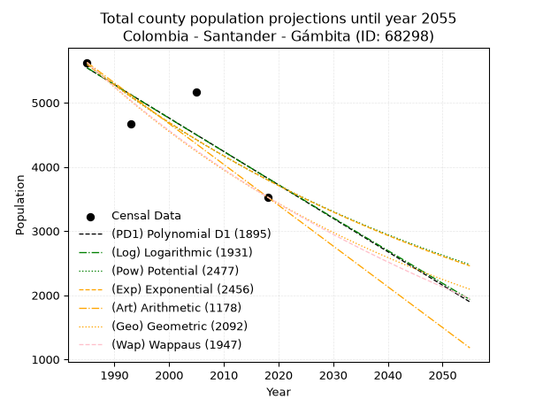
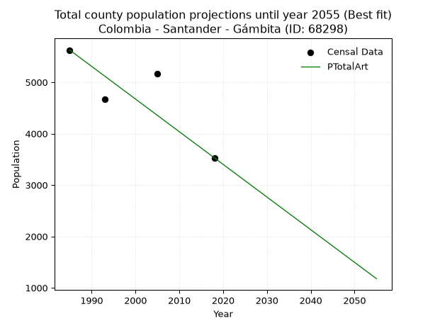
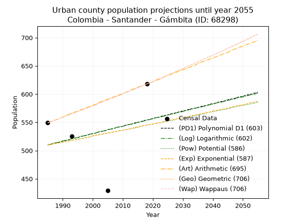
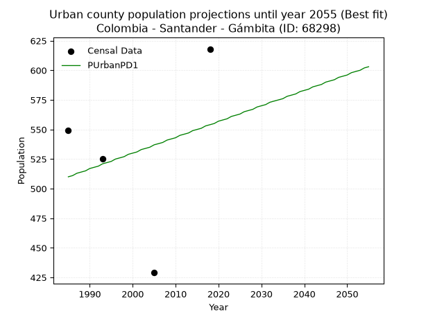
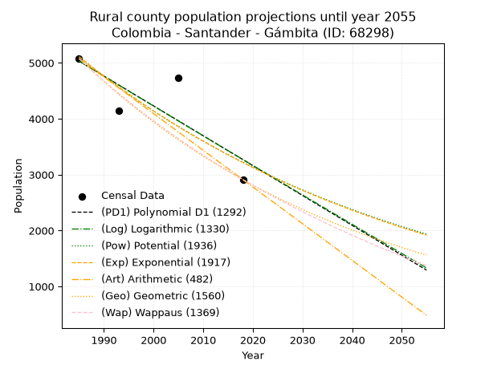
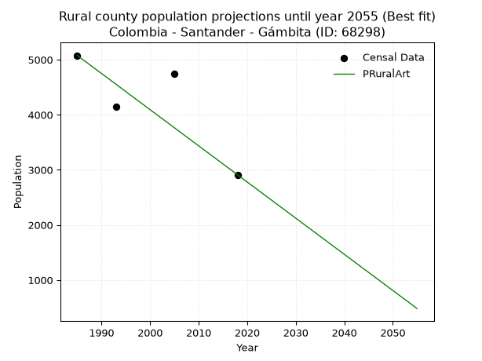

<div align="center">


</div>

# _“Population and Public Services Demand Projections (PPSD) until Year 2050 for Colombia - Santander - Gámbita (ID: 68298)”_
Keywords: `population` `public-service` `projection` `lineal` `polynomial` `logarithmic` `potential` `exponential` `arithmetic` `geometric` `wappaus` `dane` `colombia` `south-america`

PPSD are analytical estimates used by governments and planners to anticipate future changes in population size, age distribution, and the resulting community needs for utilities, healthcare, education, and infrastructure as sizing future water treatment facilities, electrical grids, and road networks based on spatial growth.

> **General running parameters**: • app_version: _v20260806_. • Python version: _3.14.7_. • Pandas version: _3.0.5_. • NumPy version: _2.5.1_. • Creates, save and include plots into reports (create_plot): _False_. • Projection until year: _2050_. • Process polynomial degree 2 and up: _False_. • Process Wappaus: _True_. • Process Wappaus: _True_. • Set negative values to zero: _True_. • Set infinite values to zero: _True_. • Drop dataset notes: _True_. 
<div align="center">

Dynamic map: [:earth_americas:Google](http://maps.google.com/maps?q=5.945997559,-73.3441853) [:earth_americas:OSM](https://www.openstreetmap.org/#map=18/5.945997559/-73.3441853&layers=P) [:earth_americas:Bing](https://www.bing.com/maps?cp=5.945997559~-73.3441853&lvl=18) [:earth_americas:Apple](https://maps.apple.com/frame?center=5.945997559%2C-73.3441853&span=0.003%2C0.006)

</div>


<div align="center">

```geojson
{
  "type": "Feature",
  "geometry": {
    "type": "Point", 
    "coordinates": [-73.3441853, 5.945997559]
  }, 
  "properties": {
    "Name": "Colombia - Santander - Gámbita (ID: 68298)"
  }
}
```

</div>


## 0. Census Data (4 records)

Census data are official statistics collected by a government about the people and housing in a country. They usually include counts of total population, age, sex, race, income, education, and jobs.

📅Global census file: [Population.xlsx](../data/Population.xlsx)

| Source   |   Year |   CountryID | CountryName   |   StateID | StateName   |   CountyID | CountyName   |   PTotal |   PUrban |   PRural |
|:---------|-------:|------------:|:--------------|----------:|:------------|-----------:|:-------------|---------:|---------:|---------:|
| DANE     |   1985 |          57 | Colombia      |        68 | Santander   |      68298 | Gámbita      |     5626 |      549 |     5077 |
| DANE     |   1993 |          57 | Colombia      |        68 | Santander   |      68298 | Gámbita      |     4667 |      525 |     4142 |
| DANE     |   2005 |          57 | Colombia      |        68 | Santander   |      68298 | Gámbita      |     5168 |      429 |     4739 |
| DANE     |   2018 |          57 | Colombia      |        68 | Santander   |      68298 | Gámbita      |     3529 |      618 |     2911 |

> 🔥Some records could had specific notes about the registered values or the corresponding urban or rural distribution.

**Local public utility companies (RUPS)**

 | SERVICIO       | ESTADO    | NOMBRE                                                     | NIT         | DEPARTAMENTO_DOMICILIO   | MUNICIPIO_DOMICILIO   | DIRECCION              |   TELEFONO | EMAIL                         | TIPO_INSCRIPCION    | REPRESENTANTE_LEGAL            | TIPO_PRESTADOR                             | CLASIFICACION                 |
|:---------------|:----------|:-----------------------------------------------------------|:------------|:-------------------------|:----------------------|:-----------------------|-----------:|:------------------------------|:--------------------|:-------------------------------|:-------------------------------------------|:------------------------------|
| ASEO           | OPERATIVA | ACUASAN E.I.C.E  E.S.P                                     | 800120175-7 | SANTANDER                | SAN GIL               | KM 1 VIA AL AEROPUERTO |    7242590 | celsodiaz09@hotmail.com       | Registro por la ESP | LUIS FRANCISCO RUIZ CEDIEL     | EMPRESA INDUSTRIAL Y COMERCIAL DEL ESTADO  | MAYOR O IGUAL A 5001 USUARIOS |
| ACUEDUCTO      | OPERATIVA | UNIDAD DE SERVICIOS PUBLICOS DE GAMBITA                    | 800099691-7 | SANTANDER                | GAMBITA               | Carrera 9 No. 4 - 28   |    7453939 | uspd@gambita-santander.gov.co | Registro por la ESP | AIDUBBY JULIANA MATEUS ESPITIA | MUNICIPIO (PRESTACIÓN DIRECTA)             | MENOR O IGUAL A 2500 USUARIOS |
| ALCANTARILLADO | OPERATIVA | UNIDAD DE SERVICIOS PUBLICOS DE GAMBITA                    | 800099691-7 | SANTANDER                | GAMBITA               | Carrera 9 No. 4 - 28   |    7453939 | uspd@gambita-santander.gov.co | Registro por la ESP | AIDUBBY JULIANA MATEUS ESPITIA | MUNICIPIO (PRESTACIÓN DIRECTA)             | MENOR O IGUAL A 2500 USUARIOS |
| ASEO           | OPERATIVA | UNIDAD DE SERVICIOS PUBLICOS DE GAMBITA                    | 800099691-7 | SANTANDER                | GAMBITA               | Carrera 9 No. 4 - 28   |    7453939 | uspd@gambita-santander.gov.co | Registro por la ESP | AIDUBBY JULIANA MATEUS ESPITIA | MUNICIPIO (PRESTACIÓN DIRECTA)             | MENOR O IGUAL A 2500 USUARIOS |
| ASEO           | OPERATIVA | EMPRESA DE SOLUCIONES AMBIENTALES PARA COLOMBIA S.A E.S.P. | 900508526-9 | SANTANDER                | SAN GIL               | VEREDA EL CUCHARO      |    7273772 | empsacol@hotmail.com          | Registro por la ESP | JHONNATHAN VESGA PALOMINO      | SOCIEDADES (EMPRESA DE SERVICIOS PUBLICOS) | MENOR O IGUAL A 2500 USUARIOS |

> [📅RUPS Database: Registro Único de Prestadores de Servicios Públicos de Colombia Suramérica - RUPS](https://www.datos.gov.co/Hacienda-y-Cr-dito-P-blico/Registro-nico-de-Prestadores-de-Servicios-P-blicos/4qkq-csdn/about_data)

## 1. Total

### 1.1. Coefficients and Parameters

* (PD1) Polynomial Deg 1: -52.09875551987052, 108958.03572862102 (lineal)
* (Log) Logarithmic: -104216.45312464259, 796897.5953386512
* (Pow) Potential: -23.531090212328955, 81.34796624506495
* (Exp) Exponential: -0.011765169257266785, 77700977828024.08
* (Art) Arithmetic: Year diff. 2018 - 1985 = 33, Population diff. 3529 - 5626 = -2097, Annual growth = -63.54545454545455
* (Geo) Geometric: Year diff. 2018 - 1985 = 33, Population diff. 3529 - 5626 = -2097, Annual growth % = -0.014033453541534846
* (Wap) Wappaus: i = -1.3882130976614866, Condition values only valid for < 200)

<sub>
Wappaus condition values: ['-0.00', '-1.39', '-2.78', '-4.16', '-5.55', '-6.94', '-8.33', '-9.72', '-11.11', '-12.49', '-13.88', '-15.27', '-16.66', '-18.05', '-19.43', '-20.82', '-22.21', '-23.60', '-24.99', '-26.38', '-27.76', '-29.15', '-30.54', '-31.93', '-33.32', '-34.71', '-36.09', '-37.48', '-38.87', '-40.26', '-41.65', '-43.03', '-44.42', '-45.81', '-47.20', '-48.59', '-49.98', '-51.36', '-52.75', '-54.14', '-55.53', '-56.92', '-58.30', '-59.69', '-61.08', '-62.47', '-63.86', '-65.25', '-66.63', '-68.02', '-69.41', '-70.80', '-72.19', '-73.58', '-74.96', '-76.35', '-77.74', '-79.13', '-80.52', '-81.90', '-83.29', '-84.68', '-86.07', '-87.46', '-88.85', '-90.23']
</sub>


### 1.2. Projected Dataset

|   Year |   CountyID |   PTotalPD1 |   PTotalLog |   PTotalPow |   PTotalExp |   PTotalArt |   PTotalGeo |   PTotalWap |
|-------:|-----------:|------------:|------------:|------------:|------------:|------------:|------------:|------------:|
|   1985 |      68298 |        5542 |        5543 |        5598 |        5597 |        5626 |        5626 |        5626 |
|   1986 |      68298 |        5490 |        5491 |        5532 |        5532 |        5562 |        5547 |        5548 |
|   1987 |      68298 |        5438 |        5438 |        5467 |        5467 |        5499 |        5469 |        5472 |
|   1988 |      68298 |        5386 |        5386 |        5403 |        5403 |        5435 |        5392 |        5396 |
|   1989 |      68298 |        5334 |        5333 |        5339 |        5340 |        5372 |        5317 |        5322 |
|   1990 |      68298 |        5282 |        5281 |        5277 |        5277 |        5308 |        5242 |        5249 |
|   1991 |      68298 |        5229 |        5229 |        5215 |        5216 |        5245 |        5169 |        5176 |
|   1992 |      68298 |        5177 |        5176 |        5153 |        5155 |        5181 |        5096 |        5105 |
|   1993 |      68298 |        5125 |        5124 |        5093 |        5094 |        5118 |        5025 |        5034 |
|   1994 |      68298 |        5073 |        5072 |        5033 |        5035 |        5054 |        4954 |        4964 |
|   1995 |      68298 |        5021 |        5019 |        4974 |        4976 |        4991 |        4885 |        4896 |
|   1996 |      68298 |        4969 |        4967 |        4916 |        4918 |        4927 |        4816 |        4828 |
|   1997 |      68298 |        4917 |        4915 |        4858 |        4860 |        4863 |        4748 |        4761 |
|   1998 |      68298 |        4865 |        4863 |        4801 |        4803 |        4800 |        4682 |        4695 |
|   1999 |      68298 |        4813 |        4811 |        4745 |        4747 |        4736 |        4616 |        4629 |
|   2000 |      68298 |        4761 |        4759 |        4690 |        4692 |        4673 |        4551 |        4565 |
|   2001 |      68298 |        4708 |        4706 |        4635 |        4637 |        4609 |        4487 |        4501 |
|   2002 |      68298 |        4656 |        4654 |        4581 |        4583 |        4546 |        4424 |        4438 |
|   2003 |      68298 |        4604 |        4602 |        4527 |        4529 |        4482 |        4362 |        4376 |
|   2004 |      68298 |        4552 |        4550 |        4474 |        4476 |        4419 |        4301 |        4315 |
|   2005 |      68298 |        4500 |        4498 |        4422 |        4424 |        4355 |        4241 |        4254 |
|   2006 |      68298 |        4448 |        4446 |        4370 |        4372 |        4292 |        4181 |        4195 |
|   2007 |      68298 |        4396 |        4394 |        4319 |        4321 |        4228 |        4123 |        4135 |
|   2008 |      68298 |        4344 |        4342 |        4269 |        4270 |        4164 |        4065 |        4077 |
|   2009 |      68298 |        4292 |        4291 |        4219 |        4220 |        4101 |        4008 |        4019 |
|   2010 |      68298 |        4240 |        4239 |        4170 |        4171 |        4037 |        3951 |        3962 |
|   2011 |      68298 |        4187 |        4187 |        4122 |        4122 |        3974 |        3896 |        3906 |
|   2012 |      68298 |        4135 |        4135 |        4074 |        4074 |        3910 |        3841 |        3850 |
|   2013 |      68298 |        4083 |        4083 |        4026 |        4026 |        3847 |        3787 |        3795 |
|   2014 |      68298 |        4031 |        4032 |        3980 |        3979 |        3783 |        3734 |        3741 |
|   2015 |      68298 |        3979 |        3980 |        3933 |        3933 |        3720 |        3682 |        3687 |
|   2016 |      68298 |        3927 |        3928 |        3888 |        3887 |        3656 |        3630 |        3634 |
|   2017 |      68298 |        3875 |        3876 |        3843 |        3841 |        3593 |        3579 |        3581 |
|   2018 |      68298 |        3823 |        3825 |        3798 |        3796 |        3529 |        3529 |        3529 |
|   2019 |      68298 |        3771 |        3773 |        3754 |        3752 |        3465 |        3479 |        3478 |
|   2020 |      68298 |        3719 |        3722 |        3711 |        3708 |        3402 |        3431 |        3427 |
|   2021 |      68298 |        3666 |        3670 |        3668 |        3665 |        3338 |        3383 |        3376 |
|   2022 |      68298 |        3614 |        3618 |        3625 |        3622 |        3275 |        3335 |        3327 |
|   2023 |      68298 |        3562 |        3567 |        3583 |        3579 |        3211 |        3288 |        3278 |
|   2024 |      68298 |        3510 |        3515 |        3542 |        3538 |        3148 |        3242 |        3229 |
|   2025 |      68298 |        3458 |        3464 |        3501 |        3496 |        3084 |        3197 |        3181 |
|   2026 |      68298 |        3406 |        3412 |        3460 |        3455 |        3021 |        3152 |        3133 |
|   2027 |      68298 |        3354 |        3361 |        3421 |        3415 |        2957 |        3108 |        3086 |
|   2028 |      68298 |        3302 |        3310 |        3381 |        3375 |        2894 |        3064 |        3040 |
|   2029 |      68298 |        3250 |        3258 |        3342 |        3335 |        2830 |        3021 |        2994 |
|   2030 |      68298 |        3198 |        3207 |        3304 |        3296 |        2766 |        2979 |        2948 |
|   2031 |      68298 |        3145 |        3156 |        3265 |        3258 |        2703 |        2937 |        2903 |
|   2032 |      68298 |        3093 |        3104 |        3228 |        3220 |        2639 |        2895 |        2858 |
|   2033 |      68298 |        3041 |        3053 |        3191 |        3182 |        2576 |        2855 |        2814 |
|   2034 |      68298 |        2989 |        3002 |        3154 |        3145 |        2512 |        2815 |        2770 |
|   2035 |      68298 |        2937 |        2950 |        3118 |        3108 |        2449 |        2775 |        2727 |
|   2036 |      68298 |        2885 |        2899 |        3082 |        3072 |        2385 |        2736 |        2684 |
|   2037 |      68298 |        2833 |        2848 |        3046 |        3036 |        2322 |        2698 |        2642 |
|   2038 |      68298 |        2781 |        2797 |        3012 |        3000 |        2258 |        2660 |        2600 |
|   2039 |      68298 |        2729 |        2746 |        2977 |        2965 |        2195 |        2623 |        2558 |
|   2040 |      68298 |        2677 |        2695 |        2943 |        2931 |        2131 |        2586 |        2517 |
|   2041 |      68298 |        2624 |        2644 |        2909 |        2896 |        2067 |        2550 |        2477 |
|   2042 |      68298 |        2572 |        2593 |        2876 |        2862 |        2004 |        2514 |        2436 |
|   2043 |      68298 |        2520 |        2542 |        2843 |        2829 |        1940 |        2479 |        2396 |
|   2044 |      68298 |        2468 |        2491 |        2810 |        2796 |        1877 |        2444 |        2357 |
|   2045 |      68298 |        2416 |        2440 |        2778 |        2763 |        1813 |        2410 |        2318 |
|   2046 |      68298 |        2364 |        2389 |        2746 |        2731 |        1750 |        2376 |        2279 |
|   2047 |      68298 |        2312 |        2338 |        2715 |        2699 |        1686 |        2342 |        2241 |
|   2048 |      68298 |        2260 |        2287 |        2684 |        2667 |        1623 |        2309 |        2203 |
|   2049 |      68298 |        2208 |        2236 |        2653 |        2636 |        1559 |        2277 |        2165 |
|   2050 |      68298 |        2156 |        2185 |        2623 |        2605 |        1496 |        2245 |        2128 |
<div align="center">

</img>

</div>


### 1.3. Best fit with absolute and relative error (%)

Relative error puts that difference into context by dividing the absolute error by the true value, creating a unitless ratio or percentage that shows the scale of the mistake.

Absolute and relative error

|   Year | Source   |   CountryID | CountryName   |   StateID | StateName   |   CountyID_x | CountyName   |   PTotal |   PUrban |   PRural |   CountyID_y |   PTotalPD1 |   PTotalLog |   PTotalPow |   PTotalExp |   PTotalArt |   PTotalGeo |   PTotalWap |   PTotalPD1AbsError |   PTotalLogAbsError |   PTotalPowAbsError |   PTotalExpAbsError |   PTotalArtAbsError |   PTotalGeoAbsError |   PTotalWapAbsError |   PTotalPD1RelError |   PTotalLogRelError |   PTotalPowRelError |   PTotalExpRelError |   PTotalArtRelError |   PTotalGeoRelError |   PTotalWapRelError |
|-------:|:---------|------------:|:--------------|----------:|:------------|-------------:|:-------------|---------:|---------:|---------:|-------------:|------------:|------------:|------------:|------------:|------------:|------------:|------------:|--------------------:|--------------------:|--------------------:|--------------------:|--------------------:|--------------------:|--------------------:|--------------------:|--------------------:|--------------------:|--------------------:|--------------------:|--------------------:|--------------------:|
|   1985 | DANE     |          57 | Colombia      |        68 | Santander   |        68298 | Gámbita      |     5626 |      549 |     5077 |        68298 |        5542 |        5543 |        5598 |        5597 |        5626 |        5626 |        5626 |                  84 |                  83 |                  28 |                  29 |                   0 |                   0 |                   0 |             1.49307 |             1.47529 |            0.497689 |            0.515464 |              0      |             0       |             0       |
|   1993 | DANE     |          57 | Colombia      |        68 | Santander   |        68298 | Gámbita      |     4667 |      525 |     4142 |        68298 |        5125 |        5124 |        5093 |        5094 |        5118 |        5025 |        5034 |                 458 |                 457 |                 426 |                 427 |                 451 |                 358 |                 367 |             9.81358 |             9.79216 |            9.12792  |            9.14935  |              9.6636 |             7.67088 |             7.86372 |
|   2005 | DANE     |          57 | Colombia      |        68 | Santander   |        68298 | Gámbita      |     5168 |      429 |     4739 |        68298 |        4500 |        4498 |        4422 |        4424 |        4355 |        4241 |        4254 |                 668 |                 670 |                 746 |                 744 |                 813 |                 927 |                 914 |            12.9257  |            12.9644  |           14.435    |           14.3963   |             15.7314 |            17.9373  |            17.6858  |
|   2018 | DANE     |          57 | Colombia      |        68 | Santander   |        68298 | Gámbita      |     3529 |      618 |     2911 |        68298 |        3823 |        3825 |        3798 |        3796 |        3529 |        3529 |        3529 |                 294 |                 296 |                 269 |                 267 |                   0 |                   0 |                   0 |             8.33097 |             8.38765 |            7.62256  |            7.56588  |              0      |             0       |             0       |

Relative error mean

| Method    |   RelError | Best   |
|:----------|-----------:|:-------|
| PTotalPD1 |    8.14083 |        |
| PTotalLog |    8.15487 |        |
| PTotalPow |    7.92079 |        |
| PTotalExp |    7.90674 |        |
| PTotalArt |    6.34875 | True   |
| PTotalGeo |    6.40205 |        |
| PTotalWap |    6.38737 |        |

💙Best method: _**PTotalArt**_
<div align="center">

</img>

</div>


### 1.4. Fresh water supply demand in liters per capita per day (lpcd)

The fresh water supply demand typically ranges from 100 to 300 liters per capita per day (lpcd) for standard domestic and municipal planning, though absolute survival minimums set by the World Health Organization are as low as 7.5 to 20 liters per day, and total consumption in high-income nations can exceed 400 liters.

> `CZ`: Level in meters above the sea level (masl)<br> `WS`: Fresh water supply demand in liters per capita per day (lpcd or l/h/d)<br> `WSAll`: Zonal fresh water supply demand in liters per second (l/s)<br> `A`: Zonal area in square meters<br> `DP`: Population density (people/hectare or p/ha)

Reference values (RAS Colombia)

|    CZ |   WS |
|------:|-----:|
|  1000 |  120 |
|  2000 |  130 |
| 99999 |  140 |

County shapefile geometry properties and water supply values

|   CountyID |      ATotal |   CZTotal |   WSTotal |
|-----------:|------------:|----------:|----------:|
|      68298 | 6.07173e+08 |   2295.88 |       140 |

Projected values for best method: PTotalArt

|   CountyID |   Year |   PTotalArt |   DPTotal |   WSTotal |   WSTotalAll |
|-----------:|-------:|------------:|----------:|----------:|-------------:|
|      68298 |   1985 |        5626 |      0.09 |       140 |      9.1162  |
|      68298 |   1986 |        5562 |      0.09 |       140 |      9.0125  |
|      68298 |   1987 |        5499 |      0.09 |       140 |      8.91042 |
|      68298 |   1988 |        5435 |      0.09 |       140 |      8.80671 |
|      68298 |   1989 |        5372 |      0.09 |       140 |      8.70463 |
|      68298 |   1990 |        5308 |      0.09 |       140 |      8.60093 |
|      68298 |   1991 |        5245 |      0.09 |       140 |      8.49884 |
|      68298 |   1992 |        5181 |      0.09 |       140 |      8.39514 |
|      68298 |   1993 |        5118 |      0.08 |       140 |      8.29306 |
|      68298 |   1994 |        5054 |      0.08 |       140 |      8.18935 |
|      68298 |   1995 |        4991 |      0.08 |       140 |      8.08727 |
|      68298 |   1996 |        4927 |      0.08 |       140 |      7.98356 |
|      68298 |   1997 |        4863 |      0.08 |       140 |      7.87986 |
|      68298 |   1998 |        4800 |      0.08 |       140 |      7.77778 |
|      68298 |   1999 |        4736 |      0.08 |       140 |      7.67407 |
|      68298 |   2000 |        4673 |      0.08 |       140 |      7.57199 |
|      68298 |   2001 |        4609 |      0.08 |       140 |      7.46829 |
|      68298 |   2002 |        4546 |      0.07 |       140 |      7.3662  |
|      68298 |   2003 |        4482 |      0.07 |       140 |      7.2625  |
|      68298 |   2004 |        4419 |      0.07 |       140 |      7.16042 |
|      68298 |   2005 |        4355 |      0.07 |       140 |      7.05671 |
|      68298 |   2006 |        4292 |      0.07 |       140 |      6.95463 |
|      68298 |   2007 |        4228 |      0.07 |       140 |      6.85093 |
|      68298 |   2008 |        4164 |      0.07 |       140 |      6.74722 |
|      68298 |   2009 |        4101 |      0.07 |       140 |      6.64514 |
|      68298 |   2010 |        4037 |      0.07 |       140 |      6.54144 |
|      68298 |   2011 |        3974 |      0.07 |       140 |      6.43935 |
|      68298 |   2012 |        3910 |      0.06 |       140 |      6.33565 |
|      68298 |   2013 |        3847 |      0.06 |       140 |      6.23356 |
|      68298 |   2014 |        3783 |      0.06 |       140 |      6.12986 |
|      68298 |   2015 |        3720 |      0.06 |       140 |      6.02778 |
|      68298 |   2016 |        3656 |      0.06 |       140 |      5.92407 |
|      68298 |   2017 |        3593 |      0.06 |       140 |      5.82199 |
|      68298 |   2018 |        3529 |      0.06 |       140 |      5.71829 |
|      68298 |   2019 |        3465 |      0.06 |       140 |      5.61458 |
|      68298 |   2020 |        3402 |      0.06 |       140 |      5.5125  |
|      68298 |   2021 |        3338 |      0.05 |       140 |      5.4088  |
|      68298 |   2022 |        3275 |      0.05 |       140 |      5.30671 |
|      68298 |   2023 |        3211 |      0.05 |       140 |      5.20301 |
|      68298 |   2024 |        3148 |      0.05 |       140 |      5.10093 |
|      68298 |   2025 |        3084 |      0.05 |       140 |      4.99722 |
|      68298 |   2026 |        3021 |      0.05 |       140 |      4.89514 |
|      68298 |   2027 |        2957 |      0.05 |       140 |      4.79144 |
|      68298 |   2028 |        2894 |      0.05 |       140 |      4.68935 |
|      68298 |   2029 |        2830 |      0.05 |       140 |      4.58565 |
|      68298 |   2030 |        2766 |      0.05 |       140 |      4.48194 |
|      68298 |   2031 |        2703 |      0.04 |       140 |      4.37986 |
|      68298 |   2032 |        2639 |      0.04 |       140 |      4.27616 |
|      68298 |   2033 |        2576 |      0.04 |       140 |      4.17407 |
|      68298 |   2034 |        2512 |      0.04 |       140 |      4.07037 |
|      68298 |   2035 |        2449 |      0.04 |       140 |      3.96829 |
|      68298 |   2036 |        2385 |      0.04 |       140 |      3.86458 |
|      68298 |   2037 |        2322 |      0.04 |       140 |      3.7625  |
|      68298 |   2038 |        2258 |      0.04 |       140 |      3.6588  |
|      68298 |   2039 |        2195 |      0.04 |       140 |      3.55671 |
|      68298 |   2040 |        2131 |      0.04 |       140 |      3.45301 |
|      68298 |   2041 |        2067 |      0.03 |       140 |      3.34931 |
|      68298 |   2042 |        2004 |      0.03 |       140 |      3.24722 |
|      68298 |   2043 |        1940 |      0.03 |       140 |      3.14352 |
|      68298 |   2044 |        1877 |      0.03 |       140 |      3.04144 |
|      68298 |   2045 |        1813 |      0.03 |       140 |      2.93773 |
|      68298 |   2046 |        1750 |      0.03 |       140 |      2.83565 |
|      68298 |   2047 |        1686 |      0.03 |       140 |      2.73194 |
|      68298 |   2048 |        1623 |      0.03 |       140 |      2.62986 |
|      68298 |   2049 |        1559 |      0.03 |       140 |      2.52616 |
|      68298 |   2050 |        1496 |      0.02 |       140 |      2.42407 |

## 2. Urban

### 2.1. Coefficients and Parameters

* (PD1) Polynomial Deg 1: 1.3307908470492675, -2131.6643918102977 (lineal)
* (Log) Logarithmic: 2642.0139015818513, -19551.71883769434
* (Pow) Potential: 3.988110165158513, -10.444259748371215
* (Exp) Exponential: 0.0020135718152907984, 9.367193171631408
* (Art) Arithmetic: Year diff. 2018 - 1985 = 33, Population diff. 618 - 549 = 69, Annual growth = 2.090909090909091
* (Geo) Geometric: Year diff. 2018 - 1985 = 33, Population diff. 618 - 549 = 69, Annual growth % = 0.003594019295174
* (Wap) Wappaus: i = 0.3583391758198956, Condition values only valid for < 200)

<sub>
Wappaus condition values: ['0.00', '0.36', '0.72', '1.08', '1.43', '1.79', '2.15', '2.51', '2.87', '3.23', '3.58', '3.94', '4.30', '4.66', '5.02', '5.38', '5.73', '6.09', '6.45', '6.81', '7.17', '7.53', '7.88', '8.24', '8.60', '8.96', '9.32', '9.68', '10.03', '10.39', '10.75', '11.11', '11.47', '11.83', '12.18', '12.54', '12.90', '13.26', '13.62', '13.98', '14.33', '14.69', '15.05', '15.41', '15.77', '16.13', '16.48', '16.84', '17.20', '17.56', '17.92', '18.28', '18.63', '18.99', '19.35', '19.71', '20.07', '20.43', '20.78', '21.14', '21.50', '21.86', '22.22', '22.58', '22.93', '23.29']
</sub>


### 2.2. Projected Dataset

|   Year |   CountyID |   PUrbanPD1 |   PUrbanLog |   PUrbanPow |   PUrbanExp |   PUrbanArt |   PUrbanGeo |   PUrbanWap |
|-------:|-----------:|------------:|------------:|------------:|------------:|------------:|------------:|------------:|
|   1985 |      68298 |         510 |         510 |         510 |         510 |         549 |         549 |         549 |
|   1986 |      68298 |         511 |         511 |         511 |         511 |         551 |         551 |         551 |
|   1987 |      68298 |         513 |         513 |         512 |         512 |         553 |         553 |         553 |
|   1988 |      68298 |         514 |         514 |         513 |         513 |         555 |         555 |         555 |
|   1989 |      68298 |         515 |         515 |         514 |         514 |         557 |         557 |         557 |
|   1990 |      68298 |         517 |         517 |         515 |         515 |         559 |         559 |         559 |
|   1991 |      68298 |         518 |         518 |         516 |         516 |         562 |         561 |         561 |
|   1992 |      68298 |         519 |         519 |         517 |         517 |         564 |         563 |         563 |
|   1993 |      68298 |         521 |         521 |         518 |         518 |         566 |         565 |         565 |
|   1994 |      68298 |         522 |         522 |         519 |         519 |         568 |         567 |         567 |
|   1995 |      68298 |         523 |         523 |         520 |         520 |         570 |         569 |         569 |
|   1996 |      68298 |         525 |         525 |         521 |         521 |         572 |         571 |         571 |
|   1997 |      68298 |         526 |         526 |         522 |         522 |         574 |         573 |         573 |
|   1998 |      68298 |         527 |         527 |         523 |         523 |         576 |         575 |         575 |
|   1999 |      68298 |         529 |         529 |         524 |         524 |         578 |         577 |         577 |
|   2000 |      68298 |         530 |         530 |         526 |         526 |         580 |         579 |         579 |
|   2001 |      68298 |         531 |         531 |         527 |         527 |         582 |         581 |         581 |
|   2002 |      68298 |         533 |         533 |         528 |         528 |         585 |         584 |         583 |
|   2003 |      68298 |         534 |         534 |         529 |         529 |         587 |         586 |         586 |
|   2004 |      68298 |         535 |         535 |         530 |         530 |         589 |         588 |         588 |
|   2005 |      68298 |         537 |         537 |         531 |         531 |         591 |         590 |         590 |
|   2006 |      68298 |         538 |         538 |         532 |         532 |         593 |         592 |         592 |
|   2007 |      68298 |         539 |         539 |         533 |         533 |         595 |         594 |         594 |
|   2008 |      68298 |         541 |         541 |         534 |         534 |         597 |         596 |         596 |
|   2009 |      68298 |         542 |         542 |         535 |         535 |         599 |         598 |         598 |
|   2010 |      68298 |         543 |         543 |         536 |         536 |         601 |         601 |         600 |
|   2011 |      68298 |         545 |         544 |         537 |         537 |         603 |         603 |         603 |
|   2012 |      68298 |         546 |         546 |         538 |         538 |         605 |         605 |         605 |
|   2013 |      68298 |         547 |         547 |         539 |         539 |         608 |         607 |         607 |
|   2014 |      68298 |         549 |         548 |         540 |         541 |         610 |         609 |         609 |
|   2015 |      68298 |         550 |         550 |         541 |         542 |         612 |         611 |         611 |
|   2016 |      68298 |         551 |         551 |         543 |         543 |         614 |         614 |         614 |
|   2017 |      68298 |         553 |         552 |         544 |         544 |         616 |         616 |         616 |
|   2018 |      68298 |         554 |         554 |         545 |         545 |         618 |         618 |         618 |
|   2019 |      68298 |         555 |         555 |         546 |         546 |         620 |         620 |         620 |
|   2020 |      68298 |         557 |         556 |         547 |         547 |         622 |         622 |         622 |
|   2021 |      68298 |         558 |         558 |         548 |         548 |         624 |         625 |         625 |
|   2022 |      68298 |         559 |         559 |         549 |         549 |         626 |         627 |         627 |
|   2023 |      68298 |         561 |         560 |         550 |         550 |         628 |         629 |         629 |
|   2024 |      68298 |         562 |         561 |         551 |         552 |         631 |         631 |         631 |
|   2025 |      68298 |         563 |         563 |         552 |         553 |         633 |         634 |         634 |
|   2026 |      68298 |         565 |         564 |         553 |         554 |         635 |         636 |         636 |
|   2027 |      68298 |         566 |         565 |         554 |         555 |         637 |         638 |         638 |
|   2028 |      68298 |         567 |         567 |         556 |         556 |         639 |         641 |         641 |
|   2029 |      68298 |         569 |         568 |         557 |         557 |         641 |         643 |         643 |
|   2030 |      68298 |         570 |         569 |         558 |         558 |         643 |         645 |         645 |
|   2031 |      68298 |         571 |         571 |         559 |         559 |         645 |         648 |         648 |
|   2032 |      68298 |         573 |         572 |         560 |         560 |         647 |         650 |         650 |
|   2033 |      68298 |         574 |         573 |         561 |         562 |         649 |         652 |         652 |
|   2034 |      68298 |         575 |         575 |         562 |         563 |         651 |         655 |         655 |
|   2035 |      68298 |         576 |         576 |         563 |         564 |         654 |         657 |         657 |
|   2036 |      68298 |         578 |         577 |         564 |         565 |         656 |         659 |         659 |
|   2037 |      68298 |         579 |         578 |         565 |         566 |         658 |         662 |         662 |
|   2038 |      68298 |         580 |         580 |         567 |         567 |         660 |         664 |         664 |
|   2039 |      68298 |         582 |         581 |         568 |         568 |         662 |         666 |         667 |
|   2040 |      68298 |         583 |         582 |         569 |         570 |         664 |         669 |         669 |
|   2041 |      68298 |         584 |         584 |         570 |         571 |         666 |         671 |         671 |
|   2042 |      68298 |         586 |         585 |         571 |         572 |         668 |         674 |         674 |
|   2043 |      68298 |         587 |         586 |         572 |         573 |         670 |         676 |         676 |
|   2044 |      68298 |         588 |         587 |         573 |         574 |         672 |         678 |         679 |
|   2045 |      68298 |         590 |         589 |         574 |         575 |         674 |         681 |         681 |
|   2046 |      68298 |         591 |         590 |         575 |         577 |         677 |         683 |         684 |
|   2047 |      68298 |         592 |         591 |         577 |         578 |         679 |         686 |         686 |
|   2048 |      68298 |         594 |         593 |         578 |         579 |         681 |         688 |         689 |
|   2049 |      68298 |         595 |         594 |         579 |         580 |         683 |         691 |         691 |
|   2050 |      68298 |         596 |         595 |         580 |         581 |         685 |         693 |         694 |
<div align="center">

</img>

</div>


### 2.3. Best fit with absolute and relative error (%)

Relative error puts that difference into context by dividing the absolute error by the true value, creating a unitless ratio or percentage that shows the scale of the mistake.

Absolute and relative error

|   Year | Source   |   CountryID | CountryName   |   StateID | StateName   |   CountyID_x | CountyName   |   PTotal |   PUrban |   PRural |   CountyID_y |   PUrbanPD1 |   PUrbanLog |   PUrbanPow |   PUrbanExp |   PUrbanArt |   PUrbanGeo |   PUrbanWap |   PUrbanPD1AbsError |   PUrbanLogAbsError |   PUrbanPowAbsError |   PUrbanExpAbsError |   PUrbanArtAbsError |   PUrbanGeoAbsError |   PUrbanWapAbsError |   PUrbanPD1RelError |   PUrbanLogRelError |   PUrbanPowRelError |   PUrbanExpRelError |   PUrbanArtRelError |   PUrbanGeoRelError |   PUrbanWapRelError |
|-------:|:---------|------------:|:--------------|----------:|:------------|-------------:|:-------------|---------:|---------:|---------:|-------------:|------------:|------------:|------------:|------------:|------------:|------------:|------------:|--------------------:|--------------------:|--------------------:|--------------------:|--------------------:|--------------------:|--------------------:|--------------------:|--------------------:|--------------------:|--------------------:|--------------------:|--------------------:|--------------------:|
|   1985 | DANE     |          57 | Colombia      |        68 | Santander   |        68298 | Gámbita      |     5626 |      549 |     5077 |        68298 |         510 |         510 |         510 |         510 |         549 |         549 |         549 |                  39 |                  39 |                  39 |                  39 |                   0 |                   0 |                   0 |            7.10383  |            7.10383  |             7.10383 |             7.10383 |             0       |             0       |             0       |
|   1993 | DANE     |          57 | Colombia      |        68 | Santander   |        68298 | Gámbita      |     4667 |      525 |     4142 |        68298 |         521 |         521 |         518 |         518 |         566 |         565 |         565 |                   4 |                   4 |                   7 |                   7 |                  41 |                  40 |                  40 |            0.761905 |            0.761905 |             1.33333 |             1.33333 |             7.80952 |             7.61905 |             7.61905 |
|   2005 | DANE     |          57 | Colombia      |        68 | Santander   |        68298 | Gámbita      |     5168 |      429 |     4739 |        68298 |         537 |         537 |         531 |         531 |         591 |         590 |         590 |                 108 |                 108 |                 102 |                 102 |                 162 |                 161 |                 161 |           25.1748   |           25.1748   |            23.7762  |            23.7762  |            37.7622  |            37.5291  |            37.5291  |
|   2018 | DANE     |          57 | Colombia      |        68 | Santander   |        68298 | Gámbita      |     3529 |      618 |     2911 |        68298 |         554 |         554 |         545 |         545 |         618 |         618 |         618 |                  64 |                  64 |                  73 |                  73 |                   0 |                   0 |                   0 |           10.356    |           10.356    |            11.8123  |            11.8123  |             0       |             0       |             0       |

Relative error mean

| Method    |   RelError | Best   |
|:----------|-----------:|:-------|
| PUrbanPD1 |    10.8491 | True   |
| PUrbanLog |    10.8491 | True   |
| PUrbanPow |    11.0064 |        |
| PUrbanExp |    11.0064 |        |
| PUrbanArt |    11.3929 |        |
| PUrbanGeo |    11.287  |        |
| PUrbanWap |    11.287  |        |

💙Best method: _**PUrbanPD1**_
<div align="center">

</img>

</div>


### 2.4. Fresh water supply demand in liters per capita per day (lpcd)

The fresh water supply demand typically ranges from 100 to 300 liters per capita per day (lpcd) for standard domestic and municipal planning, though absolute survival minimums set by the World Health Organization are as low as 7.5 to 20 liters per day, and total consumption in high-income nations can exceed 400 liters.

> `CZ`: Level in meters above the sea level (masl)<br> `WS`: Fresh water supply demand in liters per capita per day (lpcd or l/h/d)<br> `WSAll`: Zonal fresh water supply demand in liters per second (l/s)<br> `A`: Zonal area in square meters<br> `DP`: Population density (people/hectare or p/ha)

Reference values (RAS Colombia)

|    CZ |   WS |
|------:|-----:|
|  1000 |  120 |
|  2000 |  130 |
| 99999 |  140 |

County shapefile geometry properties and water supply values

|   CountyID |   AUrban |   CZUrban |   WSUrban |
|-----------:|---------:|----------:|----------:|
|      68298 |   179093 |   1896.67 |       130 |

Projected values for best method: PUrbanPD1

|   CountyID |   Year |   PUrbanPD1 |   DPUrban |   WSUrban |   WSUrbanAll |
|-----------:|-------:|------------:|----------:|----------:|-------------:|
|      68298 |   1985 |         510 |     28.48 |       130 |     0.767361 |
|      68298 |   1986 |         511 |     28.53 |       130 |     0.768866 |
|      68298 |   1987 |         513 |     28.64 |       130 |     0.771875 |
|      68298 |   1988 |         514 |     28.7  |       130 |     0.77338  |
|      68298 |   1989 |         515 |     28.76 |       130 |     0.774884 |
|      68298 |   1990 |         517 |     28.87 |       130 |     0.777894 |
|      68298 |   1991 |         518 |     28.92 |       130 |     0.779398 |
|      68298 |   1992 |         519 |     28.98 |       130 |     0.780903 |
|      68298 |   1993 |         521 |     29.09 |       130 |     0.783912 |
|      68298 |   1994 |         522 |     29.15 |       130 |     0.785417 |
|      68298 |   1995 |         523 |     29.2  |       130 |     0.786921 |
|      68298 |   1996 |         525 |     29.31 |       130 |     0.789931 |
|      68298 |   1997 |         526 |     29.37 |       130 |     0.791435 |
|      68298 |   1998 |         527 |     29.43 |       130 |     0.79294  |
|      68298 |   1999 |         529 |     29.54 |       130 |     0.795949 |
|      68298 |   2000 |         530 |     29.59 |       130 |     0.797454 |
|      68298 |   2001 |         531 |     29.65 |       130 |     0.798958 |
|      68298 |   2002 |         533 |     29.76 |       130 |     0.801968 |
|      68298 |   2003 |         534 |     29.82 |       130 |     0.803472 |
|      68298 |   2004 |         535 |     29.87 |       130 |     0.804977 |
|      68298 |   2005 |         537 |     29.98 |       130 |     0.807986 |
|      68298 |   2006 |         538 |     30.04 |       130 |     0.809491 |
|      68298 |   2007 |         539 |     30.1  |       130 |     0.810995 |
|      68298 |   2008 |         541 |     30.21 |       130 |     0.814005 |
|      68298 |   2009 |         542 |     30.26 |       130 |     0.815509 |
|      68298 |   2010 |         543 |     30.32 |       130 |     0.817014 |
|      68298 |   2011 |         545 |     30.43 |       130 |     0.820023 |
|      68298 |   2012 |         546 |     30.49 |       130 |     0.821528 |
|      68298 |   2013 |         547 |     30.54 |       130 |     0.823032 |
|      68298 |   2014 |         549 |     30.65 |       130 |     0.826042 |
|      68298 |   2015 |         550 |     30.71 |       130 |     0.827546 |
|      68298 |   2016 |         551 |     30.77 |       130 |     0.829051 |
|      68298 |   2017 |         553 |     30.88 |       130 |     0.83206  |
|      68298 |   2018 |         554 |     30.93 |       130 |     0.833565 |
|      68298 |   2019 |         555 |     30.99 |       130 |     0.835069 |
|      68298 |   2020 |         557 |     31.1  |       130 |     0.838079 |
|      68298 |   2021 |         558 |     31.16 |       130 |     0.839583 |
|      68298 |   2022 |         559 |     31.21 |       130 |     0.841088 |
|      68298 |   2023 |         561 |     31.32 |       130 |     0.844097 |
|      68298 |   2024 |         562 |     31.38 |       130 |     0.845602 |
|      68298 |   2025 |         563 |     31.44 |       130 |     0.847106 |
|      68298 |   2026 |         565 |     31.55 |       130 |     0.850116 |
|      68298 |   2027 |         566 |     31.6  |       130 |     0.85162  |
|      68298 |   2028 |         567 |     31.66 |       130 |     0.853125 |
|      68298 |   2029 |         569 |     31.77 |       130 |     0.856134 |
|      68298 |   2030 |         570 |     31.83 |       130 |     0.857639 |
|      68298 |   2031 |         571 |     31.88 |       130 |     0.859144 |
|      68298 |   2032 |         573 |     31.99 |       130 |     0.862153 |
|      68298 |   2033 |         574 |     32.05 |       130 |     0.863657 |
|      68298 |   2034 |         575 |     32.11 |       130 |     0.865162 |
|      68298 |   2035 |         576 |     32.16 |       130 |     0.866667 |
|      68298 |   2036 |         578 |     32.27 |       130 |     0.869676 |
|      68298 |   2037 |         579 |     32.33 |       130 |     0.871181 |
|      68298 |   2038 |         580 |     32.39 |       130 |     0.872685 |
|      68298 |   2039 |         582 |     32.5  |       130 |     0.875694 |
|      68298 |   2040 |         583 |     32.55 |       130 |     0.877199 |
|      68298 |   2041 |         584 |     32.61 |       130 |     0.878704 |
|      68298 |   2042 |         586 |     32.72 |       130 |     0.881713 |
|      68298 |   2043 |         587 |     32.78 |       130 |     0.883218 |
|      68298 |   2044 |         588 |     32.83 |       130 |     0.884722 |
|      68298 |   2045 |         590 |     32.94 |       130 |     0.887731 |
|      68298 |   2046 |         591 |     33    |       130 |     0.889236 |
|      68298 |   2047 |         592 |     33.06 |       130 |     0.890741 |
|      68298 |   2048 |         594 |     33.17 |       130 |     0.89375  |
|      68298 |   2049 |         595 |     33.22 |       130 |     0.895255 |
|      68298 |   2050 |         596 |     33.28 |       130 |     0.896759 |

## 3. Rural

### 3.1. Coefficients and Parameters

* (PD1) Polynomial Deg 1: -53.42954636691977, 111089.70012043127 (lineal)
* (Log) Logarithmic: -106858.4670262245, 816449.314176346
* (Pow) Potential: -28.015180754612263, 96.09587280586253
* (Exp) Exponential: -0.014009705702600277, 6107076876185000.0
* (Art) Arithmetic: Year diff. 2018 - 1985 = 33, Population diff. 2911 - 5077 = -2166, Annual growth = -65.63636363636364
* (Geo) Geometric: Year diff. 2018 - 1985 = 33, Population diff. 2911 - 5077 = -2166, Annual growth % = -0.016714013526219484
* (Wap) Wappaus: i = -1.6433741521372969, Condition values only valid for < 200)

<sub>
Wappaus condition values: ['-0.00', '-1.64', '-3.29', '-4.93', '-6.57', '-8.22', '-9.86', '-11.50', '-13.15', '-14.79', '-16.43', '-18.08', '-19.72', '-21.36', '-23.01', '-24.65', '-26.29', '-27.94', '-29.58', '-31.22', '-32.87', '-34.51', '-36.15', '-37.80', '-39.44', '-41.08', '-42.73', '-44.37', '-46.01', '-47.66', '-49.30', '-50.94', '-52.59', '-54.23', '-55.87', '-57.52', '-59.16', '-60.80', '-62.45', '-64.09', '-65.73', '-67.38', '-69.02', '-70.67', '-72.31', '-73.95', '-75.60', '-77.24', '-78.88', '-80.53', '-82.17', '-83.81', '-85.46', '-87.10', '-88.74', '-90.39', '-92.03', '-93.67', '-95.32', '-96.96', '-98.60', '-100.25', '-101.89', '-103.53', '-105.18', '-106.82']
</sub>


### 3.2. Projected Dataset

|   Year |   CountyID |   PRuralPD1 |   PRuralLog |   PRuralPow |   PRuralExp |   PRuralArt |   PRuralGeo |   PRuralWap |
|-------:|-----------:|------------:|------------:|------------:|------------:|------------:|------------:|------------:|
|   1985 |      68298 |        5032 |        5033 |        5111 |        5110 |        5077 |        5077 |        5077 |
|   1986 |      68298 |        4979 |        4979 |        5040 |        5039 |        5011 |        4992 |        4994 |
|   1987 |      68298 |        4925 |        4925 |        4969 |        4969 |        4946 |        4909 |        4913 |
|   1988 |      68298 |        4872 |        4872 |        4899 |        4900 |        4880 |        4827 |        4833 |
|   1989 |      68298 |        4818 |        4818 |        4831 |        4832 |        4814 |        4746 |        4754 |
|   1990 |      68298 |        4765 |        4764 |        4763 |        4764 |        4749 |        4667 |        4676 |
|   1991 |      68298 |        4711 |        4710 |        4697 |        4698 |        4683 |        4589 |        4600 |
|   1992 |      68298 |        4658 |        4657 |        4631 |        4633 |        4618 |        4512 |        4525 |
|   1993 |      68298 |        4605 |        4603 |        4566 |        4568 |        4552 |        4437 |        4451 |
|   1994 |      68298 |        4551 |        4550 |        4503 |        4505 |        4486 |        4362 |        4378 |
|   1995 |      68298 |        4498 |        4496 |        4440 |        4442 |        4421 |        4289 |        4306 |
|   1996 |      68298 |        4444 |        4442 |        4378 |        4380 |        4355 |        4218 |        4235 |
|   1997 |      68298 |        4391 |        4389 |        4317 |        4319 |        4289 |        4147 |        4166 |
|   1998 |      68298 |        4337 |        4335 |        4257 |        4259 |        4224 |        4078 |        4097 |
|   1999 |      68298 |        4284 |        4282 |        4198 |        4200 |        4158 |        4010 |        4029 |
|   2000 |      68298 |        4231 |        4229 |        4139 |        4141 |        4092 |        3943 |        3963 |
|   2001 |      68298 |        4177 |        4175 |        4082 |        4084 |        4027 |        3877 |        3897 |
|   2002 |      68298 |        4124 |        4122 |        4025 |        4027 |        3961 |        3812 |        3832 |
|   2003 |      68298 |        4070 |        4068 |        3969 |        3971 |        3896 |        3748 |        3769 |
|   2004 |      68298 |        4017 |        4015 |        3914 |        3916 |        3830 |        3686 |        3706 |
|   2005 |      68298 |        3963 |        3962 |        3860 |        3861 |        3764 |        3624 |        3644 |
|   2006 |      68298 |        3910 |        3908 |        3806 |        3808 |        3699 |        3564 |        3583 |
|   2007 |      68298 |        3857 |        3855 |        3753 |        3755 |        3633 |        3504 |        3522 |
|   2008 |      68298 |        3803 |        3802 |        3701 |        3702 |        3567 |        3445 |        3463 |
|   2009 |      68298 |        3750 |        3749 |        3650 |        3651 |        3502 |        3388 |        3404 |
|   2010 |      68298 |        3696 |        3696 |        3599 |        3600 |        3436 |        3331 |        3347 |
|   2011 |      68298 |        3643 |        3642 |        3550 |        3550 |        3370 |        3276 |        3290 |
|   2012 |      68298 |        3589 |        3589 |        3501 |        3501 |        3305 |        3221 |        3233 |
|   2013 |      68298 |        3536 |        3536 |        3452 |        3452 |        3239 |        3167 |        3178 |
|   2014 |      68298 |        3483 |        3483 |        3404 |        3404 |        3174 |        3114 |        3123 |
|   2015 |      68298 |        3429 |        3430 |        3357 |        3357 |        3108 |        3062 |        3069 |
|   2016 |      68298 |        3376 |        3377 |        3311 |        3310 |        3042 |        3011 |        3016 |
|   2017 |      68298 |        3322 |        3324 |        3265 |        3264 |        2977 |        2960 |        2963 |
|   2018 |      68298 |        3269 |        3271 |        3220 |        3218 |        2911 |        2911 |        2911 |
|   2019 |      68298 |        3215 |        3218 |        3176 |        3174 |        2845 |        2862 |        2860 |
|   2020 |      68298 |        3162 |        3165 |        3132 |        3129 |        2780 |        2815 |        2809 |
|   2021 |      68298 |        3109 |        3112 |        3089 |        3086 |        2714 |        2767 |        2759 |
|   2022 |      68298 |        3055 |        3060 |        3047 |        3043 |        2648 |        2721 |        2710 |
|   2023 |      68298 |        3002 |        3007 |        3005 |        3001 |        2583 |        2676 |        2661 |
|   2024 |      68298 |        2948 |        2954 |        2963 |        2959 |        2517 |        2631 |        2613 |
|   2025 |      68298 |        2895 |        2901 |        2923 |        2918 |        2452 |        2587 |        2565 |
|   2026 |      68298 |        2841 |        2848 |        2883 |        2877 |        2386 |        2544 |        2518 |
|   2027 |      68298 |        2788 |        2796 |        2843 |        2837 |        2320 |        2501 |        2472 |
|   2028 |      68298 |        2735 |        2743 |        2804 |        2798 |        2255 |        2459 |        2426 |
|   2029 |      68298 |        2681 |        2690 |        2765 |        2759 |        2189 |        2418 |        2381 |
|   2030 |      68298 |        2628 |        2638 |        2728 |        2720 |        2123 |        2378 |        2336 |
|   2031 |      68298 |        2574 |        2585 |        2690 |        2683 |        2058 |        2338 |        2292 |
|   2032 |      68298 |        2521 |        2532 |        2653 |        2645 |        1992 |        2299 |        2248 |
|   2033 |      68298 |        2467 |        2480 |        2617 |        2608 |        1926 |        2261 |        2205 |
|   2034 |      68298 |        2414 |        2427 |        2581 |        2572 |        1861 |        2223 |        2162 |
|   2035 |      68298 |        2361 |        2375 |        2546 |        2536 |        1795 |        2186 |        2120 |
|   2036 |      68298 |        2307 |        2322 |        2511 |        2501 |        1730 |        2149 |        2078 |
|   2037 |      68298 |        2254 |        2270 |        2477 |        2466 |        1664 |        2113 |        2037 |
|   2038 |      68298 |        2200 |        2217 |        2443 |        2432 |        1598 |        2078 |        1997 |
|   2039 |      68298 |        2147 |        2165 |        2410 |        2398 |        1533 |        2043 |        1956 |
|   2040 |      68298 |        2093 |        2112 |        2377 |        2365 |        1467 |        2009 |        1916 |
|   2041 |      68298 |        2040 |        2060 |        2344 |        2332 |        1401 |        1976 |        1877 |
|   2042 |      68298 |        1987 |        2008 |        2312 |        2299 |        1336 |        1942 |        1838 |
|   2043 |      68298 |        1933 |        1955 |        2281 |        2267 |        1270 |        1910 |        1800 |
|   2044 |      68298 |        1880 |        1903 |        2250 |        2236 |        1204 |        1878 |        1762 |
|   2045 |      68298 |        1826 |        1851 |        2219 |        2205 |        1139 |        1847 |        1724 |
|   2046 |      68298 |        1773 |        1799 |        2189 |        2174 |        1073 |        1816 |        1687 |
|   2047 |      68298 |        1719 |        1746 |        2159 |        2144 |        1008 |        1785 |        1650 |
|   2048 |      68298 |        1666 |        1694 |        2130 |        2114 |         942 |        1756 |        1614 |
|   2049 |      68298 |        1613 |        1642 |        2101 |        2085 |         876 |        1726 |        1578 |
|   2050 |      68298 |        1559 |        1590 |        2072 |        2056 |         811 |        1697 |        1542 |
<div align="center">

</img>

</div>


### 3.3. Best fit with absolute and relative error (%)

Relative error puts that difference into context by dividing the absolute error by the true value, creating a unitless ratio or percentage that shows the scale of the mistake.

Absolute and relative error

|   Year | Source   |   CountryID | CountryName   |   StateID | StateName   |   CountyID_x | CountyName   |   PTotal |   PUrban |   PRural |   CountyID_y |   PRuralPD1 |   PRuralLog |   PRuralPow |   PRuralExp |   PRuralArt |   PRuralGeo |   PRuralWap |   PRuralPD1AbsError |   PRuralLogAbsError |   PRuralPowAbsError |   PRuralExpAbsError |   PRuralArtAbsError |   PRuralGeoAbsError |   PRuralWapAbsError |   PRuralPD1RelError |   PRuralLogRelError |   PRuralPowRelError |   PRuralExpRelError |   PRuralArtRelError |   PRuralGeoRelError |   PRuralWapRelError |
|-------:|:---------|------------:|:--------------|----------:|:------------|-------------:|:-------------|---------:|---------:|---------:|-------------:|------------:|------------:|------------:|------------:|------------:|------------:|------------:|--------------------:|--------------------:|--------------------:|--------------------:|--------------------:|--------------------:|--------------------:|--------------------:|--------------------:|--------------------:|--------------------:|--------------------:|--------------------:|--------------------:|
|   1985 | DANE     |          57 | Colombia      |        68 | Santander   |        68298 | Gámbita      |     5626 |      549 |     5077 |        68298 |        5032 |        5033 |        5111 |        5110 |        5077 |        5077 |        5077 |                  45 |                  44 |                  34 |                  33 |                   0 |                   0 |                   0 |             0.88635 |            0.866654 |            0.669687 |             0.64999 |              0      |             0       |             0       |
|   1993 | DANE     |          57 | Colombia      |        68 | Santander   |        68298 | Gámbita      |     4667 |      525 |     4142 |        68298 |        4605 |        4603 |        4566 |        4568 |        4552 |        4437 |        4451 |                 463 |                 461 |                 424 |                 426 |                 410 |                 295 |                 309 |            11.1782  |           11.1299   |           10.2366   |            10.2849  |              9.8986 |             7.12216 |             7.46016 |
|   2005 | DANE     |          57 | Colombia      |        68 | Santander   |        68298 | Gámbita      |     5168 |      429 |     4739 |        68298 |        3963 |        3962 |        3860 |        3861 |        3764 |        3624 |        3644 |                 776 |                 777 |                 879 |                 878 |                 975 |                1115 |                1095 |            16.3748  |           16.3959   |           18.5482   |            18.5271  |             20.574  |            23.5282  |            23.1061  |
|   2018 | DANE     |          57 | Colombia      |        68 | Santander   |        68298 | Gámbita      |     3529 |      618 |     2911 |        68298 |        3269 |        3271 |        3220 |        3218 |        2911 |        2911 |        2911 |                 358 |                 360 |                 309 |                 307 |                   0 |                   0 |                   0 |            12.2982  |           12.3669   |           10.6149   |            10.5462  |              0      |             0       |             0       |

Relative error mean

| Method    |   RelError | Best   |
|:----------|-----------:|:-------|
| PRuralPD1 |   10.1844  |        |
| PRuralLog |   10.1898  |        |
| PRuralPow |   10.0174  |        |
| PRuralExp |   10.002   |        |
| PRuralArt |    7.61814 | True   |
| PRuralGeo |    7.66258 |        |
| PRuralWap |    7.64158 |        |

💙Best method: _**PRuralArt**_
<div align="center">

</img>

</div>


### 3.4. Fresh water supply demand in liters per capita per day (lpcd)

The fresh water supply demand typically ranges from 100 to 300 liters per capita per day (lpcd) for standard domestic and municipal planning, though absolute survival minimums set by the World Health Organization are as low as 7.5 to 20 liters per day, and total consumption in high-income nations can exceed 400 liters.

> `CZ`: Level in meters above the sea level (masl)<br> `WS`: Fresh water supply demand in liters per capita per day (lpcd or l/h/d)<br> `WSAll`: Zonal fresh water supply demand in liters per second (l/s)<br> `A`: Zonal area in square meters<br> `DP`: Population density (people/hectare or p/ha)

Reference values (RAS Colombia)

|    CZ |   WS |
|------:|-----:|
|  1000 |  120 |
|  2000 |  130 |
| 99999 |  140 |

County shapefile geometry properties and water supply values

|   CountyID |      ARural |   CZRural |   WSRural |
|-----------:|------------:|----------:|----------:|
|      68298 | 6.06994e+08 |   2295.98 |       140 |

Projected values for best method: PRuralArt

|   CountyID |   Year |   PRuralArt |   DPRural |   WSRural |   WSRuralAll |
|-----------:|-------:|------------:|----------:|----------:|-------------:|
|      68298 |   1985 |        5077 |      0.08 |       140 |      8.22662 |
|      68298 |   1986 |        5011 |      0.08 |       140 |      8.11968 |
|      68298 |   1987 |        4946 |      0.08 |       140 |      8.01435 |
|      68298 |   1988 |        4880 |      0.08 |       140 |      7.90741 |
|      68298 |   1989 |        4814 |      0.08 |       140 |      7.80046 |
|      68298 |   1990 |        4749 |      0.08 |       140 |      7.69514 |
|      68298 |   1991 |        4683 |      0.08 |       140 |      7.58819 |
|      68298 |   1992 |        4618 |      0.08 |       140 |      7.48287 |
|      68298 |   1993 |        4552 |      0.07 |       140 |      7.37593 |
|      68298 |   1994 |        4486 |      0.07 |       140 |      7.26898 |
|      68298 |   1995 |        4421 |      0.07 |       140 |      7.16366 |
|      68298 |   1996 |        4355 |      0.07 |       140 |      7.05671 |
|      68298 |   1997 |        4289 |      0.07 |       140 |      6.94977 |
|      68298 |   1998 |        4224 |      0.07 |       140 |      6.84444 |
|      68298 |   1999 |        4158 |      0.07 |       140 |      6.7375  |
|      68298 |   2000 |        4092 |      0.07 |       140 |      6.63056 |
|      68298 |   2001 |        4027 |      0.07 |       140 |      6.52523 |
|      68298 |   2002 |        3961 |      0.07 |       140 |      6.41829 |
|      68298 |   2003 |        3896 |      0.06 |       140 |      6.31296 |
|      68298 |   2004 |        3830 |      0.06 |       140 |      6.20602 |
|      68298 |   2005 |        3764 |      0.06 |       140 |      6.09907 |
|      68298 |   2006 |        3699 |      0.06 |       140 |      5.99375 |
|      68298 |   2007 |        3633 |      0.06 |       140 |      5.88681 |
|      68298 |   2008 |        3567 |      0.06 |       140 |      5.77986 |
|      68298 |   2009 |        3502 |      0.06 |       140 |      5.67454 |
|      68298 |   2010 |        3436 |      0.06 |       140 |      5.56759 |
|      68298 |   2011 |        3370 |      0.06 |       140 |      5.46065 |
|      68298 |   2012 |        3305 |      0.05 |       140 |      5.35532 |
|      68298 |   2013 |        3239 |      0.05 |       140 |      5.24838 |
|      68298 |   2014 |        3174 |      0.05 |       140 |      5.14306 |
|      68298 |   2015 |        3108 |      0.05 |       140 |      5.03611 |
|      68298 |   2016 |        3042 |      0.05 |       140 |      4.92917 |
|      68298 |   2017 |        2977 |      0.05 |       140 |      4.82384 |
|      68298 |   2018 |        2911 |      0.05 |       140 |      4.7169  |
|      68298 |   2019 |        2845 |      0.05 |       140 |      4.60995 |
|      68298 |   2020 |        2780 |      0.05 |       140 |      4.50463 |
|      68298 |   2021 |        2714 |      0.04 |       140 |      4.39769 |
|      68298 |   2022 |        2648 |      0.04 |       140 |      4.29074 |
|      68298 |   2023 |        2583 |      0.04 |       140 |      4.18542 |
|      68298 |   2024 |        2517 |      0.04 |       140 |      4.07847 |
|      68298 |   2025 |        2452 |      0.04 |       140 |      3.97315 |
|      68298 |   2026 |        2386 |      0.04 |       140 |      3.8662  |
|      68298 |   2027 |        2320 |      0.04 |       140 |      3.75926 |
|      68298 |   2028 |        2255 |      0.04 |       140 |      3.65394 |
|      68298 |   2029 |        2189 |      0.04 |       140 |      3.54699 |
|      68298 |   2030 |        2123 |      0.03 |       140 |      3.44005 |
|      68298 |   2031 |        2058 |      0.03 |       140 |      3.33472 |
|      68298 |   2032 |        1992 |      0.03 |       140 |      3.22778 |
|      68298 |   2033 |        1926 |      0.03 |       140 |      3.12083 |
|      68298 |   2034 |        1861 |      0.03 |       140 |      3.01551 |
|      68298 |   2035 |        1795 |      0.03 |       140 |      2.90856 |
|      68298 |   2036 |        1730 |      0.03 |       140 |      2.80324 |
|      68298 |   2037 |        1664 |      0.03 |       140 |      2.6963  |
|      68298 |   2038 |        1598 |      0.03 |       140 |      2.58935 |
|      68298 |   2039 |        1533 |      0.03 |       140 |      2.48403 |
|      68298 |   2040 |        1467 |      0.02 |       140 |      2.37708 |
|      68298 |   2041 |        1401 |      0.02 |       140 |      2.27014 |
|      68298 |   2042 |        1336 |      0.02 |       140 |      2.16481 |
|      68298 |   2043 |        1270 |      0.02 |       140 |      2.05787 |
|      68298 |   2044 |        1204 |      0.02 |       140 |      1.95093 |
|      68298 |   2045 |        1139 |      0.02 |       140 |      1.8456  |
|      68298 |   2046 |        1073 |      0.02 |       140 |      1.73866 |
|      68298 |   2047 |        1008 |      0.02 |       140 |      1.63333 |
|      68298 |   2048 |         942 |      0.02 |       140 |      1.52639 |
|      68298 |   2049 |         876 |      0.01 |       140 |      1.41944 |
|      68298 |   2050 |         811 |      0.01 |       140 |      1.31412 |

<div align="center"><br><sub>Share this research</sub></div><br>

<sub>**APPS & TOOLS & CONTENT DISCLAIMER**: • NO WARRANTY - This content and software is provided by <a href="https://github.com/rcfdtools" target="_blank">github.com/rcfdtools</a> "as is", without any express or implied warranty, including warranties of merchantability, fitness for a particular purpose, or non-infringement. There is no guarantee that the software will be error-free or operate without interruption. • LIMITATION OF LIABILITY - Neither the authors nor copyright holders will be liable for claims or damages arising from the software or its use. You are responsible for determining if the software is appropriate for your use and assume all associated risks, including errors, legal compliance, and data loss. • NO PROFESSIONAL ADVICE - The software provides general information and does not offer professional advice. It should not replace consultation with professional advisors. [Clauses and global license for rcfdtools use.](https://github.com/rcfdtools/rcfdtools/blob/main/LICENSE.md)</sub>

| [:house: Home](Readme.md)  | [:beginner: Help / Collaborate](https://github.com/rcfdtools/R.HydroTools/discussions/31) |
|----------------------------|-------------------------------------------------------------------------------------------|