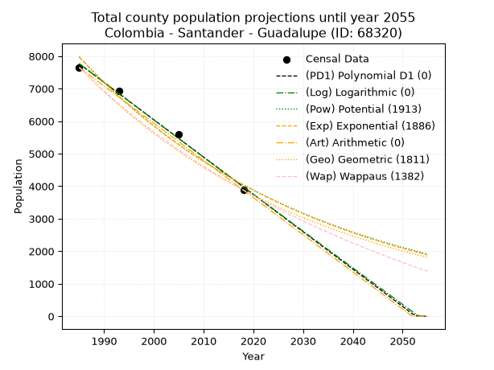
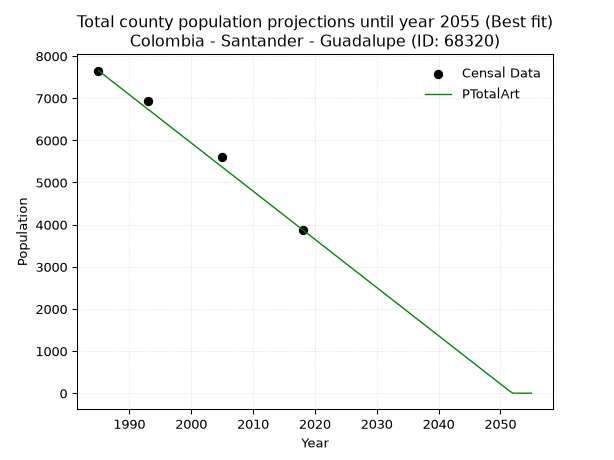
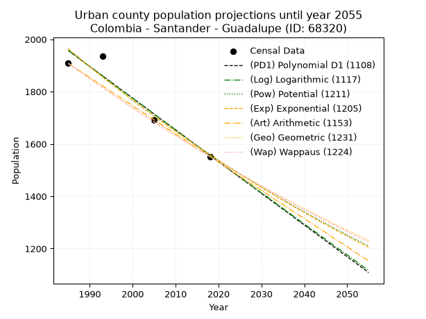
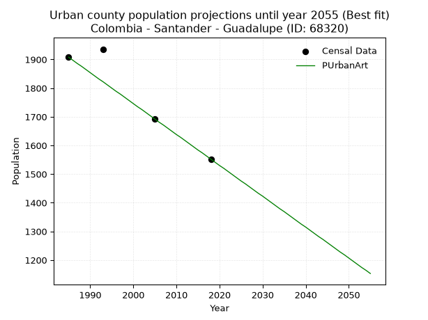
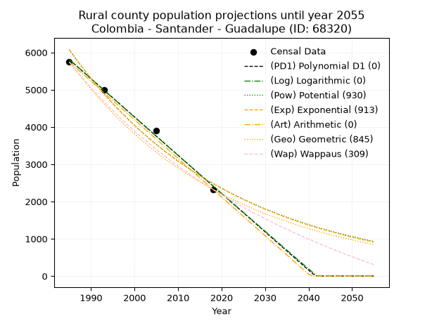
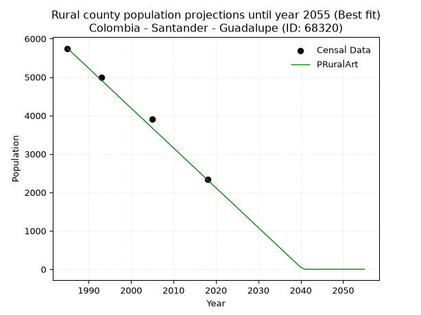

<div align="center">


</div>

# 📜 _“Population and Public Services Demand Projections (PPSD) until Year 2050 for Colombia - Santander - Guadalupe (ID: 68320)”_
Keywords: `population` `public-service` `projection` `lineal` `polynomial` `logarithmic` `potential` `exponential` `arithmetic` `geometric` `wappaus` `dane` `colombia` `south-america`

PPSD are analytical estimates used by governments and planners to anticipate future changes in population size, age distribution, and the resulting community needs for utilities, healthcare, education, and infrastructure as sizing future water treatment facilities, electrical grids, and road networks based on spatial growth.

<div align="center">

</img>

</div>


> **General running parameters**: • app_version: _v20260806_. • Python version: _3.14.7_. • Pandas version: _3.0.5_. • NumPy version: _2.5.1_. • Creates, save and include plots into reports (create_plot): _False_. • Projection until year: _2050_. • Process polynomial degree 2 and up: _False_. • Process Wappaus: _True_. • Process Wappaus: _True_. • Set negative values to zero: _True_. • Set infinite values to zero: _True_. • Drop dataset notes: _True_. 
<div align="center">

Maps & GIS Layers: [:earth_americas:Google](http://maps.google.com/maps?q=6.245846764,-73.419292) [:earth_americas:OSM](https://www.openstreetmap.org/#map=18/6.245846764/-73.419292&layers=P) [:earth_americas:Bing](https://www.bing.com/maps?cp=6.245846764~-73.419292&lvl=18) [:earth_americas:Apple](https://maps.apple.com/frame?center=6.245846764%2C-73.419292&span=0.003%2C0.006) [:earth_americas:GISMobile](https://github.com/rcfdtools/R.GISMobile/blob/main/file/gis/CountyLayer_CO/Readme.md)

</div>


<div align="center">

```geojson
{
  "type": "Feature",
  "geometry": {
    "type": "Point", 
    "coordinates": [-73.419292, 6.245846764]
  }, 
  "properties": {
    "Name": "Colombia - Santander - Guadalupe (ID: 68320)"
  }
}
```

</div>


## 0. Census Data (4 records)

Census data are official statistics collected by a government about the people and housing in a country. They usually include counts of total population, age, sex, race, income, education, and jobs.

📅Global census file: [Population.xlsx](../data/Population.xlsx)

| Source   |   Year |   CountryID | CountryName   |   StateID | StateName   |   CountyID | CountyName   |   PTotal |   PUrban |   PRural |
|:---------|-------:|------------:|:--------------|----------:|:------------|-----------:|:-------------|---------:|---------:|---------:|
| DANE     |   1985 |          57 | Colombia      |        68 | Santander   |      68320 | Guadalupe    |     7654 |     1908 |     5746 |
| DANE     |   1993 |          57 | Colombia      |        68 | Santander   |      68320 | Guadalupe    |     6930 |     1936 |     4994 |
| DANE     |   2005 |          57 | Colombia      |        68 | Santander   |      68320 | Guadalupe    |     5596 |     1692 |     3904 |
| DANE     |   2018 |          57 | Colombia      |        68 | Santander   |      68320 | Guadalupe    |     3880 |     1552 |     2328 |

> 🔥Some records could had specific notes about the registered values or the corresponding urban or rural distribution.

📅[SUI-RUPS](https://www.datos.gov.co/Hacienda-y-Cr-dito-P-blico/Registro-nico-de-Prestadores-de-Servicios-P-blicos/4qkq-csdn/about_data) - Local public utility companies: [RUPS.csv](../data/RUPS.csv)

 | SERVICIO       | ESTADO    | NOMBRE                                          | NIT         | DEPARTAMENTO_DOMICILIO   | MUNICIPIO_DOMICILIO   | DIRECCION        |   TELEFONO | EMAIL                              | TIPO_PRESTADOR                             | CLASIFICACION                 |
|:---------------|:----------|:------------------------------------------------|:------------|:-------------------------|:----------------------|:-----------------|-----------:|:-----------------------------------|:-------------------------------------------|:------------------------------|
| ACUEDUCTO      | OPERATIVA | AGUAS PUBLICAS DE GUADALUPE  E.P.G. S.A - E.S.P | 900642372-4 | SANTANDER                | GUADALUPE             | CALLE 5 No. 4-18 |    7180123 | aguaspublicasdeguadalupe@gmail.com | SOCIEDADES (EMPRESA DE SERVICIOS PUBLICOS) | MENOR O IGUAL A 2500 USUARIOS |
| ALCANTARILLADO | OPERATIVA | AGUAS PUBLICAS DE GUADALUPE  E.P.G. S.A - E.S.P | 900642372-4 | SANTANDER                | GUADALUPE             | CALLE 5 No. 4-18 |    7180123 | aguaspublicasdeguadalupe@gmail.com | SOCIEDADES (EMPRESA DE SERVICIOS PUBLICOS) | MENOR O IGUAL A 2500 USUARIOS |

## 1. Total

### 1.1. Coefficients and Parameters

* (PD1) Polynomial Deg 1: -114.83741469289325, 235718.53873945973 (lineal)
* (Log) Logarithmic: -229821.30531512367, 1752888.5833726139
* (Pow) Potential: -41.21020831847909, 139.80335570561215
* (Exp) Exponential: -0.020596379447092195, 4.5431480180623965e+21
* (Art) Arithmetic: Year diff. 2018 - 1985 = 33, Population diff. 3880 - 7654 = -3774, Annual growth = -114.36363636363636
* (Geo) Geometric: Year diff. 2018 - 1985 = 33, Population diff. 3880 - 7654 = -3774, Annual growth % = -0.020377194484232808
* (Wap) Wappaus: i = -1.9830698172990526, Condition values only valid for < 200)

<sub>
Wappaus condition values: ['-0.00', '-1.98', '-3.97', '-5.95', '-7.93', '-9.92', '-11.90', '-13.88', '-15.86', '-17.85', '-19.83', '-21.81', '-23.80', '-25.78', '-27.76', '-29.75', '-31.73', '-33.71', '-35.70', '-37.68', '-39.66', '-41.64', '-43.63', '-45.61', '-47.59', '-49.58', '-51.56', '-53.54', '-55.53', '-57.51', '-59.49', '-61.48', '-63.46', '-65.44', '-67.42', '-69.41', '-71.39', '-73.37', '-75.36', '-77.34', '-79.32', '-81.31', '-83.29', '-85.27', '-87.26', '-89.24', '-91.22', '-93.20', '-95.19', '-97.17', '-99.15', '-101.14', '-103.12', '-105.10', '-107.09', '-109.07', '-111.05', '-113.03', '-115.02', '-117.00', '-118.98', '-120.97', '-122.95', '-124.93', '-126.92', '-128.90']
</sub>


### 1.2. Projected Dataset

|   Year |   CountyID |   PTotalPD1 |   PTotalLog |   PTotalPow |   PTotalExp |   PTotalArt |   PTotalGeo |   PTotalWap |
|-------:|-----------:|------------:|------------:|------------:|------------:|------------:|------------:|------------:|
|   1985 |      68320 |        7766 |        7769 |        7979 |        7975 |        7654 |        7654 |        7654 |
|   1986 |      68320 |        7651 |        7654 |        7815 |        7813 |        7540 |        7498 |        7504 |
|   1987 |      68320 |        7537 |        7538 |        7655 |        7653 |        7425 |        7345 |        7356 |
|   1988 |      68320 |        7422 |        7422 |        7498 |        7497 |        7311 |        7196 |        7212 |
|   1989 |      68320 |        7307 |        7307 |        7344 |        7345 |        7197 |        7049 |        7070 |
|   1990 |      68320 |        7192 |        7191 |        7193 |        7195 |        7082 |        6905 |        6931 |
|   1991 |      68320 |        7077 |        7076 |        7046 |        7048 |        6968 |        6765 |        6794 |
|   1992 |      68320 |        6962 |        6960 |        6902 |        6904 |        6853 |        6627 |        6660 |
|   1993 |      68320 |        6848 |        6845 |        6760 |        6764 |        6739 |        6492 |        6529 |
|   1994 |      68320 |        6733 |        6730 |        6622 |        6626 |        6625 |        6359 |        6400 |
|   1995 |      68320 |        6618 |        6615 |        6487 |        6491 |        6510 |        6230 |        6273 |
|   1996 |      68320 |        6503 |        6499 |        6354 |        6358 |        6396 |        6103 |        6149 |
|   1997 |      68320 |        6388 |        6384 |        6224 |        6229 |        6282 |        5979 |        6026 |
|   1998 |      68320 |        6273 |        6269 |        6097 |        6102 |        6167 |        5857 |        5906 |
|   1999 |      68320 |        6159 |        6154 |        5973 |        5977 |        6053 |        5737 |        5788 |
|   2000 |      68320 |        6044 |        6039 |        5851 |        5856 |        5939 |        5620 |        5672 |
|   2001 |      68320 |        5929 |        5924 |        5732 |        5736 |        5824 |        5506 |        5558 |
|   2002 |      68320 |        5814 |        5810 |        5615 |        5619 |        5710 |        5394 |        5446 |
|   2003 |      68320 |        5699 |        5695 |        5500 |        5505 |        5595 |        5284 |        5336 |
|   2004 |      68320 |        5584 |        5580 |        5388 |        5392 |        5481 |        5176 |        5227 |
|   2005 |      68320 |        5470 |        5465 |        5279 |        5283 |        5367 |        5071 |        5121 |
|   2006 |      68320 |        5355 |        5351 |        5171 |        5175 |        5252 |        4967 |        5016 |
|   2007 |      68320 |        5240 |        5236 |        5066 |        5069 |        5138 |        4866 |        4913 |
|   2008 |      68320 |        5125 |        5122 |        4963 |        4966 |        5024 |        4767 |        4811 |
|   2009 |      68320 |        5010 |        5007 |        4863 |        4865 |        4909 |        4670 |        4711 |
|   2010 |      68320 |        4895 |        4893 |        4764 |        4766 |        4795 |        4575 |        4613 |
|   2011 |      68320 |        4780 |        4779 |        4667 |        4668 |        4681 |        4481 |        4516 |
|   2012 |      68320 |        4666 |        4664 |        4573 |        4573 |        4566 |        4390 |        4421 |
|   2013 |      68320 |        4551 |        4550 |        4480 |        4480 |        4452 |        4301 |        4328 |
|   2014 |      68320 |        4436 |        4436 |        4389 |        4389 |        4337 |        4213 |        4235 |
|   2015 |      68320 |        4321 |        4322 |        4300 |        4299 |        4223 |        4127 |        4144 |
|   2016 |      68320 |        4206 |        4208 |        4213 |        4212 |        4109 |        4043 |        4055 |
|   2017 |      68320 |        4091 |        4094 |        4128 |        4126 |        3994 |        3961 |        3967 |
|   2018 |      68320 |        3977 |        3980 |        4045 |        4042 |        3880 |        3880 |        3880 |
|   2019 |      68320 |        3862 |        3866 |        3963 |        3959 |        3766 |        3801 |        3794 |
|   2020 |      68320 |        3747 |        3752 |        3883 |        3879 |        3651 |        3723 |        3710 |
|   2021 |      68320 |        3632 |        3639 |        3804 |        3799 |        3537 |        3648 |        3627 |
|   2022 |      68320 |        3517 |        3525 |        3728 |        3722 |        3423 |        3573 |        3545 |
|   2023 |      68320 |        3402 |        3411 |        3652 |        3646 |        3308 |        3500 |        3465 |
|   2024 |      68320 |        3288 |        3298 |        3579 |        3572 |        3194 |        3429 |        3385 |
|   2025 |      68320 |        3173 |        3184 |        3507 |        3499 |        3079 |        3359 |        3307 |
|   2026 |      68320 |        3058 |        3071 |        3436 |        3428 |        2965 |        3291 |        3230 |
|   2027 |      68320 |        2943 |        2957 |        3367 |        3358 |        2851 |        3224 |        3153 |
|   2028 |      68320 |        2828 |        2844 |        3299 |        3289 |        2736 |        3158 |        3078 |
|   2029 |      68320 |        2713 |        2731 |        3233 |        3222 |        2622 |        3094 |        3004 |
|   2030 |      68320 |        2599 |        2618 |        3168 |        3157 |        2508 |        3031 |        2931 |
|   2031 |      68320 |        2484 |        2504 |        3104 |        3092 |        2393 |        2969 |        2859 |
|   2032 |      68320 |        2369 |        2391 |        3042 |        3029 |        2279 |        2908 |        2788 |
|   2033 |      68320 |        2254 |        2278 |        2981 |        2967 |        2165 |        2849 |        2718 |
|   2034 |      68320 |        2139 |        2165 |        2921 |        2907 |        2050 |        2791 |        2649 |
|   2035 |      68320 |        2024 |        2052 |        2862 |        2848 |        1936 |        2734 |        2580 |
|   2036 |      68320 |        1910 |        1939 |        2805 |        2790 |        1821 |        2679 |        2513 |
|   2037 |      68320 |        1795 |        1826 |        2749 |        2733 |        1707 |        2624 |        2446 |
|   2038 |      68320 |        1680 |        1714 |        2694 |        2677 |        1593 |        2570 |        2381 |
|   2039 |      68320 |        1565 |        1601 |        2640 |        2623 |        1478 |        2518 |        2316 |
|   2040 |      68320 |        1450 |        1488 |        2587 |        2569 |        1364 |        2467 |        2252 |
|   2041 |      68320 |        1335 |        1376 |        2535 |        2517 |        1250 |        2416 |        2189 |
|   2042 |      68320 |        1221 |        1263 |        2485 |        2465 |        1135 |        2367 |        2126 |
|   2043 |      68320 |        1106 |        1150 |        2435 |        2415 |        1021 |        2319 |        2065 |
|   2044 |      68320 |         991 |        1038 |        2386 |        2366 |         907 |        2272 |        2004 |
|   2045 |      68320 |         876 |         926 |        2339 |        2318 |         792 |        2225 |        1944 |
|   2046 |      68320 |         761 |         813 |        2292 |        2270 |         678 |        2180 |        1885 |
|   2047 |      68320 |         646 |         701 |        2246 |        2224 |         563 |        2136 |        1826 |
|   2048 |      68320 |         532 |         589 |        2202 |        2179 |         449 |        2092 |        1768 |
|   2049 |      68320 |         417 |         477 |        2158 |        2134 |         335 |        2050 |        1711 |
|   2050 |      68320 |         302 |         364 |        2115 |        2091 |         220 |        2008 |        1655 |
<div align="center">

</img>

</div>


### 1.3. Best fit with absolute and relative error (%)

Relative error puts that difference into context by dividing the absolute error by the true value, creating a unitless ratio or percentage that shows the scale of the mistake.

Absolute and relative error

|   Year | Source   |   CountryID | CountryName   |   StateID | StateName   |   CountyID_x | CountyName   |   PTotal |   PUrban |   PRural |   CountyID_y |   PTotalPD1 |   PTotalLog |   PTotalPow |   PTotalExp |   PTotalArt |   PTotalGeo |   PTotalWap |   PTotalPD1AbsError |   PTotalLogAbsError |   PTotalPowAbsError |   PTotalExpAbsError |   PTotalArtAbsError |   PTotalGeoAbsError |   PTotalWapAbsError |   PTotalPD1RelError |   PTotalLogRelError |   PTotalPowRelError |   PTotalExpRelError |   PTotalArtRelError |   PTotalGeoRelError |   PTotalWapRelError |
|-------:|:---------|------------:|:--------------|----------:|:------------|-------------:|:-------------|---------:|---------:|---------:|-------------:|------------:|------------:|------------:|------------:|------------:|------------:|------------:|--------------------:|--------------------:|--------------------:|--------------------:|--------------------:|--------------------:|--------------------:|--------------------:|--------------------:|--------------------:|--------------------:|--------------------:|--------------------:|--------------------:|
|   1985 | DANE     |          57 | Colombia      |        68 | Santander   |        68320 | Guadalupe    |     7654 |     1908 |     5746 |        68320 |        7766 |        7769 |        7979 |        7975 |        7654 |        7654 |        7654 |                 112 |                 115 |                 325 |                 321 |                   0 |                   0 |                   0 |             1.46329 |             1.50248 |             4.24615 |             4.19389 |             0       |             0       |             0       |
|   1993 | DANE     |          57 | Colombia      |        68 | Santander   |        68320 | Guadalupe    |     6930 |     1936 |     4994 |        68320 |        6848 |        6845 |        6760 |        6764 |        6739 |        6492 |        6529 |                  82 |                  85 |                 170 |                 166 |                 191 |                 438 |                 401 |             1.18326 |             1.22655 |             2.4531  |             2.39538 |             2.75613 |             6.32035 |             5.78644 |
|   2005 | DANE     |          57 | Colombia      |        68 | Santander   |        68320 | Guadalupe    |     5596 |     1692 |     3904 |        68320 |        5470 |        5465 |        5279 |        5283 |        5367 |        5071 |        5121 |                 126 |                 131 |                 317 |                 313 |                 229 |                 525 |                 475 |             2.25161 |             2.34096 |             5.66476 |             5.59328 |             4.09221 |             9.3817  |             8.48821 |
|   2018 | DANE     |          57 | Colombia      |        68 | Santander   |        68320 | Guadalupe    |     3880 |     1552 |     2328 |        68320 |        3977 |        3980 |        4045 |        4042 |        3880 |        3880 |        3880 |                  97 |                 100 |                 165 |                 162 |                   0 |                   0 |                   0 |             2.5     |             2.57732 |             4.25258 |             4.17526 |             0       |             0       |             0       |

Relative error mean

| Method    |   RelError | Best   |
|:----------|-----------:|:-------|
| PTotalPD1 |    1.84954 |        |
| PTotalLog |    1.91183 |        |
| PTotalPow |    4.15415 |        |
| PTotalExp |    4.08945 |        |
| PTotalArt |    1.71209 | True   |
| PTotalGeo |    3.92551 |        |
| PTotalWap |    3.56866 |        |

💙Best method: _**PTotalArt**_
<div align="center">

</img>

</div>


### 1.4. Fresh water supply demand in liters per capita per day (lpcd)

The fresh water supply demand typically ranges from 100 to 300 liters per capita per day (lpcd) for standard domestic and municipal planning, though absolute survival minimums set by the World Health Organization are as low as 7.5 to 20 liters per day, and total consumption in high-income nations can exceed 400 liters.

> `CZ`: Level in meters above the sea level (masl)<br> `WS`: Fresh water supply demand in liters per capita per day (lpcd or l/h/d)<br> `WSAll`: Zonal fresh water supply demand in liters per second (l/s)<br> `A`: Zonal area in square meters<br> `DP`: Population density (people/hectare or p/ha)

Reference values (RAS Colombia)

|    CZ |   WS |
|------:|-----:|
|  1000 |  120 |
|  2000 |  130 |
| 99999 |  140 |

County shapefile geometry properties and water supply values

|   CountyID |      ATotal |   CZTotal |   WSTotal |
|-----------:|------------:|----------:|----------:|
|      68320 | 1.46084e+08 |   1371.56 |       130 |

Projected values for best method: PTotalArt

|   CountyID |   Year |   PTotalArt |   DPTotal |   WSTotal |   WSTotalAll |
|-----------:|-------:|------------:|----------:|----------:|-------------:|
|      68320 |   1985 |        7654 |      0.52 |       130 |    11.5164   |
|      68320 |   1986 |        7540 |      0.52 |       130 |    11.3449   |
|      68320 |   1987 |        7425 |      0.51 |       130 |    11.1719   |
|      68320 |   1988 |        7311 |      0.5  |       130 |    11.0003   |
|      68320 |   1989 |        7197 |      0.49 |       130 |    10.8288   |
|      68320 |   1990 |        7082 |      0.48 |       130 |    10.6558   |
|      68320 |   1991 |        6968 |      0.48 |       130 |    10.4843   |
|      68320 |   1992 |        6853 |      0.47 |       130 |    10.3112   |
|      68320 |   1993 |        6739 |      0.46 |       130 |    10.1397   |
|      68320 |   1994 |        6625 |      0.45 |       130 |     9.96817  |
|      68320 |   1995 |        6510 |      0.45 |       130 |     9.79514  |
|      68320 |   1996 |        6396 |      0.44 |       130 |     9.62361  |
|      68320 |   1997 |        6282 |      0.43 |       130 |     9.45208  |
|      68320 |   1998 |        6167 |      0.42 |       130 |     9.27905  |
|      68320 |   1999 |        6053 |      0.41 |       130 |     9.10752  |
|      68320 |   2000 |        5939 |      0.41 |       130 |     8.936    |
|      68320 |   2001 |        5824 |      0.4  |       130 |     8.76296  |
|      68320 |   2002 |        5710 |      0.39 |       130 |     8.59144  |
|      68320 |   2003 |        5595 |      0.38 |       130 |     8.4184   |
|      68320 |   2004 |        5481 |      0.38 |       130 |     8.24687  |
|      68320 |   2005 |        5367 |      0.37 |       130 |     8.07535  |
|      68320 |   2006 |        5252 |      0.36 |       130 |     7.90231  |
|      68320 |   2007 |        5138 |      0.35 |       130 |     7.73079  |
|      68320 |   2008 |        5024 |      0.34 |       130 |     7.55926  |
|      68320 |   2009 |        4909 |      0.34 |       130 |     7.38623  |
|      68320 |   2010 |        4795 |      0.33 |       130 |     7.2147   |
|      68320 |   2011 |        4681 |      0.32 |       130 |     7.04317  |
|      68320 |   2012 |        4566 |      0.31 |       130 |     6.87014  |
|      68320 |   2013 |        4452 |      0.3  |       130 |     6.69861  |
|      68320 |   2014 |        4337 |      0.3  |       130 |     6.52558  |
|      68320 |   2015 |        4223 |      0.29 |       130 |     6.35405  |
|      68320 |   2016 |        4109 |      0.28 |       130 |     6.18252  |
|      68320 |   2017 |        3994 |      0.27 |       130 |     6.00949  |
|      68320 |   2018 |        3880 |      0.27 |       130 |     5.83796  |
|      68320 |   2019 |        3766 |      0.26 |       130 |     5.66644  |
|      68320 |   2020 |        3651 |      0.25 |       130 |     5.4934   |
|      68320 |   2021 |        3537 |      0.24 |       130 |     5.32188  |
|      68320 |   2022 |        3423 |      0.23 |       130 |     5.15035  |
|      68320 |   2023 |        3308 |      0.23 |       130 |     4.97731  |
|      68320 |   2024 |        3194 |      0.22 |       130 |     4.80579  |
|      68320 |   2025 |        3079 |      0.21 |       130 |     4.63275  |
|      68320 |   2026 |        2965 |      0.2  |       130 |     4.46123  |
|      68320 |   2027 |        2851 |      0.2  |       130 |     4.2897   |
|      68320 |   2028 |        2736 |      0.19 |       130 |     4.11667  |
|      68320 |   2029 |        2622 |      0.18 |       130 |     3.94514  |
|      68320 |   2030 |        2508 |      0.17 |       130 |     3.77361  |
|      68320 |   2031 |        2393 |      0.16 |       130 |     3.60058  |
|      68320 |   2032 |        2279 |      0.16 |       130 |     3.42905  |
|      68320 |   2033 |        2165 |      0.15 |       130 |     3.25752  |
|      68320 |   2034 |        2050 |      0.14 |       130 |     3.08449  |
|      68320 |   2035 |        1936 |      0.13 |       130 |     2.91296  |
|      68320 |   2036 |        1821 |      0.12 |       130 |     2.73993  |
|      68320 |   2037 |        1707 |      0.12 |       130 |     2.5684   |
|      68320 |   2038 |        1593 |      0.11 |       130 |     2.39688  |
|      68320 |   2039 |        1478 |      0.1  |       130 |     2.22384  |
|      68320 |   2040 |        1364 |      0.09 |       130 |     2.05231  |
|      68320 |   2041 |        1250 |      0.09 |       130 |     1.88079  |
|      68320 |   2042 |        1135 |      0.08 |       130 |     1.70775  |
|      68320 |   2043 |        1021 |      0.07 |       130 |     1.53623  |
|      68320 |   2044 |         907 |      0.06 |       130 |     1.3647   |
|      68320 |   2045 |         792 |      0.05 |       130 |     1.19167  |
|      68320 |   2046 |         678 |      0.05 |       130 |     1.02014  |
|      68320 |   2047 |         563 |      0.04 |       130 |     0.847106 |
|      68320 |   2048 |         449 |      0.03 |       130 |     0.675579 |
|      68320 |   2049 |         335 |      0.02 |       130 |     0.504051 |
|      68320 |   2050 |         220 |      0.02 |       130 |     0.331019 |

## 2. Urban

### 2.1. Coefficients and Parameters

* (PD1) Polynomial Deg 1: -12.12043356081884, 26015.897230027887 (lineal)
* (Log) Logarithmic: -24252.928024109173, 186118.7002620217
* (Pow) Potential: -13.950620276628051, 49.29874945837092
* (Exp) Exponential: -0.006972106673560452, 2010693378.5384233
* (Art) Arithmetic: Year diff. 2018 - 1985 = 33, Population diff. 1552 - 1908 = -356, Annual growth = -10.787878787878787
* (Geo) Geometric: Year diff. 2018 - 1985 = 33, Population diff. 1552 - 1908 = -356, Annual growth % = -0.006238373713961964
* (Wap) Wappaus: i = -0.6235768085479069, Condition values only valid for < 200)

<sub>
Wappaus condition values: ['-0.00', '-0.62', '-1.25', '-1.87', '-2.49', '-3.12', '-3.74', '-4.37', '-4.99', '-5.61', '-6.24', '-6.86', '-7.48', '-8.11', '-8.73', '-9.35', '-9.98', '-10.60', '-11.22', '-11.85', '-12.47', '-13.10', '-13.72', '-14.34', '-14.97', '-15.59', '-16.21', '-16.84', '-17.46', '-18.08', '-18.71', '-19.33', '-19.95', '-20.58', '-21.20', '-21.83', '-22.45', '-23.07', '-23.70', '-24.32', '-24.94', '-25.57', '-26.19', '-26.81', '-27.44', '-28.06', '-28.68', '-29.31', '-29.93', '-30.56', '-31.18', '-31.80', '-32.43', '-33.05', '-33.67', '-34.30', '-34.92', '-35.54', '-36.17', '-36.79', '-37.41', '-38.04', '-38.66', '-39.29', '-39.91', '-40.53']
</sub>


### 2.2. Projected Dataset

|   Year |   CountyID |   PUrbanPD1 |   PUrbanLog |   PUrbanPow |   PUrbanExp |   PUrbanArt |   PUrbanGeo |   PUrbanWap |
|-------:|-----------:|------------:|------------:|------------:|------------:|------------:|------------:|------------:|
|   1985 |      68320 |        1957 |        1957 |        1963 |        1963 |        1908 |        1908 |        1908 |
|   1986 |      68320 |        1945 |        1945 |        1949 |        1949 |        1897 |        1896 |        1896 |
|   1987 |      68320 |        1933 |        1933 |        1936 |        1936 |        1886 |        1884 |        1884 |
|   1988 |      68320 |        1920 |        1921 |        1922 |        1922 |        1876 |        1873 |        1873 |
|   1989 |      68320 |        1908 |        1908 |        1909 |        1909 |        1865 |        1861 |        1861 |
|   1990 |      68320 |        1896 |        1896 |        1895 |        1896 |        1854 |        1849 |        1849 |
|   1991 |      68320 |        1884 |        1884 |        1882 |        1882 |        1843 |        1838 |        1838 |
|   1992 |      68320 |        1872 |        1872 |        1869 |        1869 |        1832 |        1826 |        1826 |
|   1993 |      68320 |        1860 |        1860 |        1856 |        1856 |        1822 |        1815 |        1815 |
|   1994 |      68320 |        1848 |        1847 |        1843 |        1843 |        1811 |        1804 |        1804 |
|   1995 |      68320 |        1836 |        1835 |        1830 |        1831 |        1800 |        1792 |        1793 |
|   1996 |      68320 |        1824 |        1823 |        1817 |        1818 |        1789 |        1781 |        1781 |
|   1997 |      68320 |        1811 |        1811 |        1805 |        1805 |        1779 |        1770 |        1770 |
|   1998 |      68320 |        1799 |        1799 |        1792 |        1793 |        1768 |        1759 |        1759 |
|   1999 |      68320 |        1787 |        1787 |        1780 |        1780 |        1757 |        1748 |        1748 |
|   2000 |      68320 |        1775 |        1775 |        1767 |        1768 |        1746 |        1737 |        1738 |
|   2001 |      68320 |        1763 |        1762 |        1755 |        1756 |        1735 |        1726 |        1727 |
|   2002 |      68320 |        1751 |        1750 |        1743 |        1743 |        1725 |        1715 |        1716 |
|   2003 |      68320 |        1739 |        1738 |        1731 |        1731 |        1714 |        1705 |        1705 |
|   2004 |      68320 |        1727 |        1726 |        1719 |        1719 |        1703 |        1694 |        1695 |
|   2005 |      68320 |        1714 |        1714 |        1707 |        1707 |        1692 |        1684 |        1684 |
|   2006 |      68320 |        1702 |        1702 |        1695 |        1695 |        1681 |        1673 |        1673 |
|   2007 |      68320 |        1690 |        1690 |        1683 |        1684 |        1671 |        1663 |        1663 |
|   2008 |      68320 |        1678 |        1678 |        1672 |        1672 |        1660 |        1652 |        1653 |
|   2009 |      68320 |        1666 |        1666 |        1660 |        1660 |        1649 |        1642 |        1642 |
|   2010 |      68320 |        1654 |        1654 |        1649 |        1649 |        1638 |        1632 |        1632 |
|   2011 |      68320 |        1642 |        1642 |        1637 |        1637 |        1628 |        1621 |        1622 |
|   2012 |      68320 |        1630 |        1629 |        1626 |        1626 |        1617 |        1611 |        1612 |
|   2013 |      68320 |        1617 |        1617 |        1615 |        1615 |        1606 |        1601 |        1602 |
|   2014 |      68320 |        1605 |        1605 |        1604 |        1603 |        1595 |        1591 |        1592 |
|   2015 |      68320 |        1593 |        1593 |        1592 |        1592 |        1584 |        1581 |        1582 |
|   2016 |      68320 |        1581 |        1581 |        1581 |        1581 |        1574 |        1572 |        1572 |
|   2017 |      68320 |        1569 |        1569 |        1571 |        1570 |        1563 |        1562 |        1562 |
|   2018 |      68320 |        1557 |        1557 |        1560 |        1559 |        1552 |        1552 |        1552 |
|   2019 |      68320 |        1545 |        1545 |        1549 |        1549 |        1541 |        1542 |        1542 |
|   2020 |      68320 |        1533 |        1533 |        1538 |        1538 |        1530 |        1533 |        1533 |
|   2021 |      68320 |        1521 |        1521 |        1528 |        1527 |        1520 |        1523 |        1523 |
|   2022 |      68320 |        1508 |        1509 |        1517 |        1516 |        1509 |        1514 |        1513 |
|   2023 |      68320 |        1496 |        1497 |        1507 |        1506 |        1498 |        1504 |        1504 |
|   2024 |      68320 |        1484 |        1485 |        1496 |        1495 |        1487 |        1495 |        1494 |
|   2025 |      68320 |        1472 |        1473 |        1486 |        1485 |        1476 |        1485 |        1485 |
|   2026 |      68320 |        1460 |        1461 |        1476 |        1475 |        1466 |        1476 |        1475 |
|   2027 |      68320 |        1448 |        1449 |        1466 |        1465 |        1455 |        1467 |        1466 |
|   2028 |      68320 |        1436 |        1437 |        1456 |        1454 |        1444 |        1458 |        1457 |
|   2029 |      68320 |        1424 |        1425 |        1446 |        1444 |        1433 |        1449 |        1448 |
|   2030 |      68320 |        1411 |        1413 |        1436 |        1434 |        1423 |        1440 |        1438 |
|   2031 |      68320 |        1399 |        1402 |        1426 |        1424 |        1412 |        1431 |        1429 |
|   2032 |      68320 |        1387 |        1390 |        1416 |        1414 |        1401 |        1422 |        1420 |
|   2033 |      68320 |        1375 |        1378 |        1407 |        1405 |        1390 |        1413 |        1411 |
|   2034 |      68320 |        1363 |        1366 |        1397 |        1395 |        1379 |        1404 |        1402 |
|   2035 |      68320 |        1351 |        1354 |        1387 |        1385 |        1369 |        1395 |        1393 |
|   2036 |      68320 |        1339 |        1342 |        1378 |        1375 |        1358 |        1387 |        1384 |
|   2037 |      68320 |        1327 |        1330 |        1369 |        1366 |        1347 |        1378 |        1376 |
|   2038 |      68320 |        1314 |        1318 |        1359 |        1356 |        1336 |        1369 |        1367 |
|   2039 |      68320 |        1302 |        1306 |        1350 |        1347 |        1325 |        1361 |        1358 |
|   2040 |      68320 |        1290 |        1294 |        1341 |        1338 |        1315 |        1352 |        1349 |
|   2041 |      68320 |        1278 |        1282 |        1332 |        1328 |        1304 |        1344 |        1341 |
|   2042 |      68320 |        1266 |        1271 |        1323 |        1319 |        1293 |        1336 |        1332 |
|   2043 |      68320 |        1254 |        1259 |        1314 |        1310 |        1282 |        1327 |        1324 |
|   2044 |      68320 |        1242 |        1247 |        1305 |        1301 |        1272 |        1319 |        1315 |
|   2045 |      68320 |        1230 |        1235 |        1296 |        1292 |        1261 |        1311 |        1307 |
|   2046 |      68320 |        1217 |        1223 |        1287 |        1283 |        1250 |        1303 |        1298 |
|   2047 |      68320 |        1205 |        1211 |        1278 |        1274 |        1239 |        1294 |        1290 |
|   2048 |      68320 |        1193 |        1199 |        1270 |        1265 |        1228 |        1286 |        1281 |
|   2049 |      68320 |        1181 |        1188 |        1261 |        1256 |        1218 |        1278 |        1273 |
|   2050 |      68320 |        1169 |        1176 |        1252 |        1248 |        1207 |        1270 |        1265 |
<div align="center">

</img>

</div>


### 2.3. Best fit with absolute and relative error (%)

Relative error puts that difference into context by dividing the absolute error by the true value, creating a unitless ratio or percentage that shows the scale of the mistake.

Absolute and relative error

|   Year | Source   |   CountryID | CountryName   |   StateID | StateName   |   CountyID_x | CountyName   |   PTotal |   PUrban |   PRural |   CountyID_y |   PUrbanPD1 |   PUrbanLog |   PUrbanPow |   PUrbanExp |   PUrbanArt |   PUrbanGeo |   PUrbanWap |   PUrbanPD1AbsError |   PUrbanLogAbsError |   PUrbanPowAbsError |   PUrbanExpAbsError |   PUrbanArtAbsError |   PUrbanGeoAbsError |   PUrbanWapAbsError |   PUrbanPD1RelError |   PUrbanLogRelError |   PUrbanPowRelError |   PUrbanExpRelError |   PUrbanArtRelError |   PUrbanGeoRelError |   PUrbanWapRelError |
|-------:|:---------|------------:|:--------------|----------:|:------------|-------------:|:-------------|---------:|---------:|---------:|-------------:|------------:|------------:|------------:|------------:|------------:|------------:|------------:|--------------------:|--------------------:|--------------------:|--------------------:|--------------------:|--------------------:|--------------------:|--------------------:|--------------------:|--------------------:|--------------------:|--------------------:|--------------------:|--------------------:|
|   1985 | DANE     |          57 | Colombia      |        68 | Santander   |        68320 | Guadalupe    |     7654 |     1908 |     5746 |        68320 |        1957 |        1957 |        1963 |        1963 |        1908 |        1908 |        1908 |                  49 |                  49 |                  55 |                  55 |                   0 |                   0 |                   0 |            2.56813  |            2.56813  |            2.8826   |            2.8826   |             0       |            0        |            0        |
|   1993 | DANE     |          57 | Colombia      |        68 | Santander   |        68320 | Guadalupe    |     6930 |     1936 |     4994 |        68320 |        1860 |        1860 |        1856 |        1856 |        1822 |        1815 |        1815 |                  76 |                  76 |                  80 |                  80 |                 114 |                 121 |                 121 |            3.92562  |            3.92562  |            4.13223  |            4.13223  |             5.88843 |            6.25     |            6.25     |
|   2005 | DANE     |          57 | Colombia      |        68 | Santander   |        68320 | Guadalupe    |     5596 |     1692 |     3904 |        68320 |        1714 |        1714 |        1707 |        1707 |        1692 |        1684 |        1684 |                  22 |                  22 |                  15 |                  15 |                   0 |                   8 |                   8 |            1.30024  |            1.30024  |            0.886525 |            0.886525 |             0       |            0.472813 |            0.472813 |
|   2018 | DANE     |          57 | Colombia      |        68 | Santander   |        68320 | Guadalupe    |     3880 |     1552 |     2328 |        68320 |        1557 |        1557 |        1560 |        1559 |        1552 |        1552 |        1552 |                   5 |                   5 |                   8 |                   7 |                   0 |                   0 |                   0 |            0.322165 |            0.322165 |            0.515464 |            0.451031 |             0       |            0        |            0        |

Relative error mean

| Method    |   RelError | Best   |
|:----------|-----------:|:-------|
| PUrbanPD1 |    2.02904 |        |
| PUrbanLog |    2.02904 |        |
| PUrbanPow |    2.1042  |        |
| PUrbanExp |    2.0881  |        |
| PUrbanArt |    1.47211 | True   |
| PUrbanGeo |    1.6807  |        |
| PUrbanWap |    1.6807  |        |

💙Best method: _**PUrbanArt**_
<div align="center">

</img>

</div>


### 2.4. Fresh water supply demand in liters per capita per day (lpcd)

The fresh water supply demand typically ranges from 100 to 300 liters per capita per day (lpcd) for standard domestic and municipal planning, though absolute survival minimums set by the World Health Organization are as low as 7.5 to 20 liters per day, and total consumption in high-income nations can exceed 400 liters.

> `CZ`: Level in meters above the sea level (masl)<br> `WS`: Fresh water supply demand in liters per capita per day (lpcd or l/h/d)<br> `WSAll`: Zonal fresh water supply demand in liters per second (l/s)<br> `A`: Zonal area in square meters<br> `DP`: Population density (people/hectare or p/ha)

Reference values (RAS Colombia)

|    CZ |   WS |
|------:|-----:|
|  1000 |  120 |
|  2000 |  130 |
| 99999 |  140 |

County shapefile geometry properties and water supply values

|   CountyID |   AUrban |   CZUrban |   WSUrban |
|-----------:|---------:|----------:|----------:|
|      68320 |   679850 |   1434.52 |       130 |

Projected values for best method: PUrbanArt

|   CountyID |   Year |   PUrbanArt |   DPUrban |   WSUrban |   WSUrbanAll |
|-----------:|-------:|------------:|----------:|----------:|-------------:|
|      68320 |   1985 |        1908 |     28.07 |       130 |      2.87083 |
|      68320 |   1986 |        1897 |     27.9  |       130 |      2.85428 |
|      68320 |   1987 |        1886 |     27.74 |       130 |      2.83773 |
|      68320 |   1988 |        1876 |     27.59 |       130 |      2.82269 |
|      68320 |   1989 |        1865 |     27.43 |       130 |      2.80613 |
|      68320 |   1990 |        1854 |     27.27 |       130 |      2.78958 |
|      68320 |   1991 |        1843 |     27.11 |       130 |      2.77303 |
|      68320 |   1992 |        1832 |     26.95 |       130 |      2.75648 |
|      68320 |   1993 |        1822 |     26.8  |       130 |      2.74144 |
|      68320 |   1994 |        1811 |     26.64 |       130 |      2.72488 |
|      68320 |   1995 |        1800 |     26.48 |       130 |      2.70833 |
|      68320 |   1996 |        1789 |     26.31 |       130 |      2.69178 |
|      68320 |   1997 |        1779 |     26.17 |       130 |      2.67674 |
|      68320 |   1998 |        1768 |     26.01 |       130 |      2.66019 |
|      68320 |   1999 |        1757 |     25.84 |       130 |      2.64363 |
|      68320 |   2000 |        1746 |     25.68 |       130 |      2.62708 |
|      68320 |   2001 |        1735 |     25.52 |       130 |      2.61053 |
|      68320 |   2002 |        1725 |     25.37 |       130 |      2.59549 |
|      68320 |   2003 |        1714 |     25.21 |       130 |      2.57894 |
|      68320 |   2004 |        1703 |     25.05 |       130 |      2.56238 |
|      68320 |   2005 |        1692 |     24.89 |       130 |      2.54583 |
|      68320 |   2006 |        1681 |     24.73 |       130 |      2.52928 |
|      68320 |   2007 |        1671 |     24.58 |       130 |      2.51424 |
|      68320 |   2008 |        1660 |     24.42 |       130 |      2.49769 |
|      68320 |   2009 |        1649 |     24.26 |       130 |      2.48113 |
|      68320 |   2010 |        1638 |     24.09 |       130 |      2.46458 |
|      68320 |   2011 |        1628 |     23.95 |       130 |      2.44954 |
|      68320 |   2012 |        1617 |     23.78 |       130 |      2.43299 |
|      68320 |   2013 |        1606 |     23.62 |       130 |      2.41644 |
|      68320 |   2014 |        1595 |     23.46 |       130 |      2.39988 |
|      68320 |   2015 |        1584 |     23.3  |       130 |      2.38333 |
|      68320 |   2016 |        1574 |     23.15 |       130 |      2.36829 |
|      68320 |   2017 |        1563 |     22.99 |       130 |      2.35174 |
|      68320 |   2018 |        1552 |     22.83 |       130 |      2.33519 |
|      68320 |   2019 |        1541 |     22.67 |       130 |      2.31863 |
|      68320 |   2020 |        1530 |     22.5  |       130 |      2.30208 |
|      68320 |   2021 |        1520 |     22.36 |       130 |      2.28704 |
|      68320 |   2022 |        1509 |     22.2  |       130 |      2.27049 |
|      68320 |   2023 |        1498 |     22.03 |       130 |      2.25394 |
|      68320 |   2024 |        1487 |     21.87 |       130 |      2.23738 |
|      68320 |   2025 |        1476 |     21.71 |       130 |      2.22083 |
|      68320 |   2026 |        1466 |     21.56 |       130 |      2.20579 |
|      68320 |   2027 |        1455 |     21.4  |       130 |      2.18924 |
|      68320 |   2028 |        1444 |     21.24 |       130 |      2.17269 |
|      68320 |   2029 |        1433 |     21.08 |       130 |      2.15613 |
|      68320 |   2030 |        1423 |     20.93 |       130 |      2.14109 |
|      68320 |   2031 |        1412 |     20.77 |       130 |      2.12454 |
|      68320 |   2032 |        1401 |     20.61 |       130 |      2.10799 |
|      68320 |   2033 |        1390 |     20.45 |       130 |      2.09144 |
|      68320 |   2034 |        1379 |     20.28 |       130 |      2.07488 |
|      68320 |   2035 |        1369 |     20.14 |       130 |      2.05984 |
|      68320 |   2036 |        1358 |     19.98 |       130 |      2.04329 |
|      68320 |   2037 |        1347 |     19.81 |       130 |      2.02674 |
|      68320 |   2038 |        1336 |     19.65 |       130 |      2.01019 |
|      68320 |   2039 |        1325 |     19.49 |       130 |      1.99363 |
|      68320 |   2040 |        1315 |     19.34 |       130 |      1.97859 |
|      68320 |   2041 |        1304 |     19.18 |       130 |      1.96204 |
|      68320 |   2042 |        1293 |     19.02 |       130 |      1.94549 |
|      68320 |   2043 |        1282 |     18.86 |       130 |      1.92894 |
|      68320 |   2044 |        1272 |     18.71 |       130 |      1.91389 |
|      68320 |   2045 |        1261 |     18.55 |       130 |      1.89734 |
|      68320 |   2046 |        1250 |     18.39 |       130 |      1.88079 |
|      68320 |   2047 |        1239 |     18.22 |       130 |      1.86424 |
|      68320 |   2048 |        1228 |     18.06 |       130 |      1.84769 |
|      68320 |   2049 |        1218 |     17.92 |       130 |      1.83264 |
|      68320 |   2050 |        1207 |     17.75 |       130 |      1.81609 |

## 3. Rural

### 3.1. Coefficients and Parameters

* (PD1) Polynomial Deg 1: -102.71698113207444, 209702.6415094319 (lineal)
* (Log) Logarithmic: -205568.3772910145, 1566769.8831105924
* (Pow) Potential: -54.153712083681, 182.3695871883461
* (Exp) Exponential: -0.02706700595530835, 1.3095381502080489e+27
* (Art) Arithmetic: Year diff. 2018 - 1985 = 33, Population diff. 2328 - 5746 = -3418, Annual growth = -103.57575757575758
* (Geo) Geometric: Year diff. 2018 - 1985 = 33, Population diff. 2328 - 5746 = -3418, Annual growth % = -0.027007221886299337
* (Wap) Wappaus: i = -2.5656615698726175, Condition values only valid for < 200)

<sub>
Wappaus condition values: ['-0.00', '-2.57', '-5.13', '-7.70', '-10.26', '-12.83', '-15.39', '-17.96', '-20.53', '-23.09', '-25.66', '-28.22', '-30.79', '-33.35', '-35.92', '-38.48', '-41.05', '-43.62', '-46.18', '-48.75', '-51.31', '-53.88', '-56.44', '-59.01', '-61.58', '-64.14', '-66.71', '-69.27', '-71.84', '-74.40', '-76.97', '-79.54', '-82.10', '-84.67', '-87.23', '-89.80', '-92.36', '-94.93', '-97.50', '-100.06', '-102.63', '-105.19', '-107.76', '-110.32', '-112.89', '-115.45', '-118.02', '-120.59', '-123.15', '-125.72', '-128.28', '-130.85', '-133.41', '-135.98', '-138.55', '-141.11', '-143.68', '-146.24', '-148.81', '-151.37', '-153.94', '-156.51', '-159.07', '-161.64', '-164.20', '-166.77']
</sub>


### 3.2. Projected Dataset

|   Year |   CountyID |   PRuralPD1 |   PRuralLog |   PRuralPow |   PRuralExp |   PRuralArt |   PRuralGeo |   PRuralWap |
|-------:|-----------:|------------:|------------:|------------:|------------:|------------:|------------:|------------:|
|   1985 |      68320 |        5809 |        5812 |        6076 |        6072 |        5746 |        5746 |        5746 |
|   1986 |      68320 |        5707 |        5709 |        5912 |        5910 |        5642 |        5591 |        5600 |
|   1987 |      68320 |        5604 |        5605 |        5753 |        5752 |        5539 |        5440 |        5459 |
|   1988 |      68320 |        5501 |        5502 |        5599 |        5599 |        5435 |        5293 |        5320 |
|   1989 |      68320 |        5399 |        5398 |        5448 |        5449 |        5332 |        5150 |        5185 |
|   1990 |      68320 |        5296 |        5295 |        5302 |        5304 |        5228 |        5011 |        5053 |
|   1991 |      68320 |        5193 |        5192 |        5160 |        5162 |        5125 |        4876 |        4925 |
|   1992 |      68320 |        5090 |        5089 |        5021 |        5024 |        5021 |        4744 |        4799 |
|   1993 |      68320 |        4988 |        4985 |        4887 |        4890 |        4917 |        4616 |        4676 |
|   1994 |      68320 |        4885 |        4882 |        4756 |        4759 |        4814 |        4491 |        4557 |
|   1995 |      68320 |        4782 |        4779 |        4628 |        4632 |        4710 |        4370 |        4439 |
|   1996 |      68320 |        4680 |        4676 |        4504 |        4509 |        4607 |        4252 |        4325 |
|   1997 |      68320 |        4577 |        4573 |        4384 |        4388 |        4503 |        4137 |        4213 |
|   1998 |      68320 |        4474 |        4470 |        4267 |        4271 |        4400 |        4025 |        4103 |
|   1999 |      68320 |        4371 |        4368 |        4153 |        4157 |        4296 |        3917 |        3996 |
|   2000 |      68320 |        4269 |        4265 |        4042 |        4046 |        4192 |        3811 |        3892 |
|   2001 |      68320 |        4166 |        4162 |        3934 |        3938 |        4089 |        3708 |        3789 |
|   2002 |      68320 |        4063 |        4059 |        3829 |        3833 |        3985 |        3608 |        3689 |
|   2003 |      68320 |        3961 |        3957 |        3727 |        3730 |        3882 |        3510 |        3590 |
|   2004 |      68320 |        3858 |        3854 |        3627 |        3631 |        3778 |        3415 |        3494 |
|   2005 |      68320 |        3755 |        3751 |        3530 |        3534 |        3674 |        3323 |        3400 |
|   2006 |      68320 |        3652 |        3649 |        3436 |        3439 |        3571 |        3233 |        3307 |
|   2007 |      68320 |        3550 |        3546 |        3345 |        3348 |        3467 |        3146 |        3217 |
|   2008 |      68320 |        3447 |        3444 |        3256 |        3258 |        3364 |        3061 |        3128 |
|   2009 |      68320 |        3344 |        3342 |        3169 |        3171 |        3260 |        2978 |        3041 |
|   2010 |      68320 |        3242 |        3239 |        3085 |        3086 |        3157 |        2898 |        2955 |
|   2011 |      68320 |        3139 |        3137 |        3003 |        3004 |        3053 |        2820 |        2872 |
|   2012 |      68320 |        3036 |        3035 |        2923 |        2924 |        2949 |        2744 |        2790 |
|   2013 |      68320 |        2933 |        2933 |        2846 |        2846 |        2846 |        2670 |        2709 |
|   2014 |      68320 |        2831 |        2831 |        2770 |        2770 |        2742 |        2597 |        2630 |
|   2015 |      68320 |        2728 |        2729 |        2697 |        2696 |        2639 |        2527 |        2552 |
|   2016 |      68320 |        2625 |        2627 |        2625 |        2624 |        2535 |        2459 |        2476 |
|   2017 |      68320 |        2522 |        2525 |        2556 |        2554 |        2432 |        2393 |        2401 |
|   2018 |      68320 |        2420 |        2423 |        2488 |        2486 |        2328 |        2328 |        2328 |
|   2019 |      68320 |        2317 |        2321 |        2422 |        2419 |        2224 |        2265 |        2256 |
|   2020 |      68320 |        2214 |        2219 |        2358 |        2355 |        2121 |        2204 |        2185 |
|   2021 |      68320 |        2112 |        2117 |        2296 |        2292 |        2017 |        2144 |        2115 |
|   2022 |      68320 |        2009 |        2016 |        2235 |        2231 |        1914 |        2087 |        2047 |
|   2023 |      68320 |        1906 |        1914 |        2176 |        2171 |        1810 |        2030 |        1980 |
|   2024 |      68320 |        1803 |        1813 |        2118 |        2113 |        1707 |        1975 |        1914 |
|   2025 |      68320 |        1701 |        1711 |        2063 |        2057 |        1603 |        1922 |        1849 |
|   2026 |      68320 |        1598 |        1610 |        2008 |        2002 |        1499 |        1870 |        1785 |
|   2027 |      68320 |        1495 |        1508 |        1955 |        1948 |        1396 |        1820 |        1722 |
|   2028 |      68320 |        1393 |        1407 |        1904 |        1896 |        1292 |        1770 |        1660 |
|   2029 |      68320 |        1290 |        1305 |        1853 |        1846 |        1189 |        1723 |        1600 |
|   2030 |      68320 |        1187 |        1204 |        1805 |        1796 |        1085 |        1676 |        1540 |
|   2031 |      68320 |        1084 |        1103 |        1757 |        1748 |         982 |        1631 |        1481 |
|   2032 |      68320 |         982 |        1002 |        1711 |        1702 |         878 |        1587 |        1423 |
|   2033 |      68320 |         879 |         900 |        1666 |        1656 |         774 |        1544 |        1366 |
|   2034 |      68320 |         776 |         799 |        1622 |        1612 |         671 |        1502 |        1310 |
|   2035 |      68320 |         674 |         698 |        1580 |        1569 |         567 |        1462 |        1255 |
|   2036 |      68320 |         571 |         597 |        1538 |        1527 |         464 |        1422 |        1201 |
|   2037 |      68320 |         468 |         496 |        1498 |        1486 |         360 |        1384 |        1148 |
|   2038 |      68320 |         365 |         396 |        1458 |        1447 |         256 |        1346 |        1095 |
|   2039 |      68320 |         263 |         295 |        1420 |        1408 |         153 |        1310 |        1043 |
|   2040 |      68320 |         160 |         194 |        1383 |        1370 |          49 |        1275 |         992 |
|   2041 |      68320 |          57 |          93 |        1347 |        1334 |           0 |        1240 |         942 |
|   2042 |      68320 |           0 |           0 |        1312 |        1298 |           0 |        1207 |         892 |
|   2043 |      68320 |           0 |           0 |        1277 |        1263 |           0 |        1174 |         843 |
|   2044 |      68320 |           0 |           0 |        1244 |        1230 |           0 |        1142 |         795 |
|   2045 |      68320 |           0 |           0 |        1211 |        1197 |           0 |        1112 |         748 |
|   2046 |      68320 |           0 |           0 |        1180 |        1165 |           0 |        1082 |         701 |
|   2047 |      68320 |           0 |           0 |        1149 |        1134 |           0 |        1052 |         655 |
|   2048 |      68320 |           0 |           0 |        1119 |        1104 |           0 |        1024 |         610 |
|   2049 |      68320 |           0 |           0 |        1090 |        1074 |           0 |         996 |         565 |
|   2050 |      68320 |           0 |           0 |        1061 |        1045 |           0 |         969 |         521 |
<div align="center">

</img>

</div>


### 3.3. Best fit with absolute and relative error (%)

Relative error puts that difference into context by dividing the absolute error by the true value, creating a unitless ratio or percentage that shows the scale of the mistake.

Absolute and relative error

|   Year | Source   |   CountryID | CountryName   |   StateID | StateName   |   CountyID_x | CountyName   |   PTotal |   PUrban |   PRural |   CountyID_y |   PRuralPD1 |   PRuralLog |   PRuralPow |   PRuralExp |   PRuralArt |   PRuralGeo |   PRuralWap |   PRuralPD1AbsError |   PRuralLogAbsError |   PRuralPowAbsError |   PRuralExpAbsError |   PRuralArtAbsError |   PRuralGeoAbsError |   PRuralWapAbsError |   PRuralPD1RelError |   PRuralLogRelError |   PRuralPowRelError |   PRuralExpRelError |   PRuralArtRelError |   PRuralGeoRelError |   PRuralWapRelError |
|-------:|:---------|------------:|:--------------|----------:|:------------|-------------:|:-------------|---------:|---------:|---------:|-------------:|------------:|------------:|------------:|------------:|------------:|------------:|------------:|--------------------:|--------------------:|--------------------:|--------------------:|--------------------:|--------------------:|--------------------:|--------------------:|--------------------:|--------------------:|--------------------:|--------------------:|--------------------:|--------------------:|
|   1985 | DANE     |          57 | Colombia      |        68 | Santander   |        68320 | Guadalupe    |     7654 |     1908 |     5746 |        68320 |        5809 |        5812 |        6076 |        6072 |        5746 |        5746 |        5746 |                  63 |                  66 |                 330 |                 326 |                   0 |                   0 |                   0 |            1.09641  |            1.14863  |             5.74313 |             5.67351 |             0       |             0       |             0       |
|   1993 | DANE     |          57 | Colombia      |        68 | Santander   |        68320 | Guadalupe    |     6930 |     1936 |     4994 |        68320 |        4988 |        4985 |        4887 |        4890 |        4917 |        4616 |        4676 |                   6 |                   9 |                 107 |                 104 |                  77 |                 378 |                 318 |            0.120144 |            0.180216 |             2.14257 |             2.0825  |             1.54185 |             7.56908 |             6.36764 |
|   2005 | DANE     |          57 | Colombia      |        68 | Santander   |        68320 | Guadalupe    |     5596 |     1692 |     3904 |        68320 |        3755 |        3751 |        3530 |        3534 |        3674 |        3323 |        3400 |                 149 |                 153 |                 374 |                 370 |                 230 |                 581 |                 504 |            3.8166   |            3.91906  |             9.57992 |             9.47746 |             5.89139 |            14.8822  |            12.9098  |
|   2018 | DANE     |          57 | Colombia      |        68 | Santander   |        68320 | Guadalupe    |     3880 |     1552 |     2328 |        68320 |        2420 |        2423 |        2488 |        2486 |        2328 |        2328 |        2328 |                  92 |                  95 |                 160 |                 158 |                   0 |                   0 |                   0 |            3.95189  |            4.08076  |             6.87285 |             6.78694 |             0       |             0       |             0       |

Relative error mean

| Method    |   RelError | Best   |
|:----------|-----------:|:-------|
| PRuralPD1 |    2.24626 |        |
| PRuralLog |    2.33216 |        |
| PRuralPow |    6.08462 |        |
| PRuralExp |    6.0051  |        |
| PRuralArt |    1.85831 | True   |
| PRuralGeo |    5.61281 |        |
| PRuralWap |    4.81937 |        |

💙Best method: _**PRuralArt**_
<div align="center">

</img>

</div>


### 3.4. Fresh water supply demand in liters per capita per day (lpcd)

The fresh water supply demand typically ranges from 100 to 300 liters per capita per day (lpcd) for standard domestic and municipal planning, though absolute survival minimums set by the World Health Organization are as low as 7.5 to 20 liters per day, and total consumption in high-income nations can exceed 400 liters.

> `CZ`: Level in meters above the sea level (masl)<br> `WS`: Fresh water supply demand in liters per capita per day (lpcd or l/h/d)<br> `WSAll`: Zonal fresh water supply demand in liters per second (l/s)<br> `A`: Zonal area in square meters<br> `DP`: Population density (people/hectare or p/ha)

Reference values (RAS Colombia)

|    CZ |   WS |
|------:|-----:|
|  1000 |  120 |
|  2000 |  130 |
| 99999 |  140 |

County shapefile geometry properties and water supply values

|   CountyID |      ARural |   CZRural |   WSRural |
|-----------:|------------:|----------:|----------:|
|      68320 | 1.45405e+08 |   1371.27 |       130 |

Projected values for best method: PRuralArt

|   CountyID |   Year |   PRuralArt |   DPRural |   WSRural |   WSRuralAll |
|-----------:|-------:|------------:|----------:|----------:|-------------:|
|      68320 |   1985 |        5746 |      0.4  |       130 |    8.6456    |
|      68320 |   1986 |        5642 |      0.39 |       130 |    8.48912   |
|      68320 |   1987 |        5539 |      0.38 |       130 |    8.33414   |
|      68320 |   1988 |        5435 |      0.37 |       130 |    8.17766   |
|      68320 |   1989 |        5332 |      0.37 |       130 |    8.02269   |
|      68320 |   1990 |        5228 |      0.36 |       130 |    7.8662    |
|      68320 |   1991 |        5125 |      0.35 |       130 |    7.71123   |
|      68320 |   1992 |        5021 |      0.35 |       130 |    7.55475   |
|      68320 |   1993 |        4917 |      0.34 |       130 |    7.39826   |
|      68320 |   1994 |        4814 |      0.33 |       130 |    7.24329   |
|      68320 |   1995 |        4710 |      0.32 |       130 |    7.08681   |
|      68320 |   1996 |        4607 |      0.32 |       130 |    6.93183   |
|      68320 |   1997 |        4503 |      0.31 |       130 |    6.77535   |
|      68320 |   1998 |        4400 |      0.3  |       130 |    6.62037   |
|      68320 |   1999 |        4296 |      0.3  |       130 |    6.46389   |
|      68320 |   2000 |        4192 |      0.29 |       130 |    6.30741   |
|      68320 |   2001 |        4089 |      0.28 |       130 |    6.15243   |
|      68320 |   2002 |        3985 |      0.27 |       130 |    5.99595   |
|      68320 |   2003 |        3882 |      0.27 |       130 |    5.84097   |
|      68320 |   2004 |        3778 |      0.26 |       130 |    5.68449   |
|      68320 |   2005 |        3674 |      0.25 |       130 |    5.52801   |
|      68320 |   2006 |        3571 |      0.25 |       130 |    5.37303   |
|      68320 |   2007 |        3467 |      0.24 |       130 |    5.21655   |
|      68320 |   2008 |        3364 |      0.23 |       130 |    5.06157   |
|      68320 |   2009 |        3260 |      0.22 |       130 |    4.90509   |
|      68320 |   2010 |        3157 |      0.22 |       130 |    4.75012   |
|      68320 |   2011 |        3053 |      0.21 |       130 |    4.59363   |
|      68320 |   2012 |        2949 |      0.2  |       130 |    4.43715   |
|      68320 |   2013 |        2846 |      0.2  |       130 |    4.28218   |
|      68320 |   2014 |        2742 |      0.19 |       130 |    4.12569   |
|      68320 |   2015 |        2639 |      0.18 |       130 |    3.97072   |
|      68320 |   2016 |        2535 |      0.17 |       130 |    3.81424   |
|      68320 |   2017 |        2432 |      0.17 |       130 |    3.65926   |
|      68320 |   2018 |        2328 |      0.16 |       130 |    3.50278   |
|      68320 |   2019 |        2224 |      0.15 |       130 |    3.3463    |
|      68320 |   2020 |        2121 |      0.15 |       130 |    3.19132   |
|      68320 |   2021 |        2017 |      0.14 |       130 |    3.03484   |
|      68320 |   2022 |        1914 |      0.13 |       130 |    2.87986   |
|      68320 |   2023 |        1810 |      0.12 |       130 |    2.72338   |
|      68320 |   2024 |        1707 |      0.12 |       130 |    2.5684    |
|      68320 |   2025 |        1603 |      0.11 |       130 |    2.41192   |
|      68320 |   2026 |        1499 |      0.1  |       130 |    2.25544   |
|      68320 |   2027 |        1396 |      0.1  |       130 |    2.10046   |
|      68320 |   2028 |        1292 |      0.09 |       130 |    1.94398   |
|      68320 |   2029 |        1189 |      0.08 |       130 |    1.789     |
|      68320 |   2030 |        1085 |      0.07 |       130 |    1.63252   |
|      68320 |   2031 |         982 |      0.07 |       130 |    1.47755   |
|      68320 |   2032 |         878 |      0.06 |       130 |    1.32106   |
|      68320 |   2033 |         774 |      0.05 |       130 |    1.16458   |
|      68320 |   2034 |         671 |      0.05 |       130 |    1.00961   |
|      68320 |   2035 |         567 |      0.04 |       130 |    0.853125  |
|      68320 |   2036 |         464 |      0.03 |       130 |    0.698148  |
|      68320 |   2037 |         360 |      0.02 |       130 |    0.541667  |
|      68320 |   2038 |         256 |      0.02 |       130 |    0.385185  |
|      68320 |   2039 |         153 |      0.01 |       130 |    0.230208  |
|      68320 |   2040 |          49 |      0    |       130 |    0.0737269 |
|      68320 |   2041 |           0 |      0    |       130 |    0         |
|      68320 |   2042 |           0 |      0    |       130 |    0         |
|      68320 |   2043 |           0 |      0    |       130 |    0         |
|      68320 |   2044 |           0 |      0    |       130 |    0         |
|      68320 |   2045 |           0 |      0    |       130 |    0         |
|      68320 |   2046 |           0 |      0    |       130 |    0         |
|      68320 |   2047 |           0 |      0    |       130 |    0         |
|      68320 |   2048 |           0 |      0    |       130 |    0         |
|      68320 |   2049 |           0 |      0    |       130 |    0         |
|      68320 |   2050 |           0 |      0    |       130 |    0         |

#

<div align="center"><br><sub>Share this research</sub></div><br>

<sub>**APPS & TOOLS & CONTENT DISCLAIMER**: • NO WARRANTY - This content and software is provided by <a href="https://github.com/rcfdtools" target="_blank">github.com/rcfdtools</a> "as is", without any express or implied warranty, including warranties of merchantability, fitness for a particular purpose, or non-infringement. There is no guarantee that the software will be error-free or operate without interruption. • LIMITATION OF LIABILITY - Neither the authors nor copyright holders will be liable for claims or damages arising from the software or its use. You are responsible for determining if the software is appropriate for your use and assume all associated risks, including errors, legal compliance, and data loss. • NO PROFESSIONAL ADVICE - The software provides general information and does not offer professional advice. It should not replace consultation with professional advisors. [Clauses and global license for rcfdtools use.](https://github.com/rcfdtools/rcfdtools/blob/main/LICENSE.md)</sub>

| [:house: Home](Readme.md)  | [:beginner: Help / Collab](https://github.com/rcfdtools/R.HydroTools/discussions/31) |
|----------------------------|-------------------------------------------------------------------------------------------|