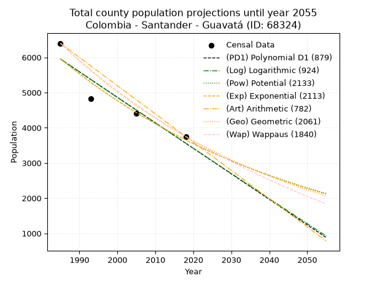
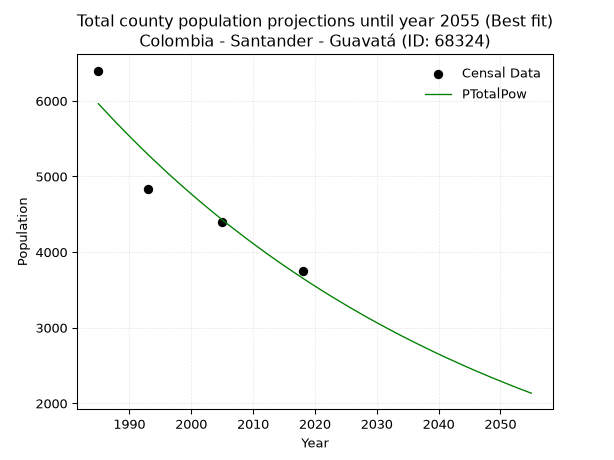
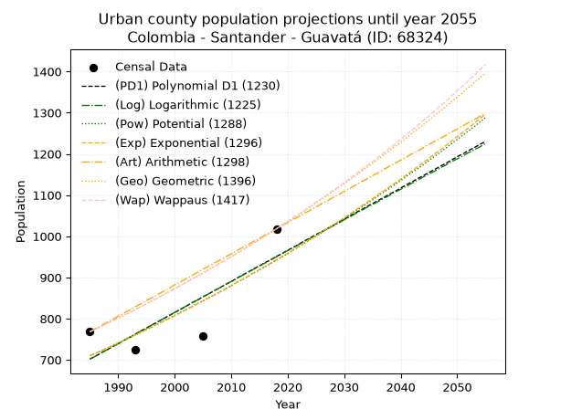
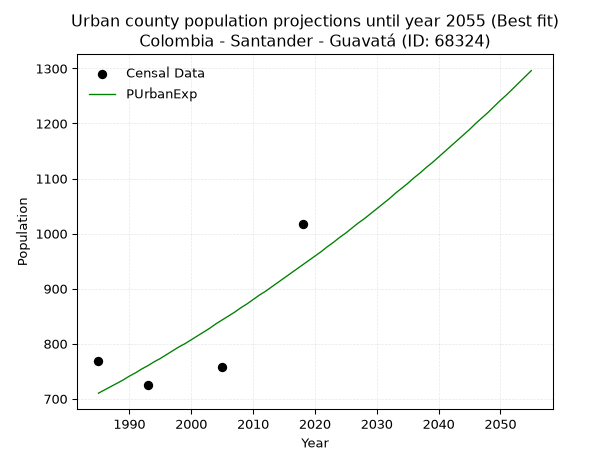
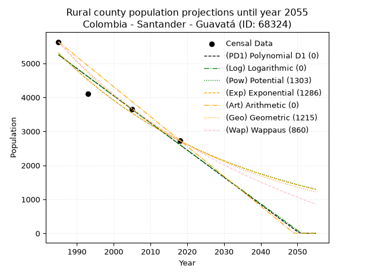
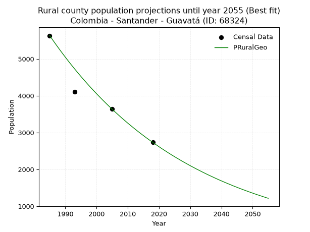

<div align="center">


</div>

# 📜 _“Population and Public Services Demand Projections (PPSD) until Year 2050 for Colombia - Santander - Guavatá (ID: 68324)”_
Keywords: `population` `public-service` `projection` `lineal` `polynomial` `logarithmic` `potential` `exponential` `arithmetic` `geometric` `wappaus` `dane` `colombia` `south-america`

PPSD are analytical estimates used by governments and planners to anticipate future changes in population size, age distribution, and the resulting community needs for utilities, healthcare, education, and infrastructure as sizing future water treatment facilities, electrical grids, and road networks based on spatial growth.

<div align="center">

</img>

</div>


> **General running parameters**: • app_version: _v20260806_. • Python version: _3.14.7_. • Pandas version: _3.0.5_. • NumPy version: _2.5.1_. • Creates, save and include plots into reports (create_plot): _False_. • Projection until year: _2050_. • Process polynomial degree 2 and up: _False_. • Process Wappaus: _True_. • Process Wappaus: _True_. • Set negative values to zero: _True_. • Set infinite values to zero: _True_. • Drop dataset notes: _True_. 
<div align="center">

Dynamic map: [:earth_americas:Google](http://maps.google.com/maps?q=5.954348075,-73.7009061) [:earth_americas:OSM](https://www.openstreetmap.org/#map=18/5.954348075/-73.7009061&layers=P) [:earth_americas:Bing](https://www.bing.com/maps?cp=5.954348075~-73.7009061&lvl=18) [:earth_americas:Apple](https://maps.apple.com/frame?center=5.954348075%2C-73.7009061&span=0.003%2C0.006)

</div>


<div align="center">

```geojson
{
  "type": "Feature",
  "geometry": {
    "type": "Point", 
    "coordinates": [-73.7009061, 5.954348075]
  }, 
  "properties": {
    "Name": "Colombia - Santander - Guavatá (ID: 68324)"
  }
}
```

</div>


## 0. Census Data (4 records)

Census data are official statistics collected by a government about the people and housing in a country. They usually include counts of total population, age, sex, race, income, education, and jobs.

📅Global census file: [Population.xlsx](../data/Population.xlsx)

| Source   |   Year |   CountryID | CountryName   |   StateID | StateName   |   CountyID | CountyName   |   PTotal |   PUrban |   PRural |
|:---------|-------:|------------:|:--------------|----------:|:------------|-----------:|:-------------|---------:|---------:|---------:|
| DANE     |   1985 |          57 | Colombia      |        68 | Santander   |      68324 | Guavatá      |     6399 |      768 |     5631 |
| DANE     |   1993 |          57 | Colombia      |        68 | Santander   |      68324 | Guavatá      |     4832 |      724 |     4108 |
| DANE     |   2005 |          57 | Colombia      |        68 | Santander   |      68324 | Guavatá      |     4402 |      757 |     3645 |
| DANE     |   2018 |          57 | Colombia      |        68 | Santander   |      68324 | Guavatá      |     3751 |     1018 |     2733 |

> 🔥Some records could had specific notes about the registered values or the corresponding urban or rural distribution.

📅[SUI-RUPS](https://www.datos.gov.co/Hacienda-y-Cr-dito-P-blico/Registro-nico-de-Prestadores-de-Servicios-P-blicos/4qkq-csdn/about_data) - Local public utility companies: [RUPS.csv](../data/RUPS.xlsx)

 | SERVICIO       | ESTADO    | NOMBRE               | NIT         | DEPARTAMENTO_DOMICILIO   | MUNICIPIO_DOMICILIO   | DIRECCION           |   TELEFONO | EMAIL                             | TIPO_PRESTADOR                 | CLASIFICACION                 |
|:---------------|:----------|:---------------------|:------------|:-------------------------|:----------------------|:--------------------|-----------:|:----------------------------------|:-------------------------------|:------------------------------|
| ACUEDUCTO      | OPERATIVA | MUNICIPIO DE GUAVATA | 890210945-5 | SANTANDER                | GUAVATA               | Carrera  3 No. 4-48 |    7527061 | ALCALDIA@GUAVATA-SANTANDER.GOV.CO | MUNICIPIO (PRESTACIÓN DIRECTA) | MENOR O IGUAL A 2500 USUARIOS |
| ALCANTARILLADO | OPERATIVA | MUNICIPIO DE GUAVATA | 890210945-5 | SANTANDER                | GUAVATA               | Carrera  3 No. 4-48 |    7527061 | ALCALDIA@GUAVATA-SANTANDER.GOV.CO | MUNICIPIO (PRESTACIÓN DIRECTA) | MENOR O IGUAL A 2500 USUARIOS |

## 1. Total

### 1.1. Coefficients and Parameters

* (PD1) Polynomial Deg 1: -72.46407065435525, 149792.2573263741 (lineal)
* (Log) Logarithmic: -145153.2722432938, 1108157.1855065995
* (Pow) Potential: -29.65419778663803, 101.56776481849582
* (Exp) Exponential: -0.014807098614562857, 3.4665633203773256e+16
* (Art) Arithmetic: Year diff. 2018 - 1985 = 33, Population diff. 3751 - 6399 = -2648, Annual growth = -80.24242424242425
* (Geo) Geometric: Year diff. 2018 - 1985 = 33, Population diff. 3751 - 6399 = -2648, Annual growth % = -0.016055151754884256
* (Wap) Wappaus: i = -1.581131512165995, Condition values only valid for < 200)

<sub>
Wappaus condition values: ['-0.00', '-1.58', '-3.16', '-4.74', '-6.32', '-7.91', '-9.49', '-11.07', '-12.65', '-14.23', '-15.81', '-17.39', '-18.97', '-20.55', '-22.14', '-23.72', '-25.30', '-26.88', '-28.46', '-30.04', '-31.62', '-33.20', '-34.78', '-36.37', '-37.95', '-39.53', '-41.11', '-42.69', '-44.27', '-45.85', '-47.43', '-49.02', '-50.60', '-52.18', '-53.76', '-55.34', '-56.92', '-58.50', '-60.08', '-61.66', '-63.25', '-64.83', '-66.41', '-67.99', '-69.57', '-71.15', '-72.73', '-74.31', '-75.89', '-77.48', '-79.06', '-80.64', '-82.22', '-83.80', '-85.38', '-86.96', '-88.54', '-90.12', '-91.71', '-93.29', '-94.87', '-96.45', '-98.03', '-99.61', '-101.19', '-102.77']
</sub>


### 1.2. Projected Dataset

|   Year |   CountyID |   PTotalPD1 |   PTotalLog |   PTotalPow |   PTotalExp |   PTotalArt |   PTotalGeo |   PTotalWap |
|-------:|-----------:|------------:|------------:|------------:|------------:|------------:|------------:|------------:|
|   1985 |      68324 |        5951 |        5954 |        5961 |        5958 |        6399 |        6399 |        6399 |
|   1986 |      68324 |        5879 |        5881 |        5873 |        5870 |        6319 |        6296 |        6299 |
|   1987 |      68324 |        5806 |        5808 |        5786 |        5784 |        6239 |        6195 |        6200 |
|   1988 |      68324 |        5734 |        5735 |        5700 |        5699 |        6158 |        6096 |        6103 |
|   1989 |      68324 |        5661 |        5662 |        5616 |        5615 |        6078 |        5998 |        6007 |
|   1990 |      68324 |        5589 |        5589 |        5533 |        5533 |        5998 |        5902 |        5912 |
|   1991 |      68324 |        5516 |        5516 |        5451 |        5451 |        5918 |        5807 |        5819 |
|   1992 |      68324 |        5444 |        5443 |        5370 |        5371 |        5837 |        5714 |        5728 |
|   1993 |      68324 |        5371 |        5370 |        5291 |        5292 |        5757 |        5622 |        5638 |
|   1994 |      68324 |        5299 |        5297 |        5213 |        5214 |        5677 |        5532 |        5549 |
|   1995 |      68324 |        5226 |        5225 |        5136 |        5138 |        5597 |        5443 |        5461 |
|   1996 |      68324 |        5154 |        5152 |        5060 |        5062 |        5516 |        5355 |        5375 |
|   1997 |      68324 |        5082 |        5079 |        4985 |        4988 |        5436 |        5269 |        5290 |
|   1998 |      68324 |        5009 |        5007 |        4912 |        4914 |        5356 |        5185 |        5206 |
|   1999 |      68324 |        4937 |        4934 |        4840 |        4842 |        5276 |        5102 |        5124 |
|   2000 |      68324 |        4864 |        4861 |        4768 |        4771 |        5195 |        5020 |        5042 |
|   2001 |      68324 |        4792 |        4789 |        4698 |        4701 |        5115 |        4939 |        4962 |
|   2002 |      68324 |        4719 |        4716 |        4629 |        4632 |        5035 |        4860 |        4883 |
|   2003 |      68324 |        4647 |        4644 |        4561 |        4564 |        4955 |        4782 |        4805 |
|   2004 |      68324 |        4574 |        4571 |        4494 |        4497 |        4874 |        4705 |        4728 |
|   2005 |      68324 |        4502 |        4499 |        4428 |        4431 |        4794 |        4629 |        4652 |
|   2006 |      68324 |        4429 |        4427 |        4363 |        4365 |        4714 |        4555 |        4577 |
|   2007 |      68324 |        4357 |        4354 |        4299 |        4301 |        4634 |        4482 |        4503 |
|   2008 |      68324 |        4284 |        4282 |        4236 |        4238 |        4553 |        4410 |        4430 |
|   2009 |      68324 |        4212 |        4210 |        4174 |        4176 |        4473 |        4339 |        4358 |
|   2010 |      68324 |        4139 |        4137 |        4113 |        4114 |        4393 |        4270 |        4287 |
|   2011 |      68324 |        4067 |        4065 |        4053 |        4054 |        4313 |        4201 |        4217 |
|   2012 |      68324 |        3995 |        3993 |        3993 |        3994 |        4232 |        4134 |        4148 |
|   2013 |      68324 |        3922 |        3921 |        3935 |        3936 |        4152 |        4067 |        4079 |
|   2014 |      68324 |        3850 |        3849 |        3877 |        3878 |        4072 |        4002 |        4012 |
|   2015 |      68324 |        3777 |        3777 |        3821 |        3821 |        3992 |        3938 |        3946 |
|   2016 |      68324 |        3705 |        3705 |        3765 |        3765 |        3911 |        3874 |        3880 |
|   2017 |      68324 |        3632 |        3633 |        3710 |        3709 |        3831 |        3812 |        3815 |
|   2018 |      68324 |        3560 |        3561 |        3656 |        3655 |        3751 |        3751 |        3751 |
|   2019 |      68324 |        3487 |        3489 |        3602 |        3601 |        3671 |        3691 |        3688 |
|   2020 |      68324 |        3415 |        3417 |        3550 |        3548 |        3591 |        3632 |        3625 |
|   2021 |      68324 |        3342 |        3345 |        3498 |        3496 |        3510 |        3573 |        3564 |
|   2022 |      68324 |        3270 |        3273 |        3447 |        3445 |        3430 |        3516 |        3503 |
|   2023 |      68324 |        3197 |        3202 |        3397 |        3394 |        3350 |        3459 |        3442 |
|   2024 |      68324 |        3125 |        3130 |        3348 |        3344 |        3270 |        3404 |        3383 |
|   2025 |      68324 |        3053 |        3058 |        3299 |        3295 |        3189 |        3349 |        3324 |
|   2026 |      68324 |        2980 |        2986 |        3251 |        3247 |        3109 |        3295 |        3266 |
|   2027 |      68324 |        2908 |        2915 |        3204 |        3199 |        3029 |        3243 |        3209 |
|   2028 |      68324 |        2835 |        2843 |        3157 |        3152 |        2949 |        3190 |        3152 |
|   2029 |      68324 |        2763 |        2772 |        3111 |        3105 |        2868 |        3139 |        3096 |
|   2030 |      68324 |        2690 |        2700 |        3066 |        3060 |        2788 |        3089 |        3041 |
|   2031 |      68324 |        2618 |        2629 |        3022 |        3015 |        2708 |        3039 |        2986 |
|   2032 |      68324 |        2545 |        2557 |        2978 |        2971 |        2628 |        2990 |        2932 |
|   2033 |      68324 |        2473 |        2486 |        2935 |        2927 |        2547 |        2942 |        2878 |
|   2034 |      68324 |        2400 |        2414 |        2892 |        2884 |        2467 |        2895 |        2826 |
|   2035 |      68324 |        2328 |        2343 |        2851 |        2841 |        2387 |        2849 |        2773 |
|   2036 |      68324 |        2255 |        2272 |        2809 |        2800 |        2307 |        2803 |        2722 |
|   2037 |      68324 |        2183 |        2201 |        2769 |        2759 |        2226 |        2758 |        2671 |
|   2038 |      68324 |        2110 |        2129 |        2729 |        2718 |        2146 |        2714 |        2620 |
|   2039 |      68324 |        2038 |        2058 |        2689 |        2678 |        2066 |        2670 |        2570 |
|   2040 |      68324 |        1966 |        1987 |        2651 |        2639 |        1986 |        2627 |        2521 |
|   2041 |      68324 |        1893 |        1916 |        2612 |        2600 |        1905 |        2585 |        2472 |
|   2042 |      68324 |        1821 |        1845 |        2575 |        2562 |        1825 |        2544 |        2423 |
|   2043 |      68324 |        1748 |        1774 |        2538 |        2524 |        1745 |        2503 |        2376 |
|   2044 |      68324 |        1676 |        1703 |        2501 |        2487 |        1665 |        2463 |        2328 |
|   2045 |      68324 |        1603 |        1632 |        2465 |        2450 |        1584 |        2423 |        2281 |
|   2046 |      68324 |        1531 |        1561 |        2429 |        2414 |        1504 |        2384 |        2235 |
|   2047 |      68324 |        1458 |        1490 |        2395 |        2379 |        1424 |        2346 |        2189 |
|   2048 |      68324 |        1386 |        1419 |        2360 |        2344 |        1344 |        2308 |        2144 |
|   2049 |      68324 |        1313 |        1348 |        2326 |        2309 |        1263 |        2271 |        2099 |
|   2050 |      68324 |        1241 |        1277 |        2293 |        2276 |        1183 |        2235 |        2055 |
<div align="center">

</img>

</div>


### 1.3. Best fit with absolute and relative error (%)

Relative error puts that difference into context by dividing the absolute error by the true value, creating a unitless ratio or percentage that shows the scale of the mistake.

Absolute and relative error

|   Year | Source   |   CountryID | CountryName   |   StateID | StateName   |   CountyID_x | CountyName   |   PTotal |   PUrban |   PRural |   CountyID_y |   PTotalPD1 |   PTotalLog |   PTotalPow |   PTotalExp |   PTotalArt |   PTotalGeo |   PTotalWap |   PTotalPD1AbsError |   PTotalLogAbsError |   PTotalPowAbsError |   PTotalExpAbsError |   PTotalArtAbsError |   PTotalGeoAbsError |   PTotalWapAbsError |   PTotalPD1RelError |   PTotalLogRelError |   PTotalPowRelError |   PTotalExpRelError |   PTotalArtRelError |   PTotalGeoRelError |   PTotalWapRelError |
|-------:|:---------|------------:|:--------------|----------:|:------------|-------------:|:-------------|---------:|---------:|---------:|-------------:|------------:|------------:|------------:|------------:|------------:|------------:|------------:|--------------------:|--------------------:|--------------------:|--------------------:|--------------------:|--------------------:|--------------------:|--------------------:|--------------------:|--------------------:|--------------------:|--------------------:|--------------------:|--------------------:|
|   1985 | DANE     |          57 | Colombia      |        68 | Santander   |        68324 | Guavatá      |     6399 |      768 |     5631 |        68324 |        5951 |        5954 |        5961 |        5958 |        6399 |        6399 |        6399 |                 448 |                 445 |                 438 |                 441 |                   0 |                   0 |                   0 |             7.00109 |             6.95421 |            6.84482  |            6.8917   |             0       |             0       |             0       |
|   1993 | DANE     |          57 | Colombia      |        68 | Santander   |        68324 | Guavatá      |     4832 |      724 |     4108 |        68324 |        5371 |        5370 |        5291 |        5292 |        5757 |        5622 |        5638 |                 539 |                 538 |                 459 |                 460 |                 925 |                 790 |                 806 |            11.1548  |            11.1341  |            9.49917  |            9.51987  |            19.1432  |            16.3493  |            16.6805  |
|   2005 | DANE     |          57 | Colombia      |        68 | Santander   |        68324 | Guavatá      |     4402 |      757 |     3645 |        68324 |        4502 |        4499 |        4428 |        4431 |        4794 |        4629 |        4652 |                 100 |                  97 |                  26 |                  29 |                 392 |                 227 |                 250 |             2.27169 |             2.20354 |            0.590641 |            0.658791 |             8.90504 |             5.15675 |             5.67924 |
|   2018 | DANE     |          57 | Colombia      |        68 | Santander   |        68324 | Guavatá      |     3751 |     1018 |     2733 |        68324 |        3560 |        3561 |        3656 |        3655 |        3751 |        3751 |        3751 |                 191 |                 190 |                  95 |                  96 |                   0 |                   0 |                   0 |             5.09198 |             5.06532 |            2.53266  |            2.55932  |             0       |             0       |             0       |

Relative error mean

| Method    |   RelError | Best   |
|:----------|-----------:|:-------|
| PTotalPD1 |    6.37989 |        |
| PTotalLog |    6.33929 |        |
| PTotalPow |    4.86682 | True   |
| PTotalExp |    4.90742 |        |
| PTotalArt |    7.01206 |        |
| PTotalGeo |    5.37652 |        |
| PTotalWap |    5.58993 |        |

💙Best method: _**PTotalPow**_
<div align="center">

</img>

</div>


### 1.4. Fresh water supply demand in liters per capita per day (lpcd)

The fresh water supply demand typically ranges from 100 to 300 liters per capita per day (lpcd) for standard domestic and municipal planning, though absolute survival minimums set by the World Health Organization are as low as 7.5 to 20 liters per day, and total consumption in high-income nations can exceed 400 liters.

> `CZ`: Level in meters above the sea level (masl)<br> `WS`: Fresh water supply demand in liters per capita per day (lpcd or l/h/d)<br> `WSAll`: Zonal fresh water supply demand in liters per second (l/s)<br> `A`: Zonal area in square meters<br> `DP`: Population density (people/hectare or p/ha)

Reference values (RAS Colombia)

|    CZ |   WS |
|------:|-----:|
|  1000 |  120 |
|  2000 |  130 |
| 99999 |  140 |

County shapefile geometry properties and water supply values

|   CountyID |      ATotal |   CZTotal |   WSTotal |
|-----------:|------------:|----------:|----------:|
|      68324 | 8.36714e+07 |   1878.64 |       130 |

Projected values for best method: PTotalPow

|   CountyID |   Year |   PTotalPow |   DPTotal |   WSTotal |   WSTotalAll |
|-----------:|-------:|------------:|----------:|----------:|-------------:|
|      68324 |   1985 |        5961 |      0.71 |       130 |      8.9691  |
|      68324 |   1986 |        5873 |      0.7  |       130 |      8.83669 |
|      68324 |   1987 |        5786 |      0.69 |       130 |      8.70579 |
|      68324 |   1988 |        5700 |      0.68 |       130 |      8.57639 |
|      68324 |   1989 |        5616 |      0.67 |       130 |      8.45    |
|      68324 |   1990 |        5533 |      0.66 |       130 |      8.32512 |
|      68324 |   1991 |        5451 |      0.65 |       130 |      8.20174 |
|      68324 |   1992 |        5370 |      0.64 |       130 |      8.07986 |
|      68324 |   1993 |        5291 |      0.63 |       130 |      7.961   |
|      68324 |   1994 |        5213 |      0.62 |       130 |      7.84363 |
|      68324 |   1995 |        5136 |      0.61 |       130 |      7.72778 |
|      68324 |   1996 |        5060 |      0.6  |       130 |      7.61343 |
|      68324 |   1997 |        4985 |      0.6  |       130 |      7.50058 |
|      68324 |   1998 |        4912 |      0.59 |       130 |      7.39074 |
|      68324 |   1999 |        4840 |      0.58 |       130 |      7.28241 |
|      68324 |   2000 |        4768 |      0.57 |       130 |      7.17407 |
|      68324 |   2001 |        4698 |      0.56 |       130 |      7.06875 |
|      68324 |   2002 |        4629 |      0.55 |       130 |      6.96493 |
|      68324 |   2003 |        4561 |      0.55 |       130 |      6.86262 |
|      68324 |   2004 |        4494 |      0.54 |       130 |      6.76181 |
|      68324 |   2005 |        4428 |      0.53 |       130 |      6.6625  |
|      68324 |   2006 |        4363 |      0.52 |       130 |      6.5647  |
|      68324 |   2007 |        4299 |      0.51 |       130 |      6.4684  |
|      68324 |   2008 |        4236 |      0.51 |       130 |      6.37361 |
|      68324 |   2009 |        4174 |      0.5  |       130 |      6.28032 |
|      68324 |   2010 |        4113 |      0.49 |       130 |      6.18854 |
|      68324 |   2011 |        4053 |      0.48 |       130 |      6.09826 |
|      68324 |   2012 |        3993 |      0.48 |       130 |      6.00799 |
|      68324 |   2013 |        3935 |      0.47 |       130 |      5.92072 |
|      68324 |   2014 |        3877 |      0.46 |       130 |      5.83345 |
|      68324 |   2015 |        3821 |      0.46 |       130 |      5.74919 |
|      68324 |   2016 |        3765 |      0.45 |       130 |      5.66493 |
|      68324 |   2017 |        3710 |      0.44 |       130 |      5.58218 |
|      68324 |   2018 |        3656 |      0.44 |       130 |      5.50093 |
|      68324 |   2019 |        3602 |      0.43 |       130 |      5.41968 |
|      68324 |   2020 |        3550 |      0.42 |       130 |      5.34144 |
|      68324 |   2021 |        3498 |      0.42 |       130 |      5.26319 |
|      68324 |   2022 |        3447 |      0.41 |       130 |      5.18646 |
|      68324 |   2023 |        3397 |      0.41 |       130 |      5.11123 |
|      68324 |   2024 |        3348 |      0.4  |       130 |      5.0375  |
|      68324 |   2025 |        3299 |      0.39 |       130 |      4.96377 |
|      68324 |   2026 |        3251 |      0.39 |       130 |      4.89155 |
|      68324 |   2027 |        3204 |      0.38 |       130 |      4.82083 |
|      68324 |   2028 |        3157 |      0.38 |       130 |      4.75012 |
|      68324 |   2029 |        3111 |      0.37 |       130 |      4.6809  |
|      68324 |   2030 |        3066 |      0.37 |       130 |      4.61319 |
|      68324 |   2031 |        3022 |      0.36 |       130 |      4.54699 |
|      68324 |   2032 |        2978 |      0.36 |       130 |      4.48079 |
|      68324 |   2033 |        2935 |      0.35 |       130 |      4.41609 |
|      68324 |   2034 |        2892 |      0.35 |       130 |      4.35139 |
|      68324 |   2035 |        2851 |      0.34 |       130 |      4.2897  |
|      68324 |   2036 |        2809 |      0.34 |       130 |      4.2265  |
|      68324 |   2037 |        2769 |      0.33 |       130 |      4.16632 |
|      68324 |   2038 |        2729 |      0.33 |       130 |      4.10613 |
|      68324 |   2039 |        2689 |      0.32 |       130 |      4.04595 |
|      68324 |   2040 |        2651 |      0.32 |       130 |      3.98877 |
|      68324 |   2041 |        2612 |      0.31 |       130 |      3.93009 |
|      68324 |   2042 |        2575 |      0.31 |       130 |      3.87442 |
|      68324 |   2043 |        2538 |      0.3  |       130 |      3.81875 |
|      68324 |   2044 |        2501 |      0.3  |       130 |      3.76308 |
|      68324 |   2045 |        2465 |      0.29 |       130 |      3.70891 |
|      68324 |   2046 |        2429 |      0.29 |       130 |      3.65475 |
|      68324 |   2047 |        2395 |      0.29 |       130 |      3.60359 |
|      68324 |   2048 |        2360 |      0.28 |       130 |      3.55093 |
|      68324 |   2049 |        2326 |      0.28 |       130 |      3.49977 |
|      68324 |   2050 |        2293 |      0.27 |       130 |      3.45012 |

## 2. Urban

### 2.1. Coefficients and Parameters

* (PD1) Polynomial Deg 1: 7.553994379766998, -14293.127258128936 (lineal)
* (Log) Logarithmic: 15094.171435945213, -113914.16804171828
* (Pow) Potential: 17.20172713319861, -53.876219935961004
* (Exp) Exponential: 0.008609007109177268, 2.6875873328197312e-05
* (Art) Arithmetic: Year diff. 2018 - 1985 = 33, Population diff. 1018 - 768 = 250, Annual growth = 7.575757575757576
* (Geo) Geometric: Year diff. 2018 - 1985 = 33, Population diff. 1018 - 768 = 250, Annual growth % = 0.008576125564245363
* (Wap) Wappaus: i = 0.8483491126268282, Condition values only valid for < 200)

<sub>
Wappaus condition values: ['0.00', '0.85', '1.70', '2.55', '3.39', '4.24', '5.09', '5.94', '6.79', '7.64', '8.48', '9.33', '10.18', '11.03', '11.88', '12.73', '13.57', '14.42', '15.27', '16.12', '16.97', '17.82', '18.66', '19.51', '20.36', '21.21', '22.06', '22.91', '23.75', '24.60', '25.45', '26.30', '27.15', '28.00', '28.84', '29.69', '30.54', '31.39', '32.24', '33.09', '33.93', '34.78', '35.63', '36.48', '37.33', '38.18', '39.02', '39.87', '40.72', '41.57', '42.42', '43.27', '44.11', '44.96', '45.81', '46.66', '47.51', '48.36', '49.20', '50.05', '50.90', '51.75', '52.60', '53.45', '54.29', '55.14']
</sub>


### 2.2. Projected Dataset

|   Year |   CountyID |   PUrbanPD1 |   PUrbanLog |   PUrbanPow |   PUrbanExp |   PUrbanArt |   PUrbanGeo |   PUrbanWap |
|-------:|-----------:|------------:|------------:|------------:|------------:|------------:|------------:|------------:|
|   1985 |      68324 |         702 |         702 |         710 |         710 |         768 |         768 |         768 |
|   1986 |      68324 |         709 |         709 |         716 |         716 |         776 |         775 |         775 |
|   1987 |      68324 |         717 |         717 |         722 |         722 |         783 |         781 |         781 |
|   1988 |      68324 |         724 |         724 |         728 |         728 |         791 |         788 |         788 |
|   1989 |      68324 |         732 |         732 |         735 |         734 |         798 |         795 |         795 |
|   1990 |      68324 |         739 |         739 |         741 |         741 |         806 |         802 |         801 |
|   1991 |      68324 |         747 |         747 |         747 |         747 |         813 |         808 |         808 |
|   1992 |      68324 |         754 |         755 |         754 |         754 |         821 |         815 |         815 |
|   1993 |      68324 |         762 |         762 |         760 |         760 |         829 |         822 |         822 |
|   1994 |      68324 |         770 |         770 |         767 |         767 |         836 |         829 |         829 |
|   1995 |      68324 |         777 |         777 |         774 |         773 |         844 |         836 |         836 |
|   1996 |      68324 |         785 |         785 |         780 |         780 |         851 |         844 |         843 |
|   1997 |      68324 |         792 |         792 |         787 |         787 |         859 |         851 |         850 |
|   1998 |      68324 |         800 |         800 |         794 |         794 |         866 |         858 |         858 |
|   1999 |      68324 |         807 |         808 |         801 |         800 |         874 |         866 |         865 |
|   2000 |      68324 |         815 |         815 |         808 |         807 |         882 |         873 |         872 |
|   2001 |      68324 |         822 |         823 |         815 |         814 |         889 |         880 |         880 |
|   2002 |      68324 |         830 |         830 |         822 |         821 |         897 |         888 |         887 |
|   2003 |      68324 |         838 |         838 |         829 |         828 |         904 |         896 |         895 |
|   2004 |      68324 |         845 |         845 |         836 |         836 |         912 |         903 |         903 |
|   2005 |      68324 |         853 |         853 |         843 |         843 |         920 |         911 |         910 |
|   2006 |      68324 |         860 |         860 |         850 |         850 |         927 |         919 |         918 |
|   2007 |      68324 |         868 |         868 |         858 |         857 |         935 |         927 |         926 |
|   2008 |      68324 |         875 |         875 |         865 |         865 |         942 |         935 |         934 |
|   2009 |      68324 |         883 |         883 |         872 |         872 |         950 |         943 |         942 |
|   2010 |      68324 |         890 |         890 |         880 |         880 |         957 |         951 |         950 |
|   2011 |      68324 |         898 |         898 |         888 |         888 |         965 |         959 |         958 |
|   2012 |      68324 |         906 |         905 |         895 |         895 |         973 |         967 |         967 |
|   2013 |      68324 |         913 |         913 |         903 |         903 |         980 |         975 |         975 |
|   2014 |      68324 |         921 |         920 |         911 |         911 |         988 |         984 |         983 |
|   2015 |      68324 |         928 |         928 |         918 |         919 |         995 |         992 |         992 |
|   2016 |      68324 |         936 |         935 |         926 |         927 |        1003 |        1001 |        1001 |
|   2017 |      68324 |         943 |         943 |         934 |         935 |        1010 |        1009 |        1009 |
|   2018 |      68324 |         951 |         950 |         942 |         943 |        1018 |        1018 |        1018 |
|   2019 |      68324 |         958 |         958 |         950 |         951 |        1026 |        1027 |        1027 |
|   2020 |      68324 |         966 |         965 |         958 |         959 |        1033 |        1036 |        1036 |
|   2021 |      68324 |         973 |         973 |         967 |         967 |        1041 |        1044 |        1045 |
|   2022 |      68324 |         981 |         980 |         975 |         976 |        1048 |        1053 |        1054 |
|   2023 |      68324 |         989 |         988 |         983 |         984 |        1056 |        1062 |        1063 |
|   2024 |      68324 |         996 |         995 |         992 |         993 |        1063 |        1072 |        1072 |
|   2025 |      68324 |        1004 |        1003 |        1000 |        1001 |        1071 |        1081 |        1082 |
|   2026 |      68324 |        1011 |        1010 |        1009 |        1010 |        1079 |        1090 |        1091 |
|   2027 |      68324 |        1019 |        1018 |        1017 |        1019 |        1086 |        1099 |        1101 |
|   2028 |      68324 |        1026 |        1025 |        1026 |        1027 |        1094 |        1109 |        1111 |
|   2029 |      68324 |        1034 |        1032 |        1035 |        1036 |        1101 |        1118 |        1120 |
|   2030 |      68324 |        1041 |        1040 |        1043 |        1045 |        1109 |        1128 |        1130 |
|   2031 |      68324 |        1049 |        1047 |        1052 |        1054 |        1116 |        1138 |        1140 |
|   2032 |      68324 |        1057 |        1055 |        1061 |        1063 |        1124 |        1147 |        1150 |
|   2033 |      68324 |        1064 |        1062 |        1070 |        1073 |        1132 |        1157 |        1161 |
|   2034 |      68324 |        1072 |        1070 |        1079 |        1082 |        1139 |        1167 |        1171 |
|   2035 |      68324 |        1079 |        1077 |        1088 |        1091 |        1147 |        1177 |        1181 |
|   2036 |      68324 |        1087 |        1084 |        1098 |        1101 |        1154 |        1187 |        1192 |
|   2037 |      68324 |        1094 |        1092 |        1107 |        1110 |        1162 |        1197 |        1203 |
|   2038 |      68324 |        1102 |        1099 |        1116 |        1120 |        1170 |        1208 |        1213 |
|   2039 |      68324 |        1109 |        1107 |        1126 |        1129 |        1177 |        1218 |        1224 |
|   2040 |      68324 |        1117 |        1114 |        1135 |        1139 |        1185 |        1228 |        1235 |
|   2041 |      68324 |        1125 |        1121 |        1145 |        1149 |        1192 |        1239 |        1247 |
|   2042 |      68324 |        1132 |        1129 |        1155 |        1159 |        1200 |        1250 |        1258 |
|   2043 |      68324 |        1140 |        1136 |        1164 |        1169 |        1207 |        1260 |        1269 |
|   2044 |      68324 |        1147 |        1144 |        1174 |        1179 |        1215 |        1271 |        1281 |
|   2045 |      68324 |        1155 |        1151 |        1184 |        1189 |        1223 |        1282 |        1292 |
|   2046 |      68324 |        1162 |        1158 |        1194 |        1200 |        1230 |        1293 |        1304 |
|   2047 |      68324 |        1170 |        1166 |        1204 |        1210 |        1238 |        1304 |        1316 |
|   2048 |      68324 |        1177 |        1173 |        1214 |        1220 |        1245 |        1315 |        1328 |
|   2049 |      68324 |        1185 |        1181 |        1225 |        1231 |        1253 |        1327 |        1340 |
|   2050 |      68324 |        1193 |        1188 |        1235 |        1242 |        1260 |        1338 |        1353 |
<div align="center">

</img>

</div>


### 2.3. Best fit with absolute and relative error (%)

Relative error puts that difference into context by dividing the absolute error by the true value, creating a unitless ratio or percentage that shows the scale of the mistake.

Absolute and relative error

|   Year | Source   |   CountryID | CountryName   |   StateID | StateName   |   CountyID_x | CountyName   |   PTotal |   PUrban |   PRural |   CountyID_y |   PUrbanPD1 |   PUrbanLog |   PUrbanPow |   PUrbanExp |   PUrbanArt |   PUrbanGeo |   PUrbanWap |   PUrbanPD1AbsError |   PUrbanLogAbsError |   PUrbanPowAbsError |   PUrbanExpAbsError |   PUrbanArtAbsError |   PUrbanGeoAbsError |   PUrbanWapAbsError |   PUrbanPD1RelError |   PUrbanLogRelError |   PUrbanPowRelError |   PUrbanExpRelError |   PUrbanArtRelError |   PUrbanGeoRelError |   PUrbanWapRelError |
|-------:|:---------|------------:|:--------------|----------:|:------------|-------------:|:-------------|---------:|---------:|---------:|-------------:|------------:|------------:|------------:|------------:|------------:|------------:|------------:|--------------------:|--------------------:|--------------------:|--------------------:|--------------------:|--------------------:|--------------------:|--------------------:|--------------------:|--------------------:|--------------------:|--------------------:|--------------------:|--------------------:|
|   1985 | DANE     |          57 | Colombia      |        68 | Santander   |        68324 | Guavatá      |     6399 |      768 |     5631 |        68324 |         702 |         702 |         710 |         710 |         768 |         768 |         768 |                  66 |                  66 |                  58 |                  58 |                   0 |                   0 |                   0 |             8.59375 |             8.59375 |             7.55208 |             7.55208 |              0      |              0      |              0      |
|   1993 | DANE     |          57 | Colombia      |        68 | Santander   |        68324 | Guavatá      |     4832 |      724 |     4108 |        68324 |         762 |         762 |         760 |         760 |         829 |         822 |         822 |                  38 |                  38 |                  36 |                  36 |                 105 |                  98 |                  98 |             5.24862 |             5.24862 |             4.97238 |             4.97238 |             14.5028 |             13.5359 |             13.5359 |
|   2005 | DANE     |          57 | Colombia      |        68 | Santander   |        68324 | Guavatá      |     4402 |      757 |     3645 |        68324 |         853 |         853 |         843 |         843 |         920 |         911 |         910 |                  96 |                  96 |                  86 |                  86 |                 163 |                 154 |                 153 |            12.6816  |            12.6816  |            11.3606  |            11.3606  |             21.5324 |             20.3435 |             20.2114 |
|   2018 | DANE     |          57 | Colombia      |        68 | Santander   |        68324 | Guavatá      |     3751 |     1018 |     2733 |        68324 |         951 |         950 |         942 |         943 |        1018 |        1018 |        1018 |                  67 |                  68 |                  76 |                  75 |                   0 |                   0 |                   0 |             6.58153 |             6.67976 |             7.46562 |             7.36739 |              0      |              0      |              0      |

Relative error mean

| Method    |   RelError | Best   |
|:----------|-----------:|:-------|
| PUrbanPD1 |    8.27638 |        |
| PUrbanLog |    8.30094 |        |
| PUrbanPow |    7.83768 |        |
| PUrbanExp |    7.81312 | True   |
| PUrbanArt |    9.00878 |        |
| PUrbanGeo |    8.46984 |        |
| PUrbanWap |    8.43682 |        |

💙Best method: _**PUrbanExp**_
<div align="center">

</img>

</div>


### 2.4. Fresh water supply demand in liters per capita per day (lpcd)

The fresh water supply demand typically ranges from 100 to 300 liters per capita per day (lpcd) for standard domestic and municipal planning, though absolute survival minimums set by the World Health Organization are as low as 7.5 to 20 liters per day, and total consumption in high-income nations can exceed 400 liters.

> `CZ`: Level in meters above the sea level (masl)<br> `WS`: Fresh water supply demand in liters per capita per day (lpcd or l/h/d)<br> `WSAll`: Zonal fresh water supply demand in liters per second (l/s)<br> `A`: Zonal area in square meters<br> `DP`: Population density (people/hectare or p/ha)

Reference values (RAS Colombia)

|    CZ |   WS |
|------:|-----:|
|  1000 |  120 |
|  2000 |  130 |
| 99999 |  140 |

County shapefile geometry properties and water supply values

|   CountyID |   AUrban |   CZUrban |   WSUrban |
|-----------:|---------:|----------:|----------:|
|      68324 |   284351 |   1976.65 |       130 |

Projected values for best method: PUrbanExp

|   CountyID |   Year |   PUrbanExp |   DPUrban |   WSUrban |   WSUrbanAll |
|-----------:|-------:|------------:|----------:|----------:|-------------:|
|      68324 |   1985 |         710 |     24.97 |       130 |      1.06829 |
|      68324 |   1986 |         716 |     25.18 |       130 |      1.07731 |
|      68324 |   1987 |         722 |     25.39 |       130 |      1.08634 |
|      68324 |   1988 |         728 |     25.6  |       130 |      1.09537 |
|      68324 |   1989 |         734 |     25.81 |       130 |      1.1044  |
|      68324 |   1990 |         741 |     26.06 |       130 |      1.11493 |
|      68324 |   1991 |         747 |     26.27 |       130 |      1.12396 |
|      68324 |   1992 |         754 |     26.52 |       130 |      1.13449 |
|      68324 |   1993 |         760 |     26.73 |       130 |      1.14352 |
|      68324 |   1994 |         767 |     26.97 |       130 |      1.15405 |
|      68324 |   1995 |         773 |     27.18 |       130 |      1.16308 |
|      68324 |   1996 |         780 |     27.43 |       130 |      1.17361 |
|      68324 |   1997 |         787 |     27.68 |       130 |      1.18414 |
|      68324 |   1998 |         794 |     27.92 |       130 |      1.19468 |
|      68324 |   1999 |         800 |     28.13 |       130 |      1.2037  |
|      68324 |   2000 |         807 |     28.38 |       130 |      1.21424 |
|      68324 |   2001 |         814 |     28.63 |       130 |      1.22477 |
|      68324 |   2002 |         821 |     28.87 |       130 |      1.2353  |
|      68324 |   2003 |         828 |     29.12 |       130 |      1.24583 |
|      68324 |   2004 |         836 |     29.4  |       130 |      1.25787 |
|      68324 |   2005 |         843 |     29.65 |       130 |      1.2684  |
|      68324 |   2006 |         850 |     29.89 |       130 |      1.27894 |
|      68324 |   2007 |         857 |     30.14 |       130 |      1.28947 |
|      68324 |   2008 |         865 |     30.42 |       130 |      1.3015  |
|      68324 |   2009 |         872 |     30.67 |       130 |      1.31204 |
|      68324 |   2010 |         880 |     30.95 |       130 |      1.32407 |
|      68324 |   2011 |         888 |     31.23 |       130 |      1.33611 |
|      68324 |   2012 |         895 |     31.48 |       130 |      1.34664 |
|      68324 |   2013 |         903 |     31.76 |       130 |      1.35868 |
|      68324 |   2014 |         911 |     32.04 |       130 |      1.37072 |
|      68324 |   2015 |         919 |     32.32 |       130 |      1.38275 |
|      68324 |   2016 |         927 |     32.6  |       130 |      1.39479 |
|      68324 |   2017 |         935 |     32.88 |       130 |      1.40683 |
|      68324 |   2018 |         943 |     33.16 |       130 |      1.41887 |
|      68324 |   2019 |         951 |     33.44 |       130 |      1.4309  |
|      68324 |   2020 |         959 |     33.73 |       130 |      1.44294 |
|      68324 |   2021 |         967 |     34.01 |       130 |      1.45498 |
|      68324 |   2022 |         976 |     34.32 |       130 |      1.46852 |
|      68324 |   2023 |         984 |     34.61 |       130 |      1.48056 |
|      68324 |   2024 |         993 |     34.92 |       130 |      1.4941  |
|      68324 |   2025 |        1001 |     35.2  |       130 |      1.50613 |
|      68324 |   2026 |        1010 |     35.52 |       130 |      1.51968 |
|      68324 |   2027 |        1019 |     35.84 |       130 |      1.53322 |
|      68324 |   2028 |        1027 |     36.12 |       130 |      1.54525 |
|      68324 |   2029 |        1036 |     36.43 |       130 |      1.5588  |
|      68324 |   2030 |        1045 |     36.75 |       130 |      1.57234 |
|      68324 |   2031 |        1054 |     37.07 |       130 |      1.58588 |
|      68324 |   2032 |        1063 |     37.38 |       130 |      1.59942 |
|      68324 |   2033 |        1073 |     37.74 |       130 |      1.61447 |
|      68324 |   2034 |        1082 |     38.05 |       130 |      1.62801 |
|      68324 |   2035 |        1091 |     38.37 |       130 |      1.64155 |
|      68324 |   2036 |        1101 |     38.72 |       130 |      1.6566  |
|      68324 |   2037 |        1110 |     39.04 |       130 |      1.67014 |
|      68324 |   2038 |        1120 |     39.39 |       130 |      1.68519 |
|      68324 |   2039 |        1129 |     39.7  |       130 |      1.69873 |
|      68324 |   2040 |        1139 |     40.06 |       130 |      1.71377 |
|      68324 |   2041 |        1149 |     40.41 |       130 |      1.72882 |
|      68324 |   2042 |        1159 |     40.76 |       130 |      1.74387 |
|      68324 |   2043 |        1169 |     41.11 |       130 |      1.75891 |
|      68324 |   2044 |        1179 |     41.46 |       130 |      1.77396 |
|      68324 |   2045 |        1189 |     41.81 |       130 |      1.789   |
|      68324 |   2046 |        1200 |     42.2  |       130 |      1.80556 |
|      68324 |   2047 |        1210 |     42.55 |       130 |      1.8206  |
|      68324 |   2048 |        1220 |     42.9  |       130 |      1.83565 |
|      68324 |   2049 |        1231 |     43.29 |       130 |      1.8522  |
|      68324 |   2050 |        1242 |     43.68 |       130 |      1.86875 |

## 3. Rural

### 3.1. Coefficients and Parameters

* (PD1) Polynomial Deg 1: -80.01806503412222, 164085.38458450296 (lineal)
* (Log) Logarithmic: -160247.44367923914, 1222071.3535483184
* (Pow) Potential: -40.54237882744542, 137.42410541008988
* (Exp) Exponential: -0.020250300263199843, 1.520632444547123e+21
* (Art) Arithmetic: Year diff. 2018 - 1985 = 33, Population diff. 2733 - 5631 = -2898, Annual growth = -87.81818181818181
* (Geo) Geometric: Year diff. 2018 - 1985 = 33, Population diff. 2733 - 5631 = -2898, Annual growth % = -0.021667484064444853
* (Wap) Wappaus: i = -2.0999086996217557, Condition values only valid for < 200)

<sub>
Wappaus condition values: ['-0.00', '-2.10', '-4.20', '-6.30', '-8.40', '-10.50', '-12.60', '-14.70', '-16.80', '-18.90', '-21.00', '-23.10', '-25.20', '-27.30', '-29.40', '-31.50', '-33.60', '-35.70', '-37.80', '-39.90', '-42.00', '-44.10', '-46.20', '-48.30', '-50.40', '-52.50', '-54.60', '-56.70', '-58.80', '-60.90', '-63.00', '-65.10', '-67.20', '-69.30', '-71.40', '-73.50', '-75.60', '-77.70', '-79.80', '-81.90', '-84.00', '-86.10', '-88.20', '-90.30', '-92.40', '-94.50', '-96.60', '-98.70', '-100.80', '-102.90', '-105.00', '-107.10', '-109.20', '-111.30', '-113.40', '-115.49', '-117.59', '-119.69', '-121.79', '-123.89', '-125.99', '-128.09', '-130.19', '-132.29', '-134.39', '-136.49']
</sub>


### 3.2. Projected Dataset

|   Year |   CountyID |   PRuralPD1 |   PRuralLog |   PRuralPow |   PRuralExp |   PRuralArt |   PRuralGeo |   PRuralWap |
|-------:|-----------:|------------:|------------:|------------:|------------:|------------:|------------:|------------:|
|   1985 |      68324 |        5250 |        5253 |        5309 |        5306 |        5631 |        5631 |        5631 |
|   1986 |      68324 |        5170 |        5172 |        5202 |        5199 |        5543 |        5509 |        5514 |
|   1987 |      68324 |        5089 |        5091 |        5097 |        5095 |        5455 |        5390 |        5399 |
|   1988 |      68324 |        5009 |        5011 |        4994 |        4993 |        5368 |        5273 |        5287 |
|   1989 |      68324 |        4929 |        4930 |        4893 |        4893 |        5280 |        5159 |        5177 |
|   1990 |      68324 |        4849 |        4849 |        4795 |        4795 |        5192 |        5047 |        5069 |
|   1991 |      68324 |        4769 |        4769 |        4698 |        4699 |        5104 |        4937 |        4964 |
|   1992 |      68324 |        4689 |        4688 |        4603 |        4605 |        5016 |        4830 |        4860 |
|   1993 |      68324 |        4609 |        4608 |        4511 |        4512 |        4928 |        4726 |        4758 |
|   1994 |      68324 |        4529 |        4528 |        4420 |        4422 |        4841 |        4623 |        4659 |
|   1995 |      68324 |        4449 |        4447 |        4331 |        4333 |        4753 |        4523 |        4561 |
|   1996 |      68324 |        4369 |        4367 |        4244 |        4246 |        4665 |        4425 |        4465 |
|   1997 |      68324 |        4289 |        4287 |        4158 |        4161 |        4577 |        4329 |        4371 |
|   1998 |      68324 |        4209 |        4206 |        4075 |        4078 |        4489 |        4236 |        4278 |
|   1999 |      68324 |        4129 |        4126 |        3993 |        3996 |        4402 |        4144 |        4188 |
|   2000 |      68324 |        4049 |        4046 |        3913 |        3916 |        4314 |        4054 |        4099 |
|   2001 |      68324 |        3969 |        3966 |        3834 |        3837 |        4226 |        3966 |        4011 |
|   2002 |      68324 |        3889 |        3886 |        3757 |        3761 |        4138 |        3880 |        3925 |
|   2003 |      68324 |        3809 |        3806 |        3682 |        3685 |        4050 |        3796 |        3841 |
|   2004 |      68324 |        3729 |        3726 |        3608 |        3611 |        3962 |        3714 |        3758 |
|   2005 |      68324 |        3649 |        3646 |        3536 |        3539 |        3875 |        3633 |        3677 |
|   2006 |      68324 |        3569 |        3566 |        3465 |        3468 |        3787 |        3555 |        3596 |
|   2007 |      68324 |        3489 |        3486 |        3396 |        3398 |        3699 |        3478 |        3518 |
|   2008 |      68324 |        3409 |        3406 |        3328 |        3330 |        3611 |        3402 |        3440 |
|   2009 |      68324 |        3329 |        3327 |        3262 |        3264 |        3523 |        3329 |        3364 |
|   2010 |      68324 |        3249 |        3247 |        3197 |        3198 |        3436 |        3256 |        3289 |
|   2011 |      68324 |        3169 |        3167 |        3133 |        3134 |        3348 |        3186 |        3216 |
|   2012 |      68324 |        3089 |        3088 |        3070 |        3071 |        3260 |        3117 |        3144 |
|   2013 |      68324 |        3009 |        3008 |        3009 |        3010 |        3172 |        3049 |        3072 |
|   2014 |      68324 |        2929 |        2928 |        2949 |        2949 |        3084 |        2983 |        3002 |
|   2015 |      68324 |        2849 |        2849 |        2890 |        2890 |        2996 |        2919 |        2933 |
|   2016 |      68324 |        2769 |        2769 |        2833 |        2832 |        2909 |        2855 |        2866 |
|   2017 |      68324 |        2689 |        2690 |        2776 |        2775 |        2821 |        2794 |        2799 |
|   2018 |      68324 |        2609 |        2610 |        2721 |        2720 |        2733 |        2733 |        2733 |
|   2019 |      68324 |        2529 |        2531 |        2667 |        2665 |        2645 |        2674 |        2668 |
|   2020 |      68324 |        2449 |        2452 |        2614 |        2612 |        2557 |        2616 |        2605 |
|   2021 |      68324 |        2369 |        2372 |        2562 |        2559 |        2470 |        2559 |        2542 |
|   2022 |      68324 |        2289 |        2293 |        2511 |        2508 |        2382 |        2504 |        2480 |
|   2023 |      68324 |        2209 |        2214 |        2461 |        2458 |        2294 |        2449 |        2419 |
|   2024 |      68324 |        2129 |        2135 |        2412 |        2409 |        2206 |        2396 |        2359 |
|   2025 |      68324 |        2049 |        2055 |        2365 |        2360 |        2118 |        2344 |        2300 |
|   2026 |      68324 |        1969 |        1976 |        2318 |        2313 |        2030 |        2294 |        2242 |
|   2027 |      68324 |        1889 |        1897 |        2272 |        2267 |        1943 |        2244 |        2185 |
|   2028 |      68324 |        1809 |        1818 |        2227 |        2221 |        1855 |        2195 |        2128 |
|   2029 |      68324 |        1729 |        1739 |        2183 |        2177 |        1767 |        2148 |        2072 |
|   2030 |      68324 |        1649 |        1660 |        2140 |        2133 |        1679 |        2101 |        2017 |
|   2031 |      68324 |        1569 |        1581 |        2097 |        2090 |        1591 |        2056 |        1963 |
|   2032 |      68324 |        1489 |        1503 |        2056 |        2048 |        1504 |        2011 |        1910 |
|   2033 |      68324 |        1409 |        1424 |        2015 |        2007 |        1416 |        1968 |        1857 |
|   2034 |      68324 |        1329 |        1345 |        1976 |        1967 |        1328 |        1925 |        1805 |
|   2035 |      68324 |        1249 |        1266 |        1937 |        1928 |        1240 |        1883 |        1754 |
|   2036 |      68324 |        1169 |        1187 |        1898 |        1889 |        1152 |        1842 |        1704 |
|   2037 |      68324 |        1089 |        1109 |        1861 |        1851 |        1064 |        1803 |        1654 |
|   2038 |      68324 |        1009 |        1030 |        1824 |        1814 |         977 |        1763 |        1605 |
|   2039 |      68324 |         929 |         951 |        1788 |        1778 |         889 |        1725 |        1556 |
|   2040 |      68324 |         849 |         873 |        1753 |        1742 |         801 |        1688 |        1508 |
|   2041 |      68324 |         769 |         794 |        1719 |        1707 |         713 |        1651 |        1461 |
|   2042 |      68324 |         688 |         716 |        1685 |        1673 |         625 |        1616 |        1414 |
|   2043 |      68324 |         608 |         637 |        1652 |        1639 |         538 |        1581 |        1368 |
|   2044 |      68324 |         528 |         559 |        1619 |        1606 |         450 |        1546 |        1323 |
|   2045 |      68324 |         448 |         481 |        1588 |        1574 |         362 |        1513 |        1278 |
|   2046 |      68324 |         368 |         402 |        1556 |        1543 |         274 |        1480 |        1234 |
|   2047 |      68324 |         288 |         324 |        1526 |        1512 |         186 |        1448 |        1190 |
|   2048 |      68324 |         208 |         246 |        1496 |        1481 |          98 |        1417 |        1147 |
|   2049 |      68324 |         128 |         167 |        1467 |        1452 |          11 |        1386 |        1105 |
|   2050 |      68324 |          48 |          89 |        1438 |        1423 |           0 |        1356 |        1063 |
<div align="center">

</img>

</div>


### 3.3. Best fit with absolute and relative error (%)

Relative error puts that difference into context by dividing the absolute error by the true value, creating a unitless ratio or percentage that shows the scale of the mistake.

Absolute and relative error

|   Year | Source   |   CountryID | CountryName   |   StateID | StateName   |   CountyID_x | CountyName   |   PTotal |   PUrban |   PRural |   CountyID_y |   PRuralPD1 |   PRuralLog |   PRuralPow |   PRuralExp |   PRuralArt |   PRuralGeo |   PRuralWap |   PRuralPD1AbsError |   PRuralLogAbsError |   PRuralPowAbsError |   PRuralExpAbsError |   PRuralArtAbsError |   PRuralGeoAbsError |   PRuralWapAbsError |   PRuralPD1RelError |   PRuralLogRelError |   PRuralPowRelError |   PRuralExpRelError |   PRuralArtRelError |   PRuralGeoRelError |   PRuralWapRelError |
|-------:|:---------|------------:|:--------------|----------:|:------------|-------------:|:-------------|---------:|---------:|---------:|-------------:|------------:|------------:|------------:|------------:|------------:|------------:|------------:|--------------------:|--------------------:|--------------------:|--------------------:|--------------------:|--------------------:|--------------------:|--------------------:|--------------------:|--------------------:|--------------------:|--------------------:|--------------------:|--------------------:|
|   1985 | DANE     |          57 | Colombia      |        68 | Santander   |        68324 | Guavatá      |     6399 |      768 |     5631 |        68324 |        5250 |        5253 |        5309 |        5306 |        5631 |        5631 |        5631 |                 381 |                 378 |                 322 |                 325 |                   0 |                   0 |                   0 |            6.76612  |           6.71284   |            5.71834  |            5.77162  |             0       |            0        |            0        |
|   1993 | DANE     |          57 | Colombia      |        68 | Santander   |        68324 | Guavatá      |     4832 |      724 |     4108 |        68324 |        4609 |        4608 |        4511 |        4512 |        4928 |        4726 |        4758 |                 501 |                 500 |                 403 |                 404 |                 820 |                 618 |                 650 |           12.1957   |          12.1714    |            9.81013  |            9.83447  |            19.9611  |           15.0438   |           15.8228   |
|   2005 | DANE     |          57 | Colombia      |        68 | Santander   |        68324 | Guavatá      |     4402 |      757 |     3645 |        68324 |        3649 |        3646 |        3536 |        3539 |        3875 |        3633 |        3677 |                   4 |                   1 |                 109 |                 106 |                 230 |                  12 |                  32 |            0.109739 |           0.0274348 |            2.9904   |            2.90809  |             6.31001 |            0.329218 |            0.877915 |
|   2018 | DANE     |          57 | Colombia      |        68 | Santander   |        68324 | Guavatá      |     3751 |     1018 |     2733 |        68324 |        2609 |        2610 |        2721 |        2720 |        2733 |        2733 |        2733 |                 124 |                 123 |                  12 |                  13 |                   0 |                   0 |                   0 |            4.53714  |           4.50055   |            0.439078 |            0.475668 |             0       |            0        |            0        |

Relative error mean

| Method    |   RelError | Best   |
|:----------|-----------:|:-------|
| PRuralPD1 |    5.90218 |        |
| PRuralLog |    5.85305 |        |
| PRuralPow |    4.73949 |        |
| PRuralExp |    4.74746 |        |
| PRuralArt |    6.56777 |        |
| PRuralGeo |    3.84326 | True   |
| PRuralWap |    4.17517 |        |

💙Best method: _**PRuralGeo**_
<div align="center">

</img>

</div>


### 3.4. Fresh water supply demand in liters per capita per day (lpcd)

The fresh water supply demand typically ranges from 100 to 300 liters per capita per day (lpcd) for standard domestic and municipal planning, though absolute survival minimums set by the World Health Organization are as low as 7.5 to 20 liters per day, and total consumption in high-income nations can exceed 400 liters.

> `CZ`: Level in meters above the sea level (masl)<br> `WS`: Fresh water supply demand in liters per capita per day (lpcd or l/h/d)<br> `WSAll`: Zonal fresh water supply demand in liters per second (l/s)<br> `A`: Zonal area in square meters<br> `DP`: Population density (people/hectare or p/ha)

Reference values (RAS Colombia)

|    CZ |   WS |
|------:|-----:|
|  1000 |  120 |
|  2000 |  130 |
| 99999 |  140 |

County shapefile geometry properties and water supply values

|   CountyID |      ARural |   CZRural |   WSRural |
|-----------:|------------:|----------:|----------:|
|      68324 | 8.33871e+07 |   1878.33 |       130 |

Projected values for best method: PRuralGeo

|   CountyID |   Year |   PRuralGeo |   DPRural |   WSRural |   WSRuralAll |
|-----------:|-------:|------------:|----------:|----------:|-------------:|
|      68324 |   1985 |        5631 |      0.68 |       130 |      8.47257 |
|      68324 |   1986 |        5509 |      0.66 |       130 |      8.289   |
|      68324 |   1987 |        5390 |      0.65 |       130 |      8.10995 |
|      68324 |   1988 |        5273 |      0.63 |       130 |      7.93391 |
|      68324 |   1989 |        5159 |      0.62 |       130 |      7.76238 |
|      68324 |   1990 |        5047 |      0.61 |       130 |      7.59387 |
|      68324 |   1991 |        4937 |      0.59 |       130 |      7.42836 |
|      68324 |   1992 |        4830 |      0.58 |       130 |      7.26736 |
|      68324 |   1993 |        4726 |      0.57 |       130 |      7.11088 |
|      68324 |   1994 |        4623 |      0.55 |       130 |      6.9559  |
|      68324 |   1995 |        4523 |      0.54 |       130 |      6.80544 |
|      68324 |   1996 |        4425 |      0.53 |       130 |      6.65799 |
|      68324 |   1997 |        4329 |      0.52 |       130 |      6.51354 |
|      68324 |   1998 |        4236 |      0.51 |       130 |      6.37361 |
|      68324 |   1999 |        4144 |      0.5  |       130 |      6.23519 |
|      68324 |   2000 |        4054 |      0.49 |       130 |      6.09977 |
|      68324 |   2001 |        3966 |      0.48 |       130 |      5.96736 |
|      68324 |   2002 |        3880 |      0.47 |       130 |      5.83796 |
|      68324 |   2003 |        3796 |      0.46 |       130 |      5.71157 |
|      68324 |   2004 |        3714 |      0.45 |       130 |      5.58819 |
|      68324 |   2005 |        3633 |      0.44 |       130 |      5.46632 |
|      68324 |   2006 |        3555 |      0.43 |       130 |      5.34896 |
|      68324 |   2007 |        3478 |      0.42 |       130 |      5.2331  |
|      68324 |   2008 |        3402 |      0.41 |       130 |      5.11875 |
|      68324 |   2009 |        3329 |      0.4  |       130 |      5.00891 |
|      68324 |   2010 |        3256 |      0.39 |       130 |      4.89907 |
|      68324 |   2011 |        3186 |      0.38 |       130 |      4.79375 |
|      68324 |   2012 |        3117 |      0.37 |       130 |      4.68993 |
|      68324 |   2013 |        3049 |      0.37 |       130 |      4.58762 |
|      68324 |   2014 |        2983 |      0.36 |       130 |      4.48831 |
|      68324 |   2015 |        2919 |      0.35 |       130 |      4.39201 |
|      68324 |   2016 |        2855 |      0.34 |       130 |      4.29572 |
|      68324 |   2017 |        2794 |      0.34 |       130 |      4.20394 |
|      68324 |   2018 |        2733 |      0.33 |       130 |      4.11215 |
|      68324 |   2019 |        2674 |      0.32 |       130 |      4.02338 |
|      68324 |   2020 |        2616 |      0.31 |       130 |      3.93611 |
|      68324 |   2021 |        2559 |      0.31 |       130 |      3.85035 |
|      68324 |   2022 |        2504 |      0.3  |       130 |      3.76759 |
|      68324 |   2023 |        2449 |      0.29 |       130 |      3.68484 |
|      68324 |   2024 |        2396 |      0.29 |       130 |      3.60509 |
|      68324 |   2025 |        2344 |      0.28 |       130 |      3.52685 |
|      68324 |   2026 |        2294 |      0.28 |       130 |      3.45162 |
|      68324 |   2027 |        2244 |      0.27 |       130 |      3.37639 |
|      68324 |   2028 |        2195 |      0.26 |       130 |      3.30266 |
|      68324 |   2029 |        2148 |      0.26 |       130 |      3.23194 |
|      68324 |   2030 |        2101 |      0.25 |       130 |      3.16123 |
|      68324 |   2031 |        2056 |      0.25 |       130 |      3.09352 |
|      68324 |   2032 |        2011 |      0.24 |       130 |      3.02581 |
|      68324 |   2033 |        1968 |      0.24 |       130 |      2.96111 |
|      68324 |   2034 |        1925 |      0.23 |       130 |      2.89641 |
|      68324 |   2035 |        1883 |      0.23 |       130 |      2.83322 |
|      68324 |   2036 |        1842 |      0.22 |       130 |      2.77153 |
|      68324 |   2037 |        1803 |      0.22 |       130 |      2.71285 |
|      68324 |   2038 |        1763 |      0.21 |       130 |      2.65266 |
|      68324 |   2039 |        1725 |      0.21 |       130 |      2.59549 |
|      68324 |   2040 |        1688 |      0.2  |       130 |      2.53981 |
|      68324 |   2041 |        1651 |      0.2  |       130 |      2.48414 |
|      68324 |   2042 |        1616 |      0.19 |       130 |      2.43148 |
|      68324 |   2043 |        1581 |      0.19 |       130 |      2.37882 |
|      68324 |   2044 |        1546 |      0.19 |       130 |      2.32616 |
|      68324 |   2045 |        1513 |      0.18 |       130 |      2.2765  |
|      68324 |   2046 |        1480 |      0.18 |       130 |      2.22685 |
|      68324 |   2047 |        1448 |      0.17 |       130 |      2.1787  |
|      68324 |   2048 |        1417 |      0.17 |       130 |      2.13206 |
|      68324 |   2049 |        1386 |      0.17 |       130 |      2.08542 |
|      68324 |   2050 |        1356 |      0.16 |       130 |      2.04028 |

#

<div align="center"><br><sub>Share this research</sub></div><br>

<sub>**APPS & TOOLS & CONTENT DISCLAIMER**: • NO WARRANTY - This content and software is provided by <a href="https://github.com/rcfdtools" target="_blank">github.com/rcfdtools</a> "as is", without any express or implied warranty, including warranties of merchantability, fitness for a particular purpose, or non-infringement. There is no guarantee that the software will be error-free or operate without interruption. • LIMITATION OF LIABILITY - Neither the authors nor copyright holders will be liable for claims or damages arising from the software or its use. You are responsible for determining if the software is appropriate for your use and assume all associated risks, including errors, legal compliance, and data loss. • NO PROFESSIONAL ADVICE - The software provides general information and does not offer professional advice. It should not replace consultation with professional advisors. [Clauses and global license for rcfdtools use.](https://github.com/rcfdtools/rcfdtools/blob/main/LICENSE.md)</sub>

| [:house: Home](Readme.md)  | [:beginner: Help / Collab](https://github.com/rcfdtools/R.HydroTools/discussions/31) |
|----------------------------|-------------------------------------------------------------------------------------------|