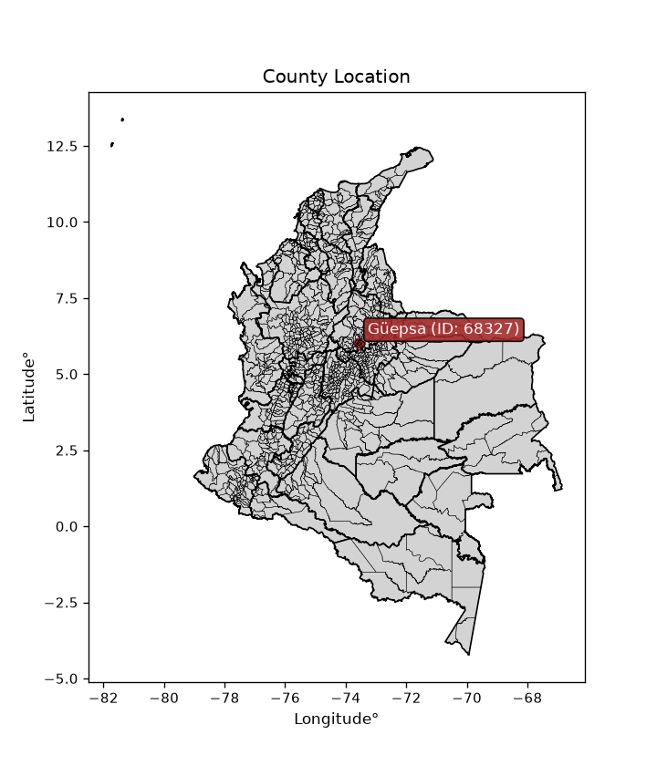
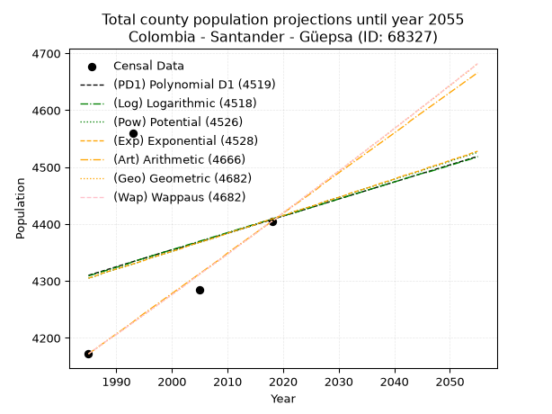
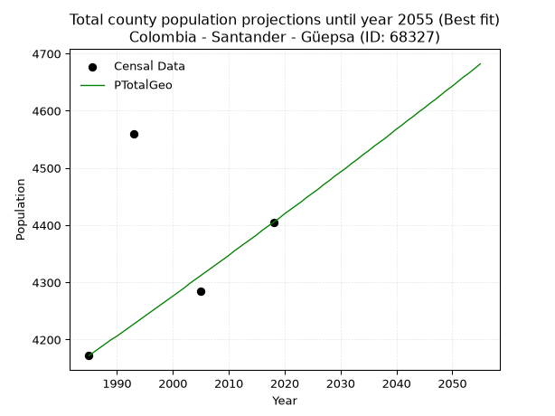
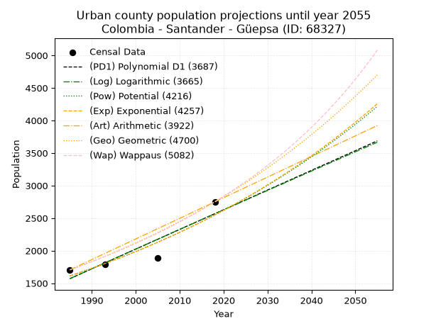
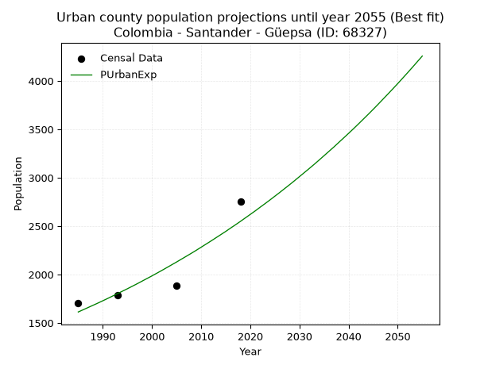
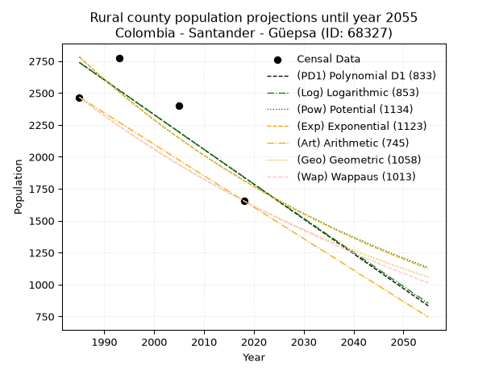
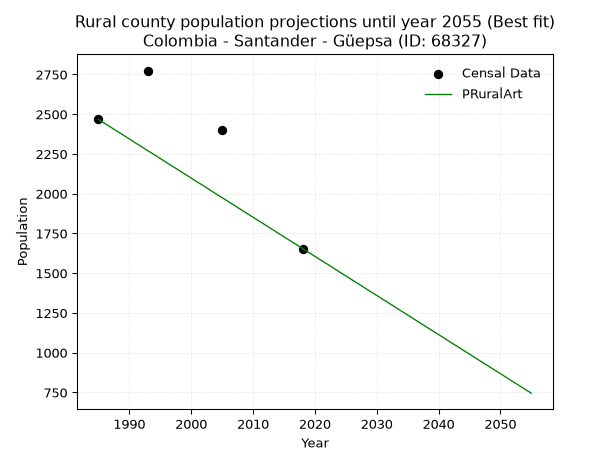

<div align="center">


</div>

# _“Population and Public Services Demand Projections (PPSD) until Year 2050 for Colombia - Santander - Güepsa (ID: 68327)”_
Keywords: `population` `public-service` `projection` `lineal` `polynomial` `logarithmic` `potential` `exponential` `arithmetic` `geometric` `wappaus` `dane` `colombia` `south-america`

PPSD are analytical estimates used by governments and planners to anticipate future changes in population size, age distribution, and the resulting community needs for utilities, healthcare, education, and infrastructure as sizing future water treatment facilities, electrical grids, and road networks based on spatial growth.

<div align="center">

</img>

</div>


> **General running parameters**: • app_version: _v20260806_. • Python version: _3.14.7_. • Pandas version: _3.0.5_. • NumPy version: _2.5.1_. • Creates, save and include plots into reports (create_plot): _False_. • Projection until year: _2050_. • Process polynomial degree 2 and up: _False_. • Process Wappaus: _True_. • Process Wappaus: _True_. • Set negative values to zero: _True_. • Set infinite values to zero: _True_. • Drop dataset notes: _True_. 
<div align="center">

Dynamic map: [:earth_americas:Google](http://maps.google.com/maps?q=6.025012609,-73.5751456) [:earth_americas:OSM](https://www.openstreetmap.org/#map=18/6.025012609/-73.5751456&layers=P) [:earth_americas:Bing](https://www.bing.com/maps?cp=6.025012609~-73.5751456&lvl=18) [:earth_americas:Apple](https://maps.apple.com/frame?center=6.025012609%2C-73.5751456&span=0.003%2C0.006)

</div>


<div align="center">

```geojson
{
  "type": "Feature",
  "geometry": {
    "type": "Point", 
    "coordinates": [-73.5751456, 6.025012609]
  }, 
  "properties": {
    "Name": "Colombia - Santander - Güepsa (ID: 68327)"
  }
}
```

</div>


## 0. Census Data (4 records)

Census data are official statistics collected by a government about the people and housing in a country. They usually include counts of total population, age, sex, race, income, education, and jobs.

📅Global census file: [Population.xlsx](../data/Population.xlsx)

| Source   |   Year |   CountryID | CountryName   |   StateID | StateName   |   CountyID | CountyName   |   PTotal |   PUrban |   PRural |
|:---------|-------:|------------:|:--------------|----------:|:------------|-----------:|:-------------|---------:|---------:|---------:|
| DANE     |   1985 |          57 | Colombia      |        68 | Santander   |      68327 | Güepsa       |     4172 |     1705 |     2467 |
| DANE     |   1993 |          57 | Colombia      |        68 | Santander   |      68327 | Güepsa       |     4559 |     1785 |     2774 |
| DANE     |   2005 |          57 | Colombia      |        68 | Santander   |      68327 | Güepsa       |     4285 |     1886 |     2399 |
| DANE     |   2018 |          57 | Colombia      |        68 | Santander   |      68327 | Güepsa       |     4405 |     2750 |     1655 |

> 🔥Some records could had specific notes about the registered values or the corresponding urban or rural distribution.

📅[SUI-RUPS](https://www.datos.gov.co/Hacienda-y-Cr-dito-P-blico/Registro-nico-de-Prestadores-de-Servicios-P-blicos/4qkq-csdn/about_data) - Local public utility companies: [RUPS.csv](../data/RUPS.xlsx)

 | SERVICIO       | ESTADO    | NOMBRE                                                                         | NIT         | DEPARTAMENTO_DOMICILIO   | MUNICIPIO_DOMICILIO   | DIRECCION                                      |   TELEFONO | EMAIL                 | TIPO_PRESTADOR          | CLASIFICACION                 |
|:---------------|:----------|:-------------------------------------------------------------------------------|:------------|:-------------------------|:----------------------|:-----------------------------------------------|-----------:|:----------------------|:------------------------|:------------------------------|
| ACUEDUCTO      | OPERATIVA | CORPORACION DE SERVICIOS DE ACUEDUCTO Y ALCANTARILLADO DEL MUNICIPIO DE GUEPSA | 890212189-2 | SANTANDER                | GUEPSA                | PLANTA DE TRATAMIENTO VIA A VEREDA EL PLATANAL |    7583327 | corpoguepsa@gmail.com | ORGANIZACION AUTORIZADA | MENOR O IGUAL A 2500 USUARIOS |
| ALCANTARILLADO | OPERATIVA | CORPORACION DE SERVICIOS DE ACUEDUCTO Y ALCANTARILLADO DEL MUNICIPIO DE GUEPSA | 890212189-2 | SANTANDER                | GUEPSA                | PLANTA DE TRATAMIENTO VIA A VEREDA EL PLATANAL |    7583327 | corpoguepsa@gmail.com | ORGANIZACION AUTORIZADA | MENOR O IGUAL A 2500 USUARIOS |

## 1. Total

### 1.1. Coefficients and Parameters

* (PD1) Polynomial Deg 1: 2.9975913287835576, -1640.6820553993105 (lineal)
* (Log) Logarithmic: 6018.7379431500985, -41393.225337022835
* (Pow) Potential: 1.4456325919086956, -1.133365160825885
* (Exp) Exponential: 0.0007200824585891143, 1030.9647090865924
* (Art) Arithmetic: Year diff. 2018 - 1985 = 33, Population diff. 4405 - 4172 = 233, Annual growth = 7.0606060606060606
* (Geo) Geometric: Year diff. 2018 - 1985 = 33, Population diff. 4405 - 4172 = 233, Annual growth % = 0.0016481665010008584
* (Wap) Wappaus: i = 0.16464045844948258, Condition values only valid for < 200)

<sub>
Wappaus condition values: ['0.00', '0.16', '0.33', '0.49', '0.66', '0.82', '0.99', '1.15', '1.32', '1.48', '1.65', '1.81', '1.98', '2.14', '2.30', '2.47', '2.63', '2.80', '2.96', '3.13', '3.29', '3.46', '3.62', '3.79', '3.95', '4.12', '4.28', '4.45', '4.61', '4.77', '4.94', '5.10', '5.27', '5.43', '5.60', '5.76', '5.93', '6.09', '6.26', '6.42', '6.59', '6.75', '6.91', '7.08', '7.24', '7.41', '7.57', '7.74', '7.90', '8.07', '8.23', '8.40', '8.56', '8.73', '8.89', '9.06', '9.22', '9.38', '9.55', '9.71', '9.88', '10.04', '10.21', '10.37', '10.54', '10.70']
</sub>


### 1.2. Projected Dataset

|   Year |   CountyID |   PTotalPD1 |   PTotalLog |   PTotalPow |   PTotalExp |   PTotalArt |   PTotalGeo |   PTotalWap |
|-------:|-----------:|------------:|------------:|------------:|------------:|------------:|------------:|------------:|
|   1985 |      68327 |        4310 |        4309 |        4305 |        4305 |        4172 |        4172 |        4172 |
|   1986 |      68327 |        4313 |        4312 |        4308 |        4308 |        4179 |        4179 |        4179 |
|   1987 |      68327 |        4316 |        4315 |        4311 |        4312 |        4186 |        4186 |        4186 |
|   1988 |      68327 |        4319 |        4318 |        4315 |        4315 |        4193 |        4193 |        4193 |
|   1989 |      68327 |        4322 |        4321 |        4318 |        4318 |        4200 |        4200 |        4200 |
|   1990 |      68327 |        4325 |        4324 |        4321 |        4321 |        4207 |        4206 |        4206 |
|   1991 |      68327 |        4328 |        4327 |        4324 |        4324 |        4214 |        4213 |        4213 |
|   1992 |      68327 |        4331 |        4330 |        4327 |        4327 |        4221 |        4220 |        4220 |
|   1993 |      68327 |        4334 |        4334 |        4330 |        4330 |        4228 |        4227 |        4227 |
|   1994 |      68327 |        4337 |        4337 |        4333 |        4333 |        4236 |        4234 |        4234 |
|   1995 |      68327 |        4340 |        4340 |        4337 |        4336 |        4243 |        4241 |        4241 |
|   1996 |      68327 |        4343 |        4343 |        4340 |        4340 |        4250 |        4248 |        4248 |
|   1997 |      68327 |        4346 |        4346 |        4343 |        4343 |        4257 |        4255 |        4255 |
|   1998 |      68327 |        4349 |        4349 |        4346 |        4346 |        4264 |        4262 |        4262 |
|   1999 |      68327 |        4352 |        4352 |        4349 |        4349 |        4271 |        4269 |        4269 |
|   2000 |      68327 |        4355 |        4355 |        4352 |        4352 |        4278 |        4276 |        4276 |
|   2001 |      68327 |        4357 |        4358 |        4355 |        4355 |        4285 |        4283 |        4283 |
|   2002 |      68327 |        4360 |        4361 |        4359 |        4358 |        4292 |        4290 |        4290 |
|   2003 |      68327 |        4363 |        4364 |        4362 |        4362 |        4299 |        4298 |        4297 |
|   2004 |      68327 |        4366 |        4367 |        4365 |        4365 |        4306 |        4305 |        4305 |
|   2005 |      68327 |        4369 |        4370 |        4368 |        4368 |        4313 |        4312 |        4312 |
|   2006 |      68327 |        4372 |        4373 |        4371 |        4371 |        4320 |        4319 |        4319 |
|   2007 |      68327 |        4375 |        4376 |        4374 |        4374 |        4327 |        4326 |        4326 |
|   2008 |      68327 |        4378 |        4379 |        4377 |        4377 |        4334 |        4333 |        4333 |
|   2009 |      68327 |        4381 |        4382 |        4381 |        4380 |        4341 |        4340 |        4340 |
|   2010 |      68327 |        4384 |        4385 |        4384 |        4384 |        4349 |        4347 |        4347 |
|   2011 |      68327 |        4387 |        4388 |        4387 |        4387 |        4356 |        4355 |        4354 |
|   2012 |      68327 |        4390 |        4391 |        4390 |        4390 |        4363 |        4362 |        4362 |
|   2013 |      68327 |        4393 |        4394 |        4393 |        4393 |        4370 |        4369 |        4369 |
|   2014 |      68327 |        4396 |        4397 |        4396 |        4396 |        4377 |        4376 |        4376 |
|   2015 |      68327 |        4399 |        4400 |        4399 |        4399 |        4384 |        4383 |        4383 |
|   2016 |      68327 |        4402 |        4403 |        4403 |        4403 |        4391 |        4391 |        4391 |
|   2017 |      68327 |        4405 |        4406 |        4406 |        4406 |        4398 |        4398 |        4398 |
|   2018 |      68327 |        4408 |        4409 |        4409 |        4409 |        4405 |        4405 |        4405 |
|   2019 |      68327 |        4411 |        4412 |        4412 |        4412 |        4412 |        4412 |        4412 |
|   2020 |      68327 |        4414 |        4415 |        4415 |        4415 |        4419 |        4420 |        4420 |
|   2021 |      68327 |        4417 |        4417 |        4418 |        4418 |        4426 |        4427 |        4427 |
|   2022 |      68327 |        4420 |        4420 |        4422 |        4422 |        4433 |        4434 |        4434 |
|   2023 |      68327 |        4423 |        4423 |        4425 |        4425 |        4440 |        4441 |        4441 |
|   2024 |      68327 |        4426 |        4426 |        4428 |        4428 |        4447 |        4449 |        4449 |
|   2025 |      68327 |        4429 |        4429 |        4431 |        4431 |        4454 |        4456 |        4456 |
|   2026 |      68327 |        4432 |        4432 |        4434 |        4434 |        4461 |        4463 |        4463 |
|   2027 |      68327 |        4435 |        4435 |        4437 |        4438 |        4469 |        4471 |        4471 |
|   2028 |      68327 |        4438 |        4438 |        4441 |        4441 |        4476 |        4478 |        4478 |
|   2029 |      68327 |        4441 |        4441 |        4444 |        4444 |        4483 |        4486 |        4486 |
|   2030 |      68327 |        4444 |        4444 |        4447 |        4447 |        4490 |        4493 |        4493 |
|   2031 |      68327 |        4447 |        4447 |        4450 |        4450 |        4497 |        4500 |        4500 |
|   2032 |      68327 |        4450 |        4450 |        4453 |        4454 |        4504 |        4508 |        4508 |
|   2033 |      68327 |        4453 |        4453 |        4456 |        4457 |        4511 |        4515 |        4515 |
|   2034 |      68327 |        4456 |        4456 |        4460 |        4460 |        4518 |        4523 |        4523 |
|   2035 |      68327 |        4459 |        4459 |        4463 |        4463 |        4525 |        4530 |        4530 |
|   2036 |      68327 |        4462 |        4462 |        4466 |        4466 |        4532 |        4538 |        4538 |
|   2037 |      68327 |        4465 |        4465 |        4469 |        4470 |        4539 |        4545 |        4545 |
|   2038 |      68327 |        4468 |        4468 |        4472 |        4473 |        4546 |        4552 |        4553 |
|   2039 |      68327 |        4471 |        4471 |        4475 |        4476 |        4553 |        4560 |        4560 |
|   2040 |      68327 |        4474 |        4474 |        4479 |        4479 |        4560 |        4568 |        4568 |
|   2041 |      68327 |        4477 |        4477 |        4482 |        4483 |        4567 |        4575 |        4575 |
|   2042 |      68327 |        4480 |        4480 |        4485 |        4486 |        4574 |        4583 |        4583 |
|   2043 |      68327 |        4483 |        4483 |        4488 |        4489 |        4582 |        4590 |        4590 |
|   2044 |      68327 |        4486 |        4486 |        4491 |        4492 |        4589 |        4598 |        4598 |
|   2045 |      68327 |        4489 |        4489 |        4494 |        4495 |        4596 |        4605 |        4606 |
|   2046 |      68327 |        4492 |        4491 |        4498 |        4499 |        4603 |        4613 |        4613 |
|   2047 |      68327 |        4495 |        4494 |        4501 |        4502 |        4610 |        4620 |        4621 |
|   2048 |      68327 |        4498 |        4497 |        4504 |        4505 |        4617 |        4628 |        4628 |
|   2049 |      68327 |        4501 |        4500 |        4507 |        4508 |        4624 |        4636 |        4636 |
|   2050 |      68327 |        4504 |        4503 |        4510 |        4512 |        4631 |        4643 |        4644 |
<div align="center">

</img>

</div>


### 1.3. Best fit with absolute and relative error (%)

Relative error puts that difference into context by dividing the absolute error by the true value, creating a unitless ratio or percentage that shows the scale of the mistake.

Absolute and relative error

|   Year | Source   |   CountryID | CountryName   |   StateID | StateName   |   CountyID_x | CountyName   |   PTotal |   PUrban |   PRural |   CountyID_y |   PTotalPD1 |   PTotalLog |   PTotalPow |   PTotalExp |   PTotalArt |   PTotalGeo |   PTotalWap |   PTotalPD1AbsError |   PTotalLogAbsError |   PTotalPowAbsError |   PTotalExpAbsError |   PTotalArtAbsError |   PTotalGeoAbsError |   PTotalWapAbsError |   PTotalPD1RelError |   PTotalLogRelError |   PTotalPowRelError |   PTotalExpRelError |   PTotalArtRelError |   PTotalGeoRelError |   PTotalWapRelError |
|-------:|:---------|------------:|:--------------|----------:|:------------|-------------:|:-------------|---------:|---------:|---------:|-------------:|------------:|------------:|------------:|------------:|------------:|------------:|------------:|--------------------:|--------------------:|--------------------:|--------------------:|--------------------:|--------------------:|--------------------:|--------------------:|--------------------:|--------------------:|--------------------:|--------------------:|--------------------:|--------------------:|
|   1985 | DANE     |          57 | Colombia      |        68 | Santander   |        68327 | Güepsa       |     4172 |     1705 |     2467 |        68327 |        4310 |        4309 |        4305 |        4305 |        4172 |        4172 |        4172 |                 138 |                 137 |                 133 |                 133 |                   0 |                   0 |                   0 |           3.30777   |           3.2838    |           3.18792   |           3.18792   |            0        |            0        |            0        |
|   1993 | DANE     |          57 | Colombia      |        68 | Santander   |        68327 | Güepsa       |     4559 |     1785 |     2774 |        68327 |        4334 |        4334 |        4330 |        4330 |        4228 |        4227 |        4227 |                 225 |                 225 |                 229 |                 229 |                 331 |                 332 |                 332 |           4.93529   |           4.93529   |           5.02303   |           5.02303   |            7.26036  |            7.2823   |            7.2823   |
|   2005 | DANE     |          57 | Colombia      |        68 | Santander   |        68327 | Güepsa       |     4285 |     1886 |     2399 |        68327 |        4369 |        4370 |        4368 |        4368 |        4313 |        4312 |        4312 |                  84 |                  85 |                  83 |                  83 |                  28 |                  27 |                  27 |           1.96033   |           1.98366   |           1.93699   |           1.93699   |            0.653442 |            0.630105 |            0.630105 |
|   2018 | DANE     |          57 | Colombia      |        68 | Santander   |        68327 | Güepsa       |     4405 |     2750 |     1655 |        68327 |        4408 |        4409 |        4409 |        4409 |        4405 |        4405 |        4405 |                   3 |                   4 |                   4 |                   4 |                   0 |                   0 |                   0 |           0.0681044 |           0.0908059 |           0.0908059 |           0.0908059 |            0        |            0        |            0        |

Relative error mean

| Method    |   RelError | Best   |
|:----------|-----------:|:-------|
| PTotalPD1 |    2.56787 |        |
| PTotalLog |    2.57339 |        |
| PTotalPow |    2.55969 |        |
| PTotalExp |    2.55969 |        |
| PTotalArt |    1.97845 |        |
| PTotalGeo |    1.9781  | True   |
| PTotalWap |    1.9781  | True   |

💙Best method: _**PTotalGeo**_
<div align="center">

</img>

</div>


### 1.4. Fresh water supply demand in liters per capita per day (lpcd)

The fresh water supply demand typically ranges from 100 to 300 liters per capita per day (lpcd) for standard domestic and municipal planning, though absolute survival minimums set by the World Health Organization are as low as 7.5 to 20 liters per day, and total consumption in high-income nations can exceed 400 liters.

> `CZ`: Level in meters above the sea level (masl)<br> `WS`: Fresh water supply demand in liters per capita per day (lpcd or l/h/d)<br> `WSAll`: Zonal fresh water supply demand in liters per second (l/s)<br> `A`: Zonal area in square meters<br> `DP`: Population density (people/hectare or p/ha)

Reference values (RAS Colombia)

|    CZ |   WS |
|------:|-----:|
|  1000 |  120 |
|  2000 |  130 |
| 99999 |  140 |

County shapefile geometry properties and water supply values

|   CountyID |      ATotal |   CZTotal |   WSTotal |
|-----------:|------------:|----------:|----------:|
|      68327 | 3.01093e+07 |   1466.94 |       130 |

Projected values for best method: PTotalGeo

|   CountyID |   Year |   PTotalGeo |   DPTotal |   WSTotal |   WSTotalAll |
|-----------:|-------:|------------:|----------:|----------:|-------------:|
|      68327 |   1985 |        4172 |      1.39 |       130 |      6.27731 |
|      68327 |   1986 |        4179 |      1.39 |       130 |      6.28785 |
|      68327 |   1987 |        4186 |      1.39 |       130 |      6.29838 |
|      68327 |   1988 |        4193 |      1.39 |       130 |      6.30891 |
|      68327 |   1989 |        4200 |      1.39 |       130 |      6.31944 |
|      68327 |   1990 |        4206 |      1.4  |       130 |      6.32847 |
|      68327 |   1991 |        4213 |      1.4  |       130 |      6.339   |
|      68327 |   1992 |        4220 |      1.4  |       130 |      6.34954 |
|      68327 |   1993 |        4227 |      1.4  |       130 |      6.36007 |
|      68327 |   1994 |        4234 |      1.41 |       130 |      6.3706  |
|      68327 |   1995 |        4241 |      1.41 |       130 |      6.38113 |
|      68327 |   1996 |        4248 |      1.41 |       130 |      6.39167 |
|      68327 |   1997 |        4255 |      1.41 |       130 |      6.4022  |
|      68327 |   1998 |        4262 |      1.42 |       130 |      6.41273 |
|      68327 |   1999 |        4269 |      1.42 |       130 |      6.42326 |
|      68327 |   2000 |        4276 |      1.42 |       130 |      6.4338  |
|      68327 |   2001 |        4283 |      1.42 |       130 |      6.44433 |
|      68327 |   2002 |        4290 |      1.42 |       130 |      6.45486 |
|      68327 |   2003 |        4298 |      1.43 |       130 |      6.4669  |
|      68327 |   2004 |        4305 |      1.43 |       130 |      6.47743 |
|      68327 |   2005 |        4312 |      1.43 |       130 |      6.48796 |
|      68327 |   2006 |        4319 |      1.43 |       130 |      6.4985  |
|      68327 |   2007 |        4326 |      1.44 |       130 |      6.50903 |
|      68327 |   2008 |        4333 |      1.44 |       130 |      6.51956 |
|      68327 |   2009 |        4340 |      1.44 |       130 |      6.53009 |
|      68327 |   2010 |        4347 |      1.44 |       130 |      6.54063 |
|      68327 |   2011 |        4355 |      1.45 |       130 |      6.55266 |
|      68327 |   2012 |        4362 |      1.45 |       130 |      6.56319 |
|      68327 |   2013 |        4369 |      1.45 |       130 |      6.57373 |
|      68327 |   2014 |        4376 |      1.45 |       130 |      6.58426 |
|      68327 |   2015 |        4383 |      1.46 |       130 |      6.59479 |
|      68327 |   2016 |        4391 |      1.46 |       130 |      6.60683 |
|      68327 |   2017 |        4398 |      1.46 |       130 |      6.61736 |
|      68327 |   2018 |        4405 |      1.46 |       130 |      6.62789 |
|      68327 |   2019 |        4412 |      1.47 |       130 |      6.63843 |
|      68327 |   2020 |        4420 |      1.47 |       130 |      6.65046 |
|      68327 |   2021 |        4427 |      1.47 |       130 |      6.661   |
|      68327 |   2022 |        4434 |      1.47 |       130 |      6.67153 |
|      68327 |   2023 |        4441 |      1.47 |       130 |      6.68206 |
|      68327 |   2024 |        4449 |      1.48 |       130 |      6.6941  |
|      68327 |   2025 |        4456 |      1.48 |       130 |      6.70463 |
|      68327 |   2026 |        4463 |      1.48 |       130 |      6.71516 |
|      68327 |   2027 |        4471 |      1.48 |       130 |      6.7272  |
|      68327 |   2028 |        4478 |      1.49 |       130 |      6.73773 |
|      68327 |   2029 |        4486 |      1.49 |       130 |      6.74977 |
|      68327 |   2030 |        4493 |      1.49 |       130 |      6.7603  |
|      68327 |   2031 |        4500 |      1.49 |       130 |      6.77083 |
|      68327 |   2032 |        4508 |      1.5  |       130 |      6.78287 |
|      68327 |   2033 |        4515 |      1.5  |       130 |      6.7934  |
|      68327 |   2034 |        4523 |      1.5  |       130 |      6.80544 |
|      68327 |   2035 |        4530 |      1.5  |       130 |      6.81597 |
|      68327 |   2036 |        4538 |      1.51 |       130 |      6.82801 |
|      68327 |   2037 |        4545 |      1.51 |       130 |      6.83854 |
|      68327 |   2038 |        4552 |      1.51 |       130 |      6.84907 |
|      68327 |   2039 |        4560 |      1.51 |       130 |      6.86111 |
|      68327 |   2040 |        4568 |      1.52 |       130 |      6.87315 |
|      68327 |   2041 |        4575 |      1.52 |       130 |      6.88368 |
|      68327 |   2042 |        4583 |      1.52 |       130 |      6.89572 |
|      68327 |   2043 |        4590 |      1.52 |       130 |      6.90625 |
|      68327 |   2044 |        4598 |      1.53 |       130 |      6.91829 |
|      68327 |   2045 |        4605 |      1.53 |       130 |      6.92882 |
|      68327 |   2046 |        4613 |      1.53 |       130 |      6.94086 |
|      68327 |   2047 |        4620 |      1.53 |       130 |      6.95139 |
|      68327 |   2048 |        4628 |      1.54 |       130 |      6.96343 |
|      68327 |   2049 |        4636 |      1.54 |       130 |      6.97546 |
|      68327 |   2050 |        4643 |      1.54 |       130 |      6.986   |

## 2. Urban

### 2.1. Coefficients and Parameters

* (PD1) Polynomial Deg 1: 30.234443998393683, -58444.946607786966 (lineal)
* (Log) Logarithmic: 60453.20253220475, -457473.77688885026
* (Pow) Potential: 27.71762695792407, -88.19842936783154
* (Exp) Exponential: 0.013861005392454717, 1.8135853369654865e-09
* (Art) Arithmetic: Year diff. 2018 - 1985 = 33, Population diff. 2750 - 1705 = 1045, Annual growth = 31.666666666666668
* (Geo) Geometric: Year diff. 2018 - 1985 = 33, Population diff. 2750 - 1705 = 1045, Annual growth % = 0.014591362961506427
* (Wap) Wappaus: i = 1.421623643845866, Condition values only valid for < 200)

<sub>
Wappaus condition values: ['0.00', '1.42', '2.84', '4.26', '5.69', '7.11', '8.53', '9.95', '11.37', '12.79', '14.22', '15.64', '17.06', '18.48', '19.90', '21.32', '22.75', '24.17', '25.59', '27.01', '28.43', '29.85', '31.28', '32.70', '34.12', '35.54', '36.96', '38.38', '39.81', '41.23', '42.65', '44.07', '45.49', '46.91', '48.34', '49.76', '51.18', '52.60', '54.02', '55.44', '56.86', '58.29', '59.71', '61.13', '62.55', '63.97', '65.39', '66.82', '68.24', '69.66', '71.08', '72.50', '73.92', '75.35', '76.77', '78.19', '79.61', '81.03', '82.45', '83.88', '85.30', '86.72', '88.14', '89.56', '90.98', '92.41']
</sub>


### 2.2. Projected Dataset

|   Year |   CountyID |   PUrbanPD1 |   PUrbanLog |   PUrbanPow |   PUrbanExp |   PUrbanArt |   PUrbanGeo |   PUrbanWap |
|-------:|-----------:|------------:|------------:|------------:|------------:|------------:|------------:|------------:|
|   1985 |      68327 |        1570 |        1570 |        1613 |        1613 |        1705 |        1705 |        1705 |
|   1986 |      68327 |        1601 |        1600 |        1636 |        1636 |        1737 |        1730 |        1729 |
|   1987 |      68327 |        1631 |        1631 |        1659 |        1659 |        1768 |        1755 |        1754 |
|   1988 |      68327 |        1661 |        1661 |        1682 |        1682 |        1800 |        1781 |        1779 |
|   1989 |      68327 |        1691 |        1692 |        1706 |        1705 |        1832 |        1807 |        1805 |
|   1990 |      68327 |        1722 |        1722 |        1730 |        1729 |        1863 |        1833 |        1831 |
|   1991 |      68327 |        1752 |        1752 |        1754 |        1753 |        1895 |        1860 |        1857 |
|   1992 |      68327 |        1782 |        1783 |        1778 |        1778 |        1927 |        1887 |        1884 |
|   1993 |      68327 |        1812 |        1813 |        1803 |        1803 |        1958 |        1914 |        1911 |
|   1994 |      68327 |        1843 |        1843 |        1829 |        1828 |        1990 |        1942 |        1938 |
|   1995 |      68327 |        1873 |        1874 |        1854 |        1853 |        2022 |        1971 |        1966 |
|   1996 |      68327 |        1903 |        1904 |        1880 |        1879 |        2053 |        2000 |        1994 |
|   1997 |      68327 |        1933 |        1934 |        1906 |        1905 |        2085 |        2029 |        2023 |
|   1998 |      68327 |        1963 |        1965 |        1933 |        1932 |        2117 |        2058 |        2052 |
|   1999 |      68327 |        1994 |        1995 |        1960 |        1959 |        2148 |        2088 |        2082 |
|   2000 |      68327 |        2024 |        2025 |        1987 |        1986 |        2180 |        2119 |        2112 |
|   2001 |      68327 |        2054 |        2055 |        2015 |        2014 |        2212 |        2150 |        2143 |
|   2002 |      68327 |        2084 |        2086 |        2043 |        2042 |        2243 |        2181 |        2174 |
|   2003 |      68327 |        2115 |        2116 |        2072 |        2071 |        2275 |        2213 |        2205 |
|   2004 |      68327 |        2145 |        2146 |        2101 |        2100 |        2307 |        2245 |        2237 |
|   2005 |      68327 |        2175 |        2176 |        2130 |        2129 |        2338 |        2278 |        2270 |
|   2006 |      68327 |        2205 |        2206 |        2159 |        2159 |        2370 |        2311 |        2303 |
|   2007 |      68327 |        2236 |        2236 |        2190 |        2189 |        2402 |        2345 |        2337 |
|   2008 |      68327 |        2266 |        2266 |        2220 |        2219 |        2433 |        2379 |        2371 |
|   2009 |      68327 |        2296 |        2297 |        2251 |        2250 |        2465 |        2414 |        2406 |
|   2010 |      68327 |        2326 |        2327 |        2282 |        2282 |        2497 |        2449 |        2442 |
|   2011 |      68327 |        2357 |        2357 |        2314 |        2314 |        2528 |        2485 |        2478 |
|   2012 |      68327 |        2387 |        2387 |        2346 |        2346 |        2560 |        2521 |        2515 |
|   2013 |      68327 |        2417 |        2417 |        2378 |        2379 |        2592 |        2558 |        2552 |
|   2014 |      68327 |        2447 |        2447 |        2411 |        2412 |        2623 |        2595 |        2590 |
|   2015 |      68327 |        2477 |        2477 |        2445 |        2445 |        2655 |        2633 |        2629 |
|   2016 |      68327 |        2508 |        2507 |        2479 |        2480 |        2687 |        2671 |        2669 |
|   2017 |      68327 |        2538 |        2537 |        2513 |        2514 |        2718 |        2710 |        2709 |
|   2018 |      68327 |        2568 |        2567 |        2548 |        2549 |        2750 |        2750 |        2750 |
|   2019 |      68327 |        2598 |        2597 |        2583 |        2585 |        2782 |        2790 |        2792 |
|   2020 |      68327 |        2629 |        2627 |        2619 |        2621 |        2813 |        2831 |        2834 |
|   2021 |      68327 |        2659 |        2657 |        2655 |        2657 |        2845 |        2872 |        2878 |
|   2022 |      68327 |        2689 |        2686 |        2691 |        2695 |        2877 |        2914 |        2922 |
|   2023 |      68327 |        2719 |        2716 |        2729 |        2732 |        2908 |        2957 |        2967 |
|   2024 |      68327 |        2750 |        2746 |        2766 |        2770 |        2940 |        3000 |        3013 |
|   2025 |      68327 |        2780 |        2776 |        2804 |        2809 |        2972 |        3043 |        3060 |
|   2026 |      68327 |        2810 |        2806 |        2843 |        2848 |        3003 |        3088 |        3108 |
|   2027 |      68327 |        2840 |        2836 |        2882 |        2888 |        3035 |        3133 |        3156 |
|   2028 |      68327 |        2871 |        2866 |        2922 |        2928 |        3067 |        3179 |        3206 |
|   2029 |      68327 |        2901 |        2895 |        2962 |        2969 |        3098 |        3225 |        3257 |
|   2030 |      68327 |        2931 |        2925 |        3003 |        3011 |        3130 |        3272 |        3309 |
|   2031 |      68327 |        2961 |        2955 |        3044 |        3053 |        3162 |        3320 |        3362 |
|   2032 |      68327 |        2991 |        2985 |        3086 |        3095 |        3193 |        3368 |        3416 |
|   2033 |      68327 |        3022 |        3014 |        3128 |        3138 |        3225 |        3417 |        3471 |
|   2034 |      68327 |        3052 |        3044 |        3171 |        3182 |        3257 |        3467 |        3527 |
|   2035 |      68327 |        3082 |        3074 |        3215 |        3227 |        3288 |        3518 |        3585 |
|   2036 |      68327 |        3112 |        3104 |        3259 |        3272 |        3320 |        3569 |        3644 |
|   2037 |      68327 |        3143 |        3133 |        3303 |        3317 |        3352 |        3621 |        3704 |
|   2038 |      68327 |        3173 |        3163 |        3349 |        3364 |        3383 |        3674 |        3766 |
|   2039 |      68327 |        3203 |        3193 |        3394 |        3411 |        3415 |        3728 |        3829 |
|   2040 |      68327 |        3233 |        3222 |        3441 |        3458 |        3447 |        3782 |        3894 |
|   2041 |      68327 |        3264 |        3252 |        3488 |        3506 |        3478 |        3837 |        3960 |
|   2042 |      68327 |        3294 |        3281 |        3536 |        3555 |        3510 |        3893 |        4028 |
|   2043 |      68327 |        3324 |        3311 |        3584 |        3605 |        3542 |        3950 |        4097 |
|   2044 |      68327 |        3354 |        3341 |        3633 |        3655 |        3573 |        4008 |        4168 |
|   2045 |      68327 |        3384 |        3370 |        3682 |        3706 |        3605 |        4066 |        4241 |
|   2046 |      68327 |        3415 |        3400 |        3733 |        3758 |        3637 |        4126 |        4315 |
|   2047 |      68327 |        3445 |        3429 |        3784 |        3811 |        3668 |        4186 |        4392 |
|   2048 |      68327 |        3475 |        3459 |        3835 |        3864 |        3700 |        4247 |        4470 |
|   2049 |      68327 |        3505 |        3488 |        3887 |        3918 |        3732 |        4309 |        4551 |
|   2050 |      68327 |        3536 |        3518 |        3940 |        3972 |        3763 |        4372 |        4634 |
<div align="center">

</img>

</div>


### 2.3. Best fit with absolute and relative error (%)

Relative error puts that difference into context by dividing the absolute error by the true value, creating a unitless ratio or percentage that shows the scale of the mistake.

Absolute and relative error

|   Year | Source   |   CountryID | CountryName   |   StateID | StateName   |   CountyID_x | CountyName   |   PTotal |   PUrban |   PRural |   CountyID_y |   PUrbanPD1 |   PUrbanLog |   PUrbanPow |   PUrbanExp |   PUrbanArt |   PUrbanGeo |   PUrbanWap |   PUrbanPD1AbsError |   PUrbanLogAbsError |   PUrbanPowAbsError |   PUrbanExpAbsError |   PUrbanArtAbsError |   PUrbanGeoAbsError |   PUrbanWapAbsError |   PUrbanPD1RelError |   PUrbanLogRelError |   PUrbanPowRelError |   PUrbanExpRelError |   PUrbanArtRelError |   PUrbanGeoRelError |   PUrbanWapRelError |
|-------:|:---------|------------:|:--------------|----------:|:------------|-------------:|:-------------|---------:|---------:|---------:|-------------:|------------:|------------:|------------:|------------:|------------:|------------:|------------:|--------------------:|--------------------:|--------------------:|--------------------:|--------------------:|--------------------:|--------------------:|--------------------:|--------------------:|--------------------:|--------------------:|--------------------:|--------------------:|--------------------:|
|   1985 | DANE     |          57 | Colombia      |        68 | Santander   |        68327 | Güepsa       |     4172 |     1705 |     2467 |        68327 |        1570 |        1570 |        1613 |        1613 |        1705 |        1705 |        1705 |                 135 |                 135 |                  92 |                  92 |                   0 |                   0 |                   0 |             7.91789 |             7.91789 |             5.39589 |             5.39589 |             0       |             0       |             0       |
|   1993 | DANE     |          57 | Colombia      |        68 | Santander   |        68327 | Güepsa       |     4559 |     1785 |     2774 |        68327 |        1812 |        1813 |        1803 |        1803 |        1958 |        1914 |        1911 |                  27 |                  28 |                  18 |                  18 |                 173 |                 129 |                 126 |             1.51261 |             1.56863 |             1.0084  |             1.0084  |             9.69188 |             7.22689 |             7.05882 |
|   2005 | DANE     |          57 | Colombia      |        68 | Santander   |        68327 | Güepsa       |     4285 |     1886 |     2399 |        68327 |        2175 |        2176 |        2130 |        2129 |        2338 |        2278 |        2270 |                 289 |                 290 |                 244 |                 243 |                 452 |                 392 |                 384 |            15.3234  |            15.3765  |            12.9374  |            12.8844  |            23.9661  |            20.7847  |            20.3606  |
|   2018 | DANE     |          57 | Colombia      |        68 | Santander   |        68327 | Güepsa       |     4405 |     2750 |     1655 |        68327 |        2568 |        2567 |        2548 |        2549 |        2750 |        2750 |        2750 |                 182 |                 183 |                 202 |                 201 |                   0 |                   0 |                   0 |             6.61818 |             6.65455 |             7.34545 |             7.30909 |             0       |             0       |             0       |

Relative error mean

| Method    |   RelError | Best   |
|:----------|-----------:|:-------|
| PUrbanPD1 |    7.84303 |        |
| PUrbanLog |    7.87938 |        |
| PUrbanPow |    6.6718  |        |
| PUrbanExp |    6.64945 | True   |
| PUrbanArt |    8.41449 |        |
| PUrbanGeo |    7.00291 |        |
| PUrbanWap |    6.85484 |        |

💙Best method: _**PUrbanExp**_
<div align="center">

</img>

</div>


### 2.4. Fresh water supply demand in liters per capita per day (lpcd)

The fresh water supply demand typically ranges from 100 to 300 liters per capita per day (lpcd) for standard domestic and municipal planning, though absolute survival minimums set by the World Health Organization are as low as 7.5 to 20 liters per day, and total consumption in high-income nations can exceed 400 liters.

> `CZ`: Level in meters above the sea level (masl)<br> `WS`: Fresh water supply demand in liters per capita per day (lpcd or l/h/d)<br> `WSAll`: Zonal fresh water supply demand in liters per second (l/s)<br> `A`: Zonal area in square meters<br> `DP`: Population density (people/hectare or p/ha)

Reference values (RAS Colombia)

|    CZ |   WS |
|------:|-----:|
|  1000 |  120 |
|  2000 |  130 |
| 99999 |  140 |

County shapefile geometry properties and water supply values

|   CountyID |      AUrban |   CZUrban |   WSUrban |
|-----------:|------------:|----------:|----------:|
|      68327 | 1.08216e+06 |   1523.84 |       130 |

Projected values for best method: PUrbanExp

|   CountyID |   Year |   PUrbanExp |   DPUrban |   WSUrban |   WSUrbanAll |
|-----------:|-------:|------------:|----------:|----------:|-------------:|
|      68327 |   1985 |        1613 |     14.91 |       130 |      2.42697 |
|      68327 |   1986 |        1636 |     15.12 |       130 |      2.46157 |
|      68327 |   1987 |        1659 |     15.33 |       130 |      2.49618 |
|      68327 |   1988 |        1682 |     15.54 |       130 |      2.53079 |
|      68327 |   1989 |        1705 |     15.76 |       130 |      2.56539 |
|      68327 |   1990 |        1729 |     15.98 |       130 |      2.6015  |
|      68327 |   1991 |        1753 |     16.2  |       130 |      2.63762 |
|      68327 |   1992 |        1778 |     16.43 |       130 |      2.67523 |
|      68327 |   1993 |        1803 |     16.66 |       130 |      2.71285 |
|      68327 |   1994 |        1828 |     16.89 |       130 |      2.75046 |
|      68327 |   1995 |        1853 |     17.12 |       130 |      2.78808 |
|      68327 |   1996 |        1879 |     17.36 |       130 |      2.8272  |
|      68327 |   1997 |        1905 |     17.6  |       130 |      2.86632 |
|      68327 |   1998 |        1932 |     17.85 |       130 |      2.90694 |
|      68327 |   1999 |        1959 |     18.1  |       130 |      2.94757 |
|      68327 |   2000 |        1986 |     18.35 |       130 |      2.98819 |
|      68327 |   2001 |        2014 |     18.61 |       130 |      3.03032 |
|      68327 |   2002 |        2042 |     18.87 |       130 |      3.07245 |
|      68327 |   2003 |        2071 |     19.14 |       130 |      3.11609 |
|      68327 |   2004 |        2100 |     19.41 |       130 |      3.15972 |
|      68327 |   2005 |        2129 |     19.67 |       130 |      3.20336 |
|      68327 |   2006 |        2159 |     19.95 |       130 |      3.2485  |
|      68327 |   2007 |        2189 |     20.23 |       130 |      3.29363 |
|      68327 |   2008 |        2219 |     20.51 |       130 |      3.33877 |
|      68327 |   2009 |        2250 |     20.79 |       130 |      3.38542 |
|      68327 |   2010 |        2282 |     21.09 |       130 |      3.43356 |
|      68327 |   2011 |        2314 |     21.38 |       130 |      3.48171 |
|      68327 |   2012 |        2346 |     21.68 |       130 |      3.52986 |
|      68327 |   2013 |        2379 |     21.98 |       130 |      3.57951 |
|      68327 |   2014 |        2412 |     22.29 |       130 |      3.62917 |
|      68327 |   2015 |        2445 |     22.59 |       130 |      3.67882 |
|      68327 |   2016 |        2480 |     22.92 |       130 |      3.73148 |
|      68327 |   2017 |        2514 |     23.23 |       130 |      3.78264 |
|      68327 |   2018 |        2549 |     23.55 |       130 |      3.8353  |
|      68327 |   2019 |        2585 |     23.89 |       130 |      3.88947 |
|      68327 |   2020 |        2621 |     24.22 |       130 |      3.94363 |
|      68327 |   2021 |        2657 |     24.55 |       130 |      3.9978  |
|      68327 |   2022 |        2695 |     24.9  |       130 |      4.05498 |
|      68327 |   2023 |        2732 |     25.25 |       130 |      4.11065 |
|      68327 |   2024 |        2770 |     25.6  |       130 |      4.16782 |
|      68327 |   2025 |        2809 |     25.96 |       130 |      4.2265  |
|      68327 |   2026 |        2848 |     26.32 |       130 |      4.28519 |
|      68327 |   2027 |        2888 |     26.69 |       130 |      4.34537 |
|      68327 |   2028 |        2928 |     27.06 |       130 |      4.40556 |
|      68327 |   2029 |        2969 |     27.44 |       130 |      4.46725 |
|      68327 |   2030 |        3011 |     27.82 |       130 |      4.53044 |
|      68327 |   2031 |        3053 |     28.21 |       130 |      4.59363 |
|      68327 |   2032 |        3095 |     28.6  |       130 |      4.65683 |
|      68327 |   2033 |        3138 |     29    |       130 |      4.72153 |
|      68327 |   2034 |        3182 |     29.4  |       130 |      4.78773 |
|      68327 |   2035 |        3227 |     29.82 |       130 |      4.85544 |
|      68327 |   2036 |        3272 |     30.24 |       130 |      4.92315 |
|      68327 |   2037 |        3317 |     30.65 |       130 |      4.99086 |
|      68327 |   2038 |        3364 |     31.09 |       130 |      5.06157 |
|      68327 |   2039 |        3411 |     31.52 |       130 |      5.13229 |
|      68327 |   2040 |        3458 |     31.95 |       130 |      5.20301 |
|      68327 |   2041 |        3506 |     32.4  |       130 |      5.27523 |
|      68327 |   2042 |        3555 |     32.85 |       130 |      5.34896 |
|      68327 |   2043 |        3605 |     33.31 |       130 |      5.42419 |
|      68327 |   2044 |        3655 |     33.78 |       130 |      5.49942 |
|      68327 |   2045 |        3706 |     34.25 |       130 |      5.57616 |
|      68327 |   2046 |        3758 |     34.73 |       130 |      5.6544  |
|      68327 |   2047 |        3811 |     35.22 |       130 |      5.73414 |
|      68327 |   2048 |        3864 |     35.71 |       130 |      5.81389 |
|      68327 |   2049 |        3918 |     36.21 |       130 |      5.89514 |
|      68327 |   2050 |        3972 |     36.7  |       130 |      5.97639 |

## 3. Rural

### 3.1. Coefficients and Parameters

* (PD1) Polynomial Deg 1: -27.236852669610084, 56804.264552387576 (lineal)
* (Log) Logarithmic: -54434.46458905469, 416080.5515518277
* (Pow) Potential: -25.895478702633948, 88.84146500014117
* (Exp) Exponential: -0.012956938219635429, 411326118245401.4
* (Art) Arithmetic: Year diff. 2018 - 1985 = 33, Population diff. 1655 - 2467 = -812, Annual growth = -24.606060606060606
* (Geo) Geometric: Year diff. 2018 - 1985 = 33, Population diff. 1655 - 2467 = -812, Annual growth % = -0.01202415025669823
* (Wap) Wappaus: i = -1.1938894034963905, Condition values only valid for < 200)

<sub>
Wappaus condition values: ['-0.00', '-1.19', '-2.39', '-3.58', '-4.78', '-5.97', '-7.16', '-8.36', '-9.55', '-10.75', '-11.94', '-13.13', '-14.33', '-15.52', '-16.71', '-17.91', '-19.10', '-20.30', '-21.49', '-22.68', '-23.88', '-25.07', '-26.27', '-27.46', '-28.65', '-29.85', '-31.04', '-32.24', '-33.43', '-34.62', '-35.82', '-37.01', '-38.20', '-39.40', '-40.59', '-41.79', '-42.98', '-44.17', '-45.37', '-46.56', '-47.76', '-48.95', '-50.14', '-51.34', '-52.53', '-53.73', '-54.92', '-56.11', '-57.31', '-58.50', '-59.69', '-60.89', '-62.08', '-63.28', '-64.47', '-65.66', '-66.86', '-68.05', '-69.25', '-70.44', '-71.63', '-72.83', '-74.02', '-75.22', '-76.41', '-77.60']
</sub>


### 3.2. Projected Dataset

|   Year |   CountyID |   PRuralPD1 |   PRuralLog |   PRuralPow |   PRuralExp |   PRuralArt |   PRuralGeo |   PRuralWap |
|-------:|-----------:|------------:|------------:|------------:|------------:|------------:|------------:|------------:|
|   1985 |      68327 |        2739 |        2739 |        2782 |        2782 |        2467 |        2467 |        2467 |
|   1986 |      68327 |        2712 |        2712 |        2746 |        2746 |        2442 |        2437 |        2438 |
|   1987 |      68327 |        2685 |        2684 |        2711 |        2711 |        2418 |        2408 |        2409 |
|   1988 |      68327 |        2657 |        2657 |        2675 |        2676 |        2393 |        2379 |        2380 |
|   1989 |      68327 |        2630 |        2630 |        2641 |        2641 |        2369 |        2350 |        2352 |
|   1990 |      68327 |        2603 |        2602 |        2607 |        2607 |        2344 |        2322 |        2324 |
|   1991 |      68327 |        2576 |        2575 |        2573 |        2574 |        2319 |        2294 |        2296 |
|   1992 |      68327 |        2548 |        2548 |        2540 |        2541 |        2295 |        2267 |        2269 |
|   1993 |      68327 |        2521 |        2520 |        2507 |        2508 |        2270 |        2239 |        2242 |
|   1994 |      68327 |        2494 |        2493 |        2475 |        2476 |        2246 |        2213 |        2215 |
|   1995 |      68327 |        2467 |        2466 |        2443 |        2444 |        2221 |        2186 |        2189 |
|   1996 |      68327 |        2440 |        2438 |        2411 |        2412 |        2196 |        2160 |        2163 |
|   1997 |      68327 |        2412 |        2411 |        2380 |        2381 |        2172 |        2134 |        2137 |
|   1998 |      68327 |        2385 |        2384 |        2349 |        2351 |        2147 |        2108 |        2112 |
|   1999 |      68327 |        2358 |        2357 |        2319 |        2320 |        2123 |        2083 |        2086 |
|   2000 |      68327 |        2331 |        2329 |        2289 |        2291 |        2098 |        2058 |        2062 |
|   2001 |      68327 |        2303 |        2302 |        2260 |        2261 |        2073 |        2033 |        2037 |
|   2002 |      68327 |        2276 |        2275 |        2231 |        2232 |        2049 |        2008 |        2012 |
|   2003 |      68327 |        2249 |        2248 |        2202 |        2203 |        2024 |        1984 |        1988 |
|   2004 |      68327 |        2222 |        2221 |        2174 |        2175 |        1999 |        1960 |        1964 |
|   2005 |      68327 |        2194 |        2194 |        2146 |        2147 |        1975 |        1937 |        1941 |
|   2006 |      68327 |        2167 |        2166 |        2118 |        2119 |        1950 |        1914 |        1917 |
|   2007 |      68327 |        2140 |        2139 |        2091 |        2092 |        1926 |        1891 |        1894 |
|   2008 |      68327 |        2113 |        2112 |        2065 |        2065 |        1901 |        1868 |        1871 |
|   2009 |      68327 |        2085 |        2085 |        2038 |        2038 |        1876 |        1845 |        1849 |
|   2010 |      68327 |        2058 |        2058 |        2012 |        2012 |        1852 |        1823 |        1826 |
|   2011 |      68327 |        2031 |        2031 |        1986 |        1986 |        1827 |        1801 |        1804 |
|   2012 |      68327 |        2004 |        2004 |        1961 |        1961 |        1803 |        1780 |        1782 |
|   2013 |      68327 |        1976 |        1977 |        1936 |        1935 |        1778 |        1758 |        1760 |
|   2014 |      68327 |        1949 |        1950 |        1911 |        1911 |        1753 |        1737 |        1739 |
|   2015 |      68327 |        1922 |        1923 |        1887 |        1886 |        1729 |        1716 |        1718 |
|   2016 |      68327 |        1895 |        1896 |        1863 |        1862 |        1704 |        1696 |        1697 |
|   2017 |      68327 |        1868 |        1869 |        1839 |        1838 |        1680 |        1675 |        1676 |
|   2018 |      68327 |        1840 |        1842 |        1815 |        1814 |        1655 |        1655 |        1655 |
|   2019 |      68327 |        1813 |        1815 |        1792 |        1791 |        1630 |        1635 |        1635 |
|   2020 |      68327 |        1786 |        1788 |        1769 |        1768 |        1606 |        1615 |        1614 |
|   2021 |      68327 |        1759 |        1761 |        1747 |        1745 |        1581 |        1596 |        1594 |
|   2022 |      68327 |        1731 |        1734 |        1725 |        1722 |        1557 |        1577 |        1574 |
|   2023 |      68327 |        1704 |        1707 |        1703 |        1700 |        1532 |        1558 |        1555 |
|   2024 |      68327 |        1677 |        1680 |        1681 |        1678 |        1507 |        1539 |        1535 |
|   2025 |      68327 |        1650 |        1653 |        1660 |        1657 |        1483 |        1521 |        1516 |
|   2026 |      68327 |        1622 |        1626 |        1639 |        1635 |        1458 |        1502 |        1497 |
|   2027 |      68327 |        1595 |        1600 |        1618 |        1614 |        1434 |        1484 |        1478 |
|   2028 |      68327 |        1568 |        1573 |        1597 |        1594 |        1409 |        1466 |        1459 |
|   2029 |      68327 |        1541 |        1546 |        1577 |        1573 |        1384 |        1449 |        1441 |
|   2030 |      68327 |        1513 |        1519 |        1557 |        1553 |        1360 |        1431 |        1422 |
|   2031 |      68327 |        1486 |        1492 |        1537 |        1533 |        1335 |        1414 |        1404 |
|   2032 |      68327 |        1459 |        1465 |        1518 |        1513 |        1311 |        1397 |        1386 |
|   2033 |      68327 |        1432 |        1439 |        1499 |        1494 |        1286 |        1380 |        1368 |
|   2034 |      68327 |        1405 |        1412 |        1480 |        1474 |        1261 |        1364 |        1350 |
|   2035 |      68327 |        1377 |        1385 |        1461 |        1455 |        1237 |        1347 |        1333 |
|   2036 |      68327 |        1350 |        1358 |        1442 |        1437 |        1212 |        1331 |        1315 |
|   2037 |      68327 |        1323 |        1332 |        1424 |        1418 |        1187 |        1315 |        1298 |
|   2038 |      68327 |        1296 |        1305 |        1406 |        1400 |        1163 |        1299 |        1281 |
|   2039 |      68327 |        1268 |        1278 |        1388 |        1382 |        1138 |        1284 |        1264 |
|   2040 |      68327 |        1241 |        1252 |        1371 |        1364 |        1114 |        1268 |        1247 |
|   2041 |      68327 |        1214 |        1225 |        1354 |        1347 |        1089 |        1253 |        1231 |
|   2042 |      68327 |        1187 |        1198 |        1337 |        1329 |        1064 |        1238 |        1214 |
|   2043 |      68327 |        1159 |        1172 |        1320 |        1312 |        1040 |        1223 |        1198 |
|   2044 |      68327 |        1132 |        1145 |        1303 |        1295 |        1015 |        1208 |        1182 |
|   2045 |      68327 |        1105 |        1118 |        1287 |        1279 |         991 |        1194 |        1166 |
|   2046 |      68327 |        1078 |        1092 |        1271 |        1262 |         966 |        1179 |        1150 |
|   2047 |      68327 |        1050 |        1065 |        1255 |        1246 |         941 |        1165 |        1134 |
|   2048 |      68327 |        1023 |        1038 |        1239 |        1230 |         917 |        1151 |        1119 |
|   2049 |      68327 |         996 |        1012 |        1223 |        1214 |         892 |        1137 |        1103 |
|   2050 |      68327 |         969 |         985 |        1208 |        1198 |         868 |        1124 |        1088 |
<div align="center">

</img>

</div>


### 3.3. Best fit with absolute and relative error (%)

Relative error puts that difference into context by dividing the absolute error by the true value, creating a unitless ratio or percentage that shows the scale of the mistake.

Absolute and relative error

|   Year | Source   |   CountryID | CountryName   |   StateID | StateName   |   CountyID_x | CountyName   |   PTotal |   PUrban |   PRural |   CountyID_y |   PRuralPD1 |   PRuralLog |   PRuralPow |   PRuralExp |   PRuralArt |   PRuralGeo |   PRuralWap |   PRuralPD1AbsError |   PRuralLogAbsError |   PRuralPowAbsError |   PRuralExpAbsError |   PRuralArtAbsError |   PRuralGeoAbsError |   PRuralWapAbsError |   PRuralPD1RelError |   PRuralLogRelError |   PRuralPowRelError |   PRuralExpRelError |   PRuralArtRelError |   PRuralGeoRelError |   PRuralWapRelError |
|-------:|:---------|------------:|:--------------|----------:|:------------|-------------:|:-------------|---------:|---------:|---------:|-------------:|------------:|------------:|------------:|------------:|------------:|------------:|------------:|--------------------:|--------------------:|--------------------:|--------------------:|--------------------:|--------------------:|--------------------:|--------------------:|--------------------:|--------------------:|--------------------:|--------------------:|--------------------:|--------------------:|
|   1985 | DANE     |          57 | Colombia      |        68 | Santander   |        68327 | Güepsa       |     4172 |     1705 |     2467 |        68327 |        2739 |        2739 |        2782 |        2782 |        2467 |        2467 |        2467 |                 272 |                 272 |                 315 |                 315 |                   0 |                   0 |                   0 |            11.0255  |            11.0255  |            12.7685  |            12.7685  |              0      |              0      |              0      |
|   1993 | DANE     |          57 | Colombia      |        68 | Santander   |        68327 | Güepsa       |     4559 |     1785 |     2774 |        68327 |        2521 |        2520 |        2507 |        2508 |        2270 |        2239 |        2242 |                 253 |                 254 |                 267 |                 266 |                 504 |                 535 |                 532 |             9.1204  |             9.15645 |             9.62509 |             9.58904 |             18.1687 |             19.2862 |             19.1781 |
|   2005 | DANE     |          57 | Colombia      |        68 | Santander   |        68327 | Güepsa       |     4285 |     1886 |     2399 |        68327 |        2194 |        2194 |        2146 |        2147 |        1975 |        1937 |        1941 |                 205 |                 205 |                 253 |                 252 |                 424 |                 462 |                 458 |             8.54523 |             8.54523 |            10.5461  |            10.5044  |             17.674  |             19.258  |             19.0913 |
|   2018 | DANE     |          57 | Colombia      |        68 | Santander   |        68327 | Güepsa       |     4405 |     2750 |     1655 |        68327 |        1840 |        1842 |        1815 |        1814 |        1655 |        1655 |        1655 |                 185 |                 187 |                 160 |                 159 |                   0 |                   0 |                   0 |            11.1782  |            11.2991  |             9.66767 |             9.60725 |              0      |              0      |              0      |

Relative error mean

| Method    |   RelError | Best   |
|:----------|-----------:|:-------|
| PRuralPD1 |    9.96735 |        |
| PRuralLog |   10.0066  |        |
| PRuralPow |   10.6518  |        |
| PRuralExp |   10.6173  |        |
| PRuralArt |    8.96069 | True   |
| PRuralGeo |    9.63606 |        |
| PRuralWap |    9.56734 |        |

💙Best method: _**PRuralArt**_
<div align="center">

</img>

</div>


### 3.4. Fresh water supply demand in liters per capita per day (lpcd)

The fresh water supply demand typically ranges from 100 to 300 liters per capita per day (lpcd) for standard domestic and municipal planning, though absolute survival minimums set by the World Health Organization are as low as 7.5 to 20 liters per day, and total consumption in high-income nations can exceed 400 liters.

> `CZ`: Level in meters above the sea level (masl)<br> `WS`: Fresh water supply demand in liters per capita per day (lpcd or l/h/d)<br> `WSAll`: Zonal fresh water supply demand in liters per second (l/s)<br> `A`: Zonal area in square meters<br> `DP`: Population density (people/hectare or p/ha)

Reference values (RAS Colombia)

|    CZ |   WS |
|------:|-----:|
|  1000 |  120 |
|  2000 |  130 |
| 99999 |  140 |

County shapefile geometry properties and water supply values

|   CountyID |      ARural |   CZRural |   WSRural |
|-----------:|------------:|----------:|----------:|
|      68327 | 2.90272e+07 |   1464.78 |       130 |

Projected values for best method: PRuralArt

|   CountyID |   Year |   PRuralArt |   DPRural |   WSRural |   WSRuralAll |
|-----------:|-------:|------------:|----------:|----------:|-------------:|
|      68327 |   1985 |        2467 |      0.85 |       130 |      3.71192 |
|      68327 |   1986 |        2442 |      0.84 |       130 |      3.67431 |
|      68327 |   1987 |        2418 |      0.83 |       130 |      3.63819 |
|      68327 |   1988 |        2393 |      0.82 |       130 |      3.60058 |
|      68327 |   1989 |        2369 |      0.82 |       130 |      3.56447 |
|      68327 |   1990 |        2344 |      0.81 |       130 |      3.52685 |
|      68327 |   1991 |        2319 |      0.8  |       130 |      3.48924 |
|      68327 |   1992 |        2295 |      0.79 |       130 |      3.45312 |
|      68327 |   1993 |        2270 |      0.78 |       130 |      3.41551 |
|      68327 |   1994 |        2246 |      0.77 |       130 |      3.3794  |
|      68327 |   1995 |        2221 |      0.77 |       130 |      3.34178 |
|      68327 |   1996 |        2196 |      0.76 |       130 |      3.30417 |
|      68327 |   1997 |        2172 |      0.75 |       130 |      3.26806 |
|      68327 |   1998 |        2147 |      0.74 |       130 |      3.23044 |
|      68327 |   1999 |        2123 |      0.73 |       130 |      3.19433 |
|      68327 |   2000 |        2098 |      0.72 |       130 |      3.15671 |
|      68327 |   2001 |        2073 |      0.71 |       130 |      3.1191  |
|      68327 |   2002 |        2049 |      0.71 |       130 |      3.08299 |
|      68327 |   2003 |        2024 |      0.7  |       130 |      3.04537 |
|      68327 |   2004 |        1999 |      0.69 |       130 |      3.00775 |
|      68327 |   2005 |        1975 |      0.68 |       130 |      2.97164 |
|      68327 |   2006 |        1950 |      0.67 |       130 |      2.93403 |
|      68327 |   2007 |        1926 |      0.66 |       130 |      2.89792 |
|      68327 |   2008 |        1901 |      0.65 |       130 |      2.8603  |
|      68327 |   2009 |        1876 |      0.65 |       130 |      2.82269 |
|      68327 |   2010 |        1852 |      0.64 |       130 |      2.78657 |
|      68327 |   2011 |        1827 |      0.63 |       130 |      2.74896 |
|      68327 |   2012 |        1803 |      0.62 |       130 |      2.71285 |
|      68327 |   2013 |        1778 |      0.61 |       130 |      2.67523 |
|      68327 |   2014 |        1753 |      0.6  |       130 |      2.63762 |
|      68327 |   2015 |        1729 |      0.6  |       130 |      2.6015  |
|      68327 |   2016 |        1704 |      0.59 |       130 |      2.56389 |
|      68327 |   2017 |        1680 |      0.58 |       130 |      2.52778 |
|      68327 |   2018 |        1655 |      0.57 |       130 |      2.49016 |
|      68327 |   2019 |        1630 |      0.56 |       130 |      2.45255 |
|      68327 |   2020 |        1606 |      0.55 |       130 |      2.41644 |
|      68327 |   2021 |        1581 |      0.54 |       130 |      2.37882 |
|      68327 |   2022 |        1557 |      0.54 |       130 |      2.34271 |
|      68327 |   2023 |        1532 |      0.53 |       130 |      2.30509 |
|      68327 |   2024 |        1507 |      0.52 |       130 |      2.26748 |
|      68327 |   2025 |        1483 |      0.51 |       130 |      2.23137 |
|      68327 |   2026 |        1458 |      0.5  |       130 |      2.19375 |
|      68327 |   2027 |        1434 |      0.49 |       130 |      2.15764 |
|      68327 |   2028 |        1409 |      0.49 |       130 |      2.12002 |
|      68327 |   2029 |        1384 |      0.48 |       130 |      2.08241 |
|      68327 |   2030 |        1360 |      0.47 |       130 |      2.0463  |
|      68327 |   2031 |        1335 |      0.46 |       130 |      2.00868 |
|      68327 |   2032 |        1311 |      0.45 |       130 |      1.97257 |
|      68327 |   2033 |        1286 |      0.44 |       130 |      1.93495 |
|      68327 |   2034 |        1261 |      0.43 |       130 |      1.89734 |
|      68327 |   2035 |        1237 |      0.43 |       130 |      1.86123 |
|      68327 |   2036 |        1212 |      0.42 |       130 |      1.82361 |
|      68327 |   2037 |        1187 |      0.41 |       130 |      1.786   |
|      68327 |   2038 |        1163 |      0.4  |       130 |      1.74988 |
|      68327 |   2039 |        1138 |      0.39 |       130 |      1.71227 |
|      68327 |   2040 |        1114 |      0.38 |       130 |      1.67616 |
|      68327 |   2041 |        1089 |      0.38 |       130 |      1.63854 |
|      68327 |   2042 |        1064 |      0.37 |       130 |      1.60093 |
|      68327 |   2043 |        1040 |      0.36 |       130 |      1.56481 |
|      68327 |   2044 |        1015 |      0.35 |       130 |      1.5272  |
|      68327 |   2045 |         991 |      0.34 |       130 |      1.49109 |
|      68327 |   2046 |         966 |      0.33 |       130 |      1.45347 |
|      68327 |   2047 |         941 |      0.32 |       130 |      1.41586 |
|      68327 |   2048 |         917 |      0.32 |       130 |      1.37975 |
|      68327 |   2049 |         892 |      0.31 |       130 |      1.34213 |
|      68327 |   2050 |         868 |      0.3  |       130 |      1.30602 |

#

<div align="center"><br><sub>Share this research</sub></div><br>

<sub>**APPS & TOOLS & CONTENT DISCLAIMER**: • NO WARRANTY - This content and software is provided by <a href="https://github.com/rcfdtools" target="_blank">github.com/rcfdtools</a> "as is", without any express or implied warranty, including warranties of merchantability, fitness for a particular purpose, or non-infringement. There is no guarantee that the software will be error-free or operate without interruption. • LIMITATION OF LIABILITY - Neither the authors nor copyright holders will be liable for claims or damages arising from the software or its use. You are responsible for determining if the software is appropriate for your use and assume all associated risks, including errors, legal compliance, and data loss. • NO PROFESSIONAL ADVICE - The software provides general information and does not offer professional advice. It should not replace consultation with professional advisors. [Clauses and global license for rcfdtools use.](https://github.com/rcfdtools/rcfdtools/blob/main/LICENSE.md)</sub>

| [:house: Home](Readme.md)  | [:beginner: Help / Collab](https://github.com/rcfdtools/R.HydroTools/discussions/31) |
|----------------------------|-------------------------------------------------------------------------------------------|