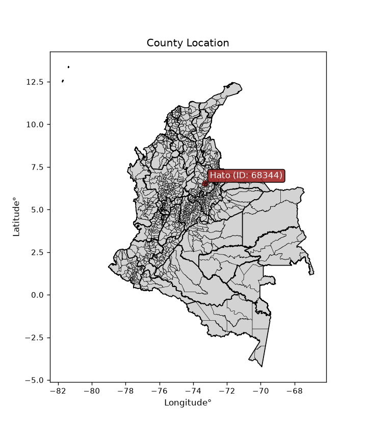
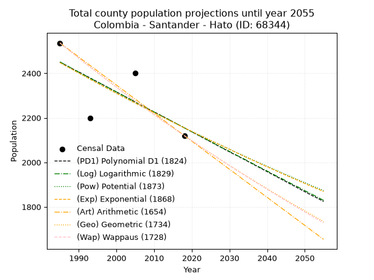
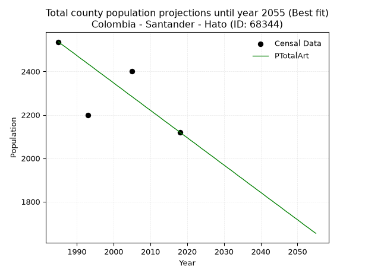
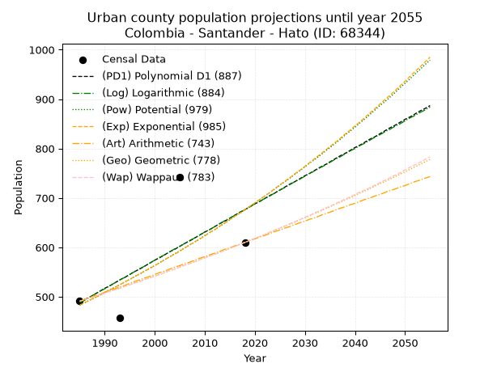
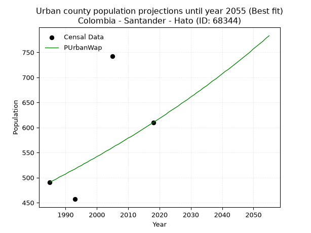
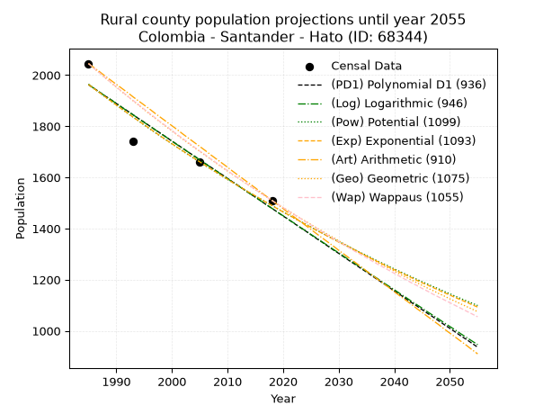
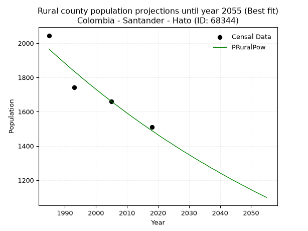

<div align="center">


</div>

# _“Population and Public Services Demand Projections (PPSD) until Year 2050 for Colombia - Santander - Hato (ID: 68344)”_
Keywords: `population` `public-service` `projection` `lineal` `polynomial` `logarithmic` `potential` `exponential` `arithmetic` `geometric` `wappaus` `dane` `colombia` `south-america`

PPSD are analytical estimates used by governments and planners to anticipate future changes in population size, age distribution, and the resulting community needs for utilities, healthcare, education, and infrastructure as sizing future water treatment facilities, electrical grids, and road networks based on spatial growth.

<div align="center">

</img>

</div>


> **General running parameters**: • app_version: _v20260806_. • Python version: _3.14.7_. • Pandas version: _3.0.5_. • NumPy version: _2.5.1_. • Creates, save and include plots into reports (create_plot): _False_. • Projection until year: _2050_. • Process polynomial degree 2 and up: _False_. • Process Wappaus: _True_. • Process Wappaus: _True_. • Set negative values to zero: _True_. • Set infinite values to zero: _True_. • Drop dataset notes: _True_. 
<div align="center">

Dynamic map: [:earth_americas:Google](http://maps.google.com/maps?q=6.543957247,-73.3083988) [:earth_americas:OSM](https://www.openstreetmap.org/#map=18/6.543957247/-73.3083988&layers=P) [:earth_americas:Bing](https://www.bing.com/maps?cp=6.543957247~-73.3083988&lvl=18) [:earth_americas:Apple](https://maps.apple.com/frame?center=6.543957247%2C-73.3083988&span=0.003%2C0.006)

</div>


<div align="center">

```geojson
{
  "type": "Feature",
  "geometry": {
    "type": "Point", 
    "coordinates": [-73.3083988, 6.543957247]
  }, 
  "properties": {
    "Name": "Colombia - Santander - Hato (ID: 68344)"
  }
}
```

</div>


## 0. Census Data (4 records)

Census data are official statistics collected by a government about the people and housing in a country. They usually include counts of total population, age, sex, race, income, education, and jobs.

📅Global census file: [Population.xlsx](../data/Population.xlsx)

| Source   |   Year |   CountryID | CountryName   |   StateID | StateName   |   CountyID | CountyName   |   PTotal |   PUrban |   PRural |
|:---------|-------:|------------:|:--------------|----------:|:------------|-----------:|:-------------|---------:|---------:|---------:|
| DANE     |   1985 |          57 | Colombia      |        68 | Santander   |      68344 | Hato         |     2536 |      491 |     2045 |
| DANE     |   1993 |          57 | Colombia      |        68 | Santander   |      68344 | Hato         |     2198 |      457 |     1741 |
| DANE     |   2005 |          57 | Colombia      |        68 | Santander   |      68344 | Hato         |     2401 |      742 |     1659 |
| DANE     |   2018 |          57 | Colombia      |        68 | Santander   |      68344 | Hato         |     2120 |      610 |     1510 |

> 🔥Some records could had specific notes about the registered values or the corresponding urban or rural distribution.

📅[SUI-RUPS](https://www.datos.gov.co/Hacienda-y-Cr-dito-P-blico/Registro-nico-de-Prestadores-de-Servicios-P-blicos/4qkq-csdn/about_data) - Local public utility companies: [RUPS.csv](../data/RUPS.xlsx)

 | SERVICIO       | ESTADO    | NOMBRE                                                    | NIT         | DEPARTAMENTO_DOMICILIO   | MUNICIPIO_DOMICILIO   | DIRECCION            |   TELEFONO | EMAIL                            | TIPO_PRESTADOR                 | CLASIFICACION                 |
|:---------------|:----------|:----------------------------------------------------------|:------------|:-------------------------|:----------------------|:---------------------|-----------:|:---------------------------------|:-------------------------------|:------------------------------|
| ACUEDUCTO      | OPERATIVA | UNIDAD DE SERVICIOS PUBLICOS DOMICILIARIOS HATO SANTANDER | 890210438-2 | SANTANDER                | HATO                  | carrera 5 No. 4 - 23 |    7248711 | planeacion@hato-santander.gov.co | MUNICIPIO (PRESTACIÓN DIRECTA) | MENOR O IGUAL A 2500 USUARIOS |
| ALCANTARILLADO | OPERATIVA | UNIDAD DE SERVICIOS PUBLICOS DOMICILIARIOS HATO SANTANDER | 890210438-2 | SANTANDER                | HATO                  | carrera 5 No. 4 - 23 |    7248711 | planeacion@hato-santander.gov.co | MUNICIPIO (PRESTACIÓN DIRECTA) | MENOR O IGUAL A 2500 USUARIOS |

## 1. Total

### 1.1. Coefficients and Parameters

* (PD1) Polynomial Deg 1: -8.951826575672264, 20219.641107988446 (lineal)
* (Log) Logarithmic: -17920.19509775655, 138525.29654147866
* (Pow) Potential: -7.724256096801702, 28.861581400790925
* (Exp) Exponential: -0.003858849751277984, 5192775.125999177
* (Art) Arithmetic: Year diff. 2018 - 1985 = 33, Population diff. 2120 - 2536 = -416, Annual growth = -12.606060606060606
* (Geo) Geometric: Year diff. 2018 - 1985 = 33, Population diff. 2120 - 2536 = -416, Annual growth % = -0.005414740126239881
* (Wap) Wappaus: i = -0.5414974487139436, Condition values only valid for < 200)

<sub>
Wappaus condition values: ['-0.00', '-0.54', '-1.08', '-1.62', '-2.17', '-2.71', '-3.25', '-3.79', '-4.33', '-4.87', '-5.41', '-5.96', '-6.50', '-7.04', '-7.58', '-8.12', '-8.66', '-9.21', '-9.75', '-10.29', '-10.83', '-11.37', '-11.91', '-12.45', '-13.00', '-13.54', '-14.08', '-14.62', '-15.16', '-15.70', '-16.24', '-16.79', '-17.33', '-17.87', '-18.41', '-18.95', '-19.49', '-20.04', '-20.58', '-21.12', '-21.66', '-22.20', '-22.74', '-23.28', '-23.83', '-24.37', '-24.91', '-25.45', '-25.99', '-26.53', '-27.07', '-27.62', '-28.16', '-28.70', '-29.24', '-29.78', '-30.32', '-30.87', '-31.41', '-31.95', '-32.49', '-33.03', '-33.57', '-34.11', '-34.66', '-35.20']
</sub>


### 1.2. Projected Dataset

|   Year |   CountyID |   PTotalPD1 |   PTotalLog |   PTotalPow |   PTotalExp |   PTotalArt |   PTotalGeo |   PTotalWap |
|-------:|-----------:|------------:|------------:|------------:|------------:|------------:|------------:|------------:|
|   1985 |      68344 |        2450 |        2451 |        2448 |        2448 |        2536 |        2536 |        2536 |
|   1986 |      68344 |        2441 |        2442 |        2439 |        2438 |        2523 |        2522 |        2522 |
|   1987 |      68344 |        2432 |        2433 |        2429 |        2429 |        2511 |        2509 |        2509 |
|   1988 |      68344 |        2423 |        2423 |        2420 |        2420 |        2498 |        2495 |        2495 |
|   1989 |      68344 |        2414 |        2414 |        2410 |        2410 |        2486 |        2482 |        2482 |
|   1990 |      68344 |        2406 |        2405 |        2401 |        2401 |        2473 |        2468 |        2468 |
|   1991 |      68344 |        2397 |        2396 |        2392 |        2392 |        2460 |        2455 |        2455 |
|   1992 |      68344 |        2388 |        2387 |        2382 |        2383 |        2448 |        2441 |        2442 |
|   1993 |      68344 |        2379 |        2378 |        2373 |        2373 |        2435 |        2428 |        2428 |
|   1994 |      68344 |        2370 |        2369 |        2364 |        2364 |        2423 |        2415 |        2415 |
|   1995 |      68344 |        2361 |        2360 |        2355 |        2355 |        2410 |        2402 |        2402 |
|   1996 |      68344 |        2352 |        2352 |        2346 |        2346 |        2397 |        2389 |        2389 |
|   1997 |      68344 |        2343 |        2343 |        2337 |        2337 |        2385 |        2376 |        2376 |
|   1998 |      68344 |        2334 |        2334 |        2328 |        2328 |        2372 |        2363 |        2364 |
|   1999 |      68344 |        2325 |        2325 |        2319 |        2319 |        2360 |        2350 |        2351 |
|   2000 |      68344 |        2316 |        2316 |        2310 |        2310 |        2347 |        2338 |        2338 |
|   2001 |      68344 |        2307 |        2307 |        2301 |        2301 |        2334 |        2325 |        2325 |
|   2002 |      68344 |        2298 |        2298 |        2292 |        2292 |        2322 |        2312 |        2313 |
|   2003 |      68344 |        2289 |        2289 |        2283 |        2284 |        2309 |        2300 |        2300 |
|   2004 |      68344 |        2280 |        2280 |        2274 |        2275 |        2296 |        2287 |        2288 |
|   2005 |      68344 |        2271 |        2271 |        2266 |        2266 |        2284 |        2275 |        2275 |
|   2006 |      68344 |        2262 |        2262 |        2257 |        2257 |        2271 |        2263 |        2263 |
|   2007 |      68344 |        2253 |        2253 |        2248 |        2249 |        2259 |        2250 |        2251 |
|   2008 |      68344 |        2244 |        2244 |        2240 |        2240 |        2246 |        2238 |        2239 |
|   2009 |      68344 |        2235 |        2235 |        2231 |        2231 |        2233 |        2226 |        2227 |
|   2010 |      68344 |        2226 |        2226 |        2223 |        2223 |        2221 |        2214 |        2214 |
|   2011 |      68344 |        2218 |        2217 |        2214 |        2214 |        2208 |        2202 |        2202 |
|   2012 |      68344 |        2209 |        2208 |        2206 |        2206 |        2196 |        2190 |        2190 |
|   2013 |      68344 |        2200 |        2200 |        2197 |        2197 |        2183 |        2178 |        2179 |
|   2014 |      68344 |        2191 |        2191 |        2189 |        2189 |        2170 |        2167 |        2167 |
|   2015 |      68344 |        2182 |        2182 |        2180 |        2180 |        2158 |        2155 |        2155 |
|   2016 |      68344 |        2173 |        2173 |        2172 |        2172 |        2145 |        2143 |        2143 |
|   2017 |      68344 |        2164 |        2164 |        2164 |        2163 |        2133 |        2132 |        2132 |
|   2018 |      68344 |        2155 |        2155 |        2155 |        2155 |        2120 |        2120 |        2120 |
|   2019 |      68344 |        2146 |        2146 |        2147 |        2147 |        2107 |        2109 |        2108 |
|   2020 |      68344 |        2137 |        2137 |        2139 |        2139 |        2095 |        2097 |        2097 |
|   2021 |      68344 |        2128 |        2128 |        2131 |        2130 |        2082 |        2086 |        2086 |
|   2022 |      68344 |        2119 |        2120 |        2123 |        2122 |        2070 |        2074 |        2074 |
|   2023 |      68344 |        2110 |        2111 |        2115 |        2114 |        2057 |        2063 |        2063 |
|   2024 |      68344 |        2101 |        2102 |        2107 |        2106 |        2044 |        2052 |        2052 |
|   2025 |      68344 |        2092 |        2093 |        2098 |        2098 |        2032 |        2041 |        2040 |
|   2026 |      68344 |        2083 |        2084 |        2091 |        2090 |        2019 |        2030 |        2029 |
|   2027 |      68344 |        2074 |        2075 |        2083 |        2082 |        2007 |        2019 |        2018 |
|   2028 |      68344 |        2065 |        2066 |        2075 |        2074 |        1994 |        2008 |        2007 |
|   2029 |      68344 |        2056 |        2058 |        2067 |        2066 |        1981 |        1997 |        1996 |
|   2030 |      68344 |        2047 |        2049 |        2059 |        2058 |        1969 |        1986 |        1985 |
|   2031 |      68344 |        2038 |        2040 |        2051 |        2050 |        1956 |        1976 |        1974 |
|   2032 |      68344 |        2030 |        2031 |        2043 |        2042 |        1944 |        1965 |        1963 |
|   2033 |      68344 |        2021 |        2022 |        2036 |        2034 |        1931 |        1954 |        1953 |
|   2034 |      68344 |        2012 |        2014 |        2028 |        2026 |        1918 |        1944 |        1942 |
|   2035 |      68344 |        2003 |        2005 |        2020 |        2018 |        1906 |        1933 |        1931 |
|   2036 |      68344 |        1994 |        1996 |        2012 |        2011 |        1893 |        1923 |        1921 |
|   2037 |      68344 |        1985 |        1987 |        2005 |        2003 |        1880 |        1912 |        1910 |
|   2038 |      68344 |        1976 |        1978 |        1997 |        1995 |        1868 |        1902 |        1900 |
|   2039 |      68344 |        1967 |        1970 |        1990 |        1987 |        1855 |        1892 |        1889 |
|   2040 |      68344 |        1958 |        1961 |        1982 |        1980 |        1843 |        1881 |        1879 |
|   2041 |      68344 |        1949 |        1952 |        1975 |        1972 |        1830 |        1871 |        1868 |
|   2042 |      68344 |        1940 |        1943 |        1967 |        1965 |        1817 |        1861 |        1858 |
|   2043 |      68344 |        1931 |        1934 |        1960 |        1957 |        1805 |        1851 |        1848 |
|   2044 |      68344 |        1922 |        1926 |        1952 |        1949 |        1792 |        1841 |        1837 |
|   2045 |      68344 |        1913 |        1917 |        1945 |        1942 |        1780 |        1831 |        1827 |
|   2046 |      68344 |        1904 |        1908 |        1938 |        1934 |        1767 |        1821 |        1817 |
|   2047 |      68344 |        1895 |        1899 |        1930 |        1927 |        1754 |        1811 |        1807 |
|   2048 |      68344 |        1886 |        1891 |        1923 |        1920 |        1742 |        1801 |        1797 |
|   2049 |      68344 |        1877 |        1882 |        1916 |        1912 |        1729 |        1792 |        1787 |
|   2050 |      68344 |        1868 |        1873 |        1909 |        1905 |        1717 |        1782 |        1777 |
<div align="center">

</img>

</div>


### 1.3. Best fit with absolute and relative error (%)

Relative error puts that difference into context by dividing the absolute error by the true value, creating a unitless ratio or percentage that shows the scale of the mistake.

Absolute and relative error

|   Year | Source   |   CountryID | CountryName   |   StateID | StateName   |   CountyID_x | CountyName   |   PTotal |   PUrban |   PRural |   CountyID_y |   PTotalPD1 |   PTotalLog |   PTotalPow |   PTotalExp |   PTotalArt |   PTotalGeo |   PTotalWap |   PTotalPD1AbsError |   PTotalLogAbsError |   PTotalPowAbsError |   PTotalExpAbsError |   PTotalArtAbsError |   PTotalGeoAbsError |   PTotalWapAbsError |   PTotalPD1RelError |   PTotalLogRelError |   PTotalPowRelError |   PTotalExpRelError |   PTotalArtRelError |   PTotalGeoRelError |   PTotalWapRelError |
|-------:|:---------|------------:|:--------------|----------:|:------------|-------------:|:-------------|---------:|---------:|---------:|-------------:|------------:|------------:|------------:|------------:|------------:|------------:|------------:|--------------------:|--------------------:|--------------------:|--------------------:|--------------------:|--------------------:|--------------------:|--------------------:|--------------------:|--------------------:|--------------------:|--------------------:|--------------------:|--------------------:|
|   1985 | DANE     |          57 | Colombia      |        68 | Santander   |        68344 | Hato         |     2536 |      491 |     2045 |        68344 |        2450 |        2451 |        2448 |        2448 |        2536 |        2536 |        2536 |                  86 |                  85 |                  88 |                  88 |                   0 |                   0 |                   0 |             3.39117 |             3.35174 |             3.47003 |             3.47003 |             0       |             0       |             0       |
|   1993 | DANE     |          57 | Colombia      |        68 | Santander   |        68344 | Hato         |     2198 |      457 |     1741 |        68344 |        2379 |        2378 |        2373 |        2373 |        2435 |        2428 |        2428 |                 181 |                 180 |                 175 |                 175 |                 237 |                 230 |                 230 |             8.23476 |             8.18926 |             7.96178 |             7.96178 |            10.7825  |            10.4641  |            10.4641  |
|   2005 | DANE     |          57 | Colombia      |        68 | Santander   |        68344 | Hato         |     2401 |      742 |     1659 |        68344 |        2271 |        2271 |        2266 |        2266 |        2284 |        2275 |        2275 |                 130 |                 130 |                 135 |                 135 |                 117 |                 126 |                 126 |             5.41441 |             5.41441 |             5.62266 |             5.62266 |             4.87297 |             5.24781 |             5.24781 |
|   2018 | DANE     |          57 | Colombia      |        68 | Santander   |        68344 | Hato         |     2120 |      610 |     1510 |        68344 |        2155 |        2155 |        2155 |        2155 |        2120 |        2120 |        2120 |                  35 |                  35 |                  35 |                  35 |                   0 |                   0 |                   0 |             1.65094 |             1.65094 |             1.65094 |             1.65094 |             0       |             0       |             0       |

Relative error mean

| Method    |   RelError | Best   |
|:----------|-----------:|:-------|
| PTotalPD1 |    4.67282 |        |
| PTotalLog |    4.65159 |        |
| PTotalPow |    4.67635 |        |
| PTotalExp |    4.67635 |        |
| PTotalArt |    3.91387 | True   |
| PTotalGeo |    3.92797 |        |
| PTotalWap |    3.92797 |        |

💙Best method: _**PTotalArt**_
<div align="center">

</img>

</div>


### 1.4. Fresh water supply demand in liters per capita per day (lpcd)

The fresh water supply demand typically ranges from 100 to 300 liters per capita per day (lpcd) for standard domestic and municipal planning, though absolute survival minimums set by the World Health Organization are as low as 7.5 to 20 liters per day, and total consumption in high-income nations can exceed 400 liters.

> `CZ`: Level in meters above the sea level (masl)<br> `WS`: Fresh water supply demand in liters per capita per day (lpcd or l/h/d)<br> `WSAll`: Zonal fresh water supply demand in liters per second (l/s)<br> `A`: Zonal area in square meters<br> `DP`: Population density (people/hectare or p/ha)

Reference values (RAS Colombia)

|    CZ |   WS |
|------:|-----:|
|  1000 |  120 |
|  2000 |  130 |
| 99999 |  140 |

County shapefile geometry properties and water supply values

|   CountyID |      ATotal |   CZTotal |   WSTotal |
|-----------:|------------:|----------:|----------:|
|      68344 | 1.68728e+08 |   1976.67 |       130 |

Projected values for best method: PTotalArt

|   CountyID |   Year |   PTotalArt |   DPTotal |   WSTotal |   WSTotalAll |
|-----------:|-------:|------------:|----------:|----------:|-------------:|
|      68344 |   1985 |        2536 |      0.15 |       130 |      3.81574 |
|      68344 |   1986 |        2523 |      0.15 |       130 |      3.79618 |
|      68344 |   1987 |        2511 |      0.15 |       130 |      3.77813 |
|      68344 |   1988 |        2498 |      0.15 |       130 |      3.75856 |
|      68344 |   1989 |        2486 |      0.15 |       130 |      3.74051 |
|      68344 |   1990 |        2473 |      0.15 |       130 |      3.72095 |
|      68344 |   1991 |        2460 |      0.15 |       130 |      3.70139 |
|      68344 |   1992 |        2448 |      0.15 |       130 |      3.68333 |
|      68344 |   1993 |        2435 |      0.14 |       130 |      3.66377 |
|      68344 |   1994 |        2423 |      0.14 |       130 |      3.64572 |
|      68344 |   1995 |        2410 |      0.14 |       130 |      3.62616 |
|      68344 |   1996 |        2397 |      0.14 |       130 |      3.6066  |
|      68344 |   1997 |        2385 |      0.14 |       130 |      3.58854 |
|      68344 |   1998 |        2372 |      0.14 |       130 |      3.56898 |
|      68344 |   1999 |        2360 |      0.14 |       130 |      3.55093 |
|      68344 |   2000 |        2347 |      0.14 |       130 |      3.53137 |
|      68344 |   2001 |        2334 |      0.14 |       130 |      3.51181 |
|      68344 |   2002 |        2322 |      0.14 |       130 |      3.49375 |
|      68344 |   2003 |        2309 |      0.14 |       130 |      3.47419 |
|      68344 |   2004 |        2296 |      0.14 |       130 |      3.45463 |
|      68344 |   2005 |        2284 |      0.14 |       130 |      3.43657 |
|      68344 |   2006 |        2271 |      0.13 |       130 |      3.41701 |
|      68344 |   2007 |        2259 |      0.13 |       130 |      3.39896 |
|      68344 |   2008 |        2246 |      0.13 |       130 |      3.3794  |
|      68344 |   2009 |        2233 |      0.13 |       130 |      3.35984 |
|      68344 |   2010 |        2221 |      0.13 |       130 |      3.34178 |
|      68344 |   2011 |        2208 |      0.13 |       130 |      3.32222 |
|      68344 |   2012 |        2196 |      0.13 |       130 |      3.30417 |
|      68344 |   2013 |        2183 |      0.13 |       130 |      3.28461 |
|      68344 |   2014 |        2170 |      0.13 |       130 |      3.26505 |
|      68344 |   2015 |        2158 |      0.13 |       130 |      3.24699 |
|      68344 |   2016 |        2145 |      0.13 |       130 |      3.22743 |
|      68344 |   2017 |        2133 |      0.13 |       130 |      3.20938 |
|      68344 |   2018 |        2120 |      0.13 |       130 |      3.18981 |
|      68344 |   2019 |        2107 |      0.12 |       130 |      3.17025 |
|      68344 |   2020 |        2095 |      0.12 |       130 |      3.1522  |
|      68344 |   2021 |        2082 |      0.12 |       130 |      3.13264 |
|      68344 |   2022 |        2070 |      0.12 |       130 |      3.11458 |
|      68344 |   2023 |        2057 |      0.12 |       130 |      3.09502 |
|      68344 |   2024 |        2044 |      0.12 |       130 |      3.07546 |
|      68344 |   2025 |        2032 |      0.12 |       130 |      3.05741 |
|      68344 |   2026 |        2019 |      0.12 |       130 |      3.03785 |
|      68344 |   2027 |        2007 |      0.12 |       130 |      3.01979 |
|      68344 |   2028 |        1994 |      0.12 |       130 |      3.00023 |
|      68344 |   2029 |        1981 |      0.12 |       130 |      2.98067 |
|      68344 |   2030 |        1969 |      0.12 |       130 |      2.96262 |
|      68344 |   2031 |        1956 |      0.12 |       130 |      2.94306 |
|      68344 |   2032 |        1944 |      0.12 |       130 |      2.925   |
|      68344 |   2033 |        1931 |      0.11 |       130 |      2.90544 |
|      68344 |   2034 |        1918 |      0.11 |       130 |      2.88588 |
|      68344 |   2035 |        1906 |      0.11 |       130 |      2.86782 |
|      68344 |   2036 |        1893 |      0.11 |       130 |      2.84826 |
|      68344 |   2037 |        1880 |      0.11 |       130 |      2.8287  |
|      68344 |   2038 |        1868 |      0.11 |       130 |      2.81065 |
|      68344 |   2039 |        1855 |      0.11 |       130 |      2.79109 |
|      68344 |   2040 |        1843 |      0.11 |       130 |      2.77303 |
|      68344 |   2041 |        1830 |      0.11 |       130 |      2.75347 |
|      68344 |   2042 |        1817 |      0.11 |       130 |      2.73391 |
|      68344 |   2043 |        1805 |      0.11 |       130 |      2.71586 |
|      68344 |   2044 |        1792 |      0.11 |       130 |      2.6963  |
|      68344 |   2045 |        1780 |      0.11 |       130 |      2.67824 |
|      68344 |   2046 |        1767 |      0.1  |       130 |      2.65868 |
|      68344 |   2047 |        1754 |      0.1  |       130 |      2.63912 |
|      68344 |   2048 |        1742 |      0.1  |       130 |      2.62106 |
|      68344 |   2049 |        1729 |      0.1  |       130 |      2.6015  |
|      68344 |   2050 |        1717 |      0.1  |       130 |      2.58345 |

## 2. Urban

### 2.1. Coefficients and Parameters

* (PD1) Polynomial Deg 1: 5.702127659574537, -10830.680851063968 (lineal)
* (Log) Logarithmic: 11430.328617625366, -86307.01941947541
* (Pow) Potential: 20.381936944816868, -64.5306367050182
* (Exp) Exponential: 0.010170337795128492, 8.255349430288287e-07
* (Art) Arithmetic: Year diff. 2018 - 1985 = 33, Population diff. 610 - 491 = 119, Annual growth = 3.606060606060606
* (Geo) Geometric: Year diff. 2018 - 1985 = 33, Population diff. 610 - 491 = 119, Annual growth % = 0.0065978776773045755
* (Wap) Wappaus: i = 0.6550518812099193, Condition values only valid for < 200)

<sub>
Wappaus condition values: ['0.00', '0.66', '1.31', '1.97', '2.62', '3.28', '3.93', '4.59', '5.24', '5.90', '6.55', '7.21', '7.86', '8.52', '9.17', '9.83', '10.48', '11.14', '11.79', '12.45', '13.10', '13.76', '14.41', '15.07', '15.72', '16.38', '17.03', '17.69', '18.34', '19.00', '19.65', '20.31', '20.96', '21.62', '22.27', '22.93', '23.58', '24.24', '24.89', '25.55', '26.20', '26.86', '27.51', '28.17', '28.82', '29.48', '30.13', '30.79', '31.44', '32.10', '32.75', '33.41', '34.06', '34.72', '35.37', '36.03', '36.68', '37.34', '37.99', '38.65', '39.30', '39.96', '40.61', '41.27', '41.92', '42.58']
</sub>


### 2.2. Projected Dataset

|   Year |   CountyID |   PUrbanPD1 |   PUrbanLog |   PUrbanPow |   PUrbanExp |   PUrbanArt |   PUrbanGeo |   PUrbanWap |
|-------:|-----------:|------------:|------------:|------------:|------------:|------------:|------------:|------------:|
|   1985 |      68344 |         488 |         488 |         483 |         483 |         491 |         491 |         491 |
|   1986 |      68344 |         494 |         493 |         488 |         488 |         495 |         494 |         494 |
|   1987 |      68344 |         499 |         499 |         493 |         493 |         498 |         498 |         497 |
|   1988 |      68344 |         505 |         505 |         498 |         498 |         502 |         501 |         501 |
|   1989 |      68344 |         511 |         511 |         503 |         503 |         505 |         504 |         504 |
|   1990 |      68344 |         517 |         516 |         509 |         509 |         509 |         507 |         507 |
|   1991 |      68344 |         522 |         522 |         514 |         514 |         513 |         511 |         511 |
|   1992 |      68344 |         528 |         528 |         519 |         519 |         516 |         514 |         514 |
|   1993 |      68344 |         534 |         534 |         524 |         524 |         520 |         518 |         517 |
|   1994 |      68344 |         539 |         539 |         530 |         530 |         523 |         521 |         521 |
|   1995 |      68344 |         545 |         545 |         535 |         535 |         527 |         524 |         524 |
|   1996 |      68344 |         551 |         551 |         541 |         541 |         531 |         528 |         528 |
|   1997 |      68344 |         556 |         557 |         546 |         546 |         534 |         531 |         531 |
|   1998 |      68344 |         562 |         562 |         552 |         552 |         538 |         535 |         535 |
|   1999 |      68344 |         568 |         568 |         558 |         557 |         541 |         538 |         538 |
|   2000 |      68344 |         574 |         574 |         563 |         563 |         545 |         542 |         542 |
|   2001 |      68344 |         579 |         580 |         569 |         569 |         549 |         545 |         545 |
|   2002 |      68344 |         585 |         585 |         575 |         575 |         552 |         549 |         549 |
|   2003 |      68344 |         591 |         591 |         581 |         581 |         556 |         553 |         553 |
|   2004 |      68344 |         596 |         597 |         587 |         586 |         560 |         556 |         556 |
|   2005 |      68344 |         602 |         602 |         593 |         592 |         563 |         560 |         560 |
|   2006 |      68344 |         608 |         608 |         599 |         599 |         567 |         564 |         564 |
|   2007 |      68344 |         613 |         614 |         605 |         605 |         570 |         567 |         567 |
|   2008 |      68344 |         619 |         619 |         611 |         611 |         574 |         571 |         571 |
|   2009 |      68344 |         625 |         625 |         617 |         617 |         578 |         575 |         575 |
|   2010 |      68344 |         631 |         631 |         624 |         623 |         581 |         579 |         579 |
|   2011 |      68344 |         636 |         636 |         630 |         630 |         585 |         583 |         582 |
|   2012 |      68344 |         642 |         642 |         636 |         636 |         588 |         586 |         586 |
|   2013 |      68344 |         648 |         648 |         643 |         643 |         592 |         590 |         590 |
|   2014 |      68344 |         653 |         654 |         649 |         649 |         596 |         594 |         594 |
|   2015 |      68344 |         659 |         659 |         656 |         656 |         599 |         598 |         598 |
|   2016 |      68344 |         665 |         665 |         663 |         663 |         603 |         602 |         602 |
|   2017 |      68344 |         671 |         671 |         669 |         669 |         606 |         606 |         606 |
|   2018 |      68344 |         676 |         676 |         676 |         676 |         610 |         610 |         610 |
|   2019 |      68344 |         682 |         682 |         683 |         683 |         614 |         614 |         614 |
|   2020 |      68344 |         688 |         688 |         690 |         690 |         617 |         618 |         618 |
|   2021 |      68344 |         693 |         693 |         697 |         697 |         621 |         622 |         622 |
|   2022 |      68344 |         699 |         699 |         704 |         704 |         624 |         626 |         626 |
|   2023 |      68344 |         705 |         704 |         711 |         711 |         628 |         630 |         631 |
|   2024 |      68344 |         710 |         710 |         718 |         719 |         632 |         635 |         635 |
|   2025 |      68344 |         716 |         716 |         726 |         726 |         635 |         639 |         639 |
|   2026 |      68344 |         722 |         721 |         733 |         734 |         639 |         643 |         643 |
|   2027 |      68344 |         728 |         727 |         740 |         741 |         642 |         647 |         648 |
|   2028 |      68344 |         733 |         733 |         748 |         749 |         646 |         651 |         652 |
|   2029 |      68344 |         739 |         738 |         755 |         756 |         650 |         656 |         656 |
|   2030 |      68344 |         745 |         744 |         763 |         764 |         653 |         660 |         661 |
|   2031 |      68344 |         750 |         750 |         771 |         772 |         657 |         664 |         665 |
|   2032 |      68344 |         756 |         755 |         778 |         780 |         660 |         669 |         670 |
|   2033 |      68344 |         762 |         761 |         786 |         788 |         664 |         673 |         674 |
|   2034 |      68344 |         767 |         766 |         794 |         796 |         668 |         678 |         679 |
|   2035 |      68344 |         773 |         772 |         802 |         804 |         671 |         682 |         683 |
|   2036 |      68344 |         779 |         778 |         810 |         812 |         675 |         687 |         688 |
|   2037 |      68344 |         785 |         783 |         818 |         820 |         679 |         691 |         693 |
|   2038 |      68344 |         790 |         789 |         827 |         829 |         682 |         696 |         697 |
|   2039 |      68344 |         796 |         795 |         835 |         837 |         686 |         700 |         702 |
|   2040 |      68344 |         802 |         800 |         843 |         846 |         689 |         705 |         707 |
|   2041 |      68344 |         807 |         806 |         852 |         854 |         693 |         710 |         712 |
|   2042 |      68344 |         813 |         811 |         860 |         863 |         697 |         714 |         716 |
|   2043 |      68344 |         819 |         817 |         869 |         872 |         700 |         719 |         721 |
|   2044 |      68344 |         824 |         823 |         878 |         881 |         704 |         724 |         726 |
|   2045 |      68344 |         830 |         828 |         887 |         890 |         707 |         729 |         731 |
|   2046 |      68344 |         836 |         834 |         895 |         899 |         711 |         733 |         736 |
|   2047 |      68344 |         842 |         839 |         904 |         908 |         715 |         738 |         741 |
|   2048 |      68344 |         847 |         845 |         913 |         917 |         718 |         743 |         746 |
|   2049 |      68344 |         853 |         850 |         923 |         927 |         722 |         748 |         751 |
|   2050 |      68344 |         859 |         856 |         932 |         936 |         725 |         753 |         757 |
<div align="center">

</img>

</div>


### 2.3. Best fit with absolute and relative error (%)

Relative error puts that difference into context by dividing the absolute error by the true value, creating a unitless ratio or percentage that shows the scale of the mistake.

Absolute and relative error

|   Year | Source   |   CountryID | CountryName   |   StateID | StateName   |   CountyID_x | CountyName   |   PTotal |   PUrban |   PRural |   CountyID_y |   PUrbanPD1 |   PUrbanLog |   PUrbanPow |   PUrbanExp |   PUrbanArt |   PUrbanGeo |   PUrbanWap |   PUrbanPD1AbsError |   PUrbanLogAbsError |   PUrbanPowAbsError |   PUrbanExpAbsError |   PUrbanArtAbsError |   PUrbanGeoAbsError |   PUrbanWapAbsError |   PUrbanPD1RelError |   PUrbanLogRelError |   PUrbanPowRelError |   PUrbanExpRelError |   PUrbanArtRelError |   PUrbanGeoRelError |   PUrbanWapRelError |
|-------:|:---------|------------:|:--------------|----------:|:------------|-------------:|:-------------|---------:|---------:|---------:|-------------:|------------:|------------:|------------:|------------:|------------:|------------:|------------:|--------------------:|--------------------:|--------------------:|--------------------:|--------------------:|--------------------:|--------------------:|--------------------:|--------------------:|--------------------:|--------------------:|--------------------:|--------------------:|--------------------:|
|   1985 | DANE     |          57 | Colombia      |        68 | Santander   |        68344 | Hato         |     2536 |      491 |     2045 |        68344 |         488 |         488 |         483 |         483 |         491 |         491 |         491 |                   3 |                   3 |                   8 |                   8 |                   0 |                   0 |                   0 |            0.610998 |            0.610998 |             1.62933 |             1.62933 |              0      |              0      |              0      |
|   1993 | DANE     |          57 | Colombia      |        68 | Santander   |        68344 | Hato         |     2198 |      457 |     1741 |        68344 |         534 |         534 |         524 |         524 |         520 |         518 |         517 |                  77 |                  77 |                  67 |                  67 |                  63 |                  61 |                  60 |           16.849    |           16.849    |            14.6608  |            14.6608  |             13.7856 |             13.3479 |             13.1291 |
|   2005 | DANE     |          57 | Colombia      |        68 | Santander   |        68344 | Hato         |     2401 |      742 |     1659 |        68344 |         602 |         602 |         593 |         592 |         563 |         560 |         560 |                 140 |                 140 |                 149 |                 150 |                 179 |                 182 |                 182 |           18.8679   |           18.8679   |            20.0809  |            20.2156  |             24.124  |             24.5283 |             24.5283 |
|   2018 | DANE     |          57 | Colombia      |        68 | Santander   |        68344 | Hato         |     2120 |      610 |     1510 |        68344 |         676 |         676 |         676 |         676 |         610 |         610 |         610 |                  66 |                  66 |                  66 |                  66 |                   0 |                   0 |                   0 |           10.8197   |           10.8197   |            10.8197  |            10.8197  |              0      |              0      |              0      |

Relative error mean

| Method    |   RelError | Best   |
|:----------|-----------:|:-------|
| PUrbanPD1 |   11.7869  |        |
| PUrbanLog |   11.7869  |        |
| PUrbanPow |   11.7977  |        |
| PUrbanExp |   11.8314  |        |
| PUrbanArt |    9.47739 |        |
| PUrbanGeo |    9.46906 |        |
| PUrbanWap |    9.41435 | True   |

💙Best method: _**PUrbanWap**_
<div align="center">

</img>

</div>


### 2.4. Fresh water supply demand in liters per capita per day (lpcd)

The fresh water supply demand typically ranges from 100 to 300 liters per capita per day (lpcd) for standard domestic and municipal planning, though absolute survival minimums set by the World Health Organization are as low as 7.5 to 20 liters per day, and total consumption in high-income nations can exceed 400 liters.

> `CZ`: Level in meters above the sea level (masl)<br> `WS`: Fresh water supply demand in liters per capita per day (lpcd or l/h/d)<br> `WSAll`: Zonal fresh water supply demand in liters per second (l/s)<br> `A`: Zonal area in square meters<br> `DP`: Population density (people/hectare or p/ha)

Reference values (RAS Colombia)

|    CZ |   WS |
|------:|-----:|
|  1000 |  120 |
|  2000 |  130 |
| 99999 |  140 |

County shapefile geometry properties and water supply values

|   CountyID |   AUrban |   CZUrban |   WSUrban |
|-----------:|---------:|----------:|----------:|
|      68344 |   436128 |   1335.92 |       130 |

Projected values for best method: PUrbanWap

|   CountyID |   Year |   PUrbanWap |   DPUrban |   WSUrban |   WSUrbanAll |
|-----------:|-------:|------------:|----------:|----------:|-------------:|
|      68344 |   1985 |         491 |     11.26 |       130 |     0.738773 |
|      68344 |   1986 |         494 |     11.33 |       130 |     0.743287 |
|      68344 |   1987 |         497 |     11.4  |       130 |     0.747801 |
|      68344 |   1988 |         501 |     11.49 |       130 |     0.753819 |
|      68344 |   1989 |         504 |     11.56 |       130 |     0.758333 |
|      68344 |   1990 |         507 |     11.63 |       130 |     0.762847 |
|      68344 |   1991 |         511 |     11.72 |       130 |     0.768866 |
|      68344 |   1992 |         514 |     11.79 |       130 |     0.77338  |
|      68344 |   1993 |         517 |     11.85 |       130 |     0.777894 |
|      68344 |   1994 |         521 |     11.95 |       130 |     0.783912 |
|      68344 |   1995 |         524 |     12.01 |       130 |     0.788426 |
|      68344 |   1996 |         528 |     12.11 |       130 |     0.794444 |
|      68344 |   1997 |         531 |     12.18 |       130 |     0.798958 |
|      68344 |   1998 |         535 |     12.27 |       130 |     0.804977 |
|      68344 |   1999 |         538 |     12.34 |       130 |     0.809491 |
|      68344 |   2000 |         542 |     12.43 |       130 |     0.815509 |
|      68344 |   2001 |         545 |     12.5  |       130 |     0.820023 |
|      68344 |   2002 |         549 |     12.59 |       130 |     0.826042 |
|      68344 |   2003 |         553 |     12.68 |       130 |     0.83206  |
|      68344 |   2004 |         556 |     12.75 |       130 |     0.836574 |
|      68344 |   2005 |         560 |     12.84 |       130 |     0.842593 |
|      68344 |   2006 |         564 |     12.93 |       130 |     0.848611 |
|      68344 |   2007 |         567 |     13    |       130 |     0.853125 |
|      68344 |   2008 |         571 |     13.09 |       130 |     0.859144 |
|      68344 |   2009 |         575 |     13.18 |       130 |     0.865162 |
|      68344 |   2010 |         579 |     13.28 |       130 |     0.871181 |
|      68344 |   2011 |         582 |     13.34 |       130 |     0.875694 |
|      68344 |   2012 |         586 |     13.44 |       130 |     0.881713 |
|      68344 |   2013 |         590 |     13.53 |       130 |     0.887731 |
|      68344 |   2014 |         594 |     13.62 |       130 |     0.89375  |
|      68344 |   2015 |         598 |     13.71 |       130 |     0.899769 |
|      68344 |   2016 |         602 |     13.8  |       130 |     0.905787 |
|      68344 |   2017 |         606 |     13.89 |       130 |     0.911806 |
|      68344 |   2018 |         610 |     13.99 |       130 |     0.917824 |
|      68344 |   2019 |         614 |     14.08 |       130 |     0.923843 |
|      68344 |   2020 |         618 |     14.17 |       130 |     0.929861 |
|      68344 |   2021 |         622 |     14.26 |       130 |     0.93588  |
|      68344 |   2022 |         626 |     14.35 |       130 |     0.941898 |
|      68344 |   2023 |         631 |     14.47 |       130 |     0.949421 |
|      68344 |   2024 |         635 |     14.56 |       130 |     0.95544  |
|      68344 |   2025 |         639 |     14.65 |       130 |     0.961458 |
|      68344 |   2026 |         643 |     14.74 |       130 |     0.967477 |
|      68344 |   2027 |         648 |     14.86 |       130 |     0.975    |
|      68344 |   2028 |         652 |     14.95 |       130 |     0.981019 |
|      68344 |   2029 |         656 |     15.04 |       130 |     0.987037 |
|      68344 |   2030 |         661 |     15.16 |       130 |     0.99456  |
|      68344 |   2031 |         665 |     15.25 |       130 |     1.00058  |
|      68344 |   2032 |         670 |     15.36 |       130 |     1.0081   |
|      68344 |   2033 |         674 |     15.45 |       130 |     1.01412  |
|      68344 |   2034 |         679 |     15.57 |       130 |     1.02164  |
|      68344 |   2035 |         683 |     15.66 |       130 |     1.02766  |
|      68344 |   2036 |         688 |     15.78 |       130 |     1.03519  |
|      68344 |   2037 |         693 |     15.89 |       130 |     1.04271  |
|      68344 |   2038 |         697 |     15.98 |       130 |     1.04873  |
|      68344 |   2039 |         702 |     16.1  |       130 |     1.05625  |
|      68344 |   2040 |         707 |     16.21 |       130 |     1.06377  |
|      68344 |   2041 |         712 |     16.33 |       130 |     1.0713   |
|      68344 |   2042 |         716 |     16.42 |       130 |     1.07731  |
|      68344 |   2043 |         721 |     16.53 |       130 |     1.08484  |
|      68344 |   2044 |         726 |     16.65 |       130 |     1.09236  |
|      68344 |   2045 |         731 |     16.76 |       130 |     1.09988  |
|      68344 |   2046 |         736 |     16.88 |       130 |     1.10741  |
|      68344 |   2047 |         741 |     16.99 |       130 |     1.11493  |
|      68344 |   2048 |         746 |     17.11 |       130 |     1.12245  |
|      68344 |   2049 |         751 |     17.22 |       130 |     1.12998  |
|      68344 |   2050 |         757 |     17.36 |       130 |     1.139    |

## 3. Rural

### 3.1. Coefficients and Parameters

* (PD1) Polynomial Deg 1: -14.653954235246797, 31050.32195905241 (lineal)
* (Log) Logarithmic: -29350.523715381958, 224832.31596095438
* (Pow) Potential: -16.755180825296666, 58.54770142389795
* (Exp) Exponential: -0.008366409032642684, 32022687554.253185
* (Art) Arithmetic: Year diff. 2018 - 1985 = 33, Population diff. 1510 - 2045 = -535, Annual growth = -16.21212121212121
* (Geo) Geometric: Year diff. 2018 - 1985 = 33, Population diff. 1510 - 2045 = -535, Annual growth % = -0.009148445640187353
* (Wap) Wappaus: i = -0.9120743297958488, Condition values only valid for < 200)

<sub>
Wappaus condition values: ['-0.00', '-0.91', '-1.82', '-2.74', '-3.65', '-4.56', '-5.47', '-6.38', '-7.30', '-8.21', '-9.12', '-10.03', '-10.94', '-11.86', '-12.77', '-13.68', '-14.59', '-15.51', '-16.42', '-17.33', '-18.24', '-19.15', '-20.07', '-20.98', '-21.89', '-22.80', '-23.71', '-24.63', '-25.54', '-26.45', '-27.36', '-28.27', '-29.19', '-30.10', '-31.01', '-31.92', '-32.83', '-33.75', '-34.66', '-35.57', '-36.48', '-37.40', '-38.31', '-39.22', '-40.13', '-41.04', '-41.96', '-42.87', '-43.78', '-44.69', '-45.60', '-46.52', '-47.43', '-48.34', '-49.25', '-50.16', '-51.08', '-51.99', '-52.90', '-53.81', '-54.72', '-55.64', '-56.55', '-57.46', '-58.37', '-59.28']
</sub>


### 3.2. Projected Dataset

|   Year |   CountyID |   PRuralPD1 |   PRuralLog |   PRuralPow |   PRuralExp |   PRuralArt |   PRuralGeo |   PRuralWap |
|-------:|-----------:|------------:|------------:|------------:|------------:|------------:|------------:|------------:|
|   1985 |      68344 |        1962 |        1963 |        1964 |        1963 |        2045 |        2045 |        2045 |
|   1986 |      68344 |        1948 |        1948 |        1947 |        1947 |        2029 |        2026 |        2026 |
|   1987 |      68344 |        1933 |        1933 |        1931 |        1931 |        2013 |        2008 |        2008 |
|   1988 |      68344 |        1918 |        1918 |        1915 |        1915 |        1996 |        1989 |        1990 |
|   1989 |      68344 |        1904 |        1904 |        1899 |        1899 |        1980 |        1971 |        1972 |
|   1990 |      68344 |        1889 |        1889 |        1883 |        1883 |        1964 |        1953 |        1954 |
|   1991 |      68344 |        1874 |        1874 |        1867 |        1867 |        1948 |        1935 |        1936 |
|   1992 |      68344 |        1860 |        1859 |        1851 |        1852 |        1932 |        1918 |        1918 |
|   1993 |      68344 |        1845 |        1845 |        1836 |        1836 |        1915 |        1900 |        1901 |
|   1994 |      68344 |        1830 |        1830 |        1821 |        1821 |        1899 |        1883 |        1884 |
|   1995 |      68344 |        1816 |        1815 |        1805 |        1806 |        1883 |        1865 |        1867 |
|   1996 |      68344 |        1801 |        1801 |        1790 |        1791 |        1867 |        1848 |        1850 |
|   1997 |      68344 |        1786 |        1786 |        1775 |        1776 |        1850 |        1831 |        1833 |
|   1998 |      68344 |        1772 |        1771 |        1760 |        1761 |        1834 |        1815 |        1816 |
|   1999 |      68344 |        1757 |        1757 |        1746 |        1746 |        1818 |        1798 |        1800 |
|   2000 |      68344 |        1742 |        1742 |        1731 |        1732 |        1802 |        1782 |        1783 |
|   2001 |      68344 |        1728 |        1727 |        1717 |        1717 |        1786 |        1765 |        1767 |
|   2002 |      68344 |        1713 |        1713 |        1702 |        1703 |        1769 |        1749 |        1751 |
|   2003 |      68344 |        1698 |        1698 |        1688 |        1689 |        1753 |        1733 |        1735 |
|   2004 |      68344 |        1684 |        1683 |        1674 |        1675 |        1737 |        1717 |        1719 |
|   2005 |      68344 |        1669 |        1669 |        1660 |        1661 |        1721 |        1702 |        1703 |
|   2006 |      68344 |        1654 |        1654 |        1646 |        1647 |        1705 |        1686 |        1688 |
|   2007 |      68344 |        1640 |        1639 |        1633 |        1633 |        1688 |        1671 |        1672 |
|   2008 |      68344 |        1625 |        1625 |        1619 |        1620 |        1672 |        1655 |        1657 |
|   2009 |      68344 |        1611 |        1610 |        1606 |        1606 |        1656 |        1640 |        1642 |
|   2010 |      68344 |        1596 |        1595 |        1592 |        1593 |        1640 |        1625 |        1626 |
|   2011 |      68344 |        1581 |        1581 |        1579 |        1579 |        1623 |        1610 |        1611 |
|   2012 |      68344 |        1567 |        1566 |        1566 |        1566 |        1607 |        1596 |        1597 |
|   2013 |      68344 |        1552 |        1552 |        1553 |        1553 |        1591 |        1581 |        1582 |
|   2014 |      68344 |        1537 |        1537 |        1540 |        1540 |        1575 |        1567 |        1567 |
|   2015 |      68344 |        1523 |        1523 |        1527 |        1528 |        1559 |        1552 |        1553 |
|   2016 |      68344 |        1508 |        1508 |        1515 |        1515 |        1542 |        1538 |        1538 |
|   2017 |      68344 |        1493 |        1493 |        1502 |        1502 |        1526 |        1524 |        1524 |
|   2018 |      68344 |        1479 |        1479 |        1490 |        1490 |        1510 |        1510 |        1510 |
|   2019 |      68344 |        1464 |        1464 |        1478 |        1477 |        1494 |        1496 |        1496 |
|   2020 |      68344 |        1449 |        1450 |        1465 |        1465 |        1478 |        1482 |        1482 |
|   2021 |      68344 |        1435 |        1435 |        1453 |        1453 |        1461 |        1469 |        1468 |
|   2022 |      68344 |        1420 |        1421 |        1441 |        1441 |        1445 |        1455 |        1455 |
|   2023 |      68344 |        1405 |        1406 |        1429 |        1429 |        1429 |        1442 |        1441 |
|   2024 |      68344 |        1391 |        1392 |        1418 |        1417 |        1413 |        1429 |        1427 |
|   2025 |      68344 |        1376 |        1377 |        1406 |        1405 |        1397 |        1416 |        1414 |
|   2026 |      68344 |        1361 |        1363 |        1394 |        1393 |        1380 |        1403 |        1401 |
|   2027 |      68344 |        1347 |        1348 |        1383 |        1382 |        1364 |        1390 |        1388 |
|   2028 |      68344 |        1332 |        1334 |        1371 |        1370 |        1348 |        1377 |        1374 |
|   2029 |      68344 |        1317 |        1319 |        1360 |        1359 |        1332 |        1365 |        1361 |
|   2030 |      68344 |        1303 |        1305 |        1349 |        1347 |        1315 |        1352 |        1349 |
|   2031 |      68344 |        1288 |        1290 |        1338 |        1336 |        1299 |        1340 |        1336 |
|   2032 |      68344 |        1273 |        1276 |        1327 |        1325 |        1283 |        1328 |        1323 |
|   2033 |      68344 |        1259 |        1262 |        1316 |        1314 |        1267 |        1316 |        1310 |
|   2034 |      68344 |        1244 |        1247 |        1305 |        1303 |        1251 |        1304 |        1298 |
|   2035 |      68344 |        1230 |        1233 |        1295 |        1292 |        1234 |        1292 |        1286 |
|   2036 |      68344 |        1215 |        1218 |        1284 |        1281 |        1218 |        1280 |        1273 |
|   2037 |      68344 |        1200 |        1204 |        1273 |        1271 |        1202 |        1268 |        1261 |
|   2038 |      68344 |        1186 |        1189 |        1263 |        1260 |        1186 |        1256 |        1249 |
|   2039 |      68344 |        1171 |        1175 |        1253 |        1250 |        1170 |        1245 |        1237 |
|   2040 |      68344 |        1156 |        1161 |        1242 |        1239 |        1153 |        1234 |        1225 |
|   2041 |      68344 |        1142 |        1146 |        1232 |        1229 |        1137 |        1222 |        1213 |
|   2042 |      68344 |        1127 |        1132 |        1222 |        1219 |        1121 |        1211 |        1201 |
|   2043 |      68344 |        1112 |        1117 |        1212 |        1209 |        1105 |        1200 |        1189 |
|   2044 |      68344 |        1098 |        1103 |        1202 |        1198 |        1088 |        1189 |        1178 |
|   2045 |      68344 |        1083 |        1089 |        1192 |        1188 |        1072 |        1178 |        1166 |
|   2046 |      68344 |        1068 |        1074 |        1183 |        1179 |        1056 |        1167 |        1155 |
|   2047 |      68344 |        1054 |        1060 |        1173 |        1169 |        1040 |        1157 |        1143 |
|   2048 |      68344 |        1039 |        1046 |        1164 |        1159 |        1024 |        1146 |        1132 |
|   2049 |      68344 |        1024 |        1031 |        1154 |        1149 |        1007 |        1136 |        1121 |
|   2050 |      68344 |        1010 |        1017 |        1145 |        1140 |         991 |        1125 |        1110 |
<div align="center">

</img>

</div>


### 3.3. Best fit with absolute and relative error (%)

Relative error puts that difference into context by dividing the absolute error by the true value, creating a unitless ratio or percentage that shows the scale of the mistake.

Absolute and relative error

|   Year | Source   |   CountryID | CountryName   |   StateID | StateName   |   CountyID_x | CountyName   |   PTotal |   PUrban |   PRural |   CountyID_y |   PRuralPD1 |   PRuralLog |   PRuralPow |   PRuralExp |   PRuralArt |   PRuralGeo |   PRuralWap |   PRuralPD1AbsError |   PRuralLogAbsError |   PRuralPowAbsError |   PRuralExpAbsError |   PRuralArtAbsError |   PRuralGeoAbsError |   PRuralWapAbsError |   PRuralPD1RelError |   PRuralLogRelError |   PRuralPowRelError |   PRuralExpRelError |   PRuralArtRelError |   PRuralGeoRelError |   PRuralWapRelError |
|-------:|:---------|------------:|:--------------|----------:|:------------|-------------:|:-------------|---------:|---------:|---------:|-------------:|------------:|------------:|------------:|------------:|------------:|------------:|------------:|--------------------:|--------------------:|--------------------:|--------------------:|--------------------:|--------------------:|--------------------:|--------------------:|--------------------:|--------------------:|--------------------:|--------------------:|--------------------:|--------------------:|
|   1985 | DANE     |          57 | Colombia      |        68 | Santander   |        68344 | Hato         |     2536 |      491 |     2045 |        68344 |        1962 |        1963 |        1964 |        1963 |        2045 |        2045 |        2045 |                  83 |                  82 |                  81 |                  82 |                   0 |                   0 |                   0 |            4.05868  |            4.00978  |           3.96088   |            4.00978  |             0       |             0       |             0       |
|   1993 | DANE     |          57 | Colombia      |        68 | Santander   |        68344 | Hato         |     2198 |      457 |     1741 |        68344 |        1845 |        1845 |        1836 |        1836 |        1915 |        1900 |        1901 |                 104 |                 104 |                  95 |                  95 |                 174 |                 159 |                 160 |            5.97358  |            5.97358  |           5.45663   |            5.45663  |             9.99426 |             9.13268 |             9.19012 |
|   2005 | DANE     |          57 | Colombia      |        68 | Santander   |        68344 | Hato         |     2401 |      742 |     1659 |        68344 |        1669 |        1669 |        1660 |        1661 |        1721 |        1702 |        1703 |                  10 |                  10 |                   1 |                   2 |                  62 |                  43 |                  44 |            0.602773 |            0.602773 |           0.0602773 |            0.120555 |             3.73719 |             2.59192 |             2.6522  |
|   2018 | DANE     |          57 | Colombia      |        68 | Santander   |        68344 | Hato         |     2120 |      610 |     1510 |        68344 |        1479 |        1479 |        1490 |        1490 |        1510 |        1510 |        1510 |                  31 |                  31 |                  20 |                  20 |                   0 |                   0 |                   0 |            2.05298  |            2.05298  |           1.3245    |            1.3245   |             0       |             0       |             0       |

Relative error mean

| Method    |   RelError | Best   |
|:----------|-----------:|:-------|
| PRuralPD1 |    3.172   |        |
| PRuralLog |    3.15978 |        |
| PRuralPow |    2.70057 | True   |
| PRuralExp |    2.72787 |        |
| PRuralArt |    3.43286 |        |
| PRuralGeo |    2.93115 |        |
| PRuralWap |    2.96058 |        |

💙Best method: _**PRuralPow**_
<div align="center">

</img>

</div>


### 3.4. Fresh water supply demand in liters per capita per day (lpcd)

The fresh water supply demand typically ranges from 100 to 300 liters per capita per day (lpcd) for standard domestic and municipal planning, though absolute survival minimums set by the World Health Organization are as low as 7.5 to 20 liters per day, and total consumption in high-income nations can exceed 400 liters.

> `CZ`: Level in meters above the sea level (masl)<br> `WS`: Fresh water supply demand in liters per capita per day (lpcd or l/h/d)<br> `WSAll`: Zonal fresh water supply demand in liters per second (l/s)<br> `A`: Zonal area in square meters<br> `DP`: Population density (people/hectare or p/ha)

Reference values (RAS Colombia)

|    CZ |   WS |
|------:|-----:|
|  1000 |  120 |
|  2000 |  130 |
| 99999 |  140 |

County shapefile geometry properties and water supply values

|   CountyID |      ARural |   CZRural |   WSRural |
|-----------:|------------:|----------:|----------:|
|      68344 | 1.68292e+08 |   1978.32 |       130 |

Projected values for best method: PRuralPow

|   CountyID |   Year |   PRuralPow |   DPRural |   WSRural |   WSRuralAll |
|-----------:|-------:|------------:|----------:|----------:|-------------:|
|      68344 |   1985 |        1964 |      0.12 |       130 |      2.95509 |
|      68344 |   1986 |        1947 |      0.12 |       130 |      2.92951 |
|      68344 |   1987 |        1931 |      0.11 |       130 |      2.90544 |
|      68344 |   1988 |        1915 |      0.11 |       130 |      2.88137 |
|      68344 |   1989 |        1899 |      0.11 |       130 |      2.85729 |
|      68344 |   1990 |        1883 |      0.11 |       130 |      2.83322 |
|      68344 |   1991 |        1867 |      0.11 |       130 |      2.80914 |
|      68344 |   1992 |        1851 |      0.11 |       130 |      2.78507 |
|      68344 |   1993 |        1836 |      0.11 |       130 |      2.7625  |
|      68344 |   1994 |        1821 |      0.11 |       130 |      2.73993 |
|      68344 |   1995 |        1805 |      0.11 |       130 |      2.71586 |
|      68344 |   1996 |        1790 |      0.11 |       130 |      2.69329 |
|      68344 |   1997 |        1775 |      0.11 |       130 |      2.67072 |
|      68344 |   1998 |        1760 |      0.1  |       130 |      2.64815 |
|      68344 |   1999 |        1746 |      0.1  |       130 |      2.62708 |
|      68344 |   2000 |        1731 |      0.1  |       130 |      2.60451 |
|      68344 |   2001 |        1717 |      0.1  |       130 |      2.58345 |
|      68344 |   2002 |        1702 |      0.1  |       130 |      2.56088 |
|      68344 |   2003 |        1688 |      0.1  |       130 |      2.53981 |
|      68344 |   2004 |        1674 |      0.1  |       130 |      2.51875 |
|      68344 |   2005 |        1660 |      0.1  |       130 |      2.49769 |
|      68344 |   2006 |        1646 |      0.1  |       130 |      2.47662 |
|      68344 |   2007 |        1633 |      0.1  |       130 |      2.45706 |
|      68344 |   2008 |        1619 |      0.1  |       130 |      2.436   |
|      68344 |   2009 |        1606 |      0.1  |       130 |      2.41644 |
|      68344 |   2010 |        1592 |      0.09 |       130 |      2.39537 |
|      68344 |   2011 |        1579 |      0.09 |       130 |      2.37581 |
|      68344 |   2012 |        1566 |      0.09 |       130 |      2.35625 |
|      68344 |   2013 |        1553 |      0.09 |       130 |      2.33669 |
|      68344 |   2014 |        1540 |      0.09 |       130 |      2.31713 |
|      68344 |   2015 |        1527 |      0.09 |       130 |      2.29757 |
|      68344 |   2016 |        1515 |      0.09 |       130 |      2.27951 |
|      68344 |   2017 |        1502 |      0.09 |       130 |      2.25995 |
|      68344 |   2018 |        1490 |      0.09 |       130 |      2.2419  |
|      68344 |   2019 |        1478 |      0.09 |       130 |      2.22384 |
|      68344 |   2020 |        1465 |      0.09 |       130 |      2.20428 |
|      68344 |   2021 |        1453 |      0.09 |       130 |      2.18623 |
|      68344 |   2022 |        1441 |      0.09 |       130 |      2.16817 |
|      68344 |   2023 |        1429 |      0.08 |       130 |      2.15012 |
|      68344 |   2024 |        1418 |      0.08 |       130 |      2.13356 |
|      68344 |   2025 |        1406 |      0.08 |       130 |      2.11551 |
|      68344 |   2026 |        1394 |      0.08 |       130 |      2.09745 |
|      68344 |   2027 |        1383 |      0.08 |       130 |      2.0809  |
|      68344 |   2028 |        1371 |      0.08 |       130 |      2.06285 |
|      68344 |   2029 |        1360 |      0.08 |       130 |      2.0463  |
|      68344 |   2030 |        1349 |      0.08 |       130 |      2.02975 |
|      68344 |   2031 |        1338 |      0.08 |       130 |      2.01319 |
|      68344 |   2032 |        1327 |      0.08 |       130 |      1.99664 |
|      68344 |   2033 |        1316 |      0.08 |       130 |      1.98009 |
|      68344 |   2034 |        1305 |      0.08 |       130 |      1.96354 |
|      68344 |   2035 |        1295 |      0.08 |       130 |      1.9485  |
|      68344 |   2036 |        1284 |      0.08 |       130 |      1.93194 |
|      68344 |   2037 |        1273 |      0.08 |       130 |      1.91539 |
|      68344 |   2038 |        1263 |      0.08 |       130 |      1.90035 |
|      68344 |   2039 |        1253 |      0.07 |       130 |      1.8853  |
|      68344 |   2040 |        1242 |      0.07 |       130 |      1.86875 |
|      68344 |   2041 |        1232 |      0.07 |       130 |      1.8537  |
|      68344 |   2042 |        1222 |      0.07 |       130 |      1.83866 |
|      68344 |   2043 |        1212 |      0.07 |       130 |      1.82361 |
|      68344 |   2044 |        1202 |      0.07 |       130 |      1.80856 |
|      68344 |   2045 |        1192 |      0.07 |       130 |      1.79352 |
|      68344 |   2046 |        1183 |      0.07 |       130 |      1.77998 |
|      68344 |   2047 |        1173 |      0.07 |       130 |      1.76493 |
|      68344 |   2048 |        1164 |      0.07 |       130 |      1.75139 |
|      68344 |   2049 |        1154 |      0.07 |       130 |      1.73634 |
|      68344 |   2050 |        1145 |      0.07 |       130 |      1.7228  |

#

<div align="center"><br><sub>Share this research</sub></div><br>

<sub>**APPS & TOOLS & CONTENT DISCLAIMER**: • NO WARRANTY - This content and software is provided by <a href="https://github.com/rcfdtools" target="_blank">github.com/rcfdtools</a> "as is", without any express or implied warranty, including warranties of merchantability, fitness for a particular purpose, or non-infringement. There is no guarantee that the software will be error-free or operate without interruption. • LIMITATION OF LIABILITY - Neither the authors nor copyright holders will be liable for claims or damages arising from the software or its use. You are responsible for determining if the software is appropriate for your use and assume all associated risks, including errors, legal compliance, and data loss. • NO PROFESSIONAL ADVICE - The software provides general information and does not offer professional advice. It should not replace consultation with professional advisors. [Clauses and global license for rcfdtools use.](https://github.com/rcfdtools/rcfdtools/blob/main/LICENSE.md)</sub>

| [:house: Home](Readme.md)  | [:beginner: Help / Collab](https://github.com/rcfdtools/R.HydroTools/discussions/31) |
|----------------------------|-------------------------------------------------------------------------------------------|