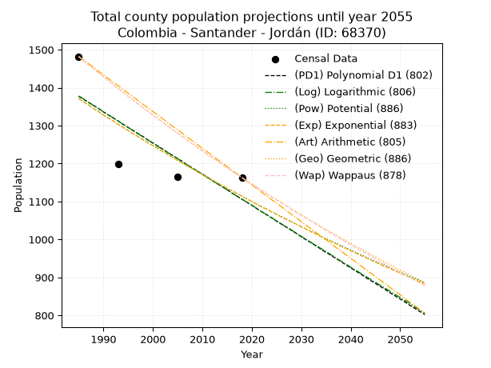
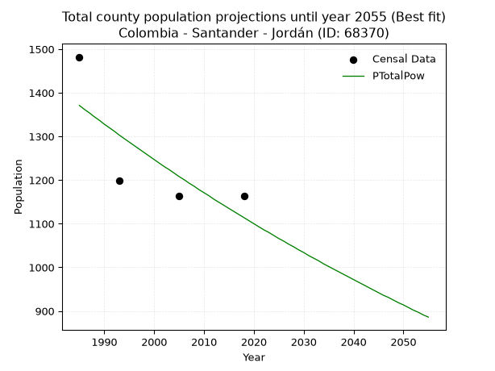
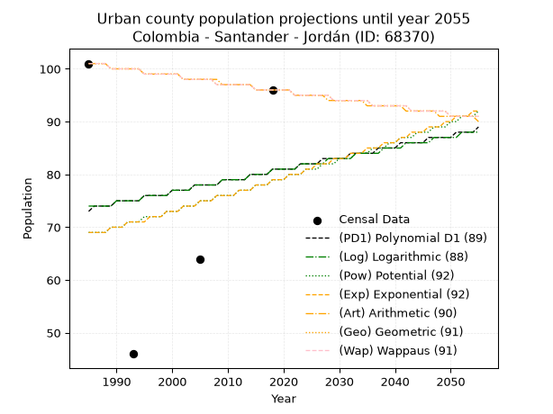
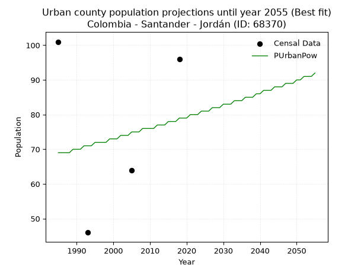
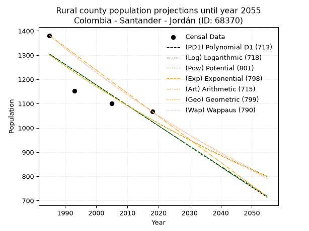
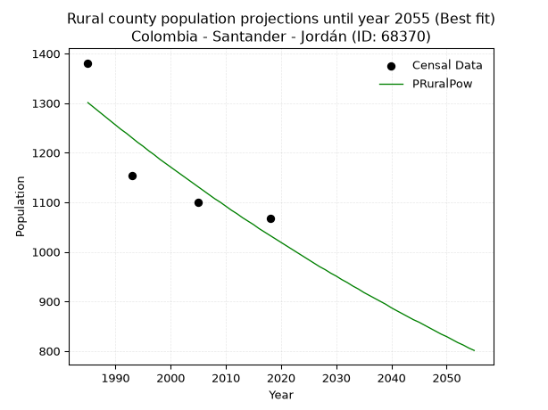

<div align="center">


</div>

# _“Population and Public Services Demand Projections (PPSD) until Year 2050 for Colombia - Santander - Jordán (ID: 68370)”_
Keywords: `population` `public-service` `projection` `lineal` `polynomial` `logarithmic` `potential` `exponential` `arithmetic` `geometric` `wappaus` `dane` `colombia` `south-america`

PPSD are analytical estimates used by governments and planners to anticipate future changes in population size, age distribution, and the resulting community needs for utilities, healthcare, education, and infrastructure as sizing future water treatment facilities, electrical grids, and road networks based on spatial growth.

> **General running parameters**: • app_version: _v20260806_. • Python version: _3.14.7_. • Pandas version: _3.0.5_. • NumPy version: _2.5.1_. • Creates, save and include plots into reports (create_plot): _False_. • Projection until year: _2050_. • Process polynomial degree 2 and up: _False_. • Process Wappaus: _True_. • Process Wappaus: _True_. • Set negative values to zero: _True_. • Set infinite values to zero: _True_. • Drop dataset notes: _True_. 
<div align="center">

Dynamic map: [:earth_americas:Google](http://maps.google.com/maps?q=6.732727094,-73.096053) [:earth_americas:OSM](https://www.openstreetmap.org/#map=18/6.732727094/-73.096053&layers=P) [:earth_americas:Bing](https://www.bing.com/maps?cp=6.732727094~-73.096053&lvl=18) [:earth_americas:Apple](https://maps.apple.com/frame?center=6.732727094%2C-73.096053&span=0.003%2C0.006)

</div>


<div align="center">

```geojson
{
  "type": "Feature",
  "geometry": {
    "type": "Point", 
    "coordinates": [-73.096053, 6.732727094]
  }, 
  "properties": {
    "Name": "Colombia - Santander - Jordán (ID: 68370)"
  }
}
```

</div>


## 0. Census Data (4 records)

Census data are official statistics collected by a government about the people and housing in a country. They usually include counts of total population, age, sex, race, income, education, and jobs.

📅Global census file: [Population.xlsx](../data/Population.xlsx)

| Source   |   Year |   CountryID | CountryName   |   StateID | StateName   |   CountyID | CountyName   |   PTotal |   PUrban |   PRural |
|:---------|-------:|------------:|:--------------|----------:|:------------|-----------:|:-------------|---------:|---------:|---------:|
| DANE     |   1985 |          57 | Colombia      |        68 | Santander   |      68370 | Jordán       |     1482 |      101 |     1381 |
| DANE     |   1993 |          57 | Colombia      |        68 | Santander   |      68370 | Jordán       |     1199 |       46 |     1153 |
| DANE     |   2005 |          57 | Colombia      |        68 | Santander   |      68370 | Jordán       |     1164 |       64 |     1100 |
| DANE     |   2018 |          57 | Colombia      |        68 | Santander   |      68370 | Jordán       |     1163 |       96 |     1067 |

> 🔥Some records could had specific notes about the registered values or the corresponding urban or rural distribution.

📅   [RUPS](https://www.datos.gov.co/Hacienda-y-Cr-dito-P-blico/Registro-nico-de-Prestadores-de-Servicios-P-blicos/4qkq-csdn/about_data) - Local public utility companies: [RUPS.csv](../data/RUPS.xlsx)

 | SERVICIO       | ESTADO    | NOMBRE              | NIT         | DEPARTAMENTO_DOMICILIO   | MUNICIPIO_DOMICILIO   | DIRECCION        |   TELEFONO | EMAIL                               | TIPO_PRESTADOR                 | CLASIFICACION                 |
|:---------------|:----------|:--------------------|:------------|:-------------------------|:----------------------|:-----------------|-----------:|:------------------------------------|:-------------------------------|:------------------------------|
| ACUEDUCTO      | OPERATIVA | MUNICIPIO DE JORDAN | 800124166-9 | SANTANDER                | JORDAN                | PARQUE PRINCIPAL |    7269632 | contactenos@jordan-santander.gov.co | MUNICIPIO (PRESTACIÓN DIRECTA) | MENOR O IGUAL A 2500 USUARIOS |
| ALCANTARILLADO | OPERATIVA | MUNICIPIO DE JORDAN | 800124166-9 | SANTANDER                | JORDAN                | PARQUE PRINCIPAL |    7269632 | contactenos@jordan-santander.gov.co | MUNICIPIO (PRESTACIÓN DIRECTA) | MENOR O IGUAL A 2500 USUARIOS |

## 1. Total

### 1.1. Coefficients and Parameters

* (PD1) Polynomial Deg 1: -8.22320353271778, 17700.46286631874 (lineal)
* (Log) Logarithmic: -16488.079465049563, 126578.02414101837
* (Pow) Potential: -12.599550168483454, 44.6873706407647
* (Exp) Exponential: -0.0062840240412101725, 358274773.55079484
* (Art) Arithmetic: Year diff. 2018 - 1985 = 33, Population diff. 1163 - 1482 = -319, Annual growth = -9.666666666666666
* (Geo) Geometric: Year diff. 2018 - 1985 = 33, Population diff. 1163 - 1482 = -319, Annual growth % = -0.007318231387293039
* (Wap) Wappaus: i = -0.7309388783868935, Condition values only valid for < 200)

<sub>
Wappaus condition values: ['-0.00', '-0.73', '-1.46', '-2.19', '-2.92', '-3.65', '-4.39', '-5.12', '-5.85', '-6.58', '-7.31', '-8.04', '-8.77', '-9.50', '-10.23', '-10.96', '-11.70', '-12.43', '-13.16', '-13.89', '-14.62', '-15.35', '-16.08', '-16.81', '-17.54', '-18.27', '-19.00', '-19.74', '-20.47', '-21.20', '-21.93', '-22.66', '-23.39', '-24.12', '-24.85', '-25.58', '-26.31', '-27.04', '-27.78', '-28.51', '-29.24', '-29.97', '-30.70', '-31.43', '-32.16', '-32.89', '-33.62', '-34.35', '-35.09', '-35.82', '-36.55', '-37.28', '-38.01', '-38.74', '-39.47', '-40.20', '-40.93', '-41.66', '-42.39', '-43.13', '-43.86', '-44.59', '-45.32', '-46.05', '-46.78', '-47.51']
</sub>


### 1.2. Projected Dataset

|   Year |   CountyID |   PTotalPD1 |   PTotalLog |   PTotalPow |   PTotalExp |   PTotalArt |   PTotalGeo |   PTotalWap |
|-------:|-----------:|------------:|------------:|------------:|------------:|------------:|------------:|------------:|
|   1985 |      68370 |        1377 |        1378 |        1371 |        1371 |        1482 |        1482 |        1482 |
|   1986 |      68370 |        1369 |        1370 |        1362 |        1362 |        1472 |        1471 |        1471 |
|   1987 |      68370 |        1361 |        1361 |        1354 |        1354 |        1463 |        1460 |        1460 |
|   1988 |      68370 |        1353 |        1353 |        1345 |        1345 |        1453 |        1450 |        1450 |
|   1989 |      68370 |        1345 |        1345 |        1337 |        1337 |        1443 |        1439 |        1439 |
|   1990 |      68370 |        1336 |        1336 |        1328 |        1328 |        1434 |        1429 |        1429 |
|   1991 |      68370 |        1328 |        1328 |        1320 |        1320 |        1424 |        1418 |        1418 |
|   1992 |      68370 |        1320 |        1320 |        1312 |        1312 |        1414 |        1408 |        1408 |
|   1993 |      68370 |        1312 |        1312 |        1303 |        1303 |        1405 |        1397 |        1398 |
|   1994 |      68370 |        1303 |        1303 |        1295 |        1295 |        1395 |        1387 |        1388 |
|   1995 |      68370 |        1295 |        1295 |        1287 |        1287 |        1385 |        1377 |        1377 |
|   1996 |      68370 |        1287 |        1287 |        1279 |        1279 |        1376 |        1367 |        1367 |
|   1997 |      68370 |        1279 |        1278 |        1271 |        1271 |        1366 |        1357 |        1357 |
|   1998 |      68370 |        1271 |        1270 |        1263 |        1263 |        1356 |        1347 |        1348 |
|   1999 |      68370 |        1262 |        1262 |        1255 |        1255 |        1347 |        1337 |        1338 |
|   2000 |      68370 |        1254 |        1254 |        1247 |        1247 |        1337 |        1327 |        1328 |
|   2001 |      68370 |        1246 |        1245 |        1239 |        1240 |        1327 |        1318 |        1318 |
|   2002 |      68370 |        1238 |        1237 |        1231 |        1232 |        1318 |        1308 |        1309 |
|   2003 |      68370 |        1229 |        1229 |        1224 |        1224 |        1308 |        1298 |        1299 |
|   2004 |      68370 |        1221 |        1221 |        1216 |        1216 |        1298 |        1289 |        1290 |
|   2005 |      68370 |        1213 |        1213 |        1208 |        1209 |        1289 |        1280 |        1280 |
|   2006 |      68370 |        1205 |        1204 |        1201 |        1201 |        1279 |        1270 |        1271 |
|   2007 |      68370 |        1196 |        1196 |        1193 |        1194 |        1269 |        1261 |        1261 |
|   2008 |      68370 |        1188 |        1188 |        1186 |        1186 |        1260 |        1252 |        1252 |
|   2009 |      68370 |        1180 |        1180 |        1178 |        1179 |        1250 |        1242 |        1243 |
|   2010 |      68370 |        1172 |        1172 |        1171 |        1171 |        1240 |        1233 |        1234 |
|   2011 |      68370 |        1164 |        1163 |        1164 |        1164 |        1231 |        1224 |        1225 |
|   2012 |      68370 |        1155 |        1155 |        1156 |        1157 |        1221 |        1215 |        1216 |
|   2013 |      68370 |        1147 |        1147 |        1149 |        1149 |        1211 |        1207 |        1207 |
|   2014 |      68370 |        1139 |        1139 |        1142 |        1142 |        1202 |        1198 |        1198 |
|   2015 |      68370 |        1131 |        1131 |        1135 |        1135 |        1192 |        1189 |        1189 |
|   2016 |      68370 |        1122 |        1122 |        1128 |        1128 |        1182 |        1180 |        1180 |
|   2017 |      68370 |        1114 |        1114 |        1121 |        1121 |        1173 |        1172 |        1172 |
|   2018 |      68370 |        1106 |        1106 |        1114 |        1114 |        1163 |        1163 |        1163 |
|   2019 |      68370 |        1098 |        1098 |        1107 |        1107 |        1153 |        1154 |        1154 |
|   2020 |      68370 |        1090 |        1090 |        1100 |        1100 |        1144 |        1146 |        1146 |
|   2021 |      68370 |        1081 |        1082 |        1093 |        1093 |        1134 |        1138 |        1137 |
|   2022 |      68370 |        1073 |        1073 |        1086 |        1086 |        1124 |        1129 |        1129 |
|   2023 |      68370 |        1065 |        1065 |        1080 |        1079 |        1115 |        1121 |        1121 |
|   2024 |      68370 |        1057 |        1057 |        1073 |        1073 |        1105 |        1113 |        1112 |
|   2025 |      68370 |        1048 |        1049 |        1066 |        1066 |        1095 |        1105 |        1104 |
|   2026 |      68370 |        1040 |        1041 |        1060 |        1059 |        1086 |        1097 |        1096 |
|   2027 |      68370 |        1032 |        1033 |        1053 |        1053 |        1076 |        1089 |        1088 |
|   2028 |      68370 |        1024 |        1025 |        1047 |        1046 |        1066 |        1081 |        1079 |
|   2029 |      68370 |        1016 |        1016 |        1040 |        1040 |        1057 |        1073 |        1071 |
|   2030 |      68370 |        1007 |        1008 |        1034 |        1033 |        1047 |        1065 |        1063 |
|   2031 |      68370 |         999 |        1000 |        1027 |        1027 |        1037 |        1057 |        1055 |
|   2032 |      68370 |         991 |         992 |        1021 |        1020 |        1028 |        1049 |        1048 |
|   2033 |      68370 |         983 |         984 |        1015 |        1014 |        1018 |        1042 |        1040 |
|   2034 |      68370 |         974 |         976 |        1008 |        1007 |        1008 |        1034 |        1032 |
|   2035 |      68370 |         966 |         968 |        1002 |        1001 |         999 |        1026 |        1024 |
|   2036 |      68370 |         958 |         960 |         996 |         995 |         989 |        1019 |        1016 |
|   2037 |      68370 |         950 |         951 |         990 |         989 |         979 |        1012 |        1009 |
|   2038 |      68370 |         942 |         943 |         984 |         982 |         970 |        1004 |        1001 |
|   2039 |      68370 |         933 |         935 |         978 |         976 |         960 |         997 |         993 |
|   2040 |      68370 |         925 |         927 |         972 |         970 |         950 |         989 |         986 |
|   2041 |      68370 |         917 |         919 |         966 |         964 |         941 |         982 |         978 |
|   2042 |      68370 |         909 |         911 |         960 |         958 |         931 |         975 |         971 |
|   2043 |      68370 |         900 |         903 |         954 |         952 |         921 |         968 |         964 |
|   2044 |      68370 |         892 |         895 |         948 |         946 |         912 |         961 |         956 |
|   2045 |      68370 |         884 |         887 |         942 |         940 |         902 |         954 |         949 |
|   2046 |      68370 |         876 |         879 |         936 |         934 |         892 |         947 |         942 |
|   2047 |      68370 |         868 |         871 |         931 |         928 |         883 |         940 |         934 |
|   2048 |      68370 |         859 |         863 |         925 |         923 |         873 |         933 |         927 |
|   2049 |      68370 |         851 |         855 |         919 |         917 |         863 |         926 |         920 |
|   2050 |      68370 |         843 |         847 |         914 |         911 |         854 |         919 |         913 |
<div align="center">

</img>

</div>


### 1.3. Best fit with absolute and relative error (%)

Relative error puts that difference into context by dividing the absolute error by the true value, creating a unitless ratio or percentage that shows the scale of the mistake.

Absolute and relative error

|   Year | Source   |   CountryID | CountryName   |   StateID | StateName   |   CountyID_x | CountyName   |   PTotal |   PUrban |   PRural |   CountyID_y |   PTotalPD1 |   PTotalLog |   PTotalPow |   PTotalExp |   PTotalArt |   PTotalGeo |   PTotalWap |   PTotalPD1AbsError |   PTotalLogAbsError |   PTotalPowAbsError |   PTotalExpAbsError |   PTotalArtAbsError |   PTotalGeoAbsError |   PTotalWapAbsError |   PTotalPD1RelError |   PTotalLogRelError |   PTotalPowRelError |   PTotalExpRelError |   PTotalArtRelError |   PTotalGeoRelError |   PTotalWapRelError |
|-------:|:---------|------------:|:--------------|----------:|:------------|-------------:|:-------------|---------:|---------:|---------:|-------------:|------------:|------------:|------------:|------------:|------------:|------------:|------------:|--------------------:|--------------------:|--------------------:|--------------------:|--------------------:|--------------------:|--------------------:|--------------------:|--------------------:|--------------------:|--------------------:|--------------------:|--------------------:|--------------------:|
|   1985 | DANE     |          57 | Colombia      |        68 | Santander   |        68370 | Jordán       |     1482 |      101 |     1381 |        68370 |        1377 |        1378 |        1371 |        1371 |        1482 |        1482 |        1482 |                 105 |                 104 |                 111 |                 111 |                   0 |                   0 |                   0 |             7.08502 |             7.01754 |             7.48988 |             7.48988 |              0      |             0       |             0       |
|   1993 | DANE     |          57 | Colombia      |        68 | Santander   |        68370 | Jordán       |     1199 |       46 |     1153 |        68370 |        1312 |        1312 |        1303 |        1303 |        1405 |        1397 |        1398 |                 113 |                 113 |                 104 |                 104 |                 206 |                 198 |                 199 |             9.42452 |             9.42452 |             8.67389 |             8.67389 |             17.181  |            16.5138  |            16.5972  |
|   2005 | DANE     |          57 | Colombia      |        68 | Santander   |        68370 | Jordán       |     1164 |       64 |     1100 |        68370 |        1213 |        1213 |        1208 |        1209 |        1289 |        1280 |        1280 |                  49 |                  49 |                  44 |                  45 |                 125 |                 116 |                 116 |             4.20962 |             4.20962 |             3.78007 |             3.86598 |             10.7388 |             9.96564 |             9.96564 |
|   2018 | DANE     |          57 | Colombia      |        68 | Santander   |        68370 | Jordán       |     1163 |       96 |     1067 |        68370 |        1106 |        1106 |        1114 |        1114 |        1163 |        1163 |        1163 |                  57 |                  57 |                  49 |                  49 |                   0 |                   0 |                   0 |             4.90112 |             4.90112 |             4.21324 |             4.21324 |              0      |             0       |             0       |

Relative error mean

| Method    |   RelError | Best   |
|:----------|-----------:|:-------|
| PTotalPD1 |    6.40507 |        |
| PTotalLog |    6.3882  |        |
| PTotalPow |    6.03927 | True   |
| PTotalExp |    6.06075 |        |
| PTotalArt |    6.97995 |        |
| PTotalGeo |    6.61985 |        |
| PTotalWap |    6.6407  |        |

💙Best method: _**PTotalPow**_
<div align="center">

</img>

</div>


### 1.4. Fresh water supply demand in liters per capita per day (lpcd)

The fresh water supply demand typically ranges from 100 to 300 liters per capita per day (lpcd) for standard domestic and municipal planning, though absolute survival minimums set by the World Health Organization are as low as 7.5 to 20 liters per day, and total consumption in high-income nations can exceed 400 liters.

> `CZ`: Level in meters above the sea level (masl)<br> `WS`: Fresh water supply demand in liters per capita per day (lpcd or l/h/d)<br> `WSAll`: Zonal fresh water supply demand in liters per second (l/s)<br> `A`: Zonal area in square meters<br> `DP`: Population density (people/hectare or p/ha)

Reference values (RAS Colombia)

|    CZ |   WS |
|------:|-----:|
|  1000 |  120 |
|  2000 |  130 |
| 99999 |  140 |

County shapefile geometry properties and water supply values

|   CountyID |     ATotal |   CZTotal |   WSTotal |
|-----------:|-----------:|----------:|----------:|
|      68370 | 3.9824e+07 |    969.97 |       120 |

Projected values for best method: PTotalPow

|   CountyID |   Year |   PTotalPow |   DPTotal |   WSTotal |   WSTotalAll |
|-----------:|-------:|------------:|----------:|----------:|-------------:|
|      68370 |   1985 |        1371 |      0.34 |       120 |      1.90417 |
|      68370 |   1986 |        1362 |      0.34 |       120 |      1.89167 |
|      68370 |   1987 |        1354 |      0.34 |       120 |      1.88056 |
|      68370 |   1988 |        1345 |      0.34 |       120 |      1.86806 |
|      68370 |   1989 |        1337 |      0.34 |       120 |      1.85694 |
|      68370 |   1990 |        1328 |      0.33 |       120 |      1.84444 |
|      68370 |   1991 |        1320 |      0.33 |       120 |      1.83333 |
|      68370 |   1992 |        1312 |      0.33 |       120 |      1.82222 |
|      68370 |   1993 |        1303 |      0.33 |       120 |      1.80972 |
|      68370 |   1994 |        1295 |      0.33 |       120 |      1.79861 |
|      68370 |   1995 |        1287 |      0.32 |       120 |      1.7875  |
|      68370 |   1996 |        1279 |      0.32 |       120 |      1.77639 |
|      68370 |   1997 |        1271 |      0.32 |       120 |      1.76528 |
|      68370 |   1998 |        1263 |      0.32 |       120 |      1.75417 |
|      68370 |   1999 |        1255 |      0.32 |       120 |      1.74306 |
|      68370 |   2000 |        1247 |      0.31 |       120 |      1.73194 |
|      68370 |   2001 |        1239 |      0.31 |       120 |      1.72083 |
|      68370 |   2002 |        1231 |      0.31 |       120 |      1.70972 |
|      68370 |   2003 |        1224 |      0.31 |       120 |      1.7     |
|      68370 |   2004 |        1216 |      0.31 |       120 |      1.68889 |
|      68370 |   2005 |        1208 |      0.3  |       120 |      1.67778 |
|      68370 |   2006 |        1201 |      0.3  |       120 |      1.66806 |
|      68370 |   2007 |        1193 |      0.3  |       120 |      1.65694 |
|      68370 |   2008 |        1186 |      0.3  |       120 |      1.64722 |
|      68370 |   2009 |        1178 |      0.3  |       120 |      1.63611 |
|      68370 |   2010 |        1171 |      0.29 |       120 |      1.62639 |
|      68370 |   2011 |        1164 |      0.29 |       120 |      1.61667 |
|      68370 |   2012 |        1156 |      0.29 |       120 |      1.60556 |
|      68370 |   2013 |        1149 |      0.29 |       120 |      1.59583 |
|      68370 |   2014 |        1142 |      0.29 |       120 |      1.58611 |
|      68370 |   2015 |        1135 |      0.29 |       120 |      1.57639 |
|      68370 |   2016 |        1128 |      0.28 |       120 |      1.56667 |
|      68370 |   2017 |        1121 |      0.28 |       120 |      1.55694 |
|      68370 |   2018 |        1114 |      0.28 |       120 |      1.54722 |
|      68370 |   2019 |        1107 |      0.28 |       120 |      1.5375  |
|      68370 |   2020 |        1100 |      0.28 |       120 |      1.52778 |
|      68370 |   2021 |        1093 |      0.27 |       120 |      1.51806 |
|      68370 |   2022 |        1086 |      0.27 |       120 |      1.50833 |
|      68370 |   2023 |        1080 |      0.27 |       120 |      1.5     |
|      68370 |   2024 |        1073 |      0.27 |       120 |      1.49028 |
|      68370 |   2025 |        1066 |      0.27 |       120 |      1.48056 |
|      68370 |   2026 |        1060 |      0.27 |       120 |      1.47222 |
|      68370 |   2027 |        1053 |      0.26 |       120 |      1.4625  |
|      68370 |   2028 |        1047 |      0.26 |       120 |      1.45417 |
|      68370 |   2029 |        1040 |      0.26 |       120 |      1.44444 |
|      68370 |   2030 |        1034 |      0.26 |       120 |      1.43611 |
|      68370 |   2031 |        1027 |      0.26 |       120 |      1.42639 |
|      68370 |   2032 |        1021 |      0.26 |       120 |      1.41806 |
|      68370 |   2033 |        1015 |      0.25 |       120 |      1.40972 |
|      68370 |   2034 |        1008 |      0.25 |       120 |      1.4     |
|      68370 |   2035 |        1002 |      0.25 |       120 |      1.39167 |
|      68370 |   2036 |         996 |      0.25 |       120 |      1.38333 |
|      68370 |   2037 |         990 |      0.25 |       120 |      1.375   |
|      68370 |   2038 |         984 |      0.25 |       120 |      1.36667 |
|      68370 |   2039 |         978 |      0.25 |       120 |      1.35833 |
|      68370 |   2040 |         972 |      0.24 |       120 |      1.35    |
|      68370 |   2041 |         966 |      0.24 |       120 |      1.34167 |
|      68370 |   2042 |         960 |      0.24 |       120 |      1.33333 |
|      68370 |   2043 |         954 |      0.24 |       120 |      1.325   |
|      68370 |   2044 |         948 |      0.24 |       120 |      1.31667 |
|      68370 |   2045 |         942 |      0.24 |       120 |      1.30833 |
|      68370 |   2046 |         936 |      0.24 |       120 |      1.3     |
|      68370 |   2047 |         931 |      0.23 |       120 |      1.29306 |
|      68370 |   2048 |         925 |      0.23 |       120 |      1.28472 |
|      68370 |   2049 |         919 |      0.23 |       120 |      1.27639 |
|      68370 |   2050 |         914 |      0.23 |       120 |      1.26944 |

## 2. Urban

### 2.1. Coefficients and Parameters

* (PD1) Polynomial Deg 1: 0.2155760738658968, -354.45604175026017 (lineal)
* (Log) Logarithmic: 423.9282305483337, -3145.531877545522
* (Pow) Potential: 8.363395118726457, -25.74431893996283
* (Exp) Exponential: 0.004229043818767095, 0.01549254092625969
* (Art) Arithmetic: Year diff. 2018 - 1985 = 33, Population diff. 96 - 101 = -5, Annual growth = -0.15151515151515152
* (Geo) Geometric: Year diff. 2018 - 1985 = 33, Population diff. 96 - 101 = -5, Annual growth % = -0.001537372344884269
* (Wap) Wappaus: i = -0.15382248884786956, Condition values only valid for < 200)

<sub>
Wappaus condition values: ['-0.00', '-0.15', '-0.31', '-0.46', '-0.62', '-0.77', '-0.92', '-1.08', '-1.23', '-1.38', '-1.54', '-1.69', '-1.85', '-2.00', '-2.15', '-2.31', '-2.46', '-2.61', '-2.77', '-2.92', '-3.08', '-3.23', '-3.38', '-3.54', '-3.69', '-3.85', '-4.00', '-4.15', '-4.31', '-4.46', '-4.61', '-4.77', '-4.92', '-5.08', '-5.23', '-5.38', '-5.54', '-5.69', '-5.85', '-6.00', '-6.15', '-6.31', '-6.46', '-6.61', '-6.77', '-6.92', '-7.08', '-7.23', '-7.38', '-7.54', '-7.69', '-7.84', '-8.00', '-8.15', '-8.31', '-8.46', '-8.61', '-8.77', '-8.92', '-9.08', '-9.23', '-9.38', '-9.54', '-9.69', '-9.84', '-10.00']
</sub>


### 2.2. Projected Dataset

|   Year |   CountyID |   PUrbanPD1 |   PUrbanLog |   PUrbanPow |   PUrbanExp |   PUrbanArt |   PUrbanGeo |   PUrbanWap |
|-------:|-----------:|------------:|------------:|------------:|------------:|------------:|------------:|------------:|
|   1985 |      68370 |          73 |          74 |          69 |          69 |         101 |         101 |         101 |
|   1986 |      68370 |          74 |          74 |          69 |          69 |         101 |         101 |         101 |
|   1987 |      68370 |          74 |          74 |          69 |          69 |         101 |         101 |         101 |
|   1988 |      68370 |          74 |          74 |          69 |          69 |         101 |         101 |         101 |
|   1989 |      68370 |          74 |          74 |          70 |          70 |         100 |         100 |         100 |
|   1990 |      68370 |          75 |          75 |          70 |          70 |         100 |         100 |         100 |
|   1991 |      68370 |          75 |          75 |          70 |          70 |         100 |         100 |         100 |
|   1992 |      68370 |          75 |          75 |          71 |          71 |         100 |         100 |         100 |
|   1993 |      68370 |          75 |          75 |          71 |          71 |         100 |         100 |         100 |
|   1994 |      68370 |          75 |          75 |          71 |          71 |         100 |         100 |         100 |
|   1995 |      68370 |          76 |          76 |          72 |          71 |          99 |          99 |          99 |
|   1996 |      68370 |          76 |          76 |          72 |          72 |          99 |          99 |          99 |
|   1997 |      68370 |          76 |          76 |          72 |          72 |          99 |          99 |          99 |
|   1998 |      68370 |          76 |          76 |          72 |          72 |          99 |          99 |          99 |
|   1999 |      68370 |          76 |          76 |          73 |          73 |          99 |          99 |          99 |
|   2000 |      68370 |          77 |          77 |          73 |          73 |          99 |          99 |          99 |
|   2001 |      68370 |          77 |          77 |          73 |          73 |          99 |          99 |          99 |
|   2002 |      68370 |          77 |          77 |          74 |          74 |          98 |          98 |          98 |
|   2003 |      68370 |          77 |          77 |          74 |          74 |          98 |          98 |          98 |
|   2004 |      68370 |          78 |          78 |          74 |          74 |          98 |          98 |          98 |
|   2005 |      68370 |          78 |          78 |          75 |          75 |          98 |          98 |          98 |
|   2006 |      68370 |          78 |          78 |          75 |          75 |          98 |          98 |          98 |
|   2007 |      68370 |          78 |          78 |          75 |          75 |          98 |          98 |          98 |
|   2008 |      68370 |          78 |          78 |          76 |          76 |          98 |          97 |          97 |
|   2009 |      68370 |          79 |          79 |          76 |          76 |          97 |          97 |          97 |
|   2010 |      68370 |          79 |          79 |          76 |          76 |          97 |          97 |          97 |
|   2011 |      68370 |          79 |          79 |          76 |          76 |          97 |          97 |          97 |
|   2012 |      68370 |          79 |          79 |          77 |          77 |          97 |          97 |          97 |
|   2013 |      68370 |          79 |          79 |          77 |          77 |          97 |          97 |          97 |
|   2014 |      68370 |          80 |          80 |          77 |          77 |          97 |          97 |          97 |
|   2015 |      68370 |          80 |          80 |          78 |          78 |          96 |          96 |          96 |
|   2016 |      68370 |          80 |          80 |          78 |          78 |          96 |          96 |          96 |
|   2017 |      68370 |          80 |          80 |          78 |          78 |          96 |          96 |          96 |
|   2018 |      68370 |          81 |          81 |          79 |          79 |          96 |          96 |          96 |
|   2019 |      68370 |          81 |          81 |          79 |          79 |          96 |          96 |          96 |
|   2020 |      68370 |          81 |          81 |          79 |          79 |          96 |          96 |          96 |
|   2021 |      68370 |          81 |          81 |          80 |          80 |          96 |          96 |          96 |
|   2022 |      68370 |          81 |          81 |          80 |          80 |          95 |          95 |          95 |
|   2023 |      68370 |          82 |          82 |          80 |          80 |          95 |          95 |          95 |
|   2024 |      68370 |          82 |          82 |          81 |          81 |          95 |          95 |          95 |
|   2025 |      68370 |          82 |          82 |          81 |          81 |          95 |          95 |          95 |
|   2026 |      68370 |          82 |          82 |          81 |          82 |          95 |          95 |          95 |
|   2027 |      68370 |          83 |          82 |          82 |          82 |          95 |          95 |          95 |
|   2028 |      68370 |          83 |          83 |          82 |          82 |          94 |          95 |          95 |
|   2029 |      68370 |          83 |          83 |          82 |          83 |          94 |          94 |          94 |
|   2030 |      68370 |          83 |          83 |          83 |          83 |          94 |          94 |          94 |
|   2031 |      68370 |          83 |          83 |          83 |          83 |          94 |          94 |          94 |
|   2032 |      68370 |          84 |          83 |          83 |          84 |          94 |          94 |          94 |
|   2033 |      68370 |          84 |          84 |          84 |          84 |          94 |          94 |          94 |
|   2034 |      68370 |          84 |          84 |          84 |          84 |          94 |          94 |          94 |
|   2035 |      68370 |          84 |          84 |          84 |          85 |          93 |          94 |          94 |
|   2036 |      68370 |          84 |          84 |          85 |          85 |          93 |          93 |          93 |
|   2037 |      68370 |          85 |          84 |          85 |          85 |          93 |          93 |          93 |
|   2038 |      68370 |          85 |          85 |          85 |          86 |          93 |          93 |          93 |
|   2039 |      68370 |          85 |          85 |          86 |          86 |          93 |          93 |          93 |
|   2040 |      68370 |          85 |          85 |          86 |          86 |          93 |          93 |          93 |
|   2041 |      68370 |          86 |          85 |          87 |          87 |          93 |          93 |          93 |
|   2042 |      68370 |          86 |          86 |          87 |          87 |          92 |          93 |          93 |
|   2043 |      68370 |          86 |          86 |          87 |          88 |          92 |          92 |          92 |
|   2044 |      68370 |          86 |          86 |          88 |          88 |          92 |          92 |          92 |
|   2045 |      68370 |          86 |          86 |          88 |          88 |          92 |          92 |          92 |
|   2046 |      68370 |          87 |          86 |          88 |          89 |          92 |          92 |          92 |
|   2047 |      68370 |          87 |          87 |          89 |          89 |          92 |          92 |          92 |
|   2048 |      68370 |          87 |          87 |          89 |          89 |          91 |          92 |          92 |
|   2049 |      68370 |          87 |          87 |          89 |          90 |          91 |          92 |          92 |
|   2050 |      68370 |          87 |          87 |          90 |          90 |          91 |          91 |          91 |
<div align="center">

</img>

</div>


### 2.3. Best fit with absolute and relative error (%)

Relative error puts that difference into context by dividing the absolute error by the true value, creating a unitless ratio or percentage that shows the scale of the mistake.

Absolute and relative error

|   Year | Source   |   CountryID | CountryName   |   StateID | StateName   |   CountyID_x | CountyName   |   PTotal |   PUrban |   PRural |   CountyID_y |   PUrbanPD1 |   PUrbanLog |   PUrbanPow |   PUrbanExp |   PUrbanArt |   PUrbanGeo |   PUrbanWap |   PUrbanPD1AbsError |   PUrbanLogAbsError |   PUrbanPowAbsError |   PUrbanExpAbsError |   PUrbanArtAbsError |   PUrbanGeoAbsError |   PUrbanWapAbsError |   PUrbanPD1RelError |   PUrbanLogRelError |   PUrbanPowRelError |   PUrbanExpRelError |   PUrbanArtRelError |   PUrbanGeoRelError |   PUrbanWapRelError |
|-------:|:---------|------------:|:--------------|----------:|:------------|-------------:|:-------------|---------:|---------:|---------:|-------------:|------------:|------------:|------------:|------------:|------------:|------------:|------------:|--------------------:|--------------------:|--------------------:|--------------------:|--------------------:|--------------------:|--------------------:|--------------------:|--------------------:|--------------------:|--------------------:|--------------------:|--------------------:|--------------------:|
|   1985 | DANE     |          57 | Colombia      |        68 | Santander   |        68370 | Jordán       |     1482 |      101 |     1381 |        68370 |          73 |          74 |          69 |          69 |         101 |         101 |         101 |                  28 |                  27 |                  32 |                  32 |                   0 |                   0 |                   0 |             27.7228 |             26.7327 |             31.6832 |             31.6832 |               0     |               0     |               0     |
|   1993 | DANE     |          57 | Colombia      |        68 | Santander   |        68370 | Jordán       |     1199 |       46 |     1153 |        68370 |          75 |          75 |          71 |          71 |         100 |         100 |         100 |                  29 |                  29 |                  25 |                  25 |                  54 |                  54 |                  54 |             63.0435 |             63.0435 |             54.3478 |             54.3478 |             117.391 |             117.391 |             117.391 |
|   2005 | DANE     |          57 | Colombia      |        68 | Santander   |        68370 | Jordán       |     1164 |       64 |     1100 |        68370 |          78 |          78 |          75 |          75 |          98 |          98 |          98 |                  14 |                  14 |                  11 |                  11 |                  34 |                  34 |                  34 |             21.875  |             21.875  |             17.1875 |             17.1875 |              53.125 |              53.125 |              53.125 |
|   2018 | DANE     |          57 | Colombia      |        68 | Santander   |        68370 | Jordán       |     1163 |       96 |     1067 |        68370 |          81 |          81 |          79 |          79 |          96 |          96 |          96 |                  15 |                  15 |                  17 |                  17 |                   0 |                   0 |                   0 |             15.625  |             15.625  |             17.7083 |             17.7083 |               0     |               0     |               0     |

Relative error mean

| Method    |   RelError | Best   |
|:----------|-----------:|:-------|
| PUrbanPD1 |    32.0666 |        |
| PUrbanLog |    31.819  |        |
| PUrbanPow |    30.2317 | True   |
| PUrbanExp |    30.2317 | True   |
| PUrbanArt |    42.6291 |        |
| PUrbanGeo |    42.6291 |        |
| PUrbanWap |    42.6291 |        |

💙Best method: _**PUrbanPow**_
<div align="center">

</img>

</div>


### 2.4. Fresh water supply demand in liters per capita per day (lpcd)

The fresh water supply demand typically ranges from 100 to 300 liters per capita per day (lpcd) for standard domestic and municipal planning, though absolute survival minimums set by the World Health Organization are as low as 7.5 to 20 liters per day, and total consumption in high-income nations can exceed 400 liters.

> `CZ`: Level in meters above the sea level (masl)<br> `WS`: Fresh water supply demand in liters per capita per day (lpcd or l/h/d)<br> `WSAll`: Zonal fresh water supply demand in liters per second (l/s)<br> `A`: Zonal area in square meters<br> `DP`: Population density (people/hectare or p/ha)

Reference values (RAS Colombia)

|    CZ |   WS |
|------:|-----:|
|  1000 |  120 |
|  2000 |  130 |
| 99999 |  140 |

County shapefile geometry properties and water supply values

|   CountyID |   AUrban |   CZUrban |   WSUrban |
|-----------:|---------:|----------:|----------:|
|      68370 |  47643.9 |   442.766 |       120 |

Projected values for best method: PUrbanPow

|   CountyID |   Year |   PUrbanPow |   DPUrban |   WSUrban |   WSUrbanAll |
|-----------:|-------:|------------:|----------:|----------:|-------------:|
|      68370 |   1985 |          69 |     14.48 |       120 |    0.0958333 |
|      68370 |   1986 |          69 |     14.48 |       120 |    0.0958333 |
|      68370 |   1987 |          69 |     14.48 |       120 |    0.0958333 |
|      68370 |   1988 |          69 |     14.48 |       120 |    0.0958333 |
|      68370 |   1989 |          70 |     14.69 |       120 |    0.0972222 |
|      68370 |   1990 |          70 |     14.69 |       120 |    0.0972222 |
|      68370 |   1991 |          70 |     14.69 |       120 |    0.0972222 |
|      68370 |   1992 |          71 |     14.9  |       120 |    0.0986111 |
|      68370 |   1993 |          71 |     14.9  |       120 |    0.0986111 |
|      68370 |   1994 |          71 |     14.9  |       120 |    0.0986111 |
|      68370 |   1995 |          72 |     15.11 |       120 |    0.1       |
|      68370 |   1996 |          72 |     15.11 |       120 |    0.1       |
|      68370 |   1997 |          72 |     15.11 |       120 |    0.1       |
|      68370 |   1998 |          72 |     15.11 |       120 |    0.1       |
|      68370 |   1999 |          73 |     15.32 |       120 |    0.101389  |
|      68370 |   2000 |          73 |     15.32 |       120 |    0.101389  |
|      68370 |   2001 |          73 |     15.32 |       120 |    0.101389  |
|      68370 |   2002 |          74 |     15.53 |       120 |    0.102778  |
|      68370 |   2003 |          74 |     15.53 |       120 |    0.102778  |
|      68370 |   2004 |          74 |     15.53 |       120 |    0.102778  |
|      68370 |   2005 |          75 |     15.74 |       120 |    0.104167  |
|      68370 |   2006 |          75 |     15.74 |       120 |    0.104167  |
|      68370 |   2007 |          75 |     15.74 |       120 |    0.104167  |
|      68370 |   2008 |          76 |     15.95 |       120 |    0.105556  |
|      68370 |   2009 |          76 |     15.95 |       120 |    0.105556  |
|      68370 |   2010 |          76 |     15.95 |       120 |    0.105556  |
|      68370 |   2011 |          76 |     15.95 |       120 |    0.105556  |
|      68370 |   2012 |          77 |     16.16 |       120 |    0.106944  |
|      68370 |   2013 |          77 |     16.16 |       120 |    0.106944  |
|      68370 |   2014 |          77 |     16.16 |       120 |    0.106944  |
|      68370 |   2015 |          78 |     16.37 |       120 |    0.108333  |
|      68370 |   2016 |          78 |     16.37 |       120 |    0.108333  |
|      68370 |   2017 |          78 |     16.37 |       120 |    0.108333  |
|      68370 |   2018 |          79 |     16.58 |       120 |    0.109722  |
|      68370 |   2019 |          79 |     16.58 |       120 |    0.109722  |
|      68370 |   2020 |          79 |     16.58 |       120 |    0.109722  |
|      68370 |   2021 |          80 |     16.79 |       120 |    0.111111  |
|      68370 |   2022 |          80 |     16.79 |       120 |    0.111111  |
|      68370 |   2023 |          80 |     16.79 |       120 |    0.111111  |
|      68370 |   2024 |          81 |     17    |       120 |    0.1125    |
|      68370 |   2025 |          81 |     17    |       120 |    0.1125    |
|      68370 |   2026 |          81 |     17    |       120 |    0.1125    |
|      68370 |   2027 |          82 |     17.21 |       120 |    0.113889  |
|      68370 |   2028 |          82 |     17.21 |       120 |    0.113889  |
|      68370 |   2029 |          82 |     17.21 |       120 |    0.113889  |
|      68370 |   2030 |          83 |     17.42 |       120 |    0.115278  |
|      68370 |   2031 |          83 |     17.42 |       120 |    0.115278  |
|      68370 |   2032 |          83 |     17.42 |       120 |    0.115278  |
|      68370 |   2033 |          84 |     17.63 |       120 |    0.116667  |
|      68370 |   2034 |          84 |     17.63 |       120 |    0.116667  |
|      68370 |   2035 |          84 |     17.63 |       120 |    0.116667  |
|      68370 |   2036 |          85 |     17.84 |       120 |    0.118056  |
|      68370 |   2037 |          85 |     17.84 |       120 |    0.118056  |
|      68370 |   2038 |          85 |     17.84 |       120 |    0.118056  |
|      68370 |   2039 |          86 |     18.05 |       120 |    0.119444  |
|      68370 |   2040 |          86 |     18.05 |       120 |    0.119444  |
|      68370 |   2041 |          87 |     18.26 |       120 |    0.120833  |
|      68370 |   2042 |          87 |     18.26 |       120 |    0.120833  |
|      68370 |   2043 |          87 |     18.26 |       120 |    0.120833  |
|      68370 |   2044 |          88 |     18.47 |       120 |    0.122222  |
|      68370 |   2045 |          88 |     18.47 |       120 |    0.122222  |
|      68370 |   2046 |          88 |     18.47 |       120 |    0.122222  |
|      68370 |   2047 |          89 |     18.68 |       120 |    0.123611  |
|      68370 |   2048 |          89 |     18.68 |       120 |    0.123611  |
|      68370 |   2049 |          89 |     18.68 |       120 |    0.123611  |
|      68370 |   2050 |          90 |     18.89 |       120 |    0.125     |

## 3. Rural

### 3.1. Coefficients and Parameters

* (PD1) Polynomial Deg 1: -8.438779606583674, 18054.918908068994 (lineal)
* (Log) Logarithmic: -16912.007695597917, 129723.55601856406
* (Pow) Potential: -14.00153820530233, 49.28803447526863
* (Exp) Exponential: -0.0069870003558419195, 1372413640.0300646
* (Art) Arithmetic: Year diff. 2018 - 1985 = 33, Population diff. 1067 - 1381 = -314, Annual growth = -9.515151515151516
* (Geo) Geometric: Year diff. 2018 - 1985 = 33, Population diff. 1067 - 1381 = -314, Annual growth % = -0.007786403498785011
* (Wap) Wappaus: i = -0.7773816597346009, Condition values only valid for < 200)

<sub>
Wappaus condition values: ['-0.00', '-0.78', '-1.55', '-2.33', '-3.11', '-3.89', '-4.66', '-5.44', '-6.22', '-7.00', '-7.77', '-8.55', '-9.33', '-10.11', '-10.88', '-11.66', '-12.44', '-13.22', '-13.99', '-14.77', '-15.55', '-16.33', '-17.10', '-17.88', '-18.66', '-19.43', '-20.21', '-20.99', '-21.77', '-22.54', '-23.32', '-24.10', '-24.88', '-25.65', '-26.43', '-27.21', '-27.99', '-28.76', '-29.54', '-30.32', '-31.10', '-31.87', '-32.65', '-33.43', '-34.20', '-34.98', '-35.76', '-36.54', '-37.31', '-38.09', '-38.87', '-39.65', '-40.42', '-41.20', '-41.98', '-42.76', '-43.53', '-44.31', '-45.09', '-45.87', '-46.64', '-47.42', '-48.20', '-48.98', '-49.75', '-50.53']
</sub>


### 3.2. Projected Dataset

|   Year |   CountyID |   PRuralPD1 |   PRuralLog |   PRuralPow |   PRuralExp |   PRuralArt |   PRuralGeo |   PRuralWap |
|-------:|-----------:|------------:|------------:|------------:|------------:|------------:|------------:|------------:|
|   1985 |      68370 |        1304 |        1304 |        1301 |        1301 |        1381 |        1381 |        1381 |
|   1986 |      68370 |        1296 |        1296 |        1292 |        1292 |        1371 |        1370 |        1370 |
|   1987 |      68370 |        1287 |        1287 |        1283 |        1283 |        1362 |        1360 |        1360 |
|   1988 |      68370 |        1279 |        1279 |        1274 |        1274 |        1352 |        1349 |        1349 |
|   1989 |      68370 |        1270 |        1270 |        1265 |        1265 |        1343 |        1338 |        1339 |
|   1990 |      68370 |        1262 |        1262 |        1256 |        1256 |        1333 |        1328 |        1328 |
|   1991 |      68370 |        1253 |        1253 |        1247 |        1247 |        1324 |        1318 |        1318 |
|   1992 |      68370 |        1245 |        1245 |        1239 |        1239 |        1314 |        1307 |        1308 |
|   1993 |      68370 |        1236 |        1236 |        1230 |        1230 |        1305 |        1297 |        1298 |
|   1994 |      68370 |        1228 |        1228 |        1221 |        1221 |        1295 |        1287 |        1288 |
|   1995 |      68370 |        1220 |        1219 |        1213 |        1213 |        1286 |        1277 |        1278 |
|   1996 |      68370 |        1211 |        1211 |        1204 |        1204 |        1276 |        1267 |        1268 |
|   1997 |      68370 |        1203 |        1202 |        1196 |        1196 |        1267 |        1257 |        1258 |
|   1998 |      68370 |        1194 |        1194 |        1187 |        1188 |        1257 |        1248 |        1248 |
|   1999 |      68370 |        1186 |        1185 |        1179 |        1179 |        1248 |        1238 |        1238 |
|   2000 |      68370 |        1177 |        1177 |        1171 |        1171 |        1238 |        1228 |        1229 |
|   2001 |      68370 |        1169 |        1169 |        1163 |        1163 |        1229 |        1219 |        1219 |
|   2002 |      68370 |        1160 |        1160 |        1155 |        1155 |        1219 |        1209 |        1210 |
|   2003 |      68370 |        1152 |        1152 |        1147 |        1147 |        1210 |        1200 |        1200 |
|   2004 |      68370 |        1144 |        1143 |        1139 |        1139 |        1200 |        1190 |        1191 |
|   2005 |      68370 |        1135 |        1135 |        1131 |        1131 |        1191 |        1181 |        1182 |
|   2006 |      68370 |        1127 |        1126 |        1123 |        1123 |        1181 |        1172 |        1173 |
|   2007 |      68370 |        1118 |        1118 |        1115 |        1115 |        1172 |        1163 |        1163 |
|   2008 |      68370 |        1110 |        1110 |        1107 |        1108 |        1162 |        1154 |        1154 |
|   2009 |      68370 |        1101 |        1101 |        1100 |        1100 |        1153 |        1145 |        1145 |
|   2010 |      68370 |        1093 |        1093 |        1092 |        1092 |        1143 |        1136 |        1136 |
|   2011 |      68370 |        1085 |        1084 |        1084 |        1085 |        1134 |        1127 |        1127 |
|   2012 |      68370 |        1076 |        1076 |        1077 |        1077 |        1124 |        1118 |        1119 |
|   2013 |      68370 |        1068 |        1067 |        1069 |        1070 |        1115 |        1110 |        1110 |
|   2014 |      68370 |        1059 |        1059 |        1062 |        1062 |        1105 |        1101 |        1101 |
|   2015 |      68370 |        1051 |        1051 |        1055 |        1055 |        1096 |        1092 |        1093 |
|   2016 |      68370 |        1042 |        1042 |        1047 |        1047 |        1086 |        1084 |        1084 |
|   2017 |      68370 |        1034 |        1034 |        1040 |        1040 |        1077 |        1075 |        1075 |
|   2018 |      68370 |        1025 |        1026 |        1033 |        1033 |        1067 |        1067 |        1067 |
|   2019 |      68370 |        1017 |        1017 |        1026 |        1026 |        1057 |        1059 |        1059 |
|   2020 |      68370 |        1009 |        1009 |        1019 |        1019 |        1048 |        1050 |        1050 |
|   2021 |      68370 |        1000 |        1000 |        1012 |        1011 |        1038 |        1042 |        1042 |
|   2022 |      68370 |         992 |         992 |        1005 |        1004 |        1029 |        1034 |        1034 |
|   2023 |      68370 |         983 |         984 |         998 |         997 |        1019 |        1026 |        1026 |
|   2024 |      68370 |         975 |         975 |         991 |         990 |        1010 |        1018 |        1017 |
|   2025 |      68370 |         966 |         967 |         984 |         984 |        1000 |        1010 |        1009 |
|   2026 |      68370 |         958 |         959 |         977 |         977 |         991 |        1002 |        1001 |
|   2027 |      68370 |         950 |         950 |         970 |         970 |         981 |         995 |         993 |
|   2028 |      68370 |         941 |         942 |         964 |         963 |         972 |         987 |         985 |
|   2029 |      68370 |         933 |         934 |         957 |         956 |         962 |         979 |         978 |
|   2030 |      68370 |         924 |         925 |         951 |         950 |         953 |         971 |         970 |
|   2031 |      68370 |         916 |         917 |         944 |         943 |         943 |         964 |         962 |
|   2032 |      68370 |         907 |         909 |         938 |         937 |         934 |         956 |         954 |
|   2033 |      68370 |         899 |         900 |         931 |         930 |         924 |         949 |         947 |
|   2034 |      68370 |         890 |         892 |         925 |         924 |         915 |         942 |         939 |
|   2035 |      68370 |         882 |         884 |         918 |         917 |         905 |         934 |         932 |
|   2036 |      68370 |         874 |         875 |         912 |         911 |         896 |         927 |         924 |
|   2037 |      68370 |         865 |         867 |         906 |         904 |         886 |         920 |         917 |
|   2038 |      68370 |         857 |         859 |         900 |         898 |         877 |         913 |         909 |
|   2039 |      68370 |         848 |         850 |         894 |         892 |         867 |         905 |         902 |
|   2040 |      68370 |         840 |         842 |         887 |         886 |         858 |         898 |         895 |
|   2041 |      68370 |         831 |         834 |         881 |         880 |         848 |         891 |         887 |
|   2042 |      68370 |         823 |         826 |         875 |         873 |         839 |         884 |         880 |
|   2043 |      68370 |         814 |         817 |         869 |         867 |         829 |         878 |         873 |
|   2044 |      68370 |         806 |         809 |         863 |         861 |         820 |         871 |         866 |
|   2045 |      68370 |         798 |         801 |         858 |         855 |         810 |         864 |         859 |
|   2046 |      68370 |         789 |         792 |         852 |         849 |         801 |         857 |         852 |
|   2047 |      68370 |         781 |         784 |         846 |         843 |         791 |         851 |         845 |
|   2048 |      68370 |         772 |         776 |         840 |         838 |         782 |         844 |         838 |
|   2049 |      68370 |         764 |         768 |         834 |         832 |         772 |         837 |         831 |
|   2050 |      68370 |         755 |         759 |         829 |         826 |         763 |         831 |         824 |
<div align="center">

</img>

</div>


### 3.3. Best fit with absolute and relative error (%)

Relative error puts that difference into context by dividing the absolute error by the true value, creating a unitless ratio or percentage that shows the scale of the mistake.

Absolute and relative error

|   Year | Source   |   CountryID | CountryName   |   StateID | StateName   |   CountyID_x | CountyName   |   PTotal |   PUrban |   PRural |   CountyID_y |   PRuralPD1 |   PRuralLog |   PRuralPow |   PRuralExp |   PRuralArt |   PRuralGeo |   PRuralWap |   PRuralPD1AbsError |   PRuralLogAbsError |   PRuralPowAbsError |   PRuralExpAbsError |   PRuralArtAbsError |   PRuralGeoAbsError |   PRuralWapAbsError |   PRuralPD1RelError |   PRuralLogRelError |   PRuralPowRelError |   PRuralExpRelError |   PRuralArtRelError |   PRuralGeoRelError |   PRuralWapRelError |
|-------:|:---------|------------:|:--------------|----------:|:------------|-------------:|:-------------|---------:|---------:|---------:|-------------:|------------:|------------:|------------:|------------:|------------:|------------:|------------:|--------------------:|--------------------:|--------------------:|--------------------:|--------------------:|--------------------:|--------------------:|--------------------:|--------------------:|--------------------:|--------------------:|--------------------:|--------------------:|--------------------:|
|   1985 | DANE     |          57 | Colombia      |        68 | Santander   |        68370 | Jordán       |     1482 |      101 |     1381 |        68370 |        1304 |        1304 |        1301 |        1301 |        1381 |        1381 |        1381 |                  77 |                  77 |                  80 |                  80 |                   0 |                   0 |                   0 |             5.57567 |             5.57567 |             5.7929  |             5.7929  |             0       |             0       |             0       |
|   1993 | DANE     |          57 | Colombia      |        68 | Santander   |        68370 | Jordán       |     1199 |       46 |     1153 |        68370 |        1236 |        1236 |        1230 |        1230 |        1305 |        1297 |        1298 |                  83 |                  83 |                  77 |                  77 |                 152 |                 144 |                 145 |             7.19861 |             7.19861 |             6.67823 |             6.67823 |            13.183   |            12.4892  |            12.5759  |
|   2005 | DANE     |          57 | Colombia      |        68 | Santander   |        68370 | Jordán       |     1164 |       64 |     1100 |        68370 |        1135 |        1135 |        1131 |        1131 |        1191 |        1181 |        1182 |                  35 |                  35 |                  31 |                  31 |                  91 |                  81 |                  82 |             3.18182 |             3.18182 |             2.81818 |             2.81818 |             8.27273 |             7.36364 |             7.45455 |
|   2018 | DANE     |          57 | Colombia      |        68 | Santander   |        68370 | Jordán       |     1163 |       96 |     1067 |        68370 |        1025 |        1026 |        1033 |        1033 |        1067 |        1067 |        1067 |                  42 |                  41 |                  34 |                  34 |                   0 |                   0 |                   0 |             3.93627 |             3.84255 |             3.1865  |             3.1865  |             0       |             0       |             0       |

Relative error mean

| Method    |   RelError | Best   |
|:----------|-----------:|:-------|
| PRuralPD1 |    4.97309 |        |
| PRuralLog |    4.94966 |        |
| PRuralPow |    4.61896 | True   |
| PRuralExp |    4.61896 | True   |
| PRuralArt |    5.36393 |        |
| PRuralGeo |    4.9632  |        |
| PRuralWap |    5.00761 |        |

💙Best method: _**PRuralPow**_
<div align="center">

</img>

</div>


### 3.4. Fresh water supply demand in liters per capita per day (lpcd)

The fresh water supply demand typically ranges from 100 to 300 liters per capita per day (lpcd) for standard domestic and municipal planning, though absolute survival minimums set by the World Health Organization are as low as 7.5 to 20 liters per day, and total consumption in high-income nations can exceed 400 liters.

> `CZ`: Level in meters above the sea level (masl)<br> `WS`: Fresh water supply demand in liters per capita per day (lpcd or l/h/d)<br> `WSAll`: Zonal fresh water supply demand in liters per second (l/s)<br> `A`: Zonal area in square meters<br> `DP`: Population density (people/hectare or p/ha)

Reference values (RAS Colombia)

|    CZ |   WS |
|------:|-----:|
|  1000 |  120 |
|  2000 |  130 |
| 99999 |  140 |

County shapefile geometry properties and water supply values

|   CountyID |      ARural |   CZRural |   WSRural |
|-----------:|------------:|----------:|----------:|
|      68370 | 3.97763e+07 |   970.644 |       120 |

Projected values for best method: PRuralPow

|   CountyID |   Year |   PRuralPow |   DPRural |   WSRural |   WSRuralAll |
|-----------:|-------:|------------:|----------:|----------:|-------------:|
|      68370 |   1985 |        1301 |      0.33 |       120 |      1.80694 |
|      68370 |   1986 |        1292 |      0.32 |       120 |      1.79444 |
|      68370 |   1987 |        1283 |      0.32 |       120 |      1.78194 |
|      68370 |   1988 |        1274 |      0.32 |       120 |      1.76944 |
|      68370 |   1989 |        1265 |      0.32 |       120 |      1.75694 |
|      68370 |   1990 |        1256 |      0.32 |       120 |      1.74444 |
|      68370 |   1991 |        1247 |      0.31 |       120 |      1.73194 |
|      68370 |   1992 |        1239 |      0.31 |       120 |      1.72083 |
|      68370 |   1993 |        1230 |      0.31 |       120 |      1.70833 |
|      68370 |   1994 |        1221 |      0.31 |       120 |      1.69583 |
|      68370 |   1995 |        1213 |      0.3  |       120 |      1.68472 |
|      68370 |   1996 |        1204 |      0.3  |       120 |      1.67222 |
|      68370 |   1997 |        1196 |      0.3  |       120 |      1.66111 |
|      68370 |   1998 |        1187 |      0.3  |       120 |      1.64861 |
|      68370 |   1999 |        1179 |      0.3  |       120 |      1.6375  |
|      68370 |   2000 |        1171 |      0.29 |       120 |      1.62639 |
|      68370 |   2001 |        1163 |      0.29 |       120 |      1.61528 |
|      68370 |   2002 |        1155 |      0.29 |       120 |      1.60417 |
|      68370 |   2003 |        1147 |      0.29 |       120 |      1.59306 |
|      68370 |   2004 |        1139 |      0.29 |       120 |      1.58194 |
|      68370 |   2005 |        1131 |      0.28 |       120 |      1.57083 |
|      68370 |   2006 |        1123 |      0.28 |       120 |      1.55972 |
|      68370 |   2007 |        1115 |      0.28 |       120 |      1.54861 |
|      68370 |   2008 |        1107 |      0.28 |       120 |      1.5375  |
|      68370 |   2009 |        1100 |      0.28 |       120 |      1.52778 |
|      68370 |   2010 |        1092 |      0.27 |       120 |      1.51667 |
|      68370 |   2011 |        1084 |      0.27 |       120 |      1.50556 |
|      68370 |   2012 |        1077 |      0.27 |       120 |      1.49583 |
|      68370 |   2013 |        1069 |      0.27 |       120 |      1.48472 |
|      68370 |   2014 |        1062 |      0.27 |       120 |      1.475   |
|      68370 |   2015 |        1055 |      0.27 |       120 |      1.46528 |
|      68370 |   2016 |        1047 |      0.26 |       120 |      1.45417 |
|      68370 |   2017 |        1040 |      0.26 |       120 |      1.44444 |
|      68370 |   2018 |        1033 |      0.26 |       120 |      1.43472 |
|      68370 |   2019 |        1026 |      0.26 |       120 |      1.425   |
|      68370 |   2020 |        1019 |      0.26 |       120 |      1.41528 |
|      68370 |   2021 |        1012 |      0.25 |       120 |      1.40556 |
|      68370 |   2022 |        1005 |      0.25 |       120 |      1.39583 |
|      68370 |   2023 |         998 |      0.25 |       120 |      1.38611 |
|      68370 |   2024 |         991 |      0.25 |       120 |      1.37639 |
|      68370 |   2025 |         984 |      0.25 |       120 |      1.36667 |
|      68370 |   2026 |         977 |      0.25 |       120 |      1.35694 |
|      68370 |   2027 |         970 |      0.24 |       120 |      1.34722 |
|      68370 |   2028 |         964 |      0.24 |       120 |      1.33889 |
|      68370 |   2029 |         957 |      0.24 |       120 |      1.32917 |
|      68370 |   2030 |         951 |      0.24 |       120 |      1.32083 |
|      68370 |   2031 |         944 |      0.24 |       120 |      1.31111 |
|      68370 |   2032 |         938 |      0.24 |       120 |      1.30278 |
|      68370 |   2033 |         931 |      0.23 |       120 |      1.29306 |
|      68370 |   2034 |         925 |      0.23 |       120 |      1.28472 |
|      68370 |   2035 |         918 |      0.23 |       120 |      1.275   |
|      68370 |   2036 |         912 |      0.23 |       120 |      1.26667 |
|      68370 |   2037 |         906 |      0.23 |       120 |      1.25833 |
|      68370 |   2038 |         900 |      0.23 |       120 |      1.25    |
|      68370 |   2039 |         894 |      0.22 |       120 |      1.24167 |
|      68370 |   2040 |         887 |      0.22 |       120 |      1.23194 |
|      68370 |   2041 |         881 |      0.22 |       120 |      1.22361 |
|      68370 |   2042 |         875 |      0.22 |       120 |      1.21528 |
|      68370 |   2043 |         869 |      0.22 |       120 |      1.20694 |
|      68370 |   2044 |         863 |      0.22 |       120 |      1.19861 |
|      68370 |   2045 |         858 |      0.22 |       120 |      1.19167 |
|      68370 |   2046 |         852 |      0.21 |       120 |      1.18333 |
|      68370 |   2047 |         846 |      0.21 |       120 |      1.175   |
|      68370 |   2048 |         840 |      0.21 |       120 |      1.16667 |
|      68370 |   2049 |         834 |      0.21 |       120 |      1.15833 |
|      68370 |   2050 |         829 |      0.21 |       120 |      1.15139 |

<div align="center"><br><sub>Share this research</sub></div><br>

<sub>**APPS & TOOLS & CONTENT DISCLAIMER**: • NO WARRANTY - This content and software is provided by <a href="https://github.com/rcfdtools" target="_blank">github.com/rcfdtools</a> "as is", without any express or implied warranty, including warranties of merchantability, fitness for a particular purpose, or non-infringement. There is no guarantee that the software will be error-free or operate without interruption. • LIMITATION OF LIABILITY - Neither the authors nor copyright holders will be liable for claims or damages arising from the software or its use. You are responsible for determining if the software is appropriate for your use and assume all associated risks, including errors, legal compliance, and data loss. • NO PROFESSIONAL ADVICE - The software provides general information and does not offer professional advice. It should not replace consultation with professional advisors. [Clauses and global license for rcfdtools use.](https://github.com/rcfdtools/rcfdtools/blob/main/LICENSE.md)</sub>

| [:house: Home](Readme.md)  | [:beginner: Help / Collab](https://github.com/rcfdtools/R.HydroTools/discussions/31) |
|----------------------------|-------------------------------------------------------------------------------------------|