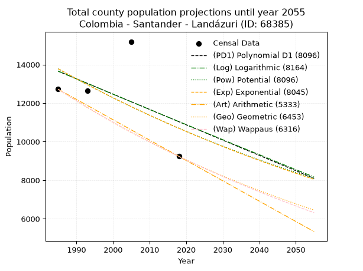
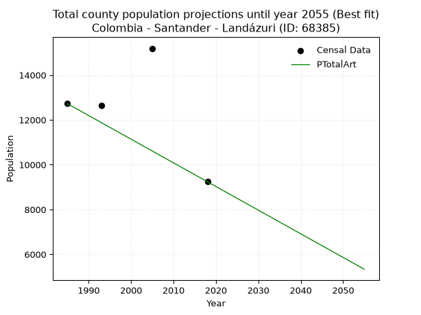
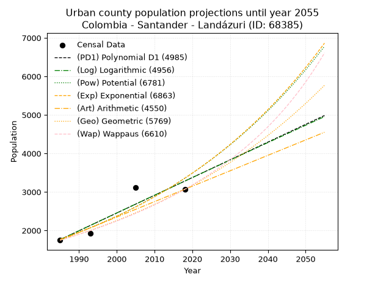
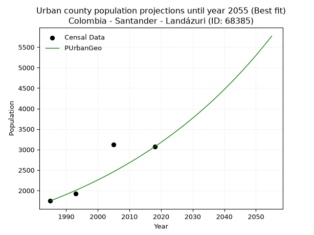
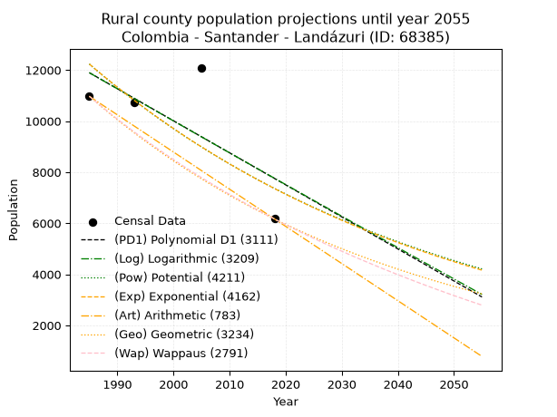
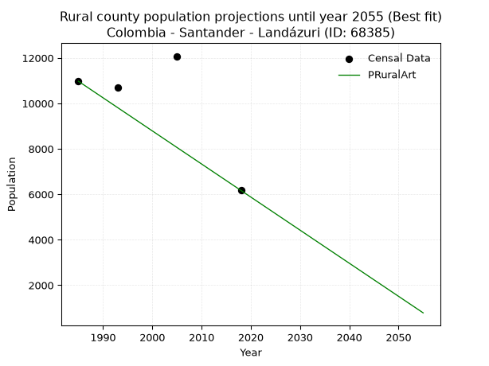

<div align="center">


</div>

# _“Population and Public Services Demand Projections (PPSD) until Year 2050 for Colombia - Santander - Landázuri (ID: 68385)”_
Keywords: `population` `public-service` `projection` `lineal` `polynomial` `logarithmic` `potential` `exponential` `arithmetic` `geometric` `wappaus` `dane` `colombia` `south-america`

PPSD are analytical estimates used by governments and planners to anticipate future changes in population size, age distribution, and the resulting community needs for utilities, healthcare, education, and infrastructure as sizing future water treatment facilities, electrical grids, and road networks based on spatial growth.

> **General running parameters**: • app_version: _v20260806_. • Python version: _3.14.7_. • Pandas version: _3.0.5_. • NumPy version: _2.5.1_. • Creates, save and include plots into reports (create_plot): _False_. • Projection until year: _2050_. • Process polynomial degree 2 and up: _False_. • Process Wappaus: _True_. • Process Wappaus: _True_. • Set negative values to zero: _True_. • Set infinite values to zero: _True_. • Drop dataset notes: _True_. 
<div align="center">

Dynamic map: [:earth_americas:Google](http://maps.google.com/maps?q=6.218812481,-73.8113588) [:earth_americas:OSM](https://www.openstreetmap.org/#map=18/6.218812481/-73.8113588&layers=P) [:earth_americas:Bing](https://www.bing.com/maps?cp=6.218812481~-73.8113588&lvl=18) [:earth_americas:Apple](https://maps.apple.com/frame?center=6.218812481%2C-73.8113588&span=0.003%2C0.006)

</div>


<div align="center">

```geojson
{
  "type": "Feature",
  "geometry": {
    "type": "Point", 
    "coordinates": [-73.8113588, 6.218812481]
  }, 
  "properties": {
    "Name": "Colombia - Santander - Landázuri (ID: 68385)"
  }
}
```

</div>


## 0. Census Data (4 records)

Census data are official statistics collected by a government about the people and housing in a country. They usually include counts of total population, age, sex, race, income, education, and jobs.

📅Global census file: [Population.xlsx](../data/Population.xlsx)

| Source   |   Year |   CountryID | CountryName   |   StateID | StateName   |   CountyID | CountyName   |   PTotal |   PUrban |   PRural |
|:---------|-------:|------------:|:--------------|----------:|:------------|-----------:|:-------------|---------:|---------:|---------:|
| DANE     |   1985 |          57 | Colombia      |        68 | Santander   |      68385 | Landázuri    |    12721 |     1748 |    10973 |
| DANE     |   1993 |          57 | Colombia      |        68 | Santander   |      68385 | Landázuri    |    12640 |     1926 |    10714 |
| DANE     |   2005 |          57 | Colombia      |        68 | Santander   |      68385 | Landázuri    |    15192 |     3117 |    12075 |
| DANE     |   2018 |          57 | Colombia      |        68 | Santander   |      68385 | Landázuri    |     9238 |     3069 |     6169 |

> 🔥Some records could had specific notes about the registered values or the corresponding urban or rural distribution.

## 1. Total

### 1.1. Coefficients and Parameters

* (PD1) Polynomial Deg 1: -79.48414291448859, 171435.9068647058 (lineal)
* (Log) Logarithmic: -158507.93598956466, 1217267.8416595634
* (Pow) Potential: -15.344990125498425, 54.74334143385681
* (Exp) Exponential: -0.007690451611872019, 58754574571.25181
* (Art) Arithmetic: Year diff. 2018 - 1985 = 33, Population diff. 9238 - 12721 = -3483, Annual growth = -105.54545454545455
* (Geo) Geometric: Year diff. 2018 - 1985 = 33, Population diff. 9238 - 12721 = -3483, Annual growth % = -0.009647967705575966
* (Wap) Wappaus: i = -0.9612956377380987, Condition values only valid for < 200)

<sub>
Wappaus condition values: ['-0.00', '-0.96', '-1.92', '-2.88', '-3.85', '-4.81', '-5.77', '-6.73', '-7.69', '-8.65', '-9.61', '-10.57', '-11.54', '-12.50', '-13.46', '-14.42', '-15.38', '-16.34', '-17.30', '-18.26', '-19.23', '-20.19', '-21.15', '-22.11', '-23.07', '-24.03', '-24.99', '-25.95', '-26.92', '-27.88', '-28.84', '-29.80', '-30.76', '-31.72', '-32.68', '-33.65', '-34.61', '-35.57', '-36.53', '-37.49', '-38.45', '-39.41', '-40.37', '-41.34', '-42.30', '-43.26', '-44.22', '-45.18', '-46.14', '-47.10', '-48.06', '-49.03', '-49.99', '-50.95', '-51.91', '-52.87', '-53.83', '-54.79', '-55.76', '-56.72', '-57.68', '-58.64', '-59.60', '-60.56', '-61.52', '-62.48']
</sub>


### 1.2. Projected Dataset

|   Year |   CountyID |   PTotalPD1 |   PTotalLog |   PTotalPow |   PTotalExp |   PTotalArt |   PTotalGeo |   PTotalWap |
|-------:|-----------:|------------:|------------:|------------:|------------:|------------:|------------:|------------:|
|   1985 |      68385 |       13660 |       13658 |       13780 |       13782 |       12721 |       12721 |       12721 |
|   1986 |      68385 |       13580 |       13578 |       13674 |       13676 |       12615 |       12598 |       12599 |
|   1987 |      68385 |       13501 |       13498 |       13568 |       13571 |       12510 |       12477 |       12479 |
|   1988 |      68385 |       13421 |       13418 |       13464 |       13467 |       12404 |       12356 |       12359 |
|   1989 |      68385 |       13342 |       13339 |       13361 |       13364 |       12299 |       12237 |       12241 |
|   1990 |      68385 |       13262 |       13259 |       13258 |       13262 |       12193 |       12119 |       12124 |
|   1991 |      68385 |       13183 |       13179 |       13156 |       13160 |       12088 |       12002 |       12008 |
|   1992 |      68385 |       13103 |       13100 |       13055 |       13059 |       11982 |       11886 |       11893 |
|   1993 |      68385 |       13024 |       13020 |       12955 |       12959 |       11877 |       11772 |       11779 |
|   1994 |      68385 |       12945 |       12941 |       12856 |       12860 |       11771 |       11658 |       11666 |
|   1995 |      68385 |       12865 |       12861 |       12757 |       12761 |       11666 |       11546 |       11554 |
|   1996 |      68385 |       12786 |       12782 |       12659 |       12664 |       11560 |       11434 |       11443 |
|   1997 |      68385 |       12706 |       12702 |       12562 |       12567 |       11454 |       11324 |       11334 |
|   1998 |      68385 |       12627 |       12623 |       12466 |       12470 |       11349 |       11215 |       11225 |
|   1999 |      68385 |       12547 |       12544 |       12371 |       12375 |       11243 |       11106 |       11117 |
|   2000 |      68385 |       12468 |       12464 |       12276 |       12280 |       11138 |       10999 |       11010 |
|   2001 |      68385 |       12388 |       12385 |       12183 |       12186 |       11032 |       10893 |       10904 |
|   2002 |      68385 |       12309 |       12306 |       12089 |       12093 |       10927 |       10788 |       10799 |
|   2003 |      68385 |       12229 |       12227 |       11997 |       12000 |       10821 |       10684 |       10695 |
|   2004 |      68385 |       12150 |       12148 |       11906 |       11908 |       10716 |       10581 |       10592 |
|   2005 |      68385 |       12070 |       12069 |       11815 |       11817 |       10610 |       10479 |       10490 |
|   2006 |      68385 |       11991 |       11990 |       11725 |       11726 |       10505 |       10378 |       10388 |
|   2007 |      68385 |       11911 |       11911 |       11635 |       11636 |       10399 |       10278 |       10288 |
|   2008 |      68385 |       11832 |       11832 |       11547 |       11547 |       10293 |       10178 |       10188 |
|   2009 |      68385 |       11752 |       11753 |       11459 |       11459 |       10188 |       10080 |       10090 |
|   2010 |      68385 |       11673 |       11674 |       11372 |       11371 |       10082 |        9983 |        9992 |
|   2011 |      68385 |       11593 |       11595 |       11285 |       11284 |        9977 |        9887 |        9895 |
|   2012 |      68385 |       11514 |       11516 |       11200 |       11198 |        9871 |        9791 |        9799 |
|   2013 |      68385 |       11434 |       11438 |       11115 |       11112 |        9766 |        9697 |        9703 |
|   2014 |      68385 |       11355 |       11359 |       11030 |       11027 |        9660 |        9603 |        9609 |
|   2015 |      68385 |       11275 |       11280 |       10946 |       10942 |        9555 |        9511 |        9515 |
|   2016 |      68385 |       11196 |       11201 |       10863 |       10858 |        9449 |        9419 |        9422 |
|   2017 |      68385 |       11116 |       11123 |       10781 |       10775 |        9344 |        9328 |        9329 |
|   2018 |      68385 |       11037 |       11044 |       10699 |       10693 |        9238 |        9238 |        9238 |
|   2019 |      68385 |       10957 |       10966 |       10618 |       10611 |        9132 |        9149 |        9147 |
|   2020 |      68385 |       10878 |       10887 |       10538 |       10529 |        9027 |        9061 |        9057 |
|   2021 |      68385 |       10798 |       10809 |       10458 |       10449 |        8921 |        8973 |        8968 |
|   2022 |      68385 |       10719 |       10730 |       10379 |       10369 |        8816 |        8887 |        8880 |
|   2023 |      68385 |       10639 |       10652 |       10301 |       10289 |        8710 |        8801 |        8792 |
|   2024 |      68385 |       10560 |       10574 |       10223 |       10210 |        8605 |        8716 |        8705 |
|   2025 |      68385 |       10481 |       10495 |       10146 |       10132 |        8499 |        8632 |        8618 |
|   2026 |      68385 |       10401 |       10417 |       10069 |       10055 |        8394 |        8549 |        8533 |
|   2027 |      68385 |       10322 |       10339 |        9993 |        9978 |        8288 |        8466 |        8448 |
|   2028 |      68385 |       10242 |       10261 |        9918 |        9901 |        8183 |        8384 |        8363 |
|   2029 |      68385 |       10163 |       10183 |        9843 |        9825 |        8077 |        8304 |        8280 |
|   2030 |      68385 |       10083 |       10105 |        9769 |        9750 |        7971 |        8223 |        8197 |
|   2031 |      68385 |       10004 |       10026 |        9695 |        9675 |        7866 |        8144 |        8114 |
|   2032 |      68385 |        9924 |        9948 |        9622 |        9601 |        7760 |        8066 |        8033 |
|   2033 |      68385 |        9845 |        9870 |        9550 |        9528 |        7655 |        7988 |        7952 |
|   2034 |      68385 |        9765 |        9792 |        9478 |        9455 |        7549 |        7911 |        7871 |
|   2035 |      68385 |        9686 |        9715 |        9407 |        9382 |        7444 |        7834 |        7791 |
|   2036 |      68385 |        9606 |        9637 |        9336 |        9310 |        7338 |        7759 |        7712 |
|   2037 |      68385 |        9527 |        9559 |        9266 |        9239 |        7233 |        7684 |        7634 |
|   2038 |      68385 |        9447 |        9481 |        9197 |        9168 |        7127 |        7610 |        7556 |
|   2039 |      68385 |        9368 |        9403 |        9128 |        9098 |        7022 |        7536 |        7478 |
|   2040 |      68385 |        9288 |        9326 |        9059 |        9028 |        6916 |        7464 |        7401 |
|   2041 |      68385 |        9209 |        9248 |        8992 |        8959 |        6810 |        7392 |        7325 |
|   2042 |      68385 |        9129 |        9170 |        8924 |        8890 |        6705 |        7320 |        7250 |
|   2043 |      68385 |        9050 |        9093 |        8857 |        8822 |        6599 |        7250 |        7175 |
|   2044 |      68385 |        8970 |        9015 |        8791 |        8755 |        6494 |        7180 |        7100 |
|   2045 |      68385 |        8891 |        8938 |        8725 |        8688 |        6388 |        7110 |        7026 |
|   2046 |      68385 |        8811 |        8860 |        8660 |        8621 |        6283 |        7042 |        6953 |
|   2047 |      68385 |        8732 |        8783 |        8595 |        8555 |        6177 |        6974 |        6880 |
|   2048 |      68385 |        8652 |        8705 |        8531 |        8490 |        6072 |        6907 |        6808 |
|   2049 |      68385 |        8573 |        8628 |        8468 |        8425 |        5966 |        6840 |        6736 |
|   2050 |      68385 |        8493 |        8551 |        8404 |        8360 |        5861 |        6774 |        6665 |
<div align="center">

</img>

</div>


### 1.3. Best fit with absolute and relative error (%)

Relative error puts that difference into context by dividing the absolute error by the true value, creating a unitless ratio or percentage that shows the scale of the mistake.

Absolute and relative error

|   Year | Source   |   CountryID | CountryName   |   StateID | StateName   |   CountyID_x | CountyName   |   PTotal |   PUrban |   PRural |   CountyID_y |   PTotalPD1 |   PTotalLog |   PTotalPow |   PTotalExp |   PTotalArt |   PTotalGeo |   PTotalWap |   PTotalPD1AbsError |   PTotalLogAbsError |   PTotalPowAbsError |   PTotalExpAbsError |   PTotalArtAbsError |   PTotalGeoAbsError |   PTotalWapAbsError |   PTotalPD1RelError |   PTotalLogRelError |   PTotalPowRelError |   PTotalExpRelError |   PTotalArtRelError |   PTotalGeoRelError |   PTotalWapRelError |
|-------:|:---------|------------:|:--------------|----------:|:------------|-------------:|:-------------|---------:|---------:|---------:|-------------:|------------:|------------:|------------:|------------:|------------:|------------:|------------:|--------------------:|--------------------:|--------------------:|--------------------:|--------------------:|--------------------:|--------------------:|--------------------:|--------------------:|--------------------:|--------------------:|--------------------:|--------------------:|--------------------:|
|   1985 | DANE     |          57 | Colombia      |        68 | Santander   |        68385 | Landázuri    |    12721 |     1748 |    10973 |        68385 |       13660 |       13658 |       13780 |       13782 |       12721 |       12721 |       12721 |                 939 |                 937 |                1059 |                1061 |                   0 |                   0 |                   0 |             7.3815  |             7.36577 |             8.32482 |             8.34054 |             0       |             0       |             0       |
|   1993 | DANE     |          57 | Colombia      |        68 | Santander   |        68385 | Landázuri    |    12640 |     1926 |    10714 |        68385 |       13024 |       13020 |       12955 |       12959 |       11877 |       11772 |       11779 |                 384 |                 380 |                 315 |                 319 |                 763 |                 868 |                 861 |             3.03797 |             3.00633 |             2.49209 |             2.52373 |             6.03639 |             6.86709 |             6.81171 |
|   2005 | DANE     |          57 | Colombia      |        68 | Santander   |        68385 | Landázuri    |    15192 |     3117 |    12075 |        68385 |       12070 |       12069 |       11815 |       11817 |       10610 |       10479 |       10490 |                3122 |                3123 |                3377 |                3375 |                4582 |                4713 |                4702 |            20.5503  |            20.5569  |            22.2288  |            22.2156  |            30.1606  |            31.0229  |            30.9505  |
|   2018 | DANE     |          57 | Colombia      |        68 | Santander   |        68385 | Landázuri    |     9238 |     3069 |     6169 |        68385 |       11037 |       11044 |       10699 |       10693 |        9238 |        9238 |        9238 |                1799 |                1806 |                1461 |                1455 |                   0 |                   0 |                   0 |            19.4739  |            19.5497  |            15.8151  |            15.7502  |             0       |             0       |             0       |

Relative error mean

| Method    |   RelError | Best   |
|:----------|-----------:|:-------|
| PTotalPD1 |   12.6109  |        |
| PTotalLog |   12.6197  |        |
| PTotalPow |   12.2152  |        |
| PTotalExp |   12.2075  |        |
| PTotalArt |    9.04925 | True   |
| PTotalGeo |    9.4725  |        |
| PTotalWap |    9.44055 |        |

💙Best method: _**PTotalArt**_
<div align="center">

</img>

</div>


### 1.4. Fresh water supply demand in liters per capita per day (lpcd)

The fresh water supply demand typically ranges from 100 to 300 liters per capita per day (lpcd) for standard domestic and municipal planning, though absolute survival minimums set by the World Health Organization are as low as 7.5 to 20 liters per day, and total consumption in high-income nations can exceed 400 liters.

> `CZ`: Level in meters above the sea level (masl).<br> `WS`: Fresh water supply demand in liters per capita per day (lpcd or l/h/d).<br> `WSAll`: Zonal fresh water supply demand in liters per second (l/s).<br> `A`: Zonal area in square meters.

Reference values (RAS Colombia)

|    CZ |   WS |
|------:|-----:|
|  1000 |  120 |
|  2000 |  130 |
| 99999 |  140 |

County shapefile geometry properties and water supply values

|   CountyID |      ATotal |   CZTotal |   WSTotal |
|-----------:|------------:|----------:|----------:|
|      68385 | 5.89375e+08 |   721.981 |       120 |

Projected values for best method: PTotalArt

|   CountyID |   Year |   PTotalArt |   WSTotal |   WSTotalAll |
|-----------:|-------:|------------:|----------:|-------------:|
|      68385 |   1985 |       12721 |       120 |     17.6681  |
|      68385 |   1986 |       12615 |       120 |     17.5208  |
|      68385 |   1987 |       12510 |       120 |     17.375   |
|      68385 |   1988 |       12404 |       120 |     17.2278  |
|      68385 |   1989 |       12299 |       120 |     17.0819  |
|      68385 |   1990 |       12193 |       120 |     16.9347  |
|      68385 |   1991 |       12088 |       120 |     16.7889  |
|      68385 |   1992 |       11982 |       120 |     16.6417  |
|      68385 |   1993 |       11877 |       120 |     16.4958  |
|      68385 |   1994 |       11771 |       120 |     16.3486  |
|      68385 |   1995 |       11666 |       120 |     16.2028  |
|      68385 |   1996 |       11560 |       120 |     16.0556  |
|      68385 |   1997 |       11454 |       120 |     15.9083  |
|      68385 |   1998 |       11349 |       120 |     15.7625  |
|      68385 |   1999 |       11243 |       120 |     15.6153  |
|      68385 |   2000 |       11138 |       120 |     15.4694  |
|      68385 |   2001 |       11032 |       120 |     15.3222  |
|      68385 |   2002 |       10927 |       120 |     15.1764  |
|      68385 |   2003 |       10821 |       120 |     15.0292  |
|      68385 |   2004 |       10716 |       120 |     14.8833  |
|      68385 |   2005 |       10610 |       120 |     14.7361  |
|      68385 |   2006 |       10505 |       120 |     14.5903  |
|      68385 |   2007 |       10399 |       120 |     14.4431  |
|      68385 |   2008 |       10293 |       120 |     14.2958  |
|      68385 |   2009 |       10188 |       120 |     14.15    |
|      68385 |   2010 |       10082 |       120 |     14.0028  |
|      68385 |   2011 |        9977 |       120 |     13.8569  |
|      68385 |   2012 |        9871 |       120 |     13.7097  |
|      68385 |   2013 |        9766 |       120 |     13.5639  |
|      68385 |   2014 |        9660 |       120 |     13.4167  |
|      68385 |   2015 |        9555 |       120 |     13.2708  |
|      68385 |   2016 |        9449 |       120 |     13.1236  |
|      68385 |   2017 |        9344 |       120 |     12.9778  |
|      68385 |   2018 |        9238 |       120 |     12.8306  |
|      68385 |   2019 |        9132 |       120 |     12.6833  |
|      68385 |   2020 |        9027 |       120 |     12.5375  |
|      68385 |   2021 |        8921 |       120 |     12.3903  |
|      68385 |   2022 |        8816 |       120 |     12.2444  |
|      68385 |   2023 |        8710 |       120 |     12.0972  |
|      68385 |   2024 |        8605 |       120 |     11.9514  |
|      68385 |   2025 |        8499 |       120 |     11.8042  |
|      68385 |   2026 |        8394 |       120 |     11.6583  |
|      68385 |   2027 |        8288 |       120 |     11.5111  |
|      68385 |   2028 |        8183 |       120 |     11.3653  |
|      68385 |   2029 |        8077 |       120 |     11.2181  |
|      68385 |   2030 |        7971 |       120 |     11.0708  |
|      68385 |   2031 |        7866 |       120 |     10.925   |
|      68385 |   2032 |        7760 |       120 |     10.7778  |
|      68385 |   2033 |        7655 |       120 |     10.6319  |
|      68385 |   2034 |        7549 |       120 |     10.4847  |
|      68385 |   2035 |        7444 |       120 |     10.3389  |
|      68385 |   2036 |        7338 |       120 |     10.1917  |
|      68385 |   2037 |        7233 |       120 |     10.0458  |
|      68385 |   2038 |        7127 |       120 |      9.89861 |
|      68385 |   2039 |        7022 |       120 |      9.75278 |
|      68385 |   2040 |        6916 |       120 |      9.60556 |
|      68385 |   2041 |        6810 |       120 |      9.45833 |
|      68385 |   2042 |        6705 |       120 |      9.3125  |
|      68385 |   2043 |        6599 |       120 |      9.16528 |
|      68385 |   2044 |        6494 |       120 |      9.01944 |
|      68385 |   2045 |        6388 |       120 |      8.87222 |
|      68385 |   2046 |        6283 |       120 |      8.72639 |
|      68385 |   2047 |        6177 |       120 |      8.57917 |
|      68385 |   2048 |        6072 |       120 |      8.43333 |
|      68385 |   2049 |        5966 |       120 |      8.28611 |
|      68385 |   2050 |        5861 |       120 |      8.14028 |

## 2. Urban

### 2.1. Coefficients and Parameters

* (PD1) Polynomial Deg 1: 46.02167804094738, -89589.861501405 (lineal)
* (Log) Logarithmic: 92175.256656903, -698159.8644952697
* (Pow) Potential: 38.709161677230156, -124.40489543913719
* (Exp) Exponential: 0.019326295498214477, 3.8750520785983664e-14
* (Art) Arithmetic: Year diff. 2018 - 1985 = 33, Population diff. 3069 - 1748 = 1321, Annual growth = 40.03030303030303
* (Geo) Geometric: Year diff. 2018 - 1985 = 33, Population diff. 3069 - 1748 = 1321, Annual growth % = 0.017203254975296733
* (Wap) Wappaus: i = 1.6620428910235845, Condition values only valid for < 200)

<sub>
Wappaus condition values: ['0.00', '1.66', '3.32', '4.99', '6.65', '8.31', '9.97', '11.63', '13.30', '14.96', '16.62', '18.28', '19.94', '21.61', '23.27', '24.93', '26.59', '28.25', '29.92', '31.58', '33.24', '34.90', '36.56', '38.23', '39.89', '41.55', '43.21', '44.88', '46.54', '48.20', '49.86', '51.52', '53.19', '54.85', '56.51', '58.17', '59.83', '61.50', '63.16', '64.82', '66.48', '68.14', '69.81', '71.47', '73.13', '74.79', '76.45', '78.12', '79.78', '81.44', '83.10', '84.76', '86.43', '88.09', '89.75', '91.41', '93.07', '94.74', '96.40', '98.06', '99.72', '101.38', '103.05', '104.71', '106.37', '108.03']
</sub>


### 2.2. Projected Dataset

|   Year |   CountyID |   PUrbanPD1 |   PUrbanLog |   PUrbanPow |   PUrbanExp |   PUrbanArt |   PUrbanGeo |   PUrbanWap |
|-------:|-----------:|------------:|------------:|------------:|------------:|------------:|------------:|------------:|
|   1985 |      68385 |        1763 |        1761 |        1773 |        1774 |        1748 |        1748 |        1748 |
|   1986 |      68385 |        1809 |        1808 |        1808 |        1809 |        1788 |        1778 |        1777 |
|   1987 |      68385 |        1855 |        1854 |        1843 |        1844 |        1828 |        1809 |        1807 |
|   1988 |      68385 |        1901 |        1901 |        1879 |        1880 |        1868 |        1840 |        1837 |
|   1989 |      68385 |        1947 |        1947 |        1916 |        1917 |        1908 |        1871 |        1868 |
|   1990 |      68385 |        1993 |        1993 |        1954 |        1954 |        1948 |        1904 |        1900 |
|   1991 |      68385 |        2039 |        2040 |        1992 |        1992 |        1988 |        1936 |        1931 |
|   1992 |      68385 |        2085 |        2086 |        2032 |        2031 |        2028 |        1970 |        1964 |
|   1993 |      68385 |        2131 |        2132 |        2071 |        2071 |        2068 |        2004 |        1997 |
|   1994 |      68385 |        2177 |        2178 |        2112 |        2111 |        2108 |        2038 |        2031 |
|   1995 |      68385 |        2223 |        2225 |        2153 |        2152 |        2148 |        2073 |        2065 |
|   1996 |      68385 |        2269 |        2271 |        2196 |        2194 |        2188 |        2109 |        2100 |
|   1997 |      68385 |        2315 |        2317 |        2239 |        2237 |        2228 |        2145 |        2135 |
|   1998 |      68385 |        2361 |        2363 |        2282 |        2281 |        2268 |        2182 |        2171 |
|   1999 |      68385 |        2407 |        2409 |        2327 |        2325 |        2308 |        2219 |        2208 |
|   2000 |      68385 |        2453 |        2455 |        2373 |        2371 |        2348 |        2258 |        2246 |
|   2001 |      68385 |        2500 |        2501 |        2419 |        2417 |        2388 |        2296 |        2284 |
|   2002 |      68385 |        2546 |        2547 |        2466 |        2464 |        2429 |        2336 |        2323 |
|   2003 |      68385 |        2592 |        2593 |        2514 |        2512 |        2469 |        2376 |        2363 |
|   2004 |      68385 |        2638 |        2639 |        2563 |        2561 |        2509 |        2417 |        2403 |
|   2005 |      68385 |        2684 |        2685 |        2613 |        2611 |        2549 |        2459 |        2445 |
|   2006 |      68385 |        2730 |        2731 |        2664 |        2662 |        2589 |        2501 |        2487 |
|   2007 |      68385 |        2776 |        2777 |        2716 |        2714 |        2629 |        2544 |        2530 |
|   2008 |      68385 |        2822 |        2823 |        2769 |        2767 |        2669 |        2588 |        2574 |
|   2009 |      68385 |        2868 |        2869 |        2823 |        2821 |        2709 |        2632 |        2619 |
|   2010 |      68385 |        2914 |        2915 |        2878 |        2876 |        2749 |        2678 |        2665 |
|   2011 |      68385 |        2960 |        2961 |        2934 |        2932 |        2789 |        2724 |        2712 |
|   2012 |      68385 |        3006 |        3007 |        2991 |        2990 |        2829 |        2770 |        2759 |
|   2013 |      68385 |        3052 |        3052 |        3049 |        3048 |        2869 |        2818 |        2808 |
|   2014 |      68385 |        3098 |        3098 |        3108 |        3107 |        2909 |        2867 |        2858 |
|   2015 |      68385 |        3144 |        3144 |        3168 |        3168 |        2949 |        2916 |        2909 |
|   2016 |      68385 |        3190 |        3190 |        3230 |        3230 |        2989 |        2966 |        2961 |
|   2017 |      68385 |        3236 |        3235 |        3292 |        3293 |        3029 |        3017 |        3014 |
|   2018 |      68385 |        3282 |        3281 |        3356 |        3357 |        3069 |        3069 |        3069 |
|   2019 |      68385 |        3328 |        3327 |        3421 |        3423 |        3109 |        3122 |        3125 |
|   2020 |      68385 |        3374 |        3372 |        3487 |        3489 |        3149 |        3176 |        3182 |
|   2021 |      68385 |        3420 |        3418 |        3555 |        3557 |        3189 |        3230 |        3240 |
|   2022 |      68385 |        3466 |        3464 |        3623 |        3627 |        3229 |        3286 |        3300 |
|   2023 |      68385 |        3512 |        3509 |        3693 |        3698 |        3269 |        3342 |        3362 |
|   2024 |      68385 |        3558 |        3555 |        3765 |        3770 |        3309 |        3400 |        3424 |
|   2025 |      68385 |        3604 |        3600 |        3837 |        3843 |        3349 |        3458 |        3489 |
|   2026 |      68385 |        3650 |        3646 |        3912 |        3918 |        3389 |        3518 |        3555 |
|   2027 |      68385 |        3696 |        3691 |        3987 |        3995 |        3429 |        3578 |        3622 |
|   2028 |      68385 |        3742 |        3737 |        4064 |        4073 |        3469 |        3640 |        3692 |
|   2029 |      68385 |        3788 |        3782 |        4142 |        4152 |        3509 |        3702 |        3763 |
|   2030 |      68385 |        3834 |        3828 |        4222 |        4233 |        3549 |        3766 |        3836 |
|   2031 |      68385 |        3880 |        3873 |        4303 |        4316 |        3589 |        3831 |        3911 |
|   2032 |      68385 |        3926 |        3918 |        4386 |        4400 |        3629 |        3897 |        3989 |
|   2033 |      68385 |        3972 |        3964 |        4470 |        4486 |        3669 |        3964 |        4068 |
|   2034 |      68385 |        4018 |        4009 |        4556 |        4574 |        3709 |        4032 |        4149 |
|   2035 |      68385 |        4064 |        4054 |        4644 |        4663 |        3750 |        4101 |        4233 |
|   2036 |      68385 |        4110 |        4100 |        4733 |        4754 |        3790 |        4172 |        4320 |
|   2037 |      68385 |        4156 |        4145 |        4824 |        4847 |        3830 |        4244 |        4408 |
|   2038 |      68385 |        4202 |        4190 |        4916 |        4941 |        3870 |        4317 |        4500 |
|   2039 |      68385 |        4248 |        4235 |        5010 |        5038 |        3910 |        4391 |        4594 |
|   2040 |      68385 |        4294 |        4281 |        5106 |        5136 |        3950 |        4466 |        4691 |
|   2041 |      68385 |        4340 |        4326 |        5204 |        5236 |        3990 |        4543 |        4791 |
|   2042 |      68385 |        4386 |        4371 |        5304 |        5338 |        4030 |        4621 |        4894 |
|   2043 |      68385 |        4432 |        4416 |        5405 |        5442 |        4070 |        4701 |        5001 |
|   2044 |      68385 |        4478 |        4461 |        5509 |        5549 |        4110 |        4782 |        5111 |
|   2045 |      68385 |        4524 |        4506 |        5614 |        5657 |        4150 |        4864 |        5225 |
|   2046 |      68385 |        4570 |        4551 |        5721 |        5767 |        4190 |        4948 |        5342 |
|   2047 |      68385 |        4617 |        4596 |        5830 |        5880 |        4230 |        5033 |        5464 |
|   2048 |      68385 |        4663 |        4641 |        5942 |        5995 |        4270 |        5120 |        5590 |
|   2049 |      68385 |        4709 |        4686 |        6055 |        6112 |        4310 |        5208 |        5720 |
|   2050 |      68385 |        4755 |        4731 |        6170 |        6231 |        4350 |        5297 |        5855 |
<div align="center">

</img>

</div>


### 2.3. Best fit with absolute and relative error (%)

Relative error puts that difference into context by dividing the absolute error by the true value, creating a unitless ratio or percentage that shows the scale of the mistake.

Absolute and relative error

|   Year | Source   |   CountryID | CountryName   |   StateID | StateName   |   CountyID_x | CountyName   |   PTotal |   PUrban |   PRural |   CountyID_y |   PUrbanPD1 |   PUrbanLog |   PUrbanPow |   PUrbanExp |   PUrbanArt |   PUrbanGeo |   PUrbanWap |   PUrbanPD1AbsError |   PUrbanLogAbsError |   PUrbanPowAbsError |   PUrbanExpAbsError |   PUrbanArtAbsError |   PUrbanGeoAbsError |   PUrbanWapAbsError |   PUrbanPD1RelError |   PUrbanLogRelError |   PUrbanPowRelError |   PUrbanExpRelError |   PUrbanArtRelError |   PUrbanGeoRelError |   PUrbanWapRelError |
|-------:|:---------|------------:|:--------------|----------:|:------------|-------------:|:-------------|---------:|---------:|---------:|-------------:|------------:|------------:|------------:|------------:|------------:|------------:|------------:|--------------------:|--------------------:|--------------------:|--------------------:|--------------------:|--------------------:|--------------------:|--------------------:|--------------------:|--------------------:|--------------------:|--------------------:|--------------------:|--------------------:|
|   1985 | DANE     |          57 | Colombia      |        68 | Santander   |        68385 | Landázuri    |    12721 |     1748 |    10973 |        68385 |        1763 |        1761 |        1773 |        1774 |        1748 |        1748 |        1748 |                  15 |                  13 |                  25 |                  26 |                   0 |                   0 |                   0 |            0.858124 |            0.743707 |             1.43021 |             1.48741 |             0       |             0       |              0      |
|   1993 | DANE     |          57 | Colombia      |        68 | Santander   |        68385 | Landázuri    |    12640 |     1926 |    10714 |        68385 |        2131 |        2132 |        2071 |        2071 |        2068 |        2004 |        1997 |                 205 |                 206 |                 145 |                 145 |                 142 |                  78 |                  71 |           10.6438   |           10.6957   |             7.52856 |             7.52856 |             7.37279 |             4.04984 |              3.6864 |
|   2005 | DANE     |          57 | Colombia      |        68 | Santander   |        68385 | Landázuri    |    15192 |     3117 |    12075 |        68385 |        2684 |        2685 |        2613 |        2611 |        2549 |        2459 |        2445 |                 433 |                 432 |                 504 |                 506 |                 568 |                 658 |                 672 |           13.8916   |           13.8595   |            16.1694  |            16.2336  |            18.2226  |            21.11    |             21.5592 |
|   2018 | DANE     |          57 | Colombia      |        68 | Santander   |        68385 | Landázuri    |     9238 |     3069 |     6169 |        68385 |        3282 |        3281 |        3356 |        3357 |        3069 |        3069 |        3069 |                 213 |                 212 |                 287 |                 288 |                   0 |                   0 |                   0 |            6.94037  |            6.90779  |             9.35158 |             9.38416 |             0       |             0       |              0      |

Relative error mean

| Method    |   RelError | Best   |
|:----------|-----------:|:-------|
| PUrbanPD1 |    8.08347 |        |
| PUrbanLog |    8.05168 |        |
| PUrbanPow |    8.61993 |        |
| PUrbanExp |    8.65842 |        |
| PUrbanArt |    6.39886 |        |
| PUrbanGeo |    6.28997 | True   |
| PUrbanWap |    6.3114  |        |

💙Best method: _**PUrbanGeo**_
<div align="center">

</img>

</div>


### 2.4. Fresh water supply demand in liters per capita per day (lpcd)

The fresh water supply demand typically ranges from 100 to 300 liters per capita per day (lpcd) for standard domestic and municipal planning, though absolute survival minimums set by the World Health Organization are as low as 7.5 to 20 liters per day, and total consumption in high-income nations can exceed 400 liters.

> `CZ`: Level in meters above the sea level (masl).<br> `WS`: Fresh water supply demand in liters per capita per day (lpcd or l/h/d).<br> `WSAll`: Zonal fresh water supply demand in liters per second (l/s).<br> `A`: Zonal area in square meters.

Reference values (RAS Colombia)

|    CZ |   WS |
|------:|-----:|
|  1000 |  120 |
|  2000 |  130 |
| 99999 |  140 |

County shapefile geometry properties and water supply values

|   CountyID |   AUrban |   CZUrban |   WSUrban |
|-----------:|---------:|----------:|----------:|
|      68385 |   571080 |   936.431 |       120 |

Projected values for best method: PUrbanGeo

|   CountyID |   Year |   PUrbanGeo |   WSUrban |   WSUrbanAll |
|-----------:|-------:|------------:|----------:|-------------:|
|      68385 |   1985 |        1748 |       120 |      2.42778 |
|      68385 |   1986 |        1778 |       120 |      2.46944 |
|      68385 |   1987 |        1809 |       120 |      2.5125  |
|      68385 |   1988 |        1840 |       120 |      2.55556 |
|      68385 |   1989 |        1871 |       120 |      2.59861 |
|      68385 |   1990 |        1904 |       120 |      2.64444 |
|      68385 |   1991 |        1936 |       120 |      2.68889 |
|      68385 |   1992 |        1970 |       120 |      2.73611 |
|      68385 |   1993 |        2004 |       120 |      2.78333 |
|      68385 |   1994 |        2038 |       120 |      2.83056 |
|      68385 |   1995 |        2073 |       120 |      2.87917 |
|      68385 |   1996 |        2109 |       120 |      2.92917 |
|      68385 |   1997 |        2145 |       120 |      2.97917 |
|      68385 |   1998 |        2182 |       120 |      3.03056 |
|      68385 |   1999 |        2219 |       120 |      3.08194 |
|      68385 |   2000 |        2258 |       120 |      3.13611 |
|      68385 |   2001 |        2296 |       120 |      3.18889 |
|      68385 |   2002 |        2336 |       120 |      3.24444 |
|      68385 |   2003 |        2376 |       120 |      3.3     |
|      68385 |   2004 |        2417 |       120 |      3.35694 |
|      68385 |   2005 |        2459 |       120 |      3.41528 |
|      68385 |   2006 |        2501 |       120 |      3.47361 |
|      68385 |   2007 |        2544 |       120 |      3.53333 |
|      68385 |   2008 |        2588 |       120 |      3.59444 |
|      68385 |   2009 |        2632 |       120 |      3.65556 |
|      68385 |   2010 |        2678 |       120 |      3.71944 |
|      68385 |   2011 |        2724 |       120 |      3.78333 |
|      68385 |   2012 |        2770 |       120 |      3.84722 |
|      68385 |   2013 |        2818 |       120 |      3.91389 |
|      68385 |   2014 |        2867 |       120 |      3.98194 |
|      68385 |   2015 |        2916 |       120 |      4.05    |
|      68385 |   2016 |        2966 |       120 |      4.11944 |
|      68385 |   2017 |        3017 |       120 |      4.19028 |
|      68385 |   2018 |        3069 |       120 |      4.2625  |
|      68385 |   2019 |        3122 |       120 |      4.33611 |
|      68385 |   2020 |        3176 |       120 |      4.41111 |
|      68385 |   2021 |        3230 |       120 |      4.48611 |
|      68385 |   2022 |        3286 |       120 |      4.56389 |
|      68385 |   2023 |        3342 |       120 |      4.64167 |
|      68385 |   2024 |        3400 |       120 |      4.72222 |
|      68385 |   2025 |        3458 |       120 |      4.80278 |
|      68385 |   2026 |        3518 |       120 |      4.88611 |
|      68385 |   2027 |        3578 |       120 |      4.96944 |
|      68385 |   2028 |        3640 |       120 |      5.05556 |
|      68385 |   2029 |        3702 |       120 |      5.14167 |
|      68385 |   2030 |        3766 |       120 |      5.23056 |
|      68385 |   2031 |        3831 |       120 |      5.32083 |
|      68385 |   2032 |        3897 |       120 |      5.4125  |
|      68385 |   2033 |        3964 |       120 |      5.50556 |
|      68385 |   2034 |        4032 |       120 |      5.6     |
|      68385 |   2035 |        4101 |       120 |      5.69583 |
|      68385 |   2036 |        4172 |       120 |      5.79444 |
|      68385 |   2037 |        4244 |       120 |      5.89444 |
|      68385 |   2038 |        4317 |       120 |      5.99583 |
|      68385 |   2039 |        4391 |       120 |      6.09861 |
|      68385 |   2040 |        4466 |       120 |      6.20278 |
|      68385 |   2041 |        4543 |       120 |      6.30972 |
|      68385 |   2042 |        4621 |       120 |      6.41806 |
|      68385 |   2043 |        4701 |       120 |      6.52917 |
|      68385 |   2044 |        4782 |       120 |      6.64167 |
|      68385 |   2045 |        4864 |       120 |      6.75556 |
|      68385 |   2046 |        4948 |       120 |      6.87222 |
|      68385 |   2047 |        5033 |       120 |      6.99028 |
|      68385 |   2048 |        5120 |       120 |      7.11111 |
|      68385 |   2049 |        5208 |       120 |      7.23333 |
|      68385 |   2050 |        5297 |       120 |      7.35694 |

## 3. Rural

### 3.1. Coefficients and Parameters

* (PD1) Polynomial Deg 1: -125.50582095543606, 261025.768366111 (lineal)
* (Log) Logarithmic: -250683.19264646777, 1915427.7061548338
* (Pow) Potential: -30.778316945610882, 105.58715311046289
* (Exp) Exponential: -0.015406652701503345, 2.3405396058450605e+17
* (Art) Arithmetic: Year diff. 2018 - 1985 = 33, Population diff. 6169 - 10973 = -4804, Annual growth = -145.57575757575756
* (Geo) Geometric: Year diff. 2018 - 1985 = 33, Population diff. 6169 - 10973 = -4804, Annual growth % = -0.01730014801626445
* (Wap) Wappaus: i = -1.6984687618219294, Condition values only valid for < 200)

<sub>
Wappaus condition values: ['-0.00', '-1.70', '-3.40', '-5.10', '-6.79', '-8.49', '-10.19', '-11.89', '-13.59', '-15.29', '-16.98', '-18.68', '-20.38', '-22.08', '-23.78', '-25.48', '-27.18', '-28.87', '-30.57', '-32.27', '-33.97', '-35.67', '-37.37', '-39.06', '-40.76', '-42.46', '-44.16', '-45.86', '-47.56', '-49.26', '-50.95', '-52.65', '-54.35', '-56.05', '-57.75', '-59.45', '-61.14', '-62.84', '-64.54', '-66.24', '-67.94', '-69.64', '-71.34', '-73.03', '-74.73', '-76.43', '-78.13', '-79.83', '-81.53', '-83.22', '-84.92', '-86.62', '-88.32', '-90.02', '-91.72', '-93.42', '-95.11', '-96.81', '-98.51', '-100.21', '-101.91', '-103.61', '-105.31', '-107.00', '-108.70', '-110.40']
</sub>


### 3.2. Projected Dataset

|   Year |   CountyID |   PRuralPD1 |   PRuralLog |   PRuralPow |   PRuralExp |   PRuralArt |   PRuralGeo |   PRuralWap |
|-------:|-----------:|------------:|------------:|------------:|------------:|------------:|------------:|------------:|
|   1985 |      68385 |       11897 |       11896 |       12236 |       12236 |       10973 |       10973 |       10973 |
|   1986 |      68385 |       11771 |       11770 |       12048 |       12049 |       10827 |       10783 |       10788 |
|   1987 |      68385 |       11646 |       11644 |       11862 |       11865 |       10682 |       10597 |       10606 |
|   1988 |      68385 |       11520 |       11518 |       11680 |       11683 |       10536 |       10413 |       10428 |
|   1989 |      68385 |       11395 |       11392 |       11501 |       11505 |       10391 |       10233 |       10252 |
|   1990 |      68385 |       11269 |       11266 |       11324 |       11329 |       10245 |       10056 |       10079 |
|   1991 |      68385 |       11144 |       11140 |       11150 |       11155 |       10100 |        9882 |        9909 |
|   1992 |      68385 |       11018 |       11014 |       10979 |       10985 |        9954 |        9711 |        9742 |
|   1993 |      68385 |       10893 |       10888 |       10811 |       10817 |        9808 |        9543 |        9577 |
|   1994 |      68385 |       10767 |       10762 |       10646 |       10652 |        9663 |        9378 |        9415 |
|   1995 |      68385 |       10642 |       10637 |       10482 |       10489 |        9517 |        9216 |        9255 |
|   1996 |      68385 |       10516 |       10511 |       10322 |       10328 |        9372 |        9056 |        9098 |
|   1997 |      68385 |       10391 |       10386 |       10164 |       10170 |        9226 |        8900 |        8943 |
|   1998 |      68385 |       10265 |       10260 |       10009 |       10015 |        9081 |        8746 |        8791 |
|   1999 |      68385 |       10140 |       10135 |        9856 |        9862 |        8935 |        8594 |        8641 |
|   2000 |      68385 |       10014 |       10009 |        9705 |        9711 |        8789 |        8446 |        8493 |
|   2001 |      68385 |        9889 |        9884 |        9557 |        9563 |        8644 |        8300 |        8348 |
|   2002 |      68385 |        9763 |        9759 |        9411 |        9416 |        8498 |        8156 |        8204 |
|   2003 |      68385 |        9638 |        9633 |        9268 |        9272 |        8353 |        8015 |        8063 |
|   2004 |      68385 |        9512 |        9508 |        9126 |        9131 |        8207 |        7876 |        7924 |
|   2005 |      68385 |        9387 |        9383 |        8987 |        8991 |        8061 |        7740 |        7787 |
|   2006 |      68385 |        9261 |        9258 |        8850 |        8854 |        7916 |        7606 |        7652 |
|   2007 |      68385 |        9136 |        9133 |        8716 |        8718 |        7770 |        7475 |        7518 |
|   2008 |      68385 |        9010 |        9008 |        8583 |        8585 |        7625 |        7345 |        7387 |
|   2009 |      68385 |        8885 |        8884 |        8453 |        8454 |        7479 |        7218 |        7257 |
|   2010 |      68385 |        8759 |        8759 |        8324 |        8324 |        7334 |        7093 |        7130 |
|   2011 |      68385 |        8634 |        8634 |        8198 |        8197 |        7188 |        6971 |        7004 |
|   2012 |      68385 |        8508 |        8510 |        8073 |        8072 |        7042 |        6850 |        6880 |
|   2013 |      68385 |        8383 |        8385 |        7951 |        7948 |        6897 |        6731 |        6757 |
|   2014 |      68385 |        8257 |        8261 |        7830 |        7827 |        6751 |        6615 |        6636 |
|   2015 |      68385 |        8132 |        8136 |        7711 |        7707 |        6606 |        6501 |        6517 |
|   2016 |      68385 |        8006 |        8012 |        7594 |        7589 |        6460 |        6388 |        6399 |
|   2017 |      68385 |        7881 |        7887 |        7479 |        7473 |        6315 |        6278 |        6283 |
|   2018 |      68385 |        7755 |        7763 |        7366 |        7359 |        6169 |        6169 |        6169 |
|   2019 |      68385 |        7630 |        7639 |        7255 |        7247 |        6023 |        6062 |        6056 |
|   2020 |      68385 |        7504 |        7515 |        7145 |        7136 |        5878 |        5957 |        5945 |
|   2021 |      68385 |        7379 |        7391 |        7037 |        7027 |        5732 |        5854 |        5835 |
|   2022 |      68385 |        7253 |        7267 |        6931 |        6919 |        5587 |        5753 |        5726 |
|   2023 |      68385 |        7127 |        7143 |        6826 |        6814 |        5441 |        5654 |        5619 |
|   2024 |      68385 |        7002 |        7019 |        6723 |        6709 |        5296 |        5556 |        5513 |
|   2025 |      68385 |        6876 |        6895 |        6621 |        6607 |        5150 |        5460 |        5408 |
|   2026 |      68385 |        6751 |        6771 |        6522 |        6506 |        5004 |        5365 |        5305 |
|   2027 |      68385 |        6625 |        6648 |        6423 |        6406 |        4859 |        5272 |        5203 |
|   2028 |      68385 |        6500 |        6524 |        6327 |        6308 |        4713 |        5181 |        5103 |
|   2029 |      68385 |        6374 |        6400 |        6231 |        6212 |        4568 |        5091 |        5003 |
|   2030 |      68385 |        6249 |        6277 |        6138 |        6117 |        4422 |        5003 |        4905 |
|   2031 |      68385 |        6123 |        6153 |        6045 |        6023 |        4277 |        4917 |        4808 |
|   2032 |      68385 |        5998 |        6030 |        5954 |        5931 |        4131 |        4832 |        4712 |
|   2033 |      68385 |        5872 |        5907 |        5865 |        5841 |        3985 |        4748 |        4618 |
|   2034 |      68385 |        5747 |        5783 |        5777 |        5751 |        3840 |        4666 |        4524 |
|   2035 |      68385 |        5621 |        5660 |        5690 |        5663 |        3694 |        4585 |        4432 |
|   2036 |      68385 |        5496 |        5537 |        5605 |        5577 |        3549 |        4506 |        4341 |
|   2037 |      68385 |        5370 |        5414 |        5521 |        5492 |        3403 |        4428 |        4250 |
|   2038 |      68385 |        5245 |        5291 |        5438 |        5408 |        3257 |        4351 |        4161 |
|   2039 |      68385 |        5119 |        5168 |        5356 |        5325 |        3112 |        4276 |        4073 |
|   2040 |      68385 |        4994 |        5045 |        5276 |        5244 |        2966 |        4202 |        3986 |
|   2041 |      68385 |        4868 |        4922 |        5197 |        5163 |        2821 |        4129 |        3900 |
|   2042 |      68385 |        4743 |        4799 |        5119 |        5084 |        2675 |        4058 |        3815 |
|   2043 |      68385 |        4617 |        4677 |        5043 |        5007 |        2530 |        3988 |        3731 |
|   2044 |      68385 |        4492 |        4554 |        4967 |        4930 |        2384 |        3919 |        3647 |
|   2045 |      68385 |        4366 |        4431 |        4893 |        4855 |        2238 |        3851 |        3565 |
|   2046 |      68385 |        4241 |        4309 |        4820 |        4781 |        2093 |        3784 |        3484 |
|   2047 |      68385 |        4115 |        4186 |        4748 |        4707 |        1947 |        3719 |        3403 |
|   2048 |      68385 |        3990 |        4064 |        4677 |        4636 |        1802 |        3655 |        3324 |
|   2049 |      68385 |        3864 |        3942 |        4607 |        4565 |        1656 |        3591 |        3245 |
|   2050 |      68385 |        3739 |        3819 |        4539 |        4495 |        1511 |        3529 |        3167 |
<div align="center">

</img>

</div>


### 3.3. Best fit with absolute and relative error (%)

Relative error puts that difference into context by dividing the absolute error by the true value, creating a unitless ratio or percentage that shows the scale of the mistake.

Absolute and relative error

|   Year | Source   |   CountryID | CountryName   |   StateID | StateName   |   CountyID_x | CountyName   |   PTotal |   PUrban |   PRural |   CountyID_y |   PRuralPD1 |   PRuralLog |   PRuralPow |   PRuralExp |   PRuralArt |   PRuralGeo |   PRuralWap |   PRuralPD1AbsError |   PRuralLogAbsError |   PRuralPowAbsError |   PRuralExpAbsError |   PRuralArtAbsError |   PRuralGeoAbsError |   PRuralWapAbsError |   PRuralPD1RelError |   PRuralLogRelError |   PRuralPowRelError |   PRuralExpRelError |   PRuralArtRelError |   PRuralGeoRelError |   PRuralWapRelError |
|-------:|:---------|------------:|:--------------|----------:|:------------|-------------:|:-------------|---------:|---------:|---------:|-------------:|------------:|------------:|------------:|------------:|------------:|------------:|------------:|--------------------:|--------------------:|--------------------:|--------------------:|--------------------:|--------------------:|--------------------:|--------------------:|--------------------:|--------------------:|--------------------:|--------------------:|--------------------:|--------------------:|
|   1985 | DANE     |          57 | Colombia      |        68 | Santander   |        68385 | Landázuri    |    12721 |     1748 |    10973 |        68385 |       11897 |       11896 |       12236 |       12236 |       10973 |       10973 |       10973 |                 924 |                 923 |                1263 |                1263 |                   0 |                   0 |                   0 |             8.42067 |             8.41156 |           11.5101   |           11.5101   |             0       |              0      |              0      |
|   1993 | DANE     |          57 | Colombia      |        68 | Santander   |        68385 | Landázuri    |    12640 |     1926 |    10714 |        68385 |       10893 |       10888 |       10811 |       10817 |        9808 |        9543 |        9577 |                 179 |                 174 |                  97 |                 103 |                 906 |                1171 |                1137 |             1.67071 |             1.62404 |            0.905357 |            0.961359 |             8.45623 |             10.9296 |             10.6123 |
|   2005 | DANE     |          57 | Colombia      |        68 | Santander   |        68385 | Landázuri    |    15192 |     3117 |    12075 |        68385 |        9387 |        9383 |        8987 |        8991 |        8061 |        7740 |        7787 |                2688 |                2692 |                3088 |                3084 |                4014 |                4335 |                4288 |            22.2609  |            22.294   |           25.5735   |           25.5404   |            33.2422  |             35.9006 |             35.5114 |
|   2018 | DANE     |          57 | Colombia      |        68 | Santander   |        68385 | Landázuri    |     9238 |     3069 |     6169 |        68385 |        7755 |        7763 |        7366 |        7359 |        6169 |        6169 |        6169 |                1586 |                1594 |                1197 |                1190 |                   0 |                   0 |                   0 |            25.7092  |            25.8389  |           19.4035   |           19.29     |             0       |              0      |              0      |

Relative error mean

| Method    |   RelError | Best   |
|:----------|-----------:|:-------|
| PRuralPD1 |    14.5154 |        |
| PRuralLog |    14.5421 |        |
| PRuralPow |    14.3481 |        |
| PRuralExp |    14.3255 |        |
| PRuralArt |    10.4246 | True   |
| PRuralGeo |    11.7076 |        |
| PRuralWap |    11.5309 |        |

💙Best method: _**PRuralArt**_
<div align="center">

</img>

</div>


### 3.4. Fresh water supply demand in liters per capita per day (lpcd)

The fresh water supply demand typically ranges from 100 to 300 liters per capita per day (lpcd) for standard domestic and municipal planning, though absolute survival minimums set by the World Health Organization are as low as 7.5 to 20 liters per day, and total consumption in high-income nations can exceed 400 liters.

> `CZ`: Level in meters above the sea level (masl).<br> `WS`: Fresh water supply demand in liters per capita per day (lpcd or l/h/d).<br> `WSAll`: Zonal fresh water supply demand in liters per second (l/s).<br> `A`: Zonal area in square meters.

Reference values (RAS Colombia)

|    CZ |   WS |
|------:|-----:|
|  1000 |  120 |
|  2000 |  130 |
| 99999 |  140 |

County shapefile geometry properties and water supply values

|   CountyID |      ARural |   CZRural |   WSRural |
|-----------:|------------:|----------:|----------:|
|      68385 | 5.88804e+08 |    721.78 |       120 |

Projected values for best method: PRuralArt

|   CountyID |   Year |   PRuralArt |   WSRural |   WSRuralAll |
|-----------:|-------:|------------:|----------:|-------------:|
|      68385 |   1985 |       10973 |       120 |     15.2403  |
|      68385 |   1986 |       10827 |       120 |     15.0375  |
|      68385 |   1987 |       10682 |       120 |     14.8361  |
|      68385 |   1988 |       10536 |       120 |     14.6333  |
|      68385 |   1989 |       10391 |       120 |     14.4319  |
|      68385 |   1990 |       10245 |       120 |     14.2292  |
|      68385 |   1991 |       10100 |       120 |     14.0278  |
|      68385 |   1992 |        9954 |       120 |     13.825   |
|      68385 |   1993 |        9808 |       120 |     13.6222  |
|      68385 |   1994 |        9663 |       120 |     13.4208  |
|      68385 |   1995 |        9517 |       120 |     13.2181  |
|      68385 |   1996 |        9372 |       120 |     13.0167  |
|      68385 |   1997 |        9226 |       120 |     12.8139  |
|      68385 |   1998 |        9081 |       120 |     12.6125  |
|      68385 |   1999 |        8935 |       120 |     12.4097  |
|      68385 |   2000 |        8789 |       120 |     12.2069  |
|      68385 |   2001 |        8644 |       120 |     12.0056  |
|      68385 |   2002 |        8498 |       120 |     11.8028  |
|      68385 |   2003 |        8353 |       120 |     11.6014  |
|      68385 |   2004 |        8207 |       120 |     11.3986  |
|      68385 |   2005 |        8061 |       120 |     11.1958  |
|      68385 |   2006 |        7916 |       120 |     10.9944  |
|      68385 |   2007 |        7770 |       120 |     10.7917  |
|      68385 |   2008 |        7625 |       120 |     10.5903  |
|      68385 |   2009 |        7479 |       120 |     10.3875  |
|      68385 |   2010 |        7334 |       120 |     10.1861  |
|      68385 |   2011 |        7188 |       120 |      9.98333 |
|      68385 |   2012 |        7042 |       120 |      9.78056 |
|      68385 |   2013 |        6897 |       120 |      9.57917 |
|      68385 |   2014 |        6751 |       120 |      9.37639 |
|      68385 |   2015 |        6606 |       120 |      9.175   |
|      68385 |   2016 |        6460 |       120 |      8.97222 |
|      68385 |   2017 |        6315 |       120 |      8.77083 |
|      68385 |   2018 |        6169 |       120 |      8.56806 |
|      68385 |   2019 |        6023 |       120 |      8.36528 |
|      68385 |   2020 |        5878 |       120 |      8.16389 |
|      68385 |   2021 |        5732 |       120 |      7.96111 |
|      68385 |   2022 |        5587 |       120 |      7.75972 |
|      68385 |   2023 |        5441 |       120 |      7.55694 |
|      68385 |   2024 |        5296 |       120 |      7.35556 |
|      68385 |   2025 |        5150 |       120 |      7.15278 |
|      68385 |   2026 |        5004 |       120 |      6.95    |
|      68385 |   2027 |        4859 |       120 |      6.74861 |
|      68385 |   2028 |        4713 |       120 |      6.54583 |
|      68385 |   2029 |        4568 |       120 |      6.34444 |
|      68385 |   2030 |        4422 |       120 |      6.14167 |
|      68385 |   2031 |        4277 |       120 |      5.94028 |
|      68385 |   2032 |        4131 |       120 |      5.7375  |
|      68385 |   2033 |        3985 |       120 |      5.53472 |
|      68385 |   2034 |        3840 |       120 |      5.33333 |
|      68385 |   2035 |        3694 |       120 |      5.13056 |
|      68385 |   2036 |        3549 |       120 |      4.92917 |
|      68385 |   2037 |        3403 |       120 |      4.72639 |
|      68385 |   2038 |        3257 |       120 |      4.52361 |
|      68385 |   2039 |        3112 |       120 |      4.32222 |
|      68385 |   2040 |        2966 |       120 |      4.11944 |
|      68385 |   2041 |        2821 |       120 |      3.91806 |
|      68385 |   2042 |        2675 |       120 |      3.71528 |
|      68385 |   2043 |        2530 |       120 |      3.51389 |
|      68385 |   2044 |        2384 |       120 |      3.31111 |
|      68385 |   2045 |        2238 |       120 |      3.10833 |
|      68385 |   2046 |        2093 |       120 |      2.90694 |
|      68385 |   2047 |        1947 |       120 |      2.70417 |
|      68385 |   2048 |        1802 |       120 |      2.50278 |
|      68385 |   2049 |        1656 |       120 |      2.3     |
|      68385 |   2050 |        1511 |       120 |      2.09861 |

<div align="center"><br><sub>Share this research</sub></div><br>

<sub>**APPS & TOOLS & CONTENT DISCLAIMER**: • NO WARRANTY - This content and software is provided by <a href="https://github.com/rcfdtools" target="_blank">github.com/rcfdtools</a> "as is", without any express or implied warranty, including warranties of merchantability, fitness for a particular purpose, or non-infringement. There is no guarantee that the software will be error-free or operate without interruption. • LIMITATION OF LIABILITY - Neither the authors nor copyright holders will be liable for claims or damages arising from the software or its use. You are responsible for determining if the software is appropriate for your use and assume all associated risks, including errors, legal compliance, and data loss. • NO PROFESSIONAL ADVICE - The software provides general information and does not offer professional advice. It should not replace consultation with professional advisors. [Clauses and global license for rcfdtools use.](https://github.com/rcfdtools/rcfdtools/blob/main/LICENSE.md)</sub>