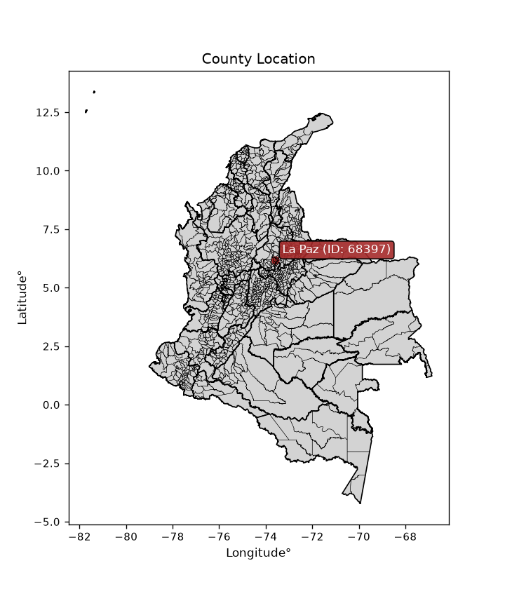
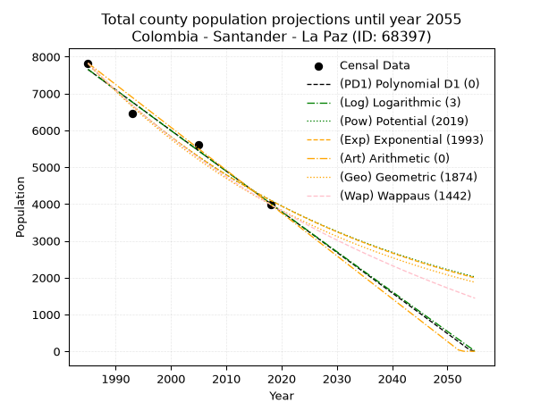
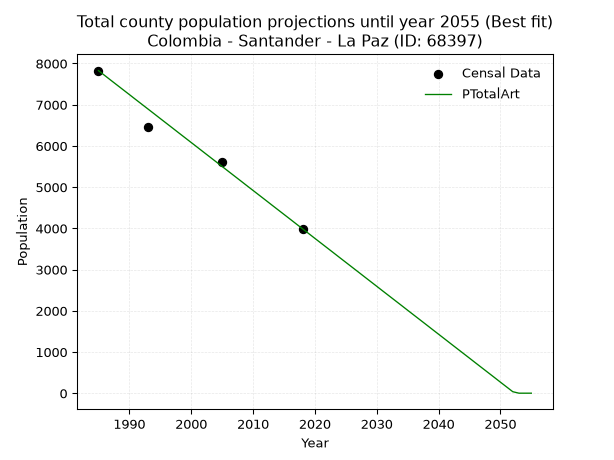
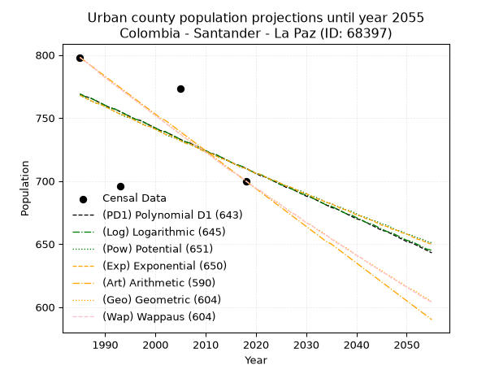
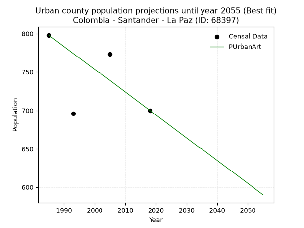
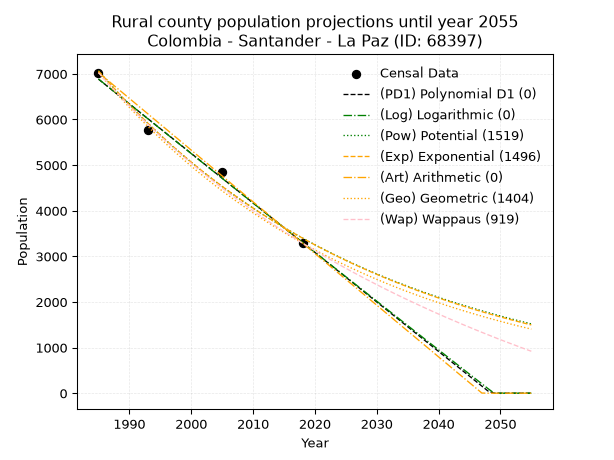
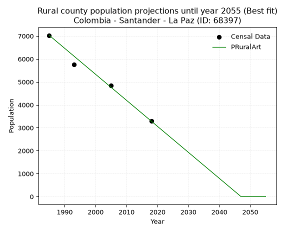

<div align="center">


</div>

# _“Population and Public Services Demand Projections (PPSD) until Year 2050 for Colombia - Santander - La Paz (ID: 68397)”_
Keywords: `population` `public-service` `projection` `lineal` `polynomial` `logarithmic` `potential` `exponential` `arithmetic` `geometric` `wappaus` `dane` `colombia` `south-america`

PPSD are analytical estimates used by governments and planners to anticipate future changes in population size, age distribution, and the resulting community needs for utilities, healthcare, education, and infrastructure as sizing future water treatment facilities, electrical grids, and road networks based on spatial growth.

<div align="center">

</img>

</div>


> **General running parameters**: • app_version: _v20260806_. • Python version: _3.14.7_. • Pandas version: _3.0.5_. • NumPy version: _2.5.1_. • Creates, save and include plots into reports (create_plot): _False_. • Projection until year: _2050_. • Process polynomial degree 2 and up: _False_. • Process Wappaus: _True_. • Process Wappaus: _True_. • Set negative values to zero: _True_. • Set infinite values to zero: _True_. • Drop dataset notes: _True_. 
<div align="center">

Dynamic map: [:earth_americas:Google](http://maps.google.com/maps?q=6.178509326,-73.58959) [:earth_americas:OSM](https://www.openstreetmap.org/#map=18/6.178509326/-73.58959&layers=P) [:earth_americas:Bing](https://www.bing.com/maps?cp=6.178509326~-73.58959&lvl=18) [:earth_americas:Apple](https://maps.apple.com/frame?center=6.178509326%2C-73.58959&span=0.003%2C0.006)

</div>


<div align="center">

```geojson
{
  "type": "Feature",
  "geometry": {
    "type": "Point", 
    "coordinates": [-73.58959, 6.178509326]
  }, 
  "properties": {
    "Name": "Colombia - Santander - La Paz (ID: 68397)"
  }
}
```

</div>


## 0. Census Data (4 records)

Census data are official statistics collected by a government about the people and housing in a country. They usually include counts of total population, age, sex, race, income, education, and jobs.

📅Global census file: [Population.xlsx](../data/Population.xlsx)

| Source   |   Year |   CountryID | CountryName   |   StateID | StateName   |   CountyID | CountyName   |   PTotal |   PUrban |   PRural |
|:---------|-------:|------------:|:--------------|----------:|:------------|-----------:|:-------------|---------:|---------:|---------:|
| DANE     |   1985 |          57 | Colombia      |        68 | Santander   |      68397 | La Paz       |     7826 |      798 |     7028 |
| DANE     |   1993 |          57 | Colombia      |        68 | Santander   |      68397 | La Paz       |     6457 |      696 |     5761 |
| DANE     |   2005 |          57 | Colombia      |        68 | Santander   |      68397 | La Paz       |     5611 |      773 |     4838 |
| DANE     |   2018 |          57 | Colombia      |        68 | Santander   |      68397 | La Paz       |     3989 |      700 |     3289 |

> 🔥Some records could had specific notes about the registered values or the corresponding urban or rural distribution.

📅[SUI-RUPS](https://www.datos.gov.co/Hacienda-y-Cr-dito-P-blico/Registro-nico-de-Prestadores-de-Servicios-P-blicos/4qkq-csdn/about_data) - Local public utility companies: [RUPS.csv](../data/RUPS.xlsx)

 | SERVICIO       | ESTADO    | NOMBRE                                                                                               | NIT         | DEPARTAMENTO_DOMICILIO   | MUNICIPIO_DOMICILIO   | DIRECCION                                          |   TELEFONO | EMAIL               | TIPO_PRESTADOR          | CLASIFICACION                 |
|:---------------|:----------|:-----------------------------------------------------------------------------------------------------|:------------|:-------------------------|:----------------------|:---------------------------------------------------|-----------:|:--------------------|:------------------------|:------------------------------|
| ACUEDUCTO      | OPERATIVA | CORPORACION DE SERVICIOS DEL ACUEDUCTO Y ALCANTARILLADO DE LA CABECERA MUNICIPAL MUNICIPIO DE LA PAZ | 900125196-7 | SANTANDER                | LA PAZ                | cra 4 # 4 - 43                                     |    7518047 | ita_da78@yahoo.com  | ORGANIZACION AUTORIZADA | MENOR O IGUAL A 2500 USUARIOS |
| ALCANTARILLADO | OPERATIVA | CORPORACION DE SERVICIOS DEL ACUEDUCTO Y ALCANTARILLADO DE LA CABECERA MUNICIPAL MUNICIPIO DE LA PAZ | 900125196-7 | SANTANDER                | LA PAZ                | cra 4 # 4 - 43                                     |    7518047 | ita_da78@yahoo.com  | ORGANIZACION AUTORIZADA | MENOR O IGUAL A 2500 USUARIOS |
| ACUEDUCTO      | OPERATIVA | CORPORACION DE SERVICIOS DE ACUEDUCTO DE CASAS BLANCAS LA LOMA Y LA CORCOVADA                        | 800248976-0 | SANTANDER                | LA PAZ                | VEREDA CASAS BLANCAS CASA CARLOS EMIRO ORTIZ PARDO |    3142147 | caragor@hotmail.com | ORGANIZACION AUTORIZADA | HASTA 2500 SUSCRIPTORES       |

## 1. Total

### 1.1. Coefficients and Parameters

* (PD1) Polynomial Deg 1: -110.32155760738557, 226641.445604173 (lineal)
* (Log) Logarithmic: -220838.17041521714, 1684563.453012099
* (Pow) Potential: -39.03957515311072, 132.6359669648348
* (Exp) Exponential: -0.01950746354500456, 5.122173403125414e+20
* (Art) Arithmetic: Year diff. 2018 - 1985 = 33, Population diff. 3989 - 7826 = -3837, Annual growth = -116.27272727272727
* (Geo) Geometric: Year diff. 2018 - 1985 = 33, Population diff. 3989 - 7826 = -3837, Annual growth % = -0.020214436450990636
* (Wap) Wappaus: i = -1.968222213672912, Condition values only valid for < 200)

<sub>
Wappaus condition values: ['-0.00', '-1.97', '-3.94', '-5.90', '-7.87', '-9.84', '-11.81', '-13.78', '-15.75', '-17.71', '-19.68', '-21.65', '-23.62', '-25.59', '-27.56', '-29.52', '-31.49', '-33.46', '-35.43', '-37.40', '-39.36', '-41.33', '-43.30', '-45.27', '-47.24', '-49.21', '-51.17', '-53.14', '-55.11', '-57.08', '-59.05', '-61.01', '-62.98', '-64.95', '-66.92', '-68.89', '-70.86', '-72.82', '-74.79', '-76.76', '-78.73', '-80.70', '-82.67', '-84.63', '-86.60', '-88.57', '-90.54', '-92.51', '-94.47', '-96.44', '-98.41', '-100.38', '-102.35', '-104.32', '-106.28', '-108.25', '-110.22', '-112.19', '-114.16', '-116.13', '-118.09', '-120.06', '-122.03', '-124.00', '-125.97', '-127.93']
</sub>


### 1.2. Projected Dataset

|   Year |   CountyID |   PTotalPD1 |   PTotalLog |   PTotalPow |   PTotalExp |   PTotalArt |   PTotalGeo |   PTotalWap |
|-------:|-----------:|------------:|------------:|------------:|------------:|------------:|------------:|------------:|
|   1985 |      68397 |        7653 |        7657 |        7813 |        7808 |        7826 |        7826 |        7826 |
|   1986 |      68397 |        7543 |        7545 |        7661 |        7658 |        7710 |        7668 |        7673 |
|   1987 |      68397 |        7433 |        7434 |        7511 |        7510 |        7593 |        7513 |        7524 |
|   1988 |      68397 |        7322 |        7323 |        7365 |        7365 |        7477 |        7361 |        7377 |
|   1989 |      68397 |        7212 |        7212 |        7222 |        7222 |        7361 |        7212 |        7233 |
|   1990 |      68397 |        7102 |        7101 |        7082 |        7083 |        7245 |        7066 |        7092 |
|   1991 |      68397 |        6991 |        6990 |        6944 |        6946 |        7128 |        6924 |        6953 |
|   1992 |      68397 |        6881 |        6879 |        6809 |        6812 |        7012 |        6784 |        6817 |
|   1993 |      68397 |        6771 |        6768 |        6677 |        6680 |        6896 |        6646 |        6684 |
|   1994 |      68397 |        6660 |        6658 |        6548 |        6551 |        6780 |        6512 |        6552 |
|   1995 |      68397 |        6550 |        6547 |        6421 |        6425 |        6663 |        6380 |        6424 |
|   1996 |      68397 |        6440 |        6436 |        6297 |        6300 |        6547 |        6251 |        6297 |
|   1997 |      68397 |        6329 |        6326 |        6175 |        6179 |        6431 |        6125 |        6173 |
|   1998 |      68397 |        6219 |        6215 |        6055 |        6059 |        6314 |        6001 |        6051 |
|   1999 |      68397 |        6109 |        6105 |        5938 |        5942 |        6198 |        5880 |        5931 |
|   2000 |      68397 |        5998 |        5994 |        5823 |        5828 |        6082 |        5761 |        5813 |
|   2001 |      68397 |        5888 |        5884 |        5711 |        5715 |        5966 |        5645 |        5697 |
|   2002 |      68397 |        5778 |        5773 |        5600 |        5605 |        5849 |        5531 |        5583 |
|   2003 |      68397 |        5667 |        5663 |        5492 |        5496 |        5733 |        5419 |        5471 |
|   2004 |      68397 |        5557 |        5553 |        5386 |        5390 |        5617 |        5309 |        5360 |
|   2005 |      68397 |        5447 |        5443 |        5282 |        5286 |        5501 |        5202 |        5252 |
|   2006 |      68397 |        5336 |        5333 |        5180 |        5184 |        5384 |        5097 |        5145 |
|   2007 |      68397 |        5226 |        5222 |        5081 |        5084 |        5268 |        4994 |        5040 |
|   2008 |      68397 |        5116 |        5112 |        4983 |        4986 |        5152 |        4893 |        4937 |
|   2009 |      68397 |        5005 |        5003 |        4887 |        4889 |        5035 |        4794 |        4836 |
|   2010 |      68397 |        4895 |        4893 |        4793 |        4795 |        4919 |        4697 |        4736 |
|   2011 |      68397 |        4785 |        4783 |        4701 |        4702 |        4803 |        4602 |        4637 |
|   2012 |      68397 |        4674 |        4673 |        4610 |        4611 |        4687 |        4509 |        4540 |
|   2013 |      68397 |        4564 |        4563 |        4522 |        4522 |        4570 |        4418 |        4445 |
|   2014 |      68397 |        4454 |        4454 |        4435 |        4435 |        4454 |        4329 |        4351 |
|   2015 |      68397 |        4344 |        4344 |        4350 |        4349 |        4338 |        4241 |        4258 |
|   2016 |      68397 |        4233 |        4234 |        4266 |        4265 |        4222 |        4155 |        4167 |
|   2017 |      68397 |        4123 |        4125 |        4185 |        4183 |        4105 |        4071 |        4077 |
|   2018 |      68397 |        4013 |        4015 |        4104 |        4102 |        3989 |        3989 |        3989 |
|   2019 |      68397 |        3902 |        3906 |        4026 |        4023 |        3873 |        3908 |        3902 |
|   2020 |      68397 |        3792 |        3797 |        3949 |        3945 |        3756 |        3829 |        3816 |
|   2021 |      68397 |        3682 |        3687 |        3873 |        3869 |        3640 |        3752 |        3731 |
|   2022 |      68397 |        3571 |        3578 |        3799 |        3794 |        3524 |        3676 |        3648 |
|   2023 |      68397 |        3461 |        3469 |        3726 |        3721 |        3408 |        3602 |        3566 |
|   2024 |      68397 |        3351 |        3360 |        3655 |        3649 |        3291 |        3529 |        3485 |
|   2025 |      68397 |        3240 |        3251 |        3585 |        3578 |        3175 |        3458 |        3405 |
|   2026 |      68397 |        3130 |        3142 |        3517 |        3509 |        3059 |        3388 |        3326 |
|   2027 |      68397 |        3020 |        3033 |        3450 |        3441 |        2943 |        3319 |        3249 |
|   2028 |      68397 |        2909 |        2924 |        3384 |        3375 |        2826 |        3252 |        3172 |
|   2029 |      68397 |        2799 |        2815 |        3320 |        3310 |        2710 |        3186 |        3096 |
|   2030 |      68397 |        2689 |        2706 |        3256 |        3246 |        2594 |        3122 |        3022 |
|   2031 |      68397 |        2578 |        2597 |        3194 |        3183 |        2477 |        3059 |        2948 |
|   2032 |      68397 |        2468 |        2489 |        3134 |        3122 |        2361 |        2997 |        2876 |
|   2033 |      68397 |        2358 |        2380 |        3074 |        3061 |        2245 |        2936 |        2804 |
|   2034 |      68397 |        2247 |        2271 |        3015 |        3002 |        2129 |        2877 |        2734 |
|   2035 |      68397 |        2137 |        2163 |        2958 |        2944 |        2012 |        2819 |        2664 |
|   2036 |      68397 |        2027 |        2054 |        2902 |        2887 |        1896 |        2762 |        2595 |
|   2037 |      68397 |        1916 |        1946 |        2847 |        2832 |        1780 |        2706 |        2528 |
|   2038 |      68397 |        1806 |        1837 |        2793 |        2777 |        1664 |        2651 |        2461 |
|   2039 |      68397 |        1696 |        1729 |        2740 |        2723 |        1547 |        2598 |        2395 |
|   2040 |      68397 |        1585 |        1621 |        2688 |        2671 |        1431 |        2545 |        2329 |
|   2041 |      68397 |        1475 |        1513 |        2637 |        2619 |        1315 |        2494 |        2265 |
|   2042 |      68397 |        1365 |        1404 |        2587 |        2568 |        1198 |        2443 |        2201 |
|   2043 |      68397 |        1255 |        1296 |        2538 |        2519 |        1082 |        2394 |        2138 |
|   2044 |      68397 |        1144 |        1188 |        2490 |        2470 |         966 |        2346 |        2076 |
|   2045 |      68397 |        1034 |        1080 |        2443 |        2422 |         850 |        2298 |        2015 |
|   2046 |      68397 |         924 |         972 |        2397 |        2376 |         733 |        2252 |        1955 |
|   2047 |      68397 |         813 |         864 |        2351 |        2330 |         617 |        2206 |        1895 |
|   2048 |      68397 |         703 |         757 |        2307 |        2285 |         501 |        2162 |        1836 |
|   2049 |      68397 |         593 |         649 |        2263 |        2241 |         385 |        2118 |        1777 |
|   2050 |      68397 |         482 |         541 |        2221 |        2197 |         268 |        2075 |        1720 |
<div align="center">

</img>

</div>


### 1.3. Best fit with absolute and relative error (%)

Relative error puts that difference into context by dividing the absolute error by the true value, creating a unitless ratio or percentage that shows the scale of the mistake.

Absolute and relative error

|   Year | Source   |   CountryID | CountryName   |   StateID | StateName   |   CountyID_x | CountyName   |   PTotal |   PUrban |   PRural |   CountyID_y |   PTotalPD1 |   PTotalLog |   PTotalPow |   PTotalExp |   PTotalArt |   PTotalGeo |   PTotalWap |   PTotalPD1AbsError |   PTotalLogAbsError |   PTotalPowAbsError |   PTotalExpAbsError |   PTotalArtAbsError |   PTotalGeoAbsError |   PTotalWapAbsError |   PTotalPD1RelError |   PTotalLogRelError |   PTotalPowRelError |   PTotalExpRelError |   PTotalArtRelError |   PTotalGeoRelError |   PTotalWapRelError |
|-------:|:---------|------------:|:--------------|----------:|:------------|-------------:|:-------------|---------:|---------:|---------:|-------------:|------------:|------------:|------------:|------------:|------------:|------------:|------------:|--------------------:|--------------------:|--------------------:|--------------------:|--------------------:|--------------------:|--------------------:|--------------------:|--------------------:|--------------------:|--------------------:|--------------------:|--------------------:|--------------------:|
|   1985 | DANE     |          57 | Colombia      |        68 | Santander   |        68397 | La Paz       |     7826 |      798 |     7028 |        68397 |        7653 |        7657 |        7813 |        7808 |        7826 |        7826 |        7826 |                 173 |                 169 |                  13 |                  18 |                   0 |                   0 |                   0 |            2.21058  |            2.15947  |            0.166113 |            0.230003 |             0       |             0       |             0       |
|   1993 | DANE     |          57 | Colombia      |        68 | Santander   |        68397 | La Paz       |     6457 |      696 |     5761 |        68397 |        6771 |        6768 |        6677 |        6680 |        6896 |        6646 |        6684 |                 314 |                 311 |                 220 |                 223 |                 439 |                 189 |                 227 |            4.86294  |            4.81648  |            3.40716  |            3.45362  |             6.79882 |             2.92706 |             3.51556 |
|   2005 | DANE     |          57 | Colombia      |        68 | Santander   |        68397 | La Paz       |     5611 |      773 |     4838 |        68397 |        5447 |        5443 |        5282 |        5286 |        5501 |        5202 |        5252 |                 164 |                 168 |                 329 |                 325 |                 110 |                 409 |                 359 |            2.92283  |            2.99412  |            5.86348  |            5.79219  |             1.96043 |             7.28925 |             6.39815 |
|   2018 | DANE     |          57 | Colombia      |        68 | Santander   |        68397 | La Paz       |     3989 |      700 |     3289 |        68397 |        4013 |        4015 |        4104 |        4102 |        3989 |        3989 |        3989 |                  24 |                  26 |                 115 |                 113 |                   0 |                   0 |                   0 |            0.601655 |            0.651792 |            2.88293  |            2.83279  |             0       |             0       |             0       |

Relative error mean

| Method    |   RelError | Best   |
|:----------|-----------:|:-------|
| PTotalPD1 |    2.6495  |        |
| PTotalLog |    2.65546 |        |
| PTotalPow |    3.07992 |        |
| PTotalExp |    3.07715 |        |
| PTotalArt |    2.18981 | True   |
| PTotalGeo |    2.55408 |        |
| PTotalWap |    2.47843 |        |

💙Best method: _**PTotalArt**_
<div align="center">

</img>

</div>


### 1.4. Fresh water supply demand in liters per capita per day (lpcd)

The fresh water supply demand typically ranges from 100 to 300 liters per capita per day (lpcd) for standard domestic and municipal planning, though absolute survival minimums set by the World Health Organization are as low as 7.5 to 20 liters per day, and total consumption in high-income nations can exceed 400 liters.

> `CZ`: Level in meters above the sea level (masl)<br> `WS`: Fresh water supply demand in liters per capita per day (lpcd or l/h/d)<br> `WSAll`: Zonal fresh water supply demand in liters per second (l/s)<br> `A`: Zonal area in square meters<br> `DP`: Population density (people/hectare or p/ha)

Reference values (RAS Colombia)

|    CZ |   WS |
|------:|-----:|
|  1000 |  120 |
|  2000 |  130 |
| 99999 |  140 |

County shapefile geometry properties and water supply values

|   CountyID |      ATotal |   CZTotal |   WSTotal |
|-----------:|------------:|----------:|----------:|
|      68397 | 2.83909e+08 |   1323.06 |       130 |

Projected values for best method: PTotalArt

|   CountyID |   Year |   PTotalArt |   DPTotal |   WSTotal |   WSTotalAll |
|-----------:|-------:|------------:|----------:|----------:|-------------:|
|      68397 |   1985 |        7826 |      0.28 |       130 |    11.7752   |
|      68397 |   1986 |        7710 |      0.27 |       130 |    11.6007   |
|      68397 |   1987 |        7593 |      0.27 |       130 |    11.4247   |
|      68397 |   1988 |        7477 |      0.26 |       130 |    11.2501   |
|      68397 |   1989 |        7361 |      0.26 |       130 |    11.0756   |
|      68397 |   1990 |        7245 |      0.26 |       130 |    10.901    |
|      68397 |   1991 |        7128 |      0.25 |       130 |    10.725    |
|      68397 |   1992 |        7012 |      0.25 |       130 |    10.5505   |
|      68397 |   1993 |        6896 |      0.24 |       130 |    10.3759   |
|      68397 |   1994 |        6780 |      0.24 |       130 |    10.2014   |
|      68397 |   1995 |        6663 |      0.23 |       130 |    10.0253   |
|      68397 |   1996 |        6547 |      0.23 |       130 |     9.85081  |
|      68397 |   1997 |        6431 |      0.23 |       130 |     9.67627  |
|      68397 |   1998 |        6314 |      0.22 |       130 |     9.50023  |
|      68397 |   1999 |        6198 |      0.22 |       130 |     9.32569  |
|      68397 |   2000 |        6082 |      0.21 |       130 |     9.15116  |
|      68397 |   2001 |        5966 |      0.21 |       130 |     8.97662  |
|      68397 |   2002 |        5849 |      0.21 |       130 |     8.80058  |
|      68397 |   2003 |        5733 |      0.2  |       130 |     8.62604  |
|      68397 |   2004 |        5617 |      0.2  |       130 |     8.4515   |
|      68397 |   2005 |        5501 |      0.19 |       130 |     8.27697  |
|      68397 |   2006 |        5384 |      0.19 |       130 |     8.10093  |
|      68397 |   2007 |        5268 |      0.19 |       130 |     7.92639  |
|      68397 |   2008 |        5152 |      0.18 |       130 |     7.75185  |
|      68397 |   2009 |        5035 |      0.18 |       130 |     7.57581  |
|      68397 |   2010 |        4919 |      0.17 |       130 |     7.40127  |
|      68397 |   2011 |        4803 |      0.17 |       130 |     7.22674  |
|      68397 |   2012 |        4687 |      0.17 |       130 |     7.0522   |
|      68397 |   2013 |        4570 |      0.16 |       130 |     6.87616  |
|      68397 |   2014 |        4454 |      0.16 |       130 |     6.70162  |
|      68397 |   2015 |        4338 |      0.15 |       130 |     6.52708  |
|      68397 |   2016 |        4222 |      0.15 |       130 |     6.35255  |
|      68397 |   2017 |        4105 |      0.14 |       130 |     6.1765   |
|      68397 |   2018 |        3989 |      0.14 |       130 |     6.00197  |
|      68397 |   2019 |        3873 |      0.14 |       130 |     5.82743  |
|      68397 |   2020 |        3756 |      0.13 |       130 |     5.65139  |
|      68397 |   2021 |        3640 |      0.13 |       130 |     5.47685  |
|      68397 |   2022 |        3524 |      0.12 |       130 |     5.30231  |
|      68397 |   2023 |        3408 |      0.12 |       130 |     5.12778  |
|      68397 |   2024 |        3291 |      0.12 |       130 |     4.95174  |
|      68397 |   2025 |        3175 |      0.11 |       130 |     4.7772   |
|      68397 |   2026 |        3059 |      0.11 |       130 |     4.60266  |
|      68397 |   2027 |        2943 |      0.1  |       130 |     4.42812  |
|      68397 |   2028 |        2826 |      0.1  |       130 |     4.25208  |
|      68397 |   2029 |        2710 |      0.1  |       130 |     4.07755  |
|      68397 |   2030 |        2594 |      0.09 |       130 |     3.90301  |
|      68397 |   2031 |        2477 |      0.09 |       130 |     3.72697  |
|      68397 |   2032 |        2361 |      0.08 |       130 |     3.55243  |
|      68397 |   2033 |        2245 |      0.08 |       130 |     3.37789  |
|      68397 |   2034 |        2129 |      0.07 |       130 |     3.20336  |
|      68397 |   2035 |        2012 |      0.07 |       130 |     3.02731  |
|      68397 |   2036 |        1896 |      0.07 |       130 |     2.85278  |
|      68397 |   2037 |        1780 |      0.06 |       130 |     2.67824  |
|      68397 |   2038 |        1664 |      0.06 |       130 |     2.5037   |
|      68397 |   2039 |        1547 |      0.05 |       130 |     2.32766  |
|      68397 |   2040 |        1431 |      0.05 |       130 |     2.15313  |
|      68397 |   2041 |        1315 |      0.05 |       130 |     1.97859  |
|      68397 |   2042 |        1198 |      0.04 |       130 |     1.80255  |
|      68397 |   2043 |        1082 |      0.04 |       130 |     1.62801  |
|      68397 |   2044 |         966 |      0.03 |       130 |     1.45347  |
|      68397 |   2045 |         850 |      0.03 |       130 |     1.27894  |
|      68397 |   2046 |         733 |      0.03 |       130 |     1.10289  |
|      68397 |   2047 |         617 |      0.02 |       130 |     0.928356 |
|      68397 |   2048 |         501 |      0.02 |       130 |     0.753819 |
|      68397 |   2049 |         385 |      0.01 |       130 |     0.579282 |
|      68397 |   2050 |         268 |      0.01 |       130 |     0.403241 |

## 2. Urban

### 2.1. Coefficients and Parameters

* (PD1) Polynomial Deg 1: -1.7964672822159389, 4335.133681252432 (lineal)
* (Log) Logarithmic: -3597.0160019272053, 28082.697455325913
* (Pow) Potential: -4.775849182837582, 18.6349127556289
* (Exp) Exponential: -0.002385290599314978, 87411.48249133016
* (Art) Arithmetic: Year diff. 2018 - 1985 = 33, Population diff. 700 - 798 = -98, Annual growth = -2.9696969696969697
* (Geo) Geometric: Year diff. 2018 - 1985 = 33, Population diff. 700 - 798 = -98, Annual growth % = -0.003962681181554739
* (Wap) Wappaus: i = -0.3964882469555367, Condition values only valid for < 200)

<sub>
Wappaus condition values: ['-0.00', '-0.40', '-0.79', '-1.19', '-1.59', '-1.98', '-2.38', '-2.78', '-3.17', '-3.57', '-3.96', '-4.36', '-4.76', '-5.15', '-5.55', '-5.95', '-6.34', '-6.74', '-7.14', '-7.53', '-7.93', '-8.33', '-8.72', '-9.12', '-9.52', '-9.91', '-10.31', '-10.71', '-11.10', '-11.50', '-11.89', '-12.29', '-12.69', '-13.08', '-13.48', '-13.88', '-14.27', '-14.67', '-15.07', '-15.46', '-15.86', '-16.26', '-16.65', '-17.05', '-17.45', '-17.84', '-18.24', '-18.63', '-19.03', '-19.43', '-19.82', '-20.22', '-20.62', '-21.01', '-21.41', '-21.81', '-22.20', '-22.60', '-23.00', '-23.39', '-23.79', '-24.19', '-24.58', '-24.98', '-25.38', '-25.77']
</sub>


### 2.2. Projected Dataset

|   Year |   CountyID |   PUrbanPD1 |   PUrbanLog |   PUrbanPow |   PUrbanExp |   PUrbanArt |   PUrbanGeo |   PUrbanWap |
|-------:|-----------:|------------:|------------:|------------:|------------:|------------:|------------:|------------:|
|   1985 |      68397 |         769 |         769 |         768 |         768 |         798 |         798 |         798 |
|   1986 |      68397 |         767 |         767 |         766 |         766 |         795 |         795 |         795 |
|   1987 |      68397 |         766 |         766 |         764 |         764 |         792 |         792 |         792 |
|   1988 |      68397 |         764 |         764 |         762 |         762 |         789 |         789 |         789 |
|   1989 |      68397 |         762 |         762 |         761 |         761 |         786 |         785 |         785 |
|   1990 |      68397 |         760 |         760 |         759 |         759 |         783 |         782 |         782 |
|   1991 |      68397 |         758 |         758 |         757 |         757 |         780 |         779 |         779 |
|   1992 |      68397 |         757 |         757 |         755 |         755 |         777 |         776 |         776 |
|   1993 |      68397 |         755 |         755 |         753 |         753 |         774 |         773 |         773 |
|   1994 |      68397 |         753 |         753 |         751 |         752 |         771 |         770 |         770 |
|   1995 |      68397 |         751 |         751 |         750 |         750 |         768 |         767 |         767 |
|   1996 |      68397 |         749 |         749 |         748 |         748 |         765 |         764 |         764 |
|   1997 |      68397 |         748 |         748 |         746 |         746 |         762 |         761 |         761 |
|   1998 |      68397 |         746 |         746 |         744 |         744 |         759 |         758 |         758 |
|   1999 |      68397 |         744 |         744 |         743 |         743 |         756 |         755 |         755 |
|   2000 |      68397 |         742 |         742 |         741 |         741 |         753 |         752 |         752 |
|   2001 |      68397 |         740 |         740 |         739 |         739 |         750 |         749 |         749 |
|   2002 |      68397 |         739 |         739 |         737 |         737 |         748 |         746 |         746 |
|   2003 |      68397 |         737 |         737 |         735 |         736 |         745 |         743 |         743 |
|   2004 |      68397 |         735 |         735 |         734 |         734 |         742 |         740 |         740 |
|   2005 |      68397 |         733 |         733 |         732 |         732 |         739 |         737 |         737 |
|   2006 |      68397 |         731 |         731 |         730 |         730 |         736 |         734 |         734 |
|   2007 |      68397 |         730 |         730 |         729 |         729 |         733 |         731 |         731 |
|   2008 |      68397 |         728 |         728 |         727 |         727 |         730 |         728 |         728 |
|   2009 |      68397 |         726 |         726 |         725 |         725 |         727 |         725 |         726 |
|   2010 |      68397 |         724 |         724 |         723 |         723 |         724 |         723 |         723 |
|   2011 |      68397 |         722 |         722 |         722 |         722 |         721 |         720 |         720 |
|   2012 |      68397 |         721 |         721 |         720 |         720 |         718 |         717 |         717 |
|   2013 |      68397 |         719 |         719 |         718 |         718 |         715 |         714 |         714 |
|   2014 |      68397 |         717 |         717 |         717 |         717 |         712 |         711 |         711 |
|   2015 |      68397 |         715 |         715 |         715 |         715 |         709 |         708 |         708 |
|   2016 |      68397 |         713 |         713 |         713 |         713 |         706 |         706 |         706 |
|   2017 |      68397 |         712 |         712 |         711 |         711 |         703 |         703 |         703 |
|   2018 |      68397 |         710 |         710 |         710 |         710 |         700 |         700 |         700 |
|   2019 |      68397 |         708 |         708 |         708 |         708 |         697 |         697 |         697 |
|   2020 |      68397 |         706 |         706 |         706 |         706 |         694 |         694 |         694 |
|   2021 |      68397 |         704 |         705 |         705 |         705 |         691 |         692 |         692 |
|   2022 |      68397 |         703 |         703 |         703 |         703 |         688 |         689 |         689 |
|   2023 |      68397 |         701 |         701 |         701 |         701 |         685 |         686 |         686 |
|   2024 |      68397 |         699 |         699 |         700 |         700 |         682 |         684 |         683 |
|   2025 |      68397 |         697 |         697 |         698 |         698 |         679 |         681 |         681 |
|   2026 |      68397 |         695 |         696 |         696 |         696 |         676 |         678 |         678 |
|   2027 |      68397 |         694 |         694 |         695 |         695 |         673 |         675 |         675 |
|   2028 |      68397 |         692 |         692 |         693 |         693 |         670 |         673 |         673 |
|   2029 |      68397 |         690 |         690 |         692 |         691 |         667 |         670 |         670 |
|   2030 |      68397 |         688 |         689 |         690 |         690 |         664 |         667 |         667 |
|   2031 |      68397 |         687 |         687 |         688 |         688 |         661 |         665 |         665 |
|   2032 |      68397 |         685 |         685 |         687 |         686 |         658 |         662 |         662 |
|   2033 |      68397 |         683 |         683 |         685 |         685 |         655 |         660 |         659 |
|   2034 |      68397 |         681 |         681 |         683 |         683 |         652 |         657 |         657 |
|   2035 |      68397 |         679 |         680 |         682 |         682 |         650 |         654 |         654 |
|   2036 |      68397 |         678 |         678 |         680 |         680 |         647 |         652 |         651 |
|   2037 |      68397 |         676 |         676 |         679 |         678 |         644 |         649 |         649 |
|   2038 |      68397 |         674 |         674 |         677 |         677 |         641 |         647 |         646 |
|   2039 |      68397 |         672 |         673 |         676 |         675 |         638 |         644 |         644 |
|   2040 |      68397 |         670 |         671 |         674 |         673 |         635 |         641 |         641 |
|   2041 |      68397 |         669 |         669 |         672 |         672 |         632 |         639 |         639 |
|   2042 |      68397 |         667 |         667 |         671 |         670 |         629 |         636 |         636 |
|   2043 |      68397 |         665 |         666 |         669 |         669 |         626 |         634 |         633 |
|   2044 |      68397 |         663 |         664 |         668 |         667 |         623 |         631 |         631 |
|   2045 |      68397 |         661 |         662 |         666 |         665 |         620 |         629 |         628 |
|   2046 |      68397 |         660 |         660 |         665 |         664 |         617 |         626 |         626 |
|   2047 |      68397 |         658 |         659 |         663 |         662 |         614 |         624 |         623 |
|   2048 |      68397 |         656 |         657 |         661 |         661 |         611 |         621 |         621 |
|   2049 |      68397 |         654 |         655 |         660 |         659 |         608 |         619 |         618 |
|   2050 |      68397 |         652 |         653 |         658 |         658 |         605 |         616 |         616 |
<div align="center">

</img>

</div>


### 2.3. Best fit with absolute and relative error (%)

Relative error puts that difference into context by dividing the absolute error by the true value, creating a unitless ratio or percentage that shows the scale of the mistake.

Absolute and relative error

|   Year | Source   |   CountryID | CountryName   |   StateID | StateName   |   CountyID_x | CountyName   |   PTotal |   PUrban |   PRural |   CountyID_y |   PUrbanPD1 |   PUrbanLog |   PUrbanPow |   PUrbanExp |   PUrbanArt |   PUrbanGeo |   PUrbanWap |   PUrbanPD1AbsError |   PUrbanLogAbsError |   PUrbanPowAbsError |   PUrbanExpAbsError |   PUrbanArtAbsError |   PUrbanGeoAbsError |   PUrbanWapAbsError |   PUrbanPD1RelError |   PUrbanLogRelError |   PUrbanPowRelError |   PUrbanExpRelError |   PUrbanArtRelError |   PUrbanGeoRelError |   PUrbanWapRelError |
|-------:|:---------|------------:|:--------------|----------:|:------------|-------------:|:-------------|---------:|---------:|---------:|-------------:|------------:|------------:|------------:|------------:|------------:|------------:|------------:|--------------------:|--------------------:|--------------------:|--------------------:|--------------------:|--------------------:|--------------------:|--------------------:|--------------------:|--------------------:|--------------------:|--------------------:|--------------------:|--------------------:|
|   1985 | DANE     |          57 | Colombia      |        68 | Santander   |        68397 | La Paz       |     7826 |      798 |     7028 |        68397 |         769 |         769 |         768 |         768 |         798 |         798 |         798 |                  29 |                  29 |                  30 |                  30 |                   0 |                   0 |                   0 |             3.63409 |             3.63409 |             3.7594  |             3.7594  |             0       |             0       |             0       |
|   1993 | DANE     |          57 | Colombia      |        68 | Santander   |        68397 | La Paz       |     6457 |      696 |     5761 |        68397 |         755 |         755 |         753 |         753 |         774 |         773 |         773 |                  59 |                  59 |                  57 |                  57 |                  78 |                  77 |                  77 |             8.47701 |             8.47701 |             8.18966 |             8.18966 |            11.2069  |            11.0632  |            11.0632  |
|   2005 | DANE     |          57 | Colombia      |        68 | Santander   |        68397 | La Paz       |     5611 |      773 |     4838 |        68397 |         733 |         733 |         732 |         732 |         739 |         737 |         737 |                  40 |                  40 |                  41 |                  41 |                  34 |                  36 |                  36 |             5.17464 |             5.17464 |             5.30401 |             5.30401 |             4.39845 |             4.65718 |             4.65718 |
|   2018 | DANE     |          57 | Colombia      |        68 | Santander   |        68397 | La Paz       |     3989 |      700 |     3289 |        68397 |         710 |         710 |         710 |         710 |         700 |         700 |         700 |                  10 |                  10 |                  10 |                  10 |                   0 |                   0 |                   0 |             1.42857 |             1.42857 |             1.42857 |             1.42857 |             0       |             0       |             0       |

Relative error mean

| Method    |   RelError | Best   |
|:----------|-----------:|:-------|
| PUrbanPD1 |    4.67858 |        |
| PUrbanLog |    4.67858 |        |
| PUrbanPow |    4.67041 |        |
| PUrbanExp |    4.67041 |        |
| PUrbanArt |    3.90134 | True   |
| PUrbanGeo |    3.9301  |        |
| PUrbanWap |    3.9301  |        |

💙Best method: _**PUrbanArt**_
<div align="center">

</img>

</div>


### 2.4. Fresh water supply demand in liters per capita per day (lpcd)

The fresh water supply demand typically ranges from 100 to 300 liters per capita per day (lpcd) for standard domestic and municipal planning, though absolute survival minimums set by the World Health Organization are as low as 7.5 to 20 liters per day, and total consumption in high-income nations can exceed 400 liters.

> `CZ`: Level in meters above the sea level (masl)<br> `WS`: Fresh water supply demand in liters per capita per day (lpcd or l/h/d)<br> `WSAll`: Zonal fresh water supply demand in liters per second (l/s)<br> `A`: Zonal area in square meters<br> `DP`: Population density (people/hectare or p/ha)

Reference values (RAS Colombia)

|    CZ |   WS |
|------:|-----:|
|  1000 |  120 |
|  2000 |  130 |
| 99999 |  140 |

County shapefile geometry properties and water supply values

|   CountyID |   AUrban |   CZUrban |   WSUrban |
|-----------:|---------:|----------:|----------:|
|      68397 |   231475 |    1905.4 |       130 |

Projected values for best method: PUrbanArt

|   CountyID |   Year |   PUrbanArt |   DPUrban |   WSUrban |   WSUrbanAll |
|-----------:|-------:|------------:|----------:|----------:|-------------:|
|      68397 |   1985 |         798 |     34.47 |       130 |     1.20069  |
|      68397 |   1986 |         795 |     34.34 |       130 |     1.19618  |
|      68397 |   1987 |         792 |     34.22 |       130 |     1.19167  |
|      68397 |   1988 |         789 |     34.09 |       130 |     1.18715  |
|      68397 |   1989 |         786 |     33.96 |       130 |     1.18264  |
|      68397 |   1990 |         783 |     33.83 |       130 |     1.17813  |
|      68397 |   1991 |         780 |     33.7  |       130 |     1.17361  |
|      68397 |   1992 |         777 |     33.57 |       130 |     1.1691   |
|      68397 |   1993 |         774 |     33.44 |       130 |     1.16458  |
|      68397 |   1994 |         771 |     33.31 |       130 |     1.16007  |
|      68397 |   1995 |         768 |     33.18 |       130 |     1.15556  |
|      68397 |   1996 |         765 |     33.05 |       130 |     1.15104  |
|      68397 |   1997 |         762 |     32.92 |       130 |     1.14653  |
|      68397 |   1998 |         759 |     32.79 |       130 |     1.14201  |
|      68397 |   1999 |         756 |     32.66 |       130 |     1.1375   |
|      68397 |   2000 |         753 |     32.53 |       130 |     1.13299  |
|      68397 |   2001 |         750 |     32.4  |       130 |     1.12847  |
|      68397 |   2002 |         748 |     32.31 |       130 |     1.12546  |
|      68397 |   2003 |         745 |     32.18 |       130 |     1.12095  |
|      68397 |   2004 |         742 |     32.06 |       130 |     1.11644  |
|      68397 |   2005 |         739 |     31.93 |       130 |     1.11192  |
|      68397 |   2006 |         736 |     31.8  |       130 |     1.10741  |
|      68397 |   2007 |         733 |     31.67 |       130 |     1.10289  |
|      68397 |   2008 |         730 |     31.54 |       130 |     1.09838  |
|      68397 |   2009 |         727 |     31.41 |       130 |     1.09387  |
|      68397 |   2010 |         724 |     31.28 |       130 |     1.08935  |
|      68397 |   2011 |         721 |     31.15 |       130 |     1.08484  |
|      68397 |   2012 |         718 |     31.02 |       130 |     1.08032  |
|      68397 |   2013 |         715 |     30.89 |       130 |     1.07581  |
|      68397 |   2014 |         712 |     30.76 |       130 |     1.0713   |
|      68397 |   2015 |         709 |     30.63 |       130 |     1.06678  |
|      68397 |   2016 |         706 |     30.5  |       130 |     1.06227  |
|      68397 |   2017 |         703 |     30.37 |       130 |     1.05775  |
|      68397 |   2018 |         700 |     30.24 |       130 |     1.05324  |
|      68397 |   2019 |         697 |     30.11 |       130 |     1.04873  |
|      68397 |   2020 |         694 |     29.98 |       130 |     1.04421  |
|      68397 |   2021 |         691 |     29.85 |       130 |     1.0397   |
|      68397 |   2022 |         688 |     29.72 |       130 |     1.03519  |
|      68397 |   2023 |         685 |     29.59 |       130 |     1.03067  |
|      68397 |   2024 |         682 |     29.46 |       130 |     1.02616  |
|      68397 |   2025 |         679 |     29.33 |       130 |     1.02164  |
|      68397 |   2026 |         676 |     29.2  |       130 |     1.01713  |
|      68397 |   2027 |         673 |     29.07 |       130 |     1.01262  |
|      68397 |   2028 |         670 |     28.94 |       130 |     1.0081   |
|      68397 |   2029 |         667 |     28.82 |       130 |     1.00359  |
|      68397 |   2030 |         664 |     28.69 |       130 |     0.999074 |
|      68397 |   2031 |         661 |     28.56 |       130 |     0.99456  |
|      68397 |   2032 |         658 |     28.43 |       130 |     0.990046 |
|      68397 |   2033 |         655 |     28.3  |       130 |     0.985532 |
|      68397 |   2034 |         652 |     28.17 |       130 |     0.981019 |
|      68397 |   2035 |         650 |     28.08 |       130 |     0.978009 |
|      68397 |   2036 |         647 |     27.95 |       130 |     0.973495 |
|      68397 |   2037 |         644 |     27.82 |       130 |     0.968981 |
|      68397 |   2038 |         641 |     27.69 |       130 |     0.964468 |
|      68397 |   2039 |         638 |     27.56 |       130 |     0.959954 |
|      68397 |   2040 |         635 |     27.43 |       130 |     0.95544  |
|      68397 |   2041 |         632 |     27.3  |       130 |     0.950926 |
|      68397 |   2042 |         629 |     27.17 |       130 |     0.946412 |
|      68397 |   2043 |         626 |     27.04 |       130 |     0.941898 |
|      68397 |   2044 |         623 |     26.91 |       130 |     0.937384 |
|      68397 |   2045 |         620 |     26.78 |       130 |     0.93287  |
|      68397 |   2046 |         617 |     26.66 |       130 |     0.928356 |
|      68397 |   2047 |         614 |     26.53 |       130 |     0.923843 |
|      68397 |   2048 |         611 |     26.4  |       130 |     0.919329 |
|      68397 |   2049 |         608 |     26.27 |       130 |     0.914815 |
|      68397 |   2050 |         605 |     26.14 |       130 |     0.910301 |

## 3. Rural

### 3.1. Coefficients and Parameters

* (PD1) Polynomial Deg 1: -108.52509032516954, 222306.3119229204 (lineal)
* (Log) Logarithmic: -217241.1544132898, 1656480.7555567722
* (Pow) Potential: -44.379430182177806, 150.20212948289142
* (Exp) Exponential: -0.02217635220325659, 9.264188635154492e+22
* (Art) Arithmetic: Year diff. 2018 - 1985 = 33, Population diff. 3289 - 7028 = -3739, Annual growth = -113.3030303030303
* (Geo) Geometric: Year diff. 2018 - 1985 = 33, Population diff. 3289 - 7028 = -3739, Annual growth % = -0.02274695129858184
* (Wap) Wappaus: i = -2.1964336590681457, Condition values only valid for < 200)

<sub>
Wappaus condition values: ['-0.00', '-2.20', '-4.39', '-6.59', '-8.79', '-10.98', '-13.18', '-15.38', '-17.57', '-19.77', '-21.96', '-24.16', '-26.36', '-28.55', '-30.75', '-32.95', '-35.14', '-37.34', '-39.54', '-41.73', '-43.93', '-46.13', '-48.32', '-50.52', '-52.71', '-54.91', '-57.11', '-59.30', '-61.50', '-63.70', '-65.89', '-68.09', '-70.29', '-72.48', '-74.68', '-76.88', '-79.07', '-81.27', '-83.46', '-85.66', '-87.86', '-90.05', '-92.25', '-94.45', '-96.64', '-98.84', '-101.04', '-103.23', '-105.43', '-107.63', '-109.82', '-112.02', '-114.21', '-116.41', '-118.61', '-120.80', '-123.00', '-125.20', '-127.39', '-129.59', '-131.79', '-133.98', '-136.18', '-138.38', '-140.57', '-142.77']
</sub>


### 3.2. Projected Dataset

|   Year |   CountyID |   PRuralPD1 |   PRuralLog |   PRuralPow |   PRuralExp |   PRuralArt |   PRuralGeo |   PRuralWap |
|-------:|-----------:|------------:|------------:|------------:|------------:|------------:|------------:|------------:|
|   1985 |      68397 |        6884 |        6887 |        7070 |        7065 |        7028 |        7028 |        7028 |
|   1986 |      68397 |        6775 |        6778 |        6913 |        6910 |        6915 |        6868 |        6875 |
|   1987 |      68397 |        6667 |        6669 |        6761 |        6759 |        6801 |        6712 |        6726 |
|   1988 |      68397 |        6558 |        6559 |        6611 |        6611 |        6688 |        6559 |        6580 |
|   1989 |      68397 |        6450 |        6450 |        6465 |        6466 |        6575 |        6410 |        6437 |
|   1990 |      68397 |        6341 |        6341 |        6323 |        6324 |        6461 |        6264 |        6296 |
|   1991 |      68397 |        6233 |        6232 |        6183 |        6185 |        6348 |        6122 |        6159 |
|   1992 |      68397 |        6124 |        6123 |        6047 |        6050 |        6235 |        5982 |        6025 |
|   1993 |      68397 |        6016 |        6014 |        5914 |        5917 |        6122 |        5846 |        5893 |
|   1994 |      68397 |        5907 |        5905 |        5784 |        5787 |        6008 |        5713 |        5764 |
|   1995 |      68397 |        5799 |        5796 |        5656 |        5660 |        5895 |        5583 |        5637 |
|   1996 |      68397 |        5690 |        5687 |        5532 |        5536 |        5782 |        5456 |        5513 |
|   1997 |      68397 |        5582 |        5578 |        5410 |        5415 |        5668 |        5332 |        5391 |
|   1998 |      68397 |        5473 |        5469 |        5292 |        5296 |        5555 |        5211 |        5272 |
|   1999 |      68397 |        5365 |        5361 |        5175 |        5180 |        5442 |        5092 |        5155 |
|   2000 |      68397 |        5256 |        5252 |        5062 |        5066 |        5328 |        4977 |        5040 |
|   2001 |      68397 |        5148 |        5143 |        4951 |        4955 |        5215 |        4863 |        4927 |
|   2002 |      68397 |        5039 |        5035 |        4842 |        4846 |        5102 |        4753 |        4817 |
|   2003 |      68397 |        4931 |        4926 |        4736 |        4740 |        4989 |        4645 |        4708 |
|   2004 |      68397 |        4822 |        4818 |        4632 |        4636 |        4875 |        4539 |        4601 |
|   2005 |      68397 |        4714 |        4710 |        4531 |        4534 |        4762 |        4436 |        4497 |
|   2006 |      68397 |        4605 |        4601 |        4432 |        4435 |        4649 |        4335 |        4394 |
|   2007 |      68397 |        4496 |        4493 |        4335 |        4338 |        4535 |        4236 |        4293 |
|   2008 |      68397 |        4388 |        4385 |        4240 |        4243 |        4422 |        4140 |        4194 |
|   2009 |      68397 |        4279 |        4277 |        4147 |        4149 |        4309 |        4046 |        4096 |
|   2010 |      68397 |        4171 |        4168 |        4057 |        4058 |        4195 |        3954 |        4000 |
|   2011 |      68397 |        4062 |        4060 |        3968 |        3969 |        4082 |        3864 |        3906 |
|   2012 |      68397 |        3954 |        3952 |        3882 |        3882 |        3969 |        3776 |        3813 |
|   2013 |      68397 |        3845 |        3844 |        3797 |        3797 |        3856 |        3690 |        3722 |
|   2014 |      68397 |        3737 |        3737 |        3714 |        3714 |        3742 |        3606 |        3633 |
|   2015 |      68397 |        3628 |        3629 |        3633 |        3633 |        3629 |        3524 |        3545 |
|   2016 |      68397 |        3520 |        3521 |        3554 |        3553 |        3516 |        3444 |        3458 |
|   2017 |      68397 |        3411 |        3413 |        3477 |        3475 |        3402 |        3366 |        3373 |
|   2018 |      68397 |        3303 |        3306 |        3401 |        3399 |        3289 |        3289 |        3289 |
|   2019 |      68397 |        3194 |        3198 |        3327 |        3324 |        3176 |        3214 |        3207 |
|   2020 |      68397 |        3086 |        3090 |        3255 |        3251 |        3062 |        3141 |        3125 |
|   2021 |      68397 |        2977 |        2983 |        3184 |        3180 |        2949 |        3070 |        3045 |
|   2022 |      68397 |        2869 |        2875 |        3115 |        3110 |        2836 |        3000 |        2967 |
|   2023 |      68397 |        2760 |        2768 |        3047 |        3042 |        2722 |        2932 |        2889 |
|   2024 |      68397 |        2652 |        2661 |        2981 |        2975 |        2609 |        2865 |        2813 |
|   2025 |      68397 |        2543 |        2553 |        2917 |        2910 |        2496 |        2800 |        2738 |
|   2026 |      68397 |        2434 |        2446 |        2853 |        2846 |        2383 |        2736 |        2664 |
|   2027 |      68397 |        2326 |        2339 |        2792 |        2784 |        2269 |        2674 |        2591 |
|   2028 |      68397 |        2217 |        2232 |        2731 |        2723 |        2156 |        2613 |        2519 |
|   2029 |      68397 |        2109 |        2125 |        2672 |        2663 |        2043 |        2554 |        2449 |
|   2030 |      68397 |        2000 |        2018 |        2614 |        2605 |        1929 |        2495 |        2379 |
|   2031 |      68397 |        1892 |        1911 |        2558 |        2547 |        1816 |        2439 |        2310 |
|   2032 |      68397 |        1783 |        1804 |        2502 |        2492 |        1703 |        2383 |        2243 |
|   2033 |      68397 |        1675 |        1697 |        2448 |        2437 |        1589 |        2329 |        2176 |
|   2034 |      68397 |        1566 |        1590 |        2396 |        2384 |        1476 |        2276 |        2110 |
|   2035 |      68397 |        1458 |        1483 |        2344 |        2331 |        1363 |        2224 |        2046 |
|   2036 |      68397 |        1349 |        1376 |        2293 |        2280 |        1250 |        2174 |        1982 |
|   2037 |      68397 |        1241 |        1270 |        2244 |        2230 |        1136 |        2124 |        1919 |
|   2038 |      68397 |        1132 |        1163 |        2196 |        2181 |        1023 |        2076 |        1857 |
|   2039 |      68397 |        1024 |        1057 |        2148 |        2133 |         910 |        2029 |        1795 |
|   2040 |      68397 |         915 |         950 |        2102 |        2087 |         796 |        1983 |        1735 |
|   2041 |      68397 |         807 |         844 |        2057 |        2041 |         683 |        1937 |        1675 |
|   2042 |      68397 |         698 |         737 |        2013 |        1996 |         570 |        1893 |        1617 |
|   2043 |      68397 |         590 |         631 |        1969 |        1952 |         456 |        1850 |        1559 |
|   2044 |      68397 |         481 |         524 |        1927 |        1909 |         343 |        1808 |        1501 |
|   2045 |      68397 |         373 |         418 |        1886 |        1868 |         230 |        1767 |        1445 |
|   2046 |      68397 |         264 |         312 |        1845 |        1827 |         117 |        1727 |        1389 |
|   2047 |      68397 |         155 |         206 |        1806 |        1787 |           3 |        1688 |        1334 |
|   2048 |      68397 |          47 |         100 |        1767 |        1747 |           0 |        1649 |        1280 |
|   2049 |      68397 |           0 |           0 |        1729 |        1709 |           0 |        1612 |        1226 |
|   2050 |      68397 |           0 |           0 |        1692 |        1672 |           0 |        1575 |        1173 |
<div align="center">

</img>

</div>


### 3.3. Best fit with absolute and relative error (%)

Relative error puts that difference into context by dividing the absolute error by the true value, creating a unitless ratio or percentage that shows the scale of the mistake.

Absolute and relative error

|   Year | Source   |   CountryID | CountryName   |   StateID | StateName   |   CountyID_x | CountyName   |   PTotal |   PUrban |   PRural |   CountyID_y |   PRuralPD1 |   PRuralLog |   PRuralPow |   PRuralExp |   PRuralArt |   PRuralGeo |   PRuralWap |   PRuralPD1AbsError |   PRuralLogAbsError |   PRuralPowAbsError |   PRuralExpAbsError |   PRuralArtAbsError |   PRuralGeoAbsError |   PRuralWapAbsError |   PRuralPD1RelError |   PRuralLogRelError |   PRuralPowRelError |   PRuralExpRelError |   PRuralArtRelError |   PRuralGeoRelError |   PRuralWapRelError |
|-------:|:---------|------------:|:--------------|----------:|:------------|-------------:|:-------------|---------:|---------:|---------:|-------------:|------------:|------------:|------------:|------------:|------------:|------------:|------------:|--------------------:|--------------------:|--------------------:|--------------------:|--------------------:|--------------------:|--------------------:|--------------------:|--------------------:|--------------------:|--------------------:|--------------------:|--------------------:|--------------------:|
|   1985 | DANE     |          57 | Colombia      |        68 | Santander   |        68397 | La Paz       |     7826 |      798 |     7028 |        68397 |        6884 |        6887 |        7070 |        7065 |        7028 |        7028 |        7028 |                 144 |                 141 |                  42 |                  37 |                   0 |                   0 |                   0 |            2.04895  |            2.00626  |             0.59761 |            0.526466 |             0       |             0       |             0       |
|   1993 | DANE     |          57 | Colombia      |        68 | Santander   |        68397 | La Paz       |     6457 |      696 |     5761 |        68397 |        6016 |        6014 |        5914 |        5917 |        6122 |        5846 |        5893 |                 255 |                 253 |                 153 |                 156 |                 361 |                  85 |                 132 |            4.42631  |            4.3916   |             2.65579 |            2.70786  |             6.26627 |             1.47544 |             2.29127 |
|   2005 | DANE     |          57 | Colombia      |        68 | Santander   |        68397 | La Paz       |     5611 |      773 |     4838 |        68397 |        4714 |        4710 |        4531 |        4534 |        4762 |        4436 |        4497 |                 124 |                 128 |                 307 |                 304 |                  76 |                 402 |                 341 |            2.56304  |            2.64572  |             6.3456  |            6.28359  |             1.5709  |             8.30922 |             7.04837 |
|   2018 | DANE     |          57 | Colombia      |        68 | Santander   |        68397 | La Paz       |     3989 |      700 |     3289 |        68397 |        3303 |        3306 |        3401 |        3399 |        3289 |        3289 |        3289 |                  14 |                  17 |                 112 |                 110 |                   0 |                   0 |                   0 |            0.425661 |            0.516874 |             3.40529 |            3.34448  |             0       |             0       |             0       |

Relative error mean

| Method    |   RelError | Best   |
|:----------|-----------:|:-------|
| PRuralPD1 |    2.36599 |        |
| PRuralLog |    2.39011 |        |
| PRuralPow |    3.25107 |        |
| PRuralExp |    3.2156  |        |
| PRuralArt |    1.95929 | True   |
| PRuralGeo |    2.44616 |        |
| PRuralWap |    2.33491 |        |

💙Best method: _**PRuralArt**_
<div align="center">

</img>

</div>


### 3.4. Fresh water supply demand in liters per capita per day (lpcd)

The fresh water supply demand typically ranges from 100 to 300 liters per capita per day (lpcd) for standard domestic and municipal planning, though absolute survival minimums set by the World Health Organization are as low as 7.5 to 20 liters per day, and total consumption in high-income nations can exceed 400 liters.

> `CZ`: Level in meters above the sea level (masl)<br> `WS`: Fresh water supply demand in liters per capita per day (lpcd or l/h/d)<br> `WSAll`: Zonal fresh water supply demand in liters per second (l/s)<br> `A`: Zonal area in square meters<br> `DP`: Population density (people/hectare or p/ha)

Reference values (RAS Colombia)

|    CZ |   WS |
|------:|-----:|
|  1000 |  120 |
|  2000 |  130 |
| 99999 |  140 |

County shapefile geometry properties and water supply values

|   CountyID |      ARural |   CZRural |   WSRural |
|-----------:|------------:|----------:|----------:|
|      68397 | 2.83678e+08 |   1322.61 |       130 |

Projected values for best method: PRuralArt

|   CountyID |   Year |   PRuralArt |   DPRural |   WSRural |   WSRuralAll |
|-----------:|-------:|------------:|----------:|----------:|-------------:|
|      68397 |   1985 |        7028 |      0.25 |       130 |  10.5745     |
|      68397 |   1986 |        6915 |      0.24 |       130 |  10.4045     |
|      68397 |   1987 |        6801 |      0.24 |       130 |  10.233      |
|      68397 |   1988 |        6688 |      0.24 |       130 |  10.063      |
|      68397 |   1989 |        6575 |      0.23 |       130 |   9.89294    |
|      68397 |   1990 |        6461 |      0.23 |       130 |   9.72141    |
|      68397 |   1991 |        6348 |      0.22 |       130 |   9.55139    |
|      68397 |   1992 |        6235 |      0.22 |       130 |   9.38137    |
|      68397 |   1993 |        6122 |      0.22 |       130 |   9.21134    |
|      68397 |   1994 |        6008 |      0.21 |       130 |   9.03981    |
|      68397 |   1995 |        5895 |      0.21 |       130 |   8.86979    |
|      68397 |   1996 |        5782 |      0.2  |       130 |   8.69977    |
|      68397 |   1997 |        5668 |      0.2  |       130 |   8.52824    |
|      68397 |   1998 |        5555 |      0.2  |       130 |   8.35822    |
|      68397 |   1999 |        5442 |      0.19 |       130 |   8.18819    |
|      68397 |   2000 |        5328 |      0.19 |       130 |   8.01667    |
|      68397 |   2001 |        5215 |      0.18 |       130 |   7.84664    |
|      68397 |   2002 |        5102 |      0.18 |       130 |   7.67662    |
|      68397 |   2003 |        4989 |      0.18 |       130 |   7.5066     |
|      68397 |   2004 |        4875 |      0.17 |       130 |   7.33507    |
|      68397 |   2005 |        4762 |      0.17 |       130 |   7.16505    |
|      68397 |   2006 |        4649 |      0.16 |       130 |   6.99502    |
|      68397 |   2007 |        4535 |      0.16 |       130 |   6.8235     |
|      68397 |   2008 |        4422 |      0.16 |       130 |   6.65347    |
|      68397 |   2009 |        4309 |      0.15 |       130 |   6.48345    |
|      68397 |   2010 |        4195 |      0.15 |       130 |   6.31192    |
|      68397 |   2011 |        4082 |      0.14 |       130 |   6.1419     |
|      68397 |   2012 |        3969 |      0.14 |       130 |   5.97187    |
|      68397 |   2013 |        3856 |      0.14 |       130 |   5.80185    |
|      68397 |   2014 |        3742 |      0.13 |       130 |   5.63032    |
|      68397 |   2015 |        3629 |      0.13 |       130 |   5.4603     |
|      68397 |   2016 |        3516 |      0.12 |       130 |   5.29028    |
|      68397 |   2017 |        3402 |      0.12 |       130 |   5.11875    |
|      68397 |   2018 |        3289 |      0.12 |       130 |   4.94873    |
|      68397 |   2019 |        3176 |      0.11 |       130 |   4.7787     |
|      68397 |   2020 |        3062 |      0.11 |       130 |   4.60718    |
|      68397 |   2021 |        2949 |      0.1  |       130 |   4.43715    |
|      68397 |   2022 |        2836 |      0.1  |       130 |   4.26713    |
|      68397 |   2023 |        2722 |      0.1  |       130 |   4.0956     |
|      68397 |   2024 |        2609 |      0.09 |       130 |   3.92558    |
|      68397 |   2025 |        2496 |      0.09 |       130 |   3.75556    |
|      68397 |   2026 |        2383 |      0.08 |       130 |   3.58553    |
|      68397 |   2027 |        2269 |      0.08 |       130 |   3.414      |
|      68397 |   2028 |        2156 |      0.08 |       130 |   3.24398    |
|      68397 |   2029 |        2043 |      0.07 |       130 |   3.07396    |
|      68397 |   2030 |        1929 |      0.07 |       130 |   2.90243    |
|      68397 |   2031 |        1816 |      0.06 |       130 |   2.73241    |
|      68397 |   2032 |        1703 |      0.06 |       130 |   2.56238    |
|      68397 |   2033 |        1589 |      0.06 |       130 |   2.39086    |
|      68397 |   2034 |        1476 |      0.05 |       130 |   2.22083    |
|      68397 |   2035 |        1363 |      0.05 |       130 |   2.05081    |
|      68397 |   2036 |        1250 |      0.04 |       130 |   1.88079    |
|      68397 |   2037 |        1136 |      0.04 |       130 |   1.70926    |
|      68397 |   2038 |        1023 |      0.04 |       130 |   1.53924    |
|      68397 |   2039 |         910 |      0.03 |       130 |   1.36921    |
|      68397 |   2040 |         796 |      0.03 |       130 |   1.19769    |
|      68397 |   2041 |         683 |      0.02 |       130 |   1.02766    |
|      68397 |   2042 |         570 |      0.02 |       130 |   0.857639   |
|      68397 |   2043 |         456 |      0.02 |       130 |   0.686111   |
|      68397 |   2044 |         343 |      0.01 |       130 |   0.516088   |
|      68397 |   2045 |         230 |      0.01 |       130 |   0.346065   |
|      68397 |   2046 |         117 |      0    |       130 |   0.176042   |
|      68397 |   2047 |           3 |      0    |       130 |   0.00451389 |
|      68397 |   2048 |           0 |      0    |       130 |   0          |
|      68397 |   2049 |           0 |      0    |       130 |   0          |
|      68397 |   2050 |           0 |      0    |       130 |   0          |

<div align="center"><br><sub>Share this research</sub></div><br>

<sub>**APPS & TOOLS & CONTENT DISCLAIMER**: • NO WARRANTY - This content and software is provided by <a href="https://github.com/rcfdtools" target="_blank">github.com/rcfdtools</a> "as is", without any express or implied warranty, including warranties of merchantability, fitness for a particular purpose, or non-infringement. There is no guarantee that the software will be error-free or operate without interruption. • LIMITATION OF LIABILITY - Neither the authors nor copyright holders will be liable for claims or damages arising from the software or its use. You are responsible for determining if the software is appropriate for your use and assume all associated risks, including errors, legal compliance, and data loss. • NO PROFESSIONAL ADVICE - The software provides general information and does not offer professional advice. It should not replace consultation with professional advisors. [Clauses and global license for rcfdtools use.](https://github.com/rcfdtools/rcfdtools/blob/main/LICENSE.md)</sub>

| [:house: Home](Readme.md)  | [:beginner: Help / Collab](https://github.com/rcfdtools/R.HydroTools/discussions/31) |
|----------------------------|-------------------------------------------------------------------------------------------|