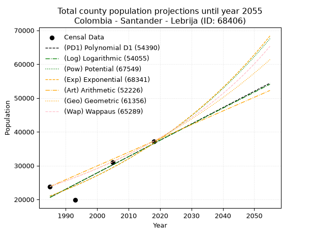
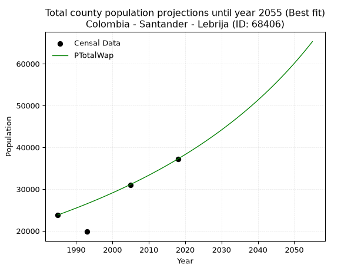
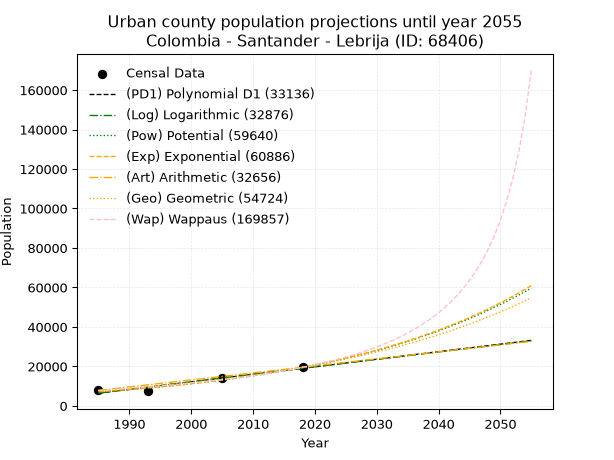
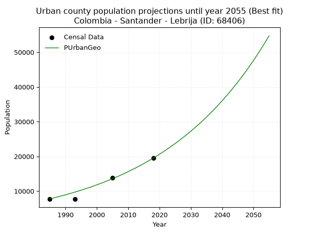
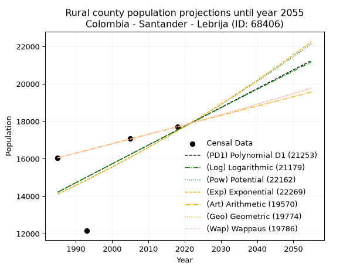
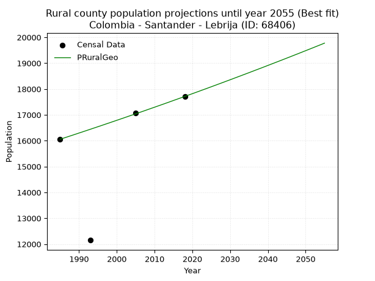

<div align="center">


</div>

# _“Population and Public Services Demand Projections (PPSD) until Year 2050 for Colombia - Santander - Lebríja (ID: 68406)”_
Keywords: `population` `public-service` `projection` `lineal` `polynomial` `logarithmic` `potential` `exponential` `arithmetic` `geometric` `wappaus` `dane` `colombia` `south-america`

PPSD are analytical estimates used by governments and planners to anticipate future changes in population size, age distribution, and the resulting community needs for utilities, healthcare, education, and infrastructure as sizing future water treatment facilities, electrical grids, and road networks based on spatial growth.

> **General running parameters**: • app_version: _v20260806_. • Python version: _3.14.7_. • Pandas version: _3.0.5_. • NumPy version: _2.5.1_. • Creates, save and include plots into reports (create_plot): _False_. • Projection until year: _2050_. • Process polynomial degree 2 and up: _False_. • Process Wappaus: _True_. • Process Wappaus: _True_. • Set negative values to zero: _True_. • Set infinite values to zero: _True_. • Drop dataset notes: _True_. 
<div align="center">

Dynamic map: [:earth_americas:Google](http://maps.google.com/maps?q=7.113350953,-73.2195244) [:earth_americas:OSM](https://www.openstreetmap.org/#map=18/7.113350953/-73.2195244&layers=P) [:earth_americas:Bing](https://www.bing.com/maps?cp=7.113350953~-73.2195244&lvl=18) [:earth_americas:Apple](https://maps.apple.com/frame?center=7.113350953%2C-73.2195244&span=0.003%2C0.006)

</div>


<div align="center">

```geojson
{
  "type": "Feature",
  "geometry": {
    "type": "Point", 
    "coordinates": [-73.2195244, 7.113350953]
  }, 
  "properties": {
    "Name": "Colombia - Santander - Lebríja (ID: 68406)"
  }
}
```

</div>


## 0. Census Data (4 records)

Census data are official statistics collected by a government about the people and housing in a country. They usually include counts of total population, age, sex, race, income, education, and jobs.

📅Global census file: [Population.xlsx](../data/Population.xlsx)

| Source   |   Year |   CountryID | CountryName   |   StateID | StateName   |   CountyID | CountyName   |   PTotal |   PUrban |   PRural |
|:---------|-------:|------------:|:--------------|----------:|:------------|-----------:|:-------------|---------:|---------:|---------:|
| DANE     |   1985 |          57 | Colombia      |        68 | Santander   |      68406 | Lebríja      |    23825 |     7770 |    16055 |
| DANE     |   1993 |          57 | Colombia      |        68 | Santander   |      68406 | Lebrija      |    19832 |     7682 |    12150 |
| DANE     |   2005 |          57 | Colombia      |        68 | Santander   |      68406 | Lebríja      |    30980 |    13898 |    17082 |
| DANE     |   2018 |          57 | Colombia      |        68 | Santander   |      68406 | Lebrija      |    37214 |    19502 |    17712 |

> 🔥Some records could had specific notes about the registered values or the corresponding urban or rural distribution.

## 1. Total

### 1.1. Coefficients and Parameters

* (PD1) Polynomial Deg 1: 482.68205539943324, -937522.0313127164 (lineal)
* (Log) Logarithmic: 965551.6118975249, -7311202.789478109
* (Pow) Potential: 33.7056376060977, -106.83081908025461
* (Exp) Exponential: 0.016849322701614728, 6.26731696295695e-11
* (Art) Arithmetic: Year diff. 2018 - 1985 = 33, Population diff. 37214 - 23825 = 13389, Annual growth = 405.72727272727275
* (Geo) Geometric: Year diff. 2018 - 1985 = 33, Population diff. 37214 - 23825 = 13389, Annual growth % = 0.01360534550113357
* (Wap) Wappaus: i = 1.329403406763783, Condition values only valid for < 200)

<sub>
Wappaus condition values: ['0.00', '1.33', '2.66', '3.99', '5.32', '6.65', '7.98', '9.31', '10.64', '11.96', '13.29', '14.62', '15.95', '17.28', '18.61', '19.94', '21.27', '22.60', '23.93', '25.26', '26.59', '27.92', '29.25', '30.58', '31.91', '33.24', '34.56', '35.89', '37.22', '38.55', '39.88', '41.21', '42.54', '43.87', '45.20', '46.53', '47.86', '49.19', '50.52', '51.85', '53.18', '54.51', '55.83', '57.16', '58.49', '59.82', '61.15', '62.48', '63.81', '65.14', '66.47', '67.80', '69.13', '70.46', '71.79', '73.12', '74.45', '75.78', '77.11', '78.43', '79.76', '81.09', '82.42', '83.75', '85.08', '86.41']
</sub>


### 1.2. Projected Dataset

|   Year |   CountyID |   PTotalPD1 |   PTotalLog |   PTotalPow |   PTotalExp |   PTotalArt |   PTotalGeo |   PTotalWap |
|-------:|-----------:|------------:|------------:|------------:|------------:|------------:|------------:|------------:|
|   1985 |      68406 |       20602 |       20592 |       21004 |       21011 |       23825 |       23825 |       23825 |
|   1986 |      68406 |       21085 |       21078 |       21364 |       21368 |       24231 |       24149 |       24144 |
|   1987 |      68406 |       21567 |       21564 |       21729 |       21731 |       24636 |       24478 |       24467 |
|   1988 |      68406 |       22050 |       22050 |       22101 |       22101 |       25042 |       24811 |       24795 |
|   1989 |      68406 |       22533 |       22536 |       22479 |       22476 |       25448 |       25148 |       25127 |
|   1990 |      68406 |       23015 |       23021 |       22863 |       22858 |       25854 |       25490 |       25463 |
|   1991 |      68406 |       23498 |       23506 |       23253 |       23247 |       26259 |       25837 |       25804 |
|   1992 |      68406 |       23981 |       23991 |       23650 |       23642 |       26665 |       26189 |       26150 |
|   1993 |      68406 |       24463 |       24475 |       24053 |       24043 |       27071 |       26545 |       26501 |
|   1994 |      68406 |       24946 |       24960 |       24464 |       24452 |       27477 |       26906 |       26857 |
|   1995 |      68406 |       25429 |       25444 |       24881 |       24867 |       27882 |       27272 |       27218 |
|   1996 |      68406 |       25911 |       25928 |       25304 |       25290 |       28288 |       27643 |       27584 |
|   1997 |      68406 |       26394 |       26411 |       25735 |       25720 |       28694 |       28019 |       27955 |
|   1998 |      68406 |       26877 |       26895 |       26173 |       26157 |       29099 |       28401 |       28332 |
|   1999 |      68406 |       27359 |       27378 |       26618 |       26601 |       29505 |       28787 |       28714 |
|   2000 |      68406 |       27842 |       27861 |       27071 |       27053 |       29911 |       29179 |       29102 |
|   2001 |      68406 |       28325 |       28343 |       27531 |       27513 |       30317 |       29576 |       29496 |
|   2002 |      68406 |       28807 |       28826 |       27998 |       27980 |       30722 |       29978 |       29895 |
|   2003 |      68406 |       29290 |       29308 |       28474 |       28456 |       31128 |       30386 |       30301 |
|   2004 |      68406 |       29773 |       29790 |       28957 |       28939 |       31534 |       30799 |       30713 |
|   2005 |      68406 |       30255 |       30272 |       29448 |       29431 |       31940 |       31218 |       31131 |
|   2006 |      68406 |       30738 |       30753 |       29947 |       29931 |       32345 |       31643 |       31555 |
|   2007 |      68406 |       31221 |       31234 |       30454 |       30440 |       32751 |       32074 |       31987 |
|   2008 |      68406 |       31704 |       31715 |       30970 |       30957 |       33157 |       32510 |       32425 |
|   2009 |      68406 |       32186 |       32196 |       31494 |       31483 |       33562 |       32952 |       32869 |
|   2010 |      68406 |       32669 |       32677 |       32027 |       32018 |       33968 |       33401 |       33321 |
|   2011 |      68406 |       33152 |       33157 |       32568 |       32562 |       34374 |       33855 |       33781 |
|   2012 |      68406 |       33634 |       33637 |       33118 |       33115 |       34780 |       34316 |       34247 |
|   2013 |      68406 |       34117 |       34117 |       33678 |       33678 |       35185 |       34783 |       34721 |
|   2014 |      68406 |       34600 |       34596 |       34246 |       34250 |       35591 |       35256 |       35204 |
|   2015 |      68406 |       35082 |       35075 |       34824 |       34832 |       35997 |       35735 |       35694 |
|   2016 |      68406 |       35565 |       35555 |       35411 |       35424 |       36403 |       36222 |       36192 |
|   2017 |      68406 |       36048 |       36033 |       36008 |       36026 |       36808 |       36714 |       36699 |
|   2018 |      68406 |       36530 |       36512 |       36615 |       36638 |       37214 |       37214 |       37214 |
|   2019 |      68406 |       37013 |       36990 |       37231 |       37261 |       37620 |       37720 |       37738 |
|   2020 |      68406 |       37496 |       37468 |       37858 |       37894 |       38025 |       38234 |       38271 |
|   2021 |      68406 |       37978 |       37946 |       38495 |       38538 |       38431 |       38754 |       38814 |
|   2022 |      68406 |       38461 |       38424 |       39142 |       39193 |       38837 |       39281 |       39366 |
|   2023 |      68406 |       38944 |       38901 |       39800 |       39859 |       39243 |       39815 |       39928 |
|   2024 |      68406 |       39426 |       39378 |       40468 |       40536 |       39648 |       40357 |       40500 |
|   2025 |      68406 |       39909 |       39855 |       41148 |       41225 |       40054 |       40906 |       41083 |
|   2026 |      68406 |       40392 |       40332 |       41838 |       41925 |       40460 |       41463 |       41676 |
|   2027 |      68406 |       40874 |       40809 |       42540 |       42638 |       40866 |       42027 |       42280 |
|   2028 |      68406 |       41357 |       41285 |       43253 |       43362 |       41271 |       42599 |       42895 |
|   2029 |      68406 |       41840 |       41761 |       43978 |       44099 |       41677 |       43178 |       43522 |
|   2030 |      68406 |       42323 |       42237 |       44714 |       44848 |       42083 |       43766 |       44161 |
|   2031 |      68406 |       42805 |       42712 |       45462 |       45610 |       42488 |       44361 |       44811 |
|   2032 |      68406 |       43288 |       43187 |       46223 |       46385 |       42894 |       44965 |       45475 |
|   2033 |      68406 |       43771 |       43662 |       46996 |       47173 |       43300 |       45576 |       46151 |
|   2034 |      68406 |       44253 |       44137 |       47781 |       47975 |       43706 |       46196 |       46841 |
|   2035 |      68406 |       44736 |       44612 |       48580 |       48790 |       44111 |       46825 |       47545 |
|   2036 |      68406 |       45219 |       45086 |       49391 |       49619 |       44517 |       47462 |       48263 |
|   2037 |      68406 |       45701 |       45560 |       50215 |       50462 |       44923 |       48108 |       48995 |
|   2038 |      68406 |       46184 |       46034 |       51053 |       51320 |       45329 |       48762 |       49742 |
|   2039 |      68406 |       46667 |       46508 |       51904 |       52192 |       45734 |       49426 |       50505 |
|   2040 |      68406 |       47149 |       46981 |       52769 |       53079 |       46140 |       50098 |       51284 |
|   2041 |      68406 |       47632 |       47454 |       53648 |       53981 |       46546 |       50780 |       52079 |
|   2042 |      68406 |       48115 |       47927 |       54541 |       54898 |       46951 |       51471 |       52891 |
|   2043 |      68406 |       48597 |       48400 |       55448 |       55831 |       47357 |       52171 |       53721 |
|   2044 |      68406 |       49080 |       48873 |       56370 |       56779 |       47763 |       52881 |       54569 |
|   2045 |      68406 |       49563 |       49345 |       57307 |       57744 |       48169 |       53600 |       55436 |
|   2046 |      68406 |       50045 |       49817 |       58259 |       58725 |       48574 |       54329 |       56322 |
|   2047 |      68406 |       50528 |       50289 |       59227 |       59723 |       48980 |       55069 |       57228 |
|   2048 |      68406 |       51011 |       50760 |       60210 |       60738 |       49386 |       55818 |       58155 |
|   2049 |      68406 |       51494 |       51232 |       61209 |       61770 |       49792 |       56577 |       59104 |
|   2050 |      68406 |       51976 |       51703 |       62224 |       62820 |       50197 |       57347 |       60074 |
<div align="center">

</img>

</div>


### 1.3. Best fit with absolute and relative error (%)

Relative error puts that difference into context by dividing the absolute error by the true value, creating a unitless ratio or percentage that shows the scale of the mistake.

Absolute and relative error

|   Year | Source   |   CountryID | CountryName   |   StateID | StateName   |   CountyID_x | CountyName   |   PTotal |   PUrban |   PRural |   CountyID_y |   PTotalPD1 |   PTotalLog |   PTotalPow |   PTotalExp |   PTotalArt |   PTotalGeo |   PTotalWap |   PTotalPD1AbsError |   PTotalLogAbsError |   PTotalPowAbsError |   PTotalExpAbsError |   PTotalArtAbsError |   PTotalGeoAbsError |   PTotalWapAbsError |   PTotalPD1RelError |   PTotalLogRelError |   PTotalPowRelError |   PTotalExpRelError |   PTotalArtRelError |   PTotalGeoRelError |   PTotalWapRelError |
|-------:|:---------|------------:|:--------------|----------:|:------------|-------------:|:-------------|---------:|---------:|---------:|-------------:|------------:|------------:|------------:|------------:|------------:|------------:|------------:|--------------------:|--------------------:|--------------------:|--------------------:|--------------------:|--------------------:|--------------------:|--------------------:|--------------------:|--------------------:|--------------------:|--------------------:|--------------------:|--------------------:|
|   1985 | DANE     |          57 | Colombia      |        68 | Santander   |        68406 | Lebríja      |    23825 |     7770 |    16055 |        68406 |       20602 |       20592 |       21004 |       21011 |       23825 |       23825 |       23825 |                3223 |                3233 |                2821 |                2814 |                   0 |                   0 |                   0 |            13.5278  |            13.5698  |            11.8405  |             11.8111 |             0       |            0        |            0        |
|   1993 | DANE     |          57 | Colombia      |        68 | Santander   |        68406 | Lebrija      |    19832 |     7682 |    12150 |        68406 |       24463 |       24475 |       24053 |       24043 |       27071 |       26545 |       26501 |                4631 |                4643 |                4221 |                4211 |                7239 |                6713 |                6669 |            23.3511  |            23.4117  |            21.2838  |             21.2334 |            36.5016  |           33.8493   |           33.6275   |
|   2005 | DANE     |          57 | Colombia      |        68 | Santander   |        68406 | Lebríja      |    30980 |    13898 |    17082 |        68406 |       30255 |       30272 |       29448 |       29431 |       31940 |       31218 |       31131 |                 725 |                 708 |                1532 |                1549 |                 960 |                 238 |                 151 |             2.34022 |             2.28535 |             4.94513 |              5      |             3.09877 |            0.768238 |            0.487411 |
|   2018 | DANE     |          57 | Colombia      |        68 | Santander   |        68406 | Lebrija      |    37214 |    19502 |    17712 |        68406 |       36530 |       36512 |       36615 |       36638 |       37214 |       37214 |       37214 |                 684 |                 702 |                 599 |                 576 |                   0 |                   0 |                   0 |             1.83802 |             1.88639 |             1.60961 |              1.5478 |             0       |            0        |            0        |

Relative error mean

| Method    |   RelError | Best   |
|:----------|-----------:|:-------|
| PTotalPD1 |   10.2643  |        |
| PTotalLog |   10.2883  |        |
| PTotalPow |    9.91976 |        |
| PTotalExp |    9.89807 |        |
| PTotalArt |    9.9001  |        |
| PTotalGeo |    8.65439 |        |
| PTotalWap |    8.52872 | True   |

💙Best method: _**PTotalWap**_
<div align="center">

</img>

</div>


### 1.4. Fresh water supply demand in liters per capita per day (lpcd)

The fresh water supply demand typically ranges from 100 to 300 liters per capita per day (lpcd) for standard domestic and municipal planning, though absolute survival minimums set by the World Health Organization are as low as 7.5 to 20 liters per day, and total consumption in high-income nations can exceed 400 liters.

> `CZ`: Level in meters above the sea level (masl).<br> `WS`: Fresh water supply demand in liters per capita per day (lpcd or l/h/d).<br> `WSAll`: Zonal fresh water supply demand in liters per second (l/s).<br> `A`: Zonal area in square meters.

Reference values (RAS Colombia)

|    CZ |   WS |
|------:|-----:|
|  1000 |  120 |
|  2000 |  130 |
| 99999 |  140 |

County shapefile geometry properties and water supply values

|   CountyID |      ATotal |   CZTotal |   WSTotal |
|-----------:|------------:|----------:|----------:|
|      68406 | 5.49468e+08 |    685.39 |       120 |

Projected values for best method: PTotalWap

|   CountyID |   Year |   PTotalWap |   WSTotal |   WSTotalAll |
|-----------:|-------:|------------:|----------:|-------------:|
|      68406 |   1985 |       23825 |       120 |      33.0903 |
|      68406 |   1986 |       24144 |       120 |      33.5333 |
|      68406 |   1987 |       24467 |       120 |      33.9819 |
|      68406 |   1988 |       24795 |       120 |      34.4375 |
|      68406 |   1989 |       25127 |       120 |      34.8986 |
|      68406 |   1990 |       25463 |       120 |      35.3653 |
|      68406 |   1991 |       25804 |       120 |      35.8389 |
|      68406 |   1992 |       26150 |       120 |      36.3194 |
|      68406 |   1993 |       26501 |       120 |      36.8069 |
|      68406 |   1994 |       26857 |       120 |      37.3014 |
|      68406 |   1995 |       27218 |       120 |      37.8028 |
|      68406 |   1996 |       27584 |       120 |      38.3111 |
|      68406 |   1997 |       27955 |       120 |      38.8264 |
|      68406 |   1998 |       28332 |       120 |      39.35   |
|      68406 |   1999 |       28714 |       120 |      39.8806 |
|      68406 |   2000 |       29102 |       120 |      40.4194 |
|      68406 |   2001 |       29496 |       120 |      40.9667 |
|      68406 |   2002 |       29895 |       120 |      41.5208 |
|      68406 |   2003 |       30301 |       120 |      42.0847 |
|      68406 |   2004 |       30713 |       120 |      42.6569 |
|      68406 |   2005 |       31131 |       120 |      43.2375 |
|      68406 |   2006 |       31555 |       120 |      43.8264 |
|      68406 |   2007 |       31987 |       120 |      44.4264 |
|      68406 |   2008 |       32425 |       120 |      45.0347 |
|      68406 |   2009 |       32869 |       120 |      45.6514 |
|      68406 |   2010 |       33321 |       120 |      46.2792 |
|      68406 |   2011 |       33781 |       120 |      46.9181 |
|      68406 |   2012 |       34247 |       120 |      47.5653 |
|      68406 |   2013 |       34721 |       120 |      48.2236 |
|      68406 |   2014 |       35204 |       120 |      48.8944 |
|      68406 |   2015 |       35694 |       120 |      49.575  |
|      68406 |   2016 |       36192 |       120 |      50.2667 |
|      68406 |   2017 |       36699 |       120 |      50.9708 |
|      68406 |   2018 |       37214 |       120 |      51.6861 |
|      68406 |   2019 |       37738 |       120 |      52.4139 |
|      68406 |   2020 |       38271 |       120 |      53.1542 |
|      68406 |   2021 |       38814 |       120 |      53.9083 |
|      68406 |   2022 |       39366 |       120 |      54.675  |
|      68406 |   2023 |       39928 |       120 |      55.4556 |
|      68406 |   2024 |       40500 |       120 |      56.25   |
|      68406 |   2025 |       41083 |       120 |      57.0597 |
|      68406 |   2026 |       41676 |       120 |      57.8833 |
|      68406 |   2027 |       42280 |       120 |      58.7222 |
|      68406 |   2028 |       42895 |       120 |      59.5764 |
|      68406 |   2029 |       43522 |       120 |      60.4472 |
|      68406 |   2030 |       44161 |       120 |      61.3347 |
|      68406 |   2031 |       44811 |       120 |      62.2375 |
|      68406 |   2032 |       45475 |       120 |      63.1597 |
|      68406 |   2033 |       46151 |       120 |      64.0986 |
|      68406 |   2034 |       46841 |       120 |      65.0569 |
|      68406 |   2035 |       47545 |       120 |      66.0347 |
|      68406 |   2036 |       48263 |       120 |      67.0319 |
|      68406 |   2037 |       48995 |       120 |      68.0486 |
|      68406 |   2038 |       49742 |       120 |      69.0861 |
|      68406 |   2039 |       50505 |       120 |      70.1458 |
|      68406 |   2040 |       51284 |       120 |      71.2278 |
|      68406 |   2041 |       52079 |       120 |      72.3319 |
|      68406 |   2042 |       52891 |       120 |      73.4597 |
|      68406 |   2043 |       53721 |       120 |      74.6125 |
|      68406 |   2044 |       54569 |       120 |      75.7903 |
|      68406 |   2045 |       55436 |       120 |      76.9944 |
|      68406 |   2046 |       56322 |       120 |      78.225  |
|      68406 |   2047 |       57228 |       120 |      79.4833 |
|      68406 |   2048 |       58155 |       120 |      80.7708 |
|      68406 |   2049 |       59104 |       120 |      82.0889 |
|      68406 |   2050 |       60074 |       120 |      83.4361 |

## 2. Urban

### 2.1. Coefficients and Parameters

* (PD1) Polynomial Deg 1: 382.15816940987185, -752198.878362096 (lineal)
* (Log) Logarithmic: 764625.0532290061, -5799708.156914308
* (Pow) Potential: 61.63152219459797, -199.39809702896622
* (Exp) Exponential: 0.03079721585360384, 1.9896016097245978e-23
* (Art) Arithmetic: Year diff. 2018 - 1985 = 33, Population diff. 19502 - 7770 = 11732, Annual growth = 355.5151515151515
* (Geo) Geometric: Year diff. 2018 - 1985 = 33, Population diff. 19502 - 7770 = 11732, Annual growth % = 0.028278730073924008
* (Wap) Wappaus: i = 2.6071806359280694, Condition values only valid for < 200)

<sub>
Wappaus condition values: ['0.00', '2.61', '5.21', '7.82', '10.43', '13.04', '15.64', '18.25', '20.86', '23.46', '26.07', '28.68', '31.29', '33.89', '36.50', '39.11', '41.71', '44.32', '46.93', '49.54', '52.14', '54.75', '57.36', '59.97', '62.57', '65.18', '67.79', '70.39', '73.00', '75.61', '78.22', '80.82', '83.43', '86.04', '88.64', '91.25', '93.86', '96.47', '99.07', '101.68', '104.29', '106.89', '109.50', '112.11', '114.72', '117.32', '119.93', '122.54', '125.14', '127.75', '130.36', '132.97', '135.57', '138.18', '140.79', '143.39', '146.00', '148.61', '151.22', '153.82', '156.43', '159.04', '161.65', '164.25', '166.86', '169.47']
</sub>


### 2.2. Projected Dataset

|   Year |   CountyID |   PUrbanPD1 |   PUrbanLog |   PUrbanPow |   PUrbanExp |   PUrbanArt |   PUrbanGeo |   PUrbanWap |
|-------:|-----------:|------------:|------------:|------------:|------------:|------------:|------------:|------------:|
|   1985 |      68406 |        6385 |        6376 |        7045 |        7051 |        7770 |        7770 |        7770 |
|   1986 |      68406 |        6767 |        6761 |        7267 |        7272 |        8126 |        7990 |        7975 |
|   1987 |      68406 |        7149 |        7146 |        7496 |        7499 |        8481 |        8216 |        8186 |
|   1988 |      68406 |        7532 |        7531 |        7733 |        7734 |        8837 |        8448 |        8402 |
|   1989 |      68406 |        7914 |        7915 |        7976 |        7976 |        9192 |        8687 |        8625 |
|   1990 |      68406 |        8296 |        8300 |        8227 |        8225 |        9548 |        8933 |        8854 |
|   1991 |      68406 |        8678 |        8684 |        8486 |        8482 |        9903 |        9185 |        9089 |
|   1992 |      68406 |        9060 |        9068 |        8752 |        8748 |       10259 |        9445 |        9330 |
|   1993 |      68406 |        9442 |        9451 |        9027 |        9021 |       10614 |        9712 |        9579 |
|   1994 |      68406 |        9825 |        9835 |        9311 |        9303 |       10970 |        9987 |        9836 |
|   1995 |      68406 |       10207 |       10218 |        9603 |        9594 |       11325 |       10269 |       10099 |
|   1996 |      68406 |       10589 |       10602 |        9904 |        9894 |       11681 |       10559 |       10371 |
|   1997 |      68406 |       10971 |       10984 |       10215 |       10204 |       12036 |       10858 |       10652 |
|   1998 |      68406 |       11353 |       11367 |       10535 |       10523 |       12392 |       11165 |       10941 |
|   1999 |      68406 |       11735 |       11750 |       10865 |       10852 |       12747 |       11481 |       11239 |
|   2000 |      68406 |       12117 |       12132 |       11205 |       11191 |       13103 |       11805 |       11547 |
|   2001 |      68406 |       12500 |       12515 |       11555 |       11542 |       13458 |       12139 |       11865 |
|   2002 |      68406 |       12882 |       12897 |       11917 |       11902 |       13814 |       12483 |       12194 |
|   2003 |      68406 |       13264 |       13278 |       12289 |       12275 |       14169 |       12836 |       12534 |
|   2004 |      68406 |       13646 |       13660 |       12673 |       12659 |       14525 |       13199 |       12886 |
|   2005 |      68406 |       14028 |       14041 |       13069 |       13055 |       14880 |       13572 |       13250 |
|   2006 |      68406 |       14410 |       14423 |       13477 |       13463 |       15236 |       13956 |       13628 |
|   2007 |      68406 |       14793 |       14804 |       13897 |       13884 |       15591 |       14350 |       14019 |
|   2008 |      68406 |       15175 |       15185 |       14330 |       14318 |       15947 |       14756 |       14424 |
|   2009 |      68406 |       15557 |       15565 |       14777 |       14766 |       16302 |       15173 |       14846 |
|   2010 |      68406 |       15939 |       15946 |       15237 |       15228 |       16658 |       15602 |       15283 |
|   2011 |      68406 |       16321 |       16326 |       15711 |       15704 |       17013 |       16044 |       15737 |
|   2012 |      68406 |       16703 |       16706 |       16200 |       16195 |       17369 |       16497 |       16210 |
|   2013 |      68406 |       17086 |       17086 |       16704 |       16702 |       17724 |       16964 |       16703 |
|   2014 |      68406 |       17468 |       17466 |       17223 |       17224 |       18080 |       17444 |       17216 |
|   2015 |      68406 |       17850 |       17846 |       17758 |       17763 |       18435 |       17937 |       17750 |
|   2016 |      68406 |       18232 |       18225 |       18310 |       18318 |       18791 |       18444 |       18309 |
|   2017 |      68406 |       18614 |       18604 |       18878 |       18891 |       19146 |       18966 |       18892 |
|   2018 |      68406 |       18996 |       18983 |       19464 |       19482 |       19502 |       19502 |       19502 |
|   2019 |      68406 |       19378 |       19362 |       20067 |       20092 |       19858 |       20053 |       20141 |
|   2020 |      68406 |       19761 |       19741 |       20689 |       20720 |       20213 |       20621 |       20810 |
|   2021 |      68406 |       20143 |       20119 |       21330 |       21368 |       20569 |       21204 |       21512 |
|   2022 |      68406 |       20525 |       20497 |       21990 |       22036 |       20924 |       21803 |       22249 |
|   2023 |      68406 |       20907 |       20875 |       22671 |       22726 |       21280 |       22420 |       23024 |
|   2024 |      68406 |       21289 |       21253 |       23372 |       23436 |       21635 |       23054 |       23841 |
|   2025 |      68406 |       21671 |       21631 |       24094 |       24169 |       21991 |       23706 |       24702 |
|   2026 |      68406 |       22054 |       22008 |       24838 |       24925 |       22346 |       24376 |       25611 |
|   2027 |      68406 |       22436 |       22386 |       25605 |       25705 |       22702 |       25066 |       26573 |
|   2028 |      68406 |       22818 |       22763 |       26396 |       26509 |       23057 |       25774 |       27592 |
|   2029 |      68406 |       23200 |       23140 |       27210 |       27338 |       23413 |       26503 |       28673 |
|   2030 |      68406 |       23582 |       23516 |       28049 |       28193 |       23768 |       27253 |       29822 |
|   2031 |      68406 |       23964 |       23893 |       28913 |       29075 |       24124 |       28023 |       31046 |
|   2032 |      68406 |       24347 |       24269 |       29804 |       29984 |       24479 |       28816 |       32353 |
|   2033 |      68406 |       24729 |       24646 |       30722 |       30922 |       24835 |       29631 |       33750 |
|   2034 |      68406 |       25111 |       25022 |       31667 |       31889 |       25190 |       30469 |       35248 |
|   2035 |      68406 |       25493 |       25397 |       32641 |       32886 |       25546 |       31330 |       36859 |
|   2036 |      68406 |       25875 |       25773 |       33644 |       33915 |       25901 |       32216 |       38595 |
|   2037 |      68406 |       26257 |       26149 |       34678 |       34976 |       26257 |       33127 |       40471 |
|   2038 |      68406 |       26639 |       26524 |       35743 |       36070 |       26612 |       34064 |       42505 |
|   2039 |      68406 |       27022 |       26899 |       36840 |       37198 |       26968 |       35027 |       44719 |
|   2040 |      68406 |       27404 |       27274 |       37971 |       38361 |       27323 |       36018 |       47137 |
|   2041 |      68406 |       27786 |       27649 |       39135 |       39561 |       27679 |       37036 |       49788 |
|   2042 |      68406 |       28168 |       28023 |       40334 |       40798 |       28034 |       38084 |       52708 |
|   2043 |      68406 |       28550 |       28397 |       41570 |       42074 |       28390 |       39161 |       55940 |
|   2044 |      68406 |       28932 |       28772 |       42843 |       43390 |       28745 |       40268 |       59537 |
|   2045 |      68406 |       29315 |       29146 |       44154 |       44747 |       29101 |       41407 |       63565 |
|   2046 |      68406 |       29697 |       29519 |       45505 |       46147 |       29456 |       42578 |       68105 |
|   2047 |      68406 |       30079 |       29893 |       46896 |       47590 |       29812 |       43782 |       73263 |
|   2048 |      68406 |       30461 |       30267 |       48329 |       49078 |       30167 |       45020 |       79173 |
|   2049 |      68406 |       30843 |       30640 |       49805 |       50613 |       30523 |       46293 |       86013 |
|   2050 |      68406 |       31225 |       31013 |       51326 |       52196 |       30878 |       47602 |       94021 |
<div align="center">

</img>

</div>


### 2.3. Best fit with absolute and relative error (%)

Relative error puts that difference into context by dividing the absolute error by the true value, creating a unitless ratio or percentage that shows the scale of the mistake.

Absolute and relative error

|   Year | Source   |   CountryID | CountryName   |   StateID | StateName   |   CountyID_x | CountyName   |   PTotal |   PUrban |   PRural |   CountyID_y |   PUrbanPD1 |   PUrbanLog |   PUrbanPow |   PUrbanExp |   PUrbanArt |   PUrbanGeo |   PUrbanWap |   PUrbanPD1AbsError |   PUrbanLogAbsError |   PUrbanPowAbsError |   PUrbanExpAbsError |   PUrbanArtAbsError |   PUrbanGeoAbsError |   PUrbanWapAbsError |   PUrbanPD1RelError |   PUrbanLogRelError |   PUrbanPowRelError |   PUrbanExpRelError |   PUrbanArtRelError |   PUrbanGeoRelError |   PUrbanWapRelError |
|-------:|:---------|------------:|:--------------|----------:|:------------|-------------:|:-------------|---------:|---------:|---------:|-------------:|------------:|------------:|------------:|------------:|------------:|------------:|------------:|--------------------:|--------------------:|--------------------:|--------------------:|--------------------:|--------------------:|--------------------:|--------------------:|--------------------:|--------------------:|--------------------:|--------------------:|--------------------:|--------------------:|
|   1985 | DANE     |          57 | Colombia      |        68 | Santander   |        68406 | Lebríja      |    23825 |     7770 |    16055 |        68406 |        6385 |        6376 |        7045 |        7051 |        7770 |        7770 |        7770 |                1385 |                1394 |                 725 |                 719 |                   0 |                   0 |                   0 |           17.825    |            17.9408  |            9.33076  |            9.25354  |             0       |             0       |             0       |
|   1993 | DANE     |          57 | Colombia      |        68 | Santander   |        68406 | Lebrija      |    19832 |     7682 |    12150 |        68406 |        9442 |        9451 |        9027 |        9021 |       10614 |        9712 |        9579 |                1760 |                1769 |                1345 |                1339 |                2932 |                2030 |                1897 |           22.9107   |            23.0279  |           17.5085   |           17.4304   |            38.1671  |            26.4254  |            24.6941  |
|   2005 | DANE     |          57 | Colombia      |        68 | Santander   |        68406 | Lebríja      |    30980 |    13898 |    17082 |        68406 |       14028 |       14041 |       13069 |       13055 |       14880 |       13572 |       13250 |                 130 |                 143 |                 829 |                 843 |                 982 |                 326 |                 648 |            0.935386 |             1.02893 |            5.96489  |            6.06562  |             7.06576 |             2.34566 |             4.66254 |
|   2018 | DANE     |          57 | Colombia      |        68 | Santander   |        68406 | Lebrija      |    37214 |    19502 |    17712 |        68406 |       18996 |       18983 |       19464 |       19482 |       19502 |       19502 |       19502 |                 506 |                 519 |                  38 |                  20 |                   0 |                   0 |                   0 |            2.59461  |             2.66127 |            0.194852 |            0.102554 |             0       |             0       |             0       |

Relative error mean

| Method    |   RelError | Best   |
|:----------|-----------:|:-------|
| PUrbanPD1 |   11.0664  |        |
| PUrbanLog |   11.1647  |        |
| PUrbanPow |    8.24974 |        |
| PUrbanExp |    8.21302 |        |
| PUrbanArt |   11.3082  |        |
| PUrbanGeo |    7.19277 | True   |
| PUrbanWap |    7.33916 |        |

💙Best method: _**PUrbanGeo**_
<div align="center">

</img>

</div>


### 2.4. Fresh water supply demand in liters per capita per day (lpcd)

The fresh water supply demand typically ranges from 100 to 300 liters per capita per day (lpcd) for standard domestic and municipal planning, though absolute survival minimums set by the World Health Organization are as low as 7.5 to 20 liters per day, and total consumption in high-income nations can exceed 400 liters.

> `CZ`: Level in meters above the sea level (masl).<br> `WS`: Fresh water supply demand in liters per capita per day (lpcd or l/h/d).<br> `WSAll`: Zonal fresh water supply demand in liters per second (l/s).<br> `A`: Zonal area in square meters.

Reference values (RAS Colombia)

|    CZ |   WS |
|------:|-----:|
|  1000 |  120 |
|  2000 |  130 |
| 99999 |  140 |

County shapefile geometry properties and water supply values

|   CountyID |      AUrban |   CZUrban |   WSUrban |
|-----------:|------------:|----------:|----------:|
|      68406 | 2.91364e+06 |   1028.99 |       130 |

Projected values for best method: PUrbanGeo

|   CountyID |   Year |   PUrbanGeo |   WSUrban |   WSUrbanAll |
|-----------:|-------:|------------:|----------:|-------------:|
|      68406 |   1985 |        7770 |       130 |      11.691  |
|      68406 |   1986 |        7990 |       130 |      12.022  |
|      68406 |   1987 |        8216 |       130 |      12.362  |
|      68406 |   1988 |        8448 |       130 |      12.7111 |
|      68406 |   1989 |        8687 |       130 |      13.0707 |
|      68406 |   1990 |        8933 |       130 |      13.4409 |
|      68406 |   1991 |        9185 |       130 |      13.82   |
|      68406 |   1992 |        9445 |       130 |      14.2112 |
|      68406 |   1993 |        9712 |       130 |      14.613  |
|      68406 |   1994 |        9987 |       130 |      15.0267 |
|      68406 |   1995 |       10269 |       130 |      15.451  |
|      68406 |   1996 |       10559 |       130 |      15.8874 |
|      68406 |   1997 |       10858 |       130 |      16.3373 |
|      68406 |   1998 |       11165 |       130 |      16.7992 |
|      68406 |   1999 |       11481 |       130 |      17.2747 |
|      68406 |   2000 |       11805 |       130 |      17.7622 |
|      68406 |   2001 |       12139 |       130 |      18.2647 |
|      68406 |   2002 |       12483 |       130 |      18.7823 |
|      68406 |   2003 |       12836 |       130 |      19.3134 |
|      68406 |   2004 |       13199 |       130 |      19.8596 |
|      68406 |   2005 |       13572 |       130 |      20.4208 |
|      68406 |   2006 |       13956 |       130 |      20.9986 |
|      68406 |   2007 |       14350 |       130 |      21.5914 |
|      68406 |   2008 |       14756 |       130 |      22.2023 |
|      68406 |   2009 |       15173 |       130 |      22.8297 |
|      68406 |   2010 |       15602 |       130 |      23.4752 |
|      68406 |   2011 |       16044 |       130 |      24.1403 |
|      68406 |   2012 |       16497 |       130 |      24.8219 |
|      68406 |   2013 |       16964 |       130 |      25.5245 |
|      68406 |   2014 |       17444 |       130 |      26.2468 |
|      68406 |   2015 |       17937 |       130 |      26.9885 |
|      68406 |   2016 |       18444 |       130 |      27.7514 |
|      68406 |   2017 |       18966 |       130 |      28.5368 |
|      68406 |   2018 |       19502 |       130 |      29.3433 |
|      68406 |   2019 |       20053 |       130 |      30.1723 |
|      68406 |   2020 |       20621 |       130 |      31.027  |
|      68406 |   2021 |       21204 |       130 |      31.9042 |
|      68406 |   2022 |       21803 |       130 |      32.8054 |
|      68406 |   2023 |       22420 |       130 |      33.7338 |
|      68406 |   2024 |       23054 |       130 |      34.6877 |
|      68406 |   2025 |       23706 |       130 |      35.6688 |
|      68406 |   2026 |       24376 |       130 |      36.6769 |
|      68406 |   2027 |       25066 |       130 |      37.715  |
|      68406 |   2028 |       25774 |       130 |      38.7803 |
|      68406 |   2029 |       26503 |       130 |      39.8772 |
|      68406 |   2030 |       27253 |       130 |      41.0057 |
|      68406 |   2031 |       28023 |       130 |      42.1642 |
|      68406 |   2032 |       28816 |       130 |      43.3574 |
|      68406 |   2033 |       29631 |       130 |      44.5837 |
|      68406 |   2034 |       30469 |       130 |      45.8446 |
|      68406 |   2035 |       31330 |       130 |      47.14   |
|      68406 |   2036 |       32216 |       130 |      48.4731 |
|      68406 |   2037 |       33127 |       130 |      49.8439 |
|      68406 |   2038 |       34064 |       130 |      51.2537 |
|      68406 |   2039 |       35027 |       130 |      52.7027 |
|      68406 |   2040 |       36018 |       130 |      54.1938 |
|      68406 |   2041 |       37036 |       130 |      55.7255 |
|      68406 |   2042 |       38084 |       130 |      57.3023 |
|      68406 |   2043 |       39161 |       130 |      58.9228 |
|      68406 |   2044 |       40268 |       130 |      60.5884 |
|      68406 |   2045 |       41407 |       130 |      62.3022 |
|      68406 |   2046 |       42578 |       130 |      64.0641 |
|      68406 |   2047 |       43782 |       130 |      65.8757 |
|      68406 |   2048 |       45020 |       130 |      67.7384 |
|      68406 |   2049 |       46293 |       130 |      69.6538 |
|      68406 |   2050 |       47602 |       130 |      71.6234 |

## 3. Rural

### 3.1. Coefficients and Parameters

* (PD1) Polynomial Deg 1: 100.52388598956173, -185323.15295062083 (lineal)
* (Log) Logarithmic: 200926.55866851856, -1511494.6325638006
* (Pow) Potential: 13.024752782021686, -38.80294846654318
* (Exp) Exponential: 0.00651702250611028, 0.033995922053563346
* (Art) Arithmetic: Year diff. 2018 - 1985 = 33, Population diff. 17712 - 16055 = 1657, Annual growth = 50.21212121212121
* (Geo) Geometric: Year diff. 2018 - 1985 = 33, Population diff. 17712 - 16055 = 1657, Annual growth % = 0.0029808596628648765
* (Wap) Wappaus: i = 0.2974035076383523, Condition values only valid for < 200)

<sub>
Wappaus condition values: ['0.00', '0.30', '0.59', '0.89', '1.19', '1.49', '1.78', '2.08', '2.38', '2.68', '2.97', '3.27', '3.57', '3.87', '4.16', '4.46', '4.76', '5.06', '5.35', '5.65', '5.95', '6.25', '6.54', '6.84', '7.14', '7.44', '7.73', '8.03', '8.33', '8.62', '8.92', '9.22', '9.52', '9.81', '10.11', '10.41', '10.71', '11.00', '11.30', '11.60', '11.90', '12.19', '12.49', '12.79', '13.09', '13.38', '13.68', '13.98', '14.28', '14.57', '14.87', '15.17', '15.46', '15.76', '16.06', '16.36', '16.65', '16.95', '17.25', '17.55', '17.84', '18.14', '18.44', '18.74', '19.03', '19.33']
</sub>


### 3.2. Projected Dataset

|   Year |   CountyID |   PRuralPD1 |   PRuralLog |   PRuralPow |   PRuralExp |   PRuralArt |   PRuralGeo |   PRuralWap |
|-------:|-----------:|------------:|------------:|------------:|------------:|------------:|------------:|------------:|
|   1985 |      68406 |       14217 |       14216 |       14111 |       14112 |       16055 |       16055 |       16055 |
|   1986 |      68406 |       14317 |       14317 |       14204 |       14204 |       16105 |       16103 |       16103 |
|   1987 |      68406 |       14418 |       14418 |       14298 |       14297 |       16155 |       16151 |       16151 |
|   1988 |      68406 |       14518 |       14519 |       14392 |       14391 |       16206 |       16199 |       16199 |
|   1989 |      68406 |       14619 |       14620 |       14486 |       14485 |       16256 |       16247 |       16247 |
|   1990 |      68406 |       14719 |       14721 |       14581 |       14579 |       16306 |       16296 |       16296 |
|   1991 |      68406 |       14820 |       14822 |       14677 |       14675 |       16356 |       16344 |       16344 |
|   1992 |      68406 |       14920 |       14923 |       14773 |       14771 |       16406 |       16393 |       16393 |
|   1993 |      68406 |       15021 |       15024 |       14870 |       14867 |       16457 |       16442 |       16442 |
|   1994 |      68406 |       15121 |       15125 |       14968 |       14964 |       16507 |       16491 |       16491 |
|   1995 |      68406 |       15222 |       15226 |       15066 |       15062 |       16557 |       16540 |       16540 |
|   1996 |      68406 |       15323 |       15326 |       15164 |       15161 |       16607 |       16589 |       16589 |
|   1997 |      68406 |       15423 |       15427 |       15264 |       15260 |       16658 |       16639 |       16638 |
|   1998 |      68406 |       15524 |       15528 |       15364 |       15360 |       16708 |       16688 |       16688 |
|   1999 |      68406 |       15624 |       15628 |       15464 |       15460 |       16758 |       16738 |       16738 |
|   2000 |      68406 |       15725 |       15729 |       15565 |       15561 |       16808 |       16788 |       16788 |
|   2001 |      68406 |       15825 |       15829 |       15667 |       15663 |       16858 |       16838 |       16838 |
|   2002 |      68406 |       15926 |       15929 |       15769 |       15765 |       16909 |       16888 |       16888 |
|   2003 |      68406 |       16026 |       16030 |       15872 |       15868 |       16959 |       16939 |       16938 |
|   2004 |      68406 |       16127 |       16130 |       15975 |       15972 |       17009 |       16989 |       16989 |
|   2005 |      68406 |       16227 |       16230 |       16080 |       16077 |       17059 |       17040 |       17039 |
|   2006 |      68406 |       16328 |       16330 |       16184 |       16182 |       17109 |       17091 |       17090 |
|   2007 |      68406 |       16428 |       16431 |       16290 |       16287 |       17160 |       17141 |       17141 |
|   2008 |      68406 |       16529 |       16531 |       16396 |       16394 |       17210 |       17193 |       17192 |
|   2009 |      68406 |       16629 |       16631 |       16502 |       16501 |       17260 |       17244 |       17243 |
|   2010 |      68406 |       16730 |       16731 |       16610 |       16609 |       17310 |       17295 |       17295 |
|   2011 |      68406 |       16830 |       16831 |       16718 |       16718 |       17361 |       17347 |       17346 |
|   2012 |      68406 |       16931 |       16930 |       16826 |       16827 |       17411 |       17398 |       17398 |
|   2013 |      68406 |       17031 |       17030 |       16936 |       16937 |       17461 |       17450 |       17450 |
|   2014 |      68406 |       17132 |       17130 |       17045 |       17048 |       17511 |       17502 |       17502 |
|   2015 |      68406 |       17232 |       17230 |       17156 |       17159 |       17561 |       17555 |       17554 |
|   2016 |      68406 |       17333 |       17330 |       17267 |       17271 |       17612 |       17607 |       17607 |
|   2017 |      68406 |       17434 |       17429 |       17379 |       17384 |       17662 |       17659 |       17659 |
|   2018 |      68406 |       17534 |       17529 |       17492 |       17498 |       17712 |       17712 |       17712 |
|   2019 |      68406 |       17635 |       17628 |       17605 |       17612 |       17762 |       17765 |       17765 |
|   2020 |      68406 |       17735 |       17728 |       17719 |       17727 |       17812 |       17818 |       17818 |
|   2021 |      68406 |       17836 |       17827 |       17833 |       17843 |       17863 |       17871 |       17871 |
|   2022 |      68406 |       17936 |       17927 |       17949 |       17960 |       17913 |       17924 |       17925 |
|   2023 |      68406 |       18037 |       18026 |       18065 |       18077 |       17963 |       17978 |       17978 |
|   2024 |      68406 |       18137 |       18125 |       18181 |       18196 |       18013 |       18031 |       18032 |
|   2025 |      68406 |       18238 |       18225 |       18299 |       18315 |       18063 |       18085 |       18086 |
|   2026 |      68406 |       18338 |       18324 |       18417 |       18434 |       18114 |       18139 |       18140 |
|   2027 |      68406 |       18439 |       18423 |       18535 |       18555 |       18164 |       18193 |       18194 |
|   2028 |      68406 |       18539 |       18522 |       18655 |       18676 |       18214 |       18247 |       18248 |
|   2029 |      68406 |       18640 |       18621 |       18775 |       18798 |       18264 |       18302 |       18303 |
|   2030 |      68406 |       18740 |       18720 |       18896 |       18921 |       18315 |       18356 |       18358 |
|   2031 |      68406 |       18841 |       18819 |       19018 |       19045 |       18365 |       18411 |       18413 |
|   2032 |      68406 |       18941 |       18918 |       19140 |       19169 |       18415 |       18466 |       18468 |
|   2033 |      68406 |       19042 |       19017 |       19263 |       19295 |       18465 |       18521 |       18523 |
|   2034 |      68406 |       19142 |       19116 |       19387 |       19421 |       18515 |       18576 |       18579 |
|   2035 |      68406 |       19243 |       19214 |       19511 |       19548 |       18566 |       18631 |       18634 |
|   2036 |      68406 |       19343 |       19313 |       19636 |       19676 |       18616 |       18687 |       18690 |
|   2037 |      68406 |       19444 |       19412 |       19762 |       19804 |       18666 |       18743 |       18746 |
|   2038 |      68406 |       19545 |       19510 |       19889 |       19934 |       18716 |       18798 |       18802 |
|   2039 |      68406 |       19645 |       19609 |       20017 |       20064 |       18766 |       18854 |       18859 |
|   2040 |      68406 |       19746 |       19707 |       20145 |       20195 |       18817 |       18911 |       18915 |
|   2041 |      68406 |       19846 |       19806 |       20274 |       20327 |       18867 |       18967 |       18972 |
|   2042 |      68406 |       19947 |       19904 |       20404 |       20460 |       18917 |       19024 |       19029 |
|   2043 |      68406 |       20047 |       20003 |       20534 |       20594 |       18967 |       19080 |       19086 |
|   2044 |      68406 |       20148 |       20101 |       20666 |       20729 |       19018 |       19137 |       19143 |
|   2045 |      68406 |       20248 |       20199 |       20798 |       20864 |       19068 |       19194 |       19201 |
|   2046 |      68406 |       20349 |       20298 |       20930 |       21001 |       19118 |       19251 |       19258 |
|   2047 |      68406 |       20449 |       20396 |       21064 |       21138 |       19168 |       19309 |       19316 |
|   2048 |      68406 |       20550 |       20494 |       21199 |       21276 |       19218 |       19366 |       19374 |
|   2049 |      68406 |       20650 |       20592 |       21334 |       21415 |       19269 |       19424 |       19432 |
|   2050 |      68406 |       20751 |       20690 |       21470 |       21555 |       19319 |       19482 |       19491 |
<div align="center">

</img>

</div>


### 3.3. Best fit with absolute and relative error (%)

Relative error puts that difference into context by dividing the absolute error by the true value, creating a unitless ratio or percentage that shows the scale of the mistake.

Absolute and relative error

|   Year | Source   |   CountryID | CountryName   |   StateID | StateName   |   CountyID_x | CountyName   |   PTotal |   PUrban |   PRural |   CountyID_y |   PRuralPD1 |   PRuralLog |   PRuralPow |   PRuralExp |   PRuralArt |   PRuralGeo |   PRuralWap |   PRuralPD1AbsError |   PRuralLogAbsError |   PRuralPowAbsError |   PRuralExpAbsError |   PRuralArtAbsError |   PRuralGeoAbsError |   PRuralWapAbsError |   PRuralPD1RelError |   PRuralLogRelError |   PRuralPowRelError |   PRuralExpRelError |   PRuralArtRelError |   PRuralGeoRelError |   PRuralWapRelError |
|-------:|:---------|------------:|:--------------|----------:|:------------|-------------:|:-------------|---------:|---------:|---------:|-------------:|------------:|------------:|------------:|------------:|------------:|------------:|------------:|--------------------:|--------------------:|--------------------:|--------------------:|--------------------:|--------------------:|--------------------:|--------------------:|--------------------:|--------------------:|--------------------:|--------------------:|--------------------:|--------------------:|
|   1985 | DANE     |          57 | Colombia      |        68 | Santander   |        68406 | Lebríja      |    23825 |     7770 |    16055 |        68406 |       14217 |       14216 |       14111 |       14112 |       16055 |       16055 |       16055 |                1838 |                1839 |                1944 |                1943 |                   0 |                   0 |                   0 |            11.4481  |            11.4544  |            12.1084  |            12.1021  |            0        |            0        |            0        |
|   1993 | DANE     |          57 | Colombia      |        68 | Santander   |        68406 | Lebrija      |    19832 |     7682 |    12150 |        68406 |       15021 |       15024 |       14870 |       14867 |       16457 |       16442 |       16442 |                2871 |                2874 |                2720 |                2717 |                4307 |                4292 |                4292 |            23.6296  |            23.6543  |            22.3868  |            22.3621  |           35.4486   |           35.3251   |           35.3251   |
|   2005 | DANE     |          57 | Colombia      |        68 | Santander   |        68406 | Lebríja      |    30980 |    13898 |    17082 |        68406 |       16227 |       16230 |       16080 |       16077 |       17059 |       17040 |       17039 |                 855 |                 852 |                1002 |                1005 |                  23 |                  42 |                  43 |             5.00527 |             4.98771 |             5.86582 |             5.88339 |            0.134645 |            0.245873 |            0.251727 |
|   2018 | DANE     |          57 | Colombia      |        68 | Santander   |        68406 | Lebrija      |    37214 |    19502 |    17712 |        68406 |       17534 |       17529 |       17492 |       17498 |       17712 |       17712 |       17712 |                 178 |                 183 |                 220 |                 214 |                   0 |                   0 |                   0 |             1.00497 |             1.0332  |             1.2421  |             1.20822 |            0        |            0        |            0        |

Relative error mean

| Method    |   RelError | Best   |
|:----------|-----------:|:-------|
| PRuralPD1 |   10.272   |        |
| PRuralLog |   10.2824  |        |
| PRuralPow |   10.4008  |        |
| PRuralExp |   10.389   |        |
| PRuralArt |    8.8958  |        |
| PRuralGeo |    8.89274 | True   |
| PRuralWap |    8.89421 |        |

💙Best method: _**PRuralGeo**_
<div align="center">

</img>

</div>


### 3.4. Fresh water supply demand in liters per capita per day (lpcd)

The fresh water supply demand typically ranges from 100 to 300 liters per capita per day (lpcd) for standard domestic and municipal planning, though absolute survival minimums set by the World Health Organization are as low as 7.5 to 20 liters per day, and total consumption in high-income nations can exceed 400 liters.

> `CZ`: Level in meters above the sea level (masl).<br> `WS`: Fresh water supply demand in liters per capita per day (lpcd or l/h/d).<br> `WSAll`: Zonal fresh water supply demand in liters per second (l/s).<br> `A`: Zonal area in square meters.

Reference values (RAS Colombia)

|    CZ |   WS |
|------:|-----:|
|  1000 |  120 |
|  2000 |  130 |
| 99999 |  140 |

County shapefile geometry properties and water supply values

|   CountyID |      ARural |   CZRural |   WSRural |
|-----------:|------------:|----------:|----------:|
|      68406 | 5.46554e+08 |   683.564 |       120 |

Projected values for best method: PRuralGeo

|   CountyID |   Year |   PRuralGeo |   WSRural |   WSRuralAll |
|-----------:|-------:|------------:|----------:|-------------:|
|      68406 |   1985 |       16055 |       120 |      22.2986 |
|      68406 |   1986 |       16103 |       120 |      22.3653 |
|      68406 |   1987 |       16151 |       120 |      22.4319 |
|      68406 |   1988 |       16199 |       120 |      22.4986 |
|      68406 |   1989 |       16247 |       120 |      22.5653 |
|      68406 |   1990 |       16296 |       120 |      22.6333 |
|      68406 |   1991 |       16344 |       120 |      22.7    |
|      68406 |   1992 |       16393 |       120 |      22.7681 |
|      68406 |   1993 |       16442 |       120 |      22.8361 |
|      68406 |   1994 |       16491 |       120 |      22.9042 |
|      68406 |   1995 |       16540 |       120 |      22.9722 |
|      68406 |   1996 |       16589 |       120 |      23.0403 |
|      68406 |   1997 |       16639 |       120 |      23.1097 |
|      68406 |   1998 |       16688 |       120 |      23.1778 |
|      68406 |   1999 |       16738 |       120 |      23.2472 |
|      68406 |   2000 |       16788 |       120 |      23.3167 |
|      68406 |   2001 |       16838 |       120 |      23.3861 |
|      68406 |   2002 |       16888 |       120 |      23.4556 |
|      68406 |   2003 |       16939 |       120 |      23.5264 |
|      68406 |   2004 |       16989 |       120 |      23.5958 |
|      68406 |   2005 |       17040 |       120 |      23.6667 |
|      68406 |   2006 |       17091 |       120 |      23.7375 |
|      68406 |   2007 |       17141 |       120 |      23.8069 |
|      68406 |   2008 |       17193 |       120 |      23.8792 |
|      68406 |   2009 |       17244 |       120 |      23.95   |
|      68406 |   2010 |       17295 |       120 |      24.0208 |
|      68406 |   2011 |       17347 |       120 |      24.0931 |
|      68406 |   2012 |       17398 |       120 |      24.1639 |
|      68406 |   2013 |       17450 |       120 |      24.2361 |
|      68406 |   2014 |       17502 |       120 |      24.3083 |
|      68406 |   2015 |       17555 |       120 |      24.3819 |
|      68406 |   2016 |       17607 |       120 |      24.4542 |
|      68406 |   2017 |       17659 |       120 |      24.5264 |
|      68406 |   2018 |       17712 |       120 |      24.6    |
|      68406 |   2019 |       17765 |       120 |      24.6736 |
|      68406 |   2020 |       17818 |       120 |      24.7472 |
|      68406 |   2021 |       17871 |       120 |      24.8208 |
|      68406 |   2022 |       17924 |       120 |      24.8944 |
|      68406 |   2023 |       17978 |       120 |      24.9694 |
|      68406 |   2024 |       18031 |       120 |      25.0431 |
|      68406 |   2025 |       18085 |       120 |      25.1181 |
|      68406 |   2026 |       18139 |       120 |      25.1931 |
|      68406 |   2027 |       18193 |       120 |      25.2681 |
|      68406 |   2028 |       18247 |       120 |      25.3431 |
|      68406 |   2029 |       18302 |       120 |      25.4194 |
|      68406 |   2030 |       18356 |       120 |      25.4944 |
|      68406 |   2031 |       18411 |       120 |      25.5708 |
|      68406 |   2032 |       18466 |       120 |      25.6472 |
|      68406 |   2033 |       18521 |       120 |      25.7236 |
|      68406 |   2034 |       18576 |       120 |      25.8    |
|      68406 |   2035 |       18631 |       120 |      25.8764 |
|      68406 |   2036 |       18687 |       120 |      25.9542 |
|      68406 |   2037 |       18743 |       120 |      26.0319 |
|      68406 |   2038 |       18798 |       120 |      26.1083 |
|      68406 |   2039 |       18854 |       120 |      26.1861 |
|      68406 |   2040 |       18911 |       120 |      26.2653 |
|      68406 |   2041 |       18967 |       120 |      26.3431 |
|      68406 |   2042 |       19024 |       120 |      26.4222 |
|      68406 |   2043 |       19080 |       120 |      26.5    |
|      68406 |   2044 |       19137 |       120 |      26.5792 |
|      68406 |   2045 |       19194 |       120 |      26.6583 |
|      68406 |   2046 |       19251 |       120 |      26.7375 |
|      68406 |   2047 |       19309 |       120 |      26.8181 |
|      68406 |   2048 |       19366 |       120 |      26.8972 |
|      68406 |   2049 |       19424 |       120 |      26.9778 |
|      68406 |   2050 |       19482 |       120 |      27.0583 |

<div align="center"><br><sub>Share this research</sub></div><br>

<sub>**APPS & TOOLS & CONTENT DISCLAIMER**: • NO WARRANTY - This content and software is provided by <a href="https://github.com/rcfdtools" target="_blank">github.com/rcfdtools</a> "as is", without any express or implied warranty, including warranties of merchantability, fitness for a particular purpose, or non-infringement. There is no guarantee that the software will be error-free or operate without interruption. • LIMITATION OF LIABILITY - Neither the authors nor copyright holders will be liable for claims or damages arising from the software or its use. You are responsible for determining if the software is appropriate for your use and assume all associated risks, including errors, legal compliance, and data loss. • NO PROFESSIONAL ADVICE - The software provides general information and does not offer professional advice. It should not replace consultation with professional advisors. [Clauses and global license for rcfdtools use.](https://github.com/rcfdtools/rcfdtools/blob/main/LICENSE.md)</sub>