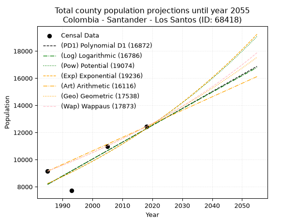
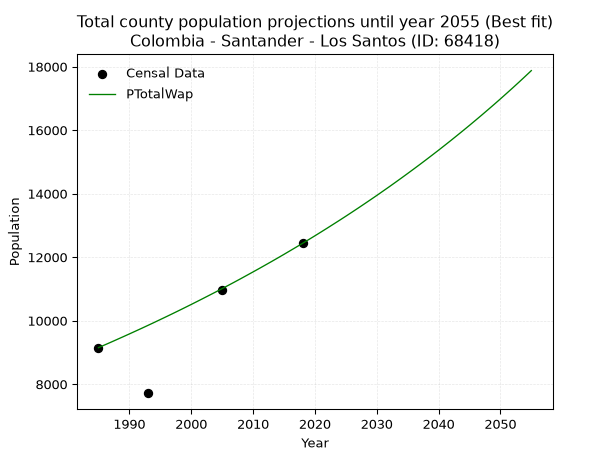
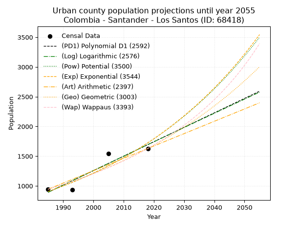
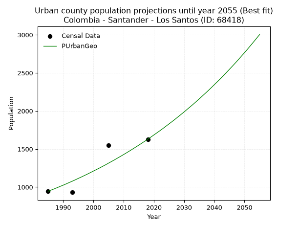
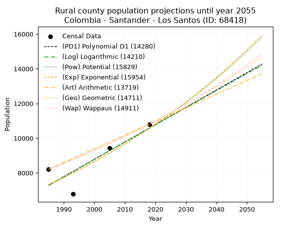
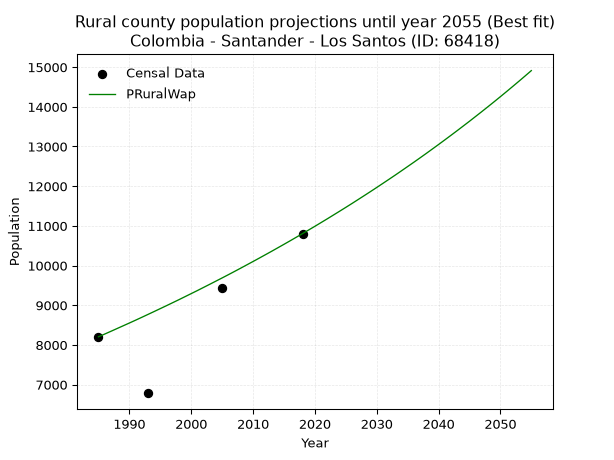

<div align="center">


</div>

# _“Population and Public Services Demand Projections (PPSD) until Year 2050 for Colombia - Santander - Los Santos (ID: 68418)”_
Keywords: `population` `public-service` `projection` `lineal` `polynomial` `logarithmic` `potential` `exponential` `arithmetic` `geometric` `wappaus` `dane` `colombia` `south-america`

PPSD are analytical estimates used by governments and planners to anticipate future changes in population size, age distribution, and the resulting community needs for utilities, healthcare, education, and infrastructure as sizing future water treatment facilities, electrical grids, and road networks based on spatial growth.

> **General running parameters**: • app_version: _v20260806_. • Python version: _3.14.7_. • Pandas version: _3.0.5_. • NumPy version: _2.5.1_. • Creates, save and include plots into reports (create_plot): _False_. • Projection until year: _2050_. • Process polynomial degree 2 and up: _False_. • Process Wappaus: _True_. • Process Wappaus: _True_. • Set negative values to zero: _True_. • Set infinite values to zero: _True_. • Drop dataset notes: _True_. 
<div align="center">

Dynamic map: [:earth_americas:Google](http://maps.google.com/maps?q=6.755203013,-73.1027386) [:earth_americas:OSM](https://www.openstreetmap.org/#map=18/6.755203013/-73.1027386&layers=P) [:earth_americas:Bing](https://www.bing.com/maps?cp=6.755203013~-73.1027386&lvl=18) [:earth_americas:Apple](https://maps.apple.com/frame?center=6.755203013%2C-73.1027386&span=0.003%2C0.006)

</div>


<div align="center">

```geojson
{
  "type": "Feature",
  "geometry": {
    "type": "Point", 
    "coordinates": [-73.1027386, 6.755203013]
  }, 
  "properties": {
    "Name": "Colombia - Santander - Los Santos (ID: 68418)"
  }
}
```

</div>


## 0. Census Data (4 records)

Census data are official statistics collected by a government about the people and housing in a country. They usually include counts of total population, age, sex, race, income, education, and jobs.

📅Global census file: [Population.xlsx](../data/Population.xlsx)

| Source   |   Year |   CountryID | CountryName   |   StateID | StateName   |   CountyID | CountyName   |   PTotal |   PUrban |   PRural |
|:---------|-------:|------------:|:--------------|----------:|:------------|-----------:|:-------------|---------:|---------:|---------:|
| DANE     |   1985 |          57 | Colombia      |        68 | Santander   |      68418 | Los Santos   |     9148 |      944 |     8204 |
| DANE     |   1993 |          57 | Colombia      |        68 | Santander   |      68418 | Los Santos   |     7714 |      931 |     6783 |
| DANE     |   2005 |          57 | Colombia      |        68 | Santander   |      68418 | Los Santos   |    10977 |     1547 |     9430 |
| DANE     |   2018 |          57 | Colombia      |        68 | Santander   |      68418 | Los Santos   |    12433 |     1629 |    10804 |

> 🔥Some records has specific notes about the registered values or the corresponding urban or rural distribution.

## 1. Total

### 1.1. Coefficients and Parameters

* (PD1) Polynomial Deg 1: 124.27619429947703, -238515.45764752897 (lineal)
* (Log) Logarithmic: 248586.25478452427, -1879438.1146623958
* (Pow) Potential: 24.243506085947534, -76.03373580138404
* (Exp) Exponential: 0.012120301375245864, 2.9311658319712925e-07
* (Art) Arithmetic: Year diff. 2018 - 1985 = 33, Population diff. 12433 - 9148 = 3285, Annual growth = 99.54545454545455
* (Geo) Geometric: Year diff. 2018 - 1985 = 33, Population diff. 12433 - 9148 = 3285, Annual growth % = 0.00934090042167024
* (Wap) Wappaus: i = 0.9225286552565177, Condition values only valid for < 200)

<sub>
Wappaus condition values: ['0.00', '0.92', '1.85', '2.77', '3.69', '4.61', '5.54', '6.46', '7.38', '8.30', '9.23', '10.15', '11.07', '11.99', '12.92', '13.84', '14.76', '15.68', '16.61', '17.53', '18.45', '19.37', '20.30', '21.22', '22.14', '23.06', '23.99', '24.91', '25.83', '26.75', '27.68', '28.60', '29.52', '30.44', '31.37', '32.29', '33.21', '34.13', '35.06', '35.98', '36.90', '37.82', '38.75', '39.67', '40.59', '41.51', '42.44', '43.36', '44.28', '45.20', '46.13', '47.05', '47.97', '48.89', '49.82', '50.74', '51.66', '52.58', '53.51', '54.43', '55.35', '56.27', '57.20', '58.12', '59.04', '59.96']
</sub>


### 1.2. Projected Dataset

|   Year |   CountyID |   PTotalPD1 |   PTotalLog |   PTotalPow |   PTotalExp |   PTotalArt |   PTotalGeo |   PTotalWap |
|-------:|-----------:|------------:|------------:|------------:|------------:|------------:|------------:|------------:|
|   1985 |      68418 |        8173 |        8170 |        8233 |        8235 |        9148 |        9148 |        9148 |
|   1986 |      68418 |        8297 |        8296 |        8334 |        8335 |        9248 |        9233 |        9233 |
|   1987 |      68418 |        8421 |        8421 |        8436 |        8437 |        9347 |        9320 |        9318 |
|   1988 |      68418 |        8546 |        8546 |        8540 |        8540 |        9447 |        9407 |        9405 |
|   1989 |      68418 |        8670 |        8671 |        8644 |        8644 |        9546 |        9495 |        9492 |
|   1990 |      68418 |        8794 |        8796 |        8750 |        8749 |        9646 |        9583 |        9580 |
|   1991 |      68418 |        8918 |        8921 |        8858 |        8856 |        9745 |        9673 |        9669 |
|   1992 |      68418 |        9043 |        9045 |        8966 |        8964 |        9845 |        9763 |        9758 |
|   1993 |      68418 |        9167 |        9170 |        9076 |        9073 |        9944 |        9854 |        9849 |
|   1994 |      68418 |        9291 |        9295 |        9187 |        9184 |       10044 |        9946 |        9940 |
|   1995 |      68418 |        9416 |        9420 |        9299 |        9296 |       10143 |       10039 |       10033 |
|   1996 |      68418 |        9540 |        9544 |        9413 |        9409 |       10243 |       10133 |       10126 |
|   1997 |      68418 |        9664 |        9669 |        9528 |        9524 |       10343 |       10228 |       10220 |
|   1998 |      68418 |        9788 |        9793 |        9644 |        9640 |       10442 |       10323 |       10315 |
|   1999 |      68418 |        9913 |        9917 |        9762 |        9757 |       10542 |       10420 |       10411 |
|   2000 |      68418 |       10037 |       10042 |        9881 |        9876 |       10641 |       10517 |       10508 |
|   2001 |      68418 |       10161 |       10166 |       10002 |        9997 |       10741 |       10615 |       10606 |
|   2002 |      68418 |       10285 |       10290 |       10123 |       10119 |       10840 |       10714 |       10705 |
|   2003 |      68418 |       10410 |       10414 |       10247 |       10242 |       10940 |       10815 |       10805 |
|   2004 |      68418 |       10534 |       10538 |       10372 |       10367 |       11039 |       10916 |       10905 |
|   2005 |      68418 |       10658 |       10662 |       10498 |       10493 |       11139 |       11018 |       11007 |
|   2006 |      68418 |       10783 |       10786 |       10625 |       10621 |       11238 |       11120 |       11110 |
|   2007 |      68418 |       10907 |       10910 |       10755 |       10751 |       11338 |       11224 |       11214 |
|   2008 |      68418 |       11031 |       11034 |       10885 |       10882 |       11438 |       11329 |       11319 |
|   2009 |      68418 |       11155 |       11158 |       11017 |       11015 |       11537 |       11435 |       11426 |
|   2010 |      68418 |       11280 |       11282 |       11151 |       11149 |       11637 |       11542 |       11533 |
|   2011 |      68418 |       11404 |       11405 |       11286 |       11285 |       11736 |       11650 |       11641 |
|   2012 |      68418 |       11528 |       11529 |       11423 |       11423 |       11836 |       11758 |       11751 |
|   2013 |      68418 |       11653 |       11652 |       11562 |       11562 |       11935 |       11868 |       11861 |
|   2014 |      68418 |       11777 |       11776 |       11702 |       11703 |       12035 |       11979 |       11973 |
|   2015 |      68418 |       11901 |       11899 |       11843 |       11846 |       12134 |       12091 |       12086 |
|   2016 |      68418 |       12025 |       12023 |       11987 |       11990 |       12234 |       12204 |       12201 |
|   2017 |      68418 |       12150 |       12146 |       12132 |       12136 |       12333 |       12318 |       12316 |
|   2018 |      68418 |       12274 |       12269 |       12278 |       12284 |       12433 |       12433 |       12433 |
|   2019 |      68418 |       12398 |       12392 |       12427 |       12434 |       12533 |       12549 |       12551 |
|   2020 |      68418 |       12522 |       12515 |       12577 |       12586 |       12632 |       12666 |       12670 |
|   2021 |      68418 |       12647 |       12638 |       12729 |       12739 |       12732 |       12785 |       12791 |
|   2022 |      68418 |       12771 |       12761 |       12882 |       12894 |       12831 |       12904 |       12913 |
|   2023 |      68418 |       12895 |       12884 |       13038 |       13052 |       12931 |       13025 |       13037 |
|   2024 |      68418 |       13020 |       13007 |       13195 |       13211 |       13030 |       13146 |       13161 |
|   2025 |      68418 |       13144 |       13130 |       13354 |       13372 |       13130 |       13269 |       13287 |
|   2026 |      68418 |       13268 |       13253 |       13514 |       13535 |       13229 |       13393 |       13415 |
|   2027 |      68418 |       13392 |       13375 |       13677 |       13700 |       13329 |       13518 |       13544 |
|   2028 |      68418 |       13517 |       13498 |       13842 |       13867 |       13428 |       13644 |       13675 |
|   2029 |      68418 |       13641 |       13620 |       14008 |       14036 |       13528 |       13772 |       13807 |
|   2030 |      68418 |       13765 |       13743 |       14176 |       14207 |       13628 |       13900 |       13940 |
|   2031 |      68418 |       13889 |       13865 |       14347 |       14381 |       13727 |       14030 |       14076 |
|   2032 |      68418 |       14014 |       13988 |       14519 |       14556 |       13827 |       14161 |       14212 |
|   2033 |      68418 |       14138 |       14110 |       14693 |       14733 |       13926 |       14294 |       14351 |
|   2034 |      68418 |       14262 |       14232 |       14869 |       14913 |       14026 |       14427 |       14491 |
|   2035 |      68418 |       14387 |       14354 |       15048 |       15095 |       14125 |       14562 |       14633 |
|   2036 |      68418 |       14511 |       14477 |       15228 |       15279 |       14225 |       14698 |       14776 |
|   2037 |      68418 |       14635 |       14599 |       15410 |       15465 |       14324 |       14835 |       14921 |
|   2038 |      68418 |       14759 |       14721 |       15595 |       15654 |       14424 |       14974 |       15068 |
|   2039 |      68418 |       14884 |       14843 |       15781 |       15845 |       14523 |       15114 |       15217 |
|   2040 |      68418 |       15008 |       14964 |       15970 |       16038 |       14623 |       15255 |       15367 |
|   2041 |      68418 |       15132 |       15086 |       16161 |       16234 |       14723 |       15397 |       15520 |
|   2042 |      68418 |       15257 |       15208 |       16354 |       16432 |       14822 |       15541 |       15674 |
|   2043 |      68418 |       15381 |       15330 |       16549 |       16632 |       14922 |       15686 |       15831 |
|   2044 |      68418 |       15505 |       15451 |       16747 |       16835 |       15021 |       15833 |       15989 |
|   2045 |      68418 |       15629 |       15573 |       16946 |       17040 |       15121 |       15981 |       16149 |
|   2046 |      68418 |       15754 |       15694 |       17148 |       17248 |       15220 |       16130 |       16312 |
|   2047 |      68418 |       15878 |       15816 |       17353 |       17458 |       15320 |       16281 |       16476 |
|   2048 |      68418 |       16002 |       15937 |       17559 |       17671 |       15419 |       16433 |       16643 |
|   2049 |      68418 |       16126 |       16059 |       17769 |       17887 |       15519 |       16586 |       16811 |
|   2050 |      68418 |       16251 |       16180 |       17980 |       18105 |       15618 |       16741 |       16982 |
<div align="center">

</img>

</div>


### 1.3. Best fit with absolute error and relative error (%)

Relative error puts that difference into context by dividing the absolute error by the true value, creating a unitless ratio or percentage that shows the scale of the mistake.

Absolute and relative error

|   Year | Source   |   CountryID | CountryName   |   StateID | StateName   |   CountyID_x | CountyName   |   PTotal |   PUrban |   PRural |   CountyID_y |   PTotalPD1 |   PTotalLog |   PTotalPow |   PTotalExp |   PTotalArt |   PTotalGeo |   PTotalWap |   PTotalPD1AbsError |   PTotalLogAbsError |   PTotalPowAbsError |   PTotalExpAbsError |   PTotalArtAbsError |   PTotalGeoAbsError |   PTotalWapAbsError |   PTotalPD1RelError |   PTotalLogRelError |   PTotalPowRelError |   PTotalExpRelError |   PTotalArtRelError |   PTotalGeoRelError |   PTotalWapRelError |
|-------:|:---------|------------:|:--------------|----------:|:------------|-------------:|:-------------|---------:|---------:|---------:|-------------:|------------:|------------:|------------:|------------:|------------:|------------:|------------:|--------------------:|--------------------:|--------------------:|--------------------:|--------------------:|--------------------:|--------------------:|--------------------:|--------------------:|--------------------:|--------------------:|--------------------:|--------------------:|--------------------:|
|   1985 | DANE     |          57 | Colombia      |        68 | Santander   |        68418 | Los Santos   |     9148 |      944 |     8204 |        68418 |        8173 |        8170 |        8233 |        8235 |        9148 |        9148 |        9148 |                 975 |                 978 |                 915 |                 913 |                   0 |                   0 |                   0 |            10.6581  |            10.6909  |            10.0022  |             9.98032 |             0       |            0        |            0        |
|   1993 | DANE     |          57 | Colombia      |        68 | Santander   |        68418 | Los Santos   |     7714 |      931 |     6783 |        68418 |        9167 |        9170 |        9076 |        9073 |        9944 |        9854 |        9849 |                1453 |                1456 |                1362 |                1359 |                2230 |                2140 |                2135 |            18.8359  |            18.8748  |            17.6562  |            17.6173  |            28.9085  |           27.7418   |           27.677    |
|   2005 | DANE     |          57 | Colombia      |        68 | Santander   |        68418 | Los Santos   |    10977 |     1547 |     9430 |        68418 |       10658 |       10662 |       10498 |       10493 |       11139 |       11018 |       11007 |                 319 |                 315 |                 479 |                 484 |                 162 |                  41 |                  30 |             2.90608 |             2.86964 |             4.36367 |             4.40922 |             1.47581 |            0.373508 |            0.273299 |
|   2018 | DANE     |          57 | Colombia      |        68 | Santander   |        68418 | Los Santos   |    12433 |     1629 |    10804 |        68418 |       12274 |       12269 |       12278 |       12284 |       12433 |       12433 |       12433 |                 159 |                 164 |                 155 |                 149 |                   0 |                   0 |                   0 |             1.27885 |             1.31907 |             1.24668 |             1.19842 |             0       |            0        |            0        |

Relative error mean

| Method    |   RelError | Best   |
|:----------|-----------:|:-------|
| PTotalPD1 |    8.41972 |        |
| PTotalLog |    8.43859 |        |
| PTotalPow |    8.31719 |        |
| PTotalExp |    8.30132 |        |
| PTotalArt |    7.59607 |        |
| PTotalGeo |    7.02882 |        |
| PTotalWap |    6.98756 | True   |

💙Best method: _**PTotalWap**_
<div align="center">

</img>

</div>


### 1.4. Fresh water supply demand in liters per capita per day (lpcd)

The fresh water supply demand typically ranges from 100 to 300 liters per capita per day (lpcd) for standard domestic and municipal planning, though absolute survival minimums set by the World Health Organization are as low as 7.5 to 20 liters per day, and total consumption in high-income nations can exceed 400 liters.

> `CZ`: Level in meters above the sea level (masl).<br> `WS`: Fresh water supply demand in liters per capita per day (lpcd or l/h/d).<br> `WSAll`: Zonal fresh water supply demand in liters per second (l/s).<br> `A`: Zonal area in square meters.

Reference values (RAS Colombia)

|    CZ |   WS |
|------:|-----:|
|  1000 |  120 |
|  2000 |  130 |
| 99999 |  140 |

County shapefile geometry properties and water supply values

|   CountyID |      ATotal |   CZTotal |   WSTotal |
|-----------:|------------:|----------:|----------:|
|      68418 | 2.89583e+08 |   1210.73 |       130 |

Projected values for best method: PTotalWap

|   CountyID |   Year |   PTotalWap |   WSTotal |   WSTotalAll |
|-----------:|-------:|------------:|----------:|-------------:|
|      68418 |   1985 |        9148 |       130 |      13.7644 |
|      68418 |   1986 |        9233 |       130 |      13.8922 |
|      68418 |   1987 |        9318 |       130 |      14.0201 |
|      68418 |   1988 |        9405 |       130 |      14.151  |
|      68418 |   1989 |        9492 |       130 |      14.2819 |
|      68418 |   1990 |        9580 |       130 |      14.4144 |
|      68418 |   1991 |        9669 |       130 |      14.5483 |
|      68418 |   1992 |        9758 |       130 |      14.6822 |
|      68418 |   1993 |        9849 |       130 |      14.8191 |
|      68418 |   1994 |        9940 |       130 |      14.956  |
|      68418 |   1995 |       10033 |       130 |      15.0959 |
|      68418 |   1996 |       10126 |       130 |      15.2359 |
|      68418 |   1997 |       10220 |       130 |      15.3773 |
|      68418 |   1998 |       10315 |       130 |      15.5203 |
|      68418 |   1999 |       10411 |       130 |      15.6647 |
|      68418 |   2000 |       10508 |       130 |      15.8106 |
|      68418 |   2001 |       10606 |       130 |      15.9581 |
|      68418 |   2002 |       10705 |       130 |      16.1071 |
|      68418 |   2003 |       10805 |       130 |      16.2575 |
|      68418 |   2004 |       10905 |       130 |      16.408  |
|      68418 |   2005 |       11007 |       130 |      16.5615 |
|      68418 |   2006 |       11110 |       130 |      16.7164 |
|      68418 |   2007 |       11214 |       130 |      16.8729 |
|      68418 |   2008 |       11319 |       130 |      17.0309 |
|      68418 |   2009 |       11426 |       130 |      17.1919 |
|      68418 |   2010 |       11533 |       130 |      17.3529 |
|      68418 |   2011 |       11641 |       130 |      17.5154 |
|      68418 |   2012 |       11751 |       130 |      17.6809 |
|      68418 |   2013 |       11861 |       130 |      17.8464 |
|      68418 |   2014 |       11973 |       130 |      18.0149 |
|      68418 |   2015 |       12086 |       130 |      18.185  |
|      68418 |   2016 |       12201 |       130 |      18.358  |
|      68418 |   2017 |       12316 |       130 |      18.531  |
|      68418 |   2018 |       12433 |       130 |      18.7071 |
|      68418 |   2019 |       12551 |       130 |      18.8846 |
|      68418 |   2020 |       12670 |       130 |      19.0637 |
|      68418 |   2021 |       12791 |       130 |      19.2457 |
|      68418 |   2022 |       12913 |       130 |      19.4293 |
|      68418 |   2023 |       13037 |       130 |      19.6159 |
|      68418 |   2024 |       13161 |       130 |      19.8024 |
|      68418 |   2025 |       13287 |       130 |      19.992  |
|      68418 |   2026 |       13415 |       130 |      20.1846 |
|      68418 |   2027 |       13544 |       130 |      20.3787 |
|      68418 |   2028 |       13675 |       130 |      20.5758 |
|      68418 |   2029 |       13807 |       130 |      20.7744 |
|      68418 |   2030 |       13940 |       130 |      20.9745 |
|      68418 |   2031 |       14076 |       130 |      21.1792 |
|      68418 |   2032 |       14212 |       130 |      21.3838 |
|      68418 |   2033 |       14351 |       130 |      21.5929 |
|      68418 |   2034 |       14491 |       130 |      21.8036 |
|      68418 |   2035 |       14633 |       130 |      22.0172 |
|      68418 |   2036 |       14776 |       130 |      22.2324 |
|      68418 |   2037 |       14921 |       130 |      22.4506 |
|      68418 |   2038 |       15068 |       130 |      22.6718 |
|      68418 |   2039 |       15217 |       130 |      22.8959 |
|      68418 |   2040 |       15367 |       130 |      23.1216 |
|      68418 |   2041 |       15520 |       130 |      23.3519 |
|      68418 |   2042 |       15674 |       130 |      23.5836 |
|      68418 |   2043 |       15831 |       130 |      23.8198 |
|      68418 |   2044 |       15989 |       130 |      24.0575 |
|      68418 |   2045 |       16149 |       130 |      24.2983 |
|      68418 |   2046 |       16312 |       130 |      24.5435 |
|      68418 |   2047 |       16476 |       130 |      24.7903 |
|      68418 |   2048 |       16643 |       130 |      25.0416 |
|      68418 |   2049 |       16811 |       130 |      25.2943 |
|      68418 |   2050 |       16982 |       130 |      25.5516 |

## 2. Urban

### 2.1. Coefficients and Parameters

* (PD1) Polynomial Deg 1: 24.27498996386984, -47293.29867523065 (lineal)
* (Log) Logarithmic: 48599.4704333527, -368142.2142156282
* (Pow) Potential: 39.00080304540747, -125.65827529487188
* (Exp) Exponential: 0.019479888878250796, 1.4594921735002138e-14
* (Art) Arithmetic: Year diff. 2018 - 1985 = 33, Population diff. 1629 - 944 = 685, Annual growth = 20.757575757575758
* (Geo) Geometric: Year diff. 2018 - 1985 = 33, Population diff. 1629 - 944 = 685, Annual growth % = 0.016670624837029635
* (Wap) Wappaus: i = 1.6134920915332887, Condition values only valid for < 200)

<sub>
Wappaus condition values: ['0.00', '1.61', '3.23', '4.84', '6.45', '8.07', '9.68', '11.29', '12.91', '14.52', '16.13', '17.75', '19.36', '20.98', '22.59', '24.20', '25.82', '27.43', '29.04', '30.66', '32.27', '33.88', '35.50', '37.11', '38.72', '40.34', '41.95', '43.56', '45.18', '46.79', '48.40', '50.02', '51.63', '53.25', '54.86', '56.47', '58.09', '59.70', '61.31', '62.93', '64.54', '66.15', '67.77', '69.38', '70.99', '72.61', '74.22', '75.83', '77.45', '79.06', '80.67', '82.29', '83.90', '85.52', '87.13', '88.74', '90.36', '91.97', '93.58', '95.20', '96.81', '98.42', '100.04', '101.65', '103.26', '104.88']
</sub>


### 2.2. Projected Dataset

|   Year |   CountyID |   PUrbanPD1 |   PUrbanLog |   PUrbanPow |   PUrbanExp |   PUrbanArt |   PUrbanGeo |   PUrbanWap |
|-------:|-----------:|------------:|------------:|------------:|------------:|------------:|------------:|------------:|
|   1985 |      68418 |         893 |         892 |         906 |         906 |         944 |         944 |         944 |
|   1986 |      68418 |         917 |         916 |         924 |         924 |         965 |         960 |         959 |
|   1987 |      68418 |         941 |         941 |         942 |         942 |         986 |         976 |         975 |
|   1988 |      68418 |         965 |         965 |         961 |         961 |        1006 |         992 |         991 |
|   1989 |      68418 |         990 |         990 |         980 |         980 |        1027 |        1009 |        1007 |
|   1990 |      68418 |        1014 |        1014 |         999 |         999 |        1048 |        1025 |        1023 |
|   1991 |      68418 |        1038 |        1038 |        1019 |        1019 |        1069 |        1042 |        1040 |
|   1992 |      68418 |        1062 |        1063 |        1039 |        1039 |        1089 |        1060 |        1057 |
|   1993 |      68418 |        1087 |        1087 |        1060 |        1059 |        1110 |        1077 |        1074 |
|   1994 |      68418 |        1111 |        1112 |        1081 |        1080 |        1131 |        1095 |        1092 |
|   1995 |      68418 |        1135 |        1136 |        1102 |        1101 |        1152 |        1114 |        1110 |
|   1996 |      68418 |        1160 |        1160 |        1124 |        1123 |        1172 |        1132 |        1128 |
|   1997 |      68418 |        1184 |        1185 |        1146 |        1145 |        1193 |        1151 |        1146 |
|   1998 |      68418 |        1208 |        1209 |        1168 |        1168 |        1214 |        1170 |        1165 |
|   1999 |      68418 |        1232 |        1233 |        1191 |        1191 |        1235 |        1190 |        1184 |
|   2000 |      68418 |        1257 |        1258 |        1215 |        1214 |        1255 |        1210 |        1204 |
|   2001 |      68418 |        1281 |        1282 |        1239 |        1238 |        1276 |        1230 |        1224 |
|   2002 |      68418 |        1305 |        1306 |        1263 |        1262 |        1297 |        1250 |        1244 |
|   2003 |      68418 |        1330 |        1330 |        1288 |        1287 |        1318 |        1271 |        1265 |
|   2004 |      68418 |        1354 |        1355 |        1313 |        1312 |        1338 |        1292 |        1286 |
|   2005 |      68418 |        1378 |        1379 |        1339 |        1338 |        1359 |        1314 |        1307 |
|   2006 |      68418 |        1402 |        1403 |        1365 |        1365 |        1380 |        1336 |        1329 |
|   2007 |      68418 |        1427 |        1427 |        1392 |        1391 |        1401 |        1358 |        1351 |
|   2008 |      68418 |        1451 |        1452 |        1420 |        1419 |        1421 |        1381 |        1374 |
|   2009 |      68418 |        1475 |        1476 |        1447 |        1447 |        1442 |        1404 |        1397 |
|   2010 |      68418 |        1499 |        1500 |        1476 |        1475 |        1463 |        1427 |        1421 |
|   2011 |      68418 |        1524 |        1524 |        1505 |        1504 |        1484 |        1451 |        1445 |
|   2012 |      68418 |        1548 |        1548 |        1534 |        1534 |        1504 |        1475 |        1470 |
|   2013 |      68418 |        1572 |        1572 |        1564 |        1564 |        1525 |        1500 |        1495 |
|   2014 |      68418 |        1597 |        1597 |        1595 |        1595 |        1546 |        1525 |        1521 |
|   2015 |      68418 |        1621 |        1621 |        1626 |        1626 |        1567 |        1550 |        1547 |
|   2016 |      68418 |        1645 |        1645 |        1658 |        1658 |        1587 |        1576 |        1574 |
|   2017 |      68418 |        1669 |        1669 |        1690 |        1691 |        1608 |        1602 |        1601 |
|   2018 |      68418 |        1694 |        1693 |        1723 |        1724 |        1629 |        1629 |        1629 |
|   2019 |      68418 |        1718 |        1717 |        1757 |        1758 |        1650 |        1656 |        1658 |
|   2020 |      68418 |        1742 |        1741 |        1791 |        1792 |        1671 |        1684 |        1687 |
|   2021 |      68418 |        1766 |        1765 |        1826 |        1828 |        1691 |        1712 |        1717 |
|   2022 |      68418 |        1791 |        1789 |        1861 |        1864 |        1712 |        1740 |        1747 |
|   2023 |      68418 |        1815 |        1813 |        1898 |        1900 |        1733 |        1769 |        1779 |
|   2024 |      68418 |        1839 |        1837 |        1935 |        1938 |        1754 |        1799 |        1811 |
|   2025 |      68418 |        1864 |        1861 |        1972 |        1976 |        1774 |        1829 |        1844 |
|   2026 |      68418 |        1888 |        1885 |        2011 |        2015 |        1795 |        1859 |        1877 |
|   2027 |      68418 |        1912 |        1909 |        2050 |        2054 |        1816 |        1890 |        1912 |
|   2028 |      68418 |        1936 |        1933 |        2089 |        2095 |        1837 |        1922 |        1947 |
|   2029 |      68418 |        1961 |        1957 |        2130 |        2136 |        1857 |        1954 |        1983 |
|   2030 |      68418 |        1985 |        1981 |        2171 |        2178 |        1878 |        1986 |        2020 |
|   2031 |      68418 |        2009 |        2005 |        2213 |        2221 |        1899 |        2020 |        2058 |
|   2032 |      68418 |        2033 |        2029 |        2256 |        2264 |        1920 |        2053 |        2097 |
|   2033 |      68418 |        2058 |        2053 |        2300 |        2309 |        1940 |        2087 |        2137 |
|   2034 |      68418 |        2082 |        2077 |        2345 |        2354 |        1961 |        2122 |        2178 |
|   2035 |      68418 |        2106 |        2101 |        2390 |        2401 |        1982 |        2158 |        2220 |
|   2036 |      68418 |        2131 |        2125 |        2436 |        2448 |        2003 |        2194 |        2264 |
|   2037 |      68418 |        2155 |        2148 |        2483 |        2496 |        2023 |        2230 |        2308 |
|   2038 |      68418 |        2179 |        2172 |        2531 |        2545 |        2044 |        2267 |        2354 |
|   2039 |      68418 |        2203 |        2196 |        2580 |        2595 |        2065 |        2305 |        2401 |
|   2040 |      68418 |        2228 |        2220 |        2630 |        2646 |        2086 |        2344 |        2450 |
|   2041 |      68418 |        2252 |        2244 |        2681 |        2698 |        2106 |        2383 |        2500 |
|   2042 |      68418 |        2276 |        2268 |        2732 |        2751 |        2127 |        2422 |        2551 |
|   2043 |      68418 |        2301 |        2291 |        2785 |        2805 |        2148 |        2463 |        2604 |
|   2044 |      68418 |        2325 |        2315 |        2839 |        2861 |        2169 |        2504 |        2659 |
|   2045 |      68418 |        2349 |        2339 |        2893 |        2917 |        2189 |        2546 |        2715 |
|   2046 |      68418 |        2373 |        2363 |        2949 |        2974 |        2210 |        2588 |        2773 |
|   2047 |      68418 |        2398 |        2386 |        3006 |        3033 |        2231 |        2631 |        2833 |
|   2048 |      68418 |        2422 |        2410 |        3064 |        3092 |        2252 |        2675 |        2895 |
|   2049 |      68418 |        2446 |        2434 |        3123 |        3153 |        2272 |        2720 |        2959 |
|   2050 |      68418 |        2470 |        2458 |        3183 |        3215 |        2293 |        2765 |        3026 |
<div align="center">

</img>

</div>


### 2.3. Best fit with absolute error and relative error (%)

Relative error puts that difference into context by dividing the absolute error by the true value, creating a unitless ratio or percentage that shows the scale of the mistake.

Absolute and relative error

|   Year | Source   |   CountryID | CountryName   |   StateID | StateName   |   CountyID_x | CountyName   |   PTotal |   PUrban |   PRural |   CountyID_y |   PUrbanPD1 |   PUrbanLog |   PUrbanPow |   PUrbanExp |   PUrbanArt |   PUrbanGeo |   PUrbanWap |   PUrbanPD1AbsError |   PUrbanLogAbsError |   PUrbanPowAbsError |   PUrbanExpAbsError |   PUrbanArtAbsError |   PUrbanGeoAbsError |   PUrbanWapAbsError |   PUrbanPD1RelError |   PUrbanLogRelError |   PUrbanPowRelError |   PUrbanExpRelError |   PUrbanArtRelError |   PUrbanGeoRelError |   PUrbanWapRelError |
|-------:|:---------|------------:|:--------------|----------:|:------------|-------------:|:-------------|---------:|---------:|---------:|-------------:|------------:|------------:|------------:|------------:|------------:|------------:|------------:|--------------------:|--------------------:|--------------------:|--------------------:|--------------------:|--------------------:|--------------------:|--------------------:|--------------------:|--------------------:|--------------------:|--------------------:|--------------------:|--------------------:|
|   1985 | DANE     |          57 | Colombia      |        68 | Santander   |        68418 | Los Santos   |     9148 |      944 |     8204 |        68418 |         893 |         892 |         906 |         906 |         944 |         944 |         944 |                  51 |                  52 |                  38 |                  38 |                   0 |                   0 |                   0 |             5.40254 |             5.50847 |             4.02542 |             4.02542 |              0      |              0      |              0      |
|   1993 | DANE     |          57 | Colombia      |        68 | Santander   |        68418 | Los Santos   |     7714 |      931 |     6783 |        68418 |        1087 |        1087 |        1060 |        1059 |        1110 |        1077 |        1074 |                 156 |                 156 |                 129 |                 128 |                 179 |                 146 |                 143 |            16.7562  |            16.7562  |            13.8561  |            13.7487  |             19.2266 |             15.6821 |             15.3598 |
|   2005 | DANE     |          57 | Colombia      |        68 | Santander   |        68418 | Los Santos   |    10977 |     1547 |     9430 |        68418 |        1378 |        1379 |        1339 |        1338 |        1359 |        1314 |        1307 |                 169 |                 168 |                 208 |                 209 |                 188 |                 233 |                 240 |            10.9244  |            10.8597  |            13.4454  |            13.51    |             12.1526 |             15.0614 |             15.5139 |
|   2018 | DANE     |          57 | Colombia      |        68 | Santander   |        68418 | Los Santos   |    12433 |     1629 |    10804 |        68418 |        1694 |        1693 |        1723 |        1724 |        1629 |        1629 |        1629 |                  65 |                  64 |                  94 |                  95 |                   0 |                   0 |                   0 |             3.99018 |             3.92879 |             5.77041 |             5.8318  |              0      |              0      |              0      |

Relative error mean

| Method    |   RelError | Best   |
|:----------|-----------:|:-------|
| PUrbanPD1 |    9.26832 |        |
| PUrbanLog |    9.26329 |        |
| PUrbanPow |    9.27432 |        |
| PUrbanExp |    9.27897 |        |
| PUrbanArt |    7.8448  |        |
| PUrbanGeo |    7.68587 | True   |
| PUrbanWap |    7.71843 |        |

💙Best method: _**PUrbanGeo**_
<div align="center">

</img>

</div>


### 2.4. Fresh water supply demand in liters per capita per day (lpcd)

The fresh water supply demand typically ranges from 100 to 300 liters per capita per day (lpcd) for standard domestic and municipal planning, though absolute survival minimums set by the World Health Organization are as low as 7.5 to 20 liters per day, and total consumption in high-income nations can exceed 400 liters.

> `CZ`: Level in meters above the sea level (masl).<br> `WS`: Fresh water supply demand in liters per capita per day (lpcd or l/h/d).<br> `WSAll`: Zonal fresh water supply demand in liters per second (l/s).<br> `A`: Zonal area in square meters.

Reference values (RAS Colombia)

|    CZ |   WS |
|------:|-----:|
|  1000 |  120 |
|  2000 |  130 |
| 99999 |  140 |

County shapefile geometry properties and water supply values

|   CountyID |   AUrban |   CZUrban |   WSUrban |
|-----------:|---------:|----------:|----------:|
|      68418 |   417705 |   1297.16 |       130 |

Projected values for best method: PUrbanGeo

|   CountyID |   Year |   PUrbanGeo |   WSUrban |   WSUrbanAll |
|-----------:|-------:|------------:|----------:|-------------:|
|      68418 |   1985 |         944 |       130 |      1.42037 |
|      68418 |   1986 |         960 |       130 |      1.44444 |
|      68418 |   1987 |         976 |       130 |      1.46852 |
|      68418 |   1988 |         992 |       130 |      1.49259 |
|      68418 |   1989 |        1009 |       130 |      1.51817 |
|      68418 |   1990 |        1025 |       130 |      1.54225 |
|      68418 |   1991 |        1042 |       130 |      1.56782 |
|      68418 |   1992 |        1060 |       130 |      1.59491 |
|      68418 |   1993 |        1077 |       130 |      1.62049 |
|      68418 |   1994 |        1095 |       130 |      1.64757 |
|      68418 |   1995 |        1114 |       130 |      1.67616 |
|      68418 |   1996 |        1132 |       130 |      1.70324 |
|      68418 |   1997 |        1151 |       130 |      1.73183 |
|      68418 |   1998 |        1170 |       130 |      1.76042 |
|      68418 |   1999 |        1190 |       130 |      1.79051 |
|      68418 |   2000 |        1210 |       130 |      1.8206  |
|      68418 |   2001 |        1230 |       130 |      1.85069 |
|      68418 |   2002 |        1250 |       130 |      1.88079 |
|      68418 |   2003 |        1271 |       130 |      1.91238 |
|      68418 |   2004 |        1292 |       130 |      1.94398 |
|      68418 |   2005 |        1314 |       130 |      1.97708 |
|      68418 |   2006 |        1336 |       130 |      2.01019 |
|      68418 |   2007 |        1358 |       130 |      2.04329 |
|      68418 |   2008 |        1381 |       130 |      2.07789 |
|      68418 |   2009 |        1404 |       130 |      2.1125  |
|      68418 |   2010 |        1427 |       130 |      2.14711 |
|      68418 |   2011 |        1451 |       130 |      2.18322 |
|      68418 |   2012 |        1475 |       130 |      2.21933 |
|      68418 |   2013 |        1500 |       130 |      2.25694 |
|      68418 |   2014 |        1525 |       130 |      2.29456 |
|      68418 |   2015 |        1550 |       130 |      2.33218 |
|      68418 |   2016 |        1576 |       130 |      2.3713  |
|      68418 |   2017 |        1602 |       130 |      2.41042 |
|      68418 |   2018 |        1629 |       130 |      2.45104 |
|      68418 |   2019 |        1656 |       130 |      2.49167 |
|      68418 |   2020 |        1684 |       130 |      2.5338  |
|      68418 |   2021 |        1712 |       130 |      2.57593 |
|      68418 |   2022 |        1740 |       130 |      2.61806 |
|      68418 |   2023 |        1769 |       130 |      2.66169 |
|      68418 |   2024 |        1799 |       130 |      2.70683 |
|      68418 |   2025 |        1829 |       130 |      2.75197 |
|      68418 |   2026 |        1859 |       130 |      2.79711 |
|      68418 |   2027 |        1890 |       130 |      2.84375 |
|      68418 |   2028 |        1922 |       130 |      2.8919  |
|      68418 |   2029 |        1954 |       130 |      2.94005 |
|      68418 |   2030 |        1986 |       130 |      2.98819 |
|      68418 |   2031 |        2020 |       130 |      3.03935 |
|      68418 |   2032 |        2053 |       130 |      3.089   |
|      68418 |   2033 |        2087 |       130 |      3.14016 |
|      68418 |   2034 |        2122 |       130 |      3.19282 |
|      68418 |   2035 |        2158 |       130 |      3.24699 |
|      68418 |   2036 |        2194 |       130 |      3.30116 |
|      68418 |   2037 |        2230 |       130 |      3.35532 |
|      68418 |   2038 |        2267 |       130 |      3.411   |
|      68418 |   2039 |        2305 |       130 |      3.46817 |
|      68418 |   2040 |        2344 |       130 |      3.52685 |
|      68418 |   2041 |        2383 |       130 |      3.58553 |
|      68418 |   2042 |        2422 |       130 |      3.64421 |
|      68418 |   2043 |        2463 |       130 |      3.7059  |
|      68418 |   2044 |        2504 |       130 |      3.76759 |
|      68418 |   2045 |        2546 |       130 |      3.83079 |
|      68418 |   2046 |        2588 |       130 |      3.89398 |
|      68418 |   2047 |        2631 |       130 |      3.95868 |
|      68418 |   2048 |        2675 |       130 |      4.02488 |
|      68418 |   2049 |        2720 |       130 |      4.09259 |
|      68418 |   2050 |        2765 |       130 |      4.1603  |

## 3. Rural

### 3.1. Coefficients and Parameters

* (PD1) Polynomial Deg 1: 100.00120433560718, -191222.15897229826 (lineal)
* (Log) Logarithmic: 199986.78435117143, -1511295.9004467663
* (Pow) Potential: 22.24416128109365, -69.49127738874769
* (Exp) Exponential: 0.011123241893835966, 1.886483855527051e-06
* (Art) Arithmetic: Year diff. 2018 - 1985 = 33, Population diff. 10804 - 8204 = 2600, Annual growth = 78.78787878787878
* (Geo) Geometric: Year diff. 2018 - 1985 = 33, Population diff. 10804 - 8204 = 2600, Annual growth % = 0.008377154094356687
* (Wap) Wappaus: i = 0.8289970411182532, Condition values only valid for < 200)

<sub>
Wappaus condition values: ['0.00', '0.83', '1.66', '2.49', '3.32', '4.14', '4.97', '5.80', '6.63', '7.46', '8.29', '9.12', '9.95', '10.78', '11.61', '12.43', '13.26', '14.09', '14.92', '15.75', '16.58', '17.41', '18.24', '19.07', '19.90', '20.72', '21.55', '22.38', '23.21', '24.04', '24.87', '25.70', '26.53', '27.36', '28.19', '29.01', '29.84', '30.67', '31.50', '32.33', '33.16', '33.99', '34.82', '35.65', '36.48', '37.30', '38.13', '38.96', '39.79', '40.62', '41.45', '42.28', '43.11', '43.94', '44.77', '45.59', '46.42', '47.25', '48.08', '48.91', '49.74', '50.57', '51.40', '52.23', '53.06', '53.88']
</sub>


### 3.2. Projected Dataset

|   Year |   CountyID |   PRuralPD1 |   PRuralLog |   PRuralPow |   PRuralExp |   PRuralArt |   PRuralGeo |   PRuralWap |
|-------:|-----------:|------------:|------------:|------------:|------------:|------------:|------------:|------------:|
|   1985 |      68418 |        7280 |        7279 |        7322 |        7323 |        8204 |        8204 |        8204 |
|   1986 |      68418 |        7380 |        7379 |        7405 |        7405 |        8283 |        8273 |        8272 |
|   1987 |      68418 |        7480 |        7480 |        7488 |        7488 |        8362 |        8342 |        8341 |
|   1988 |      68418 |        7580 |        7581 |        7572 |        7572 |        8440 |        8412 |        8411 |
|   1989 |      68418 |        7680 |        7681 |        7657 |        7657 |        8519 |        8482 |        8481 |
|   1990 |      68418 |        7780 |        7782 |        7744 |        7742 |        8598 |        8553 |        8551 |
|   1991 |      68418 |        7880 |        7882 |        7831 |        7829 |        8677 |        8625 |        8622 |
|   1992 |      68418 |        7980 |        7983 |        7919 |        7916 |        8756 |        8697 |        8694 |
|   1993 |      68418 |        8080 |        8083 |        8007 |        8005 |        8834 |        8770 |        8767 |
|   1994 |      68418 |        8180 |        8183 |        8097 |        8095 |        8913 |        8844 |        8840 |
|   1995 |      68418 |        8280 |        8284 |        8188 |        8185 |        8992 |        8918 |        8914 |
|   1996 |      68418 |        8380 |        8384 |        8280 |        8277 |        9071 |        8992 |        8988 |
|   1997 |      68418 |        8480 |        8484 |        8373 |        8369 |        9149 |        9068 |        9063 |
|   1998 |      68418 |        8580 |        8584 |        8466 |        8463 |        9228 |        9144 |        9138 |
|   1999 |      68418 |        8680 |        8684 |        8561 |        8558 |        9307 |        9220 |        9215 |
|   2000 |      68418 |        8780 |        8784 |        8657 |        8653 |        9386 |        9298 |        9292 |
|   2001 |      68418 |        8880 |        8884 |        8754 |        8750 |        9465 |        9375 |        9369 |
|   2002 |      68418 |        8980 |        8984 |        8852 |        8848 |        9543 |        9454 |        9448 |
|   2003 |      68418 |        9080 |        9084 |        8950 |        8947 |        9622 |        9533 |        9527 |
|   2004 |      68418 |        9180 |        9184 |        9050 |        9047 |        9701 |        9613 |        9607 |
|   2005 |      68418 |        9280 |        9283 |        9151 |        9148 |        9780 |        9694 |        9687 |
|   2006 |      68418 |        9380 |        9383 |        9253 |        9250 |        9859 |        9775 |        9768 |
|   2007 |      68418 |        9480 |        9483 |        9357 |        9354 |        9937 |        9857 |        9850 |
|   2008 |      68418 |        9580 |        9582 |        9461 |        9459 |       10016 |        9939 |        9933 |
|   2009 |      68418 |        9680 |        9682 |        9566 |        9564 |       10095 |       10023 |       10017 |
|   2010 |      68418 |        9780 |        9782 |        9673 |        9671 |       10174 |       10106 |       10101 |
|   2011 |      68418 |        9880 |        9881 |        9780 |        9779 |       10252 |       10191 |       10186 |
|   2012 |      68418 |        9980 |        9980 |        9889 |        9889 |       10331 |       10277 |       10272 |
|   2013 |      68418 |       10080 |       10080 |        9999 |        9999 |       10410 |       10363 |       10358 |
|   2014 |      68418 |       10180 |       10179 |       10110 |       10111 |       10489 |       10449 |       10446 |
|   2015 |      68418 |       10280 |       10278 |       10222 |       10224 |       10568 |       10537 |       10534 |
|   2016 |      68418 |       10380 |       10378 |       10336 |       10339 |       10646 |       10625 |       10623 |
|   2017 |      68418 |       10480 |       10477 |       10450 |       10454 |       10725 |       10714 |       10713 |
|   2018 |      68418 |       10580 |       10576 |       10566 |       10571 |       10804 |       10804 |       10804 |
|   2019 |      68418 |       10680 |       10675 |       10683 |       10690 |       10883 |       10895 |       10896 |
|   2020 |      68418 |       10780 |       10774 |       10802 |       10809 |       10962 |       10986 |       10988 |
|   2021 |      68418 |       10880 |       10873 |       10921 |       10930 |       11040 |       11078 |       11082 |
|   2022 |      68418 |       10980 |       10972 |       11042 |       11052 |       11119 |       11171 |       11176 |
|   2023 |      68418 |       11080 |       11071 |       11164 |       11176 |       11198 |       11264 |       11272 |
|   2024 |      68418 |       11180 |       11170 |       11288 |       11301 |       11277 |       11359 |       11368 |
|   2025 |      68418 |       11280 |       11268 |       11412 |       11427 |       11356 |       11454 |       11465 |
|   2026 |      68418 |       11380 |       11367 |       11538 |       11555 |       11434 |       11550 |       11563 |
|   2027 |      68418 |       11480 |       11466 |       11666 |       11684 |       11513 |       11646 |       11663 |
|   2028 |      68418 |       11580 |       11565 |       11794 |       11815 |       11592 |       11744 |       11763 |
|   2029 |      68418 |       11680 |       11663 |       11924 |       11947 |       11671 |       11842 |       11864 |
|   2030 |      68418 |       11780 |       11762 |       12056 |       12081 |       11749 |       11942 |       11966 |
|   2031 |      68418 |       11880 |       11860 |       12189 |       12216 |       11828 |       12042 |       12070 |
|   2032 |      68418 |       11980 |       11959 |       12323 |       12353 |       11907 |       12142 |       12174 |
|   2033 |      68418 |       12080 |       12057 |       12458 |       12491 |       11986 |       12244 |       12279 |
|   2034 |      68418 |       12180 |       12155 |       12595 |       12631 |       12065 |       12347 |       12386 |
|   2035 |      68418 |       12280 |       12254 |       12734 |       12772 |       12143 |       12450 |       12494 |
|   2036 |      68418 |       12380 |       12352 |       12874 |       12915 |       12222 |       12554 |       12602 |
|   2037 |      68418 |       12480 |       12450 |       13015 |       13059 |       12301 |       12660 |       12712 |
|   2038 |      68418 |       12580 |       12548 |       13158 |       13205 |       12380 |       12766 |       12823 |
|   2039 |      68418 |       12680 |       12646 |       13302 |       13353 |       12459 |       12873 |       12936 |
|   2040 |      68418 |       12780 |       12744 |       13448 |       13502 |       12537 |       12980 |       13049 |
|   2041 |      68418 |       12880 |       12842 |       13596 |       13653 |       12616 |       13089 |       13164 |
|   2042 |      68418 |       12980 |       12940 |       13745 |       13806 |       12695 |       13199 |       13280 |
|   2043 |      68418 |       13080 |       13038 |       13895 |       13961 |       12774 |       13309 |       13397 |
|   2044 |      68418 |       13180 |       13136 |       14047 |       14117 |       12852 |       13421 |       13516 |
|   2045 |      68418 |       13280 |       13234 |       14201 |       14275 |       12931 |       13533 |       13635 |
|   2046 |      68418 |       13380 |       13332 |       14356 |       14434 |       13010 |       13647 |       13757 |
|   2047 |      68418 |       13480 |       13429 |       14513 |       14596 |       13089 |       13761 |       13879 |
|   2048 |      68418 |       13580 |       13527 |       14672 |       14759 |       13168 |       13876 |       14003 |
|   2049 |      68418 |       13680 |       13625 |       14832 |       14924 |       13246 |       13993 |       14128 |
|   2050 |      68418 |       13780 |       13722 |       14994 |       15091 |       13325 |       14110 |       14255 |
<div align="center">

</img>

</div>


### 3.3. Best fit with absolute error and relative error (%)

Relative error puts that difference into context by dividing the absolute error by the true value, creating a unitless ratio or percentage that shows the scale of the mistake.

Absolute and relative error

|   Year | Source   |   CountryID | CountryName   |   StateID | StateName   |   CountyID_x | CountyName   |   PTotal |   PUrban |   PRural |   CountyID_y |   PRuralPD1 |   PRuralLog |   PRuralPow |   PRuralExp |   PRuralArt |   PRuralGeo |   PRuralWap |   PRuralPD1AbsError |   PRuralLogAbsError |   PRuralPowAbsError |   PRuralExpAbsError |   PRuralArtAbsError |   PRuralGeoAbsError |   PRuralWapAbsError |   PRuralPD1RelError |   PRuralLogRelError |   PRuralPowRelError |   PRuralExpRelError |   PRuralArtRelError |   PRuralGeoRelError |   PRuralWapRelError |
|-------:|:---------|------------:|:--------------|----------:|:------------|-------------:|:-------------|---------:|---------:|---------:|-------------:|------------:|------------:|------------:|------------:|------------:|------------:|------------:|--------------------:|--------------------:|--------------------:|--------------------:|--------------------:|--------------------:|--------------------:|--------------------:|--------------------:|--------------------:|--------------------:|--------------------:|--------------------:|--------------------:|
|   1985 | DANE     |          57 | Colombia      |        68 | Santander   |        68418 | Los Santos   |     9148 |      944 |     8204 |        68418 |        7280 |        7279 |        7322 |        7323 |        8204 |        8204 |        8204 |                 924 |                 925 |                 882 |                 881 |                   0 |                   0 |                   0 |            11.2628  |            11.275   |            10.7509  |            10.7387  |             0       |             0       |             0       |
|   1993 | DANE     |          57 | Colombia      |        68 | Santander   |        68418 | Los Santos   |     7714 |      931 |     6783 |        68418 |        8080 |        8083 |        8007 |        8005 |        8834 |        8770 |        8767 |                1297 |                1300 |                1224 |                1222 |                2051 |                1987 |                1984 |            19.1213  |            19.1656  |            18.0451  |            18.0156  |            30.2374  |            29.2938  |            29.2496  |
|   2005 | DANE     |          57 | Colombia      |        68 | Santander   |        68418 | Los Santos   |    10977 |     1547 |     9430 |        68418 |        9280 |        9283 |        9151 |        9148 |        9780 |        9694 |        9687 |                 150 |                 147 |                 279 |                 282 |                 350 |                 264 |                 257 |             1.59067 |             1.55885 |             2.95864 |             2.99046 |             3.71156 |             2.79958 |             2.72534 |
|   2018 | DANE     |          57 | Colombia      |        68 | Santander   |        68418 | Los Santos   |    12433 |     1629 |    10804 |        68418 |       10580 |       10576 |       10566 |       10571 |       10804 |       10804 |       10804 |                 224 |                 228 |                 238 |                 233 |                   0 |                   0 |                   0 |             2.07331 |             2.11033 |             2.20289 |             2.15661 |             0       |             0       |             0       |

Relative error mean

| Method    |   RelError | Best   |
|:----------|-----------:|:-------|
| PRuralPD1 |    8.51203 |        |
| PRuralLog |    8.52743 |        |
| PRuralPow |    8.48937 |        |
| PRuralExp |    8.47534 |        |
| PRuralArt |    8.48723 |        |
| PRuralGeo |    8.02335 |        |
| PRuralWap |    7.99373 | True   |

💙Best method: _**PRuralWap**_
<div align="center">

</img>

</div>


### 3.4. Fresh water supply demand in liters per capita per day (lpcd)

The fresh water supply demand typically ranges from 100 to 300 liters per capita per day (lpcd) for standard domestic and municipal planning, though absolute survival minimums set by the World Health Organization are as low as 7.5 to 20 liters per day, and total consumption in high-income nations can exceed 400 liters.

> `CZ`: Level in meters above the sea level (masl).<br> `WS`: Fresh water supply demand in liters per capita per day (lpcd or l/h/d).<br> `WSAll`: Zonal fresh water supply demand in liters per second (l/s).<br> `A`: Zonal area in square meters.

Reference values (RAS Colombia)

|    CZ |   WS |
|------:|-----:|
|  1000 |  120 |
|  2000 |  130 |
| 99999 |  140 |

County shapefile geometry properties and water supply values

|   CountyID |      ARural |   CZRural |   WSRural |
|-----------:|------------:|----------:|----------:|
|      68418 | 2.89165e+08 |    1210.6 |       130 |

Projected values for best method: PRuralWap

|   CountyID |   Year |   PRuralWap |   WSRural |   WSRuralAll |
|-----------:|-------:|------------:|----------:|-------------:|
|      68418 |   1985 |        8204 |       130 |      12.344  |
|      68418 |   1986 |        8272 |       130 |      12.4463 |
|      68418 |   1987 |        8341 |       130 |      12.5501 |
|      68418 |   1988 |        8411 |       130 |      12.6554 |
|      68418 |   1989 |        8481 |       130 |      12.7608 |
|      68418 |   1990 |        8551 |       130 |      12.8661 |
|      68418 |   1991 |        8622 |       130 |      12.9729 |
|      68418 |   1992 |        8694 |       130 |      13.0813 |
|      68418 |   1993 |        8767 |       130 |      13.1911 |
|      68418 |   1994 |        8840 |       130 |      13.3009 |
|      68418 |   1995 |        8914 |       130 |      13.4123 |
|      68418 |   1996 |        8988 |       130 |      13.5236 |
|      68418 |   1997 |        9063 |       130 |      13.6365 |
|      68418 |   1998 |        9138 |       130 |      13.7493 |
|      68418 |   1999 |        9215 |       130 |      13.8652 |
|      68418 |   2000 |        9292 |       130 |      13.981  |
|      68418 |   2001 |        9369 |       130 |      14.0969 |
|      68418 |   2002 |        9448 |       130 |      14.2157 |
|      68418 |   2003 |        9527 |       130 |      14.3346 |
|      68418 |   2004 |        9607 |       130 |      14.455  |
|      68418 |   2005 |        9687 |       130 |      14.5753 |
|      68418 |   2006 |        9768 |       130 |      14.6972 |
|      68418 |   2007 |        9850 |       130 |      14.8206 |
|      68418 |   2008 |        9933 |       130 |      14.9455 |
|      68418 |   2009 |       10017 |       130 |      15.0719 |
|      68418 |   2010 |       10101 |       130 |      15.1983 |
|      68418 |   2011 |       10186 |       130 |      15.3262 |
|      68418 |   2012 |       10272 |       130 |      15.4556 |
|      68418 |   2013 |       10358 |       130 |      15.585  |
|      68418 |   2014 |       10446 |       130 |      15.7174 |
|      68418 |   2015 |       10534 |       130 |      15.8498 |
|      68418 |   2016 |       10623 |       130 |      15.9837 |
|      68418 |   2017 |       10713 |       130 |      16.1191 |
|      68418 |   2018 |       10804 |       130 |      16.256  |
|      68418 |   2019 |       10896 |       130 |      16.3944 |
|      68418 |   2020 |       10988 |       130 |      16.5329 |
|      68418 |   2021 |       11082 |       130 |      16.6743 |
|      68418 |   2022 |       11176 |       130 |      16.8157 |
|      68418 |   2023 |       11272 |       130 |      16.9602 |
|      68418 |   2024 |       11368 |       130 |      17.1046 |
|      68418 |   2025 |       11465 |       130 |      17.2506 |
|      68418 |   2026 |       11563 |       130 |      17.398  |
|      68418 |   2027 |       11663 |       130 |      17.5485 |
|      68418 |   2028 |       11763 |       130 |      17.699  |
|      68418 |   2029 |       11864 |       130 |      17.8509 |
|      68418 |   2030 |       11966 |       130 |      18.0044 |
|      68418 |   2031 |       12070 |       130 |      18.1609 |
|      68418 |   2032 |       12174 |       130 |      18.3174 |
|      68418 |   2033 |       12279 |       130 |      18.4753 |
|      68418 |   2034 |       12386 |       130 |      18.6363 |
|      68418 |   2035 |       12494 |       130 |      18.7988 |
|      68418 |   2036 |       12602 |       130 |      18.9613 |
|      68418 |   2037 |       12712 |       130 |      19.1269 |
|      68418 |   2038 |       12823 |       130 |      19.2939 |
|      68418 |   2039 |       12936 |       130 |      19.4639 |
|      68418 |   2040 |       13049 |       130 |      19.6339 |
|      68418 |   2041 |       13164 |       130 |      19.8069 |
|      68418 |   2042 |       13280 |       130 |      19.9815 |
|      68418 |   2043 |       13397 |       130 |      20.1575 |
|      68418 |   2044 |       13516 |       130 |      20.3366 |
|      68418 |   2045 |       13635 |       130 |      20.5156 |
|      68418 |   2046 |       13757 |       130 |      20.6992 |
|      68418 |   2047 |       13879 |       130 |      20.8828 |
|      68418 |   2048 |       14003 |       130 |      21.0693 |
|      68418 |   2049 |       14128 |       130 |      21.2574 |
|      68418 |   2050 |       14255 |       130 |      21.4485 |

<div align="center"><br><sub>Share this research</sub></div><br>

<sub>**APPS & TOOLS & CONTENT DISCLAIMER**: • NO WARRANTY - This content and software is provided by <a href="https://github.com/rcfdtools" target="_blank">github.com/rcfdtools</a> "as is", without any express or implied warranty, including warranties of merchantability, fitness for a particular purpose, or non-infringement. There is no guarantee that the software will be error-free or operate without interruption. • LIMITATION OF LIABILITY - Neither the authors nor copyright holders will be liable for claims or damages arising from the software or its use. You are responsible for determining if the software is appropriate for your use and assume all associated risks, including errors, legal compliance, and data loss. • NO PROFESSIONAL ADVICE - The software provides general information and does not offer professional advice. It should not replace consultation with professional advisors. [Clauses and global license for rcfdtools use.](https://github.com/rcfdtools/rcfdtools/blob/main/LICENSE.md)</sub>