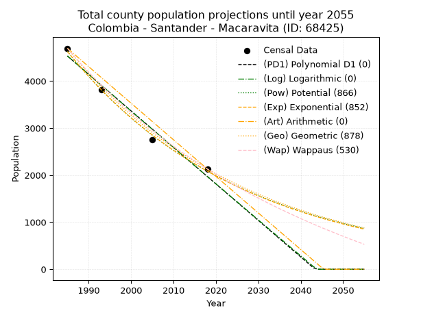
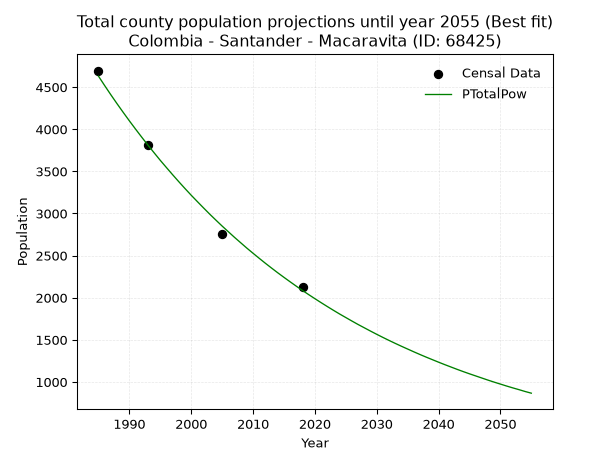
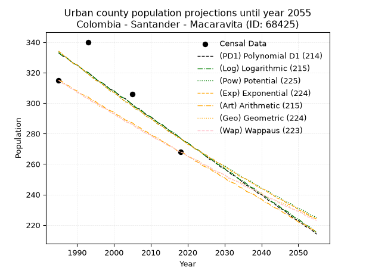
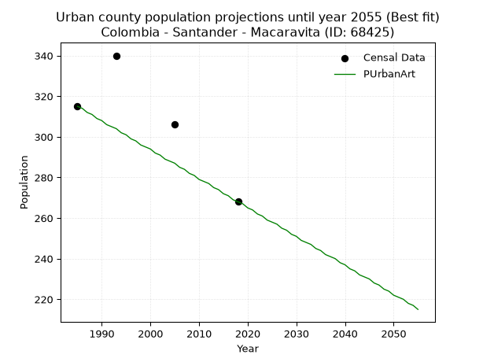
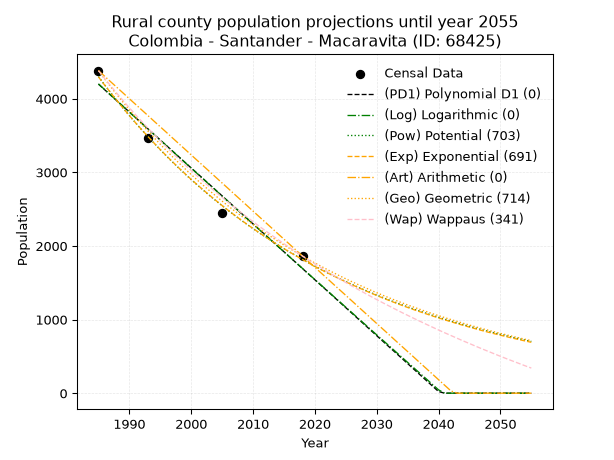
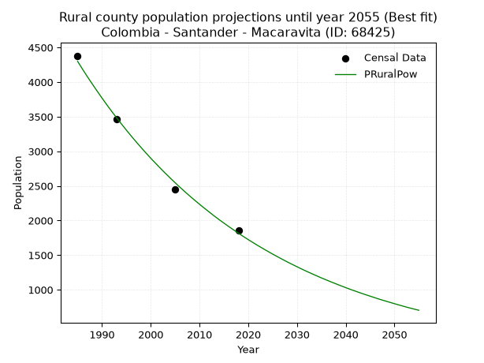

<div align="center">


</div>

# _“Population and Public Services Demand Projections (PPSD) until Year 2050 for Colombia - Santander - Macaravita (ID: 68425)”_
Keywords: `population` `public-service` `projection` `lineal` `polynomial` `logarithmic` `potential` `exponential` `arithmetic` `geometric` `wappaus` `dane` `colombia` `south-america`

PPSD are analytical estimates used by governments and planners to anticipate future changes in population size, age distribution, and the resulting community needs for utilities, healthcare, education, and infrastructure as sizing future water treatment facilities, electrical grids, and road networks based on spatial growth.

> **General running parameters**: • app_version: _v20260806_. • Python version: _3.14.7_. • Pandas version: _3.0.5_. • NumPy version: _2.5.1_. • Creates, save and include plots into reports (create_plot): _False_. • Projection until year: _2050_. • Process polynomial degree 2 and up: _False_. • Process Wappaus: _True_. • Process Wappaus: _True_. • Set negative values to zero: _True_. • Set infinite values to zero: _True_. • Drop dataset notes: _True_. 
<div align="center">

Dynamic map: [:earth_americas:Google](http://maps.google.com/maps?q=6.506580428,-72.5931054) [:earth_americas:OSM](https://www.openstreetmap.org/#map=18/6.506580428/-72.5931054&layers=P) [:earth_americas:Bing](https://www.bing.com/maps?cp=6.506580428~-72.5931054&lvl=18) [:earth_americas:Apple](https://maps.apple.com/frame?center=6.506580428%2C-72.5931054&span=0.003%2C0.006)

</div>


<div align="center">

```geojson
{
  "type": "Feature",
  "geometry": {
    "type": "Point", 
    "coordinates": [-72.5931054, 6.506580428]
  }, 
  "properties": {
    "Name": "Colombia - Santander - Macaravita (ID: 68425)"
  }
}
```

</div>


## 0. Census Data (4 records)

Census data are official statistics collected by a government about the people and housing in a country. They usually include counts of total population, age, sex, race, income, education, and jobs.

📅Global census file: [Population.xlsx](../data/Population.xlsx)

| Source   |   Year |   CountryID | CountryName   |   StateID | StateName   |   CountyID | CountyName   |   PTotal |   PUrban |   PRural |
|:---------|-------:|------------:|:--------------|----------:|:------------|-----------:|:-------------|---------:|---------:|---------:|
| DANE     |   1985 |          57 | Colombia      |        68 | Santander   |      68425 | Macaravita   |     4695 |      315 |     4380 |
| DANE     |   1993 |          57 | Colombia      |        68 | Santander   |      68425 | Macaravita   |     3809 |      340 |     3469 |
| DANE     |   2005 |          57 | Colombia      |        68 | Santander   |      68425 | Macaravita   |     2753 |      306 |     2447 |
| DANE     |   2018 |          57 | Colombia      |        68 | Santander   |      68425 | Macaravita   |     2130 |      268 |     1862 |

> 🔥Some records could had specific notes about the registered values or the corresponding urban or rural distribution.

**Local public utility companies (RUPS)**

 | SERVICIO       | ESTADO    | NOMBRE                                                                                                    | NIT         | DEPARTAMENTO_DOMICILIO   | MUNICIPIO_DOMICILIO   | DIRECCION                                      |   TELEFONO | EMAIL                                      | TIPO_INSCRIPCION    | REPRESENTANTE_LEGAL          | TIPO_PRESTADOR                            | CLASIFICACION                 |
|:---------------|:----------|:----------------------------------------------------------------------------------------------------------|:------------|:-------------------------|:----------------------|:-----------------------------------------------|-----------:|:-------------------------------------------|:--------------------|:-----------------------------|:------------------------------------------|:------------------------------|
| ASEO           | OPERATIVA | EMPRESAS PUBLICAS MUNICIPALES DE MALAGA  E.S.P.                                                           | 890205049-0 | SANTANDER                | MALAGA                | Calle 13 No. 6a-58                             |    6617858 | gerencia@espmalaga.gov.co                  | Registro por la ESP | WILFER ORLANDO PADILLA PINTO | EMPRESA INDUSTRIAL Y COMERCIAL DEL ESTADO | MAYOR O IGUAL A 5001 USUARIOS |
| ACUEDUCTO      | OPERATIVA | UNIDAD DE SERVICIOS PUBLICOS DOMICILIARIOS  DE MACARAVITA                                                 | 890210947-1 | SANTANDER                | MACARAVITA            | CARRERA 3 No.3 -38                             |    6607679 | sec.planeacion@macaravita-santander.gov.co | Registro por la ESP | IVAN DARIO VASQUEZ CORDERO   | MUNICIPIO (PRESTACIÓN DIRECTA)            | MENOR O IGUAL A 2500 USUARIOS |
| ALCANTARILLADO | OPERATIVA | UNIDAD DE SERVICIOS PUBLICOS DOMICILIARIOS  DE MACARAVITA                                                 | 890210947-1 | SANTANDER                | MACARAVITA            | CARRERA 3 No.3 -38                             |    6607679 | sec.planeacion@macaravita-santander.gov.co | Registro por la ESP | IVAN DARIO VASQUEZ CORDERO   | MUNICIPIO (PRESTACIÓN DIRECTA)            | MENOR O IGUAL A 2500 USUARIOS |
| ASEO           | OPERATIVA | UNIDAD DE SERVICIOS PUBLICOS DOMICILIARIOS  DE MACARAVITA                                                 | 890210947-1 | SANTANDER                | MACARAVITA            | CARRERA 3 No.3 -38                             |    6607679 | sec.planeacion@macaravita-santander.gov.co | Registro por la ESP | IVAN DARIO VASQUEZ CORDERO   | MUNICIPIO (PRESTACIÓN DIRECTA)            | MENOR O IGUAL A 2500 USUARIOS |
| ACUEDUCTO      | OPERATIVA | asociación de usuarios del servicio de acueducto de la vereda la bricha municipio de Macaravita           | 901346135-1 | SANTANDER                | MACARAVITA            | vereda la bricha finca las lajitas             |    7615761 | miglizarazo@uan.edu.co                     | Registro por la ESP | MILCIADES SALVADOR ESTEBAN   | ORGANIZACION AUTORIZADA                   | MENOR O IGUAL A 2500 USUARIOS |
| ACUEDUCTO      | OPERATIVA | asociación de usuarios del servicio publico de acueducto de la vereda el juncal municipio de Macaravita   | 901345973-0 | SANTANDER                | MACARAVITA            | 5679384                                        |    7615761 | miglizarazo@uan.edu.co                     | Registro por la ESP | ROBINSON  CHAPARRO  ACUNA    | ORGANIZACION AUTORIZADA                   | MENOR O IGUAL A 2500 USUARIOS |
| ACUEDUCTO      | OPERATIVA | asociación de usuarios del servicio de acueducto de la vereda pajarito parte alta municipio de Macaravita | 901346082-8 | SANTANDER                | MACARAVITA            | vereda pajarito parte alta fincal la esperanza |    7615761 | miglizarazo@uan.edu.co                     | Registro por la ESP | JULIO ESTEBAN                | ORGANIZACION AUTORIZADA                   | MENOR O IGUAL A 2500 USUARIOS |
| ACUEDUCTO      | OPERATIVA | asociación de usuarios del servicio de acueducto Donaldo Ortiz sierra del municipio de Macaravita         | 901346122-4 | SANTANDER                | MACARAVITA            | vereda buraga finca plan de burras             |    7615761 | miglizarazo@uan.edu.co                     | Registro por la ESP | GERMAN ORTIZ REYES           | ORGANIZACION AUTORIZADA                   | MENOR O IGUAL A 2500 USUARIOS |

> [📅RUPS Database: Registro Único de Prestadores de Servicios Públicos de Colombia Suramérica - RUPS](https://www.datos.gov.co/Hacienda-y-Cr-dito-P-blico/Registro-nico-de-Prestadores-de-Servicios-P-blicos/4qkq-csdn/about_data)

## 1. Total

### 1.1. Coefficients and Parameters

* (PD1) Polynomial Deg 1: -77.60698514652701, 158580.12203934067 (lineal)
* (Log) Logarithmic: -155402.8720361995, 1184565.2256676138
* (Pow) Potential: -48.37613630816461, 163.1984527582667
* (Exp) Exponential: -0.024164682839183934, 3.1402091240309383e+24
* (Art) Arithmetic: Year diff. 2018 - 1985 = 33, Population diff. 2130 - 4695 = -2565, Annual growth = -77.72727272727273
* (Geo) Geometric: Year diff. 2018 - 1985 = 33, Population diff. 2130 - 4695 = -2565, Annual growth % = -0.023666247902297544
* (Wap) Wappaus: i = -2.277722277722278, Condition values only valid for < 200)

<sub>
Wappaus condition values: ['-0.00', '-2.28', '-4.56', '-6.83', '-9.11', '-11.39', '-13.67', '-15.94', '-18.22', '-20.50', '-22.78', '-25.05', '-27.33', '-29.61', '-31.89', '-34.17', '-36.44', '-38.72', '-41.00', '-43.28', '-45.55', '-47.83', '-50.11', '-52.39', '-54.67', '-56.94', '-59.22', '-61.50', '-63.78', '-66.05', '-68.33', '-70.61', '-72.89', '-75.16', '-77.44', '-79.72', '-82.00', '-84.28', '-86.55', '-88.83', '-91.11', '-93.39', '-95.66', '-97.94', '-100.22', '-102.50', '-104.78', '-107.05', '-109.33', '-111.61', '-113.89', '-116.16', '-118.44', '-120.72', '-123.00', '-125.27', '-127.55', '-129.83', '-132.11', '-134.39', '-136.66', '-138.94', '-141.22', '-143.50', '-145.77', '-148.05']
</sub>


### 1.2. Projected Dataset

|   Year |   CountyID |   PTotalPD1 |   PTotalLog |   PTotalPow |   PTotalExp |   PTotalArt |   PTotalGeo |   PTotalWap |
|-------:|-----------:|------------:|------------:|------------:|------------:|------------:|------------:|------------:|
|   1985 |      68425 |        4530 |        4533 |        4630 |        4626 |        4695 |        4695 |        4695 |
|   1986 |      68425 |        4453 |        4455 |        4518 |        4516 |        4617 |        4584 |        4589 |
|   1987 |      68425 |        4375 |        4377 |        4409 |        4408 |        4540 |        4475 |        4486 |
|   1988 |      68425 |        4297 |        4298 |        4303 |        4302 |        4462 |        4369 |        4385 |
|   1989 |      68425 |        4220 |        4220 |        4200 |        4200 |        4384 |        4266 |        4286 |
|   1990 |      68425 |        4142 |        4142 |        4099 |        4099 |        4306 |        4165 |        4189 |
|   1991 |      68425 |        4065 |        4064 |        4001 |        4002 |        4229 |        4067 |        4094 |
|   1992 |      68425 |        3987 |        3986 |        3905 |        3906 |        4151 |        3970 |        4002 |
|   1993 |      68425 |        3909 |        3908 |        3811 |        3813 |        4073 |        3876 |        3911 |
|   1994 |      68425 |        3832 |        3830 |        3720 |        3722 |        3995 |        3785 |        3822 |
|   1995 |      68425 |        3754 |        3752 |        3630 |        3633 |        3918 |        3695 |        3735 |
|   1996 |      68425 |        3677 |        3674 |        3544 |        3546 |        3840 |        3608 |        3650 |
|   1997 |      68425 |        3599 |        3596 |        3459 |        3462 |        3762 |        3522 |        3566 |
|   1998 |      68425 |        3521 |        3519 |        3376 |        3379 |        3685 |        3439 |        3484 |
|   1999 |      68425 |        3444 |        3441 |        3295 |        3298 |        3607 |        3357 |        3404 |
|   2000 |      68425 |        3366 |        3363 |        3216 |        3219 |        3529 |        3278 |        3325 |
|   2001 |      68425 |        3289 |        3285 |        3140 |        3143 |        3451 |        3200 |        3248 |
|   2002 |      68425 |        3211 |        3208 |        3065 |        3068 |        3374 |        3125 |        3172 |
|   2003 |      68425 |        3133 |        3130 |        2991 |        2994 |        3296 |        3051 |        3098 |
|   2004 |      68425 |        3056 |        3053 |        2920 |        2923 |        3218 |        2979 |        3025 |
|   2005 |      68425 |        2978 |        2975 |        2850 |        2853 |        3140 |        2908 |        2953 |
|   2006 |      68425 |        2901 |        2898 |        2783 |        2785 |        3063 |        2839 |        2883 |
|   2007 |      68425 |        2823 |        2820 |        2716 |        2718 |        2985 |        2772 |        2814 |
|   2008 |      68425 |        2745 |        2743 |        2652 |        2654 |        2907 |        2706 |        2746 |
|   2009 |      68425 |        2668 |        2665 |        2588 |        2590 |        2830 |        2642 |        2679 |
|   2010 |      68425 |        2590 |        2588 |        2527 |        2528 |        2752 |        2580 |        2614 |
|   2011 |      68425 |        2512 |        2511 |        2467 |        2468 |        2674 |        2519 |        2550 |
|   2012 |      68425 |        2435 |        2434 |        2408 |        2409 |        2596 |        2459 |        2487 |
|   2013 |      68425 |        2357 |        2356 |        2351 |        2352 |        2519 |        2401 |        2425 |
|   2014 |      68425 |        2280 |        2279 |        2295 |        2295 |        2441 |        2344 |        2364 |
|   2015 |      68425 |        2202 |        2202 |        2241 |        2241 |        2363 |        2289 |        2304 |
|   2016 |      68425 |        2124 |        2125 |        2188 |        2187 |        2285 |        2235 |        2245 |
|   2017 |      68425 |        2047 |        2048 |        2136 |        2135 |        2208 |        2182 |        2187 |
|   2018 |      68425 |        1969 |        1971 |        2085 |        2084 |        2130 |        2130 |        2130 |
|   2019 |      68425 |        1892 |        1894 |        2036 |        2034 |        2052 |        2080 |        2074 |
|   2020 |      68425 |        1814 |        1817 |        1988 |        1986 |        1975 |        2030 |        2019 |
|   2021 |      68425 |        1736 |        1740 |        1941 |        1938 |        1897 |        1982 |        1965 |
|   2022 |      68425 |        1659 |        1663 |        1895 |        1892 |        1819 |        1935 |        1911 |
|   2023 |      68425 |        1581 |        1586 |        1850 |        1847 |        1741 |        1890 |        1859 |
|   2024 |      68425 |        1504 |        1509 |        1806 |        1803 |        1664 |        1845 |        1807 |
|   2025 |      68425 |        1426 |        1433 |        1764 |        1760 |        1586 |        1801 |        1756 |
|   2026 |      68425 |        1348 |        1356 |        1722 |        1718 |        1508 |        1759 |        1706 |
|   2027 |      68425 |        1271 |        1279 |        1681 |        1677 |        1430 |        1717 |        1657 |
|   2028 |      68425 |        1193 |        1203 |        1642 |        1637 |        1353 |        1676 |        1608 |
|   2029 |      68425 |        1116 |        1126 |        1603 |        1597 |        1275 |        1637 |        1560 |
|   2030 |      68425 |        1038 |        1049 |        1565 |        1559 |        1197 |        1598 |        1513 |
|   2031 |      68425 |         960 |         973 |        1528 |        1522 |        1120 |        1560 |        1467 |
|   2032 |      68425 |         883 |         896 |        1492 |        1486 |        1042 |        1523 |        1421 |
|   2033 |      68425 |         805 |         820 |        1457 |        1450 |         964 |        1487 |        1376 |
|   2034 |      68425 |         728 |         744 |        1423 |        1416 |         886 |        1452 |        1332 |
|   2035 |      68425 |         650 |         667 |        1390 |        1382 |         809 |        1418 |        1288 |
|   2036 |      68425 |         572 |         591 |        1357 |        1349 |         731 |        1384 |        1245 |
|   2037 |      68425 |         495 |         514 |        1325 |        1317 |         653 |        1351 |        1202 |
|   2038 |      68425 |         417 |         438 |        1294 |        1285 |         575 |        1319 |        1161 |
|   2039 |      68425 |         339 |         362 |        1264 |        1255 |         498 |        1288 |        1119 |
|   2040 |      68425 |         262 |         286 |        1234 |        1225 |         420 |        1258 |        1079 |
|   2041 |      68425 |         184 |         210 |        1205 |        1195 |         342 |        1228 |        1038 |
|   2042 |      68425 |         107 |         133 |        1177 |        1167 |         265 |        1199 |         999 |
|   2043 |      68425 |          29 |          57 |        1149 |        1139 |         187 |        1170 |         960 |
|   2044 |      68425 |           0 |           0 |        1122 |        1112 |         109 |        1143 |         921 |
|   2045 |      68425 |           0 |           0 |        1096 |        1085 |          31 |        1116 |         883 |
|   2046 |      68425 |           0 |           0 |        1071 |        1059 |           0 |        1089 |         846 |
|   2047 |      68425 |           0 |           0 |        1046 |        1034 |           0 |        1063 |         809 |
|   2048 |      68425 |           0 |           0 |        1021 |        1009 |           0 |        1038 |         772 |
|   2049 |      68425 |           0 |           0 |         997 |         985 |           0 |        1014 |         736 |
|   2050 |      68425 |           0 |           0 |         974 |         962 |           0 |         990 |         701 |
<div align="center">

</img>

</div>


### 1.3. Best fit with absolute and relative error (%)

Relative error puts that difference into context by dividing the absolute error by the true value, creating a unitless ratio or percentage that shows the scale of the mistake.

Absolute and relative error

|   Year | Source   |   CountryID | CountryName   |   StateID | StateName   |   CountyID_x | CountyName   |   PTotal |   PUrban |   PRural |   CountyID_y |   PTotalPD1 |   PTotalLog |   PTotalPow |   PTotalExp |   PTotalArt |   PTotalGeo |   PTotalWap |   PTotalPD1AbsError |   PTotalLogAbsError |   PTotalPowAbsError |   PTotalExpAbsError |   PTotalArtAbsError |   PTotalGeoAbsError |   PTotalWapAbsError |   PTotalPD1RelError |   PTotalLogRelError |   PTotalPowRelError |   PTotalExpRelError |   PTotalArtRelError |   PTotalGeoRelError |   PTotalWapRelError |
|-------:|:---------|------------:|:--------------|----------:|:------------|-------------:|:-------------|---------:|---------:|---------:|-------------:|------------:|------------:|------------:|------------:|------------:|------------:|------------:|--------------------:|--------------------:|--------------------:|--------------------:|--------------------:|--------------------:|--------------------:|--------------------:|--------------------:|--------------------:|--------------------:|--------------------:|--------------------:|--------------------:|
|   1985 | DANE     |          57 | Colombia      |        68 | Santander   |        68425 | Macaravita   |     4695 |      315 |     4380 |        68425 |        4530 |        4533 |        4630 |        4626 |        4695 |        4695 |        4695 |                 165 |                 162 |                  65 |                  69 |                   0 |                   0 |                   0 |             3.51438 |             3.45048 |           1.38445   |            1.46965  |             0       |             0       |             0       |
|   1993 | DANE     |          57 | Colombia      |        68 | Santander   |        68425 | Macaravita   |     3809 |      340 |     3469 |        68425 |        3909 |        3908 |        3811 |        3813 |        4073 |        3876 |        3911 |                 100 |                  99 |                   2 |                   4 |                 264 |                  67 |                 102 |             2.62536 |             2.59911 |           0.0525072 |            0.105014 |             6.93095 |             1.75899 |             2.67787 |
|   2005 | DANE     |          57 | Colombia      |        68 | Santander   |        68425 | Macaravita   |     2753 |      306 |     2447 |        68425 |        2978 |        2975 |        2850 |        2853 |        3140 |        2908 |        2953 |                 225 |                 222 |                  97 |                 100 |                 387 |                 155 |                 200 |             8.1729  |             8.06393 |           3.52343   |            3.6324   |            14.0574  |             5.63022 |             7.2648  |
|   2018 | DANE     |          57 | Colombia      |        68 | Santander   |        68425 | Macaravita   |     2130 |      268 |     1862 |        68425 |        1969 |        1971 |        2085 |        2084 |        2130 |        2130 |        2130 |                 161 |                 159 |                  45 |                  46 |                   0 |                   0 |                   0 |             7.55869 |             7.46479 |           2.11268   |            2.15962  |             0       |             0       |             0       |

Relative error mean

| Method    |   RelError | Best   |
|:----------|-----------:|:-------|
| PTotalPD1 |    5.46783 |        |
| PTotalLog |    5.39458 |        |
| PTotalPow |    1.76827 | True   |
| PTotalExp |    1.84167 |        |
| PTotalArt |    5.24709 |        |
| PTotalGeo |    1.8473  |        |
| PTotalWap |    2.48567 |        |

💙Best method: _**PTotalPow**_
<div align="center">

</img>

</div>


### 1.4. Fresh water supply demand in liters per capita per day (lpcd)

The fresh water supply demand typically ranges from 100 to 300 liters per capita per day (lpcd) for standard domestic and municipal planning, though absolute survival minimums set by the World Health Organization are as low as 7.5 to 20 liters per day, and total consumption in high-income nations can exceed 400 liters.

> `CZ`: Level in meters above the sea level (masl)<br> `WS`: Fresh water supply demand in liters per capita per day (lpcd or l/h/d)<br> `WSAll`: Zonal fresh water supply demand in liters per second (l/s)<br> `A`: Zonal area in square meters<br> `DP`: Population density (people/hectare or p/ha)

Reference values (RAS Colombia)

|    CZ |   WS |
|------:|-----:|
|  1000 |  120 |
|  2000 |  130 |
| 99999 |  140 |

County shapefile geometry properties and water supply values

|   CountyID |      ATotal |   CZTotal |   WSTotal |
|-----------:|------------:|----------:|----------:|
|      68425 | 1.02689e+08 |   2476.66 |       140 |

Projected values for best method: PTotalPow

|   CountyID |   Year |   PTotalPow |   DPTotal |   WSTotal |   WSTotalAll |
|-----------:|-------:|------------:|----------:|----------:|-------------:|
|      68425 |   1985 |        4630 |      0.45 |       140 |      7.50231 |
|      68425 |   1986 |        4518 |      0.44 |       140 |      7.32083 |
|      68425 |   1987 |        4409 |      0.43 |       140 |      7.14421 |
|      68425 |   1988 |        4303 |      0.42 |       140 |      6.97245 |
|      68425 |   1989 |        4200 |      0.41 |       140 |      6.80556 |
|      68425 |   1990 |        4099 |      0.4  |       140 |      6.6419  |
|      68425 |   1991 |        4001 |      0.39 |       140 |      6.4831  |
|      68425 |   1992 |        3905 |      0.38 |       140 |      6.32755 |
|      68425 |   1993 |        3811 |      0.37 |       140 |      6.17523 |
|      68425 |   1994 |        3720 |      0.36 |       140 |      6.02778 |
|      68425 |   1995 |        3630 |      0.35 |       140 |      5.88194 |
|      68425 |   1996 |        3544 |      0.35 |       140 |      5.74259 |
|      68425 |   1997 |        3459 |      0.34 |       140 |      5.60486 |
|      68425 |   1998 |        3376 |      0.33 |       140 |      5.47037 |
|      68425 |   1999 |        3295 |      0.32 |       140 |      5.33912 |
|      68425 |   2000 |        3216 |      0.31 |       140 |      5.21111 |
|      68425 |   2001 |        3140 |      0.31 |       140 |      5.08796 |
|      68425 |   2002 |        3065 |      0.3  |       140 |      4.96644 |
|      68425 |   2003 |        2991 |      0.29 |       140 |      4.84653 |
|      68425 |   2004 |        2920 |      0.28 |       140 |      4.73148 |
|      68425 |   2005 |        2850 |      0.28 |       140 |      4.61806 |
|      68425 |   2006 |        2783 |      0.27 |       140 |      4.50949 |
|      68425 |   2007 |        2716 |      0.26 |       140 |      4.40093 |
|      68425 |   2008 |        2652 |      0.26 |       140 |      4.29722 |
|      68425 |   2009 |        2588 |      0.25 |       140 |      4.19352 |
|      68425 |   2010 |        2527 |      0.25 |       140 |      4.09468 |
|      68425 |   2011 |        2467 |      0.24 |       140 |      3.99745 |
|      68425 |   2012 |        2408 |      0.23 |       140 |      3.90185 |
|      68425 |   2013 |        2351 |      0.23 |       140 |      3.80949 |
|      68425 |   2014 |        2295 |      0.22 |       140 |      3.71875 |
|      68425 |   2015 |        2241 |      0.22 |       140 |      3.63125 |
|      68425 |   2016 |        2188 |      0.21 |       140 |      3.54537 |
|      68425 |   2017 |        2136 |      0.21 |       140 |      3.46111 |
|      68425 |   2018 |        2085 |      0.2  |       140 |      3.37847 |
|      68425 |   2019 |        2036 |      0.2  |       140 |      3.29907 |
|      68425 |   2020 |        1988 |      0.19 |       140 |      3.2213  |
|      68425 |   2021 |        1941 |      0.19 |       140 |      3.14514 |
|      68425 |   2022 |        1895 |      0.18 |       140 |      3.0706  |
|      68425 |   2023 |        1850 |      0.18 |       140 |      2.99769 |
|      68425 |   2024 |        1806 |      0.18 |       140 |      2.92639 |
|      68425 |   2025 |        1764 |      0.17 |       140 |      2.85833 |
|      68425 |   2026 |        1722 |      0.17 |       140 |      2.79028 |
|      68425 |   2027 |        1681 |      0.16 |       140 |      2.72384 |
|      68425 |   2028 |        1642 |      0.16 |       140 |      2.66065 |
|      68425 |   2029 |        1603 |      0.16 |       140 |      2.59745 |
|      68425 |   2030 |        1565 |      0.15 |       140 |      2.53588 |
|      68425 |   2031 |        1528 |      0.15 |       140 |      2.47593 |
|      68425 |   2032 |        1492 |      0.15 |       140 |      2.41759 |
|      68425 |   2033 |        1457 |      0.14 |       140 |      2.36088 |
|      68425 |   2034 |        1423 |      0.14 |       140 |      2.30579 |
|      68425 |   2035 |        1390 |      0.14 |       140 |      2.25231 |
|      68425 |   2036 |        1357 |      0.13 |       140 |      2.19884 |
|      68425 |   2037 |        1325 |      0.13 |       140 |      2.14699 |
|      68425 |   2038 |        1294 |      0.13 |       140 |      2.09676 |
|      68425 |   2039 |        1264 |      0.12 |       140 |      2.04815 |
|      68425 |   2040 |        1234 |      0.12 |       140 |      1.99954 |
|      68425 |   2041 |        1205 |      0.12 |       140 |      1.95255 |
|      68425 |   2042 |        1177 |      0.11 |       140 |      1.90718 |
|      68425 |   2043 |        1149 |      0.11 |       140 |      1.86181 |
|      68425 |   2044 |        1122 |      0.11 |       140 |      1.81806 |
|      68425 |   2045 |        1096 |      0.11 |       140 |      1.77593 |
|      68425 |   2046 |        1071 |      0.1  |       140 |      1.73542 |
|      68425 |   2047 |        1046 |      0.1  |       140 |      1.69491 |
|      68425 |   2048 |        1021 |      0.1  |       140 |      1.6544  |
|      68425 |   2049 |         997 |      0.1  |       140 |      1.61551 |
|      68425 |   2050 |         974 |      0.09 |       140 |      1.57824 |

## 2. Urban

### 2.1. Coefficients and Parameters

* (PD1) Polynomial Deg 1: -1.6993175431553311, 3706.309915696451 (lineal)
* (Log) Logarithmic: -3396.6762613291316, 26125.413481618034
* (Pow) Potential: -11.425151993486224, 40.201204604461076
* (Exp) Exponential: -0.005715841559892955, 28264994.82211038
* (Art) Arithmetic: Year diff. 2018 - 1985 = 33, Population diff. 268 - 315 = -47, Annual growth = -1.4242424242424243
* (Geo) Geometric: Year diff. 2018 - 1985 = 33, Population diff. 268 - 315 = -47, Annual growth % = -0.004884566615124042
* (Wap) Wappaus: i = -0.4885908831020323, Condition values only valid for < 200)

<sub>
Wappaus condition values: ['-0.00', '-0.49', '-0.98', '-1.47', '-1.95', '-2.44', '-2.93', '-3.42', '-3.91', '-4.40', '-4.89', '-5.37', '-5.86', '-6.35', '-6.84', '-7.33', '-7.82', '-8.31', '-8.79', '-9.28', '-9.77', '-10.26', '-10.75', '-11.24', '-11.73', '-12.21', '-12.70', '-13.19', '-13.68', '-14.17', '-14.66', '-15.15', '-15.63', '-16.12', '-16.61', '-17.10', '-17.59', '-18.08', '-18.57', '-19.06', '-19.54', '-20.03', '-20.52', '-21.01', '-21.50', '-21.99', '-22.48', '-22.96', '-23.45', '-23.94', '-24.43', '-24.92', '-25.41', '-25.90', '-26.38', '-26.87', '-27.36', '-27.85', '-28.34', '-28.83', '-29.32', '-29.80', '-30.29', '-30.78', '-31.27', '-31.76']
</sub>


### 2.2. Projected Dataset

|   Year |   CountyID |   PUrbanPD1 |   PUrbanLog |   PUrbanPow |   PUrbanExp |   PUrbanArt |   PUrbanGeo |   PUrbanWap |
|-------:|-----------:|------------:|------------:|------------:|------------:|------------:|------------:|------------:|
|   1985 |      68425 |         333 |         333 |         334 |         334 |         315 |         315 |         315 |
|   1986 |      68425 |         331 |         331 |         332 |         332 |         314 |         313 |         313 |
|   1987 |      68425 |         330 |         330 |         330 |         330 |         312 |         312 |         312 |
|   1988 |      68425 |         328 |         328 |         328 |         328 |         311 |         310 |         310 |
|   1989 |      68425 |         326 |         326 |         326 |         326 |         309 |         309 |         309 |
|   1990 |      68425 |         325 |         325 |         325 |         325 |         308 |         307 |         307 |
|   1991 |      68425 |         323 |         323 |         323 |         323 |         306 |         306 |         306 |
|   1992 |      68425 |         321 |         321 |         321 |         321 |         305 |         304 |         304 |
|   1993 |      68425 |         320 |         320 |         319 |         319 |         304 |         303 |         303 |
|   1994 |      68425 |         318 |         318 |         317 |         317 |         302 |         301 |         301 |
|   1995 |      68425 |         316 |         316 |         315 |         315 |         301 |         300 |         300 |
|   1996 |      68425 |         314 |         314 |         314 |         314 |         299 |         298 |         299 |
|   1997 |      68425 |         313 |         313 |         312 |         312 |         298 |         297 |         297 |
|   1998 |      68425 |         311 |         311 |         310 |         310 |         296 |         296 |         296 |
|   1999 |      68425 |         309 |         309 |         308 |         308 |         295 |         294 |         294 |
|   2000 |      68425 |         308 |         308 |         307 |         307 |         294 |         293 |         293 |
|   2001 |      68425 |         306 |         306 |         305 |         305 |         292 |         291 |         291 |
|   2002 |      68425 |         304 |         304 |         303 |         303 |         291 |         290 |         290 |
|   2003 |      68425 |         303 |         303 |         301 |         301 |         289 |         288 |         288 |
|   2004 |      68425 |         301 |         301 |         300 |         300 |         288 |         287 |         287 |
|   2005 |      68425 |         299 |         299 |         298 |         298 |         287 |         286 |         286 |
|   2006 |      68425 |         297 |         297 |         296 |         296 |         285 |         284 |         284 |
|   2007 |      68425 |         296 |         296 |         295 |         295 |         284 |         283 |         283 |
|   2008 |      68425 |         294 |         294 |         293 |         293 |         282 |         281 |         281 |
|   2009 |      68425 |         292 |         292 |         291 |         291 |         281 |         280 |         280 |
|   2010 |      68425 |         291 |         291 |         290 |         290 |         279 |         279 |         279 |
|   2011 |      68425 |         289 |         289 |         288 |         288 |         278 |         277 |         277 |
|   2012 |      68425 |         287 |         287 |         286 |         286 |         277 |         276 |         276 |
|   2013 |      68425 |         286 |         286 |         285 |         285 |         275 |         275 |         275 |
|   2014 |      68425 |         284 |         284 |         283 |         283 |         274 |         273 |         273 |
|   2015 |      68425 |         282 |         282 |         281 |         281 |         272 |         272 |         272 |
|   2016 |      68425 |         280 |         281 |         280 |         280 |         271 |         271 |         271 |
|   2017 |      68425 |         279 |         279 |         278 |         278 |         269 |         269 |         269 |
|   2018 |      68425 |         277 |         277 |         277 |         277 |         268 |         268 |         268 |
|   2019 |      68425 |         275 |         275 |         275 |         275 |         267 |         267 |         267 |
|   2020 |      68425 |         274 |         274 |         274 |         273 |         265 |         265 |         265 |
|   2021 |      68425 |         272 |         272 |         272 |         272 |         264 |         264 |         264 |
|   2022 |      68425 |         270 |         270 |         270 |         270 |         262 |         263 |         263 |
|   2023 |      68425 |         269 |         269 |         269 |         269 |         261 |         262 |         261 |
|   2024 |      68425 |         267 |         267 |         267 |         267 |         259 |         260 |         260 |
|   2025 |      68425 |         265 |         265 |         266 |         266 |         258 |         259 |         259 |
|   2026 |      68425 |         263 |         264 |         264 |         264 |         257 |         258 |         258 |
|   2027 |      68425 |         262 |         262 |         263 |         263 |         255 |         256 |         256 |
|   2028 |      68425 |         260 |         260 |         261 |         261 |         254 |         255 |         255 |
|   2029 |      68425 |         258 |         259 |         260 |         260 |         252 |         254 |         254 |
|   2030 |      68425 |         257 |         257 |         259 |         258 |         251 |         253 |         253 |
|   2031 |      68425 |         255 |         255 |         257 |         257 |         249 |         251 |         251 |
|   2032 |      68425 |         253 |         254 |         256 |         255 |         248 |         250 |         250 |
|   2033 |      68425 |         252 |         252 |         254 |         254 |         247 |         249 |         249 |
|   2034 |      68425 |         250 |         250 |         253 |         252 |         245 |         248 |         248 |
|   2035 |      68425 |         248 |         249 |         251 |         251 |         244 |         247 |         246 |
|   2036 |      68425 |         246 |         247 |         250 |         250 |         242 |         245 |         245 |
|   2037 |      68425 |         245 |         245 |         249 |         248 |         241 |         244 |         244 |
|   2038 |      68425 |         243 |         244 |         247 |         247 |         240 |         243 |         243 |
|   2039 |      68425 |         241 |         242 |         246 |         245 |         238 |         242 |         242 |
|   2040 |      68425 |         240 |         240 |         244 |         244 |         237 |         241 |         240 |
|   2041 |      68425 |         238 |         239 |         243 |         243 |         235 |         239 |         239 |
|   2042 |      68425 |         236 |         237 |         242 |         241 |         234 |         238 |         238 |
|   2043 |      68425 |         235 |         235 |         240 |         240 |         232 |         237 |         237 |
|   2044 |      68425 |         233 |         234 |         239 |         238 |         231 |         236 |         236 |
|   2045 |      68425 |         231 |         232 |         238 |         237 |         230 |         235 |         234 |
|   2046 |      68425 |         230 |         230 |         236 |         236 |         228 |         234 |         233 |
|   2047 |      68425 |         228 |         229 |         235 |         234 |         227 |         233 |         232 |
|   2048 |      68425 |         226 |         227 |         234 |         233 |         225 |         231 |         231 |
|   2049 |      68425 |         224 |         225 |         232 |         232 |         224 |         230 |         230 |
|   2050 |      68425 |         223 |         224 |         231 |         230 |         222 |         229 |         229 |
<div align="center">

</img>

</div>


### 2.3. Best fit with absolute and relative error (%)

Relative error puts that difference into context by dividing the absolute error by the true value, creating a unitless ratio or percentage that shows the scale of the mistake.

Absolute and relative error

|   Year | Source   |   CountryID | CountryName   |   StateID | StateName   |   CountyID_x | CountyName   |   PTotal |   PUrban |   PRural |   CountyID_y |   PUrbanPD1 |   PUrbanLog |   PUrbanPow |   PUrbanExp |   PUrbanArt |   PUrbanGeo |   PUrbanWap |   PUrbanPD1AbsError |   PUrbanLogAbsError |   PUrbanPowAbsError |   PUrbanExpAbsError |   PUrbanArtAbsError |   PUrbanGeoAbsError |   PUrbanWapAbsError |   PUrbanPD1RelError |   PUrbanLogRelError |   PUrbanPowRelError |   PUrbanExpRelError |   PUrbanArtRelError |   PUrbanGeoRelError |   PUrbanWapRelError |
|-------:|:---------|------------:|:--------------|----------:|:------------|-------------:|:-------------|---------:|---------:|---------:|-------------:|------------:|------------:|------------:|------------:|------------:|------------:|------------:|--------------------:|--------------------:|--------------------:|--------------------:|--------------------:|--------------------:|--------------------:|--------------------:|--------------------:|--------------------:|--------------------:|--------------------:|--------------------:|--------------------:|
|   1985 | DANE     |          57 | Colombia      |        68 | Santander   |        68425 | Macaravita   |     4695 |      315 |     4380 |        68425 |         333 |         333 |         334 |         334 |         315 |         315 |         315 |                  18 |                  18 |                  19 |                  19 |                   0 |                   0 |                   0 |             5.71429 |             5.71429 |             6.03175 |             6.03175 |             0       |             0       |             0       |
|   1993 | DANE     |          57 | Colombia      |        68 | Santander   |        68425 | Macaravita   |     3809 |      340 |     3469 |        68425 |         320 |         320 |         319 |         319 |         304 |         303 |         303 |                  20 |                  20 |                  21 |                  21 |                  36 |                  37 |                  37 |             5.88235 |             5.88235 |             6.17647 |             6.17647 |            10.5882  |            10.8824  |            10.8824  |
|   2005 | DANE     |          57 | Colombia      |        68 | Santander   |        68425 | Macaravita   |     2753 |      306 |     2447 |        68425 |         299 |         299 |         298 |         298 |         287 |         286 |         286 |                   7 |                   7 |                   8 |                   8 |                  19 |                  20 |                  20 |             2.28758 |             2.28758 |             2.61438 |             2.61438 |             6.20915 |             6.53595 |             6.53595 |
|   2018 | DANE     |          57 | Colombia      |        68 | Santander   |        68425 | Macaravita   |     2130 |      268 |     1862 |        68425 |         277 |         277 |         277 |         277 |         268 |         268 |         268 |                   9 |                   9 |                   9 |                   9 |                   0 |                   0 |                   0 |             3.35821 |             3.35821 |             3.35821 |             3.35821 |             0       |             0       |             0       |

Relative error mean

| Method    |   RelError | Best   |
|:----------|-----------:|:-------|
| PUrbanPD1 |    4.31061 |        |
| PUrbanLog |    4.31061 |        |
| PUrbanPow |    4.5452  |        |
| PUrbanExp |    4.5452  |        |
| PUrbanArt |    4.19935 | True   |
| PUrbanGeo |    4.35458 |        |
| PUrbanWap |    4.35458 |        |

💙Best method: _**PUrbanArt**_
<div align="center">

</img>

</div>


### 2.4. Fresh water supply demand in liters per capita per day (lpcd)

The fresh water supply demand typically ranges from 100 to 300 liters per capita per day (lpcd) for standard domestic and municipal planning, though absolute survival minimums set by the World Health Organization are as low as 7.5 to 20 liters per day, and total consumption in high-income nations can exceed 400 liters.

> `CZ`: Level in meters above the sea level (masl)<br> `WS`: Fresh water supply demand in liters per capita per day (lpcd or l/h/d)<br> `WSAll`: Zonal fresh water supply demand in liters per second (l/s)<br> `A`: Zonal area in square meters<br> `DP`: Population density (people/hectare or p/ha)

Reference values (RAS Colombia)

|    CZ |   WS |
|------:|-----:|
|  1000 |  120 |
|  2000 |  130 |
| 99999 |  140 |

County shapefile geometry properties and water supply values

|   CountyID |   AUrban |   CZUrban |   WSUrban |
|-----------:|---------:|----------:|----------:|
|      68425 |    80154 |    2289.1 |       140 |

Projected values for best method: PUrbanArt

|   CountyID |   Year |   PUrbanArt |   DPUrban |   WSUrban |   WSUrbanAll |
|-----------:|-------:|------------:|----------:|----------:|-------------:|
|      68425 |   1985 |         315 |     39.3  |       140 |     0.510417 |
|      68425 |   1986 |         314 |     39.17 |       140 |     0.508796 |
|      68425 |   1987 |         312 |     38.93 |       140 |     0.505556 |
|      68425 |   1988 |         311 |     38.8  |       140 |     0.503935 |
|      68425 |   1989 |         309 |     38.55 |       140 |     0.500694 |
|      68425 |   1990 |         308 |     38.43 |       140 |     0.499074 |
|      68425 |   1991 |         306 |     38.18 |       140 |     0.495833 |
|      68425 |   1992 |         305 |     38.05 |       140 |     0.494213 |
|      68425 |   1993 |         304 |     37.93 |       140 |     0.492593 |
|      68425 |   1994 |         302 |     37.68 |       140 |     0.489352 |
|      68425 |   1995 |         301 |     37.55 |       140 |     0.487731 |
|      68425 |   1996 |         299 |     37.3  |       140 |     0.484491 |
|      68425 |   1997 |         298 |     37.18 |       140 |     0.48287  |
|      68425 |   1998 |         296 |     36.93 |       140 |     0.47963  |
|      68425 |   1999 |         295 |     36.8  |       140 |     0.478009 |
|      68425 |   2000 |         294 |     36.68 |       140 |     0.476389 |
|      68425 |   2001 |         292 |     36.43 |       140 |     0.473148 |
|      68425 |   2002 |         291 |     36.31 |       140 |     0.471528 |
|      68425 |   2003 |         289 |     36.06 |       140 |     0.468287 |
|      68425 |   2004 |         288 |     35.93 |       140 |     0.466667 |
|      68425 |   2005 |         287 |     35.81 |       140 |     0.465046 |
|      68425 |   2006 |         285 |     35.56 |       140 |     0.461806 |
|      68425 |   2007 |         284 |     35.43 |       140 |     0.460185 |
|      68425 |   2008 |         282 |     35.18 |       140 |     0.456944 |
|      68425 |   2009 |         281 |     35.06 |       140 |     0.455324 |
|      68425 |   2010 |         279 |     34.81 |       140 |     0.452083 |
|      68425 |   2011 |         278 |     34.68 |       140 |     0.450463 |
|      68425 |   2012 |         277 |     34.56 |       140 |     0.448843 |
|      68425 |   2013 |         275 |     34.31 |       140 |     0.445602 |
|      68425 |   2014 |         274 |     34.18 |       140 |     0.443981 |
|      68425 |   2015 |         272 |     33.93 |       140 |     0.440741 |
|      68425 |   2016 |         271 |     33.81 |       140 |     0.43912  |
|      68425 |   2017 |         269 |     33.56 |       140 |     0.43588  |
|      68425 |   2018 |         268 |     33.44 |       140 |     0.434259 |
|      68425 |   2019 |         267 |     33.31 |       140 |     0.432639 |
|      68425 |   2020 |         265 |     33.06 |       140 |     0.429398 |
|      68425 |   2021 |         264 |     32.94 |       140 |     0.427778 |
|      68425 |   2022 |         262 |     32.69 |       140 |     0.424537 |
|      68425 |   2023 |         261 |     32.56 |       140 |     0.422917 |
|      68425 |   2024 |         259 |     32.31 |       140 |     0.419676 |
|      68425 |   2025 |         258 |     32.19 |       140 |     0.418056 |
|      68425 |   2026 |         257 |     32.06 |       140 |     0.416435 |
|      68425 |   2027 |         255 |     31.81 |       140 |     0.413194 |
|      68425 |   2028 |         254 |     31.69 |       140 |     0.411574 |
|      68425 |   2029 |         252 |     31.44 |       140 |     0.408333 |
|      68425 |   2030 |         251 |     31.31 |       140 |     0.406713 |
|      68425 |   2031 |         249 |     31.07 |       140 |     0.403472 |
|      68425 |   2032 |         248 |     30.94 |       140 |     0.401852 |
|      68425 |   2033 |         247 |     30.82 |       140 |     0.400231 |
|      68425 |   2034 |         245 |     30.57 |       140 |     0.396991 |
|      68425 |   2035 |         244 |     30.44 |       140 |     0.39537  |
|      68425 |   2036 |         242 |     30.19 |       140 |     0.39213  |
|      68425 |   2037 |         241 |     30.07 |       140 |     0.390509 |
|      68425 |   2038 |         240 |     29.94 |       140 |     0.388889 |
|      68425 |   2039 |         238 |     29.69 |       140 |     0.385648 |
|      68425 |   2040 |         237 |     29.57 |       140 |     0.384028 |
|      68425 |   2041 |         235 |     29.32 |       140 |     0.380787 |
|      68425 |   2042 |         234 |     29.19 |       140 |     0.379167 |
|      68425 |   2043 |         232 |     28.94 |       140 |     0.375926 |
|      68425 |   2044 |         231 |     28.82 |       140 |     0.374306 |
|      68425 |   2045 |         230 |     28.69 |       140 |     0.372685 |
|      68425 |   2046 |         228 |     28.45 |       140 |     0.369444 |
|      68425 |   2047 |         227 |     28.32 |       140 |     0.367824 |
|      68425 |   2048 |         225 |     28.07 |       140 |     0.364583 |
|      68425 |   2049 |         224 |     27.95 |       140 |     0.362963 |
|      68425 |   2050 |         222 |     27.7  |       140 |     0.359722 |

## 3. Rural

### 3.1. Coefficients and Parameters

* (PD1) Polynomial Deg 1: -75.9076676033717, 154873.81212364428 (lineal)
* (Log) Logarithmic: -152006.19577487034, 1158439.8121859955
* (Pow) Potential: -52.265471223153256, 175.99235718683673
* (Exp) Exponential: -0.026106973205894585, 1.3776419147500884e+26
* (Art) Arithmetic: Year diff. 2018 - 1985 = 33, Population diff. 1862 - 4380 = -2518, Annual growth = -76.3030303030303
* (Geo) Geometric: Year diff. 2018 - 1985 = 33, Population diff. 1862 - 4380 = -2518, Annual growth % = -0.025588069097538302
* (Wap) Wappaus: i = -2.4448263474216696, Condition values only valid for < 200)

<sub>
Wappaus condition values: ['-0.00', '-2.44', '-4.89', '-7.33', '-9.78', '-12.22', '-14.67', '-17.11', '-19.56', '-22.00', '-24.45', '-26.89', '-29.34', '-31.78', '-34.23', '-36.67', '-39.12', '-41.56', '-44.01', '-46.45', '-48.90', '-51.34', '-53.79', '-56.23', '-58.68', '-61.12', '-63.57', '-66.01', '-68.46', '-70.90', '-73.34', '-75.79', '-78.23', '-80.68', '-83.12', '-85.57', '-88.01', '-90.46', '-92.90', '-95.35', '-97.79', '-100.24', '-102.68', '-105.13', '-107.57', '-110.02', '-112.46', '-114.91', '-117.35', '-119.80', '-122.24', '-124.69', '-127.13', '-129.58', '-132.02', '-134.47', '-136.91', '-139.36', '-141.80', '-144.24', '-146.69', '-149.13', '-151.58', '-154.02', '-156.47', '-158.91']
</sub>


### 3.2. Projected Dataset

|   Year |   CountyID |   PRuralPD1 |   PRuralLog |   PRuralPow |   PRuralExp |   PRuralArt |   PRuralGeo |   PRuralWap |
|-------:|-----------:|------------:|------------:|------------:|------------:|------------:|------------:|------------:|
|   1985 |      68425 |        4197 |        4200 |        4299 |        4295 |        4380 |        4380 |        4380 |
|   1986 |      68425 |        4121 |        4123 |        4187 |        4184 |        4304 |        4268 |        4274 |
|   1987 |      68425 |        4045 |        4047 |        4078 |        4077 |        4227 |        4159 |        4171 |
|   1988 |      68425 |        3969 |        3970 |        3973 |        3972 |        4151 |        4052 |        4070 |
|   1989 |      68425 |        3893 |        3894 |        3870 |        3869 |        4075 |        3949 |        3972 |
|   1990 |      68425 |        3818 |        3817 |        3769 |        3770 |        3998 |        3848 |        3875 |
|   1991 |      68425 |        3742 |        3741 |        3671 |        3672 |        3922 |        3749 |        3781 |
|   1992 |      68425 |        3666 |        3665 |        3576 |        3578 |        3846 |        3653 |        3690 |
|   1993 |      68425 |        3590 |        3588 |        3484 |        3486 |        3770 |        3560 |        3600 |
|   1994 |      68425 |        3514 |        3512 |        3394 |        3396 |        3693 |        3469 |        3512 |
|   1995 |      68425 |        3438 |        3436 |        3306 |        3308 |        3617 |        3380 |        3426 |
|   1996 |      68425 |        3362 |        3360 |        3220 |        3223 |        3541 |        3293 |        3342 |
|   1997 |      68425 |        3286 |        3284 |        3137 |        3140 |        3464 |        3209 |        3259 |
|   1998 |      68425 |        3210 |        3208 |        3056 |        3059 |        3388 |        3127 |        3179 |
|   1999 |      68425 |        3134 |        3132 |        2977 |        2980 |        3312 |        3047 |        3100 |
|   2000 |      68425 |        3058 |        3056 |        2900 |        2903 |        3235 |        2969 |        3023 |
|   2001 |      68425 |        2983 |        2980 |        2826 |        2829 |        3159 |        2893 |        2947 |
|   2002 |      68425 |        2907 |        2904 |        2753 |        2756 |        3083 |        2819 |        2873 |
|   2003 |      68425 |        2831 |        2828 |        2682 |        2685 |        3007 |        2747 |        2800 |
|   2004 |      68425 |        2755 |        2752 |        2613 |        2616 |        2930 |        2677 |        2729 |
|   2005 |      68425 |        2679 |        2676 |        2546 |        2548 |        2854 |        2608 |        2659 |
|   2006 |      68425 |        2603 |        2600 |        2480 |        2482 |        2778 |        2541 |        2591 |
|   2007 |      68425 |        2527 |        2524 |        2416 |        2418 |        2701 |        2476 |        2523 |
|   2008 |      68425 |        2451 |        2449 |        2354 |        2356 |        2625 |        2413 |        2458 |
|   2009 |      68425 |        2375 |        2373 |        2294 |        2295 |        2549 |        2351 |        2393 |
|   2010 |      68425 |        2299 |        2297 |        2235 |        2236 |        2472 |        2291 |        2330 |
|   2011 |      68425 |        2223 |        2222 |        2178 |        2179 |        2396 |        2232 |        2267 |
|   2012 |      68425 |        2148 |        2146 |        2122 |        2123 |        2320 |        2175 |        2206 |
|   2013 |      68425 |        2072 |        2071 |        2067 |        2068 |        2244 |        2120 |        2146 |
|   2014 |      68425 |        1996 |        1995 |        2014 |        2015 |        2167 |        2065 |        2087 |
|   2015 |      68425 |        1920 |        1920 |        1963 |        1963 |        2091 |        2013 |        2029 |
|   2016 |      68425 |        1844 |        1844 |        1913 |        1912 |        2015 |        1961 |        1973 |
|   2017 |      68425 |        1768 |        1769 |        1864 |        1863 |        1938 |        1911 |        1917 |
|   2018 |      68425 |        1692 |        1694 |        1816 |        1815 |        1862 |        1862 |        1862 |
|   2019 |      68425 |        1616 |        1618 |        1769 |        1768 |        1786 |        1814 |        1808 |
|   2020 |      68425 |        1540 |        1543 |        1724 |        1722 |        1709 |        1768 |        1755 |
|   2021 |      68425 |        1464 |        1468 |        1680 |        1678 |        1633 |        1723 |        1703 |
|   2022 |      68425 |        1389 |        1393 |        1637 |        1635 |        1557 |        1679 |        1652 |
|   2023 |      68425 |        1313 |        1317 |        1596 |        1593 |        1480 |        1636 |        1601 |
|   2024 |      68425 |        1237 |        1242 |        1555 |        1552 |        1404 |        1594 |        1552 |
|   2025 |      68425 |        1161 |        1167 |        1515 |        1512 |        1328 |        1553 |        1503 |
|   2026 |      68425 |        1085 |        1092 |        1477 |        1473 |        1252 |        1513 |        1455 |
|   2027 |      68425 |        1009 |        1017 |        1439 |        1435 |        1175 |        1475 |        1408 |
|   2028 |      68425 |         933 |         942 |        1402 |        1398 |        1099 |        1437 |        1362 |
|   2029 |      68425 |         857 |         867 |        1367 |        1362 |        1023 |        1400 |        1316 |
|   2030 |      68425 |         781 |         792 |        1332 |        1327 |         946 |        1364 |        1271 |
|   2031 |      68425 |         705 |         718 |        1298 |        1292 |         870 |        1329 |        1227 |
|   2032 |      68425 |         629 |         643 |        1265 |        1259 |         794 |        1295 |        1184 |
|   2033 |      68425 |         554 |         568 |        1233 |        1227 |         717 |        1262 |        1141 |
|   2034 |      68425 |         478 |         493 |        1202 |        1195 |         641 |        1230 |        1098 |
|   2035 |      68425 |         402 |         418 |        1171 |        1164 |         565 |        1198 |        1057 |
|   2036 |      68425 |         326 |         344 |        1142 |        1134 |         489 |        1168 |        1016 |
|   2037 |      68425 |         250 |         269 |        1113 |        1105 |         412 |        1138 |         976 |
|   2038 |      68425 |         174 |         195 |        1085 |        1077 |         336 |        1109 |         936 |
|   2039 |      68425 |          98 |         120 |        1057 |        1049 |         260 |        1080 |         897 |
|   2040 |      68425 |          22 |          45 |        1030 |        1022 |         183 |        1053 |         858 |
|   2041 |      68425 |           0 |           0 |        1004 |         996 |         107 |        1026 |         820 |
|   2042 |      68425 |           0 |           0 |         979 |         970 |          31 |        1000 |         783 |
|   2043 |      68425 |           0 |           0 |         954 |         945 |           0 |         974 |         746 |
|   2044 |      68425 |           0 |           0 |         930 |         921 |           0 |         949 |         709 |
|   2045 |      68425 |           0 |           0 |         907 |         897 |           0 |         925 |         674 |
|   2046 |      68425 |           0 |           0 |         884 |         874 |           0 |         901 |         638 |
|   2047 |      68425 |           0 |           0 |         861 |         851 |           0 |         878 |         603 |
|   2048 |      68425 |           0 |           0 |         840 |         829 |           0 |         856 |         569 |
|   2049 |      68425 |           0 |           0 |         819 |         808 |           0 |         834 |         535 |
|   2050 |      68425 |           0 |           0 |         798 |         787 |           0 |         812 |         501 |
<div align="center">

</img>

</div>


### 3.3. Best fit with absolute and relative error (%)

Relative error puts that difference into context by dividing the absolute error by the true value, creating a unitless ratio or percentage that shows the scale of the mistake.

Absolute and relative error

|   Year | Source   |   CountryID | CountryName   |   StateID | StateName   |   CountyID_x | CountyName   |   PTotal |   PUrban |   PRural |   CountyID_y |   PRuralPD1 |   PRuralLog |   PRuralPow |   PRuralExp |   PRuralArt |   PRuralGeo |   PRuralWap |   PRuralPD1AbsError |   PRuralLogAbsError |   PRuralPowAbsError |   PRuralExpAbsError |   PRuralArtAbsError |   PRuralGeoAbsError |   PRuralWapAbsError |   PRuralPD1RelError |   PRuralLogRelError |   PRuralPowRelError |   PRuralExpRelError |   PRuralArtRelError |   PRuralGeoRelError |   PRuralWapRelError |
|-------:|:---------|------------:|:--------------|----------:|:------------|-------------:|:-------------|---------:|---------:|---------:|-------------:|------------:|------------:|------------:|------------:|------------:|------------:|------------:|--------------------:|--------------------:|--------------------:|--------------------:|--------------------:|--------------------:|--------------------:|--------------------:|--------------------:|--------------------:|--------------------:|--------------------:|--------------------:|--------------------:|
|   1985 | DANE     |          57 | Colombia      |        68 | Santander   |        68425 | Macaravita   |     4695 |      315 |     4380 |        68425 |        4197 |        4200 |        4299 |        4295 |        4380 |        4380 |        4380 |                 183 |                 180 |                  81 |                  85 |                   0 |                   0 |                   0 |             4.17808 |             4.10959 |            1.84932  |            1.94064  |             0       |             0       |             0       |
|   1993 | DANE     |          57 | Colombia      |        68 | Santander   |        68425 | Macaravita   |     3809 |      340 |     3469 |        68425 |        3590 |        3588 |        3484 |        3486 |        3770 |        3560 |        3600 |                 121 |                 119 |                  15 |                  17 |                 301 |                  91 |                 131 |             3.48804 |             3.43038 |            0.432401 |            0.490055 |             8.67685 |             2.62323 |             3.7763  |
|   2005 | DANE     |          57 | Colombia      |        68 | Santander   |        68425 | Macaravita   |     2753 |      306 |     2447 |        68425 |        2679 |        2676 |        2546 |        2548 |        2854 |        2608 |        2659 |                 232 |                 229 |                  99 |                 101 |                 407 |                 161 |                 212 |             9.481   |             9.3584  |            4.04577  |            4.1275   |            16.6326  |             6.57949 |             8.66367 |
|   2018 | DANE     |          57 | Colombia      |        68 | Santander   |        68425 | Macaravita   |     2130 |      268 |     1862 |        68425 |        1692 |        1694 |        1816 |        1815 |        1862 |        1862 |        1862 |                 170 |                 168 |                  46 |                  47 |                   0 |                   0 |                   0 |             9.12997 |             9.02256 |            2.47046  |            2.52417  |             0       |             0       |             0       |

Relative error mean

| Method    |   RelError | Best   |
|:----------|-----------:|:-------|
| PRuralPD1 |    6.56927 |        |
| PRuralLog |    6.48023 |        |
| PRuralPow |    2.19949 | True   |
| PRuralExp |    2.27059 |        |
| PRuralArt |    6.32737 |        |
| PRuralGeo |    2.30068 |        |
| PRuralWap |    3.10999 |        |

💙Best method: _**PRuralPow**_
<div align="center">

</img>

</div>


### 3.4. Fresh water supply demand in liters per capita per day (lpcd)

The fresh water supply demand typically ranges from 100 to 300 liters per capita per day (lpcd) for standard domestic and municipal planning, though absolute survival minimums set by the World Health Organization are as low as 7.5 to 20 liters per day, and total consumption in high-income nations can exceed 400 liters.

> `CZ`: Level in meters above the sea level (masl)<br> `WS`: Fresh water supply demand in liters per capita per day (lpcd or l/h/d)<br> `WSAll`: Zonal fresh water supply demand in liters per second (l/s)<br> `A`: Zonal area in square meters<br> `DP`: Population density (people/hectare or p/ha)

Reference values (RAS Colombia)

|    CZ |   WS |
|------:|-----:|
|  1000 |  120 |
|  2000 |  130 |
| 99999 |  140 |

County shapefile geometry properties and water supply values

|   CountyID |      ARural |   CZRural |   WSRural |
|-----------:|------------:|----------:|----------:|
|      68425 | 1.02609e+08 |   2476.79 |       140 |

Projected values for best method: PRuralPow

|   CountyID |   Year |   PRuralPow |   DPRural |   WSRural |   WSRuralAll |
|-----------:|-------:|------------:|----------:|----------:|-------------:|
|      68425 |   1985 |        4299 |      0.42 |       140 |      6.96597 |
|      68425 |   1986 |        4187 |      0.41 |       140 |      6.78449 |
|      68425 |   1987 |        4078 |      0.4  |       140 |      6.60787 |
|      68425 |   1988 |        3973 |      0.39 |       140 |      6.43773 |
|      68425 |   1989 |        3870 |      0.38 |       140 |      6.27083 |
|      68425 |   1990 |        3769 |      0.37 |       140 |      6.10718 |
|      68425 |   1991 |        3671 |      0.36 |       140 |      5.94838 |
|      68425 |   1992 |        3576 |      0.35 |       140 |      5.79444 |
|      68425 |   1993 |        3484 |      0.34 |       140 |      5.64537 |
|      68425 |   1994 |        3394 |      0.33 |       140 |      5.49954 |
|      68425 |   1995 |        3306 |      0.32 |       140 |      5.35694 |
|      68425 |   1996 |        3220 |      0.31 |       140 |      5.21759 |
|      68425 |   1997 |        3137 |      0.31 |       140 |      5.0831  |
|      68425 |   1998 |        3056 |      0.3  |       140 |      4.95185 |
|      68425 |   1999 |        2977 |      0.29 |       140 |      4.82384 |
|      68425 |   2000 |        2900 |      0.28 |       140 |      4.69907 |
|      68425 |   2001 |        2826 |      0.28 |       140 |      4.57917 |
|      68425 |   2002 |        2753 |      0.27 |       140 |      4.46088 |
|      68425 |   2003 |        2682 |      0.26 |       140 |      4.34583 |
|      68425 |   2004 |        2613 |      0.25 |       140 |      4.23403 |
|      68425 |   2005 |        2546 |      0.25 |       140 |      4.12546 |
|      68425 |   2006 |        2480 |      0.24 |       140 |      4.01852 |
|      68425 |   2007 |        2416 |      0.24 |       140 |      3.91481 |
|      68425 |   2008 |        2354 |      0.23 |       140 |      3.81435 |
|      68425 |   2009 |        2294 |      0.22 |       140 |      3.71713 |
|      68425 |   2010 |        2235 |      0.22 |       140 |      3.62153 |
|      68425 |   2011 |        2178 |      0.21 |       140 |      3.52917 |
|      68425 |   2012 |        2122 |      0.21 |       140 |      3.43843 |
|      68425 |   2013 |        2067 |      0.2  |       140 |      3.34931 |
|      68425 |   2014 |        2014 |      0.2  |       140 |      3.26343 |
|      68425 |   2015 |        1963 |      0.19 |       140 |      3.18079 |
|      68425 |   2016 |        1913 |      0.19 |       140 |      3.09977 |
|      68425 |   2017 |        1864 |      0.18 |       140 |      3.02037 |
|      68425 |   2018 |        1816 |      0.18 |       140 |      2.94259 |
|      68425 |   2019 |        1769 |      0.17 |       140 |      2.86644 |
|      68425 |   2020 |        1724 |      0.17 |       140 |      2.79352 |
|      68425 |   2021 |        1680 |      0.16 |       140 |      2.72222 |
|      68425 |   2022 |        1637 |      0.16 |       140 |      2.65255 |
|      68425 |   2023 |        1596 |      0.16 |       140 |      2.58611 |
|      68425 |   2024 |        1555 |      0.15 |       140 |      2.51968 |
|      68425 |   2025 |        1515 |      0.15 |       140 |      2.45486 |
|      68425 |   2026 |        1477 |      0.14 |       140 |      2.39329 |
|      68425 |   2027 |        1439 |      0.14 |       140 |      2.33171 |
|      68425 |   2028 |        1402 |      0.14 |       140 |      2.27176 |
|      68425 |   2029 |        1367 |      0.13 |       140 |      2.21505 |
|      68425 |   2030 |        1332 |      0.13 |       140 |      2.15833 |
|      68425 |   2031 |        1298 |      0.13 |       140 |      2.10324 |
|      68425 |   2032 |        1265 |      0.12 |       140 |      2.04977 |
|      68425 |   2033 |        1233 |      0.12 |       140 |      1.99792 |
|      68425 |   2034 |        1202 |      0.12 |       140 |      1.94769 |
|      68425 |   2035 |        1171 |      0.11 |       140 |      1.89745 |
|      68425 |   2036 |        1142 |      0.11 |       140 |      1.85046 |
|      68425 |   2037 |        1113 |      0.11 |       140 |      1.80347 |
|      68425 |   2038 |        1085 |      0.11 |       140 |      1.7581  |
|      68425 |   2039 |        1057 |      0.1  |       140 |      1.71273 |
|      68425 |   2040 |        1030 |      0.1  |       140 |      1.66898 |
|      68425 |   2041 |        1004 |      0.1  |       140 |      1.62685 |
|      68425 |   2042 |         979 |      0.1  |       140 |      1.58634 |
|      68425 |   2043 |         954 |      0.09 |       140 |      1.54583 |
|      68425 |   2044 |         930 |      0.09 |       140 |      1.50694 |
|      68425 |   2045 |         907 |      0.09 |       140 |      1.46968 |
|      68425 |   2046 |         884 |      0.09 |       140 |      1.43241 |
|      68425 |   2047 |         861 |      0.08 |       140 |      1.39514 |
|      68425 |   2048 |         840 |      0.08 |       140 |      1.36111 |
|      68425 |   2049 |         819 |      0.08 |       140 |      1.32708 |
|      68425 |   2050 |         798 |      0.08 |       140 |      1.29306 |

<div align="center"><br><sub>Share this research</sub></div><br>

<sub>**APPS & TOOLS & CONTENT DISCLAIMER**: • NO WARRANTY - This content and software is provided by <a href="https://github.com/rcfdtools" target="_blank">github.com/rcfdtools</a> "as is", without any express or implied warranty, including warranties of merchantability, fitness for a particular purpose, or non-infringement. There is no guarantee that the software will be error-free or operate without interruption. • LIMITATION OF LIABILITY - Neither the authors nor copyright holders will be liable for claims or damages arising from the software or its use. You are responsible for determining if the software is appropriate for your use and assume all associated risks, including errors, legal compliance, and data loss. • NO PROFESSIONAL ADVICE - The software provides general information and does not offer professional advice. It should not replace consultation with professional advisors. [Clauses and global license for rcfdtools use.](https://github.com/rcfdtools/rcfdtools/blob/main/LICENSE.md)</sub>

| [:house: Home](Readme.md)  | [:beginner: Help / Collaborate](https://github.com/rcfdtools/R.HydroTools/discussions/31) |
|----------------------------|-------------------------------------------------------------------------------------------|