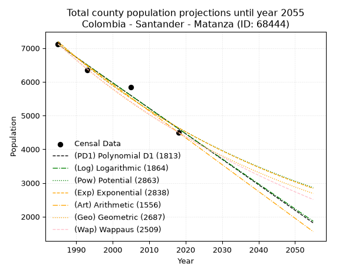
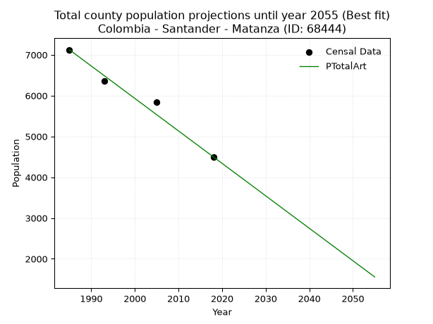
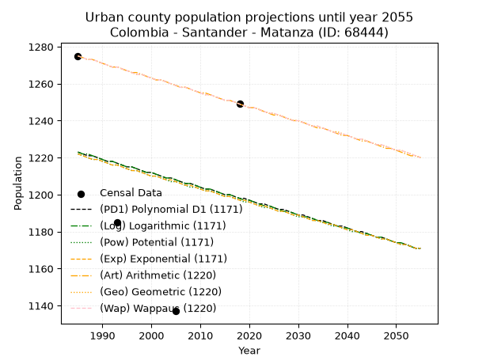
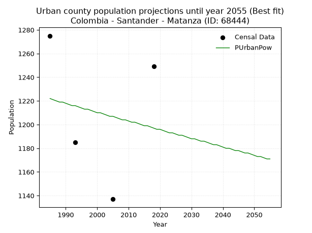
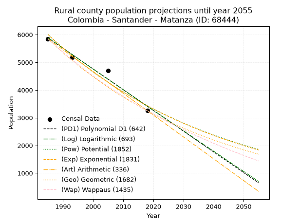
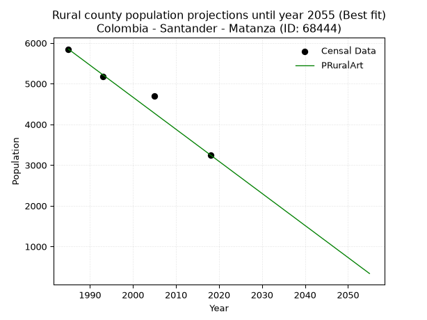

<div align="center">


</div>

# 📜 _“Population and Public Services Demand Projections (PPSD) until Year 2050 for Colombia - Santander - Matanza (ID: 68444)”_
Keywords: `population` `public-service` `projection` `lineal` `polynomial` `logarithmic` `potential` `exponential` `arithmetic` `geometric` `wappaus` `dane` `colombia` `south-america`

PPSD are analytical estimates used by governments and planners to anticipate future changes in population size, age distribution, and the resulting community needs for utilities, healthcare, education, and infrastructure as sizing future water treatment facilities, electrical grids, and road networks based on spatial growth.

<div align="center">

</img>

</div>


> **General running parameters**: • app_version: _v20260806_. • Python version: _3.14.7_. • Pandas version: _3.0.5_. • NumPy version: _2.5.1_. • Creates, save and include plots into reports (create_plot): _False_. • Projection until year: _2050_. • Process polynomial degree 2 and up: _False_. • Process Wappaus: _True_. • Process Wappaus: _True_. • Set negative values to zero: _True_. • Set infinite values to zero: _True_. • Drop dataset notes: _True_. 
<div align="center">

Dynamic map: [:earth_americas:Google](http://maps.google.com/maps?q=7.323175124,-73.0155656) [:earth_americas:OSM](https://www.openstreetmap.org/#map=18/7.323175124/-73.0155656&layers=P) [:earth_americas:Bing](https://www.bing.com/maps?cp=7.323175124~-73.0155656&lvl=18) [:earth_americas:Apple](https://maps.apple.com/frame?center=7.323175124%2C-73.0155656&span=0.003%2C0.006)

</div>


<div align="center">

```geojson
{
  "type": "Feature",
  "geometry": {
    "type": "Point", 
    "coordinates": [-73.0155656, 7.323175124]
  }, 
  "properties": {
    "Name": "Colombia - Santander - Matanza (ID: 68444)"
  }
}
```

</div>


## 0. Census Data (4 records)

Census data are official statistics collected by a government about the people and housing in a country. They usually include counts of total population, age, sex, race, income, education, and jobs.

📅Global census file: [Population.xlsx](../data/Population.xlsx)

| Source   |   Year |   CountryID | CountryName   |   StateID | StateName   |   CountyID | CountyName   |   PTotal |   PUrban |   PRural |
|:---------|-------:|------------:|:--------------|----------:|:------------|-----------:|:-------------|---------:|---------:|---------:|
| DANE     |   1985 |          57 | Colombia      |        68 | Santander   |      68444 | Matanza      |     7124 |     1275 |     5849 |
| DANE     |   1993 |          57 | Colombia      |        68 | Santander   |      68444 | Matanza      |     6353 |     1185 |     5168 |
| DANE     |   2005 |          57 | Colombia      |        68 | Santander   |      68444 | Matanza      |     5840 |     1137 |     4703 |
| DANE     |   2018 |          57 | Colombia      |        68 | Santander   |      68444 | Matanza      |     4499 |     1249 |     3250 |

> 🔥Some records could had specific notes about the registered values or the corresponding urban or rural distribution.

📅[SUI-RUPS](https://www.datos.gov.co/Hacienda-y-Cr-dito-P-blico/Registro-nico-de-Prestadores-de-Servicios-P-blicos/4qkq-csdn/about_data) - Local public utility companies: [RUPS.csv](../data/RUPS.csv)

 | SERVICIO       | ESTADO    | NOMBRE                                  | NIT         | DEPARTAMENTO_DOMICILIO   | MUNICIPIO_DOMICILIO   | DIRECCION           |   TELEFONO | EMAIL                        | TIPO_PRESTADOR                 | CLASIFICACION                 |
|:---------------|:----------|:----------------------------------------|:------------|:-------------------------|:----------------------|:--------------------|-----------:|:-----------------------------|:-------------------------------|:------------------------------|
| ACUEDUCTO      | OPERATIVA | UNIDAD DE SERVICIOS PUBLICOS DE MATANZA | 890206696-0 | SANTANDER                | MATANZA               | Carrera 5   No 5-85 |    6298300 | usp@matanza-santander.gov.co | MUNICIPIO (PRESTACIÓN DIRECTA) | MENOR O IGUAL A 2500 USUARIOS |
| ALCANTARILLADO | OPERATIVA | UNIDAD DE SERVICIOS PUBLICOS DE MATANZA | 890206696-0 | SANTANDER                | MATANZA               | Carrera 5   No 5-85 |    6298300 | usp@matanza-santander.gov.co | MUNICIPIO (PRESTACIÓN DIRECTA) | MENOR O IGUAL A 2500 USUARIOS |

## 1. Total

### 1.1. Coefficients and Parameters

* (PD1) Polynomial Deg 1: -75.63709353673137, 157247.09634684693 (lineal)
* (Log) Logarithmic: -151369.6862247277, 1156516.1979946936
* (Pow) Potential: -26.577527167463305, 91.50324064568875
* (Exp) Exponential: -0.013282584358637268, 2029346583192470.0
* (Art) Arithmetic: Year diff. 2018 - 1985 = 33, Population diff. 4499 - 7124 = -2625, Annual growth = -79.54545454545455
* (Geo) Geometric: Year diff. 2018 - 1985 = 33, Population diff. 4499 - 7124 = -2625, Annual growth % = -0.013831161760951227
* (Wap) Wappaus: i = -1.3687594346632461, Condition values only valid for < 200)

<sub>
Wappaus condition values: ['-0.00', '-1.37', '-2.74', '-4.11', '-5.48', '-6.84', '-8.21', '-9.58', '-10.95', '-12.32', '-13.69', '-15.06', '-16.43', '-17.79', '-19.16', '-20.53', '-21.90', '-23.27', '-24.64', '-26.01', '-27.38', '-28.74', '-30.11', '-31.48', '-32.85', '-34.22', '-35.59', '-36.96', '-38.33', '-39.69', '-41.06', '-42.43', '-43.80', '-45.17', '-46.54', '-47.91', '-49.28', '-50.64', '-52.01', '-53.38', '-54.75', '-56.12', '-57.49', '-58.86', '-60.23', '-61.59', '-62.96', '-64.33', '-65.70', '-67.07', '-68.44', '-69.81', '-71.18', '-72.54', '-73.91', '-75.28', '-76.65', '-78.02', '-79.39', '-80.76', '-82.13', '-83.49', '-84.86', '-86.23', '-87.60', '-88.97']
</sub>


### 1.2. Projected Dataset

|   Year |   CountyID |   PTotalPD1 |   PTotalLog |   PTotalPow |   PTotalExp |   PTotalArt |   PTotalGeo |   PTotalWap |
|-------:|-----------:|------------:|------------:|------------:|------------:|------------:|------------:|------------:|
|   1985 |      68444 |        7107 |        7110 |        7193 |        7191 |        7124 |        7124 |        7124 |
|   1986 |      68444 |        7032 |        7033 |        7098 |        7096 |        7044 |        7025 |        7027 |
|   1987 |      68444 |        6956 |        6957 |        7003 |        7002 |        6965 |        6928 |        6932 |
|   1988 |      68444 |        6881 |        6881 |        6910 |        6910 |        6885 |        6832 |        6837 |
|   1989 |      68444 |        6805 |        6805 |        6818 |        6819 |        6806 |        6738 |        6744 |
|   1990 |      68444 |        6729 |        6729 |        6728 |        6729 |        6726 |        6645 |        6653 |
|   1991 |      68444 |        6654 |        6653 |        6639 |        6640 |        6647 |        6553 |        6562 |
|   1992 |      68444 |        6578 |        6577 |        6551 |        6552 |        6567 |        6462 |        6473 |
|   1993 |      68444 |        6502 |        6501 |        6464 |        6466 |        6488 |        6373 |        6384 |
|   1994 |      68444 |        6427 |        6425 |        6378 |        6381 |        6408 |        6285 |        6297 |
|   1995 |      68444 |        6351 |        6349 |        6294 |        6296 |        6329 |        6198 |        6211 |
|   1996 |      68444 |        6275 |        6273 |        6211 |        6213 |        6249 |        6112 |        6126 |
|   1997 |      68444 |        6200 |        6197 |        6128 |        6131 |        6169 |        6028 |        6043 |
|   1998 |      68444 |        6124 |        6121 |        6047 |        6050 |        6090 |        5944 |        5960 |
|   1999 |      68444 |        6049 |        6046 |        5968 |        5971 |        6010 |        5862 |        5878 |
|   2000 |      68444 |        5973 |        5970 |        5889 |        5892 |        5931 |        5781 |        5798 |
|   2001 |      68444 |        5897 |        5894 |        5811 |        5814 |        5851 |        5701 |        5718 |
|   2002 |      68444 |        5822 |        5819 |        5734 |        5737 |        5772 |        5622 |        5639 |
|   2003 |      68444 |        5746 |        5743 |        5659 |        5662 |        5692 |        5544 |        5561 |
|   2004 |      68444 |        5670 |        5668 |        5584 |        5587 |        5613 |        5468 |        5484 |
|   2005 |      68444 |        5595 |        5592 |        5511 |        5513 |        5533 |        5392 |        5409 |
|   2006 |      68444 |        5519 |        5517 |        5438 |        5440 |        5454 |        5317 |        5334 |
|   2007 |      68444 |        5443 |        5441 |        5367 |        5369 |        5374 |        5244 |        5259 |
|   2008 |      68444 |        5368 |        5366 |        5296 |        5298 |        5294 |        5171 |        5186 |
|   2009 |      68444 |        5292 |        5290 |        5226 |        5228 |        5215 |        5100 |        5114 |
|   2010 |      68444 |        5217 |        5215 |        5158 |        5159 |        5135 |        5029 |        5042 |
|   2011 |      68444 |        5141 |        5140 |        5090 |        5091 |        5056 |        4960 |        4972 |
|   2012 |      68444 |        5065 |        5064 |        5023 |        5024 |        4976 |        4891 |        4902 |
|   2013 |      68444 |        4990 |        4989 |        4957 |        4957 |        4897 |        4823 |        4833 |
|   2014 |      68444 |        4914 |        4914 |        4892 |        4892 |        4817 |        4757 |        4764 |
|   2015 |      68444 |        4838 |        4839 |        4828 |        4827 |        4738 |        4691 |        4697 |
|   2016 |      68444 |        4763 |        4764 |        4765 |        4764 |        4658 |        4626 |        4630 |
|   2017 |      68444 |        4687 |        4689 |        4703 |        4701 |        4579 |        4562 |        4564 |
|   2018 |      68444 |        4611 |        4614 |        4641 |        4639 |        4499 |        4499 |        4499 |
|   2019 |      68444 |        4536 |        4539 |        4580 |        4578 |        4419 |        4437 |        4434 |
|   2020 |      68444 |        4460 |        4464 |        4520 |        4517 |        4340 |        4375 |        4371 |
|   2021 |      68444 |        4385 |        4389 |        4461 |        4458 |        4260 |        4315 |        4308 |
|   2022 |      68444 |        4309 |        4314 |        4403 |        4399 |        4181 |        4255 |        4245 |
|   2023 |      68444 |        4233 |        4239 |        4346 |        4341 |        4101 |        4196 |        4183 |
|   2024 |      68444 |        4158 |        4164 |        4289 |        4284 |        4022 |        4138 |        4122 |
|   2025 |      68444 |        4082 |        4090 |        4233 |        4227 |        3942 |        4081 |        4062 |
|   2026 |      68444 |        4006 |        4015 |        4178 |        4171 |        3863 |        4025 |        4002 |
|   2027 |      68444 |        3931 |        3940 |        4123 |        4116 |        3783 |        3969 |        3943 |
|   2028 |      68444 |        3855 |        3865 |        4070 |        4062 |        3704 |        3914 |        3884 |
|   2029 |      68444 |        3779 |        3791 |        4017 |        4008 |        3624 |        3860 |        3827 |
|   2030 |      68444 |        3704 |        3716 |        3964 |        3955 |        3544 |        3807 |        3769 |
|   2031 |      68444 |        3628 |        3642 |        3913 |        3903 |        3465 |        3754 |        3713 |
|   2032 |      68444 |        3553 |        3567 |        3862 |        3852 |        3385 |        3702 |        3656 |
|   2033 |      68444 |        3477 |        3493 |        3812 |        3801 |        3306 |        3651 |        3601 |
|   2034 |      68444 |        3401 |        3418 |        3762 |        3751 |        3226 |        3600 |        3546 |
|   2035 |      68444 |        3326 |        3344 |        3713 |        3701 |        3147 |        3550 |        3491 |
|   2036 |      68444 |        3250 |        3270 |        3665 |        3652 |        3067 |        3501 |        3438 |
|   2037 |      68444 |        3174 |        3195 |        3618 |        3604 |        2988 |        3453 |        3384 |
|   2038 |      68444 |        3099 |        3121 |        3571 |        3557 |        2908 |        3405 |        3332 |
|   2039 |      68444 |        3023 |        3047 |        3525 |        3510 |        2829 |        3358 |        3279 |
|   2040 |      68444 |        2947 |        2972 |        3479 |        3463 |        2749 |        3312 |        3228 |
|   2041 |      68444 |        2872 |        2898 |        3434 |        3418 |        2669 |        3266 |        3176 |
|   2042 |      68444 |        2796 |        2824 |        3390 |        3373 |        2590 |        3221 |        3126 |
|   2043 |      68444 |        2721 |        2750 |        3346 |        3328 |        2510 |        3176 |        3075 |
|   2044 |      68444 |        2645 |        2676 |        3303 |        3284 |        2431 |        3132 |        3026 |
|   2045 |      68444 |        2569 |        2602 |        3260 |        3241 |        2351 |        3089 |        2976 |
|   2046 |      68444 |        2494 |        2528 |        3218 |        3198 |        2272 |        3046 |        2928 |
|   2047 |      68444 |        2418 |        2454 |        3176 |        3156 |        2192 |        3004 |        2879 |
|   2048 |      68444 |        2342 |        2380 |        3135 |        3114 |        2113 |        2962 |        2832 |
|   2049 |      68444 |        2267 |        2306 |        3095 |        3073 |        2033 |        2921 |        2784 |
|   2050 |      68444 |        2191 |        2232 |        3055 |        3033 |        1954 |        2881 |        2737 |
<div align="center">

</img>

</div>


### 1.3. Best fit with absolute and relative error (%)

Relative error puts that difference into context by dividing the absolute error by the true value, creating a unitless ratio or percentage that shows the scale of the mistake.

Absolute and relative error

|   Year | Source   |   CountryID | CountryName   |   StateID | StateName   |   CountyID_x | CountyName   |   PTotal |   PUrban |   PRural |   CountyID_y |   PTotalPD1 |   PTotalLog |   PTotalPow |   PTotalExp |   PTotalArt |   PTotalGeo |   PTotalWap |   PTotalPD1AbsError |   PTotalLogAbsError |   PTotalPowAbsError |   PTotalExpAbsError |   PTotalArtAbsError |   PTotalGeoAbsError |   PTotalWapAbsError |   PTotalPD1RelError |   PTotalLogRelError |   PTotalPowRelError |   PTotalExpRelError |   PTotalArtRelError |   PTotalGeoRelError |   PTotalWapRelError |
|-------:|:---------|------------:|:--------------|----------:|:------------|-------------:|:-------------|---------:|---------:|---------:|-------------:|------------:|------------:|------------:|------------:|------------:|------------:|------------:|--------------------:|--------------------:|--------------------:|--------------------:|--------------------:|--------------------:|--------------------:|--------------------:|--------------------:|--------------------:|--------------------:|--------------------:|--------------------:|--------------------:|
|   1985 | DANE     |          57 | Colombia      |        68 | Santander   |        68444 | Matanza      |     7124 |     1275 |     5849 |        68444 |        7107 |        7110 |        7193 |        7191 |        7124 |        7124 |        7124 |                  17 |                  14 |                  69 |                  67 |                   0 |                   0 |                   0 |             0.23863 |            0.196519 |            0.968557 |            0.940483 |             0       |            0        |            0        |
|   1993 | DANE     |          57 | Colombia      |        68 | Santander   |        68444 | Matanza      |     6353 |     1185 |     5168 |        68444 |        6502 |        6501 |        6464 |        6466 |        6488 |        6373 |        6384 |                 149 |                 148 |                 111 |                 113 |                 135 |                  20 |                  31 |             2.34535 |            2.32961  |            1.74721  |            1.77869  |             2.12498 |            0.314812 |            0.487958 |
|   2005 | DANE     |          57 | Colombia      |        68 | Santander   |        68444 | Matanza      |     5840 |     1137 |     4703 |        68444 |        5595 |        5592 |        5511 |        5513 |        5533 |        5392 |        5409 |                 245 |                 248 |                 329 |                 327 |                 307 |                 448 |                 431 |             4.19521 |            4.24658  |            5.63356  |            5.59932  |             5.25685 |            7.67123  |            7.38014  |
|   2018 | DANE     |          57 | Colombia      |        68 | Santander   |        68444 | Matanza      |     4499 |     1249 |     3250 |        68444 |        4611 |        4614 |        4641 |        4639 |        4499 |        4499 |        4499 |                 112 |                 115 |                 142 |                 140 |                   0 |                   0 |                   0 |             2.48944 |            2.55612  |            3.15626  |            3.1118   |             0       |            0        |            0        |

Relative error mean

| Method    |   RelError | Best   |
|:----------|-----------:|:-------|
| PTotalPD1 |    2.31716 |        |
| PTotalLog |    2.33221 |        |
| PTotalPow |    2.8764  |        |
| PTotalExp |    2.85757 |        |
| PTotalArt |    1.84546 | True   |
| PTotalGeo |    1.99651 |        |
| PTotalWap |    1.96702 |        |

💙Best method: _**PTotalArt**_
<div align="center">

</img>

</div>


### 1.4. Fresh water supply demand in liters per capita per day (lpcd)

The fresh water supply demand typically ranges from 100 to 300 liters per capita per day (lpcd) for standard domestic and municipal planning, though absolute survival minimums set by the World Health Organization are as low as 7.5 to 20 liters per day, and total consumption in high-income nations can exceed 400 liters.

> `CZ`: Level in meters above the sea level (masl)<br> `WS`: Fresh water supply demand in liters per capita per day (lpcd or l/h/d)<br> `WSAll`: Zonal fresh water supply demand in liters per second (l/s)<br> `A`: Zonal area in square meters<br> `DP`: Population density (people/hectare or p/ha)

Reference values (RAS Colombia)

|    CZ |   WS |
|------:|-----:|
|  1000 |  120 |
|  2000 |  130 |
| 99999 |  140 |

County shapefile geometry properties and water supply values

|   CountyID |      ATotal |   CZTotal |   WSTotal |
|-----------:|------------:|----------:|----------:|
|      68444 | 2.35297e+08 |   1954.55 |       130 |

Projected values for best method: PTotalArt

|   CountyID |   Year |   PTotalArt |   DPTotal |   WSTotal |   WSTotalAll |
|-----------:|-------:|------------:|----------:|----------:|-------------:|
|      68444 |   1985 |        7124 |      0.3  |       130 |     10.719   |
|      68444 |   1986 |        7044 |      0.3  |       130 |     10.5986  |
|      68444 |   1987 |        6965 |      0.3  |       130 |     10.4797  |
|      68444 |   1988 |        6885 |      0.29 |       130 |     10.3594  |
|      68444 |   1989 |        6806 |      0.29 |       130 |     10.2405  |
|      68444 |   1990 |        6726 |      0.29 |       130 |     10.1201  |
|      68444 |   1991 |        6647 |      0.28 |       130 |     10.0013  |
|      68444 |   1992 |        6567 |      0.28 |       130 |      9.8809  |
|      68444 |   1993 |        6488 |      0.28 |       130 |      9.76204 |
|      68444 |   1994 |        6408 |      0.27 |       130 |      9.64167 |
|      68444 |   1995 |        6329 |      0.27 |       130 |      9.5228  |
|      68444 |   1996 |        6249 |      0.27 |       130 |      9.40243 |
|      68444 |   1997 |        6169 |      0.26 |       130 |      9.28206 |
|      68444 |   1998 |        6090 |      0.26 |       130 |      9.16319 |
|      68444 |   1999 |        6010 |      0.26 |       130 |      9.04282 |
|      68444 |   2000 |        5931 |      0.25 |       130 |      8.92396 |
|      68444 |   2001 |        5851 |      0.25 |       130 |      8.80359 |
|      68444 |   2002 |        5772 |      0.25 |       130 |      8.68472 |
|      68444 |   2003 |        5692 |      0.24 |       130 |      8.56435 |
|      68444 |   2004 |        5613 |      0.24 |       130 |      8.44549 |
|      68444 |   2005 |        5533 |      0.24 |       130 |      8.32512 |
|      68444 |   2006 |        5454 |      0.23 |       130 |      8.20625 |
|      68444 |   2007 |        5374 |      0.23 |       130 |      8.08588 |
|      68444 |   2008 |        5294 |      0.22 |       130 |      7.96551 |
|      68444 |   2009 |        5215 |      0.22 |       130 |      7.84664 |
|      68444 |   2010 |        5135 |      0.22 |       130 |      7.72627 |
|      68444 |   2011 |        5056 |      0.21 |       130 |      7.60741 |
|      68444 |   2012 |        4976 |      0.21 |       130 |      7.48704 |
|      68444 |   2013 |        4897 |      0.21 |       130 |      7.36817 |
|      68444 |   2014 |        4817 |      0.2  |       130 |      7.2478  |
|      68444 |   2015 |        4738 |      0.2  |       130 |      7.12894 |
|      68444 |   2016 |        4658 |      0.2  |       130 |      7.00856 |
|      68444 |   2017 |        4579 |      0.19 |       130 |      6.8897  |
|      68444 |   2018 |        4499 |      0.19 |       130 |      6.76933 |
|      68444 |   2019 |        4419 |      0.19 |       130 |      6.64896 |
|      68444 |   2020 |        4340 |      0.18 |       130 |      6.53009 |
|      68444 |   2021 |        4260 |      0.18 |       130 |      6.40972 |
|      68444 |   2022 |        4181 |      0.18 |       130 |      6.29086 |
|      68444 |   2023 |        4101 |      0.17 |       130 |      6.17049 |
|      68444 |   2024 |        4022 |      0.17 |       130 |      6.05162 |
|      68444 |   2025 |        3942 |      0.17 |       130 |      5.93125 |
|      68444 |   2026 |        3863 |      0.16 |       130 |      5.81238 |
|      68444 |   2027 |        3783 |      0.16 |       130 |      5.69201 |
|      68444 |   2028 |        3704 |      0.16 |       130 |      5.57315 |
|      68444 |   2029 |        3624 |      0.15 |       130 |      5.45278 |
|      68444 |   2030 |        3544 |      0.15 |       130 |      5.33241 |
|      68444 |   2031 |        3465 |      0.15 |       130 |      5.21354 |
|      68444 |   2032 |        3385 |      0.14 |       130 |      5.09317 |
|      68444 |   2033 |        3306 |      0.14 |       130 |      4.97431 |
|      68444 |   2034 |        3226 |      0.14 |       130 |      4.85394 |
|      68444 |   2035 |        3147 |      0.13 |       130 |      4.73507 |
|      68444 |   2036 |        3067 |      0.13 |       130 |      4.6147  |
|      68444 |   2037 |        2988 |      0.13 |       130 |      4.49583 |
|      68444 |   2038 |        2908 |      0.12 |       130 |      4.37546 |
|      68444 |   2039 |        2829 |      0.12 |       130 |      4.2566  |
|      68444 |   2040 |        2749 |      0.12 |       130 |      4.13623 |
|      68444 |   2041 |        2669 |      0.11 |       130 |      4.01586 |
|      68444 |   2042 |        2590 |      0.11 |       130 |      3.89699 |
|      68444 |   2043 |        2510 |      0.11 |       130 |      3.77662 |
|      68444 |   2044 |        2431 |      0.1  |       130 |      3.65775 |
|      68444 |   2045 |        2351 |      0.1  |       130 |      3.53738 |
|      68444 |   2046 |        2272 |      0.1  |       130 |      3.41852 |
|      68444 |   2047 |        2192 |      0.09 |       130 |      3.29815 |
|      68444 |   2048 |        2113 |      0.09 |       130 |      3.17928 |
|      68444 |   2049 |        2033 |      0.09 |       130 |      3.05891 |
|      68444 |   2050 |        1954 |      0.08 |       130 |      2.94005 |

## 2. Urban

### 2.1. Coefficients and Parameters

* (PD1) Polynomial Deg 1: -0.7458851866720866, 2703.456844640841 (lineal)
* (Log) Logarithmic: -1512.9158613897625, 12711.185586170423
* (Pow) Potential: -1.2350377721098962, 7.159841207041549
* (Exp) Exponential: -0.000608758276385225, 4089.9187000423003
* (Art) Arithmetic: Year diff. 2018 - 1985 = 33, Population diff. 1249 - 1275 = -26, Annual growth = -0.7878787878787878
* (Geo) Geometric: Year diff. 2018 - 1985 = 33, Population diff. 1249 - 1275 = -26, Annual growth % = -0.0006241368869144281
* (Wap) Wappaus: i = -0.06243096575901647, Condition values only valid for < 200)

<sub>
Wappaus condition values: ['-0.00', '-0.06', '-0.12', '-0.19', '-0.25', '-0.31', '-0.37', '-0.44', '-0.50', '-0.56', '-0.62', '-0.69', '-0.75', '-0.81', '-0.87', '-0.94', '-1.00', '-1.06', '-1.12', '-1.19', '-1.25', '-1.31', '-1.37', '-1.44', '-1.50', '-1.56', '-1.62', '-1.69', '-1.75', '-1.81', '-1.87', '-1.94', '-2.00', '-2.06', '-2.12', '-2.19', '-2.25', '-2.31', '-2.37', '-2.43', '-2.50', '-2.56', '-2.62', '-2.68', '-2.75', '-2.81', '-2.87', '-2.93', '-3.00', '-3.06', '-3.12', '-3.18', '-3.25', '-3.31', '-3.37', '-3.43', '-3.50', '-3.56', '-3.62', '-3.68', '-3.75', '-3.81', '-3.87', '-3.93', '-4.00', '-4.06']
</sub>


### 2.2. Projected Dataset

|   Year |   CountyID |   PUrbanPD1 |   PUrbanLog |   PUrbanPow |   PUrbanExp |   PUrbanArt |   PUrbanGeo |   PUrbanWap |
|-------:|-----------:|------------:|------------:|------------:|------------:|------------:|------------:|------------:|
|   1985 |      68444 |        1223 |        1223 |        1222 |        1222 |        1275 |        1275 |        1275 |
|   1986 |      68444 |        1222 |        1222 |        1221 |        1221 |        1274 |        1274 |        1274 |
|   1987 |      68444 |        1221 |        1222 |        1220 |        1220 |        1273 |        1273 |        1273 |
|   1988 |      68444 |        1221 |        1221 |        1219 |        1219 |        1273 |        1273 |        1273 |
|   1989 |      68444 |        1220 |        1220 |        1219 |        1219 |        1272 |        1272 |        1272 |
|   1990 |      68444 |        1219 |        1219 |        1218 |        1218 |        1271 |        1271 |        1271 |
|   1991 |      68444 |        1218 |        1218 |        1217 |        1217 |        1270 |        1270 |        1270 |
|   1992 |      68444 |        1218 |        1218 |        1216 |        1216 |        1269 |        1269 |        1269 |
|   1993 |      68444 |        1217 |        1217 |        1216 |        1216 |        1269 |        1269 |        1269 |
|   1994 |      68444 |        1216 |        1216 |        1215 |        1215 |        1268 |        1268 |        1268 |
|   1995 |      68444 |        1215 |        1215 |        1214 |        1214 |        1267 |        1267 |        1267 |
|   1996 |      68444 |        1215 |        1215 |        1213 |        1213 |        1266 |        1266 |        1266 |
|   1997 |      68444 |        1214 |        1214 |        1213 |        1213 |        1266 |        1265 |        1265 |
|   1998 |      68444 |        1213 |        1213 |        1212 |        1212 |        1265 |        1265 |        1265 |
|   1999 |      68444 |        1212 |        1212 |        1211 |        1211 |        1264 |        1264 |        1264 |
|   2000 |      68444 |        1212 |        1212 |        1210 |        1210 |        1263 |        1263 |        1263 |
|   2001 |      68444 |        1211 |        1211 |        1210 |        1210 |        1262 |        1262 |        1262 |
|   2002 |      68444 |        1210 |        1210 |        1209 |        1209 |        1262 |        1262 |        1262 |
|   2003 |      68444 |        1209 |        1209 |        1208 |        1208 |        1261 |        1261 |        1261 |
|   2004 |      68444 |        1209 |        1209 |        1207 |        1208 |        1260 |        1260 |        1260 |
|   2005 |      68444 |        1208 |        1208 |        1207 |        1207 |        1259 |        1259 |        1259 |
|   2006 |      68444 |        1207 |        1207 |        1206 |        1206 |        1258 |        1258 |        1258 |
|   2007 |      68444 |        1206 |        1206 |        1205 |        1205 |        1258 |        1258 |        1258 |
|   2008 |      68444 |        1206 |        1206 |        1204 |        1205 |        1257 |        1257 |        1257 |
|   2009 |      68444 |        1205 |        1205 |        1204 |        1204 |        1256 |        1256 |        1256 |
|   2010 |      68444 |        1204 |        1204 |        1203 |        1203 |        1255 |        1255 |        1255 |
|   2011 |      68444 |        1203 |        1203 |        1202 |        1202 |        1255 |        1254 |        1254 |
|   2012 |      68444 |        1203 |        1203 |        1202 |        1202 |        1254 |        1254 |        1254 |
|   2013 |      68444 |        1202 |        1202 |        1201 |        1201 |        1253 |        1253 |        1253 |
|   2014 |      68444 |        1201 |        1201 |        1200 |        1200 |        1252 |        1252 |        1252 |
|   2015 |      68444 |        1200 |        1200 |        1199 |        1199 |        1251 |        1251 |        1251 |
|   2016 |      68444 |        1200 |        1200 |        1199 |        1199 |        1251 |        1251 |        1251 |
|   2017 |      68444 |        1199 |        1199 |        1198 |        1198 |        1250 |        1250 |        1250 |
|   2018 |      68444 |        1198 |        1198 |        1197 |        1197 |        1249 |        1249 |        1249 |
|   2019 |      68444 |        1198 |        1197 |        1196 |        1197 |        1248 |        1248 |        1248 |
|   2020 |      68444 |        1197 |        1197 |        1196 |        1196 |        1247 |        1247 |        1247 |
|   2021 |      68444 |        1196 |        1196 |        1195 |        1195 |        1247 |        1247 |        1247 |
|   2022 |      68444 |        1195 |        1195 |        1194 |        1194 |        1246 |        1246 |        1246 |
|   2023 |      68444 |        1195 |        1194 |        1193 |        1194 |        1245 |        1245 |        1245 |
|   2024 |      68444 |        1194 |        1194 |        1193 |        1193 |        1244 |        1244 |        1244 |
|   2025 |      68444 |        1193 |        1193 |        1192 |        1192 |        1243 |        1244 |        1244 |
|   2026 |      68444 |        1192 |        1192 |        1191 |        1191 |        1243 |        1243 |        1243 |
|   2027 |      68444 |        1192 |        1191 |        1191 |        1191 |        1242 |        1242 |        1242 |
|   2028 |      68444 |        1191 |        1191 |        1190 |        1190 |        1241 |        1241 |        1241 |
|   2029 |      68444 |        1190 |        1190 |        1189 |        1189 |        1240 |        1240 |        1240 |
|   2030 |      68444 |        1189 |        1189 |        1188 |        1189 |        1240 |        1240 |        1240 |
|   2031 |      68444 |        1189 |        1188 |        1188 |        1188 |        1239 |        1239 |        1239 |
|   2032 |      68444 |        1188 |        1188 |        1187 |        1187 |        1238 |        1238 |        1238 |
|   2033 |      68444 |        1187 |        1187 |        1186 |        1186 |        1237 |        1237 |        1237 |
|   2034 |      68444 |        1186 |        1186 |        1186 |        1186 |        1236 |        1237 |        1237 |
|   2035 |      68444 |        1186 |        1185 |        1185 |        1185 |        1236 |        1236 |        1236 |
|   2036 |      68444 |        1185 |        1185 |        1184 |        1184 |        1235 |        1235 |        1235 |
|   2037 |      68444 |        1184 |        1184 |        1183 |        1184 |        1234 |        1234 |        1234 |
|   2038 |      68444 |        1183 |        1183 |        1183 |        1183 |        1233 |        1234 |        1233 |
|   2039 |      68444 |        1183 |        1182 |        1182 |        1182 |        1232 |        1233 |        1233 |
|   2040 |      68444 |        1182 |        1182 |        1181 |        1181 |        1232 |        1232 |        1232 |
|   2041 |      68444 |        1181 |        1181 |        1180 |        1181 |        1231 |        1231 |        1231 |
|   2042 |      68444 |        1180 |        1180 |        1180 |        1180 |        1230 |        1230 |        1230 |
|   2043 |      68444 |        1180 |        1179 |        1179 |        1179 |        1229 |        1230 |        1230 |
|   2044 |      68444 |        1179 |        1179 |        1178 |        1178 |        1229 |        1229 |        1229 |
|   2045 |      68444 |        1178 |        1178 |        1178 |        1178 |        1228 |        1228 |        1228 |
|   2046 |      68444 |        1177 |        1177 |        1177 |        1177 |        1227 |        1227 |        1227 |
|   2047 |      68444 |        1177 |        1177 |        1176 |        1176 |        1226 |        1227 |        1227 |
|   2048 |      68444 |        1176 |        1176 |        1176 |        1176 |        1225 |        1226 |        1226 |
|   2049 |      68444 |        1175 |        1175 |        1175 |        1175 |        1225 |        1225 |        1225 |
|   2050 |      68444 |        1174 |        1174 |        1174 |        1174 |        1224 |        1224 |        1224 |
<div align="center">

</img>

</div>


### 2.3. Best fit with absolute and relative error (%)

Relative error puts that difference into context by dividing the absolute error by the true value, creating a unitless ratio or percentage that shows the scale of the mistake.

Absolute and relative error

|   Year | Source   |   CountryID | CountryName   |   StateID | StateName   |   CountyID_x | CountyName   |   PTotal |   PUrban |   PRural |   CountyID_y |   PUrbanPD1 |   PUrbanLog |   PUrbanPow |   PUrbanExp |   PUrbanArt |   PUrbanGeo |   PUrbanWap |   PUrbanPD1AbsError |   PUrbanLogAbsError |   PUrbanPowAbsError |   PUrbanExpAbsError |   PUrbanArtAbsError |   PUrbanGeoAbsError |   PUrbanWapAbsError |   PUrbanPD1RelError |   PUrbanLogRelError |   PUrbanPowRelError |   PUrbanExpRelError |   PUrbanArtRelError |   PUrbanGeoRelError |   PUrbanWapRelError |
|-------:|:---------|------------:|:--------------|----------:|:------------|-------------:|:-------------|---------:|---------:|---------:|-------------:|------------:|------------:|------------:|------------:|------------:|------------:|------------:|--------------------:|--------------------:|--------------------:|--------------------:|--------------------:|--------------------:|--------------------:|--------------------:|--------------------:|--------------------:|--------------------:|--------------------:|--------------------:|--------------------:|
|   1985 | DANE     |          57 | Colombia      |        68 | Santander   |        68444 | Matanza      |     7124 |     1275 |     5849 |        68444 |        1223 |        1223 |        1222 |        1222 |        1275 |        1275 |        1275 |                  52 |                  52 |                  53 |                  53 |                   0 |                   0 |                   0 |             4.07843 |             4.07843 |             4.15686 |             4.15686 |             0       |             0       |             0       |
|   1993 | DANE     |          57 | Colombia      |        68 | Santander   |        68444 | Matanza      |     6353 |     1185 |     5168 |        68444 |        1217 |        1217 |        1216 |        1216 |        1269 |        1269 |        1269 |                  32 |                  32 |                  31 |                  31 |                  84 |                  84 |                  84 |             2.70042 |             2.70042 |             2.61603 |             2.61603 |             7.08861 |             7.08861 |             7.08861 |
|   2005 | DANE     |          57 | Colombia      |        68 | Santander   |        68444 | Matanza      |     5840 |     1137 |     4703 |        68444 |        1208 |        1208 |        1207 |        1207 |        1259 |        1259 |        1259 |                  71 |                  71 |                  70 |                  70 |                 122 |                 122 |                 122 |             6.2445  |             6.2445  |             6.15655 |             6.15655 |            10.73    |            10.73    |            10.73    |
|   2018 | DANE     |          57 | Colombia      |        68 | Santander   |        68444 | Matanza      |     4499 |     1249 |     3250 |        68444 |        1198 |        1198 |        1197 |        1197 |        1249 |        1249 |        1249 |                  51 |                  51 |                  52 |                  52 |                   0 |                   0 |                   0 |             4.08327 |             4.08327 |             4.16333 |             4.16333 |             0       |             0       |             0       |

Relative error mean

| Method    |   RelError | Best   |
|:----------|-----------:|:-------|
| PUrbanPD1 |    4.27666 |        |
| PUrbanLog |    4.27666 |        |
| PUrbanPow |    4.27319 | True   |
| PUrbanExp |    4.27319 | True   |
| PUrbanArt |    4.45465 |        |
| PUrbanGeo |    4.45465 |        |
| PUrbanWap |    4.45465 |        |

💙Best method: _**PUrbanPow**_
<div align="center">

</img>

</div>


### 2.4. Fresh water supply demand in liters per capita per day (lpcd)

The fresh water supply demand typically ranges from 100 to 300 liters per capita per day (lpcd) for standard domestic and municipal planning, though absolute survival minimums set by the World Health Organization are as low as 7.5 to 20 liters per day, and total consumption in high-income nations can exceed 400 liters.

> `CZ`: Level in meters above the sea level (masl)<br> `WS`: Fresh water supply demand in liters per capita per day (lpcd or l/h/d)<br> `WSAll`: Zonal fresh water supply demand in liters per second (l/s)<br> `A`: Zonal area in square meters<br> `DP`: Population density (people/hectare or p/ha)

Reference values (RAS Colombia)

|    CZ |   WS |
|------:|-----:|
|  1000 |  120 |
|  2000 |  130 |
| 99999 |  140 |

County shapefile geometry properties and water supply values

|   CountyID |   AUrban |   CZUrban |   WSUrban |
|-----------:|---------:|----------:|----------:|
|      68444 |   298684 |   1587.25 |       130 |

Projected values for best method: PUrbanPow

|   CountyID |   Year |   PUrbanPow |   DPUrban |   WSUrban |   WSUrbanAll |
|-----------:|-------:|------------:|----------:|----------:|-------------:|
|      68444 |   1985 |        1222 |     40.91 |       130 |      1.83866 |
|      68444 |   1986 |        1221 |     40.88 |       130 |      1.83715 |
|      68444 |   1987 |        1220 |     40.85 |       130 |      1.83565 |
|      68444 |   1988 |        1219 |     40.81 |       130 |      1.83414 |
|      68444 |   1989 |        1219 |     40.81 |       130 |      1.83414 |
|      68444 |   1990 |        1218 |     40.78 |       130 |      1.83264 |
|      68444 |   1991 |        1217 |     40.75 |       130 |      1.83113 |
|      68444 |   1992 |        1216 |     40.71 |       130 |      1.82963 |
|      68444 |   1993 |        1216 |     40.71 |       130 |      1.82963 |
|      68444 |   1994 |        1215 |     40.68 |       130 |      1.82812 |
|      68444 |   1995 |        1214 |     40.64 |       130 |      1.82662 |
|      68444 |   1996 |        1213 |     40.61 |       130 |      1.82512 |
|      68444 |   1997 |        1213 |     40.61 |       130 |      1.82512 |
|      68444 |   1998 |        1212 |     40.58 |       130 |      1.82361 |
|      68444 |   1999 |        1211 |     40.54 |       130 |      1.82211 |
|      68444 |   2000 |        1210 |     40.51 |       130 |      1.8206  |
|      68444 |   2001 |        1210 |     40.51 |       130 |      1.8206  |
|      68444 |   2002 |        1209 |     40.48 |       130 |      1.8191  |
|      68444 |   2003 |        1208 |     40.44 |       130 |      1.81759 |
|      68444 |   2004 |        1207 |     40.41 |       130 |      1.81609 |
|      68444 |   2005 |        1207 |     40.41 |       130 |      1.81609 |
|      68444 |   2006 |        1206 |     40.38 |       130 |      1.81458 |
|      68444 |   2007 |        1205 |     40.34 |       130 |      1.81308 |
|      68444 |   2008 |        1204 |     40.31 |       130 |      1.81157 |
|      68444 |   2009 |        1204 |     40.31 |       130 |      1.81157 |
|      68444 |   2010 |        1203 |     40.28 |       130 |      1.81007 |
|      68444 |   2011 |        1202 |     40.24 |       130 |      1.80856 |
|      68444 |   2012 |        1202 |     40.24 |       130 |      1.80856 |
|      68444 |   2013 |        1201 |     40.21 |       130 |      1.80706 |
|      68444 |   2014 |        1200 |     40.18 |       130 |      1.80556 |
|      68444 |   2015 |        1199 |     40.14 |       130 |      1.80405 |
|      68444 |   2016 |        1199 |     40.14 |       130 |      1.80405 |
|      68444 |   2017 |        1198 |     40.11 |       130 |      1.80255 |
|      68444 |   2018 |        1197 |     40.08 |       130 |      1.80104 |
|      68444 |   2019 |        1196 |     40.04 |       130 |      1.79954 |
|      68444 |   2020 |        1196 |     40.04 |       130 |      1.79954 |
|      68444 |   2021 |        1195 |     40.01 |       130 |      1.79803 |
|      68444 |   2022 |        1194 |     39.98 |       130 |      1.79653 |
|      68444 |   2023 |        1193 |     39.94 |       130 |      1.79502 |
|      68444 |   2024 |        1193 |     39.94 |       130 |      1.79502 |
|      68444 |   2025 |        1192 |     39.91 |       130 |      1.79352 |
|      68444 |   2026 |        1191 |     39.87 |       130 |      1.79201 |
|      68444 |   2027 |        1191 |     39.87 |       130 |      1.79201 |
|      68444 |   2028 |        1190 |     39.84 |       130 |      1.79051 |
|      68444 |   2029 |        1189 |     39.81 |       130 |      1.789   |
|      68444 |   2030 |        1188 |     39.77 |       130 |      1.7875  |
|      68444 |   2031 |        1188 |     39.77 |       130 |      1.7875  |
|      68444 |   2032 |        1187 |     39.74 |       130 |      1.786   |
|      68444 |   2033 |        1186 |     39.71 |       130 |      1.78449 |
|      68444 |   2034 |        1186 |     39.71 |       130 |      1.78449 |
|      68444 |   2035 |        1185 |     39.67 |       130 |      1.78299 |
|      68444 |   2036 |        1184 |     39.64 |       130 |      1.78148 |
|      68444 |   2037 |        1183 |     39.61 |       130 |      1.77998 |
|      68444 |   2038 |        1183 |     39.61 |       130 |      1.77998 |
|      68444 |   2039 |        1182 |     39.57 |       130 |      1.77847 |
|      68444 |   2040 |        1181 |     39.54 |       130 |      1.77697 |
|      68444 |   2041 |        1180 |     39.51 |       130 |      1.77546 |
|      68444 |   2042 |        1180 |     39.51 |       130 |      1.77546 |
|      68444 |   2043 |        1179 |     39.47 |       130 |      1.77396 |
|      68444 |   2044 |        1178 |     39.44 |       130 |      1.77245 |
|      68444 |   2045 |        1178 |     39.44 |       130 |      1.77245 |
|      68444 |   2046 |        1177 |     39.41 |       130 |      1.77095 |
|      68444 |   2047 |        1176 |     39.37 |       130 |      1.76944 |
|      68444 |   2048 |        1176 |     39.37 |       130 |      1.76944 |
|      68444 |   2049 |        1175 |     39.34 |       130 |      1.76794 |
|      68444 |   2050 |        1174 |     39.31 |       130 |      1.76644 |

## 3. Rural

### 3.1. Coefficients and Parameters

* (PD1) Polynomial Deg 1: -74.89120835005924, 154543.639502206 (lineal)
* (Log) Logarithmic: -149856.77036333786, 1143805.0124085227
* (Pow) Potential: -33.951659044382865, 115.74316691956774
* (Exp) Exponential: -0.016970808561015682, 2.5625079510855465e+18
* (Art) Arithmetic: Year diff. 2018 - 1985 = 33, Population diff. 3250 - 5849 = -2599, Annual growth = -78.75757575757575
* (Geo) Geometric: Year diff. 2018 - 1985 = 33, Population diff. 3250 - 5849 = -2599, Annual growth % = -0.017648937116681696
* (Wap) Wappaus: i = -1.7311259645582098, Condition values only valid for < 200)

<sub>
Wappaus condition values: ['-0.00', '-1.73', '-3.46', '-5.19', '-6.92', '-8.66', '-10.39', '-12.12', '-13.85', '-15.58', '-17.31', '-19.04', '-20.77', '-22.50', '-24.24', '-25.97', '-27.70', '-29.43', '-31.16', '-32.89', '-34.62', '-36.35', '-38.08', '-39.82', '-41.55', '-43.28', '-45.01', '-46.74', '-48.47', '-50.20', '-51.93', '-53.66', '-55.40', '-57.13', '-58.86', '-60.59', '-62.32', '-64.05', '-65.78', '-67.51', '-69.25', '-70.98', '-72.71', '-74.44', '-76.17', '-77.90', '-79.63', '-81.36', '-83.09', '-84.83', '-86.56', '-88.29', '-90.02', '-91.75', '-93.48', '-95.21', '-96.94', '-98.67', '-100.41', '-102.14', '-103.87', '-105.60', '-107.33', '-109.06', '-110.79', '-112.52']
</sub>


### 3.2. Projected Dataset

|   Year |   CountyID |   PRuralPD1 |   PRuralLog |   PRuralPow |   PRuralExp |   PRuralArt |   PRuralGeo |   PRuralWap |
|-------:|-----------:|------------:|------------:|------------:|------------:|------------:|------------:|------------:|
|   1985 |      68444 |        5885 |        5886 |        6008 |        6006 |        5849 |        5849 |        5849 |
|   1986 |      68444 |        5810 |        5811 |        5906 |        5905 |        5770 |        5746 |        5749 |
|   1987 |      68444 |        5735 |        5736 |        5806 |        5805 |        5691 |        5644 |        5650 |
|   1988 |      68444 |        5660 |        5660 |        5708 |        5708 |        5613 |        5545 |        5553 |
|   1989 |      68444 |        5585 |        5585 |        5611 |        5612 |        5534 |        5447 |        5458 |
|   1990 |      68444 |        5510 |        5509 |        5516 |        5517 |        5455 |        5351 |        5364 |
|   1991 |      68444 |        5435 |        5434 |        5423 |        5424 |        5376 |        5256 |        5271 |
|   1992 |      68444 |        5360 |        5359 |        5331 |        5333 |        5298 |        5164 |        5181 |
|   1993 |      68444 |        5285 |        5284 |        5241 |        5243 |        5219 |        5072 |        5091 |
|   1994 |      68444 |        5211 |        5209 |        5153 |        5155 |        5140 |        4983 |        5004 |
|   1995 |      68444 |        5136 |        5133 |        5066 |        5068 |        5061 |        4895 |        4917 |
|   1996 |      68444 |        5061 |        5058 |        4980 |        4983 |        4983 |        4809 |        4832 |
|   1997 |      68444 |        4986 |        4983 |        4896 |        4899 |        4904 |        4724 |        4748 |
|   1998 |      68444 |        4911 |        4908 |        4814 |        4817 |        4825 |        4640 |        4666 |
|   1999 |      68444 |        4836 |        4833 |        4733 |        4736 |        4746 |        4558 |        4585 |
|   2000 |      68444 |        4761 |        4758 |        4653 |        4656 |        4668 |        4478 |        4505 |
|   2001 |      68444 |        4686 |        4683 |        4575 |        4578 |        4589 |        4399 |        4426 |
|   2002 |      68444 |        4611 |        4609 |        4498 |        4501 |        4510 |        4321 |        4348 |
|   2003 |      68444 |        4537 |        4534 |        4422 |        4425 |        4431 |        4245 |        4272 |
|   2004 |      68444 |        4462 |        4459 |        4348 |        4350 |        4353 |        4170 |        4197 |
|   2005 |      68444 |        4387 |        4384 |        4275 |        4277 |        4274 |        4097 |        4123 |
|   2006 |      68444 |        4312 |        4309 |        4203 |        4205 |        4195 |        4024 |        4050 |
|   2007 |      68444 |        4237 |        4235 |        4132 |        4134 |        4116 |        3953 |        3978 |
|   2008 |      68444 |        4162 |        4160 |        4063 |        4065 |        4038 |        3883 |        3907 |
|   2009 |      68444 |        4087 |        4085 |        3995 |        3996 |        3959 |        3815 |        3837 |
|   2010 |      68444 |        4012 |        4011 |        3928 |        3929 |        3880 |        3748 |        3768 |
|   2011 |      68444 |        3937 |        3936 |        3862 |        3863 |        3801 |        3681 |        3700 |
|   2012 |      68444 |        3863 |        3862 |        3798 |        3798 |        3723 |        3616 |        3633 |
|   2013 |      68444 |        3788 |        3787 |        3734 |        3734 |        3644 |        3553 |        3567 |
|   2014 |      68444 |        3713 |        3713 |        3672 |        3671 |        3565 |        3490 |        3502 |
|   2015 |      68444 |        3638 |        3639 |        3610 |        3610 |        3486 |        3428 |        3438 |
|   2016 |      68444 |        3563 |        3564 |        3550 |        3549 |        3408 |        3368 |        3374 |
|   2017 |      68444 |        3488 |        3490 |        3491 |        3489 |        3329 |        3308 |        3312 |
|   2018 |      68444 |        3413 |        3416 |        3432 |        3430 |        3250 |        3250 |        3250 |
|   2019 |      68444 |        3338 |        3341 |        3375 |        3373 |        3171 |        3193 |        3189 |
|   2020 |      68444 |        3263 |        3267 |        3319 |        3316 |        3092 |        3136 |        3129 |
|   2021 |      68444 |        3189 |        3193 |        3264 |        3260 |        3014 |        3081 |        3070 |
|   2022 |      68444 |        3114 |        3119 |        3209 |        3205 |        2935 |        3027 |        3011 |
|   2023 |      68444 |        3039 |        3045 |        3156 |        3151 |        2856 |        2973 |        2954 |
|   2024 |      68444 |        2964 |        2971 |        3103 |        3098 |        2777 |        2921 |        2897 |
|   2025 |      68444 |        2889 |        2897 |        3052 |        3046 |        2699 |        2869 |        2840 |
|   2026 |      68444 |        2814 |        2823 |        3001 |        2995 |        2620 |        2818 |        2785 |
|   2027 |      68444 |        2739 |        2749 |        2951 |        2944 |        2541 |        2769 |        2730 |
|   2028 |      68444 |        2664 |        2675 |        2902 |        2895 |        2462 |        2720 |        2676 |
|   2029 |      68444 |        2589 |        2601 |        2854 |        2846 |        2384 |        2672 |        2623 |
|   2030 |      68444 |        2514 |        2527 |        2807 |        2798 |        2305 |        2625 |        2570 |
|   2031 |      68444 |        2440 |        2453 |        2760 |        2751 |        2226 |        2578 |        2518 |
|   2032 |      68444 |        2365 |        2380 |        2714 |        2705 |        2147 |        2533 |        2466 |
|   2033 |      68444 |        2290 |        2306 |        2669 |        2659 |        2069 |        2488 |        2415 |
|   2034 |      68444 |        2215 |        2232 |        2625 |        2615 |        1990 |        2444 |        2365 |
|   2035 |      68444 |        2140 |        2159 |        2582 |        2571 |        1911 |        2401 |        2316 |
|   2036 |      68444 |        2065 |        2085 |        2539 |        2527 |        1832 |        2359 |        2267 |
|   2037 |      68444 |        1990 |        2011 |        2497 |        2485 |        1754 |        2317 |        2218 |
|   2038 |      68444 |        1915 |        1938 |        2456 |        2443 |        1675 |        2276 |        2170 |
|   2039 |      68444 |        1840 |        1864 |        2415 |        2402 |        1596 |        2236 |        2123 |
|   2040 |      68444 |        1766 |        1791 |        2375 |        2362 |        1517 |        2197 |        2076 |
|   2041 |      68444 |        1691 |        1717 |        2336 |        2322 |        1439 |        2158 |        2030 |
|   2042 |      68444 |        1616 |        1644 |        2298 |        2283 |        1360 |        2120 |        1984 |
|   2043 |      68444 |        1541 |        1571 |        2260 |        2244 |        1281 |        2082 |        1939 |
|   2044 |      68444 |        1466 |        1497 |        2223 |        2207 |        1202 |        2046 |        1895 |
|   2045 |      68444 |        1391 |        1424 |        2186 |        2169 |        1124 |        2009 |        1850 |
|   2046 |      68444 |        1316 |        1351 |        2150 |        2133 |        1045 |        1974 |        1807 |
|   2047 |      68444 |        1241 |        1277 |        2115 |        2097 |         966 |        1939 |        1764 |
|   2048 |      68444 |        1166 |        1204 |        2080 |        2062 |         887 |        1905 |        1721 |
|   2049 |      68444 |        1092 |        1131 |        2046 |        2027 |         809 |        1871 |        1679 |
|   2050 |      68444 |        1017 |        1058 |        2012 |        1993 |         730 |        1838 |        1637 |
<div align="center">

</img>

</div>


### 3.3. Best fit with absolute and relative error (%)

Relative error puts that difference into context by dividing the absolute error by the true value, creating a unitless ratio or percentage that shows the scale of the mistake.

Absolute and relative error

|   Year | Source   |   CountryID | CountryName   |   StateID | StateName   |   CountyID_x | CountyName   |   PTotal |   PUrban |   PRural |   CountyID_y |   PRuralPD1 |   PRuralLog |   PRuralPow |   PRuralExp |   PRuralArt |   PRuralGeo |   PRuralWap |   PRuralPD1AbsError |   PRuralLogAbsError |   PRuralPowAbsError |   PRuralExpAbsError |   PRuralArtAbsError |   PRuralGeoAbsError |   PRuralWapAbsError |   PRuralPD1RelError |   PRuralLogRelError |   PRuralPowRelError |   PRuralExpRelError |   PRuralArtRelError |   PRuralGeoRelError |   PRuralWapRelError |
|-------:|:---------|------------:|:--------------|----------:|:------------|-------------:|:-------------|---------:|---------:|---------:|-------------:|------------:|------------:|------------:|------------:|------------:|------------:|------------:|--------------------:|--------------------:|--------------------:|--------------------:|--------------------:|--------------------:|--------------------:|--------------------:|--------------------:|--------------------:|--------------------:|--------------------:|--------------------:|--------------------:|
|   1985 | DANE     |          57 | Colombia      |        68 | Santander   |        68444 | Matanza      |     7124 |     1275 |     5849 |        68444 |        5885 |        5886 |        6008 |        6006 |        5849 |        5849 |        5849 |                  36 |                  37 |                 159 |                 157 |                   0 |                   0 |                   0 |             0.61549 |            0.632587 |             2.71841 |             2.68422 |            0        |             0       |             0       |
|   1993 | DANE     |          57 | Colombia      |        68 | Santander   |        68444 | Matanza      |     6353 |     1185 |     5168 |        68444 |        5285 |        5284 |        5241 |        5243 |        5219 |        5072 |        5091 |                 117 |                 116 |                  73 |                  75 |                  51 |                  96 |                  77 |             2.26393 |            2.24458  |             1.41254 |             1.45124 |            0.986842 |             1.85759 |             1.48994 |
|   2005 | DANE     |          57 | Colombia      |        68 | Santander   |        68444 | Matanza      |     5840 |     1137 |     4703 |        68444 |        4387 |        4384 |        4275 |        4277 |        4274 |        4097 |        4123 |                 316 |                 319 |                 428 |                 426 |                 429 |                 606 |                 580 |             6.71912 |            6.7829   |             9.10057 |             9.05805 |            9.12184  |            12.8854  |            12.3326  |
|   2018 | DANE     |          57 | Colombia      |        68 | Santander   |        68444 | Matanza      |     4499 |     1249 |     3250 |        68444 |        3413 |        3416 |        3432 |        3430 |        3250 |        3250 |        3250 |                 163 |                 166 |                 182 |                 180 |                   0 |                   0 |                   0 |             5.01538 |            5.10769  |             5.6     |             5.53846 |            0        |             0       |             0       |

Relative error mean

| Method    |   RelError | Best   |
|:----------|-----------:|:-------|
| PRuralPD1 |    3.65348 |        |
| PRuralLog |    3.69194 |        |
| PRuralPow |    4.70788 |        |
| PRuralExp |    4.68299 |        |
| PRuralArt |    2.52717 | True   |
| PRuralGeo |    3.68574 |        |
| PRuralWap |    3.45562 |        |

💙Best method: _**PRuralArt**_
<div align="center">

</img>

</div>


### 3.4. Fresh water supply demand in liters per capita per day (lpcd)

The fresh water supply demand typically ranges from 100 to 300 liters per capita per day (lpcd) for standard domestic and municipal planning, though absolute survival minimums set by the World Health Organization are as low as 7.5 to 20 liters per day, and total consumption in high-income nations can exceed 400 liters.

> `CZ`: Level in meters above the sea level (masl)<br> `WS`: Fresh water supply demand in liters per capita per day (lpcd or l/h/d)<br> `WSAll`: Zonal fresh water supply demand in liters per second (l/s)<br> `A`: Zonal area in square meters<br> `DP`: Population density (people/hectare or p/ha)

Reference values (RAS Colombia)

|    CZ |   WS |
|------:|-----:|
|  1000 |  120 |
|  2000 |  130 |
| 99999 |  140 |

County shapefile geometry properties and water supply values

|   CountyID |      ARural |   CZRural |   WSRural |
|-----------:|------------:|----------:|----------:|
|      68444 | 2.34999e+08 |   1955.01 |       130 |

Projected values for best method: PRuralArt

|   CountyID |   Year |   PRuralArt |   DPRural |   WSRural |   WSRuralAll |
|-----------:|-------:|------------:|----------:|----------:|-------------:|
|      68444 |   1985 |        5849 |      0.25 |       130 |      8.80058 |
|      68444 |   1986 |        5770 |      0.25 |       130 |      8.68171 |
|      68444 |   1987 |        5691 |      0.24 |       130 |      8.56285 |
|      68444 |   1988 |        5613 |      0.24 |       130 |      8.44549 |
|      68444 |   1989 |        5534 |      0.24 |       130 |      8.32662 |
|      68444 |   1990 |        5455 |      0.23 |       130 |      8.20775 |
|      68444 |   1991 |        5376 |      0.23 |       130 |      8.08889 |
|      68444 |   1992 |        5298 |      0.23 |       130 |      7.97153 |
|      68444 |   1993 |        5219 |      0.22 |       130 |      7.85266 |
|      68444 |   1994 |        5140 |      0.22 |       130 |      7.7338  |
|      68444 |   1995 |        5061 |      0.22 |       130 |      7.61493 |
|      68444 |   1996 |        4983 |      0.21 |       130 |      7.49757 |
|      68444 |   1997 |        4904 |      0.21 |       130 |      7.3787  |
|      68444 |   1998 |        4825 |      0.21 |       130 |      7.25984 |
|      68444 |   1999 |        4746 |      0.2  |       130 |      7.14097 |
|      68444 |   2000 |        4668 |      0.2  |       130 |      7.02361 |
|      68444 |   2001 |        4589 |      0.2  |       130 |      6.90475 |
|      68444 |   2002 |        4510 |      0.19 |       130 |      6.78588 |
|      68444 |   2003 |        4431 |      0.19 |       130 |      6.66701 |
|      68444 |   2004 |        4353 |      0.19 |       130 |      6.54965 |
|      68444 |   2005 |        4274 |      0.18 |       130 |      6.43079 |
|      68444 |   2006 |        4195 |      0.18 |       130 |      6.31192 |
|      68444 |   2007 |        4116 |      0.18 |       130 |      6.19306 |
|      68444 |   2008 |        4038 |      0.17 |       130 |      6.07569 |
|      68444 |   2009 |        3959 |      0.17 |       130 |      5.95683 |
|      68444 |   2010 |        3880 |      0.17 |       130 |      5.83796 |
|      68444 |   2011 |        3801 |      0.16 |       130 |      5.7191  |
|      68444 |   2012 |        3723 |      0.16 |       130 |      5.60174 |
|      68444 |   2013 |        3644 |      0.16 |       130 |      5.48287 |
|      68444 |   2014 |        3565 |      0.15 |       130 |      5.364   |
|      68444 |   2015 |        3486 |      0.15 |       130 |      5.24514 |
|      68444 |   2016 |        3408 |      0.15 |       130 |      5.12778 |
|      68444 |   2017 |        3329 |      0.14 |       130 |      5.00891 |
|      68444 |   2018 |        3250 |      0.14 |       130 |      4.89005 |
|      68444 |   2019 |        3171 |      0.13 |       130 |      4.77118 |
|      68444 |   2020 |        3092 |      0.13 |       130 |      4.65231 |
|      68444 |   2021 |        3014 |      0.13 |       130 |      4.53495 |
|      68444 |   2022 |        2935 |      0.12 |       130 |      4.41609 |
|      68444 |   2023 |        2856 |      0.12 |       130 |      4.29722 |
|      68444 |   2024 |        2777 |      0.12 |       130 |      4.17836 |
|      68444 |   2025 |        2699 |      0.11 |       130 |      4.061   |
|      68444 |   2026 |        2620 |      0.11 |       130 |      3.94213 |
|      68444 |   2027 |        2541 |      0.11 |       130 |      3.82326 |
|      68444 |   2028 |        2462 |      0.1  |       130 |      3.7044  |
|      68444 |   2029 |        2384 |      0.1  |       130 |      3.58704 |
|      68444 |   2030 |        2305 |      0.1  |       130 |      3.46817 |
|      68444 |   2031 |        2226 |      0.09 |       130 |      3.34931 |
|      68444 |   2032 |        2147 |      0.09 |       130 |      3.23044 |
|      68444 |   2033 |        2069 |      0.09 |       130 |      3.11308 |
|      68444 |   2034 |        1990 |      0.08 |       130 |      2.99421 |
|      68444 |   2035 |        1911 |      0.08 |       130 |      2.87535 |
|      68444 |   2036 |        1832 |      0.08 |       130 |      2.75648 |
|      68444 |   2037 |        1754 |      0.07 |       130 |      2.63912 |
|      68444 |   2038 |        1675 |      0.07 |       130 |      2.52025 |
|      68444 |   2039 |        1596 |      0.07 |       130 |      2.40139 |
|      68444 |   2040 |        1517 |      0.06 |       130 |      2.28252 |
|      68444 |   2041 |        1439 |      0.06 |       130 |      2.16516 |
|      68444 |   2042 |        1360 |      0.06 |       130 |      2.0463  |
|      68444 |   2043 |        1281 |      0.05 |       130 |      1.92743 |
|      68444 |   2044 |        1202 |      0.05 |       130 |      1.80856 |
|      68444 |   2045 |        1124 |      0.05 |       130 |      1.6912  |
|      68444 |   2046 |        1045 |      0.04 |       130 |      1.57234 |
|      68444 |   2047 |         966 |      0.04 |       130 |      1.45347 |
|      68444 |   2048 |         887 |      0.04 |       130 |      1.33461 |
|      68444 |   2049 |         809 |      0.03 |       130 |      1.21725 |
|      68444 |   2050 |         730 |      0.03 |       130 |      1.09838 |

#

<div align="center"><br><sub>Share this research</sub></div><br>

<sub>**APPS & TOOLS & CONTENT DISCLAIMER**: • NO WARRANTY - This content and software is provided by <a href="https://github.com/rcfdtools" target="_blank">github.com/rcfdtools</a> "as is", without any express or implied warranty, including warranties of merchantability, fitness for a particular purpose, or non-infringement. There is no guarantee that the software will be error-free or operate without interruption. • LIMITATION OF LIABILITY - Neither the authors nor copyright holders will be liable for claims or damages arising from the software or its use. You are responsible for determining if the software is appropriate for your use and assume all associated risks, including errors, legal compliance, and data loss. • NO PROFESSIONAL ADVICE - The software provides general information and does not offer professional advice. It should not replace consultation with professional advisors. [Clauses and global license for rcfdtools use.](https://github.com/rcfdtools/rcfdtools/blob/main/LICENSE.md)</sub>

| [:house: Home](Readme.md)  | [:beginner: Help / Collab](https://github.com/rcfdtools/R.HydroTools/discussions/31) |
|----------------------------|-------------------------------------------------------------------------------------------|