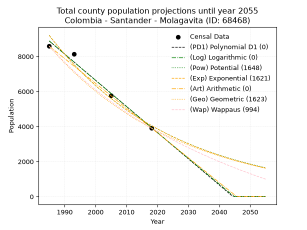
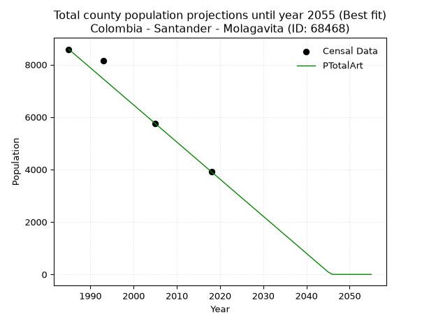
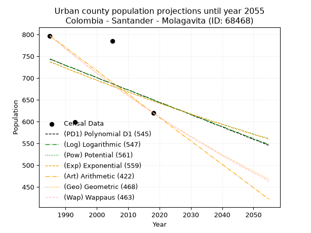
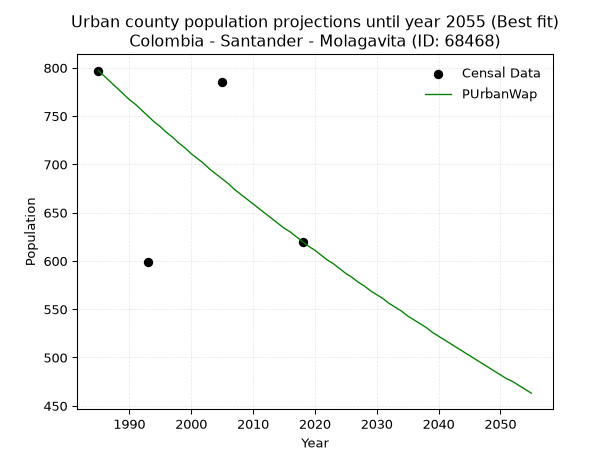
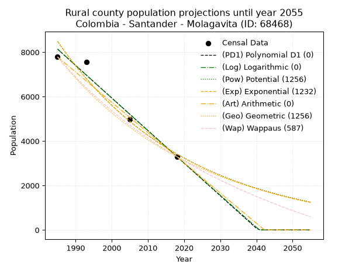
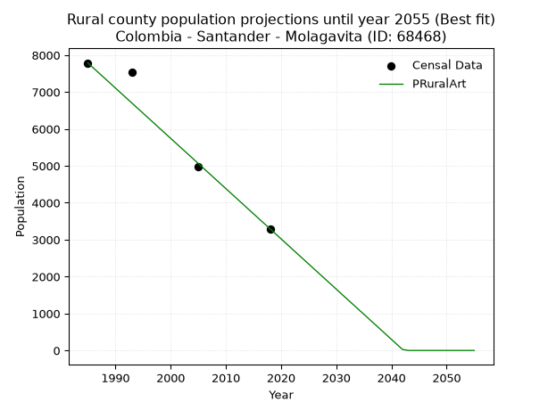

<div align="center">


</div>

# _“Population and Public Services Demand Projections (PPSD) until Year 2050 for Colombia - Santander - Molagavita (ID: 68468)”_
Keywords: `population` `public-service` `projection` `lineal` `polynomial` `logarithmic` `potential` `exponential` `arithmetic` `geometric` `wappaus` `dane` `colombia` `south-america`

PPSD are analytical estimates used by governments and planners to anticipate future changes in population size, age distribution, and the resulting community needs for utilities, healthcare, education, and infrastructure as sizing future water treatment facilities, electrical grids, and road networks based on spatial growth.

> **General running parameters**: • app_version: _v20260806_. • Python version: _3.14.7_. • Pandas version: _3.0.5_. • NumPy version: _2.5.1_. • Creates, save and include plots into reports (create_plot): _False_. • Projection until year: _2050_. • Process polynomial degree 2 and up: _False_. • Process Wappaus: _True_. • Process Wappaus: _True_. • Set negative values to zero: _True_. • Set infinite values to zero: _True_. • Drop dataset notes: _True_. 
<div align="center">

Dynamic map: [:earth_americas:Google](http://maps.google.com/maps?q=6.674319583,-72.8091752) [:earth_americas:OSM](https://www.openstreetmap.org/#map=18/6.674319583/-72.8091752&layers=P) [:earth_americas:Bing](https://www.bing.com/maps?cp=6.674319583~-72.8091752&lvl=18) [:earth_americas:Apple](https://maps.apple.com/frame?center=6.674319583%2C-72.8091752&span=0.003%2C0.006)

</div>


<div align="center">

```geojson
{
  "type": "Feature",
  "geometry": {
    "type": "Point", 
    "coordinates": [-72.8091752, 6.674319583]
  }, 
  "properties": {
    "Name": "Colombia - Santander - Molagavita (ID: 68468)"
  }
}
```

</div>


## 0. Census Data (4 records)

Census data are official statistics collected by a government about the people and housing in a country. They usually include counts of total population, age, sex, race, income, education, and jobs.

📅Global census file: [Population.xlsx](../data/Population.xlsx)

| Source   |   Year |   CountryID | CountryName   |   StateID | StateName   |   CountyID | CountyName   |   PTotal |   PUrban |   PRural |
|:---------|-------:|------------:|:--------------|----------:|:------------|-----------:|:-------------|---------:|---------:|---------:|
| DANE     |   1985 |          57 | Colombia      |        68 | Santander   |      68468 | Molagavita   |     8584 |      797 |     7787 |
| DANE     |   1993 |          57 | Colombia      |        68 | Santander   |      68468 | Molagavita   |     8145 |      599 |     7546 |
| DANE     |   2005 |          57 | Colombia      |        68 | Santander   |      68468 | Molagavita   |     5764 |      785 |     4979 |
| DANE     |   2018 |          57 | Colombia      |        68 | Santander   |      68468 | Molagavita   |     3915 |      620 |     3295 |

> 🔥Some records could had specific notes about the registered values or the corresponding urban or rural distribution.

## 1. Total

### 1.1. Coefficients and Parameters

* (PD1) Polynomial Deg 1: -149.4773183460444, 305594.0060216753 (lineal)
* (Log) Logarithmic: -299149.6252586784, 2280440.6988258627
* (Pow) Potential: -49.62908436042776, 167.6288803368253
* (Exp) Exponential: -0.02480358613791781, 2.2198484776448953e+25
* (Art) Arithmetic: Year diff. 2018 - 1985 = 33, Population diff. 3915 - 8584 = -4669, Annual growth = -141.4848484848485
* (Geo) Geometric: Year diff. 2018 - 1985 = 33, Population diff. 3915 - 8584 = -4669, Annual growth % = -0.023509682983022473
* (Wap) Wappaus: i = -2.263938690852844, Condition values only valid for < 200)

<sub>
Wappaus condition values: ['-0.00', '-2.26', '-4.53', '-6.79', '-9.06', '-11.32', '-13.58', '-15.85', '-18.11', '-20.38', '-22.64', '-24.90', '-27.17', '-29.43', '-31.70', '-33.96', '-36.22', '-38.49', '-40.75', '-43.01', '-45.28', '-47.54', '-49.81', '-52.07', '-54.33', '-56.60', '-58.86', '-61.13', '-63.39', '-65.65', '-67.92', '-70.18', '-72.45', '-74.71', '-76.97', '-79.24', '-81.50', '-83.77', '-86.03', '-88.29', '-90.56', '-92.82', '-95.09', '-97.35', '-99.61', '-101.88', '-104.14', '-106.41', '-108.67', '-110.93', '-113.20', '-115.46', '-117.72', '-119.99', '-122.25', '-124.52', '-126.78', '-129.04', '-131.31', '-133.57', '-135.84', '-138.10', '-140.36', '-142.63', '-144.89', '-147.16']
</sub>


### 1.2. Projected Dataset

|   Year |   CountyID |   PTotalPD1 |   PTotalLog |   PTotalPow |   PTotalExp |   PTotalArt |   PTotalGeo |   PTotalWap |
|-------:|-----------:|------------:|------------:|------------:|------------:|------------:|------------:|------------:|
|   1985 |      68468 |        8882 |        8886 |        9205 |        9200 |        8584 |        8584 |        8584 |
|   1986 |      68468 |        8732 |        8735 |        8978 |        8975 |        8443 |        8382 |        8392 |
|   1987 |      68468 |        8583 |        8584 |        8757 |        8755 |        8301 |        8185 |        8204 |
|   1988 |      68468 |        8433 |        8434 |        8541 |        8540 |        8160 |        7993 |        8020 |
|   1989 |      68468 |        8284 |        8283 |        8330 |        8331 |        8018 |        7805 |        7840 |
|   1990 |      68468 |        8134 |        8133 |        8125 |        8127 |        7877 |        7621 |        7664 |
|   1991 |      68468 |        7985 |        7983 |        7925 |        7928 |        7735 |        7442 |        7492 |
|   1992 |      68468 |        7835 |        7833 |        7730 |        7734 |        7594 |        7267 |        7324 |
|   1993 |      68468 |        7686 |        7682 |        7540 |        7544 |        7452 |        7096 |        7158 |
|   1994 |      68468 |        7536 |        7532 |        7354 |        7359 |        7311 |        6929 |        6997 |
|   1995 |      68468 |        7387 |        7382 |        7174 |        7179 |        7169 |        6767 |        6838 |
|   1996 |      68468 |        7237 |        7232 |        6997 |        7003 |        7028 |        6607 |        6683 |
|   1997 |      68468 |        7088 |        7083 |        6826 |        6832 |        6886 |        6452 |        6531 |
|   1998 |      68468 |        6938 |        6933 |        6658 |        6664 |        6745 |        6300 |        6382 |
|   1999 |      68468 |        6789 |        6783 |        6495 |        6501 |        6603 |        6152 |        6235 |
|   2000 |      68468 |        6639 |        6634 |        6336 |        6342 |        6462 |        6008 |        6092 |
|   2001 |      68468 |        6490 |        6484 |        6180 |        6186 |        6320 |        5866 |        5951 |
|   2002 |      68468 |        6340 |        6335 |        6029 |        6035 |        6179 |        5729 |        5813 |
|   2003 |      68468 |        6191 |        6185 |        5881 |        5887 |        6037 |        5594 |        5678 |
|   2004 |      68468 |        6041 |        6036 |        5737 |        5743 |        5896 |        5462 |        5545 |
|   2005 |      68468 |        5892 |        5887 |        5597 |        5602 |        5754 |        5334 |        5415 |
|   2006 |      68468 |        5743 |        5737 |        5460 |        5465 |        5613 |        5209 |        5287 |
|   2007 |      68468 |        5593 |        5588 |        5327 |        5331 |        5471 |        5086 |        5161 |
|   2008 |      68468 |        5444 |        5439 |        5197 |        5200 |        5330 |        4967 |        5038 |
|   2009 |      68468 |        5294 |        5290 |        5070 |        5073 |        5188 |        4850 |        4916 |
|   2010 |      68468 |        5145 |        5142 |        4946 |        4949 |        5047 |        4736 |        4797 |
|   2011 |      68468 |        4995 |        4993 |        4826 |        4827 |        4905 |        4624 |        4680 |
|   2012 |      68468 |        4846 |        4844 |        4708 |        4709 |        4764 |        4516 |        4565 |
|   2013 |      68468 |        4696 |        4695 |        4593 |        4594 |        4622 |        4410 |        4452 |
|   2014 |      68468 |        4547 |        4547 |        4482 |        4481 |        4481 |        4306 |        4341 |
|   2015 |      68468 |        4397 |        4398 |        4373 |        4371 |        4339 |        4205 |        4232 |
|   2016 |      68468 |        4248 |        4250 |        4266 |        4264 |        4198 |        4106 |        4124 |
|   2017 |      68468 |        4098 |        4102 |        4162 |        4160 |        4056 |        4009 |        4019 |
|   2018 |      68468 |        3949 |        3953 |        4061 |        4058 |        3915 |        3915 |        3915 |
|   2019 |      68468 |        3799 |        3805 |        3963 |        3959 |        3774 |        3823 |        3813 |
|   2020 |      68468 |        3650 |        3657 |        3867 |        3862 |        3632 |        3733 |        3712 |
|   2021 |      68468 |        3500 |        3509 |        3773 |        3767 |        3491 |        3645 |        3613 |
|   2022 |      68468 |        3351 |        3361 |        3681 |        3675 |        3349 |        3560 |        3516 |
|   2023 |      68468 |        3201 |        3213 |        3592 |        3585 |        3208 |        3476 |        3420 |
|   2024 |      68468 |        3052 |        3065 |        3505 |        3497 |        3066 |        3394 |        3326 |
|   2025 |      68468 |        2902 |        2917 |        3420 |        3411 |        2925 |        3314 |        3233 |
|   2026 |      68468 |        2753 |        2770 |        3337 |        3328 |        2783 |        3236 |        3142 |
|   2027 |      68468 |        2603 |        2622 |        3257 |        3246 |        2642 |        3160 |        3052 |
|   2028 |      68468 |        2454 |        2475 |        3178 |        3167 |        2500 |        3086 |        2963 |
|   2029 |      68468 |        2305 |        2327 |        3101 |        3089 |        2359 |        3014 |        2876 |
|   2030 |      68468 |        2155 |        2180 |        3026 |        3013 |        2217 |        2943 |        2790 |
|   2031 |      68468 |        2006 |        2032 |        2953 |        2939 |        2076 |        2874 |        2705 |
|   2032 |      68468 |        1856 |        1885 |        2882 |        2867 |        1934 |        2806 |        2622 |
|   2033 |      68468 |        1707 |        1738 |        2812 |        2797 |        1793 |        2740 |        2540 |
|   2034 |      68468 |        1557 |        1591 |        2744 |        2729 |        1651 |        2676 |        2459 |
|   2035 |      68468 |        1408 |        1444 |        2678 |        2662 |        1510 |        2613 |        2379 |
|   2036 |      68468 |        1258 |        1297 |        2614 |        2597 |        1368 |        2551 |        2300 |
|   2037 |      68468 |        1109 |        1150 |        2551 |        2533 |        1227 |        2491 |        2223 |
|   2038 |      68468 |         959 |        1003 |        2489 |        2471 |        1085 |        2433 |        2146 |
|   2039 |      68468 |         810 |         856 |        2430 |        2410 |         944 |        2376 |        2071 |
|   2040 |      68468 |         660 |         710 |        2371 |        2351 |         802 |        2320 |        1997 |
|   2041 |      68468 |         511 |         563 |        2314 |        2294 |         661 |        2265 |        1923 |
|   2042 |      68468 |         361 |         416 |        2259 |        2238 |         519 |        2212 |        1851 |
|   2043 |      68468 |         212 |         270 |        2204 |        2183 |         378 |        2160 |        1780 |
|   2044 |      68468 |          62 |         124 |        2152 |        2129 |         236 |        2109 |        1709 |
|   2045 |      68468 |           0 |           0 |        2100 |        2077 |          95 |        2060 |        1640 |
|   2046 |      68468 |           0 |           0 |        2050 |        2026 |           0 |        2011 |        1572 |
|   2047 |      68468 |           0 |           0 |        2000 |        1977 |           0 |        1964 |        1504 |
|   2048 |      68468 |           0 |           0 |        1953 |        1928 |           0 |        1918 |        1437 |
|   2049 |      68468 |           0 |           0 |        1906 |        1881 |           0 |        1873 |        1372 |
|   2050 |      68468 |           0 |           0 |        1860 |        1835 |           0 |        1829 |        1307 |
<div align="center">

</img>

</div>


### 1.3. Best fit with absolute and relative error (%)

Relative error puts that difference into context by dividing the absolute error by the true value, creating a unitless ratio or percentage that shows the scale of the mistake.

Absolute and relative error

|   Year | Source   |   CountryID | CountryName   |   StateID | StateName   |   CountyID_x | CountyName   |   PTotal |   PUrban |   PRural |   CountyID_y |   PTotalPD1 |   PTotalLog |   PTotalPow |   PTotalExp |   PTotalArt |   PTotalGeo |   PTotalWap |   PTotalPD1AbsError |   PTotalLogAbsError |   PTotalPowAbsError |   PTotalExpAbsError |   PTotalArtAbsError |   PTotalGeoAbsError |   PTotalWapAbsError |   PTotalPD1RelError |   PTotalLogRelError |   PTotalPowRelError |   PTotalExpRelError |   PTotalArtRelError |   PTotalGeoRelError |   PTotalWapRelError |
|-------:|:---------|------------:|:--------------|----------:|:------------|-------------:|:-------------|---------:|---------:|---------:|-------------:|------------:|------------:|------------:|------------:|------------:|------------:|------------:|--------------------:|--------------------:|--------------------:|--------------------:|--------------------:|--------------------:|--------------------:|--------------------:|--------------------:|--------------------:|--------------------:|--------------------:|--------------------:|--------------------:|
|   1985 | DANE     |          57 | Colombia      |        68 | Santander   |        68468 | Molagavita   |     8584 |      797 |     7787 |        68468 |        8882 |        8886 |        9205 |        9200 |        8584 |        8584 |        8584 |                 298 |                 302 |                 621 |                 616 |                   0 |                   0 |                   0 |            3.47158  |            3.51817  |             7.23439 |             7.17614 |            0        |              0      |             0       |
|   1993 | DANE     |          57 | Colombia      |        68 | Santander   |        68468 | Molagavita   |     8145 |      599 |     7546 |        68468 |        7686 |        7682 |        7540 |        7544 |        7452 |        7096 |        7158 |                 459 |                 463 |                 605 |                 601 |                 693 |                1049 |                 987 |            5.63536  |            5.68447  |             7.42787 |             7.37876 |            8.50829  |             12.8791 |            12.1179  |
|   2005 | DANE     |          57 | Colombia      |        68 | Santander   |        68468 | Molagavita   |     5764 |      785 |     4979 |        68468 |        5892 |        5887 |        5597 |        5602 |        5754 |        5334 |        5415 |                 128 |                 123 |                 167 |                 162 |                  10 |                 430 |                 349 |            2.22068  |            2.13393  |             2.89729 |             2.81055 |            0.173491 |              7.4601 |             6.05482 |
|   2018 | DANE     |          57 | Colombia      |        68 | Santander   |        68468 | Molagavita   |     3915 |      620 |     3295 |        68468 |        3949 |        3953 |        4061 |        4058 |        3915 |        3915 |        3915 |                  34 |                  38 |                 146 |                 143 |                   0 |                   0 |                   0 |            0.868455 |            0.970626 |             3.72925 |             3.65262 |            0        |              0      |             0       |

Relative error mean

| Method    |   RelError | Best   |
|:----------|-----------:|:-------|
| PTotalPD1 |    3.04902 |        |
| PTotalLog |    3.0768  |        |
| PTotalPow |    5.3222  |        |
| PTotalExp |    5.25452 |        |
| PTotalArt |    2.17044 | True   |
| PTotalGeo |    5.08479 |        |
| PTotalWap |    4.54317 |        |

💙Best method: _**PTotalArt**_
<div align="center">

</img>

</div>


### 1.4. Fresh water supply demand in liters per capita per day (lpcd)

The fresh water supply demand typically ranges from 100 to 300 liters per capita per day (lpcd) for standard domestic and municipal planning, though absolute survival minimums set by the World Health Organization are as low as 7.5 to 20 liters per day, and total consumption in high-income nations can exceed 400 liters.

> `CZ`: Level in meters above the sea level (masl).<br> `WS`: Fresh water supply demand in liters per capita per day (lpcd or l/h/d).<br> `WSAll`: Zonal fresh water supply demand in liters per second (l/s).<br> `A`: Zonal area in square meters.

Reference values (RAS Colombia)

|    CZ |   WS |
|------:|-----:|
|  1000 |  120 |
|  2000 |  130 |
| 99999 |  140 |

County shapefile geometry properties and water supply values

|   CountyID |      ATotal |   CZTotal |   WSTotal |
|-----------:|------------:|----------:|----------:|
|      68468 | 1.80099e+08 |   1956.92 |       130 |

Projected values for best method: PTotalArt

|   CountyID |   Year |   PTotalArt |   WSTotal |   WSTotalAll |
|-----------:|-------:|------------:|----------:|-------------:|
|      68468 |   1985 |        8584 |       130 |    12.9157   |
|      68468 |   1986 |        8443 |       130 |    12.7036   |
|      68468 |   1987 |        8301 |       130 |    12.4899   |
|      68468 |   1988 |        8160 |       130 |    12.2778   |
|      68468 |   1989 |        8018 |       130 |    12.0641   |
|      68468 |   1990 |        7877 |       130 |    11.852    |
|      68468 |   1991 |        7735 |       130 |    11.6383   |
|      68468 |   1992 |        7594 |       130 |    11.4262   |
|      68468 |   1993 |        7452 |       130 |    11.2125   |
|      68468 |   1994 |        7311 |       130 |    11.0003   |
|      68468 |   1995 |        7169 |       130 |    10.7867   |
|      68468 |   1996 |        7028 |       130 |    10.5745   |
|      68468 |   1997 |        6886 |       130 |    10.3609   |
|      68468 |   1998 |        6745 |       130 |    10.1487   |
|      68468 |   1999 |        6603 |       130 |     9.93507  |
|      68468 |   2000 |        6462 |       130 |     9.72292  |
|      68468 |   2001 |        6320 |       130 |     9.50926  |
|      68468 |   2002 |        6179 |       130 |     9.29711  |
|      68468 |   2003 |        6037 |       130 |     9.08345  |
|      68468 |   2004 |        5896 |       130 |     8.8713   |
|      68468 |   2005 |        5754 |       130 |     8.65764  |
|      68468 |   2006 |        5613 |       130 |     8.44549  |
|      68468 |   2007 |        5471 |       130 |     8.23183  |
|      68468 |   2008 |        5330 |       130 |     8.01968  |
|      68468 |   2009 |        5188 |       130 |     7.80602  |
|      68468 |   2010 |        5047 |       130 |     7.59387  |
|      68468 |   2011 |        4905 |       130 |     7.38021  |
|      68468 |   2012 |        4764 |       130 |     7.16806  |
|      68468 |   2013 |        4622 |       130 |     6.9544   |
|      68468 |   2014 |        4481 |       130 |     6.74225  |
|      68468 |   2015 |        4339 |       130 |     6.52859  |
|      68468 |   2016 |        4198 |       130 |     6.31644  |
|      68468 |   2017 |        4056 |       130 |     6.10278  |
|      68468 |   2018 |        3915 |       130 |     5.89062  |
|      68468 |   2019 |        3774 |       130 |     5.67847  |
|      68468 |   2020 |        3632 |       130 |     5.46481  |
|      68468 |   2021 |        3491 |       130 |     5.25266  |
|      68468 |   2022 |        3349 |       130 |     5.039    |
|      68468 |   2023 |        3208 |       130 |     4.82685  |
|      68468 |   2024 |        3066 |       130 |     4.61319  |
|      68468 |   2025 |        2925 |       130 |     4.40104  |
|      68468 |   2026 |        2783 |       130 |     4.18738  |
|      68468 |   2027 |        2642 |       130 |     3.97523  |
|      68468 |   2028 |        2500 |       130 |     3.76157  |
|      68468 |   2029 |        2359 |       130 |     3.54942  |
|      68468 |   2030 |        2217 |       130 |     3.33576  |
|      68468 |   2031 |        2076 |       130 |     3.12361  |
|      68468 |   2032 |        1934 |       130 |     2.90995  |
|      68468 |   2033 |        1793 |       130 |     2.6978   |
|      68468 |   2034 |        1651 |       130 |     2.48414  |
|      68468 |   2035 |        1510 |       130 |     2.27199  |
|      68468 |   2036 |        1368 |       130 |     2.05833  |
|      68468 |   2037 |        1227 |       130 |     1.84618  |
|      68468 |   2038 |        1085 |       130 |     1.63252  |
|      68468 |   2039 |         944 |       130 |     1.42037  |
|      68468 |   2040 |         802 |       130 |     1.20671  |
|      68468 |   2041 |         661 |       130 |     0.99456  |
|      68468 |   2042 |         519 |       130 |     0.780903 |
|      68468 |   2043 |         378 |       130 |     0.56875  |
|      68468 |   2044 |         236 |       130 |     0.355093 |
|      68468 |   2045 |          95 |       130 |     0.14294  |
|      68468 |   2046 |           0 |       130 |     0        |
|      68468 |   2047 |           0 |       130 |     0        |
|      68468 |   2048 |           0 |       130 |     0        |
|      68468 |   2049 |           0 |       130 |     0        |
|      68468 |   2050 |           0 |       130 |     0        |

## 2. Urban

### 2.1. Coefficients and Parameters

* (PD1) Polynomial Deg 1: -2.83139301485338, 6363.743877960474 (lineal)
* (Log) Logarithmic: -5666.510003653996, 43771.43794633538
* (Pow) Potential: -7.90301579184457, 28.929991093692266
* (Exp) Exponential: -0.00394887521995435, 1870315.1927412685
* (Art) Arithmetic: Year diff. 2018 - 1985 = 33, Population diff. 620 - 797 = -177, Annual growth = -5.363636363636363
* (Geo) Geometric: Year diff. 2018 - 1985 = 33, Population diff. 620 - 797 = -177, Annual growth % = -0.007581273666049437
* (Wap) Wappaus: i = -0.7570411240136011, Condition values only valid for < 200)

<sub>
Wappaus condition values: ['-0.00', '-0.76', '-1.51', '-2.27', '-3.03', '-3.79', '-4.54', '-5.30', '-6.06', '-6.81', '-7.57', '-8.33', '-9.08', '-9.84', '-10.60', '-11.36', '-12.11', '-12.87', '-13.63', '-14.38', '-15.14', '-15.90', '-16.65', '-17.41', '-18.17', '-18.93', '-19.68', '-20.44', '-21.20', '-21.95', '-22.71', '-23.47', '-24.23', '-24.98', '-25.74', '-26.50', '-27.25', '-28.01', '-28.77', '-29.52', '-30.28', '-31.04', '-31.80', '-32.55', '-33.31', '-34.07', '-34.82', '-35.58', '-36.34', '-37.10', '-37.85', '-38.61', '-39.37', '-40.12', '-40.88', '-41.64', '-42.39', '-43.15', '-43.91', '-44.67', '-45.42', '-46.18', '-46.94', '-47.69', '-48.45', '-49.21']
</sub>


### 2.2. Projected Dataset

|   Year |   CountyID |   PUrbanPD1 |   PUrbanLog |   PUrbanPow |   PUrbanExp |   PUrbanArt |   PUrbanGeo |   PUrbanWap |
|-------:|-----------:|------------:|------------:|------------:|------------:|------------:|------------:|------------:|
|   1985 |      68468 |         743 |         744 |         737 |         737 |         797 |         797 |         797 |
|   1986 |      68468 |         741 |         741 |         735 |         734 |         792 |         791 |         791 |
|   1987 |      68468 |         738 |         738 |         732 |         732 |         786 |         785 |         785 |
|   1988 |      68468 |         735 |         735 |         729 |         729 |         781 |         779 |         779 |
|   1989 |      68468 |         732 |         732 |         726 |         726 |         776 |         773 |         773 |
|   1990 |      68468 |         729 |         729 |         723 |         723 |         770 |         767 |         767 |
|   1991 |      68468 |         726 |         726 |         720 |         720 |         765 |         761 |         762 |
|   1992 |      68468 |         724 |         724 |         717 |         717 |         759 |         756 |         756 |
|   1993 |      68468 |         721 |         721 |         714 |         714 |         754 |         750 |         750 |
|   1994 |      68468 |         718 |         718 |         712 |         712 |         749 |         744 |         744 |
|   1995 |      68468 |         715 |         715 |         709 |         709 |         743 |         739 |         739 |
|   1996 |      68468 |         712 |         712 |         706 |         706 |         738 |         733 |         733 |
|   1997 |      68468 |         709 |         709 |         703 |         703 |         733 |         727 |         728 |
|   1998 |      68468 |         707 |         707 |         700 |         700 |         727 |         722 |         722 |
|   1999 |      68468 |         704 |         704 |         698 |         698 |         722 |         716 |         717 |
|   2000 |      68468 |         701 |         701 |         695 |         695 |         717 |         711 |         711 |
|   2001 |      68468 |         698 |         698 |         692 |         692 |         711 |         706 |         706 |
|   2002 |      68468 |         695 |         695 |         689 |         690 |         706 |         700 |         701 |
|   2003 |      68468 |         692 |         692 |         687 |         687 |         700 |         695 |         695 |
|   2004 |      68468 |         690 |         690 |         684 |         684 |         695 |         690 |         690 |
|   2005 |      68468 |         687 |         687 |         681 |         681 |         690 |         684 |         685 |
|   2006 |      68468 |         684 |         684 |         679 |         679 |         684 |         679 |         680 |
|   2007 |      68468 |         681 |         681 |         676 |         676 |         679 |         674 |         674 |
|   2008 |      68468 |         678 |         678 |         673 |         673 |         674 |         669 |         669 |
|   2009 |      68468 |         675 |         675 |         671 |         671 |         668 |         664 |         664 |
|   2010 |      68468 |         673 |         673 |         668 |         668 |         663 |         659 |         659 |
|   2011 |      68468 |         670 |         670 |         665 |         665 |         658 |         654 |         654 |
|   2012 |      68468 |         667 |         667 |         663 |         663 |         652 |         649 |         649 |
|   2013 |      68468 |         664 |         664 |         660 |         660 |         647 |         644 |         644 |
|   2014 |      68468 |         661 |         661 |         658 |         658 |         641 |         639 |         639 |
|   2015 |      68468 |         658 |         659 |         655 |         655 |         636 |         634 |         634 |
|   2016 |      68468 |         656 |         656 |         652 |         652 |         631 |         630 |         630 |
|   2017 |      68468 |         653 |         653 |         650 |         650 |         625 |         625 |         625 |
|   2018 |      68468 |         650 |         650 |         647 |         647 |         620 |         620 |         620 |
|   2019 |      68468 |         647 |         647 |         645 |         645 |         615 |         615 |         615 |
|   2020 |      68468 |         644 |         644 |         642 |         642 |         609 |         611 |         611 |
|   2021 |      68468 |         641 |         642 |         640 |         640 |         604 |         606 |         606 |
|   2022 |      68468 |         639 |         639 |         637 |         637 |         599 |         601 |         601 |
|   2023 |      68468 |         636 |         636 |         635 |         635 |         593 |         597 |         597 |
|   2024 |      68468 |         633 |         633 |         632 |         632 |         588 |         592 |         592 |
|   2025 |      68468 |         630 |         630 |         630 |         630 |         582 |         588 |         587 |
|   2026 |      68468 |         627 |         628 |         627 |         627 |         577 |         583 |         583 |
|   2027 |      68468 |         625 |         625 |         625 |         625 |         572 |         579 |         578 |
|   2028 |      68468 |         622 |         622 |         623 |         622 |         566 |         575 |         574 |
|   2029 |      68468 |         619 |         619 |         620 |         620 |         561 |         570 |         569 |
|   2030 |      68468 |         616 |         616 |         618 |         617 |         556 |         566 |         565 |
|   2031 |      68468 |         613 |         614 |         615 |         615 |         550 |         562 |         561 |
|   2032 |      68468 |         610 |         611 |         613 |         612 |         545 |         557 |         556 |
|   2033 |      68468 |         608 |         608 |         611 |         610 |         540 |         553 |         552 |
|   2034 |      68468 |         605 |         605 |         608 |         608 |         534 |         549 |         548 |
|   2035 |      68468 |         602 |         603 |         606 |         605 |         529 |         545 |         543 |
|   2036 |      68468 |         599 |         600 |         603 |         603 |         523 |         541 |         539 |
|   2037 |      68468 |         596 |         597 |         601 |         600 |         518 |         537 |         535 |
|   2038 |      68468 |         593 |         594 |         599 |         598 |         513 |         532 |         531 |
|   2039 |      68468 |         591 |         591 |         597 |         596 |         507 |         528 |         526 |
|   2040 |      68468 |         588 |         589 |         594 |         593 |         502 |         524 |         522 |
|   2041 |      68468 |         585 |         586 |         592 |         591 |         497 |         520 |         518 |
|   2042 |      68468 |         582 |         583 |         590 |         589 |         491 |         517 |         514 |
|   2043 |      68468 |         579 |         580 |         587 |         586 |         486 |         513 |         510 |
|   2044 |      68468 |         576 |         578 |         585 |         584 |         481 |         509 |         506 |
|   2045 |      68468 |         574 |         575 |         583 |         582 |         475 |         505 |         502 |
|   2046 |      68468 |         571 |         572 |         581 |         580 |         470 |         501 |         498 |
|   2047 |      68468 |         568 |         569 |         578 |         577 |         464 |         497 |         494 |
|   2048 |      68468 |         565 |         566 |         576 |         575 |         459 |         493 |         490 |
|   2049 |      68468 |         562 |         564 |         574 |         573 |         454 |         490 |         486 |
|   2050 |      68468 |         559 |         561 |         572 |         570 |         448 |         486 |         482 |
<div align="center">

</img>

</div>


### 2.3. Best fit with absolute and relative error (%)

Relative error puts that difference into context by dividing the absolute error by the true value, creating a unitless ratio or percentage that shows the scale of the mistake.

Absolute and relative error

|   Year | Source   |   CountryID | CountryName   |   StateID | StateName   |   CountyID_x | CountyName   |   PTotal |   PUrban |   PRural |   CountyID_y |   PUrbanPD1 |   PUrbanLog |   PUrbanPow |   PUrbanExp |   PUrbanArt |   PUrbanGeo |   PUrbanWap |   PUrbanPD1AbsError |   PUrbanLogAbsError |   PUrbanPowAbsError |   PUrbanExpAbsError |   PUrbanArtAbsError |   PUrbanGeoAbsError |   PUrbanWapAbsError |   PUrbanPD1RelError |   PUrbanLogRelError |   PUrbanPowRelError |   PUrbanExpRelError |   PUrbanArtRelError |   PUrbanGeoRelError |   PUrbanWapRelError |
|-------:|:---------|------------:|:--------------|----------:|:------------|-------------:|:-------------|---------:|---------:|---------:|-------------:|------------:|------------:|------------:|------------:|------------:|------------:|------------:|--------------------:|--------------------:|--------------------:|--------------------:|--------------------:|--------------------:|--------------------:|--------------------:|--------------------:|--------------------:|--------------------:|--------------------:|--------------------:|--------------------:|
|   1985 | DANE     |          57 | Colombia      |        68 | Santander   |        68468 | Molagavita   |     8584 |      797 |     7787 |        68468 |         743 |         744 |         737 |         737 |         797 |         797 |         797 |                  54 |                  53 |                  60 |                  60 |                   0 |                   0 |                   0 |             6.77541 |             6.64994 |             7.52823 |             7.52823 |              0      |              0      |              0      |
|   1993 | DANE     |          57 | Colombia      |        68 | Santander   |        68468 | Molagavita   |     8145 |      599 |     7546 |        68468 |         721 |         721 |         714 |         714 |         754 |         750 |         750 |                 122 |                 122 |                 115 |                 115 |                 155 |                 151 |                 151 |            20.3673  |            20.3673  |            19.1987  |            19.1987  |             25.8765 |             25.2087 |             25.2087 |
|   2005 | DANE     |          57 | Colombia      |        68 | Santander   |        68468 | Molagavita   |     5764 |      785 |     4979 |        68468 |         687 |         687 |         681 |         681 |         690 |         684 |         685 |                  98 |                  98 |                 104 |                 104 |                  95 |                 101 |                 100 |            12.4841  |            12.4841  |            13.2484  |            13.2484  |             12.1019 |             12.8662 |             12.7389 |
|   2018 | DANE     |          57 | Colombia      |        68 | Santander   |        68468 | Molagavita   |     3915 |      620 |     3295 |        68468 |         650 |         650 |         647 |         647 |         620 |         620 |         620 |                  30 |                  30 |                  27 |                  27 |                   0 |                   0 |                   0 |             4.83871 |             4.83871 |             4.35484 |             4.35484 |              0      |              0      |              0      |

Relative error mean

| Method    |   RelError | Best   |
|:----------|-----------:|:-------|
| PUrbanPD1 |   11.1164  |        |
| PUrbanLog |   11.085   |        |
| PUrbanPow |   11.0825  |        |
| PUrbanExp |   11.0825  |        |
| PUrbanArt |    9.49459 |        |
| PUrbanGeo |    9.51873 |        |
| PUrbanWap |    9.48688 | True   |

💙Best method: _**PUrbanWap**_
<div align="center">

</img>

</div>


### 2.4. Fresh water supply demand in liters per capita per day (lpcd)

The fresh water supply demand typically ranges from 100 to 300 liters per capita per day (lpcd) for standard domestic and municipal planning, though absolute survival minimums set by the World Health Organization are as low as 7.5 to 20 liters per day, and total consumption in high-income nations can exceed 400 liters.

> `CZ`: Level in meters above the sea level (masl).<br> `WS`: Fresh water supply demand in liters per capita per day (lpcd or l/h/d).<br> `WSAll`: Zonal fresh water supply demand in liters per second (l/s).<br> `A`: Zonal area in square meters.

Reference values (RAS Colombia)

|    CZ |   WS |
|------:|-----:|
|  1000 |  120 |
|  2000 |  130 |
| 99999 |  140 |

County shapefile geometry properties and water supply values

|   CountyID |   AUrban |   CZUrban |   WSUrban |
|-----------:|---------:|----------:|----------:|
|      68468 |   217856 |   2191.37 |       140 |

Projected values for best method: PUrbanWap

|   CountyID |   Year |   PUrbanWap |   WSUrban |   WSUrbanAll |
|-----------:|-------:|------------:|----------:|-------------:|
|      68468 |   1985 |         797 |       140 |     1.29144  |
|      68468 |   1986 |         791 |       140 |     1.28171  |
|      68468 |   1987 |         785 |       140 |     1.27199  |
|      68468 |   1988 |         779 |       140 |     1.26227  |
|      68468 |   1989 |         773 |       140 |     1.25255  |
|      68468 |   1990 |         767 |       140 |     1.24282  |
|      68468 |   1991 |         762 |       140 |     1.23472  |
|      68468 |   1992 |         756 |       140 |     1.225    |
|      68468 |   1993 |         750 |       140 |     1.21528  |
|      68468 |   1994 |         744 |       140 |     1.20556  |
|      68468 |   1995 |         739 |       140 |     1.19745  |
|      68468 |   1996 |         733 |       140 |     1.18773  |
|      68468 |   1997 |         728 |       140 |     1.17963  |
|      68468 |   1998 |         722 |       140 |     1.16991  |
|      68468 |   1999 |         717 |       140 |     1.16181  |
|      68468 |   2000 |         711 |       140 |     1.15208  |
|      68468 |   2001 |         706 |       140 |     1.14398  |
|      68468 |   2002 |         701 |       140 |     1.13588  |
|      68468 |   2003 |         695 |       140 |     1.12616  |
|      68468 |   2004 |         690 |       140 |     1.11806  |
|      68468 |   2005 |         685 |       140 |     1.10995  |
|      68468 |   2006 |         680 |       140 |     1.10185  |
|      68468 |   2007 |         674 |       140 |     1.09213  |
|      68468 |   2008 |         669 |       140 |     1.08403  |
|      68468 |   2009 |         664 |       140 |     1.07593  |
|      68468 |   2010 |         659 |       140 |     1.06782  |
|      68468 |   2011 |         654 |       140 |     1.05972  |
|      68468 |   2012 |         649 |       140 |     1.05162  |
|      68468 |   2013 |         644 |       140 |     1.04352  |
|      68468 |   2014 |         639 |       140 |     1.03542  |
|      68468 |   2015 |         634 |       140 |     1.02731  |
|      68468 |   2016 |         630 |       140 |     1.02083  |
|      68468 |   2017 |         625 |       140 |     1.01273  |
|      68468 |   2018 |         620 |       140 |     1.00463  |
|      68468 |   2019 |         615 |       140 |     0.996528 |
|      68468 |   2020 |         611 |       140 |     0.990046 |
|      68468 |   2021 |         606 |       140 |     0.981944 |
|      68468 |   2022 |         601 |       140 |     0.973843 |
|      68468 |   2023 |         597 |       140 |     0.967361 |
|      68468 |   2024 |         592 |       140 |     0.959259 |
|      68468 |   2025 |         587 |       140 |     0.951157 |
|      68468 |   2026 |         583 |       140 |     0.944676 |
|      68468 |   2027 |         578 |       140 |     0.936574 |
|      68468 |   2028 |         574 |       140 |     0.930093 |
|      68468 |   2029 |         569 |       140 |     0.921991 |
|      68468 |   2030 |         565 |       140 |     0.915509 |
|      68468 |   2031 |         561 |       140 |     0.909028 |
|      68468 |   2032 |         556 |       140 |     0.900926 |
|      68468 |   2033 |         552 |       140 |     0.894444 |
|      68468 |   2034 |         548 |       140 |     0.887963 |
|      68468 |   2035 |         543 |       140 |     0.879861 |
|      68468 |   2036 |         539 |       140 |     0.87338  |
|      68468 |   2037 |         535 |       140 |     0.866898 |
|      68468 |   2038 |         531 |       140 |     0.860417 |
|      68468 |   2039 |         526 |       140 |     0.852315 |
|      68468 |   2040 |         522 |       140 |     0.845833 |
|      68468 |   2041 |         518 |       140 |     0.839352 |
|      68468 |   2042 |         514 |       140 |     0.83287  |
|      68468 |   2043 |         510 |       140 |     0.826389 |
|      68468 |   2044 |         506 |       140 |     0.819907 |
|      68468 |   2045 |         502 |       140 |     0.813426 |
|      68468 |   2046 |         498 |       140 |     0.806944 |
|      68468 |   2047 |         494 |       140 |     0.800463 |
|      68468 |   2048 |         490 |       140 |     0.793981 |
|      68468 |   2049 |         486 |       140 |     0.7875   |
|      68468 |   2050 |         482 |       140 |     0.781019 |

## 3. Rural

### 3.1. Coefficients and Parameters

* (PD1) Polynomial Deg 1: -146.64592533119105, 299230.2621437149 (lineal)
* (Log) Logarithmic: -293483.11525502463, 2236669.260879529
* (Pow) Potential: -55.14189674205494, 185.77360408079133
* (Exp) Exponential: -0.027558858726093285, 4.8566168225146913e+27
* (Art) Arithmetic: Year diff. 2018 - 1985 = 33, Population diff. 3295 - 7787 = -4492, Annual growth = -136.12121212121212
* (Geo) Geometric: Year diff. 2018 - 1985 = 33, Population diff. 3295 - 7787 = -4492, Annual growth % = -0.025725420881424932
* (Wap) Wappaus: i = -2.4566181577551367, Condition values only valid for < 200)

<sub>
Wappaus condition values: ['-0.00', '-2.46', '-4.91', '-7.37', '-9.83', '-12.28', '-14.74', '-17.20', '-19.65', '-22.11', '-24.57', '-27.02', '-29.48', '-31.94', '-34.39', '-36.85', '-39.31', '-41.76', '-44.22', '-46.68', '-49.13', '-51.59', '-54.05', '-56.50', '-58.96', '-61.42', '-63.87', '-66.33', '-68.79', '-71.24', '-73.70', '-76.16', '-78.61', '-81.07', '-83.53', '-85.98', '-88.44', '-90.89', '-93.35', '-95.81', '-98.26', '-100.72', '-103.18', '-105.63', '-108.09', '-110.55', '-113.00', '-115.46', '-117.92', '-120.37', '-122.83', '-125.29', '-127.74', '-130.20', '-132.66', '-135.11', '-137.57', '-140.03', '-142.48', '-144.94', '-147.40', '-149.85', '-152.31', '-154.77', '-157.22', '-159.68']
</sub>


### 3.2. Projected Dataset

|   Year |   CountyID |   PRuralPD1 |   PRuralLog |   PRuralPow |   PRuralExp |   PRuralArt |   PRuralGeo |   PRuralWap |
|-------:|-----------:|------------:|------------:|------------:|------------:|------------:|------------:|------------:|
|   1985 |      68468 |        8138 |        8142 |        8489 |        8483 |        7787 |        7787 |        7787 |
|   1986 |      68468 |        7991 |        7994 |        8256 |        8252 |        7651 |        7587 |        7598 |
|   1987 |      68468 |        7845 |        7847 |        8030 |        8028 |        7515 |        7392 |        7414 |
|   1988 |      68468 |        7698 |        7699 |        7810 |        7810 |        7379 |        7201 |        7234 |
|   1989 |      68468 |        7552 |        7551 |        7597 |        7597 |        7243 |        7016 |        7058 |
|   1990 |      68468 |        7405 |        7404 |        7389 |        7391 |        7106 |        6836 |        6886 |
|   1991 |      68468 |        7258 |        7256 |        7187 |        7190 |        6970 |        6660 |        6718 |
|   1992 |      68468 |        7112 |        7109 |        6991 |        6995 |        6834 |        6488 |        6554 |
|   1993 |      68468 |        6965 |        6962 |        6800 |        6804 |        6698 |        6322 |        6394 |
|   1994 |      68468 |        6818 |        6815 |        6615 |        6620 |        6562 |        6159 |        6237 |
|   1995 |      68468 |        6672 |        6667 |        6434 |        6440 |        6426 |        6000 |        6083 |
|   1996 |      68468 |        6525 |        6520 |        6259 |        6265 |        6290 |        5846 |        5933 |
|   1997 |      68468 |        6378 |        6373 |        6088 |        6094 |        6154 |        5696 |        5786 |
|   1998 |      68468 |        6232 |        6226 |        5923 |        5929 |        6017 |        5549 |        5643 |
|   1999 |      68468 |        6085 |        6080 |        5761 |        5767 |        5881 |        5406 |        5502 |
|   2000 |      68468 |        5938 |        5933 |        5605 |        5611 |        5745 |        5267 |        5364 |
|   2001 |      68468 |        5792 |        5786 |        5452 |        5458 |        5609 |        5132 |        5229 |
|   2002 |      68468 |        5645 |        5639 |        5304 |        5310 |        5473 |        5000 |        5097 |
|   2003 |      68468 |        5498 |        5493 |        5160 |        5165 |        5337 |        4871 |        4967 |
|   2004 |      68468 |        5352 |        5346 |        5020 |        5025 |        5201 |        4746 |        4840 |
|   2005 |      68468 |        5205 |        5200 |        4884 |        4888 |        5065 |        4624 |        4716 |
|   2006 |      68468 |        5059 |        5054 |        4751 |        4756 |        4928 |        4505 |        4594 |
|   2007 |      68468 |        4912 |        4907 |        4623 |        4626 |        4792 |        4389 |        4474 |
|   2008 |      68468 |        4765 |        4761 |        4497 |        4501 |        4656 |        4276 |        4356 |
|   2009 |      68468 |        4619 |        4615 |        4375 |        4378 |        4520 |        4166 |        4241 |
|   2010 |      68468 |        4472 |        4469 |        4257 |        4259 |        4384 |        4059 |        4128 |
|   2011 |      68468 |        4325 |        4323 |        4142 |        4143 |        4248 |        3954 |        4017 |
|   2012 |      68468 |        4179 |        4177 |        4030 |        4031 |        4112 |        3853 |        3908 |
|   2013 |      68468 |        4032 |        4031 |        3921 |        3921 |        3976 |        3754 |        3801 |
|   2014 |      68468 |        3885 |        3886 |        3815 |        3815 |        3839 |        3657 |        3696 |
|   2015 |      68468 |        3739 |        3740 |        3712 |        3711 |        3703 |        3563 |        3593 |
|   2016 |      68468 |        3592 |        3594 |        3612 |        3610 |        3567 |        3471 |        3492 |
|   2017 |      68468 |        3445 |        3449 |        3514 |        3512 |        3431 |        3382 |        3393 |
|   2018 |      68468 |        3299 |        3303 |        3420 |        3416 |        3295 |        3295 |        3295 |
|   2019 |      68468 |        3152 |        3158 |        3328 |        3324 |        3159 |        3210 |        3199 |
|   2020 |      68468 |        3005 |        3012 |        3238 |        3233 |        3023 |        3128 |        3105 |
|   2021 |      68468 |        2859 |        2867 |        3151 |        3145 |        2887 |        3047 |        3012 |
|   2022 |      68468 |        2712 |        2722 |        3066 |        3060 |        2751 |        2969 |        2921 |
|   2023 |      68468 |        2566 |        2577 |        2983 |        2977 |        2614 |        2892 |        2831 |
|   2024 |      68468 |        2419 |        2432 |        2903 |        2896 |        2478 |        2818 |        2743 |
|   2025 |      68468 |        2272 |        2287 |        2825 |        2817 |        2342 |        2746 |        2656 |
|   2026 |      68468 |        2126 |        2142 |        2749 |        2740 |        2206 |        2675 |        2571 |
|   2027 |      68468 |        1979 |        1997 |        2676 |        2666 |        2070 |        2606 |        2487 |
|   2028 |      68468 |        1832 |        1852 |        2604 |        2594 |        1934 |        2539 |        2404 |
|   2029 |      68468 |        1686 |        1708 |        2534 |        2523 |        1798 |        2474 |        2323 |
|   2030 |      68468 |        1539 |        1563 |        2466 |        2454 |        1662 |        2410 |        2243 |
|   2031 |      68468 |        1392 |        1419 |        2400 |        2388 |        1525 |        2348 |        2164 |
|   2032 |      68468 |        1246 |        1274 |        2336 |        2323 |        1389 |        2288 |        2087 |
|   2033 |      68468 |        1099 |        1130 |        2273 |        2260 |        1253 |        2229 |        2011 |
|   2034 |      68468 |         952 |         985 |        2212 |        2198 |        1117 |        2171 |        1935 |
|   2035 |      68468 |         806 |         841 |        2153 |        2139 |         981 |        2116 |        1861 |
|   2036 |      68468 |         659 |         697 |        2096 |        2080 |         845 |        2061 |        1789 |
|   2037 |      68468 |         513 |         553 |        2040 |        2024 |         709 |        2008 |        1717 |
|   2038 |      68468 |         366 |         409 |        1985 |        1969 |         573 |        1957 |        1646 |
|   2039 |      68468 |         219 |         265 |        1932 |        1915 |         436 |        1906 |        1576 |
|   2040 |      68468 |          73 |         121 |        1881 |        1863 |         300 |        1857 |        1508 |
|   2041 |      68468 |           0 |           0 |        1831 |        1813 |         164 |        1809 |        1440 |
|   2042 |      68468 |           0 |           0 |        1782 |        1763 |          28 |        1763 |        1373 |
|   2043 |      68468 |           0 |           0 |        1734 |        1715 |           0 |        1717 |        1308 |
|   2044 |      68468 |           0 |           0 |        1688 |        1669 |           0 |        1673 |        1243 |
|   2045 |      68468 |           0 |           0 |        1643 |        1623 |           0 |        1630 |        1179 |
|   2046 |      68468 |           0 |           0 |        1600 |        1579 |           0 |        1588 |        1116 |
|   2047 |      68468 |           0 |           0 |        1557 |        1536 |           0 |        1547 |        1054 |
|   2048 |      68468 |           0 |           0 |        1516 |        1495 |           0 |        1508 |         993 |
|   2049 |      68468 |           0 |           0 |        1475 |        1454 |           0 |        1469 |         932 |
|   2050 |      68468 |           0 |           0 |        1436 |        1414 |           0 |        1431 |         873 |
<div align="center">

</img>

</div>


### 3.3. Best fit with absolute and relative error (%)

Relative error puts that difference into context by dividing the absolute error by the true value, creating a unitless ratio or percentage that shows the scale of the mistake.

Absolute and relative error

|   Year | Source   |   CountryID | CountryName   |   StateID | StateName   |   CountyID_x | CountyName   |   PTotal |   PUrban |   PRural |   CountyID_y |   PRuralPD1 |   PRuralLog |   PRuralPow |   PRuralExp |   PRuralArt |   PRuralGeo |   PRuralWap |   PRuralPD1AbsError |   PRuralLogAbsError |   PRuralPowAbsError |   PRuralExpAbsError |   PRuralArtAbsError |   PRuralGeoAbsError |   PRuralWapAbsError |   PRuralPD1RelError |   PRuralLogRelError |   PRuralPowRelError |   PRuralExpRelError |   PRuralArtRelError |   PRuralGeoRelError |   PRuralWapRelError |
|-------:|:---------|------------:|:--------------|----------:|:------------|-------------:|:-------------|---------:|---------:|---------:|-------------:|------------:|------------:|------------:|------------:|------------:|------------:|------------:|--------------------:|--------------------:|--------------------:|--------------------:|--------------------:|--------------------:|--------------------:|--------------------:|--------------------:|--------------------:|--------------------:|--------------------:|--------------------:|--------------------:|
|   1985 | DANE     |          57 | Colombia      |        68 | Santander   |        68468 | Molagavita   |     8584 |      797 |     7787 |        68468 |        8138 |        8142 |        8489 |        8483 |        7787 |        7787 |        7787 |                 351 |                 355 |                 702 |                 696 |                   0 |                   0 |                   0 |            4.50751  |            4.55888  |             9.01503 |             8.93797 |             0       |             0       |             0       |
|   1993 | DANE     |          57 | Colombia      |        68 | Santander   |        68468 | Molagavita   |     8145 |      599 |     7546 |        68468 |        6965 |        6962 |        6800 |        6804 |        6698 |        6322 |        6394 |                 581 |                 584 |                 746 |                 742 |                 848 |                1224 |                1152 |            7.69944  |            7.7392   |             9.88603 |             9.83302 |            11.2377  |            16.2205  |            15.2664  |
|   2005 | DANE     |          57 | Colombia      |        68 | Santander   |        68468 | Molagavita   |     5764 |      785 |     4979 |        68468 |        5205 |        5200 |        4884 |        4888 |        5065 |        4624 |        4716 |                 226 |                 221 |                  95 |                  91 |                  86 |                 355 |                 263 |            4.53906  |            4.43864  |             1.90801 |             1.82768 |             1.72725 |             7.12995 |             5.28219 |
|   2018 | DANE     |          57 | Colombia      |        68 | Santander   |        68468 | Molagavita   |     3915 |      620 |     3295 |        68468 |        3299 |        3303 |        3420 |        3416 |        3295 |        3295 |        3295 |                   4 |                   8 |                 125 |                 121 |                   0 |                   0 |                   0 |            0.121396 |            0.242792 |             3.79363 |             3.67223 |             0       |             0       |             0       |

Relative error mean

| Method    |   RelError | Best   |
|:----------|-----------:|:-------|
| PRuralPD1 |    4.21685 |        |
| PRuralLog |    4.24488 |        |
| PRuralPow |    6.15067 |        |
| PRuralExp |    6.06773 |        |
| PRuralArt |    3.24125 | True   |
| PRuralGeo |    5.83761 |        |
| PRuralWap |    5.13714 |        |

💙Best method: _**PRuralArt**_
<div align="center">

</img>

</div>


### 3.4. Fresh water supply demand in liters per capita per day (lpcd)

The fresh water supply demand typically ranges from 100 to 300 liters per capita per day (lpcd) for standard domestic and municipal planning, though absolute survival minimums set by the World Health Organization are as low as 7.5 to 20 liters per day, and total consumption in high-income nations can exceed 400 liters.

> `CZ`: Level in meters above the sea level (masl).<br> `WS`: Fresh water supply demand in liters per capita per day (lpcd or l/h/d).<br> `WSAll`: Zonal fresh water supply demand in liters per second (l/s).<br> `A`: Zonal area in square meters.

Reference values (RAS Colombia)

|    CZ |   WS |
|------:|-----:|
|  1000 |  120 |
|  2000 |  130 |
| 99999 |  140 |

County shapefile geometry properties and water supply values

|   CountyID |      ARural |   CZRural |   WSRural |
|-----------:|------------:|----------:|----------:|
|      68468 | 1.79881e+08 |   1956.62 |       130 |

Projected values for best method: PRuralArt

|   CountyID |   Year |   PRuralArt |   WSRural |   WSRuralAll |
|-----------:|-------:|------------:|----------:|-------------:|
|      68468 |   1985 |        7787 |       130 |   11.7166    |
|      68468 |   1986 |        7651 |       130 |   11.5119    |
|      68468 |   1987 |        7515 |       130 |   11.3073    |
|      68468 |   1988 |        7379 |       130 |   11.1027    |
|      68468 |   1989 |        7243 |       130 |   10.898     |
|      68468 |   1990 |        7106 |       130 |   10.6919    |
|      68468 |   1991 |        6970 |       130 |   10.4873    |
|      68468 |   1992 |        6834 |       130 |   10.2826    |
|      68468 |   1993 |        6698 |       130 |   10.078     |
|      68468 |   1994 |        6562 |       130 |    9.87338   |
|      68468 |   1995 |        6426 |       130 |    9.66875   |
|      68468 |   1996 |        6290 |       130 |    9.46412   |
|      68468 |   1997 |        6154 |       130 |    9.25949   |
|      68468 |   1998 |        6017 |       130 |    9.05336   |
|      68468 |   1999 |        5881 |       130 |    8.84873   |
|      68468 |   2000 |        5745 |       130 |    8.6441    |
|      68468 |   2001 |        5609 |       130 |    8.43947   |
|      68468 |   2002 |        5473 |       130 |    8.23484   |
|      68468 |   2003 |        5337 |       130 |    8.03021   |
|      68468 |   2004 |        5201 |       130 |    7.82558   |
|      68468 |   2005 |        5065 |       130 |    7.62095   |
|      68468 |   2006 |        4928 |       130 |    7.41481   |
|      68468 |   2007 |        4792 |       130 |    7.21019   |
|      68468 |   2008 |        4656 |       130 |    7.00556   |
|      68468 |   2009 |        4520 |       130 |    6.80093   |
|      68468 |   2010 |        4384 |       130 |    6.5963    |
|      68468 |   2011 |        4248 |       130 |    6.39167   |
|      68468 |   2012 |        4112 |       130 |    6.18704   |
|      68468 |   2013 |        3976 |       130 |    5.98241   |
|      68468 |   2014 |        3839 |       130 |    5.77627   |
|      68468 |   2015 |        3703 |       130 |    5.57164   |
|      68468 |   2016 |        3567 |       130 |    5.36701   |
|      68468 |   2017 |        3431 |       130 |    5.16238   |
|      68468 |   2018 |        3295 |       130 |    4.95775   |
|      68468 |   2019 |        3159 |       130 |    4.75312   |
|      68468 |   2020 |        3023 |       130 |    4.5485    |
|      68468 |   2021 |        2887 |       130 |    4.34387   |
|      68468 |   2022 |        2751 |       130 |    4.13924   |
|      68468 |   2023 |        2614 |       130 |    3.9331    |
|      68468 |   2024 |        2478 |       130 |    3.72847   |
|      68468 |   2025 |        2342 |       130 |    3.52384   |
|      68468 |   2026 |        2206 |       130 |    3.31921   |
|      68468 |   2027 |        2070 |       130 |    3.11458   |
|      68468 |   2028 |        1934 |       130 |    2.90995   |
|      68468 |   2029 |        1798 |       130 |    2.70532   |
|      68468 |   2030 |        1662 |       130 |    2.50069   |
|      68468 |   2031 |        1525 |       130 |    2.29456   |
|      68468 |   2032 |        1389 |       130 |    2.08993   |
|      68468 |   2033 |        1253 |       130 |    1.8853    |
|      68468 |   2034 |        1117 |       130 |    1.68067   |
|      68468 |   2035 |         981 |       130 |    1.47604   |
|      68468 |   2036 |         845 |       130 |    1.27141   |
|      68468 |   2037 |         709 |       130 |    1.06678   |
|      68468 |   2038 |         573 |       130 |    0.862153  |
|      68468 |   2039 |         436 |       130 |    0.656019  |
|      68468 |   2040 |         300 |       130 |    0.451389  |
|      68468 |   2041 |         164 |       130 |    0.246759  |
|      68468 |   2042 |          28 |       130 |    0.0421296 |
|      68468 |   2043 |           0 |       130 |    0         |
|      68468 |   2044 |           0 |       130 |    0         |
|      68468 |   2045 |           0 |       130 |    0         |
|      68468 |   2046 |           0 |       130 |    0         |
|      68468 |   2047 |           0 |       130 |    0         |
|      68468 |   2048 |           0 |       130 |    0         |
|      68468 |   2049 |           0 |       130 |    0         |
|      68468 |   2050 |           0 |       130 |    0         |

<div align="center"><br><sub>Share this research</sub></div><br>

<sub>**APPS & TOOLS & CONTENT DISCLAIMER**: • NO WARRANTY - This content and software is provided by <a href="https://github.com/rcfdtools" target="_blank">github.com/rcfdtools</a> "as is", without any express or implied warranty, including warranties of merchantability, fitness for a particular purpose, or non-infringement. There is no guarantee that the software will be error-free or operate without interruption. • LIMITATION OF LIABILITY - Neither the authors nor copyright holders will be liable for claims or damages arising from the software or its use. You are responsible for determining if the software is appropriate for your use and assume all associated risks, including errors, legal compliance, and data loss. • NO PROFESSIONAL ADVICE - The software provides general information and does not offer professional advice. It should not replace consultation with professional advisors. [Clauses and global license for rcfdtools use.](https://github.com/rcfdtools/rcfdtools/blob/main/LICENSE.md)</sub>

| [:house: Home](Readme.md)  | [:beginner: Help / Collaborate](https://github.com/rcfdtools/R.HydroTools/discussions/31) |
|----------------------------|-------------------------------------------------------------------------------------------|