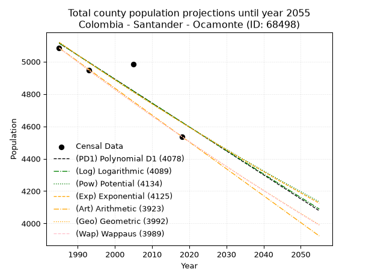
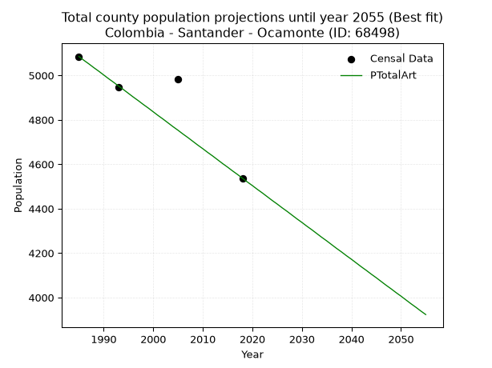
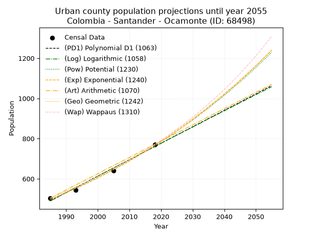
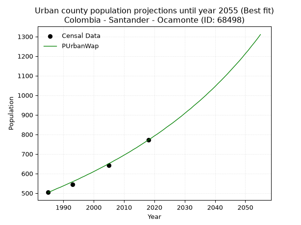
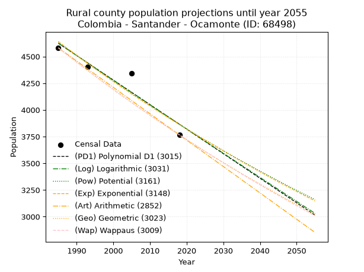
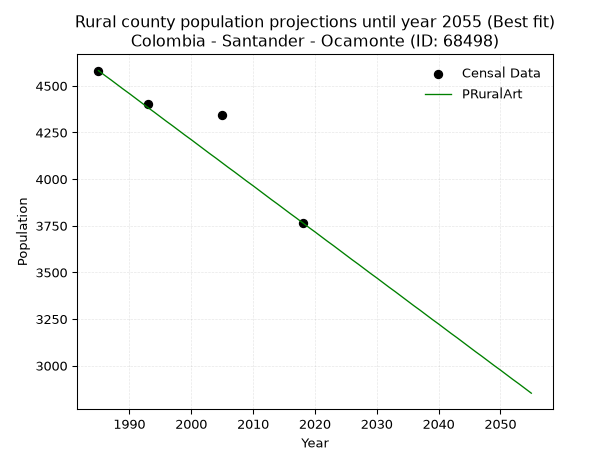

<div align="center">


</div>

# _“Population and Public Services Demand Projections (PPSD) until Year 2050 for Colombia - Santander - Ocamonte (ID: 68498)”_
Keywords: `population` `public-service` `projection` `lineal` `polynomial` `logarithmic` `potential` `exponential` `arithmetic` `geometric` `wappaus` `dane` `colombia` `south-america`

PPSD are analytical estimates used by governments and planners to anticipate future changes in population size, age distribution, and the resulting community needs for utilities, healthcare, education, and infrastructure as sizing future water treatment facilities, electrical grids, and road networks based on spatial growth.

> **General running parameters**: • app_version: _v20260806_. • Python version: _3.14.7_. • Pandas version: _3.0.5_. • NumPy version: _2.5.1_. • Creates, save and include plots into reports (create_plot): _False_. • Projection until year: _2050_. • Process polynomial degree 2 and up: _False_. • Process Wappaus: _True_. • Process Wappaus: _True_. • Set negative values to zero: _True_. • Set infinite values to zero: _True_. • Drop dataset notes: _True_. 
<div align="center">

Dynamic map: [:earth_americas:Google](http://maps.google.com/maps?q=6.339987729,-73.122563) [:earth_americas:OSM](https://www.openstreetmap.org/#map=18/6.339987729/-73.122563&layers=P) [:earth_americas:Bing](https://www.bing.com/maps?cp=6.339987729~-73.122563&lvl=18) [:earth_americas:Apple](https://maps.apple.com/frame?center=6.339987729%2C-73.122563&span=0.003%2C0.006)

</div>


<div align="center">

```geojson
{
  "type": "Feature",
  "geometry": {
    "type": "Point", 
    "coordinates": [-73.122563, 6.339987729]
  }, 
  "properties": {
    "Name": "Colombia - Santander - Ocamonte (ID: 68498)"
  }
}
```

</div>


## 0. Census Data (4 records)

Census data are official statistics collected by a government about the people and housing in a country. They usually include counts of total population, age, sex, race, income, education, and jobs.

📅Global census file: [Population.xlsx](../data/Population.xlsx)

| Source   |   Year |   CountryID | CountryName   |   StateID | StateName   |   CountyID | CountyName   |   PTotal |   PUrban |   PRural |
|:---------|-------:|------------:|:--------------|----------:|:------------|-----------:|:-------------|---------:|---------:|---------:|
| DANE     |   1985 |          57 | Colombia      |        68 | Santander   |      68498 | Ocamonte     |     5085 |      504 |     4581 |
| DANE     |   1993 |          57 | Colombia      |        68 | Santander   |      68498 | Ocamonte     |     4948 |      544 |     4404 |
| DANE     |   2005 |          57 | Colombia      |        68 | Santander   |      68498 | Ocamonte     |     4984 |      641 |     4343 |
| DANE     |   2018 |          57 | Colombia      |        68 | Santander   |      68498 | Ocamonte     |     4537 |      771 |     3766 |

> 🔥Some records could had specific notes about the registered values or the corresponding urban or rural distribution.

## 1. Total

### 1.1. Coefficients and Parameters

* (PD1) Polynomial Deg 1: -14.794861501404785, 34481.92171818492 (lineal)
* (Log) Logarithmic: -29586.82394217645, 229778.1858784104
* (Pow) Potential: -6.169595635775508, 24.05506994361534
* (Exp) Exponential: -0.003085189917415117, 2338103.591656442
* (Art) Arithmetic: Year diff. 2018 - 1985 = 33, Population diff. 4537 - 5085 = -548, Annual growth = -16.606060606060606
* (Geo) Geometric: Year diff. 2018 - 1985 = 33, Population diff. 4537 - 5085 = -548, Annual growth % = -0.003449462004691428
* (Wap) Wappaus: i = -0.3451685846198422, Condition values only valid for < 200)

<sub>
Wappaus condition values: ['-0.00', '-0.35', '-0.69', '-1.04', '-1.38', '-1.73', '-2.07', '-2.42', '-2.76', '-3.11', '-3.45', '-3.80', '-4.14', '-4.49', '-4.83', '-5.18', '-5.52', '-5.87', '-6.21', '-6.56', '-6.90', '-7.25', '-7.59', '-7.94', '-8.28', '-8.63', '-8.97', '-9.32', '-9.66', '-10.01', '-10.36', '-10.70', '-11.05', '-11.39', '-11.74', '-12.08', '-12.43', '-12.77', '-13.12', '-13.46', '-13.81', '-14.15', '-14.50', '-14.84', '-15.19', '-15.53', '-15.88', '-16.22', '-16.57', '-16.91', '-17.26', '-17.60', '-17.95', '-18.29', '-18.64', '-18.98', '-19.33', '-19.67', '-20.02', '-20.36', '-20.71', '-21.06', '-21.40', '-21.75', '-22.09', '-22.44']
</sub>


### 1.2. Projected Dataset

|   Year |   CountyID |   PTotalPD1 |   PTotalLog |   PTotalPow |   PTotalExp |   PTotalArt |   PTotalGeo |   PTotalWap |
|-------:|-----------:|------------:|------------:|------------:|------------:|------------:|------------:|------------:|
|   1985 |      68498 |        5114 |        5114 |        5119 |        5119 |        5085 |        5085 |        5085 |
|   1986 |      68498 |        5099 |        5099 |        5104 |        5103 |        5068 |        5067 |        5067 |
|   1987 |      68498 |        5085 |        5085 |        5088 |        5088 |        5052 |        5050 |        5050 |
|   1988 |      68498 |        5070 |        5070 |        5072 |        5072 |        5035 |        5033 |        5033 |
|   1989 |      68498 |        5055 |        5055 |        5056 |        5056 |        5019 |        5015 |        5015 |
|   1990 |      68498 |        5040 |        5040 |        5041 |        5041 |        5002 |        4998 |        4998 |
|   1991 |      68498 |        5025 |        5025 |        5025 |        5025 |        4985 |        4981 |        4981 |
|   1992 |      68498 |        5011 |        5010 |        5009 |        5010 |        4969 |        4963 |        4964 |
|   1993 |      68498 |        4996 |        4995 |        4994 |        4994 |        4952 |        4946 |        4946 |
|   1994 |      68498 |        4981 |        4981 |        4979 |        4979 |        4936 |        4929 |        4929 |
|   1995 |      68498 |        4966 |        4966 |        4963 |        4964 |        4919 |        4912 |        4912 |
|   1996 |      68498 |        4951 |        4951 |        4948 |        4948 |        4902 |        4895 |        4896 |
|   1997 |      68498 |        4937 |        4936 |        4933 |        4933 |        4886 |        4878 |        4879 |
|   1998 |      68498 |        4922 |        4921 |        4917 |        4918 |        4869 |        4862 |        4862 |
|   1999 |      68498 |        4907 |        4906 |        4902 |        4903 |        4853 |        4845 |        4845 |
|   2000 |      68498 |        4892 |        4892 |        4887 |        4888 |        4836 |        4828 |        4828 |
|   2001 |      68498 |        4877 |        4877 |        4872 |        4873 |        4819 |        4811 |        4812 |
|   2002 |      68498 |        4863 |        4862 |        4857 |        4858 |        4803 |        4795 |        4795 |
|   2003 |      68498 |        4848 |        4847 |        4842 |        4843 |        4786 |        4778 |        4779 |
|   2004 |      68498 |        4833 |        4833 |        4827 |        4828 |        4769 |        4762 |        4762 |
|   2005 |      68498 |        4818 |        4818 |        4812 |        4813 |        4753 |        4745 |        4746 |
|   2006 |      68498 |        4803 |        4803 |        4798 |        4798 |        4736 |        4729 |        4729 |
|   2007 |      68498 |        4789 |        4788 |        4783 |        4783 |        4720 |        4713 |        4713 |
|   2008 |      68498 |        4774 |        4774 |        4768 |        4769 |        4703 |        4697 |        4697 |
|   2009 |      68498 |        4759 |        4759 |        4754 |        4754 |        4686 |        4680 |        4681 |
|   2010 |      68498 |        4744 |        4744 |        4739 |        4739 |        4670 |        4664 |        4664 |
|   2011 |      68498 |        4729 |        4729 |        4724 |        4725 |        4653 |        4648 |        4648 |
|   2012 |      68498 |        4715 |        4715 |        4710 |        4710 |        4637 |        4632 |        4632 |
|   2013 |      68498 |        4700 |        4700 |        4696 |        4696 |        4620 |        4616 |        4616 |
|   2014 |      68498 |        4685 |        4685 |        4681 |        4681 |        4603 |        4600 |        4600 |
|   2015 |      68498 |        4670 |        4671 |        4667 |        4667 |        4587 |        4584 |        4584 |
|   2016 |      68498 |        4655 |        4656 |        4653 |        4652 |        4570 |        4568 |        4569 |
|   2017 |      68498 |        4641 |        4641 |        4638 |        4638 |        4554 |        4553 |        4553 |
|   2018 |      68498 |        4626 |        4627 |        4624 |        4624 |        4537 |        4537 |        4537 |
|   2019 |      68498 |        4611 |        4612 |        4610 |        4609 |        4520 |        4521 |        4521 |
|   2020 |      68498 |        4596 |        4597 |        4596 |        4595 |        4504 |        4506 |        4506 |
|   2021 |      68498 |        4582 |        4583 |        4582 |        4581 |        4487 |        4490 |        4490 |
|   2022 |      68498 |        4567 |        4568 |        4568 |        4567 |        4471 |        4475 |        4475 |
|   2023 |      68498 |        4552 |        4553 |        4554 |        4553 |        4454 |        4459 |        4459 |
|   2024 |      68498 |        4537 |        4539 |        4540 |        4539 |        4437 |        4444 |        4444 |
|   2025 |      68498 |        4522 |        4524 |        4527 |        4525 |        4421 |        4429 |        4428 |
|   2026 |      68498 |        4508 |        4509 |        4513 |        4511 |        4404 |        4413 |        4413 |
|   2027 |      68498 |        4493 |        4495 |        4499 |        4497 |        4388 |        4398 |        4398 |
|   2028 |      68498 |        4478 |        4480 |        4485 |        4483 |        4371 |        4383 |        4382 |
|   2029 |      68498 |        4463 |        4466 |        4472 |        4469 |        4354 |        4368 |        4367 |
|   2030 |      68498 |        4448 |        4451 |        4458 |        4456 |        4338 |        4353 |        4352 |
|   2031 |      68498 |        4434 |        4437 |        4445 |        4442 |        4321 |        4338 |        4337 |
|   2032 |      68498 |        4419 |        4422 |        4431 |        4428 |        4305 |        4323 |        4322 |
|   2033 |      68498 |        4404 |        4407 |        4418 |        4415 |        4288 |        4308 |        4307 |
|   2034 |      68498 |        4389 |        4393 |        4404 |        4401 |        4271 |        4293 |        4292 |
|   2035 |      68498 |        4374 |        4378 |        4391 |        4387 |        4255 |        4278 |        4277 |
|   2036 |      68498 |        4360 |        4364 |        4378 |        4374 |        4238 |        4263 |        4262 |
|   2037 |      68498 |        4345 |        4349 |        4364 |        4360 |        4221 |        4249 |        4247 |
|   2038 |      68498 |        4330 |        4335 |        4351 |        4347 |        4205 |        4234 |        4233 |
|   2039 |      68498 |        4315 |        4320 |        4338 |        4334 |        4188 |        4219 |        4218 |
|   2040 |      68498 |        4300 |        4306 |        4325 |        4320 |        4172 |        4205 |        4203 |
|   2041 |      68498 |        4286 |        4291 |        4312 |        4307 |        4155 |        4190 |        4189 |
|   2042 |      68498 |        4271 |        4277 |        4299 |        4294 |        4138 |        4176 |        4174 |
|   2043 |      68498 |        4256 |        4262 |        4286 |        4280 |        4122 |        4162 |        4160 |
|   2044 |      68498 |        4241 |        4248 |        4273 |        4267 |        4105 |        4147 |        4145 |
|   2045 |      68498 |        4226 |        4233 |        4260 |        4254 |        4089 |        4133 |        4131 |
|   2046 |      68498 |        4212 |        4219 |        4247 |        4241 |        4072 |        4119 |        4116 |
|   2047 |      68498 |        4197 |        4204 |        4235 |        4228 |        4055 |        4104 |        4102 |
|   2048 |      68498 |        4182 |        4190 |        4222 |        4215 |        4039 |        4090 |        4088 |
|   2049 |      68498 |        4167 |        4175 |        4209 |        4202 |        4022 |        4076 |        4073 |
|   2050 |      68498 |        4152 |        4161 |        4197 |        4189 |        4006 |        4062 |        4059 |
<div align="center">

</img>

</div>


### 1.3. Best fit with absolute and relative error (%)

Relative error puts that difference into context by dividing the absolute error by the true value, creating a unitless ratio or percentage that shows the scale of the mistake.

Absolute and relative error

|   Year | Source   |   CountryID | CountryName   |   StateID | StateName   |   CountyID_x | CountyName   |   PTotal |   PUrban |   PRural |   CountyID_y |   PTotalPD1 |   PTotalLog |   PTotalPow |   PTotalExp |   PTotalArt |   PTotalGeo |   PTotalWap |   PTotalPD1AbsError |   PTotalLogAbsError |   PTotalPowAbsError |   PTotalExpAbsError |   PTotalArtAbsError |   PTotalGeoAbsError |   PTotalWapAbsError |   PTotalPD1RelError |   PTotalLogRelError |   PTotalPowRelError |   PTotalExpRelError |   PTotalArtRelError |   PTotalGeoRelError |   PTotalWapRelError |
|-------:|:---------|------------:|:--------------|----------:|:------------|-------------:|:-------------|---------:|---------:|---------:|-------------:|------------:|------------:|------------:|------------:|------------:|------------:|------------:|--------------------:|--------------------:|--------------------:|--------------------:|--------------------:|--------------------:|--------------------:|--------------------:|--------------------:|--------------------:|--------------------:|--------------------:|--------------------:|--------------------:|
|   1985 | DANE     |          57 | Colombia      |        68 | Santander   |        68498 | Ocamonte     |     5085 |      504 |     4581 |        68498 |        5114 |        5114 |        5119 |        5119 |        5085 |        5085 |        5085 |                  29 |                  29 |                  34 |                  34 |                   0 |                   0 |                   0 |            0.570305 |            0.570305 |            0.668633 |            0.668633 |           0         |           0         |           0         |
|   1993 | DANE     |          57 | Colombia      |        68 | Santander   |        68498 | Ocamonte     |     4948 |      544 |     4404 |        68498 |        4996 |        4995 |        4994 |        4994 |        4952 |        4946 |        4946 |                  48 |                  47 |                  46 |                  46 |                   4 |                   2 |                   2 |            0.970089 |            0.949879 |            0.929669 |            0.929669 |           0.0808407 |           0.0404204 |           0.0404204 |
|   2005 | DANE     |          57 | Colombia      |        68 | Santander   |        68498 | Ocamonte     |     4984 |      641 |     4343 |        68498 |        4818 |        4818 |        4812 |        4813 |        4753 |        4745 |        4746 |                 166 |                 166 |                 172 |                 171 |                 231 |                 239 |                 238 |            3.33066  |            3.33066  |            3.45104  |            3.43098  |           4.63483   |           4.79535   |           4.77528   |
|   2018 | DANE     |          57 | Colombia      |        68 | Santander   |        68498 | Ocamonte     |     4537 |      771 |     3766 |        68498 |        4626 |        4627 |        4624 |        4624 |        4537 |        4537 |        4537 |                  89 |                  90 |                  87 |                  87 |                   0 |                   0 |                   0 |            1.96165  |            1.98369  |            1.91757  |            1.91757  |           0         |           0         |           0         |

Relative error mean

| Method    |   RelError | Best   |
|:----------|-----------:|:-------|
| PTotalPD1 |    1.70818 |        |
| PTotalLog |    1.70863 |        |
| PTotalPow |    1.74173 |        |
| PTotalExp |    1.73671 |        |
| PTotalArt |    1.17892 | True   |
| PTotalGeo |    1.20894 |        |
| PTotalWap |    1.20393 |        |

💙Best method: _**PTotalArt**_
<div align="center">

</img>

</div>


### 1.4. Fresh water supply demand in liters per capita per day (lpcd)

The fresh water supply demand typically ranges from 100 to 300 liters per capita per day (lpcd) for standard domestic and municipal planning, though absolute survival minimums set by the World Health Organization are as low as 7.5 to 20 liters per day, and total consumption in high-income nations can exceed 400 liters.

> `CZ`: Level in meters above the sea level (masl).<br> `WS`: Fresh water supply demand in liters per capita per day (lpcd or l/h/d).<br> `WSAll`: Zonal fresh water supply demand in liters per second (l/s).<br> `A`: Zonal area in square meters.

Reference values (RAS Colombia)

|    CZ |   WS |
|------:|-----:|
|  1000 |  120 |
|  2000 |  130 |
| 99999 |  140 |

County shapefile geometry properties and water supply values

|   CountyID |      ATotal |   CZTotal |   WSTotal |
|-----------:|------------:|----------:|----------:|
|      68498 | 7.50688e+07 |    1613.8 |       130 |

Projected values for best method: PTotalArt

|   CountyID |   Year |   PTotalArt |   WSTotal |   WSTotalAll |
|-----------:|-------:|------------:|----------:|-------------:|
|      68498 |   1985 |        5085 |       130 |      7.65104 |
|      68498 |   1986 |        5068 |       130 |      7.62546 |
|      68498 |   1987 |        5052 |       130 |      7.60139 |
|      68498 |   1988 |        5035 |       130 |      7.57581 |
|      68498 |   1989 |        5019 |       130 |      7.55174 |
|      68498 |   1990 |        5002 |       130 |      7.52616 |
|      68498 |   1991 |        4985 |       130 |      7.50058 |
|      68498 |   1992 |        4969 |       130 |      7.4765  |
|      68498 |   1993 |        4952 |       130 |      7.45093 |
|      68498 |   1994 |        4936 |       130 |      7.42685 |
|      68498 |   1995 |        4919 |       130 |      7.40127 |
|      68498 |   1996 |        4902 |       130 |      7.37569 |
|      68498 |   1997 |        4886 |       130 |      7.35162 |
|      68498 |   1998 |        4869 |       130 |      7.32604 |
|      68498 |   1999 |        4853 |       130 |      7.30197 |
|      68498 |   2000 |        4836 |       130 |      7.27639 |
|      68498 |   2001 |        4819 |       130 |      7.25081 |
|      68498 |   2002 |        4803 |       130 |      7.22674 |
|      68498 |   2003 |        4786 |       130 |      7.20116 |
|      68498 |   2004 |        4769 |       130 |      7.17558 |
|      68498 |   2005 |        4753 |       130 |      7.1515  |
|      68498 |   2006 |        4736 |       130 |      7.12593 |
|      68498 |   2007 |        4720 |       130 |      7.10185 |
|      68498 |   2008 |        4703 |       130 |      7.07627 |
|      68498 |   2009 |        4686 |       130 |      7.05069 |
|      68498 |   2010 |        4670 |       130 |      7.02662 |
|      68498 |   2011 |        4653 |       130 |      7.00104 |
|      68498 |   2012 |        4637 |       130 |      6.97697 |
|      68498 |   2013 |        4620 |       130 |      6.95139 |
|      68498 |   2014 |        4603 |       130 |      6.92581 |
|      68498 |   2015 |        4587 |       130 |      6.90174 |
|      68498 |   2016 |        4570 |       130 |      6.87616 |
|      68498 |   2017 |        4554 |       130 |      6.85208 |
|      68498 |   2018 |        4537 |       130 |      6.8265  |
|      68498 |   2019 |        4520 |       130 |      6.80093 |
|      68498 |   2020 |        4504 |       130 |      6.77685 |
|      68498 |   2021 |        4487 |       130 |      6.75127 |
|      68498 |   2022 |        4471 |       130 |      6.7272  |
|      68498 |   2023 |        4454 |       130 |      6.70162 |
|      68498 |   2024 |        4437 |       130 |      6.67604 |
|      68498 |   2025 |        4421 |       130 |      6.65197 |
|      68498 |   2026 |        4404 |       130 |      6.62639 |
|      68498 |   2027 |        4388 |       130 |      6.60231 |
|      68498 |   2028 |        4371 |       130 |      6.57674 |
|      68498 |   2029 |        4354 |       130 |      6.55116 |
|      68498 |   2030 |        4338 |       130 |      6.52708 |
|      68498 |   2031 |        4321 |       130 |      6.5015  |
|      68498 |   2032 |        4305 |       130 |      6.47743 |
|      68498 |   2033 |        4288 |       130 |      6.45185 |
|      68498 |   2034 |        4271 |       130 |      6.42627 |
|      68498 |   2035 |        4255 |       130 |      6.4022  |
|      68498 |   2036 |        4238 |       130 |      6.37662 |
|      68498 |   2037 |        4221 |       130 |      6.35104 |
|      68498 |   2038 |        4205 |       130 |      6.32697 |
|      68498 |   2039 |        4188 |       130 |      6.30139 |
|      68498 |   2040 |        4172 |       130 |      6.27731 |
|      68498 |   2041 |        4155 |       130 |      6.25174 |
|      68498 |   2042 |        4138 |       130 |      6.22616 |
|      68498 |   2043 |        4122 |       130 |      6.20208 |
|      68498 |   2044 |        4105 |       130 |      6.1765  |
|      68498 |   2045 |        4089 |       130 |      6.15243 |
|      68498 |   2046 |        4072 |       130 |      6.12685 |
|      68498 |   2047 |        4055 |       130 |      6.10127 |
|      68498 |   2048 |        4039 |       130 |      6.0772  |
|      68498 |   2049 |        4022 |       130 |      6.05162 |
|      68498 |   2050 |        4006 |       130 |      6.02755 |

## 2. Urban

### 2.1. Coefficients and Parameters

* (PD1) Polynomial Deg 1: 8.189482135688388, -15766.011641910702 (lineal)
* (Log) Logarithmic: 16387.675012843265, -123947.8490952075
* (Pow) Potential: 26.14082085261677, -83.50984661928236
* (Exp) Exponential: 0.013061723682582497, 2.73085262480248e-09
* (Art) Arithmetic: Year diff. 2018 - 1985 = 33, Population diff. 771 - 504 = 267, Annual growth = 8.090909090909092
* (Geo) Geometric: Year diff. 2018 - 1985 = 33, Population diff. 771 - 504 = 267, Annual growth % = 0.01296551781198474
* (Wap) Wappaus: i = 1.2691622103386808, Condition values only valid for < 200)

<sub>
Wappaus condition values: ['0.00', '1.27', '2.54', '3.81', '5.08', '6.35', '7.61', '8.88', '10.15', '11.42', '12.69', '13.96', '15.23', '16.50', '17.77', '19.04', '20.31', '21.58', '22.84', '24.11', '25.38', '26.65', '27.92', '29.19', '30.46', '31.73', '33.00', '34.27', '35.54', '36.81', '38.07', '39.34', '40.61', '41.88', '43.15', '44.42', '45.69', '46.96', '48.23', '49.50', '50.77', '52.04', '53.30', '54.57', '55.84', '57.11', '58.38', '59.65', '60.92', '62.19', '63.46', '64.73', '66.00', '67.27', '68.53', '69.80', '71.07', '72.34', '73.61', '74.88', '76.15', '77.42', '78.69', '79.96', '81.23', '82.50']
</sub>


### 2.2. Projected Dataset

|   Year |   CountyID |   PUrbanPD1 |   PUrbanLog |   PUrbanPow |   PUrbanExp |   PUrbanArt |   PUrbanGeo |   PUrbanWap |
|-------:|-----------:|------------:|------------:|------------:|------------:|------------:|------------:|------------:|
|   1985 |      68498 |         490 |         490 |         497 |         497 |         504 |         504 |         504 |
|   1986 |      68498 |         498 |         498 |         504 |         504 |         512 |         511 |         510 |
|   1987 |      68498 |         506 |         506 |         510 |         510 |         520 |         517 |         517 |
|   1988 |      68498 |         515 |         515 |         517 |         517 |         528 |         524 |         524 |
|   1989 |      68498 |         523 |         523 |         524 |         524 |         536 |         531 |         530 |
|   1990 |      68498 |         531 |         531 |         531 |         531 |         544 |         538 |         537 |
|   1991 |      68498 |         539 |         539 |         538 |         538 |         553 |         545 |         544 |
|   1992 |      68498 |         547 |         548 |         545 |         545 |         561 |         552 |         551 |
|   1993 |      68498 |         556 |         556 |         552 |         552 |         569 |         559 |         558 |
|   1994 |      68498 |         564 |         564 |         559 |         559 |         577 |         566 |         565 |
|   1995 |      68498 |         572 |         572 |         567 |         567 |         585 |         573 |         572 |
|   1996 |      68498 |         580 |         580 |         574 |         574 |         593 |         581 |         580 |
|   1997 |      68498 |         588 |         589 |         582 |         581 |         601 |         588 |         587 |
|   1998 |      68498 |         597 |         597 |         589 |         589 |         609 |         596 |         595 |
|   1999 |      68498 |         605 |         605 |         597 |         597 |         617 |         604 |         602 |
|   2000 |      68498 |         613 |         613 |         605 |         605 |         625 |         611 |         610 |
|   2001 |      68498 |         621 |         621 |         613 |         613 |         633 |         619 |         618 |
|   2002 |      68498 |         629 |         630 |         621 |         621 |         642 |         627 |         626 |
|   2003 |      68498 |         638 |         638 |         629 |         629 |         650 |         636 |         634 |
|   2004 |      68498 |         646 |         646 |         637 |         637 |         658 |         644 |         642 |
|   2005 |      68498 |         654 |         654 |         646 |         646 |         666 |         652 |         651 |
|   2006 |      68498 |         662 |         662 |         654 |         654 |         674 |         661 |         659 |
|   2007 |      68498 |         670 |         671 |         663 |         663 |         682 |         669 |         668 |
|   2008 |      68498 |         678 |         679 |         672 |         671 |         690 |         678 |         676 |
|   2009 |      68498 |         687 |         687 |         680 |         680 |         698 |         687 |         685 |
|   2010 |      68498 |         695 |         695 |         689 |         689 |         706 |         695 |         694 |
|   2011 |      68498 |         703 |         703 |         698 |         698 |         714 |         705 |         703 |
|   2012 |      68498 |         711 |         711 |         707 |         707 |         722 |         714 |         712 |
|   2013 |      68498 |         719 |         719 |         717 |         717 |         731 |         723 |         722 |
|   2014 |      68498 |         728 |         728 |         726 |         726 |         739 |         732 |         731 |
|   2015 |      68498 |         736 |         736 |         736 |         736 |         747 |         742 |         741 |
|   2016 |      68498 |         744 |         744 |         745 |         745 |         755 |         751 |         751 |
|   2017 |      68498 |         752 |         752 |         755 |         755 |         763 |         761 |         761 |
|   2018 |      68498 |         760 |         760 |         765 |         765 |         771 |         771 |         771 |
|   2019 |      68498 |         769 |         768 |         775 |         775 |         779 |         781 |         781 |
|   2020 |      68498 |         777 |         776 |         785 |         785 |         787 |         791 |         792 |
|   2021 |      68498 |         785 |         784 |         795 |         796 |         795 |         801 |         802 |
|   2022 |      68498 |         793 |         793 |         805 |         806 |         803 |         812 |         813 |
|   2023 |      68498 |         801 |         801 |         816 |         817 |         811 |         822 |         824 |
|   2024 |      68498 |         810 |         809 |         826 |         827 |         820 |         833 |         836 |
|   2025 |      68498 |         818 |         817 |         837 |         838 |         828 |         844 |         847 |
|   2026 |      68498 |         826 |         825 |         848 |         849 |         836 |         855 |         858 |
|   2027 |      68498 |         834 |         833 |         859 |         860 |         844 |         866 |         870 |
|   2028 |      68498 |         842 |         841 |         870 |         872 |         852 |         877 |         882 |
|   2029 |      68498 |         850 |         849 |         881 |         883 |         860 |         888 |         894 |
|   2030 |      68498 |         859 |         857 |         893 |         895 |         868 |         900 |         907 |
|   2031 |      68498 |         867 |         865 |         904 |         907 |         876 |         912 |         920 |
|   2032 |      68498 |         875 |         873 |         916 |         919 |         884 |         923 |         932 |
|   2033 |      68498 |         883 |         881 |         928 |         931 |         892 |         935 |         946 |
|   2034 |      68498 |         891 |         890 |         940 |         943 |         900 |         947 |         959 |
|   2035 |      68498 |         900 |         898 |         952 |         955 |         909 |         960 |         972 |
|   2036 |      68498 |         908 |         906 |         965 |         968 |         917 |         972 |         986 |
|   2037 |      68498 |         916 |         914 |         977 |         981 |         925 |         985 |        1000 |
|   2038 |      68498 |         924 |         922 |         990 |         993 |         933 |         998 |        1015 |
|   2039 |      68498 |         932 |         930 |        1002 |        1006 |         941 |        1011 |        1029 |
|   2040 |      68498 |         941 |         938 |        1015 |        1020 |         949 |        1024 |        1044 |
|   2041 |      68498 |         949 |         946 |        1028 |        1033 |         957 |        1037 |        1060 |
|   2042 |      68498 |         957 |         954 |        1042 |        1047 |         965 |        1050 |        1075 |
|   2043 |      68498 |         965 |         962 |        1055 |        1060 |         973 |        1064 |        1091 |
|   2044 |      68498 |         973 |         970 |        1069 |        1074 |         981 |        1078 |        1107 |
|   2045 |      68498 |         981 |         978 |        1082 |        1089 |         989 |        1092 |        1124 |
|   2046 |      68498 |         990 |         986 |        1096 |        1103 |         998 |        1106 |        1141 |
|   2047 |      68498 |         998 |         994 |        1110 |        1117 |        1006 |        1120 |        1158 |
|   2048 |      68498 |        1006 |        1002 |        1125 |        1132 |        1014 |        1135 |        1175 |
|   2049 |      68498 |        1014 |        1010 |        1139 |        1147 |        1022 |        1149 |        1193 |
|   2050 |      68498 |        1022 |        1018 |        1154 |        1162 |        1030 |        1164 |        1212 |
<div align="center">

</img>

</div>


### 2.3. Best fit with absolute and relative error (%)

Relative error puts that difference into context by dividing the absolute error by the true value, creating a unitless ratio or percentage that shows the scale of the mistake.

Absolute and relative error

|   Year | Source   |   CountryID | CountryName   |   StateID | StateName   |   CountyID_x | CountyName   |   PTotal |   PUrban |   PRural |   CountyID_y |   PUrbanPD1 |   PUrbanLog |   PUrbanPow |   PUrbanExp |   PUrbanArt |   PUrbanGeo |   PUrbanWap |   PUrbanPD1AbsError |   PUrbanLogAbsError |   PUrbanPowAbsError |   PUrbanExpAbsError |   PUrbanArtAbsError |   PUrbanGeoAbsError |   PUrbanWapAbsError |   PUrbanPD1RelError |   PUrbanLogRelError |   PUrbanPowRelError |   PUrbanExpRelError |   PUrbanArtRelError |   PUrbanGeoRelError |   PUrbanWapRelError |
|-------:|:---------|------------:|:--------------|----------:|:------------|-------------:|:-------------|---------:|---------:|---------:|-------------:|------------:|------------:|------------:|------------:|------------:|------------:|------------:|--------------------:|--------------------:|--------------------:|--------------------:|--------------------:|--------------------:|--------------------:|--------------------:|--------------------:|--------------------:|--------------------:|--------------------:|--------------------:|--------------------:|
|   1985 | DANE     |          57 | Colombia      |        68 | Santander   |        68498 | Ocamonte     |     5085 |      504 |     4581 |        68498 |         490 |         490 |         497 |         497 |         504 |         504 |         504 |                  14 |                  14 |                   7 |                   7 |                   0 |                   0 |                   0 |             2.77778 |             2.77778 |            1.38889  |            1.38889  |             0       |             0       |             0       |
|   1993 | DANE     |          57 | Colombia      |        68 | Santander   |        68498 | Ocamonte     |     4948 |      544 |     4404 |        68498 |         556 |         556 |         552 |         552 |         569 |         559 |         558 |                  12 |                  12 |                   8 |                   8 |                  25 |                  15 |                  14 |             2.20588 |             2.20588 |            1.47059  |            1.47059  |             4.59559 |             2.75735 |             2.57353 |
|   2005 | DANE     |          57 | Colombia      |        68 | Santander   |        68498 | Ocamonte     |     4984 |      641 |     4343 |        68498 |         654 |         654 |         646 |         646 |         666 |         652 |         651 |                  13 |                  13 |                   5 |                   5 |                  25 |                  11 |                  10 |             2.02808 |             2.02808 |            0.780031 |            0.780031 |             3.90016 |             1.71607 |             1.56006 |
|   2018 | DANE     |          57 | Colombia      |        68 | Santander   |        68498 | Ocamonte     |     4537 |      771 |     3766 |        68498 |         760 |         760 |         765 |         765 |         771 |         771 |         771 |                  11 |                  11 |                   6 |                   6 |                   0 |                   0 |                   0 |             1.42672 |             1.42672 |            0.77821  |            0.77821  |             0       |             0       |             0       |

Relative error mean

| Method    |   RelError | Best   |
|:----------|-----------:|:-------|
| PUrbanPD1 |    2.10961 |        |
| PUrbanLog |    2.10961 |        |
| PUrbanPow |    1.10443 |        |
| PUrbanExp |    1.10443 |        |
| PUrbanArt |    2.12394 |        |
| PUrbanGeo |    1.11836 |        |
| PUrbanWap |    1.0334  | True   |

💙Best method: _**PUrbanWap**_
<div align="center">

</img>

</div>


### 2.4. Fresh water supply demand in liters per capita per day (lpcd)

The fresh water supply demand typically ranges from 100 to 300 liters per capita per day (lpcd) for standard domestic and municipal planning, though absolute survival minimums set by the World Health Organization are as low as 7.5 to 20 liters per day, and total consumption in high-income nations can exceed 400 liters.

> `CZ`: Level in meters above the sea level (masl).<br> `WS`: Fresh water supply demand in liters per capita per day (lpcd or l/h/d).<br> `WSAll`: Zonal fresh water supply demand in liters per second (l/s).<br> `A`: Zonal area in square meters.

Reference values (RAS Colombia)

|    CZ |   WS |
|------:|-----:|
|  1000 |  120 |
|  2000 |  130 |
| 99999 |  140 |

County shapefile geometry properties and water supply values

|   CountyID |   AUrban |   CZUrban |   WSUrban |
|-----------:|---------:|----------:|----------:|
|      68498 |   133326 |   1396.79 |       130 |

Projected values for best method: PUrbanWap

|   CountyID |   Year |   PUrbanWap |   WSUrban |   WSUrbanAll |
|-----------:|-------:|------------:|----------:|-------------:|
|      68498 |   1985 |         504 |       130 |     0.758333 |
|      68498 |   1986 |         510 |       130 |     0.767361 |
|      68498 |   1987 |         517 |       130 |     0.777894 |
|      68498 |   1988 |         524 |       130 |     0.788426 |
|      68498 |   1989 |         530 |       130 |     0.797454 |
|      68498 |   1990 |         537 |       130 |     0.807986 |
|      68498 |   1991 |         544 |       130 |     0.818519 |
|      68498 |   1992 |         551 |       130 |     0.829051 |
|      68498 |   1993 |         558 |       130 |     0.839583 |
|      68498 |   1994 |         565 |       130 |     0.850116 |
|      68498 |   1995 |         572 |       130 |     0.860648 |
|      68498 |   1996 |         580 |       130 |     0.872685 |
|      68498 |   1997 |         587 |       130 |     0.883218 |
|      68498 |   1998 |         595 |       130 |     0.895255 |
|      68498 |   1999 |         602 |       130 |     0.905787 |
|      68498 |   2000 |         610 |       130 |     0.917824 |
|      68498 |   2001 |         618 |       130 |     0.929861 |
|      68498 |   2002 |         626 |       130 |     0.941898 |
|      68498 |   2003 |         634 |       130 |     0.953935 |
|      68498 |   2004 |         642 |       130 |     0.965972 |
|      68498 |   2005 |         651 |       130 |     0.979514 |
|      68498 |   2006 |         659 |       130 |     0.991551 |
|      68498 |   2007 |         668 |       130 |     1.00509  |
|      68498 |   2008 |         676 |       130 |     1.01713  |
|      68498 |   2009 |         685 |       130 |     1.03067  |
|      68498 |   2010 |         694 |       130 |     1.04421  |
|      68498 |   2011 |         703 |       130 |     1.05775  |
|      68498 |   2012 |         712 |       130 |     1.0713   |
|      68498 |   2013 |         722 |       130 |     1.08634  |
|      68498 |   2014 |         731 |       130 |     1.09988  |
|      68498 |   2015 |         741 |       130 |     1.11493  |
|      68498 |   2016 |         751 |       130 |     1.12998  |
|      68498 |   2017 |         761 |       130 |     1.14502  |
|      68498 |   2018 |         771 |       130 |     1.16007  |
|      68498 |   2019 |         781 |       130 |     1.17512  |
|      68498 |   2020 |         792 |       130 |     1.19167  |
|      68498 |   2021 |         802 |       130 |     1.20671  |
|      68498 |   2022 |         813 |       130 |     1.22326  |
|      68498 |   2023 |         824 |       130 |     1.23981  |
|      68498 |   2024 |         836 |       130 |     1.25787  |
|      68498 |   2025 |         847 |       130 |     1.27442  |
|      68498 |   2026 |         858 |       130 |     1.29097  |
|      68498 |   2027 |         870 |       130 |     1.30903  |
|      68498 |   2028 |         882 |       130 |     1.32708  |
|      68498 |   2029 |         894 |       130 |     1.34514  |
|      68498 |   2030 |         907 |       130 |     1.3647   |
|      68498 |   2031 |         920 |       130 |     1.38426  |
|      68498 |   2032 |         932 |       130 |     1.40231  |
|      68498 |   2033 |         946 |       130 |     1.42338  |
|      68498 |   2034 |         959 |       130 |     1.44294  |
|      68498 |   2035 |         972 |       130 |     1.4625   |
|      68498 |   2036 |         986 |       130 |     1.48356  |
|      68498 |   2037 |        1000 |       130 |     1.50463  |
|      68498 |   2038 |        1015 |       130 |     1.5272   |
|      68498 |   2039 |        1029 |       130 |     1.54826  |
|      68498 |   2040 |        1044 |       130 |     1.57083  |
|      68498 |   2041 |        1060 |       130 |     1.59491  |
|      68498 |   2042 |        1075 |       130 |     1.61748  |
|      68498 |   2043 |        1091 |       130 |     1.64155  |
|      68498 |   2044 |        1107 |       130 |     1.66562  |
|      68498 |   2045 |        1124 |       130 |     1.6912   |
|      68498 |   2046 |        1141 |       130 |     1.71678  |
|      68498 |   2047 |        1158 |       130 |     1.74236  |
|      68498 |   2048 |        1175 |       130 |     1.76794  |
|      68498 |   2049 |        1193 |       130 |     1.79502  |
|      68498 |   2050 |        1212 |       130 |     1.82361  |

## 3. Rural

### 3.1. Coefficients and Parameters

* (PD1) Polynomial Deg 1: -22.984343637093133, 50247.93336009554 (lineal)
* (Log) Logarithmic: -45974.498955019706, 353726.0349736179
* (Pow) Potential: -11.064691828497804, 40.1550062775017
* (Exp) Exponential: -0.0055319728189282, 272414739.1977944
* (Art) Arithmetic: Year diff. 2018 - 1985 = 33, Population diff. 3766 - 4581 = -815, Annual growth = -24.696969696969695
* (Geo) Geometric: Year diff. 2018 - 1985 = 33, Population diff. 3766 - 4581 = -815, Annual growth % = -0.005918895265232149
* (Wap) Wappaus: i = -0.5917567915890667, Condition values only valid for < 200)

<sub>
Wappaus condition values: ['-0.00', '-0.59', '-1.18', '-1.78', '-2.37', '-2.96', '-3.55', '-4.14', '-4.73', '-5.33', '-5.92', '-6.51', '-7.10', '-7.69', '-8.28', '-8.88', '-9.47', '-10.06', '-10.65', '-11.24', '-11.84', '-12.43', '-13.02', '-13.61', '-14.20', '-14.79', '-15.39', '-15.98', '-16.57', '-17.16', '-17.75', '-18.34', '-18.94', '-19.53', '-20.12', '-20.71', '-21.30', '-21.90', '-22.49', '-23.08', '-23.67', '-24.26', '-24.85', '-25.45', '-26.04', '-26.63', '-27.22', '-27.81', '-28.40', '-29.00', '-29.59', '-30.18', '-30.77', '-31.36', '-31.95', '-32.55', '-33.14', '-33.73', '-34.32', '-34.91', '-35.51', '-36.10', '-36.69', '-37.28', '-37.87', '-38.46']
</sub>


### 3.2. Projected Dataset

|   Year |   CountyID |   PRuralPD1 |   PRuralLog |   PRuralPow |   PRuralExp |   PRuralArt |   PRuralGeo |   PRuralWap |
|-------:|-----------:|------------:|------------:|------------:|------------:|------------:|------------:|------------:|
|   1985 |      68498 |        4624 |        4624 |        4638 |        4637 |        4581 |        4581 |        4581 |
|   1986 |      68498 |        4601 |        4601 |        4612 |        4612 |        4556 |        4554 |        4554 |
|   1987 |      68498 |        4578 |        4578 |        4586 |        4586 |        4532 |        4527 |        4527 |
|   1988 |      68498 |        4555 |        4555 |        4561 |        4561 |        4507 |        4500 |        4500 |
|   1989 |      68498 |        4532 |        4532 |        4536 |        4536 |        4482 |        4474 |        4474 |
|   1990 |      68498 |        4509 |        4509 |        4510 |        4511 |        4458 |        4447 |        4447 |
|   1991 |      68498 |        4486 |        4486 |        4485 |        4486 |        4433 |        4421 |        4421 |
|   1992 |      68498 |        4463 |        4463 |        4461 |        4461 |        4408 |        4395 |        4395 |
|   1993 |      68498 |        4440 |        4440 |        4436 |        4436 |        4383 |        4369 |        4369 |
|   1994 |      68498 |        4417 |        4416 |        4411 |        4412 |        4359 |        4343 |        4343 |
|   1995 |      68498 |        4394 |        4393 |        4387 |        4388 |        4334 |        4317 |        4318 |
|   1996 |      68498 |        4371 |        4370 |        4363 |        4363 |        4309 |        4291 |        4292 |
|   1997 |      68498 |        4348 |        4347 |        4339 |        4339 |        4285 |        4266 |        4267 |
|   1998 |      68498 |        4325 |        4324 |        4315 |        4315 |        4260 |        4241 |        4242 |
|   1999 |      68498 |        4302 |        4301 |        4291 |        4292 |        4235 |        4216 |        4217 |
|   2000 |      68498 |        4279 |        4278 |        4267 |        4268 |        4211 |        4191 |        4192 |
|   2001 |      68498 |        4256 |        4255 |        4244 |        4244 |        4186 |        4166 |        4167 |
|   2002 |      68498 |        4233 |        4232 |        4220 |        4221 |        4161 |        4141 |        4142 |
|   2003 |      68498 |        4210 |        4209 |        4197 |        4198 |        4136 |        4117 |        4118 |
|   2004 |      68498 |        4187 |        4186 |        4174 |        4175 |        4112 |        4092 |        4093 |
|   2005 |      68498 |        4164 |        4164 |        4151 |        4152 |        4087 |        4068 |        4069 |
|   2006 |      68498 |        4141 |        4141 |        4128 |        4129 |        4062 |        4044 |        4045 |
|   2007 |      68498 |        4118 |        4118 |        4105 |        4106 |        4038 |        4020 |        4021 |
|   2008 |      68498 |        4095 |        4095 |        4083 |        4083 |        4013 |        3996 |        3997 |
|   2009 |      68498 |        4072 |        4072 |        4060 |        4061 |        3988 |        3973 |        3974 |
|   2010 |      68498 |        4049 |        4049 |        4038 |        4038 |        3964 |        3949 |        3950 |
|   2011 |      68498 |        4026 |        4026 |        4016 |        4016 |        3939 |        3926 |        3927 |
|   2012 |      68498 |        4003 |        4003 |        3994 |        3994 |        3914 |        3903 |        3903 |
|   2013 |      68498 |        3980 |        3980 |        3972 |        3972 |        3889 |        3879 |        3880 |
|   2014 |      68498 |        3957 |        3958 |        3950 |        3950 |        3865 |        3856 |        3857 |
|   2015 |      68498 |        3934 |        3935 |        3928 |        3928 |        3840 |        3834 |        3834 |
|   2016 |      68498 |        3911 |        3912 |        3907 |        3906 |        3815 |        3811 |        3811 |
|   2017 |      68498 |        3889 |        3889 |        3886 |        3885 |        3791 |        3788 |        3789 |
|   2018 |      68498 |        3866 |        3866 |        3864 |        3863 |        3766 |        3766 |        3766 |
|   2019 |      68498 |        3843 |        3844 |        3843 |        3842 |        3741 |        3744 |        3744 |
|   2020 |      68498 |        3820 |        3821 |        3822 |        3821 |        3717 |        3722 |        3721 |
|   2021 |      68498 |        3797 |        3798 |        3801 |        3800 |        3692 |        3700 |        3699 |
|   2022 |      68498 |        3774 |        3775 |        3781 |        3779 |        3667 |        3678 |        3677 |
|   2023 |      68498 |        3751 |        3753 |        3760 |        3758 |        3643 |        3656 |        3655 |
|   2024 |      68498 |        3728 |        3730 |        3739 |        3737 |        3618 |        3634 |        3633 |
|   2025 |      68498 |        3705 |        3707 |        3719 |        3717 |        3593 |        3613 |        3611 |
|   2026 |      68498 |        3682 |        3685 |        3699 |        3696 |        3568 |        3591 |        3590 |
|   2027 |      68498 |        3659 |        3662 |        3679 |        3676 |        3544 |        3570 |        3568 |
|   2028 |      68498 |        3636 |        3639 |        3659 |        3656 |        3519 |        3549 |        3547 |
|   2029 |      68498 |        3613 |        3617 |        3639 |        3635 |        3494 |        3528 |        3526 |
|   2030 |      68498 |        3590 |        3594 |        3619 |        3615 |        3470 |        3507 |        3504 |
|   2031 |      68498 |        3567 |        3571 |        3599 |        3595 |        3445 |        3486 |        3483 |
|   2032 |      68498 |        3544 |        3549 |        3580 |        3576 |        3420 |        3466 |        3462 |
|   2033 |      68498 |        3521 |        3526 |        3560 |        3556 |        3396 |        3445 |        3442 |
|   2034 |      68498 |        3498 |        3503 |        3541 |        3536 |        3371 |        3425 |        3421 |
|   2035 |      68498 |        3475 |        3481 |        3522 |        3517 |        3346 |        3404 |        3400 |
|   2036 |      68498 |        3452 |        3458 |        3503 |        3497 |        3321 |        3384 |        3380 |
|   2037 |      68498 |        3429 |        3436 |        3484 |        3478 |        3297 |        3364 |        3359 |
|   2038 |      68498 |        3406 |        3413 |        3465 |        3459 |        3272 |        3344 |        3339 |
|   2039 |      68498 |        3383 |        3390 |        3446 |        3440 |        3247 |        3325 |        3319 |
|   2040 |      68498 |        3360 |        3368 |        3427 |        3421 |        3223 |        3305 |        3299 |
|   2041 |      68498 |        3337 |        3345 |        3409 |        3402 |        3198 |        3285 |        3279 |
|   2042 |      68498 |        3314 |        3323 |        3390 |        3383 |        3173 |        3266 |        3259 |
|   2043 |      68498 |        3291 |        3300 |        3372 |        3364 |        3149 |        3247 |        3239 |
|   2044 |      68498 |        3268 |        3278 |        3354 |        3346 |        3124 |        3227 |        3219 |
|   2045 |      68498 |        3245 |        3255 |        3336 |        3327 |        3099 |        3208 |        3200 |
|   2046 |      68498 |        3222 |        3233 |        3318 |        3309 |        3074 |        3189 |        3180 |
|   2047 |      68498 |        3199 |        3210 |        3300 |        3291 |        3050 |        3170 |        3161 |
|   2048 |      68498 |        3176 |        3188 |        3282 |        3273 |        3025 |        3152 |        3141 |
|   2049 |      68498 |        3153 |        3166 |        3264 |        3255 |        3000 |        3133 |        3122 |
|   2050 |      68498 |        3130 |        3143 |        3247 |        3237 |        2976 |        3114 |        3103 |
<div align="center">

</img>

</div>


### 3.3. Best fit with absolute and relative error (%)

Relative error puts that difference into context by dividing the absolute error by the true value, creating a unitless ratio or percentage that shows the scale of the mistake.

Absolute and relative error

|   Year | Source   |   CountryID | CountryName   |   StateID | StateName   |   CountyID_x | CountyName   |   PTotal |   PUrban |   PRural |   CountyID_y |   PRuralPD1 |   PRuralLog |   PRuralPow |   PRuralExp |   PRuralArt |   PRuralGeo |   PRuralWap |   PRuralPD1AbsError |   PRuralLogAbsError |   PRuralPowAbsError |   PRuralExpAbsError |   PRuralArtAbsError |   PRuralGeoAbsError |   PRuralWapAbsError |   PRuralPD1RelError |   PRuralLogRelError |   PRuralPowRelError |   PRuralExpRelError |   PRuralArtRelError |   PRuralGeoRelError |   PRuralWapRelError |
|-------:|:---------|------------:|:--------------|----------:|:------------|-------------:|:-------------|---------:|---------:|---------:|-------------:|------------:|------------:|------------:|------------:|------------:|------------:|------------:|--------------------:|--------------------:|--------------------:|--------------------:|--------------------:|--------------------:|--------------------:|--------------------:|--------------------:|--------------------:|--------------------:|--------------------:|--------------------:|--------------------:|
|   1985 | DANE     |          57 | Colombia      |        68 | Santander   |        68498 | Ocamonte     |     5085 |      504 |     4581 |        68498 |        4624 |        4624 |        4638 |        4637 |        4581 |        4581 |        4581 |                  43 |                  43 |                  57 |                  56 |                   0 |                   0 |                   0 |            0.93866  |            0.93866  |            1.24427  |            1.22244  |            0        |            0        |            0        |
|   1993 | DANE     |          57 | Colombia      |        68 | Santander   |        68498 | Ocamonte     |     4948 |      544 |     4404 |        68498 |        4440 |        4440 |        4436 |        4436 |        4383 |        4369 |        4369 |                  36 |                  36 |                  32 |                  32 |                  21 |                  35 |                  35 |            0.817439 |            0.817439 |            0.726612 |            0.726612 |            0.476839 |            0.794732 |            0.794732 |
|   2005 | DANE     |          57 | Colombia      |        68 | Santander   |        68498 | Ocamonte     |     4984 |      641 |     4343 |        68498 |        4164 |        4164 |        4151 |        4152 |        4087 |        4068 |        4069 |                 179 |                 179 |                 192 |                 191 |                 256 |                 275 |                 274 |            4.12157  |            4.12157  |            4.42091  |            4.39788  |            5.89454  |            6.33203  |            6.309    |
|   2018 | DANE     |          57 | Colombia      |        68 | Santander   |        68498 | Ocamonte     |     4537 |      771 |     3766 |        68498 |        3866 |        3866 |        3864 |        3863 |        3766 |        3766 |        3766 |                 100 |                 100 |                  98 |                  97 |                   0 |                   0 |                   0 |            2.65534  |            2.65534  |            2.60223  |            2.57568  |            0        |            0        |            0        |

Relative error mean

| Method    |   RelError | Best   |
|:----------|-----------:|:-------|
| PRuralPD1 |    2.13325 |        |
| PRuralLog |    2.13325 |        |
| PRuralPow |    2.2485  |        |
| PRuralExp |    2.23065 |        |
| PRuralArt |    1.59285 | True   |
| PRuralGeo |    1.78169 |        |
| PRuralWap |    1.77593 |        |

💙Best method: _**PRuralArt**_
<div align="center">

</img>

</div>


### 3.4. Fresh water supply demand in liters per capita per day (lpcd)

The fresh water supply demand typically ranges from 100 to 300 liters per capita per day (lpcd) for standard domestic and municipal planning, though absolute survival minimums set by the World Health Organization are as low as 7.5 to 20 liters per day, and total consumption in high-income nations can exceed 400 liters.

> `CZ`: Level in meters above the sea level (masl).<br> `WS`: Fresh water supply demand in liters per capita per day (lpcd or l/h/d).<br> `WSAll`: Zonal fresh water supply demand in liters per second (l/s).<br> `A`: Zonal area in square meters.

Reference values (RAS Colombia)

|    CZ |   WS |
|------:|-----:|
|  1000 |  120 |
|  2000 |  130 |
| 99999 |  140 |

County shapefile geometry properties and water supply values

|   CountyID |      ARural |   CZRural |   WSRural |
|-----------:|------------:|----------:|----------:|
|      68498 | 7.49355e+07 |   1614.17 |       130 |

Projected values for best method: PRuralArt

|   CountyID |   Year |   PRuralArt |   WSRural |   WSRuralAll |
|-----------:|-------:|------------:|----------:|-------------:|
|      68498 |   1985 |        4581 |       130 |      6.89271 |
|      68498 |   1986 |        4556 |       130 |      6.85509 |
|      68498 |   1987 |        4532 |       130 |      6.81898 |
|      68498 |   1988 |        4507 |       130 |      6.78137 |
|      68498 |   1989 |        4482 |       130 |      6.74375 |
|      68498 |   1990 |        4458 |       130 |      6.70764 |
|      68498 |   1991 |        4433 |       130 |      6.67002 |
|      68498 |   1992 |        4408 |       130 |      6.63241 |
|      68498 |   1993 |        4383 |       130 |      6.59479 |
|      68498 |   1994 |        4359 |       130 |      6.55868 |
|      68498 |   1995 |        4334 |       130 |      6.52106 |
|      68498 |   1996 |        4309 |       130 |      6.48345 |
|      68498 |   1997 |        4285 |       130 |      6.44734 |
|      68498 |   1998 |        4260 |       130 |      6.40972 |
|      68498 |   1999 |        4235 |       130 |      6.37211 |
|      68498 |   2000 |        4211 |       130 |      6.336   |
|      68498 |   2001 |        4186 |       130 |      6.29838 |
|      68498 |   2002 |        4161 |       130 |      6.26076 |
|      68498 |   2003 |        4136 |       130 |      6.22315 |
|      68498 |   2004 |        4112 |       130 |      6.18704 |
|      68498 |   2005 |        4087 |       130 |      6.14942 |
|      68498 |   2006 |        4062 |       130 |      6.11181 |
|      68498 |   2007 |        4038 |       130 |      6.07569 |
|      68498 |   2008 |        4013 |       130 |      6.03808 |
|      68498 |   2009 |        3988 |       130 |      6.00046 |
|      68498 |   2010 |        3964 |       130 |      5.96435 |
|      68498 |   2011 |        3939 |       130 |      5.92674 |
|      68498 |   2012 |        3914 |       130 |      5.88912 |
|      68498 |   2013 |        3889 |       130 |      5.8515  |
|      68498 |   2014 |        3865 |       130 |      5.81539 |
|      68498 |   2015 |        3840 |       130 |      5.77778 |
|      68498 |   2016 |        3815 |       130 |      5.74016 |
|      68498 |   2017 |        3791 |       130 |      5.70405 |
|      68498 |   2018 |        3766 |       130 |      5.66644 |
|      68498 |   2019 |        3741 |       130 |      5.62882 |
|      68498 |   2020 |        3717 |       130 |      5.59271 |
|      68498 |   2021 |        3692 |       130 |      5.55509 |
|      68498 |   2022 |        3667 |       130 |      5.51748 |
|      68498 |   2023 |        3643 |       130 |      5.48137 |
|      68498 |   2024 |        3618 |       130 |      5.44375 |
|      68498 |   2025 |        3593 |       130 |      5.40613 |
|      68498 |   2026 |        3568 |       130 |      5.36852 |
|      68498 |   2027 |        3544 |       130 |      5.33241 |
|      68498 |   2028 |        3519 |       130 |      5.29479 |
|      68498 |   2029 |        3494 |       130 |      5.25718 |
|      68498 |   2030 |        3470 |       130 |      5.22106 |
|      68498 |   2031 |        3445 |       130 |      5.18345 |
|      68498 |   2032 |        3420 |       130 |      5.14583 |
|      68498 |   2033 |        3396 |       130 |      5.10972 |
|      68498 |   2034 |        3371 |       130 |      5.07211 |
|      68498 |   2035 |        3346 |       130 |      5.03449 |
|      68498 |   2036 |        3321 |       130 |      4.99688 |
|      68498 |   2037 |        3297 |       130 |      4.96076 |
|      68498 |   2038 |        3272 |       130 |      4.92315 |
|      68498 |   2039 |        3247 |       130 |      4.88553 |
|      68498 |   2040 |        3223 |       130 |      4.84942 |
|      68498 |   2041 |        3198 |       130 |      4.81181 |
|      68498 |   2042 |        3173 |       130 |      4.77419 |
|      68498 |   2043 |        3149 |       130 |      4.73808 |
|      68498 |   2044 |        3124 |       130 |      4.70046 |
|      68498 |   2045 |        3099 |       130 |      4.66285 |
|      68498 |   2046 |        3074 |       130 |      4.62523 |
|      68498 |   2047 |        3050 |       130 |      4.58912 |
|      68498 |   2048 |        3025 |       130 |      4.5515  |
|      68498 |   2049 |        3000 |       130 |      4.51389 |
|      68498 |   2050 |        2976 |       130 |      4.47778 |

<div align="center"><br><sub>Share this research</sub></div><br>

<sub>**APPS & TOOLS & CONTENT DISCLAIMER**: • NO WARRANTY - This content and software is provided by <a href="https://github.com/rcfdtools" target="_blank">github.com/rcfdtools</a> "as is", without any express or implied warranty, including warranties of merchantability, fitness for a particular purpose, or non-infringement. There is no guarantee that the software will be error-free or operate without interruption. • LIMITATION OF LIABILITY - Neither the authors nor copyright holders will be liable for claims or damages arising from the software or its use. You are responsible for determining if the software is appropriate for your use and assume all associated risks, including errors, legal compliance, and data loss. • NO PROFESSIONAL ADVICE - The software provides general information and does not offer professional advice. It should not replace consultation with professional advisors. [Clauses and global license for rcfdtools use.](https://github.com/rcfdtools/rcfdtools/blob/main/LICENSE.md)</sub>

| [:house: Home](Readme.md)  | [:beginner: Help / Collaborate](https://github.com/rcfdtools/R.HydroTools/discussions/31) |
|----------------------------|-------------------------------------------------------------------------------------------|