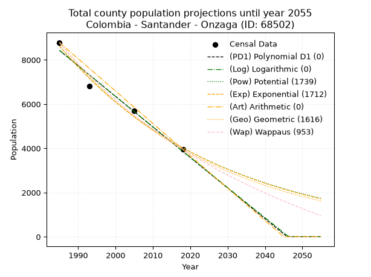
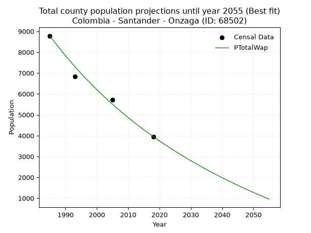
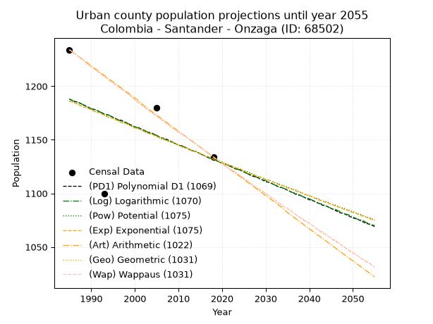
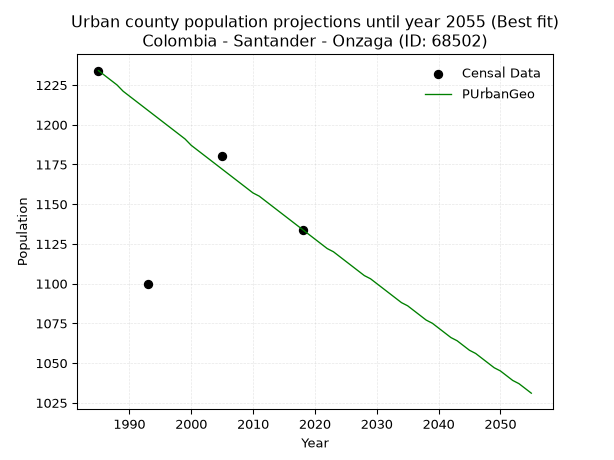
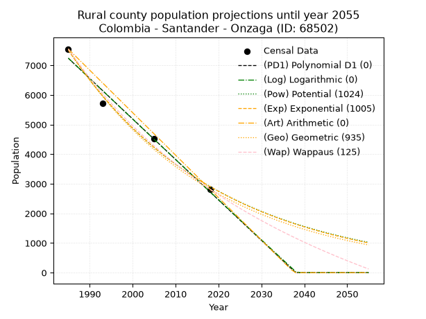
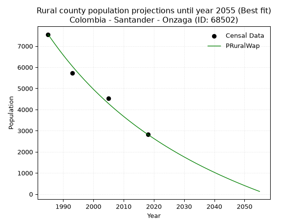

<div align="center">


</div>

# 📜 _“Population and Public Services Demand Projections (PPSD) until Year 2050 for Colombia - Santander - Onzaga (ID: 68502)”_
Keywords: `population` `public-service` `projection` `lineal` `polynomial` `logarithmic` `potential` `exponential` `arithmetic` `geometric` `wappaus` `dane` `colombia` `south-america`

PPSD are analytical estimates used by governments and planners to anticipate future changes in population size, age distribution, and the resulting community needs for utilities, healthcare, education, and infrastructure as sizing future water treatment facilities, electrical grids, and road networks based on spatial growth.

<div align="center">

</img>

</div>


> **General running parameters**: • app_version: _v20260806_. • Python version: _3.14.7_. • Pandas version: _3.0.5_. • NumPy version: _2.5.1_. • Creates, save and include plots into reports (create_plot): _False_. • Projection until year: _2050_. • Process polynomial degree 2 and up: _False_. • Process Wappaus: _True_. • Process Wappaus: _True_. • Set negative values to zero: _True_. • Set infinite values to zero: _True_. • Drop dataset notes: _True_. 
<div align="center">

Maps & GIS Layers: [:earth_americas:Google](http://maps.google.com/maps?q=6.344103773,-72.8167655) [:earth_americas:OSM](https://www.openstreetmap.org/#map=18/6.344103773/-72.8167655&layers=P) [:earth_americas:Bing](https://www.bing.com/maps?cp=6.344103773~-72.8167655&lvl=18) [:earth_americas:Apple](https://maps.apple.com/frame?center=6.344103773%2C-72.8167655&span=0.003%2C0.006) [:earth_americas:GISMobile](https://github.com/rcfdtools/R.GISMobile/blob/main/file/gis/CountyLayer_CO/Readme.md)

</div>


<div align="center">

```geojson
{
  "type": "Feature",
  "geometry": {
    "type": "Point", 
    "coordinates": [-72.8167655, 6.344103773]
  }, 
  "properties": {
    "Name": "Colombia - Santander - Onzaga (ID: 68502)"
  }
}
```

</div>


## 0. Census Data (4 records)

Census data are official statistics collected by a government about the people and housing in a country. They usually include counts of total population, age, sex, race, income, education, and jobs.

📅Global census file: [Population.xlsx](../data/Population.xlsx)

| Source   |   Year |   CountryID | CountryName   |   StateID | StateName   |   CountyID | CountyName   |   PTotal |   PUrban |   PRural |
|:---------|-------:|------------:|:--------------|----------:|:------------|-----------:|:-------------|---------:|---------:|---------:|
| DANE     |   1985 |          57 | Colombia      |        68 | Santander   |      68502 | Onzaga       |     8786 |     1234 |     7552 |
| DANE     |   1993 |          57 | Colombia      |        68 | Santander   |      68502 | Onzaga       |     6824 |     1100 |     5724 |
| DANE     |   2005 |          57 | Colombia      |        68 | Santander   |      68502 | Onzaga       |     5707 |     1180 |     4527 |
| DANE     |   2018 |          57 | Colombia      |        68 | Santander   |      68502 | Onzaga       |     3955 |     1134 |     2821 |

> 🔥Some records could had specific notes about the registered values or the corresponding urban or rural distribution.

📅[SUI-RUPS](https://www.datos.gov.co/Hacienda-y-Cr-dito-P-blico/Registro-nico-de-Prestadores-de-Servicios-P-blicos/4qkq-csdn/about_data) - Local public utility companies: [RUPS.csv](../data/RUPS.csv)

 | SERVICIO       | ESTADO    | NOMBRE   | NIT         | DEPARTAMENTO_DOMICILIO   | MUNICIPIO_DOMICILIO   | DIRECCION   |   TELEFONO | EMAIL                 | TIPO_PRESTADOR          | CLASIFICACION                 |
|:---------------|:----------|:---------|:------------|:-------------------------|:----------------------|:------------|-----------:|:----------------------|:------------------------|:------------------------------|
| ACUEDUCTO      | OPERATIVA | ONZAGUA  | 900362038-7 | SANTANDER                | ONZAGA                | K 3A 3 - 13 |    7217779 | onzagua10@hotmail.com | ORGANIZACION AUTORIZADA | MENOR O IGUAL A 2500 USUARIOS |
| ALCANTARILLADO | OPERATIVA | ONZAGUA  | 900362038-7 | SANTANDER                | ONZAGA                | K 3A 3 - 13 |    7217779 | onzagua10@hotmail.com | ORGANIZACION AUTORIZADA | MENOR O IGUAL A 2500 USUARIOS |

## 1. Total

### 1.1. Coefficients and Parameters

* (PD1) Polynomial Deg 1: -138.3396226415083, 283031.83018867695 (lineal)
* (Log) Logarithmic: -276973.8895084694, 2111598.7536833305
* (Pow) Potential: -46.23344309344609, 156.40294800904783
* (Exp) Exponential: -0.0230991014645245, 7.062829192145354e+23
* (Art) Arithmetic: Year diff. 2018 - 1985 = 33, Population diff. 3955 - 8786 = -4831, Annual growth = -146.3939393939394
* (Geo) Geometric: Year diff. 2018 - 1985 = 33, Population diff. 3955 - 8786 = -4831, Annual growth % = -0.023897073585514073
* (Wap) Wappaus: i = -2.297997635883202, Condition values only valid for < 200)

<sub>
Wappaus condition values: ['-0.00', '-2.30', '-4.60', '-6.89', '-9.19', '-11.49', '-13.79', '-16.09', '-18.38', '-20.68', '-22.98', '-25.28', '-27.58', '-29.87', '-32.17', '-34.47', '-36.77', '-39.07', '-41.36', '-43.66', '-45.96', '-48.26', '-50.56', '-52.85', '-55.15', '-57.45', '-59.75', '-62.05', '-64.34', '-66.64', '-68.94', '-71.24', '-73.54', '-75.83', '-78.13', '-80.43', '-82.73', '-85.03', '-87.32', '-89.62', '-91.92', '-94.22', '-96.52', '-98.81', '-101.11', '-103.41', '-105.71', '-108.01', '-110.30', '-112.60', '-114.90', '-117.20', '-119.50', '-121.79', '-124.09', '-126.39', '-128.69', '-130.99', '-133.28', '-135.58', '-137.88', '-140.18', '-142.48', '-144.77', '-147.07', '-149.37']
</sub>


### 1.2. Projected Dataset

|   Year |   CountyID |   PTotalPD1 |   PTotalLog |   PTotalPow |   PTotalExp |   PTotalArt |   PTotalGeo |   PTotalWap |
|-------:|-----------:|------------:|------------:|------------:|------------:|------------:|------------:|------------:|
|   1985 |      68502 |        8428 |        8432 |        8632 |        8626 |        8786 |        8786 |        8786 |
|   1986 |      68502 |        8289 |        8293 |        8434 |        8429 |        8640 |        8576 |        8586 |
|   1987 |      68502 |        8151 |        8153 |        8240 |        8237 |        8493 |        8371 |        8391 |
|   1988 |      68502 |        8013 |        8014 |        8050 |        8049 |        8347 |        8171 |        8200 |
|   1989 |      68502 |        7874 |        7875 |        7865 |        7865 |        8200 |        7976 |        8014 |
|   1990 |      68502 |        7736 |        7736 |        7684 |        7686 |        8054 |        7785 |        7831 |
|   1991 |      68502 |        7598 |        7596 |        7508 |        7510 |        7908 |        7599 |        7653 |
|   1992 |      68502 |        7459 |        7457 |        7336 |        7339 |        7761 |        7418 |        7478 |
|   1993 |      68502 |        7321 |        7318 |        7167 |        7171 |        7615 |        7240 |        7307 |
|   1994 |      68502 |        7183 |        7179 |        7003 |        7007 |        7468 |        7067 |        7139 |
|   1995 |      68502 |        7044 |        7041 |        6843 |        6847 |        7322 |        6898 |        6975 |
|   1996 |      68502 |        6906 |        6902 |        6686 |        6691 |        7176 |        6734 |        6814 |
|   1997 |      68502 |        6768 |        6763 |        6533 |        6538 |        7029 |        6573 |        6657 |
|   1998 |      68502 |        6629 |        6624 |        6383 |        6389 |        6883 |        6416 |        6502 |
|   1999 |      68502 |        6491 |        6486 |        6237 |        6243 |        6736 |        6262 |        6351 |
|   2000 |      68502 |        6353 |        6347 |        6095 |        6100 |        6590 |        6113 |        6203 |
|   2001 |      68502 |        6214 |        6209 |        5956 |        5961 |        6444 |        5967 |        6057 |
|   2002 |      68502 |        6076 |        6070 |        5820 |        5825 |        6297 |        5824 |        5915 |
|   2003 |      68502 |        5938 |        5932 |        5687 |        5692 |        6151 |        5685 |        5775 |
|   2004 |      68502 |        5799 |        5794 |        5557 |        5562 |        6005 |        5549 |        5637 |
|   2005 |      68502 |        5661 |        5656 |        5430 |        5435 |        5858 |        5416 |        5503 |
|   2006 |      68502 |        5523 |        5518 |        5307 |        5311 |        5712 |        5287 |        5370 |
|   2007 |      68502 |        5384 |        5380 |        5186 |        5190 |        5565 |        5161 |        5240 |
|   2008 |      68502 |        5246 |        5242 |        5068 |        5071 |        5419 |        5037 |        5113 |
|   2009 |      68502 |        5108 |        5104 |        4952 |        4955 |        5273 |        4917 |        4988 |
|   2010 |      68502 |        4969 |        4966 |        4840 |        4842 |        5126 |        4799 |        4865 |
|   2011 |      68502 |        4831 |        4828 |        4730 |        4732 |        4980 |        4685 |        4744 |
|   2012 |      68502 |        4693 |        4690 |        4622 |        4624 |        4833 |        4573 |        4625 |
|   2013 |      68502 |        4554 |        4553 |        4517 |        4518 |        4687 |        4463 |        4509 |
|   2014 |      68502 |        4416 |        4415 |        4415 |        4415 |        4541 |        4357 |        4394 |
|   2015 |      68502 |        4277 |        4278 |        4315 |        4314 |        4394 |        4253 |        4282 |
|   2016 |      68502 |        4139 |        4140 |        4217 |        4215 |        4248 |        4151 |        4171 |
|   2017 |      68502 |        4001 |        4003 |        4121 |        4119 |        4101 |        4052 |        4062 |
|   2018 |      68502 |        3862 |        3866 |        4028 |        4025 |        3955 |        3955 |        3955 |
|   2019 |      68502 |        3724 |        3728 |        3937 |        3933 |        3809 |        3860 |        3850 |
|   2020 |      68502 |        3586 |        3591 |        3847 |        3843 |        3662 |        3768 |        3746 |
|   2021 |      68502 |        3447 |        3454 |        3760 |        3756 |        3516 |        3678 |        3644 |
|   2022 |      68502 |        3309 |        3317 |        3675 |        3670 |        3369 |        3590 |        3544 |
|   2023 |      68502 |        3171 |        3180 |        3592 |        3586 |        3223 |        3504 |        3445 |
|   2024 |      68502 |        3032 |        3043 |        3511 |        3504 |        3077 |        3421 |        3348 |
|   2025 |      68502 |        2894 |        2907 |        3432 |        3424 |        2930 |        3339 |        3253 |
|   2026 |      68502 |        2756 |        2770 |        3354 |        3346 |        2784 |        3259 |        3159 |
|   2027 |      68502 |        2617 |        2633 |        3279 |        3270 |        2637 |        3181 |        3066 |
|   2028 |      68502 |        2479 |        2496 |        3205 |        3195 |        2491 |        3105 |        2975 |
|   2029 |      68502 |        2341 |        2360 |        3133 |        3122 |        2345 |        3031 |        2885 |
|   2030 |      68502 |        2202 |        2223 |        3062 |        3051 |        2198 |        2959 |        2797 |
|   2031 |      68502 |        2064 |        2087 |        2993 |        2981 |        2052 |        2888 |        2710 |
|   2032 |      68502 |        1926 |        1951 |        2926 |        2913 |        1905 |        2819 |        2624 |
|   2033 |      68502 |        1787 |        1814 |        2860 |        2846 |        1759 |        2752 |        2540 |
|   2034 |      68502 |        1649 |        1678 |        2796 |        2781 |        1613 |        2686 |        2456 |
|   2035 |      68502 |        1511 |        1542 |        2733 |        2718 |        1466 |        2622 |        2374 |
|   2036 |      68502 |        1372 |        1406 |        2672 |        2656 |        1320 |        2559 |        2294 |
|   2037 |      68502 |        1234 |        1270 |        2612 |        2595 |        1174 |        2498 |        2214 |
|   2038 |      68502 |        1096 |        1134 |        2553 |        2536 |        1027 |        2438 |        2135 |
|   2039 |      68502 |         957 |         998 |        2496 |        2478 |         881 |        2380 |        2058 |
|   2040 |      68502 |         819 |         862 |        2440 |        2421 |         734 |        2323 |        1981 |
|   2041 |      68502 |         681 |         727 |        2385 |        2366 |         588 |        2267 |        1906 |
|   2042 |      68502 |         542 |         591 |        2332 |        2312 |         442 |        2213 |        1832 |
|   2043 |      68502 |         404 |         455 |        2280 |        2259 |         295 |        2160 |        1759 |
|   2044 |      68502 |         266 |         320 |        2229 |        2208 |         149 |        2109 |        1687 |
|   2045 |      68502 |         127 |         184 |        2179 |        2157 |           2 |        2058 |        1615 |
|   2046 |      68502 |           0 |          49 |        2130 |        2108 |           0 |        2009 |        1545 |
|   2047 |      68502 |           0 |           0 |        2082 |        2060 |           0 |        1961 |        1476 |
|   2048 |      68502 |           0 |           0 |        2036 |        2013 |           0 |        1914 |        1407 |
|   2049 |      68502 |           0 |           0 |        1990 |        1967 |           0 |        1869 |        1340 |
|   2050 |      68502 |           0 |           0 |        1946 |        1922 |           0 |        1824 |        1273 |
<div align="center">

</img>

</div>


### 1.3. Best fit with absolute and relative error (%)

Relative error puts that difference into context by dividing the absolute error by the true value, creating a unitless ratio or percentage that shows the scale of the mistake.

Absolute and relative error

|   Year | Source   |   CountryID | CountryName   |   StateID | StateName   |   CountyID_x | CountyName   |   PTotal |   PUrban |   PRural |   CountyID_y |   PTotalPD1 |   PTotalLog |   PTotalPow |   PTotalExp |   PTotalArt |   PTotalGeo |   PTotalWap |   PTotalPD1AbsError |   PTotalLogAbsError |   PTotalPowAbsError |   PTotalExpAbsError |   PTotalArtAbsError |   PTotalGeoAbsError |   PTotalWapAbsError |   PTotalPD1RelError |   PTotalLogRelError |   PTotalPowRelError |   PTotalExpRelError |   PTotalArtRelError |   PTotalGeoRelError |   PTotalWapRelError |
|-------:|:---------|------------:|:--------------|----------:|:------------|-------------:|:-------------|---------:|---------:|---------:|-------------:|------------:|------------:|------------:|------------:|------------:|------------:|------------:|--------------------:|--------------------:|--------------------:|--------------------:|--------------------:|--------------------:|--------------------:|--------------------:|--------------------:|--------------------:|--------------------:|--------------------:|--------------------:|--------------------:|
|   1985 | DANE     |          57 | Colombia      |        68 | Santander   |        68502 | Onzaga       |     8786 |     1234 |     7552 |        68502 |        8428 |        8432 |        8632 |        8626 |        8786 |        8786 |        8786 |                 358 |                 354 |                 154 |                 160 |                   0 |                   0 |                   0 |            4.07466  |            4.02914  |             1.75279 |             1.82108 |             0       |             0       |             0       |
|   1993 | DANE     |          57 | Colombia      |        68 | Santander   |        68502 | Onzaga       |     6824 |     1100 |     5724 |        68502 |        7321 |        7318 |        7167 |        7171 |        7615 |        7240 |        7307 |                 497 |                 494 |                 343 |                 347 |                 791 |                 416 |                 483 |            7.28312  |            7.23916  |             5.02638 |             5.08499 |            11.5914  |             6.09613 |             7.07796 |
|   2005 | DANE     |          57 | Colombia      |        68 | Santander   |        68502 | Onzaga       |     5707 |     1180 |     4527 |        68502 |        5661 |        5656 |        5430 |        5435 |        5858 |        5416 |        5503 |                  46 |                  51 |                 277 |                 272 |                 151 |                 291 |                 204 |            0.806028 |            0.893639 |             4.85369 |             4.76608 |             2.64587 |             5.099   |             3.57456 |
|   2018 | DANE     |          57 | Colombia      |        68 | Santander   |        68502 | Onzaga       |     3955 |     1134 |     2821 |        68502 |        3862 |        3866 |        4028 |        4025 |        3955 |        3955 |        3955 |                  93 |                  89 |                  73 |                  70 |                   0 |                   0 |                   0 |            2.35145  |            2.25032  |             1.84576 |             1.76991 |             0       |             0       |             0       |

Relative error mean

| Method    |   RelError | Best   |
|:----------|-----------:|:-------|
| PTotalPD1 |    3.62882 |        |
| PTotalLog |    3.60306 |        |
| PTotalPow |    3.36965 |        |
| PTotalExp |    3.36052 |        |
| PTotalArt |    3.55933 |        |
| PTotalGeo |    2.79878 |        |
| PTotalWap |    2.66313 | True   |

💙Best method: _**PTotalWap**_
<div align="center">

</img>

</div>


### 1.4. Fresh water supply demand in liters per capita per day (lpcd)

The fresh water supply demand typically ranges from 100 to 300 liters per capita per day (lpcd) for standard domestic and municipal planning, though absolute survival minimums set by the World Health Organization are as low as 7.5 to 20 liters per day, and total consumption in high-income nations can exceed 400 liters.

> `CZ`: Level in meters above the sea level (masl)<br> `WS`: Fresh water supply demand in liters per capita per day (lpcd or l/h/d)<br> `WSAll`: Zonal fresh water supply demand in liters per second (l/s)<br> `A`: Zonal area in square meters<br> `DP`: Population density (people/hectare or p/ha)

Reference values (RAS Colombia)

|    CZ |   WS |
|------:|-----:|
|  1000 |  120 |
|  2000 |  130 |
| 99999 |  140 |

County shapefile geometry properties and water supply values

|   CountyID |      ATotal |   CZTotal |   WSTotal |
|-----------:|------------:|----------:|----------:|
|      68502 | 4.88214e+08 |   2704.36 |       140 |

Projected values for best method: PTotalWap

|   CountyID |   Year |   PTotalWap |   DPTotal |   WSTotal |   WSTotalAll |
|-----------:|-------:|------------:|----------:|----------:|-------------:|
|      68502 |   1985 |        8786 |      0.18 |       140 |     14.2366  |
|      68502 |   1986 |        8586 |      0.18 |       140 |     13.9125  |
|      68502 |   1987 |        8391 |      0.17 |       140 |     13.5965  |
|      68502 |   1988 |        8200 |      0.17 |       140 |     13.287   |
|      68502 |   1989 |        8014 |      0.16 |       140 |     12.9856  |
|      68502 |   1990 |        7831 |      0.16 |       140 |     12.6891  |
|      68502 |   1991 |        7653 |      0.16 |       140 |     12.4007  |
|      68502 |   1992 |        7478 |      0.15 |       140 |     12.1171  |
|      68502 |   1993 |        7307 |      0.15 |       140 |     11.84    |
|      68502 |   1994 |        7139 |      0.15 |       140 |     11.5678  |
|      68502 |   1995 |        6975 |      0.14 |       140 |     11.3021  |
|      68502 |   1996 |        6814 |      0.14 |       140 |     11.0412  |
|      68502 |   1997 |        6657 |      0.14 |       140 |     10.7868  |
|      68502 |   1998 |        6502 |      0.13 |       140 |     10.5356  |
|      68502 |   1999 |        6351 |      0.13 |       140 |     10.291   |
|      68502 |   2000 |        6203 |      0.13 |       140 |     10.0512  |
|      68502 |   2001 |        6057 |      0.12 |       140 |      9.81458 |
|      68502 |   2002 |        5915 |      0.12 |       140 |      9.58449 |
|      68502 |   2003 |        5775 |      0.12 |       140 |      9.35764 |
|      68502 |   2004 |        5637 |      0.12 |       140 |      9.13403 |
|      68502 |   2005 |        5503 |      0.11 |       140 |      8.9169  |
|      68502 |   2006 |        5370 |      0.11 |       140 |      8.70139 |
|      68502 |   2007 |        5240 |      0.11 |       140 |      8.49074 |
|      68502 |   2008 |        5113 |      0.1  |       140 |      8.28495 |
|      68502 |   2009 |        4988 |      0.1  |       140 |      8.08241 |
|      68502 |   2010 |        4865 |      0.1  |       140 |      7.8831  |
|      68502 |   2011 |        4744 |      0.1  |       140 |      7.68704 |
|      68502 |   2012 |        4625 |      0.09 |       140 |      7.49421 |
|      68502 |   2013 |        4509 |      0.09 |       140 |      7.30625 |
|      68502 |   2014 |        4394 |      0.09 |       140 |      7.11991 |
|      68502 |   2015 |        4282 |      0.09 |       140 |      6.93843 |
|      68502 |   2016 |        4171 |      0.09 |       140 |      6.75856 |
|      68502 |   2017 |        4062 |      0.08 |       140 |      6.58194 |
|      68502 |   2018 |        3955 |      0.08 |       140 |      6.40856 |
|      68502 |   2019 |        3850 |      0.08 |       140 |      6.23843 |
|      68502 |   2020 |        3746 |      0.08 |       140 |      6.06991 |
|      68502 |   2021 |        3644 |      0.07 |       140 |      5.90463 |
|      68502 |   2022 |        3544 |      0.07 |       140 |      5.74259 |
|      68502 |   2023 |        3445 |      0.07 |       140 |      5.58218 |
|      68502 |   2024 |        3348 |      0.07 |       140 |      5.425   |
|      68502 |   2025 |        3253 |      0.07 |       140 |      5.27106 |
|      68502 |   2026 |        3159 |      0.06 |       140 |      5.11875 |
|      68502 |   2027 |        3066 |      0.06 |       140 |      4.96806 |
|      68502 |   2028 |        2975 |      0.06 |       140 |      4.8206  |
|      68502 |   2029 |        2885 |      0.06 |       140 |      4.67477 |
|      68502 |   2030 |        2797 |      0.06 |       140 |      4.53218 |
|      68502 |   2031 |        2710 |      0.06 |       140 |      4.3912  |
|      68502 |   2032 |        2624 |      0.05 |       140 |      4.25185 |
|      68502 |   2033 |        2540 |      0.05 |       140 |      4.11574 |
|      68502 |   2034 |        2456 |      0.05 |       140 |      3.97963 |
|      68502 |   2035 |        2374 |      0.05 |       140 |      3.84676 |
|      68502 |   2036 |        2294 |      0.05 |       140 |      3.71713 |
|      68502 |   2037 |        2214 |      0.05 |       140 |      3.5875  |
|      68502 |   2038 |        2135 |      0.04 |       140 |      3.45949 |
|      68502 |   2039 |        2058 |      0.04 |       140 |      3.33472 |
|      68502 |   2040 |        1981 |      0.04 |       140 |      3.20995 |
|      68502 |   2041 |        1906 |      0.04 |       140 |      3.08843 |
|      68502 |   2042 |        1832 |      0.04 |       140 |      2.96852 |
|      68502 |   2043 |        1759 |      0.04 |       140 |      2.85023 |
|      68502 |   2044 |        1687 |      0.03 |       140 |      2.73356 |
|      68502 |   2045 |        1615 |      0.03 |       140 |      2.6169  |
|      68502 |   2046 |        1545 |      0.03 |       140 |      2.50347 |
|      68502 |   2047 |        1476 |      0.03 |       140 |      2.39167 |
|      68502 |   2048 |        1407 |      0.03 |       140 |      2.27986 |
|      68502 |   2049 |        1340 |      0.03 |       140 |      2.1713  |
|      68502 |   2050 |        1273 |      0.03 |       140 |      2.06273 |

## 2. Urban

### 2.1. Coefficients and Parameters

* (PD1) Polynomial Deg 1: -1.7021276595744417, 4566.6808510637775 (lineal)
* (Log) Logarithmic: -3413.547546947385, 27108.40225880037
* (Pow) Potential: -2.831425324375881, 12.411550449711584
* (Exp) Exponential: -0.001411803195917986, 19553.778274914435
* (Art) Arithmetic: Year diff. 2018 - 1985 = 33, Population diff. 1134 - 1234 = -100, Annual growth = -3.0303030303030303
* (Geo) Geometric: Year diff. 2018 - 1985 = 33, Population diff. 1134 - 1234 = -100, Annual growth % = -0.0025576243028363477
* (Wap) Wappaus: i = -0.2559377559377559, Condition values only valid for < 200)

<sub>
Wappaus condition values: ['-0.00', '-0.26', '-0.51', '-0.77', '-1.02', '-1.28', '-1.54', '-1.79', '-2.05', '-2.30', '-2.56', '-2.82', '-3.07', '-3.33', '-3.58', '-3.84', '-4.10', '-4.35', '-4.61', '-4.86', '-5.12', '-5.37', '-5.63', '-5.89', '-6.14', '-6.40', '-6.65', '-6.91', '-7.17', '-7.42', '-7.68', '-7.93', '-8.19', '-8.45', '-8.70', '-8.96', '-9.21', '-9.47', '-9.73', '-9.98', '-10.24', '-10.49', '-10.75', '-11.01', '-11.26', '-11.52', '-11.77', '-12.03', '-12.29', '-12.54', '-12.80', '-13.05', '-13.31', '-13.56', '-13.82', '-14.08', '-14.33', '-14.59', '-14.84', '-15.10', '-15.36', '-15.61', '-15.87', '-16.12', '-16.38', '-16.64']
</sub>


### 2.2. Projected Dataset

|   Year |   CountyID |   PUrbanPD1 |   PUrbanLog |   PUrbanPow |   PUrbanExp |   PUrbanArt |   PUrbanGeo |   PUrbanWap |
|-------:|-----------:|------------:|------------:|------------:|------------:|------------:|------------:|------------:|
|   1985 |      68502 |        1188 |        1188 |        1186 |        1186 |        1234 |        1234 |        1234 |
|   1986 |      68502 |        1186 |        1186 |        1185 |        1185 |        1231 |        1231 |        1231 |
|   1987 |      68502 |        1185 |        1185 |        1183 |        1183 |        1228 |        1228 |        1228 |
|   1988 |      68502 |        1183 |        1183 |        1181 |        1181 |        1225 |        1225 |        1225 |
|   1989 |      68502 |        1181 |        1181 |        1180 |        1180 |        1222 |        1221 |        1221 |
|   1990 |      68502 |        1179 |        1179 |        1178 |        1178 |        1219 |        1218 |        1218 |
|   1991 |      68502 |        1178 |        1178 |        1176 |        1176 |        1216 |        1215 |        1215 |
|   1992 |      68502 |        1176 |        1176 |        1175 |        1175 |        1213 |        1212 |        1212 |
|   1993 |      68502 |        1174 |        1174 |        1173 |        1173 |        1210 |        1209 |        1209 |
|   1994 |      68502 |        1173 |        1173 |        1171 |        1171 |        1207 |        1206 |        1206 |
|   1995 |      68502 |        1171 |        1171 |        1170 |        1170 |        1204 |        1203 |        1203 |
|   1996 |      68502 |        1169 |        1169 |        1168 |        1168 |        1201 |        1200 |        1200 |
|   1997 |      68502 |        1168 |        1167 |        1166 |        1166 |        1198 |        1197 |        1197 |
|   1998 |      68502 |        1166 |        1166 |        1165 |        1165 |        1195 |        1194 |        1194 |
|   1999 |      68502 |        1164 |        1164 |        1163 |        1163 |        1192 |        1191 |        1191 |
|   2000 |      68502 |        1162 |        1162 |        1161 |        1161 |        1189 |        1187 |        1188 |
|   2001 |      68502 |        1161 |        1161 |        1160 |        1160 |        1186 |        1184 |        1184 |
|   2002 |      68502 |        1159 |        1159 |        1158 |        1158 |        1182 |        1181 |        1181 |
|   2003 |      68502 |        1157 |        1157 |        1156 |        1156 |        1179 |        1178 |        1178 |
|   2004 |      68502 |        1156 |        1156 |        1155 |        1155 |        1176 |        1175 |        1175 |
|   2005 |      68502 |        1154 |        1154 |        1153 |        1153 |        1173 |        1172 |        1172 |
|   2006 |      68502 |        1152 |        1152 |        1151 |        1152 |        1170 |        1169 |        1169 |
|   2007 |      68502 |        1151 |        1150 |        1150 |        1150 |        1167 |        1166 |        1166 |
|   2008 |      68502 |        1149 |        1149 |        1148 |        1148 |        1164 |        1163 |        1163 |
|   2009 |      68502 |        1147 |        1147 |        1147 |        1147 |        1161 |        1160 |        1160 |
|   2010 |      68502 |        1145 |        1145 |        1145 |        1145 |        1158 |        1157 |        1157 |
|   2011 |      68502 |        1144 |        1144 |        1143 |        1143 |        1155 |        1155 |        1155 |
|   2012 |      68502 |        1142 |        1142 |        1142 |        1142 |        1152 |        1152 |        1152 |
|   2013 |      68502 |        1140 |        1140 |        1140 |        1140 |        1149 |        1149 |        1149 |
|   2014 |      68502 |        1139 |        1139 |        1139 |        1139 |        1146 |        1146 |        1146 |
|   2015 |      68502 |        1137 |        1137 |        1137 |        1137 |        1143 |        1143 |        1143 |
|   2016 |      68502 |        1135 |        1135 |        1135 |        1135 |        1140 |        1140 |        1140 |
|   2017 |      68502 |        1133 |        1133 |        1134 |        1134 |        1137 |        1137 |        1137 |
|   2018 |      68502 |        1132 |        1132 |        1132 |        1132 |        1134 |        1134 |        1134 |
|   2019 |      68502 |        1130 |        1130 |        1131 |        1131 |        1131 |        1131 |        1131 |
|   2020 |      68502 |        1128 |        1128 |        1129 |        1129 |        1128 |        1128 |        1128 |
|   2021 |      68502 |        1127 |        1127 |        1127 |        1127 |        1125 |        1125 |        1125 |
|   2022 |      68502 |        1125 |        1125 |        1126 |        1126 |        1122 |        1122 |        1122 |
|   2023 |      68502 |        1123 |        1123 |        1124 |        1124 |        1119 |        1120 |        1120 |
|   2024 |      68502 |        1122 |        1122 |        1123 |        1123 |        1116 |        1117 |        1117 |
|   2025 |      68502 |        1120 |        1120 |        1121 |        1121 |        1113 |        1114 |        1114 |
|   2026 |      68502 |        1118 |        1118 |        1120 |        1119 |        1110 |        1111 |        1111 |
|   2027 |      68502 |        1116 |        1117 |        1118 |        1118 |        1107 |        1108 |        1108 |
|   2028 |      68502 |        1115 |        1115 |        1116 |        1116 |        1104 |        1105 |        1105 |
|   2029 |      68502 |        1113 |        1113 |        1115 |        1115 |        1101 |        1103 |        1102 |
|   2030 |      68502 |        1111 |        1112 |        1113 |        1113 |        1098 |        1100 |        1100 |
|   2031 |      68502 |        1110 |        1110 |        1112 |        1112 |        1095 |        1097 |        1097 |
|   2032 |      68502 |        1108 |        1108 |        1110 |        1110 |        1092 |        1094 |        1094 |
|   2033 |      68502 |        1106 |        1106 |        1109 |        1108 |        1089 |        1091 |        1091 |
|   2034 |      68502 |        1105 |        1105 |        1107 |        1107 |        1086 |        1088 |        1088 |
|   2035 |      68502 |        1103 |        1103 |        1106 |        1105 |        1082 |        1086 |        1086 |
|   2036 |      68502 |        1101 |        1101 |        1104 |        1104 |        1079 |        1083 |        1083 |
|   2037 |      68502 |        1099 |        1100 |        1103 |        1102 |        1076 |        1080 |        1080 |
|   2038 |      68502 |        1098 |        1098 |        1101 |        1101 |        1073 |        1077 |        1077 |
|   2039 |      68502 |        1096 |        1096 |        1099 |        1099 |        1070 |        1075 |        1074 |
|   2040 |      68502 |        1094 |        1095 |        1098 |        1098 |        1067 |        1072 |        1072 |
|   2041 |      68502 |        1093 |        1093 |        1096 |        1096 |        1064 |        1069 |        1069 |
|   2042 |      68502 |        1091 |        1091 |        1095 |        1094 |        1061 |        1066 |        1066 |
|   2043 |      68502 |        1089 |        1090 |        1093 |        1093 |        1058 |        1064 |        1063 |
|   2044 |      68502 |        1088 |        1088 |        1092 |        1091 |        1055 |        1061 |        1061 |
|   2045 |      68502 |        1086 |        1086 |        1090 |        1090 |        1052 |        1058 |        1058 |
|   2046 |      68502 |        1084 |        1085 |        1089 |        1088 |        1049 |        1056 |        1055 |
|   2047 |      68502 |        1082 |        1083 |        1087 |        1087 |        1046 |        1053 |        1053 |
|   2048 |      68502 |        1081 |        1081 |        1086 |        1085 |        1043 |        1050 |        1050 |
|   2049 |      68502 |        1079 |        1080 |        1084 |        1084 |        1040 |        1047 |        1047 |
|   2050 |      68502 |        1077 |        1078 |        1083 |        1082 |        1037 |        1045 |        1044 |
<div align="center">

</img>

</div>


### 2.3. Best fit with absolute and relative error (%)

Relative error puts that difference into context by dividing the absolute error by the true value, creating a unitless ratio or percentage that shows the scale of the mistake.

Absolute and relative error

|   Year | Source   |   CountryID | CountryName   |   StateID | StateName   |   CountyID_x | CountyName   |   PTotal |   PUrban |   PRural |   CountyID_y |   PUrbanPD1 |   PUrbanLog |   PUrbanPow |   PUrbanExp |   PUrbanArt |   PUrbanGeo |   PUrbanWap |   PUrbanPD1AbsError |   PUrbanLogAbsError |   PUrbanPowAbsError |   PUrbanExpAbsError |   PUrbanArtAbsError |   PUrbanGeoAbsError |   PUrbanWapAbsError |   PUrbanPD1RelError |   PUrbanLogRelError |   PUrbanPowRelError |   PUrbanExpRelError |   PUrbanArtRelError |   PUrbanGeoRelError |   PUrbanWapRelError |
|-------:|:---------|------------:|:--------------|----------:|:------------|-------------:|:-------------|---------:|---------:|---------:|-------------:|------------:|------------:|------------:|------------:|------------:|------------:|------------:|--------------------:|--------------------:|--------------------:|--------------------:|--------------------:|--------------------:|--------------------:|--------------------:|--------------------:|--------------------:|--------------------:|--------------------:|--------------------:|--------------------:|
|   1985 | DANE     |          57 | Colombia      |        68 | Santander   |        68502 | Onzaga       |     8786 |     1234 |     7552 |        68502 |        1188 |        1188 |        1186 |        1186 |        1234 |        1234 |        1234 |                  46 |                  46 |                  48 |                  48 |                   0 |                   0 |                   0 |            3.72771  |            3.72771  |            3.88979  |            3.88979  |             0       |            0        |            0        |
|   1993 | DANE     |          57 | Colombia      |        68 | Santander   |        68502 | Onzaga       |     6824 |     1100 |     5724 |        68502 |        1174 |        1174 |        1173 |        1173 |        1210 |        1209 |        1209 |                  74 |                  74 |                  73 |                  73 |                 110 |                 109 |                 109 |            6.72727  |            6.72727  |            6.63636  |            6.63636  |            10       |            9.90909  |            9.90909  |
|   2005 | DANE     |          57 | Colombia      |        68 | Santander   |        68502 | Onzaga       |     5707 |     1180 |     4527 |        68502 |        1154 |        1154 |        1153 |        1153 |        1173 |        1172 |        1172 |                  26 |                  26 |                  27 |                  27 |                   7 |                   8 |                   8 |            2.20339  |            2.20339  |            2.28814  |            2.28814  |             0.59322 |            0.677966 |            0.677966 |
|   2018 | DANE     |          57 | Colombia      |        68 | Santander   |        68502 | Onzaga       |     3955 |     1134 |     2821 |        68502 |        1132 |        1132 |        1132 |        1132 |        1134 |        1134 |        1134 |                   2 |                   2 |                   2 |                   2 |                   0 |                   0 |                   0 |            0.176367 |            0.176367 |            0.176367 |            0.176367 |             0       |            0        |            0        |

Relative error mean

| Method    |   RelError | Best   |
|:----------|-----------:|:-------|
| PUrbanPD1 |    3.20869 |        |
| PUrbanLog |    3.20869 |        |
| PUrbanPow |    3.24766 |        |
| PUrbanExp |    3.24766 |        |
| PUrbanArt |    2.64831 |        |
| PUrbanGeo |    2.64676 | True   |
| PUrbanWap |    2.64676 | True   |

💙Best method: _**PUrbanGeo**_
<div align="center">

</img>

</div>


### 2.4. Fresh water supply demand in liters per capita per day (lpcd)

The fresh water supply demand typically ranges from 100 to 300 liters per capita per day (lpcd) for standard domestic and municipal planning, though absolute survival minimums set by the World Health Organization are as low as 7.5 to 20 liters per day, and total consumption in high-income nations can exceed 400 liters.

> `CZ`: Level in meters above the sea level (masl)<br> `WS`: Fresh water supply demand in liters per capita per day (lpcd or l/h/d)<br> `WSAll`: Zonal fresh water supply demand in liters per second (l/s)<br> `A`: Zonal area in square meters<br> `DP`: Population density (people/hectare or p/ha)

Reference values (RAS Colombia)

|    CZ |   WS |
|------:|-----:|
|  1000 |  120 |
|  2000 |  130 |
| 99999 |  140 |

County shapefile geometry properties and water supply values

|   CountyID |   AUrban |   CZUrban |   WSUrban |
|-----------:|---------:|----------:|----------:|
|      68502 |   384833 |   1944.95 |       130 |

Projected values for best method: PUrbanGeo

|   CountyID |   Year |   PUrbanGeo |   DPUrban |   WSUrban |   WSUrbanAll |
|-----------:|-------:|------------:|----------:|----------:|-------------:|
|      68502 |   1985 |        1234 |     32.07 |       130 |      1.85671 |
|      68502 |   1986 |        1231 |     31.99 |       130 |      1.8522  |
|      68502 |   1987 |        1228 |     31.91 |       130 |      1.84769 |
|      68502 |   1988 |        1225 |     31.83 |       130 |      1.84317 |
|      68502 |   1989 |        1221 |     31.73 |       130 |      1.83715 |
|      68502 |   1990 |        1218 |     31.65 |       130 |      1.83264 |
|      68502 |   1991 |        1215 |     31.57 |       130 |      1.82812 |
|      68502 |   1992 |        1212 |     31.49 |       130 |      1.82361 |
|      68502 |   1993 |        1209 |     31.42 |       130 |      1.8191  |
|      68502 |   1994 |        1206 |     31.34 |       130 |      1.81458 |
|      68502 |   1995 |        1203 |     31.26 |       130 |      1.81007 |
|      68502 |   1996 |        1200 |     31.18 |       130 |      1.80556 |
|      68502 |   1997 |        1197 |     31.1  |       130 |      1.80104 |
|      68502 |   1998 |        1194 |     31.03 |       130 |      1.79653 |
|      68502 |   1999 |        1191 |     30.95 |       130 |      1.79201 |
|      68502 |   2000 |        1187 |     30.84 |       130 |      1.786   |
|      68502 |   2001 |        1184 |     30.77 |       130 |      1.78148 |
|      68502 |   2002 |        1181 |     30.69 |       130 |      1.77697 |
|      68502 |   2003 |        1178 |     30.61 |       130 |      1.77245 |
|      68502 |   2004 |        1175 |     30.53 |       130 |      1.76794 |
|      68502 |   2005 |        1172 |     30.45 |       130 |      1.76343 |
|      68502 |   2006 |        1169 |     30.38 |       130 |      1.75891 |
|      68502 |   2007 |        1166 |     30.3  |       130 |      1.7544  |
|      68502 |   2008 |        1163 |     30.22 |       130 |      1.74988 |
|      68502 |   2009 |        1160 |     30.14 |       130 |      1.74537 |
|      68502 |   2010 |        1157 |     30.06 |       130 |      1.74086 |
|      68502 |   2011 |        1155 |     30.01 |       130 |      1.73785 |
|      68502 |   2012 |        1152 |     29.94 |       130 |      1.73333 |
|      68502 |   2013 |        1149 |     29.86 |       130 |      1.72882 |
|      68502 |   2014 |        1146 |     29.78 |       130 |      1.72431 |
|      68502 |   2015 |        1143 |     29.7  |       130 |      1.71979 |
|      68502 |   2016 |        1140 |     29.62 |       130 |      1.71528 |
|      68502 |   2017 |        1137 |     29.55 |       130 |      1.71076 |
|      68502 |   2018 |        1134 |     29.47 |       130 |      1.70625 |
|      68502 |   2019 |        1131 |     29.39 |       130 |      1.70174 |
|      68502 |   2020 |        1128 |     29.31 |       130 |      1.69722 |
|      68502 |   2021 |        1125 |     29.23 |       130 |      1.69271 |
|      68502 |   2022 |        1122 |     29.16 |       130 |      1.68819 |
|      68502 |   2023 |        1120 |     29.1  |       130 |      1.68519 |
|      68502 |   2024 |        1117 |     29.03 |       130 |      1.68067 |
|      68502 |   2025 |        1114 |     28.95 |       130 |      1.67616 |
|      68502 |   2026 |        1111 |     28.87 |       130 |      1.67164 |
|      68502 |   2027 |        1108 |     28.79 |       130 |      1.66713 |
|      68502 |   2028 |        1105 |     28.71 |       130 |      1.66262 |
|      68502 |   2029 |        1103 |     28.66 |       130 |      1.65961 |
|      68502 |   2030 |        1100 |     28.58 |       130 |      1.65509 |
|      68502 |   2031 |        1097 |     28.51 |       130 |      1.65058 |
|      68502 |   2032 |        1094 |     28.43 |       130 |      1.64606 |
|      68502 |   2033 |        1091 |     28.35 |       130 |      1.64155 |
|      68502 |   2034 |        1088 |     28.27 |       130 |      1.63704 |
|      68502 |   2035 |        1086 |     28.22 |       130 |      1.63403 |
|      68502 |   2036 |        1083 |     28.14 |       130 |      1.62951 |
|      68502 |   2037 |        1080 |     28.06 |       130 |      1.625   |
|      68502 |   2038 |        1077 |     27.99 |       130 |      1.62049 |
|      68502 |   2039 |        1075 |     27.93 |       130 |      1.61748 |
|      68502 |   2040 |        1072 |     27.86 |       130 |      1.61296 |
|      68502 |   2041 |        1069 |     27.78 |       130 |      1.60845 |
|      68502 |   2042 |        1066 |     27.7  |       130 |      1.60394 |
|      68502 |   2043 |        1064 |     27.65 |       130 |      1.60093 |
|      68502 |   2044 |        1061 |     27.57 |       130 |      1.59641 |
|      68502 |   2045 |        1058 |     27.49 |       130 |      1.5919  |
|      68502 |   2046 |        1056 |     27.44 |       130 |      1.58889 |
|      68502 |   2047 |        1053 |     27.36 |       130 |      1.58438 |
|      68502 |   2048 |        1050 |     27.28 |       130 |      1.57986 |
|      68502 |   2049 |        1047 |     27.21 |       130 |      1.57535 |
|      68502 |   2050 |        1045 |     27.15 |       130 |      1.57234 |

## 3. Rural

### 3.1. Coefficients and Parameters

* (PD1) Polynomial Deg 1: -136.6374949819338, 278465.1493376131 (lineal)
* (Log) Logarithmic: -273560.341961522, 2084490.3514245304
* (Pow) Potential: -57.52715508939724, 193.5869954431626
* (Exp) Exponential: -0.028744000230643878, 4.522056798446074e+28
* (Art) Arithmetic: Year diff. 2018 - 1985 = 33, Population diff. 2821 - 7552 = -4731, Annual growth = -143.36363636363637
* (Geo) Geometric: Year diff. 2018 - 1985 = 33, Population diff. 2821 - 7552 = -4731, Annual growth % = -0.02939921206247187
* (Wap) Wappaus: i = -2.7641692155333337, Condition values only valid for < 200)

<sub>
Wappaus condition values: ['-0.00', '-2.76', '-5.53', '-8.29', '-11.06', '-13.82', '-16.59', '-19.35', '-22.11', '-24.88', '-27.64', '-30.41', '-33.17', '-35.93', '-38.70', '-41.46', '-44.23', '-46.99', '-49.76', '-52.52', '-55.28', '-58.05', '-60.81', '-63.58', '-66.34', '-69.10', '-71.87', '-74.63', '-77.40', '-80.16', '-82.93', '-85.69', '-88.45', '-91.22', '-93.98', '-96.75', '-99.51', '-102.27', '-105.04', '-107.80', '-110.57', '-113.33', '-116.10', '-118.86', '-121.62', '-124.39', '-127.15', '-129.92', '-132.68', '-135.44', '-138.21', '-140.97', '-143.74', '-146.50', '-149.27', '-152.03', '-154.79', '-157.56', '-160.32', '-163.09', '-165.85', '-168.61', '-171.38', '-174.14', '-176.91', '-179.67']
</sub>


### 3.2. Projected Dataset

|   Year |   CountyID |   PRuralPD1 |   PRuralLog |   PRuralPow |   PRuralExp |   PRuralArt |   PRuralGeo |   PRuralWap |
|-------:|-----------:|------------:|------------:|------------:|------------:|------------:|------------:|------------:|
|   1985 |      68502 |        7240 |        7244 |        7520 |        7514 |        7552 |        7552 |        7552 |
|   1986 |      68502 |        7103 |        7107 |        7305 |        7301 |        7409 |        7330 |        7346 |
|   1987 |      68502 |        6966 |        6969 |        7097 |        7094 |        7265 |        7114 |        7146 |
|   1988 |      68502 |        6830 |        6831 |        6894 |        6893 |        7122 |        6905 |        6951 |
|   1989 |      68502 |        6693 |        6694 |        6698 |        6698 |        6979 |        6702 |        6761 |
|   1990 |      68502 |        6557 |        6556 |        6507 |        6508 |        6835 |        6505 |        6576 |
|   1991 |      68502 |        6420 |        6419 |        6321 |        6324 |        6692 |        6314 |        6395 |
|   1992 |      68502 |        6283 |        6281 |        6141 |        6144 |        6548 |        6128 |        6220 |
|   1993 |      68502 |        6147 |        6144 |        5967 |        5970 |        6405 |        5948 |        6048 |
|   1994 |      68502 |        6010 |        6007 |        5797 |        5801 |        6262 |        5773 |        5881 |
|   1995 |      68502 |        5873 |        5870 |        5632 |        5637 |        6118 |        5604 |        5718 |
|   1996 |      68502 |        5737 |        5733 |        5472 |        5477 |        5975 |        5439 |        5559 |
|   1997 |      68502 |        5600 |        5596 |        5317 |        5322 |        5832 |        5279 |        5403 |
|   1998 |      68502 |        5463 |        5459 |        5166 |        5171 |        5688 |        5124 |        5252 |
|   1999 |      68502 |        5327 |        5322 |        5019 |        5025 |        5545 |        4973 |        5103 |
|   2000 |      68502 |        5190 |        5185 |        4877 |        4882 |        5402 |        4827 |        4958 |
|   2001 |      68502 |        5054 |        5048 |        4739 |        4744 |        5258 |        4685 |        4817 |
|   2002 |      68502 |        4917 |        4911 |        4604 |        4609 |        5115 |        4547 |        4678 |
|   2003 |      68502 |        4780 |        4775 |        4474 |        4479 |        4971 |        4414 |        4543 |
|   2004 |      68502 |        4644 |        4638 |        4347 |        4352 |        4828 |        4284 |        4411 |
|   2005 |      68502 |        4507 |        4502 |        4224 |        4229 |        4685 |        4158 |        4281 |
|   2006 |      68502 |        4370 |        4365 |        4105 |        4109 |        4541 |        4036 |        4154 |
|   2007 |      68502 |        4234 |        4229 |        3989 |        3992 |        4398 |        3917 |        4030 |
|   2008 |      68502 |        4097 |        4093 |        3876 |        3879 |        4255 |        3802 |        3909 |
|   2009 |      68502 |        3960 |        3957 |        3767 |        3769 |        4111 |        3690 |        3790 |
|   2010 |      68502 |        3824 |        3820 |        3660 |        3663 |        3968 |        3582 |        3673 |
|   2011 |      68502 |        3687 |        3684 |        3557 |        3559 |        3825 |        3476 |        3559 |
|   2012 |      68502 |        3551 |        3548 |        3457 |        3458 |        3681 |        3374 |        3447 |
|   2013 |      68502 |        3414 |        3412 |        3359 |        3360 |        3538 |        3275 |        3338 |
|   2014 |      68502 |        3277 |        3277 |        3265 |        3265 |        3394 |        3179 |        3230 |
|   2015 |      68502 |        3141 |        3141 |        3173 |        3172 |        3251 |        3085 |        3125 |
|   2016 |      68502 |        3004 |        3005 |        3084 |        3082 |        3108 |        2994 |        3022 |
|   2017 |      68502 |        2867 |        2869 |        2997 |        2995 |        2964 |        2906 |        2920 |
|   2018 |      68502 |        2731 |        2734 |        2913 |        2910 |        2821 |        2821 |        2821 |
|   2019 |      68502 |        2594 |        2598 |        2831 |        2828 |        2678 |        2738 |        2723 |
|   2020 |      68502 |        2457 |        2463 |        2751 |        2748 |        2534 |        2658 |        2628 |
|   2021 |      68502 |        2321 |        2327 |        2674 |        2670 |        2391 |        2579 |        2534 |
|   2022 |      68502 |        2184 |        2192 |        2599 |        2594 |        2248 |        2504 |        2442 |
|   2023 |      68502 |        2047 |        2057 |        2526 |        2521 |        2104 |        2430 |        2351 |
|   2024 |      68502 |        1911 |        1922 |        2455 |        2449 |        1961 |        2359 |        2262 |
|   2025 |      68502 |        1774 |        1787 |        2387 |        2380 |        1817 |        2289 |        2175 |
|   2026 |      68502 |        1638 |        1652 |        2320 |        2312 |        1674 |        2222 |        2089 |
|   2027 |      68502 |        1501 |        1517 |        2255 |        2247 |        1531 |        2157 |        2005 |
|   2028 |      68502 |        1364 |        1382 |        2192 |        2183 |        1387 |        2093 |        1922 |
|   2029 |      68502 |        1228 |        1247 |        2130 |        2121 |        1244 |        2032 |        1840 |
|   2030 |      68502 |        1091 |        1112 |        2071 |        2061 |        1101 |        1972 |        1760 |
|   2031 |      68502 |         954 |         977 |        2013 |        2003 |         957 |        1914 |        1682 |
|   2032 |      68502 |         818 |         843 |        1957 |        1946 |         814 |        1858 |        1604 |
|   2033 |      68502 |         681 |         708 |        1902 |        1891 |         671 |        1803 |        1528 |
|   2034 |      68502 |         544 |         573 |        1849 |        1837 |         527 |        1750 |        1453 |
|   2035 |      68502 |         408 |         439 |        1798 |        1785 |         384 |        1699 |        1380 |
|   2036 |      68502 |         271 |         305 |        1748 |        1735 |         240 |        1649 |        1307 |
|   2037 |      68502 |         135 |         170 |        1699 |        1686 |          97 |        1600 |        1236 |
|   2038 |      68502 |           0 |          36 |        1652 |        1638 |           0 |        1553 |        1166 |
|   2039 |      68502 |           0 |           0 |        1606 |        1591 |           0 |        1507 |        1097 |
|   2040 |      68502 |           0 |           0 |        1561 |        1546 |           0 |        1463 |        1029 |
|   2041 |      68502 |           0 |           0 |        1518 |        1502 |           0 |        1420 |         962 |
|   2042 |      68502 |           0 |           0 |        1475 |        1460 |           0 |        1378 |         896 |
|   2043 |      68502 |           0 |           0 |        1434 |        1419 |           0 |        1338 |         832 |
|   2044 |      68502 |           0 |           0 |        1395 |        1378 |           0 |        1299 |         768 |
|   2045 |      68502 |           0 |           0 |        1356 |        1339 |           0 |        1260 |         705 |
|   2046 |      68502 |           0 |           0 |        1318 |        1301 |           0 |        1223 |         643 |
|   2047 |      68502 |           0 |           0 |        1282 |        1264 |           0 |        1187 |         582 |
|   2048 |      68502 |           0 |           0 |        1246 |        1229 |           0 |        1152 |         522 |
|   2049 |      68502 |           0 |           0 |        1212 |        1194 |           0 |        1119 |         463 |
|   2050 |      68502 |           0 |           0 |        1178 |        1160 |           0 |        1086 |         404 |
<div align="center">

</img>

</div>


### 3.3. Best fit with absolute and relative error (%)

Relative error puts that difference into context by dividing the absolute error by the true value, creating a unitless ratio or percentage that shows the scale of the mistake.

Absolute and relative error

|   Year | Source   |   CountryID | CountryName   |   StateID | StateName   |   CountyID_x | CountyName   |   PTotal |   PUrban |   PRural |   CountyID_y |   PRuralPD1 |   PRuralLog |   PRuralPow |   PRuralExp |   PRuralArt |   PRuralGeo |   PRuralWap |   PRuralPD1AbsError |   PRuralLogAbsError |   PRuralPowAbsError |   PRuralExpAbsError |   PRuralArtAbsError |   PRuralGeoAbsError |   PRuralWapAbsError |   PRuralPD1RelError |   PRuralLogRelError |   PRuralPowRelError |   PRuralExpRelError |   PRuralArtRelError |   PRuralGeoRelError |   PRuralWapRelError |
|-------:|:---------|------------:|:--------------|----------:|:------------|-------------:|:-------------|---------:|---------:|---------:|-------------:|------------:|------------:|------------:|------------:|------------:|------------:|------------:|--------------------:|--------------------:|--------------------:|--------------------:|--------------------:|--------------------:|--------------------:|--------------------:|--------------------:|--------------------:|--------------------:|--------------------:|--------------------:|--------------------:|
|   1985 | DANE     |          57 | Colombia      |        68 | Santander   |        68502 | Onzaga       |     8786 |     1234 |     7552 |        68502 |        7240 |        7244 |        7520 |        7514 |        7552 |        7552 |        7552 |                 312 |                 308 |                  32 |                  38 |                   0 |                   0 |                   0 |            4.13136  |            4.07839  |            0.423729 |            0.503178 |             0       |             0       |             0       |
|   1993 | DANE     |          57 | Colombia      |        68 | Santander   |        68502 | Onzaga       |     6824 |     1100 |     5724 |        68502 |        6147 |        6144 |        5967 |        5970 |        6405 |        5948 |        6048 |                 423 |                 420 |                 243 |                 246 |                 681 |                 224 |                 324 |            7.38994  |            7.33753  |            4.24528  |            4.29769  |            11.8973  |             3.91335 |             5.66038 |
|   2005 | DANE     |          57 | Colombia      |        68 | Santander   |        68502 | Onzaga       |     5707 |     1180 |     4527 |        68502 |        4507 |        4502 |        4224 |        4229 |        4685 |        4158 |        4281 |                  20 |                  25 |                 303 |                 298 |                 158 |                 369 |                 246 |            0.441794 |            0.552242 |            6.69317  |            6.58273  |             3.49017 |             8.15109 |             5.43406 |
|   2018 | DANE     |          57 | Colombia      |        68 | Santander   |        68502 | Onzaga       |     3955 |     1134 |     2821 |        68502 |        2731 |        2734 |        2913 |        2910 |        2821 |        2821 |        2821 |                  90 |                  87 |                  92 |                  89 |                   0 |                   0 |                   0 |            3.19036  |            3.08401  |            3.26125  |            3.15491  |             0       |             0       |             0       |

Relative error mean

| Method    |   RelError | Best   |
|:----------|-----------:|:-------|
| PRuralPD1 |    3.78836 |        |
| PRuralLog |    3.76304 |        |
| PRuralPow |    3.65586 |        |
| PRuralExp |    3.63463 |        |
| PRuralArt |    3.84686 |        |
| PRuralGeo |    3.01611 |        |
| PRuralWap |    2.77361 | True   |

💙Best method: _**PRuralWap**_
<div align="center">

</img>

</div>


### 3.4. Fresh water supply demand in liters per capita per day (lpcd)

The fresh water supply demand typically ranges from 100 to 300 liters per capita per day (lpcd) for standard domestic and municipal planning, though absolute survival minimums set by the World Health Organization are as low as 7.5 to 20 liters per day, and total consumption in high-income nations can exceed 400 liters.

> `CZ`: Level in meters above the sea level (masl)<br> `WS`: Fresh water supply demand in liters per capita per day (lpcd or l/h/d)<br> `WSAll`: Zonal fresh water supply demand in liters per second (l/s)<br> `A`: Zonal area in square meters<br> `DP`: Population density (people/hectare or p/ha)

Reference values (RAS Colombia)

|    CZ |   WS |
|------:|-----:|
|  1000 |  120 |
|  2000 |  130 |
| 99999 |  140 |

County shapefile geometry properties and water supply values

|   CountyID |      ARural |   CZRural |   WSRural |
|-----------:|------------:|----------:|----------:|
|      68502 | 4.87829e+08 |   2704.97 |       140 |

Projected values for best method: PRuralWap

|   CountyID |   Year |   PRuralWap |   DPRural |   WSRural |   WSRuralAll |
|-----------:|-------:|------------:|----------:|----------:|-------------:|
|      68502 |   1985 |        7552 |      0.15 |       140 |    12.237    |
|      68502 |   1986 |        7346 |      0.15 |       140 |    11.9032   |
|      68502 |   1987 |        7146 |      0.15 |       140 |    11.5792   |
|      68502 |   1988 |        6951 |      0.14 |       140 |    11.2632   |
|      68502 |   1989 |        6761 |      0.14 |       140 |    10.9553   |
|      68502 |   1990 |        6576 |      0.13 |       140 |    10.6556   |
|      68502 |   1991 |        6395 |      0.13 |       140 |    10.3623   |
|      68502 |   1992 |        6220 |      0.13 |       140 |    10.0787   |
|      68502 |   1993 |        6048 |      0.12 |       140 |     9.8      |
|      68502 |   1994 |        5881 |      0.12 |       140 |     9.5294   |
|      68502 |   1995 |        5718 |      0.12 |       140 |     9.26528  |
|      68502 |   1996 |        5559 |      0.11 |       140 |     9.00764  |
|      68502 |   1997 |        5403 |      0.11 |       140 |     8.75486  |
|      68502 |   1998 |        5252 |      0.11 |       140 |     8.51019  |
|      68502 |   1999 |        5103 |      0.1  |       140 |     8.26875  |
|      68502 |   2000 |        4958 |      0.1  |       140 |     8.0338   |
|      68502 |   2001 |        4817 |      0.1  |       140 |     7.80532  |
|      68502 |   2002 |        4678 |      0.1  |       140 |     7.58009  |
|      68502 |   2003 |        4543 |      0.09 |       140 |     7.36134  |
|      68502 |   2004 |        4411 |      0.09 |       140 |     7.14745  |
|      68502 |   2005 |        4281 |      0.09 |       140 |     6.93681  |
|      68502 |   2006 |        4154 |      0.09 |       140 |     6.73102  |
|      68502 |   2007 |        4030 |      0.08 |       140 |     6.53009  |
|      68502 |   2008 |        3909 |      0.08 |       140 |     6.33403  |
|      68502 |   2009 |        3790 |      0.08 |       140 |     6.1412   |
|      68502 |   2010 |        3673 |      0.08 |       140 |     5.95162  |
|      68502 |   2011 |        3559 |      0.07 |       140 |     5.7669   |
|      68502 |   2012 |        3447 |      0.07 |       140 |     5.58542  |
|      68502 |   2013 |        3338 |      0.07 |       140 |     5.4088   |
|      68502 |   2014 |        3230 |      0.07 |       140 |     5.2338   |
|      68502 |   2015 |        3125 |      0.06 |       140 |     5.06366  |
|      68502 |   2016 |        3022 |      0.06 |       140 |     4.89676  |
|      68502 |   2017 |        2920 |      0.06 |       140 |     4.73148  |
|      68502 |   2018 |        2821 |      0.06 |       140 |     4.57106  |
|      68502 |   2019 |        2723 |      0.06 |       140 |     4.41227  |
|      68502 |   2020 |        2628 |      0.05 |       140 |     4.25833  |
|      68502 |   2021 |        2534 |      0.05 |       140 |     4.10602  |
|      68502 |   2022 |        2442 |      0.05 |       140 |     3.95694  |
|      68502 |   2023 |        2351 |      0.05 |       140 |     3.80949  |
|      68502 |   2024 |        2262 |      0.05 |       140 |     3.66528  |
|      68502 |   2025 |        2175 |      0.04 |       140 |     3.52431  |
|      68502 |   2026 |        2089 |      0.04 |       140 |     3.38495  |
|      68502 |   2027 |        2005 |      0.04 |       140 |     3.24884  |
|      68502 |   2028 |        1922 |      0.04 |       140 |     3.11435  |
|      68502 |   2029 |        1840 |      0.04 |       140 |     2.98148  |
|      68502 |   2030 |        1760 |      0.04 |       140 |     2.85185  |
|      68502 |   2031 |        1682 |      0.03 |       140 |     2.72546  |
|      68502 |   2032 |        1604 |      0.03 |       140 |     2.59907  |
|      68502 |   2033 |        1528 |      0.03 |       140 |     2.47593  |
|      68502 |   2034 |        1453 |      0.03 |       140 |     2.3544   |
|      68502 |   2035 |        1380 |      0.03 |       140 |     2.23611  |
|      68502 |   2036 |        1307 |      0.03 |       140 |     2.11782  |
|      68502 |   2037 |        1236 |      0.03 |       140 |     2.00278  |
|      68502 |   2038 |        1166 |      0.02 |       140 |     1.88935  |
|      68502 |   2039 |        1097 |      0.02 |       140 |     1.77755  |
|      68502 |   2040 |        1029 |      0.02 |       140 |     1.66736  |
|      68502 |   2041 |         962 |      0.02 |       140 |     1.5588   |
|      68502 |   2042 |         896 |      0.02 |       140 |     1.45185  |
|      68502 |   2043 |         832 |      0.02 |       140 |     1.34815  |
|      68502 |   2044 |         768 |      0.02 |       140 |     1.24444  |
|      68502 |   2045 |         705 |      0.01 |       140 |     1.14236  |
|      68502 |   2046 |         643 |      0.01 |       140 |     1.0419   |
|      68502 |   2047 |         582 |      0.01 |       140 |     0.943056 |
|      68502 |   2048 |         522 |      0.01 |       140 |     0.845833 |
|      68502 |   2049 |         463 |      0.01 |       140 |     0.750231 |
|      68502 |   2050 |         404 |      0.01 |       140 |     0.65463  |

#

<div align="center"><br><sub>Share this research</sub></div><br>

<sub>**APPS & TOOLS & CONTENT DISCLAIMER**: • NO WARRANTY - This content and software is provided by <a href="https://github.com/rcfdtools" target="_blank">github.com/rcfdtools</a> "as is", without any express or implied warranty, including warranties of merchantability, fitness for a particular purpose, or non-infringement. There is no guarantee that the software will be error-free or operate without interruption. • LIMITATION OF LIABILITY - Neither the authors nor copyright holders will be liable for claims or damages arising from the software or its use. You are responsible for determining if the software is appropriate for your use and assume all associated risks, including errors, legal compliance, and data loss. • NO PROFESSIONAL ADVICE - The software provides general information and does not offer professional advice. It should not replace consultation with professional advisors. [Clauses and global license for rcfdtools use.](https://github.com/rcfdtools/rcfdtools/blob/main/LICENSE.md)</sub>

| [:house: Home](Readme.md)  | [:beginner: Help / Collab](https://github.com/rcfdtools/R.HydroTools/discussions/31) |
|----------------------------|-------------------------------------------------------------------------------------------|