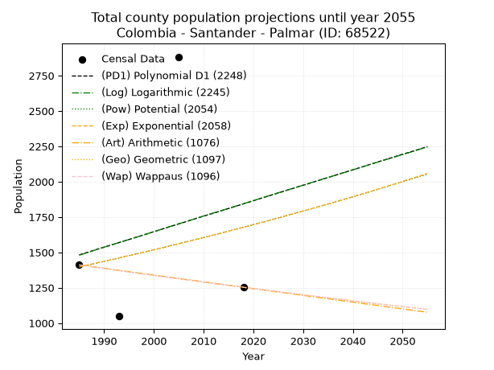
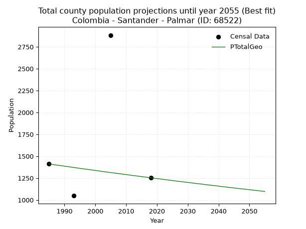
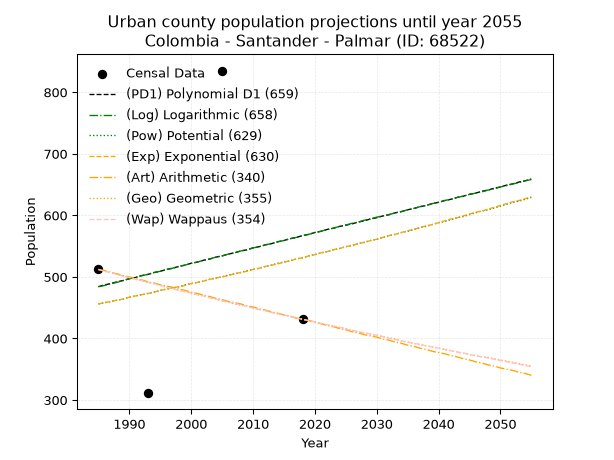
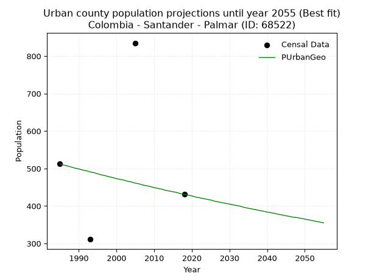
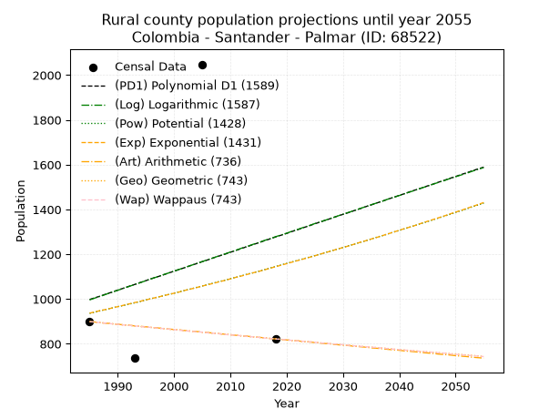
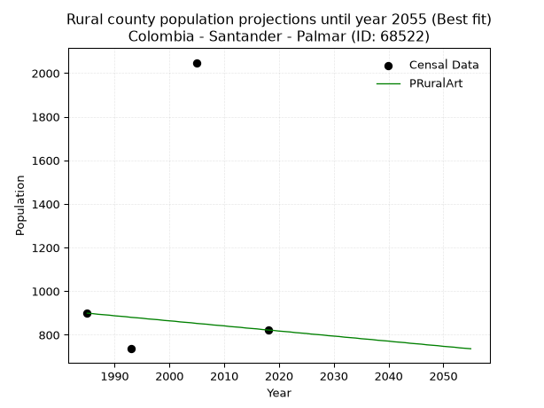

<div align="center">


</div>

# _“Population and Public Services Demand Projections (PPSD) until Year 2050 for Colombia - Santander - Palmar (ID: 68522)”_
Keywords: `population` `public-service` `projection` `lineal` `polynomial` `logarithmic` `potential` `exponential` `arithmetic` `geometric` `wappaus` `dane` `colombia` `south-america`

PPSD are analytical estimates used by governments and planners to anticipate future changes in population size, age distribution, and the resulting community needs for utilities, healthcare, education, and infrastructure as sizing future water treatment facilities, electrical grids, and road networks based on spatial growth.

> **General running parameters**: • app_version: _v20260806_. • Python version: _3.14.7_. • Pandas version: _3.0.5_. • NumPy version: _2.5.1_. • Creates, save and include plots into reports (create_plot): _False_. • Projection until year: _2050_. • Process polynomial degree 2 and up: _False_. • Process Wappaus: _True_. • Process Wappaus: _True_. • Set negative values to zero: _True_. • Set infinite values to zero: _True_. • Drop dataset notes: _True_. 
<div align="center">

Dynamic map: [:earth_americas:Google](http://maps.google.com/maps?q=6.537789331,-73.2910901) [:earth_americas:OSM](https://www.openstreetmap.org/#map=18/6.537789331/-73.2910901&layers=P) [:earth_americas:Bing](https://www.bing.com/maps?cp=6.537789331~-73.2910901&lvl=18) [:earth_americas:Apple](https://maps.apple.com/frame?center=6.537789331%2C-73.2910901&span=0.003%2C0.006)

</div>


<div align="center">

```geojson
{
  "type": "Feature",
  "geometry": {
    "type": "Point", 
    "coordinates": [-73.2910901, 6.537789331]
  }, 
  "properties": {
    "Name": "Colombia - Santander - Palmar (ID: 68522)"
  }
}
```

</div>


## 0. Census Data (4 records)

Census data are official statistics collected by a government about the people and housing in a country. They usually include counts of total population, age, sex, race, income, education, and jobs.

📅Global census file: [Population.xlsx](../data/Population.xlsx)

| Source   |   Year |   CountryID | CountryName   |   StateID | StateName   |   CountyID | CountyName   |   PTotal |   PUrban |   PRural |
|:---------|-------:|------------:|:--------------|----------:|:------------|-----------:|:-------------|---------:|---------:|---------:|
| DANE     |   1985 |          57 | Colombia      |        68 | Santander   |      68522 | Palmar       |     1411 |      512 |      899 |
| DANE     |   1993 |          57 | Colombia      |        68 | Santander   |      68522 | Palmar       |     1048 |      311 |      737 |
| DANE     |   2005 |          57 | Colombia      |        68 | Santander   |      68522 | Palmar       |     2883 |      835 |     2048 |
| DANE     |   2018 |          57 | Colombia      |        68 | Santander   |      68522 | Palmar       |     1253 |      431 |      822 |

> 🔥Some records could had specific notes about the registered values or the corresponding urban or rural distribution.

**Local public utility companies (RUPS)**

 | SERVICIO       | ESTADO    | NOMBRE                                                            | NIT         | DEPARTAMENTO_DOMICILIO   | MUNICIPIO_DOMICILIO   | DIRECCION              |   TELEFONO | EMAIL                          | TIPO_INSCRIPCION    | REPRESENTANTE_LEGAL        | TIPO_PRESTADOR                             | CLASIFICACION                 |
|:---------------|:----------|:------------------------------------------------------------------|:------------|:-------------------------|:----------------------|:-----------------------|-----------:|:-------------------------------|:--------------------|:---------------------------|:-------------------------------------------|:------------------------------|
| ASEO           | OPERATIVA | ACUASAN E.I.C.E  E.S.P                                            | 800120175-7 | SANTANDER                | SAN GIL               | KM 1 VIA AL AEROPUERTO |    7242590 | celsodiaz09@hotmail.com        | Registro por la ESP | LUIS FRANCISCO RUIZ CEDIEL | EMPRESA INDUSTRIAL Y COMERCIAL DEL ESTADO  | MAYOR O IGUAL A 5001 USUARIOS |
| ACUEDUCTO      | OPERATIVA | UNIDAD  DE SERVICIOS PUBLICOS DOMICILIARIOS DE PALMAR - SANTANDER | 800099818-5 | SANTANDER                | PALMAR                | calle 5 No. 3-21       |    8002617 | unidad@palmar-santander.gov.co | Registro por la ESP | FREDY CALA QUINTERO        | MUNICIPIO (PRESTACIÓN DIRECTA)             | MENOR O IGUAL A 2500 USUARIOS |
| ALCANTARILLADO | OPERATIVA | UNIDAD  DE SERVICIOS PUBLICOS DOMICILIARIOS DE PALMAR - SANTANDER | 800099818-5 | SANTANDER                | PALMAR                | calle 5 No. 3-21       |    8002617 | unidad@palmar-santander.gov.co | Registro por la ESP | FREDY CALA QUINTERO        | MUNICIPIO (PRESTACIÓN DIRECTA)             | MENOR O IGUAL A 2500 USUARIOS |
| ASEO           | OPERATIVA | UNIDAD  DE SERVICIOS PUBLICOS DOMICILIARIOS DE PALMAR - SANTANDER | 800099818-5 | SANTANDER                | PALMAR                | calle 5 No. 3-21       |    8002617 | unidad@palmar-santander.gov.co | Registro por la ESP | FREDY CALA QUINTERO        | MUNICIPIO (PRESTACIÓN DIRECTA)             | MENOR O IGUAL A 2500 USUARIOS |
| ASEO           | OPERATIVA | EMPRESA DE SOLUCIONES AMBIENTALES PARA COLOMBIA S.A E.S.P.        | 900508526-9 | SANTANDER                | SAN GIL               | VEREDA EL CUCHARO      |    7273772 | empsacol@hotmail.com           | Registro por la ESP | JHONNATHAN VESGA PALOMINO  | SOCIEDADES (EMPRESA DE SERVICIOS PUBLICOS) | MENOR O IGUAL A 2500 USUARIOS |

> [📅RUPS Database: Registro Único de Prestadores de Servicios Públicos de Colombia Suramérica - RUPS](https://www.datos.gov.co/Hacienda-y-Cr-dito-P-blico/Registro-nico-de-Prestadores-de-Servicios-P-blicos/4qkq-csdn/about_data)

## 1. Total

### 1.1. Coefficients and Parameters

* (PD1) Polynomial Deg 1: 10.95022079486241, -20254.429144923535 (lineal)
* (Log) Logarithmic: 22080.765063218747, -166187.322189672
* (Pow) Potential: 11.138750428214982, -33.587938892336524
* (Exp) Exponential: 0.005527636253786193, 0.023992582729970898
* (Art) Arithmetic: Year diff. 2018 - 1985 = 33, Population diff. 1253 - 1411 = -158, Annual growth = -4.787878787878788
* (Geo) Geometric: Year diff. 2018 - 1985 = 33, Population diff. 1253 - 1411 = -158, Annual growth % = -0.003592259522619101
* (Wap) Wappaus: i = -0.35945035945035947, Condition values only valid for < 200)

<sub>
Wappaus condition values: ['-0.00', '-0.36', '-0.72', '-1.08', '-1.44', '-1.80', '-2.16', '-2.52', '-2.88', '-3.24', '-3.59', '-3.95', '-4.31', '-4.67', '-5.03', '-5.39', '-5.75', '-6.11', '-6.47', '-6.83', '-7.19', '-7.55', '-7.91', '-8.27', '-8.63', '-8.99', '-9.35', '-9.71', '-10.06', '-10.42', '-10.78', '-11.14', '-11.50', '-11.86', '-12.22', '-12.58', '-12.94', '-13.30', '-13.66', '-14.02', '-14.38', '-14.74', '-15.10', '-15.46', '-15.82', '-16.18', '-16.53', '-16.89', '-17.25', '-17.61', '-17.97', '-18.33', '-18.69', '-19.05', '-19.41', '-19.77', '-20.13', '-20.49', '-20.85', '-21.21', '-21.57', '-21.93', '-22.29', '-22.65', '-23.00', '-23.36']
</sub>


### 1.2. Projected Dataset

|   Year |   CountyID |   PTotalPD1 |   PTotalLog |   PTotalPow |   PTotalExp |   PTotalArt |   PTotalGeo |   PTotalWap |
|-------:|-----------:|------------:|------------:|------------:|------------:|------------:|------------:|------------:|
|   1985 |      68522 |        1482 |        1480 |        1396 |        1397 |        1411 |        1411 |        1411 |
|   1986 |      68522 |        1493 |        1491 |        1404 |        1405 |        1406 |        1406 |        1406 |
|   1987 |      68522 |        1504 |        1502 |        1412 |        1413 |        1401 |        1401 |        1401 |
|   1988 |      68522 |        1515 |        1514 |        1420 |        1421 |        1397 |        1396 |        1396 |
|   1989 |      68522 |        1526 |        1525 |        1428 |        1429 |        1392 |        1391 |        1391 |
|   1990 |      68522 |        1537 |        1536 |        1436 |        1437 |        1387 |        1386 |        1386 |
|   1991 |      68522 |        1547 |        1547 |        1444 |        1444 |        1382 |        1381 |        1381 |
|   1992 |      68522 |        1558 |        1558 |        1452 |        1452 |        1377 |        1376 |        1376 |
|   1993 |      68522 |        1569 |        1569 |        1460 |        1461 |        1373 |        1371 |        1371 |
|   1994 |      68522 |        1580 |        1580 |        1469 |        1469 |        1368 |        1366 |        1366 |
|   1995 |      68522 |        1591 |        1591 |        1477 |        1477 |        1363 |        1361 |        1361 |
|   1996 |      68522 |        1602 |        1602 |        1485 |        1485 |        1358 |        1356 |        1356 |
|   1997 |      68522 |        1613 |        1613 |        1493 |        1493 |        1354 |        1351 |        1351 |
|   1998 |      68522 |        1624 |        1624 |        1502 |        1501 |        1349 |        1347 |        1347 |
|   1999 |      68522 |        1635 |        1635 |        1510 |        1510 |        1344 |        1342 |        1342 |
|   2000 |      68522 |        1646 |        1646 |        1518 |        1518 |        1339 |        1337 |        1337 |
|   2001 |      68522 |        1657 |        1657 |        1527 |        1527 |        1334 |        1332 |        1332 |
|   2002 |      68522 |        1668 |        1668 |        1535 |        1535 |        1330 |        1327 |        1327 |
|   2003 |      68522 |        1679 |        1680 |        1544 |        1544 |        1325 |        1322 |        1323 |
|   2004 |      68522 |        1690 |        1691 |        1553 |        1552 |        1320 |        1318 |        1318 |
|   2005 |      68522 |        1701 |        1702 |        1561 |        1561 |        1315 |        1313 |        1313 |
|   2006 |      68522 |        1712 |        1713 |        1570 |        1569 |        1310 |        1308 |        1308 |
|   2007 |      68522 |        1723 |        1724 |        1579 |        1578 |        1306 |        1304 |        1304 |
|   2008 |      68522 |        1734 |        1735 |        1588 |        1587 |        1301 |        1299 |        1299 |
|   2009 |      68522 |        1745 |        1746 |        1596 |        1596 |        1296 |        1294 |        1294 |
|   2010 |      68522 |        1756 |        1757 |        1605 |        1604 |        1291 |        1290 |        1290 |
|   2011 |      68522 |        1766 |        1768 |        1614 |        1613 |        1287 |        1285 |        1285 |
|   2012 |      68522 |        1777 |        1779 |        1623 |        1622 |        1282 |        1280 |        1280 |
|   2013 |      68522 |        1788 |        1789 |        1632 |        1631 |        1277 |        1276 |        1276 |
|   2014 |      68522 |        1799 |        1800 |        1641 |        1640 |        1272 |        1271 |        1271 |
|   2015 |      68522 |        1810 |        1811 |        1650 |        1649 |        1267 |        1267 |        1267 |
|   2016 |      68522 |        1821 |        1822 |        1659 |        1659 |        1263 |        1262 |        1262 |
|   2017 |      68522 |        1832 |        1833 |        1669 |        1668 |        1258 |        1258 |        1258 |
|   2018 |      68522 |        1843 |        1844 |        1678 |        1677 |        1253 |        1253 |        1253 |
|   2019 |      68522 |        1854 |        1855 |        1687 |        1686 |        1248 |        1248 |        1248 |
|   2020 |      68522 |        1865 |        1866 |        1696 |        1696 |        1243 |        1244 |        1244 |
|   2021 |      68522 |        1876 |        1877 |        1706 |        1705 |        1239 |        1240 |        1240 |
|   2022 |      68522 |        1887 |        1888 |        1715 |        1714 |        1234 |        1235 |        1235 |
|   2023 |      68522 |        1898 |        1899 |        1725 |        1724 |        1229 |        1231 |        1231 |
|   2024 |      68522 |        1909 |        1910 |        1734 |        1734 |        1224 |        1226 |        1226 |
|   2025 |      68522 |        1920 |        1921 |        1744 |        1743 |        1219 |        1222 |        1222 |
|   2026 |      68522 |        1931 |        1932 |        1753 |        1753 |        1215 |        1217 |        1217 |
|   2027 |      68522 |        1942 |        1943 |        1763 |        1763 |        1210 |        1213 |        1213 |
|   2028 |      68522 |        1953 |        1953 |        1773 |        1772 |        1205 |        1209 |        1209 |
|   2029 |      68522 |        1964 |        1964 |        1783 |        1782 |        1200 |        1204 |        1204 |
|   2030 |      68522 |        1975 |        1975 |        1792 |        1792 |        1196 |        1200 |        1200 |
|   2031 |      68522 |        1985 |        1986 |        1802 |        1802 |        1191 |        1196 |        1196 |
|   2032 |      68522 |        1996 |        1997 |        1812 |        1812 |        1186 |        1191 |        1191 |
|   2033 |      68522 |        2007 |        2008 |        1822 |        1822 |        1181 |        1187 |        1187 |
|   2034 |      68522 |        2018 |        2019 |        1832 |        1832 |        1176 |        1183 |        1183 |
|   2035 |      68522 |        2029 |        2029 |        1842 |        1842 |        1172 |        1179 |        1178 |
|   2036 |      68522 |        2040 |        2040 |        1852 |        1852 |        1167 |        1174 |        1174 |
|   2037 |      68522 |        2051 |        2051 |        1862 |        1863 |        1162 |        1170 |        1170 |
|   2038 |      68522 |        2062 |        2062 |        1873 |        1873 |        1157 |        1166 |        1166 |
|   2039 |      68522 |        2073 |        2073 |        1883 |        1883 |        1152 |        1162 |        1161 |
|   2040 |      68522 |        2084 |        2084 |        1893 |        1894 |        1148 |        1158 |        1157 |
|   2041 |      68522 |        2095 |        2094 |        1904 |        1904 |        1143 |        1153 |        1153 |
|   2042 |      68522 |        2106 |        2105 |        1914 |        1915 |        1138 |        1149 |        1149 |
|   2043 |      68522 |        2117 |        2116 |        1924 |        1926 |        1133 |        1145 |        1145 |
|   2044 |      68522 |        2128 |        2127 |        1935 |        1936 |        1129 |        1141 |        1140 |
|   2045 |      68522 |        2139 |        2138 |        1946 |        1947 |        1124 |        1137 |        1136 |
|   2046 |      68522 |        2150 |        2149 |        1956 |        1958 |        1119 |        1133 |        1132 |
|   2047 |      68522 |        2161 |        2159 |        1967 |        1969 |        1114 |        1129 |        1128 |
|   2048 |      68522 |        2172 |        2170 |        1978 |        1979 |        1109 |        1125 |        1124 |
|   2049 |      68522 |        2183 |        2181 |        1988 |        1990 |        1105 |        1121 |        1120 |
|   2050 |      68522 |        2194 |        2192 |        1999 |        2001 |        1100 |        1117 |        1116 |
<div align="center">

</img>

</div>


### 1.3. Best fit with absolute and relative error (%)

Relative error puts that difference into context by dividing the absolute error by the true value, creating a unitless ratio or percentage that shows the scale of the mistake.

Absolute and relative error

|   Year | Source   |   CountryID | CountryName   |   StateID | StateName   |   CountyID_x | CountyName   |   PTotal |   PUrban |   PRural |   CountyID_y |   PTotalPD1 |   PTotalLog |   PTotalPow |   PTotalExp |   PTotalArt |   PTotalGeo |   PTotalWap |   PTotalPD1AbsError |   PTotalLogAbsError |   PTotalPowAbsError |   PTotalExpAbsError |   PTotalArtAbsError |   PTotalGeoAbsError |   PTotalWapAbsError |   PTotalPD1RelError |   PTotalLogRelError |   PTotalPowRelError |   PTotalExpRelError |   PTotalArtRelError |   PTotalGeoRelError |   PTotalWapRelError |
|-------:|:---------|------------:|:--------------|----------:|:------------|-------------:|:-------------|---------:|---------:|---------:|-------------:|------------:|------------:|------------:|------------:|------------:|------------:|------------:|--------------------:|--------------------:|--------------------:|--------------------:|--------------------:|--------------------:|--------------------:|--------------------:|--------------------:|--------------------:|--------------------:|--------------------:|--------------------:|--------------------:|
|   1985 | DANE     |          57 | Colombia      |        68 | Santander   |        68522 | Palmar       |     1411 |      512 |      899 |        68522 |        1482 |        1480 |        1396 |        1397 |        1411 |        1411 |        1411 |                  71 |                  69 |                  15 |                  14 |                   0 |                   0 |                   0 |             5.03189 |             4.89015 |             1.06308 |            0.992204 |              0      |              0      |              0      |
|   1993 | DANE     |          57 | Colombia      |        68 | Santander   |        68522 | Palmar       |     1048 |      311 |      737 |        68522 |        1569 |        1569 |        1460 |        1461 |        1373 |        1371 |        1371 |                 521 |                 521 |                 412 |                 413 |                 325 |                 323 |                 323 |            49.7137  |            49.7137  |            39.313   |           39.4084   |             31.0115 |             30.8206 |             30.8206 |
|   2005 | DANE     |          57 | Colombia      |        68 | Santander   |        68522 | Palmar       |     2883 |      835 |     2048 |        68522 |        1701 |        1702 |        1561 |        1561 |        1315 |        1313 |        1313 |                1182 |                1181 |                1322 |                1322 |                1568 |                1570 |                1570 |            40.999   |            40.9643  |            45.855   |           45.855    |             54.3878 |             54.4572 |             54.4572 |
|   2018 | DANE     |          57 | Colombia      |        68 | Santander   |        68522 | Palmar       |     1253 |      431 |      822 |        68522 |        1843 |        1844 |        1678 |        1677 |        1253 |        1253 |        1253 |                 590 |                 591 |                 425 |                 424 |                   0 |                   0 |                   0 |            47.087   |            47.1668  |            33.9186  |           33.8388   |              0      |              0      |              0      |

Relative error mean

| Method    |   RelError | Best   |
|:----------|-----------:|:-------|
| PTotalPD1 |    35.7079 |        |
| PTotalLog |    35.6837 |        |
| PTotalPow |    30.0374 |        |
| PTotalExp |    30.0236 |        |
| PTotalArt |    21.3498 |        |
| PTotalGeo |    21.3194 | True   |
| PTotalWap |    21.3194 | True   |

💙Best method: _**PTotalGeo**_
<div align="center">

</img>

</div>


### 1.4. Fresh water supply demand in liters per capita per day (lpcd)

The fresh water supply demand typically ranges from 100 to 300 liters per capita per day (lpcd) for standard domestic and municipal planning, though absolute survival minimums set by the World Health Organization are as low as 7.5 to 20 liters per day, and total consumption in high-income nations can exceed 400 liters.

> `CZ`: Level in meters above the sea level (masl)<br> `WS`: Fresh water supply demand in liters per capita per day (lpcd or l/h/d)<br> `WSAll`: Zonal fresh water supply demand in liters per second (l/s)<br> `A`: Zonal area in square meters<br> `DP`: Population density (people/hectare or p/ha)

Reference values (RAS Colombia)

|    CZ |   WS |
|------:|-----:|
|  1000 |  120 |
|  2000 |  130 |
| 99999 |  140 |

County shapefile geometry properties and water supply values

|   CountyID |      ATotal |   CZTotal |   WSTotal |
|-----------:|------------:|----------:|----------:|
|      68522 | 1.96597e+07 |    808.34 |       120 |

Projected values for best method: PTotalGeo

|   CountyID |   Year |   PTotalGeo |   DPTotal |   WSTotal |   WSTotalAll |
|-----------:|-------:|------------:|----------:|----------:|-------------:|
|      68522 |   1985 |        1411 |      0.72 |       120 |      1.95972 |
|      68522 |   1986 |        1406 |      0.72 |       120 |      1.95278 |
|      68522 |   1987 |        1401 |      0.71 |       120 |      1.94583 |
|      68522 |   1988 |        1396 |      0.71 |       120 |      1.93889 |
|      68522 |   1989 |        1391 |      0.71 |       120 |      1.93194 |
|      68522 |   1990 |        1386 |      0.7  |       120 |      1.925   |
|      68522 |   1991 |        1381 |      0.7  |       120 |      1.91806 |
|      68522 |   1992 |        1376 |      0.7  |       120 |      1.91111 |
|      68522 |   1993 |        1371 |      0.7  |       120 |      1.90417 |
|      68522 |   1994 |        1366 |      0.69 |       120 |      1.89722 |
|      68522 |   1995 |        1361 |      0.69 |       120 |      1.89028 |
|      68522 |   1996 |        1356 |      0.69 |       120 |      1.88333 |
|      68522 |   1997 |        1351 |      0.69 |       120 |      1.87639 |
|      68522 |   1998 |        1347 |      0.69 |       120 |      1.87083 |
|      68522 |   1999 |        1342 |      0.68 |       120 |      1.86389 |
|      68522 |   2000 |        1337 |      0.68 |       120 |      1.85694 |
|      68522 |   2001 |        1332 |      0.68 |       120 |      1.85    |
|      68522 |   2002 |        1327 |      0.67 |       120 |      1.84306 |
|      68522 |   2003 |        1322 |      0.67 |       120 |      1.83611 |
|      68522 |   2004 |        1318 |      0.67 |       120 |      1.83056 |
|      68522 |   2005 |        1313 |      0.67 |       120 |      1.82361 |
|      68522 |   2006 |        1308 |      0.67 |       120 |      1.81667 |
|      68522 |   2007 |        1304 |      0.66 |       120 |      1.81111 |
|      68522 |   2008 |        1299 |      0.66 |       120 |      1.80417 |
|      68522 |   2009 |        1294 |      0.66 |       120 |      1.79722 |
|      68522 |   2010 |        1290 |      0.66 |       120 |      1.79167 |
|      68522 |   2011 |        1285 |      0.65 |       120 |      1.78472 |
|      68522 |   2012 |        1280 |      0.65 |       120 |      1.77778 |
|      68522 |   2013 |        1276 |      0.65 |       120 |      1.77222 |
|      68522 |   2014 |        1271 |      0.65 |       120 |      1.76528 |
|      68522 |   2015 |        1267 |      0.64 |       120 |      1.75972 |
|      68522 |   2016 |        1262 |      0.64 |       120 |      1.75278 |
|      68522 |   2017 |        1258 |      0.64 |       120 |      1.74722 |
|      68522 |   2018 |        1253 |      0.64 |       120 |      1.74028 |
|      68522 |   2019 |        1248 |      0.63 |       120 |      1.73333 |
|      68522 |   2020 |        1244 |      0.63 |       120 |      1.72778 |
|      68522 |   2021 |        1240 |      0.63 |       120 |      1.72222 |
|      68522 |   2022 |        1235 |      0.63 |       120 |      1.71528 |
|      68522 |   2023 |        1231 |      0.63 |       120 |      1.70972 |
|      68522 |   2024 |        1226 |      0.62 |       120 |      1.70278 |
|      68522 |   2025 |        1222 |      0.62 |       120 |      1.69722 |
|      68522 |   2026 |        1217 |      0.62 |       120 |      1.69028 |
|      68522 |   2027 |        1213 |      0.62 |       120 |      1.68472 |
|      68522 |   2028 |        1209 |      0.61 |       120 |      1.67917 |
|      68522 |   2029 |        1204 |      0.61 |       120 |      1.67222 |
|      68522 |   2030 |        1200 |      0.61 |       120 |      1.66667 |
|      68522 |   2031 |        1196 |      0.61 |       120 |      1.66111 |
|      68522 |   2032 |        1191 |      0.61 |       120 |      1.65417 |
|      68522 |   2033 |        1187 |      0.6  |       120 |      1.64861 |
|      68522 |   2034 |        1183 |      0.6  |       120 |      1.64306 |
|      68522 |   2035 |        1179 |      0.6  |       120 |      1.6375  |
|      68522 |   2036 |        1174 |      0.6  |       120 |      1.63056 |
|      68522 |   2037 |        1170 |      0.6  |       120 |      1.625   |
|      68522 |   2038 |        1166 |      0.59 |       120 |      1.61944 |
|      68522 |   2039 |        1162 |      0.59 |       120 |      1.61389 |
|      68522 |   2040 |        1158 |      0.59 |       120 |      1.60833 |
|      68522 |   2041 |        1153 |      0.59 |       120 |      1.60139 |
|      68522 |   2042 |        1149 |      0.58 |       120 |      1.59583 |
|      68522 |   2043 |        1145 |      0.58 |       120 |      1.59028 |
|      68522 |   2044 |        1141 |      0.58 |       120 |      1.58472 |
|      68522 |   2045 |        1137 |      0.58 |       120 |      1.57917 |
|      68522 |   2046 |        1133 |      0.58 |       120 |      1.57361 |
|      68522 |   2047 |        1129 |      0.57 |       120 |      1.56806 |
|      68522 |   2048 |        1125 |      0.57 |       120 |      1.5625  |
|      68522 |   2049 |        1121 |      0.57 |       120 |      1.55694 |
|      68522 |   2050 |        1117 |      0.57 |       120 |      1.55139 |

## 2. Urban

### 2.1. Coefficients and Parameters

* (PD1) Polynomial Deg 1: 2.4949819349660958, -4468.337615415932 (lineal)
* (Log) Logarithmic: 5025.647159849424, -37677.73433502432
* (Pow) Potential: 9.29857727872773, -28.005760250900202
* (Exp) Exponential: 0.004625885423093335, 0.04688708664513965
* (Art) Arithmetic: Year diff. 2018 - 1985 = 33, Population diff. 431 - 512 = -81, Annual growth = -2.4545454545454546
* (Geo) Geometric: Year diff. 2018 - 1985 = 33, Population diff. 431 - 512 = -81, Annual growth % = -0.005205089208651481
* (Wap) Wappaus: i = -0.5205822809216234, Condition values only valid for < 200)

<sub>
Wappaus condition values: ['-0.00', '-0.52', '-1.04', '-1.56', '-2.08', '-2.60', '-3.12', '-3.64', '-4.16', '-4.69', '-5.21', '-5.73', '-6.25', '-6.77', '-7.29', '-7.81', '-8.33', '-8.85', '-9.37', '-9.89', '-10.41', '-10.93', '-11.45', '-11.97', '-12.49', '-13.01', '-13.54', '-14.06', '-14.58', '-15.10', '-15.62', '-16.14', '-16.66', '-17.18', '-17.70', '-18.22', '-18.74', '-19.26', '-19.78', '-20.30', '-20.82', '-21.34', '-21.86', '-22.39', '-22.91', '-23.43', '-23.95', '-24.47', '-24.99', '-25.51', '-26.03', '-26.55', '-27.07', '-27.59', '-28.11', '-28.63', '-29.15', '-29.67', '-30.19', '-30.71', '-31.23', '-31.76', '-32.28', '-32.80', '-33.32', '-33.84']
</sub>


### 2.2. Projected Dataset

|   Year |   CountyID |   PUrbanPD1 |   PUrbanLog |   PUrbanPow |   PUrbanExp |   PUrbanArt |   PUrbanGeo |   PUrbanWap |
|-------:|-----------:|------------:|------------:|------------:|------------:|------------:|------------:|------------:|
|   1985 |      68522 |         484 |         484 |         456 |         456 |         512 |         512 |         512 |
|   1986 |      68522 |         487 |         486 |         458 |         458 |         510 |         509 |         509 |
|   1987 |      68522 |         489 |         489 |         460 |         460 |         507 |         507 |         507 |
|   1988 |      68522 |         492 |         491 |         462 |         462 |         505 |         504 |         504 |
|   1989 |      68522 |         494 |         494 |         464 |         464 |         502 |         501 |         501 |
|   1990 |      68522 |         497 |         497 |         467 |         467 |         500 |         499 |         499 |
|   1991 |      68522 |         499 |         499 |         469 |         469 |         497 |         496 |         496 |
|   1992 |      68522 |         502 |         502 |         471 |         471 |         495 |         494 |         494 |
|   1993 |      68522 |         504 |         504 |         473 |         473 |         492 |         491 |         491 |
|   1994 |      68522 |         507 |         507 |         475 |         475 |         490 |         489 |         489 |
|   1995 |      68522 |         509 |         509 |         478 |         478 |         487 |         486 |         486 |
|   1996 |      68522 |         512 |         512 |         480 |         480 |         485 |         483 |         483 |
|   1997 |      68522 |         514 |         514 |         482 |         482 |         483 |         481 |         481 |
|   1998 |      68522 |         517 |         517 |         484 |         484 |         480 |         478 |         478 |
|   1999 |      68522 |         519 |         519 |         487 |         486 |         478 |         476 |         476 |
|   2000 |      68522 |         522 |         522 |         489 |         489 |         475 |         473 |         474 |
|   2001 |      68522 |         524 |         524 |         491 |         491 |         473 |         471 |         471 |
|   2002 |      68522 |         527 |         527 |         493 |         493 |         470 |         469 |         469 |
|   2003 |      68522 |         529 |         529 |         496 |         496 |         468 |         466 |         466 |
|   2004 |      68522 |         532 |         532 |         498 |         498 |         465 |         464 |         464 |
|   2005 |      68522 |         534 |         534 |         500 |         500 |         463 |         461 |         461 |
|   2006 |      68522 |         537 |         537 |         503 |         502 |         460 |         459 |         459 |
|   2007 |      68522 |         539 |         539 |         505 |         505 |         458 |         456 |         457 |
|   2008 |      68522 |         542 |         542 |         507 |         507 |         456 |         454 |         454 |
|   2009 |      68522 |         544 |         544 |         510 |         509 |         453 |         452 |         452 |
|   2010 |      68522 |         547 |         547 |         512 |         512 |         451 |         449 |         449 |
|   2011 |      68522 |         549 |         549 |         514 |         514 |         448 |         447 |         447 |
|   2012 |      68522 |         552 |         552 |         517 |         517 |         446 |         445 |         445 |
|   2013 |      68522 |         554 |         554 |         519 |         519 |         443 |         442 |         442 |
|   2014 |      68522 |         557 |         557 |         522 |         521 |         441 |         440 |         440 |
|   2015 |      68522 |         559 |         559 |         524 |         524 |         438 |         438 |         438 |
|   2016 |      68522 |         562 |         562 |         526 |         526 |         436 |         436 |         436 |
|   2017 |      68522 |         564 |         564 |         529 |         529 |         433 |         433 |         433 |
|   2018 |      68522 |         567 |         567 |         531 |         531 |         431 |         431 |         431 |
|   2019 |      68522 |         569 |         569 |         534 |         534 |         429 |         429 |         429 |
|   2020 |      68522 |         572 |         572 |         536 |         536 |         426 |         427 |         427 |
|   2021 |      68522 |         574 |         574 |         539 |         539 |         424 |         424 |         424 |
|   2022 |      68522 |         577 |         577 |         541 |         541 |         421 |         422 |         422 |
|   2023 |      68522 |         579 |         579 |         544 |         544 |         419 |         420 |         420 |
|   2024 |      68522 |         582 |         582 |         546 |         546 |         416 |         418 |         418 |
|   2025 |      68522 |         584 |         584 |         549 |         549 |         414 |         416 |         415 |
|   2026 |      68522 |         586 |         587 |         551 |         551 |         411 |         413 |         413 |
|   2027 |      68522 |         589 |         589 |         554 |         554 |         409 |         411 |         411 |
|   2028 |      68522 |         591 |         592 |         556 |         556 |         406 |         409 |         409 |
|   2029 |      68522 |         594 |         594 |         559 |         559 |         404 |         407 |         407 |
|   2030 |      68522 |         596 |         597 |         561 |         561 |         402 |         405 |         405 |
|   2031 |      68522 |         599 |         599 |         564 |         564 |         399 |         403 |         403 |
|   2032 |      68522 |         601 |         601 |         567 |         567 |         397 |         401 |         400 |
|   2033 |      68522 |         604 |         604 |         569 |         569 |         394 |         399 |         398 |
|   2034 |      68522 |         606 |         606 |         572 |         572 |         392 |         396 |         396 |
|   2035 |      68522 |         609 |         609 |         574 |         575 |         389 |         394 |         394 |
|   2036 |      68522 |         611 |         611 |         577 |         577 |         387 |         392 |         392 |
|   2037 |      68522 |         614 |         614 |         580 |         580 |         384 |         390 |         390 |
|   2038 |      68522 |         616 |         616 |         582 |         583 |         382 |         388 |         388 |
|   2039 |      68522 |         619 |         619 |         585 |         585 |         379 |         386 |         386 |
|   2040 |      68522 |         621 |         621 |         588 |         588 |         377 |         384 |         384 |
|   2041 |      68522 |         624 |         624 |         590 |         591 |         375 |         382 |         382 |
|   2042 |      68522 |         626 |         626 |         593 |         594 |         372 |         380 |         380 |
|   2043 |      68522 |         629 |         629 |         596 |         596 |         370 |         378 |         378 |
|   2044 |      68522 |         631 |         631 |         598 |         599 |         367 |         376 |         376 |
|   2045 |      68522 |         634 |         634 |         601 |         602 |         365 |         374 |         374 |
|   2046 |      68522 |         636 |         636 |         604 |         605 |         362 |         372 |         372 |
|   2047 |      68522 |         639 |         638 |         607 |         607 |         360 |         370 |         370 |
|   2048 |      68522 |         641 |         641 |         609 |         610 |         357 |         369 |         368 |
|   2049 |      68522 |         644 |         643 |         612 |         613 |         355 |         367 |         366 |
|   2050 |      68522 |         646 |         646 |         615 |         616 |         352 |         365 |         364 |
<div align="center">

</img>

</div>


### 2.3. Best fit with absolute and relative error (%)

Relative error puts that difference into context by dividing the absolute error by the true value, creating a unitless ratio or percentage that shows the scale of the mistake.

Absolute and relative error

|   Year | Source   |   CountryID | CountryName   |   StateID | StateName   |   CountyID_x | CountyName   |   PTotal |   PUrban |   PRural |   CountyID_y |   PUrbanPD1 |   PUrbanLog |   PUrbanPow |   PUrbanExp |   PUrbanArt |   PUrbanGeo |   PUrbanWap |   PUrbanPD1AbsError |   PUrbanLogAbsError |   PUrbanPowAbsError |   PUrbanExpAbsError |   PUrbanArtAbsError |   PUrbanGeoAbsError |   PUrbanWapAbsError |   PUrbanPD1RelError |   PUrbanLogRelError |   PUrbanPowRelError |   PUrbanExpRelError |   PUrbanArtRelError |   PUrbanGeoRelError |   PUrbanWapRelError |
|-------:|:---------|------------:|:--------------|----------:|:------------|-------------:|:-------------|---------:|---------:|---------:|-------------:|------------:|------------:|------------:|------------:|------------:|------------:|------------:|--------------------:|--------------------:|--------------------:|--------------------:|--------------------:|--------------------:|--------------------:|--------------------:|--------------------:|--------------------:|--------------------:|--------------------:|--------------------:|--------------------:|
|   1985 | DANE     |          57 | Colombia      |        68 | Santander   |        68522 | Palmar       |     1411 |      512 |      899 |        68522 |         484 |         484 |         456 |         456 |         512 |         512 |         512 |                  28 |                  28 |                  56 |                  56 |                   0 |                   0 |                   0 |             5.46875 |             5.46875 |             10.9375 |             10.9375 |              0      |              0      |              0      |
|   1993 | DANE     |          57 | Colombia      |        68 | Santander   |        68522 | Palmar       |     1048 |      311 |      737 |        68522 |         504 |         504 |         473 |         473 |         492 |         491 |         491 |                 193 |                 193 |                 162 |                 162 |                 181 |                 180 |                 180 |            62.0579  |            62.0579  |             52.09   |             52.09   |             58.1994 |             57.8778 |             57.8778 |
|   2005 | DANE     |          57 | Colombia      |        68 | Santander   |        68522 | Palmar       |     2883 |      835 |     2048 |        68522 |         534 |         534 |         500 |         500 |         463 |         461 |         461 |                 301 |                 301 |                 335 |                 335 |                 372 |                 374 |                 374 |            36.0479  |            36.0479  |             40.1198 |             40.1198 |             44.5509 |             44.7904 |             44.7904 |
|   2018 | DANE     |          57 | Colombia      |        68 | Santander   |        68522 | Palmar       |     1253 |      431 |      822 |        68522 |         567 |         567 |         531 |         531 |         431 |         431 |         431 |                 136 |                 136 |                 100 |                 100 |                   0 |                   0 |                   0 |            31.5545  |            31.5545  |             23.2019 |             23.2019 |              0      |              0      |              0      |

Relative error mean

| Method    |   RelError | Best   |
|:----------|-----------:|:-------|
| PUrbanPD1 |    33.7823 |        |
| PUrbanLog |    33.7823 |        |
| PUrbanPow |    31.5873 |        |
| PUrbanExp |    31.5873 |        |
| PUrbanArt |    25.6876 |        |
| PUrbanGeo |    25.6671 | True   |
| PUrbanWap |    25.6671 | True   |

💙Best method: _**PUrbanGeo**_
<div align="center">

</img>

</div>


### 2.4. Fresh water supply demand in liters per capita per day (lpcd)

The fresh water supply demand typically ranges from 100 to 300 liters per capita per day (lpcd) for standard domestic and municipal planning, though absolute survival minimums set by the World Health Organization are as low as 7.5 to 20 liters per day, and total consumption in high-income nations can exceed 400 liters.

> `CZ`: Level in meters above the sea level (masl)<br> `WS`: Fresh water supply demand in liters per capita per day (lpcd or l/h/d)<br> `WSAll`: Zonal fresh water supply demand in liters per second (l/s)<br> `A`: Zonal area in square meters<br> `DP`: Population density (people/hectare or p/ha)

Reference values (RAS Colombia)

|    CZ |   WS |
|------:|-----:|
|  1000 |  120 |
|  2000 |  130 |
| 99999 |  140 |

County shapefile geometry properties and water supply values

|   CountyID |   AUrban |   CZUrban |   WSUrban |
|-----------:|---------:|----------:|----------:|
|      68522 |   216796 |   892.583 |       120 |

Projected values for best method: PUrbanGeo

|   CountyID |   Year |   PUrbanGeo |   DPUrban |   WSUrban |   WSUrbanAll |
|-----------:|-------:|------------:|----------:|----------:|-------------:|
|      68522 |   1985 |         512 |     23.62 |       120 |     0.711111 |
|      68522 |   1986 |         509 |     23.48 |       120 |     0.706944 |
|      68522 |   1987 |         507 |     23.39 |       120 |     0.704167 |
|      68522 |   1988 |         504 |     23.25 |       120 |     0.7      |
|      68522 |   1989 |         501 |     23.11 |       120 |     0.695833 |
|      68522 |   1990 |         499 |     23.02 |       120 |     0.693056 |
|      68522 |   1991 |         496 |     22.88 |       120 |     0.688889 |
|      68522 |   1992 |         494 |     22.79 |       120 |     0.686111 |
|      68522 |   1993 |         491 |     22.65 |       120 |     0.681944 |
|      68522 |   1994 |         489 |     22.56 |       120 |     0.679167 |
|      68522 |   1995 |         486 |     22.42 |       120 |     0.675    |
|      68522 |   1996 |         483 |     22.28 |       120 |     0.670833 |
|      68522 |   1997 |         481 |     22.19 |       120 |     0.668056 |
|      68522 |   1998 |         478 |     22.05 |       120 |     0.663889 |
|      68522 |   1999 |         476 |     21.96 |       120 |     0.661111 |
|      68522 |   2000 |         473 |     21.82 |       120 |     0.656944 |
|      68522 |   2001 |         471 |     21.73 |       120 |     0.654167 |
|      68522 |   2002 |         469 |     21.63 |       120 |     0.651389 |
|      68522 |   2003 |         466 |     21.49 |       120 |     0.647222 |
|      68522 |   2004 |         464 |     21.4  |       120 |     0.644444 |
|      68522 |   2005 |         461 |     21.26 |       120 |     0.640278 |
|      68522 |   2006 |         459 |     21.17 |       120 |     0.6375   |
|      68522 |   2007 |         456 |     21.03 |       120 |     0.633333 |
|      68522 |   2008 |         454 |     20.94 |       120 |     0.630556 |
|      68522 |   2009 |         452 |     20.85 |       120 |     0.627778 |
|      68522 |   2010 |         449 |     20.71 |       120 |     0.623611 |
|      68522 |   2011 |         447 |     20.62 |       120 |     0.620833 |
|      68522 |   2012 |         445 |     20.53 |       120 |     0.618056 |
|      68522 |   2013 |         442 |     20.39 |       120 |     0.613889 |
|      68522 |   2014 |         440 |     20.3  |       120 |     0.611111 |
|      68522 |   2015 |         438 |     20.2  |       120 |     0.608333 |
|      68522 |   2016 |         436 |     20.11 |       120 |     0.605556 |
|      68522 |   2017 |         433 |     19.97 |       120 |     0.601389 |
|      68522 |   2018 |         431 |     19.88 |       120 |     0.598611 |
|      68522 |   2019 |         429 |     19.79 |       120 |     0.595833 |
|      68522 |   2020 |         427 |     19.7  |       120 |     0.593056 |
|      68522 |   2021 |         424 |     19.56 |       120 |     0.588889 |
|      68522 |   2022 |         422 |     19.47 |       120 |     0.586111 |
|      68522 |   2023 |         420 |     19.37 |       120 |     0.583333 |
|      68522 |   2024 |         418 |     19.28 |       120 |     0.580556 |
|      68522 |   2025 |         416 |     19.19 |       120 |     0.577778 |
|      68522 |   2026 |         413 |     19.05 |       120 |     0.573611 |
|      68522 |   2027 |         411 |     18.96 |       120 |     0.570833 |
|      68522 |   2028 |         409 |     18.87 |       120 |     0.568056 |
|      68522 |   2029 |         407 |     18.77 |       120 |     0.565278 |
|      68522 |   2030 |         405 |     18.68 |       120 |     0.5625   |
|      68522 |   2031 |         403 |     18.59 |       120 |     0.559722 |
|      68522 |   2032 |         401 |     18.5  |       120 |     0.556944 |
|      68522 |   2033 |         399 |     18.4  |       120 |     0.554167 |
|      68522 |   2034 |         396 |     18.27 |       120 |     0.55     |
|      68522 |   2035 |         394 |     18.17 |       120 |     0.547222 |
|      68522 |   2036 |         392 |     18.08 |       120 |     0.544444 |
|      68522 |   2037 |         390 |     17.99 |       120 |     0.541667 |
|      68522 |   2038 |         388 |     17.9  |       120 |     0.538889 |
|      68522 |   2039 |         386 |     17.8  |       120 |     0.536111 |
|      68522 |   2040 |         384 |     17.71 |       120 |     0.533333 |
|      68522 |   2041 |         382 |     17.62 |       120 |     0.530556 |
|      68522 |   2042 |         380 |     17.53 |       120 |     0.527778 |
|      68522 |   2043 |         378 |     17.44 |       120 |     0.525    |
|      68522 |   2044 |         376 |     17.34 |       120 |     0.522222 |
|      68522 |   2045 |         374 |     17.25 |       120 |     0.519444 |
|      68522 |   2046 |         372 |     17.16 |       120 |     0.516667 |
|      68522 |   2047 |         370 |     17.07 |       120 |     0.513889 |
|      68522 |   2048 |         369 |     17.02 |       120 |     0.5125   |
|      68522 |   2049 |         367 |     16.93 |       120 |     0.509722 |
|      68522 |   2050 |         365 |     16.84 |       120 |     0.506944 |

## 3. Rural

### 3.1. Coefficients and Parameters

* (PD1) Polynomial Deg 1: 8.455238859896308, -15786.09152950759 (lineal)
* (Log) Logarithmic: 17055.11790336938, -128509.58785464818
* (Pow) Potential: 12.18302263529654, -37.20522440764264
* (Exp) Exponential: 0.0060409533559851415, 0.005808927194119194
* (Art) Arithmetic: Year diff. 2018 - 1985 = 33, Population diff. 822 - 899 = -77, Annual growth = -2.3333333333333335
* (Geo) Geometric: Year diff. 2018 - 1985 = 33, Population diff. 822 - 899 = -77, Annual growth % = -0.002709735337086072
* (Wap) Wappaus: i = -0.27116017819097427, Condition values only valid for < 200)

<sub>
Wappaus condition values: ['-0.00', '-0.27', '-0.54', '-0.81', '-1.08', '-1.36', '-1.63', '-1.90', '-2.17', '-2.44', '-2.71', '-2.98', '-3.25', '-3.53', '-3.80', '-4.07', '-4.34', '-4.61', '-4.88', '-5.15', '-5.42', '-5.69', '-5.97', '-6.24', '-6.51', '-6.78', '-7.05', '-7.32', '-7.59', '-7.86', '-8.13', '-8.41', '-8.68', '-8.95', '-9.22', '-9.49', '-9.76', '-10.03', '-10.30', '-10.58', '-10.85', '-11.12', '-11.39', '-11.66', '-11.93', '-12.20', '-12.47', '-12.74', '-13.02', '-13.29', '-13.56', '-13.83', '-14.10', '-14.37', '-14.64', '-14.91', '-15.18', '-15.46', '-15.73', '-16.00', '-16.27', '-16.54', '-16.81', '-17.08', '-17.35', '-17.63']
</sub>


### 3.2. Projected Dataset

|   Year |   CountyID |   PRuralPD1 |   PRuralLog |   PRuralPow |   PRuralExp |   PRuralArt |   PRuralGeo |   PRuralWap |
|-------:|-----------:|------------:|------------:|------------:|------------:|------------:|------------:|------------:|
|   1985 |      68522 |         998 |         996 |         936 |         937 |         899 |         899 |         899 |
|   1986 |      68522 |        1006 |        1005 |         942 |         943 |         897 |         897 |         897 |
|   1987 |      68522 |        1014 |        1013 |         948 |         949 |         894 |         894 |         894 |
|   1988 |      68522 |        1023 |        1022 |         954 |         954 |         892 |         892 |         892 |
|   1989 |      68522 |        1031 |        1031 |         960 |         960 |         890 |         889 |         889 |
|   1990 |      68522 |        1040 |        1039 |         966 |         966 |         887 |         887 |         887 |
|   1991 |      68522 |        1048 |        1048 |         971 |         972 |         885 |         884 |         884 |
|   1992 |      68522 |        1057 |        1056 |         977 |         978 |         883 |         882 |         882 |
|   1993 |      68522 |        1065 |        1065 |         983 |         984 |         880 |         880 |         880 |
|   1994 |      68522 |        1074 |        1073 |         989 |         990 |         878 |         877 |         877 |
|   1995 |      68522 |        1082 |        1082 |         996 |         996 |         876 |         875 |         875 |
|   1996 |      68522 |        1091 |        1091 |        1002 |        1002 |         873 |         873 |         873 |
|   1997 |      68522 |        1099 |        1099 |        1008 |        1008 |         871 |         870 |         870 |
|   1998 |      68522 |        1107 |        1108 |        1014 |        1014 |         869 |         868 |         868 |
|   1999 |      68522 |        1116 |        1116 |        1020 |        1020 |         866 |         865 |         866 |
|   2000 |      68522 |        1124 |        1125 |        1026 |        1026 |         864 |         863 |         863 |
|   2001 |      68522 |        1133 |        1133 |        1033 |        1032 |         862 |         861 |         861 |
|   2002 |      68522 |        1141 |        1142 |        1039 |        1039 |         859 |         858 |         858 |
|   2003 |      68522 |        1150 |        1150 |        1045 |        1045 |         857 |         856 |         856 |
|   2004 |      68522 |        1158 |        1159 |        1052 |        1051 |         855 |         854 |         854 |
|   2005 |      68522 |        1167 |        1167 |        1058 |        1058 |         852 |         852 |         852 |
|   2006 |      68522 |        1175 |        1176 |        1065 |        1064 |         850 |         849 |         849 |
|   2007 |      68522 |        1184 |        1184 |        1071 |        1070 |         848 |         847 |         847 |
|   2008 |      68522 |        1192 |        1193 |        1078 |        1077 |         845 |         845 |         845 |
|   2009 |      68522 |        1200 |        1201 |        1084 |        1083 |         843 |         842 |         842 |
|   2010 |      68522 |        1209 |        1210 |        1091 |        1090 |         841 |         840 |         840 |
|   2011 |      68522 |        1217 |        1218 |        1097 |        1097 |         838 |         838 |         838 |
|   2012 |      68522 |        1226 |        1227 |        1104 |        1103 |         836 |         835 |         836 |
|   2013 |      68522 |        1234 |        1235 |        1111 |        1110 |         834 |         833 |         833 |
|   2014 |      68522 |        1243 |        1244 |        1117 |        1117 |         831 |         831 |         831 |
|   2015 |      68522 |        1251 |        1252 |        1124 |        1123 |         829 |         829 |         829 |
|   2016 |      68522 |        1260 |        1261 |        1131 |        1130 |         827 |         826 |         826 |
|   2017 |      68522 |        1268 |        1269 |        1138 |        1137 |         824 |         824 |         824 |
|   2018 |      68522 |        1277 |        1278 |        1145 |        1144 |         822 |         822 |         822 |
|   2019 |      68522 |        1285 |        1286 |        1152 |        1151 |         820 |         820 |         820 |
|   2020 |      68522 |        1293 |        1294 |        1159 |        1158 |         817 |         818 |         818 |
|   2021 |      68522 |        1302 |        1303 |        1166 |        1165 |         815 |         815 |         815 |
|   2022 |      68522 |        1310 |        1311 |        1173 |        1172 |         813 |         813 |         813 |
|   2023 |      68522 |        1319 |        1320 |        1180 |        1179 |         810 |         811 |         811 |
|   2024 |      68522 |        1327 |        1328 |        1187 |        1186 |         808 |         809 |         809 |
|   2025 |      68522 |        1336 |        1337 |        1194 |        1193 |         806 |         807 |         807 |
|   2026 |      68522 |        1344 |        1345 |        1201 |        1201 |         803 |         804 |         804 |
|   2027 |      68522 |        1353 |        1353 |        1209 |        1208 |         801 |         802 |         802 |
|   2028 |      68522 |        1361 |        1362 |        1216 |        1215 |         799 |         800 |         800 |
|   2029 |      68522 |        1370 |        1370 |        1223 |        1223 |         796 |         798 |         798 |
|   2030 |      68522 |        1378 |        1379 |        1230 |        1230 |         794 |         796 |         796 |
|   2031 |      68522 |        1386 |        1387 |        1238 |        1237 |         792 |         794 |         793 |
|   2032 |      68522 |        1395 |        1395 |        1245 |        1245 |         789 |         791 |         791 |
|   2033 |      68522 |        1403 |        1404 |        1253 |        1253 |         787 |         789 |         789 |
|   2034 |      68522 |        1412 |        1412 |        1260 |        1260 |         785 |         787 |         787 |
|   2035 |      68522 |        1420 |        1421 |        1268 |        1268 |         782 |         785 |         785 |
|   2036 |      68522 |        1429 |        1429 |        1276 |        1275 |         780 |         783 |         783 |
|   2037 |      68522 |        1437 |        1437 |        1283 |        1283 |         778 |         781 |         781 |
|   2038 |      68522 |        1446 |        1446 |        1291 |        1291 |         775 |         779 |         778 |
|   2039 |      68522 |        1454 |        1454 |        1299 |        1299 |         773 |         776 |         776 |
|   2040 |      68522 |        1463 |        1462 |        1306 |        1307 |         771 |         774 |         774 |
|   2041 |      68522 |        1471 |        1471 |        1314 |        1315 |         768 |         772 |         772 |
|   2042 |      68522 |        1480 |        1479 |        1322 |        1322 |         766 |         770 |         770 |
|   2043 |      68522 |        1488 |        1487 |        1330 |        1330 |         764 |         768 |         768 |
|   2044 |      68522 |        1496 |        1496 |        1338 |        1339 |         761 |         766 |         766 |
|   2045 |      68522 |        1505 |        1504 |        1346 |        1347 |         759 |         764 |         764 |
|   2046 |      68522 |        1513 |        1513 |        1354 |        1355 |         757 |         762 |         762 |
|   2047 |      68522 |        1522 |        1521 |        1362 |        1363 |         754 |         760 |         760 |
|   2048 |      68522 |        1530 |        1529 |        1370 |        1371 |         752 |         758 |         758 |
|   2049 |      68522 |        1539 |        1538 |        1378 |        1380 |         750 |         756 |         755 |
|   2050 |      68522 |        1547 |        1546 |        1387 |        1388 |         747 |         754 |         753 |
<div align="center">

</img>

</div>


### 3.3. Best fit with absolute and relative error (%)

Relative error puts that difference into context by dividing the absolute error by the true value, creating a unitless ratio or percentage that shows the scale of the mistake.

Absolute and relative error

|   Year | Source   |   CountryID | CountryName   |   StateID | StateName   |   CountyID_x | CountyName   |   PTotal |   PUrban |   PRural |   CountyID_y |   PRuralPD1 |   PRuralLog |   PRuralPow |   PRuralExp |   PRuralArt |   PRuralGeo |   PRuralWap |   PRuralPD1AbsError |   PRuralLogAbsError |   PRuralPowAbsError |   PRuralExpAbsError |   PRuralArtAbsError |   PRuralGeoAbsError |   PRuralWapAbsError |   PRuralPD1RelError |   PRuralLogRelError |   PRuralPowRelError |   PRuralExpRelError |   PRuralArtRelError |   PRuralGeoRelError |   PRuralWapRelError |
|-------:|:---------|------------:|:--------------|----------:|:------------|-------------:|:-------------|---------:|---------:|---------:|-------------:|------------:|------------:|------------:|------------:|------------:|------------:|------------:|--------------------:|--------------------:|--------------------:|--------------------:|--------------------:|--------------------:|--------------------:|--------------------:|--------------------:|--------------------:|--------------------:|--------------------:|--------------------:|--------------------:|
|   1985 | DANE     |          57 | Colombia      |        68 | Santander   |        68522 | Palmar       |     1411 |      512 |      899 |        68522 |         998 |         996 |         936 |         937 |         899 |         899 |         899 |                  99 |                  97 |                  37 |                  38 |                   0 |                   0 |                   0 |             11.0122 |             10.7898 |             4.11568 |             4.22692 |              0      |              0      |              0      |
|   1993 | DANE     |          57 | Colombia      |        68 | Santander   |        68522 | Palmar       |     1048 |      311 |      737 |        68522 |        1065 |        1065 |         983 |         984 |         880 |         880 |         880 |                 328 |                 328 |                 246 |                 247 |                 143 |                 143 |                 143 |             44.5047 |             44.5047 |            33.3786  |            33.5142  |             19.403  |             19.403  |             19.403  |
|   2005 | DANE     |          57 | Colombia      |        68 | Santander   |        68522 | Palmar       |     2883 |      835 |     2048 |        68522 |        1167 |        1167 |        1058 |        1058 |         852 |         852 |         852 |                 881 |                 881 |                 990 |                 990 |                1196 |                1196 |                1196 |             43.0176 |             43.0176 |            48.3398  |            48.3398  |             58.3984 |             58.3984 |             58.3984 |
|   2018 | DANE     |          57 | Colombia      |        68 | Santander   |        68522 | Palmar       |     1253 |      431 |      822 |        68522 |        1277 |        1278 |        1145 |        1144 |         822 |         822 |         822 |                 455 |                 456 |                 323 |                 322 |                   0 |                   0 |                   0 |             55.3528 |             55.4745 |            39.2944  |            39.1727  |              0      |              0      |              0      |

Relative error mean

| Method    |   RelError | Best   |
|:----------|-----------:|:-------|
| PRuralPD1 |    38.4718 |        |
| PRuralLog |    38.4466 |        |
| PRuralPow |    31.2821 |        |
| PRuralExp |    31.3134 |        |
| PRuralArt |    19.4504 | True   |
| PRuralGeo |    19.4504 | True   |
| PRuralWap |    19.4504 | True   |

💙Best method: _**PRuralArt**_
<div align="center">

</img>

</div>


### 3.4. Fresh water supply demand in liters per capita per day (lpcd)

The fresh water supply demand typically ranges from 100 to 300 liters per capita per day (lpcd) for standard domestic and municipal planning, though absolute survival minimums set by the World Health Organization are as low as 7.5 to 20 liters per day, and total consumption in high-income nations can exceed 400 liters.

> `CZ`: Level in meters above the sea level (masl)<br> `WS`: Fresh water supply demand in liters per capita per day (lpcd or l/h/d)<br> `WSAll`: Zonal fresh water supply demand in liters per second (l/s)<br> `A`: Zonal area in square meters<br> `DP`: Population density (people/hectare or p/ha)

Reference values (RAS Colombia)

|    CZ |   WS |
|------:|-----:|
|  1000 |  120 |
|  2000 |  130 |
| 99999 |  140 |

County shapefile geometry properties and water supply values

|   CountyID |      ARural |   CZRural |   WSRural |
|-----------:|------------:|----------:|----------:|
|      68522 | 1.94429e+07 |   807.309 |       120 |

Projected values for best method: PRuralArt

|   CountyID |   Year |   PRuralArt |   DPRural |   WSRural |   WSRuralAll |
|-----------:|-------:|------------:|----------:|----------:|-------------:|
|      68522 |   1985 |         899 |      0.46 |       120 |      1.24861 |
|      68522 |   1986 |         897 |      0.46 |       120 |      1.24583 |
|      68522 |   1987 |         894 |      0.46 |       120 |      1.24167 |
|      68522 |   1988 |         892 |      0.46 |       120 |      1.23889 |
|      68522 |   1989 |         890 |      0.46 |       120 |      1.23611 |
|      68522 |   1990 |         887 |      0.46 |       120 |      1.23194 |
|      68522 |   1991 |         885 |      0.46 |       120 |      1.22917 |
|      68522 |   1992 |         883 |      0.45 |       120 |      1.22639 |
|      68522 |   1993 |         880 |      0.45 |       120 |      1.22222 |
|      68522 |   1994 |         878 |      0.45 |       120 |      1.21944 |
|      68522 |   1995 |         876 |      0.45 |       120 |      1.21667 |
|      68522 |   1996 |         873 |      0.45 |       120 |      1.2125  |
|      68522 |   1997 |         871 |      0.45 |       120 |      1.20972 |
|      68522 |   1998 |         869 |      0.45 |       120 |      1.20694 |
|      68522 |   1999 |         866 |      0.45 |       120 |      1.20278 |
|      68522 |   2000 |         864 |      0.44 |       120 |      1.2     |
|      68522 |   2001 |         862 |      0.44 |       120 |      1.19722 |
|      68522 |   2002 |         859 |      0.44 |       120 |      1.19306 |
|      68522 |   2003 |         857 |      0.44 |       120 |      1.19028 |
|      68522 |   2004 |         855 |      0.44 |       120 |      1.1875  |
|      68522 |   2005 |         852 |      0.44 |       120 |      1.18333 |
|      68522 |   2006 |         850 |      0.44 |       120 |      1.18056 |
|      68522 |   2007 |         848 |      0.44 |       120 |      1.17778 |
|      68522 |   2008 |         845 |      0.43 |       120 |      1.17361 |
|      68522 |   2009 |         843 |      0.43 |       120 |      1.17083 |
|      68522 |   2010 |         841 |      0.43 |       120 |      1.16806 |
|      68522 |   2011 |         838 |      0.43 |       120 |      1.16389 |
|      68522 |   2012 |         836 |      0.43 |       120 |      1.16111 |
|      68522 |   2013 |         834 |      0.43 |       120 |      1.15833 |
|      68522 |   2014 |         831 |      0.43 |       120 |      1.15417 |
|      68522 |   2015 |         829 |      0.43 |       120 |      1.15139 |
|      68522 |   2016 |         827 |      0.43 |       120 |      1.14861 |
|      68522 |   2017 |         824 |      0.42 |       120 |      1.14444 |
|      68522 |   2018 |         822 |      0.42 |       120 |      1.14167 |
|      68522 |   2019 |         820 |      0.42 |       120 |      1.13889 |
|      68522 |   2020 |         817 |      0.42 |       120 |      1.13472 |
|      68522 |   2021 |         815 |      0.42 |       120 |      1.13194 |
|      68522 |   2022 |         813 |      0.42 |       120 |      1.12917 |
|      68522 |   2023 |         810 |      0.42 |       120 |      1.125   |
|      68522 |   2024 |         808 |      0.42 |       120 |      1.12222 |
|      68522 |   2025 |         806 |      0.41 |       120 |      1.11944 |
|      68522 |   2026 |         803 |      0.41 |       120 |      1.11528 |
|      68522 |   2027 |         801 |      0.41 |       120 |      1.1125  |
|      68522 |   2028 |         799 |      0.41 |       120 |      1.10972 |
|      68522 |   2029 |         796 |      0.41 |       120 |      1.10556 |
|      68522 |   2030 |         794 |      0.41 |       120 |      1.10278 |
|      68522 |   2031 |         792 |      0.41 |       120 |      1.1     |
|      68522 |   2032 |         789 |      0.41 |       120 |      1.09583 |
|      68522 |   2033 |         787 |      0.4  |       120 |      1.09306 |
|      68522 |   2034 |         785 |      0.4  |       120 |      1.09028 |
|      68522 |   2035 |         782 |      0.4  |       120 |      1.08611 |
|      68522 |   2036 |         780 |      0.4  |       120 |      1.08333 |
|      68522 |   2037 |         778 |      0.4  |       120 |      1.08056 |
|      68522 |   2038 |         775 |      0.4  |       120 |      1.07639 |
|      68522 |   2039 |         773 |      0.4  |       120 |      1.07361 |
|      68522 |   2040 |         771 |      0.4  |       120 |      1.07083 |
|      68522 |   2041 |         768 |      0.4  |       120 |      1.06667 |
|      68522 |   2042 |         766 |      0.39 |       120 |      1.06389 |
|      68522 |   2043 |         764 |      0.39 |       120 |      1.06111 |
|      68522 |   2044 |         761 |      0.39 |       120 |      1.05694 |
|      68522 |   2045 |         759 |      0.39 |       120 |      1.05417 |
|      68522 |   2046 |         757 |      0.39 |       120 |      1.05139 |
|      68522 |   2047 |         754 |      0.39 |       120 |      1.04722 |
|      68522 |   2048 |         752 |      0.39 |       120 |      1.04444 |
|      68522 |   2049 |         750 |      0.39 |       120 |      1.04167 |
|      68522 |   2050 |         747 |      0.38 |       120 |      1.0375  |

<div align="center"><br><sub>Share this research</sub></div><br>

<sub>**APPS & TOOLS & CONTENT DISCLAIMER**: • NO WARRANTY - This content and software is provided by <a href="https://github.com/rcfdtools" target="_blank">github.com/rcfdtools</a> "as is", without any express or implied warranty, including warranties of merchantability, fitness for a particular purpose, or non-infringement. There is no guarantee that the software will be error-free or operate without interruption. • LIMITATION OF LIABILITY - Neither the authors nor copyright holders will be liable for claims or damages arising from the software or its use. You are responsible for determining if the software is appropriate for your use and assume all associated risks, including errors, legal compliance, and data loss. • NO PROFESSIONAL ADVICE - The software provides general information and does not offer professional advice. It should not replace consultation with professional advisors. [Clauses and global license for rcfdtools use.](https://github.com/rcfdtools/rcfdtools/blob/main/LICENSE.md)</sub>

| [:house: Home](Readme.md)  | [:beginner: Help / Collaborate](https://github.com/rcfdtools/R.HydroTools/discussions/31) |
|----------------------------|-------------------------------------------------------------------------------------------|