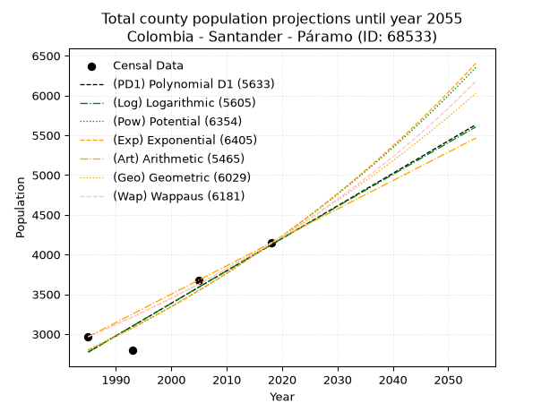
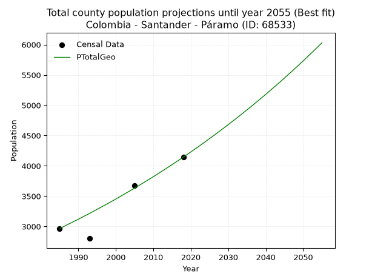
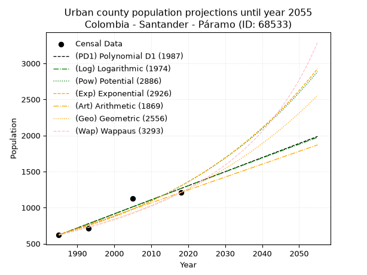
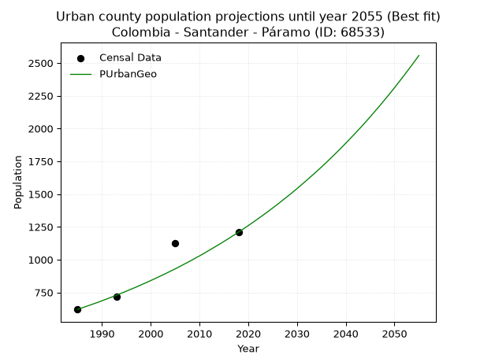
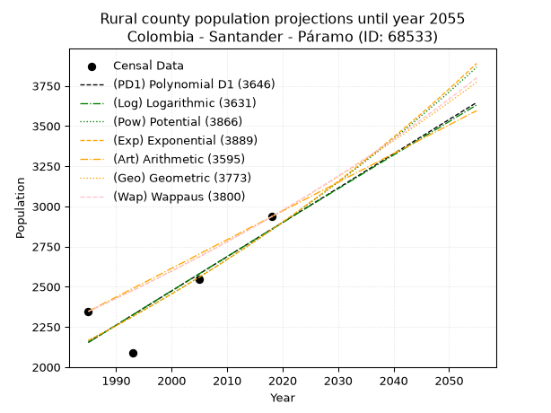

<div align="center">


</div>

# _“Population and Public Services Demand Projections (PPSD) until Year 2050 for Colombia - Santander - Páramo (ID: 68533)”_
Keywords: `population` `public-service` `projection` `lineal` `polynomial` `logarithmic` `potential` `exponential` `arithmetic` `geometric` `wappaus` `dane` `colombia` `south-america`

PPSD are analytical estimates used by governments and planners to anticipate future changes in population size, age distribution, and the resulting community needs for utilities, healthcare, education, and infrastructure as sizing future water treatment facilities, electrical grids, and road networks based on spatial growth.

> **General running parameters**: • app_version: _v20260806_. • Python version: _3.14.7_. • Pandas version: _3.0.5_. • NumPy version: _2.5.1_. • Creates, save and include plots into reports (create_plot): _False_. • Projection until year: _2050_. • Process polynomial degree 2 and up: _False_. • Process Wappaus: _True_. • Process Wappaus: _True_. • Set negative values to zero: _True_. • Set infinite values to zero: _True_. • Drop dataset notes: _True_. 
<div align="center">

Dynamic map: [:earth_americas:Google](http://maps.google.com/maps?q=6.41681123,-73.1702202) [:earth_americas:OSM](https://www.openstreetmap.org/#map=18/6.41681123/-73.1702202&layers=P) [:earth_americas:Bing](https://www.bing.com/maps?cp=6.41681123~-73.1702202&lvl=18) [:earth_americas:Apple](https://maps.apple.com/frame?center=6.41681123%2C-73.1702202&span=0.003%2C0.006)

</div>


<div align="center">

```geojson
{
  "type": "Feature",
  "geometry": {
    "type": "Point", 
    "coordinates": [-73.1702202, 6.41681123]
  }, 
  "properties": {
    "Name": "Colombia - Santander - Páramo (ID: 68533)"
  }
}
```

</div>


## 0. Census Data (4 records)

Census data are official statistics collected by a government about the people and housing in a country. They usually include counts of total population, age, sex, race, income, education, and jobs.

📅Global census file: [Population.xlsx](../data/Population.xlsx)

| Source   |   Year |   CountryID | CountryName   |   StateID | StateName   |   CountyID | CountyName   |   PTotal |   PUrban |   PRural |
|:---------|-------:|------------:|:--------------|----------:|:------------|-----------:|:-------------|---------:|---------:|---------:|
| DANE     |   1985 |          57 | Colombia      |        68 | Santander   |      68533 | Páramo       |     2966 |      620 |     2346 |
| DANE     |   1993 |          57 | Colombia      |        68 | Santander   |      68533 | Páramo       |     2802 |      715 |     2087 |
| DANE     |   2005 |          57 | Colombia      |        68 | Santander   |      68533 | Páramo       |     3671 |     1125 |     2546 |
| DANE     |   2018 |          57 | Colombia      |        68 | Santander   |      68533 | Páramo       |     4144 |     1209 |     2935 |

> 🔥Some records has specific notes about the registered values or the corresponding urban or rural distribution.

## 1. Total

### 1.1. Coefficients and Parameters

* (PD1) Polynomial Deg 1: 40.86270574066605, -78339.87715776726 (lineal)
* (Log) Logarithmic: 81760.65053665699, -618067.6099178641
* (Pow) Potential: 23.65396304861357, -74.55806502073176
* (Exp) Exponential: 0.0118213753438576, 1.804102473762465e-07
* (Art) Arithmetic: Year diff. 2018 - 1985 = 33, Population diff. 4144 - 2966 = 1178, Annual growth = 35.696969696969695
* (Geo) Geometric: Year diff. 2018 - 1985 = 33, Population diff. 4144 - 2966 = 1178, Annual growth % = 0.010186296164591546
* (Wap) Wappaus: i = 1.0041341686911307, Condition values only valid for < 200)

<sub>
Wappaus condition values: ['0.00', '1.00', '2.01', '3.01', '4.02', '5.02', '6.02', '7.03', '8.03', '9.04', '10.04', '11.05', '12.05', '13.05', '14.06', '15.06', '16.07', '17.07', '18.07', '19.08', '20.08', '21.09', '22.09', '23.10', '24.10', '25.10', '26.11', '27.11', '28.12', '29.12', '30.12', '31.13', '32.13', '33.14', '34.14', '35.14', '36.15', '37.15', '38.16', '39.16', '40.17', '41.17', '42.17', '43.18', '44.18', '45.19', '46.19', '47.19', '48.20', '49.20', '50.21', '51.21', '52.21', '53.22', '54.22', '55.23', '56.23', '57.24', '58.24', '59.24', '60.25', '61.25', '62.26', '63.26', '64.26', '65.27']
</sub>


### 1.2. Projected Dataset

|   Year |   CountyID |   PTotalPD1 |   PTotalLog |   PTotalPow |   PTotalExp |   PTotalArt |   PTotalGeo |   PTotalWap |
|-------:|-----------:|------------:|------------:|------------:|------------:|------------:|------------:|------------:|
|   1985 |      68533 |        2773 |        2772 |        2799 |        2800 |        2966 |        2966 |        2966 |
|   1986 |      68533 |        2813 |        2813 |        2833 |        2833 |        3002 |        2996 |        2996 |
|   1987 |      68533 |        2854 |        2854 |        2867 |        2867 |        3037 |        3027 |        3026 |
|   1988 |      68533 |        2895 |        2895 |        2901 |        2901 |        3073 |        3058 |        3057 |
|   1989 |      68533 |        2936 |        2936 |        2936 |        2936 |        3109 |        3089 |        3088 |
|   1990 |      68533 |        2977 |        2977 |        2971 |        2971 |        3144 |        3120 |        3119 |
|   1991 |      68533 |        3018 |        3018 |        3006 |        3006 |        3180 |        3152 |        3150 |
|   1992 |      68533 |        3059 |        3059 |        3042 |        3042 |        3216 |        3184 |        3182 |
|   1993 |      68533 |        3099 |        3100 |        3079 |        3078 |        3252 |        3216 |        3214 |
|   1994 |      68533 |        3140 |        3141 |        3115 |        3114 |        3287 |        3249 |        3247 |
|   1995 |      68533 |        3181 |        3182 |        3153 |        3151 |        3323 |        3282 |        3280 |
|   1996 |      68533 |        3222 |        3223 |        3190 |        3189 |        3359 |        3316 |        3313 |
|   1997 |      68533 |        3263 |        3264 |        3228 |        3227 |        3394 |        3350 |        3346 |
|   1998 |      68533 |        3304 |        3305 |        3267 |        3265 |        3430 |        3384 |        3380 |
|   1999 |      68533 |        3345 |        3346 |        3306 |        3304 |        3466 |        3418 |        3414 |
|   2000 |      68533 |        3386 |        3387 |        3345 |        3343 |        3501 |        3453 |        3449 |
|   2001 |      68533 |        3426 |        3428 |        3385 |        3383 |        3537 |        3488 |        3484 |
|   2002 |      68533 |        3467 |        3469 |        3425 |        3423 |        3573 |        3524 |        3520 |
|   2003 |      68533 |        3508 |        3510 |        3466 |        3464 |        3609 |        3560 |        3555 |
|   2004 |      68533 |        3549 |        3550 |        3507 |        3505 |        3644 |        3596 |        3592 |
|   2005 |      68533 |        3590 |        3591 |        3548 |        3547 |        3680 |        3632 |        3628 |
|   2006 |      68533 |        3631 |        3632 |        3590 |        3589 |        3716 |        3669 |        3665 |
|   2007 |      68533 |        3672 |        3673 |        3633 |        3632 |        3751 |        3707 |        3703 |
|   2008 |      68533 |        3712 |        3714 |        3676 |        3675 |        3787 |        3745 |        3740 |
|   2009 |      68533 |        3753 |        3754 |        3720 |        3719 |        3823 |        3783 |        3779 |
|   2010 |      68533 |        3794 |        3795 |        3764 |        3763 |        3858 |        3821 |        3817 |
|   2011 |      68533 |        3835 |        3836 |        3808 |        3808 |        3894 |        3860 |        3857 |
|   2012 |      68533 |        3876 |        3876 |        3853 |        3853 |        3930 |        3900 |        3896 |
|   2013 |      68533 |        3917 |        3917 |        3899 |        3899 |        3966 |        3939 |        3936 |
|   2014 |      68533 |        3958 |        3957 |        3945 |        3945 |        4001 |        3979 |        3977 |
|   2015 |      68533 |        3998 |        3998 |        3991 |        3992 |        4037 |        4020 |        4018 |
|   2016 |      68533 |        4039 |        4039 |        4039 |        4039 |        4073 |        4061 |        4059 |
|   2017 |      68533 |        4080 |        4079 |        4086 |        4087 |        4108 |        4102 |        4101 |
|   2018 |      68533 |        4121 |        4120 |        4134 |        4136 |        4144 |        4144 |        4144 |
|   2019 |      68533 |        4162 |        4160 |        4183 |        4185 |        4180 |        4186 |        4187 |
|   2020 |      68533 |        4203 |        4201 |        4232 |        4235 |        4215 |        4229 |        4231 |
|   2021 |      68533 |        4244 |        4241 |        4282 |        4285 |        4251 |        4272 |        4275 |
|   2022 |      68533 |        4285 |        4282 |        4333 |        4336 |        4287 |        4315 |        4319 |
|   2023 |      68533 |        4325 |        4322 |        4384 |        4388 |        4322 |        4359 |        4365 |
|   2024 |      68533 |        4366 |        4362 |        4435 |        4440 |        4358 |        4404 |        4410 |
|   2025 |      68533 |        4407 |        4403 |        4487 |        4493 |        4394 |        4449 |        4457 |
|   2026 |      68533 |        4448 |        4443 |        4540 |        4546 |        4430 |        4494 |        4504 |
|   2027 |      68533 |        4489 |        4484 |        4593 |        4600 |        4465 |        4540 |        4551 |
|   2028 |      68533 |        4530 |        4524 |        4647 |        4655 |        4501 |        4586 |        4599 |
|   2029 |      68533 |        4571 |        4564 |        4702 |        4710 |        4537 |        4633 |        4648 |
|   2030 |      68533 |        4611 |        4604 |        4757 |        4766 |        4572 |        4680 |        4697 |
|   2031 |      68533 |        4652 |        4645 |        4813 |        4823 |        4608 |        4728 |        4747 |
|   2032 |      68533 |        4693 |        4685 |        4869 |        4880 |        4644 |        4776 |        4798 |
|   2033 |      68533 |        4734 |        4725 |        4926 |        4939 |        4679 |        4824 |        4849 |
|   2034 |      68533 |        4775 |        4765 |        4984 |        4997 |        4715 |        4874 |        4902 |
|   2035 |      68533 |        4816 |        4806 |        5042 |        5057 |        4751 |        4923 |        4954 |
|   2036 |      68533 |        4857 |        4846 |        5101 |        5117 |        4787 |        4973 |        5008 |
|   2037 |      68533 |        4897 |        4886 |        5160 |        5178 |        4822 |        5024 |        5062 |
|   2038 |      68533 |        4938 |        4926 |        5221 |        5239 |        4858 |        5075 |        5117 |
|   2039 |      68533 |        4979 |        4966 |        5282 |        5302 |        4894 |        5127 |        5172 |
|   2040 |      68533 |        5020 |        5006 |        5343 |        5365 |        4929 |        5179 |        5229 |
|   2041 |      68533 |        5061 |        5046 |        5406 |        5428 |        4965 |        5232 |        5286 |
|   2042 |      68533 |        5102 |        5086 |        5469 |        5493 |        5001 |        5285 |        5344 |
|   2043 |      68533 |        5143 |        5126 |        5532 |        5558 |        5036 |        5339 |        5403 |
|   2044 |      68533 |        5183 |        5166 |        5597 |        5624 |        5072 |        5393 |        5463 |
|   2045 |      68533 |        5224 |        5206 |        5662 |        5691 |        5108 |        5448 |        5523 |
|   2046 |      68533 |        5265 |        5246 |        5728 |        5759 |        5144 |        5504 |        5585 |
|   2047 |      68533 |        5306 |        5286 |        5794 |        5827 |        5179 |        5560 |        5647 |
|   2048 |      68533 |        5347 |        5326 |        5862 |        5897 |        5215 |        5616 |        5710 |
|   2049 |      68533 |        5388 |        5366 |        5930 |        5967 |        5251 |        5674 |        5775 |
|   2050 |      68533 |        5429 |        5406 |        5998 |        6038 |        5286 |        5731 |        5840 |
<div align="center">

</img>

</div>


### 1.3. Best fit with absolute error and relative error (%)

Relative error puts that difference into context by dividing the absolute error by the true value, creating a unitless ratio or percentage that shows the scale of the mistake.

Absolute and relative error

|   Year | Source   |   CountryID | CountryName   |   StateID | StateName   |   CountyID_x | CountyName   |   PTotal |   PUrban |   PRural |   CountyID_y |   PTotalPD1 |   PTotalLog |   PTotalPow |   PTotalExp |   PTotalArt |   PTotalGeo |   PTotalWap |   PTotalPD1AbsError |   PTotalLogAbsError |   PTotalPowAbsError |   PTotalExpAbsError |   PTotalArtAbsError |   PTotalGeoAbsError |   PTotalWapAbsError |   PTotalPD1RelError |   PTotalLogRelError |   PTotalPowRelError |   PTotalExpRelError |   PTotalArtRelError |   PTotalGeoRelError |   PTotalWapRelError |
|-------:|:---------|------------:|:--------------|----------:|:------------|-------------:|:-------------|---------:|---------:|---------:|-------------:|------------:|------------:|------------:|------------:|------------:|------------:|------------:|--------------------:|--------------------:|--------------------:|--------------------:|--------------------:|--------------------:|--------------------:|--------------------:|--------------------:|--------------------:|--------------------:|--------------------:|--------------------:|--------------------:|
|   1985 | DANE     |          57 | Colombia      |        68 | Santander   |        68533 | Páramo       |     2966 |      620 |     2346 |        68533 |        2773 |        2772 |        2799 |        2800 |        2966 |        2966 |        2966 |                 193 |                 194 |                 167 |                 166 |                   0 |                   0 |                   0 |            6.50708  |            6.5408   |            5.63048  |             5.59676 |            0        |             0       |             0       |
|   1993 | DANE     |          57 | Colombia      |        68 | Santander   |        68533 | Páramo       |     2802 |      715 |     2087 |        68533 |        3099 |        3100 |        3079 |        3078 |        3252 |        3216 |        3214 |                 297 |                 298 |                 277 |                 276 |                 450 |                 414 |                 412 |           10.5996   |           10.6353   |            9.8858   |             9.85011 |           16.06     |            14.7752  |            14.7038  |
|   2005 | DANE     |          57 | Colombia      |        68 | Santander   |        68533 | Páramo       |     3671 |     1125 |     2546 |        68533 |        3590 |        3591 |        3548 |        3547 |        3680 |        3632 |        3628 |                  81 |                  80 |                 123 |                 124 |                   9 |                  39 |                  43 |            2.20648  |            2.17924  |            3.35059  |             3.37783 |            0.245165 |             1.06238 |             1.17134 |
|   2018 | DANE     |          57 | Colombia      |        68 | Santander   |        68533 | Páramo       |     4144 |     1209 |     2935 |        68533 |        4121 |        4120 |        4134 |        4136 |        4144 |        4144 |        4144 |                  23 |                  24 |                  10 |                   8 |                   0 |                   0 |                   0 |            0.555019 |            0.579151 |            0.241313 |             0.19305 |            0        |             0       |             0       |

Relative error mean

| Method    |   RelError | Best   |
|:----------|-----------:|:-------|
| PTotalPD1 |    4.96704 |        |
| PTotalLog |    4.98361 |        |
| PTotalPow |    4.77704 |        |
| PTotalExp |    4.75444 |        |
| PTotalArt |    4.07628 |        |
| PTotalGeo |    3.95939 | True   |
| PTotalWap |    3.96878 |        |

💙Best method: _**PTotalGeo**_
<div align="center">

</img>

</div>


### 1.4. Fresh water supply demand in liters per capita per day (lpcd)

The fresh water supply demand typically ranges from 100 to 300 liters per capita per day (lpcd) for standard domestic and municipal planning, though absolute survival minimums set by the World Health Organization are as low as 7.5 to 20 liters per day, and total consumption in high-income nations can exceed 400 liters.

> `CZ`: Level in meters above the sea level (masl).<br> `WS`: Fresh water supply demand in liters per capita per day (lpcd or l/h/d).<br> `WSAll`: Zonal fresh water supply demand in liters per second (l/s).<br> `A`: Zonal area in square meters.

Reference values (RAS Colombia)

|    CZ |   WS |
|------:|-----:|
|  1000 |  120 |
|  2000 |  130 |
| 99999 |  140 |

County shapefile geometry properties and water supply values

|   CountyID |      ATotal |   CZTotal |   WSTotal |
|-----------:|------------:|----------:|----------:|
|      68533 | 7.28469e+07 |   1561.69 |       130 |

Projected values for best method: PTotalGeo

|   CountyID |   Year |   PTotalGeo |   WSTotal |   WSTotalAll |
|-----------:|-------:|------------:|----------:|-------------:|
|      68533 |   1985 |        2966 |       130 |      4.46273 |
|      68533 |   1986 |        2996 |       130 |      4.50787 |
|      68533 |   1987 |        3027 |       130 |      4.55451 |
|      68533 |   1988 |        3058 |       130 |      4.60116 |
|      68533 |   1989 |        3089 |       130 |      4.6478  |
|      68533 |   1990 |        3120 |       130 |      4.69444 |
|      68533 |   1991 |        3152 |       130 |      4.74259 |
|      68533 |   1992 |        3184 |       130 |      4.79074 |
|      68533 |   1993 |        3216 |       130 |      4.83889 |
|      68533 |   1994 |        3249 |       130 |      4.88854 |
|      68533 |   1995 |        3282 |       130 |      4.93819 |
|      68533 |   1996 |        3316 |       130 |      4.98935 |
|      68533 |   1997 |        3350 |       130 |      5.04051 |
|      68533 |   1998 |        3384 |       130 |      5.09167 |
|      68533 |   1999 |        3418 |       130 |      5.14282 |
|      68533 |   2000 |        3453 |       130 |      5.19549 |
|      68533 |   2001 |        3488 |       130 |      5.24815 |
|      68533 |   2002 |        3524 |       130 |      5.30231 |
|      68533 |   2003 |        3560 |       130 |      5.35648 |
|      68533 |   2004 |        3596 |       130 |      5.41065 |
|      68533 |   2005 |        3632 |       130 |      5.46481 |
|      68533 |   2006 |        3669 |       130 |      5.52049 |
|      68533 |   2007 |        3707 |       130 |      5.57766 |
|      68533 |   2008 |        3745 |       130 |      5.63484 |
|      68533 |   2009 |        3783 |       130 |      5.69201 |
|      68533 |   2010 |        3821 |       130 |      5.74919 |
|      68533 |   2011 |        3860 |       130 |      5.80787 |
|      68533 |   2012 |        3900 |       130 |      5.86806 |
|      68533 |   2013 |        3939 |       130 |      5.92674 |
|      68533 |   2014 |        3979 |       130 |      5.98692 |
|      68533 |   2015 |        4020 |       130 |      6.04861 |
|      68533 |   2016 |        4061 |       130 |      6.1103  |
|      68533 |   2017 |        4102 |       130 |      6.17199 |
|      68533 |   2018 |        4144 |       130 |      6.23519 |
|      68533 |   2019 |        4186 |       130 |      6.29838 |
|      68533 |   2020 |        4229 |       130 |      6.36308 |
|      68533 |   2021 |        4272 |       130 |      6.42778 |
|      68533 |   2022 |        4315 |       130 |      6.49248 |
|      68533 |   2023 |        4359 |       130 |      6.55868 |
|      68533 |   2024 |        4404 |       130 |      6.62639 |
|      68533 |   2025 |        4449 |       130 |      6.6941  |
|      68533 |   2026 |        4494 |       130 |      6.76181 |
|      68533 |   2027 |        4540 |       130 |      6.83102 |
|      68533 |   2028 |        4586 |       130 |      6.90023 |
|      68533 |   2029 |        4633 |       130 |      6.97095 |
|      68533 |   2030 |        4680 |       130 |      7.04167 |
|      68533 |   2031 |        4728 |       130 |      7.11389 |
|      68533 |   2032 |        4776 |       130 |      7.18611 |
|      68533 |   2033 |        4824 |       130 |      7.25833 |
|      68533 |   2034 |        4874 |       130 |      7.33356 |
|      68533 |   2035 |        4923 |       130 |      7.40729 |
|      68533 |   2036 |        4973 |       130 |      7.48252 |
|      68533 |   2037 |        5024 |       130 |      7.55926 |
|      68533 |   2038 |        5075 |       130 |      7.636   |
|      68533 |   2039 |        5127 |       130 |      7.71424 |
|      68533 |   2040 |        5179 |       130 |      7.79248 |
|      68533 |   2041 |        5232 |       130 |      7.87222 |
|      68533 |   2042 |        5285 |       130 |      7.95197 |
|      68533 |   2043 |        5339 |       130 |      8.03322 |
|      68533 |   2044 |        5393 |       130 |      8.11447 |
|      68533 |   2045 |        5448 |       130 |      8.19722 |
|      68533 |   2046 |        5504 |       130 |      8.28148 |
|      68533 |   2047 |        5560 |       130 |      8.36574 |
|      68533 |   2048 |        5616 |       130 |      8.45    |
|      68533 |   2049 |        5674 |       130 |      8.53727 |
|      68533 |   2050 |        5731 |       130 |      8.62303 |

## 2. Urban

### 2.1. Coefficients and Parameters

* (PD1) Polynomial Deg 1: 19.533922119630592, -38155.47771979109 (lineal)
* (Log) Logarithmic: 39113.71456829938, -296386.407871281
* (Pow) Potential: 43.89620327538141, -141.95962683695677
* (Exp) Exponential: 0.021919756914198504, 8.006271001277429e-17
* (Art) Arithmetic: Year diff. 2018 - 1985 = 33, Population diff. 1209 - 620 = 589, Annual growth = 17.848484848484848
* (Geo) Geometric: Year diff. 2018 - 1985 = 33, Population diff. 1209 - 620 = 589, Annual growth % = 0.02044341529962046
* (Wap) Wappaus: i = 1.9517205957883923, Condition values only valid for < 200)

<sub>
Wappaus condition values: ['0.00', '1.95', '3.90', '5.86', '7.81', '9.76', '11.71', '13.66', '15.61', '17.57', '19.52', '21.47', '23.42', '25.37', '27.32', '29.28', '31.23', '33.18', '35.13', '37.08', '39.03', '40.99', '42.94', '44.89', '46.84', '48.79', '50.74', '52.70', '54.65', '56.60', '58.55', '60.50', '62.46', '64.41', '66.36', '68.31', '70.26', '72.21', '74.17', '76.12', '78.07', '80.02', '81.97', '83.92', '85.88', '87.83', '89.78', '91.73', '93.68', '95.63', '97.59', '99.54', '101.49', '103.44', '105.39', '107.34', '109.30', '111.25', '113.20', '115.15', '117.10', '119.05', '121.01', '122.96', '124.91', '126.86']
</sub>


### 2.2. Projected Dataset

|   Year |   CountyID |   PUrbanPD1 |   PUrbanLog |   PUrbanPow |   PUrbanExp |   PUrbanArt |   PUrbanGeo |   PUrbanWap |
|-------:|-----------:|------------:|------------:|------------:|------------:|------------:|------------:|------------:|
|   1985 |      68533 |         619 |         619 |         630 |         631 |         620 |         620 |         620 |
|   1986 |      68533 |         639 |         638 |         644 |         645 |         638 |         633 |         632 |
|   1987 |      68533 |         658 |         658 |         659 |         659 |         656 |         646 |         645 |
|   1988 |      68533 |         678 |         678 |         673 |         674 |         674 |         659 |         657 |
|   1989 |      68533 |         697 |         697 |         689 |         689 |         691 |         672 |         670 |
|   1990 |      68533 |         717 |         717 |         704 |         704 |         709 |         686 |         684 |
|   1991 |      68533 |         737 |         737 |         720 |         719 |         727 |         700 |         697 |
|   1992 |      68533 |         756 |         756 |         736 |         735 |         745 |         714 |         711 |
|   1993 |      68533 |         776 |         776 |         752 |         752 |         763 |         729 |         725 |
|   1994 |      68533 |         795 |         796 |         769 |         768 |         781 |         744 |         739 |
|   1995 |      68533 |         815 |         815 |         786 |         785 |         798 |         759 |         754 |
|   1996 |      68533 |         834 |         835 |         803 |         803 |         816 |         775 |         769 |
|   1997 |      68533 |         854 |         854 |         821 |         821 |         834 |         790 |         784 |
|   1998 |      68533 |         873 |         874 |         839 |         839 |         852 |         807 |         800 |
|   1999 |      68533 |         893 |         894 |         858 |         857 |         870 |         823 |         816 |
|   2000 |      68533 |         912 |         913 |         877 |         876 |         888 |         840 |         833 |
|   2001 |      68533 |         932 |         933 |         897 |         896 |         906 |         857 |         849 |
|   2002 |      68533 |         951 |         952 |         916 |         916 |         923 |         875 |         867 |
|   2003 |      68533 |         971 |         972 |         937 |         936 |         941 |         892 |         884 |
|   2004 |      68533 |         991 |         991 |         958 |         957 |         959 |         911 |         902 |
|   2005 |      68533 |        1010 |        1011 |         979 |         978 |         977 |         929 |         921 |
|   2006 |      68533 |        1030 |        1030 |        1000 |        1000 |         995 |         948 |         940 |
|   2007 |      68533 |        1049 |        1050 |        1023 |        1022 |        1013 |         968 |         959 |
|   2008 |      68533 |        1069 |        1069 |        1045 |        1044 |        1031 |         987 |         979 |
|   2009 |      68533 |        1088 |        1089 |        1068 |        1067 |        1048 |        1008 |         999 |
|   2010 |      68533 |        1108 |        1108 |        1092 |        1091 |        1066 |        1028 |        1020 |
|   2011 |      68533 |        1127 |        1128 |        1116 |        1115 |        1084 |        1049 |        1042 |
|   2012 |      68533 |        1147 |        1147 |        1141 |        1140 |        1102 |        1071 |        1064 |
|   2013 |      68533 |        1166 |        1167 |        1166 |        1165 |        1120 |        1093 |        1086 |
|   2014 |      68533 |        1186 |        1186 |        1191 |        1191 |        1138 |        1115 |        1109 |
|   2015 |      68533 |        1205 |        1205 |        1218 |        1218 |        1155 |        1138 |        1133 |
|   2016 |      68533 |        1225 |        1225 |        1244 |        1245 |        1173 |        1161 |        1158 |
|   2017 |      68533 |        1244 |        1244 |        1272 |        1272 |        1191 |        1185 |        1183 |
|   2018 |      68533 |        1264 |        1264 |        1300 |        1300 |        1209 |        1209 |        1209 |
|   2019 |      68533 |        1284 |        1283 |        1328 |        1329 |        1227 |        1234 |        1236 |
|   2020 |      68533 |        1303 |        1302 |        1358 |        1359 |        1245 |        1259 |        1263 |
|   2021 |      68533 |        1323 |        1322 |        1387 |        1389 |        1263 |        1285 |        1292 |
|   2022 |      68533 |        1342 |        1341 |        1418 |        1419 |        1280 |        1311 |        1321 |
|   2023 |      68533 |        1362 |        1360 |        1449 |        1451 |        1298 |        1338 |        1351 |
|   2024 |      68533 |        1381 |        1380 |        1481 |        1483 |        1316 |        1365 |        1382 |
|   2025 |      68533 |        1401 |        1399 |        1513 |        1516 |        1334 |        1393 |        1414 |
|   2026 |      68533 |        1420 |        1418 |        1546 |        1550 |        1352 |        1421 |        1447 |
|   2027 |      68533 |        1440 |        1438 |        1580 |        1584 |        1370 |        1451 |        1481 |
|   2028 |      68533 |        1459 |        1457 |        1615 |        1619 |        1387 |        1480 |        1517 |
|   2029 |      68533 |        1479 |        1476 |        1650 |        1655 |        1405 |        1510 |        1553 |
|   2030 |      68533 |        1498 |        1495 |        1686 |        1692 |        1423 |        1541 |        1591 |
|   2031 |      68533 |        1518 |        1515 |        1723 |        1729 |        1441 |        1573 |        1630 |
|   2032 |      68533 |        1537 |        1534 |        1761 |        1767 |        1459 |        1605 |        1671 |
|   2033 |      68533 |        1557 |        1553 |        1799 |        1806 |        1477 |        1638 |        1713 |
|   2034 |      68533 |        1577 |        1572 |        1838 |        1847 |        1495 |        1671 |        1756 |
|   2035 |      68533 |        1596 |        1592 |        1878 |        1887 |        1512 |        1705 |        1802 |
|   2036 |      68533 |        1616 |        1611 |        1919 |        1929 |        1530 |        1740 |        1849 |
|   2037 |      68533 |        1635 |        1630 |        1961 |        1972 |        1548 |        1776 |        1897 |
|   2038 |      68533 |        1655 |        1649 |        2004 |        2016 |        1566 |        1812 |        1948 |
|   2039 |      68533 |        1674 |        1668 |        2048 |        2060 |        1584 |        1849 |        2001 |
|   2040 |      68533 |        1694 |        1688 |        2092 |        2106 |        1602 |        1887 |        2057 |
|   2041 |      68533 |        1713 |        1707 |        2138 |        2153 |        1620 |        1926 |        2114 |
|   2042 |      68533 |        1733 |        1726 |        2184 |        2200 |        1637 |        1965 |        2174 |
|   2043 |      68533 |        1752 |        1745 |        2231 |        2249 |        1655 |        2005 |        2237 |
|   2044 |      68533 |        1772 |        1764 |        2280 |        2299 |        1673 |        2046 |        2303 |
|   2045 |      68533 |        1791 |        1783 |        2329 |        2350 |        1691 |        2088 |        2372 |
|   2046 |      68533 |        1811 |        1803 |        2380 |        2402 |        1709 |        2131 |        2444 |
|   2047 |      68533 |        1830 |        1822 |        2432 |        2455 |        1727 |        2174 |        2520 |
|   2048 |      68533 |        1850 |        1841 |        2484 |        2510 |        1744 |        2219 |        2599 |
|   2049 |      68533 |        1870 |        1860 |        2538 |        2565 |        1762 |        2264 |        2683 |
|   2050 |      68533 |        1889 |        1879 |        2593 |        2622 |        1780 |        2310 |        2771 |
<div align="center">

</img>

</div>


### 2.3. Best fit with absolute error and relative error (%)

Relative error puts that difference into context by dividing the absolute error by the true value, creating a unitless ratio or percentage that shows the scale of the mistake.

Absolute and relative error

|   Year | Source   |   CountryID | CountryName   |   StateID | StateName   |   CountyID_x | CountyName   |   PTotal |   PUrban |   PRural |   CountyID_y |   PUrbanPD1 |   PUrbanLog |   PUrbanPow |   PUrbanExp |   PUrbanArt |   PUrbanGeo |   PUrbanWap |   PUrbanPD1AbsError |   PUrbanLogAbsError |   PUrbanPowAbsError |   PUrbanExpAbsError |   PUrbanArtAbsError |   PUrbanGeoAbsError |   PUrbanWapAbsError |   PUrbanPD1RelError |   PUrbanLogRelError |   PUrbanPowRelError |   PUrbanExpRelError |   PUrbanArtRelError |   PUrbanGeoRelError |   PUrbanWapRelError |
|-------:|:---------|------------:|:--------------|----------:|:------------|-------------:|:-------------|---------:|---------:|---------:|-------------:|------------:|------------:|------------:|------------:|------------:|------------:|------------:|--------------------:|--------------------:|--------------------:|--------------------:|--------------------:|--------------------:|--------------------:|--------------------:|--------------------:|--------------------:|--------------------:|--------------------:|--------------------:|--------------------:|
|   1985 | DANE     |          57 | Colombia      |        68 | Santander   |        68533 | Páramo       |     2966 |      620 |     2346 |        68533 |         619 |         619 |         630 |         631 |         620 |         620 |         620 |                   1 |                   1 |                  10 |                  11 |                   0 |                   0 |                   0 |             0.16129 |             0.16129 |             1.6129  |             1.77419 |             0       |             0       |              0      |
|   1993 | DANE     |          57 | Colombia      |        68 | Santander   |        68533 | Páramo       |     2802 |      715 |     2087 |        68533 |         776 |         776 |         752 |         752 |         763 |         729 |         725 |                  61 |                  61 |                  37 |                  37 |                  48 |                  14 |                  10 |             8.53147 |             8.53147 |             5.17483 |             5.17483 |             6.71329 |             1.95804 |              1.3986 |
|   2005 | DANE     |          57 | Colombia      |        68 | Santander   |        68533 | Páramo       |     3671 |     1125 |     2546 |        68533 |        1010 |        1011 |         979 |         978 |         977 |         929 |         921 |                 115 |                 114 |                 146 |                 147 |                 148 |                 196 |                 204 |            10.2222  |            10.1333  |            12.9778  |            13.0667  |            13.1556  |            17.4222  |             18.1333 |
|   2018 | DANE     |          57 | Colombia      |        68 | Santander   |        68533 | Páramo       |     4144 |     1209 |     2935 |        68533 |        1264 |        1264 |        1300 |        1300 |        1209 |        1209 |        1209 |                  55 |                  55 |                  91 |                  91 |                   0 |                   0 |                   0 |             4.54921 |             4.54921 |             7.52688 |             7.52688 |             0       |             0       |              0      |

Relative error mean

| Method    |   RelError | Best   |
|:----------|-----------:|:-------|
| PUrbanPD1 |    5.86605 |        |
| PUrbanLog |    5.84383 |        |
| PUrbanPow |    6.8231  |        |
| PUrbanExp |    6.88564 |        |
| PUrbanArt |    4.96721 |        |
| PUrbanGeo |    4.84507 | True   |
| PUrbanWap |    4.88298 |        |

💙Best method: _**PUrbanGeo**_
<div align="center">

</img>

</div>


### 2.4. Fresh water supply demand in liters per capita per day (lpcd)

The fresh water supply demand typically ranges from 100 to 300 liters per capita per day (lpcd) for standard domestic and municipal planning, though absolute survival minimums set by the World Health Organization are as low as 7.5 to 20 liters per day, and total consumption in high-income nations can exceed 400 liters.

> `CZ`: Level in meters above the sea level (masl).<br> `WS`: Fresh water supply demand in liters per capita per day (lpcd or l/h/d).<br> `WSAll`: Zonal fresh water supply demand in liters per second (l/s).<br> `A`: Zonal area in square meters.

Reference values (RAS Colombia)

|    CZ |   WS |
|------:|-----:|
|  1000 |  120 |
|  2000 |  130 |
| 99999 |  140 |

County shapefile geometry properties and water supply values

|   CountyID |   AUrban |   CZUrban |   WSUrban |
|-----------:|---------:|----------:|----------:|
|      68533 |   202749 |   1402.25 |       130 |

Projected values for best method: PUrbanGeo

|   CountyID |   Year |   PUrbanGeo |   WSUrban |   WSUrbanAll |
|-----------:|-------:|------------:|----------:|-------------:|
|      68533 |   1985 |         620 |       130 |     0.93287  |
|      68533 |   1986 |         633 |       130 |     0.952431 |
|      68533 |   1987 |         646 |       130 |     0.971991 |
|      68533 |   1988 |         659 |       130 |     0.991551 |
|      68533 |   1989 |         672 |       130 |     1.01111  |
|      68533 |   1990 |         686 |       130 |     1.03218  |
|      68533 |   1991 |         700 |       130 |     1.05324  |
|      68533 |   1992 |         714 |       130 |     1.07431  |
|      68533 |   1993 |         729 |       130 |     1.09688  |
|      68533 |   1994 |         744 |       130 |     1.11944  |
|      68533 |   1995 |         759 |       130 |     1.14201  |
|      68533 |   1996 |         775 |       130 |     1.16609  |
|      68533 |   1997 |         790 |       130 |     1.18866  |
|      68533 |   1998 |         807 |       130 |     1.21424  |
|      68533 |   1999 |         823 |       130 |     1.23831  |
|      68533 |   2000 |         840 |       130 |     1.26389  |
|      68533 |   2001 |         857 |       130 |     1.28947  |
|      68533 |   2002 |         875 |       130 |     1.31655  |
|      68533 |   2003 |         892 |       130 |     1.34213  |
|      68533 |   2004 |         911 |       130 |     1.37072  |
|      68533 |   2005 |         929 |       130 |     1.3978   |
|      68533 |   2006 |         948 |       130 |     1.42639  |
|      68533 |   2007 |         968 |       130 |     1.45648  |
|      68533 |   2008 |         987 |       130 |     1.48507  |
|      68533 |   2009 |        1008 |       130 |     1.51667  |
|      68533 |   2010 |        1028 |       130 |     1.54676  |
|      68533 |   2011 |        1049 |       130 |     1.57836  |
|      68533 |   2012 |        1071 |       130 |     1.61146  |
|      68533 |   2013 |        1093 |       130 |     1.64456  |
|      68533 |   2014 |        1115 |       130 |     1.67766  |
|      68533 |   2015 |        1138 |       130 |     1.71227  |
|      68533 |   2016 |        1161 |       130 |     1.74687  |
|      68533 |   2017 |        1185 |       130 |     1.78299  |
|      68533 |   2018 |        1209 |       130 |     1.8191   |
|      68533 |   2019 |        1234 |       130 |     1.85671  |
|      68533 |   2020 |        1259 |       130 |     1.89433  |
|      68533 |   2021 |        1285 |       130 |     1.93345  |
|      68533 |   2022 |        1311 |       130 |     1.97257  |
|      68533 |   2023 |        1338 |       130 |     2.01319  |
|      68533 |   2024 |        1365 |       130 |     2.05382  |
|      68533 |   2025 |        1393 |       130 |     2.09595  |
|      68533 |   2026 |        1421 |       130 |     2.13808  |
|      68533 |   2027 |        1451 |       130 |     2.18322  |
|      68533 |   2028 |        1480 |       130 |     2.22685  |
|      68533 |   2029 |        1510 |       130 |     2.27199  |
|      68533 |   2030 |        1541 |       130 |     2.31863  |
|      68533 |   2031 |        1573 |       130 |     2.36678  |
|      68533 |   2032 |        1605 |       130 |     2.41493  |
|      68533 |   2033 |        1638 |       130 |     2.46458  |
|      68533 |   2034 |        1671 |       130 |     2.51424  |
|      68533 |   2035 |        1705 |       130 |     2.56539  |
|      68533 |   2036 |        1740 |       130 |     2.61806  |
|      68533 |   2037 |        1776 |       130 |     2.67222  |
|      68533 |   2038 |        1812 |       130 |     2.72639  |
|      68533 |   2039 |        1849 |       130 |     2.78206  |
|      68533 |   2040 |        1887 |       130 |     2.83924  |
|      68533 |   2041 |        1926 |       130 |     2.89792  |
|      68533 |   2042 |        1965 |       130 |     2.9566   |
|      68533 |   2043 |        2005 |       130 |     3.01678  |
|      68533 |   2044 |        2046 |       130 |     3.07847  |
|      68533 |   2045 |        2088 |       130 |     3.14167  |
|      68533 |   2046 |        2131 |       130 |     3.20637  |
|      68533 |   2047 |        2174 |       130 |     3.27106  |
|      68533 |   2048 |        2219 |       130 |     3.33877  |
|      68533 |   2049 |        2264 |       130 |     3.40648  |
|      68533 |   2050 |        2310 |       130 |     3.47569  |

## 3. Rural

### 3.1. Coefficients and Parameters

* (PD1) Polynomial Deg 1: 21.328783621035463, -40184.39943797618 (lineal)
* (Log) Logarithmic: 42646.93596835761, -321681.20204658306
* (Pow) Potential: 16.736614551999835, -51.85800465310047
* (Exp) Exponential: 0.008370396510071456, 0.00013166986941543773
* (Art) Arithmetic: Year diff. 2018 - 1985 = 33, Population diff. 2935 - 2346 = 589, Annual growth = 17.848484848484848
* (Geo) Geometric: Year diff. 2018 - 1985 = 33, Population diff. 2935 - 2346 = 589, Annual growth % = 0.006810837553768989
* (Wap) Wappaus: i = 0.6759509505201609, Condition values only valid for < 200)

<sub>
Wappaus condition values: ['0.00', '0.68', '1.35', '2.03', '2.70', '3.38', '4.06', '4.73', '5.41', '6.08', '6.76', '7.44', '8.11', '8.79', '9.46', '10.14', '10.82', '11.49', '12.17', '12.84', '13.52', '14.19', '14.87', '15.55', '16.22', '16.90', '17.57', '18.25', '18.93', '19.60', '20.28', '20.95', '21.63', '22.31', '22.98', '23.66', '24.33', '25.01', '25.69', '26.36', '27.04', '27.71', '28.39', '29.07', '29.74', '30.42', '31.09', '31.77', '32.45', '33.12', '33.80', '34.47', '35.15', '35.83', '36.50', '37.18', '37.85', '38.53', '39.21', '39.88', '40.56', '41.23', '41.91', '42.58', '43.26', '43.94']
</sub>


### 3.2. Projected Dataset

|   Year |   CountyID |   PRuralPD1 |   PRuralLog |   PRuralPow |   PRuralExp |   PRuralArt |   PRuralGeo |   PRuralWap |
|-------:|-----------:|------------:|------------:|------------:|------------:|------------:|------------:|------------:|
|   1985 |      68533 |        2153 |        2153 |        2164 |        2165 |        2346 |        2346 |        2346 |
|   1986 |      68533 |        2175 |        2174 |        2183 |        2183 |        2364 |        2362 |        2362 |
|   1987 |      68533 |        2196 |        2196 |        2201 |        2201 |        2382 |        2378 |        2378 |
|   1988 |      68533 |        2217 |        2217 |        2220 |        2220 |        2400 |        2394 |        2394 |
|   1989 |      68533 |        2239 |        2239 |        2239 |        2238 |        2417 |        2411 |        2410 |
|   1990 |      68533 |        2260 |        2260 |        2257 |        2257 |        2435 |        2427 |        2427 |
|   1991 |      68533 |        2281 |        2282 |        2277 |        2276 |        2453 |        2444 |        2443 |
|   1992 |      68533 |        2303 |        2303 |        2296 |        2295 |        2471 |        2460 |        2460 |
|   1993 |      68533 |        2324 |        2324 |        2315 |        2315 |        2489 |        2477 |        2476 |
|   1994 |      68533 |        2345 |        2346 |        2335 |        2334 |        2507 |        2494 |        2493 |
|   1995 |      68533 |        2367 |        2367 |        2354 |        2354 |        2524 |        2511 |        2510 |
|   1996 |      68533 |        2388 |        2389 |        2374 |        2373 |        2542 |        2528 |        2527 |
|   1997 |      68533 |        2409 |        2410 |        2394 |        2393 |        2560 |        2545 |        2544 |
|   1998 |      68533 |        2431 |        2431 |        2414 |        2414 |        2578 |        2562 |        2562 |
|   1999 |      68533 |        2452 |        2453 |        2435 |        2434 |        2596 |        2580 |        2579 |
|   2000 |      68533 |        2473 |        2474 |        2455 |        2454 |        2614 |        2597 |        2597 |
|   2001 |      68533 |        2494 |        2495 |        2476 |        2475 |        2632 |        2615 |        2614 |
|   2002 |      68533 |        2516 |        2517 |        2496 |        2496 |        2649 |        2633 |        2632 |
|   2003 |      68533 |        2537 |        2538 |        2517 |        2517 |        2667 |        2651 |        2650 |
|   2004 |      68533 |        2558 |        2559 |        2539 |        2538 |        2685 |        2669 |        2668 |
|   2005 |      68533 |        2580 |        2580 |        2560 |        2559 |        2703 |        2687 |        2686 |
|   2006 |      68533 |        2601 |        2602 |        2581 |        2581 |        2721 |        2705 |        2704 |
|   2007 |      68533 |        2622 |        2623 |        2603 |        2602 |        2739 |        2724 |        2723 |
|   2008 |      68533 |        2644 |        2644 |        2625 |        2624 |        2757 |        2742 |        2741 |
|   2009 |      68533 |        2665 |        2665 |        2647 |        2646 |        2774 |        2761 |        2760 |
|   2010 |      68533 |        2686 |        2687 |        2669 |        2669 |        2792 |        2780 |        2779 |
|   2011 |      68533 |        2708 |        2708 |        2691 |        2691 |        2810 |        2799 |        2798 |
|   2012 |      68533 |        2729 |        2729 |        2714 |        2714 |        2828 |        2818 |        2817 |
|   2013 |      68533 |        2750 |        2750 |        2736 |        2736 |        2846 |        2837 |        2836 |
|   2014 |      68533 |        2772 |        2771 |        2759 |        2759 |        2864 |        2856 |        2856 |
|   2015 |      68533 |        2793 |        2793 |        2782 |        2783 |        2881 |        2876 |        2875 |
|   2016 |      68533 |        2814 |        2814 |        2805 |        2806 |        2899 |        2895 |        2895 |
|   2017 |      68533 |        2836 |        2835 |        2829 |        2830 |        2917 |        2915 |        2915 |
|   2018 |      68533 |        2857 |        2856 |        2852 |        2853 |        2935 |        2935 |        2935 |
|   2019 |      68533 |        2878 |        2877 |        2876 |        2877 |        2953 |        2955 |        2955 |
|   2020 |      68533 |        2900 |        2898 |        2900 |        2902 |        2971 |        2975 |        2975 |
|   2021 |      68533 |        2921 |        2919 |        2924 |        2926 |        2989 |        2995 |        2996 |
|   2022 |      68533 |        2942 |        2941 |        2948 |        2950 |        3006 |        3016 |        3017 |
|   2023 |      68533 |        2964 |        2962 |        2973 |        2975 |        3024 |        3036 |        3037 |
|   2024 |      68533 |        2985 |        2983 |        2998 |        3000 |        3042 |        3057 |        3058 |
|   2025 |      68533 |        3006 |        3004 |        3022 |        3026 |        3060 |        3078 |        3079 |
|   2026 |      68533 |        3028 |        3025 |        3048 |        3051 |        3078 |        3099 |        3101 |
|   2027 |      68533 |        3049 |        3046 |        3073 |        3077 |        3096 |        3120 |        3122 |
|   2028 |      68533 |        3070 |        3067 |        3098 |        3102 |        3113 |        3141 |        3144 |
|   2029 |      68533 |        3092 |        3088 |        3124 |        3129 |        3131 |        3163 |        3166 |
|   2030 |      68533 |        3113 |        3109 |        3150 |        3155 |        3149 |        3184 |        3188 |
|   2031 |      68533 |        3134 |        3130 |        3176 |        3181 |        3167 |        3206 |        3210 |
|   2032 |      68533 |        3156 |        3151 |        3202 |        3208 |        3185 |        3228 |        3232 |
|   2033 |      68533 |        3177 |        3172 |        3229 |        3235 |        3203 |        3250 |        3255 |
|   2034 |      68533 |        3198 |        3193 |        3255 |        3262 |        3221 |        3272 |        3277 |
|   2035 |      68533 |        3220 |        3214 |        3282 |        3290 |        3238 |        3294 |        3300 |
|   2036 |      68533 |        3241 |        3235 |        3309 |        3317 |        3256 |        3316 |        3323 |
|   2037 |      68533 |        3262 |        3256 |        3337 |        3345 |        3274 |        3339 |        3346 |
|   2038 |      68533 |        3284 |        3277 |        3364 |        3373 |        3292 |        3362 |        3370 |
|   2039 |      68533 |        3305 |        3298 |        3392 |        3402 |        3310 |        3385 |        3393 |
|   2040 |      68533 |        3326 |        3319 |        3420 |        3430 |        3328 |        3408 |        3417 |
|   2041 |      68533 |        3348 |        3339 |        3448 |        3459 |        3346 |        3431 |        3441 |
|   2042 |      68533 |        3369 |        3360 |        3476 |        3488 |        3363 |        3454 |        3466 |
|   2043 |      68533 |        3390 |        3381 |        3505 |        3518 |        3381 |        3478 |        3490 |
|   2044 |      68533 |        3412 |        3402 |        3534 |        3547 |        3399 |        3501 |        3515 |
|   2045 |      68533 |        3433 |        3423 |        3563 |        3577 |        3417 |        3525 |        3539 |
|   2046 |      68533 |        3454 |        3444 |        3592 |        3607 |        3435 |        3549 |        3565 |
|   2047 |      68533 |        3476 |        3465 |        3622 |        3637 |        3453 |        3574 |        3590 |
|   2048 |      68533 |        3497 |        3485 |        3651 |        3668 |        3470 |        3598 |        3615 |
|   2049 |      68533 |        3518 |        3506 |        3681 |        3699 |        3488 |        3622 |        3641 |
|   2050 |      68533 |        3540 |        3527 |        3711 |        3730 |        3506 |        3647 |        3667 |
<div align="center">

</img>

</div>


### 3.3. Best fit with absolute error and relative error (%)

Relative error puts that difference into context by dividing the absolute error by the true value, creating a unitless ratio or percentage that shows the scale of the mistake.

Absolute and relative error

|   Year | Source   |   CountryID | CountryName   |   StateID | StateName   |   CountyID_x | CountyName   |   PTotal |   PUrban |   PRural |   CountyID_y |   PRuralPD1 |   PRuralLog |   PRuralPow |   PRuralExp |   PRuralArt |   PRuralGeo |   PRuralWap |   PRuralPD1AbsError |   PRuralLogAbsError |   PRuralPowAbsError |   PRuralExpAbsError |   PRuralArtAbsError |   PRuralGeoAbsError |   PRuralWapAbsError |   PRuralPD1RelError |   PRuralLogRelError |   PRuralPowRelError |   PRuralExpRelError |   PRuralArtRelError |   PRuralGeoRelError |   PRuralWapRelError |
|-------:|:---------|------------:|:--------------|----------:|:------------|-------------:|:-------------|---------:|---------:|---------:|-------------:|------------:|------------:|------------:|------------:|------------:|------------:|------------:|--------------------:|--------------------:|--------------------:|--------------------:|--------------------:|--------------------:|--------------------:|--------------------:|--------------------:|--------------------:|--------------------:|--------------------:|--------------------:|--------------------:|
|   1985 | DANE     |          57 | Colombia      |        68 | Santander   |        68533 | Páramo       |     2966 |      620 |     2346 |        68533 |        2153 |        2153 |        2164 |        2165 |        2346 |        2346 |        2346 |                 193 |                 193 |                 182 |                 181 |                   0 |                   0 |                   0 |             8.22677 |             8.22677 |            7.75789  |            7.71526  |             0       |              0      |             0       |
|   1993 | DANE     |          57 | Colombia      |        68 | Santander   |        68533 | Páramo       |     2802 |      715 |     2087 |        68533 |        2324 |        2324 |        2315 |        2315 |        2489 |        2477 |        2476 |                 237 |                 237 |                 228 |                 228 |                 402 |                 390 |                 389 |            11.356   |            11.356   |           10.9248   |           10.9248   |            19.2621  |             18.6871 |            18.6392  |
|   2005 | DANE     |          57 | Colombia      |        68 | Santander   |        68533 | Páramo       |     3671 |     1125 |     2546 |        68533 |        2580 |        2580 |        2560 |        2559 |        2703 |        2687 |        2686 |                  34 |                  34 |                  14 |                  13 |                 157 |                 141 |                 140 |             1.33543 |             1.33543 |            0.549882 |            0.510605 |             6.16654 |              5.5381 |             5.49882 |
|   2018 | DANE     |          57 | Colombia      |        68 | Santander   |        68533 | Páramo       |     4144 |     1209 |     2935 |        68533 |        2857 |        2856 |        2852 |        2853 |        2935 |        2935 |        2935 |                  78 |                  79 |                  83 |                  82 |                   0 |                   0 |                   0 |             2.65758 |             2.69165 |            2.82794  |            2.79387  |             0       |              0      |             0       |

Relative error mean

| Method    |   RelError | Best   |
|:----------|-----------:|:-------|
| PRuralPD1 |    5.89395 |        |
| PRuralLog |    5.90247 |        |
| PRuralPow |    5.51512 |        |
| PRuralExp |    5.48613 | True   |
| PRuralArt |    6.35716 |        |
| PRuralGeo |    6.0563  |        |
| PRuralWap |    6.0345  |        |

💙Best method: _**PRuralExp**_
<div align="center">

</img>

</div>


### 3.4. Fresh water supply demand in liters per capita per day (lpcd)

The fresh water supply demand typically ranges from 100 to 300 liters per capita per day (lpcd) for standard domestic and municipal planning, though absolute survival minimums set by the World Health Organization are as low as 7.5 to 20 liters per day, and total consumption in high-income nations can exceed 400 liters.

> `CZ`: Level in meters above the sea level (masl).<br> `WS`: Fresh water supply demand in liters per capita per day (lpcd or l/h/d).<br> `WSAll`: Zonal fresh water supply demand in liters per second (l/s).<br> `A`: Zonal area in square meters.

Reference values (RAS Colombia)

|    CZ |   WS |
|------:|-----:|
|  1000 |  120 |
|  2000 |  130 |
| 99999 |  140 |

County shapefile geometry properties and water supply values

|   CountyID |      ARural |   CZRural |   WSRural |
|-----------:|------------:|----------:|----------:|
|      68533 | 7.26442e+07 |   1562.14 |       130 |

Projected values for best method: PRuralExp

|   CountyID |   Year |   PRuralExp |   WSRural |   WSRuralAll |
|-----------:|-------:|------------:|----------:|-------------:|
|      68533 |   1985 |        2165 |       130 |      3.25752 |
|      68533 |   1986 |        2183 |       130 |      3.28461 |
|      68533 |   1987 |        2201 |       130 |      3.31169 |
|      68533 |   1988 |        2220 |       130 |      3.34028 |
|      68533 |   1989 |        2238 |       130 |      3.36736 |
|      68533 |   1990 |        2257 |       130 |      3.39595 |
|      68533 |   1991 |        2276 |       130 |      3.42454 |
|      68533 |   1992 |        2295 |       130 |      3.45312 |
|      68533 |   1993 |        2315 |       130 |      3.48322 |
|      68533 |   1994 |        2334 |       130 |      3.51181 |
|      68533 |   1995 |        2354 |       130 |      3.5419  |
|      68533 |   1996 |        2373 |       130 |      3.57049 |
|      68533 |   1997 |        2393 |       130 |      3.60058 |
|      68533 |   1998 |        2414 |       130 |      3.63218 |
|      68533 |   1999 |        2434 |       130 |      3.66227 |
|      68533 |   2000 |        2454 |       130 |      3.69236 |
|      68533 |   2001 |        2475 |       130 |      3.72396 |
|      68533 |   2002 |        2496 |       130 |      3.75556 |
|      68533 |   2003 |        2517 |       130 |      3.78715 |
|      68533 |   2004 |        2538 |       130 |      3.81875 |
|      68533 |   2005 |        2559 |       130 |      3.85035 |
|      68533 |   2006 |        2581 |       130 |      3.88345 |
|      68533 |   2007 |        2602 |       130 |      3.91505 |
|      68533 |   2008 |        2624 |       130 |      3.94815 |
|      68533 |   2009 |        2646 |       130 |      3.98125 |
|      68533 |   2010 |        2669 |       130 |      4.01586 |
|      68533 |   2011 |        2691 |       130 |      4.04896 |
|      68533 |   2012 |        2714 |       130 |      4.08356 |
|      68533 |   2013 |        2736 |       130 |      4.11667 |
|      68533 |   2014 |        2759 |       130 |      4.15127 |
|      68533 |   2015 |        2783 |       130 |      4.18738 |
|      68533 |   2016 |        2806 |       130 |      4.22199 |
|      68533 |   2017 |        2830 |       130 |      4.2581  |
|      68533 |   2018 |        2853 |       130 |      4.29271 |
|      68533 |   2019 |        2877 |       130 |      4.32882 |
|      68533 |   2020 |        2902 |       130 |      4.36644 |
|      68533 |   2021 |        2926 |       130 |      4.40255 |
|      68533 |   2022 |        2950 |       130 |      4.43866 |
|      68533 |   2023 |        2975 |       130 |      4.47627 |
|      68533 |   2024 |        3000 |       130 |      4.51389 |
|      68533 |   2025 |        3026 |       130 |      4.55301 |
|      68533 |   2026 |        3051 |       130 |      4.59063 |
|      68533 |   2027 |        3077 |       130 |      4.62975 |
|      68533 |   2028 |        3102 |       130 |      4.66736 |
|      68533 |   2029 |        3129 |       130 |      4.70799 |
|      68533 |   2030 |        3155 |       130 |      4.74711 |
|      68533 |   2031 |        3181 |       130 |      4.78623 |
|      68533 |   2032 |        3208 |       130 |      4.82685 |
|      68533 |   2033 |        3235 |       130 |      4.86748 |
|      68533 |   2034 |        3262 |       130 |      4.9081  |
|      68533 |   2035 |        3290 |       130 |      4.95023 |
|      68533 |   2036 |        3317 |       130 |      4.99086 |
|      68533 |   2037 |        3345 |       130 |      5.03299 |
|      68533 |   2038 |        3373 |       130 |      5.07512 |
|      68533 |   2039 |        3402 |       130 |      5.11875 |
|      68533 |   2040 |        3430 |       130 |      5.16088 |
|      68533 |   2041 |        3459 |       130 |      5.20451 |
|      68533 |   2042 |        3488 |       130 |      5.24815 |
|      68533 |   2043 |        3518 |       130 |      5.29329 |
|      68533 |   2044 |        3547 |       130 |      5.33692 |
|      68533 |   2045 |        3577 |       130 |      5.38206 |
|      68533 |   2046 |        3607 |       130 |      5.4272  |
|      68533 |   2047 |        3637 |       130 |      5.47234 |
|      68533 |   2048 |        3668 |       130 |      5.51898 |
|      68533 |   2049 |        3699 |       130 |      5.56562 |
|      68533 |   2050 |        3730 |       130 |      5.61227 |

<div align="center"><br><sub>Share this research</sub></div><br>

<sub>**APPS & TOOLS & CONTENT DISCLAIMER**: • NO WARRANTY - This content and software is provided by <a href="https://github.com/rcfdtools" target="_blank">github.com/rcfdtools</a> "as is", without any express or implied warranty, including warranties of merchantability, fitness for a particular purpose, or non-infringement. There is no guarantee that the software will be error-free or operate without interruption. • LIMITATION OF LIABILITY - Neither the authors nor copyright holders will be liable for claims or damages arising from the software or its use. You are responsible for determining if the software is appropriate for your use and assume all associated risks, including errors, legal compliance, and data loss. • NO PROFESSIONAL ADVICE - The software provides general information and does not offer professional advice. It should not replace consultation with professional advisors. [Clauses and global license for rcfdtools use.](https://github.com/rcfdtools/rcfdtools/blob/main/LICENSE.md)</sub>