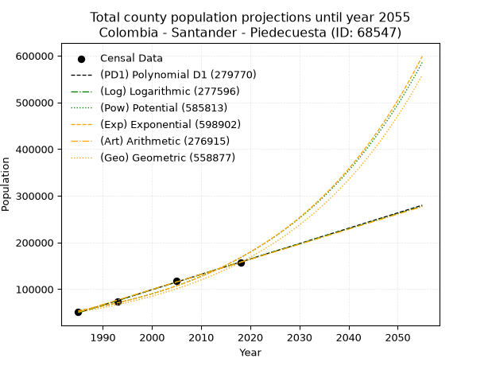
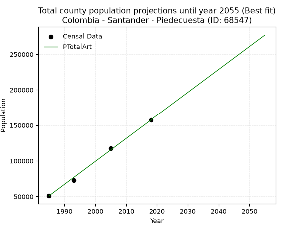
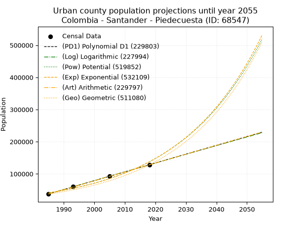
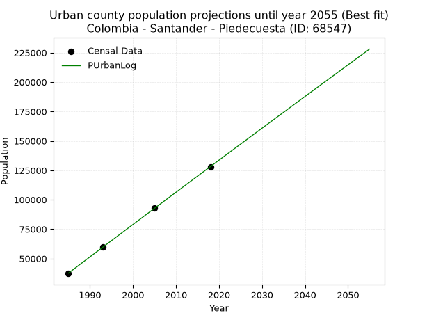
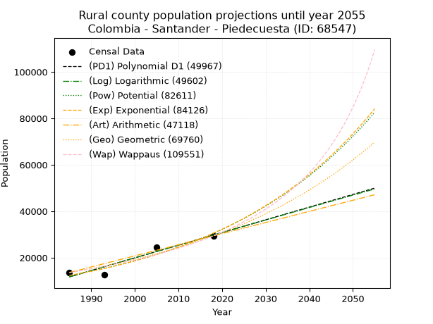
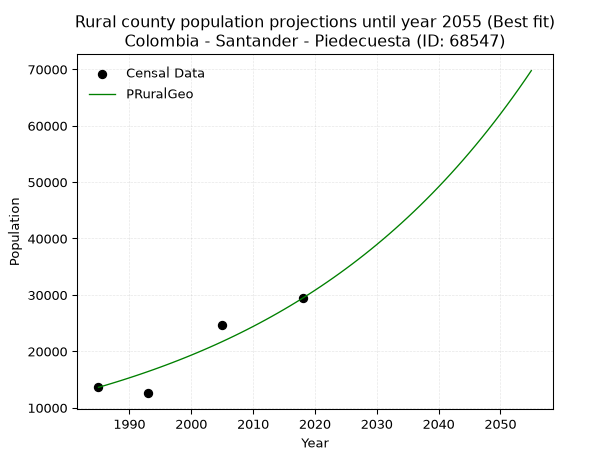

<div align="center">


</div>

# _“Population and Public Services Demand Projections (PPSD) until Year 2050 for Colombia - Santander - Piedecuesta (ID: 68547)”_
Keywords: `population` `public-service` `projection` `lineal` `polynomial` `logarithmic` `potential` `exponential` `arithmetic` `geometric` `wappaus` `dane` `colombia` `south-america`

PPSD are analytical estimates used by governments and planners to anticipate future changes in population size, age distribution, and the resulting community needs for utilities, healthcare, education, and infrastructure as sizing future water treatment facilities, electrical grids, and road networks based on spatial growth.

> **General running parameters**: • app_version: _v20260806_. • Python version: _3.14.7_. • Pandas version: _3.0.5_. • NumPy version: _2.5.1_. • Creates, save and include plots into reports (create_plot): _False_. • Projection until year: _2050_. • Process polynomial degree 2 and up: _False_. • Process Wappaus: _True_. • Process Wappaus: _True_. • Set negative values to zero: _True_. • Set infinite values to zero: _True_. • Drop dataset notes: _True_. 
<div align="center">

Dynamic map: [:earth_americas:Google](http://maps.google.com/maps?q=6.997245496,-73.0547949) [:earth_americas:OSM](https://www.openstreetmap.org/#map=18/6.997245496/-73.0547949&layers=P) [:earth_americas:Bing](https://www.bing.com/maps?cp=6.997245496~-73.0547949&lvl=18) [:earth_americas:Apple](https://maps.apple.com/frame?center=6.997245496%2C-73.0547949&span=0.003%2C0.006)

</div>


<div align="center">

```geojson
{
  "type": "Feature",
  "geometry": {
    "type": "Point", 
    "coordinates": [-73.0547949, 6.997245496]
  }, 
  "properties": {
    "Name": "Colombia - Santander - Piedecuesta (ID: 68547)"
  }
}
```

</div>


## 0. Census Data (4 records)

Census data are official statistics collected by a government about the people and housing in a country. They usually include counts of total population, age, sex, race, income, education, and jobs.

📅Global census file: [Population.xlsx](../data/Population.xlsx)

| Source   |   Year |   CountryID | CountryName   |   StateID | StateName   |   CountyID | CountyName   |   PTotal |   PUrban |   PRural |
|:---------|-------:|------------:|:--------------|----------:|:------------|-----------:|:-------------|---------:|---------:|---------:|
| DANE     |   1985 |          57 | Colombia      |        68 | Santander   |      68547 | Piedecuesta  |    50853 |    37244 |    13609 |
| DANE     |   1993 |          57 | Colombia      |        68 | Santander   |      68547 | Piedecuesta  |    72631 |    60057 |    12574 |
| DANE     |   2005 |          57 | Colombia      |        68 | Santander   |      68547 | Piedecuesta  |   117364 |    92736 |    24628 |
| DANE     |   2018 |          57 | Colombia      |        68 | Santander   |      68547 | Piedecuesta  |   157425 |   128019 |    29406 |

> 🔥Some records could had specific notes about the registered values or the corresponding urban or rural distribution.

## 1. Total

### 1.1. Coefficients and Parameters

* (PD1) Polynomial Deg 1: 3291.352468887969, -6483959.525893159 (lineal)
* (Log) Logarithmic: 6587995.122975759, -49975835.47261844
* (Pow) Potential: 68.95431241859677, -222.66490279156216
* (Exp) Exponential: 0.03443760131523106, 1.1031951510925915e-25
* (Art) Arithmetic: Year diff. 2018 - 1985 = 33, Population diff. 157425 - 50853 = 106572, Annual growth = 3229.4545454545455
* (Geo) Geometric: Year diff. 2018 - 1985 = 33, Population diff. 157425 - 50853 = 106572, Annual growth % = 0.03483576025444468
* (Wap) Wappaus: i = 3.10110001580056, Condition values only valid for < 200)

<sub>
Wappaus condition values: ['0.00', '3.10', '6.20', '9.30', '12.40', '15.51', '18.61', '21.71', '24.81', '27.91', '31.01', '34.11', '37.21', '40.31', '43.42', '46.52', '49.62', '52.72', '55.82', '58.92', '62.02', '65.12', '68.22', '71.33', '74.43', '77.53', '80.63', '83.73', '86.83', '89.93', '93.03', '96.13', '99.24', '102.34', '105.44', '108.54', '111.64', '114.74', '117.84', '120.94', '124.04', '127.15', '130.25', '133.35', '136.45', '139.55', '142.65', '145.75', '148.85', '151.95', '155.06', '158.16', '161.26', '164.36', '167.46', '170.56', '173.66', '176.76', '179.86', '182.96', '186.07', '189.17', '192.27', '195.37', '198.47', '201.57']
</sub>


### 1.2. Projected Dataset

|   Year |   CountyID |   PTotalPD1 |   PTotalLog |   PTotalPow |   PTotalExp |   PTotalArt |   PTotalGeo |
|-------:|-----------:|------------:|------------:|------------:|------------:|------------:|------------:|
|   1985 |      68547 |       49375 |       49277 |       53692 |       53757 |       50853 |       50853 |
|   1986 |      68547 |       52666 |       52595 |       55589 |       55640 |       54082 |       52625 |
|   1987 |      68547 |       55958 |       55911 |       57552 |       57590 |       57312 |       54458 |
|   1988 |      68547 |       59249 |       59226 |       59584 |       59607 |       60541 |       56355 |
|   1989 |      68547 |       62541 |       62539 |       61687 |       61696 |       63771 |       58318 |
|   1990 |      68547 |       65832 |       65850 |       63862 |       63858 |       67000 |       60350 |
|   1991 |      68547 |       69123 |       69160 |       66113 |       66095 |       70230 |       62452 |
|   1992 |      68547 |       72415 |       72468 |       68442 |       68411 |       73459 |       64627 |
|   1993 |      68547 |       75706 |       75774 |       70852 |       70808 |       76689 |       66879 |
|   1994 |      68547 |       78997 |       79079 |       73346 |       73289 |       79918 |       69208 |
|   1995 |      68547 |       82289 |       82382 |       75926 |       75856 |       83148 |       71619 |
|   1996 |      68547 |       85580 |       85684 |       78596 |       78514 |       86377 |       74114 |
|   1997 |      68547 |       88871 |       88983 |       81357 |       81265 |       89606 |       76696 |
|   1998 |      68547 |       92163 |       92282 |       84215 |       84113 |       92836 |       79368 |
|   1999 |      68547 |       95454 |       95578 |       87171 |       87060 |       96065 |       82133 |
|   2000 |      68547 |       98745 |       98873 |       90230 |       90110 |       99295 |       84994 |
|   2001 |      68547 |      102037 |      102166 |       93394 |       93267 |      102524 |       87955 |
|   2002 |      68547 |      105328 |      105458 |       96668 |       96535 |      105754 |       91019 |
|   2003 |      68547 |      108619 |      108747 |      100055 |       99917 |      108983 |       94189 |
|   2004 |      68547 |      111911 |      112036 |      103558 |      103418 |      112213 |       97471 |
|   2005 |      68547 |      115202 |      115322 |      107182 |      107042 |      115442 |      100866 |
|   2006 |      68547 |      118494 |      118607 |      110932 |      110792 |      118672 |      104380 |
|   2007 |      68547 |      121785 |      121891 |      114810 |      114674 |      121901 |      108016 |
|   2008 |      68547 |      125076 |      125172 |      118822 |      118692 |      125130 |      111779 |
|   2009 |      68547 |      128368 |      128452 |      122972 |      122851 |      128360 |      115673 |
|   2010 |      68547 |      131659 |      131731 |      127265 |      127155 |      131589 |      119702 |
|   2011 |      68547 |      134950 |      135008 |      131706 |      131610 |      134819 |      123872 |
|   2012 |      68547 |      138242 |      138283 |      136299 |      136221 |      138048 |      128187 |
|   2013 |      68547 |      141533 |      141556 |      141050 |      140994 |      141278 |      132653 |
|   2014 |      68547 |      144824 |      144828 |      145964 |      145934 |      144507 |      137274 |
|   2015 |      68547 |      148116 |      148098 |      151047 |      151048 |      147737 |      142056 |
|   2016 |      68547 |      151407 |      151367 |      156304 |      156340 |      150966 |      147005 |
|   2017 |      68547 |      154698 |      154634 |      161741 |      161818 |      154196 |      152126 |
|   2018 |      68547 |      157990 |      157900 |      167365 |      167487 |      157425 |      157425 |
|   2019 |      68547 |      161281 |      161163 |      173181 |      173356 |      160654 |      162909 |
|   2020 |      68547 |      164572 |      164426 |      179196 |      179430 |      163884 |      168584 |
|   2021 |      68547 |      167864 |      167686 |      185417 |      185716 |      167113 |      174457 |
|   2022 |      68547 |      171155 |      170945 |      191851 |      192223 |      170343 |      180534 |
|   2023 |      68547 |      174447 |      174202 |      198504 |      198958 |      173572 |      186823 |
|   2024 |      68547 |      177738 |      177458 |      205385 |      205929 |      176802 |      193331 |
|   2025 |      68547 |      181029 |      180712 |      212501 |      213145 |      180031 |      200066 |
|   2026 |      68547 |      184321 |      183965 |      219860 |      220613 |      183261 |      207036 |
|   2027 |      68547 |      187612 |      187216 |      227470 |      228342 |      186490 |      214248 |
|   2028 |      68547 |      190903 |      190465 |      235339 |      236343 |      189720 |      221711 |
|   2029 |      68547 |      194195 |      193713 |      243476 |      244624 |      192949 |      229435 |
|   2030 |      68547 |      197486 |      196959 |      251891 |      253195 |      196178 |      237427 |
|   2031 |      68547 |      200777 |      200203 |      260592 |      262066 |      199408 |      245698 |
|   2032 |      68547 |      204069 |      203446 |      269589 |      271248 |      202637 |      254257 |
|   2033 |      68547 |      207360 |      206688 |      278892 |      280752 |      205867 |      263115 |
|   2034 |      68547 |      210651 |      209927 |      288511 |      290589 |      209096 |      272281 |
|   2035 |      68547 |      213943 |      213166 |      298457 |      300770 |      212326 |      281766 |
|   2036 |      68547 |      217234 |      216402 |      308740 |      311308 |      215555 |      291581 |
|   2037 |      68547 |      220525 |      219637 |      319373 |      322216 |      218785 |      301739 |
|   2038 |      68547 |      223817 |      222870 |      330367 |      333506 |      222014 |      312250 |
|   2039 |      68547 |      227108 |      226102 |      341733 |      345191 |      225244 |      323127 |
|   2040 |      68547 |      230400 |      229332 |      353484 |      357285 |      228473 |      334384 |
|   2041 |      68547 |      233691 |      232561 |      365633 |      369804 |      231702 |      346032 |
|   2042 |      68547 |      236982 |      235788 |      378194 |      382761 |      234932 |      358087 |
|   2043 |      68547 |      240274 |      239014 |      391180 |      396172 |      238161 |      370561 |
|   2044 |      68547 |      243565 |      242237 |      404605 |      410052 |      241391 |      383470 |
|   2045 |      68547 |      246856 |      245460 |      418483 |      424420 |      244620 |      396828 |
|   2046 |      68547 |      250148 |      248680 |      432831 |      439290 |      247850 |      410652 |
|   2047 |      68547 |      253439 |      251900 |      447663 |      454682 |      251079 |      424957 |
|   2048 |      68547 |      256730 |      255117 |      462996 |      470613 |      254309 |      439761 |
|   2049 |      68547 |      260022 |      258333 |      478846 |      487102 |      257538 |      455080 |
|   2050 |      68547 |      263313 |      261548 |      495231 |      504169 |      260768 |      470933 |
<div align="center">

</img>

</div>


### 1.3. Best fit with absolute and relative error (%)

Relative error puts that difference into context by dividing the absolute error by the true value, creating a unitless ratio or percentage that shows the scale of the mistake.

Absolute and relative error

|   Year | Source   |   CountryID | CountryName   |   StateID | StateName   |   CountyID_x | CountyName   |   PTotal |   PUrban |   PRural |   CountyID_y |   PTotalPD1 |   PTotalLog |   PTotalPow |   PTotalExp |   PTotalArt |   PTotalGeo |   PTotalPD1AbsError |   PTotalLogAbsError |   PTotalPowAbsError |   PTotalExpAbsError |   PTotalArtAbsError |   PTotalGeoAbsError |   PTotalPD1RelError |   PTotalLogRelError |   PTotalPowRelError |   PTotalExpRelError |   PTotalArtRelError |   PTotalGeoRelError |
|-------:|:---------|------------:|:--------------|----------:|:------------|-------------:|:-------------|---------:|---------:|---------:|-------------:|------------:|------------:|------------:|------------:|------------:|------------:|--------------------:|--------------------:|--------------------:|--------------------:|--------------------:|--------------------:|--------------------:|--------------------:|--------------------:|--------------------:|--------------------:|--------------------:|
|   1985 | DANE     |          57 | Colombia      |        68 | Santander   |        68547 | Piedecuesta  |    50853 |    37244 |    13609 |        68547 |       49375 |       49277 |       53692 |       53757 |       50853 |       50853 |                1478 |                1576 |                2839 |                2904 |                   0 |                   0 |            2.90642  |            3.09913  |             5.58276 |             5.71058 |             0       |             0       |
|   1993 | DANE     |          57 | Colombia      |        68 | Santander   |        68547 | Piedecuesta  |    72631 |    60057 |    12574 |        68547 |       75706 |       75774 |       70852 |       70808 |       76689 |       66879 |                3075 |                3143 |                1779 |                1823 |                4058 |                5752 |            4.23373  |            4.32735  |             2.44937 |             2.50995 |             5.58715 |             7.91948 |
|   2005 | DANE     |          57 | Colombia      |        68 | Santander   |        68547 | Piedecuesta  |   117364 |    92736 |    24628 |        68547 |      115202 |      115322 |      107182 |      107042 |      115442 |      100866 |                2162 |                2042 |               10182 |               10322 |                1922 |               16498 |            1.84213  |            1.73989  |             8.67557 |             8.79486 |             1.63764 |            14.0571  |
|   2018 | DANE     |          57 | Colombia      |        68 | Santander   |        68547 | Piedecuesta  |   157425 |   128019 |    29406 |        68547 |      157990 |      157900 |      167365 |      167487 |      157425 |      157425 |                 565 |                 475 |                9940 |               10062 |                   0 |                   0 |            0.358901 |            0.301731 |             6.31412 |             6.39162 |             0       |             0       |

Relative error mean

| Method    |   RelError | Best   |
|:----------|-----------:|:-------|
| PTotalPD1 |    2.33529 |        |
| PTotalLog |    2.36702 |        |
| PTotalPow |    5.75545 |        |
| PTotalExp |    5.85175 |        |
| PTotalArt |    1.8062  | True   |
| PTotalGeo |    5.49415 |        |

💙Best method: _**PTotalArt**_
<div align="center">

</img>

</div>


### 1.4. Fresh water supply demand in liters per capita per day (lpcd)

The fresh water supply demand typically ranges from 100 to 300 liters per capita per day (lpcd) for standard domestic and municipal planning, though absolute survival minimums set by the World Health Organization are as low as 7.5 to 20 liters per day, and total consumption in high-income nations can exceed 400 liters.

> `CZ`: Level in meters above the sea level (masl).<br> `WS`: Fresh water supply demand in liters per capita per day (lpcd or l/h/d).<br> `WSAll`: Zonal fresh water supply demand in liters per second (l/s).<br> `A`: Zonal area in square meters.

Reference values (RAS Colombia)

|    CZ |   WS |
|------:|-----:|
|  1000 |  120 |
|  2000 |  130 |
| 99999 |  140 |

County shapefile geometry properties and water supply values

|   CountyID |      ATotal |   CZTotal |   WSTotal |
|-----------:|------------:|----------:|----------:|
|      68547 | 4.83796e+08 |   1778.15 |       130 |

Projected values for best method: PTotalArt

|   CountyID |   Year |   PTotalArt |   WSTotal |   WSTotalAll |
|-----------:|-------:|------------:|----------:|-------------:|
|      68547 |   1985 |       50853 |       130 |      76.5149 |
|      68547 |   1986 |       54082 |       130 |      81.3734 |
|      68547 |   1987 |       57312 |       130 |      86.2333 |
|      68547 |   1988 |       60541 |       130 |      91.0918 |
|      68547 |   1989 |       63771 |       130 |      95.9517 |
|      68547 |   1990 |       67000 |       130 |     100.81   |
|      68547 |   1991 |       70230 |       130 |     105.67   |
|      68547 |   1992 |       73459 |       130 |     110.529  |
|      68547 |   1993 |       76689 |       130 |     115.389  |
|      68547 |   1994 |       79918 |       130 |     120.247  |
|      68547 |   1995 |       83148 |       130 |     125.107  |
|      68547 |   1996 |       86377 |       130 |     129.965  |
|      68547 |   1997 |       89606 |       130 |     134.824  |
|      68547 |   1998 |       92836 |       130 |     139.684  |
|      68547 |   1999 |       96065 |       130 |     144.542  |
|      68547 |   2000 |       99295 |       130 |     149.402  |
|      68547 |   2001 |      102524 |       130 |     154.261  |
|      68547 |   2002 |      105754 |       130 |     159.121  |
|      68547 |   2003 |      108983 |       130 |     163.979  |
|      68547 |   2004 |      112213 |       130 |     168.839  |
|      68547 |   2005 |      115442 |       130 |     173.697  |
|      68547 |   2006 |      118672 |       130 |     178.557  |
|      68547 |   2007 |      121901 |       130 |     183.416  |
|      68547 |   2008 |      125130 |       130 |     188.274  |
|      68547 |   2009 |      128360 |       130 |     193.134  |
|      68547 |   2010 |      131589 |       130 |     197.993  |
|      68547 |   2011 |      134819 |       130 |     202.853  |
|      68547 |   2012 |      138048 |       130 |     207.711  |
|      68547 |   2013 |      141278 |       130 |     212.571  |
|      68547 |   2014 |      144507 |       130 |     217.43   |
|      68547 |   2015 |      147737 |       130 |     222.289  |
|      68547 |   2016 |      150966 |       130 |     227.148  |
|      68547 |   2017 |      154196 |       130 |     232.008  |
|      68547 |   2018 |      157425 |       130 |     236.866  |
|      68547 |   2019 |      160654 |       130 |     241.725  |
|      68547 |   2020 |      163884 |       130 |     246.585  |
|      68547 |   2021 |      167113 |       130 |     251.443  |
|      68547 |   2022 |      170343 |       130 |     256.303  |
|      68547 |   2023 |      173572 |       130 |     261.162  |
|      68547 |   2024 |      176802 |       130 |     266.022  |
|      68547 |   2025 |      180031 |       130 |     270.88   |
|      68547 |   2026 |      183261 |       130 |     275.74   |
|      68547 |   2027 |      186490 |       130 |     280.598  |
|      68547 |   2028 |      189720 |       130 |     285.458  |
|      68547 |   2029 |      192949 |       130 |     290.317  |
|      68547 |   2030 |      196178 |       130 |     295.175  |
|      68547 |   2031 |      199408 |       130 |     300.035  |
|      68547 |   2032 |      202637 |       130 |     304.894  |
|      68547 |   2033 |      205867 |       130 |     309.754  |
|      68547 |   2034 |      209096 |       130 |     314.612  |
|      68547 |   2035 |      212326 |       130 |     319.472  |
|      68547 |   2036 |      215555 |       130 |     324.33   |
|      68547 |   2037 |      218785 |       130 |     329.19   |
|      68547 |   2038 |      222014 |       130 |     334.049  |
|      68547 |   2039 |      225244 |       130 |     338.909  |
|      68547 |   2040 |      228473 |       130 |     343.767  |
|      68547 |   2041 |      231702 |       130 |     348.626  |
|      68547 |   2042 |      234932 |       130 |     353.486  |
|      68547 |   2043 |      238161 |       130 |     358.344  |
|      68547 |   2044 |      241391 |       130 |     363.204  |
|      68547 |   2045 |      244620 |       130 |     368.062  |
|      68547 |   2046 |      247850 |       130 |     372.922  |
|      68547 |   2047 |      251079 |       130 |     377.781  |
|      68547 |   2048 |      254309 |       130 |     382.641  |
|      68547 |   2049 |      257538 |       130 |     387.499  |
|      68547 |   2050 |      260768 |       130 |     392.359  |

## 2. Urban

### 2.1. Coefficients and Parameters

* (PD1) Polynomial Deg 1: 2745.000401445179, -5411173.052990719 (lineal)
* (Log) Logarithmic: 5494559.649456247, -41684677.926154636
* (Pow) Potential: 73.26555809123465, -236.9991278257801
* (Exp) Exponential: 0.0365875526454691, 1.1817314722280764e-27
* (Art) Arithmetic: Year diff. 2018 - 1985 = 33, Population diff. 128019 - 37244 = 90775, Annual growth = 2750.757575757576
* (Geo) Geometric: Year diff. 2018 - 1985 = 33, Population diff. 128019 - 37244 = 90775, Annual growth % = 0.038123527331347606
* (Wap) Wappaus: i = 3.328945469654521, Condition values only valid for < 200)

<sub>
Wappaus condition values: ['0.00', '3.33', '6.66', '9.99', '13.32', '16.64', '19.97', '23.30', '26.63', '29.96', '33.29', '36.62', '39.95', '43.28', '46.61', '49.93', '53.26', '56.59', '59.92', '63.25', '66.58', '69.91', '73.24', '76.57', '79.89', '83.22', '86.55', '89.88', '93.21', '96.54', '99.87', '103.20', '106.53', '109.86', '113.18', '116.51', '119.84', '123.17', '126.50', '129.83', '133.16', '136.49', '139.82', '143.14', '146.47', '149.80', '153.13', '156.46', '159.79', '163.12', '166.45', '169.78', '173.11', '176.43', '179.76', '183.09', '186.42', '189.75', '193.08', '196.41', '199.74', '203.07', '206.39', '209.72', '213.05', '216.38']
</sub>


### 2.2. Projected Dataset

|   Year |   CountyID |   PUrbanPD1 |   PUrbanLog |   PUrbanPow |   PUrbanExp |   PUrbanArt |   PUrbanGeo |
|-------:|-----------:|------------:|------------:|------------:|------------:|------------:|------------:|
|   1985 |      68547 |       37653 |       37570 |       41033 |       41088 |       37244 |       37244 |
|   1986 |      68547 |       40398 |       40337 |       42576 |       42619 |       39995 |       38664 |
|   1987 |      68547 |       43143 |       43103 |       44175 |       44208 |       42746 |       40138 |
|   1988 |      68547 |       45888 |       45867 |       45834 |       45855 |       45496 |       41668 |
|   1989 |      68547 |       48633 |       48631 |       47554 |       47564 |       48247 |       43257 |
|   1990 |      68547 |       51378 |       51392 |       49338 |       49336 |       50998 |       44906 |
|   1991 |      68547 |       54123 |       54153 |       51188 |       51175 |       53749 |       46618 |
|   1992 |      68547 |       56868 |       56912 |       53106 |       53082 |       56499 |       48395 |
|   1993 |      68547 |       59613 |       59669 |       55095 |       55060 |       59250 |       50240 |
|   1994 |      68547 |       62358 |       62426 |       57158 |       57112 |       62001 |       52155 |
|   1995 |      68547 |       65103 |       65180 |       59297 |       59240 |       64752 |       54144 |
|   1996 |      68547 |       67848 |       67934 |       61514 |       61447 |       67502 |       56208 |
|   1997 |      68547 |       70593 |       70686 |       63814 |       63737 |       70253 |       58351 |
|   1998 |      68547 |       73338 |       73437 |       66198 |       66113 |       73004 |       60575 |
|   1999 |      68547 |       76083 |       76186 |       68669 |       68576 |       75755 |       62884 |
|   2000 |      68547 |       78828 |       78934 |       71232 |       71132 |       78505 |       65282 |
|   2001 |      68547 |       81573 |       81681 |       73889 |       73782 |       81256 |       67771 |
|   2002 |      68547 |       84318 |       84426 |       76644 |       76532 |       84007 |       70354 |
|   2003 |      68547 |       87063 |       87170 |       79500 |       79384 |       86758 |       73036 |
|   2004 |      68547 |       89808 |       89912 |       82461 |       82342 |       89508 |       75821 |
|   2005 |      68547 |       92553 |       92653 |       85531 |       85411 |       92259 |       78711 |
|   2006 |      68547 |       95298 |       95393 |       88714 |       88594 |       95010 |       81712 |
|   2007 |      68547 |       98043 |       98131 |       92013 |       91895 |       97761 |       84827 |
|   2008 |      68547 |      100788 |      100868 |       95433 |       95319 |      100511 |       88061 |
|   2009 |      68547 |      103533 |      103604 |       98978 |       98872 |      103262 |       91418 |
|   2010 |      68547 |      106278 |      106338 |      102654 |      102556 |      106013 |       94903 |
|   2011 |      68547 |      109023 |      109071 |      106464 |      106378 |      108764 |       98522 |
|   2012 |      68547 |      111768 |      111803 |      110413 |      110342 |      111514 |      102278 |
|   2013 |      68547 |      114513 |      114533 |      114507 |      114454 |      114265 |      106177 |
|   2014 |      68547 |      117258 |      117262 |      118750 |      118719 |      117016 |      110225 |
|   2015 |      68547 |      120003 |      119989 |      123148 |      123143 |      119767 |      114427 |
|   2016 |      68547 |      122748 |      122716 |      127707 |      127732 |      122517 |      118789 |
|   2017 |      68547 |      125493 |      125440 |      132432 |      132492 |      125268 |      123318 |
|   2018 |      68547 |      128238 |      128164 |      137330 |      137429 |      128019 |      128019 |
|   2019 |      68547 |      130983 |      130886 |      142406 |      142551 |      130770 |      132900 |
|   2020 |      68547 |      133728 |      133607 |      147668 |      147863 |      133521 |      137966 |
|   2021 |      68547 |      136473 |      136326 |      153120 |      153373 |      136271 |      143226 |
|   2022 |      68547 |      139218 |      139044 |      158772 |      159088 |      139022 |      148686 |
|   2023 |      68547 |      141963 |      141761 |      164629 |      165017 |      141773 |      154355 |
|   2024 |      68547 |      144708 |      144476 |      170699 |      171166 |      144524 |      160239 |
|   2025 |      68547 |      147453 |      147190 |      176989 |      177545 |      147274 |      166348 |
|   2026 |      68547 |      150198 |      149903 |      183509 |      184161 |      150025 |      172690 |
|   2027 |      68547 |      152943 |      152614 |      190264 |      191024 |      152776 |      179273 |
|   2028 |      68547 |      155688 |      155324 |      197266 |      198142 |      155527 |      186108 |
|   2029 |      68547 |      158433 |      158033 |      204521 |      205526 |      158277 |      193203 |
|   2030 |      68547 |      161178 |      160740 |      212039 |      213185 |      161028 |      200569 |
|   2031 |      68547 |      163923 |      163446 |      219829 |      221129 |      163779 |      208215 |
|   2032 |      68547 |      166668 |      166151 |      227902 |      229370 |      166530 |      216153 |
|   2033 |      68547 |      169413 |      168854 |      236267 |      237917 |      169280 |      224393 |
|   2034 |      68547 |      172158 |      171556 |      244935 |      246783 |      172031 |      232948 |
|   2035 |      68547 |      174903 |      174257 |      253916 |      255980 |      174782 |      241829 |
|   2036 |      68547 |      177648 |      176957 |      263222 |      265519 |      177533 |      251048 |
|   2037 |      68547 |      180393 |      179655 |      272864 |      275413 |      180283 |      260619 |
|   2038 |      68547 |      183138 |      182351 |      282855 |      285677 |      183034 |      270555 |
|   2039 |      68547 |      185883 |      185047 |      293206 |      296322 |      185785 |      280869 |
|   2040 |      68547 |      188628 |      187741 |      303930 |      307365 |      188536 |      291577 |
|   2041 |      68547 |      191373 |      190433 |      315041 |      318819 |      191286 |      302693 |
|   2042 |      68547 |      194118 |      193125 |      326553 |      330700 |      194037 |      314233 |
|   2043 |      68547 |      196863 |      195815 |      338479 |      343023 |      196788 |      326212 |
|   2044 |      68547 |      199608 |      198504 |      350834 |      355806 |      199539 |      338649 |
|   2045 |      68547 |      202353 |      201191 |      363635 |      369065 |      202289 |      351559 |
|   2046 |      68547 |      205098 |      203877 |      376895 |      382818 |      205040 |      364962 |
|   2047 |      68547 |      207843 |      206562 |      390633 |      397084 |      207791 |      378875 |
|   2048 |      68547 |      210588 |      209246 |      404864 |      411882 |      210542 |      393319 |
|   2049 |      68547 |      213333 |      211928 |      419606 |      427230 |      213292 |      408314 |
|   2050 |      68547 |      216078 |      214609 |      434878 |      443151 |      216043 |      423881 |
<div align="center">

</img>

</div>


### 2.3. Best fit with absolute and relative error (%)

Relative error puts that difference into context by dividing the absolute error by the true value, creating a unitless ratio or percentage that shows the scale of the mistake.

Absolute and relative error

|   Year | Source   |   CountryID | CountryName   |   StateID | StateName   |   CountyID_x | CountyName   |   PTotal |   PUrban |   PRural |   CountyID_y |   PUrbanPD1 |   PUrbanLog |   PUrbanPow |   PUrbanExp |   PUrbanArt |   PUrbanGeo |   PUrbanPD1AbsError |   PUrbanLogAbsError |   PUrbanPowAbsError |   PUrbanExpAbsError |   PUrbanArtAbsError |   PUrbanGeoAbsError |   PUrbanPD1RelError |   PUrbanLogRelError |   PUrbanPowRelError |   PUrbanExpRelError |   PUrbanArtRelError |   PUrbanGeoRelError |
|-------:|:---------|------------:|:--------------|----------:|:------------|-------------:|:-------------|---------:|---------:|---------:|-------------:|------------:|------------:|------------:|------------:|------------:|------------:|--------------------:|--------------------:|--------------------:|--------------------:|--------------------:|--------------------:|--------------------:|--------------------:|--------------------:|--------------------:|--------------------:|--------------------:|
|   1985 | DANE     |          57 | Colombia      |        68 | Santander   |        68547 | Piedecuesta  |    50853 |    37244 |    13609 |        68547 |       37653 |       37570 |       41033 |       41088 |       37244 |       37244 |                 409 |                 326 |                3789 |                3844 |                   0 |                   0 |            1.09816  |           0.875309  |            10.1735  |            10.3211  |            0        |              0      |
|   1993 | DANE     |          57 | Colombia      |        68 | Santander   |        68547 | Piedecuesta  |    72631 |    60057 |    12574 |        68547 |       59613 |       59669 |       55095 |       55060 |       59250 |       50240 |                 444 |                 388 |                4962 |                4997 |                 807 |                9817 |            0.739298 |           0.646053  |             8.26215 |             8.32043 |            1.34372  |             16.3461 |
|   2005 | DANE     |          57 | Colombia      |        68 | Santander   |        68547 | Piedecuesta  |   117364 |    92736 |    24628 |        68547 |       92553 |       92653 |       85531 |       85411 |       92259 |       78711 |                 183 |                  83 |                7205 |                7325 |                 477 |               14025 |            0.197334 |           0.0895014 |             7.76937 |             7.89877 |            0.514363 |             15.1236 |
|   2018 | DANE     |          57 | Colombia      |        68 | Santander   |        68547 | Piedecuesta  |   157425 |   128019 |    29406 |        68547 |      128238 |      128164 |      137330 |      137429 |      128019 |      128019 |                 219 |                 145 |                9311 |                9410 |                   0 |                   0 |            0.171068 |           0.113264  |             7.27314 |             7.35047 |            0        |              0      |

Relative error mean

| Method    |   RelError | Best   |
|:----------|-----------:|:-------|
| PUrbanPD1 |   0.551466 |        |
| PUrbanLog |   0.431032 | True   |
| PUrbanPow |   8.36953  |        |
| PUrbanExp |   8.4727   |        |
| PUrbanArt |   0.464522 |        |
| PUrbanGeo |   7.86743  |        |

💙Best method: _**PUrbanLog**_
<div align="center">

</img>

</div>


### 2.4. Fresh water supply demand in liters per capita per day (lpcd)

The fresh water supply demand typically ranges from 100 to 300 liters per capita per day (lpcd) for standard domestic and municipal planning, though absolute survival minimums set by the World Health Organization are as low as 7.5 to 20 liters per day, and total consumption in high-income nations can exceed 400 liters.

> `CZ`: Level in meters above the sea level (masl).<br> `WS`: Fresh water supply demand in liters per capita per day (lpcd or l/h/d).<br> `WSAll`: Zonal fresh water supply demand in liters per second (l/s).<br> `A`: Zonal area in square meters.

Reference values (RAS Colombia)

|    CZ |   WS |
|------:|-----:|
|  1000 |  120 |
|  2000 |  130 |
| 99999 |  140 |

County shapefile geometry properties and water supply values

|   CountyID |      AUrban |   CZUrban |   WSUrban |
|-----------:|------------:|----------:|----------:|
|      68547 | 1.14485e+07 |   1008.11 |       130 |

Projected values for best method: PUrbanLog

|   CountyID |   Year |   PUrbanLog |   WSUrban |   WSUrbanAll |
|-----------:|-------:|------------:|----------:|-------------:|
|      68547 |   1985 |       37570 |       130 |      56.5289 |
|      68547 |   1986 |       40337 |       130 |      60.6922 |
|      68547 |   1987 |       43103 |       130 |      64.8541 |
|      68547 |   1988 |       45867 |       130 |      69.0128 |
|      68547 |   1989 |       48631 |       130 |      73.1716 |
|      68547 |   1990 |       51392 |       130 |      77.3259 |
|      68547 |   1991 |       54153 |       130 |      81.4802 |
|      68547 |   1992 |       56912 |       130 |      85.6315 |
|      68547 |   1993 |       59669 |       130 |      89.7797 |
|      68547 |   1994 |       62426 |       130 |      93.928  |
|      68547 |   1995 |       65180 |       130 |      98.0718 |
|      68547 |   1996 |       67934 |       130 |     102.216  |
|      68547 |   1997 |       70686 |       130 |     106.356  |
|      68547 |   1998 |       73437 |       130 |     110.495  |
|      68547 |   1999 |       76186 |       130 |     114.632  |
|      68547 |   2000 |       78934 |       130 |     118.766  |
|      68547 |   2001 |       81681 |       130 |     122.9    |
|      68547 |   2002 |       84426 |       130 |     127.03   |
|      68547 |   2003 |       87170 |       130 |     131.159  |
|      68547 |   2004 |       89912 |       130 |     135.284  |
|      68547 |   2005 |       92653 |       130 |     139.408  |
|      68547 |   2006 |       95393 |       130 |     143.531  |
|      68547 |   2007 |       98131 |       130 |     147.651  |
|      68547 |   2008 |      100868 |       130 |     151.769  |
|      68547 |   2009 |      103604 |       130 |     155.886  |
|      68547 |   2010 |      106338 |       130 |     159.999  |
|      68547 |   2011 |      109071 |       130 |     164.111  |
|      68547 |   2012 |      111803 |       130 |     168.222  |
|      68547 |   2013 |      114533 |       130 |     172.33   |
|      68547 |   2014 |      117262 |       130 |     176.436  |
|      68547 |   2015 |      119989 |       130 |     180.539  |
|      68547 |   2016 |      122716 |       130 |     184.642  |
|      68547 |   2017 |      125440 |       130 |     188.741  |
|      68547 |   2018 |      128164 |       130 |     192.839  |
|      68547 |   2019 |      130886 |       130 |     196.935  |
|      68547 |   2020 |      133607 |       130 |     201.029  |
|      68547 |   2021 |      136326 |       130 |     205.12   |
|      68547 |   2022 |      139044 |       130 |     209.21   |
|      68547 |   2023 |      141761 |       130 |     213.298  |
|      68547 |   2024 |      144476 |       130 |     217.383  |
|      68547 |   2025 |      147190 |       130 |     221.466  |
|      68547 |   2026 |      149903 |       130 |     225.548  |
|      68547 |   2027 |      152614 |       130 |     229.628  |
|      68547 |   2028 |      155324 |       130 |     233.705  |
|      68547 |   2029 |      158033 |       130 |     237.781  |
|      68547 |   2030 |      160740 |       130 |     241.854  |
|      68547 |   2031 |      163446 |       130 |     245.926  |
|      68547 |   2032 |      166151 |       130 |     249.996  |
|      68547 |   2033 |      168854 |       130 |     254.063  |
|      68547 |   2034 |      171556 |       130 |     258.128  |
|      68547 |   2035 |      174257 |       130 |     262.192  |
|      68547 |   2036 |      176957 |       130 |     266.255  |
|      68547 |   2037 |      179655 |       130 |     270.314  |
|      68547 |   2038 |      182351 |       130 |     274.371  |
|      68547 |   2039 |      185047 |       130 |     278.427  |
|      68547 |   2040 |      187741 |       130 |     282.481  |
|      68547 |   2041 |      190433 |       130 |     286.531  |
|      68547 |   2042 |      193125 |       130 |     290.582  |
|      68547 |   2043 |      195815 |       130 |     294.629  |
|      68547 |   2044 |      198504 |       130 |     298.675  |
|      68547 |   2045 |      201191 |       130 |     302.718  |
|      68547 |   2046 |      203877 |       130 |     306.759  |
|      68547 |   2047 |      206562 |       130 |     310.799  |
|      68547 |   2048 |      209246 |       130 |     314.838  |
|      68547 |   2049 |      211928 |       130 |     318.873  |
|      68547 |   2050 |      214609 |       130 |     322.907  |

## 3. Rural

### 3.1. Coefficients and Parameters

* (PD1) Polynomial Deg 1: 546.3520674427905, -1072786.4729024419 (lineal)
* (Log) Logarithmic: 1093435.4735195108, -8291157.546463775
* (Pow) Potential: 54.85245088804503, -176.79880904378368
* (Exp) Exponential: 0.027405455707681124, 2.9257640997703643e-20
* (Art) Arithmetic: Year diff. 2018 - 1985 = 33, Population diff. 29406 - 13609 = 15797, Annual growth = 478.6969696969697
* (Geo) Geometric: Year diff. 2018 - 1985 = 33, Population diff. 29406 - 13609 = 15797, Annual growth % = 0.023622183251728268
* (Wap) Wappaus: i = 2.225721119130395, Condition values only valid for < 200)

<sub>
Wappaus condition values: ['0.00', '2.23', '4.45', '6.68', '8.90', '11.13', '13.35', '15.58', '17.81', '20.03', '22.26', '24.48', '26.71', '28.93', '31.16', '33.39', '35.61', '37.84', '40.06', '42.29', '44.51', '46.74', '48.97', '51.19', '53.42', '55.64', '57.87', '60.09', '62.32', '64.55', '66.77', '69.00', '71.22', '73.45', '75.67', '77.90', '80.13', '82.35', '84.58', '86.80', '89.03', '91.25', '93.48', '95.71', '97.93', '100.16', '102.38', '104.61', '106.83', '109.06', '111.29', '113.51', '115.74', '117.96', '120.19', '122.41', '124.64', '126.87', '129.09', '131.32', '133.54', '135.77', '137.99', '140.22', '142.45', '144.67']
</sub>


### 3.2. Projected Dataset

|   Year |   CountyID |   PRuralPD1 |   PRuralLog |   PRuralPow |   PRuralExp |   PRuralArt |   PRuralGeo |   PRuralWap |
|-------:|-----------:|------------:|------------:|------------:|------------:|------------:|------------:|------------:|
|   1985 |      68547 |       11722 |       11707 |       12343 |       12353 |       13609 |       13609 |       13609 |
|   1986 |      68547 |       12269 |       12258 |       12689 |       12697 |       14088 |       13930 |       13915 |
|   1987 |      68547 |       12815 |       12808 |       13045 |       13049 |       14566 |       14260 |       14229 |
|   1988 |      68547 |       13361 |       13358 |       13410 |       13412 |       15045 |       14596 |       14549 |
|   1989 |      68547 |       13908 |       13908 |       13785 |       13785 |       15524 |       14941 |       14877 |
|   1990 |      68547 |       14454 |       14458 |       14170 |       14168 |       16002 |       15294 |       15213 |
|   1991 |      68547 |       15000 |       15007 |       14566 |       14561 |       16481 |       15655 |       15556 |
|   1992 |      68547 |       15547 |       15556 |       14973 |       14966 |       16960 |       16025 |       15908 |
|   1993 |      68547 |       16093 |       16105 |       15391 |       15382 |       17439 |       16404 |       16269 |
|   1994 |      68547 |       16640 |       16654 |       15820 |       15809 |       17917 |       16791 |       16639 |
|   1995 |      68547 |       17186 |       17202 |       16261 |       16248 |       18396 |       17188 |       17017 |
|   1996 |      68547 |       17732 |       17750 |       16714 |       16700 |       18875 |       17594 |       17406 |
|   1997 |      68547 |       18279 |       18297 |       17180 |       17164 |       19353 |       18010 |       17804 |
|   1998 |      68547 |       18825 |       18845 |       17658 |       17641 |       19832 |       18435 |       18213 |
|   1999 |      68547 |       19371 |       19392 |       18149 |       18131 |       20311 |       18870 |       18632 |
|   2000 |      68547 |       19918 |       19939 |       18654 |       18634 |       20789 |       19316 |       19063 |
|   2001 |      68547 |       20464 |       20485 |       19173 |       19152 |       21268 |       19772 |       19505 |
|   2002 |      68547 |       21010 |       21032 |       19705 |       19684 |       21747 |       20240 |       19960 |
|   2003 |      68547 |       21557 |       21578 |       20253 |       20231 |       22226 |       20718 |       20427 |
|   2004 |      68547 |       22103 |       22124 |       20815 |       20793 |       22704 |       21207 |       20907 |
|   2005 |      68547 |       22649 |       22669 |       21392 |       21371 |       23183 |       21708 |       21401 |
|   2006 |      68547 |       23196 |       23214 |       21985 |       21965 |       23662 |       22221 |       21910 |
|   2007 |      68547 |       23742 |       23759 |       22595 |       22575 |       24140 |       22746 |       22433 |
|   2008 |      68547 |       24288 |       24304 |       23221 |       23202 |       24619 |       23283 |       22972 |
|   2009 |      68547 |       24835 |       24848 |       23864 |       23847 |       25098 |       23833 |       23528 |
|   2010 |      68547 |       25381 |       25392 |       24524 |       24510 |       25576 |       24396 |       24100 |
|   2011 |      68547 |       25928 |       25936 |       25202 |       25191 |       26055 |       24972 |       24691 |
|   2012 |      68547 |       26474 |       26480 |       25899 |       25890 |       26534 |       25562 |       25300 |
|   2013 |      68547 |       27020 |       27023 |       26615 |       26610 |       27013 |       26166 |       25929 |
|   2014 |      68547 |       27567 |       27566 |       27350 |       27349 |       27491 |       26784 |       26579 |
|   2015 |      68547 |       28113 |       28109 |       28105 |       28109 |       27970 |       27417 |       27250 |
|   2016 |      68547 |       28659 |       28652 |       28880 |       28890 |       28449 |       28064 |       27944 |
|   2017 |      68547 |       29206 |       29194 |       29676 |       29693 |       28927 |       28727 |       28663 |
|   2018 |      68547 |       29752 |       29736 |       30494 |       30518 |       29406 |       29406 |       29406 |
|   2019 |      68547 |       30298 |       30277 |       31334 |       31366 |       29885 |       30101 |       30176 |
|   2020 |      68547 |       30845 |       30819 |       32197 |       32237 |       30363 |       30812 |       30974 |
|   2021 |      68547 |       31391 |       31360 |       33083 |       33133 |       30842 |       31540 |       31802 |
|   2022 |      68547 |       31937 |       31901 |       33993 |       34053 |       31321 |       32285 |       32661 |
|   2023 |      68547 |       32484 |       32442 |       34928 |       35000 |       31799 |       33047 |       33553 |
|   2024 |      68547 |       33030 |       32982 |       35887 |       35972 |       32278 |       33828 |       34481 |
|   2025 |      68547 |       33576 |       33522 |       36873 |       36971 |       32757 |       34627 |       35445 |
|   2026 |      68547 |       34123 |       34062 |       37885 |       37999 |       33236 |       35445 |       36449 |
|   2027 |      68547 |       34669 |       34601 |       38925 |       39054 |       33714 |       36282 |       37495 |
|   2028 |      68547 |       35216 |       35141 |       39992 |       40140 |       34193 |       37139 |       38586 |
|   2029 |      68547 |       35762 |       35680 |       41088 |       41255 |       34672 |       38017 |       39724 |
|   2030 |      68547 |       36308 |       36219 |       42214 |       42401 |       35150 |       38915 |       40913 |
|   2031 |      68547 |       36855 |       36757 |       43370 |       43579 |       35629 |       39834 |       42156 |
|   2032 |      68547 |       37401 |       37295 |       44557 |       44790 |       36108 |       40775 |       43457 |
|   2033 |      68547 |       37947 |       37833 |       45776 |       46034 |       36586 |       41738 |       44820 |
|   2034 |      68547 |       38494 |       38371 |       47027 |       47313 |       37065 |       42724 |       46250 |
|   2035 |      68547 |       39040 |       38908 |       48312 |       48628 |       37544 |       43733 |       47752 |
|   2036 |      68547 |       39586 |       39446 |       49632 |       49979 |       38023 |       44766 |       49331 |
|   2037 |      68547 |       40133 |       39983 |       50987 |       51368 |       38501 |       45824 |       50994 |
|   2038 |      68547 |       40679 |       40519 |       52378 |       52795 |       38980 |       46906 |       52747 |
|   2039 |      68547 |       41225 |       41056 |       53807 |       54262 |       39459 |       48014 |       54597 |
|   2040 |      68547 |       41772 |       41592 |       55274 |       55770 |       39937 |       49148 |       56554 |
|   2041 |      68547 |       42318 |       42128 |       56780 |       57319 |       40416 |       50309 |       58626 |
|   2042 |      68547 |       42864 |       42663 |       58326 |       58912 |       40895 |       51498 |       60824 |
|   2043 |      68547 |       43411 |       43199 |       59913 |       60548 |       41373 |       52714 |       63161 |
|   2044 |      68547 |       43957 |       43734 |       61543 |       62231 |       41852 |       53959 |       65649 |
|   2045 |      68547 |       44504 |       44268 |       63217 |       63960 |       42331 |       55234 |       68303 |
|   2046 |      68547 |       45050 |       44803 |       64935 |       65737 |       42810 |       56539 |       71141 |
|   2047 |      68547 |       45596 |       45337 |       66699 |       67563 |       43288 |       57874 |       74184 |
|   2048 |      68547 |       46143 |       45871 |       68510 |       69441 |       43767 |       59242 |       77452 |
|   2049 |      68547 |       46689 |       46405 |       70369 |       71370 |       44246 |       60641 |       80974 |
|   2050 |      68547 |       47235 |       46939 |       72278 |       73353 |       44724 |       62073 |       84779 |
<div align="center">

</img>

</div>


### 3.3. Best fit with absolute and relative error (%)

Relative error puts that difference into context by dividing the absolute error by the true value, creating a unitless ratio or percentage that shows the scale of the mistake.

Absolute and relative error

|   Year | Source   |   CountryID | CountryName   |   StateID | StateName   |   CountyID_x | CountyName   |   PTotal |   PUrban |   PRural |   CountyID_y |   PRuralPD1 |   PRuralLog |   PRuralPow |   PRuralExp |   PRuralArt |   PRuralGeo |   PRuralWap |   PRuralPD1AbsError |   PRuralLogAbsError |   PRuralPowAbsError |   PRuralExpAbsError |   PRuralArtAbsError |   PRuralGeoAbsError |   PRuralWapAbsError |   PRuralPD1RelError |   PRuralLogRelError |   PRuralPowRelError |   PRuralExpRelError |   PRuralArtRelError |   PRuralGeoRelError |   PRuralWapRelError |
|-------:|:---------|------------:|:--------------|----------:|:------------|-------------:|:-------------|---------:|---------:|---------:|-------------:|------------:|------------:|------------:|------------:|------------:|------------:|------------:|--------------------:|--------------------:|--------------------:|--------------------:|--------------------:|--------------------:|--------------------:|--------------------:|--------------------:|--------------------:|--------------------:|--------------------:|--------------------:|--------------------:|
|   1985 | DANE     |          57 | Colombia      |        68 | Santander   |        68547 | Piedecuesta  |    50853 |    37244 |    13609 |        68547 |       11722 |       11707 |       12343 |       12353 |       13609 |       13609 |       13609 |                1887 |                1902 |                1266 |                1256 |                   0 |                   0 |                   0 |            13.8658  |            13.976   |             9.30267 |             9.22919 |             0       |              0      |               0     |
|   1993 | DANE     |          57 | Colombia      |        68 | Santander   |        68547 | Piedecuesta  |    72631 |    60057 |    12574 |        68547 |       16093 |       16105 |       15391 |       15382 |       17439 |       16404 |       16269 |                3519 |                3531 |                2817 |                2808 |                4865 |                3830 |                3695 |            27.9863  |            28.0818  |            22.4034  |            22.3318  |            38.6909  |             30.4597 |              29.386 |
|   2005 | DANE     |          57 | Colombia      |        68 | Santander   |        68547 | Piedecuesta  |   117364 |    92736 |    24628 |        68547 |       22649 |       22669 |       21392 |       21371 |       23183 |       21708 |       21401 |                1979 |                1959 |                3236 |                3257 |                1445 |                2920 |                3227 |             8.03557 |             7.95436 |            13.1395  |            13.2248  |             5.86731 |             11.8564 |              13.103 |
|   2018 | DANE     |          57 | Colombia      |        68 | Santander   |        68547 | Piedecuesta  |   157425 |   128019 |    29406 |        68547 |       29752 |       29736 |       30494 |       30518 |       29406 |       29406 |       29406 |                 346 |                 330 |                1088 |                1112 |                   0 |                   0 |                   0 |             1.17663 |             1.12222 |             3.69993 |             3.78154 |             0       |              0      |               0     |

Relative error mean

| Method    |   RelError | Best   |
|:----------|-----------:|:-------|
| PRuralPD1 |    12.7661 |        |
| PRuralLog |    12.7836 |        |
| PRuralPow |    12.1364 |        |
| PRuralExp |    12.1418 |        |
| PRuralArt |    11.1396 |        |
| PRuralGeo |    10.579  | True   |
| PRuralWap |    10.6223 |        |

💙Best method: _**PRuralGeo**_
<div align="center">

</img>

</div>


### 3.4. Fresh water supply demand in liters per capita per day (lpcd)

The fresh water supply demand typically ranges from 100 to 300 liters per capita per day (lpcd) for standard domestic and municipal planning, though absolute survival minimums set by the World Health Organization are as low as 7.5 to 20 liters per day, and total consumption in high-income nations can exceed 400 liters.

> `CZ`: Level in meters above the sea level (masl).<br> `WS`: Fresh water supply demand in liters per capita per day (lpcd or l/h/d).<br> `WSAll`: Zonal fresh water supply demand in liters per second (l/s).<br> `A`: Zonal area in square meters.

Reference values (RAS Colombia)

|    CZ |   WS |
|------:|-----:|
|  1000 |  120 |
|  2000 |  130 |
| 99999 |  140 |

County shapefile geometry properties and water supply values

|   CountyID |      ARural |   CZRural |   WSRural |
|-----------:|------------:|----------:|----------:|
|      68547 | 4.72347e+08 |   1796.82 |       130 |

Projected values for best method: PRuralGeo

|   CountyID |   Year |   PRuralGeo |   WSRural |   WSRuralAll |
|-----------:|-------:|------------:|----------:|-------------:|
|      68547 |   1985 |       13609 |       130 |      20.4765 |
|      68547 |   1986 |       13930 |       130 |      20.9595 |
|      68547 |   1987 |       14260 |       130 |      21.456  |
|      68547 |   1988 |       14596 |       130 |      21.9616 |
|      68547 |   1989 |       14941 |       130 |      22.4807 |
|      68547 |   1990 |       15294 |       130 |      23.0118 |
|      68547 |   1991 |       15655 |       130 |      23.555  |
|      68547 |   1992 |       16025 |       130 |      24.1117 |
|      68547 |   1993 |       16404 |       130 |      24.6819 |
|      68547 |   1994 |       16791 |       130 |      25.2642 |
|      68547 |   1995 |       17188 |       130 |      25.8616 |
|      68547 |   1996 |       17594 |       130 |      26.4725 |
|      68547 |   1997 |       18010 |       130 |      27.0984 |
|      68547 |   1998 |       18435 |       130 |      27.7378 |
|      68547 |   1999 |       18870 |       130 |      28.3924 |
|      68547 |   2000 |       19316 |       130 |      29.0634 |
|      68547 |   2001 |       19772 |       130 |      29.7495 |
|      68547 |   2002 |       20240 |       130 |      30.4537 |
|      68547 |   2003 |       20718 |       130 |      31.1729 |
|      68547 |   2004 |       21207 |       130 |      31.9087 |
|      68547 |   2005 |       21708 |       130 |      32.6625 |
|      68547 |   2006 |       22221 |       130 |      33.4344 |
|      68547 |   2007 |       22746 |       130 |      34.2243 |
|      68547 |   2008 |       23283 |       130 |      35.0323 |
|      68547 |   2009 |       23833 |       130 |      35.8598 |
|      68547 |   2010 |       24396 |       130 |      36.7069 |
|      68547 |   2011 |       24972 |       130 |      37.5736 |
|      68547 |   2012 |       25562 |       130 |      38.4613 |
|      68547 |   2013 |       26166 |       130 |      39.3701 |
|      68547 |   2014 |       26784 |       130 |      40.3    |
|      68547 |   2015 |       27417 |       130 |      41.2524 |
|      68547 |   2016 |       28064 |       130 |      42.2259 |
|      68547 |   2017 |       28727 |       130 |      43.2235 |
|      68547 |   2018 |       29406 |       130 |      44.2451 |
|      68547 |   2019 |       30101 |       130 |      45.2909 |
|      68547 |   2020 |       30812 |       130 |      46.3606 |
|      68547 |   2021 |       31540 |       130 |      47.456  |
|      68547 |   2022 |       32285 |       130 |      48.577  |
|      68547 |   2023 |       33047 |       130 |      49.7235 |
|      68547 |   2024 |       33828 |       130 |      50.8986 |
|      68547 |   2025 |       34627 |       130 |      52.1008 |
|      68547 |   2026 |       35445 |       130 |      53.3316 |
|      68547 |   2027 |       36282 |       130 |      54.591  |
|      68547 |   2028 |       37139 |       130 |      55.8804 |
|      68547 |   2029 |       38017 |       130 |      57.2015 |
|      68547 |   2030 |       38915 |       130 |      58.5527 |
|      68547 |   2031 |       39834 |       130 |      59.9354 |
|      68547 |   2032 |       40775 |       130 |      61.3513 |
|      68547 |   2033 |       41738 |       130 |      62.8002 |
|      68547 |   2034 |       42724 |       130 |      64.2838 |
|      68547 |   2035 |       43733 |       130 |      65.802  |
|      68547 |   2036 |       44766 |       130 |      67.3563 |
|      68547 |   2037 |       45824 |       130 |      68.9481 |
|      68547 |   2038 |       46906 |       130 |      70.5762 |
|      68547 |   2039 |       48014 |       130 |      72.2433 |
|      68547 |   2040 |       49148 |       130 |      73.9495 |
|      68547 |   2041 |       50309 |       130 |      75.6964 |
|      68547 |   2042 |       51498 |       130 |      77.4854 |
|      68547 |   2043 |       52714 |       130 |      79.315  |
|      68547 |   2044 |       53959 |       130 |      81.1883 |
|      68547 |   2045 |       55234 |       130 |      83.1067 |
|      68547 |   2046 |       56539 |       130 |      85.0703 |
|      68547 |   2047 |       57874 |       130 |      87.0789 |
|      68547 |   2048 |       59242 |       130 |      89.1373 |
|      68547 |   2049 |       60641 |       130 |      91.2422 |
|      68547 |   2050 |       62073 |       130 |      93.3969 |

<div align="center"><br><sub>Share this research</sub></div><br>

<sub>**APPS & TOOLS & CONTENT DISCLAIMER**: • NO WARRANTY - This content and software is provided by <a href="https://github.com/rcfdtools" target="_blank">github.com/rcfdtools</a> "as is", without any express or implied warranty, including warranties of merchantability, fitness for a particular purpose, or non-infringement. There is no guarantee that the software will be error-free or operate without interruption. • LIMITATION OF LIABILITY - Neither the authors nor copyright holders will be liable for claims or damages arising from the software or its use. You are responsible for determining if the software is appropriate for your use and assume all associated risks, including errors, legal compliance, and data loss. • NO PROFESSIONAL ADVICE - The software provides general information and does not offer professional advice. It should not replace consultation with professional advisors. [Clauses and global license for rcfdtools use.](https://github.com/rcfdtools/rcfdtools/blob/main/LICENSE.md)</sub>