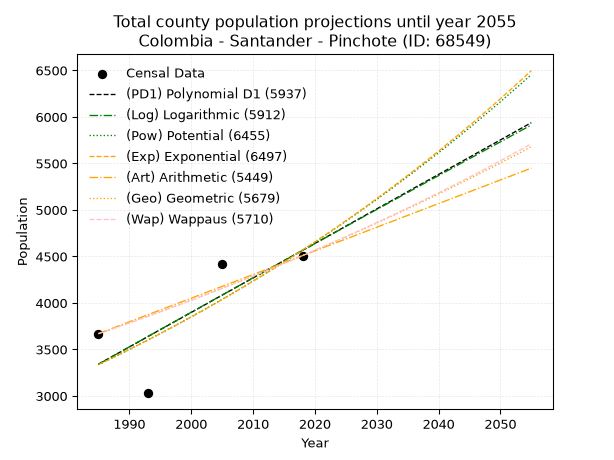
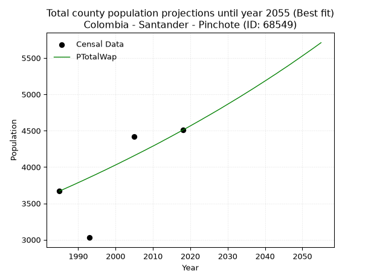
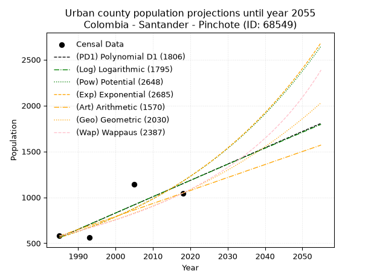
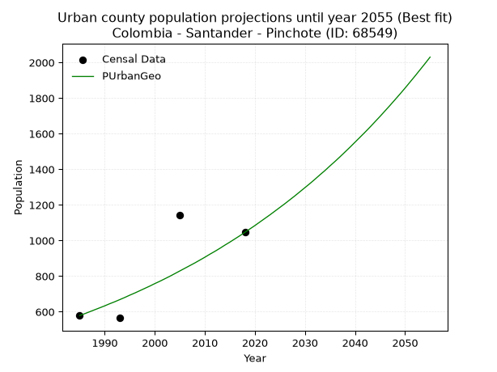
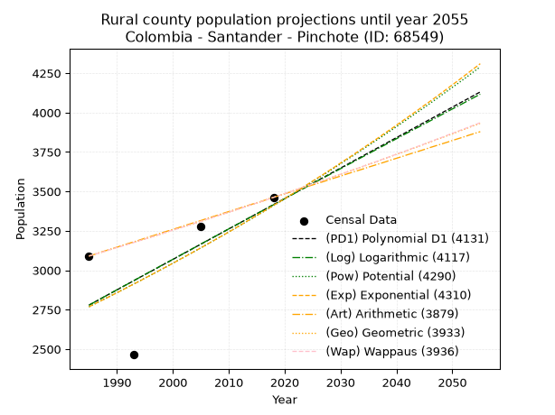
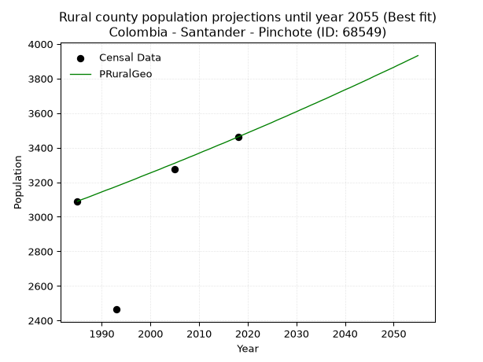

<div align="center">


</div>

# _“Population and Public Services Demand Projections (PPSD) until Year 2050 for Colombia - Santander - Pinchote (ID: 68549)”_
Keywords: `population` `public-service` `projection` `lineal` `polynomial` `logarithmic` `potential` `exponential` `arithmetic` `geometric` `wappaus` `dane` `colombia` `south-america`

PPSD are analytical estimates used by governments and planners to anticipate future changes in population size, age distribution, and the resulting community needs for utilities, healthcare, education, and infrastructure as sizing future water treatment facilities, electrical grids, and road networks based on spatial growth.

> **General running parameters**: • app_version: _v20260806_. • Python version: _3.14.7_. • Pandas version: _3.0.5_. • NumPy version: _2.5.1_. • Creates, save and include plots into reports (create_plot): _False_. • Projection until year: _2050_. • Process polynomial degree 2 and up: _False_. • Process Wappaus: _True_. • Process Wappaus: _True_. • Set negative values to zero: _True_. • Set infinite values to zero: _True_. • Drop dataset notes: _True_. 
<div align="center">

Dynamic map: [:earth_americas:Google](http://maps.google.com/maps?q=6.531551604,-73.1742091) [:earth_americas:OSM](https://www.openstreetmap.org/#map=18/6.531551604/-73.1742091&layers=P) [:earth_americas:Bing](https://www.bing.com/maps?cp=6.531551604~-73.1742091&lvl=18) [:earth_americas:Apple](https://maps.apple.com/frame?center=6.531551604%2C-73.1742091&span=0.003%2C0.006)

</div>


<div align="center">

```geojson
{
  "type": "Feature",
  "geometry": {
    "type": "Point", 
    "coordinates": [-73.1742091, 6.531551604]
  }, 
  "properties": {
    "Name": "Colombia - Santander - Pinchote (ID: 68549)"
  }
}
```

</div>


## 0. Census Data (4 records)

Census data are official statistics collected by a government about the people and housing in a country. They usually include counts of total population, age, sex, race, income, education, and jobs.

📅Global census file: [Population.xlsx](../data/Population.xlsx)

| Source   |   Year |   CountryID | CountryName   |   StateID | StateName   |   CountyID | CountyName   |   PTotal |   PUrban |   PRural |
|:---------|-------:|------------:|:--------------|----------:|:------------|-----------:|:-------------|---------:|---------:|---------:|
| DANE     |   1985 |          57 | Colombia      |        68 | Santander   |      68549 | Pinchote     |     3669 |      579 |     3090 |
| DANE     |   1993 |          57 | Colombia      |        68 | Santander   |      68549 | Pinchote     |     3029 |      565 |     2464 |
| DANE     |   2005 |          57 | Colombia      |        68 | Santander   |      68549 | Pinchote     |     4420 |     1143 |     3277 |
| DANE     |   2018 |          57 | Colombia      |        68 | Santander   |      68549 | Pinchote     |     4508 |     1046 |     3462 |

> 🔥Some records could had specific notes about the registered values or the corresponding urban or rural distribution.

## 1. Total

### 1.1. Coefficients and Parameters

* (PD1) Polynomial Deg 1: 37.09273384183044, -70288.24086712133 (lineal)
* (Log) Logarithmic: 74217.9130219446, -560224.45162483
* (Pow) Potential: 19.049871943871555, -59.2987586845332
* (Exp) Exponential: 0.009521657269063628, 2.0647765946065414e-05
* (Art) Arithmetic: Year diff. 2018 - 1985 = 33, Population diff. 4508 - 3669 = 839, Annual growth = 25.424242424242426
* (Geo) Geometric: Year diff. 2018 - 1985 = 33, Population diff. 4508 - 3669 = 839, Annual growth % = 0.006259950002673875
* (Wap) Wappaus: i = 0.6218476806712101, Condition values only valid for < 200)

<sub>
Wappaus condition values: ['0.00', '0.62', '1.24', '1.87', '2.49', '3.11', '3.73', '4.35', '4.97', '5.60', '6.22', '6.84', '7.46', '8.08', '8.71', '9.33', '9.95', '10.57', '11.19', '11.82', '12.44', '13.06', '13.68', '14.30', '14.92', '15.55', '16.17', '16.79', '17.41', '18.03', '18.66', '19.28', '19.90', '20.52', '21.14', '21.76', '22.39', '23.01', '23.63', '24.25', '24.87', '25.50', '26.12', '26.74', '27.36', '27.98', '28.60', '29.23', '29.85', '30.47', '31.09', '31.71', '32.34', '32.96', '33.58', '34.20', '34.82', '35.45', '36.07', '36.69', '37.31', '37.93', '38.55', '39.18', '39.80', '40.42']
</sub>


### 1.2. Projected Dataset

|   Year |   CountyID |   PTotalPD1 |   PTotalLog |   PTotalPow |   PTotalExp |   PTotalArt |   PTotalGeo |   PTotalWap |
|-------:|-----------:|------------:|------------:|------------:|------------:|------------:|------------:|------------:|
|   1985 |      68549 |        3341 |        3340 |        3335 |        3336 |        3669 |        3669 |        3669 |
|   1986 |      68549 |        3378 |        3377 |        3368 |        3368 |        3694 |        3692 |        3692 |
|   1987 |      68549 |        3415 |        3415 |        3400 |        3400 |        3720 |        3715 |        3715 |
|   1988 |      68549 |        3452 |        3452 |        3433 |        3433 |        3745 |        3738 |        3738 |
|   1989 |      68549 |        3489 |        3489 |        3466 |        3466 |        3771 |        3762 |        3761 |
|   1990 |      68549 |        3526 |        3527 |        3499 |        3499 |        3796 |        3785 |        3785 |
|   1991 |      68549 |        3563 |        3564 |        3533 |        3532 |        3822 |        3809 |        3808 |
|   1992 |      68549 |        3600 |        3601 |        3567 |        3566 |        3847 |        3833 |        3832 |
|   1993 |      68549 |        3638 |        3638 |        3601 |        3600 |        3872 |        3857 |        3856 |
|   1994 |      68549 |        3675 |        3676 |        3636 |        3635 |        3898 |        3881 |        3880 |
|   1995 |      68549 |        3712 |        3713 |        3671 |        3669 |        3923 |        3905 |        3904 |
|   1996 |      68549 |        3749 |        3750 |        3706 |        3705 |        3949 |        3930 |        3929 |
|   1997 |      68549 |        3786 |        3787 |        3741 |        3740 |        3974 |        3954 |        3953 |
|   1998 |      68549 |        3823 |        3824 |        3777 |        3776 |        4000 |        3979 |        3978 |
|   1999 |      68549 |        3860 |        3862 |        3813 |        3812 |        4025 |        4004 |        4003 |
|   2000 |      68549 |        3897 |        3899 |        3850 |        3848 |        4050 |        4029 |        4028 |
|   2001 |      68549 |        3934 |        3936 |        3887 |        3885 |        4076 |        4054 |        4053 |
|   2002 |      68549 |        3971 |        3973 |        3924 |        3922 |        4101 |        4080 |        4079 |
|   2003 |      68549 |        4009 |        4010 |        3961 |        3960 |        4127 |        4105 |        4104 |
|   2004 |      68549 |        4046 |        4047 |        3999 |        3998 |        4152 |        4131 |        4130 |
|   2005 |      68549 |        4083 |        4084 |        4037 |        4036 |        4177 |        4157 |        4156 |
|   2006 |      68549 |        4120 |        4121 |        4076 |        4075 |        4203 |        4183 |        4182 |
|   2007 |      68549 |        4157 |        4158 |        4115 |        4114 |        4228 |        4209 |        4208 |
|   2008 |      68549 |        4194 |        4195 |        4154 |        4153 |        4254 |        4235 |        4234 |
|   2009 |      68549 |        4231 |        4232 |        4194 |        4193 |        4279 |        4262 |        4261 |
|   2010 |      68549 |        4268 |        4269 |        4234 |        4233 |        4305 |        4288 |        4287 |
|   2011 |      68549 |        4305 |        4306 |        4274 |        4273 |        4330 |        4315 |        4314 |
|   2012 |      68549 |        4342 |        4343 |        4315 |        4314 |        4355 |        4342 |        4341 |
|   2013 |      68549 |        4379 |        4380 |        4356 |        4355 |        4381 |        4370 |        4369 |
|   2014 |      68549 |        4417 |        4416 |        4397 |        4397 |        4406 |        4397 |        4396 |
|   2015 |      68549 |        4454 |        4453 |        4439 |        4439 |        4432 |        4424 |        4424 |
|   2016 |      68549 |        4491 |        4490 |        4481 |        4482 |        4457 |        4452 |        4452 |
|   2017 |      68549 |        4528 |        4527 |        4523 |        4525 |        4483 |        4480 |        4480 |
|   2018 |      68549 |        4565 |        4564 |        4566 |        4568 |        4508 |        4508 |        4508 |
|   2019 |      68549 |        4602 |        4600 |        4610 |        4612 |        4533 |        4536 |        4536 |
|   2020 |      68549 |        4639 |        4637 |        4653 |        4656 |        4559 |        4565 |        4565 |
|   2021 |      68549 |        4676 |        4674 |        4697 |        4700 |        4584 |        4593 |        4594 |
|   2022 |      68549 |        4713 |        4711 |        4742 |        4745 |        4610 |        4622 |        4623 |
|   2023 |      68549 |        4750 |        4747 |        4787 |        4791 |        4635 |        4651 |        4652 |
|   2024 |      68549 |        4787 |        4784 |        4832 |        4836 |        4661 |        4680 |        4682 |
|   2025 |      68549 |        4825 |        4821 |        4878 |        4883 |        4686 |        4709 |        4711 |
|   2026 |      68549 |        4862 |        4857 |        4924 |        4929 |        4711 |        4739 |        4741 |
|   2027 |      68549 |        4899 |        4894 |        4970 |        4977 |        4737 |        4768 |        4771 |
|   2028 |      68549 |        4936 |        4931 |        5017 |        5024 |        4762 |        4798 |        4801 |
|   2029 |      68549 |        4973 |        4967 |        5065 |        5072 |        4788 |        4828 |        4832 |
|   2030 |      68549 |        5010 |        5004 |        5112 |        5121 |        4813 |        4859 |        4863 |
|   2031 |      68549 |        5047 |        5040 |        5161 |        5170 |        4839 |        4889 |        4894 |
|   2032 |      68549 |        5084 |        5077 |        5209 |        5219 |        4864 |        4920 |        4925 |
|   2033 |      68549 |        5121 |        5113 |        5258 |        5269 |        4889 |        4950 |        4956 |
|   2034 |      68549 |        5158 |        5150 |        5308 |        5320 |        4915 |        4981 |        4988 |
|   2035 |      68549 |        5195 |        5186 |        5358 |        5370 |        4940 |        5013 |        5020 |
|   2036 |      68549 |        5233 |        5223 |        5408 |        5422 |        4966 |        5044 |        5052 |
|   2037 |      68549 |        5270 |        5259 |        5459 |        5474 |        4991 |        5075 |        5084 |
|   2038 |      68549 |        5307 |        5296 |        5510 |        5526 |        5016 |        5107 |        5117 |
|   2039 |      68549 |        5344 |        5332 |        5562 |        5579 |        5042 |        5139 |        5150 |
|   2040 |      68549 |        5381 |        5368 |        5614 |        5632 |        5067 |        5171 |        5183 |
|   2041 |      68549 |        5418 |        5405 |        5667 |        5686 |        5093 |        5204 |        5216 |
|   2042 |      68549 |        5455 |        5441 |        5720 |        5741 |        5118 |        5236 |        5250 |
|   2043 |      68549 |        5492 |        5477 |        5773 |        5796 |        5144 |        5269 |        5283 |
|   2044 |      68549 |        5529 |        5514 |        5827 |        5851 |        5169 |        5302 |        5318 |
|   2045 |      68549 |        5566 |        5550 |        5882 |        5907 |        5194 |        5335 |        5352 |
|   2046 |      68549 |        5603 |        5586 |        5937 |        5963 |        5220 |        5369 |        5386 |
|   2047 |      68549 |        5641 |        5623 |        5993 |        6021 |        5245 |        5402 |        5421 |
|   2048 |      68549 |        5678 |        5659 |        6049 |        6078 |        5271 |        5436 |        5457 |
|   2049 |      68549 |        5715 |        5695 |        6105 |        6136 |        5296 |        5470 |        5492 |
|   2050 |      68549 |        5752 |        5731 |        6162 |        6195 |        5322 |        5504 |        5528 |
<div align="center">

</img>

</div>


### 1.3. Best fit with absolute and relative error (%)

Relative error puts that difference into context by dividing the absolute error by the true value, creating a unitless ratio or percentage that shows the scale of the mistake.

Absolute and relative error

|   Year | Source   |   CountryID | CountryName   |   StateID | StateName   |   CountyID_x | CountyName   |   PTotal |   PUrban |   PRural |   CountyID_y |   PTotalPD1 |   PTotalLog |   PTotalPow |   PTotalExp |   PTotalArt |   PTotalGeo |   PTotalWap |   PTotalPD1AbsError |   PTotalLogAbsError |   PTotalPowAbsError |   PTotalExpAbsError |   PTotalArtAbsError |   PTotalGeoAbsError |   PTotalWapAbsError |   PTotalPD1RelError |   PTotalLogRelError |   PTotalPowRelError |   PTotalExpRelError |   PTotalArtRelError |   PTotalGeoRelError |   PTotalWapRelError |
|-------:|:---------|------------:|:--------------|----------:|:------------|-------------:|:-------------|---------:|---------:|---------:|-------------:|------------:|------------:|------------:|------------:|------------:|------------:|------------:|--------------------:|--------------------:|--------------------:|--------------------:|--------------------:|--------------------:|--------------------:|--------------------:|--------------------:|--------------------:|--------------------:|--------------------:|--------------------:|--------------------:|
|   1985 | DANE     |          57 | Colombia      |        68 | Santander   |        68549 | Pinchote     |     3669 |      579 |     3090 |        68549 |        3341 |        3340 |        3335 |        3336 |        3669 |        3669 |        3669 |                 328 |                 329 |                 334 |                 333 |                   0 |                   0 |                   0 |             8.93977 |             8.96702 |             9.1033  |             9.07604 |             0       |             0       |             0       |
|   1993 | DANE     |          57 | Colombia      |        68 | Santander   |        68549 | Pinchote     |     3029 |      565 |     2464 |        68549 |        3638 |        3638 |        3601 |        3600 |        3872 |        3857 |        3856 |                 609 |                 609 |                 572 |                 571 |                 843 |                 828 |                 827 |            20.1056  |            20.1056  |            18.8841  |            18.8511  |            27.831   |            27.3358  |            27.3027  |
|   2005 | DANE     |          57 | Colombia      |        68 | Santander   |        68549 | Pinchote     |     4420 |     1143 |     3277 |        68549 |        4083 |        4084 |        4037 |        4036 |        4177 |        4157 |        4156 |                 337 |                 336 |                 383 |                 384 |                 243 |                 263 |                 264 |             7.62443 |             7.60181 |             8.66516 |             8.68778 |             5.49774 |             5.95023 |             5.97285 |
|   2018 | DANE     |          57 | Colombia      |        68 | Santander   |        68549 | Pinchote     |     4508 |     1046 |     3462 |        68549 |        4565 |        4564 |        4566 |        4568 |        4508 |        4508 |        4508 |                  57 |                  56 |                  58 |                  60 |                   0 |                   0 |                   0 |             1.26442 |             1.24224 |             1.2866  |             1.33097 |             0       |             0       |             0       |

Relative error mean

| Method    |   RelError | Best   |
|:----------|-----------:|:-------|
| PTotalPD1 |    9.48357 |        |
| PTotalLog |    9.47918 |        |
| PTotalPow |    9.48479 |        |
| PTotalExp |    9.48647 |        |
| PTotalArt |    8.33218 |        |
| PTotalGeo |    8.3215  |        |
| PTotalWap |    8.3189  | True   |

💙Best method: _**PTotalWap**_
<div align="center">

</img>

</div>


### 1.4. Fresh water supply demand in liters per capita per day (lpcd)

The fresh water supply demand typically ranges from 100 to 300 liters per capita per day (lpcd) for standard domestic and municipal planning, though absolute survival minimums set by the World Health Organization are as low as 7.5 to 20 liters per day, and total consumption in high-income nations can exceed 400 liters.

> `CZ`: Level in meters above the sea level (masl).<br> `WS`: Fresh water supply demand in liters per capita per day (lpcd or l/h/d).<br> `WSAll`: Zonal fresh water supply demand in liters per second (l/s).<br> `A`: Zonal area in square meters.

Reference values (RAS Colombia)

|    CZ |   WS |
|------:|-----:|
|  1000 |  120 |
|  2000 |  130 |
| 99999 |  140 |

County shapefile geometry properties and water supply values

|   CountyID |      ATotal |   CZTotal |   WSTotal |
|-----------:|------------:|----------:|----------:|
|      68549 | 5.54554e+07 |   1436.04 |       130 |

Projected values for best method: PTotalWap

|   CountyID |   Year |   PTotalWap |   WSTotal |   WSTotalAll |
|-----------:|-------:|------------:|----------:|-------------:|
|      68549 |   1985 |        3669 |       130 |      5.52049 |
|      68549 |   1986 |        3692 |       130 |      5.55509 |
|      68549 |   1987 |        3715 |       130 |      5.5897  |
|      68549 |   1988 |        3738 |       130 |      5.62431 |
|      68549 |   1989 |        3761 |       130 |      5.65891 |
|      68549 |   1990 |        3785 |       130 |      5.69502 |
|      68549 |   1991 |        3808 |       130 |      5.72963 |
|      68549 |   1992 |        3832 |       130 |      5.76574 |
|      68549 |   1993 |        3856 |       130 |      5.80185 |
|      68549 |   1994 |        3880 |       130 |      5.83796 |
|      68549 |   1995 |        3904 |       130 |      5.87407 |
|      68549 |   1996 |        3929 |       130 |      5.91169 |
|      68549 |   1997 |        3953 |       130 |      5.9478  |
|      68549 |   1998 |        3978 |       130 |      5.98542 |
|      68549 |   1999 |        4003 |       130 |      6.02303 |
|      68549 |   2000 |        4028 |       130 |      6.06065 |
|      68549 |   2001 |        4053 |       130 |      6.09826 |
|      68549 |   2002 |        4079 |       130 |      6.13738 |
|      68549 |   2003 |        4104 |       130 |      6.175   |
|      68549 |   2004 |        4130 |       130 |      6.21412 |
|      68549 |   2005 |        4156 |       130 |      6.25324 |
|      68549 |   2006 |        4182 |       130 |      6.29236 |
|      68549 |   2007 |        4208 |       130 |      6.33148 |
|      68549 |   2008 |        4234 |       130 |      6.3706  |
|      68549 |   2009 |        4261 |       130 |      6.41123 |
|      68549 |   2010 |        4287 |       130 |      6.45035 |
|      68549 |   2011 |        4314 |       130 |      6.49097 |
|      68549 |   2012 |        4341 |       130 |      6.5316  |
|      68549 |   2013 |        4369 |       130 |      6.57373 |
|      68549 |   2014 |        4396 |       130 |      6.61435 |
|      68549 |   2015 |        4424 |       130 |      6.65648 |
|      68549 |   2016 |        4452 |       130 |      6.69861 |
|      68549 |   2017 |        4480 |       130 |      6.74074 |
|      68549 |   2018 |        4508 |       130 |      6.78287 |
|      68549 |   2019 |        4536 |       130 |      6.825   |
|      68549 |   2020 |        4565 |       130 |      6.86863 |
|      68549 |   2021 |        4594 |       130 |      6.91227 |
|      68549 |   2022 |        4623 |       130 |      6.9559  |
|      68549 |   2023 |        4652 |       130 |      6.99954 |
|      68549 |   2024 |        4682 |       130 |      7.04468 |
|      68549 |   2025 |        4711 |       130 |      7.08831 |
|      68549 |   2026 |        4741 |       130 |      7.13345 |
|      68549 |   2027 |        4771 |       130 |      7.17859 |
|      68549 |   2028 |        4801 |       130 |      7.22373 |
|      68549 |   2029 |        4832 |       130 |      7.27037 |
|      68549 |   2030 |        4863 |       130 |      7.31701 |
|      68549 |   2031 |        4894 |       130 |      7.36366 |
|      68549 |   2032 |        4925 |       130 |      7.4103  |
|      68549 |   2033 |        4956 |       130 |      7.45694 |
|      68549 |   2034 |        4988 |       130 |      7.50509 |
|      68549 |   2035 |        5020 |       130 |      7.55324 |
|      68549 |   2036 |        5052 |       130 |      7.60139 |
|      68549 |   2037 |        5084 |       130 |      7.64954 |
|      68549 |   2038 |        5117 |       130 |      7.69919 |
|      68549 |   2039 |        5150 |       130 |      7.74884 |
|      68549 |   2040 |        5183 |       130 |      7.7985  |
|      68549 |   2041 |        5216 |       130 |      7.84815 |
|      68549 |   2042 |        5250 |       130 |      7.89931 |
|      68549 |   2043 |        5283 |       130 |      7.94896 |
|      68549 |   2044 |        5318 |       130 |      8.00162 |
|      68549 |   2045 |        5352 |       130 |      8.05278 |
|      68549 |   2046 |        5386 |       130 |      8.10394 |
|      68549 |   2047 |        5421 |       130 |      8.1566  |
|      68549 |   2048 |        5457 |       130 |      8.21076 |
|      68549 |   2049 |        5492 |       130 |      8.26343 |
|      68549 |   2050 |        5528 |       130 |      8.31759 |

## 2. Urban

### 2.1. Coefficients and Parameters

* (PD1) Polynomial Deg 1: 17.77559213167405, -34722.37816138101 (lineal)
* (Log) Logarithmic: 35604.53459440125, -269797.10276887787
* (Pow) Potential: 44.722106731226766, -144.7329896859118
* (Exp) Exponential: 0.022329649957955652, 3.164931403124028e-17
* (Art) Arithmetic: Year diff. 2018 - 1985 = 33, Population diff. 1046 - 579 = 467, Annual growth = 14.151515151515152
* (Geo) Geometric: Year diff. 2018 - 1985 = 33, Population diff. 1046 - 579 = 467, Annual growth % = 0.018083567928526723
* (Wap) Wappaus: i = 1.7417249417249416, Condition values only valid for < 200)

<sub>
Wappaus condition values: ['0.00', '1.74', '3.48', '5.23', '6.97', '8.71', '10.45', '12.19', '13.93', '15.68', '17.42', '19.16', '20.90', '22.64', '24.38', '26.13', '27.87', '29.61', '31.35', '33.09', '34.83', '36.58', '38.32', '40.06', '41.80', '43.54', '45.28', '47.03', '48.77', '50.51', '52.25', '53.99', '55.74', '57.48', '59.22', '60.96', '62.70', '64.44', '66.19', '67.93', '69.67', '71.41', '73.15', '74.89', '76.64', '78.38', '80.12', '81.86', '83.60', '85.34', '87.09', '88.83', '90.57', '92.31', '94.05', '95.79', '97.54', '99.28', '101.02', '102.76', '104.50', '106.25', '107.99', '109.73', '111.47', '113.21']
</sub>


### 2.2. Projected Dataset

|   Year |   CountyID |   PUrbanPD1 |   PUrbanLog |   PUrbanPow |   PUrbanExp |   PUrbanArt |   PUrbanGeo |   PUrbanWap |
|-------:|-----------:|------------:|------------:|------------:|------------:|------------:|------------:|------------:|
|   1985 |      68549 |         562 |         561 |         562 |         563 |         579 |         579 |         579 |
|   1986 |      68549 |         580 |         579 |         575 |         575 |         593 |         589 |         589 |
|   1987 |      68549 |         598 |         597 |         588 |         588 |         607 |         600 |         600 |
|   1988 |      68549 |         615 |         615 |         601 |         602 |         621 |         611 |         610 |
|   1989 |      68549 |         633 |         633 |         615 |         615 |         636 |         622 |         621 |
|   1990 |      68549 |         651 |         651 |         629 |         629 |         650 |         633 |         632 |
|   1991 |      68549 |         669 |         669 |         643 |         643 |         664 |         645 |         643 |
|   1992 |      68549 |         687 |         687 |         658 |         658 |         678 |         656 |         654 |
|   1993 |      68549 |         704 |         705 |         673 |         673 |         692 |         668 |         666 |
|   1994 |      68549 |         722 |         723 |         688 |         688 |         706 |         680 |         677 |
|   1995 |      68549 |         740 |         740 |         704 |         703 |         721 |         693 |         689 |
|   1996 |      68549 |         758 |         758 |         720 |         719 |         735 |         705 |         702 |
|   1997 |      68549 |         775 |         776 |         736 |         735 |         749 |         718 |         714 |
|   1998 |      68549 |         793 |         794 |         753 |         752 |         763 |         731 |         727 |
|   1999 |      68549 |         811 |         812 |         770 |         769 |         777 |         744 |         740 |
|   2000 |      68549 |         829 |         829 |         787 |         786 |         791 |         758 |         753 |
|   2001 |      68549 |         847 |         847 |         805 |         804 |         805 |         771 |         766 |
|   2002 |      68549 |         864 |         865 |         823 |         822 |         820 |         785 |         780 |
|   2003 |      68549 |         882 |         883 |         842 |         841 |         834 |         799 |         794 |
|   2004 |      68549 |         900 |         901 |         861 |         860 |         848 |         814 |         809 |
|   2005 |      68549 |         918 |         918 |         880 |         879 |         862 |         829 |         823 |
|   2006 |      68549 |         935 |         936 |         900 |         899 |         876 |         844 |         838 |
|   2007 |      68549 |         953 |         954 |         920 |         919 |         890 |         859 |         853 |
|   2008 |      68549 |         971 |         972 |         941 |         940 |         904 |         874 |         869 |
|   2009 |      68549 |         989 |         989 |         962 |         961 |         919 |         890 |         885 |
|   2010 |      68549 |        1007 |        1007 |         984 |         983 |         933 |         906 |         901 |
|   2011 |      68549 |        1024 |        1025 |        1006 |        1005 |         947 |         923 |         918 |
|   2012 |      68549 |        1042 |        1042 |        1029 |        1028 |         961 |         939 |         935 |
|   2013 |      68549 |        1060 |        1060 |        1052 |        1051 |         975 |         956 |         952 |
|   2014 |      68549 |        1078 |        1078 |        1075 |        1075 |         989 |         974 |         970 |
|   2015 |      68549 |        1095 |        1096 |        1099 |        1099 |        1004 |         991 |         989 |
|   2016 |      68549 |        1113 |        1113 |        1124 |        1124 |        1018 |        1009 |        1007 |
|   2017 |      68549 |        1131 |        1131 |        1149 |        1150 |        1032 |        1027 |        1026 |
|   2018 |      68549 |        1149 |        1148 |        1175 |        1175 |        1046 |        1046 |        1046 |
|   2019 |      68549 |        1167 |        1166 |        1201 |        1202 |        1060 |        1065 |        1066 |
|   2020 |      68549 |        1184 |        1184 |        1228 |        1229 |        1074 |        1084 |        1087 |
|   2021 |      68549 |        1202 |        1201 |        1256 |        1257 |        1088 |        1104 |        1108 |
|   2022 |      68549 |        1220 |        1219 |        1284 |        1285 |        1103 |        1124 |        1130 |
|   2023 |      68549 |        1238 |        1237 |        1313 |        1314 |        1117 |        1144 |        1152 |
|   2024 |      68549 |        1255 |        1254 |        1342 |        1344 |        1131 |        1165 |        1175 |
|   2025 |      68549 |        1273 |        1272 |        1372 |        1374 |        1145 |        1186 |        1198 |
|   2026 |      68549 |        1291 |        1289 |        1402 |        1405 |        1159 |        1207 |        1222 |
|   2027 |      68549 |        1309 |        1307 |        1434 |        1437 |        1173 |        1229 |        1247 |
|   2028 |      68549 |        1327 |        1324 |        1466 |        1470 |        1188 |        1251 |        1272 |
|   2029 |      68549 |        1344 |        1342 |        1498 |        1503 |        1202 |        1274 |        1298 |
|   2030 |      68549 |        1362 |        1360 |        1532 |        1537 |        1216 |        1297 |        1325 |
|   2031 |      68549 |        1380 |        1377 |        1566 |        1571 |        1230 |        1320 |        1353 |
|   2032 |      68549 |        1398 |        1395 |        1601 |        1607 |        1244 |        1344 |        1381 |
|   2033 |      68549 |        1415 |        1412 |        1636 |        1643 |        1258 |        1369 |        1411 |
|   2034 |      68549 |        1433 |        1430 |        1673 |        1680 |        1272 |        1393 |        1441 |
|   2035 |      68549 |        1451 |        1447 |        1710 |        1718 |        1287 |        1419 |        1472 |
|   2036 |      68549 |        1469 |        1465 |        1748 |        1757 |        1301 |        1444 |        1504 |
|   2037 |      68549 |        1487 |        1482 |        1787 |        1797 |        1315 |        1470 |        1537 |
|   2038 |      68549 |        1504 |        1500 |        1826 |        1837 |        1329 |        1497 |        1572 |
|   2039 |      68549 |        1522 |        1517 |        1867 |        1879 |        1343 |        1524 |        1607 |
|   2040 |      68549 |        1540 |        1535 |        1908 |        1921 |        1357 |        1552 |        1644 |
|   2041 |      68549 |        1558 |        1552 |        1951 |        1965 |        1371 |        1580 |        1681 |
|   2042 |      68549 |        1575 |        1569 |        1994 |        2009 |        1386 |        1608 |        1720 |
|   2043 |      68549 |        1593 |        1587 |        2038 |        2054 |        1400 |        1637 |        1761 |
|   2044 |      68549 |        1611 |        1604 |        2083 |        2101 |        1414 |        1667 |        1803 |
|   2045 |      68549 |        1629 |        1622 |        2129 |        2148 |        1428 |        1697 |        1846 |
|   2046 |      68549 |        1646 |        1639 |        2176 |        2197 |        1442 |        1728 |        1891 |
|   2047 |      68549 |        1664 |        1657 |        2224 |        2246 |        1456 |        1759 |        1938 |
|   2048 |      68549 |        1682 |        1674 |        2273 |        2297 |        1471 |        1791 |        1987 |
|   2049 |      68549 |        1700 |        1691 |        2324 |        2349 |        1485 |        1823 |        2037 |
|   2050 |      68549 |        1718 |        1709 |        2375 |        2402 |        1499 |        1856 |        2090 |
<div align="center">

</img>

</div>


### 2.3. Best fit with absolute and relative error (%)

Relative error puts that difference into context by dividing the absolute error by the true value, creating a unitless ratio or percentage that shows the scale of the mistake.

Absolute and relative error

|   Year | Source   |   CountryID | CountryName   |   StateID | StateName   |   CountyID_x | CountyName   |   PTotal |   PUrban |   PRural |   CountyID_y |   PUrbanPD1 |   PUrbanLog |   PUrbanPow |   PUrbanExp |   PUrbanArt |   PUrbanGeo |   PUrbanWap |   PUrbanPD1AbsError |   PUrbanLogAbsError |   PUrbanPowAbsError |   PUrbanExpAbsError |   PUrbanArtAbsError |   PUrbanGeoAbsError |   PUrbanWapAbsError |   PUrbanPD1RelError |   PUrbanLogRelError |   PUrbanPowRelError |   PUrbanExpRelError |   PUrbanArtRelError |   PUrbanGeoRelError |   PUrbanWapRelError |
|-------:|:---------|------------:|:--------------|----------:|:------------|-------------:|:-------------|---------:|---------:|---------:|-------------:|------------:|------------:|------------:|------------:|------------:|------------:|------------:|--------------------:|--------------------:|--------------------:|--------------------:|--------------------:|--------------------:|--------------------:|--------------------:|--------------------:|--------------------:|--------------------:|--------------------:|--------------------:|--------------------:|
|   1985 | DANE     |          57 | Colombia      |        68 | Santander   |        68549 | Pinchote     |     3669 |      579 |     3090 |        68549 |         562 |         561 |         562 |         563 |         579 |         579 |         579 |                  17 |                  18 |                  17 |                  16 |                   0 |                   0 |                   0 |             2.9361  |             3.10881 |              2.9361 |             2.76339 |              0      |              0      |              0      |
|   1993 | DANE     |          57 | Colombia      |        68 | Santander   |        68549 | Pinchote     |     3029 |      565 |     2464 |        68549 |         704 |         705 |         673 |         673 |         692 |         668 |         666 |                 139 |                 140 |                 108 |                 108 |                 127 |                 103 |                 101 |            24.6018  |            24.7788  |             19.115  |            19.115   |             22.4779 |             18.2301 |             17.8761 |
|   2005 | DANE     |          57 | Colombia      |        68 | Santander   |        68549 | Pinchote     |     4420 |     1143 |     3277 |        68549 |         918 |         918 |         880 |         879 |         862 |         829 |         823 |                 225 |                 225 |                 263 |                 264 |                 281 |                 314 |                 320 |            19.685   |            19.685   |             23.0096 |            23.0971  |             24.5844 |             27.4716 |             27.9965 |
|   2018 | DANE     |          57 | Colombia      |        68 | Santander   |        68549 | Pinchote     |     4508 |     1046 |     3462 |        68549 |        1149 |        1148 |        1175 |        1175 |        1046 |        1046 |        1046 |                 103 |                 102 |                 129 |                 129 |                   0 |                   0 |                   0 |             9.84704 |             9.75143 |             12.3327 |            12.3327  |              0      |              0      |              0      |

Relative error mean

| Method    |   RelError | Best   |
|:----------|-----------:|:-------|
| PUrbanPD1 |    14.2675 |        |
| PUrbanLog |    14.331  |        |
| PUrbanPow |    14.3484 |        |
| PUrbanExp |    14.3271 |        |
| PUrbanArt |    11.7656 |        |
| PUrbanGeo |    11.4254 | True   |
| PUrbanWap |    11.4682 |        |

💙Best method: _**PUrbanGeo**_
<div align="center">

</img>

</div>


### 2.4. Fresh water supply demand in liters per capita per day (lpcd)

The fresh water supply demand typically ranges from 100 to 300 liters per capita per day (lpcd) for standard domestic and municipal planning, though absolute survival minimums set by the World Health Organization are as low as 7.5 to 20 liters per day, and total consumption in high-income nations can exceed 400 liters.

> `CZ`: Level in meters above the sea level (masl).<br> `WS`: Fresh water supply demand in liters per capita per day (lpcd or l/h/d).<br> `WSAll`: Zonal fresh water supply demand in liters per second (l/s).<br> `A`: Zonal area in square meters.

Reference values (RAS Colombia)

|    CZ |   WS |
|------:|-----:|
|  1000 |  120 |
|  2000 |  130 |
| 99999 |  140 |

County shapefile geometry properties and water supply values

|   CountyID |   AUrban |   CZUrban |   WSUrban |
|-----------:|---------:|----------:|----------:|
|      68549 |   322093 |   1198.11 |       130 |

Projected values for best method: PUrbanGeo

|   CountyID |   Year |   PUrbanGeo |   WSUrban |   WSUrbanAll |
|-----------:|-------:|------------:|----------:|-------------:|
|      68549 |   1985 |         579 |       130 |     0.871181 |
|      68549 |   1986 |         589 |       130 |     0.886227 |
|      68549 |   1987 |         600 |       130 |     0.902778 |
|      68549 |   1988 |         611 |       130 |     0.919329 |
|      68549 |   1989 |         622 |       130 |     0.93588  |
|      68549 |   1990 |         633 |       130 |     0.952431 |
|      68549 |   1991 |         645 |       130 |     0.970486 |
|      68549 |   1992 |         656 |       130 |     0.987037 |
|      68549 |   1993 |         668 |       130 |     1.00509  |
|      68549 |   1994 |         680 |       130 |     1.02315  |
|      68549 |   1995 |         693 |       130 |     1.04271  |
|      68549 |   1996 |         705 |       130 |     1.06076  |
|      68549 |   1997 |         718 |       130 |     1.08032  |
|      68549 |   1998 |         731 |       130 |     1.09988  |
|      68549 |   1999 |         744 |       130 |     1.11944  |
|      68549 |   2000 |         758 |       130 |     1.14051  |
|      68549 |   2001 |         771 |       130 |     1.16007  |
|      68549 |   2002 |         785 |       130 |     1.18113  |
|      68549 |   2003 |         799 |       130 |     1.2022   |
|      68549 |   2004 |         814 |       130 |     1.22477  |
|      68549 |   2005 |         829 |       130 |     1.24734  |
|      68549 |   2006 |         844 |       130 |     1.26991  |
|      68549 |   2007 |         859 |       130 |     1.29248  |
|      68549 |   2008 |         874 |       130 |     1.31505  |
|      68549 |   2009 |         890 |       130 |     1.33912  |
|      68549 |   2010 |         906 |       130 |     1.36319  |
|      68549 |   2011 |         923 |       130 |     1.38877  |
|      68549 |   2012 |         939 |       130 |     1.41285  |
|      68549 |   2013 |         956 |       130 |     1.43843  |
|      68549 |   2014 |         974 |       130 |     1.46551  |
|      68549 |   2015 |         991 |       130 |     1.49109  |
|      68549 |   2016 |        1009 |       130 |     1.51817  |
|      68549 |   2017 |        1027 |       130 |     1.54525  |
|      68549 |   2018 |        1046 |       130 |     1.57384  |
|      68549 |   2019 |        1065 |       130 |     1.60243  |
|      68549 |   2020 |        1084 |       130 |     1.63102  |
|      68549 |   2021 |        1104 |       130 |     1.66111  |
|      68549 |   2022 |        1124 |       130 |     1.6912   |
|      68549 |   2023 |        1144 |       130 |     1.7213   |
|      68549 |   2024 |        1165 |       130 |     1.75289  |
|      68549 |   2025 |        1186 |       130 |     1.78449  |
|      68549 |   2026 |        1207 |       130 |     1.81609  |
|      68549 |   2027 |        1229 |       130 |     1.84919  |
|      68549 |   2028 |        1251 |       130 |     1.88229  |
|      68549 |   2029 |        1274 |       130 |     1.9169   |
|      68549 |   2030 |        1297 |       130 |     1.9515   |
|      68549 |   2031 |        1320 |       130 |     1.98611  |
|      68549 |   2032 |        1344 |       130 |     2.02222  |
|      68549 |   2033 |        1369 |       130 |     2.05984  |
|      68549 |   2034 |        1393 |       130 |     2.09595  |
|      68549 |   2035 |        1419 |       130 |     2.13507  |
|      68549 |   2036 |        1444 |       130 |     2.17269  |
|      68549 |   2037 |        1470 |       130 |     2.21181  |
|      68549 |   2038 |        1497 |       130 |     2.25243  |
|      68549 |   2039 |        1524 |       130 |     2.29306  |
|      68549 |   2040 |        1552 |       130 |     2.33519  |
|      68549 |   2041 |        1580 |       130 |     2.37731  |
|      68549 |   2042 |        1608 |       130 |     2.41944  |
|      68549 |   2043 |        1637 |       130 |     2.46308  |
|      68549 |   2044 |        1667 |       130 |     2.50822  |
|      68549 |   2045 |        1697 |       130 |     2.55336  |
|      68549 |   2046 |        1728 |       130 |     2.6      |
|      68549 |   2047 |        1759 |       130 |     2.64664  |
|      68549 |   2048 |        1791 |       130 |     2.69479  |
|      68549 |   2049 |        1823 |       130 |     2.74294  |
|      68549 |   2050 |        1856 |       130 |     2.79259  |

## 3. Rural

### 3.1. Coefficients and Parameters

* (PD1) Polynomial Deg 1: 19.317141710156395, -35565.86270574033 (lineal)
* (Log) Logarithmic: 38613.37842754332, -290427.3488559521
* (Pow) Potential: 12.639682140888977, -38.240448632764455
* (Exp) Exponential: 0.006323767797750417, 0.009787215676863173
* (Art) Arithmetic: Year diff. 2018 - 1985 = 33, Population diff. 3462 - 3090 = 372, Annual growth = 11.272727272727273
* (Geo) Geometric: Year diff. 2018 - 1985 = 33, Population diff. 3462 - 3090 = 372, Annual growth % = 0.0034506478810478747
* (Wap) Wappaus: i = 0.3441003441003441, Condition values only valid for < 200)

<sub>
Wappaus condition values: ['0.00', '0.34', '0.69', '1.03', '1.38', '1.72', '2.06', '2.41', '2.75', '3.10', '3.44', '3.79', '4.13', '4.47', '4.82', '5.16', '5.51', '5.85', '6.19', '6.54', '6.88', '7.23', '7.57', '7.91', '8.26', '8.60', '8.95', '9.29', '9.63', '9.98', '10.32', '10.67', '11.01', '11.36', '11.70', '12.04', '12.39', '12.73', '13.08', '13.42', '13.76', '14.11', '14.45', '14.80', '15.14', '15.48', '15.83', '16.17', '16.52', '16.86', '17.21', '17.55', '17.89', '18.24', '18.58', '18.93', '19.27', '19.61', '19.96', '20.30', '20.65', '20.99', '21.33', '21.68', '22.02', '22.37']
</sub>


### 3.2. Projected Dataset

|   Year |   CountyID |   PRuralPD1 |   PRuralLog |   PRuralPow |   PRuralExp |   PRuralArt |   PRuralGeo |   PRuralWap |
|-------:|-----------:|------------:|------------:|------------:|------------:|------------:|------------:|------------:|
|   1985 |      68549 |        2779 |        2778 |        2768 |        2768 |        3090 |        3090 |        3090 |
|   1986 |      68549 |        2798 |        2798 |        2786 |        2786 |        3101 |        3101 |        3101 |
|   1987 |      68549 |        2817 |        2817 |        2804 |        2804 |        3113 |        3111 |        3111 |
|   1988 |      68549 |        2837 |        2837 |        2822 |        2821 |        3124 |        3122 |        3122 |
|   1989 |      68549 |        2856 |        2856 |        2840 |        2839 |        3135 |        3133 |        3133 |
|   1990 |      68549 |        2875 |        2876 |        2858 |        2857 |        3146 |        3144 |        3144 |
|   1991 |      68549 |        2895 |        2895 |        2876 |        2875 |        3158 |        3155 |        3154 |
|   1992 |      68549 |        2914 |        2914 |        2894 |        2894 |        3169 |        3165 |        3165 |
|   1993 |      68549 |        2933 |        2934 |        2913 |        2912 |        3180 |        3176 |        3176 |
|   1994 |      68549 |        2953 |        2953 |        2931 |        2930 |        3191 |        3187 |        3187 |
|   1995 |      68549 |        2972 |        2973 |        2950 |        2949 |        3203 |        3198 |        3198 |
|   1996 |      68549 |        2991 |        2992 |        2968 |        2968 |        3214 |        3209 |        3209 |
|   1997 |      68549 |        3010 |        3011 |        2987 |        2987 |        3225 |        3220 |        3220 |
|   1998 |      68549 |        3030 |        3031 |        3006 |        3006 |        3237 |        3232 |        3231 |
|   1999 |      68549 |        3049 |        3050 |        3025 |        3025 |        3248 |        3243 |        3243 |
|   2000 |      68549 |        3068 |        3069 |        3045 |        3044 |        3259 |        3254 |        3254 |
|   2001 |      68549 |        3088 |        3088 |        3064 |        3063 |        3270 |        3265 |        3265 |
|   2002 |      68549 |        3107 |        3108 |        3083 |        3083 |        3282 |        3276 |        3276 |
|   2003 |      68549 |        3126 |        3127 |        3103 |        3102 |        3293 |        3288 |        3288 |
|   2004 |      68549 |        3146 |        3146 |        3122 |        3122 |        3304 |        3299 |        3299 |
|   2005 |      68549 |        3165 |        3166 |        3142 |        3142 |        3315 |        3310 |        3310 |
|   2006 |      68549 |        3184 |        3185 |        3162 |        3161 |        3327 |        3322 |        3322 |
|   2007 |      68549 |        3204 |        3204 |        3182 |        3182 |        3338 |        3333 |        3333 |
|   2008 |      68549 |        3223 |        3223 |        3202 |        3202 |        3349 |        3345 |        3345 |
|   2009 |      68549 |        3242 |        3243 |        3222 |        3222 |        3361 |        3356 |        3356 |
|   2010 |      68549 |        3262 |        3262 |        3243 |        3242 |        3372 |        3368 |        3368 |
|   2011 |      68549 |        3281 |        3281 |        3263 |        3263 |        3383 |        3380 |        3379 |
|   2012 |      68549 |        3300 |        3300 |        3284 |        3284 |        3394 |        3391 |        3391 |
|   2013 |      68549 |        3320 |        3319 |        3304 |        3305 |        3406 |        3403 |        3403 |
|   2014 |      68549 |        3339 |        3339 |        3325 |        3326 |        3417 |        3415 |        3415 |
|   2015 |      68549 |        3358 |        3358 |        3346 |        3347 |        3428 |        3426 |        3426 |
|   2016 |      68549 |        3377 |        3377 |        3367 |        3368 |        3439 |        3438 |        3438 |
|   2017 |      68549 |        3397 |        3396 |        3388 |        3389 |        3451 |        3450 |        3450 |
|   2018 |      68549 |        3416 |        3415 |        3410 |        3411 |        3462 |        3462 |        3462 |
|   2019 |      68549 |        3435 |        3434 |        3431 |        3432 |        3473 |        3474 |        3474 |
|   2020 |      68549 |        3455 |        3453 |        3453 |        3454 |        3485 |        3486 |        3486 |
|   2021 |      68549 |        3474 |        3473 |        3474 |        3476 |        3496 |        3498 |        3498 |
|   2022 |      68549 |        3493 |        3492 |        3496 |        3498 |        3507 |        3510 |        3510 |
|   2023 |      68549 |        3513 |        3511 |        3518 |        3520 |        3518 |        3522 |        3522 |
|   2024 |      68549 |        3532 |        3530 |        3540 |        3543 |        3530 |        3534 |        3535 |
|   2025 |      68549 |        3551 |        3549 |        3562 |        3565 |        3541 |        3546 |        3547 |
|   2026 |      68549 |        3571 |        3568 |        3584 |        3588 |        3552 |        3559 |        3559 |
|   2027 |      68549 |        3590 |        3587 |        3607 |        3610 |        3563 |        3571 |        3571 |
|   2028 |      68549 |        3609 |        3606 |        3629 |        3633 |        3575 |        3583 |        3584 |
|   2029 |      68549 |        3629 |        3625 |        3652 |        3656 |        3586 |        3596 |        3596 |
|   2030 |      68549 |        3648 |        3644 |        3675 |        3680 |        3597 |        3608 |        3609 |
|   2031 |      68549 |        3667 |        3663 |        3698 |        3703 |        3609 |        3621 |        3621 |
|   2032 |      68549 |        3687 |        3682 |        3721 |        3726 |        3620 |        3633 |        3634 |
|   2033 |      68549 |        3706 |        3701 |        3744 |        3750 |        3631 |        3646 |        3646 |
|   2034 |      68549 |        3725 |        3720 |        3768 |        3774 |        3642 |        3658 |        3659 |
|   2035 |      68549 |        3745 |        3739 |        3791 |        3798 |        3654 |        3671 |        3672 |
|   2036 |      68549 |        3764 |        3758 |        3815 |        3822 |        3665 |        3683 |        3684 |
|   2037 |      68549 |        3783 |        3777 |        3838 |        3846 |        3676 |        3696 |        3697 |
|   2038 |      68549 |        3802 |        3796 |        3862 |        3871 |        3687 |        3709 |        3710 |
|   2039 |      68549 |        3822 |        3815 |        3886 |        3895 |        3699 |        3722 |        3723 |
|   2040 |      68549 |        3841 |        3834 |        3910 |        3920 |        3710 |        3735 |        3736 |
|   2041 |      68549 |        3860 |        3853 |        3935 |        3945 |        3721 |        3747 |        3749 |
|   2042 |      68549 |        3880 |        3872 |        3959 |        3970 |        3733 |        3760 |        3762 |
|   2043 |      68549 |        3899 |        3891 |        3984 |        3995 |        3744 |        3773 |        3775 |
|   2044 |      68549 |        3918 |        3909 |        4008 |        4020 |        3755 |        3786 |        3788 |
|   2045 |      68549 |        3938 |        3928 |        4033 |        4046 |        3766 |        3799 |        3801 |
|   2046 |      68549 |        3957 |        3947 |        4058 |        4071 |        3778 |        3813 |        3815 |
|   2047 |      68549 |        3976 |        3966 |        4083 |        4097 |        3789 |        3826 |        3828 |
|   2048 |      68549 |        3996 |        3985 |        4109 |        4123 |        3800 |        3839 |        3841 |
|   2049 |      68549 |        4015 |        4004 |        4134 |        4149 |        3811 |        3852 |        3855 |
|   2050 |      68549 |        4034 |        4023 |        4160 |        4176 |        3823 |        3865 |        3868 |
<div align="center">

</img>

</div>


### 3.3. Best fit with absolute and relative error (%)

Relative error puts that difference into context by dividing the absolute error by the true value, creating a unitless ratio or percentage that shows the scale of the mistake.

Absolute and relative error

|   Year | Source   |   CountryID | CountryName   |   StateID | StateName   |   CountyID_x | CountyName   |   PTotal |   PUrban |   PRural |   CountyID_y |   PRuralPD1 |   PRuralLog |   PRuralPow |   PRuralExp |   PRuralArt |   PRuralGeo |   PRuralWap |   PRuralPD1AbsError |   PRuralLogAbsError |   PRuralPowAbsError |   PRuralExpAbsError |   PRuralArtAbsError |   PRuralGeoAbsError |   PRuralWapAbsError |   PRuralPD1RelError |   PRuralLogRelError |   PRuralPowRelError |   PRuralExpRelError |   PRuralArtRelError |   PRuralGeoRelError |   PRuralWapRelError |
|-------:|:---------|------------:|:--------------|----------:|:------------|-------------:|:-------------|---------:|---------:|---------:|-------------:|------------:|------------:|------------:|------------:|------------:|------------:|------------:|--------------------:|--------------------:|--------------------:|--------------------:|--------------------:|--------------------:|--------------------:|--------------------:|--------------------:|--------------------:|--------------------:|--------------------:|--------------------:|--------------------:|
|   1985 | DANE     |          57 | Colombia      |        68 | Santander   |        68549 | Pinchote     |     3669 |      579 |     3090 |        68549 |        2779 |        2778 |        2768 |        2768 |        3090 |        3090 |        3090 |                 311 |                 312 |                 322 |                 322 |                   0 |                   0 |                   0 |            10.0647  |            10.0971  |            10.4207  |            10.4207  |              0      |             0       |             0       |
|   1993 | DANE     |          57 | Colombia      |        68 | Santander   |        68549 | Pinchote     |     3029 |      565 |     2464 |        68549 |        2933 |        2934 |        2913 |        2912 |        3180 |        3176 |        3176 |                 469 |                 470 |                 449 |                 448 |                 716 |                 712 |                 712 |            19.0341  |            19.0747  |            18.2224  |            18.1818  |             29.0584 |            28.8961  |            28.8961  |
|   2005 | DANE     |          57 | Colombia      |        68 | Santander   |        68549 | Pinchote     |     4420 |     1143 |     3277 |        68549 |        3165 |        3166 |        3142 |        3142 |        3315 |        3310 |        3310 |                 112 |                 111 |                 135 |                 135 |                  38 |                  33 |                  33 |             3.41776 |             3.38724 |             4.11962 |             4.11962 |              1.1596 |             1.00702 |             1.00702 |
|   2018 | DANE     |          57 | Colombia      |        68 | Santander   |        68549 | Pinchote     |     4508 |     1046 |     3462 |        68549 |        3416 |        3415 |        3410 |        3411 |        3462 |        3462 |        3462 |                  46 |                  47 |                  52 |                  51 |                   0 |                   0 |                   0 |             1.32871 |             1.3576  |             1.50202 |             1.47314 |              0      |             0       |             0       |

Relative error mean

| Method    |   RelError | Best   |
|:----------|-----------:|:-------|
| PRuralPD1 |    8.46132 |        |
| PRuralLog |    8.47915 |        |
| PRuralPow |    8.56619 |        |
| PRuralExp |    8.54882 |        |
| PRuralArt |    7.55451 |        |
| PRuralGeo |    7.47578 | True   |
| PRuralWap |    7.47578 | True   |

💙Best method: _**PRuralGeo**_
<div align="center">

</img>

</div>


### 3.4. Fresh water supply demand in liters per capita per day (lpcd)

The fresh water supply demand typically ranges from 100 to 300 liters per capita per day (lpcd) for standard domestic and municipal planning, though absolute survival minimums set by the World Health Organization are as low as 7.5 to 20 liters per day, and total consumption in high-income nations can exceed 400 liters.

> `CZ`: Level in meters above the sea level (masl).<br> `WS`: Fresh water supply demand in liters per capita per day (lpcd or l/h/d).<br> `WSAll`: Zonal fresh water supply demand in liters per second (l/s).<br> `A`: Zonal area in square meters.

Reference values (RAS Colombia)

|    CZ |   WS |
|------:|-----:|
|  1000 |  120 |
|  2000 |  130 |
| 99999 |  140 |

County shapefile geometry properties and water supply values

|   CountyID |      ARural |   CZRural |   WSRural |
|-----------:|------------:|----------:|----------:|
|      68549 | 5.51333e+07 |   1437.48 |       130 |

Projected values for best method: PRuralGeo

|   CountyID |   Year |   PRuralGeo |   WSRural |   WSRuralAll |
|-----------:|-------:|------------:|----------:|-------------:|
|      68549 |   1985 |        3090 |       130 |      4.64931 |
|      68549 |   1986 |        3101 |       130 |      4.66586 |
|      68549 |   1987 |        3111 |       130 |      4.6809  |
|      68549 |   1988 |        3122 |       130 |      4.69745 |
|      68549 |   1989 |        3133 |       130 |      4.714   |
|      68549 |   1990 |        3144 |       130 |      4.73056 |
|      68549 |   1991 |        3155 |       130 |      4.74711 |
|      68549 |   1992 |        3165 |       130 |      4.76215 |
|      68549 |   1993 |        3176 |       130 |      4.7787  |
|      68549 |   1994 |        3187 |       130 |      4.79525 |
|      68549 |   1995 |        3198 |       130 |      4.81181 |
|      68549 |   1996 |        3209 |       130 |      4.82836 |
|      68549 |   1997 |        3220 |       130 |      4.84491 |
|      68549 |   1998 |        3232 |       130 |      4.86296 |
|      68549 |   1999 |        3243 |       130 |      4.87951 |
|      68549 |   2000 |        3254 |       130 |      4.89606 |
|      68549 |   2001 |        3265 |       130 |      4.91262 |
|      68549 |   2002 |        3276 |       130 |      4.92917 |
|      68549 |   2003 |        3288 |       130 |      4.94722 |
|      68549 |   2004 |        3299 |       130 |      4.96377 |
|      68549 |   2005 |        3310 |       130 |      4.98032 |
|      68549 |   2006 |        3322 |       130 |      4.99838 |
|      68549 |   2007 |        3333 |       130 |      5.01493 |
|      68549 |   2008 |        3345 |       130 |      5.03299 |
|      68549 |   2009 |        3356 |       130 |      5.04954 |
|      68549 |   2010 |        3368 |       130 |      5.06759 |
|      68549 |   2011 |        3380 |       130 |      5.08565 |
|      68549 |   2012 |        3391 |       130 |      5.1022  |
|      68549 |   2013 |        3403 |       130 |      5.12025 |
|      68549 |   2014 |        3415 |       130 |      5.13831 |
|      68549 |   2015 |        3426 |       130 |      5.15486 |
|      68549 |   2016 |        3438 |       130 |      5.17292 |
|      68549 |   2017 |        3450 |       130 |      5.19097 |
|      68549 |   2018 |        3462 |       130 |      5.20903 |
|      68549 |   2019 |        3474 |       130 |      5.22708 |
|      68549 |   2020 |        3486 |       130 |      5.24514 |
|      68549 |   2021 |        3498 |       130 |      5.26319 |
|      68549 |   2022 |        3510 |       130 |      5.28125 |
|      68549 |   2023 |        3522 |       130 |      5.29931 |
|      68549 |   2024 |        3534 |       130 |      5.31736 |
|      68549 |   2025 |        3546 |       130 |      5.33542 |
|      68549 |   2026 |        3559 |       130 |      5.35498 |
|      68549 |   2027 |        3571 |       130 |      5.37303 |
|      68549 |   2028 |        3583 |       130 |      5.39109 |
|      68549 |   2029 |        3596 |       130 |      5.41065 |
|      68549 |   2030 |        3608 |       130 |      5.4287  |
|      68549 |   2031 |        3621 |       130 |      5.44826 |
|      68549 |   2032 |        3633 |       130 |      5.46632 |
|      68549 |   2033 |        3646 |       130 |      5.48588 |
|      68549 |   2034 |        3658 |       130 |      5.50394 |
|      68549 |   2035 |        3671 |       130 |      5.5235  |
|      68549 |   2036 |        3683 |       130 |      5.54155 |
|      68549 |   2037 |        3696 |       130 |      5.56111 |
|      68549 |   2038 |        3709 |       130 |      5.58067 |
|      68549 |   2039 |        3722 |       130 |      5.60023 |
|      68549 |   2040 |        3735 |       130 |      5.61979 |
|      68549 |   2041 |        3747 |       130 |      5.63785 |
|      68549 |   2042 |        3760 |       130 |      5.65741 |
|      68549 |   2043 |        3773 |       130 |      5.67697 |
|      68549 |   2044 |        3786 |       130 |      5.69653 |
|      68549 |   2045 |        3799 |       130 |      5.71609 |
|      68549 |   2046 |        3813 |       130 |      5.73715 |
|      68549 |   2047 |        3826 |       130 |      5.75671 |
|      68549 |   2048 |        3839 |       130 |      5.77627 |
|      68549 |   2049 |        3852 |       130 |      5.79583 |
|      68549 |   2050 |        3865 |       130 |      5.81539 |

<div align="center"><br><sub>Share this research</sub></div><br>

<sub>**APPS & TOOLS & CONTENT DISCLAIMER**: • NO WARRANTY - This content and software is provided by <a href="https://github.com/rcfdtools" target="_blank">github.com/rcfdtools</a> "as is", without any express or implied warranty, including warranties of merchantability, fitness for a particular purpose, or non-infringement. There is no guarantee that the software will be error-free or operate without interruption. • LIMITATION OF LIABILITY - Neither the authors nor copyright holders will be liable for claims or damages arising from the software or its use. You are responsible for determining if the software is appropriate for your use and assume all associated risks, including errors, legal compliance, and data loss. • NO PROFESSIONAL ADVICE - The software provides general information and does not offer professional advice. It should not replace consultation with professional advisors. [Clauses and global license for rcfdtools use.](https://github.com/rcfdtools/rcfdtools/blob/main/LICENSE.md)</sub>