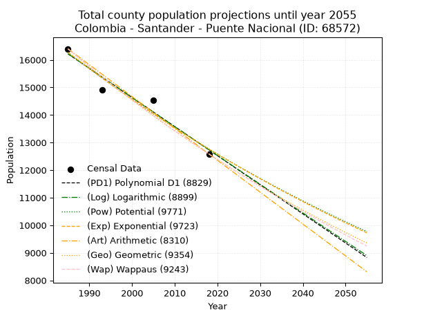
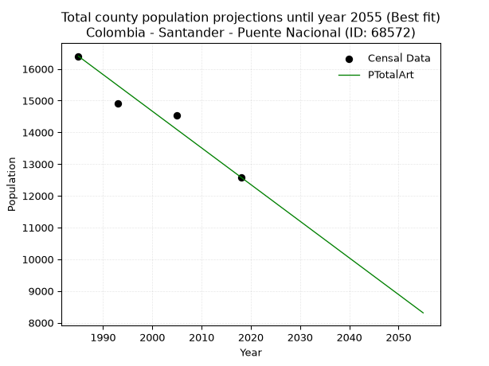
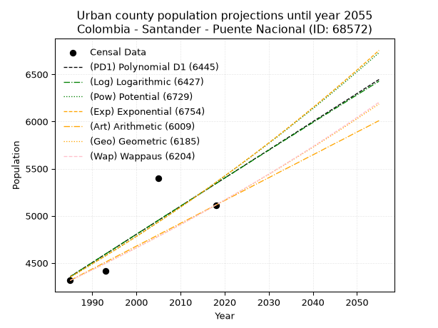
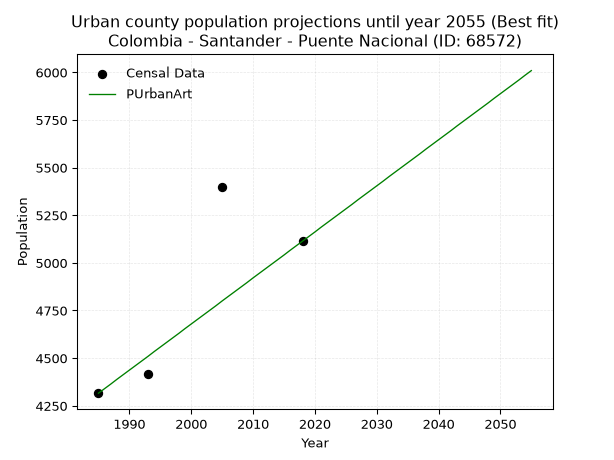
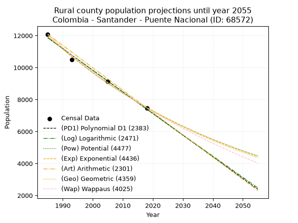
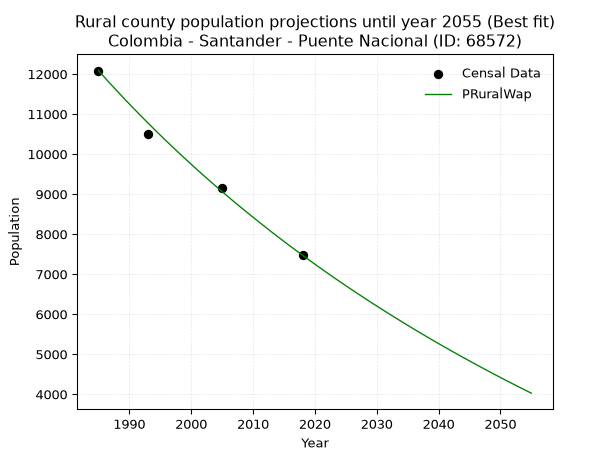

<div align="center">


</div>

# _“Population and Public Services Demand Projections (PPSD) until Year 2050 for Colombia - Santander - Puente Nacional (ID: 68572)”_
Keywords: `population` `public-service` `projection` `lineal` `polynomial` `logarithmic` `potential` `exponential` `arithmetic` `geometric` `wappaus` `dane` `colombia` `south-america`

PPSD are analytical estimates used by governments and planners to anticipate future changes in population size, age distribution, and the resulting community needs for utilities, healthcare, education, and infrastructure as sizing future water treatment facilities, electrical grids, and road networks based on spatial growth.

> **General running parameters**: • app_version: _v20260806_. • Python version: _3.14.7_. • Pandas version: _3.0.5_. • NumPy version: _2.5.1_. • Creates, save and include plots into reports (create_plot): _False_. • Projection until year: _2050_. • Process polynomial degree 2 and up: _False_. • Process Wappaus: _True_. • Process Wappaus: _True_. • Set negative values to zero: _True_. • Set infinite values to zero: _True_. • Drop dataset notes: _True_. 
<div align="center">

Dynamic map: [:earth_americas:Google](http://maps.google.com/maps?q=5.878380917,-73.6775669) [:earth_americas:OSM](https://www.openstreetmap.org/#map=18/5.878380917/-73.6775669&layers=P) [:earth_americas:Bing](https://www.bing.com/maps?cp=5.878380917~-73.6775669&lvl=18) [:earth_americas:Apple](https://maps.apple.com/frame?center=5.878380917%2C-73.6775669&span=0.003%2C0.006)

</div>


<div align="center">

```geojson
{
  "type": "Feature",
  "geometry": {
    "type": "Point", 
    "coordinates": [-73.6775669, 5.878380917]
  }, 
  "properties": {
    "Name": "Colombia - Santander - Puente Nacional (ID: 68572)"
  }
}
```

</div>


## 0. Census Data (4 records)

Census data are official statistics collected by a government about the people and housing in a country. They usually include counts of total population, age, sex, race, income, education, and jobs.

📅Global census file: [Population.xlsx](../data/Population.xlsx)

| Source   |   Year |   CountryID | CountryName   |   StateID | StateName   |   CountyID | CountyName      |   PTotal |   PUrban |   PRural |
|:---------|-------:|------------:|:--------------|----------:|:------------|-----------:|:----------------|---------:|---------:|---------:|
| DANE     |   1985 |          57 | Colombia      |        68 | Santander   |      68572 | Puente Nacional |    16400 |     4316 |    12084 |
| DANE     |   1993 |          57 | Colombia      |        68 | Santander   |      68572 | Puente Nacional |    14910 |     4415 |    10495 |
| DANE     |   2005 |          57 | Colombia      |        68 | Santander   |      68572 | Puente Nacional |    14538 |     5399 |     9139 |
| DANE     |   2018 |          57 | Colombia      |        68 | Santander   |      68572 | Puente Nacional |    12586 |     5114 |     7472 |

> 🔥Some records could had specific notes about the registered values or the corresponding urban or rural distribution.

📅   [RUPS](https://www.datos.gov.co/Hacienda-y-Cr-dito-P-blico/Registro-nico-de-Prestadores-de-Servicios-P-blicos/4qkq-csdn/about_data) - Local public utility companies: [RUPS.csv](../data/RUPS.xlsx)

 | SERVICIO       | ESTADO    | NOMBRE                                                                                                                                          | NIT         | DEPARTAMENTO_DOMICILIO   | MUNICIPIO_DOMICILIO   | DIRECCION      |   TELEFONO | EMAIL                | TIPO_PRESTADOR                             | CLASIFICACION                 |
|:---------------|:----------|:------------------------------------------------------------------------------------------------------------------------------------------------|:------------|:-------------------------|:----------------------|:---------------|-----------:|:---------------------|:-------------------------------------------|:------------------------------|
| ACUEDUCTO      | OPERATIVA | EMPRESA DE SERVICIOS PÚBLICOS DOMICILIARIOS DE PUENTE NACIONAL E.S.P.                                                                           | 804009177-2 | SANTANDER                | PUENTE NACIONAL       | ANILLO VIAL    |    7587050 | acuapuente@gmail.com | SOCIEDADES (EMPRESA DE SERVICIOS PUBLICOS) | MENOR O IGUAL A 2500 USUARIOS |
| ALCANTARILLADO | OPERATIVA | EMPRESA DE SERVICIOS PÚBLICOS DOMICILIARIOS DE PUENTE NACIONAL E.S.P.                                                                           | 804009177-2 | SANTANDER                | PUENTE NACIONAL       | ANILLO VIAL    |    7587050 | acuapuente@gmail.com | SOCIEDADES (EMPRESA DE SERVICIOS PUBLICOS) | MENOR O IGUAL A 2500 USUARIOS |
| ACUEDUCTO      | OPERATIVA | ASOCIACION DE USUARIOS DEL ACUEDUCTO DE LAS VEREDAS CAPILLA ALTO CAPILLA, BAJO CANTANO Y ALTO CATANO DEL MUNICIPIO DE PUENTE NACIONAL SANTANDER | 900348297-1 | SANTANDER                | PUENTE NACIONAL       | VEREDA CAPILLA |    0000000 | lrgg48@hotmail.com   | ORGANIZACION AUTORIZADA                    | HASTA 2500 SUSCRIPTORES       |

## 1. Total

### 1.1. Coefficients and Parameters

* (PD1) Polynomial Deg 1: -105.56483340023962, 225764.55800882934 (lineal)
* (Log) Logarithmic: -211285.60495814568, 1620592.0764234434
* (Pow) Potential: -14.719056873661374, 52.75140146234721
* (Exp) Exponential: -0.007354877481549118, 35632182754.60355
* (Art) Arithmetic: Year diff. 2018 - 1985 = 33, Population diff. 12586 - 16400 = -3814, Annual growth = -115.57575757575758
* (Geo) Geometric: Year diff. 2018 - 1985 = 33, Population diff. 12586 - 16400 = -3814, Annual growth % = -0.007989015304211367
* (Wap) Wappaus: i = -0.7974591704668293, Condition values only valid for < 200)

<sub>
Wappaus condition values: ['-0.00', '-0.80', '-1.59', '-2.39', '-3.19', '-3.99', '-4.78', '-5.58', '-6.38', '-7.18', '-7.97', '-8.77', '-9.57', '-10.37', '-11.16', '-11.96', '-12.76', '-13.56', '-14.35', '-15.15', '-15.95', '-16.75', '-17.54', '-18.34', '-19.14', '-19.94', '-20.73', '-21.53', '-22.33', '-23.13', '-23.92', '-24.72', '-25.52', '-26.32', '-27.11', '-27.91', '-28.71', '-29.51', '-30.30', '-31.10', '-31.90', '-32.70', '-33.49', '-34.29', '-35.09', '-35.89', '-36.68', '-37.48', '-38.28', '-39.08', '-39.87', '-40.67', '-41.47', '-42.27', '-43.06', '-43.86', '-44.66', '-45.46', '-46.25', '-47.05', '-47.85', '-48.65', '-49.44', '-50.24', '-51.04', '-51.83']
</sub>


### 1.2. Projected Dataset

|   Year |   CountyID |   PTotalPD1 |   PTotalLog |   PTotalPow |   PTotalExp |   PTotalArt |   PTotalGeo |   PTotalWap |
|-------:|-----------:|------------:|------------:|------------:|------------:|------------:|------------:|------------:|
|   1985 |      68572 |       16218 |       16221 |       16273 |       16270 |       16400 |       16400 |       16400 |
|   1986 |      68572 |       16113 |       16115 |       16153 |       16151 |       16284 |       16269 |       16270 |
|   1987 |      68572 |       16007 |       16009 |       16034 |       16033 |       16169 |       16139 |       16141 |
|   1988 |      68572 |       15902 |       15902 |       15916 |       15915 |       16053 |       16010 |       16012 |
|   1989 |      68572 |       15796 |       15796 |       15798 |       15798 |       15938 |       15882 |       15885 |
|   1990 |      68572 |       15691 |       15690 |       15682 |       15683 |       15822 |       15755 |       15759 |
|   1991 |      68572 |       15585 |       15584 |       15566 |       15568 |       15707 |       15629 |       15634 |
|   1992 |      68572 |       15479 |       15478 |       15452 |       15454 |       15591 |       15505 |       15509 |
|   1993 |      68572 |       15374 |       15372 |       15338 |       15340 |       15475 |       15381 |       15386 |
|   1994 |      68572 |       15268 |       15266 |       15225 |       15228 |       15360 |       15258 |       15264 |
|   1995 |      68572 |       15163 |       15160 |       15113 |       15116 |       15244 |       15136 |       15142 |
|   1996 |      68572 |       15057 |       15054 |       15002 |       15006 |       15129 |       15015 |       15022 |
|   1997 |      68572 |       14952 |       14948 |       14892 |       14896 |       15013 |       14895 |       14902 |
|   1998 |      68572 |       14846 |       14842 |       14783 |       14786 |       14898 |       14776 |       14784 |
|   1999 |      68572 |       14740 |       14736 |       14674 |       14678 |       14782 |       14658 |       14666 |
|   2000 |      68572 |       14635 |       14631 |       14566 |       14571 |       14666 |       14541 |       14549 |
|   2001 |      68572 |       14529 |       14525 |       14460 |       14464 |       14551 |       14425 |       14433 |
|   2002 |      68572 |       14424 |       14420 |       14354 |       14358 |       14435 |       14309 |       14318 |
|   2003 |      68572 |       14318 |       14314 |       14249 |       14253 |       14320 |       14195 |       14204 |
|   2004 |      68572 |       14213 |       14209 |       14144 |       14148 |       14204 |       14082 |       14090 |
|   2005 |      68572 |       14107 |       14103 |       14041 |       14044 |       14088 |       13969 |       13978 |
|   2006 |      68572 |       14002 |       13998 |       13938 |       13942 |       13973 |       13858 |       13866 |
|   2007 |      68572 |       13896 |       13893 |       13836 |       13839 |       13857 |       13747 |       13755 |
|   2008 |      68572 |       13790 |       13787 |       13735 |       13738 |       13742 |       13637 |       13645 |
|   2009 |      68572 |       13685 |       13682 |       13635 |       13637 |       13626 |       13528 |       13535 |
|   2010 |      68572 |       13579 |       13577 |       13535 |       13537 |       13511 |       13420 |       13427 |
|   2011 |      68572 |       13474 |       13472 |       13437 |       13438 |       13395 |       13313 |       13319 |
|   2012 |      68572 |       13368 |       13367 |       13339 |       13340 |       13279 |       13207 |       13212 |
|   2013 |      68572 |       13263 |       13262 |       13241 |       13242 |       13164 |       13101 |       13106 |
|   2014 |      68572 |       13157 |       13157 |       13145 |       13145 |       13048 |       12996 |       13000 |
|   2015 |      68572 |       13051 |       13052 |       13049 |       13049 |       12933 |       12893 |       12896 |
|   2016 |      68572 |       12946 |       12947 |       12954 |       12953 |       12817 |       12790 |       12792 |
|   2017 |      68572 |       12840 |       12842 |       12860 |       12858 |       12702 |       12687 |       12688 |
|   2018 |      68572 |       12735 |       12738 |       12767 |       12764 |       12586 |       12586 |       12586 |
|   2019 |      68572 |       12629 |       12633 |       12674 |       12670 |       12470 |       12485 |       12484 |
|   2020 |      68572 |       12524 |       12528 |       12582 |       12577 |       12355 |       12386 |       12383 |
|   2021 |      68572 |       12418 |       12424 |       12491 |       12485 |       12239 |       12287 |       12283 |
|   2022 |      68572 |       12312 |       12319 |       12400 |       12394 |       12124 |       12189 |       12183 |
|   2023 |      68572 |       12207 |       12215 |       12310 |       12303 |       12008 |       12091 |       12084 |
|   2024 |      68572 |       12101 |       12110 |       12221 |       12213 |       11893 |       11995 |       11986 |
|   2025 |      68572 |       11996 |       12006 |       12132 |       12123 |       11777 |       11899 |       11888 |
|   2026 |      68572 |       11890 |       11902 |       12044 |       12035 |       11661 |       11804 |       11791 |
|   2027 |      68572 |       11785 |       11798 |       11957 |       11946 |       11546 |       11709 |       11695 |
|   2028 |      68572 |       11679 |       11693 |       11871 |       11859 |       11430 |       11616 |       11599 |
|   2029 |      68572 |       11574 |       11589 |       11785 |       11772 |       11315 |       11523 |       11504 |
|   2030 |      68572 |       11468 |       11485 |       11700 |       11686 |       11199 |       11431 |       11410 |
|   2031 |      68572 |       11362 |       11381 |       11615 |       11600 |       11084 |       11340 |       11316 |
|   2032 |      68572 |       11257 |       11277 |       11531 |       11515 |       10968 |       11249 |       11223 |
|   2033 |      68572 |       11151 |       11173 |       11448 |       11431 |       10852 |       11159 |       11131 |
|   2034 |      68572 |       11046 |       11069 |       11366 |       11347 |       10737 |       11070 |       11039 |
|   2035 |      68572 |       10940 |       10965 |       11284 |       11264 |       10621 |       10982 |       10948 |
|   2036 |      68572 |       10835 |       10861 |       11202 |       11181 |       10506 |       10894 |       10857 |
|   2037 |      68572 |       10729 |       10758 |       11122 |       11099 |       10390 |       10807 |       10767 |
|   2038 |      68572 |       10623 |       10654 |       11042 |       11018 |       10274 |       10721 |       10678 |
|   2039 |      68572 |       10518 |       10550 |       10962 |       10937 |       10159 |       10635 |       10589 |
|   2040 |      68572 |       10412 |       10447 |       10883 |       10857 |       10043 |       10550 |       10501 |
|   2041 |      68572 |       10307 |       10343 |       10805 |       10777 |        9928 |       10466 |       10413 |
|   2042 |      68572 |       10201 |       10240 |       10728 |       10698 |        9812 |       10382 |       10326 |
|   2043 |      68572 |       10096 |       10136 |       10651 |       10620 |        9697 |       10299 |       10239 |
|   2044 |      68572 |        9990 |       10033 |       10574 |       10542 |        9581 |       10217 |       10153 |
|   2045 |      68572 |        9884 |        9930 |       10498 |       10465 |        9465 |       10135 |       10068 |
|   2046 |      68572 |        9779 |        9826 |       10423 |       10388 |        9350 |       10054 |        9983 |
|   2047 |      68572 |        9673 |        9723 |       10348 |       10312 |        9234 |        9974 |        9899 |
|   2048 |      68572 |        9568 |        9620 |       10274 |       10237 |        9119 |        9894 |        9815 |
|   2049 |      68572 |        9462 |        9517 |       10201 |       10162 |        9003 |        9815 |        9732 |
|   2050 |      68572 |        9357 |        9414 |       10128 |       10087 |        8888 |        9737 |        9649 |
<div align="center">

</img>

</div>


### 1.3. Best fit with absolute and relative error (%)

Relative error puts that difference into context by dividing the absolute error by the true value, creating a unitless ratio or percentage that shows the scale of the mistake.

Absolute and relative error

|   Year | Source   |   CountryID | CountryName   |   StateID | StateName   |   CountyID_x | CountyName      |   PTotal |   PUrban |   PRural |   CountyID_y |   PTotalPD1 |   PTotalLog |   PTotalPow |   PTotalExp |   PTotalArt |   PTotalGeo |   PTotalWap |   PTotalPD1AbsError |   PTotalLogAbsError |   PTotalPowAbsError |   PTotalExpAbsError |   PTotalArtAbsError |   PTotalGeoAbsError |   PTotalWapAbsError |   PTotalPD1RelError |   PTotalLogRelError |   PTotalPowRelError |   PTotalExpRelError |   PTotalArtRelError |   PTotalGeoRelError |   PTotalWapRelError |
|-------:|:---------|------------:|:--------------|----------:|:------------|-------------:|:----------------|---------:|---------:|---------:|-------------:|------------:|------------:|------------:|------------:|------------:|------------:|------------:|--------------------:|--------------------:|--------------------:|--------------------:|--------------------:|--------------------:|--------------------:|--------------------:|--------------------:|--------------------:|--------------------:|--------------------:|--------------------:|--------------------:|
|   1985 | DANE     |          57 | Colombia      |        68 | Santander   |        68572 | Puente Nacional |    16400 |     4316 |    12084 |        68572 |       16218 |       16221 |       16273 |       16270 |       16400 |       16400 |       16400 |                 182 |                 179 |                 127 |                 130 |                   0 |                   0 |                   0 |             1.10976 |             1.09146 |             0.77439 |            0.792683 |             0       |             0       |             0       |
|   1993 | DANE     |          57 | Colombia      |        68 | Santander   |        68572 | Puente Nacional |    14910 |     4415 |    10495 |        68572 |       15374 |       15372 |       15338 |       15340 |       15475 |       15381 |       15386 |                 464 |                 462 |                 428 |                 430 |                 565 |                 471 |                 476 |             3.11201 |             3.09859 |             2.87056 |            2.88397  |             3.7894  |             3.15895 |             3.19249 |
|   2005 | DANE     |          57 | Colombia      |        68 | Santander   |        68572 | Puente Nacional |    14538 |     5399 |     9139 |        68572 |       14107 |       14103 |       14041 |       14044 |       14088 |       13969 |       13978 |                 431 |                 435 |                 497 |                 494 |                 450 |                 569 |                 560 |             2.96464 |             2.99216 |             3.41863 |            3.39799  |             3.09534 |             3.91388 |             3.85197 |
|   2018 | DANE     |          57 | Colombia      |        68 | Santander   |        68572 | Puente Nacional |    12586 |     5114 |     7472 |        68572 |       12735 |       12738 |       12767 |       12764 |       12586 |       12586 |       12586 |                 149 |                 152 |                 181 |                 178 |                   0 |                   0 |                   0 |             1.18386 |             1.20769 |             1.43811 |            1.41427  |             0       |             0       |             0       |

Relative error mean

| Method    |   RelError | Best   |
|:----------|-----------:|:-------|
| PTotalPD1 |    2.09257 |        |
| PTotalLog |    2.09748 |        |
| PTotalPow |    2.12542 |        |
| PTotalExp |    2.12223 |        |
| PTotalArt |    1.72118 | True   |
| PTotalGeo |    1.76821 |        |
| PTotalWap |    1.76112 |        |

💙Best method: _**PTotalArt**_
<div align="center">

</img>

</div>


### 1.4. Fresh water supply demand in liters per capita per day (lpcd)

The fresh water supply demand typically ranges from 100 to 300 liters per capita per day (lpcd) for standard domestic and municipal planning, though absolute survival minimums set by the World Health Organization are as low as 7.5 to 20 liters per day, and total consumption in high-income nations can exceed 400 liters.

> `CZ`: Level in meters above the sea level (masl)<br> `WS`: Fresh water supply demand in liters per capita per day (lpcd or l/h/d)<br> `WSAll`: Zonal fresh water supply demand in liters per second (l/s)<br> `A`: Zonal area in square meters<br> `DP`: Population density (people/hectare or p/ha)

Reference values (RAS Colombia)

|    CZ |   WS |
|------:|-----:|
|  1000 |  120 |
|  2000 |  130 |
| 99999 |  140 |

County shapefile geometry properties and water supply values

|   CountyID |      ATotal |   CZTotal |   WSTotal |
|-----------:|------------:|----------:|----------:|
|      68572 | 2.51299e+08 |   2114.66 |       140 |

Projected values for best method: PTotalArt

|   CountyID |   Year |   PTotalArt |   DPTotal |   WSTotal |   WSTotalAll |
|-----------:|-------:|------------:|----------:|----------:|-------------:|
|      68572 |   1985 |       16400 |      0.65 |       140 |      26.5741 |
|      68572 |   1986 |       16284 |      0.65 |       140 |      26.3861 |
|      68572 |   1987 |       16169 |      0.64 |       140 |      26.1998 |
|      68572 |   1988 |       16053 |      0.64 |       140 |      26.0118 |
|      68572 |   1989 |       15938 |      0.63 |       140 |      25.8255 |
|      68572 |   1990 |       15822 |      0.63 |       140 |      25.6375 |
|      68572 |   1991 |       15707 |      0.63 |       140 |      25.4512 |
|      68572 |   1992 |       15591 |      0.62 |       140 |      25.2632 |
|      68572 |   1993 |       15475 |      0.62 |       140 |      25.0752 |
|      68572 |   1994 |       15360 |      0.61 |       140 |      24.8889 |
|      68572 |   1995 |       15244 |      0.61 |       140 |      24.7009 |
|      68572 |   1996 |       15129 |      0.6  |       140 |      24.5146 |
|      68572 |   1997 |       15013 |      0.6  |       140 |      24.3266 |
|      68572 |   1998 |       14898 |      0.59 |       140 |      24.1403 |
|      68572 |   1999 |       14782 |      0.59 |       140 |      23.9523 |
|      68572 |   2000 |       14666 |      0.58 |       140 |      23.7644 |
|      68572 |   2001 |       14551 |      0.58 |       140 |      23.578  |
|      68572 |   2002 |       14435 |      0.57 |       140 |      23.39   |
|      68572 |   2003 |       14320 |      0.57 |       140 |      23.2037 |
|      68572 |   2004 |       14204 |      0.57 |       140 |      23.0157 |
|      68572 |   2005 |       14088 |      0.56 |       140 |      22.8278 |
|      68572 |   2006 |       13973 |      0.56 |       140 |      22.6414 |
|      68572 |   2007 |       13857 |      0.55 |       140 |      22.4535 |
|      68572 |   2008 |       13742 |      0.55 |       140 |      22.2671 |
|      68572 |   2009 |       13626 |      0.54 |       140 |      22.0792 |
|      68572 |   2010 |       13511 |      0.54 |       140 |      21.8928 |
|      68572 |   2011 |       13395 |      0.53 |       140 |      21.7049 |
|      68572 |   2012 |       13279 |      0.53 |       140 |      21.5169 |
|      68572 |   2013 |       13164 |      0.52 |       140 |      21.3306 |
|      68572 |   2014 |       13048 |      0.52 |       140 |      21.1426 |
|      68572 |   2015 |       12933 |      0.51 |       140 |      20.9563 |
|      68572 |   2016 |       12817 |      0.51 |       140 |      20.7683 |
|      68572 |   2017 |       12702 |      0.51 |       140 |      20.5819 |
|      68572 |   2018 |       12586 |      0.5  |       140 |      20.394  |
|      68572 |   2019 |       12470 |      0.5  |       140 |      20.206  |
|      68572 |   2020 |       12355 |      0.49 |       140 |      20.0197 |
|      68572 |   2021 |       12239 |      0.49 |       140 |      19.8317 |
|      68572 |   2022 |       12124 |      0.48 |       140 |      19.6454 |
|      68572 |   2023 |       12008 |      0.48 |       140 |      19.4574 |
|      68572 |   2024 |       11893 |      0.47 |       140 |      19.2711 |
|      68572 |   2025 |       11777 |      0.47 |       140 |      19.0831 |
|      68572 |   2026 |       11661 |      0.46 |       140 |      18.8951 |
|      68572 |   2027 |       11546 |      0.46 |       140 |      18.7088 |
|      68572 |   2028 |       11430 |      0.45 |       140 |      18.5208 |
|      68572 |   2029 |       11315 |      0.45 |       140 |      18.3345 |
|      68572 |   2030 |       11199 |      0.45 |       140 |      18.1465 |
|      68572 |   2031 |       11084 |      0.44 |       140 |      17.9602 |
|      68572 |   2032 |       10968 |      0.44 |       140 |      17.7722 |
|      68572 |   2033 |       10852 |      0.43 |       140 |      17.5843 |
|      68572 |   2034 |       10737 |      0.43 |       140 |      17.3979 |
|      68572 |   2035 |       10621 |      0.42 |       140 |      17.21   |
|      68572 |   2036 |       10506 |      0.42 |       140 |      17.0236 |
|      68572 |   2037 |       10390 |      0.41 |       140 |      16.8356 |
|      68572 |   2038 |       10274 |      0.41 |       140 |      16.6477 |
|      68572 |   2039 |       10159 |      0.4  |       140 |      16.4613 |
|      68572 |   2040 |       10043 |      0.4  |       140 |      16.2734 |
|      68572 |   2041 |        9928 |      0.4  |       140 |      16.087  |
|      68572 |   2042 |        9812 |      0.39 |       140 |      15.8991 |
|      68572 |   2043 |        9697 |      0.39 |       140 |      15.7127 |
|      68572 |   2044 |        9581 |      0.38 |       140 |      15.5248 |
|      68572 |   2045 |        9465 |      0.38 |       140 |      15.3368 |
|      68572 |   2046 |        9350 |      0.37 |       140 |      15.1505 |
|      68572 |   2047 |        9234 |      0.37 |       140 |      14.9625 |
|      68572 |   2048 |        9119 |      0.36 |       140 |      14.7762 |
|      68572 |   2049 |        9003 |      0.36 |       140 |      14.5882 |
|      68572 |   2050 |        8888 |      0.35 |       140 |      14.4019 |

## 2. Urban

### 2.1. Coefficients and Parameters

* (PD1) Polynomial Deg 1: 29.85307105580102, -54902.60537936599 (lineal)
* (Log) Logarithmic: 59818.657963740385, -449871.0985390316
* (Pow) Potential: 12.581563363621534, -37.8524232646296
* (Exp) Exponential: 0.006279195283988138, 0.01680931704266532
* (Art) Arithmetic: Year diff. 2018 - 1985 = 33, Population diff. 5114 - 4316 = 798, Annual growth = 24.181818181818183
* (Geo) Geometric: Year diff. 2018 - 1985 = 33, Population diff. 5114 - 4316 = 798, Annual growth % = 0.0051542324215227975
* (Wap) Wappaus: i = 0.5128699508338956, Condition values only valid for < 200)

<sub>
Wappaus condition values: ['0.00', '0.51', '1.03', '1.54', '2.05', '2.56', '3.08', '3.59', '4.10', '4.62', '5.13', '5.64', '6.15', '6.67', '7.18', '7.69', '8.21', '8.72', '9.23', '9.74', '10.26', '10.77', '11.28', '11.80', '12.31', '12.82', '13.33', '13.85', '14.36', '14.87', '15.39', '15.90', '16.41', '16.92', '17.44', '17.95', '18.46', '18.98', '19.49', '20.00', '20.51', '21.03', '21.54', '22.05', '22.57', '23.08', '23.59', '24.10', '24.62', '25.13', '25.64', '26.16', '26.67', '27.18', '27.69', '28.21', '28.72', '29.23', '29.75', '30.26', '30.77', '31.29', '31.80', '32.31', '32.82', '33.34']
</sub>


### 2.2. Projected Dataset

|   Year |   CountyID |   PUrbanPD1 |   PUrbanLog |   PUrbanPow |   PUrbanExp |   PUrbanArt |   PUrbanGeo |   PUrbanWap |
|-------:|-----------:|------------:|------------:|------------:|------------:|------------:|------------:|------------:|
|   1985 |      68572 |        4356 |        4354 |        4351 |        4352 |        4316 |        4316 |        4316 |
|   1986 |      68572 |        4386 |        4384 |        4378 |        4379 |        4340 |        4338 |        4338 |
|   1987 |      68572 |        4415 |        4415 |        4406 |        4407 |        4364 |        4361 |        4360 |
|   1988 |      68572 |        4445 |        4445 |        4434 |        4435 |        4389 |        4383 |        4383 |
|   1989 |      68572 |        4475 |        4475 |        4462 |        4463 |        4413 |        4406 |        4405 |
|   1990 |      68572 |        4505 |        4505 |        4491 |        4491 |        4437 |        4428 |        4428 |
|   1991 |      68572 |        4535 |        4535 |        4519 |        4519 |        4461 |        4451 |        4451 |
|   1992 |      68572 |        4565 |        4565 |        4548 |        4548 |        4485 |        4474 |        4474 |
|   1993 |      68572 |        4595 |        4595 |        4577 |        4576 |        4509 |        4497 |        4497 |
|   1994 |      68572 |        4624 |        4625 |        4606 |        4605 |        4534 |        4520 |        4520 |
|   1995 |      68572 |        4654 |        4655 |        4635 |        4634 |        4558 |        4544 |        4543 |
|   1996 |      68572 |        4684 |        4685 |        4664 |        4663 |        4582 |        4567 |        4567 |
|   1997 |      68572 |        4714 |        4715 |        4693 |        4693 |        4606 |        4591 |        4590 |
|   1998 |      68572 |        4744 |        4745 |        4723 |        4722 |        4630 |        4614 |        4614 |
|   1999 |      68572 |        4774 |        4775 |        4753 |        4752 |        4655 |        4638 |        4637 |
|   2000 |      68572 |        4804 |        4805 |        4783 |        4782 |        4679 |        4662 |        4661 |
|   2001 |      68572 |        4833 |        4835 |        4813 |        4812 |        4703 |        4686 |        4685 |
|   2002 |      68572 |        4863 |        4864 |        4843 |        4842 |        4727 |        4710 |        4709 |
|   2003 |      68572 |        4893 |        4894 |        4874 |        4873 |        4751 |        4734 |        4734 |
|   2004 |      68572 |        4923 |        4924 |        4905 |        4903 |        4775 |        4759 |        4758 |
|   2005 |      68572 |        4953 |        4954 |        4936 |        4934 |        4800 |        4783 |        4783 |
|   2006 |      68572 |        4983 |        4984 |        4967 |        4965 |        4824 |        4808 |        4807 |
|   2007 |      68572 |        5013 |        5014 |        4998 |        4997 |        4848 |        4833 |        4832 |
|   2008 |      68572 |        5042 |        5043 |        5029 |        5028 |        4872 |        4858 |        4857 |
|   2009 |      68572 |        5072 |        5073 |        5061 |        5060 |        4896 |        4883 |        4882 |
|   2010 |      68572 |        5102 |        5103 |        5093 |        5092 |        4921 |        4908 |        4907 |
|   2011 |      68572 |        5132 |        5133 |        5125 |        5124 |        4945 |        4933 |        4933 |
|   2012 |      68572 |        5162 |        5163 |        5157 |        5156 |        4969 |        4959 |        4958 |
|   2013 |      68572 |        5192 |        5192 |        5189 |        5188 |        4993 |        4984 |        4984 |
|   2014 |      68572 |        5221 |        5222 |        5222 |        5221 |        5017 |        5010 |        5010 |
|   2015 |      68572 |        5251 |        5252 |        5254 |        5254 |        5041 |        5036 |        5035 |
|   2016 |      68572 |        5281 |        5281 |        5287 |        5287 |        5066 |        5062 |        5061 |
|   2017 |      68572 |        5311 |        5311 |        5320 |        5320 |        5090 |        5088 |        5088 |
|   2018 |      68572 |        5341 |        5341 |        5354 |        5354 |        5114 |        5114 |        5114 |
|   2019 |      68572 |        5371 |        5370 |        5387 |        5388 |        5138 |        5140 |        5140 |
|   2020 |      68572 |        5401 |        5400 |        5421 |        5422 |        5162 |        5167 |        5167 |
|   2021 |      68572 |        5430 |        5430 |        5455 |        5456 |        5187 |        5193 |        5194 |
|   2022 |      68572 |        5460 |        5459 |        5489 |        5490 |        5211 |        5220 |        5221 |
|   2023 |      68572 |        5490 |        5489 |        5523 |        5525 |        5235 |        5247 |        5248 |
|   2024 |      68572 |        5520 |        5518 |        5557 |        5560 |        5259 |        5274 |        5275 |
|   2025 |      68572 |        5550 |        5548 |        5592 |        5595 |        5283 |        5301 |        5303 |
|   2026 |      68572 |        5580 |        5577 |        5627 |        5630 |        5307 |        5329 |        5330 |
|   2027 |      68572 |        5610 |        5607 |        5662 |        5665 |        5332 |        5356 |        5358 |
|   2028 |      68572 |        5639 |        5636 |        5697 |        5701 |        5356 |        5384 |        5386 |
|   2029 |      68572 |        5669 |        5666 |        5733 |        5737 |        5380 |        5412 |        5414 |
|   2030 |      68572 |        5699 |        5695 |        5768 |        5773 |        5404 |        5439 |        5442 |
|   2031 |      68572 |        5729 |        5725 |        5804 |        5809 |        5428 |        5467 |        5470 |
|   2032 |      68572 |        5759 |        5754 |        5840 |        5846 |        5453 |        5496 |        5499 |
|   2033 |      68572 |        5789 |        5784 |        5876 |        5883 |        5477 |        5524 |        5528 |
|   2034 |      68572 |        5819 |        5813 |        5913 |        5920 |        5501 |        5552 |        5557 |
|   2035 |      68572 |        5848 |        5842 |        5950 |        5957 |        5525 |        5581 |        5586 |
|   2036 |      68572 |        5878 |        5872 |        5987 |        5995 |        5549 |        5610 |        5615 |
|   2037 |      68572 |        5908 |        5901 |        6024 |        6032 |        5573 |        5639 |        5644 |
|   2038 |      68572 |        5938 |        5931 |        6061 |        6070 |        5598 |        5668 |        5674 |
|   2039 |      68572 |        5968 |        5960 |        6098 |        6109 |        5622 |        5697 |        5703 |
|   2040 |      68572 |        5998 |        5989 |        6136 |        6147 |        5646 |        5726 |        5733 |
|   2041 |      68572 |        6028 |        6019 |        6174 |        6186 |        5670 |        5756 |        5763 |
|   2042 |      68572 |        6057 |        6048 |        6212 |        6225 |        5694 |        5786 |        5794 |
|   2043 |      68572 |        6087 |        6077 |        6251 |        6264 |        5719 |        5815 |        5824 |
|   2044 |      68572 |        6117 |        6106 |        6289 |        6303 |        5743 |        5845 |        5855 |
|   2045 |      68572 |        6147 |        6136 |        6328 |        6343 |        5767 |        5875 |        5886 |
|   2046 |      68572 |        6177 |        6165 |        6367 |        6383 |        5791 |        5906 |        5917 |
|   2047 |      68572 |        6207 |        6194 |        6406 |        6423 |        5815 |        5936 |        5948 |
|   2048 |      68572 |        6236 |        6223 |        6446 |        6464 |        5839 |        5967 |        5979 |
|   2049 |      68572 |        6266 |        6253 |        6486 |        6504 |        5864 |        5998 |        6011 |
|   2050 |      68572 |        6296 |        6282 |        6526 |        6545 |        5888 |        6028 |        6043 |
<div align="center">

</img>

</div>


### 2.3. Best fit with absolute and relative error (%)

Relative error puts that difference into context by dividing the absolute error by the true value, creating a unitless ratio or percentage that shows the scale of the mistake.

Absolute and relative error

|   Year | Source   |   CountryID | CountryName   |   StateID | StateName   |   CountyID_x | CountyName      |   PTotal |   PUrban |   PRural |   CountyID_y |   PUrbanPD1 |   PUrbanLog |   PUrbanPow |   PUrbanExp |   PUrbanArt |   PUrbanGeo |   PUrbanWap |   PUrbanPD1AbsError |   PUrbanLogAbsError |   PUrbanPowAbsError |   PUrbanExpAbsError |   PUrbanArtAbsError |   PUrbanGeoAbsError |   PUrbanWapAbsError |   PUrbanPD1RelError |   PUrbanLogRelError |   PUrbanPowRelError |   PUrbanExpRelError |   PUrbanArtRelError |   PUrbanGeoRelError |   PUrbanWapRelError |
|-------:|:---------|------------:|:--------------|----------:|:------------|-------------:|:----------------|---------:|---------:|---------:|-------------:|------------:|------------:|------------:|------------:|------------:|------------:|------------:|--------------------:|--------------------:|--------------------:|--------------------:|--------------------:|--------------------:|--------------------:|--------------------:|--------------------:|--------------------:|--------------------:|--------------------:|--------------------:|--------------------:|
|   1985 | DANE     |          57 | Colombia      |        68 | Santander   |        68572 | Puente Nacional |    16400 |     4316 |    12084 |        68572 |        4356 |        4354 |        4351 |        4352 |        4316 |        4316 |        4316 |                  40 |                  38 |                  35 |                  36 |                   0 |                   0 |                   0 |            0.926784 |            0.880445 |            0.810936 |            0.834106 |             0       |              0      |              0      |
|   1993 | DANE     |          57 | Colombia      |        68 | Santander   |        68572 | Puente Nacional |    14910 |     4415 |    10495 |        68572 |        4595 |        4595 |        4577 |        4576 |        4509 |        4497 |        4497 |                 180 |                 180 |                 162 |                 161 |                  94 |                  82 |                  82 |            4.07701  |            4.07701  |            3.66931  |            3.64666  |             2.12911 |              1.8573 |              1.8573 |
|   2005 | DANE     |          57 | Colombia      |        68 | Santander   |        68572 | Puente Nacional |    14538 |     5399 |     9139 |        68572 |        4953 |        4954 |        4936 |        4934 |        4800 |        4783 |        4783 |                 446 |                 445 |                 463 |                 465 |                 599 |                 616 |                 616 |            8.26079  |            8.24227  |            8.57566  |            8.61271  |            11.0946  |             11.4095 |             11.4095 |
|   2018 | DANE     |          57 | Colombia      |        68 | Santander   |        68572 | Puente Nacional |    12586 |     5114 |     7472 |        68572 |        5341 |        5341 |        5354 |        5354 |        5114 |        5114 |        5114 |                 227 |                 227 |                 240 |                 240 |                   0 |                   0 |                   0 |            4.4388   |            4.4388   |            4.693    |            4.693    |             0       |              0      |              0      |

Relative error mean

| Method    |   RelError | Best   |
|:----------|-----------:|:-------|
| PUrbanPD1 |    4.42584 |        |
| PUrbanLog |    4.40963 |        |
| PUrbanPow |    4.43723 |        |
| PUrbanExp |    4.44662 |        |
| PUrbanArt |    3.30594 | True   |
| PUrbanGeo |    3.31671 |        |
| PUrbanWap |    3.31671 |        |

💙Best method: _**PUrbanArt**_
<div align="center">

</img>

</div>


### 2.4. Fresh water supply demand in liters per capita per day (lpcd)

The fresh water supply demand typically ranges from 100 to 300 liters per capita per day (lpcd) for standard domestic and municipal planning, though absolute survival minimums set by the World Health Organization are as low as 7.5 to 20 liters per day, and total consumption in high-income nations can exceed 400 liters.

> `CZ`: Level in meters above the sea level (masl)<br> `WS`: Fresh water supply demand in liters per capita per day (lpcd or l/h/d)<br> `WSAll`: Zonal fresh water supply demand in liters per second (l/s)<br> `A`: Zonal area in square meters<br> `DP`: Population density (people/hectare or p/ha)

Reference values (RAS Colombia)

|    CZ |   WS |
|------:|-----:|
|  1000 |  120 |
|  2000 |  130 |
| 99999 |  140 |

County shapefile geometry properties and water supply values

|   CountyID |      AUrban |   CZUrban |   WSUrban |
|-----------:|------------:|----------:|----------:|
|      68572 | 1.27554e+06 |   1626.09 |       130 |

Projected values for best method: PUrbanArt

|   CountyID |   Year |   PUrbanArt |   DPUrban |   WSUrban |   WSUrbanAll |
|-----------:|-------:|------------:|----------:|----------:|-------------:|
|      68572 |   1985 |        4316 |     33.84 |       130 |      6.49398 |
|      68572 |   1986 |        4340 |     34.02 |       130 |      6.53009 |
|      68572 |   1987 |        4364 |     34.21 |       130 |      6.5662  |
|      68572 |   1988 |        4389 |     34.41 |       130 |      6.60382 |
|      68572 |   1989 |        4413 |     34.6  |       130 |      6.63993 |
|      68572 |   1990 |        4437 |     34.79 |       130 |      6.67604 |
|      68572 |   1991 |        4461 |     34.97 |       130 |      6.71215 |
|      68572 |   1992 |        4485 |     35.16 |       130 |      6.74826 |
|      68572 |   1993 |        4509 |     35.35 |       130 |      6.78437 |
|      68572 |   1994 |        4534 |     35.55 |       130 |      6.82199 |
|      68572 |   1995 |        4558 |     35.73 |       130 |      6.8581  |
|      68572 |   1996 |        4582 |     35.92 |       130 |      6.89421 |
|      68572 |   1997 |        4606 |     36.11 |       130 |      6.93032 |
|      68572 |   1998 |        4630 |     36.3  |       130 |      6.96644 |
|      68572 |   1999 |        4655 |     36.49 |       130 |      7.00405 |
|      68572 |   2000 |        4679 |     36.68 |       130 |      7.04016 |
|      68572 |   2001 |        4703 |     36.87 |       130 |      7.07627 |
|      68572 |   2002 |        4727 |     37.06 |       130 |      7.11238 |
|      68572 |   2003 |        4751 |     37.25 |       130 |      7.1485  |
|      68572 |   2004 |        4775 |     37.44 |       130 |      7.18461 |
|      68572 |   2005 |        4800 |     37.63 |       130 |      7.22222 |
|      68572 |   2006 |        4824 |     37.82 |       130 |      7.25833 |
|      68572 |   2007 |        4848 |     38.01 |       130 |      7.29444 |
|      68572 |   2008 |        4872 |     38.2  |       130 |      7.33056 |
|      68572 |   2009 |        4896 |     38.38 |       130 |      7.36667 |
|      68572 |   2010 |        4921 |     38.58 |       130 |      7.40428 |
|      68572 |   2011 |        4945 |     38.77 |       130 |      7.44039 |
|      68572 |   2012 |        4969 |     38.96 |       130 |      7.4765  |
|      68572 |   2013 |        4993 |     39.14 |       130 |      7.51262 |
|      68572 |   2014 |        5017 |     39.33 |       130 |      7.54873 |
|      68572 |   2015 |        5041 |     39.52 |       130 |      7.58484 |
|      68572 |   2016 |        5066 |     39.72 |       130 |      7.62245 |
|      68572 |   2017 |        5090 |     39.9  |       130 |      7.65856 |
|      68572 |   2018 |        5114 |     40.09 |       130 |      7.69468 |
|      68572 |   2019 |        5138 |     40.28 |       130 |      7.73079 |
|      68572 |   2020 |        5162 |     40.47 |       130 |      7.7669  |
|      68572 |   2021 |        5187 |     40.67 |       130 |      7.80451 |
|      68572 |   2022 |        5211 |     40.85 |       130 |      7.84063 |
|      68572 |   2023 |        5235 |     41.04 |       130 |      7.87674 |
|      68572 |   2024 |        5259 |     41.23 |       130 |      7.91285 |
|      68572 |   2025 |        5283 |     41.42 |       130 |      7.94896 |
|      68572 |   2026 |        5307 |     41.61 |       130 |      7.98507 |
|      68572 |   2027 |        5332 |     41.8  |       130 |      8.02269 |
|      68572 |   2028 |        5356 |     41.99 |       130 |      8.0588  |
|      68572 |   2029 |        5380 |     42.18 |       130 |      8.09491 |
|      68572 |   2030 |        5404 |     42.37 |       130 |      8.13102 |
|      68572 |   2031 |        5428 |     42.55 |       130 |      8.16713 |
|      68572 |   2032 |        5453 |     42.75 |       130 |      8.20475 |
|      68572 |   2033 |        5477 |     42.94 |       130 |      8.24086 |
|      68572 |   2034 |        5501 |     43.13 |       130 |      8.27697 |
|      68572 |   2035 |        5525 |     43.32 |       130 |      8.31308 |
|      68572 |   2036 |        5549 |     43.5  |       130 |      8.34919 |
|      68572 |   2037 |        5573 |     43.69 |       130 |      8.3853  |
|      68572 |   2038 |        5598 |     43.89 |       130 |      8.42292 |
|      68572 |   2039 |        5622 |     44.08 |       130 |      8.45903 |
|      68572 |   2040 |        5646 |     44.26 |       130 |      8.49514 |
|      68572 |   2041 |        5670 |     44.45 |       130 |      8.53125 |
|      68572 |   2042 |        5694 |     44.64 |       130 |      8.56736 |
|      68572 |   2043 |        5719 |     44.84 |       130 |      8.60498 |
|      68572 |   2044 |        5743 |     45.02 |       130 |      8.64109 |
|      68572 |   2045 |        5767 |     45.21 |       130 |      8.6772  |
|      68572 |   2046 |        5791 |     45.4  |       130 |      8.71331 |
|      68572 |   2047 |        5815 |     45.59 |       130 |      8.74942 |
|      68572 |   2048 |        5839 |     45.78 |       130 |      8.78553 |
|      68572 |   2049 |        5864 |     45.97 |       130 |      8.82315 |
|      68572 |   2050 |        5888 |     46.16 |       130 |      8.85926 |

## 3. Rural

### 3.1. Coefficients and Parameters

* (PD1) Polynomial Deg 1: -135.41790445604062, 280667.1633881953 (lineal)
* (Log) Logarithmic: -271104.2629218859, 2070463.1749624738
* (Pow) Potential: -28.40528666302445, 97.75238762604901
* (Exp) Exponential: -0.014191034732476585, 2.051630282217239e+16
* (Art) Arithmetic: Year diff. 2018 - 1985 = 33, Population diff. 7472 - 12084 = -4612, Annual growth = -139.75757575757575
* (Geo) Geometric: Year diff. 2018 - 1985 = 33, Population diff. 7472 - 12084 = -4612, Annual growth % = -0.014461670285220718
* (Wap) Wappaus: i = -1.4293063587397807, Condition values only valid for < 200)

<sub>
Wappaus condition values: ['-0.00', '-1.43', '-2.86', '-4.29', '-5.72', '-7.15', '-8.58', '-10.01', '-11.43', '-12.86', '-14.29', '-15.72', '-17.15', '-18.58', '-20.01', '-21.44', '-22.87', '-24.30', '-25.73', '-27.16', '-28.59', '-30.02', '-31.44', '-32.87', '-34.30', '-35.73', '-37.16', '-38.59', '-40.02', '-41.45', '-42.88', '-44.31', '-45.74', '-47.17', '-48.60', '-50.03', '-51.46', '-52.88', '-54.31', '-55.74', '-57.17', '-58.60', '-60.03', '-61.46', '-62.89', '-64.32', '-65.75', '-67.18', '-68.61', '-70.04', '-71.47', '-72.89', '-74.32', '-75.75', '-77.18', '-78.61', '-80.04', '-81.47', '-82.90', '-84.33', '-85.76', '-87.19', '-88.62', '-90.05', '-91.48', '-92.90']
</sub>


### 3.2. Projected Dataset

|   Year |   CountyID |   PRuralPD1 |   PRuralLog |   PRuralPow |   PRuralExp |   PRuralArt |   PRuralGeo |   PRuralWap |
|-------:|-----------:|------------:|------------:|------------:|------------:|------------:|------------:|------------:|
|   1985 |      68572 |       11863 |       11867 |       11983 |       11978 |       12084 |       12084 |       12084 |
|   1986 |      68572 |       11727 |       11731 |       11812 |       11809 |       11944 |       11909 |       11913 |
|   1987 |      68572 |       11592 |       11594 |       11645 |       11642 |       11804 |       11737 |       11743 |
|   1988 |      68572 |       11456 |       11458 |       11480 |       11478 |       11665 |       11567 |       11577 |
|   1989 |      68572 |       11321 |       11321 |       11317 |       11317 |       11525 |       11400 |       11412 |
|   1990 |      68572 |       11186 |       11185 |       11156 |       11157 |       11385 |       11235 |       11250 |
|   1991 |      68572 |       11050 |       11049 |       10998 |       11000 |       11245 |       11073 |       11090 |
|   1992 |      68572 |       10915 |       10913 |       10842 |       10845 |       11106 |       10913 |       10933 |
|   1993 |      68572 |       10779 |       10777 |       10689 |       10692 |       10966 |       10755 |       10777 |
|   1994 |      68572 |       10644 |       10641 |       10538 |       10541 |       10826 |       10599 |       10623 |
|   1995 |      68572 |       10508 |       10505 |       10389 |       10393 |       10686 |       10446 |       10472 |
|   1996 |      68572 |       10373 |       10369 |       10242 |       10246 |       10547 |       10295 |       10323 |
|   1997 |      68572 |       10238 |       10233 |       10097 |       10102 |       10407 |       10146 |       10175 |
|   1998 |      68572 |       10102 |       10097 |        9955 |        9960 |       10267 |        9999 |       10030 |
|   1999 |      68572 |        9967 |        9962 |        9814 |        9819 |       10127 |        9855 |        9886 |
|   2000 |      68572 |        9831 |        9826 |        9676 |        9681 |        9988 |        9712 |        9744 |
|   2001 |      68572 |        9696 |        9691 |        9539 |        9545 |        9848 |        9572 |        9604 |
|   2002 |      68572 |        9561 |        9555 |        9405 |        9410 |        9708 |        9433 |        9466 |
|   2003 |      68572 |        9425 |        9420 |        9272 |        9278 |        9568 |        9297 |        9329 |
|   2004 |      68572 |        9290 |        9284 |        9142 |        9147 |        9429 |        9162 |        9195 |
|   2005 |      68572 |        9154 |        9149 |        9013 |        9018 |        9289 |        9030 |        9062 |
|   2006 |      68572 |        9019 |        9014 |        8887 |        8891 |        9149 |        8899 |        8930 |
|   2007 |      68572 |        8883 |        8879 |        8762 |        8766 |        9009 |        8771 |        8800 |
|   2008 |      68572 |        8748 |        8744 |        8638 |        8642 |        8870 |        8644 |        8672 |
|   2009 |      68572 |        8613 |        8609 |        8517 |        8520 |        8730 |        8519 |        8546 |
|   2010 |      68572 |        8477 |        8474 |        8398 |        8400 |        8590 |        8396 |        8421 |
|   2011 |      68572 |        8342 |        8339 |        8280 |        8282 |        8450 |        8274 |        8297 |
|   2012 |      68572 |        8206 |        8204 |        8164 |        8165 |        8311 |        8154 |        8175 |
|   2013 |      68572 |        8071 |        8070 |        8049 |        8050 |        8171 |        8037 |        8054 |
|   2014 |      68572 |        7936 |        7935 |        7937 |        7937 |        8031 |        7920 |        7935 |
|   2015 |      68572 |        7800 |        7800 |        7825 |        7825 |        7891 |        7806 |        7817 |
|   2016 |      68572 |        7665 |        7666 |        7716 |        7715 |        7752 |        7693 |        7701 |
|   2017 |      68572 |        7529 |        7531 |        7608 |        7606 |        7612 |        7582 |        7586 |
|   2018 |      68572 |        7394 |        7397 |        7502 |        7499 |        7472 |        7472 |        7472 |
|   2019 |      68572 |        7258 |        7263 |        7397 |        7393 |        7332 |        7364 |        7360 |
|   2020 |      68572 |        7123 |        7129 |        7293 |        7289 |        7192 |        7257 |        7248 |
|   2021 |      68572 |        6988 |        6994 |        7192 |        7186 |        7053 |        7152 |        7139 |
|   2022 |      68572 |        6852 |        6860 |        7091 |        7085 |        6913 |        7049 |        7030 |
|   2023 |      68572 |        6717 |        6726 |        6992 |        6985 |        6773 |        6947 |        6922 |
|   2024 |      68572 |        6581 |        6592 |        6895 |        6887 |        6633 |        6847 |        6816 |
|   2025 |      68572 |        6446 |        6458 |        6799 |        6790 |        6494 |        6748 |        6711 |
|   2026 |      68572 |        6310 |        6324 |        6704 |        6694 |        6354 |        6650 |        6607 |
|   2027 |      68572 |        6175 |        6191 |        6611 |        6600 |        6214 |        6554 |        6505 |
|   2028 |      68572 |        6040 |        6057 |        6519 |        6507 |        6074 |        6459 |        6403 |
|   2029 |      68572 |        5904 |        5923 |        6428 |        6415 |        5935 |        6366 |        6302 |
|   2030 |      68572 |        5769 |        5790 |        6339 |        6325 |        5795 |        6274 |        6203 |
|   2031 |      68572 |        5633 |        5656 |        6251 |        6235 |        5655 |        6183 |        6105 |
|   2032 |      68572 |        5498 |        5523 |        6164 |        6148 |        5515 |        6093 |        6007 |
|   2033 |      68572 |        5363 |        5389 |        6079 |        6061 |        5376 |        6005 |        5911 |
|   2034 |      68572 |        5227 |        5256 |        5994 |        5976 |        5236 |        5919 |        5816 |
|   2035 |      68572 |        5092 |        5123 |        5911 |        5891 |        5096 |        5833 |        5722 |
|   2036 |      68572 |        4956 |        4990 |        5829 |        5808 |        4956 |        5749 |        5628 |
|   2037 |      68572 |        4821 |        4857 |        5748 |        5726 |        4817 |        5665 |        5536 |
|   2038 |      68572 |        4685 |        4723 |        5669 |        5646 |        4677 |        5584 |        5445 |
|   2039 |      68572 |        4550 |        4590 |        5590 |        5566 |        4537 |        5503 |        5354 |
|   2040 |      68572 |        4415 |        4458 |        5513 |        5488 |        4397 |        5423 |        5265 |
|   2041 |      68572 |        4279 |        4325 |        5437 |        5410 |        4258 |        5345 |        5176 |
|   2042 |      68572 |        4144 |        4192 |        5362 |        5334 |        4118 |        5267 |        5089 |
|   2043 |      68572 |        4008 |        4059 |        5288 |        5259 |        3978 |        5191 |        5002 |
|   2044 |      68572 |        3873 |        3926 |        5215 |        5185 |        3838 |        5116 |        4916 |
|   2045 |      68572 |        3738 |        3794 |        5143 |        5112 |        3699 |        5042 |        4831 |
|   2046 |      68572 |        3602 |        3661 |        5072 |        5040 |        3559 |        4969 |        4747 |
|   2047 |      68572 |        3467 |        3529 |        5002 |        4969 |        3419 |        4897 |        4663 |
|   2048 |      68572 |        3331 |        3396 |        4933 |        4899 |        3279 |        4827 |        4581 |
|   2049 |      68572 |        3196 |        3264 |        4865 |        4830 |        3140 |        4757 |        4499 |
|   2050 |      68572 |        3060 |        3132 |        4798 |        4762 |        3000 |        4688 |        4418 |
<div align="center">

</img>

</div>


### 3.3. Best fit with absolute and relative error (%)

Relative error puts that difference into context by dividing the absolute error by the true value, creating a unitless ratio or percentage that shows the scale of the mistake.

Absolute and relative error

|   Year | Source   |   CountryID | CountryName   |   StateID | StateName   |   CountyID_x | CountyName      |   PTotal |   PUrban |   PRural |   CountyID_y |   PRuralPD1 |   PRuralLog |   PRuralPow |   PRuralExp |   PRuralArt |   PRuralGeo |   PRuralWap |   PRuralPD1AbsError |   PRuralLogAbsError |   PRuralPowAbsError |   PRuralExpAbsError |   PRuralArtAbsError |   PRuralGeoAbsError |   PRuralWapAbsError |   PRuralPD1RelError |   PRuralLogRelError |   PRuralPowRelError |   PRuralExpRelError |   PRuralArtRelError |   PRuralGeoRelError |   PRuralWapRelError |
|-------:|:---------|------------:|:--------------|----------:|:------------|-------------:|:----------------|---------:|---------:|---------:|-------------:|------------:|------------:|------------:|------------:|------------:|------------:|------------:|--------------------:|--------------------:|--------------------:|--------------------:|--------------------:|--------------------:|--------------------:|--------------------:|--------------------:|--------------------:|--------------------:|--------------------:|--------------------:|--------------------:|
|   1985 | DANE     |          57 | Colombia      |        68 | Santander   |        68572 | Puente Nacional |    16400 |     4316 |    12084 |        68572 |       11863 |       11867 |       11983 |       11978 |       12084 |       12084 |       12084 |                 221 |                 217 |                 101 |                 106 |                   0 |                   0 |                   0 |            1.82886  |            1.79576  |            0.835816 |            0.877193 |             0       |             0       |            0        |
|   1993 | DANE     |          57 | Colombia      |        68 | Santander   |        68572 | Puente Nacional |    14910 |     4415 |    10495 |        68572 |       10779 |       10777 |       10689 |       10692 |       10966 |       10755 |       10777 |                 284 |                 282 |                 194 |                 197 |                 471 |                 260 |                 282 |            2.70605  |            2.68699  |            1.8485   |            1.87708  |             4.48785 |             2.47737 |            2.68699  |
|   2005 | DANE     |          57 | Colombia      |        68 | Santander   |        68572 | Puente Nacional |    14538 |     5399 |     9139 |        68572 |        9154 |        9149 |        9013 |        9018 |        9289 |        9030 |        9062 |                  15 |                  10 |                 126 |                 121 |                 150 |                 109 |                  77 |            0.164132 |            0.109421 |            1.37871  |            1.324    |             1.64132 |             1.19269 |            0.842543 |
|   2018 | DANE     |          57 | Colombia      |        68 | Santander   |        68572 | Puente Nacional |    12586 |     5114 |     7472 |        68572 |        7394 |        7397 |        7502 |        7499 |        7472 |        7472 |        7472 |                  78 |                  75 |                  30 |                  27 |                   0 |                   0 |                   0 |            1.0439   |            1.00375  |            0.401499 |            0.361349 |             0       |             0       |            0        |

Relative error mean

| Method    |   RelError | Best   |
|:----------|-----------:|:-------|
| PRuralPD1 |   1.43574  |        |
| PRuralLog |   1.39898  |        |
| PRuralPow |   1.11613  |        |
| PRuralExp |   1.10991  |        |
| PRuralArt |   1.53229  |        |
| PRuralGeo |   0.917515 |        |
| PRuralWap |   0.882384 | True   |

💙Best method: _**PRuralWap**_
<div align="center">

</img>

</div>


### 3.4. Fresh water supply demand in liters per capita per day (lpcd)

The fresh water supply demand typically ranges from 100 to 300 liters per capita per day (lpcd) for standard domestic and municipal planning, though absolute survival minimums set by the World Health Organization are as low as 7.5 to 20 liters per day, and total consumption in high-income nations can exceed 400 liters.

> `CZ`: Level in meters above the sea level (masl)<br> `WS`: Fresh water supply demand in liters per capita per day (lpcd or l/h/d)<br> `WSAll`: Zonal fresh water supply demand in liters per second (l/s)<br> `A`: Zonal area in square meters<br> `DP`: Population density (people/hectare or p/ha)

Reference values (RAS Colombia)

|    CZ |   WS |
|------:|-----:|
|  1000 |  120 |
|  2000 |  130 |
| 99999 |  140 |

County shapefile geometry properties and water supply values

|   CountyID |      ARural |   CZRural |   WSRural |
|-----------:|------------:|----------:|----------:|
|      68572 | 2.50023e+08 |   2117.11 |       140 |

Projected values for best method: PRuralWap

|   CountyID |   Year |   PRuralWap |   DPRural |   WSRural |   WSRuralAll |
|-----------:|-------:|------------:|----------:|----------:|-------------:|
|      68572 |   1985 |       12084 |      0.48 |       140 |     19.5806  |
|      68572 |   1986 |       11913 |      0.48 |       140 |     19.3035  |
|      68572 |   1987 |       11743 |      0.47 |       140 |     19.028   |
|      68572 |   1988 |       11577 |      0.46 |       140 |     18.759   |
|      68572 |   1989 |       11412 |      0.46 |       140 |     18.4917  |
|      68572 |   1990 |       11250 |      0.45 |       140 |     18.2292  |
|      68572 |   1991 |       11090 |      0.44 |       140 |     17.9699  |
|      68572 |   1992 |       10933 |      0.44 |       140 |     17.7155  |
|      68572 |   1993 |       10777 |      0.43 |       140 |     17.4627  |
|      68572 |   1994 |       10623 |      0.42 |       140 |     17.2132  |
|      68572 |   1995 |       10472 |      0.42 |       140 |     16.9685  |
|      68572 |   1996 |       10323 |      0.41 |       140 |     16.7271  |
|      68572 |   1997 |       10175 |      0.41 |       140 |     16.4873  |
|      68572 |   1998 |       10030 |      0.4  |       140 |     16.2523  |
|      68572 |   1999 |        9886 |      0.4  |       140 |     16.019   |
|      68572 |   2000 |        9744 |      0.39 |       140 |     15.7889  |
|      68572 |   2001 |        9604 |      0.38 |       140 |     15.562   |
|      68572 |   2002 |        9466 |      0.38 |       140 |     15.3384  |
|      68572 |   2003 |        9329 |      0.37 |       140 |     15.1164  |
|      68572 |   2004 |        9195 |      0.37 |       140 |     14.8993  |
|      68572 |   2005 |        9062 |      0.36 |       140 |     14.6838  |
|      68572 |   2006 |        8930 |      0.36 |       140 |     14.4699  |
|      68572 |   2007 |        8800 |      0.35 |       140 |     14.2593  |
|      68572 |   2008 |        8672 |      0.35 |       140 |     14.0519  |
|      68572 |   2009 |        8546 |      0.34 |       140 |     13.8477  |
|      68572 |   2010 |        8421 |      0.34 |       140 |     13.6451  |
|      68572 |   2011 |        8297 |      0.33 |       140 |     13.4442  |
|      68572 |   2012 |        8175 |      0.33 |       140 |     13.2465  |
|      68572 |   2013 |        8054 |      0.32 |       140 |     13.0505  |
|      68572 |   2014 |        7935 |      0.32 |       140 |     12.8576  |
|      68572 |   2015 |        7817 |      0.31 |       140 |     12.6664  |
|      68572 |   2016 |        7701 |      0.31 |       140 |     12.4785  |
|      68572 |   2017 |        7586 |      0.3  |       140 |     12.2921  |
|      68572 |   2018 |        7472 |      0.3  |       140 |     12.1074  |
|      68572 |   2019 |        7360 |      0.29 |       140 |     11.9259  |
|      68572 |   2020 |        7248 |      0.29 |       140 |     11.7444  |
|      68572 |   2021 |        7139 |      0.29 |       140 |     11.5678  |
|      68572 |   2022 |        7030 |      0.28 |       140 |     11.3912  |
|      68572 |   2023 |        6922 |      0.28 |       140 |     11.2162  |
|      68572 |   2024 |        6816 |      0.27 |       140 |     11.0444  |
|      68572 |   2025 |        6711 |      0.27 |       140 |     10.8743  |
|      68572 |   2026 |        6607 |      0.26 |       140 |     10.7058  |
|      68572 |   2027 |        6505 |      0.26 |       140 |     10.5405  |
|      68572 |   2028 |        6403 |      0.26 |       140 |     10.3752  |
|      68572 |   2029 |        6302 |      0.25 |       140 |     10.2116  |
|      68572 |   2030 |        6203 |      0.25 |       140 |     10.0512  |
|      68572 |   2031 |        6105 |      0.24 |       140 |      9.89236 |
|      68572 |   2032 |        6007 |      0.24 |       140 |      9.73356 |
|      68572 |   2033 |        5911 |      0.24 |       140 |      9.57801 |
|      68572 |   2034 |        5816 |      0.23 |       140 |      9.42407 |
|      68572 |   2035 |        5722 |      0.23 |       140 |      9.27176 |
|      68572 |   2036 |        5628 |      0.23 |       140 |      9.11944 |
|      68572 |   2037 |        5536 |      0.22 |       140 |      8.97037 |
|      68572 |   2038 |        5445 |      0.22 |       140 |      8.82292 |
|      68572 |   2039 |        5354 |      0.21 |       140 |      8.67546 |
|      68572 |   2040 |        5265 |      0.21 |       140 |      8.53125 |
|      68572 |   2041 |        5176 |      0.21 |       140 |      8.38704 |
|      68572 |   2042 |        5089 |      0.2  |       140 |      8.24606 |
|      68572 |   2043 |        5002 |      0.2  |       140 |      8.10509 |
|      68572 |   2044 |        4916 |      0.2  |       140 |      7.96574 |
|      68572 |   2045 |        4831 |      0.19 |       140 |      7.82801 |
|      68572 |   2046 |        4747 |      0.19 |       140 |      7.6919  |
|      68572 |   2047 |        4663 |      0.19 |       140 |      7.55579 |
|      68572 |   2048 |        4581 |      0.18 |       140 |      7.42292 |
|      68572 |   2049 |        4499 |      0.18 |       140 |      7.29005 |
|      68572 |   2050 |        4418 |      0.18 |       140 |      7.1588  |

<div align="center"><br><sub>Share this research</sub></div><br>

<sub>**APPS & TOOLS & CONTENT DISCLAIMER**: • NO WARRANTY - This content and software is provided by <a href="https://github.com/rcfdtools" target="_blank">github.com/rcfdtools</a> "as is", without any express or implied warranty, including warranties of merchantability, fitness for a particular purpose, or non-infringement. There is no guarantee that the software will be error-free or operate without interruption. • LIMITATION OF LIABILITY - Neither the authors nor copyright holders will be liable for claims or damages arising from the software or its use. You are responsible for determining if the software is appropriate for your use and assume all associated risks, including errors, legal compliance, and data loss. • NO PROFESSIONAL ADVICE - The software provides general information and does not offer professional advice. It should not replace consultation with professional advisors. [Clauses and global license for rcfdtools use.](https://github.com/rcfdtools/rcfdtools/blob/main/LICENSE.md)</sub>

| [:house: Home](Readme.md)  | [:beginner: Help / Collab](https://github.com/rcfdtools/R.HydroTools/discussions/31) |
|----------------------------|-------------------------------------------------------------------------------------------|