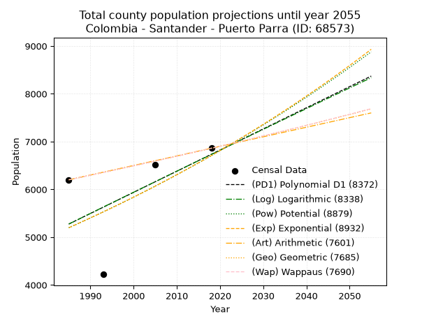
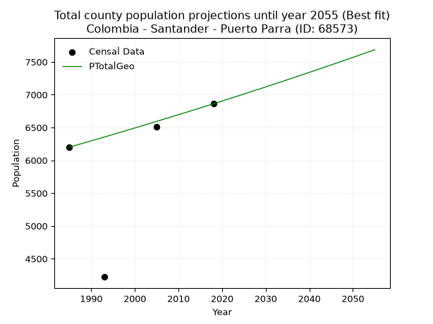
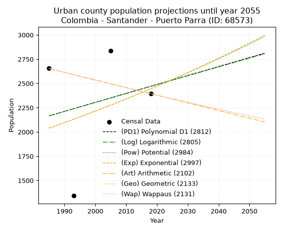
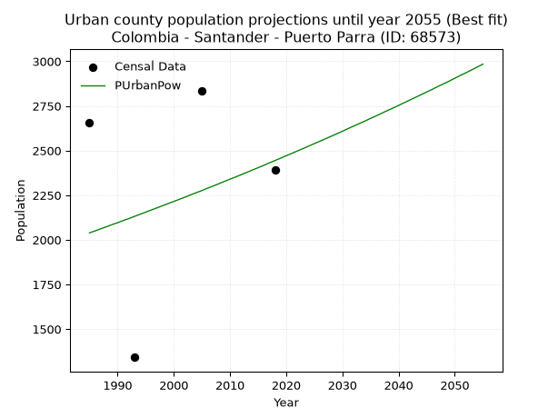
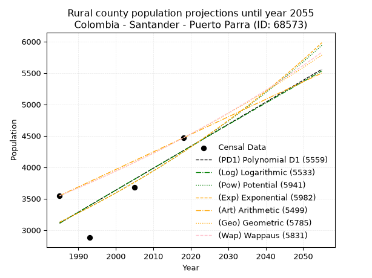
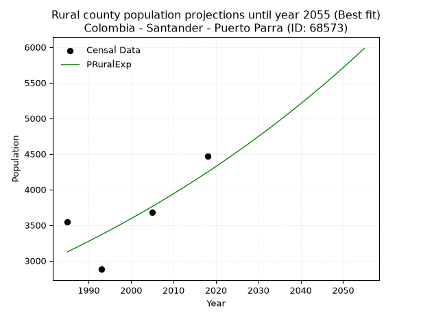

<div align="center">


</div>

# _“Population and Public Services Demand Projections (PPSD) until Year 2050 for Colombia - Santander - Puerto Parra (ID: 68573)”_
Keywords: `population` `public-service` `projection` `lineal` `polynomial` `logarithmic` `potential` `exponential` `arithmetic` `geometric` `wappaus` `dane` `colombia` `south-america`

PPSD are analytical estimates used by governments and planners to anticipate future changes in population size, age distribution, and the resulting community needs for utilities, healthcare, education, and infrastructure as sizing future water treatment facilities, electrical grids, and road networks based on spatial growth.

> **General running parameters**: • app_version: _v20260806_. • Python version: _3.14.7_. • Pandas version: _3.0.5_. • NumPy version: _2.5.1_. • Creates, save and include plots into reports (create_plot): _False_. • Projection until year: _2050_. • Process polynomial degree 2 and up: _False_. • Process Wappaus: _True_. • Process Wappaus: _True_. • Set negative values to zero: _True_. • Set infinite values to zero: _True_. • Drop dataset notes: _True_. 
<div align="center">

Dynamic map: [:earth_americas:Google](http://maps.google.com/maps?q=6.65078475,-74.0561291) [:earth_americas:OSM](https://www.openstreetmap.org/#map=18/6.65078475/-74.0561291&layers=P) [:earth_americas:Bing](https://www.bing.com/maps?cp=6.65078475~-74.0561291&lvl=18) [:earth_americas:Apple](https://maps.apple.com/frame?center=6.65078475%2C-74.0561291&span=0.003%2C0.006)

</div>


<div align="center">

```geojson
{
  "type": "Feature",
  "geometry": {
    "type": "Point", 
    "coordinates": [-74.0561291, 6.65078475]
  }, 
  "properties": {
    "Name": "Colombia - Santander - Puerto Parra (ID: 68573)"
  }
}
```

</div>


## 0. Census Data (4 records)

Census data are official statistics collected by a government about the people and housing in a country. They usually include counts of total population, age, sex, race, income, education, and jobs.

📅Global census file: [Population.xlsx](../data/Population.xlsx)

| Source   |   Year |   CountryID | CountryName   |   StateID | StateName   |   CountyID | CountyName   |   PTotal |   PUrban |   PRural |
|:---------|-------:|------------:|:--------------|----------:|:------------|-----------:|:-------------|---------:|---------:|---------:|
| DANE     |   1985 |          57 | Colombia      |        68 | Santander   |      68573 | Puerto Parra |     6201 |     2654 |     3547 |
| DANE     |   1993 |          57 | Colombia      |        68 | Santander   |      68573 | Puerto Parra |     4222 |     1342 |     2880 |
| DANE     |   2005 |          57 | Colombia      |        68 | Santander   |      68573 | Puerto Parra |     6514 |     2835 |     3679 |
| DANE     |   2018 |          57 | Colombia      |        68 | Santander   |      68573 | Puerto Parra |     6861 |     2394 |     4467 |

> 🔥Some records could had specific notes about the registered values or the corresponding urban or rural distribution.

## 1. Total

### 1.1. Coefficients and Parameters

* (PD1) Polynomial Deg 1: 44.23845845042118, -82538.47651545497 (lineal)
* (Log) Logarithmic: 88395.94424123735, -665948.7805382861
* (Pow) Potential: 15.45108180278731, -47.23813901375986
* (Exp) Exponential: 0.007733598405764092, 0.001119169569147111
* (Art) Arithmetic: Year diff. 2018 - 1985 = 33, Population diff. 6861 - 6201 = 660, Annual growth = 20.0
* (Geo) Geometric: Year diff. 2018 - 1985 = 33, Population diff. 6861 - 6201 = 660, Annual growth % = 0.0030696300083725703
* (Wap) Wappaus: i = 0.3062318174858368, Condition values only valid for < 200)

<sub>
Wappaus condition values: ['0.00', '0.31', '0.61', '0.92', '1.22', '1.53', '1.84', '2.14', '2.45', '2.76', '3.06', '3.37', '3.67', '3.98', '4.29', '4.59', '4.90', '5.21', '5.51', '5.82', '6.12', '6.43', '6.74', '7.04', '7.35', '7.66', '7.96', '8.27', '8.57', '8.88', '9.19', '9.49', '9.80', '10.11', '10.41', '10.72', '11.02', '11.33', '11.64', '11.94', '12.25', '12.56', '12.86', '13.17', '13.47', '13.78', '14.09', '14.39', '14.70', '15.01', '15.31', '15.62', '15.92', '16.23', '16.54', '16.84', '17.15', '17.46', '17.76', '18.07', '18.37', '18.68', '18.99', '19.29', '19.60', '19.91']
</sub>


### 1.2. Projected Dataset

|   Year |   CountyID |   PTotalPD1 |   PTotalLog |   PTotalPow |   PTotalExp |   PTotalArt |   PTotalGeo |   PTotalWap |
|-------:|-----------:|------------:|------------:|------------:|------------:|------------:|------------:|------------:|
|   1985 |      68573 |        5275 |        5275 |        5198 |        5198 |        6201 |        6201 |        6201 |
|   1986 |      68573 |        5319 |        5319 |        5239 |        5238 |        6221 |        6220 |        6220 |
|   1987 |      68573 |        5363 |        5364 |        5279 |        5279 |        6241 |        6239 |        6239 |
|   1988 |      68573 |        5408 |        5408 |        5321 |        5320 |        6261 |        6258 |        6258 |
|   1989 |      68573 |        5452 |        5453 |        5362 |        5361 |        6281 |        6277 |        6277 |
|   1990 |      68573 |        5496 |        5497 |        5404 |        5403 |        6301 |        6297 |        6297 |
|   1991 |      68573 |        5540 |        5541 |        5446 |        5445 |        6321 |        6316 |        6316 |
|   1992 |      68573 |        5585 |        5586 |        5488 |        5487 |        6341 |        6335 |        6335 |
|   1993 |      68573 |        5629 |        5630 |        5531 |        5530 |        6361 |        6355 |        6355 |
|   1994 |      68573 |        5673 |        5675 |        5574 |        5573 |        6381 |        6374 |        6374 |
|   1995 |      68573 |        5717 |        5719 |        5618 |        5616 |        6401 |        6394 |        6394 |
|   1996 |      68573 |        5761 |        5763 |        5661 |        5660 |        6421 |        6414 |        6413 |
|   1997 |      68573 |        5806 |        5807 |        5705 |        5703 |        6441 |        6433 |        6433 |
|   1998 |      68573 |        5850 |        5852 |        5750 |        5748 |        6461 |        6453 |        6453 |
|   1999 |      68573 |        5894 |        5896 |        5794 |        5792 |        6481 |        6473 |        6473 |
|   2000 |      68573 |        5938 |        5940 |        5839 |        5837 |        6501 |        6493 |        6493 |
|   2001 |      68573 |        5983 |        5984 |        5884 |        5883 |        6521 |        6513 |        6512 |
|   2002 |      68573 |        6027 |        6029 |        5930 |        5928 |        6541 |        6533 |        6532 |
|   2003 |      68573 |        6071 |        6073 |        5976 |        5974 |        6561 |        6553 |        6552 |
|   2004 |      68573 |        6115 |        6117 |        6022 |        6021 |        6581 |        6573 |        6573 |
|   2005 |      68573 |        6160 |        6161 |        6069 |        6067 |        6601 |        6593 |        6593 |
|   2006 |      68573 |        6204 |        6205 |        6116 |        6115 |        6621 |        6613 |        6613 |
|   2007 |      68573 |        6248 |        6249 |        6163 |        6162 |        6641 |        6634 |        6633 |
|   2008 |      68573 |        6292 |        6293 |        6211 |        6210 |        6661 |        6654 |        6654 |
|   2009 |      68573 |        6337 |        6337 |        6259 |        6258 |        6681 |        6674 |        6674 |
|   2010 |      68573 |        6381 |        6381 |        6307 |        6307 |        6701 |        6695 |        6695 |
|   2011 |      68573 |        6425 |        6425 |        6356 |        6356 |        6721 |        6715 |        6715 |
|   2012 |      68573 |        6469 |        6469 |        6405 |        6405 |        6741 |        6736 |        6736 |
|   2013 |      68573 |        6514 |        6513 |        6454 |        6455 |        6761 |        6757 |        6757 |
|   2014 |      68573 |        6558 |        6557 |        6504 |        6505 |        6781 |        6777 |        6777 |
|   2015 |      68573 |        6602 |        6601 |        6554 |        6555 |        6801 |        6798 |        6798 |
|   2016 |      68573 |        6646 |        6645 |        6604 |        6606 |        6821 |        6819 |        6819 |
|   2017 |      68573 |        6690 |        6688 |        6655 |        6658 |        6841 |        6840 |        6840 |
|   2018 |      68573 |        6735 |        6732 |        6706 |        6709 |        6861 |        6861 |        6861 |
|   2019 |      68573 |        6779 |        6776 |        6758 |        6761 |        6881 |        6882 |        6882 |
|   2020 |      68573 |        6823 |        6820 |        6810 |        6814 |        6901 |        6903 |        6903 |
|   2021 |      68573 |        6867 |        6863 |        6862 |        6867 |        6921 |        6924 |        6925 |
|   2022 |      68573 |        6912 |        6907 |        6914 |        6920 |        6941 |        6946 |        6946 |
|   2023 |      68573 |        6956 |        6951 |        6967 |        6974 |        6961 |        6967 |        6967 |
|   2024 |      68573 |        7000 |        6995 |        7021 |        7028 |        6981 |        6988 |        6989 |
|   2025 |      68573 |        7044 |        7038 |        7075 |        7082 |        7001 |        7010 |        7010 |
|   2026 |      68573 |        7089 |        7082 |        7129 |        7137 |        7021 |        7031 |        7032 |
|   2027 |      68573 |        7133 |        7126 |        7183 |        7193 |        7041 |        7053 |        7053 |
|   2028 |      68573 |        7177 |        7169 |        7238 |        7249 |        7061 |        7075 |        7075 |
|   2029 |      68573 |        7221 |        7213 |        7294 |        7305 |        7081 |        7096 |        7097 |
|   2030 |      68573 |        7266 |        7256 |        7349 |        7362 |        7101 |        7118 |        7119 |
|   2031 |      68573 |        7310 |        7300 |        7406 |        7419 |        7121 |        7140 |        7141 |
|   2032 |      68573 |        7354 |        7343 |        7462 |        7476 |        7141 |        7162 |        7163 |
|   2033 |      68573 |        7398 |        7387 |        7519 |        7534 |        7161 |        7184 |        7185 |
|   2034 |      68573 |        7443 |        7430 |        7576 |        7593 |        7181 |        7206 |        7207 |
|   2035 |      68573 |        7487 |        7474 |        7634 |        7652 |        7201 |        7228 |        7229 |
|   2036 |      68573 |        7531 |        7517 |        7692 |        7711 |        7221 |        7250 |        7251 |
|   2037 |      68573 |        7575 |        7561 |        7751 |        7771 |        7241 |        7272 |        7274 |
|   2038 |      68573 |        7620 |        7604 |        7810 |        7831 |        7261 |        7295 |        7296 |
|   2039 |      68573 |        7664 |        7647 |        7869 |        7892 |        7281 |        7317 |        7319 |
|   2040 |      68573 |        7708 |        7691 |        7929 |        7954 |        7301 |        7340 |        7341 |
|   2041 |      68573 |        7752 |        7734 |        7989 |        8015 |        7321 |        7362 |        7364 |
|   2042 |      68573 |        7796 |        7777 |        8050 |        8078 |        7341 |        7385 |        7387 |
|   2043 |      68573 |        7841 |        7821 |        8111 |        8140 |        7361 |        7407 |        7410 |
|   2044 |      68573 |        7885 |        7864 |        8173 |        8203 |        7381 |        7430 |        7433 |
|   2045 |      68573 |        7929 |        7907 |        8235 |        8267 |        7401 |        7453 |        7456 |
|   2046 |      68573 |        7973 |        7950 |        8297 |        8331 |        7421 |        7476 |        7479 |
|   2047 |      68573 |        8018 |        7993 |        8360 |        8396 |        7441 |        7499 |        7502 |
|   2048 |      68573 |        8062 |        8037 |        8423 |        8461 |        7461 |        7522 |        7525 |
|   2049 |      68573 |        8106 |        8080 |        8487 |        8527 |        7481 |        7545 |        7548 |
|   2050 |      68573 |        8150 |        8123 |        8551 |        8593 |        7501 |        7568 |        7572 |
<div align="center">

</img>

</div>


### 1.3. Best fit with absolute and relative error (%)

Relative error puts that difference into context by dividing the absolute error by the true value, creating a unitless ratio or percentage that shows the scale of the mistake.

Absolute and relative error

|   Year | Source   |   CountryID | CountryName   |   StateID | StateName   |   CountyID_x | CountyName   |   PTotal |   PUrban |   PRural |   CountyID_y |   PTotalPD1 |   PTotalLog |   PTotalPow |   PTotalExp |   PTotalArt |   PTotalGeo |   PTotalWap |   PTotalPD1AbsError |   PTotalLogAbsError |   PTotalPowAbsError |   PTotalExpAbsError |   PTotalArtAbsError |   PTotalGeoAbsError |   PTotalWapAbsError |   PTotalPD1RelError |   PTotalLogRelError |   PTotalPowRelError |   PTotalExpRelError |   PTotalArtRelError |   PTotalGeoRelError |   PTotalWapRelError |
|-------:|:---------|------------:|:--------------|----------:|:------------|-------------:|:-------------|---------:|---------:|---------:|-------------:|------------:|------------:|------------:|------------:|------------:|------------:|------------:|--------------------:|--------------------:|--------------------:|--------------------:|--------------------:|--------------------:|--------------------:|--------------------:|--------------------:|--------------------:|--------------------:|--------------------:|--------------------:|--------------------:|
|   1985 | DANE     |          57 | Colombia      |        68 | Santander   |        68573 | Puerto Parra |     6201 |     2654 |     3547 |        68573 |        5275 |        5275 |        5198 |        5198 |        6201 |        6201 |        6201 |                 926 |                 926 |                1003 |                1003 |                   0 |                   0 |                   0 |            14.9331  |            14.9331  |            16.1748  |            16.1748  |             0       |             0       |             0       |
|   1993 | DANE     |          57 | Colombia      |        68 | Santander   |        68573 | Puerto Parra |     4222 |     1342 |     2880 |        68573 |        5629 |        5630 |        5531 |        5530 |        6361 |        6355 |        6355 |                1407 |                1408 |                1309 |                1308 |                2139 |                2133 |                2133 |            33.3254  |            33.3491  |            31.0043  |            30.9806  |            50.6632  |            50.5211  |            50.5211  |
|   2005 | DANE     |          57 | Colombia      |        68 | Santander   |        68573 | Puerto Parra |     6514 |     2835 |     3679 |        68573 |        6160 |        6161 |        6069 |        6067 |        6601 |        6593 |        6593 |                 354 |                 353 |                 445 |                 447 |                  87 |                  79 |                  79 |             5.43445 |             5.4191  |             6.83144 |             6.86214 |             1.33558 |             1.21277 |             1.21277 |
|   2018 | DANE     |          57 | Colombia      |        68 | Santander   |        68573 | Puerto Parra |     6861 |     2394 |     4467 |        68573 |        6735 |        6732 |        6706 |        6709 |        6861 |        6861 |        6861 |                 126 |                 129 |                 155 |                 152 |                   0 |                   0 |                   0 |             1.83647 |             1.88019 |             2.25915 |             2.21542 |             0       |             0       |             0       |

Relative error mean

| Method    |   RelError | Best   |
|:----------|-----------:|:-------|
| PTotalPD1 |    13.8824 |        |
| PTotalLog |    13.8954 |        |
| PTotalPow |    14.0674 |        |
| PTotalExp |    14.0582 |        |
| PTotalArt |    12.9997 |        |
| PTotalGeo |    12.9335 | True   |
| PTotalWap |    12.9335 | True   |

💙Best method: _**PTotalGeo**_
<div align="center">

</img>

</div>


### 1.4. Fresh water supply demand in liters per capita per day (lpcd)

The fresh water supply demand typically ranges from 100 to 300 liters per capita per day (lpcd) for standard domestic and municipal planning, though absolute survival minimums set by the World Health Organization are as low as 7.5 to 20 liters per day, and total consumption in high-income nations can exceed 400 liters.

> `CZ`: Level in meters above the sea level (masl)<br> `WS`: Fresh water supply demand in liters per capita per day (lpcd or l/h/d)<br> `WSAll`: Zonal fresh water supply demand in liters per second (l/s)<br> `A`: Zonal area in square meters<br> `DP`: Population density (people/hectare)

Reference values (RAS Colombia)

|    CZ |   WS |
|------:|-----:|
|  1000 |  120 |
|  2000 |  130 |
| 99999 |  140 |

County shapefile geometry properties and water supply values

|   CountyID |      ATotal |   CZTotal |   WSTotal |
|-----------:|------------:|----------:|----------:|
|      68573 | 7.61334e+08 |   124.694 |       120 |

Projected values for best method: PTotalGeo

|   CountyID |   Year |   PTotalGeo |   DPTotal |   WSTotal |   WSTotalAll |
|-----------:|-------:|------------:|----------:|----------:|-------------:|
|      68573 |   1985 |        6201 |      0.08 |       120 |      8.6125  |
|      68573 |   1986 |        6220 |      0.08 |       120 |      8.63889 |
|      68573 |   1987 |        6239 |      0.08 |       120 |      8.66528 |
|      68573 |   1988 |        6258 |      0.08 |       120 |      8.69167 |
|      68573 |   1989 |        6277 |      0.08 |       120 |      8.71806 |
|      68573 |   1990 |        6297 |      0.08 |       120 |      8.74583 |
|      68573 |   1991 |        6316 |      0.08 |       120 |      8.77222 |
|      68573 |   1992 |        6335 |      0.08 |       120 |      8.79861 |
|      68573 |   1993 |        6355 |      0.08 |       120 |      8.82639 |
|      68573 |   1994 |        6374 |      0.08 |       120 |      8.85278 |
|      68573 |   1995 |        6394 |      0.08 |       120 |      8.88056 |
|      68573 |   1996 |        6414 |      0.08 |       120 |      8.90833 |
|      68573 |   1997 |        6433 |      0.08 |       120 |      8.93472 |
|      68573 |   1998 |        6453 |      0.08 |       120 |      8.9625  |
|      68573 |   1999 |        6473 |      0.09 |       120 |      8.99028 |
|      68573 |   2000 |        6493 |      0.09 |       120 |      9.01806 |
|      68573 |   2001 |        6513 |      0.09 |       120 |      9.04583 |
|      68573 |   2002 |        6533 |      0.09 |       120 |      9.07361 |
|      68573 |   2003 |        6553 |      0.09 |       120 |      9.10139 |
|      68573 |   2004 |        6573 |      0.09 |       120 |      9.12917 |
|      68573 |   2005 |        6593 |      0.09 |       120 |      9.15694 |
|      68573 |   2006 |        6613 |      0.09 |       120 |      9.18472 |
|      68573 |   2007 |        6634 |      0.09 |       120 |      9.21389 |
|      68573 |   2008 |        6654 |      0.09 |       120 |      9.24167 |
|      68573 |   2009 |        6674 |      0.09 |       120 |      9.26944 |
|      68573 |   2010 |        6695 |      0.09 |       120 |      9.29861 |
|      68573 |   2011 |        6715 |      0.09 |       120 |      9.32639 |
|      68573 |   2012 |        6736 |      0.09 |       120 |      9.35556 |
|      68573 |   2013 |        6757 |      0.09 |       120 |      9.38472 |
|      68573 |   2014 |        6777 |      0.09 |       120 |      9.4125  |
|      68573 |   2015 |        6798 |      0.09 |       120 |      9.44167 |
|      68573 |   2016 |        6819 |      0.09 |       120 |      9.47083 |
|      68573 |   2017 |        6840 |      0.09 |       120 |      9.5     |
|      68573 |   2018 |        6861 |      0.09 |       120 |      9.52917 |
|      68573 |   2019 |        6882 |      0.09 |       120 |      9.55833 |
|      68573 |   2020 |        6903 |      0.09 |       120 |      9.5875  |
|      68573 |   2021 |        6924 |      0.09 |       120 |      9.61667 |
|      68573 |   2022 |        6946 |      0.09 |       120 |      9.64722 |
|      68573 |   2023 |        6967 |      0.09 |       120 |      9.67639 |
|      68573 |   2024 |        6988 |      0.09 |       120 |      9.70556 |
|      68573 |   2025 |        7010 |      0.09 |       120 |      9.73611 |
|      68573 |   2026 |        7031 |      0.09 |       120 |      9.76528 |
|      68573 |   2027 |        7053 |      0.09 |       120 |      9.79583 |
|      68573 |   2028 |        7075 |      0.09 |       120 |      9.82639 |
|      68573 |   2029 |        7096 |      0.09 |       120 |      9.85556 |
|      68573 |   2030 |        7118 |      0.09 |       120 |      9.88611 |
|      68573 |   2031 |        7140 |      0.09 |       120 |      9.91667 |
|      68573 |   2032 |        7162 |      0.09 |       120 |      9.94722 |
|      68573 |   2033 |        7184 |      0.09 |       120 |      9.97778 |
|      68573 |   2034 |        7206 |      0.09 |       120 |     10.0083  |
|      68573 |   2035 |        7228 |      0.09 |       120 |     10.0389  |
|      68573 |   2036 |        7250 |      0.1  |       120 |     10.0694  |
|      68573 |   2037 |        7272 |      0.1  |       120 |     10.1     |
|      68573 |   2038 |        7295 |      0.1  |       120 |     10.1319  |
|      68573 |   2039 |        7317 |      0.1  |       120 |     10.1625  |
|      68573 |   2040 |        7340 |      0.1  |       120 |     10.1944  |
|      68573 |   2041 |        7362 |      0.1  |       120 |     10.225   |
|      68573 |   2042 |        7385 |      0.1  |       120 |     10.2569  |
|      68573 |   2043 |        7407 |      0.1  |       120 |     10.2875  |
|      68573 |   2044 |        7430 |      0.1  |       120 |     10.3194  |
|      68573 |   2045 |        7453 |      0.1  |       120 |     10.3514  |
|      68573 |   2046 |        7476 |      0.1  |       120 |     10.3833  |
|      68573 |   2047 |        7499 |      0.1  |       120 |     10.4153  |
|      68573 |   2048 |        7522 |      0.1  |       120 |     10.4472  |
|      68573 |   2049 |        7545 |      0.1  |       120 |     10.4792  |
|      68573 |   2050 |        7568 |      0.1  |       120 |     10.5111  |

## 2. Urban

### 2.1. Coefficients and Parameters

* (PD1) Polynomial Deg 1: 9.244078683259911, -16184.218386190638 (lineal)
* (Log) Logarithmic: 18459.741782123347, -138006.3952130064
* (Pow) Potential: 10.986719709910137, -32.92216230316461
* (Exp) Exponential: 0.005503227902291883, 0.03674448241790576
* (Art) Arithmetic: Year diff. 2018 - 1985 = 33, Population diff. 2394 - 2654 = -260, Annual growth = -7.878787878787879
* (Geo) Geometric: Year diff. 2018 - 1985 = 33, Population diff. 2394 - 2654 = -260, Annual growth % = -0.003119437406260528
* (Wap) Wappaus: i = -0.3121548287950824, Condition values only valid for < 200)

<sub>
Wappaus condition values: ['-0.00', '-0.31', '-0.62', '-0.94', '-1.25', '-1.56', '-1.87', '-2.19', '-2.50', '-2.81', '-3.12', '-3.43', '-3.75', '-4.06', '-4.37', '-4.68', '-4.99', '-5.31', '-5.62', '-5.93', '-6.24', '-6.56', '-6.87', '-7.18', '-7.49', '-7.80', '-8.12', '-8.43', '-8.74', '-9.05', '-9.36', '-9.68', '-9.99', '-10.30', '-10.61', '-10.93', '-11.24', '-11.55', '-11.86', '-12.17', '-12.49', '-12.80', '-13.11', '-13.42', '-13.73', '-14.05', '-14.36', '-14.67', '-14.98', '-15.30', '-15.61', '-15.92', '-16.23', '-16.54', '-16.86', '-17.17', '-17.48', '-17.79', '-18.10', '-18.42', '-18.73', '-19.04', '-19.35', '-19.67', '-19.98', '-20.29']
</sub>


### 2.2. Projected Dataset

|   Year |   CountyID |   PUrbanPD1 |   PUrbanLog |   PUrbanPow |   PUrbanExp |   PUrbanArt |   PUrbanGeo |   PUrbanWap |
|-------:|-----------:|------------:|------------:|------------:|------------:|------------:|------------:|------------:|
|   1985 |      68573 |        2165 |        2165 |        2039 |        2039 |        2654 |        2654 |        2654 |
|   1986 |      68573 |        2175 |        2175 |        2050 |        2050 |        2646 |        2646 |        2646 |
|   1987 |      68573 |        2184 |        2184 |        2062 |        2061 |        2638 |        2637 |        2637 |
|   1988 |      68573 |        2193 |        2193 |        2073 |        2073 |        2630 |        2629 |        2629 |
|   1989 |      68573 |        2202 |        2202 |        2085 |        2084 |        2622 |        2621 |        2621 |
|   1990 |      68573 |        2211 |        2212 |        2096 |        2096 |        2615 |        2613 |        2613 |
|   1991 |      68573 |        2221 |        2221 |        2108 |        2107 |        2607 |        2605 |        2605 |
|   1992 |      68573 |        2230 |        2230 |        2119 |        2119 |        2599 |        2597 |        2597 |
|   1993 |      68573 |        2239 |        2240 |        2131 |        2131 |        2591 |        2588 |        2589 |
|   1994 |      68573 |        2248 |        2249 |        2143 |        2142 |        2583 |        2580 |        2580 |
|   1995 |      68573 |        2258 |        2258 |        2155 |        2154 |        2575 |        2572 |        2572 |
|   1996 |      68573 |        2267 |        2267 |        2167 |        2166 |        2567 |        2564 |        2564 |
|   1997 |      68573 |        2276 |        2277 |        2179 |        2178 |        2559 |        2556 |        2556 |
|   1998 |      68573 |        2285 |        2286 |        2191 |        2190 |        2552 |        2548 |        2548 |
|   1999 |      68573 |        2295 |        2295 |        2203 |        2202 |        2544 |        2540 |        2540 |
|   2000 |      68573 |        2304 |        2304 |        2215 |        2214 |        2536 |        2532 |        2533 |
|   2001 |      68573 |        2313 |        2314 |        2227 |        2227 |        2528 |        2525 |        2525 |
|   2002 |      68573 |        2322 |        2323 |        2239 |        2239 |        2520 |        2517 |        2517 |
|   2003 |      68573 |        2332 |        2332 |        2252 |        2251 |        2512 |        2509 |        2509 |
|   2004 |      68573 |        2341 |        2341 |        2264 |        2264 |        2504 |        2501 |        2501 |
|   2005 |      68573 |        2350 |        2350 |        2276 |        2276 |        2496 |        2493 |        2493 |
|   2006 |      68573 |        2359 |        2360 |        2289 |        2289 |        2489 |        2485 |        2486 |
|   2007 |      68573 |        2369 |        2369 |        2301 |        2301 |        2481 |        2478 |        2478 |
|   2008 |      68573 |        2378 |        2378 |        2314 |        2314 |        2473 |        2470 |        2470 |
|   2009 |      68573 |        2387 |        2387 |        2327 |        2327 |        2465 |        2462 |        2462 |
|   2010 |      68573 |        2396 |        2396 |        2340 |        2340 |        2457 |        2455 |        2455 |
|   2011 |      68573 |        2406 |        2406 |        2352 |        2352 |        2449 |        2447 |        2447 |
|   2012 |      68573 |        2415 |        2415 |        2365 |        2365 |        2441 |        2439 |        2439 |
|   2013 |      68573 |        2424 |        2424 |        2378 |        2379 |        2433 |        2432 |        2432 |
|   2014 |      68573 |        2433 |        2433 |        2391 |        2392 |        2426 |        2424 |        2424 |
|   2015 |      68573 |        2443 |        2442 |        2404 |        2405 |        2418 |        2417 |        2417 |
|   2016 |      68573 |        2452 |        2451 |        2417 |        2418 |        2410 |        2409 |        2409 |
|   2017 |      68573 |        2461 |        2461 |        2431 |        2431 |        2402 |        2401 |        2402 |
|   2018 |      68573 |        2470 |        2470 |        2444 |        2445 |        2394 |        2394 |        2394 |
|   2019 |      68573 |        2480 |        2479 |        2457 |        2458 |        2386 |        2387 |        2387 |
|   2020 |      68573 |        2489 |        2488 |        2471 |        2472 |        2378 |        2379 |        2379 |
|   2021 |      68573 |        2498 |        2497 |        2484 |        2486 |        2370 |        2372 |        2372 |
|   2022 |      68573 |        2507 |        2506 |        2498 |        2499 |        2362 |        2364 |        2364 |
|   2023 |      68573 |        2517 |        2515 |        2511 |        2513 |        2355 |        2357 |        2357 |
|   2024 |      68573 |        2526 |        2524 |        2525 |        2527 |        2347 |        2350 |        2349 |
|   2025 |      68573 |        2535 |        2534 |        2539 |        2541 |        2339 |        2342 |        2342 |
|   2026 |      68573 |        2544 |        2543 |        2552 |        2555 |        2331 |        2335 |        2335 |
|   2027 |      68573 |        2554 |        2552 |        2566 |        2569 |        2323 |        2328 |        2327 |
|   2028 |      68573 |        2563 |        2561 |        2580 |        2583 |        2315 |        2320 |        2320 |
|   2029 |      68573 |        2572 |        2570 |        2594 |        2597 |        2307 |        2313 |        2313 |
|   2030 |      68573 |        2581 |        2579 |        2608 |        2612 |        2299 |        2306 |        2306 |
|   2031 |      68573 |        2591 |        2588 |        2623 |        2626 |        2292 |        2299 |        2298 |
|   2032 |      68573 |        2600 |        2597 |        2637 |        2641 |        2284 |        2292 |        2291 |
|   2033 |      68573 |        2609 |        2606 |        2651 |        2655 |        2276 |        2284 |        2284 |
|   2034 |      68573 |        2618 |        2615 |        2665 |        2670 |        2268 |        2277 |        2277 |
|   2035 |      68573 |        2627 |        2625 |        2680 |        2685 |        2260 |        2270 |        2270 |
|   2036 |      68573 |        2637 |        2634 |        2694 |        2699 |        2252 |        2263 |        2263 |
|   2037 |      68573 |        2646 |        2643 |        2709 |        2714 |        2244 |        2256 |        2256 |
|   2038 |      68573 |        2655 |        2652 |        2724 |        2729 |        2236 |        2249 |        2248 |
|   2039 |      68573 |        2664 |        2661 |        2738 |        2744 |        2229 |        2242 |        2241 |
|   2040 |      68573 |        2674 |        2670 |        2753 |        2760 |        2221 |        2235 |        2234 |
|   2041 |      68573 |        2683 |        2679 |        2768 |        2775 |        2213 |        2228 |        2227 |
|   2042 |      68573 |        2692 |        2688 |        2783 |        2790 |        2205 |        2221 |        2220 |
|   2043 |      68573 |        2701 |        2697 |        2798 |        2805 |        2197 |        2214 |        2213 |
|   2044 |      68573 |        2711 |        2706 |        2813 |        2821 |        2189 |        2207 |        2206 |
|   2045 |      68573 |        2720 |        2715 |        2828 |        2837 |        2181 |        2200 |        2199 |
|   2046 |      68573 |        2729 |        2724 |        2843 |        2852 |        2173 |        2193 |        2193 |
|   2047 |      68573 |        2738 |        2733 |        2859 |        2868 |        2166 |        2187 |        2186 |
|   2048 |      68573 |        2748 |        2742 |        2874 |        2884 |        2158 |        2180 |        2179 |
|   2049 |      68573 |        2757 |        2751 |        2889 |        2900 |        2150 |        2173 |        2172 |
|   2050 |      68573 |        2766 |        2760 |        2905 |        2916 |        2142 |        2166 |        2165 |
<div align="center">

</img>

</div>


### 2.3. Best fit with absolute and relative error (%)

Relative error puts that difference into context by dividing the absolute error by the true value, creating a unitless ratio or percentage that shows the scale of the mistake.

Absolute and relative error

|   Year | Source   |   CountryID | CountryName   |   StateID | StateName   |   CountyID_x | CountyName   |   PTotal |   PUrban |   PRural |   CountyID_y |   PUrbanPD1 |   PUrbanLog |   PUrbanPow |   PUrbanExp |   PUrbanArt |   PUrbanGeo |   PUrbanWap |   PUrbanPD1AbsError |   PUrbanLogAbsError |   PUrbanPowAbsError |   PUrbanExpAbsError |   PUrbanArtAbsError |   PUrbanGeoAbsError |   PUrbanWapAbsError |   PUrbanPD1RelError |   PUrbanLogRelError |   PUrbanPowRelError |   PUrbanExpRelError |   PUrbanArtRelError |   PUrbanGeoRelError |   PUrbanWapRelError |
|-------:|:---------|------------:|:--------------|----------:|:------------|-------------:|:-------------|---------:|---------:|---------:|-------------:|------------:|------------:|------------:|------------:|------------:|------------:|------------:|--------------------:|--------------------:|--------------------:|--------------------:|--------------------:|--------------------:|--------------------:|--------------------:|--------------------:|--------------------:|--------------------:|--------------------:|--------------------:|--------------------:|
|   1985 | DANE     |          57 | Colombia      |        68 | Santander   |        68573 | Puerto Parra |     6201 |     2654 |     3547 |        68573 |        2165 |        2165 |        2039 |        2039 |        2654 |        2654 |        2654 |                 489 |                 489 |                 615 |                 615 |                   0 |                   0 |                   0 |             18.425  |             18.425  |            23.1726  |            23.1726  |              0      |              0      |              0      |
|   1993 | DANE     |          57 | Colombia      |        68 | Santander   |        68573 | Puerto Parra |     4222 |     1342 |     2880 |        68573 |        2239 |        2240 |        2131 |        2131 |        2591 |        2588 |        2589 |                 897 |                 898 |                 789 |                 789 |                1249 |                1246 |                1247 |             66.8405 |             66.9151 |            58.7928  |            58.7928  |             93.07   |             92.8465 |             92.921  |
|   2005 | DANE     |          57 | Colombia      |        68 | Santander   |        68573 | Puerto Parra |     6514 |     2835 |     3679 |        68573 |        2350 |        2350 |        2276 |        2276 |        2496 |        2493 |        2493 |                 485 |                 485 |                 559 |                 559 |                 339 |                 342 |                 342 |             17.1076 |             17.1076 |            19.7178  |            19.7178  |             11.9577 |             12.0635 |             12.0635 |
|   2018 | DANE     |          57 | Colombia      |        68 | Santander   |        68573 | Puerto Parra |     6861 |     2394 |     4467 |        68573 |        2470 |        2470 |        2444 |        2445 |        2394 |        2394 |        2394 |                  76 |                  76 |                  50 |                  51 |                   0 |                   0 |                   0 |              3.1746 |              3.1746 |             2.08855 |             2.13033 |              0      |              0      |              0      |

Relative error mean

| Method    |   RelError | Best   |
|:----------|-----------:|:-------|
| PUrbanPD1 |    26.3869 |        |
| PUrbanLog |    26.4056 |        |
| PUrbanPow |    25.9429 | True   |
| PUrbanExp |    25.9534 |        |
| PUrbanArt |    26.2569 |        |
| PUrbanGeo |    26.2275 |        |
| PUrbanWap |    26.2461 |        |

💙Best method: _**PUrbanPow**_
<div align="center">

</img>

</div>


### 2.4. Fresh water supply demand in liters per capita per day (lpcd)

The fresh water supply demand typically ranges from 100 to 300 liters per capita per day (lpcd) for standard domestic and municipal planning, though absolute survival minimums set by the World Health Organization are as low as 7.5 to 20 liters per day, and total consumption in high-income nations can exceed 400 liters.

> `CZ`: Level in meters above the sea level (masl)<br> `WS`: Fresh water supply demand in liters per capita per day (lpcd or l/h/d)<br> `WSAll`: Zonal fresh water supply demand in liters per second (l/s)<br> `A`: Zonal area in square meters<br> `DP`: Population density (people/hectare)

Reference values (RAS Colombia)

|    CZ |   WS |
|------:|-----:|
|  1000 |  120 |
|  2000 |  130 |
| 99999 |  140 |

County shapefile geometry properties and water supply values

|   CountyID |   AUrban |   CZUrban |   WSUrban |
|-----------:|---------:|----------:|----------:|
|      68573 |   593376 |   100.863 |       120 |

Projected values for best method: PUrbanPow

|   CountyID |   Year |   PUrbanPow |   DPUrban |   WSUrban |   WSUrbanAll |
|-----------:|-------:|------------:|----------:|----------:|-------------:|
|      68573 |   1985 |        2039 |     34.36 |       120 |      2.83194 |
|      68573 |   1986 |        2050 |     34.55 |       120 |      2.84722 |
|      68573 |   1987 |        2062 |     34.75 |       120 |      2.86389 |
|      68573 |   1988 |        2073 |     34.94 |       120 |      2.87917 |
|      68573 |   1989 |        2085 |     35.14 |       120 |      2.89583 |
|      68573 |   1990 |        2096 |     35.32 |       120 |      2.91111 |
|      68573 |   1991 |        2108 |     35.53 |       120 |      2.92778 |
|      68573 |   1992 |        2119 |     35.71 |       120 |      2.94306 |
|      68573 |   1993 |        2131 |     35.91 |       120 |      2.95972 |
|      68573 |   1994 |        2143 |     36.12 |       120 |      2.97639 |
|      68573 |   1995 |        2155 |     36.32 |       120 |      2.99306 |
|      68573 |   1996 |        2167 |     36.52 |       120 |      3.00972 |
|      68573 |   1997 |        2179 |     36.72 |       120 |      3.02639 |
|      68573 |   1998 |        2191 |     36.92 |       120 |      3.04306 |
|      68573 |   1999 |        2203 |     37.13 |       120 |      3.05972 |
|      68573 |   2000 |        2215 |     37.33 |       120 |      3.07639 |
|      68573 |   2001 |        2227 |     37.53 |       120 |      3.09306 |
|      68573 |   2002 |        2239 |     37.73 |       120 |      3.10972 |
|      68573 |   2003 |        2252 |     37.95 |       120 |      3.12778 |
|      68573 |   2004 |        2264 |     38.15 |       120 |      3.14444 |
|      68573 |   2005 |        2276 |     38.36 |       120 |      3.16111 |
|      68573 |   2006 |        2289 |     38.58 |       120 |      3.17917 |
|      68573 |   2007 |        2301 |     38.78 |       120 |      3.19583 |
|      68573 |   2008 |        2314 |     39    |       120 |      3.21389 |
|      68573 |   2009 |        2327 |     39.22 |       120 |      3.23194 |
|      68573 |   2010 |        2340 |     39.44 |       120 |      3.25    |
|      68573 |   2011 |        2352 |     39.64 |       120 |      3.26667 |
|      68573 |   2012 |        2365 |     39.86 |       120 |      3.28472 |
|      68573 |   2013 |        2378 |     40.08 |       120 |      3.30278 |
|      68573 |   2014 |        2391 |     40.29 |       120 |      3.32083 |
|      68573 |   2015 |        2404 |     40.51 |       120 |      3.33889 |
|      68573 |   2016 |        2417 |     40.73 |       120 |      3.35694 |
|      68573 |   2017 |        2431 |     40.97 |       120 |      3.37639 |
|      68573 |   2018 |        2444 |     41.19 |       120 |      3.39444 |
|      68573 |   2019 |        2457 |     41.41 |       120 |      3.4125  |
|      68573 |   2020 |        2471 |     41.64 |       120 |      3.43194 |
|      68573 |   2021 |        2484 |     41.86 |       120 |      3.45    |
|      68573 |   2022 |        2498 |     42.1  |       120 |      3.46944 |
|      68573 |   2023 |        2511 |     42.32 |       120 |      3.4875  |
|      68573 |   2024 |        2525 |     42.55 |       120 |      3.50694 |
|      68573 |   2025 |        2539 |     42.79 |       120 |      3.52639 |
|      68573 |   2026 |        2552 |     43.01 |       120 |      3.54444 |
|      68573 |   2027 |        2566 |     43.24 |       120 |      3.56389 |
|      68573 |   2028 |        2580 |     43.48 |       120 |      3.58333 |
|      68573 |   2029 |        2594 |     43.72 |       120 |      3.60278 |
|      68573 |   2030 |        2608 |     43.95 |       120 |      3.62222 |
|      68573 |   2031 |        2623 |     44.2  |       120 |      3.64306 |
|      68573 |   2032 |        2637 |     44.44 |       120 |      3.6625  |
|      68573 |   2033 |        2651 |     44.68 |       120 |      3.68194 |
|      68573 |   2034 |        2665 |     44.91 |       120 |      3.70139 |
|      68573 |   2035 |        2680 |     45.17 |       120 |      3.72222 |
|      68573 |   2036 |        2694 |     45.4  |       120 |      3.74167 |
|      68573 |   2037 |        2709 |     45.65 |       120 |      3.7625  |
|      68573 |   2038 |        2724 |     45.91 |       120 |      3.78333 |
|      68573 |   2039 |        2738 |     46.14 |       120 |      3.80278 |
|      68573 |   2040 |        2753 |     46.4  |       120 |      3.82361 |
|      68573 |   2041 |        2768 |     46.65 |       120 |      3.84444 |
|      68573 |   2042 |        2783 |     46.9  |       120 |      3.86528 |
|      68573 |   2043 |        2798 |     47.15 |       120 |      3.88611 |
|      68573 |   2044 |        2813 |     47.41 |       120 |      3.90694 |
|      68573 |   2045 |        2828 |     47.66 |       120 |      3.92778 |
|      68573 |   2046 |        2843 |     47.91 |       120 |      3.94861 |
|      68573 |   2047 |        2859 |     48.18 |       120 |      3.97083 |
|      68573 |   2048 |        2874 |     48.43 |       120 |      3.99167 |
|      68573 |   2049 |        2889 |     48.69 |       120 |      4.0125  |
|      68573 |   2050 |        2905 |     48.96 |       120 |      4.03472 |

## 3. Rural

### 3.1. Coefficients and Parameters

* (PD1) Polynomial Deg 1: 34.99437976716125, -66354.25812926429 (lineal)
* (Log) Logarithmic: 69936.20245911402, -527942.38532528
* (Pow) Potential: 18.53925531135703, -57.64323789320482
* (Exp) Exponential: 0.009276972019682911, 3.1431644645253876e-05
* (Art) Arithmetic: Year diff. 2018 - 1985 = 33, Population diff. 4467 - 3547 = 920, Annual growth = 27.87878787878788
* (Geo) Geometric: Year diff. 2018 - 1985 = 33, Population diff. 4467 - 3547 = 920, Annual growth % = 0.00701280464411802
* (Wap) Wappaus: i = 0.6957521307409004, Condition values only valid for < 200)

<sub>
Wappaus condition values: ['0.00', '0.70', '1.39', '2.09', '2.78', '3.48', '4.17', '4.87', '5.57', '6.26', '6.96', '7.65', '8.35', '9.04', '9.74', '10.44', '11.13', '11.83', '12.52', '13.22', '13.92', '14.61', '15.31', '16.00', '16.70', '17.39', '18.09', '18.79', '19.48', '20.18', '20.87', '21.57', '22.26', '22.96', '23.66', '24.35', '25.05', '25.74', '26.44', '27.13', '27.83', '28.53', '29.22', '29.92', '30.61', '31.31', '32.00', '32.70', '33.40', '34.09', '34.79', '35.48', '36.18', '36.87', '37.57', '38.27', '38.96', '39.66', '40.35', '41.05', '41.75', '42.44', '43.14', '43.83', '44.53', '45.22']
</sub>


### 3.2. Projected Dataset

|   Year |   CountyID |   PRuralPD1 |   PRuralLog |   PRuralPow |   PRuralExp |   PRuralArt |   PRuralGeo |   PRuralWap |
|-------:|-----------:|------------:|------------:|------------:|------------:|------------:|------------:|------------:|
|   1985 |      68573 |        3110 |        3109 |        3125 |        3125 |        3547 |        3547 |        3547 |
|   1986 |      68573 |        3145 |        3145 |        3154 |        3154 |        3575 |        3572 |        3572 |
|   1987 |      68573 |        3180 |        3180 |        3183 |        3183 |        3603 |        3597 |        3597 |
|   1988 |      68573 |        3215 |        3215 |        3213 |        3213 |        3631 |        3622 |        3622 |
|   1989 |      68573 |        3250 |        3250 |        3243 |        3243 |        3659 |        3648 |        3647 |
|   1990 |      68573 |        3285 |        3285 |        3274 |        3273 |        3686 |        3673 |        3673 |
|   1991 |      68573 |        3320 |        3320 |        3304 |        3304 |        3714 |        3699 |        3698 |
|   1992 |      68573 |        3355 |        3356 |        3335 |        3334 |        3742 |        3725 |        3724 |
|   1993 |      68573 |        3390 |        3391 |        3366 |        3365 |        3770 |        3751 |        3750 |
|   1994 |      68573 |        3425 |        3426 |        3398 |        3397 |        3798 |        3777 |        3776 |
|   1995 |      68573 |        3460 |        3461 |        3430 |        3428 |        3826 |        3804 |        3803 |
|   1996 |      68573 |        3495 |        3496 |        3462 |        3460 |        3854 |        3830 |        3829 |
|   1997 |      68573 |        3530 |        3531 |        3494 |        3493 |        3882 |        3857 |        3856 |
|   1998 |      68573 |        3565 |        3566 |        3527 |        3525 |        3909 |        3884 |        3883 |
|   1999 |      68573 |        3600 |        3601 |        3559 |        3558 |        3937 |        3912 |        3910 |
|   2000 |      68573 |        3635 |        3636 |        3593 |        3591 |        3965 |        3939 |        3938 |
|   2001 |      68573 |        3669 |        3671 |        3626 |        3625 |        3993 |        3967 |        3965 |
|   2002 |      68573 |        3704 |        3706 |        3660 |        3658 |        4021 |        3994 |        3993 |
|   2003 |      68573 |        3739 |        3741 |        3694 |        3693 |        4049 |        4022 |        4021 |
|   2004 |      68573 |        3774 |        3776 |        3728 |        3727 |        4077 |        4051 |        4049 |
|   2005 |      68573 |        3809 |        3810 |        3763 |        3762 |        4105 |        4079 |        4077 |
|   2006 |      68573 |        3844 |        3845 |        3798 |        3797 |        4132 |        4108 |        4106 |
|   2007 |      68573 |        3879 |        3880 |        3833 |        3832 |        4160 |        4136 |        4135 |
|   2008 |      68573 |        3914 |        3915 |        3868 |        3868 |        4188 |        4165 |        4164 |
|   2009 |      68573 |        3949 |        3950 |        3904 |        3904 |        4216 |        4195 |        4193 |
|   2010 |      68573 |        3984 |        3985 |        3941 |        3940 |        4244 |        4224 |        4223 |
|   2011 |      68573 |        4019 |        4019 |        3977 |        3977 |        4272 |        4254 |        4252 |
|   2012 |      68573 |        4054 |        4054 |        4014 |        4014 |        4300 |        4284 |        4282 |
|   2013 |      68573 |        4089 |        4089 |        4051 |        4052 |        4328 |        4314 |        4313 |
|   2014 |      68573 |        4124 |        4124 |        4089 |        4089 |        4355 |        4344 |        4343 |
|   2015 |      68573 |        4159 |        4158 |        4126 |        4127 |        4383 |        4374 |        4374 |
|   2016 |      68573 |        4194 |        4193 |        4164 |        4166 |        4411 |        4405 |        4405 |
|   2017 |      68573 |        4229 |        4228 |        4203 |        4205 |        4439 |        4436 |        4436 |
|   2018 |      68573 |        4264 |        4262 |        4242 |        4244 |        4467 |        4467 |        4467 |
|   2019 |      68573 |        4299 |        4297 |        4281 |        4283 |        4495 |        4498 |        4499 |
|   2020 |      68573 |        4334 |        4332 |        4320 |        4323 |        4523 |        4530 |        4530 |
|   2021 |      68573 |        4369 |        4366 |        4360 |        4364 |        4551 |        4562 |        4563 |
|   2022 |      68573 |        4404 |        4401 |        4400 |        4404 |        4579 |        4594 |        4595 |
|   2023 |      68573 |        4439 |        4436 |        4441 |        4445 |        4606 |        4626 |        4628 |
|   2024 |      68573 |        4474 |        4470 |        4482 |        4487 |        4634 |        4658 |        4661 |
|   2025 |      68573 |        4509 |        4505 |        4523 |        4529 |        4662 |        4691 |        4694 |
|   2026 |      68573 |        4544 |        4539 |        4565 |        4571 |        4690 |        4724 |        4727 |
|   2027 |      68573 |        4579 |        4574 |        4606 |        4613 |        4718 |        4757 |        4761 |
|   2028 |      68573 |        4614 |        4608 |        4649 |        4656 |        4746 |        4790 |        4795 |
|   2029 |      68573 |        4649 |        4643 |        4691 |        4700 |        4774 |        4824 |        4829 |
|   2030 |      68573 |        4684 |        4677 |        4735 |        4744 |        4802 |        4858 |        4864 |
|   2031 |      68573 |        4719 |        4712 |        4778 |        4788 |        4829 |        4892 |        4898 |
|   2032 |      68573 |        4754 |        4746 |        4822 |        4832 |        4857 |        4926 |        4934 |
|   2033 |      68573 |        4789 |        4780 |        4866 |        4878 |        4885 |        4961 |        4969 |
|   2034 |      68573 |        4824 |        4815 |        4910 |        4923 |        4913 |        4995 |        5005 |
|   2035 |      68573 |        4859 |        4849 |        4955 |        4969 |        4941 |        5030 |        5041 |
|   2036 |      68573 |        4894 |        4884 |        5001 |        5015 |        4969 |        5066 |        5077 |
|   2037 |      68573 |        4929 |        4918 |        5047 |        5062 |        4997 |        5101 |        5114 |
|   2038 |      68573 |        4964 |        4952 |        5093 |        5109 |        5025 |        5137 |        5151 |
|   2039 |      68573 |        4999 |        4986 |        5139 |        5157 |        5052 |        5173 |        5188 |
|   2040 |      68573 |        5034 |        5021 |        5186 |        5205 |        5080 |        5209 |        5225 |
|   2041 |      68573 |        5069 |        5055 |        5233 |        5253 |        5108 |        5246 |        5263 |
|   2042 |      68573 |        5104 |        5089 |        5281 |        5302 |        5136 |        5283 |        5302 |
|   2043 |      68573 |        5139 |        5124 |        5329 |        5352 |        5164 |        5320 |        5340 |
|   2044 |      68573 |        5174 |        5158 |        5378 |        5402 |        5192 |        5357 |        5379 |
|   2045 |      68573 |        5209 |        5192 |        5427 |        5452 |        5220 |        5395 |        5418 |
|   2046 |      68573 |        5244 |        5226 |        5476 |        5503 |        5248 |        5432 |        5458 |
|   2047 |      68573 |        5279 |        5260 |        5526 |        5554 |        5275 |        5471 |        5498 |
|   2048 |      68573 |        5314 |        5295 |        5576 |        5606 |        5303 |        5509 |        5538 |
|   2049 |      68573 |        5349 |        5329 |        5627 |        5658 |        5331 |        5548 |        5579 |
|   2050 |      68573 |        5384 |        5363 |        5678 |        5711 |        5359 |        5586 |        5620 |
<div align="center">

</img>

</div>


### 3.3. Best fit with absolute and relative error (%)

Relative error puts that difference into context by dividing the absolute error by the true value, creating a unitless ratio or percentage that shows the scale of the mistake.

Absolute and relative error

|   Year | Source   |   CountryID | CountryName   |   StateID | StateName   |   CountyID_x | CountyName   |   PTotal |   PUrban |   PRural |   CountyID_y |   PRuralPD1 |   PRuralLog |   PRuralPow |   PRuralExp |   PRuralArt |   PRuralGeo |   PRuralWap |   PRuralPD1AbsError |   PRuralLogAbsError |   PRuralPowAbsError |   PRuralExpAbsError |   PRuralArtAbsError |   PRuralGeoAbsError |   PRuralWapAbsError |   PRuralPD1RelError |   PRuralLogRelError |   PRuralPowRelError |   PRuralExpRelError |   PRuralArtRelError |   PRuralGeoRelError |   PRuralWapRelError |
|-------:|:---------|------------:|:--------------|----------:|:------------|-------------:|:-------------|---------:|---------:|---------:|-------------:|------------:|------------:|------------:|------------:|------------:|------------:|------------:|--------------------:|--------------------:|--------------------:|--------------------:|--------------------:|--------------------:|--------------------:|--------------------:|--------------------:|--------------------:|--------------------:|--------------------:|--------------------:|--------------------:|
|   1985 | DANE     |          57 | Colombia      |        68 | Santander   |        68573 | Puerto Parra |     6201 |     2654 |     3547 |        68573 |        3110 |        3109 |        3125 |        3125 |        3547 |        3547 |        3547 |                 437 |                 438 |                 422 |                 422 |                   0 |                   0 |                   0 |            12.3203  |            12.3485  |            11.8974  |            11.8974  |              0      |              0      |              0      |
|   1993 | DANE     |          57 | Colombia      |        68 | Santander   |        68573 | Puerto Parra |     4222 |     1342 |     2880 |        68573 |        3390 |        3391 |        3366 |        3365 |        3770 |        3751 |        3750 |                 510 |                 511 |                 486 |                 485 |                 890 |                 871 |                 870 |            17.7083  |            17.7431  |            16.875   |            16.8403  |             30.9028 |             30.2431 |             30.2083 |
|   2005 | DANE     |          57 | Colombia      |        68 | Santander   |        68573 | Puerto Parra |     6514 |     2835 |     3679 |        68573 |        3809 |        3810 |        3763 |        3762 |        4105 |        4079 |        4077 |                 130 |                 131 |                  84 |                  83 |                 426 |                 400 |                 398 |             3.53357 |             3.56075 |             2.28323 |             2.25605 |             11.5792 |             10.8725 |             10.8182 |
|   2018 | DANE     |          57 | Colombia      |        68 | Santander   |        68573 | Puerto Parra |     6861 |     2394 |     4467 |        68573 |        4264 |        4262 |        4242 |        4244 |        4467 |        4467 |        4467 |                 203 |                 205 |                 225 |                 223 |                   0 |                   0 |                   0 |             4.54444 |             4.58921 |             5.03694 |             4.99216 |              0      |              0      |              0      |

Relative error mean

| Method    |   RelError | Best   |
|:----------|-----------:|:-------|
| PRuralPD1 |    9.52665 |        |
| PRuralLog |    9.56037 |        |
| PRuralPow |    9.02314 |        |
| PRuralExp |    8.99647 | True   |
| PRuralArt |   10.6205  |        |
| PRuralGeo |   10.2789  |        |
| PRuralWap |   10.2566  |        |

💙Best method: _**PRuralExp**_
<div align="center">

</img>

</div>


### 3.4. Fresh water supply demand in liters per capita per day (lpcd)

The fresh water supply demand typically ranges from 100 to 300 liters per capita per day (lpcd) for standard domestic and municipal planning, though absolute survival minimums set by the World Health Organization are as low as 7.5 to 20 liters per day, and total consumption in high-income nations can exceed 400 liters.

> `CZ`: Level in meters above the sea level (masl)<br> `WS`: Fresh water supply demand in liters per capita per day (lpcd or l/h/d)<br> `WSAll`: Zonal fresh water supply demand in liters per second (l/s)<br> `A`: Zonal area in square meters<br> `DP`: Population density (people/hectare)

Reference values (RAS Colombia)

|    CZ |   WS |
|------:|-----:|
|  1000 |  120 |
|  2000 |  130 |
| 99999 |  140 |

County shapefile geometry properties and water supply values

|   CountyID |     ARural |   CZRural |   WSRural |
|-----------:|-----------:|----------:|----------:|
|      68573 | 7.6074e+08 |   124.712 |       120 |

Projected values for best method: PRuralExp

|   CountyID |   Year |   PRuralExp |   DPRural |   WSRural |   WSRuralAll |
|-----------:|-------:|------------:|----------:|----------:|-------------:|
|      68573 |   1985 |        3125 |      0.04 |       120 |      4.34028 |
|      68573 |   1986 |        3154 |      0.04 |       120 |      4.38056 |
|      68573 |   1987 |        3183 |      0.04 |       120 |      4.42083 |
|      68573 |   1988 |        3213 |      0.04 |       120 |      4.4625  |
|      68573 |   1989 |        3243 |      0.04 |       120 |      4.50417 |
|      68573 |   1990 |        3273 |      0.04 |       120 |      4.54583 |
|      68573 |   1991 |        3304 |      0.04 |       120 |      4.58889 |
|      68573 |   1992 |        3334 |      0.04 |       120 |      4.63056 |
|      68573 |   1993 |        3365 |      0.04 |       120 |      4.67361 |
|      68573 |   1994 |        3397 |      0.04 |       120 |      4.71806 |
|      68573 |   1995 |        3428 |      0.05 |       120 |      4.76111 |
|      68573 |   1996 |        3460 |      0.05 |       120 |      4.80556 |
|      68573 |   1997 |        3493 |      0.05 |       120 |      4.85139 |
|      68573 |   1998 |        3525 |      0.05 |       120 |      4.89583 |
|      68573 |   1999 |        3558 |      0.05 |       120 |      4.94167 |
|      68573 |   2000 |        3591 |      0.05 |       120 |      4.9875  |
|      68573 |   2001 |        3625 |      0.05 |       120 |      5.03472 |
|      68573 |   2002 |        3658 |      0.05 |       120 |      5.08056 |
|      68573 |   2003 |        3693 |      0.05 |       120 |      5.12917 |
|      68573 |   2004 |        3727 |      0.05 |       120 |      5.17639 |
|      68573 |   2005 |        3762 |      0.05 |       120 |      5.225   |
|      68573 |   2006 |        3797 |      0.05 |       120 |      5.27361 |
|      68573 |   2007 |        3832 |      0.05 |       120 |      5.32222 |
|      68573 |   2008 |        3868 |      0.05 |       120 |      5.37222 |
|      68573 |   2009 |        3904 |      0.05 |       120 |      5.42222 |
|      68573 |   2010 |        3940 |      0.05 |       120 |      5.47222 |
|      68573 |   2011 |        3977 |      0.05 |       120 |      5.52361 |
|      68573 |   2012 |        4014 |      0.05 |       120 |      5.575   |
|      68573 |   2013 |        4052 |      0.05 |       120 |      5.62778 |
|      68573 |   2014 |        4089 |      0.05 |       120 |      5.67917 |
|      68573 |   2015 |        4127 |      0.05 |       120 |      5.73194 |
|      68573 |   2016 |        4166 |      0.05 |       120 |      5.78611 |
|      68573 |   2017 |        4205 |      0.06 |       120 |      5.84028 |
|      68573 |   2018 |        4244 |      0.06 |       120 |      5.89444 |
|      68573 |   2019 |        4283 |      0.06 |       120 |      5.94861 |
|      68573 |   2020 |        4323 |      0.06 |       120 |      6.00417 |
|      68573 |   2021 |        4364 |      0.06 |       120 |      6.06111 |
|      68573 |   2022 |        4404 |      0.06 |       120 |      6.11667 |
|      68573 |   2023 |        4445 |      0.06 |       120 |      6.17361 |
|      68573 |   2024 |        4487 |      0.06 |       120 |      6.23194 |
|      68573 |   2025 |        4529 |      0.06 |       120 |      6.29028 |
|      68573 |   2026 |        4571 |      0.06 |       120 |      6.34861 |
|      68573 |   2027 |        4613 |      0.06 |       120 |      6.40694 |
|      68573 |   2028 |        4656 |      0.06 |       120 |      6.46667 |
|      68573 |   2029 |        4700 |      0.06 |       120 |      6.52778 |
|      68573 |   2030 |        4744 |      0.06 |       120 |      6.58889 |
|      68573 |   2031 |        4788 |      0.06 |       120 |      6.65    |
|      68573 |   2032 |        4832 |      0.06 |       120 |      6.71111 |
|      68573 |   2033 |        4878 |      0.06 |       120 |      6.775   |
|      68573 |   2034 |        4923 |      0.06 |       120 |      6.8375  |
|      68573 |   2035 |        4969 |      0.07 |       120 |      6.90139 |
|      68573 |   2036 |        5015 |      0.07 |       120 |      6.96528 |
|      68573 |   2037 |        5062 |      0.07 |       120 |      7.03056 |
|      68573 |   2038 |        5109 |      0.07 |       120 |      7.09583 |
|      68573 |   2039 |        5157 |      0.07 |       120 |      7.1625  |
|      68573 |   2040 |        5205 |      0.07 |       120 |      7.22917 |
|      68573 |   2041 |        5253 |      0.07 |       120 |      7.29583 |
|      68573 |   2042 |        5302 |      0.07 |       120 |      7.36389 |
|      68573 |   2043 |        5352 |      0.07 |       120 |      7.43333 |
|      68573 |   2044 |        5402 |      0.07 |       120 |      7.50278 |
|      68573 |   2045 |        5452 |      0.07 |       120 |      7.57222 |
|      68573 |   2046 |        5503 |      0.07 |       120 |      7.64306 |
|      68573 |   2047 |        5554 |      0.07 |       120 |      7.71389 |
|      68573 |   2048 |        5606 |      0.07 |       120 |      7.78611 |
|      68573 |   2049 |        5658 |      0.07 |       120 |      7.85833 |
|      68573 |   2050 |        5711 |      0.08 |       120 |      7.93194 |

<div align="center"><br><sub>Share this research</sub></div><br>

<sub>**APPS & TOOLS & CONTENT DISCLAIMER**: • NO WARRANTY - This content and software is provided by <a href="https://github.com/rcfdtools" target="_blank">github.com/rcfdtools</a> "as is", without any express or implied warranty, including warranties of merchantability, fitness for a particular purpose, or non-infringement. There is no guarantee that the software will be error-free or operate without interruption. • LIMITATION OF LIABILITY - Neither the authors nor copyright holders will be liable for claims or damages arising from the software or its use. You are responsible for determining if the software is appropriate for your use and assume all associated risks, including errors, legal compliance, and data loss. • NO PROFESSIONAL ADVICE - The software provides general information and does not offer professional advice. It should not replace consultation with professional advisors. [Clauses and global license for rcfdtools use.](https://github.com/rcfdtools/rcfdtools/blob/main/LICENSE.md)</sub>

| [:house: Home](Readme.md)  | [:beginner: Help / Collaborate](https://github.com/rcfdtools/R.HydroTools/discussions/31) |
|----------------------------|-------------------------------------------------------------------------------------------|