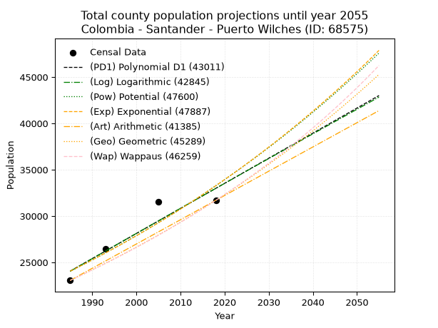
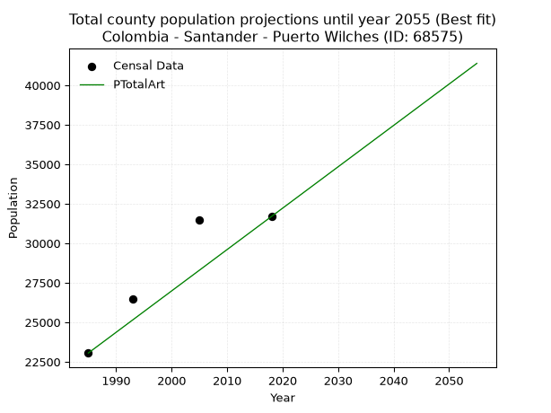
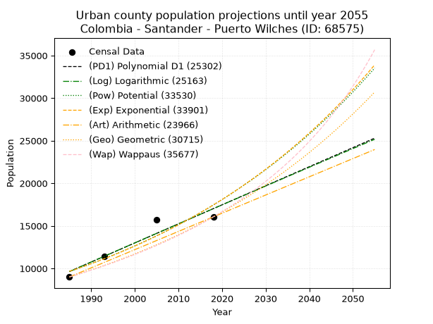
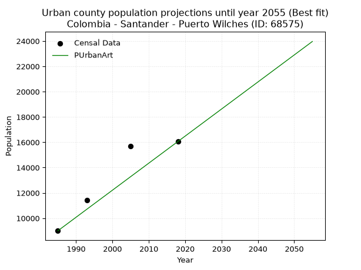
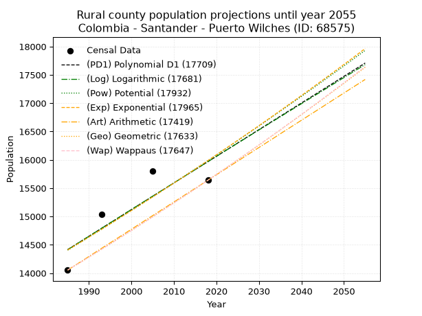
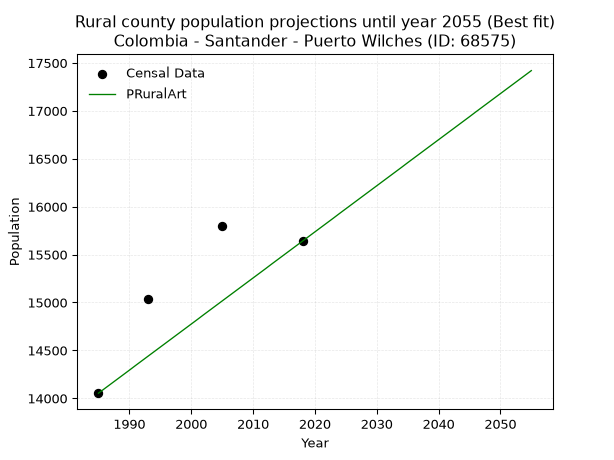

<div align="center">


</div>

# _“Population and Public Services Demand Projections (PPSD) until Year 2050 for Colombia - Santander - Puerto Wilches (ID: 68575)”_
Keywords: `population` `public-service` `projection` `lineal` `polynomial` `logarithmic` `potential` `exponential` `arithmetic` `geometric` `wappaus` `dane` `colombia` `south-america`

PPSD are analytical estimates used by governments and planners to anticipate future changes in population size, age distribution, and the resulting community needs for utilities, healthcare, education, and infrastructure as sizing future water treatment facilities, electrical grids, and road networks based on spatial growth.

> **General running parameters**: • app_version: _v20260806_. • Python version: _3.14.7_. • Pandas version: _3.0.5_. • NumPy version: _2.5.1_. • Creates, save and include plots into reports (create_plot): _False_. • Projection until year: _2050_. • Process polynomial degree 2 and up: _False_. • Process Wappaus: _True_. • Process Wappaus: _True_. • Set negative values to zero: _True_. • Set infinite values to zero: _True_. • Drop dataset notes: _True_. 
<div align="center">

Dynamic map: [:earth_americas:Google](http://maps.google.com/maps?q=7.344056886,-73.8999093) [:earth_americas:OSM](https://www.openstreetmap.org/#map=18/7.344056886/-73.8999093&layers=P) [:earth_americas:Bing](https://www.bing.com/maps?cp=7.344056886~-73.8999093&lvl=18) [:earth_americas:Apple](https://maps.apple.com/frame?center=7.344056886%2C-73.8999093&span=0.003%2C0.006)

</div>


<div align="center">

```geojson
{
  "type": "Feature",
  "geometry": {
    "type": "Point", 
    "coordinates": [-73.8999093, 7.344056886]
  }, 
  "properties": {
    "Name": "Colombia - Santander - Puerto Wilches (ID: 68575)"
  }
}
```

</div>


## 0. Census Data (4 records)

Census data are official statistics collected by a government about the people and housing in a country. They usually include counts of total population, age, sex, race, income, education, and jobs.

📅Global census file: [Population.xlsx](../data/Population.xlsx)

| Source   |   Year |   CountryID | CountryName   |   StateID | StateName   |   CountyID | CountyName     |   PTotal |   PUrban |   PRural |
|:---------|-------:|------------:|:--------------|----------:|:------------|-----------:|:---------------|---------:|---------:|---------:|
| DANE     |   1985 |          57 | Colombia      |        68 | Santander   |      68575 | Puerto Wilches |    23058 |     9005 |    14053 |
| DANE     |   1993 |          57 | Colombia      |        68 | Santander   |      68575 | Puerto Wilches |    26486 |    11446 |    15040 |
| DANE     |   2005 |          57 | Colombia      |        68 | Santander   |      68575 | Puerto Wilches |    31503 |    15705 |    15798 |
| DANE     |   2018 |          57 | Colombia      |        68 | Santander   |      68575 | Puerto Wilches |    31698 |    16058 |    15640 |

> 🔥Some records has specific notes about the registered values or the corresponding urban or rural distribution.

## 1. Total

### 1.1. Coefficients and Parameters

* (PD1) Polynomial Deg 1: 270.76796467282156, -513417.37133681134 (lineal)
* (Log) Logarithmic: 542440.5834160524, -4094908.9713914455
* (Pow) Potential: 19.70881129900209, -60.61397531240596
* (Exp) Exponential: 0.009837384757719473, 7.954145522289931e-05
* (Art) Arithmetic: Year diff. 2018 - 1985 = 33, Population diff. 31698 - 23058 = 8640, Annual growth = 261.8181818181818
* (Geo) Geometric: Year diff. 2018 - 1985 = 33, Population diff. 31698 - 23058 = 8640, Annual growth % = 0.009690310741042207
* (Wap) Wappaus: i = 0.9563086486163409, Condition values only valid for < 200)

<sub>
Wappaus condition values: ['0.00', '0.96', '1.91', '2.87', '3.83', '4.78', '5.74', '6.69', '7.65', '8.61', '9.56', '10.52', '11.48', '12.43', '13.39', '14.34', '15.30', '16.26', '17.21', '18.17', '19.13', '20.08', '21.04', '22.00', '22.95', '23.91', '24.86', '25.82', '26.78', '27.73', '28.69', '29.65', '30.60', '31.56', '32.51', '33.47', '34.43', '35.38', '36.34', '37.30', '38.25', '39.21', '40.16', '41.12', '42.08', '43.03', '43.99', '44.95', '45.90', '46.86', '47.82', '48.77', '49.73', '50.68', '51.64', '52.60', '53.55', '54.51', '55.47', '56.42', '57.38', '58.33', '59.29', '60.25', '61.20', '62.16']
</sub>


### 1.2. Projected Dataset

|   Year |   CountyID |   PTotalPD1 |   PTotalLog |   PTotalPow |   PTotalExp |   PTotalArt |   PTotalGeo |   PTotalWap |
|-------:|-----------:|------------:|------------:|------------:|------------:|------------:|------------:|------------:|
|   1985 |      68575 |       24057 |       24045 |       24042 |       24052 |       23058 |       23058 |       23058 |
|   1986 |      68575 |       24328 |       24319 |       24281 |       24290 |       23320 |       23281 |       23280 |
|   1987 |      68575 |       24599 |       24592 |       24524 |       24530 |       23582 |       23507 |       23503 |
|   1988 |      68575 |       24869 |       24865 |       24768 |       24772 |       23843 |       23735 |       23729 |
|   1989 |      68575 |       25140 |       25137 |       25015 |       25017 |       24105 |       23965 |       23957 |
|   1990 |      68575 |       25411 |       25410 |       25264 |       25265 |       24367 |       24197 |       24188 |
|   1991 |      68575 |       25682 |       25683 |       25515 |       25514 |       24629 |       24432 |       24420 |
|   1992 |      68575 |       25952 |       25955 |       25769 |       25767 |       24891 |       24668 |       24655 |
|   1993 |      68575 |       26223 |       26227 |       26025 |       26021 |       25153 |       24907 |       24892 |
|   1994 |      68575 |       26494 |       26499 |       26284 |       26279 |       25414 |       25149 |       25132 |
|   1995 |      68575 |       26765 |       26771 |       26545 |       26538 |       25676 |       25392 |       25374 |
|   1996 |      68575 |       27035 |       27043 |       26808 |       26801 |       25938 |       25638 |       25618 |
|   1997 |      68575 |       27306 |       27315 |       27074 |       27066 |       26200 |       25887 |       25865 |
|   1998 |      68575 |       27577 |       27586 |       27343 |       27333 |       26462 |       26138 |       26115 |
|   1999 |      68575 |       27848 |       27858 |       27613 |       27604 |       26723 |       26391 |       26367 |
|   2000 |      68575 |       28119 |       28129 |       27887 |       27876 |       26985 |       26647 |       26621 |
|   2001 |      68575 |       28389 |       28400 |       28163 |       28152 |       27247 |       26905 |       26878 |
|   2002 |      68575 |       28660 |       28671 |       28442 |       28430 |       27509 |       27166 |       27138 |
|   2003 |      68575 |       28931 |       28942 |       28723 |       28711 |       27771 |       27429 |       27401 |
|   2004 |      68575 |       29202 |       29213 |       29007 |       28995 |       28033 |       27695 |       27666 |
|   2005 |      68575 |       29472 |       29483 |       29294 |       29282 |       28294 |       27963 |       27934 |
|   2006 |      68575 |       29743 |       29754 |       29583 |       29571 |       28556 |       28234 |       28205 |
|   2007 |      68575 |       30014 |       30024 |       29875 |       29864 |       28818 |       28508 |       28479 |
|   2008 |      68575 |       30285 |       30294 |       30170 |       30159 |       29080 |       28784 |       28756 |
|   2009 |      68575 |       30555 |       30565 |       30467 |       30457 |       29342 |       29063 |       29036 |
|   2010 |      68575 |       30826 |       30834 |       30768 |       30758 |       29603 |       29344 |       29319 |
|   2011 |      68575 |       31097 |       31104 |       31071 |       31062 |       29865 |       29629 |       29605 |
|   2012 |      68575 |       31368 |       31374 |       31377 |       31369 |       30127 |       29916 |       29894 |
|   2013 |      68575 |       31639 |       31643 |       31685 |       31679 |       30389 |       30206 |       30187 |
|   2014 |      68575 |       31909 |       31913 |       31997 |       31993 |       30651 |       30499 |       30482 |
|   2015 |      68575 |       32180 |       32182 |       32312 |       32309 |       30913 |       30794 |       30781 |
|   2016 |      68575 |       32451 |       32451 |       32629 |       32628 |       31174 |       31092 |       31083 |
|   2017 |      68575 |       32722 |       32720 |       32950 |       32951 |       31436 |       31394 |       31389 |
|   2018 |      68575 |       32992 |       32989 |       33273 |       33277 |       31698 |       31698 |       31698 |
|   2019 |      68575 |       33263 |       33258 |       33599 |       33606 |       31960 |       32005 |       32011 |
|   2020 |      68575 |       33534 |       33526 |       33929 |       33938 |       32222 |       32315 |       32327 |
|   2021 |      68575 |       33805 |       33795 |       34262 |       34273 |       32483 |       32628 |       32647 |
|   2022 |      68575 |       34075 |       34063 |       34597 |       34612 |       32745 |       32945 |       32970 |
|   2023 |      68575 |       34346 |       34331 |       34936 |       34954 |       33007 |       33264 |       33298 |
|   2024 |      68575 |       34617 |       34600 |       35278 |       35300 |       33269 |       33586 |       33629 |
|   2025 |      68575 |       34888 |       34867 |       35623 |       35649 |       33531 |       33912 |       33964 |
|   2026 |      68575 |       35159 |       35135 |       35971 |       36001 |       33793 |       34240 |       34303 |
|   2027 |      68575 |       35429 |       35403 |       36323 |       36357 |       34054 |       34572 |       34646 |
|   2028 |      68575 |       35700 |       35670 |       36678 |       36717 |       34316 |       34907 |       34994 |
|   2029 |      68575 |       35971 |       35938 |       37036 |       37080 |       34578 |       35245 |       35345 |
|   2030 |      68575 |       36242 |       36205 |       37397 |       37446 |       34840 |       35587 |       35701 |
|   2031 |      68575 |       36512 |       36472 |       37762 |       37816 |       35102 |       35932 |       36061 |
|   2032 |      68575 |       36783 |       36739 |       38130 |       38190 |       35363 |       36280 |       36426 |
|   2033 |      68575 |       37054 |       37006 |       38502 |       38568 |       35625 |       36631 |       36795 |
|   2034 |      68575 |       37325 |       37273 |       38877 |       38949 |       35887 |       36986 |       37169 |
|   2035 |      68575 |       37595 |       37540 |       39255 |       39334 |       36149 |       37345 |       37547 |
|   2036 |      68575 |       37866 |       37806 |       39637 |       39723 |       36411 |       37707 |       37931 |
|   2037 |      68575 |       38137 |       38072 |       40023 |       40116 |       36673 |       38072 |       38319 |
|   2038 |      68575 |       38408 |       38339 |       40412 |       40512 |       36934 |       38441 |       38712 |
|   2039 |      68575 |       38679 |       38605 |       40804 |       40913 |       37196 |       38814 |       39110 |
|   2040 |      68575 |       38949 |       38871 |       41200 |       41317 |       37458 |       39190 |       39513 |
|   2041 |      68575 |       39220 |       39137 |       41600 |       41726 |       37720 |       39569 |       39922 |
|   2042 |      68575 |       39491 |       39402 |       42004 |       42138 |       37982 |       39953 |       40336 |
|   2043 |      68575 |       39762 |       39668 |       42411 |       42555 |       38243 |       40340 |       40755 |
|   2044 |      68575 |       40032 |       39933 |       42822 |       42975 |       38505 |       40731 |       41180 |
|   2045 |      68575 |       40303 |       40199 |       43237 |       43400 |       38767 |       41126 |       41611 |
|   2046 |      68575 |       40574 |       40464 |       43655 |       43829 |       39029 |       41524 |       42048 |
|   2047 |      68575 |       40845 |       40729 |       44078 |       44263 |       39291 |       41927 |       42490 |
|   2048 |      68575 |       41115 |       40994 |       44504 |       44700 |       39553 |       42333 |       42939 |
|   2049 |      68575 |       41386 |       41259 |       44935 |       45142 |       39814 |       42743 |       43393 |
|   2050 |      68575 |       41657 |       41523 |       45369 |       45588 |       40076 |       43157 |       43854 |
<div align="center">

</img>

</div>


### 1.3. Best fit with absolute error and relative error (%)

Relative error puts that difference into context by dividing the absolute error by the true value, creating a unitless ratio or percentage that shows the scale of the mistake.

Absolute and relative error

|   Year | Source   |   CountryID | CountryName   |   StateID | StateName   |   CountyID_x | CountyName     |   PTotal |   PUrban |   PRural |   CountyID_y |   PTotalPD1 |   PTotalLog |   PTotalPow |   PTotalExp |   PTotalArt |   PTotalGeo |   PTotalWap |   PTotalPD1AbsError |   PTotalLogAbsError |   PTotalPowAbsError |   PTotalExpAbsError |   PTotalArtAbsError |   PTotalGeoAbsError |   PTotalWapAbsError |   PTotalPD1RelError |   PTotalLogRelError |   PTotalPowRelError |   PTotalExpRelError |   PTotalArtRelError |   PTotalGeoRelError |   PTotalWapRelError |
|-------:|:---------|------------:|:--------------|----------:|:------------|-------------:|:---------------|---------:|---------:|---------:|-------------:|------------:|------------:|------------:|------------:|------------:|------------:|------------:|--------------------:|--------------------:|--------------------:|--------------------:|--------------------:|--------------------:|--------------------:|--------------------:|--------------------:|--------------------:|--------------------:|--------------------:|--------------------:|--------------------:|
|   1985 | DANE     |          57 | Colombia      |        68 | Santander   |        68575 | Puerto Wilches |    23058 |     9005 |    14053 |        68575 |       24057 |       24045 |       24042 |       24052 |       23058 |       23058 |       23058 |                 999 |                 987 |                 984 |                 994 |                   0 |                   0 |                   0 |            4.33255  |            4.28051  |             4.2675  |             4.31087 |             0       |             0       |             0       |
|   1993 | DANE     |          57 | Colombia      |        68 | Santander   |        68575 | Puerto Wilches |    26486 |    11446 |    15040 |        68575 |       26223 |       26227 |       26025 |       26021 |       25153 |       24907 |       24892 |                 263 |                 259 |                 461 |                 465 |                1333 |                1579 |                1594 |            0.992977 |            0.977875 |             1.74054 |             1.75564 |             5.03285 |             5.96164 |             6.01827 |
|   2005 | DANE     |          57 | Colombia      |        68 | Santander   |        68575 | Puerto Wilches |    31503 |    15705 |    15798 |        68575 |       29472 |       29483 |       29294 |       29282 |       28294 |       27963 |       27934 |                2031 |                2020 |                2209 |                2221 |                3209 |                3540 |                3569 |            6.44701  |            6.41209  |             7.01203 |             7.05012 |            10.1863  |            11.237   |            11.3291  |
|   2018 | DANE     |          57 | Colombia      |        68 | Santander   |        68575 | Puerto Wilches |    31698 |    16058 |    15640 |        68575 |       32992 |       32989 |       33273 |       33277 |       31698 |       31698 |       31698 |                1294 |                1291 |                1575 |                1579 |                   0 |                   0 |                   0 |            4.08228  |            4.07281  |             4.96877 |             4.98139 |             0       |             0       |             0       |

Relative error mean

| Method    |   RelError | Best   |
|:----------|-----------:|:-------|
| PTotalPD1 |    3.9637  |        |
| PTotalLog |    3.93582 |        |
| PTotalPow |    4.49721 |        |
| PTotalExp |    4.52451 |        |
| PTotalArt |    3.80479 | True   |
| PTotalGeo |    4.29967 |        |
| PTotalWap |    4.33684 |        |

💙Best method: _**PTotalArt**_
<div align="center">

</img>

</div>


### 1.4. Fresh water supply demand in liters per capita per day (lpcd)

The fresh water supply demand typically ranges from 100 to 300 liters per capita per day (lpcd) for standard domestic and municipal planning, though absolute survival minimums set by the World Health Organization are as low as 7.5 to 20 liters per day, and total consumption in high-income nations can exceed 400 liters.

> `CZ`: Level in meters above the sea level (masl).<br> `WS`: Fresh water supply demand in liters per capita per day (lpcd or l/h/d).<br> `WSAll`: Zonal fresh water supply demand in liters per second (l/s).<br> `A`: Zonal area in square meters.

Reference values (RAS Colombia)

|    CZ |   WS |
|------:|-----:|
|  1000 |  120 |
|  2000 |  130 |
| 99999 |  140 |

County shapefile geometry properties and water supply values

|   CountyID |      ATotal |   CZTotal |   WSTotal |
|-----------:|------------:|----------:|----------:|
|      68575 | 1.48049e+09 |   68.8241 |       120 |

Projected values for best method: PTotalArt

|   CountyID |   Year |   PTotalArt |   WSTotal |   WSTotalAll |
|-----------:|-------:|------------:|----------:|-------------:|
|      68575 |   1985 |       23058 |       120 |      32.025  |
|      68575 |   1986 |       23320 |       120 |      32.3889 |
|      68575 |   1987 |       23582 |       120 |      32.7528 |
|      68575 |   1988 |       23843 |       120 |      33.1153 |
|      68575 |   1989 |       24105 |       120 |      33.4792 |
|      68575 |   1990 |       24367 |       120 |      33.8431 |
|      68575 |   1991 |       24629 |       120 |      34.2069 |
|      68575 |   1992 |       24891 |       120 |      34.5708 |
|      68575 |   1993 |       25153 |       120 |      34.9347 |
|      68575 |   1994 |       25414 |       120 |      35.2972 |
|      68575 |   1995 |       25676 |       120 |      35.6611 |
|      68575 |   1996 |       25938 |       120 |      36.025  |
|      68575 |   1997 |       26200 |       120 |      36.3889 |
|      68575 |   1998 |       26462 |       120 |      36.7528 |
|      68575 |   1999 |       26723 |       120 |      37.1153 |
|      68575 |   2000 |       26985 |       120 |      37.4792 |
|      68575 |   2001 |       27247 |       120 |      37.8431 |
|      68575 |   2002 |       27509 |       120 |      38.2069 |
|      68575 |   2003 |       27771 |       120 |      38.5708 |
|      68575 |   2004 |       28033 |       120 |      38.9347 |
|      68575 |   2005 |       28294 |       120 |      39.2972 |
|      68575 |   2006 |       28556 |       120 |      39.6611 |
|      68575 |   2007 |       28818 |       120 |      40.025  |
|      68575 |   2008 |       29080 |       120 |      40.3889 |
|      68575 |   2009 |       29342 |       120 |      40.7528 |
|      68575 |   2010 |       29603 |       120 |      41.1153 |
|      68575 |   2011 |       29865 |       120 |      41.4792 |
|      68575 |   2012 |       30127 |       120 |      41.8431 |
|      68575 |   2013 |       30389 |       120 |      42.2069 |
|      68575 |   2014 |       30651 |       120 |      42.5708 |
|      68575 |   2015 |       30913 |       120 |      42.9347 |
|      68575 |   2016 |       31174 |       120 |      43.2972 |
|      68575 |   2017 |       31436 |       120 |      43.6611 |
|      68575 |   2018 |       31698 |       120 |      44.025  |
|      68575 |   2019 |       31960 |       120 |      44.3889 |
|      68575 |   2020 |       32222 |       120 |      44.7528 |
|      68575 |   2021 |       32483 |       120 |      45.1153 |
|      68575 |   2022 |       32745 |       120 |      45.4792 |
|      68575 |   2023 |       33007 |       120 |      45.8431 |
|      68575 |   2024 |       33269 |       120 |      46.2069 |
|      68575 |   2025 |       33531 |       120 |      46.5708 |
|      68575 |   2026 |       33793 |       120 |      46.9347 |
|      68575 |   2027 |       34054 |       120 |      47.2972 |
|      68575 |   2028 |       34316 |       120 |      47.6611 |
|      68575 |   2029 |       34578 |       120 |      48.025  |
|      68575 |   2030 |       34840 |       120 |      48.3889 |
|      68575 |   2031 |       35102 |       120 |      48.7528 |
|      68575 |   2032 |       35363 |       120 |      49.1153 |
|      68575 |   2033 |       35625 |       120 |      49.4792 |
|      68575 |   2034 |       35887 |       120 |      49.8431 |
|      68575 |   2035 |       36149 |       120 |      50.2069 |
|      68575 |   2036 |       36411 |       120 |      50.5708 |
|      68575 |   2037 |       36673 |       120 |      50.9347 |
|      68575 |   2038 |       36934 |       120 |      51.2972 |
|      68575 |   2039 |       37196 |       120 |      51.6611 |
|      68575 |   2040 |       37458 |       120 |      52.025  |
|      68575 |   2041 |       37720 |       120 |      52.3889 |
|      68575 |   2042 |       37982 |       120 |      52.7528 |
|      68575 |   2043 |       38243 |       120 |      53.1153 |
|      68575 |   2044 |       38505 |       120 |      53.4792 |
|      68575 |   2045 |       38767 |       120 |      53.8431 |
|      68575 |   2046 |       39029 |       120 |      54.2069 |
|      68575 |   2047 |       39291 |       120 |      54.5708 |
|      68575 |   2048 |       39553 |       120 |      54.9347 |
|      68575 |   2049 |       39814 |       120 |      55.2972 |
|      68575 |   2050 |       40076 |       120 |      55.6611 |

## 2. Urban

### 2.1. Coefficients and Parameters

* (PD1) Polynomial Deg 1: 223.71497390606135, -434432.3765555992 (lineal)
* (Log) Logarithmic: 448126.2109184188, -3393157.4202489834
* (Pow) Potential: 35.93314314505139, -114.51431387623028
* (Exp) Exponential: 0.017936637633896038, 3.3281567378248206e-12
* (Art) Arithmetic: Year diff. 2018 - 1985 = 33, Population diff. 16058 - 9005 = 7053, Annual growth = 213.72727272727272
* (Geo) Geometric: Year diff. 2018 - 1985 = 33, Population diff. 16058 - 9005 = 7053, Annual growth % = 0.01768261521159875
* (Wap) Wappaus: i = 1.7055202707359274, Condition values only valid for < 200)

<sub>
Wappaus condition values: ['0.00', '1.71', '3.41', '5.12', '6.82', '8.53', '10.23', '11.94', '13.64', '15.35', '17.06', '18.76', '20.47', '22.17', '23.88', '25.58', '27.29', '28.99', '30.70', '32.40', '34.11', '35.82', '37.52', '39.23', '40.93', '42.64', '44.34', '46.05', '47.75', '49.46', '51.17', '52.87', '54.58', '56.28', '57.99', '59.69', '61.40', '63.10', '64.81', '66.52', '68.22', '69.93', '71.63', '73.34', '75.04', '76.75', '78.45', '80.16', '81.86', '83.57', '85.28', '86.98', '88.69', '90.39', '92.10', '93.80', '95.51', '97.21', '98.92', '100.63', '102.33', '104.04', '105.74', '107.45', '109.15', '110.86']
</sub>


### 2.2. Projected Dataset

|   Year |   CountyID |   PUrbanPD1 |   PUrbanLog |   PUrbanPow |   PUrbanExp |   PUrbanArt |   PUrbanGeo |   PUrbanWap |
|-------:|-----------:|------------:|------------:|------------:|------------:|------------:|------------:|------------:|
|   1985 |      68575 |        9642 |        9633 |        9651 |        9659 |        9005 |        9005 |        9005 |
|   1986 |      68575 |        9866 |        9858 |        9828 |        9834 |        9219 |        9164 |        9160 |
|   1987 |      68575 |       10089 |       10084 |       10007 |       10012 |        9432 |        9326 |        9317 |
|   1988 |      68575 |       10313 |       10309 |       10190 |       10193 |        9646 |        9491 |        9478 |
|   1989 |      68575 |       10537 |       10535 |       10375 |       10377 |        9860 |        9659 |        9641 |
|   1990 |      68575 |       10760 |       10760 |       10564 |       10565 |       10074 |        9830 |        9807 |
|   1991 |      68575 |       10984 |       10985 |       10757 |       10756 |       10287 |       10004 |        9976 |
|   1992 |      68575 |       11208 |       11210 |       10953 |       10951 |       10501 |       10181 |       10148 |
|   1993 |      68575 |       11432 |       11435 |       11152 |       11149 |       10715 |       10361 |       10324 |
|   1994 |      68575 |       11655 |       11660 |       11355 |       11351 |       10929 |       10544 |       10502 |
|   1995 |      68575 |       11879 |       11884 |       11561 |       11556 |       11142 |       10730 |       10684 |
|   1996 |      68575 |       12103 |       12109 |       11771 |       11765 |       11356 |       10920 |       10869 |
|   1997 |      68575 |       12326 |       12334 |       11985 |       11978 |       11570 |       11113 |       11058 |
|   1998 |      68575 |       12550 |       12558 |       12203 |       12195 |       11783 |       11310 |       11251 |
|   1999 |      68575 |       12774 |       12782 |       12424 |       12416 |       11997 |       11510 |       11447 |
|   2000 |      68575 |       12998 |       13006 |       12649 |       12641 |       12211 |       11713 |       11647 |
|   2001 |      68575 |       13221 |       13230 |       12879 |       12869 |       12425 |       11920 |       11851 |
|   2002 |      68575 |       13445 |       13454 |       13112 |       13102 |       12638 |       12131 |       12059 |
|   2003 |      68575 |       13669 |       13678 |       13349 |       13339 |       12852 |       12345 |       12271 |
|   2004 |      68575 |       13892 |       13902 |       13591 |       13581 |       13066 |       12564 |       12487 |
|   2005 |      68575 |       14116 |       14125 |       13837 |       13827 |       13280 |       12786 |       12708 |
|   2006 |      68575 |       14340 |       14349 |       14087 |       14077 |       13493 |       13012 |       12934 |
|   2007 |      68575 |       14564 |       14572 |       14341 |       14332 |       13707 |       13242 |       13164 |
|   2008 |      68575 |       14787 |       14795 |       14600 |       14591 |       13921 |       13476 |       13399 |
|   2009 |      68575 |       15011 |       15018 |       14864 |       14855 |       14134 |       13715 |       13639 |
|   2010 |      68575 |       15235 |       15241 |       15132 |       15124 |       14348 |       13957 |       13885 |
|   2011 |      68575 |       15458 |       15464 |       15405 |       15398 |       14562 |       14204 |       14136 |
|   2012 |      68575 |       15682 |       15687 |       15683 |       15676 |       14776 |       14455 |       14392 |
|   2013 |      68575 |       15906 |       15910 |       15965 |       15960 |       14989 |       14711 |       14654 |
|   2014 |      68575 |       16130 |       16132 |       16253 |       16249 |       15203 |       14971 |       14922 |
|   2015 |      68575 |       16353 |       16355 |       16545 |       16543 |       15417 |       15235 |       15196 |
|   2016 |      68575 |       16577 |       16577 |       16843 |       16842 |       15631 |       15505 |       15477 |
|   2017 |      68575 |       16801 |       16799 |       17146 |       17147 |       15844 |       15779 |       15764 |
|   2018 |      68575 |       17024 |       17021 |       17454 |       17458 |       16058 |       16058 |       16058 |
|   2019 |      68575 |       17248 |       17243 |       17767 |       17774 |       16272 |       16342 |       16359 |
|   2020 |      68575 |       17472 |       17465 |       18086 |       18095 |       16485 |       16631 |       16667 |
|   2021 |      68575 |       17696 |       17687 |       18411 |       18423 |       16699 |       16925 |       16983 |
|   2022 |      68575 |       17919 |       17909 |       18741 |       18756 |       16913 |       17224 |       17307 |
|   2023 |      68575 |       18143 |       18130 |       19077 |       19096 |       17127 |       17529 |       17639 |
|   2024 |      68575 |       18367 |       18352 |       19419 |       19441 |       17340 |       17839 |       17979 |
|   2025 |      68575 |       18590 |       18573 |       19767 |       19793 |       17554 |       18154 |       18329 |
|   2026 |      68575 |       18814 |       18794 |       20120 |       20151 |       17768 |       18475 |       18687 |
|   2027 |      68575 |       19038 |       19015 |       20480 |       20516 |       17982 |       18802 |       19055 |
|   2028 |      68575 |       19262 |       19236 |       20846 |       20887 |       18195 |       19134 |       19433 |
|   2029 |      68575 |       19485 |       19457 |       21219 |       21265 |       18409 |       19473 |       19821 |
|   2030 |      68575 |       19709 |       19678 |       21598 |       21650 |       18623 |       19817 |       20220 |
|   2031 |      68575 |       19933 |       19899 |       21984 |       22042 |       18836 |       20168 |       20630 |
|   2032 |      68575 |       20156 |       20119 |       22376 |       22441 |       19050 |       20524 |       21052 |
|   2033 |      68575 |       20380 |       20340 |       22775 |       22847 |       19264 |       20887 |       21486 |
|   2034 |      68575 |       20604 |       20560 |       23181 |       23261 |       19478 |       21256 |       21932 |
|   2035 |      68575 |       20828 |       20781 |       23594 |       23682 |       19691 |       21632 |       22392 |
|   2036 |      68575 |       21051 |       21001 |       24014 |       24110 |       19905 |       22015 |       22866 |
|   2037 |      68575 |       21275 |       21221 |       24442 |       24547 |       20119 |       22404 |       23354 |
|   2038 |      68575 |       21499 |       21441 |       24877 |       24991 |       20333 |       22800 |       23858 |
|   2039 |      68575 |       21722 |       21661 |       25319 |       25443 |       20546 |       23203 |       24377 |
|   2040 |      68575 |       21946 |       21880 |       25769 |       25904 |       20760 |       23614 |       24913 |
|   2041 |      68575 |       22170 |       22100 |       26227 |       26372 |       20974 |       24031 |       25467 |
|   2042 |      68575 |       22394 |       22319 |       26693 |       26850 |       21187 |       24456 |       26039 |
|   2043 |      68575 |       22617 |       22539 |       27166 |       27336 |       21401 |       24889 |       26630 |
|   2044 |      68575 |       22841 |       22758 |       27648 |       27830 |       21615 |       25329 |       27242 |
|   2045 |      68575 |       23065 |       22977 |       28139 |       28334 |       21829 |       25777 |       27875 |
|   2046 |      68575 |       23288 |       23196 |       28637 |       28847 |       22042 |       26232 |       28530 |
|   2047 |      68575 |       23512 |       23415 |       29145 |       29369 |       22256 |       26696 |       29209 |
|   2048 |      68575 |       23736 |       23634 |       29661 |       29901 |       22470 |       27168 |       29914 |
|   2049 |      68575 |       23960 |       23853 |       30185 |       30442 |       22684 |       27649 |       30644 |
|   2050 |      68575 |       24183 |       24072 |       30719 |       30993 |       22897 |       28138 |       31403 |
<div align="center">

</img>

</div>


### 2.3. Best fit with absolute error and relative error (%)

Relative error puts that difference into context by dividing the absolute error by the true value, creating a unitless ratio or percentage that shows the scale of the mistake.

Absolute and relative error

|   Year | Source   |   CountryID | CountryName   |   StateID | StateName   |   CountyID_x | CountyName     |   PTotal |   PUrban |   PRural |   CountyID_y |   PUrbanPD1 |   PUrbanLog |   PUrbanPow |   PUrbanExp |   PUrbanArt |   PUrbanGeo |   PUrbanWap |   PUrbanPD1AbsError |   PUrbanLogAbsError |   PUrbanPowAbsError |   PUrbanExpAbsError |   PUrbanArtAbsError |   PUrbanGeoAbsError |   PUrbanWapAbsError |   PUrbanPD1RelError |   PUrbanLogRelError |   PUrbanPowRelError |   PUrbanExpRelError |   PUrbanArtRelError |   PUrbanGeoRelError |   PUrbanWapRelError |
|-------:|:---------|------------:|:--------------|----------:|:------------|-------------:|:---------------|---------:|---------:|---------:|-------------:|------------:|------------:|------------:|------------:|------------:|------------:|------------:|--------------------:|--------------------:|--------------------:|--------------------:|--------------------:|--------------------:|--------------------:|--------------------:|--------------------:|--------------------:|--------------------:|--------------------:|--------------------:|--------------------:|
|   1985 | DANE     |          57 | Colombia      |        68 | Santander   |        68575 | Puerto Wilches |    23058 |     9005 |    14053 |        68575 |        9642 |        9633 |        9651 |        9659 |        9005 |        9005 |        9005 |                 637 |                 628 |                 646 |                 654 |                   0 |                   0 |                   0 |            7.07385  |           6.9739    |             7.17379 |             7.26263 |             0       |             0       |             0       |
|   1993 | DANE     |          57 | Colombia      |        68 | Santander   |        68575 | Puerto Wilches |    26486 |    11446 |    15040 |        68575 |       11432 |       11435 |       11152 |       11149 |       10715 |       10361 |       10324 |                  14 |                  11 |                 294 |                 297 |                 731 |                1085 |                1122 |            0.122313 |           0.0961034 |             2.56858 |             2.59479 |             6.38651 |             9.47929 |             9.80255 |
|   2005 | DANE     |          57 | Colombia      |        68 | Santander   |        68575 | Puerto Wilches |    31503 |    15705 |    15798 |        68575 |       14116 |       14125 |       13837 |       13827 |       13280 |       12786 |       12708 |                1589 |                1580 |                1868 |                1878 |                2425 |                2919 |                2997 |           10.1178   |          10.0605    |            11.8943  |            11.958   |            15.4409  |            18.5864  |            19.0831  |
|   2018 | DANE     |          57 | Colombia      |        68 | Santander   |        68575 | Puerto Wilches |    31698 |    16058 |    15640 |        68575 |       17024 |       17021 |       17454 |       17458 |       16058 |       16058 |       16058 |                 966 |                 963 |                1396 |                1400 |                   0 |                   0 |                   0 |            6.01569  |           5.99701   |             8.69349 |             8.7184  |             0       |             0       |             0       |

Relative error mean

| Method    |   RelError | Best   |
|:----------|-----------:|:-------|
| PUrbanPD1 |    5.83241 |        |
| PUrbanLog |    5.78188 |        |
| PUrbanPow |    7.58254 |        |
| PUrbanExp |    7.63345 |        |
| PUrbanArt |    5.45686 | True   |
| PUrbanGeo |    7.01643 |        |
| PUrbanWap |    7.22141 |        |

💙Best method: _**PUrbanArt**_
<div align="center">

</img>

</div>


### 2.4. Fresh water supply demand in liters per capita per day (lpcd)

The fresh water supply demand typically ranges from 100 to 300 liters per capita per day (lpcd) for standard domestic and municipal planning, though absolute survival minimums set by the World Health Organization are as low as 7.5 to 20 liters per day, and total consumption in high-income nations can exceed 400 liters.

> `CZ`: Level in meters above the sea level (masl).<br> `WS`: Fresh water supply demand in liters per capita per day (lpcd or l/h/d).<br> `WSAll`: Zonal fresh water supply demand in liters per second (l/s).<br> `A`: Zonal area in square meters.

Reference values (RAS Colombia)

|    CZ |   WS |
|------:|-----:|
|  1000 |  120 |
|  2000 |  130 |
| 99999 |  140 |

County shapefile geometry properties and water supply values

|   CountyID |      AUrban |   CZUrban |   WSUrban |
|-----------:|------------:|----------:|----------:|
|      68575 | 2.57427e+06 |   66.2085 |       120 |

Projected values for best method: PUrbanArt

|   CountyID |   Year |   PUrbanArt |   WSUrban |   WSUrbanAll |
|-----------:|-------:|------------:|----------:|-------------:|
|      68575 |   1985 |        9005 |       120 |      12.5069 |
|      68575 |   1986 |        9219 |       120 |      12.8042 |
|      68575 |   1987 |        9432 |       120 |      13.1    |
|      68575 |   1988 |        9646 |       120 |      13.3972 |
|      68575 |   1989 |        9860 |       120 |      13.6944 |
|      68575 |   1990 |       10074 |       120 |      13.9917 |
|      68575 |   1991 |       10287 |       120 |      14.2875 |
|      68575 |   1992 |       10501 |       120 |      14.5847 |
|      68575 |   1993 |       10715 |       120 |      14.8819 |
|      68575 |   1994 |       10929 |       120 |      15.1792 |
|      68575 |   1995 |       11142 |       120 |      15.475  |
|      68575 |   1996 |       11356 |       120 |      15.7722 |
|      68575 |   1997 |       11570 |       120 |      16.0694 |
|      68575 |   1998 |       11783 |       120 |      16.3653 |
|      68575 |   1999 |       11997 |       120 |      16.6625 |
|      68575 |   2000 |       12211 |       120 |      16.9597 |
|      68575 |   2001 |       12425 |       120 |      17.2569 |
|      68575 |   2002 |       12638 |       120 |      17.5528 |
|      68575 |   2003 |       12852 |       120 |      17.85   |
|      68575 |   2004 |       13066 |       120 |      18.1472 |
|      68575 |   2005 |       13280 |       120 |      18.4444 |
|      68575 |   2006 |       13493 |       120 |      18.7403 |
|      68575 |   2007 |       13707 |       120 |      19.0375 |
|      68575 |   2008 |       13921 |       120 |      19.3347 |
|      68575 |   2009 |       14134 |       120 |      19.6306 |
|      68575 |   2010 |       14348 |       120 |      19.9278 |
|      68575 |   2011 |       14562 |       120 |      20.225  |
|      68575 |   2012 |       14776 |       120 |      20.5222 |
|      68575 |   2013 |       14989 |       120 |      20.8181 |
|      68575 |   2014 |       15203 |       120 |      21.1153 |
|      68575 |   2015 |       15417 |       120 |      21.4125 |
|      68575 |   2016 |       15631 |       120 |      21.7097 |
|      68575 |   2017 |       15844 |       120 |      22.0056 |
|      68575 |   2018 |       16058 |       120 |      22.3028 |
|      68575 |   2019 |       16272 |       120 |      22.6    |
|      68575 |   2020 |       16485 |       120 |      22.8958 |
|      68575 |   2021 |       16699 |       120 |      23.1931 |
|      68575 |   2022 |       16913 |       120 |      23.4903 |
|      68575 |   2023 |       17127 |       120 |      23.7875 |
|      68575 |   2024 |       17340 |       120 |      24.0833 |
|      68575 |   2025 |       17554 |       120 |      24.3806 |
|      68575 |   2026 |       17768 |       120 |      24.6778 |
|      68575 |   2027 |       17982 |       120 |      24.975  |
|      68575 |   2028 |       18195 |       120 |      25.2708 |
|      68575 |   2029 |       18409 |       120 |      25.5681 |
|      68575 |   2030 |       18623 |       120 |      25.8653 |
|      68575 |   2031 |       18836 |       120 |      26.1611 |
|      68575 |   2032 |       19050 |       120 |      26.4583 |
|      68575 |   2033 |       19264 |       120 |      26.7556 |
|      68575 |   2034 |       19478 |       120 |      27.0528 |
|      68575 |   2035 |       19691 |       120 |      27.3486 |
|      68575 |   2036 |       19905 |       120 |      27.6458 |
|      68575 |   2037 |       20119 |       120 |      27.9431 |
|      68575 |   2038 |       20333 |       120 |      28.2403 |
|      68575 |   2039 |       20546 |       120 |      28.5361 |
|      68575 |   2040 |       20760 |       120 |      28.8333 |
|      68575 |   2041 |       20974 |       120 |      29.1306 |
|      68575 |   2042 |       21187 |       120 |      29.4264 |
|      68575 |   2043 |       21401 |       120 |      29.7236 |
|      68575 |   2044 |       21615 |       120 |      30.0208 |
|      68575 |   2045 |       21829 |       120 |      30.3181 |
|      68575 |   2046 |       22042 |       120 |      30.6139 |
|      68575 |   2047 |       22256 |       120 |      30.9111 |
|      68575 |   2048 |       22470 |       120 |      31.2083 |
|      68575 |   2049 |       22684 |       120 |      31.5056 |
|      68575 |   2050 |       22897 |       120 |      31.8014 |

## 3. Rural

### 3.1. Coefficients and Parameters

* (PD1) Polynomial Deg 1: 47.05299076676038, -78984.99478121244 (lineal)
* (Log) Logarithmic: 94314.37249763355, -701751.5511424614
* (Pow) Potential: 6.318460079060506, -16.678251959890776
* (Exp) Exponential: 0.0031522123396453467, 27.61498669311645
* (Art) Arithmetic: Year diff. 2018 - 1985 = 33, Population diff. 15640 - 14053 = 1587, Annual growth = 48.09090909090909
* (Geo) Geometric: Year diff. 2018 - 1985 = 33, Population diff. 15640 - 14053 = 1587, Annual growth % = 0.003247560085505752
* (Wap) Wappaus: i = 0.3239208506443208, Condition values only valid for < 200)

<sub>
Wappaus condition values: ['0.00', '0.32', '0.65', '0.97', '1.30', '1.62', '1.94', '2.27', '2.59', '2.92', '3.24', '3.56', '3.89', '4.21', '4.53', '4.86', '5.18', '5.51', '5.83', '6.15', '6.48', '6.80', '7.13', '7.45', '7.77', '8.10', '8.42', '8.75', '9.07', '9.39', '9.72', '10.04', '10.37', '10.69', '11.01', '11.34', '11.66', '11.99', '12.31', '12.63', '12.96', '13.28', '13.60', '13.93', '14.25', '14.58', '14.90', '15.22', '15.55', '15.87', '16.20', '16.52', '16.84', '17.17', '17.49', '17.82', '18.14', '18.46', '18.79', '19.11', '19.44', '19.76', '20.08', '20.41', '20.73', '21.05']
</sub>


### 3.2. Projected Dataset

|   Year |   CountyID |   PRuralPD1 |   PRuralLog |   PRuralPow |   PRuralExp |   PRuralArt |   PRuralGeo |   PRuralWap |
|-------:|-----------:|------------:|------------:|------------:|------------:|------------:|------------:|------------:|
|   1985 |      68575 |       14415 |       14413 |       14405 |       14407 |       14053 |       14053 |       14053 |
|   1986 |      68575 |       14462 |       14460 |       14451 |       14453 |       14101 |       14099 |       14099 |
|   1987 |      68575 |       14509 |       14508 |       14497 |       14499 |       14149 |       14144 |       14144 |
|   1988 |      68575 |       14556 |       14555 |       14543 |       14544 |       14197 |       14190 |       14190 |
|   1989 |      68575 |       14603 |       14603 |       14589 |       14590 |       14245 |       14236 |       14236 |
|   1990 |      68575 |       14650 |       14650 |       14636 |       14636 |       14293 |       14283 |       14282 |
|   1991 |      68575 |       14698 |       14697 |       14682 |       14683 |       14342 |       14329 |       14329 |
|   1992 |      68575 |       14745 |       14745 |       14729 |       14729 |       14390 |       14376 |       14375 |
|   1993 |      68575 |       14792 |       14792 |       14776 |       14775 |       14438 |       14422 |       14422 |
|   1994 |      68575 |       14839 |       14839 |       14823 |       14822 |       14486 |       14469 |       14469 |
|   1995 |      68575 |       14886 |       14887 |       14870 |       14869 |       14534 |       14516 |       14516 |
|   1996 |      68575 |       14933 |       14934 |       14917 |       14916 |       14582 |       14563 |       14563 |
|   1997 |      68575 |       14980 |       14981 |       14964 |       14963 |       14630 |       14611 |       14610 |
|   1998 |      68575 |       15027 |       15028 |       15012 |       15010 |       14678 |       14658 |       14657 |
|   1999 |      68575 |       15074 |       15076 |       15059 |       15057 |       14726 |       14706 |       14705 |
|   2000 |      68575 |       15121 |       15123 |       15107 |       15105 |       14774 |       14753 |       14753 |
|   2001 |      68575 |       15168 |       15170 |       15155 |       15153 |       14822 |       14801 |       14801 |
|   2002 |      68575 |       15215 |       15217 |       15203 |       15201 |       14871 |       14849 |       14849 |
|   2003 |      68575 |       15262 |       15264 |       15251 |       15249 |       14919 |       14898 |       14897 |
|   2004 |      68575 |       15309 |       15311 |       15299 |       15297 |       14967 |       14946 |       14945 |
|   2005 |      68575 |       15356 |       15358 |       15347 |       15345 |       15015 |       14994 |       14994 |
|   2006 |      68575 |       15403 |       15405 |       15396 |       15393 |       15063 |       15043 |       15043 |
|   2007 |      68575 |       15450 |       15452 |       15444 |       15442 |       15111 |       15092 |       15091 |
|   2008 |      68575 |       15497 |       15499 |       15493 |       15491 |       15159 |       15141 |       15140 |
|   2009 |      68575 |       15544 |       15546 |       15542 |       15540 |       15207 |       15190 |       15190 |
|   2010 |      68575 |       15592 |       15593 |       15591 |       15589 |       15255 |       15240 |       15239 |
|   2011 |      68575 |       15639 |       15640 |       15640 |       15638 |       15303 |       15289 |       15289 |
|   2012 |      68575 |       15686 |       15687 |       15689 |       15687 |       15351 |       15339 |       15338 |
|   2013 |      68575 |       15733 |       15734 |       15738 |       15737 |       15400 |       15388 |       15388 |
|   2014 |      68575 |       15780 |       15781 |       15788 |       15787 |       15448 |       15438 |       15438 |
|   2015 |      68575 |       15827 |       15828 |       15837 |       15836 |       15496 |       15489 |       15488 |
|   2016 |      68575 |       15874 |       15874 |       15887 |       15886 |       15544 |       15539 |       15539 |
|   2017 |      68575 |       15921 |       15921 |       15937 |       15937 |       15592 |       15589 |       15589 |
|   2018 |      68575 |       15968 |       15968 |       15987 |       15987 |       15640 |       15640 |       15640 |
|   2019 |      68575 |       16015 |       16015 |       16037 |       16037 |       15688 |       15691 |       15691 |
|   2020 |      68575 |       16062 |       16061 |       16087 |       16088 |       15736 |       15742 |       15742 |
|   2021 |      68575 |       16109 |       16108 |       16138 |       16139 |       15784 |       15793 |       15793 |
|   2022 |      68575 |       16156 |       16155 |       16188 |       16190 |       15832 |       15844 |       15845 |
|   2023 |      68575 |       16203 |       16201 |       16239 |       16241 |       15880 |       15896 |       15896 |
|   2024 |      68575 |       16250 |       16248 |       16289 |       16292 |       15929 |       15947 |       15948 |
|   2025 |      68575 |       16297 |       16294 |       16340 |       16344 |       15977 |       15999 |       16000 |
|   2026 |      68575 |       16344 |       16341 |       16391 |       16395 |       16025 |       16051 |       16052 |
|   2027 |      68575 |       16391 |       16388 |       16443 |       16447 |       16073 |       16103 |       16104 |
|   2028 |      68575 |       16438 |       16434 |       16494 |       16499 |       16121 |       16155 |       16157 |
|   2029 |      68575 |       16486 |       16481 |       16545 |       16551 |       16169 |       16208 |       16210 |
|   2030 |      68575 |       16533 |       16527 |       16597 |       16603 |       16217 |       16261 |       16262 |
|   2031 |      68575 |       16580 |       16573 |       16649 |       16656 |       16265 |       16313 |       16316 |
|   2032 |      68575 |       16627 |       16620 |       16701 |       16708 |       16313 |       16366 |       16369 |
|   2033 |      68575 |       16674 |       16666 |       16753 |       16761 |       16361 |       16419 |       16422 |
|   2034 |      68575 |       16721 |       16713 |       16805 |       16814 |       16409 |       16473 |       16476 |
|   2035 |      68575 |       16768 |       16759 |       16857 |       16867 |       16458 |       16526 |       16530 |
|   2036 |      68575 |       16815 |       16805 |       16909 |       16920 |       16506 |       16580 |       16584 |
|   2037 |      68575 |       16862 |       16852 |       16962 |       16974 |       16554 |       16634 |       16638 |
|   2038 |      68575 |       16909 |       16898 |       17015 |       17027 |       16602 |       16688 |       16692 |
|   2039 |      68575 |       16956 |       16944 |       17067 |       17081 |       16650 |       16742 |       16747 |
|   2040 |      68575 |       17003 |       16990 |       17120 |       17135 |       16698 |       16796 |       16801 |
|   2041 |      68575 |       17050 |       17037 |       17174 |       17189 |       16746 |       16851 |       16856 |
|   2042 |      68575 |       17097 |       17083 |       17227 |       17243 |       16794 |       16906 |       16912 |
|   2043 |      68575 |       17144 |       17129 |       17280 |       17298 |       16842 |       16961 |       16967 |
|   2044 |      68575 |       17191 |       17175 |       17334 |       17352 |       16890 |       17016 |       17022 |
|   2045 |      68575 |       17238 |       17221 |       17387 |       17407 |       16938 |       17071 |       17078 |
|   2046 |      68575 |       17285 |       17267 |       17441 |       17462 |       16987 |       17126 |       17134 |
|   2047 |      68575 |       17332 |       17314 |       17495 |       17517 |       17035 |       17182 |       17190 |
|   2048 |      68575 |       17380 |       17360 |       17549 |       17572 |       17083 |       17238 |       17247 |
|   2049 |      68575 |       17427 |       17406 |       17603 |       17628 |       17131 |       17294 |       17303 |
|   2050 |      68575 |       17474 |       17452 |       17658 |       17684 |       17179 |       17350 |       17360 |
<div align="center">

</img>

</div>


### 3.3. Best fit with absolute error and relative error (%)

Relative error puts that difference into context by dividing the absolute error by the true value, creating a unitless ratio or percentage that shows the scale of the mistake.

Absolute and relative error

|   Year | Source   |   CountryID | CountryName   |   StateID | StateName   |   CountyID_x | CountyName     |   PTotal |   PUrban |   PRural |   CountyID_y |   PRuralPD1 |   PRuralLog |   PRuralPow |   PRuralExp |   PRuralArt |   PRuralGeo |   PRuralWap |   PRuralPD1AbsError |   PRuralLogAbsError |   PRuralPowAbsError |   PRuralExpAbsError |   PRuralArtAbsError |   PRuralGeoAbsError |   PRuralWapAbsError |   PRuralPD1RelError |   PRuralLogRelError |   PRuralPowRelError |   PRuralExpRelError |   PRuralArtRelError |   PRuralGeoRelError |   PRuralWapRelError |
|-------:|:---------|------------:|:--------------|----------:|:------------|-------------:|:---------------|---------:|---------:|---------:|-------------:|------------:|------------:|------------:|------------:|------------:|------------:|------------:|--------------------:|--------------------:|--------------------:|--------------------:|--------------------:|--------------------:|--------------------:|--------------------:|--------------------:|--------------------:|--------------------:|--------------------:|--------------------:|--------------------:|
|   1985 | DANE     |          57 | Colombia      |        68 | Santander   |        68575 | Puerto Wilches |    23058 |     9005 |    14053 |        68575 |       14415 |       14413 |       14405 |       14407 |       14053 |       14053 |       14053 |                 362 |                 360 |                 352 |                 354 |                   0 |                   0 |                   0 |             2.57596 |             2.56173 |             2.5048  |             2.51904 |             0       |             0       |             0       |
|   1993 | DANE     |          57 | Colombia      |        68 | Santander   |        68575 | Puerto Wilches |    26486 |    11446 |    15040 |        68575 |       14792 |       14792 |       14776 |       14775 |       14438 |       14422 |       14422 |                 248 |                 248 |                 264 |                 265 |                 602 |                 618 |                 618 |             1.64894 |             1.64894 |             1.75532 |             1.76197 |             4.00266 |             4.10904 |             4.10904 |
|   2005 | DANE     |          57 | Colombia      |        68 | Santander   |        68575 | Puerto Wilches |    31503 |    15705 |    15798 |        68575 |       15356 |       15358 |       15347 |       15345 |       15015 |       14994 |       14994 |                 442 |                 440 |                 451 |                 453 |                 783 |                 804 |                 804 |             2.79782 |             2.78516 |             2.85479 |             2.86745 |             4.95632 |             5.08925 |             5.08925 |
|   2018 | DANE     |          57 | Colombia      |        68 | Santander   |        68575 | Puerto Wilches |    31698 |    16058 |    15640 |        68575 |       15968 |       15968 |       15987 |       15987 |       15640 |       15640 |       15640 |                 328 |                 328 |                 347 |                 347 |                   0 |                   0 |                   0 |             2.09719 |             2.09719 |             2.21867 |             2.21867 |             0       |             0       |             0       |

Relative error mean

| Method    |   RelError | Best   |
|:----------|-----------:|:-------|
| PRuralPD1 |    2.27998 |        |
| PRuralLog |    2.27325 |        |
| PRuralPow |    2.3334  |        |
| PRuralExp |    2.34178 |        |
| PRuralArt |    2.23975 | True   |
| PRuralGeo |    2.29957 |        |
| PRuralWap |    2.29957 |        |

💙Best method: _**PRuralArt**_
<div align="center">

</img>

</div>


### 3.4. Fresh water supply demand in liters per capita per day (lpcd)

The fresh water supply demand typically ranges from 100 to 300 liters per capita per day (lpcd) for standard domestic and municipal planning, though absolute survival minimums set by the World Health Organization are as low as 7.5 to 20 liters per day, and total consumption in high-income nations can exceed 400 liters.

> `CZ`: Level in meters above the sea level (masl).<br> `WS`: Fresh water supply demand in liters per capita per day (lpcd or l/h/d).<br> `WSAll`: Zonal fresh water supply demand in liters per second (l/s).<br> `A`: Zonal area in square meters.

Reference values (RAS Colombia)

|    CZ |   WS |
|------:|-----:|
|  1000 |  120 |
|  2000 |  130 |
| 99999 |  140 |

County shapefile geometry properties and water supply values

|   CountyID |      ARural |   CZRural |   WSRural |
|-----------:|------------:|----------:|----------:|
|      68575 | 1.47791e+09 |    68.829 |       120 |

Projected values for best method: PRuralArt

|   CountyID |   Year |   PRuralArt |   WSRural |   WSRuralAll |
|-----------:|-------:|------------:|----------:|-------------:|
|      68575 |   1985 |       14053 |       120 |      19.5181 |
|      68575 |   1986 |       14101 |       120 |      19.5847 |
|      68575 |   1987 |       14149 |       120 |      19.6514 |
|      68575 |   1988 |       14197 |       120 |      19.7181 |
|      68575 |   1989 |       14245 |       120 |      19.7847 |
|      68575 |   1990 |       14293 |       120 |      19.8514 |
|      68575 |   1991 |       14342 |       120 |      19.9194 |
|      68575 |   1992 |       14390 |       120 |      19.9861 |
|      68575 |   1993 |       14438 |       120 |      20.0528 |
|      68575 |   1994 |       14486 |       120 |      20.1194 |
|      68575 |   1995 |       14534 |       120 |      20.1861 |
|      68575 |   1996 |       14582 |       120 |      20.2528 |
|      68575 |   1997 |       14630 |       120 |      20.3194 |
|      68575 |   1998 |       14678 |       120 |      20.3861 |
|      68575 |   1999 |       14726 |       120 |      20.4528 |
|      68575 |   2000 |       14774 |       120 |      20.5194 |
|      68575 |   2001 |       14822 |       120 |      20.5861 |
|      68575 |   2002 |       14871 |       120 |      20.6542 |
|      68575 |   2003 |       14919 |       120 |      20.7208 |
|      68575 |   2004 |       14967 |       120 |      20.7875 |
|      68575 |   2005 |       15015 |       120 |      20.8542 |
|      68575 |   2006 |       15063 |       120 |      20.9208 |
|      68575 |   2007 |       15111 |       120 |      20.9875 |
|      68575 |   2008 |       15159 |       120 |      21.0542 |
|      68575 |   2009 |       15207 |       120 |      21.1208 |
|      68575 |   2010 |       15255 |       120 |      21.1875 |
|      68575 |   2011 |       15303 |       120 |      21.2542 |
|      68575 |   2012 |       15351 |       120 |      21.3208 |
|      68575 |   2013 |       15400 |       120 |      21.3889 |
|      68575 |   2014 |       15448 |       120 |      21.4556 |
|      68575 |   2015 |       15496 |       120 |      21.5222 |
|      68575 |   2016 |       15544 |       120 |      21.5889 |
|      68575 |   2017 |       15592 |       120 |      21.6556 |
|      68575 |   2018 |       15640 |       120 |      21.7222 |
|      68575 |   2019 |       15688 |       120 |      21.7889 |
|      68575 |   2020 |       15736 |       120 |      21.8556 |
|      68575 |   2021 |       15784 |       120 |      21.9222 |
|      68575 |   2022 |       15832 |       120 |      21.9889 |
|      68575 |   2023 |       15880 |       120 |      22.0556 |
|      68575 |   2024 |       15929 |       120 |      22.1236 |
|      68575 |   2025 |       15977 |       120 |      22.1903 |
|      68575 |   2026 |       16025 |       120 |      22.2569 |
|      68575 |   2027 |       16073 |       120 |      22.3236 |
|      68575 |   2028 |       16121 |       120 |      22.3903 |
|      68575 |   2029 |       16169 |       120 |      22.4569 |
|      68575 |   2030 |       16217 |       120 |      22.5236 |
|      68575 |   2031 |       16265 |       120 |      22.5903 |
|      68575 |   2032 |       16313 |       120 |      22.6569 |
|      68575 |   2033 |       16361 |       120 |      22.7236 |
|      68575 |   2034 |       16409 |       120 |      22.7903 |
|      68575 |   2035 |       16458 |       120 |      22.8583 |
|      68575 |   2036 |       16506 |       120 |      22.925  |
|      68575 |   2037 |       16554 |       120 |      22.9917 |
|      68575 |   2038 |       16602 |       120 |      23.0583 |
|      68575 |   2039 |       16650 |       120 |      23.125  |
|      68575 |   2040 |       16698 |       120 |      23.1917 |
|      68575 |   2041 |       16746 |       120 |      23.2583 |
|      68575 |   2042 |       16794 |       120 |      23.325  |
|      68575 |   2043 |       16842 |       120 |      23.3917 |
|      68575 |   2044 |       16890 |       120 |      23.4583 |
|      68575 |   2045 |       16938 |       120 |      23.525  |
|      68575 |   2046 |       16987 |       120 |      23.5931 |
|      68575 |   2047 |       17035 |       120 |      23.6597 |
|      68575 |   2048 |       17083 |       120 |      23.7264 |
|      68575 |   2049 |       17131 |       120 |      23.7931 |
|      68575 |   2050 |       17179 |       120 |      23.8597 |

<div align="center"><br><sub>Share this research</sub></div><br>

<sub>**APPS & TOOLS & CONTENT DISCLAIMER**: • NO WARRANTY - This content and software is provided by <a href="https://github.com/rcfdtools" target="_blank">github.com/rcfdtools</a> "as is", without any express or implied warranty, including warranties of merchantability, fitness for a particular purpose, or non-infringement. There is no guarantee that the software will be error-free or operate without interruption. • LIMITATION OF LIABILITY - Neither the authors nor copyright holders will be liable for claims or damages arising from the software or its use. You are responsible for determining if the software is appropriate for your use and assume all associated risks, including errors, legal compliance, and data loss. • NO PROFESSIONAL ADVICE - The software provides general information and does not offer professional advice. It should not replace consultation with professional advisors. [Clauses and global license for rcfdtools use.](https://github.com/rcfdtools/rcfdtools/blob/main/LICENSE.md)</sub>