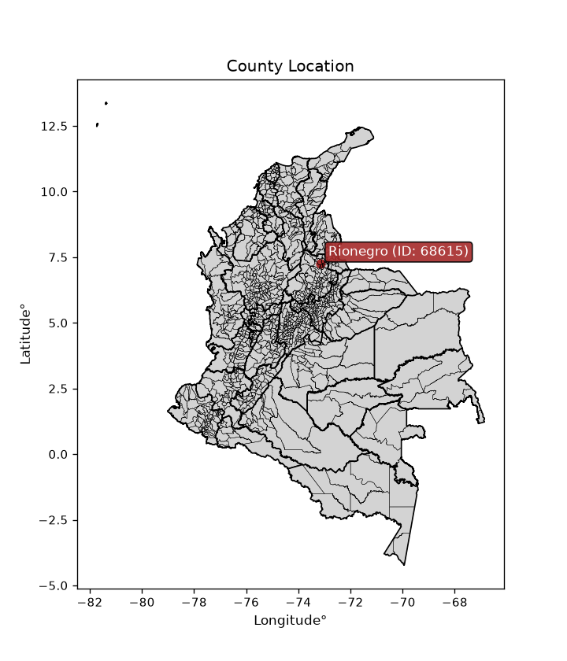
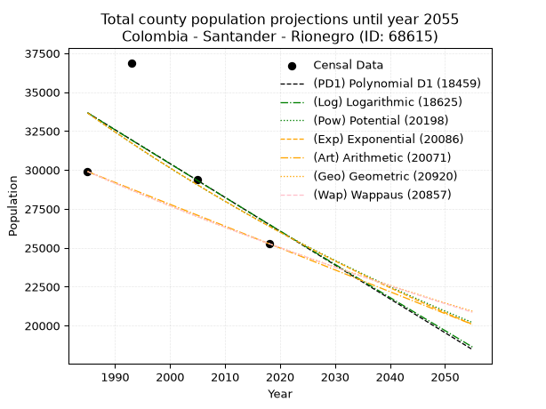
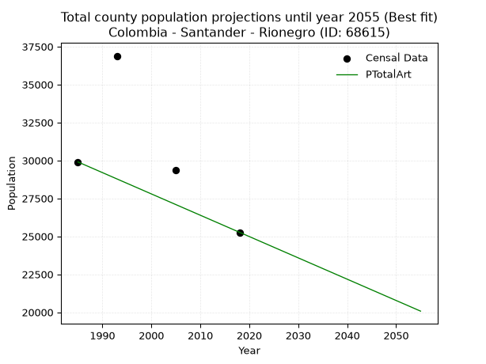
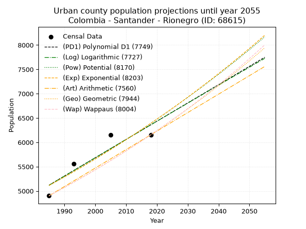
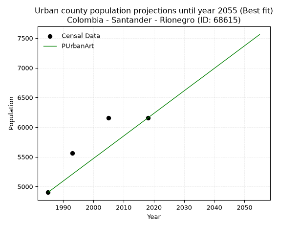
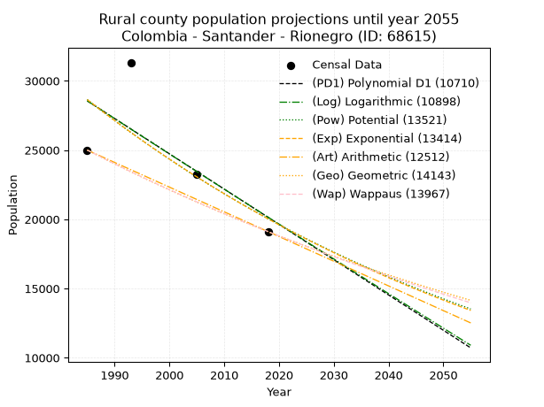
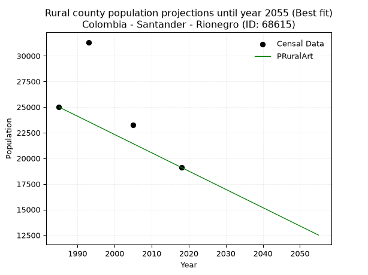

<div align="center">


</div>

# _“Population and Public Services Demand Projections (PPSD) until Year 2050 for Colombia - Santander - Rionegro (ID: 68615)”_
Keywords: `population` `public-service` `projection` `lineal` `polynomial` `logarithmic` `potential` `exponential` `arithmetic` `geometric` `wappaus` `dane` `colombia` `south-america`

PPSD are analytical estimates used by governments and planners to anticipate future changes in population size, age distribution, and the resulting community needs for utilities, healthcare, education, and infrastructure as sizing future water treatment facilities, electrical grids, and road networks based on spatial growth.

<div align="center">

</img>

</div>


> **General running parameters**: • app_version: _v20260806_. • Python version: _3.14.7_. • Pandas version: _3.0.5_. • NumPy version: _2.5.1_. • Creates, save and include plots into reports (create_plot): _False_. • Projection until year: _2050_. • Process polynomial degree 2 and up: _False_. • Process Wappaus: _True_. • Process Wappaus: _True_. • Set negative values to zero: _True_. • Set infinite values to zero: _True_. • Drop dataset notes: _True_. 
<div align="center">

Dynamic map: [:earth_americas:Google](http://maps.google.com/maps?q=7.265014271,-73.1501774) [:earth_americas:OSM](https://www.openstreetmap.org/#map=18/7.265014271/-73.1501774&layers=P) [:earth_americas:Bing](https://www.bing.com/maps?cp=7.265014271~-73.1501774&lvl=18) [:earth_americas:Apple](https://maps.apple.com/frame?center=7.265014271%2C-73.1501774&span=0.003%2C0.006)

</div>


<div align="center">

```geojson
{
  "type": "Feature",
  "geometry": {
    "type": "Point", 
    "coordinates": [-73.1501774, 7.265014271]
  }, 
  "properties": {
    "Name": "Colombia - Santander - Rionegro (ID: 68615)"
  }
}
```

</div>


## 0. Census Data (4 records)

Census data are official statistics collected by a government about the people and housing in a country. They usually include counts of total population, age, sex, race, income, education, and jobs.

📅Global census file: [Population.xlsx](../data/Population.xlsx)

| Source   |   Year |   CountryID | CountryName   |   StateID | StateName   |   CountyID | CountyName   |   PTotal |   PUrban |   PRural |
|:---------|-------:|------------:|:--------------|----------:|:------------|-----------:|:-------------|---------:|---------:|---------:|
| DANE     |   1985 |          57 | Colombia      |        68 | Santander   |      68615 | Rionegro     |    29899 |     4902 |    24997 |
| DANE     |   1993 |          57 | Colombia      |        68 | Santander   |      68615 | Rionegro     |    36885 |     5562 |    31323 |
| DANE     |   2005 |          57 | Colombia      |        68 | Santander   |      68615 | Rionegro     |    29382 |     6152 |    23230 |
| DANE     |   2018 |          57 | Colombia      |        68 | Santander   |      68615 | Rionegro     |    25266 |     6155 |    19111 |

> 🔥Some records could had specific notes about the registered values or the corresponding urban or rural distribution.

📅[SUI-RUPS](https://www.datos.gov.co/Hacienda-y-Cr-dito-P-blico/Registro-nico-de-Prestadores-de-Servicios-P-blicos/4qkq-csdn/about_data) - Local public utility companies: [RUPS.csv](../data/RUPS.xlsx)

 | SERVICIO       | ESTADO    | NOMBRE                                                             | NIT         | DEPARTAMENTO_DOMICILIO   | MUNICIPIO_DOMICILIO   | DIRECCION                          |   TELEFONO | EMAIL                             | TIPO_PRESTADOR                            | CLASIFICACION                 |
|:---------------|:----------|:-------------------------------------------------------------------|:------------|:-------------------------|:----------------------|:-----------------------------------|-----------:|:----------------------------------|:------------------------------------------|:------------------------------|
| ACUEDUCTO      | OPERATIVA | EMPRESA DE SERVICIOS VARIOS DEL MUNICIPIO DE RIONEGRO -SANTANDER-  | 800194163-6 | SANTANDER                | RIONEGRO              | calle 11 numero 9-11               |    6188386 | emserviresp@hotmail.com           | EMPRESA INDUSTRIAL Y COMERCIAL DEL ESTADO | MENOR O IGUAL A 2500 USUARIOS |
| ALCANTARILLADO | OPERATIVA | EMPRESA DE SERVICIOS VARIOS DEL MUNICIPIO DE RIONEGRO -SANTANDER-  | 800194163-6 | SANTANDER                | RIONEGRO              | calle 11 numero 9-11               |    6188386 | emserviresp@hotmail.com           | EMPRESA INDUSTRIAL Y COMERCIAL DEL ESTADO | MENOR O IGUAL A 2500 USUARIOS |
| ACUEDUCTO      | OPERATIVA | CORPORACION DE SERVICIOS DE ACUEDUCTO Y ALCANTARILLADO DE LA TIGRA | 800226300-8 | SANTANDER                | RIONEGRO              | Vereda La Plazuela Finca San Pablo |    6945995 | CARLOSMURILLOCASTILLO@HOTMAIL.COM | ORGANIZACION AUTORIZADA                   | MENOR O IGUAL A 2500 USUARIOS |

## 1. Total

### 1.1. Coefficients and Parameters

* (PD1) Polynomial Deg 1: -217.32637494981645, 465065.0814933704 (lineal)
* (Log) Logarithmic: -434195.7805544909, 3330683.607421305
* (Pow) Potential: -14.738244885204509, 53.13034514705281
* (Exp) Exponential: -0.0073764655150850445, 76948206564.80238
* (Art) Arithmetic: Year diff. 2018 - 1985 = 33, Population diff. 25266 - 29899 = -4633, Annual growth = -140.3939393939394
* (Geo) Geometric: Year diff. 2018 - 1985 = 33, Population diff. 25266 - 29899 = -4633, Annual growth % = -0.005088989315901404
* (Wap) Wappaus: i = -0.5089964266978678, Condition values only valid for < 200)

<sub>
Wappaus condition values: ['-0.00', '-0.51', '-1.02', '-1.53', '-2.04', '-2.54', '-3.05', '-3.56', '-4.07', '-4.58', '-5.09', '-5.60', '-6.11', '-6.62', '-7.13', '-7.63', '-8.14', '-8.65', '-9.16', '-9.67', '-10.18', '-10.69', '-11.20', '-11.71', '-12.22', '-12.72', '-13.23', '-13.74', '-14.25', '-14.76', '-15.27', '-15.78', '-16.29', '-16.80', '-17.31', '-17.81', '-18.32', '-18.83', '-19.34', '-19.85', '-20.36', '-20.87', '-21.38', '-21.89', '-22.40', '-22.90', '-23.41', '-23.92', '-24.43', '-24.94', '-25.45', '-25.96', '-26.47', '-26.98', '-27.49', '-27.99', '-28.50', '-29.01', '-29.52', '-30.03', '-30.54', '-31.05', '-31.56', '-32.07', '-32.58', '-33.08']
</sub>


### 1.2. Projected Dataset

|   Year |   CountyID |   PTotalPD1 |   PTotalLog |   PTotalPow |   PTotalExp |   PTotalArt |   PTotalGeo |   PTotalWap |
|-------:|-----------:|------------:|------------:|------------:|------------:|------------:|------------:|------------:|
|   1985 |      68615 |       33672 |       33673 |       33662 |       33662 |       29899 |       29899 |       29899 |
|   1986 |      68615 |       33455 |       33454 |       33413 |       33414 |       29759 |       29747 |       29747 |
|   1987 |      68615 |       33238 |       33235 |       33166 |       33169 |       29618 |       29595 |       29596 |
|   1988 |      68615 |       33020 |       33017 |       32921 |       32925 |       29478 |       29445 |       29446 |
|   1989 |      68615 |       32803 |       32798 |       32678 |       32683 |       29337 |       29295 |       29296 |
|   1990 |      68615 |       32586 |       32580 |       32437 |       32443 |       29197 |       29146 |       29148 |
|   1991 |      68615 |       32368 |       32362 |       32198 |       32204 |       29057 |       28998 |       29000 |
|   1992 |      68615 |       32151 |       32144 |       31960 |       31968 |       28916 |       28850 |       28852 |
|   1993 |      68615 |       31934 |       31926 |       31725 |       31733 |       28776 |       28703 |       28706 |
|   1994 |      68615 |       31716 |       31708 |       31491 |       31499 |       28635 |       28557 |       28560 |
|   1995 |      68615 |       31499 |       31491 |       31259 |       31268 |       28495 |       28412 |       28415 |
|   1996 |      68615 |       31282 |       31273 |       31029 |       31038 |       28355 |       28267 |       28271 |
|   1997 |      68615 |       31064 |       31056 |       30801 |       30810 |       28214 |       28123 |       28127 |
|   1998 |      68615 |       30847 |       30838 |       30575 |       30584 |       28074 |       27980 |       27984 |
|   1999 |      68615 |       30630 |       30621 |       30350 |       30359 |       27933 |       27838 |       27842 |
|   2000 |      68615 |       30412 |       30404 |       30127 |       30136 |       27793 |       27696 |       27700 |
|   2001 |      68615 |       30195 |       30187 |       29906 |       29914 |       27653 |       27555 |       27559 |
|   2002 |      68615 |       29978 |       29970 |       29687 |       29694 |       27512 |       27415 |       27419 |
|   2003 |      68615 |       29760 |       29753 |       29469 |       29476 |       27372 |       27276 |       27280 |
|   2004 |      68615 |       29543 |       29536 |       29253 |       29260 |       27232 |       27137 |       27141 |
|   2005 |      68615 |       29326 |       29320 |       29039 |       29045 |       27091 |       26999 |       27003 |
|   2006 |      68615 |       29108 |       29103 |       28826 |       28831 |       26951 |       26861 |       26865 |
|   2007 |      68615 |       28891 |       28887 |       28615 |       28619 |       26810 |       26725 |       26728 |
|   2008 |      68615 |       28674 |       28671 |       28406 |       28409 |       26670 |       26589 |       26592 |
|   2009 |      68615 |       28456 |       28454 |       28198 |       28200 |       26530 |       26453 |       26457 |
|   2010 |      68615 |       28239 |       28238 |       27992 |       27993 |       26389 |       26319 |       26322 |
|   2011 |      68615 |       28022 |       28022 |       27787 |       27787 |       26249 |       26185 |       26188 |
|   2012 |      68615 |       27804 |       27806 |       27585 |       27583 |       26108 |       26051 |       26054 |
|   2013 |      68615 |       27587 |       27591 |       27383 |       27380 |       25968 |       25919 |       25921 |
|   2014 |      68615 |       27370 |       27375 |       27184 |       27179 |       25828 |       25787 |       25789 |
|   2015 |      68615 |       27152 |       27160 |       26985 |       26979 |       25687 |       25656 |       25657 |
|   2016 |      68615 |       26935 |       26944 |       26789 |       26781 |       25547 |       25525 |       25526 |
|   2017 |      68615 |       26718 |       26729 |       26594 |       26584 |       25406 |       25395 |       25396 |
|   2018 |      68615 |       26500 |       26514 |       26400 |       26389 |       25266 |       25266 |       25266 |
|   2019 |      68615 |       26283 |       26298 |       26208 |       26195 |       25126 |       25137 |       25137 |
|   2020 |      68615 |       26066 |       26083 |       26018 |       26002 |       24985 |       25009 |       25008 |
|   2021 |      68615 |       25848 |       25869 |       25829 |       25811 |       24845 |       24882 |       24880 |
|   2022 |      68615 |       25631 |       25654 |       25641 |       25621 |       24704 |       24756 |       24753 |
|   2023 |      68615 |       25414 |       25439 |       25455 |       25433 |       24564 |       24630 |       24626 |
|   2024 |      68615 |       25196 |       25224 |       25270 |       25246 |       24424 |       24504 |       24500 |
|   2025 |      68615 |       24979 |       25010 |       25087 |       25061 |       24283 |       24380 |       24374 |
|   2026 |      68615 |       24762 |       24796 |       24905 |       24877 |       24143 |       24256 |       24249 |
|   2027 |      68615 |       24545 |       24581 |       24724 |       24694 |       24002 |       24132 |       24124 |
|   2028 |      68615 |       24327 |       24367 |       24545 |       24512 |       23862 |       24009 |       24001 |
|   2029 |      68615 |       24110 |       24153 |       24368 |       24332 |       23722 |       23887 |       23877 |
|   2030 |      68615 |       23893 |       23939 |       24191 |       24153 |       23581 |       23766 |       23754 |
|   2031 |      68615 |       23675 |       23725 |       24016 |       23976 |       23441 |       23645 |       23632 |
|   2032 |      68615 |       23458 |       23512 |       23843 |       23800 |       23300 |       23524 |       23510 |
|   2033 |      68615 |       23241 |       23298 |       23670 |       23625 |       23160 |       23405 |       23389 |
|   2034 |      68615 |       23023 |       23085 |       23500 |       23451 |       23020 |       23285 |       23269 |
|   2035 |      68615 |       22806 |       22871 |       23330 |       23279 |       22879 |       23167 |       23149 |
|   2036 |      68615 |       22589 |       22658 |       23162 |       23108 |       22739 |       23049 |       23029 |
|   2037 |      68615 |       22371 |       22445 |       22995 |       22938 |       22599 |       22932 |       22910 |
|   2038 |      68615 |       22154 |       22232 |       22829 |       22769 |       22458 |       22815 |       22792 |
|   2039 |      68615 |       21937 |       22019 |       22664 |       22602 |       22318 |       22699 |       22674 |
|   2040 |      68615 |       21719 |       21806 |       22501 |       22436 |       22177 |       22583 |       22557 |
|   2041 |      68615 |       21502 |       21593 |       22339 |       22271 |       22037 |       22468 |       22440 |
|   2042 |      68615 |       21285 |       21380 |       22179 |       22107 |       21897 |       22354 |       22323 |
|   2043 |      68615 |       21067 |       21168 |       22019 |       21945 |       21756 |       22240 |       22208 |
|   2044 |      68615 |       20850 |       20955 |       21861 |       21783 |       21616 |       22127 |       22092 |
|   2045 |      68615 |       20633 |       20743 |       21704 |       21623 |       21475 |       22015 |       21978 |
|   2046 |      68615 |       20415 |       20530 |       21548 |       21464 |       21335 |       21903 |       21863 |
|   2047 |      68615 |       20198 |       20318 |       21393 |       21307 |       21195 |       21791 |       21749 |
|   2048 |      68615 |       19981 |       20106 |       21240 |       21150 |       21054 |       21680 |       21636 |
|   2049 |      68615 |       19763 |       19894 |       21088 |       20995 |       20914 |       21570 |       21523 |
|   2050 |      68615 |       19546 |       19682 |       20937 |       20840 |       20773 |       21460 |       21411 |
<div align="center">

</img>

</div>


### 1.3. Best fit with absolute and relative error (%)

Relative error puts that difference into context by dividing the absolute error by the true value, creating a unitless ratio or percentage that shows the scale of the mistake.

Absolute and relative error

|   Year | Source   |   CountryID | CountryName   |   StateID | StateName   |   CountyID_x | CountyName   |   PTotal |   PUrban |   PRural |   CountyID_y |   PTotalPD1 |   PTotalLog |   PTotalPow |   PTotalExp |   PTotalArt |   PTotalGeo |   PTotalWap |   PTotalPD1AbsError |   PTotalLogAbsError |   PTotalPowAbsError |   PTotalExpAbsError |   PTotalArtAbsError |   PTotalGeoAbsError |   PTotalWapAbsError |   PTotalPD1RelError |   PTotalLogRelError |   PTotalPowRelError |   PTotalExpRelError |   PTotalArtRelError |   PTotalGeoRelError |   PTotalWapRelError |
|-------:|:---------|------------:|:--------------|----------:|:------------|-------------:|:-------------|---------:|---------:|---------:|-------------:|------------:|------------:|------------:|------------:|------------:|------------:|------------:|--------------------:|--------------------:|--------------------:|--------------------:|--------------------:|--------------------:|--------------------:|--------------------:|--------------------:|--------------------:|--------------------:|--------------------:|--------------------:|--------------------:|
|   1985 | DANE     |          57 | Colombia      |        68 | Santander   |        68615 | Rionegro     |    29899 |     4902 |    24997 |        68615 |       33672 |       33673 |       33662 |       33662 |       29899 |       29899 |       29899 |                3773 |                3774 |                3763 |                3763 |                   0 |                   0 |                   0 |           12.6192   |           12.6225   |            12.5857  |            12.5857  |             0       |             0       |             0       |
|   1993 | DANE     |          57 | Colombia      |        68 | Santander   |        68615 | Rionegro     |    36885 |     5562 |    31323 |        68615 |       31934 |       31926 |       31725 |       31733 |       28776 |       28703 |       28706 |                4951 |                4959 |                5160 |                5152 |                8109 |                8182 |                8179 |           13.4228   |           13.4445   |            13.9894  |            13.9677  |            21.9845  |            22.1825  |            22.1743  |
|   2005 | DANE     |          57 | Colombia      |        68 | Santander   |        68615 | Rionegro     |    29382 |     6152 |    23230 |        68615 |       29326 |       29320 |       29039 |       29045 |       27091 |       26999 |       27003 |                  56 |                  62 |                 343 |                 337 |                2291 |                2383 |                2379 |            0.190593 |            0.211014 |             1.16738 |             1.14696 |             7.79729 |             8.11041 |             8.09679 |
|   2018 | DANE     |          57 | Colombia      |        68 | Santander   |        68615 | Rionegro     |    25266 |     6155 |    19111 |        68615 |       26500 |       26514 |       26400 |       26389 |       25266 |       25266 |       25266 |                1234 |                1248 |                1134 |                1123 |                   0 |                   0 |                   0 |            4.88403  |            4.93944  |             4.48825 |             4.44471 |             0       |             0       |             0       |

Relative error mean

| Method    |   RelError | Best   |
|:----------|-----------:|:-------|
| PTotalPD1 |    7.77914 |        |
| PTotalLog |    7.80436 |        |
| PTotalPow |    8.05769 |        |
| PTotalExp |    8.03628 |        |
| PTotalArt |    7.44546 | True   |
| PTotalGeo |    7.57322 |        |
| PTotalWap |    7.56778 |        |

💙Best method: _**PTotalArt**_
<div align="center">

</img>

</div>


### 1.4. Fresh water supply demand in liters per capita per day (lpcd)

The fresh water supply demand typically ranges from 100 to 300 liters per capita per day (lpcd) for standard domestic and municipal planning, though absolute survival minimums set by the World Health Organization are as low as 7.5 to 20 liters per day, and total consumption in high-income nations can exceed 400 liters.

> `CZ`: Level in meters above the sea level (masl)<br> `WS`: Fresh water supply demand in liters per capita per day (lpcd or l/h/d)<br> `WSAll`: Zonal fresh water supply demand in liters per second (l/s)<br> `A`: Zonal area in square meters<br> `DP`: Population density (people/hectare or p/ha)

Reference values (RAS Colombia)

|    CZ |   WS |
|------:|-----:|
|  1000 |  120 |
|  2000 |  130 |
| 99999 |  140 |

County shapefile geometry properties and water supply values

|   CountyID |      ATotal |   CZTotal |   WSTotal |
|-----------:|------------:|----------:|----------:|
|      68615 | 1.16648e+09 |   445.169 |       120 |

Projected values for best method: PTotalArt

|   CountyID |   Year |   PTotalArt |   DPTotal |   WSTotal |   WSTotalAll |
|-----------:|-------:|------------:|----------:|----------:|-------------:|
|      68615 |   1985 |       29899 |      0.26 |       120 |      41.5264 |
|      68615 |   1986 |       29759 |      0.26 |       120 |      41.3319 |
|      68615 |   1987 |       29618 |      0.25 |       120 |      41.1361 |
|      68615 |   1988 |       29478 |      0.25 |       120 |      40.9417 |
|      68615 |   1989 |       29337 |      0.25 |       120 |      40.7458 |
|      68615 |   1990 |       29197 |      0.25 |       120 |      40.5514 |
|      68615 |   1991 |       29057 |      0.25 |       120 |      40.3569 |
|      68615 |   1992 |       28916 |      0.25 |       120 |      40.1611 |
|      68615 |   1993 |       28776 |      0.25 |       120 |      39.9667 |
|      68615 |   1994 |       28635 |      0.25 |       120 |      39.7708 |
|      68615 |   1995 |       28495 |      0.24 |       120 |      39.5764 |
|      68615 |   1996 |       28355 |      0.24 |       120 |      39.3819 |
|      68615 |   1997 |       28214 |      0.24 |       120 |      39.1861 |
|      68615 |   1998 |       28074 |      0.24 |       120 |      38.9917 |
|      68615 |   1999 |       27933 |      0.24 |       120 |      38.7958 |
|      68615 |   2000 |       27793 |      0.24 |       120 |      38.6014 |
|      68615 |   2001 |       27653 |      0.24 |       120 |      38.4069 |
|      68615 |   2002 |       27512 |      0.24 |       120 |      38.2111 |
|      68615 |   2003 |       27372 |      0.23 |       120 |      38.0167 |
|      68615 |   2004 |       27232 |      0.23 |       120 |      37.8222 |
|      68615 |   2005 |       27091 |      0.23 |       120 |      37.6264 |
|      68615 |   2006 |       26951 |      0.23 |       120 |      37.4319 |
|      68615 |   2007 |       26810 |      0.23 |       120 |      37.2361 |
|      68615 |   2008 |       26670 |      0.23 |       120 |      37.0417 |
|      68615 |   2009 |       26530 |      0.23 |       120 |      36.8472 |
|      68615 |   2010 |       26389 |      0.23 |       120 |      36.6514 |
|      68615 |   2011 |       26249 |      0.23 |       120 |      36.4569 |
|      68615 |   2012 |       26108 |      0.22 |       120 |      36.2611 |
|      68615 |   2013 |       25968 |      0.22 |       120 |      36.0667 |
|      68615 |   2014 |       25828 |      0.22 |       120 |      35.8722 |
|      68615 |   2015 |       25687 |      0.22 |       120 |      35.6764 |
|      68615 |   2016 |       25547 |      0.22 |       120 |      35.4819 |
|      68615 |   2017 |       25406 |      0.22 |       120 |      35.2861 |
|      68615 |   2018 |       25266 |      0.22 |       120 |      35.0917 |
|      68615 |   2019 |       25126 |      0.22 |       120 |      34.8972 |
|      68615 |   2020 |       24985 |      0.21 |       120 |      34.7014 |
|      68615 |   2021 |       24845 |      0.21 |       120 |      34.5069 |
|      68615 |   2022 |       24704 |      0.21 |       120 |      34.3111 |
|      68615 |   2023 |       24564 |      0.21 |       120 |      34.1167 |
|      68615 |   2024 |       24424 |      0.21 |       120 |      33.9222 |
|      68615 |   2025 |       24283 |      0.21 |       120 |      33.7264 |
|      68615 |   2026 |       24143 |      0.21 |       120 |      33.5319 |
|      68615 |   2027 |       24002 |      0.21 |       120 |      33.3361 |
|      68615 |   2028 |       23862 |      0.2  |       120 |      33.1417 |
|      68615 |   2029 |       23722 |      0.2  |       120 |      32.9472 |
|      68615 |   2030 |       23581 |      0.2  |       120 |      32.7514 |
|      68615 |   2031 |       23441 |      0.2  |       120 |      32.5569 |
|      68615 |   2032 |       23300 |      0.2  |       120 |      32.3611 |
|      68615 |   2033 |       23160 |      0.2  |       120 |      32.1667 |
|      68615 |   2034 |       23020 |      0.2  |       120 |      31.9722 |
|      68615 |   2035 |       22879 |      0.2  |       120 |      31.7764 |
|      68615 |   2036 |       22739 |      0.19 |       120 |      31.5819 |
|      68615 |   2037 |       22599 |      0.19 |       120 |      31.3875 |
|      68615 |   2038 |       22458 |      0.19 |       120 |      31.1917 |
|      68615 |   2039 |       22318 |      0.19 |       120 |      30.9972 |
|      68615 |   2040 |       22177 |      0.19 |       120 |      30.8014 |
|      68615 |   2041 |       22037 |      0.19 |       120 |      30.6069 |
|      68615 |   2042 |       21897 |      0.19 |       120 |      30.4125 |
|      68615 |   2043 |       21756 |      0.19 |       120 |      30.2167 |
|      68615 |   2044 |       21616 |      0.19 |       120 |      30.0222 |
|      68615 |   2045 |       21475 |      0.18 |       120 |      29.8264 |
|      68615 |   2046 |       21335 |      0.18 |       120 |      29.6319 |
|      68615 |   2047 |       21195 |      0.18 |       120 |      29.4375 |
|      68615 |   2048 |       21054 |      0.18 |       120 |      29.2417 |
|      68615 |   2049 |       20914 |      0.18 |       120 |      29.0472 |
|      68615 |   2050 |       20773 |      0.18 |       120 |      28.8514 |

## 2. Urban

### 2.1. Coefficients and Parameters

* (PD1) Polynomial Deg 1: 37.56443195503815, -69445.50501806506 (lineal)
* (Log) Logarithmic: 75271.11544620065, -566443.6016914349
* (Pow) Potential: 13.525593375560302, -40.89554730649377
* (Exp) Exponential: 0.006749719002828777, 0.007762433502718186
* (Art) Arithmetic: Year diff. 2018 - 1985 = 33, Population diff. 6155 - 4902 = 1253, Annual growth = 37.96969696969697
* (Geo) Geometric: Year diff. 2018 - 1985 = 33, Population diff. 6155 - 4902 = 1253, Annual growth % = 0.006921463813508
* (Wap) Wappaus: i = 0.6867992578402273, Condition values only valid for < 200)

<sub>
Wappaus condition values: ['0.00', '0.69', '1.37', '2.06', '2.75', '3.43', '4.12', '4.81', '5.49', '6.18', '6.87', '7.55', '8.24', '8.93', '9.62', '10.30', '10.99', '11.68', '12.36', '13.05', '13.74', '14.42', '15.11', '15.80', '16.48', '17.17', '17.86', '18.54', '19.23', '19.92', '20.60', '21.29', '21.98', '22.66', '23.35', '24.04', '24.72', '25.41', '26.10', '26.79', '27.47', '28.16', '28.85', '29.53', '30.22', '30.91', '31.59', '32.28', '32.97', '33.65', '34.34', '35.03', '35.71', '36.40', '37.09', '37.77', '38.46', '39.15', '39.83', '40.52', '41.21', '41.89', '42.58', '43.27', '43.96', '44.64']
</sub>


### 2.2. Projected Dataset

|   Year |   CountyID |   PUrbanPD1 |   PUrbanLog |   PUrbanPow |   PUrbanExp |   PUrbanArt |   PUrbanGeo |   PUrbanWap |
|-------:|-----------:|------------:|------------:|------------:|------------:|------------:|------------:|------------:|
|   1985 |      68615 |        5120 |        5118 |        5112 |        5114 |        4902 |        4902 |        4902 |
|   1986 |      68615 |        5157 |        5156 |        5147 |        5149 |        4940 |        4936 |        4936 |
|   1987 |      68615 |        5195 |        5194 |        5182 |        5183 |        4978 |        4970 |        4970 |
|   1988 |      68615 |        5233 |        5232 |        5218 |        5219 |        5016 |        5004 |        5004 |
|   1989 |      68615 |        5270 |        5270 |        5253 |        5254 |        5054 |        5039 |        5039 |
|   1990 |      68615 |        5308 |        5308 |        5289 |        5290 |        5092 |        5074 |        5073 |
|   1991 |      68615 |        5345 |        5345 |        5325 |        5325 |        5130 |        5109 |        5108 |
|   1992 |      68615 |        5383 |        5383 |        5362 |        5361 |        5168 |        5144 |        5143 |
|   1993 |      68615 |        5420 |        5421 |        5398 |        5398 |        5206 |        5180 |        5179 |
|   1994 |      68615 |        5458 |        5459 |        5435 |        5434 |        5244 |        5216 |        5215 |
|   1995 |      68615 |        5496 |        5496 |        5472 |        5471 |        5282 |        5252 |        5251 |
|   1996 |      68615 |        5533 |        5534 |        5509 |        5508 |        5320 |        5288 |        5287 |
|   1997 |      68615 |        5571 |        5572 |        5547 |        5545 |        5358 |        5325 |        5323 |
|   1998 |      68615 |        5608 |        5609 |        5584 |        5583 |        5396 |        5362 |        5360 |
|   1999 |      68615 |        5646 |        5647 |        5622 |        5621 |        5434 |        5399 |        5397 |
|   2000 |      68615 |        5683 |        5685 |        5660 |        5659 |        5472 |        5436 |        5434 |
|   2001 |      68615 |        5721 |        5722 |        5699 |        5697 |        5510 |        5474 |        5472 |
|   2002 |      68615 |        5758 |        5760 |        5737 |        5736 |        5547 |        5512 |        5510 |
|   2003 |      68615 |        5796 |        5798 |        5776 |        5775 |        5585 |        5550 |        5548 |
|   2004 |      68615 |        5834 |        5835 |        5815 |        5814 |        5623 |        5588 |        5586 |
|   2005 |      68615 |        5871 |        5873 |        5855 |        5853 |        5661 |        5627 |        5625 |
|   2006 |      68615 |        5909 |        5910 |        5894 |        5893 |        5699 |        5666 |        5664 |
|   2007 |      68615 |        5946 |        5948 |        5934 |        5933 |        5737 |        5705 |        5703 |
|   2008 |      68615 |        5984 |        5985 |        5974 |        5973 |        5775 |        5745 |        5743 |
|   2009 |      68615 |        6021 |        6023 |        6015 |        6013 |        5813 |        5785 |        5783 |
|   2010 |      68615 |        6059 |        6060 |        6055 |        6054 |        5851 |        5825 |        5823 |
|   2011 |      68615 |        6097 |        6098 |        6096 |        6095 |        5889 |        5865 |        5863 |
|   2012 |      68615 |        6134 |        6135 |        6137 |        6136 |        5927 |        5905 |        5904 |
|   2013 |      68615 |        6172 |        6172 |        6179 |        6178 |        5965 |        5946 |        5945 |
|   2014 |      68615 |        6209 |        6210 |        6220 |        6220 |        6003 |        5988 |        5986 |
|   2015 |      68615 |        6247 |        6247 |        6262 |        6262 |        6041 |        6029 |        6028 |
|   2016 |      68615 |        6284 |        6285 |        6304 |        6304 |        6079 |        6071 |        6070 |
|   2017 |      68615 |        6322 |        6322 |        6347 |        6347 |        6117 |        6113 |        6112 |
|   2018 |      68615 |        6360 |        6359 |        6390 |        6390 |        6155 |        6155 |        6155 |
|   2019 |      68615 |        6397 |        6397 |        6433 |        6433 |        6193 |        6198 |        6198 |
|   2020 |      68615 |        6435 |        6434 |        6476 |        6477 |        6231 |        6240 |        6241 |
|   2021 |      68615 |        6472 |        6471 |        6519 |        6521 |        6269 |        6284 |        6285 |
|   2022 |      68615 |        6510 |        6508 |        6563 |        6565 |        6307 |        6327 |        6329 |
|   2023 |      68615 |        6547 |        6545 |        6607 |        6609 |        6345 |        6371 |        6373 |
|   2024 |      68615 |        6585 |        6583 |        6651 |        6654 |        6383 |        6415 |        6418 |
|   2025 |      68615 |        6622 |        6620 |        6696 |        6699 |        6421 |        6459 |        6463 |
|   2026 |      68615 |        6660 |        6657 |        6741 |        6744 |        6459 |        6504 |        6509 |
|   2027 |      68615 |        6698 |        6694 |        6786 |        6790 |        6497 |        6549 |        6554 |
|   2028 |      68615 |        6735 |        6731 |        6831 |        6836 |        6535 |        6595 |        6600 |
|   2029 |      68615 |        6773 |        6768 |        6877 |        6882 |        6573 |        6640 |        6647 |
|   2030 |      68615 |        6810 |        6805 |        6923 |        6929 |        6611 |        6686 |        6694 |
|   2031 |      68615 |        6848 |        6843 |        6969 |        6976 |        6649 |        6732 |        6741 |
|   2032 |      68615 |        6885 |        6880 |        7016 |        7023 |        6687 |        6779 |        6789 |
|   2033 |      68615 |        6923 |        6917 |        7063 |        7071 |        6725 |        6826 |        6837 |
|   2034 |      68615 |        6961 |        6954 |        7110 |        7119 |        6763 |        6873 |        6885 |
|   2035 |      68615 |        6998 |        6991 |        7157 |        7167 |        6800 |        6921 |        6934 |
|   2036 |      68615 |        7036 |        7028 |        7205 |        7215 |        6838 |        6969 |        6984 |
|   2037 |      68615 |        7073 |        7065 |        7253 |        7264 |        6876 |        7017 |        7033 |
|   2038 |      68615 |        7111 |        7102 |        7301 |        7313 |        6914 |        7065 |        7083 |
|   2039 |      68615 |        7148 |        7138 |        7350 |        7363 |        6952 |        7114 |        7134 |
|   2040 |      68615 |        7186 |        7175 |        7399 |        7413 |        6990 |        7164 |        7185 |
|   2041 |      68615 |        7224 |        7212 |        7448 |        7463 |        7028 |        7213 |        7236 |
|   2042 |      68615 |        7261 |        7249 |        7498 |        7514 |        7066 |        7263 |        7288 |
|   2043 |      68615 |        7299 |        7286 |        7547 |        7564 |        7104 |        7313 |        7340 |
|   2044 |      68615 |        7336 |        7323 |        7598 |        7616 |        7142 |        7364 |        7393 |
|   2045 |      68615 |        7374 |        7360 |        7648 |        7667 |        7180 |        7415 |        7446 |
|   2046 |      68615 |        7411 |        7396 |        7699 |        7719 |        7218 |        7466 |        7500 |
|   2047 |      68615 |        7449 |        7433 |        7750 |        7771 |        7256 |        7518 |        7554 |
|   2048 |      68615 |        7486 |        7470 |        7801 |        7824 |        7294 |        7570 |        7609 |
|   2049 |      68615 |        7524 |        7507 |        7853 |        7877 |        7332 |        7622 |        7664 |
|   2050 |      68615 |        7562 |        7543 |        7905 |        7930 |        7370 |        7675 |        7719 |
<div align="center">

</img>

</div>


### 2.3. Best fit with absolute and relative error (%)

Relative error puts that difference into context by dividing the absolute error by the true value, creating a unitless ratio or percentage that shows the scale of the mistake.

Absolute and relative error

|   Year | Source   |   CountryID | CountryName   |   StateID | StateName   |   CountyID_x | CountyName   |   PTotal |   PUrban |   PRural |   CountyID_y |   PUrbanPD1 |   PUrbanLog |   PUrbanPow |   PUrbanExp |   PUrbanArt |   PUrbanGeo |   PUrbanWap |   PUrbanPD1AbsError |   PUrbanLogAbsError |   PUrbanPowAbsError |   PUrbanExpAbsError |   PUrbanArtAbsError |   PUrbanGeoAbsError |   PUrbanWapAbsError |   PUrbanPD1RelError |   PUrbanLogRelError |   PUrbanPowRelError |   PUrbanExpRelError |   PUrbanArtRelError |   PUrbanGeoRelError |   PUrbanWapRelError |
|-------:|:---------|------------:|:--------------|----------:|:------------|-------------:|:-------------|---------:|---------:|---------:|-------------:|------------:|------------:|------------:|------------:|------------:|------------:|------------:|--------------------:|--------------------:|--------------------:|--------------------:|--------------------:|--------------------:|--------------------:|--------------------:|--------------------:|--------------------:|--------------------:|--------------------:|--------------------:|--------------------:|
|   1985 | DANE     |          57 | Colombia      |        68 | Santander   |        68615 | Rionegro     |    29899 |     4902 |    24997 |        68615 |        5120 |        5118 |        5112 |        5114 |        4902 |        4902 |        4902 |                 218 |                 216 |                 210 |                 212 |                   0 |                   0 |                   0 |             4.44716 |             4.40636 |             4.28397 |             4.32477 |             0       |             0       |             0       |
|   1993 | DANE     |          57 | Colombia      |        68 | Santander   |        68615 | Rionegro     |    36885 |     5562 |    31323 |        68615 |        5420 |        5421 |        5398 |        5398 |        5206 |        5180 |        5179 |                 142 |                 141 |                 164 |                 164 |                 356 |                 382 |                 383 |             2.55304 |             2.53506 |             2.94858 |             2.94858 |             6.40058 |             6.86803 |             6.88601 |
|   2005 | DANE     |          57 | Colombia      |        68 | Santander   |        68615 | Rionegro     |    29382 |     6152 |    23230 |        68615 |        5871 |        5873 |        5855 |        5853 |        5661 |        5627 |        5625 |                 281 |                 279 |                 297 |                 299 |                 491 |                 525 |                 527 |             4.56762 |             4.53511 |             4.8277  |             4.86021 |             7.98114 |             8.53381 |             8.56632 |
|   2018 | DANE     |          57 | Colombia      |        68 | Santander   |        68615 | Rionegro     |    25266 |     6155 |    19111 |        68615 |        6360 |        6359 |        6390 |        6390 |        6155 |        6155 |        6155 |                 205 |                 204 |                 235 |                 235 |                   0 |                   0 |                   0 |             3.33063 |             3.31438 |             3.81803 |             3.81803 |             0       |             0       |             0       |

Relative error mean

| Method    |   RelError | Best   |
|:----------|-----------:|:-------|
| PUrbanPD1 |    3.72461 |        |
| PUrbanLog |    3.69773 |        |
| PUrbanPow |    3.96957 |        |
| PUrbanExp |    3.9879  |        |
| PUrbanArt |    3.59543 | True   |
| PUrbanGeo |    3.85046 |        |
| PUrbanWap |    3.86308 |        |

💙Best method: _**PUrbanArt**_
<div align="center">

</img>

</div>


### 2.4. Fresh water supply demand in liters per capita per day (lpcd)

The fresh water supply demand typically ranges from 100 to 300 liters per capita per day (lpcd) for standard domestic and municipal planning, though absolute survival minimums set by the World Health Organization are as low as 7.5 to 20 liters per day, and total consumption in high-income nations can exceed 400 liters.

> `CZ`: Level in meters above the sea level (masl)<br> `WS`: Fresh water supply demand in liters per capita per day (lpcd or l/h/d)<br> `WSAll`: Zonal fresh water supply demand in liters per second (l/s)<br> `A`: Zonal area in square meters<br> `DP`: Population density (people/hectare or p/ha)

Reference values (RAS Colombia)

|    CZ |   WS |
|------:|-----:|
|  1000 |  120 |
|  2000 |  130 |
| 99999 |  140 |

County shapefile geometry properties and water supply values

|   CountyID |   AUrban |   CZUrban |   WSUrban |
|-----------:|---------:|----------:|----------:|
|      68615 |   650012 |   659.425 |       120 |

Projected values for best method: PUrbanArt

|   CountyID |   Year |   PUrbanArt |   DPUrban |   WSUrban |   WSUrbanAll |
|-----------:|-------:|------------:|----------:|----------:|-------------:|
|      68615 |   1985 |        4902 |     75.41 |       120 |      6.80833 |
|      68615 |   1986 |        4940 |     76    |       120 |      6.86111 |
|      68615 |   1987 |        4978 |     76.58 |       120 |      6.91389 |
|      68615 |   1988 |        5016 |     77.17 |       120 |      6.96667 |
|      68615 |   1989 |        5054 |     77.75 |       120 |      7.01944 |
|      68615 |   1990 |        5092 |     78.34 |       120 |      7.07222 |
|      68615 |   1991 |        5130 |     78.92 |       120 |      7.125   |
|      68615 |   1992 |        5168 |     79.51 |       120 |      7.17778 |
|      68615 |   1993 |        5206 |     80.09 |       120 |      7.23056 |
|      68615 |   1994 |        5244 |     80.68 |       120 |      7.28333 |
|      68615 |   1995 |        5282 |     81.26 |       120 |      7.33611 |
|      68615 |   1996 |        5320 |     81.84 |       120 |      7.38889 |
|      68615 |   1997 |        5358 |     82.43 |       120 |      7.44167 |
|      68615 |   1998 |        5396 |     83.01 |       120 |      7.49444 |
|      68615 |   1999 |        5434 |     83.6  |       120 |      7.54722 |
|      68615 |   2000 |        5472 |     84.18 |       120 |      7.6     |
|      68615 |   2001 |        5510 |     84.77 |       120 |      7.65278 |
|      68615 |   2002 |        5547 |     85.34 |       120 |      7.70417 |
|      68615 |   2003 |        5585 |     85.92 |       120 |      7.75694 |
|      68615 |   2004 |        5623 |     86.51 |       120 |      7.80972 |
|      68615 |   2005 |        5661 |     87.09 |       120 |      7.8625  |
|      68615 |   2006 |        5699 |     87.68 |       120 |      7.91528 |
|      68615 |   2007 |        5737 |     88.26 |       120 |      7.96806 |
|      68615 |   2008 |        5775 |     88.84 |       120 |      8.02083 |
|      68615 |   2009 |        5813 |     89.43 |       120 |      8.07361 |
|      68615 |   2010 |        5851 |     90.01 |       120 |      8.12639 |
|      68615 |   2011 |        5889 |     90.6  |       120 |      8.17917 |
|      68615 |   2012 |        5927 |     91.18 |       120 |      8.23194 |
|      68615 |   2013 |        5965 |     91.77 |       120 |      8.28472 |
|      68615 |   2014 |        6003 |     92.35 |       120 |      8.3375  |
|      68615 |   2015 |        6041 |     92.94 |       120 |      8.39028 |
|      68615 |   2016 |        6079 |     93.52 |       120 |      8.44306 |
|      68615 |   2017 |        6117 |     94.11 |       120 |      8.49583 |
|      68615 |   2018 |        6155 |     94.69 |       120 |      8.54861 |
|      68615 |   2019 |        6193 |     95.28 |       120 |      8.60139 |
|      68615 |   2020 |        6231 |     95.86 |       120 |      8.65417 |
|      68615 |   2021 |        6269 |     96.44 |       120 |      8.70694 |
|      68615 |   2022 |        6307 |     97.03 |       120 |      8.75972 |
|      68615 |   2023 |        6345 |     97.61 |       120 |      8.8125  |
|      68615 |   2024 |        6383 |     98.2  |       120 |      8.86528 |
|      68615 |   2025 |        6421 |     98.78 |       120 |      8.91806 |
|      68615 |   2026 |        6459 |     99.37 |       120 |      8.97083 |
|      68615 |   2027 |        6497 |     99.95 |       120 |      9.02361 |
|      68615 |   2028 |        6535 |    100.54 |       120 |      9.07639 |
|      68615 |   2029 |        6573 |    101.12 |       120 |      9.12917 |
|      68615 |   2030 |        6611 |    101.71 |       120 |      9.18194 |
|      68615 |   2031 |        6649 |    102.29 |       120 |      9.23472 |
|      68615 |   2032 |        6687 |    102.88 |       120 |      9.2875  |
|      68615 |   2033 |        6725 |    103.46 |       120 |      9.34028 |
|      68615 |   2034 |        6763 |    104.04 |       120 |      9.39306 |
|      68615 |   2035 |        6800 |    104.61 |       120 |      9.44444 |
|      68615 |   2036 |        6838 |    105.2  |       120 |      9.49722 |
|      68615 |   2037 |        6876 |    105.78 |       120 |      9.55    |
|      68615 |   2038 |        6914 |    106.37 |       120 |      9.60278 |
|      68615 |   2039 |        6952 |    106.95 |       120 |      9.65556 |
|      68615 |   2040 |        6990 |    107.54 |       120 |      9.70833 |
|      68615 |   2041 |        7028 |    108.12 |       120 |      9.76111 |
|      68615 |   2042 |        7066 |    108.71 |       120 |      9.81389 |
|      68615 |   2043 |        7104 |    109.29 |       120 |      9.86667 |
|      68615 |   2044 |        7142 |    109.87 |       120 |      9.91944 |
|      68615 |   2045 |        7180 |    110.46 |       120 |      9.97222 |
|      68615 |   2046 |        7218 |    111.04 |       120 |     10.025   |
|      68615 |   2047 |        7256 |    111.63 |       120 |     10.0778  |
|      68615 |   2048 |        7294 |    112.21 |       120 |     10.1306  |
|      68615 |   2049 |        7332 |    112.8  |       120 |     10.1833  |
|      68615 |   2050 |        7370 |    113.38 |       120 |     10.2361  |

## 3. Rural

### 3.1. Coefficients and Parameters

* (PD1) Polynomial Deg 1: -254.8908069048542, 534510.5865114346 (lineal)
* (Log) Logarithmic: -509466.89600069175, 3897127.2091127415
* (Pow) Potential: -21.664246349095464, 75.90059111911687
* (Exp) Exponential: -0.010838271908944621, 63161303321047.46
* (Art) Arithmetic: Year diff. 2018 - 1985 = 33, Population diff. 19111 - 24997 = -5886, Annual growth = -178.36363636363637
* (Geo) Geometric: Year diff. 2018 - 1985 = 33, Population diff. 19111 - 24997 = -5886, Annual growth % = -0.008103104508822567
* (Wap) Wappaus: i = -0.8087586667436127, Condition values only valid for < 200)

<sub>
Wappaus condition values: ['-0.00', '-0.81', '-1.62', '-2.43', '-3.24', '-4.04', '-4.85', '-5.66', '-6.47', '-7.28', '-8.09', '-8.90', '-9.71', '-10.51', '-11.32', '-12.13', '-12.94', '-13.75', '-14.56', '-15.37', '-16.18', '-16.98', '-17.79', '-18.60', '-19.41', '-20.22', '-21.03', '-21.84', '-22.65', '-23.45', '-24.26', '-25.07', '-25.88', '-26.69', '-27.50', '-28.31', '-29.12', '-29.92', '-30.73', '-31.54', '-32.35', '-33.16', '-33.97', '-34.78', '-35.59', '-36.39', '-37.20', '-38.01', '-38.82', '-39.63', '-40.44', '-41.25', '-42.06', '-42.86', '-43.67', '-44.48', '-45.29', '-46.10', '-46.91', '-47.72', '-48.53', '-49.33', '-50.14', '-50.95', '-51.76', '-52.57']
</sub>


### 3.2. Projected Dataset

|   Year |   CountyID |   PRuralPD1 |   PRuralLog |   PRuralPow |   PRuralExp |   PRuralArt |   PRuralGeo |   PRuralWap |
|-------:|-----------:|------------:|------------:|------------:|------------:|------------:|------------:|------------:|
|   1985 |      68615 |       28552 |       28554 |       28648 |       28645 |       24997 |       24997 |       24997 |
|   1986 |      68615 |       28297 |       28298 |       28337 |       28336 |       24819 |       24794 |       24796 |
|   1987 |      68615 |       28043 |       28041 |       28030 |       28031 |       24640 |       24594 |       24596 |
|   1988 |      68615 |       27788 |       27785 |       27726 |       27729 |       24462 |       24394 |       24398 |
|   1989 |      68615 |       27533 |       27529 |       27426 |       27430 |       24284 |       24197 |       24201 |
|   1990 |      68615 |       27278 |       27273 |       27128 |       27134 |       24105 |       24001 |       24006 |
|   1991 |      68615 |       27023 |       27017 |       26835 |       26842 |       23927 |       23806 |       23813 |
|   1992 |      68615 |       26768 |       26761 |       26544 |       26552 |       23748 |       23613 |       23621 |
|   1993 |      68615 |       26513 |       26505 |       26257 |       26266 |       23570 |       23422 |       23430 |
|   1994 |      68615 |       26258 |       26250 |       25974 |       25983 |       23392 |       23232 |       23241 |
|   1995 |      68615 |       26003 |       25994 |       25693 |       25703 |       23213 |       23044 |       23054 |
|   1996 |      68615 |       25749 |       25739 |       25416 |       25426 |       23035 |       22857 |       22868 |
|   1997 |      68615 |       25494 |       25484 |       25141 |       25152 |       22857 |       22672 |       22683 |
|   1998 |      68615 |       25239 |       25229 |       24870 |       24881 |       22678 |       22488 |       22500 |
|   1999 |      68615 |       24984 |       24974 |       24602 |       24612 |       22500 |       22306 |       22318 |
|   2000 |      68615 |       24729 |       24719 |       24337 |       24347 |       22322 |       22125 |       22138 |
|   2001 |      68615 |       24474 |       24464 |       24075 |       24085 |       22143 |       21946 |       21959 |
|   2002 |      68615 |       24219 |       24210 |       23816 |       23825 |       21965 |       21768 |       21781 |
|   2003 |      68615 |       23964 |       23955 |       23559 |       23568 |       21786 |       21592 |       21605 |
|   2004 |      68615 |       23709 |       23701 |       23306 |       23314 |       21608 |       21417 |       21430 |
|   2005 |      68615 |       23455 |       23447 |       23055 |       23063 |       21430 |       21243 |       21256 |
|   2006 |      68615 |       23200 |       23193 |       22808 |       22814 |       21251 |       21071 |       21084 |
|   2007 |      68615 |       22945 |       22939 |       22563 |       22568 |       21073 |       20900 |       20913 |
|   2008 |      68615 |       22690 |       22685 |       22321 |       22325 |       20895 |       20731 |       20743 |
|   2009 |      68615 |       22435 |       22432 |       22081 |       22084 |       20716 |       20563 |       20574 |
|   2010 |      68615 |       22180 |       22178 |       21844 |       21846 |       20538 |       20396 |       20407 |
|   2011 |      68615 |       21925 |       21925 |       21610 |       21611 |       20360 |       20231 |       20241 |
|   2012 |      68615 |       21670 |       21671 |       21379 |       21378 |       20181 |       20067 |       20076 |
|   2013 |      68615 |       21415 |       21418 |       21150 |       21147 |       20003 |       19904 |       19912 |
|   2014 |      68615 |       21161 |       21165 |       20923 |       20919 |       19824 |       19743 |       19750 |
|   2015 |      68615 |       20906 |       20912 |       20700 |       20694 |       19646 |       19583 |       19588 |
|   2016 |      68615 |       20651 |       20660 |       20478 |       20471 |       19468 |       19425 |       19428 |
|   2017 |      68615 |       20396 |       20407 |       20259 |       20250 |       19289 |       19267 |       19269 |
|   2018 |      68615 |       20141 |       20154 |       20043 |       20032 |       19111 |       19111 |       19111 |
|   2019 |      68615 |       19886 |       19902 |       19829 |       19816 |       18933 |       18956 |       18954 |
|   2020 |      68615 |       19631 |       19650 |       19618 |       19602 |       18754 |       18803 |       18799 |
|   2021 |      68615 |       19376 |       19398 |       19408 |       19391 |       18576 |       18650 |       18644 |
|   2022 |      68615 |       19121 |       19145 |       19201 |       19182 |       18398 |       18499 |       18490 |
|   2023 |      68615 |       18866 |       18894 |       18997 |       18975 |       18219 |       18349 |       18338 |
|   2024 |      68615 |       18612 |       18642 |       18795 |       18771 |       18041 |       18200 |       18187 |
|   2025 |      68615 |       18357 |       18390 |       18595 |       18568 |       17862 |       18053 |       18036 |
|   2026 |      68615 |       18102 |       18139 |       18397 |       18368 |       17684 |       17907 |       17887 |
|   2027 |      68615 |       17847 |       17887 |       18201 |       18170 |       17506 |       17762 |       17739 |
|   2028 |      68615 |       17592 |       17636 |       18008 |       17974 |       17327 |       17618 |       17592 |
|   2029 |      68615 |       17337 |       17385 |       17816 |       17781 |       17149 |       17475 |       17445 |
|   2030 |      68615 |       17082 |       17134 |       17627 |       17589 |       16971 |       17333 |       17300 |
|   2031 |      68615 |       16827 |       16883 |       17440 |       17399 |       16792 |       17193 |       17156 |
|   2032 |      68615 |       16572 |       16632 |       17255 |       17212 |       16614 |       17054 |       17013 |
|   2033 |      68615 |       16318 |       16381 |       17072 |       17026 |       16436 |       16915 |       16870 |
|   2034 |      68615 |       16063 |       16131 |       16891 |       16843 |       16257 |       16778 |       16729 |
|   2035 |      68615 |       15808 |       15880 |       16712 |       16661 |       16079 |       16642 |       16589 |
|   2036 |      68615 |       15553 |       15630 |       16535 |       16481 |       15900 |       16507 |       16449 |
|   2037 |      68615 |       15298 |       15380 |       16360 |       16304 |       15722 |       16374 |       16311 |
|   2038 |      68615 |       15043 |       15130 |       16187 |       16128 |       15544 |       16241 |       16173 |
|   2039 |      68615 |       14788 |       14880 |       16016 |       15954 |       15365 |       16109 |       16037 |
|   2040 |      68615 |       14533 |       14630 |       15847 |       15782 |       15187 |       15979 |       15901 |
|   2041 |      68615 |       14278 |       14381 |       15680 |       15612 |       15009 |       15849 |       15766 |
|   2042 |      68615 |       14024 |       14131 |       15514 |       15444 |       14830 |       15721 |       15632 |
|   2043 |      68615 |       13769 |       13882 |       15350 |       15277 |       14652 |       15594 |       15499 |
|   2044 |      68615 |       13514 |       13632 |       15189 |       15113 |       14474 |       15467 |       15367 |
|   2045 |      68615 |       13259 |       13383 |       15028 |       14950 |       14295 |       15342 |       15235 |
|   2046 |      68615 |       13004 |       13134 |       14870 |       14789 |       14117 |       15218 |       15105 |
|   2047 |      68615 |       12749 |       12885 |       14714 |       14629 |       13938 |       15094 |       14975 |
|   2048 |      68615 |       12494 |       12636 |       14559 |       14471 |       13760 |       14972 |       14847 |
|   2049 |      68615 |       12239 |       12388 |       14406 |       14315 |       13582 |       14851 |       14719 |
|   2050 |      68615 |       11984 |       12139 |       14254 |       14161 |       13403 |       14730 |       14591 |
<div align="center">

</img>

</div>


### 3.3. Best fit with absolute and relative error (%)

Relative error puts that difference into context by dividing the absolute error by the true value, creating a unitless ratio or percentage that shows the scale of the mistake.

Absolute and relative error

|   Year | Source   |   CountryID | CountryName   |   StateID | StateName   |   CountyID_x | CountyName   |   PTotal |   PUrban |   PRural |   CountyID_y |   PRuralPD1 |   PRuralLog |   PRuralPow |   PRuralExp |   PRuralArt |   PRuralGeo |   PRuralWap |   PRuralPD1AbsError |   PRuralLogAbsError |   PRuralPowAbsError |   PRuralExpAbsError |   PRuralArtAbsError |   PRuralGeoAbsError |   PRuralWapAbsError |   PRuralPD1RelError |   PRuralLogRelError |   PRuralPowRelError |   PRuralExpRelError |   PRuralArtRelError |   PRuralGeoRelError |   PRuralWapRelError |
|-------:|:---------|------------:|:--------------|----------:|:------------|-------------:|:-------------|---------:|---------:|---------:|-------------:|------------:|------------:|------------:|------------:|------------:|------------:|------------:|--------------------:|--------------------:|--------------------:|--------------------:|--------------------:|--------------------:|--------------------:|--------------------:|--------------------:|--------------------:|--------------------:|--------------------:|--------------------:|--------------------:|
|   1985 | DANE     |          57 | Colombia      |        68 | Santander   |        68615 | Rionegro     |    29899 |     4902 |    24997 |        68615 |       28552 |       28554 |       28648 |       28645 |       24997 |       24997 |       24997 |                3555 |                3557 |                3651 |                3648 |                   0 |                   0 |                   0 |           14.2217   |           14.2297   |           14.6058   |           14.5938   |              0      |             0       |             0       |
|   1993 | DANE     |          57 | Colombia      |        68 | Santander   |        68615 | Rionegro     |    36885 |     5562 |    31323 |        68615 |       26513 |       26505 |       26257 |       26266 |       23570 |       23422 |       23430 |                4810 |                4818 |                5066 |                5057 |                7753 |                7901 |                7893 |           15.3561   |           15.3817   |           16.1734   |           16.1447   |             24.7518 |            25.2243  |            25.1987  |
|   2005 | DANE     |          57 | Colombia      |        68 | Santander   |        68615 | Rionegro     |    29382 |     6152 |    23230 |        68615 |       23455 |       23447 |       23055 |       23063 |       21430 |       21243 |       21256 |                 225 |                 217 |                 175 |                 167 |                1800 |                1987 |                1974 |            0.968575 |            0.934137 |            0.753336 |            0.718898 |              7.7486 |             8.55359 |             8.49763 |
|   2018 | DANE     |          57 | Colombia      |        68 | Santander   |        68615 | Rionegro     |    25266 |     6155 |    19111 |        68615 |       20141 |       20154 |       20043 |       20032 |       19111 |       19111 |       19111 |                1030 |                1043 |                 932 |                 921 |                   0 |                   0 |                   0 |            5.38957  |            5.45759  |            4.87677  |            4.81921  |              0      |             0       |             0       |

Relative error mean

| Method    |   RelError | Best   |
|:----------|-----------:|:-------|
| PRuralPD1 |    8.98399 |        |
| PRuralLog |    9.00078 |        |
| PRuralPow |    9.10232 |        |
| PRuralExp |    9.06914 |        |
| PRuralArt |    8.1251  | True   |
| PRuralGeo |    8.44447 |        |
| PRuralWap |    8.42409 |        |

💙Best method: _**PRuralArt**_
<div align="center">

</img>

</div>


### 3.4. Fresh water supply demand in liters per capita per day (lpcd)

The fresh water supply demand typically ranges from 100 to 300 liters per capita per day (lpcd) for standard domestic and municipal planning, though absolute survival minimums set by the World Health Organization are as low as 7.5 to 20 liters per day, and total consumption in high-income nations can exceed 400 liters.

> `CZ`: Level in meters above the sea level (masl)<br> `WS`: Fresh water supply demand in liters per capita per day (lpcd or l/h/d)<br> `WSAll`: Zonal fresh water supply demand in liters per second (l/s)<br> `A`: Zonal area in square meters<br> `DP`: Population density (people/hectare or p/ha)

Reference values (RAS Colombia)

|    CZ |   WS |
|------:|-----:|
|  1000 |  120 |
|  2000 |  130 |
| 99999 |  140 |

County shapefile geometry properties and water supply values

|   CountyID |      ARural |   CZRural |   WSRural |
|-----------:|------------:|----------:|----------:|
|      68615 | 1.16583e+09 |   445.049 |       120 |

Projected values for best method: PRuralArt

|   CountyID |   Year |   PRuralArt |   DPRural |   WSRural |   WSRuralAll |
|-----------:|-------:|------------:|----------:|----------:|-------------:|
|      68615 |   1985 |       24997 |      0.21 |       120 |      34.7181 |
|      68615 |   1986 |       24819 |      0.21 |       120 |      34.4708 |
|      68615 |   1987 |       24640 |      0.21 |       120 |      34.2222 |
|      68615 |   1988 |       24462 |      0.21 |       120 |      33.975  |
|      68615 |   1989 |       24284 |      0.21 |       120 |      33.7278 |
|      68615 |   1990 |       24105 |      0.21 |       120 |      33.4792 |
|      68615 |   1991 |       23927 |      0.21 |       120 |      33.2319 |
|      68615 |   1992 |       23748 |      0.2  |       120 |      32.9833 |
|      68615 |   1993 |       23570 |      0.2  |       120 |      32.7361 |
|      68615 |   1994 |       23392 |      0.2  |       120 |      32.4889 |
|      68615 |   1995 |       23213 |      0.2  |       120 |      32.2403 |
|      68615 |   1996 |       23035 |      0.2  |       120 |      31.9931 |
|      68615 |   1997 |       22857 |      0.2  |       120 |      31.7458 |
|      68615 |   1998 |       22678 |      0.19 |       120 |      31.4972 |
|      68615 |   1999 |       22500 |      0.19 |       120 |      31.25   |
|      68615 |   2000 |       22322 |      0.19 |       120 |      31.0028 |
|      68615 |   2001 |       22143 |      0.19 |       120 |      30.7542 |
|      68615 |   2002 |       21965 |      0.19 |       120 |      30.5069 |
|      68615 |   2003 |       21786 |      0.19 |       120 |      30.2583 |
|      68615 |   2004 |       21608 |      0.19 |       120 |      30.0111 |
|      68615 |   2005 |       21430 |      0.18 |       120 |      29.7639 |
|      68615 |   2006 |       21251 |      0.18 |       120 |      29.5153 |
|      68615 |   2007 |       21073 |      0.18 |       120 |      29.2681 |
|      68615 |   2008 |       20895 |      0.18 |       120 |      29.0208 |
|      68615 |   2009 |       20716 |      0.18 |       120 |      28.7722 |
|      68615 |   2010 |       20538 |      0.18 |       120 |      28.525  |
|      68615 |   2011 |       20360 |      0.17 |       120 |      28.2778 |
|      68615 |   2012 |       20181 |      0.17 |       120 |      28.0292 |
|      68615 |   2013 |       20003 |      0.17 |       120 |      27.7819 |
|      68615 |   2014 |       19824 |      0.17 |       120 |      27.5333 |
|      68615 |   2015 |       19646 |      0.17 |       120 |      27.2861 |
|      68615 |   2016 |       19468 |      0.17 |       120 |      27.0389 |
|      68615 |   2017 |       19289 |      0.17 |       120 |      26.7903 |
|      68615 |   2018 |       19111 |      0.16 |       120 |      26.5431 |
|      68615 |   2019 |       18933 |      0.16 |       120 |      26.2958 |
|      68615 |   2020 |       18754 |      0.16 |       120 |      26.0472 |
|      68615 |   2021 |       18576 |      0.16 |       120 |      25.8    |
|      68615 |   2022 |       18398 |      0.16 |       120 |      25.5528 |
|      68615 |   2023 |       18219 |      0.16 |       120 |      25.3042 |
|      68615 |   2024 |       18041 |      0.15 |       120 |      25.0569 |
|      68615 |   2025 |       17862 |      0.15 |       120 |      24.8083 |
|      68615 |   2026 |       17684 |      0.15 |       120 |      24.5611 |
|      68615 |   2027 |       17506 |      0.15 |       120 |      24.3139 |
|      68615 |   2028 |       17327 |      0.15 |       120 |      24.0653 |
|      68615 |   2029 |       17149 |      0.15 |       120 |      23.8181 |
|      68615 |   2030 |       16971 |      0.15 |       120 |      23.5708 |
|      68615 |   2031 |       16792 |      0.14 |       120 |      23.3222 |
|      68615 |   2032 |       16614 |      0.14 |       120 |      23.075  |
|      68615 |   2033 |       16436 |      0.14 |       120 |      22.8278 |
|      68615 |   2034 |       16257 |      0.14 |       120 |      22.5792 |
|      68615 |   2035 |       16079 |      0.14 |       120 |      22.3319 |
|      68615 |   2036 |       15900 |      0.14 |       120 |      22.0833 |
|      68615 |   2037 |       15722 |      0.13 |       120 |      21.8361 |
|      68615 |   2038 |       15544 |      0.13 |       120 |      21.5889 |
|      68615 |   2039 |       15365 |      0.13 |       120 |      21.3403 |
|      68615 |   2040 |       15187 |      0.13 |       120 |      21.0931 |
|      68615 |   2041 |       15009 |      0.13 |       120 |      20.8458 |
|      68615 |   2042 |       14830 |      0.13 |       120 |      20.5972 |
|      68615 |   2043 |       14652 |      0.13 |       120 |      20.35   |
|      68615 |   2044 |       14474 |      0.12 |       120 |      20.1028 |
|      68615 |   2045 |       14295 |      0.12 |       120 |      19.8542 |
|      68615 |   2046 |       14117 |      0.12 |       120 |      19.6069 |
|      68615 |   2047 |       13938 |      0.12 |       120 |      19.3583 |
|      68615 |   2048 |       13760 |      0.12 |       120 |      19.1111 |
|      68615 |   2049 |       13582 |      0.12 |       120 |      18.8639 |
|      68615 |   2050 |       13403 |      0.11 |       120 |      18.6153 |

<div align="center"><br><sub>Share this research</sub></div><br>

<sub>**APPS & TOOLS & CONTENT DISCLAIMER**: • NO WARRANTY - This content and software is provided by <a href="https://github.com/rcfdtools" target="_blank">github.com/rcfdtools</a> "as is", without any express or implied warranty, including warranties of merchantability, fitness for a particular purpose, or non-infringement. There is no guarantee that the software will be error-free or operate without interruption. • LIMITATION OF LIABILITY - Neither the authors nor copyright holders will be liable for claims or damages arising from the software or its use. You are responsible for determining if the software is appropriate for your use and assume all associated risks, including errors, legal compliance, and data loss. • NO PROFESSIONAL ADVICE - The software provides general information and does not offer professional advice. It should not replace consultation with professional advisors. [Clauses and global license for rcfdtools use.](https://github.com/rcfdtools/rcfdtools/blob/main/LICENSE.md)</sub>

| [:house: Home](Readme.md)  | [:beginner: Help / Collab](https://github.com/rcfdtools/R.HydroTools/discussions/31) |
|----------------------------|-------------------------------------------------------------------------------------------|