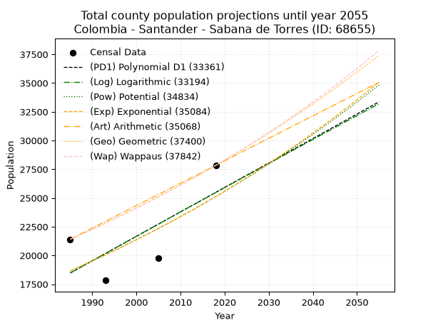
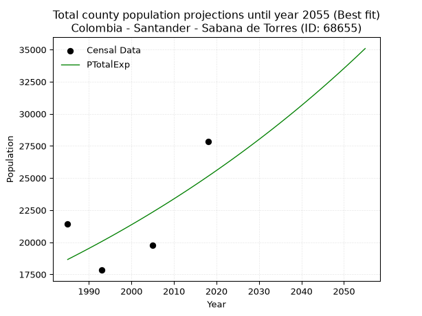
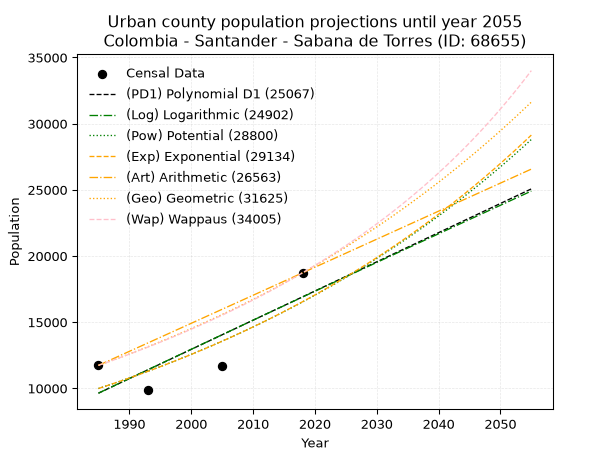
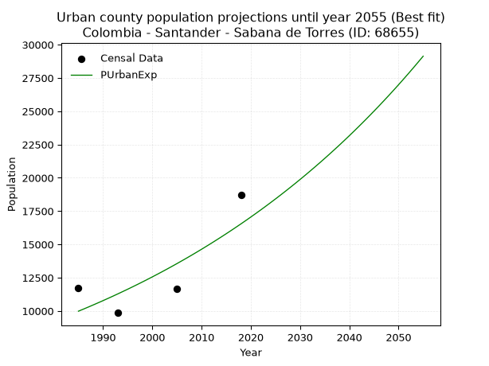
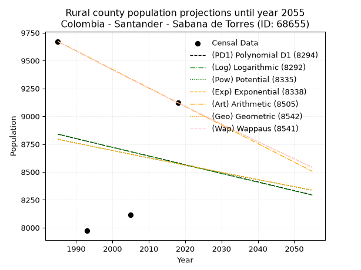
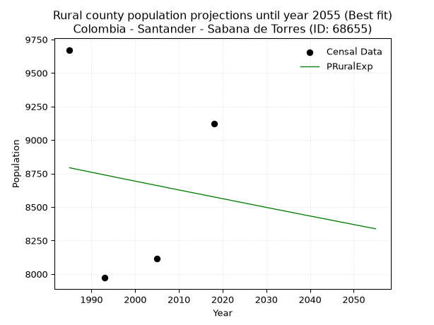

<div align="center">


</div>

# _“Population and Public Services Demand Projections (PPSD) until Year 2050 for Colombia - Santander - Sabana de Torres (ID: 68655)”_
Keywords: `population` `public-service` `projection` `lineal` `polynomial` `logarithmic` `potential` `exponential` `arithmetic` `geometric` `wappaus` `dane` `colombia` `south-america`

PPSD are analytical estimates used by governments and planners to anticipate future changes in population size, age distribution, and the resulting community needs for utilities, healthcare, education, and infrastructure as sizing future water treatment facilities, electrical grids, and road networks based on spatial growth.

> **General running parameters**: • app_version: _v20260806_. • Python version: _3.14.7_. • Pandas version: _3.0.5_. • NumPy version: _2.5.1_. • Creates, save and include plots into reports (create_plot): _False_. • Projection until year: _2050_. • Process polynomial degree 2 and up: _False_. • Process Wappaus: _True_. • Process Wappaus: _True_. • Set negative values to zero: _True_. • Set infinite values to zero: _True_. • Drop dataset notes: _True_. 
<div align="center">

Dynamic map: [:earth_americas:Google](http://maps.google.com/maps?q=7.391918701,-73.4990604) [:earth_americas:OSM](https://www.openstreetmap.org/#map=18/7.391918701/-73.4990604&layers=P) [:earth_americas:Bing](https://www.bing.com/maps?cp=7.391918701~-73.4990604&lvl=18) [:earth_americas:Apple](https://maps.apple.com/frame?center=7.391918701%2C-73.4990604&span=0.003%2C0.006)

</div>


<div align="center">

```geojson
{
  "type": "Feature",
  "geometry": {
    "type": "Point", 
    "coordinates": [-73.4990604, 7.391918701]
  }, 
  "properties": {
    "Name": "Colombia - Santander - Sabana de Torres (ID: 68655)"
  }
}
```

</div>


## 0. Census Data (4 records)

Census data are official statistics collected by a government about the people and housing in a country. They usually include counts of total population, age, sex, race, income, education, and jobs.

📅Global census file: [Population.xlsx](../data/Population.xlsx)

| Source   |   Year |   CountryID | CountryName   |   StateID | StateName   |   CountyID | CountyName       |   PTotal |   PUrban |   PRural |
|:---------|-------:|------------:|:--------------|----------:|:------------|-----------:|:-----------------|---------:|---------:|---------:|
| DANE     |   1985 |          57 | Colombia      |        68 | Santander   |      68655 | Sabana de Torres |    21403 |    11731 |     9672 |
| DANE     |   1993 |          57 | Colombia      |        68 | Santander   |      68655 | Sabana de Torres |    17831 |     9859 |     7972 |
| DANE     |   2005 |          57 | Colombia      |        68 | Santander   |      68655 | Sabana de Torres |    19772 |    11659 |     8113 |
| DANE     |   2018 |          57 | Colombia      |        68 | Santander   |      68655 | Sabana de Torres |    27845 |    18723 |     9122 |

> 🔥Some records could had specific notes about the registered values or the corresponding urban or rural distribution.

📅   [RUPS](https://www.datos.gov.co/Hacienda-y-Cr-dito-P-blico/Registro-nico-de-Prestadores-de-Servicios-P-blicos/4qkq-csdn/about_data) - Local public utility companies: [RUPS.csv](../data/RUPS.xlsx)

 | SERVICIO       | ESTADO    | NOMBRE                                                                                                                                      | NIT         | DEPARTAMENTO_DOMICILIO   | MUNICIPIO_DOMICILIO   | DIRECCION                                 |   TELEFONO | EMAIL                              | TIPO_PRESTADOR                            | CLASIFICACION                 |
|:---------------|:----------|:--------------------------------------------------------------------------------------------------------------------------------------------|:------------|:-------------------------|:----------------------|:------------------------------------------|-----------:|:-----------------------------------|:------------------------------------------|:------------------------------|
| ACUEDUCTO      | OPERATIVA | EMPRESA MUNICIPAL DE SERVICIOS PUBLICOS DOMICILIARIOS DE ACUEDUCTO, ALCANTARILLADO Y SANEAMIENTO BASICO DE SABANA DE TORRES ESPUSATO E.S.P. | 800062402-5 | SANTANDER                | SABANA DE TORRES      | Calle 19 No 10-41 - Barrio Carvajal       |    6293282 | aguaytierra.dag@gmail.com          | EMPRESA INDUSTRIAL Y COMERCIAL DEL ESTADO | MAYOR O IGUAL A 5001 USUARIOS |
| ALCANTARILLADO | OPERATIVA | EMPRESA MUNICIPAL DE SERVICIOS PUBLICOS DOMICILIARIOS DE ACUEDUCTO, ALCANTARILLADO Y SANEAMIENTO BASICO DE SABANA DE TORRES ESPUSATO E.S.P. | 800062402-5 | SANTANDER                | SABANA DE TORRES      | Calle 19 No 10-41 - Barrio Carvajal       |    6293282 | aguaytierra.dag@gmail.com          | EMPRESA INDUSTRIAL Y COMERCIAL DEL ESTADO | MAYOR O IGUAL A 5001 USUARIOS |
| ACUEDUCTO      | OPERATIVA | ASOCIACION DE USUARIOS DE ACUEDUCTO ALCANTARILLADO Y ASEO DE LA VEREDA ROSABLANCA - BIRMANIA Y PARCELACION LAS CRISTALINAS Y LA BAHIA       | 900676262-9 | SANTANDER                | SABANA DE TORRES      | Escuela Rural de la vereda Rosablanca     |    6293357 | acurosablanca.cristalina@gmail.com | ORGANIZACION AUTORIZADA                   | MENOR O IGUAL A 2500 USUARIOS |
| ACUEDUCTO      | OPERATIVA | ASOCIACION DE USUARIOS DE ACUEDUCTO ALCANTARILLADO Y ASEO DE LA VEREDA SAN RAFAEL DE PAYOA                                                  | 900980973-1 | SANTANDER                | SABANA DE TORRES      | Vía Panamericana Km 12 Finca Buenos Aires |    6293357 | acueductopayoa@gmail.com           | ORGANIZACION AUTORIZADA                   | MENOR O IGUAL A 2500 USUARIOS |

## 1. Total

### 1.1. Coefficients and Parameters

* (PD1) Polynomial Deg 1: 212.75832998795164, -403857.0995584003 (lineal)
* (Log) Logarithmic: 424869.25711473386, -3207721.8780176435
* (Pow) Potential: 18.011791402109818, -55.127677337669375
* (Exp) Exponential: 0.009020814020945693, 0.0003120707885144524
* (Art) Arithmetic: Year diff. 2018 - 1985 = 33, Population diff. 27845 - 21403 = 6442, Annual growth = 195.21212121212122
* (Geo) Geometric: Year diff. 2018 - 1985 = 33, Population diff. 27845 - 21403 = 6442, Annual growth % = 0.008005275809454204
* (Wap) Wappaus: i = 0.792771772303936, Condition values only valid for < 200)

<sub>
Wappaus condition values: ['0.00', '0.79', '1.59', '2.38', '3.17', '3.96', '4.76', '5.55', '6.34', '7.13', '7.93', '8.72', '9.51', '10.31', '11.10', '11.89', '12.68', '13.48', '14.27', '15.06', '15.86', '16.65', '17.44', '18.23', '19.03', '19.82', '20.61', '21.40', '22.20', '22.99', '23.78', '24.58', '25.37', '26.16', '26.95', '27.75', '28.54', '29.33', '30.13', '30.92', '31.71', '32.50', '33.30', '34.09', '34.88', '35.67', '36.47', '37.26', '38.05', '38.85', '39.64', '40.43', '41.22', '42.02', '42.81', '43.60', '44.40', '45.19', '45.98', '46.77', '47.57', '48.36', '49.15', '49.94', '50.74', '51.53']
</sub>


### 1.2. Projected Dataset

|   Year |   CountyID |   PTotalPD1 |   PTotalLog |   PTotalPow |   PTotalExp |   PTotalArt |   PTotalGeo |   PTotalWap |
|-------:|-----------:|------------:|------------:|------------:|------------:|------------:|------------:|------------:|
|   1985 |      68655 |       18468 |       18469 |       18659 |       18658 |       21403 |       21403 |       21403 |
|   1986 |      68655 |       18681 |       18683 |       18829 |       18827 |       21598 |       21574 |       21573 |
|   1987 |      68655 |       18894 |       18897 |       19001 |       18998 |       21793 |       21747 |       21745 |
|   1988 |      68655 |       19106 |       19111 |       19174 |       19170 |       21989 |       21921 |       21918 |
|   1989 |      68655 |       19319 |       19325 |       19348 |       19344 |       22184 |       22097 |       22093 |
|   1990 |      68655 |       19532 |       19538 |       19524 |       19519 |       22379 |       22274 |       22269 |
|   1991 |      68655 |       19745 |       19752 |       19702 |       19696 |       22574 |       22452 |       22446 |
|   1992 |      68655 |       19957 |       19965 |       19881 |       19874 |       22769 |       22632 |       22625 |
|   1993 |      68655 |       20170 |       20178 |       20061 |       20054 |       22965 |       22813 |       22805 |
|   1994 |      68655 |       20383 |       20391 |       20243 |       20236 |       23160 |       22995 |       22987 |
|   1995 |      68655 |       20596 |       20604 |       20427 |       20419 |       23355 |       23179 |       23170 |
|   1996 |      68655 |       20809 |       20817 |       20612 |       20604 |       23550 |       23365 |       23355 |
|   1997 |      68655 |       21021 |       21030 |       20799 |       20791 |       23746 |       23552 |       23541 |
|   1998 |      68655 |       21234 |       21243 |       20987 |       20980 |       23941 |       23741 |       23729 |
|   1999 |      68655 |       21447 |       21455 |       21177 |       21170 |       24136 |       23931 |       23918 |
|   2000 |      68655 |       21660 |       21668 |       21369 |       21362 |       24331 |       24122 |       24109 |
|   2001 |      68655 |       21872 |       21880 |       21562 |       21555 |       24526 |       24315 |       24302 |
|   2002 |      68655 |       22085 |       22093 |       21757 |       21750 |       24722 |       24510 |       24496 |
|   2003 |      68655 |       22298 |       22305 |       21954 |       21948 |       24917 |       24706 |       24692 |
|   2004 |      68655 |       22511 |       22517 |       22152 |       22146 |       25112 |       24904 |       24889 |
|   2005 |      68655 |       22723 |       22729 |       22352 |       22347 |       25307 |       25103 |       25089 |
|   2006 |      68655 |       22936 |       22941 |       22554 |       22550 |       25502 |       25304 |       25290 |
|   2007 |      68655 |       23149 |       23152 |       22757 |       22754 |       25698 |       25507 |       25493 |
|   2008 |      68655 |       23362 |       23364 |       22962 |       22960 |       25893 |       25711 |       25697 |
|   2009 |      68655 |       23574 |       23576 |       23169 |       23168 |       26088 |       25917 |       25903 |
|   2010 |      68655 |       23787 |       23787 |       23378 |       23378 |       26283 |       26124 |       26112 |
|   2011 |      68655 |       24000 |       23998 |       23588 |       23590 |       26479 |       26333 |       26322 |
|   2012 |      68655 |       24213 |       24210 |       23800 |       23804 |       26674 |       26544 |       26533 |
|   2013 |      68655 |       24425 |       24421 |       24014 |       24019 |       26869 |       26757 |       26747 |
|   2014 |      68655 |       24638 |       24632 |       24230 |       24237 |       27064 |       26971 |       26963 |
|   2015 |      68655 |       24851 |       24843 |       24448 |       24457 |       27259 |       27187 |       27180 |
|   2016 |      68655 |       25064 |       25053 |       24667 |       24678 |       27455 |       27404 |       27400 |
|   2017 |      68655 |       25276 |       25264 |       24888 |       24902 |       27650 |       27624 |       27621 |
|   2018 |      68655 |       25489 |       25475 |       25112 |       25128 |       27845 |       27845 |       27845 |
|   2019 |      68655 |       25702 |       25685 |       25337 |       25355 |       28040 |       28068 |       28071 |
|   2020 |      68655 |       25915 |       25895 |       25564 |       25585 |       28235 |       28293 |       28298 |
|   2021 |      68655 |       26127 |       26106 |       25793 |       25817 |       28431 |       28519 |       28528 |
|   2022 |      68655 |       26340 |       26316 |       26023 |       26051 |       28626 |       28747 |       28760 |
|   2023 |      68655 |       26553 |       26526 |       26256 |       26287 |       28821 |       28978 |       28994 |
|   2024 |      68655 |       26766 |       26736 |       26491 |       26525 |       29016 |       29209 |       29230 |
|   2025 |      68655 |       26979 |       26946 |       26728 |       26765 |       29211 |       29443 |       29469 |
|   2026 |      68655 |       27191 |       27156 |       26966 |       27008 |       29407 |       29679 |       29710 |
|   2027 |      68655 |       27404 |       27365 |       27207 |       27253 |       29602 |       29917 |       29953 |
|   2028 |      68655 |       27617 |       27575 |       27450 |       27500 |       29797 |       30156 |       30198 |
|   2029 |      68655 |       27830 |       27784 |       27695 |       27749 |       29992 |       30398 |       30446 |
|   2030 |      68655 |       28042 |       27994 |       27942 |       28000 |       30188 |       30641 |       30696 |
|   2031 |      68655 |       28255 |       28203 |       28191 |       28254 |       30383 |       30886 |       30949 |
|   2032 |      68655 |       28468 |       28412 |       28442 |       28510 |       30578 |       31133 |       31204 |
|   2033 |      68655 |       28681 |       28621 |       28695 |       28768 |       30773 |       31383 |       31461 |
|   2034 |      68655 |       28893 |       28830 |       28950 |       29029 |       30968 |       31634 |       31721 |
|   2035 |      68655 |       29106 |       29039 |       29208 |       29292 |       31164 |       31887 |       31984 |
|   2036 |      68655 |       29319 |       29248 |       29467 |       29558 |       31359 |       32142 |       32249 |
|   2037 |      68655 |       29532 |       29456 |       29729 |       29825 |       31554 |       32400 |       32517 |
|   2038 |      68655 |       29744 |       29665 |       29993 |       30096 |       31749 |       32659 |       32788 |
|   2039 |      68655 |       29957 |       29873 |       30259 |       30368 |       31944 |       32920 |       33061 |
|   2040 |      68655 |       30170 |       30081 |       30527 |       30644 |       32140 |       33184 |       33337 |
|   2041 |      68655 |       30383 |       30290 |       30798 |       30921 |       32335 |       33450 |       33616 |
|   2042 |      68655 |       30595 |       30498 |       31071 |       31202 |       32530 |       33717 |       33898 |
|   2043 |      68655 |       30808 |       30706 |       31346 |       31484 |       32725 |       33987 |       34182 |
|   2044 |      68655 |       31021 |       30914 |       31624 |       31770 |       32921 |       34259 |       34470 |
|   2045 |      68655 |       31234 |       31122 |       31904 |       32057 |       33116 |       34534 |       34760 |
|   2046 |      68655 |       31446 |       31329 |       32186 |       32348 |       33311 |       34810 |       35054 |
|   2047 |      68655 |       31659 |       31537 |       32470 |       32641 |       33506 |       35089 |       35351 |
|   2048 |      68655 |       31872 |       31744 |       32757 |       32937 |       33701 |       35370 |       35651 |
|   2049 |      68655 |       32085 |       31952 |       33047 |       33235 |       33897 |       35653 |       35954 |
|   2050 |      68655 |       32297 |       32159 |       33338 |       33536 |       34092 |       35938 |       36260 |
<div align="center">

</img>

</div>


### 1.3. Best fit with absolute and relative error (%)

Relative error puts that difference into context by dividing the absolute error by the true value, creating a unitless ratio or percentage that shows the scale of the mistake.

Absolute and relative error

|   Year | Source   |   CountryID | CountryName   |   StateID | StateName   |   CountyID_x | CountyName       |   PTotal |   PUrban |   PRural |   CountyID_y |   PTotalPD1 |   PTotalLog |   PTotalPow |   PTotalExp |   PTotalArt |   PTotalGeo |   PTotalWap |   PTotalPD1AbsError |   PTotalLogAbsError |   PTotalPowAbsError |   PTotalExpAbsError |   PTotalArtAbsError |   PTotalGeoAbsError |   PTotalWapAbsError |   PTotalPD1RelError |   PTotalLogRelError |   PTotalPowRelError |   PTotalExpRelError |   PTotalArtRelError |   PTotalGeoRelError |   PTotalWapRelError |
|-------:|:---------|------------:|:--------------|----------:|:------------|-------------:|:-----------------|---------:|---------:|---------:|-------------:|------------:|------------:|------------:|------------:|------------:|------------:|------------:|--------------------:|--------------------:|--------------------:|--------------------:|--------------------:|--------------------:|--------------------:|--------------------:|--------------------:|--------------------:|--------------------:|--------------------:|--------------------:|--------------------:|
|   1985 | DANE     |          57 | Colombia      |        68 | Santander   |        68655 | Sabana de Torres |    21403 |    11731 |     9672 |        68655 |       18468 |       18469 |       18659 |       18658 |       21403 |       21403 |       21403 |                2935 |                2934 |                2744 |                2745 |                   0 |                   0 |                   0 |            13.713   |             13.7084 |            12.8206  |            12.8253  |              0      |              0      |              0      |
|   1993 | DANE     |          57 | Colombia      |        68 | Santander   |        68655 | Sabana de Torres |    17831 |     9859 |     7972 |        68655 |       20170 |       20178 |       20061 |       20054 |       22965 |       22813 |       22805 |                2339 |                2347 |                2230 |                2223 |                5134 |                4982 |                4974 |            13.1176  |             13.1625 |            12.5063  |            12.4671  |             28.7926 |             27.9401 |             27.8952 |
|   2005 | DANE     |          57 | Colombia      |        68 | Santander   |        68655 | Sabana de Torres |    19772 |    11659 |     8113 |        68655 |       22723 |       22729 |       22352 |       22347 |       25307 |       25103 |       25089 |                2951 |                2957 |                2580 |                2575 |                5535 |                5331 |                5317 |            14.9251  |             14.9555 |            13.0488  |            13.0235  |             27.9941 |             26.9624 |             26.8916 |
|   2018 | DANE     |          57 | Colombia      |        68 | Santander   |        68655 | Sabana de Torres |    27845 |    18723 |     9122 |        68655 |       25489 |       25475 |       25112 |       25128 |       27845 |       27845 |       27845 |                2356 |                2370 |                2733 |                2717 |                   0 |                   0 |                   0 |             8.46112 |              8.5114 |             9.81505 |             9.75759 |              0      |              0      |              0      |

Relative error mean

| Method    |   RelError | Best   |
|:----------|-----------:|:-------|
| PTotalPD1 |    12.5542 |        |
| PTotalLog |    12.5844 |        |
| PTotalPow |    12.0477 |        |
| PTotalExp |    12.0184 | True   |
| PTotalArt |    14.1967 |        |
| PTotalGeo |    13.7256 |        |
| PTotalWap |    13.6967 |        |

💙Best method: _**PTotalExp**_
<div align="center">

</img>

</div>


### 1.4. Fresh water supply demand in liters per capita per day (lpcd)

The fresh water supply demand typically ranges from 100 to 300 liters per capita per day (lpcd) for standard domestic and municipal planning, though absolute survival minimums set by the World Health Organization are as low as 7.5 to 20 liters per day, and total consumption in high-income nations can exceed 400 liters.

> `CZ`: Level in meters above the sea level (masl)<br> `WS`: Fresh water supply demand in liters per capita per day (lpcd or l/h/d)<br> `WSAll`: Zonal fresh water supply demand in liters per second (l/s)<br> `A`: Zonal area in square meters<br> `DP`: Population density (people/hectare or p/ha)

Reference values (RAS Colombia)

|    CZ |   WS |
|------:|-----:|
|  1000 |  120 |
|  2000 |  130 |
| 99999 |  140 |

County shapefile geometry properties and water supply values

|   CountyID |      ATotal |   CZTotal |   WSTotal |
|-----------:|------------:|----------:|----------:|
|      68655 | 1.42671e+09 |   115.407 |       120 |

Projected values for best method: PTotalExp

|   CountyID |   Year |   PTotalExp |   DPTotal |   WSTotal |   WSTotalAll |
|-----------:|-------:|------------:|----------:|----------:|-------------:|
|      68655 |   1985 |       18658 |      0.13 |       120 |      25.9139 |
|      68655 |   1986 |       18827 |      0.13 |       120 |      26.1486 |
|      68655 |   1987 |       18998 |      0.13 |       120 |      26.3861 |
|      68655 |   1988 |       19170 |      0.13 |       120 |      26.625  |
|      68655 |   1989 |       19344 |      0.14 |       120 |      26.8667 |
|      68655 |   1990 |       19519 |      0.14 |       120 |      27.1097 |
|      68655 |   1991 |       19696 |      0.14 |       120 |      27.3556 |
|      68655 |   1992 |       19874 |      0.14 |       120 |      27.6028 |
|      68655 |   1993 |       20054 |      0.14 |       120 |      27.8528 |
|      68655 |   1994 |       20236 |      0.14 |       120 |      28.1056 |
|      68655 |   1995 |       20419 |      0.14 |       120 |      28.3597 |
|      68655 |   1996 |       20604 |      0.14 |       120 |      28.6167 |
|      68655 |   1997 |       20791 |      0.15 |       120 |      28.8764 |
|      68655 |   1998 |       20980 |      0.15 |       120 |      29.1389 |
|      68655 |   1999 |       21170 |      0.15 |       120 |      29.4028 |
|      68655 |   2000 |       21362 |      0.15 |       120 |      29.6694 |
|      68655 |   2001 |       21555 |      0.15 |       120 |      29.9375 |
|      68655 |   2002 |       21750 |      0.15 |       120 |      30.2083 |
|      68655 |   2003 |       21948 |      0.15 |       120 |      30.4833 |
|      68655 |   2004 |       22146 |      0.16 |       120 |      30.7583 |
|      68655 |   2005 |       22347 |      0.16 |       120 |      31.0375 |
|      68655 |   2006 |       22550 |      0.16 |       120 |      31.3194 |
|      68655 |   2007 |       22754 |      0.16 |       120 |      31.6028 |
|      68655 |   2008 |       22960 |      0.16 |       120 |      31.8889 |
|      68655 |   2009 |       23168 |      0.16 |       120 |      32.1778 |
|      68655 |   2010 |       23378 |      0.16 |       120 |      32.4694 |
|      68655 |   2011 |       23590 |      0.17 |       120 |      32.7639 |
|      68655 |   2012 |       23804 |      0.17 |       120 |      33.0611 |
|      68655 |   2013 |       24019 |      0.17 |       120 |      33.3597 |
|      68655 |   2014 |       24237 |      0.17 |       120 |      33.6625 |
|      68655 |   2015 |       24457 |      0.17 |       120 |      33.9681 |
|      68655 |   2016 |       24678 |      0.17 |       120 |      34.275  |
|      68655 |   2017 |       24902 |      0.17 |       120 |      34.5861 |
|      68655 |   2018 |       25128 |      0.18 |       120 |      34.9    |
|      68655 |   2019 |       25355 |      0.18 |       120 |      35.2153 |
|      68655 |   2020 |       25585 |      0.18 |       120 |      35.5347 |
|      68655 |   2021 |       25817 |      0.18 |       120 |      35.8569 |
|      68655 |   2022 |       26051 |      0.18 |       120 |      36.1819 |
|      68655 |   2023 |       26287 |      0.18 |       120 |      36.5097 |
|      68655 |   2024 |       26525 |      0.19 |       120 |      36.8403 |
|      68655 |   2025 |       26765 |      0.19 |       120 |      37.1736 |
|      68655 |   2026 |       27008 |      0.19 |       120 |      37.5111 |
|      68655 |   2027 |       27253 |      0.19 |       120 |      37.8514 |
|      68655 |   2028 |       27500 |      0.19 |       120 |      38.1944 |
|      68655 |   2029 |       27749 |      0.19 |       120 |      38.5403 |
|      68655 |   2030 |       28000 |      0.2  |       120 |      38.8889 |
|      68655 |   2031 |       28254 |      0.2  |       120 |      39.2417 |
|      68655 |   2032 |       28510 |      0.2  |       120 |      39.5972 |
|      68655 |   2033 |       28768 |      0.2  |       120 |      39.9556 |
|      68655 |   2034 |       29029 |      0.2  |       120 |      40.3181 |
|      68655 |   2035 |       29292 |      0.21 |       120 |      40.6833 |
|      68655 |   2036 |       29558 |      0.21 |       120 |      41.0528 |
|      68655 |   2037 |       29825 |      0.21 |       120 |      41.4236 |
|      68655 |   2038 |       30096 |      0.21 |       120 |      41.8    |
|      68655 |   2039 |       30368 |      0.21 |       120 |      42.1778 |
|      68655 |   2040 |       30644 |      0.21 |       120 |      42.5611 |
|      68655 |   2041 |       30921 |      0.22 |       120 |      42.9458 |
|      68655 |   2042 |       31202 |      0.22 |       120 |      43.3361 |
|      68655 |   2043 |       31484 |      0.22 |       120 |      43.7278 |
|      68655 |   2044 |       31770 |      0.22 |       120 |      44.125  |
|      68655 |   2045 |       32057 |      0.22 |       120 |      44.5236 |
|      68655 |   2046 |       32348 |      0.23 |       120 |      44.9278 |
|      68655 |   2047 |       32641 |      0.23 |       120 |      45.3347 |
|      68655 |   2048 |       32937 |      0.23 |       120 |      45.7458 |
|      68655 |   2049 |       33235 |      0.23 |       120 |      46.1597 |
|      68655 |   2050 |       33536 |      0.24 |       120 |      46.5778 |

## 2. Urban

### 2.1. Coefficients and Parameters

* (PD1) Polynomial Deg 1: 220.5347250100316, -428131.58370131574 (lineal)
* (Log) Logarithmic: 440682.99373563816, -3336641.966796469
* (Pow) Potential: 30.576596193275513, -96.8351117160967
* (Exp) Exponential: 0.015302467080272782, 6.417053957638689e-10
* (Art) Arithmetic: Year diff. 2018 - 1985 = 33, Population diff. 18723 - 11731 = 6992, Annual growth = 211.87878787878788
* (Geo) Geometric: Year diff. 2018 - 1985 = 33, Population diff. 18723 - 11731 = 6992, Annual growth % = 0.014268036649588423
* (Wap) Wappaus: i = 1.3914677078793452, Condition values only valid for < 200)

<sub>
Wappaus condition values: ['0.00', '1.39', '2.78', '4.17', '5.57', '6.96', '8.35', '9.74', '11.13', '12.52', '13.91', '15.31', '16.70', '18.09', '19.48', '20.87', '22.26', '23.65', '25.05', '26.44', '27.83', '29.22', '30.61', '32.00', '33.40', '34.79', '36.18', '37.57', '38.96', '40.35', '41.74', '43.14', '44.53', '45.92', '47.31', '48.70', '50.09', '51.48', '52.88', '54.27', '55.66', '57.05', '58.44', '59.83', '61.22', '62.62', '64.01', '65.40', '66.79', '68.18', '69.57', '70.96', '72.36', '73.75', '75.14', '76.53', '77.92', '79.31', '80.71', '82.10', '83.49', '84.88', '86.27', '87.66', '89.05', '90.45']
</sub>


### 2.2. Projected Dataset

|   Year |   CountyID |   PUrbanPD1 |   PUrbanLog |   PUrbanPow |   PUrbanExp |   PUrbanArt |   PUrbanGeo |   PUrbanWap |
|-------:|-----------:|------------:|------------:|------------:|------------:|------------:|------------:|------------:|
|   1985 |      68655 |        9630 |        9629 |        9981 |        9982 |       11731 |       11731 |       11731 |
|   1986 |      68655 |        9850 |        9851 |       10136 |       10136 |       11943 |       11898 |       11895 |
|   1987 |      68655 |       10071 |       10073 |       10293 |       10292 |       12155 |       12068 |       12062 |
|   1988 |      68655 |       10291 |       10294 |       10453 |       10451 |       12367 |       12240 |       12231 |
|   1989 |      68655 |       10512 |       10516 |       10615 |       10612 |       12579 |       12415 |       12403 |
|   1990 |      68655 |       10733 |       10738 |       10779 |       10775 |       12790 |       12592 |       12577 |
|   1991 |      68655 |       10953 |       10959 |       10946 |       10942 |       13002 |       12772 |       12753 |
|   1992 |      68655 |       11174 |       11180 |       11115 |       11110 |       13214 |       12954 |       12932 |
|   1993 |      68655 |       11394 |       11401 |       11287 |       11282 |       13426 |       13139 |       13114 |
|   1994 |      68655 |       11615 |       11622 |       11462 |       11456 |       13638 |       13326 |       13298 |
|   1995 |      68655 |       11835 |       11843 |       11639 |       11632 |       13850 |       13516 |       13485 |
|   1996 |      68655 |       12056 |       12064 |       11819 |       11812 |       14062 |       13709 |       13675 |
|   1997 |      68655 |       12276 |       12285 |       12001 |       11994 |       14274 |       13905 |       13868 |
|   1998 |      68655 |       12497 |       12506 |       12186 |       12179 |       14485 |       14103 |       14064 |
|   1999 |      68655 |       12717 |       12726 |       12374 |       12366 |       14697 |       14305 |       14263 |
|   2000 |      68655 |       12938 |       12946 |       12565 |       12557 |       14909 |       14509 |       14465 |
|   2001 |      68655 |       13158 |       13167 |       12758 |       12751 |       15121 |       14716 |       14670 |
|   2002 |      68655 |       13379 |       13387 |       12955 |       12947 |       15333 |       14926 |       14878 |
|   2003 |      68655 |       13599 |       13607 |       13154 |       13147 |       15545 |       15139 |       15090 |
|   2004 |      68655 |       13820 |       13827 |       13356 |       13350 |       15757 |       15355 |       15305 |
|   2005 |      68655 |       14041 |       14047 |       13561 |       13556 |       15969 |       15574 |       15523 |
|   2006 |      68655 |       14261 |       14267 |       13770 |       13765 |       16180 |       15796 |       15745 |
|   2007 |      68655 |       14482 |       14486 |       13981 |       13977 |       16392 |       16021 |       15971 |
|   2008 |      68655 |       14702 |       14706 |       14196 |       14192 |       16604 |       16250 |       16201 |
|   2009 |      68655 |       14923 |       14925 |       14414 |       14411 |       16816 |       16482 |       16434 |
|   2010 |      68655 |       15143 |       15144 |       14635 |       14633 |       17028 |       16717 |       16671 |
|   2011 |      68655 |       15364 |       15364 |       14859 |       14859 |       17240 |       16955 |       16912 |
|   2012 |      68655 |       15584 |       15583 |       15086 |       15088 |       17452 |       17197 |       17158 |
|   2013 |      68655 |       15805 |       15802 |       15317 |       15321 |       17664 |       17443 |       17407 |
|   2014 |      68655 |       16025 |       16021 |       15552 |       15557 |       17875 |       17691 |       17661 |
|   2015 |      68655 |       16246 |       16239 |       15790 |       15797 |       18087 |       17944 |       17920 |
|   2016 |      68655 |       16466 |       16458 |       16031 |       16041 |       18299 |       18200 |       18183 |
|   2017 |      68655 |       16687 |       16676 |       16276 |       16288 |       18511 |       18460 |       18450 |
|   2018 |      68655 |       16907 |       16895 |       16524 |       16539 |       18723 |       18723 |       18723 |
|   2019 |      68655 |       17128 |       17113 |       16777 |       16794 |       18935 |       18990 |       19001 |
|   2020 |      68655 |       17349 |       17331 |       17033 |       17053 |       19147 |       19261 |       19283 |
|   2021 |      68655 |       17569 |       17550 |       17292 |       17316 |       19359 |       19536 |       19571 |
|   2022 |      68655 |       17790 |       17768 |       17556 |       17583 |       19571 |       19815 |       19864 |
|   2023 |      68655 |       18010 |       17985 |       17823 |       17854 |       19782 |       20097 |       20163 |
|   2024 |      68655 |       18231 |       18203 |       18095 |       18130 |       19994 |       20384 |       20468 |
|   2025 |      68655 |       18451 |       18421 |       18370 |       18409 |       20206 |       20675 |       20778 |
|   2026 |      68655 |       18672 |       18638 |       18650 |       18693 |       20418 |       20970 |       21095 |
|   2027 |      68655 |       18892 |       18856 |       18933 |       18981 |       20630 |       21269 |       21417 |
|   2028 |      68655 |       19113 |       19073 |       19221 |       19274 |       20842 |       21573 |       21746 |
|   2029 |      68655 |       19333 |       19291 |       19513 |       19571 |       21054 |       21880 |       22082 |
|   2030 |      68655 |       19554 |       19508 |       19809 |       19873 |       21266 |       22193 |       22424 |
|   2031 |      68655 |       19774 |       19725 |       20109 |       20179 |       21477 |       22509 |       22774 |
|   2032 |      68655 |       19995 |       19942 |       20414 |       20491 |       21689 |       22830 |       23131 |
|   2033 |      68655 |       20216 |       20158 |       20724 |       20807 |       21901 |       23156 |       23495 |
|   2034 |      68655 |       20436 |       20375 |       21038 |       21127 |       22113 |       23487 |       23867 |
|   2035 |      68655 |       20657 |       20592 |       21356 |       21453 |       22325 |       23822 |       24246 |
|   2036 |      68655 |       20877 |       20808 |       21680 |       21784 |       22537 |       24162 |       24634 |
|   2037 |      68655 |       21098 |       21025 |       22008 |       22120 |       22749 |       24506 |       25031 |
|   2038 |      68655 |       21318 |       21241 |       22340 |       22461 |       22961 |       24856 |       25436 |
|   2039 |      68655 |       21539 |       21457 |       22678 |       22807 |       23172 |       25211 |       25850 |
|   2040 |      68655 |       21759 |       21673 |       23020 |       23159 |       23384 |       25570 |       26274 |
|   2041 |      68655 |       21980 |       21889 |       23368 |       23516 |       23596 |       25935 |       26707 |
|   2042 |      68655 |       22200 |       22105 |       23721 |       23879 |       23808 |       26305 |       27150 |
|   2043 |      68655 |       22421 |       22321 |       24078 |       24247 |       24020 |       26680 |       27603 |
|   2044 |      68655 |       22641 |       22536 |       24441 |       24621 |       24232 |       27061 |       28068 |
|   2045 |      68655 |       22862 |       22752 |       24810 |       25001 |       24444 |       27447 |       28543 |
|   2046 |      68655 |       23082 |       22967 |       25183 |       25386 |       24656 |       27839 |       29030 |
|   2047 |      68655 |       23303 |       23183 |       25562 |       25778 |       24867 |       28236 |       29528 |
|   2048 |      68655 |       23524 |       23398 |       25947 |       26175 |       25079 |       28639 |       30040 |
|   2049 |      68655 |       23744 |       23613 |       26337 |       26579 |       25291 |       29048 |       30563 |
|   2050 |      68655 |       23965 |       23828 |       26733 |       26988 |       25503 |       29462 |       31101 |
<div align="center">

</img>

</div>


### 2.3. Best fit with absolute and relative error (%)

Relative error puts that difference into context by dividing the absolute error by the true value, creating a unitless ratio or percentage that shows the scale of the mistake.

Absolute and relative error

|   Year | Source   |   CountryID | CountryName   |   StateID | StateName   |   CountyID_x | CountyName       |   PTotal |   PUrban |   PRural |   CountyID_y |   PUrbanPD1 |   PUrbanLog |   PUrbanPow |   PUrbanExp |   PUrbanArt |   PUrbanGeo |   PUrbanWap |   PUrbanPD1AbsError |   PUrbanLogAbsError |   PUrbanPowAbsError |   PUrbanExpAbsError |   PUrbanArtAbsError |   PUrbanGeoAbsError |   PUrbanWapAbsError |   PUrbanPD1RelError |   PUrbanLogRelError |   PUrbanPowRelError |   PUrbanExpRelError |   PUrbanArtRelError |   PUrbanGeoRelError |   PUrbanWapRelError |
|-------:|:---------|------------:|:--------------|----------:|:------------|-------------:|:-----------------|---------:|---------:|---------:|-------------:|------------:|------------:|------------:|------------:|------------:|------------:|------------:|--------------------:|--------------------:|--------------------:|--------------------:|--------------------:|--------------------:|--------------------:|--------------------:|--------------------:|--------------------:|--------------------:|--------------------:|--------------------:|--------------------:|
|   1985 | DANE     |          57 | Colombia      |        68 | Santander   |        68655 | Sabana de Torres |    21403 |    11731 |     9672 |        68655 |        9630 |        9629 |        9981 |        9982 |       11731 |       11731 |       11731 |                2101 |                2102 |                1750 |                1749 |                   0 |                   0 |                   0 |             17.9098 |            17.9183  |             14.9177 |             14.9092 |              0      |              0      |              0      |
|   1993 | DANE     |          57 | Colombia      |        68 | Santander   |        68655 | Sabana de Torres |    17831 |     9859 |     7972 |        68655 |       11394 |       11401 |       11287 |       11282 |       13426 |       13139 |       13114 |                1535 |                1542 |                1428 |                1423 |                3567 |                3280 |                3255 |             15.5695 |            15.6405  |             14.4842 |             14.4335 |             36.1801 |             33.2691 |             33.0155 |
|   2005 | DANE     |          57 | Colombia      |        68 | Santander   |        68655 | Sabana de Torres |    19772 |    11659 |     8113 |        68655 |       14041 |       14047 |       13561 |       13556 |       15969 |       15574 |       15523 |                2382 |                2388 |                1902 |                1897 |                4310 |                3915 |                3864 |             20.4306 |            20.482   |             16.3136 |             16.2707 |             36.9671 |             33.5792 |             33.1418 |
|   2018 | DANE     |          57 | Colombia      |        68 | Santander   |        68655 | Sabana de Torres |    27845 |    18723 |     9122 |        68655 |       16907 |       16895 |       16524 |       16539 |       18723 |       18723 |       18723 |                1816 |                1828 |                2199 |                2184 |                   0 |                   0 |                   0 |              9.6993 |             9.76339 |             11.7449 |             11.6648 |              0      |              0      |              0      |

Relative error mean

| Method    |   RelError | Best   |
|:----------|-----------:|:-------|
| PUrbanPD1 |    15.9023 |        |
| PUrbanLog |    15.9511 |        |
| PUrbanPow |    14.3651 |        |
| PUrbanExp |    14.3196 | True   |
| PUrbanArt |    18.2868 |        |
| PUrbanGeo |    16.7121 |        |
| PUrbanWap |    16.5393 |        |

💙Best method: _**PUrbanExp**_
<div align="center">

</img>

</div>


### 2.4. Fresh water supply demand in liters per capita per day (lpcd)

The fresh water supply demand typically ranges from 100 to 300 liters per capita per day (lpcd) for standard domestic and municipal planning, though absolute survival minimums set by the World Health Organization are as low as 7.5 to 20 liters per day, and total consumption in high-income nations can exceed 400 liters.

> `CZ`: Level in meters above the sea level (masl)<br> `WS`: Fresh water supply demand in liters per capita per day (lpcd or l/h/d)<br> `WSAll`: Zonal fresh water supply demand in liters per second (l/s)<br> `A`: Zonal area in square meters<br> `DP`: Population density (people/hectare or p/ha)

Reference values (RAS Colombia)

|    CZ |   WS |
|------:|-----:|
|  1000 |  120 |
|  2000 |  130 |
| 99999 |  140 |

County shapefile geometry properties and water supply values

|   CountyID |      AUrban |   CZUrban |   WSUrban |
|-----------:|------------:|----------:|----------:|
|      68655 | 5.58946e+06 |   136.567 |       120 |

Projected values for best method: PUrbanExp

|   CountyID |   Year |   PUrbanExp |   DPUrban |   WSUrban |   WSUrbanAll |
|-----------:|-------:|------------:|----------:|----------:|-------------:|
|      68655 |   1985 |        9982 |     17.86 |       120 |      13.8639 |
|      68655 |   1986 |       10136 |     18.13 |       120 |      14.0778 |
|      68655 |   1987 |       10292 |     18.41 |       120 |      14.2944 |
|      68655 |   1988 |       10451 |     18.7  |       120 |      14.5153 |
|      68655 |   1989 |       10612 |     18.99 |       120 |      14.7389 |
|      68655 |   1990 |       10775 |     19.28 |       120 |      14.9653 |
|      68655 |   1991 |       10942 |     19.58 |       120 |      15.1972 |
|      68655 |   1992 |       11110 |     19.88 |       120 |      15.4306 |
|      68655 |   1993 |       11282 |     20.18 |       120 |      15.6694 |
|      68655 |   1994 |       11456 |     20.5  |       120 |      15.9111 |
|      68655 |   1995 |       11632 |     20.81 |       120 |      16.1556 |
|      68655 |   1996 |       11812 |     21.13 |       120 |      16.4056 |
|      68655 |   1997 |       11994 |     21.46 |       120 |      16.6583 |
|      68655 |   1998 |       12179 |     21.79 |       120 |      16.9153 |
|      68655 |   1999 |       12366 |     22.12 |       120 |      17.175  |
|      68655 |   2000 |       12557 |     22.47 |       120 |      17.4403 |
|      68655 |   2001 |       12751 |     22.81 |       120 |      17.7097 |
|      68655 |   2002 |       12947 |     23.16 |       120 |      17.9819 |
|      68655 |   2003 |       13147 |     23.52 |       120 |      18.2597 |
|      68655 |   2004 |       13350 |     23.88 |       120 |      18.5417 |
|      68655 |   2005 |       13556 |     24.25 |       120 |      18.8278 |
|      68655 |   2006 |       13765 |     24.63 |       120 |      19.1181 |
|      68655 |   2007 |       13977 |     25.01 |       120 |      19.4125 |
|      68655 |   2008 |       14192 |     25.39 |       120 |      19.7111 |
|      68655 |   2009 |       14411 |     25.78 |       120 |      20.0153 |
|      68655 |   2010 |       14633 |     26.18 |       120 |      20.3236 |
|      68655 |   2011 |       14859 |     26.58 |       120 |      20.6375 |
|      68655 |   2012 |       15088 |     26.99 |       120 |      20.9556 |
|      68655 |   2013 |       15321 |     27.41 |       120 |      21.2792 |
|      68655 |   2014 |       15557 |     27.83 |       120 |      21.6069 |
|      68655 |   2015 |       15797 |     28.26 |       120 |      21.9403 |
|      68655 |   2016 |       16041 |     28.7  |       120 |      22.2792 |
|      68655 |   2017 |       16288 |     29.14 |       120 |      22.6222 |
|      68655 |   2018 |       16539 |     29.59 |       120 |      22.9708 |
|      68655 |   2019 |       16794 |     30.05 |       120 |      23.325  |
|      68655 |   2020 |       17053 |     30.51 |       120 |      23.6847 |
|      68655 |   2021 |       17316 |     30.98 |       120 |      24.05   |
|      68655 |   2022 |       17583 |     31.46 |       120 |      24.4208 |
|      68655 |   2023 |       17854 |     31.94 |       120 |      24.7972 |
|      68655 |   2024 |       18130 |     32.44 |       120 |      25.1806 |
|      68655 |   2025 |       18409 |     32.94 |       120 |      25.5681 |
|      68655 |   2026 |       18693 |     33.44 |       120 |      25.9625 |
|      68655 |   2027 |       18981 |     33.96 |       120 |      26.3625 |
|      68655 |   2028 |       19274 |     34.48 |       120 |      26.7694 |
|      68655 |   2029 |       19571 |     35.01 |       120 |      27.1819 |
|      68655 |   2030 |       19873 |     35.55 |       120 |      27.6014 |
|      68655 |   2031 |       20179 |     36.1  |       120 |      28.0264 |
|      68655 |   2032 |       20491 |     36.66 |       120 |      28.4597 |
|      68655 |   2033 |       20807 |     37.23 |       120 |      28.8986 |
|      68655 |   2034 |       21127 |     37.8  |       120 |      29.3431 |
|      68655 |   2035 |       21453 |     38.38 |       120 |      29.7958 |
|      68655 |   2036 |       21784 |     38.97 |       120 |      30.2556 |
|      68655 |   2037 |       22120 |     39.57 |       120 |      30.7222 |
|      68655 |   2038 |       22461 |     40.18 |       120 |      31.1958 |
|      68655 |   2039 |       22807 |     40.8  |       120 |      31.6764 |
|      68655 |   2040 |       23159 |     41.43 |       120 |      32.1653 |
|      68655 |   2041 |       23516 |     42.07 |       120 |      32.6611 |
|      68655 |   2042 |       23879 |     42.72 |       120 |      33.1653 |
|      68655 |   2043 |       24247 |     43.38 |       120 |      33.6764 |
|      68655 |   2044 |       24621 |     44.05 |       120 |      34.1958 |
|      68655 |   2045 |       25001 |     44.73 |       120 |      34.7236 |
|      68655 |   2046 |       25386 |     45.42 |       120 |      35.2583 |
|      68655 |   2047 |       25778 |     46.12 |       120 |      35.8028 |
|      68655 |   2048 |       26175 |     46.83 |       120 |      36.3542 |
|      68655 |   2049 |       26579 |     47.55 |       120 |      36.9153 |
|      68655 |   2050 |       26988 |     48.28 |       120 |      37.4833 |

## 3. Rural

### 3.1. Coefficients and Parameters

* (PD1) Polynomial Deg 1: -7.776395022080026, 24274.48414291557 (lineal)
* (Log) Logarithmic: -15813.736620903968, 128920.08877882331
* (Pow) Potential: -1.547631396523648, 9.047937388341852
* (Exp) Exponential: -0.0007589953700631145, 39666.710750903374
* (Art) Arithmetic: Year diff. 2018 - 1985 = 33, Population diff. 9122 - 9672 = -550, Annual growth = -16.666666666666668
* (Geo) Geometric: Year diff. 2018 - 1985 = 33, Population diff. 9122 - 9672 = -550, Annual growth % = -0.001772549448768479
* (Wap) Wappaus: i = -0.1773615692951651, Condition values only valid for < 200)

<sub>
Wappaus condition values: ['-0.00', '-0.18', '-0.35', '-0.53', '-0.71', '-0.89', '-1.06', '-1.24', '-1.42', '-1.60', '-1.77', '-1.95', '-2.13', '-2.31', '-2.48', '-2.66', '-2.84', '-3.02', '-3.19', '-3.37', '-3.55', '-3.72', '-3.90', '-4.08', '-4.26', '-4.43', '-4.61', '-4.79', '-4.97', '-5.14', '-5.32', '-5.50', '-5.68', '-5.85', '-6.03', '-6.21', '-6.39', '-6.56', '-6.74', '-6.92', '-7.09', '-7.27', '-7.45', '-7.63', '-7.80', '-7.98', '-8.16', '-8.34', '-8.51', '-8.69', '-8.87', '-9.05', '-9.22', '-9.40', '-9.58', '-9.75', '-9.93', '-10.11', '-10.29', '-10.46', '-10.64', '-10.82', '-11.00', '-11.17', '-11.35', '-11.53']
</sub>


### 3.2. Projected Dataset

|   Year |   CountyID |   PRuralPD1 |   PRuralLog |   PRuralPow |   PRuralExp |   PRuralArt |   PRuralGeo |   PRuralWap |
|-------:|-----------:|------------:|------------:|------------:|------------:|------------:|------------:|------------:|
|   1985 |      68655 |        8838 |        8840 |        8795 |        8793 |        9672 |        9672 |        9672 |
|   1986 |      68655 |        8831 |        8833 |        8788 |        8786 |        9655 |        9655 |        9655 |
|   1987 |      68655 |        8823 |        8825 |        8781 |        8779 |        9639 |        9638 |        9638 |
|   1988 |      68655 |        8815 |        8817 |        8774 |        8773 |        9622 |        9621 |        9621 |
|   1989 |      68655 |        8807 |        8809 |        8767 |        8766 |        9605 |        9604 |        9604 |
|   1990 |      68655 |        8799 |        8801 |        8760 |        8759 |        9589 |        9587 |        9587 |
|   1991 |      68655 |        8792 |        8793 |        8754 |        8753 |        9572 |        9570 |        9570 |
|   1992 |      68655 |        8784 |        8785 |        8747 |        8746 |        9555 |        9553 |        9553 |
|   1993 |      68655 |        8776 |        8777 |        8740 |        8739 |        9539 |        9536 |        9536 |
|   1994 |      68655 |        8768 |        8769 |        8733 |        8733 |        9522 |        9519 |        9519 |
|   1995 |      68655 |        8761 |        8761 |        8727 |        8726 |        9505 |        9502 |        9502 |
|   1996 |      68655 |        8753 |        8753 |        8720 |        8719 |        9489 |        9485 |        9485 |
|   1997 |      68655 |        8745 |        8745 |        8713 |        8713 |        9472 |        9468 |        9468 |
|   1998 |      68655 |        8737 |        8737 |        8706 |        8706 |        9455 |        9451 |        9452 |
|   1999 |      68655 |        8729 |        8729 |        8700 |        8700 |        9439 |        9435 |        9435 |
|   2000 |      68655 |        8722 |        8721 |        8693 |        8693 |        9422 |        9418 |        9418 |
|   2001 |      68655 |        8714 |        8714 |        8686 |        8686 |        9405 |        9401 |        9401 |
|   2002 |      68655 |        8706 |        8706 |        8679 |        8680 |        9389 |        9385 |        9385 |
|   2003 |      68655 |        8698 |        8698 |        8673 |        8673 |        9372 |        9368 |        9368 |
|   2004 |      68655 |        8691 |        8690 |        8666 |        8667 |        9355 |        9351 |        9351 |
|   2005 |      68655 |        8683 |        8682 |        8659 |        8660 |        9339 |        9335 |        9335 |
|   2006 |      68655 |        8675 |        8674 |        8653 |        8654 |        9322 |        9318 |        9318 |
|   2007 |      68655 |        8667 |        8666 |        8646 |        8647 |        9305 |        9302 |        9302 |
|   2008 |      68655 |        8659 |        8658 |        8639 |        8640 |        9289 |        9285 |        9285 |
|   2009 |      68655 |        8652 |        8650 |        8633 |        8634 |        9272 |        9269 |        9269 |
|   2010 |      68655 |        8644 |        8643 |        8626 |        8627 |        9255 |        9252 |        9252 |
|   2011 |      68655 |        8636 |        8635 |        8619 |        8621 |        9239 |        9236 |        9236 |
|   2012 |      68655 |        8628 |        8627 |        8613 |        8614 |        9222 |        9220 |        9220 |
|   2013 |      68655 |        8621 |        8619 |        8606 |        8608 |        9205 |        9203 |        9203 |
|   2014 |      68655 |        8613 |        8611 |        8599 |        8601 |        9189 |        9187 |        9187 |
|   2015 |      68655 |        8605 |        8603 |        8593 |        8595 |        9172 |        9171 |        9171 |
|   2016 |      68655 |        8597 |        8595 |        8586 |        8588 |        9155 |        9154 |        9154 |
|   2017 |      68655 |        8589 |        8588 |        8580 |        8582 |        9139 |        9138 |        9138 |
|   2018 |      68655 |        8582 |        8580 |        8573 |        8575 |        9122 |        9122 |        9122 |
|   2019 |      68655 |        8574 |        8572 |        8567 |        8569 |        9105 |        9106 |        9106 |
|   2020 |      68655 |        8566 |        8564 |        8560 |        8562 |        9089 |        9090 |        9090 |
|   2021 |      68655 |        8558 |        8556 |        8553 |        8556 |        9072 |        9074 |        9074 |
|   2022 |      68655 |        8551 |        8548 |        8547 |        8549 |        9055 |        9057 |        9057 |
|   2023 |      68655 |        8543 |        8541 |        8540 |        8543 |        9039 |        9041 |        9041 |
|   2024 |      68655 |        8535 |        8533 |        8534 |        8536 |        9022 |        9025 |        9025 |
|   2025 |      68655 |        8527 |        8525 |        8527 |        8530 |        9005 |        9009 |        9009 |
|   2026 |      68655 |        8520 |        8517 |        8521 |        8523 |        8989 |        8993 |        8993 |
|   2027 |      68655 |        8512 |        8509 |        8514 |        8517 |        8972 |        8978 |        8977 |
|   2028 |      68655 |        8504 |        8502 |        8508 |        8510 |        8955 |        8962 |        8961 |
|   2029 |      68655 |        8496 |        8494 |        8501 |        8504 |        8939 |        8946 |        8946 |
|   2030 |      68655 |        8488 |        8486 |        8495 |        8497 |        8922 |        8930 |        8930 |
|   2031 |      68655 |        8481 |        8478 |        8488 |        8491 |        8905 |        8914 |        8914 |
|   2032 |      68655 |        8473 |        8470 |        8482 |        8484 |        8889 |        8898 |        8898 |
|   2033 |      68655 |        8465 |        8463 |        8475 |        8478 |        8872 |        8882 |        8882 |
|   2034 |      68655 |        8457 |        8455 |        8469 |        8472 |        8855 |        8867 |        8866 |
|   2035 |      68655 |        8450 |        8447 |        8463 |        8465 |        8839 |        8851 |        8851 |
|   2036 |      68655 |        8442 |        8439 |        8456 |        8459 |        8822 |        8835 |        8835 |
|   2037 |      68655 |        8434 |        8432 |        8450 |        8452 |        8805 |        8820 |        8819 |
|   2038 |      68655 |        8426 |        8424 |        8443 |        8446 |        8789 |        8804 |        8804 |
|   2039 |      68655 |        8418 |        8416 |        8437 |        8439 |        8772 |        8788 |        8788 |
|   2040 |      68655 |        8411 |        8408 |        8430 |        8433 |        8755 |        8773 |        8772 |
|   2041 |      68655 |        8403 |        8401 |        8424 |        8427 |        8739 |        8757 |        8757 |
|   2042 |      68655 |        8395 |        8393 |        8418 |        8420 |        8722 |        8742 |        8741 |
|   2043 |      68655 |        8387 |        8385 |        8411 |        8414 |        8705 |        8726 |        8726 |
|   2044 |      68655 |        8380 |        8377 |        8405 |        8408 |        8689 |        8711 |        8710 |
|   2045 |      68655 |        8372 |        8370 |        8399 |        8401 |        8672 |        8695 |        8695 |
|   2046 |      68655 |        8364 |        8362 |        8392 |        8395 |        8655 |        8680 |        8679 |
|   2047 |      68655 |        8356 |        8354 |        8386 |        8388 |        8639 |        8665 |        8664 |
|   2048 |      68655 |        8348 |        8346 |        8380 |        8382 |        8622 |        8649 |        8648 |
|   2049 |      68655 |        8341 |        8339 |        8373 |        8376 |        8605 |        8634 |        8633 |
|   2050 |      68655 |        8333 |        8331 |        8367 |        8369 |        8589 |        8619 |        8618 |
<div align="center">

</img>

</div>


### 3.3. Best fit with absolute and relative error (%)

Relative error puts that difference into context by dividing the absolute error by the true value, creating a unitless ratio or percentage that shows the scale of the mistake.

Absolute and relative error

|   Year | Source   |   CountryID | CountryName   |   StateID | StateName   |   CountyID_x | CountyName       |   PTotal |   PUrban |   PRural |   CountyID_y |   PRuralPD1 |   PRuralLog |   PRuralPow |   PRuralExp |   PRuralArt |   PRuralGeo |   PRuralWap |   PRuralPD1AbsError |   PRuralLogAbsError |   PRuralPowAbsError |   PRuralExpAbsError |   PRuralArtAbsError |   PRuralGeoAbsError |   PRuralWapAbsError |   PRuralPD1RelError |   PRuralLogRelError |   PRuralPowRelError |   PRuralExpRelError |   PRuralArtRelError |   PRuralGeoRelError |   PRuralWapRelError |
|-------:|:---------|------------:|:--------------|----------:|:------------|-------------:|:-----------------|---------:|---------:|---------:|-------------:|------------:|------------:|------------:|------------:|------------:|------------:|------------:|--------------------:|--------------------:|--------------------:|--------------------:|--------------------:|--------------------:|--------------------:|--------------------:|--------------------:|--------------------:|--------------------:|--------------------:|--------------------:|--------------------:|
|   1985 | DANE     |          57 | Colombia      |        68 | Santander   |        68655 | Sabana de Torres |    21403 |    11731 |     9672 |        68655 |        8838 |        8840 |        8795 |        8793 |        9672 |        9672 |        9672 |                 834 |                 832 |                 877 |                 879 |                   0 |                   0 |                   0 |             8.62283 |             8.60215 |             9.06741 |             9.08809 |              0      |              0      |              0      |
|   1993 | DANE     |          57 | Colombia      |        68 | Santander   |        68655 | Sabana de Torres |    17831 |     9859 |     7972 |        68655 |        8776 |        8777 |        8740 |        8739 |        9539 |        9536 |        9536 |                 804 |                 805 |                 768 |                 767 |                1567 |                1564 |                1564 |            10.0853  |            10.0978  |             9.63372 |             9.62117 |             19.6563 |             19.6187 |             19.6187 |
|   2005 | DANE     |          57 | Colombia      |        68 | Santander   |        68655 | Sabana de Torres |    19772 |    11659 |     8113 |        68655 |        8683 |        8682 |        8659 |        8660 |        9339 |        9335 |        9335 |                 570 |                 569 |                 546 |                 547 |                1226 |                1222 |                1222 |             7.02576 |             7.01344 |             6.72994 |             6.74227 |             15.1115 |             15.0622 |             15.0622 |
|   2018 | DANE     |          57 | Colombia      |        68 | Santander   |        68655 | Sabana de Torres |    27845 |    18723 |     9122 |        68655 |        8582 |        8580 |        8573 |        8575 |        9122 |        9122 |        9122 |                 540 |                 542 |                 549 |                 547 |                   0 |                   0 |                   0 |             5.91975 |             5.94168 |             6.01842 |             5.99649 |              0      |              0      |              0      |

Relative error mean

| Method    |   RelError | Best   |
|:----------|-----------:|:-------|
| PRuralPD1 |    7.91341 |        |
| PRuralLog |    7.91378 |        |
| PRuralPow |    7.86237 |        |
| PRuralExp |    7.86201 | True   |
| PRuralArt |    8.69196 |        |
| PRuralGeo |    8.67023 |        |
| PRuralWap |    8.67023 |        |

💙Best method: _**PRuralExp**_
<div align="center">

</img>

</div>


### 3.4. Fresh water supply demand in liters per capita per day (lpcd)

The fresh water supply demand typically ranges from 100 to 300 liters per capita per day (lpcd) for standard domestic and municipal planning, though absolute survival minimums set by the World Health Organization are as low as 7.5 to 20 liters per day, and total consumption in high-income nations can exceed 400 liters.

> `CZ`: Level in meters above the sea level (masl)<br> `WS`: Fresh water supply demand in liters per capita per day (lpcd or l/h/d)<br> `WSAll`: Zonal fresh water supply demand in liters per second (l/s)<br> `A`: Zonal area in square meters<br> `DP`: Population density (people/hectare or p/ha)

Reference values (RAS Colombia)

|    CZ |   WS |
|------:|-----:|
|  1000 |  120 |
|  2000 |  130 |
| 99999 |  140 |

County shapefile geometry properties and water supply values

|   CountyID |      ARural |   CZRural |   WSRural |
|-----------:|------------:|----------:|----------:|
|      68655 | 1.42112e+09 |   115.324 |       120 |

Projected values for best method: PRuralExp

|   CountyID |   Year |   PRuralExp |   DPRural |   WSRural |   WSRuralAll |
|-----------:|-------:|------------:|----------:|----------:|-------------:|
|      68655 |   1985 |        8793 |      0.06 |       120 |      12.2125 |
|      68655 |   1986 |        8786 |      0.06 |       120 |      12.2028 |
|      68655 |   1987 |        8779 |      0.06 |       120 |      12.1931 |
|      68655 |   1988 |        8773 |      0.06 |       120 |      12.1847 |
|      68655 |   1989 |        8766 |      0.06 |       120 |      12.175  |
|      68655 |   1990 |        8759 |      0.06 |       120 |      12.1653 |
|      68655 |   1991 |        8753 |      0.06 |       120 |      12.1569 |
|      68655 |   1992 |        8746 |      0.06 |       120 |      12.1472 |
|      68655 |   1993 |        8739 |      0.06 |       120 |      12.1375 |
|      68655 |   1994 |        8733 |      0.06 |       120 |      12.1292 |
|      68655 |   1995 |        8726 |      0.06 |       120 |      12.1194 |
|      68655 |   1996 |        8719 |      0.06 |       120 |      12.1097 |
|      68655 |   1997 |        8713 |      0.06 |       120 |      12.1014 |
|      68655 |   1998 |        8706 |      0.06 |       120 |      12.0917 |
|      68655 |   1999 |        8700 |      0.06 |       120 |      12.0833 |
|      68655 |   2000 |        8693 |      0.06 |       120 |      12.0736 |
|      68655 |   2001 |        8686 |      0.06 |       120 |      12.0639 |
|      68655 |   2002 |        8680 |      0.06 |       120 |      12.0556 |
|      68655 |   2003 |        8673 |      0.06 |       120 |      12.0458 |
|      68655 |   2004 |        8667 |      0.06 |       120 |      12.0375 |
|      68655 |   2005 |        8660 |      0.06 |       120 |      12.0278 |
|      68655 |   2006 |        8654 |      0.06 |       120 |      12.0194 |
|      68655 |   2007 |        8647 |      0.06 |       120 |      12.0097 |
|      68655 |   2008 |        8640 |      0.06 |       120 |      12      |
|      68655 |   2009 |        8634 |      0.06 |       120 |      11.9917 |
|      68655 |   2010 |        8627 |      0.06 |       120 |      11.9819 |
|      68655 |   2011 |        8621 |      0.06 |       120 |      11.9736 |
|      68655 |   2012 |        8614 |      0.06 |       120 |      11.9639 |
|      68655 |   2013 |        8608 |      0.06 |       120 |      11.9556 |
|      68655 |   2014 |        8601 |      0.06 |       120 |      11.9458 |
|      68655 |   2015 |        8595 |      0.06 |       120 |      11.9375 |
|      68655 |   2016 |        8588 |      0.06 |       120 |      11.9278 |
|      68655 |   2017 |        8582 |      0.06 |       120 |      11.9194 |
|      68655 |   2018 |        8575 |      0.06 |       120 |      11.9097 |
|      68655 |   2019 |        8569 |      0.06 |       120 |      11.9014 |
|      68655 |   2020 |        8562 |      0.06 |       120 |      11.8917 |
|      68655 |   2021 |        8556 |      0.06 |       120 |      11.8833 |
|      68655 |   2022 |        8549 |      0.06 |       120 |      11.8736 |
|      68655 |   2023 |        8543 |      0.06 |       120 |      11.8653 |
|      68655 |   2024 |        8536 |      0.06 |       120 |      11.8556 |
|      68655 |   2025 |        8530 |      0.06 |       120 |      11.8472 |
|      68655 |   2026 |        8523 |      0.06 |       120 |      11.8375 |
|      68655 |   2027 |        8517 |      0.06 |       120 |      11.8292 |
|      68655 |   2028 |        8510 |      0.06 |       120 |      11.8194 |
|      68655 |   2029 |        8504 |      0.06 |       120 |      11.8111 |
|      68655 |   2030 |        8497 |      0.06 |       120 |      11.8014 |
|      68655 |   2031 |        8491 |      0.06 |       120 |      11.7931 |
|      68655 |   2032 |        8484 |      0.06 |       120 |      11.7833 |
|      68655 |   2033 |        8478 |      0.06 |       120 |      11.775  |
|      68655 |   2034 |        8472 |      0.06 |       120 |      11.7667 |
|      68655 |   2035 |        8465 |      0.06 |       120 |      11.7569 |
|      68655 |   2036 |        8459 |      0.06 |       120 |      11.7486 |
|      68655 |   2037 |        8452 |      0.06 |       120 |      11.7389 |
|      68655 |   2038 |        8446 |      0.06 |       120 |      11.7306 |
|      68655 |   2039 |        8439 |      0.06 |       120 |      11.7208 |
|      68655 |   2040 |        8433 |      0.06 |       120 |      11.7125 |
|      68655 |   2041 |        8427 |      0.06 |       120 |      11.7042 |
|      68655 |   2042 |        8420 |      0.06 |       120 |      11.6944 |
|      68655 |   2043 |        8414 |      0.06 |       120 |      11.6861 |
|      68655 |   2044 |        8408 |      0.06 |       120 |      11.6778 |
|      68655 |   2045 |        8401 |      0.06 |       120 |      11.6681 |
|      68655 |   2046 |        8395 |      0.06 |       120 |      11.6597 |
|      68655 |   2047 |        8388 |      0.06 |       120 |      11.65   |
|      68655 |   2048 |        8382 |      0.06 |       120 |      11.6417 |
|      68655 |   2049 |        8376 |      0.06 |       120 |      11.6333 |
|      68655 |   2050 |        8369 |      0.06 |       120 |      11.6236 |

<div align="center"><br><sub>Share this research</sub></div><br>

<sub>**APPS & TOOLS & CONTENT DISCLAIMER**: • NO WARRANTY - This content and software is provided by <a href="https://github.com/rcfdtools" target="_blank">github.com/rcfdtools</a> "as is", without any express or implied warranty, including warranties of merchantability, fitness for a particular purpose, or non-infringement. There is no guarantee that the software will be error-free or operate without interruption. • LIMITATION OF LIABILITY - Neither the authors nor copyright holders will be liable for claims or damages arising from the software or its use. You are responsible for determining if the software is appropriate for your use and assume all associated risks, including errors, legal compliance, and data loss. • NO PROFESSIONAL ADVICE - The software provides general information and does not offer professional advice. It should not replace consultation with professional advisors. [Clauses and global license for rcfdtools use.](https://github.com/rcfdtools/rcfdtools/blob/main/LICENSE.md)</sub>

| [:house: Home](Readme.md)  | [:beginner: Help / Collab](https://github.com/rcfdtools/R.HydroTools/discussions/31) |
|----------------------------|-------------------------------------------------------------------------------------------|