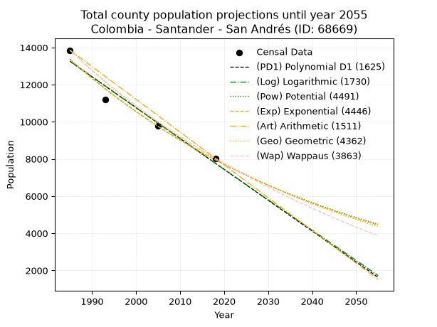
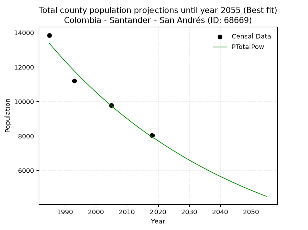
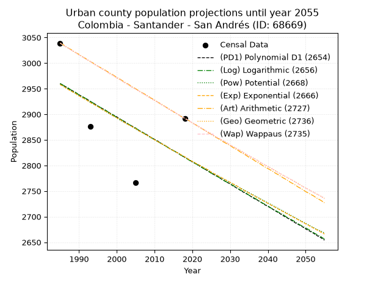
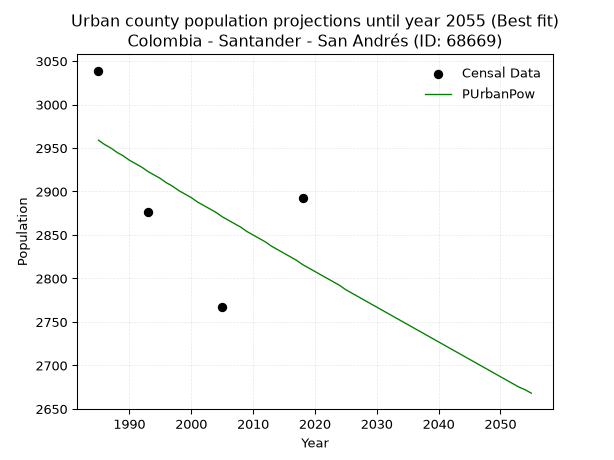
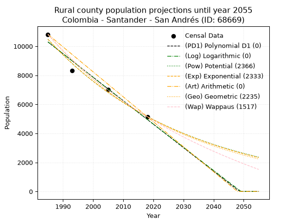
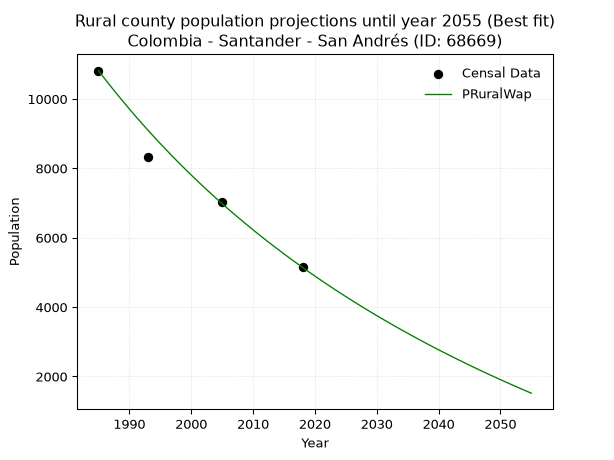

<div align="center">


</div>

# 📜 _“Population and Public Services Demand Projections (PPSD) until Year 2050 for Colombia - Santander - San Andrés (ID: 68669)”_
Keywords: `population` `public-service` `projection` `lineal` `polynomial` `logarithmic` `potential` `exponential` `arithmetic` `geometric` `wappaus` `dane` `colombia` `south-america`

PPSD are analytical estimates used by governments and planners to anticipate future changes in population size, age distribution, and the resulting community needs for utilities, healthcare, education, and infrastructure as sizing future water treatment facilities, electrical grids, and road networks based on spatial growth.

<div align="center">

</img>

</div>


> **General running parameters**: • app_version: _v20260806_. • Python version: _3.14.7_. • Pandas version: _3.0.5_. • NumPy version: _2.5.1_. • Creates, save and include plots into reports (create_plot): _False_. • Projection until year: _2050_. • Process polynomial degree 2 and up: _False_. • Process Wappaus: _True_. • Process Wappaus: _True_. • Set negative values to zero: _True_. • Set infinite values to zero: _True_. • Drop dataset notes: _True_. 
<div align="center">

Dynamic map: [:earth_americas:Google](http://maps.google.com/maps?q=6.811510897,-72.8488643) [:earth_americas:OSM](https://www.openstreetmap.org/#map=18/6.811510897/-72.8488643&layers=P) [:earth_americas:Bing](https://www.bing.com/maps?cp=6.811510897~-72.8488643&lvl=18) [:earth_americas:Apple](https://maps.apple.com/frame?center=6.811510897%2C-72.8488643&span=0.003%2C0.006)

</div>


<div align="center">

```geojson
{
  "type": "Feature",
  "geometry": {
    "type": "Point", 
    "coordinates": [-72.8488643, 6.811510897]
  }, 
  "properties": {
    "Name": "Colombia - Santander - San Andrés (ID: 68669)"
  }
}
```

</div>


## 0. Census Data (4 records)

Census data are official statistics collected by a government about the people and housing in a country. They usually include counts of total population, age, sex, race, income, education, and jobs.

📅Global census file: [Population.xlsx](../data/Population.xlsx)

| Source   |   Year |   CountryID | CountryName   |   StateID | StateName   |   CountyID | CountyName   |   PTotal |   PUrban |   PRural |
|:---------|-------:|------------:|:--------------|----------:|:------------|-----------:|:-------------|---------:|---------:|---------:|
| DANE     |   1985 |          57 | Colombia      |        68 | Santander   |      68669 | San Andrés   |    13854 |     3039 |    10815 |
| DANE     |   1993 |          57 | Colombia      |        68 | Santander   |      68669 | San Andrés   |    11211 |     2876 |     8335 |
| DANE     |   2005 |          57 | Colombia      |        68 | Santander   |      68669 | San Andrés   |     9783 |     2767 |     7016 |
| DANE     |   2018 |          57 | Colombia      |        68 | Santander   |      68669 | San Andrés   |     8035 |     2892 |     5143 |

> 🔥Some records could had specific notes about the registered values or the corresponding urban or rural distribution.

📅[SUI-RUPS](https://www.datos.gov.co/Hacienda-y-Cr-dito-P-blico/Registro-nico-de-Prestadores-de-Servicios-P-blicos/4qkq-csdn/about_data) - Local public utility companies: [RUPS.csv](../data/RUPS.xlsx)

 | SERVICIO       | ESTADO    | NOMBRE                                               | NIT         | DEPARTAMENTO_DOMICILIO   | MUNICIPIO_DOMICILIO   | DIRECCION        |   TELEFONO | EMAIL                           | TIPO_PRESTADOR                 | CLASIFICACION                 |
|:---------------|:----------|:-----------------------------------------------------|:------------|:-------------------------|:----------------------|:-----------------|-----------:|:--------------------------------|:-------------------------------|:------------------------------|
| ACUEDUCTO      | OPERATIVA | UNIDAD DE SERVICIOS PUBLICOS DE SAN ANDRES SANTANDER | 890207022-1 | SANTANDER                | SAN ANDRES            | calle 6 No 4 -07 |    6624216 | uspd@sanandres-santander.gov.co | MUNICIPIO (PRESTACIÓN DIRECTA) | MENOR O IGUAL A 2500 USUARIOS |
| ALCANTARILLADO | OPERATIVA | UNIDAD DE SERVICIOS PUBLICOS DE SAN ANDRES SANTANDER | 890207022-1 | SANTANDER                | SAN ANDRES            | calle 6 No 4 -07 |    6624216 | uspd@sanandres-santander.gov.co | MUNICIPIO (PRESTACIÓN DIRECTA) | MENOR O IGUAL A 2500 USUARIOS |

## 1. Total

### 1.1. Coefficients and Parameters

* (PD1) Polynomial Deg 1: -166.1384985949406, 343039.2818145299 (lineal)
* (Log) Logarithmic: -332692.2988981011, 2539517.5799532323
* (Pow) Potential: -31.466349408519026, 107.89447508385129
* (Exp) Exponential: -0.01571674317346996, 4.7289580209198714e+17
* (Art) Arithmetic: Year diff. 2018 - 1985 = 33, Population diff. 8035 - 13854 = -5819, Annual growth = -176.33333333333334
* (Geo) Geometric: Year diff. 2018 - 1985 = 33, Population diff. 8035 - 13854 = -5819, Annual growth % = -0.016372579093813955
* (Wap) Wappaus: i = -1.6111593342165775, Condition values only valid for < 200)

<sub>
Wappaus condition values: ['-0.00', '-1.61', '-3.22', '-4.83', '-6.44', '-8.06', '-9.67', '-11.28', '-12.89', '-14.50', '-16.11', '-17.72', '-19.33', '-20.95', '-22.56', '-24.17', '-25.78', '-27.39', '-29.00', '-30.61', '-32.22', '-33.83', '-35.45', '-37.06', '-38.67', '-40.28', '-41.89', '-43.50', '-45.11', '-46.72', '-48.33', '-49.95', '-51.56', '-53.17', '-54.78', '-56.39', '-58.00', '-59.61', '-61.22', '-62.84', '-64.45', '-66.06', '-67.67', '-69.28', '-70.89', '-72.50', '-74.11', '-75.72', '-77.34', '-78.95', '-80.56', '-82.17', '-83.78', '-85.39', '-87.00', '-88.61', '-90.22', '-91.84', '-93.45', '-95.06', '-96.67', '-98.28', '-99.89', '-101.50', '-103.11', '-104.73']
</sub>


### 1.2. Projected Dataset

|   Year |   CountyID |   PTotalPD1 |   PTotalLog |   PTotalPow |   PTotalExp |   PTotalArt |   PTotalGeo |   PTotalWap |
|-------:|-----------:|------------:|------------:|------------:|------------:|------------:|------------:|------------:|
|   1985 |      68669 |       13254 |       13260 |       13366 |       13359 |       13854 |       13854 |       13854 |
|   1986 |      68669 |       13088 |       13093 |       13156 |       13150 |       13678 |       13627 |       13633 |
|   1987 |      68669 |       12922 |       12925 |       12949 |       12945 |       13501 |       13404 |       13415 |
|   1988 |      68669 |       12756 |       12758 |       12745 |       12743 |       13325 |       13185 |       13200 |
|   1989 |      68669 |       12590 |       12591 |       12545 |       12545 |       13149 |       12969 |       12989 |
|   1990 |      68669 |       12424 |       12424 |       12348 |       12349 |       12972 |       12756 |       12781 |
|   1991 |      68669 |       12258 |       12256 |       12155 |       12156 |       12796 |       12548 |       12576 |
|   1992 |      68669 |       12091 |       12089 |       11964 |       11967 |       12620 |       12342 |       12375 |
|   1993 |      68669 |       11925 |       11922 |       11777 |       11780 |       12443 |       12140 |       12176 |
|   1994 |      68669 |       11759 |       11755 |       11592 |       11597 |       12267 |       11941 |       11981 |
|   1995 |      68669 |       11593 |       11589 |       11411 |       11416 |       12091 |       11746 |       11788 |
|   1996 |      68669 |       11427 |       11422 |       11232 |       11238 |       11914 |       11553 |       11599 |
|   1997 |      68669 |       11261 |       11255 |       11057 |       11062 |       11738 |       11364 |       11412 |
|   1998 |      68669 |       11095 |       11089 |       10884 |       10890 |       11562 |       11178 |       11227 |
|   1999 |      68669 |       10928 |       10922 |       10714 |       10720 |       11385 |       10995 |       11046 |
|   2000 |      68669 |       10762 |       10756 |       10547 |       10553 |       11209 |       10815 |       10867 |
|   2001 |      68669 |       10596 |       10590 |       10382 |       10388 |       11033 |       10638 |       10690 |
|   2002 |      68669 |       10430 |       10423 |       10220 |       10226 |       10856 |       10464 |       10516 |
|   2003 |      68669 |       10264 |       10257 |       10061 |       10067 |       10680 |       10293 |       10345 |
|   2004 |      68669 |       10098 |       10091 |        9904 |        9910 |       10504 |       10124 |       10176 |
|   2005 |      68669 |        9932 |        9925 |        9750 |        9755 |       10327 |        9958 |       10009 |
|   2006 |      68669 |        9765 |        9759 |        9598 |        9603 |       10151 |        9795 |        9845 |
|   2007 |      68669 |        9599 |        9593 |        9449 |        9454 |        9975 |        9635 |        9683 |
|   2008 |      68669 |        9433 |        9428 |        9302 |        9306 |        9798 |        9477 |        9523 |
|   2009 |      68669 |        9267 |        9262 |        9157 |        9161 |        9622 |        9322 |        9365 |
|   2010 |      68669 |        9101 |        9097 |        9015 |        9018 |        9446 |        9169 |        9209 |
|   2011 |      68669 |        8935 |        8931 |        8875 |        8878 |        9269 |        9019 |        9056 |
|   2012 |      68669 |        8769 |        8766 |        8737 |        8739 |        9093 |        8872 |        8904 |
|   2013 |      68669 |        8602 |        8600 |        8601 |        8603 |        8917 |        8726 |        8754 |
|   2014 |      68669 |        8436 |        8435 |        8468 |        8469 |        8740 |        8583 |        8607 |
|   2015 |      68669 |        8270 |        8270 |        8337 |        8337 |        8564 |        8443 |        8461 |
|   2016 |      68669 |        8104 |        8105 |        8208 |        8207 |        8388 |        8305 |        8317 |
|   2017 |      68669 |        7938 |        7940 |        8081 |        8079 |        8211 |        8169 |        8175 |
|   2018 |      68669 |        7772 |        7775 |        7956 |        7953 |        8035 |        8035 |        8035 |
|   2019 |      68669 |        7606 |        7610 |        7833 |        7829 |        7859 |        7903 |        7897 |
|   2020 |      68669 |        7440 |        7445 |        7711 |        7707 |        7682 |        7774 |        7760 |
|   2021 |      68669 |        7273 |        7281 |        7592 |        7586 |        7506 |        7647 |        7625 |
|   2022 |      68669 |        7107 |        7116 |        7475 |        7468 |        7330 |        7522 |        7492 |
|   2023 |      68669 |        6941 |        6952 |        7360 |        7352 |        7153 |        7398 |        7360 |
|   2024 |      68669 |        6775 |        6787 |        7246 |        7237 |        6977 |        7277 |        7230 |
|   2025 |      68669 |        6609 |        6623 |        7134 |        7124 |        6801 |        7158 |        7101 |
|   2026 |      68669 |        6443 |        6459 |        7024 |        7013 |        6624 |        7041 |        6975 |
|   2027 |      68669 |        6277 |        6295 |        6916 |        6904 |        6448 |        6926 |        6849 |
|   2028 |      68669 |        6110 |        6130 |        6810 |        6796 |        6272 |        6812 |        6725 |
|   2029 |      68669 |        5944 |        5966 |        6705 |        6690 |        6095 |        6701 |        6603 |
|   2030 |      68669 |        5778 |        5803 |        6602 |        6586 |        5919 |        6591 |        6482 |
|   2031 |      68669 |        5612 |        5639 |        6500 |        6483 |        5743 |        6483 |        6362 |
|   2032 |      68669 |        5446 |        5475 |        6400 |        6382 |        5566 |        6377 |        6244 |
|   2033 |      68669 |        5280 |        5311 |        6302 |        6282 |        5390 |        6273 |        6128 |
|   2034 |      68669 |        5114 |        5148 |        6205 |        6184 |        5214 |        6170 |        6012 |
|   2035 |      68669 |        4947 |        4984 |        6110 |        6088 |        5037 |        6069 |        5898 |
|   2036 |      68669 |        4781 |        4821 |        6016 |        5993 |        4861 |        5969 |        5785 |
|   2037 |      68669 |        4615 |        4657 |        5924 |        5900 |        4685 |        5872 |        5674 |
|   2038 |      68669 |        4449 |        4494 |        5833 |        5808 |        4508 |        5776 |        5564 |
|   2039 |      68669 |        4283 |        4331 |        5744 |        5717 |        4332 |        5681 |        5455 |
|   2040 |      68669 |        4117 |        4168 |        5656 |        5628 |        4156 |        5588 |        5347 |
|   2041 |      68669 |        3951 |        4005 |        5569 |        5540 |        3979 |        5497 |        5240 |
|   2042 |      68669 |        3784 |        3842 |        5484 |        5454 |        3803 |        5407 |        5135 |
|   2043 |      68669 |        3618 |        3679 |        5400 |        5369 |        3627 |        5318 |        5030 |
|   2044 |      68669 |        3452 |        3516 |        5318 |        5285 |        3450 |        5231 |        4927 |
|   2045 |      68669 |        3286 |        3353 |        5237 |        5203 |        3274 |        5145 |        4825 |
|   2046 |      68669 |        3120 |        3191 |        5157 |        5121 |        3098 |        5061 |        4724 |
|   2047 |      68669 |        2954 |        3028 |        5078 |        5042 |        2921 |        4978 |        4625 |
|   2048 |      68669 |        2788 |        2866 |        5000 |        4963 |        2745 |        4897 |        4526 |
|   2049 |      68669 |        2621 |        2703 |        4924 |        4886 |        2569 |        4817 |        4428 |
|   2050 |      68669 |        2455 |        2541 |        4849 |        4809 |        2392 |        4738 |        4332 |
<div align="center">

</img>

</div>


### 1.3. Best fit with absolute and relative error (%)

Relative error puts that difference into context by dividing the absolute error by the true value, creating a unitless ratio or percentage that shows the scale of the mistake.

Absolute and relative error

|   Year | Source   |   CountryID | CountryName   |   StateID | StateName   |   CountyID_x | CountyName   |   PTotal |   PUrban |   PRural |   CountyID_y |   PTotalPD1 |   PTotalLog |   PTotalPow |   PTotalExp |   PTotalArt |   PTotalGeo |   PTotalWap |   PTotalPD1AbsError |   PTotalLogAbsError |   PTotalPowAbsError |   PTotalExpAbsError |   PTotalArtAbsError |   PTotalGeoAbsError |   PTotalWapAbsError |   PTotalPD1RelError |   PTotalLogRelError |   PTotalPowRelError |   PTotalExpRelError |   PTotalArtRelError |   PTotalGeoRelError |   PTotalWapRelError |
|-------:|:---------|------------:|:--------------|----------:|:------------|-------------:|:-------------|---------:|---------:|---------:|-------------:|------------:|------------:|------------:|------------:|------------:|------------:|------------:|--------------------:|--------------------:|--------------------:|--------------------:|--------------------:|--------------------:|--------------------:|--------------------:|--------------------:|--------------------:|--------------------:|--------------------:|--------------------:|--------------------:|
|   1985 | DANE     |          57 | Colombia      |        68 | Santander   |        68669 | San Andrés   |    13854 |     3039 |    10815 |        68669 |       13254 |       13260 |       13366 |       13359 |       13854 |       13854 |       13854 |                 600 |                 594 |                 488 |                 495 |                   0 |                   0 |                   0 |             4.33088 |             4.28757 |            3.52245  |            3.57298  |             0       |             0       |             0       |
|   1993 | DANE     |          57 | Colombia      |        68 | Santander   |        68669 | San Andrés   |    11211 |     2876 |     8335 |        68669 |       11925 |       11922 |       11777 |       11780 |       12443 |       12140 |       12176 |                 714 |                 711 |                 566 |                 569 |                1232 |                 929 |                 965 |             6.36874 |             6.34199 |            5.04861  |            5.07537  |            10.9892  |             8.2865  |             8.60762 |
|   2005 | DANE     |          57 | Colombia      |        68 | Santander   |        68669 | San Andrés   |     9783 |     2767 |     7016 |        68669 |        9932 |        9925 |        9750 |        9755 |       10327 |        9958 |       10009 |                 149 |                 142 |                  33 |                  28 |                 544 |                 175 |                 226 |             1.52305 |             1.4515  |            0.33732  |            0.286211 |             5.56067 |             1.78882 |             2.31013 |
|   2018 | DANE     |          57 | Colombia      |        68 | Santander   |        68669 | San Andrés   |     8035 |     2892 |     5143 |        68669 |        7772 |        7775 |        7956 |        7953 |        8035 |        8035 |        8035 |                 263 |                 260 |                  79 |                  82 |                   0 |                   0 |                   0 |             3.27318 |             3.23584 |            0.983199 |            1.02054  |             0       |             0       |             0       |

Relative error mean

| Method    |   RelError | Best   |
|:----------|-----------:|:-------|
| PTotalPD1 |    3.87396 |        |
| PTotalLog |    3.82922 |        |
| PTotalPow |    2.47289 | True   |
| PTotalExp |    2.48877 |        |
| PTotalArt |    4.13747 |        |
| PTotalGeo |    2.51883 |        |
| PTotalWap |    2.72944 |        |

💙Best method: _**PTotalPow**_
<div align="center">

</img>

</div>


### 1.4. Fresh water supply demand in liters per capita per day (lpcd)

The fresh water supply demand typically ranges from 100 to 300 liters per capita per day (lpcd) for standard domestic and municipal planning, though absolute survival minimums set by the World Health Organization are as low as 7.5 to 20 liters per day, and total consumption in high-income nations can exceed 400 liters.

> `CZ`: Level in meters above the sea level (masl)<br> `WS`: Fresh water supply demand in liters per capita per day (lpcd or l/h/d)<br> `WSAll`: Zonal fresh water supply demand in liters per second (l/s)<br> `A`: Zonal area in square meters<br> `DP`: Population density (people/hectare or p/ha)

Reference values (RAS Colombia)

|    CZ |   WS |
|------:|-----:|
|  1000 |  120 |
|  2000 |  130 |
| 99999 |  140 |

County shapefile geometry properties and water supply values

|   CountyID |      ATotal |   CZTotal |   WSTotal |
|-----------:|------------:|----------:|----------:|
|      68669 | 2.80976e+08 |   2556.16 |       140 |

Projected values for best method: PTotalPow

|   CountyID |   Year |   PTotalPow |   DPTotal |   WSTotal |   WSTotalAll |
|-----------:|-------:|------------:|----------:|----------:|-------------:|
|      68669 |   1985 |       13366 |      0.48 |       140 |     21.6579  |
|      68669 |   1986 |       13156 |      0.47 |       140 |     21.3176  |
|      68669 |   1987 |       12949 |      0.46 |       140 |     20.9822  |
|      68669 |   1988 |       12745 |      0.45 |       140 |     20.6516  |
|      68669 |   1989 |       12545 |      0.45 |       140 |     20.3275  |
|      68669 |   1990 |       12348 |      0.44 |       140 |     20.0083  |
|      68669 |   1991 |       12155 |      0.43 |       140 |     19.6956  |
|      68669 |   1992 |       11964 |      0.43 |       140 |     19.3861  |
|      68669 |   1993 |       11777 |      0.42 |       140 |     19.0831  |
|      68669 |   1994 |       11592 |      0.41 |       140 |     18.7833  |
|      68669 |   1995 |       11411 |      0.41 |       140 |     18.49    |
|      68669 |   1996 |       11232 |      0.4  |       140 |     18.2     |
|      68669 |   1997 |       11057 |      0.39 |       140 |     17.9164  |
|      68669 |   1998 |       10884 |      0.39 |       140 |     17.6361  |
|      68669 |   1999 |       10714 |      0.38 |       140 |     17.3606  |
|      68669 |   2000 |       10547 |      0.38 |       140 |     17.09    |
|      68669 |   2001 |       10382 |      0.37 |       140 |     16.8227  |
|      68669 |   2002 |       10220 |      0.36 |       140 |     16.5602  |
|      68669 |   2003 |       10061 |      0.36 |       140 |     16.3025  |
|      68669 |   2004 |        9904 |      0.35 |       140 |     16.0481  |
|      68669 |   2005 |        9750 |      0.35 |       140 |     15.7986  |
|      68669 |   2006 |        9598 |      0.34 |       140 |     15.5523  |
|      68669 |   2007 |        9449 |      0.34 |       140 |     15.3109  |
|      68669 |   2008 |        9302 |      0.33 |       140 |     15.0727  |
|      68669 |   2009 |        9157 |      0.33 |       140 |     14.8377  |
|      68669 |   2010 |        9015 |      0.32 |       140 |     14.6076  |
|      68669 |   2011 |        8875 |      0.32 |       140 |     14.3808  |
|      68669 |   2012 |        8737 |      0.31 |       140 |     14.1572  |
|      68669 |   2013 |        8601 |      0.31 |       140 |     13.9368  |
|      68669 |   2014 |        8468 |      0.3  |       140 |     13.7213  |
|      68669 |   2015 |        8337 |      0.3  |       140 |     13.509   |
|      68669 |   2016 |        8208 |      0.29 |       140 |     13.3     |
|      68669 |   2017 |        8081 |      0.29 |       140 |     13.0942  |
|      68669 |   2018 |        7956 |      0.28 |       140 |     12.8917  |
|      68669 |   2019 |        7833 |      0.28 |       140 |     12.6924  |
|      68669 |   2020 |        7711 |      0.27 |       140 |     12.4947  |
|      68669 |   2021 |        7592 |      0.27 |       140 |     12.3019  |
|      68669 |   2022 |        7475 |      0.27 |       140 |     12.1123  |
|      68669 |   2023 |        7360 |      0.26 |       140 |     11.9259  |
|      68669 |   2024 |        7246 |      0.26 |       140 |     11.7412  |
|      68669 |   2025 |        7134 |      0.25 |       140 |     11.5597  |
|      68669 |   2026 |        7024 |      0.25 |       140 |     11.3815  |
|      68669 |   2027 |        6916 |      0.25 |       140 |     11.2065  |
|      68669 |   2028 |        6810 |      0.24 |       140 |     11.0347  |
|      68669 |   2029 |        6705 |      0.24 |       140 |     10.8646  |
|      68669 |   2030 |        6602 |      0.23 |       140 |     10.6977  |
|      68669 |   2031 |        6500 |      0.23 |       140 |     10.5324  |
|      68669 |   2032 |        6400 |      0.23 |       140 |     10.3704  |
|      68669 |   2033 |        6302 |      0.22 |       140 |     10.2116  |
|      68669 |   2034 |        6205 |      0.22 |       140 |     10.0544  |
|      68669 |   2035 |        6110 |      0.22 |       140 |      9.90046 |
|      68669 |   2036 |        6016 |      0.21 |       140 |      9.74815 |
|      68669 |   2037 |        5924 |      0.21 |       140 |      9.59907 |
|      68669 |   2038 |        5833 |      0.21 |       140 |      9.45162 |
|      68669 |   2039 |        5744 |      0.2  |       140 |      9.30741 |
|      68669 |   2040 |        5656 |      0.2  |       140 |      9.16481 |
|      68669 |   2041 |        5569 |      0.2  |       140 |      9.02384 |
|      68669 |   2042 |        5484 |      0.2  |       140 |      8.88611 |
|      68669 |   2043 |        5400 |      0.19 |       140 |      8.75    |
|      68669 |   2044 |        5318 |      0.19 |       140 |      8.61713 |
|      68669 |   2045 |        5237 |      0.19 |       140 |      8.48588 |
|      68669 |   2046 |        5157 |      0.18 |       140 |      8.35625 |
|      68669 |   2047 |        5078 |      0.18 |       140 |      8.22824 |
|      68669 |   2048 |        5000 |      0.18 |       140 |      8.10185 |
|      68669 |   2049 |        4924 |      0.18 |       140 |      7.9787  |
|      68669 |   2050 |        4849 |      0.17 |       140 |      7.85718 |

## 2. Urban

### 2.1. Coefficients and Parameters

* (PD1) Polynomial Deg 1: -4.3669209152951245, 11628.433560819074 (lineal)
* (Log) Logarithmic: -8770.89223362281, 69561.12215328628
* (Pow) Potential: -2.985879451733603, 13.31779626819138
* (Exp) Exponential: -0.0014865564775494301, 56565.249710335986
* (Art) Arithmetic: Year diff. 2018 - 1985 = 33, Population diff. 2892 - 3039 = -147, Annual growth = -4.454545454545454
* (Geo) Geometric: Year diff. 2018 - 1985 = 33, Population diff. 2892 - 3039 = -147, Annual growth % = -0.0015013025112751155
* (Wap) Wappaus: i = -0.15021228981775264, Condition values only valid for < 200)

<sub>
Wappaus condition values: ['-0.00', '-0.15', '-0.30', '-0.45', '-0.60', '-0.75', '-0.90', '-1.05', '-1.20', '-1.35', '-1.50', '-1.65', '-1.80', '-1.95', '-2.10', '-2.25', '-2.40', '-2.55', '-2.70', '-2.85', '-3.00', '-3.15', '-3.30', '-3.45', '-3.61', '-3.76', '-3.91', '-4.06', '-4.21', '-4.36', '-4.51', '-4.66', '-4.81', '-4.96', '-5.11', '-5.26', '-5.41', '-5.56', '-5.71', '-5.86', '-6.01', '-6.16', '-6.31', '-6.46', '-6.61', '-6.76', '-6.91', '-7.06', '-7.21', '-7.36', '-7.51', '-7.66', '-7.81', '-7.96', '-8.11', '-8.26', '-8.41', '-8.56', '-8.71', '-8.86', '-9.01', '-9.16', '-9.31', '-9.46', '-9.61', '-9.76']
</sub>


### 2.2. Projected Dataset

|   Year |   CountyID |   PUrbanPD1 |   PUrbanLog |   PUrbanPow |   PUrbanExp |   PUrbanArt |   PUrbanGeo |   PUrbanWap |
|-------:|-----------:|------------:|------------:|------------:|------------:|------------:|------------:|------------:|
|   1985 |      68669 |        2960 |        2960 |        2959 |        2958 |        3039 |        3039 |        3039 |
|   1986 |      68669 |        2956 |        2956 |        2954 |        2954 |        3035 |        3034 |        3034 |
|   1987 |      68669 |        2951 |        2952 |        2950 |        2949 |        3030 |        3030 |        3030 |
|   1988 |      68669 |        2947 |        2947 |        2945 |        2945 |        3026 |        3025 |        3025 |
|   1989 |      68669 |        2943 |        2943 |        2941 |        2941 |        3021 |        3021 |        3021 |
|   1990 |      68669 |        2938 |        2938 |        2936 |        2936 |        3017 |        3016 |        3016 |
|   1991 |      68669 |        2934 |        2934 |        2932 |        2932 |        3012 |        3012 |        3012 |
|   1992 |      68669 |        2930 |        2930 |        2928 |        2928 |        3008 |        3007 |        3007 |
|   1993 |      68669 |        2925 |        2925 |        2923 |        2923 |        3003 |        3003 |        3003 |
|   1994 |      68669 |        2921 |        2921 |        2919 |        2919 |        2999 |        2998 |        2998 |
|   1995 |      68669 |        2916 |        2916 |        2915 |        2915 |        2994 |        2994 |        2994 |
|   1996 |      68669 |        2912 |        2912 |        2910 |        2910 |        2990 |        2989 |        2989 |
|   1997 |      68669 |        2908 |        2908 |        2906 |        2906 |        2986 |        2985 |        2985 |
|   1998 |      68669 |        2903 |        2903 |        2901 |        2902 |        2981 |        2980 |        2980 |
|   1999 |      68669 |        2899 |        2899 |        2897 |        2897 |        2977 |        2976 |        2976 |
|   2000 |      68669 |        2895 |        2894 |        2893 |        2893 |        2972 |        2971 |        2971 |
|   2001 |      68669 |        2890 |        2890 |        2888 |        2889 |        2968 |        2967 |        2967 |
|   2002 |      68669 |        2886 |        2886 |        2884 |        2884 |        2963 |        2962 |        2962 |
|   2003 |      68669 |        2881 |        2881 |        2880 |        2880 |        2959 |        2958 |        2958 |
|   2004 |      68669 |        2877 |        2877 |        2876 |        2876 |        2954 |        2953 |        2953 |
|   2005 |      68669 |        2873 |        2873 |        2871 |        2872 |        2950 |        2949 |        2949 |
|   2006 |      68669 |        2868 |        2868 |        2867 |        2867 |        2945 |        2945 |        2945 |
|   2007 |      68669 |        2864 |        2864 |        2863 |        2863 |        2941 |        2940 |        2940 |
|   2008 |      68669 |        2860 |        2859 |        2859 |        2859 |        2937 |        2936 |        2936 |
|   2009 |      68669 |        2855 |        2855 |        2854 |        2855 |        2932 |        2931 |        2931 |
|   2010 |      68669 |        2851 |        2851 |        2850 |        2850 |        2928 |        2927 |        2927 |
|   2011 |      68669 |        2847 |        2846 |        2846 |        2846 |        2923 |        2923 |        2923 |
|   2012 |      68669 |        2842 |        2842 |        2842 |        2842 |        2919 |        2918 |        2918 |
|   2013 |      68669 |        2838 |        2838 |        2837 |        2838 |        2914 |        2914 |        2914 |
|   2014 |      68669 |        2833 |        2833 |        2833 |        2833 |        2910 |        2909 |        2909 |
|   2015 |      68669 |        2829 |        2829 |        2829 |        2829 |        2905 |        2905 |        2905 |
|   2016 |      68669 |        2825 |        2825 |        2825 |        2825 |        2901 |        2901 |        2901 |
|   2017 |      68669 |        2820 |        2820 |        2821 |        2821 |        2896 |        2896 |        2896 |
|   2018 |      68669 |        2816 |        2816 |        2816 |        2817 |        2892 |        2892 |        2892 |
|   2019 |      68669 |        2812 |        2811 |        2812 |        2812 |        2888 |        2888 |        2888 |
|   2020 |      68669 |        2807 |        2807 |        2808 |        2808 |        2883 |        2883 |        2883 |
|   2021 |      68669 |        2803 |        2803 |        2804 |        2804 |        2879 |        2879 |        2879 |
|   2022 |      68669 |        2799 |        2798 |        2800 |        2800 |        2874 |        2875 |        2875 |
|   2023 |      68669 |        2794 |        2794 |        2796 |        2796 |        2870 |        2870 |        2870 |
|   2024 |      68669 |        2790 |        2790 |        2792 |        2792 |        2865 |        2866 |        2866 |
|   2025 |      68669 |        2785 |        2785 |        2787 |        2787 |        2861 |        2862 |        2862 |
|   2026 |      68669 |        2781 |        2781 |        2783 |        2783 |        2856 |        2857 |        2857 |
|   2027 |      68669 |        2777 |        2777 |        2779 |        2779 |        2852 |        2853 |        2853 |
|   2028 |      68669 |        2772 |        2772 |        2775 |        2775 |        2847 |        2849 |        2849 |
|   2029 |      68669 |        2768 |        2768 |        2771 |        2771 |        2843 |        2845 |        2845 |
|   2030 |      68669 |        2764 |        2764 |        2767 |        2767 |        2839 |        2840 |        2840 |
|   2031 |      68669 |        2759 |        2760 |        2763 |        2763 |        2834 |        2836 |        2836 |
|   2032 |      68669 |        2755 |        2755 |        2759 |        2759 |        2830 |        2832 |        2832 |
|   2033 |      68669 |        2750 |        2751 |        2755 |        2754 |        2825 |        2828 |        2828 |
|   2034 |      68669 |        2746 |        2747 |        2751 |        2750 |        2821 |        2823 |        2823 |
|   2035 |      68669 |        2742 |        2742 |        2747 |        2746 |        2816 |        2819 |        2819 |
|   2036 |      68669 |        2737 |        2738 |        2743 |        2742 |        2812 |        2815 |        2815 |
|   2037 |      68669 |        2733 |        2734 |        2739 |        2738 |        2807 |        2811 |        2811 |
|   2038 |      68669 |        2729 |        2729 |        2735 |        2734 |        2803 |        2806 |        2806 |
|   2039 |      68669 |        2724 |        2725 |        2731 |        2730 |        2798 |        2802 |        2802 |
|   2040 |      68669 |        2720 |        2721 |        2727 |        2726 |        2794 |        2798 |        2798 |
|   2041 |      68669 |        2716 |        2716 |        2723 |        2722 |        2790 |        2794 |        2794 |
|   2042 |      68669 |        2711 |        2712 |        2719 |        2718 |        2785 |        2790 |        2789 |
|   2043 |      68669 |        2707 |        2708 |        2715 |        2714 |        2781 |        2785 |        2785 |
|   2044 |      68669 |        2702 |        2704 |        2711 |        2710 |        2776 |        2781 |        2781 |
|   2045 |      68669 |        2698 |        2699 |        2707 |        2706 |        2772 |        2777 |        2777 |
|   2046 |      68669 |        2694 |        2695 |        2703 |        2702 |        2767 |        2773 |        2773 |
|   2047 |      68669 |        2689 |        2691 |        2699 |        2698 |        2763 |        2769 |        2769 |
|   2048 |      68669 |        2685 |        2686 |        2695 |        2694 |        2758 |        2765 |        2764 |
|   2049 |      68669 |        2681 |        2682 |        2691 |        2690 |        2754 |        2760 |        2760 |
|   2050 |      68669 |        2676 |        2678 |        2687 |        2686 |        2749 |        2756 |        2756 |
<div align="center">

</img>

</div>


### 2.3. Best fit with absolute and relative error (%)

Relative error puts that difference into context by dividing the absolute error by the true value, creating a unitless ratio or percentage that shows the scale of the mistake.

Absolute and relative error

|   Year | Source   |   CountryID | CountryName   |   StateID | StateName   |   CountyID_x | CountyName   |   PTotal |   PUrban |   PRural |   CountyID_y |   PUrbanPD1 |   PUrbanLog |   PUrbanPow |   PUrbanExp |   PUrbanArt |   PUrbanGeo |   PUrbanWap |   PUrbanPD1AbsError |   PUrbanLogAbsError |   PUrbanPowAbsError |   PUrbanExpAbsError |   PUrbanArtAbsError |   PUrbanGeoAbsError |   PUrbanWapAbsError |   PUrbanPD1RelError |   PUrbanLogRelError |   PUrbanPowRelError |   PUrbanExpRelError |   PUrbanArtRelError |   PUrbanGeoRelError |   PUrbanWapRelError |
|-------:|:---------|------------:|:--------------|----------:|:------------|-------------:|:-------------|---------:|---------:|---------:|-------------:|------------:|------------:|------------:|------------:|------------:|------------:|------------:|--------------------:|--------------------:|--------------------:|--------------------:|--------------------:|--------------------:|--------------------:|--------------------:|--------------------:|--------------------:|--------------------:|--------------------:|--------------------:|--------------------:|
|   1985 | DANE     |          57 | Colombia      |        68 | Santander   |        68669 | San Andrés   |    13854 |     3039 |    10815 |        68669 |        2960 |        2960 |        2959 |        2958 |        3039 |        3039 |        3039 |                  79 |                  79 |                  80 |                  81 |                   0 |                   0 |                   0 |             2.59954 |             2.59954 |             2.63244 |             2.66535 |             0       |             0       |             0       |
|   1993 | DANE     |          57 | Colombia      |        68 | Santander   |        68669 | San Andrés   |    11211 |     2876 |     8335 |        68669 |        2925 |        2925 |        2923 |        2923 |        3003 |        3003 |        3003 |                  49 |                  49 |                  47 |                  47 |                 127 |                 127 |                 127 |             1.70376 |             1.70376 |             1.63421 |             1.63421 |             4.41586 |             4.41586 |             4.41586 |
|   2005 | DANE     |          57 | Colombia      |        68 | Santander   |        68669 | San Andrés   |     9783 |     2767 |     7016 |        68669 |        2873 |        2873 |        2871 |        2872 |        2950 |        2949 |        2949 |                 106 |                 106 |                 104 |                 105 |                 183 |                 182 |                 182 |             3.83086 |             3.83086 |             3.75858 |             3.79472 |             6.61366 |             6.57752 |             6.57752 |
|   2018 | DANE     |          57 | Colombia      |        68 | Santander   |        68669 | San Andrés   |     8035 |     2892 |     5143 |        68669 |        2816 |        2816 |        2816 |        2817 |        2892 |        2892 |        2892 |                  76 |                  76 |                  76 |                  75 |                   0 |                   0 |                   0 |             2.62794 |             2.62794 |             2.62794 |             2.59336 |             0       |             0       |             0       |

Relative error mean

| Method    |   RelError | Best   |
|:----------|-----------:|:-------|
| PUrbanPD1 |    2.69052 |        |
| PUrbanLog |    2.69052 |        |
| PUrbanPow |    2.6633  | True   |
| PUrbanExp |    2.67191 |        |
| PUrbanArt |    2.75738 |        |
| PUrbanGeo |    2.74834 |        |
| PUrbanWap |    2.74834 |        |

💙Best method: _**PUrbanPow**_
<div align="center">

</img>

</div>


### 2.4. Fresh water supply demand in liters per capita per day (lpcd)

The fresh water supply demand typically ranges from 100 to 300 liters per capita per day (lpcd) for standard domestic and municipal planning, though absolute survival minimums set by the World Health Organization are as low as 7.5 to 20 liters per day, and total consumption in high-income nations can exceed 400 liters.

> `CZ`: Level in meters above the sea level (masl)<br> `WS`: Fresh water supply demand in liters per capita per day (lpcd or l/h/d)<br> `WSAll`: Zonal fresh water supply demand in liters per second (l/s)<br> `A`: Zonal area in square meters<br> `DP`: Population density (people/hectare or p/ha)

Reference values (RAS Colombia)

|    CZ |   WS |
|------:|-----:|
|  1000 |  120 |
|  2000 |  130 |
| 99999 |  140 |

County shapefile geometry properties and water supply values

|   CountyID |   AUrban |   CZUrban |   WSUrban |
|-----------:|---------:|----------:|----------:|
|      68669 |   488312 |   1628.27 |       130 |

Projected values for best method: PUrbanPow

|   CountyID |   Year |   PUrbanPow |   DPUrban |   WSUrban |   WSUrbanAll |
|-----------:|-------:|------------:|----------:|----------:|-------------:|
|      68669 |   1985 |        2959 |     60.6  |       130 |      4.4522  |
|      68669 |   1986 |        2954 |     60.49 |       130 |      4.44468 |
|      68669 |   1987 |        2950 |     60.41 |       130 |      4.43866 |
|      68669 |   1988 |        2945 |     60.31 |       130 |      4.43113 |
|      68669 |   1989 |        2941 |     60.23 |       130 |      4.42512 |
|      68669 |   1990 |        2936 |     60.13 |       130 |      4.41759 |
|      68669 |   1991 |        2932 |     60.04 |       130 |      4.41157 |
|      68669 |   1992 |        2928 |     59.96 |       130 |      4.40556 |
|      68669 |   1993 |        2923 |     59.86 |       130 |      4.39803 |
|      68669 |   1994 |        2919 |     59.78 |       130 |      4.39201 |
|      68669 |   1995 |        2915 |     59.7  |       130 |      4.386   |
|      68669 |   1996 |        2910 |     59.59 |       130 |      4.37847 |
|      68669 |   1997 |        2906 |     59.51 |       130 |      4.37245 |
|      68669 |   1998 |        2901 |     59.41 |       130 |      4.36493 |
|      68669 |   1999 |        2897 |     59.33 |       130 |      4.35891 |
|      68669 |   2000 |        2893 |     59.24 |       130 |      4.35289 |
|      68669 |   2001 |        2888 |     59.14 |       130 |      4.34537 |
|      68669 |   2002 |        2884 |     59.06 |       130 |      4.33935 |
|      68669 |   2003 |        2880 |     58.98 |       130 |      4.33333 |
|      68669 |   2004 |        2876 |     58.9  |       130 |      4.32731 |
|      68669 |   2005 |        2871 |     58.79 |       130 |      4.31979 |
|      68669 |   2006 |        2867 |     58.71 |       130 |      4.31377 |
|      68669 |   2007 |        2863 |     58.63 |       130 |      4.30775 |
|      68669 |   2008 |        2859 |     58.55 |       130 |      4.30174 |
|      68669 |   2009 |        2854 |     58.45 |       130 |      4.29421 |
|      68669 |   2010 |        2850 |     58.36 |       130 |      4.28819 |
|      68669 |   2011 |        2846 |     58.28 |       130 |      4.28218 |
|      68669 |   2012 |        2842 |     58.2  |       130 |      4.27616 |
|      68669 |   2013 |        2837 |     58.1  |       130 |      4.26863 |
|      68669 |   2014 |        2833 |     58.02 |       130 |      4.26262 |
|      68669 |   2015 |        2829 |     57.93 |       130 |      4.2566  |
|      68669 |   2016 |        2825 |     57.85 |       130 |      4.25058 |
|      68669 |   2017 |        2821 |     57.77 |       130 |      4.24456 |
|      68669 |   2018 |        2816 |     57.67 |       130 |      4.23704 |
|      68669 |   2019 |        2812 |     57.59 |       130 |      4.23102 |
|      68669 |   2020 |        2808 |     57.5  |       130 |      4.225   |
|      68669 |   2021 |        2804 |     57.42 |       130 |      4.21898 |
|      68669 |   2022 |        2800 |     57.34 |       130 |      4.21296 |
|      68669 |   2023 |        2796 |     57.26 |       130 |      4.20694 |
|      68669 |   2024 |        2792 |     57.18 |       130 |      4.20093 |
|      68669 |   2025 |        2787 |     57.07 |       130 |      4.1934  |
|      68669 |   2026 |        2783 |     56.99 |       130 |      4.18738 |
|      68669 |   2027 |        2779 |     56.91 |       130 |      4.18137 |
|      68669 |   2028 |        2775 |     56.83 |       130 |      4.17535 |
|      68669 |   2029 |        2771 |     56.75 |       130 |      4.16933 |
|      68669 |   2030 |        2767 |     56.66 |       130 |      4.16331 |
|      68669 |   2031 |        2763 |     56.58 |       130 |      4.15729 |
|      68669 |   2032 |        2759 |     56.5  |       130 |      4.15127 |
|      68669 |   2033 |        2755 |     56.42 |       130 |      4.14525 |
|      68669 |   2034 |        2751 |     56.34 |       130 |      4.13924 |
|      68669 |   2035 |        2747 |     56.26 |       130 |      4.13322 |
|      68669 |   2036 |        2743 |     56.17 |       130 |      4.1272  |
|      68669 |   2037 |        2739 |     56.09 |       130 |      4.12118 |
|      68669 |   2038 |        2735 |     56.01 |       130 |      4.11516 |
|      68669 |   2039 |        2731 |     55.93 |       130 |      4.10914 |
|      68669 |   2040 |        2727 |     55.85 |       130 |      4.10313 |
|      68669 |   2041 |        2723 |     55.76 |       130 |      4.09711 |
|      68669 |   2042 |        2719 |     55.68 |       130 |      4.09109 |
|      68669 |   2043 |        2715 |     55.6  |       130 |      4.08507 |
|      68669 |   2044 |        2711 |     55.52 |       130 |      4.07905 |
|      68669 |   2045 |        2707 |     55.44 |       130 |      4.07303 |
|      68669 |   2046 |        2703 |     55.35 |       130 |      4.06701 |
|      68669 |   2047 |        2699 |     55.27 |       130 |      4.061   |
|      68669 |   2048 |        2695 |     55.19 |       130 |      4.05498 |
|      68669 |   2049 |        2691 |     55.11 |       130 |      4.04896 |
|      68669 |   2050 |        2687 |     55.03 |       130 |      4.04294 |

## 3. Rural

### 3.1. Coefficients and Parameters

* (PD1) Polynomial Deg 1: -161.77157767964542, 331410.8482537107 (lineal)
* (Log) Logarithmic: -323921.4066644784, 2469956.4577999464
* (Pow) Potential: -42.94654643608471, 145.64786628796315
* (Exp) Exponential: -0.021454255923312317, 3.275811069012638e+22
* (Art) Arithmetic: Year diff. 2018 - 1985 = 33, Population diff. 5143 - 10815 = -5672, Annual growth = -171.87878787878788
* (Geo) Geometric: Year diff. 2018 - 1985 = 33, Population diff. 5143 - 10815 = -5672, Annual growth % = -0.022272391290495852
* (Wap) Wappaus: i = -2.1541394645793694, Condition values only valid for < 200)

<sub>
Wappaus condition values: ['-0.00', '-2.15', '-4.31', '-6.46', '-8.62', '-10.77', '-12.92', '-15.08', '-17.23', '-19.39', '-21.54', '-23.70', '-25.85', '-28.00', '-30.16', '-32.31', '-34.47', '-36.62', '-38.77', '-40.93', '-43.08', '-45.24', '-47.39', '-49.55', '-51.70', '-53.85', '-56.01', '-58.16', '-60.32', '-62.47', '-64.62', '-66.78', '-68.93', '-71.09', '-73.24', '-75.39', '-77.55', '-79.70', '-81.86', '-84.01', '-86.17', '-88.32', '-90.47', '-92.63', '-94.78', '-96.94', '-99.09', '-101.24', '-103.40', '-105.55', '-107.71', '-109.86', '-112.02', '-114.17', '-116.32', '-118.48', '-120.63', '-122.79', '-124.94', '-127.09', '-129.25', '-131.40', '-133.56', '-135.71', '-137.86', '-140.02']
</sub>


### 3.2. Projected Dataset

|   Year |   CountyID |   PRuralPD1 |   PRuralLog |   PRuralPow |   PRuralExp |   PRuralArt |   PRuralGeo |   PRuralWap |
|-------:|-----------:|------------:|------------:|------------:|------------:|------------:|------------:|------------:|
|   1985 |      68669 |       10294 |       10300 |       10482 |       10475 |       10815 |       10815 |       10815 |
|   1986 |      68669 |       10132 |       10137 |       10258 |       10253 |       10643 |       10574 |       10585 |
|   1987 |      68669 |        9971 |        9974 |       10038 |       10035 |       10471 |       10339 |       10359 |
|   1988 |      68669 |        9809 |        9811 |        9824 |        9822 |       10299 |       10108 |       10138 |
|   1989 |      68669 |        9647 |        9648 |        9614 |        9613 |       10127 |        9883 |        9922 |
|   1990 |      68669 |        9485 |        9485 |        9408 |        9409 |        9956 |        9663 |        9710 |
|   1991 |      68669 |        9324 |        9322 |        9208 |        9210 |        9784 |        9448 |        9502 |
|   1992 |      68669 |        9162 |        9160 |        9011 |        9014 |        9612 |        9237 |        9299 |
|   1993 |      68669 |        9000 |        8997 |        8819 |        8823 |        9440 |        9032 |        9099 |
|   1994 |      68669 |        8838 |        8835 |        8631 |        8636 |        9268 |        8831 |        8904 |
|   1995 |      68669 |        8677 |        8672 |        8447 |        8452 |        9096 |        8634 |        8712 |
|   1996 |      68669 |        8515 |        8510 |        8267 |        8273 |        8924 |        8442 |        8524 |
|   1997 |      68669 |        8353 |        8348 |        8091 |        8097 |        8752 |        8254 |        8339 |
|   1998 |      68669 |        8191 |        8186 |        7919 |        7925 |        8581 |        8070 |        8158 |
|   1999 |      68669 |        8029 |        8023 |        7751 |        7757 |        8409 |        7890 |        7981 |
|   2000 |      68669 |        7868 |        7861 |        7586 |        7593 |        8237 |        7714 |        7807 |
|   2001 |      68669 |        7706 |        7700 |        7425 |        7431 |        8065 |        7542 |        7635 |
|   2002 |      68669 |        7544 |        7538 |        7268 |        7274 |        7893 |        7374 |        7467 |
|   2003 |      68669 |        7382 |        7376 |        7113 |        7119 |        7721 |        7210 |        7303 |
|   2004 |      68669 |        7221 |        7214 |        6962 |        6968 |        7549 |        7050 |        7141 |
|   2005 |      68669 |        7059 |        7053 |        6815 |        6820 |        7377 |        6893 |        6981 |
|   2006 |      68669 |        6897 |        6891 |        6670 |        6676 |        7206 |        6739 |        6825 |
|   2007 |      68669 |        6735 |        6730 |        6529 |        6534 |        7034 |        6589 |        6671 |
|   2008 |      68669 |        6574 |        6568 |        6391 |        6395 |        6862 |        6442 |        6521 |
|   2009 |      68669 |        6412 |        6407 |        6256 |        6259 |        6690 |        6299 |        6372 |
|   2010 |      68669 |        6250 |        6246 |        6124 |        6127 |        6518 |        6158 |        6226 |
|   2011 |      68669 |        6088 |        6085 |        5994 |        5996 |        6346 |        6021 |        6083 |
|   2012 |      68669 |        5926 |        5924 |        5868 |        5869 |        6174 |        5887 |        5942 |
|   2013 |      68669 |        5765 |        5763 |        5744 |        5745 |        6002 |        5756 |        5803 |
|   2014 |      68669 |        5603 |        5602 |        5622 |        5623 |        5831 |        5628 |        5667 |
|   2015 |      68669 |        5441 |        5441 |        5504 |        5503 |        5659 |        5503 |        5533 |
|   2016 |      68669 |        5279 |        5280 |        5388 |        5387 |        5487 |        5380 |        5401 |
|   2017 |      68669 |        5118 |        5120 |        5274 |        5272 |        5315 |        5260 |        5271 |
|   2018 |      68669 |        4956 |        4959 |        5163 |        5160 |        5143 |        5143 |        5143 |
|   2019 |      68669 |        4794 |        4799 |        5054 |        5051 |        4971 |        5028 |        5017 |
|   2020 |      68669 |        4632 |        4638 |        4948 |        4944 |        4799 |        4916 |        4893 |
|   2021 |      68669 |        4470 |        4478 |        4844 |        4839 |        4627 |        4807 |        4771 |
|   2022 |      68669 |        4309 |        4318 |        4742 |        4736 |        4455 |        4700 |        4651 |
|   2023 |      68669 |        4147 |        4158 |        4643 |        4635 |        4284 |        4595 |        4533 |
|   2024 |      68669 |        3985 |        3998 |        4545 |        4537 |        4112 |        4493 |        4417 |
|   2025 |      68669 |        3823 |        3838 |        4450 |        4441 |        3940 |        4393 |        4302 |
|   2026 |      68669 |        3662 |        3678 |        4356 |        4346 |        3768 |        4295 |        4189 |
|   2027 |      68669 |        3500 |        3518 |        4265 |        4254 |        3596 |        4199 |        4078 |
|   2028 |      68669 |        3338 |        3358 |        4176 |        4164 |        3424 |        4106 |        3968 |
|   2029 |      68669 |        3176 |        3198 |        4088 |        4076 |        3252 |        4014 |        3860 |
|   2030 |      68669 |        3015 |        3039 |        4003 |        3989 |        3080 |        3925 |        3754 |
|   2031 |      68669 |        2853 |        2879 |        3919 |        3904 |        2909 |        3838 |        3649 |
|   2032 |      68669 |        2691 |        2720 |        3837 |        3821 |        2737 |        3752 |        3545 |
|   2033 |      68669 |        2529 |        2560 |        3757 |        3740 |        2565 |        3668 |        3443 |
|   2034 |      68669 |        2367 |        2401 |        3678 |        3661 |        2393 |        3587 |        3343 |
|   2035 |      68669 |        2206 |        2242 |        3601 |        3583 |        2221 |        3507 |        3244 |
|   2036 |      68669 |        2044 |        2083 |        3526 |        3507 |        2049 |        3429 |        3146 |
|   2037 |      68669 |        1882 |        1924 |        3452 |        3433 |        1877 |        3352 |        3050 |
|   2038 |      68669 |        1720 |        1765 |        3380 |        3360 |        1705 |        3278 |        2955 |
|   2039 |      68669 |        1559 |        1606 |        3310 |        3289 |        1534 |        3205 |        2861 |
|   2040 |      68669 |        1397 |        1447 |        3241 |        3219 |        1362 |        3133 |        2768 |
|   2041 |      68669 |        1235 |        1288 |        3174 |        3150 |        1190 |        3064 |        2677 |
|   2042 |      68669 |        1073 |        1130 |        3107 |        3084 |        1018 |        2995 |        2587 |
|   2043 |      68669 |         912 |         971 |        3043 |        3018 |         846 |        2929 |        2498 |
|   2044 |      68669 |         750 |         812 |        2980 |        2954 |         674 |        2863 |        2411 |
|   2045 |      68669 |         588 |         654 |        2918 |        2891 |         502 |        2800 |        2324 |
|   2046 |      68669 |         426 |         496 |        2857 |        2830 |         330 |        2737 |        2239 |
|   2047 |      68669 |         264 |         337 |        2798 |        2770 |         159 |        2676 |        2154 |
|   2048 |      68669 |         103 |         179 |        2740 |        2711 |           0 |        2617 |        2071 |
|   2049 |      68669 |           0 |          21 |        2683 |        2654 |           0 |        2558 |        1989 |
|   2050 |      68669 |           0 |           0 |        2627 |        2597 |           0 |        2501 |        1908 |
<div align="center">

</img>

</div>


### 3.3. Best fit with absolute and relative error (%)

Relative error puts that difference into context by dividing the absolute error by the true value, creating a unitless ratio or percentage that shows the scale of the mistake.

Absolute and relative error

|   Year | Source   |   CountryID | CountryName   |   StateID | StateName   |   CountyID_x | CountyName   |   PTotal |   PUrban |   PRural |   CountyID_y |   PRuralPD1 |   PRuralLog |   PRuralPow |   PRuralExp |   PRuralArt |   PRuralGeo |   PRuralWap |   PRuralPD1AbsError |   PRuralLogAbsError |   PRuralPowAbsError |   PRuralExpAbsError |   PRuralArtAbsError |   PRuralGeoAbsError |   PRuralWapAbsError |   PRuralPD1RelError |   PRuralLogRelError |   PRuralPowRelError |   PRuralExpRelError |   PRuralArtRelError |   PRuralGeoRelError |   PRuralWapRelError |
|-------:|:---------|------------:|:--------------|----------:|:------------|-------------:|:-------------|---------:|---------:|---------:|-------------:|------------:|------------:|------------:|------------:|------------:|------------:|------------:|--------------------:|--------------------:|--------------------:|--------------------:|--------------------:|--------------------:|--------------------:|--------------------:|--------------------:|--------------------:|--------------------:|--------------------:|--------------------:|--------------------:|
|   1985 | DANE     |          57 | Colombia      |        68 | Santander   |        68669 | San Andrés   |    13854 |     3039 |    10815 |        68669 |       10294 |       10300 |       10482 |       10475 |       10815 |       10815 |       10815 |                 521 |                 515 |                 333 |                 340 |                   0 |                   0 |                   0 |            4.81738  |            4.7619   |            3.07906  |            3.14378  |             0       |             0       |             0       |
|   1993 | DANE     |          57 | Colombia      |        68 | Santander   |        68669 | San Andrés   |    11211 |     2876 |     8335 |        68669 |        9000 |        8997 |        8819 |        8823 |        9440 |        9032 |        9099 |                 665 |                 662 |                 484 |                 488 |                1105 |                 697 |                 764 |            7.9784   |            7.94241  |            5.80684  |            5.85483  |            13.2573  |             8.36233 |             9.16617 |
|   2005 | DANE     |          57 | Colombia      |        68 | Santander   |        68669 | San Andrés   |     9783 |     2767 |     7016 |        68669 |        7059 |        7053 |        6815 |        6820 |        7377 |        6893 |        6981 |                  43 |                  37 |                 201 |                 196 |                 361 |                 123 |                  35 |            0.612885 |            0.527366 |            2.86488  |            2.79361  |             5.14538 |             1.75314 |             0.49886 |
|   2018 | DANE     |          57 | Colombia      |        68 | Santander   |        68669 | San Andrés   |     8035 |     2892 |     5143 |        68669 |        4956 |        4959 |        5163 |        5160 |        5143 |        5143 |        5143 |                 187 |                 184 |                  20 |                  17 |                   0 |                   0 |                   0 |            3.63601  |            3.57768  |            0.388878 |            0.330546 |             0       |             0       |             0       |

Relative error mean

| Method    |   RelError | Best   |
|:----------|-----------:|:-------|
| PRuralPD1 |    4.26117 |        |
| PRuralLog |    4.20234 |        |
| PRuralPow |    3.03491 |        |
| PRuralExp |    3.03069 |        |
| PRuralArt |    4.60068 |        |
| PRuralGeo |    2.52887 |        |
| PRuralWap |    2.41626 | True   |

💙Best method: _**PRuralWap**_
<div align="center">

</img>

</div>


### 3.4. Fresh water supply demand in liters per capita per day (lpcd)

The fresh water supply demand typically ranges from 100 to 300 liters per capita per day (lpcd) for standard domestic and municipal planning, though absolute survival minimums set by the World Health Organization are as low as 7.5 to 20 liters per day, and total consumption in high-income nations can exceed 400 liters.

> `CZ`: Level in meters above the sea level (masl)<br> `WS`: Fresh water supply demand in liters per capita per day (lpcd or l/h/d)<br> `WSAll`: Zonal fresh water supply demand in liters per second (l/s)<br> `A`: Zonal area in square meters<br> `DP`: Population density (people/hectare or p/ha)

Reference values (RAS Colombia)

|    CZ |   WS |
|------:|-----:|
|  1000 |  120 |
|  2000 |  130 |
| 99999 |  140 |

County shapefile geometry properties and water supply values

|   CountyID |      ARural |   CZRural |   WSRural |
|-----------:|------------:|----------:|----------:|
|      68669 | 2.80488e+08 |   2557.82 |       140 |

Projected values for best method: PRuralWap

|   CountyID |   Year |   PRuralWap |   DPRural |   WSRural |   WSRuralAll |
|-----------:|-------:|------------:|----------:|----------:|-------------:|
|      68669 |   1985 |       10815 |      0.39 |       140 |     17.5243  |
|      68669 |   1986 |       10585 |      0.38 |       140 |     17.1516  |
|      68669 |   1987 |       10359 |      0.37 |       140 |     16.7854  |
|      68669 |   1988 |       10138 |      0.36 |       140 |     16.4273  |
|      68669 |   1989 |        9922 |      0.35 |       140 |     16.0773  |
|      68669 |   1990 |        9710 |      0.35 |       140 |     15.7338  |
|      68669 |   1991 |        9502 |      0.34 |       140 |     15.3968  |
|      68669 |   1992 |        9299 |      0.33 |       140 |     15.0678  |
|      68669 |   1993 |        9099 |      0.32 |       140 |     14.7438  |
|      68669 |   1994 |        8904 |      0.32 |       140 |     14.4278  |
|      68669 |   1995 |        8712 |      0.31 |       140 |     14.1167  |
|      68669 |   1996 |        8524 |      0.3  |       140 |     13.812   |
|      68669 |   1997 |        8339 |      0.3  |       140 |     13.5123  |
|      68669 |   1998 |        8158 |      0.29 |       140 |     13.219   |
|      68669 |   1999 |        7981 |      0.28 |       140 |     12.9322  |
|      68669 |   2000 |        7807 |      0.28 |       140 |     12.6502  |
|      68669 |   2001 |        7635 |      0.27 |       140 |     12.3715  |
|      68669 |   2002 |        7467 |      0.27 |       140 |     12.0993  |
|      68669 |   2003 |        7303 |      0.26 |       140 |     11.8336  |
|      68669 |   2004 |        7141 |      0.25 |       140 |     11.5711  |
|      68669 |   2005 |        6981 |      0.25 |       140 |     11.3118  |
|      68669 |   2006 |        6825 |      0.24 |       140 |     11.059   |
|      68669 |   2007 |        6671 |      0.24 |       140 |     10.8095  |
|      68669 |   2008 |        6521 |      0.23 |       140 |     10.5664  |
|      68669 |   2009 |        6372 |      0.23 |       140 |     10.325   |
|      68669 |   2010 |        6226 |      0.22 |       140 |     10.0884  |
|      68669 |   2011 |        6083 |      0.22 |       140 |      9.85671 |
|      68669 |   2012 |        5942 |      0.21 |       140 |      9.62824 |
|      68669 |   2013 |        5803 |      0.21 |       140 |      9.40301 |
|      68669 |   2014 |        5667 |      0.2  |       140 |      9.18264 |
|      68669 |   2015 |        5533 |      0.2  |       140 |      8.96551 |
|      68669 |   2016 |        5401 |      0.19 |       140 |      8.75162 |
|      68669 |   2017 |        5271 |      0.19 |       140 |      8.54097 |
|      68669 |   2018 |        5143 |      0.18 |       140 |      8.33356 |
|      68669 |   2019 |        5017 |      0.18 |       140 |      8.1294  |
|      68669 |   2020 |        4893 |      0.17 |       140 |      7.92847 |
|      68669 |   2021 |        4771 |      0.17 |       140 |      7.73079 |
|      68669 |   2022 |        4651 |      0.17 |       140 |      7.53634 |
|      68669 |   2023 |        4533 |      0.16 |       140 |      7.34514 |
|      68669 |   2024 |        4417 |      0.16 |       140 |      7.15718 |
|      68669 |   2025 |        4302 |      0.15 |       140 |      6.97083 |
|      68669 |   2026 |        4189 |      0.15 |       140 |      6.78773 |
|      68669 |   2027 |        4078 |      0.15 |       140 |      6.60787 |
|      68669 |   2028 |        3968 |      0.14 |       140 |      6.42963 |
|      68669 |   2029 |        3860 |      0.14 |       140 |      6.25463 |
|      68669 |   2030 |        3754 |      0.13 |       140 |      6.08287 |
|      68669 |   2031 |        3649 |      0.13 |       140 |      5.91273 |
|      68669 |   2032 |        3545 |      0.13 |       140 |      5.74421 |
|      68669 |   2033 |        3443 |      0.12 |       140 |      5.57894 |
|      68669 |   2034 |        3343 |      0.12 |       140 |      5.4169  |
|      68669 |   2035 |        3244 |      0.12 |       140 |      5.25648 |
|      68669 |   2036 |        3146 |      0.11 |       140 |      5.09769 |
|      68669 |   2037 |        3050 |      0.11 |       140 |      4.94213 |
|      68669 |   2038 |        2955 |      0.11 |       140 |      4.78819 |
|      68669 |   2039 |        2861 |      0.1  |       140 |      4.63588 |
|      68669 |   2040 |        2768 |      0.1  |       140 |      4.48519 |
|      68669 |   2041 |        2677 |      0.1  |       140 |      4.33773 |
|      68669 |   2042 |        2587 |      0.09 |       140 |      4.1919  |
|      68669 |   2043 |        2498 |      0.09 |       140 |      4.04769 |
|      68669 |   2044 |        2411 |      0.09 |       140 |      3.90671 |
|      68669 |   2045 |        2324 |      0.08 |       140 |      3.76574 |
|      68669 |   2046 |        2239 |      0.08 |       140 |      3.62801 |
|      68669 |   2047 |        2154 |      0.08 |       140 |      3.49028 |
|      68669 |   2048 |        2071 |      0.07 |       140 |      3.35579 |
|      68669 |   2049 |        1989 |      0.07 |       140 |      3.22292 |
|      68669 |   2050 |        1908 |      0.07 |       140 |      3.09167 |

#

<div align="center"><br><sub>Share this research</sub></div><br>

<sub>**APPS & TOOLS & CONTENT DISCLAIMER**: • NO WARRANTY - This content and software is provided by <a href="https://github.com/rcfdtools" target="_blank">github.com/rcfdtools</a> "as is", without any express or implied warranty, including warranties of merchantability, fitness for a particular purpose, or non-infringement. There is no guarantee that the software will be error-free or operate without interruption. • LIMITATION OF LIABILITY - Neither the authors nor copyright holders will be liable for claims or damages arising from the software or its use. You are responsible for determining if the software is appropriate for your use and assume all associated risks, including errors, legal compliance, and data loss. • NO PROFESSIONAL ADVICE - The software provides general information and does not offer professional advice. It should not replace consultation with professional advisors. [Clauses and global license for rcfdtools use.](https://github.com/rcfdtools/rcfdtools/blob/main/LICENSE.md)</sub>

| [:house: Home](Readme.md)  | [:beginner: Help / Collab](https://github.com/rcfdtools/R.HydroTools/discussions/31) |
|----------------------------|-------------------------------------------------------------------------------------------|