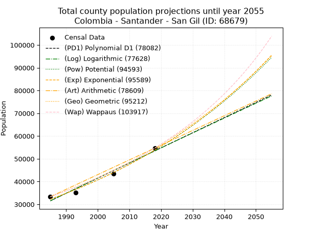
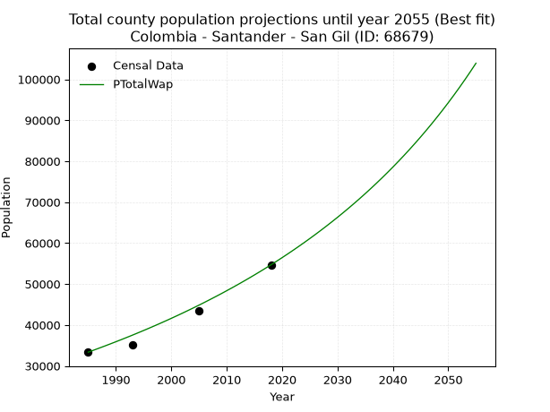
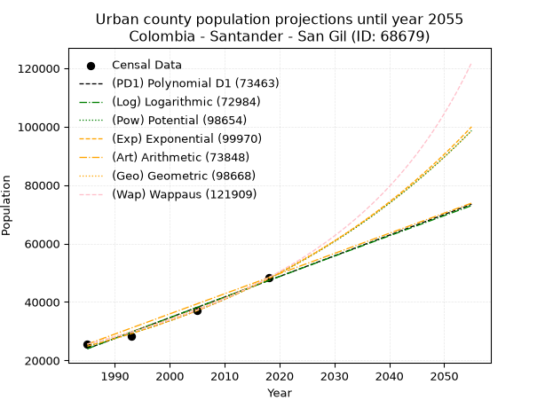
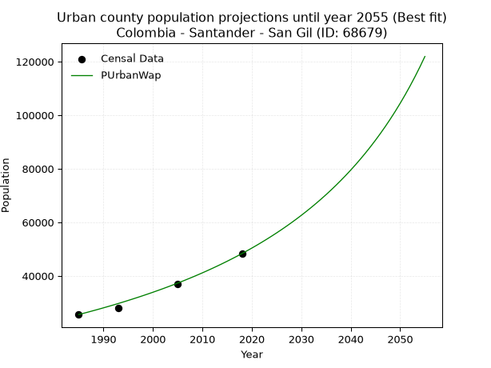
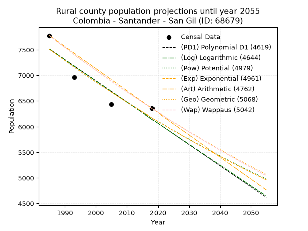
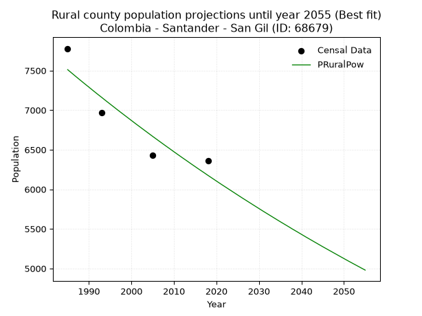

<div align="center">


</div>

# _“Population and Public Services Demand Projections (PPSD) until Year 2050 for Colombia - Santander - San Gil (ID: 68679)”_
Keywords: `population` `public-service` `projection` `lineal` `polynomial` `logarithmic` `potential` `exponential` `arithmetic` `geometric` `wappaus` `dane` `colombia` `south-america`

PPSD are analytical estimates used by governments and planners to anticipate future changes in population size, age distribution, and the resulting community needs for utilities, healthcare, education, and infrastructure as sizing future water treatment facilities, electrical grids, and road networks based on spatial growth.

> **General running parameters**: • app_version: _v20260806_. • Python version: _3.14.7_. • Pandas version: _3.0.5_. • NumPy version: _2.5.1_. • Creates, save and include plots into reports (create_plot): _False_. • Projection until year: _2050_. • Process polynomial degree 2 and up: _False_. • Process Wappaus: _True_. • Process Wappaus: _True_. • Set negative values to zero: _True_. • Set infinite values to zero: _True_. • Drop dataset notes: _True_. 
<div align="center">

Dynamic map: [:earth_americas:Google](http://maps.google.com/maps?q=6.551951793,-73.1347763) [:earth_americas:OSM](https://www.openstreetmap.org/#map=18/6.551951793/-73.1347763&layers=P) [:earth_americas:Bing](https://www.bing.com/maps?cp=6.551951793~-73.1347763&lvl=18) [:earth_americas:Apple](https://maps.apple.com/frame?center=6.551951793%2C-73.1347763&span=0.003%2C0.006)

</div>


<div align="center">

```geojson
{
  "type": "Feature",
  "geometry": {
    "type": "Point", 
    "coordinates": [-73.1347763, 6.551951793]
  }, 
  "properties": {
    "Name": "Colombia - Santander - San Gil (ID: 68679)"
  }
}
```

</div>


## 0. Census Data (4 records)

Census data are official statistics collected by a government about the people and housing in a country. They usually include counts of total population, age, sex, race, income, education, and jobs.

📅Global census file: [Population.xlsx](../data/Population.xlsx)

| Source   |   Year |   CountryID | CountryName   |   StateID | StateName   |   CountyID | CountyName   |   PTotal |   PUrban |   PRural |
|:---------|-------:|------------:|:--------------|----------:|:------------|-----------:|:-------------|---------:|---------:|---------:|
| DANE     |   1985 |          57 | Colombia      |        68 | Santander   |      68679 | San Gil      |    33351 |    25573 |     7778 |
| DANE     |   1993 |          57 | Colombia      |        68 | Santander   |      68679 | San Gil      |    35123 |    28157 |     6966 |
| DANE     |   2005 |          57 | Colombia      |        68 | Santander   |      68679 | San Gil      |    43519 |    37087 |     6432 |
| DANE     |   2018 |          57 | Colombia      |        68 | Santander   |      68679 | San Gil      |    54687 |    48331 |     6356 |

> 🔥Some records has specific notes about the registered values or the corresponding urban or rural distribution.

## 1. Total

### 1.1. Coefficients and Parameters

* (PD1) Polynomial Deg 1: 665.058209554388, -1288612.6836611647 (lineal)
* (Log) Logarithmic: 1330643.264880567, -10072560.119463108
* (Pow) Potential: 31.062052723199173, -97.92687582949344
* (Exp) Exponential: 0.015522689597573074, 1.3390402762889474e-09
* (Art) Arithmetic: Year diff. 2018 - 1985 = 33, Population diff. 54687 - 33351 = 21336, Annual growth = 646.5454545454545
* (Geo) Geometric: Year diff. 2018 - 1985 = 33, Population diff. 54687 - 33351 = 21336, Annual growth % = 0.015098861262292651
* (Wap) Wappaus: i = 1.4687872385684695, Condition values only valid for < 200)

<sub>
Wappaus condition values: ['0.00', '1.47', '2.94', '4.41', '5.88', '7.34', '8.81', '10.28', '11.75', '13.22', '14.69', '16.16', '17.63', '19.09', '20.56', '22.03', '23.50', '24.97', '26.44', '27.91', '29.38', '30.84', '32.31', '33.78', '35.25', '36.72', '38.19', '39.66', '41.13', '42.59', '44.06', '45.53', '47.00', '48.47', '49.94', '51.41', '52.88', '54.35', '55.81', '57.28', '58.75', '60.22', '61.69', '63.16', '64.63', '66.10', '67.56', '69.03', '70.50', '71.97', '73.44', '74.91', '76.38', '77.85', '79.31', '80.78', '82.25', '83.72', '85.19', '86.66', '88.13', '89.60', '91.06', '92.53', '94.00', '95.47']
</sub>


### 1.2. Projected Dataset

|   Year |   CountyID |   PTotalPD1 |   PTotalLog |   PTotalPow |   PTotalExp |   PTotalArt |   PTotalGeo |   PTotalWap |
|-------:|-----------:|------------:|------------:|------------:|------------:|------------:|------------:|------------:|
|   1985 |      68679 |       31528 |       31512 |       32236 |       32248 |       33351 |       33351 |       33351 |
|   1986 |      68679 |       32193 |       32182 |       32744 |       32753 |       33998 |       33855 |       33844 |
|   1987 |      68679 |       32858 |       32852 |       33260 |       33265 |       34644 |       34366 |       34345 |
|   1988 |      68679 |       33523 |       33522 |       33784 |       33786 |       35291 |       34885 |       34854 |
|   1989 |      68679 |       34188 |       34191 |       34316 |       34314 |       35937 |       35411 |       35370 |
|   1990 |      68679 |       34853 |       34860 |       34856 |       34851 |       36584 |       35946 |       35894 |
|   1991 |      68679 |       35518 |       35528 |       35404 |       35396 |       37230 |       36489 |       36426 |
|   1992 |      68679 |       36183 |       36196 |       35960 |       35950 |       37877 |       37040 |       36966 |
|   1993 |      68679 |       36848 |       36864 |       36525 |       36512 |       38523 |       37599 |       37514 |
|   1994 |      68679 |       37513 |       37532 |       37099 |       37084 |       39170 |       38167 |       38072 |
|   1995 |      68679 |       38178 |       38199 |       37681 |       37664 |       39816 |       38743 |       38638 |
|   1996 |      68679 |       38844 |       38866 |       38272 |       38253 |       40463 |       39328 |       39213 |
|   1997 |      68679 |       39509 |       39532 |       38872 |       38851 |       41110 |       39922 |       39797 |
|   1998 |      68679 |       40174 |       40198 |       39482 |       39459 |       41756 |       40524 |       40391 |
|   1999 |      68679 |       40839 |       40864 |       40100 |       40076 |       42403 |       41136 |       40995 |
|   2000 |      68679 |       41504 |       41530 |       40728 |       40703 |       43049 |       41757 |       41608 |
|   2001 |      68679 |       42169 |       42195 |       41365 |       41340 |       43696 |       42388 |       42232 |
|   2002 |      68679 |       42834 |       42860 |       42012 |       41987 |       44342 |       43028 |       42867 |
|   2003 |      68679 |       43499 |       43524 |       42669 |       42644 |       44989 |       43678 |       43512 |
|   2004 |      68679 |       44164 |       44188 |       43336 |       43311 |       45635 |       44337 |       44168 |
|   2005 |      68679 |       44829 |       44852 |       44012 |       43988 |       46282 |       45007 |       44835 |
|   2006 |      68679 |       45494 |       45515 |       44699 |       44676 |       46928 |       45686 |       45514 |
|   2007 |      68679 |       46159 |       46179 |       45397 |       45375 |       47575 |       46376 |       46205 |
|   2008 |      68679 |       46824 |       46842 |       46105 |       46085 |       48222 |       47076 |       46908 |
|   2009 |      68679 |       47489 |       47504 |       46823 |       46806 |       48868 |       47787 |       47623 |
|   2010 |      68679 |       48154 |       48166 |       47553 |       47538 |       49515 |       48508 |       48351 |
|   2011 |      68679 |       48819 |       48828 |       48293 |       48282 |       50161 |       49241 |       49093 |
|   2012 |      68679 |       49484 |       49490 |       49045 |       49037 |       50808 |       49984 |       49848 |
|   2013 |      68679 |       50149 |       50151 |       49807 |       49805 |       51454 |       50739 |       50617 |
|   2014 |      68679 |       50815 |       50812 |       50582 |       50584 |       52101 |       51505 |       51401 |
|   2015 |      68679 |       51480 |       51472 |       51368 |       51375 |       52747 |       52283 |       52199 |
|   2016 |      68679 |       52145 |       52132 |       52165 |       52179 |       53394 |       53072 |       53013 |
|   2017 |      68679 |       52810 |       52792 |       52975 |       52995 |       54040 |       53874 |       53842 |
|   2018 |      68679 |       53475 |       53452 |       53797 |       53824 |       54687 |       54687 |       54687 |
|   2019 |      68679 |       54140 |       54111 |       54631 |       54666 |       55334 |       55513 |       55549 |
|   2020 |      68679 |       54805 |       54770 |       55478 |       55521 |       55980 |       56351 |       56427 |
|   2021 |      68679 |       55470 |       55428 |       56338 |       56390 |       56627 |       57202 |       57324 |
|   2022 |      68679 |       56135 |       56087 |       57210 |       57272 |       57273 |       58065 |       58238 |
|   2023 |      68679 |       56800 |       56745 |       58096 |       58168 |       57920 |       58942 |       59171 |
|   2024 |      68679 |       57465 |       57402 |       58994 |       59078 |       58566 |       59832 |       60123 |
|   2025 |      68679 |       58130 |       58059 |       59906 |       60002 |       59213 |       60735 |       61095 |
|   2026 |      68679 |       58795 |       58716 |       60832 |       60941 |       59859 |       61653 |       62088 |
|   2027 |      68679 |       59460 |       59373 |       61772 |       61894 |       60506 |       62583 |       63101 |
|   2028 |      68679 |       60125 |       60029 |       62725 |       62862 |       61152 |       63528 |       64137 |
|   2029 |      68679 |       60790 |       60685 |       63693 |       63846 |       61799 |       64488 |       65194 |
|   2030 |      68679 |       61455 |       61341 |       64676 |       64844 |       62446 |       65461 |       66275 |
|   2031 |      68679 |       62121 |       61996 |       65673 |       65859 |       63092 |       66450 |       67380 |
|   2032 |      68679 |       62786 |       62651 |       66684 |       66889 |       63739 |       67453 |       68510 |
|   2033 |      68679 |       63451 |       63306 |       67711 |       67936 |       64385 |       68471 |       69665 |
|   2034 |      68679 |       64116 |       63960 |       68754 |       68998 |       65032 |       69505 |       70847 |
|   2035 |      68679 |       64781 |       64614 |       69811 |       70078 |       65678 |       70555 |       72056 |
|   2036 |      68679 |       65446 |       65268 |       70885 |       71174 |       66325 |       71620 |       73294 |
|   2037 |      68679 |       66111 |       65922 |       71974 |       72287 |       66971 |       72701 |       74561 |
|   2038 |      68679 |       66776 |       66575 |       73080 |       73418 |       67618 |       73799 |       75858 |
|   2039 |      68679 |       67441 |       67227 |       74202 |       74567 |       68264 |       74913 |       77188 |
|   2040 |      68679 |       68106 |       67880 |       75341 |       75733 |       68911 |       76044 |       78549 |
|   2041 |      68679 |       68771 |       68532 |       76497 |       76918 |       69558 |       77193 |       79945 |
|   2042 |      68679 |       69436 |       69184 |       77669 |       78121 |       70204 |       78358 |       81376 |
|   2043 |      68679 |       70101 |       69835 |       78860 |       79344 |       70851 |       79541 |       82844 |
|   2044 |      68679 |       70766 |       70486 |       80067 |       80585 |       71497 |       80742 |       84350 |
|   2045 |      68679 |       71431 |       71137 |       81293 |       81845 |       72144 |       81961 |       85895 |
|   2046 |      68679 |       72096 |       71788 |       82537 |       83126 |       72790 |       83199 |       87482 |
|   2047 |      68679 |       72761 |       72438 |       83799 |       84426 |       73437 |       84455 |       89111 |
|   2048 |      68679 |       73427 |       73088 |       85080 |       85747 |       74083 |       85730 |       90785 |
|   2049 |      68679 |       74092 |       73737 |       86380 |       87088 |       74730 |       87025 |       92505 |
|   2050 |      68679 |       74757 |       74387 |       87700 |       88451 |       75376 |       88339 |       94273 |
<div align="center">

</img>

</div>


### 1.3. Best fit with absolute error and relative error (%)

Relative error puts that difference into context by dividing the absolute error by the true value, creating a unitless ratio or percentage that shows the scale of the mistake.

Absolute and relative error

|   Year | Source   |   CountryID | CountryName   |   StateID | StateName   |   CountyID_x | CountyName   |   PTotal |   PUrban |   PRural |   CountyID_y |   PTotalPD1 |   PTotalLog |   PTotalPow |   PTotalExp |   PTotalArt |   PTotalGeo |   PTotalWap |   PTotalPD1AbsError |   PTotalLogAbsError |   PTotalPowAbsError |   PTotalExpAbsError |   PTotalArtAbsError |   PTotalGeoAbsError |   PTotalWapAbsError |   PTotalPD1RelError |   PTotalLogRelError |   PTotalPowRelError |   PTotalExpRelError |   PTotalArtRelError |   PTotalGeoRelError |   PTotalWapRelError |
|-------:|:---------|------------:|:--------------|----------:|:------------|-------------:|:-------------|---------:|---------:|---------:|-------------:|------------:|------------:|------------:|------------:|------------:|------------:|------------:|--------------------:|--------------------:|--------------------:|--------------------:|--------------------:|--------------------:|--------------------:|--------------------:|--------------------:|--------------------:|--------------------:|--------------------:|--------------------:|--------------------:|
|   1985 | DANE     |          57 | Colombia      |        68 | Santander   |        68679 | San Gil      |    33351 |    25573 |     7778 |        68679 |       31528 |       31512 |       32236 |       32248 |       33351 |       33351 |       33351 |                1823 |                1839 |                1115 |                1103 |                   0 |                   0 |                   0 |             5.4661  |             5.51408 |             3.34323 |             3.30725 |             0       |             0       |             0       |
|   1993 | DANE     |          57 | Colombia      |        68 | Santander   |        68679 | San Gil      |    35123 |    28157 |     6966 |        68679 |       36848 |       36864 |       36525 |       36512 |       38523 |       37599 |       37514 |                1725 |                1741 |                1402 |                1389 |                3400 |                2476 |                2391 |             4.91131 |             4.95687 |             3.99169 |             3.95467 |             9.68027 |             7.04951 |             6.80751 |
|   2005 | DANE     |          57 | Colombia      |        68 | Santander   |        68679 | San Gil      |    43519 |    37087 |     6432 |        68679 |       44829 |       44852 |       44012 |       43988 |       46282 |       45007 |       44835 |                1310 |                1333 |                 493 |                 469 |                2763 |                1488 |                1316 |             3.01018 |             3.06303 |             1.13284 |             1.07769 |             6.34895 |             3.4192  |             3.02397 |
|   2018 | DANE     |          57 | Colombia      |        68 | Santander   |        68679 | San Gil      |    54687 |    48331 |     6356 |        68679 |       53475 |       53452 |       53797 |       53824 |       54687 |       54687 |       54687 |                1212 |                1235 |                 890 |                 863 |                   0 |                   0 |                   0 |             2.21625 |             2.25831 |             1.62744 |             1.57807 |             0       |             0       |             0       |

Relative error mean

| Method    |   RelError | Best   |
|:----------|-----------:|:-------|
| PTotalPD1 |    3.90096 |        |
| PTotalLog |    3.94807 |        |
| PTotalPow |    2.5238  |        |
| PTotalExp |    2.47942 |        |
| PTotalArt |    4.0073  |        |
| PTotalGeo |    2.61718 |        |
| PTotalWap |    2.45787 | True   |

💙Best method: _**PTotalWap**_
<div align="center">

</img>

</div>


### 1.4. Fresh water supply demand in liters per capita per day (lpcd)

The fresh water supply demand typically ranges from 100 to 300 liters per capita per day (lpcd) for standard domestic and municipal planning, though absolute survival minimums set by the World Health Organization are as low as 7.5 to 20 liters per day, and total consumption in high-income nations can exceed 400 liters.

> `CZ`: Level in meters above the sea level (masl).<br> `WS`: Fresh water supply demand in liters per capita per day (lpcd or l/h/d).<br> `WSAll`: Zonal fresh water supply demand in liters per second (l/s).<br> `A`: Zonal area in square meters.

Reference values (RAS Colombia)

|    CZ |   WS |
|------:|-----:|
|  1000 |  120 |
|  2000 |  130 |
| 99999 |  140 |

County shapefile geometry properties and water supply values

|   CountyID |     ATotal |   CZTotal |   WSTotal |
|-----------:|-----------:|----------:|----------:|
|      68679 | 1.4658e+08 |   1488.63 |       130 |

Projected values for best method: PTotalWap

|   CountyID |   Year |   PTotalWap |   WSTotal |   WSTotalAll |
|-----------:|-------:|------------:|----------:|-------------:|
|      68679 |   1985 |       33351 |       130 |      50.1809 |
|      68679 |   1986 |       33844 |       130 |      50.9227 |
|      68679 |   1987 |       34345 |       130 |      51.6765 |
|      68679 |   1988 |       34854 |       130 |      52.4424 |
|      68679 |   1989 |       35370 |       130 |      53.2188 |
|      68679 |   1990 |       35894 |       130 |      54.0072 |
|      68679 |   1991 |       36426 |       130 |      54.8076 |
|      68679 |   1992 |       36966 |       130 |      55.6201 |
|      68679 |   1993 |       37514 |       130 |      56.4447 |
|      68679 |   1994 |       38072 |       130 |      57.2843 |
|      68679 |   1995 |       38638 |       130 |      58.1359 |
|      68679 |   1996 |       39213 |       130 |      59.001  |
|      68679 |   1997 |       39797 |       130 |      59.8797 |
|      68679 |   1998 |       40391 |       130 |      60.7735 |
|      68679 |   1999 |       40995 |       130 |      61.6823 |
|      68679 |   2000 |       41608 |       130 |      62.6046 |
|      68679 |   2001 |       42232 |       130 |      63.5435 |
|      68679 |   2002 |       42867 |       130 |      64.499  |
|      68679 |   2003 |       43512 |       130 |      65.4694 |
|      68679 |   2004 |       44168 |       130 |      66.4565 |
|      68679 |   2005 |       44835 |       130 |      67.4601 |
|      68679 |   2006 |       45514 |       130 |      68.4817 |
|      68679 |   2007 |       46205 |       130 |      69.5214 |
|      68679 |   2008 |       46908 |       130 |      70.5792 |
|      68679 |   2009 |       47623 |       130 |      71.655  |
|      68679 |   2010 |       48351 |       130 |      72.7503 |
|      68679 |   2011 |       49093 |       130 |      73.8668 |
|      68679 |   2012 |       49848 |       130 |      75.0028 |
|      68679 |   2013 |       50617 |       130 |      76.1598 |
|      68679 |   2014 |       51401 |       130 |      77.3395 |
|      68679 |   2015 |       52199 |       130 |      78.5402 |
|      68679 |   2016 |       53013 |       130 |      79.7649 |
|      68679 |   2017 |       53842 |       130 |      81.0123 |
|      68679 |   2018 |       54687 |       130 |      82.2837 |
|      68679 |   2019 |       55549 |       130 |      83.5807 |
|      68679 |   2020 |       56427 |       130 |      84.9017 |
|      68679 |   2021 |       57324 |       130 |      86.2514 |
|      68679 |   2022 |       58238 |       130 |      87.6266 |
|      68679 |   2023 |       59171 |       130 |      89.0304 |
|      68679 |   2024 |       60123 |       130 |      90.4628 |
|      68679 |   2025 |       61095 |       130 |      91.9253 |
|      68679 |   2026 |       62088 |       130 |      93.4194 |
|      68679 |   2027 |       63101 |       130 |      94.9436 |
|      68679 |   2028 |       64137 |       130 |      96.5024 |
|      68679 |   2029 |       65194 |       130 |      98.0928 |
|      68679 |   2030 |       66275 |       130 |      99.7193 |
|      68679 |   2031 |       67380 |       130 |     101.382  |
|      68679 |   2032 |       68510 |       130 |     103.082  |
|      68679 |   2033 |       69665 |       130 |     104.82   |
|      68679 |   2034 |       70847 |       130 |     106.598  |
|      68679 |   2035 |       72056 |       130 |     108.418  |
|      68679 |   2036 |       73294 |       130 |     110.28   |
|      68679 |   2037 |       74561 |       130 |     112.187  |
|      68679 |   2038 |       75858 |       130 |     114.138  |
|      68679 |   2039 |       77188 |       130 |     116.139  |
|      68679 |   2040 |       78549 |       130 |     118.187  |
|      68679 |   2041 |       79945 |       130 |     120.288  |
|      68679 |   2042 |       81376 |       130 |     122.441  |
|      68679 |   2043 |       82844 |       130 |     124.65   |
|      68679 |   2044 |       84350 |       130 |     126.916  |
|      68679 |   2045 |       85895 |       130 |     129.24   |
|      68679 |   2046 |       87482 |       130 |     131.628  |
|      68679 |   2047 |       89111 |       130 |     134.079  |
|      68679 |   2048 |       90785 |       130 |     136.598  |
|      68679 |   2049 |       92505 |       130 |     139.186  |
|      68679 |   2050 |       94273 |       130 |     141.846  |

## 2. Urban

### 2.1. Coefficients and Parameters

* (PD1) Polynomial Deg 1: 706.4022480931277, -1378194.0967482785 (lineal)
* (Log) Logarithmic: 1413486.3590102599, -10709134.141805796
* (Pow) Potential: 39.74197275859903, -126.66356210844154
* (Exp) Exponential: 0.01985765227426878, 1.8941320664502053e-13
* (Art) Arithmetic: Year diff. 2018 - 1985 = 33, Population diff. 48331 - 25573 = 22758, Annual growth = 689.6363636363636
* (Geo) Geometric: Year diff. 2018 - 1985 = 33, Population diff. 48331 - 25573 = 22758, Annual growth % = 0.019476205927601686
* (Wap) Wappaus: i = 1.8663032139975202, Condition values only valid for < 200)

<sub>
Wappaus condition values: ['0.00', '1.87', '3.73', '5.60', '7.47', '9.33', '11.20', '13.06', '14.93', '16.80', '18.66', '20.53', '22.40', '24.26', '26.13', '27.99', '29.86', '31.73', '33.59', '35.46', '37.33', '39.19', '41.06', '42.92', '44.79', '46.66', '48.52', '50.39', '52.26', '54.12', '55.99', '57.86', '59.72', '61.59', '63.45', '65.32', '67.19', '69.05', '70.92', '72.79', '74.65', '76.52', '78.38', '80.25', '82.12', '83.98', '85.85', '87.72', '89.58', '91.45', '93.32', '95.18', '97.05', '98.91', '100.78', '102.65', '104.51', '106.38', '108.25', '110.11', '111.98', '113.84', '115.71', '117.58', '119.44', '121.31']
</sub>


### 2.2. Projected Dataset

|   Year |   CountyID |   PUrbanPD1 |   PUrbanLog |   PUrbanPow |   PUrbanExp |   PUrbanArt |   PUrbanGeo |   PUrbanWap |
|-------:|-----------:|------------:|------------:|------------:|------------:|------------:|------------:|------------:|
|   1985 |      68679 |       24014 |       23997 |       24885 |       24899 |       25573 |       25573 |       25573 |
|   1986 |      68679 |       24721 |       24709 |       25389 |       25399 |       26263 |       26071 |       26055 |
|   1987 |      68679 |       25427 |       25420 |       25902 |       25908 |       26952 |       26579 |       26546 |
|   1988 |      68679 |       26134 |       26131 |       26425 |       26428 |       27642 |       27096 |       27046 |
|   1989 |      68679 |       26840 |       26842 |       26958 |       26958 |       28332 |       27624 |       27556 |
|   1990 |      68679 |       27546 |       27553 |       27502 |       27498 |       29021 |       28162 |       28076 |
|   1991 |      68679 |       28253 |       28263 |       28057 |       28050 |       29711 |       28711 |       28606 |
|   1992 |      68679 |       28959 |       28973 |       28622 |       28612 |       30400 |       29270 |       29147 |
|   1993 |      68679 |       29666 |       29682 |       29199 |       29186 |       31090 |       29840 |       29699 |
|   1994 |      68679 |       30372 |       30391 |       29787 |       29772 |       31780 |       30421 |       30262 |
|   1995 |      68679 |       31078 |       31100 |       30386 |       30369 |       32469 |       31014 |       30837 |
|   1996 |      68679 |       31785 |       31808 |       30998 |       30978 |       33159 |       31618 |       31424 |
|   1997 |      68679 |       32491 |       32516 |       31621 |       31599 |       33849 |       32233 |       32022 |
|   1998 |      68679 |       33198 |       33224 |       32256 |       32233 |       34538 |       32861 |       32634 |
|   1999 |      68679 |       33904 |       33931 |       32904 |       32879 |       35228 |       33501 |       33259 |
|   2000 |      68679 |       34610 |       34638 |       33565 |       33539 |       35918 |       34154 |       33897 |
|   2001 |      68679 |       35317 |       35344 |       34238 |       34211 |       36607 |       34819 |       34550 |
|   2002 |      68679 |       36023 |       36051 |       34925 |       34898 |       37297 |       35497 |       35216 |
|   2003 |      68679 |       36730 |       36756 |       35625 |       35598 |       37986 |       36188 |       35898 |
|   2004 |      68679 |       37436 |       37462 |       36339 |       36311 |       38676 |       36893 |       36595 |
|   2005 |      68679 |       38142 |       38167 |       37066 |       37040 |       39366 |       37612 |       37309 |
|   2006 |      68679 |       38849 |       38872 |       37808 |       37783 |       40055 |       38344 |       38038 |
|   2007 |      68679 |       39555 |       39576 |       38564 |       38540 |       40745 |       39091 |       38785 |
|   2008 |      68679 |       40262 |       40280 |       39335 |       39313 |       41435 |       39852 |       39550 |
|   2009 |      68679 |       40968 |       40984 |       40121 |       40102 |       42124 |       40629 |       40333 |
|   2010 |      68679 |       41674 |       41688 |       40923 |       40906 |       42814 |       41420 |       41135 |
|   2011 |      68679 |       42381 |       42391 |       41740 |       41727 |       43504 |       42227 |       41957 |
|   2012 |      68679 |       43087 |       43093 |       42573 |       42563 |       44193 |       43049 |       42800 |
|   2013 |      68679 |       43794 |       43796 |       43422 |       43417 |       44883 |       43887 |       43663 |
|   2014 |      68679 |       44500 |       44498 |       44287 |       44288 |       45572 |       44742 |       44549 |
|   2015 |      68679 |       45206 |       45199 |       45170 |       45176 |       46262 |       45614 |       45458 |
|   2016 |      68679 |       45913 |       45901 |       46069 |       46082 |       46952 |       46502 |       46390 |
|   2017 |      68679 |       46619 |       46602 |       46986 |       47006 |       47641 |       47408 |       47348 |
|   2018 |      68679 |       47326 |       47302 |       47921 |       47949 |       48331 |       48331 |       48331 |
|   2019 |      68679 |       48032 |       48003 |       48874 |       48911 |       49021 |       49272 |       49341 |
|   2020 |      68679 |       48738 |       48702 |       49845 |       49892 |       49710 |       50232 |       50379 |
|   2021 |      68679 |       49445 |       49402 |       50835 |       50892 |       50400 |       51210 |       51447 |
|   2022 |      68679 |       50151 |       50101 |       51844 |       51913 |       51090 |       52208 |       52544 |
|   2023 |      68679 |       50858 |       50800 |       52873 |       52954 |       51779 |       53224 |       53674 |
|   2024 |      68679 |       51564 |       51499 |       53922 |       54016 |       52469 |       54261 |       54836 |
|   2025 |      68679 |       52270 |       52197 |       54991 |       55100 |       53158 |       55318 |       56033 |
|   2026 |      68679 |       52977 |       52895 |       56081 |       56205 |       53848 |       56395 |       57267 |
|   2027 |      68679 |       53683 |       53592 |       57191 |       57332 |       54538 |       57494 |       58538 |
|   2028 |      68679 |       54390 |       54289 |       58323 |       58482 |       55227 |       58613 |       59849 |
|   2029 |      68679 |       55096 |       54986 |       59477 |       59655 |       55917 |       59755 |       61201 |
|   2030 |      68679 |       55802 |       55683 |       60653 |       60851 |       56607 |       60919 |       62597 |
|   2031 |      68679 |       56509 |       56379 |       61852 |       62072 |       57296 |       62105 |       64039 |
|   2032 |      68679 |       57215 |       57075 |       63074 |       63317 |       57986 |       63315 |       65528 |
|   2033 |      68679 |       57922 |       57770 |       64320 |       64587 |       58676 |       64548 |       67068 |
|   2034 |      68679 |       58628 |       58465 |       65589 |       65882 |       59365 |       65805 |       68661 |
|   2035 |      68679 |       59334 |       59160 |       66883 |       67203 |       60055 |       67087 |       70309 |
|   2036 |      68679 |       60041 |       59854 |       68202 |       68551 |       60744 |       68393 |       72017 |
|   2037 |      68679 |       60747 |       60548 |       69546 |       69926 |       61434 |       69725 |       73786 |
|   2038 |      68679 |       61454 |       61242 |       70915 |       71328 |       62124 |       71083 |       75620 |
|   2039 |      68679 |       62160 |       61935 |       72311 |       72759 |       62813 |       72468 |       77524 |
|   2040 |      68679 |       62866 |       62629 |       73734 |       74218 |       63503 |       73879 |       79500 |
|   2041 |      68679 |       63573 |       63321 |       75185 |       75707 |       64193 |       75318 |       81554 |
|   2042 |      68679 |       64279 |       64014 |       76662 |       77225 |       64882 |       76785 |       83689 |
|   2043 |      68679 |       64986 |       64706 |       78169 |       78774 |       65572 |       78280 |       85912 |
|   2044 |      68679 |       65692 |       65397 |       79704 |       80354 |       66262 |       79805 |       88226 |
|   2045 |      68679 |       66399 |       66089 |       81268 |       81965 |       66951 |       81359 |       90639 |
|   2046 |      68679 |       67105 |       66780 |       82863 |       83609 |       67641 |       82944 |       93157 |
|   2047 |      68679 |       67811 |       67470 |       84488 |       85286 |       68330 |       84559 |       95785 |
|   2048 |      68679 |       68518 |       68161 |       86144 |       86997 |       69020 |       86206 |       98533 |
|   2049 |      68679 |       69224 |       68851 |       87831 |       88742 |       69710 |       87885 |      101409 |
|   2050 |      68679 |       69931 |       69540 |       89551 |       90521 |       70399 |       89597 |      104420 |
<div align="center">

</img>

</div>


### 2.3. Best fit with absolute error and relative error (%)

Relative error puts that difference into context by dividing the absolute error by the true value, creating a unitless ratio or percentage that shows the scale of the mistake.

Absolute and relative error

|   Year | Source   |   CountryID | CountryName   |   StateID | StateName   |   CountyID_x | CountyName   |   PTotal |   PUrban |   PRural |   CountyID_y |   PUrbanPD1 |   PUrbanLog |   PUrbanPow |   PUrbanExp |   PUrbanArt |   PUrbanGeo |   PUrbanWap |   PUrbanPD1AbsError |   PUrbanLogAbsError |   PUrbanPowAbsError |   PUrbanExpAbsError |   PUrbanArtAbsError |   PUrbanGeoAbsError |   PUrbanWapAbsError |   PUrbanPD1RelError |   PUrbanLogRelError |   PUrbanPowRelError |   PUrbanExpRelError |   PUrbanArtRelError |   PUrbanGeoRelError |   PUrbanWapRelError |
|-------:|:---------|------------:|:--------------|----------:|:------------|-------------:|:-------------|---------:|---------:|---------:|-------------:|------------:|------------:|------------:|------------:|------------:|------------:|------------:|--------------------:|--------------------:|--------------------:|--------------------:|--------------------:|--------------------:|--------------------:|--------------------:|--------------------:|--------------------:|--------------------:|--------------------:|--------------------:|--------------------:|
|   1985 | DANE     |          57 | Colombia      |        68 | Santander   |        68679 | San Gil      |    33351 |    25573 |     7778 |        68679 |       24014 |       23997 |       24885 |       24899 |       25573 |       25573 |       25573 |                1559 |                1576 |                 688 |                 674 |                   0 |                   0 |                   0 |             6.09627 |             6.16275 |           2.69034   |            2.63559  |             0       |             0       |            0        |
|   1993 | DANE     |          57 | Colombia      |        68 | Santander   |        68679 | San Gil      |    35123 |    28157 |     6966 |        68679 |       29666 |       29682 |       29199 |       29186 |       31090 |       29840 |       29699 |                1509 |                1525 |                1042 |                1029 |                2933 |                1683 |                1542 |             5.35924 |             5.41606 |           3.70068   |            3.65451  |            10.4166  |             5.9772  |            5.47644  |
|   2005 | DANE     |          57 | Colombia      |        68 | Santander   |        68679 | San Gil      |    43519 |    37087 |     6432 |        68679 |       38142 |       38167 |       37066 |       37040 |       39366 |       37612 |       37309 |                1055 |                1080 |                  21 |                  47 |                2279 |                 525 |                 222 |             2.84466 |             2.91207 |           0.0566236 |            0.126729 |             6.14501 |             1.41559 |            0.598592 |
|   2018 | DANE     |          57 | Colombia      |        68 | Santander   |        68679 | San Gil      |    54687 |    48331 |     6356 |        68679 |       47326 |       47302 |       47921 |       47949 |       48331 |       48331 |       48331 |                1005 |                1029 |                 410 |                 382 |                   0 |                   0 |                   0 |             2.07941 |             2.12907 |           0.848317  |            0.790383 |             0       |             0       |            0        |

Relative error mean

| Method    |   RelError | Best   |
|:----------|-----------:|:-------|
| PUrbanPD1 |    4.0949  |        |
| PUrbanLog |    4.15499 |        |
| PUrbanPow |    1.82399 |        |
| PUrbanExp |    1.8018  |        |
| PUrbanArt |    4.1404  |        |
| PUrbanGeo |    1.8482  |        |
| PUrbanWap |    1.51876 | True   |

💙Best method: _**PUrbanWap**_
<div align="center">

</img>

</div>


### 2.4. Fresh water supply demand in liters per capita per day (lpcd)

The fresh water supply demand typically ranges from 100 to 300 liters per capita per day (lpcd) for standard domestic and municipal planning, though absolute survival minimums set by the World Health Organization are as low as 7.5 to 20 liters per day, and total consumption in high-income nations can exceed 400 liters.

> `CZ`: Level in meters above the sea level (masl).<br> `WS`: Fresh water supply demand in liters per capita per day (lpcd or l/h/d).<br> `WSAll`: Zonal fresh water supply demand in liters per second (l/s).<br> `A`: Zonal area in square meters.

Reference values (RAS Colombia)

|    CZ |   WS |
|------:|-----:|
|  1000 |  120 |
|  2000 |  130 |
| 99999 |  140 |

County shapefile geometry properties and water supply values

|   CountyID |      AUrban |   CZUrban |   WSUrban |
|-----------:|------------:|----------:|----------:|
|      68679 | 7.67292e+06 |   1158.62 |       130 |

Projected values for best method: PUrbanWap

|   CountyID |   Year |   PUrbanWap |   WSUrban |   WSUrbanAll |
|-----------:|-------:|------------:|----------:|-------------:|
|      68679 |   1985 |       25573 |       130 |      38.4779 |
|      68679 |   1986 |       26055 |       130 |      39.2031 |
|      68679 |   1987 |       26546 |       130 |      39.9419 |
|      68679 |   1988 |       27046 |       130 |      40.6942 |
|      68679 |   1989 |       27556 |       130 |      41.4616 |
|      68679 |   1990 |       28076 |       130 |      42.244  |
|      68679 |   1991 |       28606 |       130 |      43.0414 |
|      68679 |   1992 |       29147 |       130 |      43.8554 |
|      68679 |   1993 |       29699 |       130 |      44.686  |
|      68679 |   1994 |       30262 |       130 |      45.5331 |
|      68679 |   1995 |       30837 |       130 |      46.3983 |
|      68679 |   1996 |       31424 |       130 |      47.2815 |
|      68679 |   1997 |       32022 |       130 |      48.1812 |
|      68679 |   1998 |       32634 |       130 |      49.1021 |
|      68679 |   1999 |       33259 |       130 |      50.0425 |
|      68679 |   2000 |       33897 |       130 |      51.0024 |
|      68679 |   2001 |       34550 |       130 |      51.985  |
|      68679 |   2002 |       35216 |       130 |      52.987  |
|      68679 |   2003 |       35898 |       130 |      54.0132 |
|      68679 |   2004 |       36595 |       130 |      55.0619 |
|      68679 |   2005 |       37309 |       130 |      56.1362 |
|      68679 |   2006 |       38038 |       130 |      57.2331 |
|      68679 |   2007 |       38785 |       130 |      58.3571 |
|      68679 |   2008 |       39550 |       130 |      59.5081 |
|      68679 |   2009 |       40333 |       130 |      60.6862 |
|      68679 |   2010 |       41135 |       130 |      61.8929 |
|      68679 |   2011 |       41957 |       130 |      63.1297 |
|      68679 |   2012 |       42800 |       130 |      64.3981 |
|      68679 |   2013 |       43663 |       130 |      65.6966 |
|      68679 |   2014 |       44549 |       130 |      67.0297 |
|      68679 |   2015 |       45458 |       130 |      68.3975 |
|      68679 |   2016 |       46390 |       130 |      69.7998 |
|      68679 |   2017 |       47348 |       130 |      71.2412 |
|      68679 |   2018 |       48331 |       130 |      72.7203 |
|      68679 |   2019 |       49341 |       130 |      74.2399 |
|      68679 |   2020 |       50379 |       130 |      75.8017 |
|      68679 |   2021 |       51447 |       130 |      77.4087 |
|      68679 |   2022 |       52544 |       130 |      79.0593 |
|      68679 |   2023 |       53674 |       130 |      80.7595 |
|      68679 |   2024 |       54836 |       130 |      82.5079 |
|      68679 |   2025 |       56033 |       130 |      84.3089 |
|      68679 |   2026 |       57267 |       130 |      86.1656 |
|      68679 |   2027 |       58538 |       130 |      88.078  |
|      68679 |   2028 |       59849 |       130 |      90.0506 |
|      68679 |   2029 |       61201 |       130 |      92.0848 |
|      68679 |   2030 |       62597 |       130 |      94.1853 |
|      68679 |   2031 |       64039 |       130 |      96.355  |
|      68679 |   2032 |       65528 |       130 |      98.5954 |
|      68679 |   2033 |       67068 |       130 |     100.912  |
|      68679 |   2034 |       68661 |       130 |     103.309  |
|      68679 |   2035 |       70309 |       130 |     105.789  |
|      68679 |   2036 |       72017 |       130 |     108.359  |
|      68679 |   2037 |       73786 |       130 |     111.021  |
|      68679 |   2038 |       75620 |       130 |     113.78   |
|      68679 |   2039 |       77524 |       130 |     116.645  |
|      68679 |   2040 |       79500 |       130 |     119.618  |
|      68679 |   2041 |       81554 |       130 |     122.709  |
|      68679 |   2042 |       83689 |       130 |     125.921  |
|      68679 |   2043 |       85912 |       130 |     129.266  |
|      68679 |   2044 |       88226 |       130 |     132.747  |
|      68679 |   2045 |       90639 |       130 |     136.378  |
|      68679 |   2046 |       93157 |       130 |     140.167  |
|      68679 |   2047 |       95785 |       130 |     144.121  |
|      68679 |   2048 |       98533 |       130 |     148.256  |
|      68679 |   2049 |      101409 |       130 |     152.583  |
|      68679 |   2050 |      104420 |       130 |     157.113  |

## 3. Rural

### 3.1. Coefficients and Parameters

* (PD1) Polynomial Deg 1: -41.34403853873937, 89581.41308711344 (lineal)
* (Log) Logarithmic: -82843.09412969193, 636574.0223426813
* (Pow) Potential: -11.862394604497172, 42.99500953311469
* (Exp) Exponential: -0.005920383622871594, 953603874.8783262
* (Art) Arithmetic: Year diff. 2018 - 1985 = 33, Population diff. 6356 - 7778 = -1422, Annual growth = -43.09090909090909
* (Geo) Geometric: Year diff. 2018 - 1985 = 33, Population diff. 6356 - 7778 = -1422, Annual growth % = -0.006099503465182732
* (Wap) Wappaus: i = -0.6097482537273113, Condition values only valid for < 200)

<sub>
Wappaus condition values: ['-0.00', '-0.61', '-1.22', '-1.83', '-2.44', '-3.05', '-3.66', '-4.27', '-4.88', '-5.49', '-6.10', '-6.71', '-7.32', '-7.93', '-8.54', '-9.15', '-9.76', '-10.37', '-10.98', '-11.59', '-12.19', '-12.80', '-13.41', '-14.02', '-14.63', '-15.24', '-15.85', '-16.46', '-17.07', '-17.68', '-18.29', '-18.90', '-19.51', '-20.12', '-20.73', '-21.34', '-21.95', '-22.56', '-23.17', '-23.78', '-24.39', '-25.00', '-25.61', '-26.22', '-26.83', '-27.44', '-28.05', '-28.66', '-29.27', '-29.88', '-30.49', '-31.10', '-31.71', '-32.32', '-32.93', '-33.54', '-34.15', '-34.76', '-35.37', '-35.98', '-36.58', '-37.19', '-37.80', '-38.41', '-39.02', '-39.63']
</sub>


### 3.2. Projected Dataset

|   Year |   CountyID |   PRuralPD1 |   PRuralLog |   PRuralPow |   PRuralExp |   PRuralArt |   PRuralGeo |   PRuralWap |
|-------:|-----------:|------------:|------------:|------------:|------------:|------------:|------------:|------------:|
|   1985 |      68679 |        7513 |        7515 |        7511 |        7509 |        7778 |        7778 |        7778 |
|   1986 |      68679 |        7472 |        7474 |        7466 |        7464 |        7735 |        7731 |        7731 |
|   1987 |      68679 |        7431 |        7432 |        7421 |        7420 |        7692 |        7683 |        7684 |
|   1988 |      68679 |        7389 |        7390 |        7377 |        7376 |        7649 |        7637 |        7637 |
|   1989 |      68679 |        7348 |        7349 |        7333 |        7333 |        7606 |        7590 |        7591 |
|   1990 |      68679 |        7307 |        7307 |        7290 |        7290 |        7563 |        7544 |        7544 |
|   1991 |      68679 |        7265 |        7265 |        7246 |        7247 |        7519 |        7498 |        7499 |
|   1992 |      68679 |        7224 |        7224 |        7203 |        7204 |        7476 |        7452 |        7453 |
|   1993 |      68679 |        7183 |        7182 |        7161 |        7161 |        7433 |        7406 |        7408 |
|   1994 |      68679 |        7141 |        7141 |        7118 |        7119 |        7390 |        7361 |        7363 |
|   1995 |      68679 |        7100 |        7099 |        7076 |        7077 |        7347 |        7316 |        7318 |
|   1996 |      68679 |        7059 |        7058 |        7034 |        7035 |        7304 |        7272 |        7273 |
|   1997 |      68679 |        7017 |        7016 |        6992 |        6994 |        7261 |        7227 |        7229 |
|   1998 |      68679 |        6976 |        6975 |        6951 |        6952 |        7218 |        7183 |        7185 |
|   1999 |      68679 |        6935 |        6933 |        6910 |        6911 |        7175 |        7140 |        7141 |
|   2000 |      68679 |        6893 |        6892 |        6869 |        6870 |        7132 |        7096 |        7098 |
|   2001 |      68679 |        6852 |        6850 |        6828 |        6830 |        7089 |        7053 |        7054 |
|   2002 |      68679 |        6811 |        6809 |        6788 |        6790 |        7045 |        7010 |        7011 |
|   2003 |      68679 |        6769 |        6768 |        6748 |        6750 |        7002 |        6967 |        6969 |
|   2004 |      68679 |        6728 |        6726 |        6708 |        6710 |        6959 |        6924 |        6926 |
|   2005 |      68679 |        6687 |        6685 |        6668 |        6670 |        6916 |        6882 |        6884 |
|   2006 |      68679 |        6645 |        6644 |        6629 |        6631 |        6873 |        6840 |        6842 |
|   2007 |      68679 |        6604 |        6602 |        6590 |        6592 |        6830 |        6798 |        6800 |
|   2008 |      68679 |        6563 |        6561 |        6551 |        6553 |        6787 |        6757 |        6759 |
|   2009 |      68679 |        6521 |        6520 |        6513 |        6514 |        6744 |        6716 |        6717 |
|   2010 |      68679 |        6480 |        6479 |        6474 |        6476 |        6701 |        6675 |        6676 |
|   2011 |      68679 |        6439 |        6437 |        6436 |        6437 |        6658 |        6634 |        6635 |
|   2012 |      68679 |        6397 |        6396 |        6398 |        6399 |        6615 |        6594 |        6595 |
|   2013 |      68679 |        6356 |        6355 |        6361 |        6362 |        6571 |        6553 |        6555 |
|   2014 |      68679 |        6315 |        6314 |        6323 |        6324 |        6528 |        6513 |        6514 |
|   2015 |      68679 |        6273 |        6273 |        6286 |        6287 |        6485 |        6474 |        6474 |
|   2016 |      68679 |        6232 |        6232 |        6249 |        6250 |        6442 |        6434 |        6435 |
|   2017 |      68679 |        6190 |        6191 |        6213 |        6213 |        6399 |        6395 |        6395 |
|   2018 |      68679 |        6149 |        6149 |        6176 |        6176 |        6356 |        6356 |        6356 |
|   2019 |      68679 |        6108 |        6108 |        6140 |        6140 |        6313 |        6317 |        6317 |
|   2020 |      68679 |        6066 |        6067 |        6104 |        6103 |        6270 |        6279 |        6278 |
|   2021 |      68679 |        6025 |        6026 |        6068 |        6067 |        6227 |        6240 |        6240 |
|   2022 |      68679 |        5984 |        5985 |        6033 |        6031 |        6184 |        6202 |        6201 |
|   2023 |      68679 |        5942 |        5944 |        5998 |        5996 |        6141 |        6165 |        6163 |
|   2024 |      68679 |        5901 |        5904 |        5963 |        5960 |        6097 |        6127 |        6125 |
|   2025 |      68679 |        5860 |        5863 |        5928 |        5925 |        6054 |        6090 |        6087 |
|   2026 |      68679 |        5818 |        5822 |        5893 |        5890 |        6011 |        6052 |        6050 |
|   2027 |      68679 |        5777 |        5781 |        5859 |        5856 |        5968 |        6015 |        6012 |
|   2028 |      68679 |        5736 |        5740 |        5825 |        5821 |        5925 |        5979 |        5975 |
|   2029 |      68679 |        5694 |        5699 |        5791 |        5787 |        5882 |        5942 |        5938 |
|   2030 |      68679 |        5653 |        5658 |        5757 |        5752 |        5839 |        5906 |        5901 |
|   2031 |      68679 |        5612 |        5618 |        5723 |        5718 |        5796 |        5870 |        5865 |
|   2032 |      68679 |        5570 |        5577 |        5690 |        5685 |        5753 |        5834 |        5828 |
|   2033 |      68679 |        5529 |        5536 |        5657 |        5651 |        5710 |        5799 |        5792 |
|   2034 |      68679 |        5488 |        5495 |        5624 |        5618 |        5667 |        5763 |        5756 |
|   2035 |      68679 |        5446 |        5455 |        5591 |        5585 |        5623 |        5728 |        5720 |
|   2036 |      68679 |        5405 |        5414 |        5559 |        5552 |        5580 |        5693 |        5685 |
|   2037 |      68679 |        5364 |        5373 |        5527 |        5519 |        5537 |        5658 |        5649 |
|   2038 |      68679 |        5322 |        5332 |        5494 |        5486 |        5494 |        5624 |        5614 |
|   2039 |      68679 |        5281 |        5292 |        5463 |        5454 |        5451 |        5590 |        5579 |
|   2040 |      68679 |        5240 |        5251 |        5431 |        5422 |        5408 |        5556 |        5544 |
|   2041 |      68679 |        5198 |        5211 |        5399 |        5390 |        5365 |        5522 |        5509 |
|   2042 |      68679 |        5157 |        5170 |        5368 |        5358 |        5322 |        5488 |        5475 |
|   2043 |      68679 |        5116 |        5129 |        5337 |        5326 |        5279 |        5455 |        5441 |
|   2044 |      68679 |        5074 |        5089 |        5306 |        5295 |        5236 |        5421 |        5406 |
|   2045 |      68679 |        5033 |        5048 |        5275 |        5264 |        5193 |        5388 |        5372 |
|   2046 |      68679 |        4992 |        5008 |        5245 |        5233 |        5149 |        5355 |        5339 |
|   2047 |      68679 |        4950 |        4967 |        5215 |        5202 |        5106 |        5323 |        5305 |
|   2048 |      68679 |        4909 |        4927 |        5185 |        5171 |        5063 |        5290 |        5272 |
|   2049 |      68679 |        4867 |        4887 |        5155 |        5140 |        5020 |        5258 |        5238 |
|   2050 |      68679 |        4826 |        4846 |        5125 |        5110 |        4977 |        5226 |        5205 |
<div align="center">

</img>

</div>


### 3.3. Best fit with absolute error and relative error (%)

Relative error puts that difference into context by dividing the absolute error by the true value, creating a unitless ratio or percentage that shows the scale of the mistake.

Absolute and relative error

|   Year | Source   |   CountryID | CountryName   |   StateID | StateName   |   CountyID_x | CountyName   |   PTotal |   PUrban |   PRural |   CountyID_y |   PRuralPD1 |   PRuralLog |   PRuralPow |   PRuralExp |   PRuralArt |   PRuralGeo |   PRuralWap |   PRuralPD1AbsError |   PRuralLogAbsError |   PRuralPowAbsError |   PRuralExpAbsError |   PRuralArtAbsError |   PRuralGeoAbsError |   PRuralWapAbsError |   PRuralPD1RelError |   PRuralLogRelError |   PRuralPowRelError |   PRuralExpRelError |   PRuralArtRelError |   PRuralGeoRelError |   PRuralWapRelError |
|-------:|:---------|------------:|:--------------|----------:|:------------|-------------:|:-------------|---------:|---------:|---------:|-------------:|------------:|------------:|------------:|------------:|------------:|------------:|------------:|--------------------:|--------------------:|--------------------:|--------------------:|--------------------:|--------------------:|--------------------:|--------------------:|--------------------:|--------------------:|--------------------:|--------------------:|--------------------:|--------------------:|
|   1985 | DANE     |          57 | Colombia      |        68 | Santander   |        68679 | San Gil      |    33351 |    25573 |     7778 |        68679 |        7513 |        7515 |        7511 |        7509 |        7778 |        7778 |        7778 |                 265 |                 263 |                 267 |                 269 |                   0 |                   0 |                   0 |             3.40705 |             3.38133 |             3.43276 |             3.45847 |             0       |             0       |             0       |
|   1993 | DANE     |          57 | Colombia      |        68 | Santander   |        68679 | San Gil      |    35123 |    28157 |     6966 |        68679 |        7183 |        7182 |        7161 |        7161 |        7433 |        7406 |        7408 |                 217 |                 216 |                 195 |                 195 |                 467 |                 440 |                 442 |             3.11513 |             3.10078 |             2.79931 |             2.79931 |             6.70399 |             6.31639 |             6.3451  |
|   2005 | DANE     |          57 | Colombia      |        68 | Santander   |        68679 | San Gil      |    43519 |    37087 |     6432 |        68679 |        6687 |        6685 |        6668 |        6670 |        6916 |        6882 |        6884 |                 255 |                 253 |                 236 |                 238 |                 484 |                 450 |                 452 |             3.96455 |             3.93346 |             3.66915 |             3.70025 |             7.52488 |             6.99627 |             7.02736 |
|   2018 | DANE     |          57 | Colombia      |        68 | Santander   |        68679 | San Gil      |    54687 |    48331 |     6356 |        68679 |        6149 |        6149 |        6176 |        6176 |        6356 |        6356 |        6356 |                 207 |                 207 |                 180 |                 180 |                   0 |                   0 |                   0 |             3.25677 |             3.25677 |             2.83197 |             2.83197 |             0       |             0       |             0       |

Relative error mean

| Method    |   RelError | Best   |
|:----------|-----------:|:-------|
| PRuralPD1 |    3.43587 |        |
| PRuralLog |    3.41808 |        |
| PRuralPow |    3.1833  | True   |
| PRuralExp |    3.1975  |        |
| PRuralArt |    3.55722 |        |
| PRuralGeo |    3.32817 |        |
| PRuralWap |    3.34312 |        |

💙Best method: _**PRuralPow**_
<div align="center">

</img>

</div>


### 3.4. Fresh water supply demand in liters per capita per day (lpcd)

The fresh water supply demand typically ranges from 100 to 300 liters per capita per day (lpcd) for standard domestic and municipal planning, though absolute survival minimums set by the World Health Organization are as low as 7.5 to 20 liters per day, and total consumption in high-income nations can exceed 400 liters.

> `CZ`: Level in meters above the sea level (masl).<br> `WS`: Fresh water supply demand in liters per capita per day (lpcd or l/h/d).<br> `WSAll`: Zonal fresh water supply demand in liters per second (l/s).<br> `A`: Zonal area in square meters.

Reference values (RAS Colombia)

|    CZ |   WS |
|------:|-----:|
|  1000 |  120 |
|  2000 |  130 |
| 99999 |  140 |

County shapefile geometry properties and water supply values

|   CountyID |      ARural |   CZRural |   WSRural |
|-----------:|------------:|----------:|----------:|
|      68679 | 1.38907e+08 |   1506.76 |       130 |

Projected values for best method: PRuralPow

|   CountyID |   Year |   PRuralPow |   WSRural |   WSRuralAll |
|-----------:|-------:|------------:|----------:|-------------:|
|      68679 |   1985 |        7511 |       130 |     11.3013  |
|      68679 |   1986 |        7466 |       130 |     11.2336  |
|      68679 |   1987 |        7421 |       130 |     11.1659  |
|      68679 |   1988 |        7377 |       130 |     11.0997  |
|      68679 |   1989 |        7333 |       130 |     11.0334  |
|      68679 |   1990 |        7290 |       130 |     10.9688  |
|      68679 |   1991 |        7246 |       130 |     10.9025  |
|      68679 |   1992 |        7203 |       130 |     10.8378  |
|      68679 |   1993 |        7161 |       130 |     10.7747  |
|      68679 |   1994 |        7118 |       130 |     10.71    |
|      68679 |   1995 |        7076 |       130 |     10.6468  |
|      68679 |   1996 |        7034 |       130 |     10.5836  |
|      68679 |   1997 |        6992 |       130 |     10.5204  |
|      68679 |   1998 |        6951 |       130 |     10.4587  |
|      68679 |   1999 |        6910 |       130 |     10.397   |
|      68679 |   2000 |        6869 |       130 |     10.3353  |
|      68679 |   2001 |        6828 |       130 |     10.2736  |
|      68679 |   2002 |        6788 |       130 |     10.2134  |
|      68679 |   2003 |        6748 |       130 |     10.1532  |
|      68679 |   2004 |        6708 |       130 |     10.0931  |
|      68679 |   2005 |        6668 |       130 |     10.0329  |
|      68679 |   2006 |        6629 |       130 |      9.97419 |
|      68679 |   2007 |        6590 |       130 |      9.91551 |
|      68679 |   2008 |        6551 |       130 |      9.85683 |
|      68679 |   2009 |        6513 |       130 |      9.79965 |
|      68679 |   2010 |        6474 |       130 |      9.74097 |
|      68679 |   2011 |        6436 |       130 |      9.6838  |
|      68679 |   2012 |        6398 |       130 |      9.62662 |
|      68679 |   2013 |        6361 |       130 |      9.57095 |
|      68679 |   2014 |        6323 |       130 |      9.51377 |
|      68679 |   2015 |        6286 |       130 |      9.4581  |
|      68679 |   2016 |        6249 |       130 |      9.40243 |
|      68679 |   2017 |        6213 |       130 |      9.34826 |
|      68679 |   2018 |        6176 |       130 |      9.29259 |
|      68679 |   2019 |        6140 |       130 |      9.23843 |
|      68679 |   2020 |        6104 |       130 |      9.18426 |
|      68679 |   2021 |        6068 |       130 |      9.13009 |
|      68679 |   2022 |        6033 |       130 |      9.07743 |
|      68679 |   2023 |        5998 |       130 |      9.02477 |
|      68679 |   2024 |        5963 |       130 |      8.97211 |
|      68679 |   2025 |        5928 |       130 |      8.91944 |
|      68679 |   2026 |        5893 |       130 |      8.86678 |
|      68679 |   2027 |        5859 |       130 |      8.81563 |
|      68679 |   2028 |        5825 |       130 |      8.76447 |
|      68679 |   2029 |        5791 |       130 |      8.71331 |
|      68679 |   2030 |        5757 |       130 |      8.66215 |
|      68679 |   2031 |        5723 |       130 |      8.611   |
|      68679 |   2032 |        5690 |       130 |      8.56134 |
|      68679 |   2033 |        5657 |       130 |      8.51169 |
|      68679 |   2034 |        5624 |       130 |      8.46204 |
|      68679 |   2035 |        5591 |       130 |      8.41238 |
|      68679 |   2036 |        5559 |       130 |      8.36424 |
|      68679 |   2037 |        5527 |       130 |      8.31609 |
|      68679 |   2038 |        5494 |       130 |      8.26644 |
|      68679 |   2039 |        5463 |       130 |      8.21979 |
|      68679 |   2040 |        5431 |       130 |      8.17164 |
|      68679 |   2041 |        5399 |       130 |      8.1235  |
|      68679 |   2042 |        5368 |       130 |      8.07685 |
|      68679 |   2043 |        5337 |       130 |      8.03021 |
|      68679 |   2044 |        5306 |       130 |      7.98356 |
|      68679 |   2045 |        5275 |       130 |      7.93692 |
|      68679 |   2046 |        5245 |       130 |      7.89178 |
|      68679 |   2047 |        5215 |       130 |      7.84664 |
|      68679 |   2048 |        5185 |       130 |      7.8015  |
|      68679 |   2049 |        5155 |       130 |      7.75637 |
|      68679 |   2050 |        5125 |       130 |      7.71123 |

<div align="center"><br><sub>Share this research</sub></div><br>

<sub>**APPS & TOOLS & CONTENT DISCLAIMER**: • NO WARRANTY - This content and software is provided by <a href="https://github.com/rcfdtools" target="_blank">github.com/rcfdtools</a> "as is", without any express or implied warranty, including warranties of merchantability, fitness for a particular purpose, or non-infringement. There is no guarantee that the software will be error-free or operate without interruption. • LIMITATION OF LIABILITY - Neither the authors nor copyright holders will be liable for claims or damages arising from the software or its use. You are responsible for determining if the software is appropriate for your use and assume all associated risks, including errors, legal compliance, and data loss. • NO PROFESSIONAL ADVICE - The software provides general information and does not offer professional advice. It should not replace consultation with professional advisors. [Clauses and global license for rcfdtools use.](https://github.com/rcfdtools/rcfdtools/blob/main/LICENSE.md)</sub>