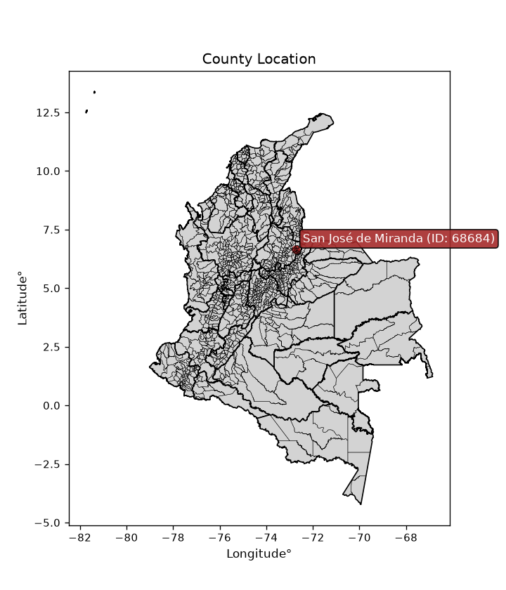
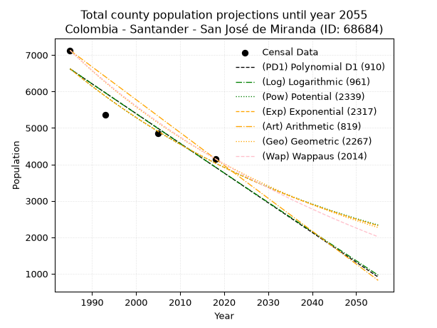
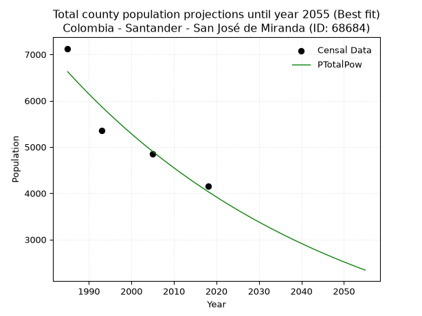
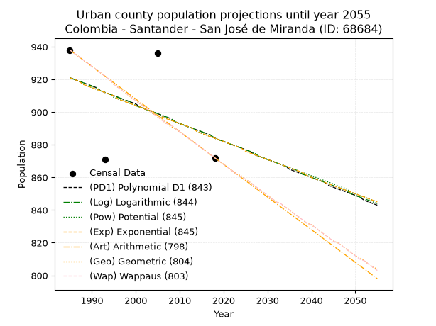
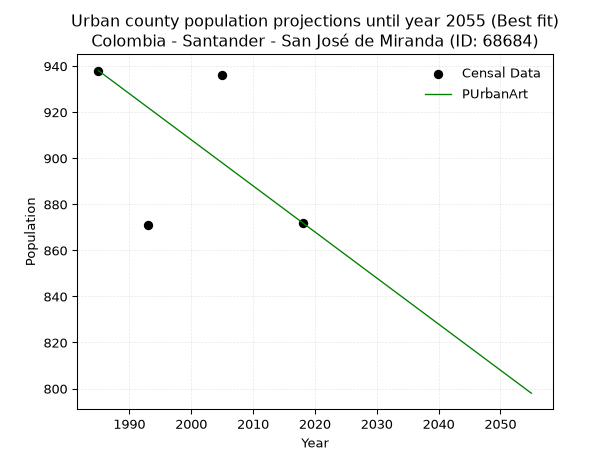
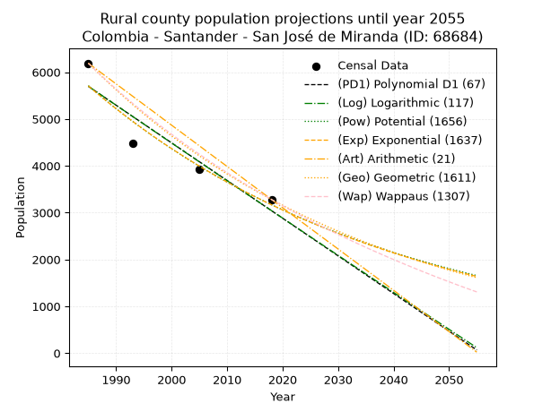
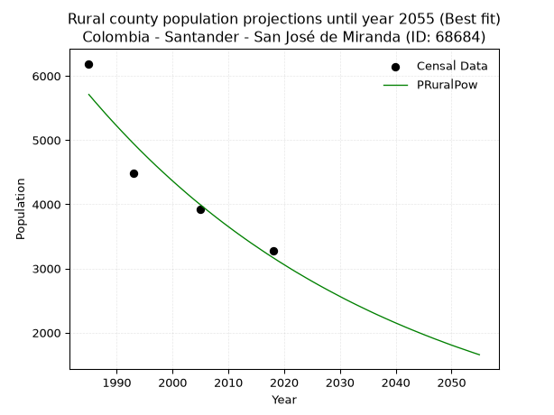

<div align="center">


</div>

# _“Population and Public Services Demand Projections (PPSD) until Year 2050 for Colombia - Santander - San José de Miranda (ID: 68684)”_
Keywords: `population` `public-service` `projection` `lineal` `polynomial` `logarithmic` `potential` `exponential` `arithmetic` `geometric` `wappaus` `dane` `colombia` `south-america`

PPSD are analytical estimates used by governments and planners to anticipate future changes in population size, age distribution, and the resulting community needs for utilities, healthcare, education, and infrastructure as sizing future water treatment facilities, electrical grids, and road networks based on spatial growth.

<div align="center">

</img>

</div>


> **General running parameters**: • app_version: _v20260806_. • Python version: _3.14.7_. • Pandas version: _3.0.5_. • NumPy version: _2.5.1_. • Creates, save and include plots into reports (create_plot): _False_. • Projection until year: _2050_. • Process polynomial degree 2 and up: _False_. • Process Wappaus: _True_. • Process Wappaus: _True_. • Set negative values to zero: _True_. • Set infinite values to zero: _True_. • Drop dataset notes: _True_. 
<div align="center">

Dynamic map: [:earth_americas:Google](http://maps.google.com/maps?q=6.658994797,-72.7336159) [:earth_americas:OSM](https://www.openstreetmap.org/#map=18/6.658994797/-72.7336159&layers=P) [:earth_americas:Bing](https://www.bing.com/maps?cp=6.658994797~-72.7336159&lvl=18) [:earth_americas:Apple](https://maps.apple.com/frame?center=6.658994797%2C-72.7336159&span=0.003%2C0.006)

</div>


<div align="center">

```geojson
{
  "type": "Feature",
  "geometry": {
    "type": "Point", 
    "coordinates": [-72.7336159, 6.658994797]
  }, 
  "properties": {
    "Name": "Colombia - Santander - San José de Miranda (ID: 68684)"
  }
}
```

</div>


## 0. Census Data (4 records)

Census data are official statistics collected by a government about the people and housing in a country. They usually include counts of total population, age, sex, race, income, education, and jobs.

📅Global census file: [Population.xlsx](../data/Population.xlsx)

| Source   |   Year |   CountryID | CountryName   |   StateID | StateName   |   CountyID | CountyName          |   PTotal |   PUrban |   PRural |
|:---------|-------:|------------:|:--------------|----------:|:------------|-----------:|:--------------------|---------:|---------:|---------:|
| DANE     |   1985 |          57 | Colombia      |        68 | Santander   |      68684 | San José de Miranda |     7127 |      938 |     6189 |
| DANE     |   1993 |          57 | Colombia      |        68 | Santander   |      68684 | San José de Miranda |     5360 |      871 |     4489 |
| DANE     |   2005 |          57 | Colombia      |        68 | Santander   |      68684 | San José de Miranda |     4855 |      936 |     3919 |
| DANE     |   2018 |          57 | Colombia      |        68 | Santander   |      68684 | San José de Miranda |     4153 |      872 |     3281 |

> 🔥Some records could had specific notes about the registered values or the corresponding urban or rural distribution.

📅[SUI-RUPS](https://www.datos.gov.co/Hacienda-y-Cr-dito-P-blico/Registro-nico-de-Prestadores-de-Servicios-P-blicos/4qkq-csdn/about_data) - Local public utility companies: [RUPS.csv](../data/RUPS.xlsx)

 | SERVICIO       | ESTADO    | NOMBRE                                                                                                                     | NIT         | DEPARTAMENTO_DOMICILIO   | MUNICIPIO_DOMICILIO   | DIRECCION           |   TELEFONO | EMAIL                                          | TIPO_PRESTADOR                            | CLASIFICACION                 |
|:---------------|:----------|:---------------------------------------------------------------------------------------------------------------------------|:------------|:-------------------------|:----------------------|:--------------------|-----------:|:-----------------------------------------------|:------------------------------------------|:------------------------------|
| ACUEDUCTO      | OPERATIVA | EMPRESAS PUBLICAS MUNICIPALES DE MALAGA  E.S.P.                                                                            | 890205049-0 | SANTANDER                | MALAGA                | Calle 13 No. 6a-58  |    6617858 | gerencia@espmalaga.gov.co                      | EMPRESA INDUSTRIAL Y COMERCIAL DEL ESTADO | MAYOR O IGUAL A 5001 USUARIOS |
| ACUEDUCTO      | OPERATIVA | UNIDAD MUNICIPAL DE SERVICIOS PUBLICOS DOMICILIARIOS DE ACUEDUCTO, ALCANTARILLADO Y ASEO DE SAN JOSE DE MIRANDA, SANTANDER | 890204890-4 | SANTANDER                | SAN JOSE DE MIRANDA   | CARRERA 4 No 3 - 31 |    6626003 | CONTACTENOS@SANJOSEDEMIRANDA.-SANTANDER.GOV.CO | MUNICIPIO (PRESTACIÓN DIRECTA)            | MENOR O IGUAL A 2500 USUARIOS |
| ALCANTARILLADO | OPERATIVA | UNIDAD MUNICIPAL DE SERVICIOS PUBLICOS DOMICILIARIOS DE ACUEDUCTO, ALCANTARILLADO Y ASEO DE SAN JOSE DE MIRANDA, SANTANDER | 890204890-4 | SANTANDER                | SAN JOSE DE MIRANDA   | CARRERA 4 No 3 - 31 |    6626003 | CONTACTENOS@SANJOSEDEMIRANDA.-SANTANDER.GOV.CO | MUNICIPIO (PRESTACIÓN DIRECTA)            | MENOR O IGUAL A 2500 USUARIOS |

## 1. Total

### 1.1. Coefficients and Parameters

* (PD1) Polynomial Deg 1: -81.52509032517013, 168444.31192292157 (lineal)
* (Log) Logarithmic: -163307.15067580095, 1246672.7109481383
* (Pow) Potential: -30.04932877303972, 102.91676881414465
* (Exp) Exponential: -0.015004053614583623, 5.696919790499882e+16
* (Art) Arithmetic: Year diff. 2018 - 1985 = 33, Population diff. 4153 - 7127 = -2974, Annual growth = -90.12121212121212
* (Geo) Geometric: Year diff. 2018 - 1985 = 33, Population diff. 4153 - 7127 = -2974, Annual growth % = -0.016232250861520692
* (Wap) Wappaus: i = -1.5978938319363851, Condition values only valid for < 200)

<sub>
Wappaus condition values: ['-0.00', '-1.60', '-3.20', '-4.79', '-6.39', '-7.99', '-9.59', '-11.19', '-12.78', '-14.38', '-15.98', '-17.58', '-19.17', '-20.77', '-22.37', '-23.97', '-25.57', '-27.16', '-28.76', '-30.36', '-31.96', '-33.56', '-35.15', '-36.75', '-38.35', '-39.95', '-41.55', '-43.14', '-44.74', '-46.34', '-47.94', '-49.53', '-51.13', '-52.73', '-54.33', '-55.93', '-57.52', '-59.12', '-60.72', '-62.32', '-63.92', '-65.51', '-67.11', '-68.71', '-70.31', '-71.91', '-73.50', '-75.10', '-76.70', '-78.30', '-79.89', '-81.49', '-83.09', '-84.69', '-86.29', '-87.88', '-89.48', '-91.08', '-92.68', '-94.28', '-95.87', '-97.47', '-99.07', '-100.67', '-102.27', '-103.86']
</sub>


### 1.2. Projected Dataset

|   Year |   CountyID |   PTotalPD1 |   PTotalLog |   PTotalPow |   PTotalExp |   PTotalArt |   PTotalGeo |   PTotalWap |
|-------:|-----------:|------------:|------------:|------------:|------------:|------------:|------------:|------------:|
|   1985 |      68684 |        6617 |        6620 |        6626 |        6623 |        7127 |        7127 |        7127 |
|   1986 |      68684 |        6535 |        6538 |        6527 |        6524 |        7037 |        7011 |        7014 |
|   1987 |      68684 |        6454 |        6456 |        6429 |        6427 |        6947 |        6898 |        6903 |
|   1988 |      68684 |        6372 |        6374 |        6332 |        6331 |        6857 |        6786 |        6793 |
|   1989 |      68684 |        6291 |        6292 |        6237 |        6237 |        6767 |        6675 |        6686 |
|   1990 |      68684 |        6209 |        6210 |        6144 |        6144 |        6676 |        6567 |        6579 |
|   1991 |      68684 |        6128 |        6128 |        6052 |        6052 |        6586 |        6460 |        6475 |
|   1992 |      68684 |        6046 |        6046 |        5961 |        5962 |        6496 |        6356 |        6372 |
|   1993 |      68684 |        5965 |        5964 |        5872 |        5874 |        6406 |        6252 |        6271 |
|   1994 |      68684 |        5883 |        5882 |        5784 |        5786 |        6316 |        6151 |        6171 |
|   1995 |      68684 |        5802 |        5800 |        5698 |        5700 |        6226 |        6051 |        6072 |
|   1996 |      68684 |        5720 |        5718 |        5613 |        5615 |        6136 |        5953 |        5975 |
|   1997 |      68684 |        5639 |        5636 |        5529 |        5531 |        6046 |        5856 |        5880 |
|   1998 |      68684 |        5557 |        5554 |        5446 |        5449 |        5955 |        5761 |        5786 |
|   1999 |      68684 |        5476 |        5473 |        5365 |        5368 |        5865 |        5668 |        5693 |
|   2000 |      68684 |        5394 |        5391 |        5285 |        5288 |        5775 |        5576 |        5602 |
|   2001 |      68684 |        5313 |        5309 |        5206 |        5209 |        5685 |        5485 |        5511 |
|   2002 |      68684 |        5231 |        5228 |        5128 |        5132 |        5595 |        5396 |        5423 |
|   2003 |      68684 |        5150 |        5146 |        5052 |        5055 |        5505 |        5309 |        5335 |
|   2004 |      68684 |        5068 |        5065 |        4977 |        4980 |        5415 |        5222 |        5248 |
|   2005 |      68684 |        4987 |        4983 |        4903 |        4906 |        5325 |        5138 |        5163 |
|   2006 |      68684 |        4905 |        4902 |        4830 |        4833 |        5234 |        5054 |        5079 |
|   2007 |      68684 |        4823 |        4820 |        4758 |        4761 |        5144 |        4972 |        4996 |
|   2008 |      68684 |        4742 |        4739 |        4687 |        4690 |        5054 |        4891 |        4914 |
|   2009 |      68684 |        4660 |        4658 |        4618 |        4620 |        4964 |        4812 |        4834 |
|   2010 |      68684 |        4579 |        4576 |        4549 |        4551 |        4874 |        4734 |        4754 |
|   2011 |      68684 |        4497 |        4495 |        4482 |        4483 |        4784 |        4657 |        4675 |
|   2012 |      68684 |        4416 |        4414 |        4415 |        4417 |        4694 |        4581 |        4598 |
|   2013 |      68684 |        4334 |        4333 |        4350 |        4351 |        4604 |        4507 |        4521 |
|   2014 |      68684 |        4253 |        4252 |        4285 |        4286 |        4513 |        4434 |        4446 |
|   2015 |      68684 |        4171 |        4171 |        4222 |        4222 |        4423 |        4362 |        4371 |
|   2016 |      68684 |        4090 |        4090 |        4160 |        4159 |        4333 |        4291 |        4297 |
|   2017 |      68684 |        4008 |        4009 |        4098 |        4097 |        4243 |        4222 |        4225 |
|   2018 |      68684 |        3927 |        3928 |        4037 |        4036 |        4153 |        4153 |        4153 |
|   2019 |      68684 |        3845 |        3847 |        3978 |        3976 |        4063 |        4086 |        4082 |
|   2020 |      68684 |        3764 |        3766 |        3919 |        3917 |        3973 |        4019 |        4012 |
|   2021 |      68684 |        3682 |        3685 |        3861 |        3859 |        3883 |        3954 |        3943 |
|   2022 |      68684 |        3601 |        3604 |        3804 |        3801 |        3793 |        3890 |        3875 |
|   2023 |      68684 |        3519 |        3524 |        3748 |        3745 |        3702 |        3827 |        3807 |
|   2024 |      68684 |        3438 |        3443 |        3693 |        3689 |        3612 |        3765 |        3741 |
|   2025 |      68684 |        3356 |        3362 |        3638 |        3634 |        3522 |        3703 |        3675 |
|   2026 |      68684 |        3274 |        3282 |        3585 |        3580 |        3432 |        3643 |        3610 |
|   2027 |      68684 |        3193 |        3201 |        3532 |        3527 |        3342 |        3584 |        3546 |
|   2028 |      68684 |        3111 |        3121 |        3480 |        3474 |        3252 |        3526 |        3482 |
|   2029 |      68684 |        3030 |        3040 |        3429 |        3422 |        3162 |        3469 |        3420 |
|   2030 |      68684 |        2948 |        2960 |        3379 |        3371 |        3072 |        3413 |        3358 |
|   2031 |      68684 |        2867 |        2879 |        3329 |        3321 |        2981 |        3357 |        3296 |
|   2032 |      68684 |        2785 |        2799 |        3280 |        3272 |        2891 |        3303 |        3236 |
|   2033 |      68684 |        2704 |        2718 |        3232 |        3223 |        2801 |        3249 |        3176 |
|   2034 |      68684 |        2622 |        2638 |        3185 |        3175 |        2711 |        3196 |        3117 |
|   2035 |      68684 |        2541 |        2558 |        3138 |        3128 |        2621 |        3144 |        3058 |
|   2036 |      68684 |        2459 |        2478 |        3092 |        3081 |        2531 |        3093 |        3000 |
|   2037 |      68684 |        2378 |        2397 |        3047 |        3035 |        2441 |        3043 |        2943 |
|   2038 |      68684 |        2296 |        2317 |        3002 |        2990 |        2351 |        2994 |        2887 |
|   2039 |      68684 |        2215 |        2237 |        2958 |        2945 |        2260 |        2945 |        2831 |
|   2040 |      68684 |        2133 |        2157 |        2915 |        2902 |        2170 |        2897 |        2776 |
|   2041 |      68684 |        2052 |        2077 |        2872 |        2858 |        2080 |        2850 |        2721 |
|   2042 |      68684 |        1970 |        1997 |        2830 |        2816 |        1990 |        2804 |        2667 |
|   2043 |      68684 |        1889 |        1917 |        2789 |        2774 |        1900 |        2759 |        2613 |
|   2044 |      68684 |        1807 |        1837 |        2748 |        2733 |        1810 |        2714 |        2561 |
|   2045 |      68684 |        1726 |        1757 |        2708 |        2692 |        1720 |        2670 |        2508 |
|   2046 |      68684 |        1644 |        1677 |        2669 |        2652 |        1630 |        2626 |        2456 |
|   2047 |      68684 |        1562 |        1598 |        2630 |        2612 |        1539 |        2584 |        2405 |
|   2048 |      68684 |        1481 |        1518 |        2591 |        2573 |        1449 |        2542 |        2355 |
|   2049 |      68684 |        1399 |        1438 |        2554 |        2535 |        1359 |        2501 |        2304 |
|   2050 |      68684 |        1318 |        1359 |        2516 |        2497 |        1269 |        2460 |        2255 |
<div align="center">

</img>

</div>


### 1.3. Best fit with absolute and relative error (%)

Relative error puts that difference into context by dividing the absolute error by the true value, creating a unitless ratio or percentage that shows the scale of the mistake.

Absolute and relative error

|   Year | Source   |   CountryID | CountryName   |   StateID | StateName   |   CountyID_x | CountyName          |   PTotal |   PUrban |   PRural |   CountyID_y |   PTotalPD1 |   PTotalLog |   PTotalPow |   PTotalExp |   PTotalArt |   PTotalGeo |   PTotalWap |   PTotalPD1AbsError |   PTotalLogAbsError |   PTotalPowAbsError |   PTotalExpAbsError |   PTotalArtAbsError |   PTotalGeoAbsError |   PTotalWapAbsError |   PTotalPD1RelError |   PTotalLogRelError |   PTotalPowRelError |   PTotalExpRelError |   PTotalArtRelError |   PTotalGeoRelError |   PTotalWapRelError |
|-------:|:---------|------------:|:--------------|----------:|:------------|-------------:|:--------------------|---------:|---------:|---------:|-------------:|------------:|------------:|------------:|------------:|------------:|------------:|------------:|--------------------:|--------------------:|--------------------:|--------------------:|--------------------:|--------------------:|--------------------:|--------------------:|--------------------:|--------------------:|--------------------:|--------------------:|--------------------:|--------------------:|
|   1985 | DANE     |          57 | Colombia      |        68 | Santander   |        68684 | San José de Miranda |     7127 |      938 |     6189 |        68684 |        6617 |        6620 |        6626 |        6623 |        7127 |        7127 |        7127 |                 510 |                 507 |                 501 |                 504 |                   0 |                   0 |                   0 |             7.15589 |             7.11379 |            7.02961  |             7.0717  |             0       |             0       |             0       |
|   1993 | DANE     |          57 | Colombia      |        68 | Santander   |        68684 | San José de Miranda |     5360 |      871 |     4489 |        68684 |        5965 |        5964 |        5872 |        5874 |        6406 |        6252 |        6271 |                 605 |                 604 |                 512 |                 514 |                1046 |                 892 |                 911 |            11.2873  |            11.2687  |            9.55224  |             9.58955 |            19.5149  |            16.6418  |            16.9963  |
|   2005 | DANE     |          57 | Colombia      |        68 | Santander   |        68684 | San José de Miranda |     4855 |      936 |     3919 |        68684 |        4987 |        4983 |        4903 |        4906 |        5325 |        5138 |        5163 |                 132 |                 128 |                  48 |                  51 |                 470 |                 283 |                 308 |             2.71885 |             2.63646 |            0.988671 |             1.05046 |             9.68074 |             5.82904 |             6.34398 |
|   2018 | DANE     |          57 | Colombia      |        68 | Santander   |        68684 | San José de Miranda |     4153 |      872 |     3281 |        68684 |        3927 |        3928 |        4037 |        4036 |        4153 |        4153 |        4153 |                 226 |                 225 |                 116 |                 117 |                   0 |                   0 |                   0 |             5.44185 |             5.41777 |            2.79316  |             2.81724 |             0       |             0       |             0       |

Relative error mean

| Method    |   RelError | Best   |
|:----------|-----------:|:-------|
| PTotalPD1 |    6.65097 |        |
| PTotalLog |    6.60917 |        |
| PTotalPow |    5.09092 | True   |
| PTotalExp |    5.13224 |        |
| PTotalArt |    7.29892 |        |
| PTotalGeo |    5.61771 |        |
| PTotalWap |    5.83506 |        |

💙Best method: _**PTotalPow**_
<div align="center">

</img>

</div>


### 1.4. Fresh water supply demand in liters per capita per day (lpcd)

The fresh water supply demand typically ranges from 100 to 300 liters per capita per day (lpcd) for standard domestic and municipal planning, though absolute survival minimums set by the World Health Organization are as low as 7.5 to 20 liters per day, and total consumption in high-income nations can exceed 400 liters.

> `CZ`: Level in meters above the sea level (masl)<br> `WS`: Fresh water supply demand in liters per capita per day (lpcd or l/h/d)<br> `WSAll`: Zonal fresh water supply demand in liters per second (l/s)<br> `A`: Zonal area in square meters<br> `DP`: Population density (people/hectare or p/ha)

Reference values (RAS Colombia)

|    CZ |   WS |
|------:|-----:|
|  1000 |  120 |
|  2000 |  130 |
| 99999 |  140 |

County shapefile geometry properties and water supply values

|   CountyID |      ATotal |   CZTotal |   WSTotal |
|-----------:|------------:|----------:|----------:|
|      68684 | 7.51329e+07 |   1893.85 |       130 |

Projected values for best method: PTotalPow

|   CountyID |   Year |   PTotalPow |   DPTotal |   WSTotal |   WSTotalAll |
|-----------:|-------:|------------:|----------:|----------:|-------------:|
|      68684 |   1985 |        6626 |      0.88 |       130 |      9.96968 |
|      68684 |   1986 |        6527 |      0.87 |       130 |      9.82072 |
|      68684 |   1987 |        6429 |      0.86 |       130 |      9.67326 |
|      68684 |   1988 |        6332 |      0.84 |       130 |      9.52731 |
|      68684 |   1989 |        6237 |      0.83 |       130 |      9.38438 |
|      68684 |   1990 |        6144 |      0.82 |       130 |      9.24444 |
|      68684 |   1991 |        6052 |      0.81 |       130 |      9.10602 |
|      68684 |   1992 |        5961 |      0.79 |       130 |      8.9691  |
|      68684 |   1993 |        5872 |      0.78 |       130 |      8.83519 |
|      68684 |   1994 |        5784 |      0.77 |       130 |      8.70278 |
|      68684 |   1995 |        5698 |      0.76 |       130 |      8.57338 |
|      68684 |   1996 |        5613 |      0.75 |       130 |      8.44549 |
|      68684 |   1997 |        5529 |      0.74 |       130 |      8.3191  |
|      68684 |   1998 |        5446 |      0.72 |       130 |      8.19421 |
|      68684 |   1999 |        5365 |      0.71 |       130 |      8.07234 |
|      68684 |   2000 |        5285 |      0.7  |       130 |      7.95197 |
|      68684 |   2001 |        5206 |      0.69 |       130 |      7.8331  |
|      68684 |   2002 |        5128 |      0.68 |       130 |      7.71574 |
|      68684 |   2003 |        5052 |      0.67 |       130 |      7.60139 |
|      68684 |   2004 |        4977 |      0.66 |       130 |      7.48854 |
|      68684 |   2005 |        4903 |      0.65 |       130 |      7.3772  |
|      68684 |   2006 |        4830 |      0.64 |       130 |      7.26736 |
|      68684 |   2007 |        4758 |      0.63 |       130 |      7.15903 |
|      68684 |   2008 |        4687 |      0.62 |       130 |      7.0522  |
|      68684 |   2009 |        4618 |      0.61 |       130 |      6.94838 |
|      68684 |   2010 |        4549 |      0.61 |       130 |      6.84456 |
|      68684 |   2011 |        4482 |      0.6  |       130 |      6.74375 |
|      68684 |   2012 |        4415 |      0.59 |       130 |      6.64294 |
|      68684 |   2013 |        4350 |      0.58 |       130 |      6.54514 |
|      68684 |   2014 |        4285 |      0.57 |       130 |      6.44734 |
|      68684 |   2015 |        4222 |      0.56 |       130 |      6.35255 |
|      68684 |   2016 |        4160 |      0.55 |       130 |      6.25926 |
|      68684 |   2017 |        4098 |      0.55 |       130 |      6.16597 |
|      68684 |   2018 |        4037 |      0.54 |       130 |      6.07419 |
|      68684 |   2019 |        3978 |      0.53 |       130 |      5.98542 |
|      68684 |   2020 |        3919 |      0.52 |       130 |      5.89664 |
|      68684 |   2021 |        3861 |      0.51 |       130 |      5.80938 |
|      68684 |   2022 |        3804 |      0.51 |       130 |      5.72361 |
|      68684 |   2023 |        3748 |      0.5  |       130 |      5.63935 |
|      68684 |   2024 |        3693 |      0.49 |       130 |      5.5566  |
|      68684 |   2025 |        3638 |      0.48 |       130 |      5.47384 |
|      68684 |   2026 |        3585 |      0.48 |       130 |      5.3941  |
|      68684 |   2027 |        3532 |      0.47 |       130 |      5.31435 |
|      68684 |   2028 |        3480 |      0.46 |       130 |      5.23611 |
|      68684 |   2029 |        3429 |      0.46 |       130 |      5.15937 |
|      68684 |   2030 |        3379 |      0.45 |       130 |      5.08414 |
|      68684 |   2031 |        3329 |      0.44 |       130 |      5.00891 |
|      68684 |   2032 |        3280 |      0.44 |       130 |      4.93519 |
|      68684 |   2033 |        3232 |      0.43 |       130 |      4.86296 |
|      68684 |   2034 |        3185 |      0.42 |       130 |      4.79225 |
|      68684 |   2035 |        3138 |      0.42 |       130 |      4.72153 |
|      68684 |   2036 |        3092 |      0.41 |       130 |      4.65231 |
|      68684 |   2037 |        3047 |      0.41 |       130 |      4.58461 |
|      68684 |   2038 |        3002 |      0.4  |       130 |      4.5169  |
|      68684 |   2039 |        2958 |      0.39 |       130 |      4.45069 |
|      68684 |   2040 |        2915 |      0.39 |       130 |      4.386   |
|      68684 |   2041 |        2872 |      0.38 |       130 |      4.3213  |
|      68684 |   2042 |        2830 |      0.38 |       130 |      4.2581  |
|      68684 |   2043 |        2789 |      0.37 |       130 |      4.19641 |
|      68684 |   2044 |        2748 |      0.37 |       130 |      4.13472 |
|      68684 |   2045 |        2708 |      0.36 |       130 |      4.07454 |
|      68684 |   2046 |        2669 |      0.36 |       130 |      4.01586 |
|      68684 |   2047 |        2630 |      0.35 |       130 |      3.95718 |
|      68684 |   2048 |        2591 |      0.34 |       130 |      3.8985  |
|      68684 |   2049 |        2554 |      0.34 |       130 |      3.84282 |
|      68684 |   2050 |        2516 |      0.33 |       130 |      3.78565 |

## 2. Urban

### 2.1. Coefficients and Parameters

* (PD1) Polynomial Deg 1: -1.116419108791615, 3137.3673223604287 (lineal)
* (Log) Logarithmic: -2233.5794726814484, 17881.705470634268
* (Pow) Potential: -2.466986590144245, 11.099713155097565
* (Exp) Exponential: -0.0012330875421478701, 10645.926000016572
* (Art) Arithmetic: Year diff. 2018 - 1985 = 33, Population diff. 872 - 938 = -66, Annual growth = -2.0
* (Geo) Geometric: Year diff. 2018 - 1985 = 33, Population diff. 872 - 938 = -66, Annual growth % = -0.002208482708504045
* (Wap) Wappaus: i = -0.22099447513812154, Condition values only valid for < 200)

<sub>
Wappaus condition values: ['-0.00', '-0.22', '-0.44', '-0.66', '-0.88', '-1.10', '-1.33', '-1.55', '-1.77', '-1.99', '-2.21', '-2.43', '-2.65', '-2.87', '-3.09', '-3.31', '-3.54', '-3.76', '-3.98', '-4.20', '-4.42', '-4.64', '-4.86', '-5.08', '-5.30', '-5.52', '-5.75', '-5.97', '-6.19', '-6.41', '-6.63', '-6.85', '-7.07', '-7.29', '-7.51', '-7.73', '-7.96', '-8.18', '-8.40', '-8.62', '-8.84', '-9.06', '-9.28', '-9.50', '-9.72', '-9.94', '-10.17', '-10.39', '-10.61', '-10.83', '-11.05', '-11.27', '-11.49', '-11.71', '-11.93', '-12.15', '-12.38', '-12.60', '-12.82', '-13.04', '-13.26', '-13.48', '-13.70', '-13.92', '-14.14', '-14.36']
</sub>


### 2.2. Projected Dataset

|   Year |   CountyID |   PUrbanPD1 |   PUrbanLog |   PUrbanPow |   PUrbanExp |   PUrbanArt |   PUrbanGeo |   PUrbanWap |
|-------:|-----------:|------------:|------------:|------------:|------------:|------------:|------------:|------------:|
|   1985 |      68684 |         921 |         921 |         921 |         921 |         938 |         938 |         938 |
|   1986 |      68684 |         920 |         920 |         920 |         920 |         936 |         936 |         936 |
|   1987 |      68684 |         919 |         919 |         919 |         919 |         934 |         934 |         934 |
|   1988 |      68684 |         918 |         918 |         917 |         917 |         932 |         932 |         932 |
|   1989 |      68684 |         917 |         917 |         916 |         916 |         930 |         930 |         930 |
|   1990 |      68684 |         916 |         916 |         915 |         915 |         928 |         928 |         928 |
|   1991 |      68684 |         915 |         915 |         914 |         914 |         926 |         926 |         926 |
|   1992 |      68684 |         913 |         913 |         913 |         913 |         924 |         924 |         924 |
|   1993 |      68684 |         912 |         912 |         912 |         912 |         922 |         922 |         922 |
|   1994 |      68684 |         911 |         911 |         911 |         911 |         920 |         920 |         920 |
|   1995 |      68684 |         910 |         910 |         909 |         910 |         918 |         917 |         917 |
|   1996 |      68684 |         909 |         909 |         908 |         908 |         916 |         915 |         915 |
|   1997 |      68684 |         908 |         908 |         907 |         907 |         914 |         913 |         913 |
|   1998 |      68684 |         907 |         907 |         906 |         906 |         912 |         911 |         911 |
|   1999 |      68684 |         906 |         906 |         905 |         905 |         910 |         909 |         909 |
|   2000 |      68684 |         905 |         904 |         904 |         904 |         908 |         907 |         907 |
|   2001 |      68684 |         903 |         903 |         903 |         903 |         906 |         905 |         905 |
|   2002 |      68684 |         902 |         902 |         902 |         902 |         904 |         903 |         903 |
|   2003 |      68684 |         901 |         901 |         901 |         901 |         902 |         901 |         901 |
|   2004 |      68684 |         900 |         900 |         899 |         899 |         900 |         899 |         899 |
|   2005 |      68684 |         899 |         899 |         898 |         898 |         898 |         897 |         897 |
|   2006 |      68684 |         898 |         898 |         897 |         897 |         896 |         895 |         895 |
|   2007 |      68684 |         897 |         897 |         896 |         896 |         894 |         893 |         893 |
|   2008 |      68684 |         896 |         896 |         895 |         895 |         892 |         891 |         892 |
|   2009 |      68684 |         894 |         894 |         894 |         894 |         890 |         890 |         890 |
|   2010 |      68684 |         893 |         893 |         893 |         893 |         888 |         888 |         888 |
|   2011 |      68684 |         892 |         892 |         892 |         892 |         886 |         886 |         886 |
|   2012 |      68684 |         891 |         891 |         891 |         891 |         884 |         884 |         884 |
|   2013 |      68684 |         890 |         890 |         890 |         890 |         882 |         882 |         882 |
|   2014 |      68684 |         889 |         889 |         888 |         888 |         880 |         880 |         880 |
|   2015 |      68684 |         888 |         888 |         887 |         887 |         878 |         878 |         878 |
|   2016 |      68684 |         887 |         887 |         886 |         886 |         876 |         876 |         876 |
|   2017 |      68684 |         886 |         886 |         885 |         885 |         874 |         874 |         874 |
|   2018 |      68684 |         884 |         884 |         884 |         884 |         872 |         872 |         872 |
|   2019 |      68684 |         883 |         883 |         883 |         883 |         870 |         870 |         870 |
|   2020 |      68684 |         882 |         882 |         882 |         882 |         868 |         868 |         868 |
|   2021 |      68684 |         881 |         881 |         881 |         881 |         866 |         866 |         866 |
|   2022 |      68684 |         880 |         880 |         880 |         880 |         864 |         864 |         864 |
|   2023 |      68684 |         879 |         879 |         879 |         879 |         862 |         862 |         862 |
|   2024 |      68684 |         878 |         878 |         878 |         878 |         860 |         861 |         860 |
|   2025 |      68684 |         877 |         877 |         877 |         876 |         858 |         859 |         859 |
|   2026 |      68684 |         876 |         876 |         876 |         875 |         856 |         857 |         857 |
|   2027 |      68684 |         874 |         875 |         874 |         874 |         854 |         855 |         855 |
|   2028 |      68684 |         873 |         873 |         873 |         873 |         852 |         853 |         853 |
|   2029 |      68684 |         872 |         872 |         872 |         872 |         850 |         851 |         851 |
|   2030 |      68684 |         871 |         871 |         871 |         871 |         848 |         849 |         849 |
|   2031 |      68684 |         870 |         870 |         870 |         870 |         846 |         847 |         847 |
|   2032 |      68684 |         869 |         869 |         869 |         869 |         844 |         845 |         845 |
|   2033 |      68684 |         868 |         868 |         868 |         868 |         842 |         844 |         844 |
|   2034 |      68684 |         867 |         867 |         867 |         867 |         840 |         842 |         842 |
|   2035 |      68684 |         865 |         866 |         866 |         866 |         838 |         840 |         840 |
|   2036 |      68684 |         864 |         865 |         865 |         865 |         836 |         838 |         838 |
|   2037 |      68684 |         863 |         864 |         864 |         864 |         834 |         836 |         836 |
|   2038 |      68684 |         862 |         862 |         863 |         863 |         832 |         834 |         834 |
|   2039 |      68684 |         861 |         861 |         862 |         861 |         830 |         832 |         832 |
|   2040 |      68684 |         860 |         860 |         861 |         860 |         828 |         831 |         831 |
|   2041 |      68684 |         859 |         859 |         860 |         859 |         826 |         829 |         829 |
|   2042 |      68684 |         858 |         858 |         859 |         858 |         824 |         827 |         827 |
|   2043 |      68684 |         857 |         857 |         858 |         857 |         822 |         825 |         825 |
|   2044 |      68684 |         855 |         856 |         857 |         856 |         820 |         823 |         823 |
|   2045 |      68684 |         854 |         855 |         856 |         855 |         818 |         821 |         821 |
|   2046 |      68684 |         853 |         854 |         855 |         854 |         816 |         820 |         820 |
|   2047 |      68684 |         852 |         853 |         854 |         853 |         814 |         818 |         818 |
|   2048 |      68684 |         851 |         852 |         853 |         852 |         812 |         816 |         816 |
|   2049 |      68684 |         850 |         850 |         851 |         851 |         810 |         814 |         814 |
|   2050 |      68684 |         849 |         849 |         850 |         850 |         808 |         812 |         812 |
<div align="center">

</img>

</div>


### 2.3. Best fit with absolute and relative error (%)

Relative error puts that difference into context by dividing the absolute error by the true value, creating a unitless ratio or percentage that shows the scale of the mistake.

Absolute and relative error

|   Year | Source   |   CountryID | CountryName   |   StateID | StateName   |   CountyID_x | CountyName          |   PTotal |   PUrban |   PRural |   CountyID_y |   PUrbanPD1 |   PUrbanLog |   PUrbanPow |   PUrbanExp |   PUrbanArt |   PUrbanGeo |   PUrbanWap |   PUrbanPD1AbsError |   PUrbanLogAbsError |   PUrbanPowAbsError |   PUrbanExpAbsError |   PUrbanArtAbsError |   PUrbanGeoAbsError |   PUrbanWapAbsError |   PUrbanPD1RelError |   PUrbanLogRelError |   PUrbanPowRelError |   PUrbanExpRelError |   PUrbanArtRelError |   PUrbanGeoRelError |   PUrbanWapRelError |
|-------:|:---------|------------:|:--------------|----------:|:------------|-------------:|:--------------------|---------:|---------:|---------:|-------------:|------------:|------------:|------------:|------------:|------------:|------------:|------------:|--------------------:|--------------------:|--------------------:|--------------------:|--------------------:|--------------------:|--------------------:|--------------------:|--------------------:|--------------------:|--------------------:|--------------------:|--------------------:|--------------------:|
|   1985 | DANE     |          57 | Colombia      |        68 | Santander   |        68684 | San José de Miranda |     7127 |      938 |     6189 |        68684 |         921 |         921 |         921 |         921 |         938 |         938 |         938 |                  17 |                  17 |                  17 |                  17 |                   0 |                   0 |                   0 |             1.81237 |             1.81237 |             1.81237 |             1.81237 |             0       |             0       |             0       |
|   1993 | DANE     |          57 | Colombia      |        68 | Santander   |        68684 | San José de Miranda |     5360 |      871 |     4489 |        68684 |         912 |         912 |         912 |         912 |         922 |         922 |         922 |                  41 |                  41 |                  41 |                  41 |                  51 |                  51 |                  51 |             4.70723 |             4.70723 |             4.70723 |             4.70723 |             5.85534 |             5.85534 |             5.85534 |
|   2005 | DANE     |          57 | Colombia      |        68 | Santander   |        68684 | San José de Miranda |     4855 |      936 |     3919 |        68684 |         899 |         899 |         898 |         898 |         898 |         897 |         897 |                  37 |                  37 |                  38 |                  38 |                  38 |                  39 |                  39 |             3.95299 |             3.95299 |             4.05983 |             4.05983 |             4.05983 |             4.16667 |             4.16667 |
|   2018 | DANE     |          57 | Colombia      |        68 | Santander   |        68684 | San José de Miranda |     4153 |      872 |     3281 |        68684 |         884 |         884 |         884 |         884 |         872 |         872 |         872 |                  12 |                  12 |                  12 |                  12 |                   0 |                   0 |                   0 |             1.37615 |             1.37615 |             1.37615 |             1.37615 |             0       |             0       |             0       |

Relative error mean

| Method    |   RelError | Best   |
|:----------|-----------:|:-------|
| PUrbanPD1 |    2.96218 |        |
| PUrbanLog |    2.96218 |        |
| PUrbanPow |    2.98889 |        |
| PUrbanExp |    2.98889 |        |
| PUrbanArt |    2.47879 | True   |
| PUrbanGeo |    2.5055  |        |
| PUrbanWap |    2.5055  |        |

💙Best method: _**PUrbanArt**_
<div align="center">

</img>

</div>


### 2.4. Fresh water supply demand in liters per capita per day (lpcd)

The fresh water supply demand typically ranges from 100 to 300 liters per capita per day (lpcd) for standard domestic and municipal planning, though absolute survival minimums set by the World Health Organization are as low as 7.5 to 20 liters per day, and total consumption in high-income nations can exceed 400 liters.

> `CZ`: Level in meters above the sea level (masl)<br> `WS`: Fresh water supply demand in liters per capita per day (lpcd or l/h/d)<br> `WSAll`: Zonal fresh water supply demand in liters per second (l/s)<br> `A`: Zonal area in square meters<br> `DP`: Population density (people/hectare or p/ha)

Reference values (RAS Colombia)

|    CZ |   WS |
|------:|-----:|
|  1000 |  120 |
|  2000 |  130 |
| 99999 |  140 |

County shapefile geometry properties and water supply values

|   CountyID |   AUrban |   CZUrban |   WSUrban |
|-----------:|---------:|----------:|----------:|
|      68684 |   253333 |   1986.74 |       130 |

Projected values for best method: PUrbanArt

|   CountyID |   Year |   PUrbanArt |   DPUrban |   WSUrban |   WSUrbanAll |
|-----------:|-------:|------------:|----------:|----------:|-------------:|
|      68684 |   1985 |         938 |     37.03 |       130 |      1.41134 |
|      68684 |   1986 |         936 |     36.95 |       130 |      1.40833 |
|      68684 |   1987 |         934 |     36.87 |       130 |      1.40532 |
|      68684 |   1988 |         932 |     36.79 |       130 |      1.40231 |
|      68684 |   1989 |         930 |     36.71 |       130 |      1.39931 |
|      68684 |   1990 |         928 |     36.63 |       130 |      1.3963  |
|      68684 |   1991 |         926 |     36.55 |       130 |      1.39329 |
|      68684 |   1992 |         924 |     36.47 |       130 |      1.39028 |
|      68684 |   1993 |         922 |     36.39 |       130 |      1.38727 |
|      68684 |   1994 |         920 |     36.32 |       130 |      1.38426 |
|      68684 |   1995 |         918 |     36.24 |       130 |      1.38125 |
|      68684 |   1996 |         916 |     36.16 |       130 |      1.37824 |
|      68684 |   1997 |         914 |     36.08 |       130 |      1.37523 |
|      68684 |   1998 |         912 |     36    |       130 |      1.37222 |
|      68684 |   1999 |         910 |     35.92 |       130 |      1.36921 |
|      68684 |   2000 |         908 |     35.84 |       130 |      1.3662  |
|      68684 |   2001 |         906 |     35.76 |       130 |      1.36319 |
|      68684 |   2002 |         904 |     35.68 |       130 |      1.36019 |
|      68684 |   2003 |         902 |     35.61 |       130 |      1.35718 |
|      68684 |   2004 |         900 |     35.53 |       130 |      1.35417 |
|      68684 |   2005 |         898 |     35.45 |       130 |      1.35116 |
|      68684 |   2006 |         896 |     35.37 |       130 |      1.34815 |
|      68684 |   2007 |         894 |     35.29 |       130 |      1.34514 |
|      68684 |   2008 |         892 |     35.21 |       130 |      1.34213 |
|      68684 |   2009 |         890 |     35.13 |       130 |      1.33912 |
|      68684 |   2010 |         888 |     35.05 |       130 |      1.33611 |
|      68684 |   2011 |         886 |     34.97 |       130 |      1.3331  |
|      68684 |   2012 |         884 |     34.89 |       130 |      1.33009 |
|      68684 |   2013 |         882 |     34.82 |       130 |      1.32708 |
|      68684 |   2014 |         880 |     34.74 |       130 |      1.32407 |
|      68684 |   2015 |         878 |     34.66 |       130 |      1.32106 |
|      68684 |   2016 |         876 |     34.58 |       130 |      1.31806 |
|      68684 |   2017 |         874 |     34.5  |       130 |      1.31505 |
|      68684 |   2018 |         872 |     34.42 |       130 |      1.31204 |
|      68684 |   2019 |         870 |     34.34 |       130 |      1.30903 |
|      68684 |   2020 |         868 |     34.26 |       130 |      1.30602 |
|      68684 |   2021 |         866 |     34.18 |       130 |      1.30301 |
|      68684 |   2022 |         864 |     34.11 |       130 |      1.3     |
|      68684 |   2023 |         862 |     34.03 |       130 |      1.29699 |
|      68684 |   2024 |         860 |     33.95 |       130 |      1.29398 |
|      68684 |   2025 |         858 |     33.87 |       130 |      1.29097 |
|      68684 |   2026 |         856 |     33.79 |       130 |      1.28796 |
|      68684 |   2027 |         854 |     33.71 |       130 |      1.28495 |
|      68684 |   2028 |         852 |     33.63 |       130 |      1.28194 |
|      68684 |   2029 |         850 |     33.55 |       130 |      1.27894 |
|      68684 |   2030 |         848 |     33.47 |       130 |      1.27593 |
|      68684 |   2031 |         846 |     33.39 |       130 |      1.27292 |
|      68684 |   2032 |         844 |     33.32 |       130 |      1.26991 |
|      68684 |   2033 |         842 |     33.24 |       130 |      1.2669  |
|      68684 |   2034 |         840 |     33.16 |       130 |      1.26389 |
|      68684 |   2035 |         838 |     33.08 |       130 |      1.26088 |
|      68684 |   2036 |         836 |     33    |       130 |      1.25787 |
|      68684 |   2037 |         834 |     32.92 |       130 |      1.25486 |
|      68684 |   2038 |         832 |     32.84 |       130 |      1.25185 |
|      68684 |   2039 |         830 |     32.76 |       130 |      1.24884 |
|      68684 |   2040 |         828 |     32.68 |       130 |      1.24583 |
|      68684 |   2041 |         826 |     32.61 |       130 |      1.24282 |
|      68684 |   2042 |         824 |     32.53 |       130 |      1.23981 |
|      68684 |   2043 |         822 |     32.45 |       130 |      1.23681 |
|      68684 |   2044 |         820 |     32.37 |       130 |      1.2338  |
|      68684 |   2045 |         818 |     32.29 |       130 |      1.23079 |
|      68684 |   2046 |         816 |     32.21 |       130 |      1.22778 |
|      68684 |   2047 |         814 |     32.13 |       130 |      1.22477 |
|      68684 |   2048 |         812 |     32.05 |       130 |      1.22176 |
|      68684 |   2049 |         810 |     31.97 |       130 |      1.21875 |
|      68684 |   2050 |         808 |     31.89 |       130 |      1.21574 |

## 3. Rural

### 3.1. Coefficients and Parameters

* (PD1) Polynomial Deg 1: -80.40867121637854, 165306.94460056114 (lineal)
* (Log) Logarithmic: -161073.57120311938, 1228791.005477503
* (Pow) Potential: -35.718584070510836, 121.5479927083703
* (Exp) Exponential: -0.01783501960045988, 1.3535537374277138e+19
* (Art) Arithmetic: Year diff. 2018 - 1985 = 33, Population diff. 3281 - 6189 = -2908, Annual growth = -88.12121212121212
* (Geo) Geometric: Year diff. 2018 - 1985 = 33, Population diff. 3281 - 6189 = -2908, Annual growth % = -0.01904733145487003
* (Wap) Wappaus: i = -1.8610604460657258, Condition values only valid for < 200)

<sub>
Wappaus condition values: ['-0.00', '-1.86', '-3.72', '-5.58', '-7.44', '-9.31', '-11.17', '-13.03', '-14.89', '-16.75', '-18.61', '-20.47', '-22.33', '-24.19', '-26.05', '-27.92', '-29.78', '-31.64', '-33.50', '-35.36', '-37.22', '-39.08', '-40.94', '-42.80', '-44.67', '-46.53', '-48.39', '-50.25', '-52.11', '-53.97', '-55.83', '-57.69', '-59.55', '-61.41', '-63.28', '-65.14', '-67.00', '-68.86', '-70.72', '-72.58', '-74.44', '-76.30', '-78.16', '-80.03', '-81.89', '-83.75', '-85.61', '-87.47', '-89.33', '-91.19', '-93.05', '-94.91', '-96.78', '-98.64', '-100.50', '-102.36', '-104.22', '-106.08', '-107.94', '-109.80', '-111.66', '-113.52', '-115.39', '-117.25', '-119.11', '-120.97']
</sub>


### 3.2. Projected Dataset

|   Year |   CountyID |   PRuralPD1 |   PRuralLog |   PRuralPow |   PRuralExp |   PRuralArt |   PRuralGeo |   PRuralWap |
|-------:|-----------:|------------:|------------:|------------:|------------:|------------:|------------:|------------:|
|   1985 |      68684 |        5696 |        5699 |        5710 |        5706 |        6189 |        6189 |        6189 |
|   1986 |      68684 |        5615 |        5618 |        5608 |        5605 |        6101 |        6071 |        6075 |
|   1987 |      68684 |        5535 |        5537 |        5509 |        5506 |        6013 |        5955 |        5963 |
|   1988 |      68684 |        5455 |        5456 |        5410 |        5409 |        5925 |        5842 |        5853 |
|   1989 |      68684 |        5374 |        5375 |        5314 |        5313 |        5837 |        5731 |        5745 |
|   1990 |      68684 |        5294 |        5294 |        5220 |        5220 |        5748 |        5622 |        5639 |
|   1991 |      68684 |        5213 |        5213 |        5127 |        5127 |        5660 |        5515 |        5534 |
|   1992 |      68684 |        5133 |        5132 |        5036 |        5037 |        5572 |        5409 |        5432 |
|   1993 |      68684 |        5052 |        5051 |        4946 |        4948 |        5484 |        5306 |        5331 |
|   1994 |      68684 |        4972 |        4970 |        4858 |        4860 |        5396 |        5205 |        5232 |
|   1995 |      68684 |        4892 |        4890 |        4772 |        4774 |        5308 |        5106 |        5135 |
|   1996 |      68684 |        4811 |        4809 |        4687 |        4690 |        5220 |        5009 |        5040 |
|   1997 |      68684 |        4731 |        4728 |        4604 |        4607 |        5132 |        4914 |        4946 |
|   1998 |      68684 |        4650 |        4648 |        4523 |        4525 |        5043 |        4820 |        4853 |
|   1999 |      68684 |        4570 |        4567 |        4443 |        4445 |        4955 |        4728 |        4762 |
|   2000 |      68684 |        4490 |        4487 |        4364 |        4367 |        4867 |        4638 |        4673 |
|   2001 |      68684 |        4409 |        4406 |        4287 |        4290 |        4779 |        4550 |        4585 |
|   2002 |      68684 |        4329 |        4326 |        4211 |        4214 |        4691 |        4463 |        4498 |
|   2003 |      68684 |        4248 |        4245 |        4136 |        4139 |        4603 |        4378 |        4413 |
|   2004 |      68684 |        4168 |        4165 |        4063 |        4066 |        4515 |        4295 |        4329 |
|   2005 |      68684 |        4088 |        4084 |        3992 |        3994 |        4427 |        4213 |        4247 |
|   2006 |      68684 |        4007 |        4004 |        3921 |        3924 |        4338 |        4133 |        4166 |
|   2007 |      68684 |        3927 |        3924 |        3852 |        3854 |        4250 |        4054 |        4086 |
|   2008 |      68684 |        3846 |        3843 |        3784 |        3786 |        4162 |        3977 |        4007 |
|   2009 |      68684 |        3766 |        3763 |        3717 |        3719 |        4074 |        3901 |        3929 |
|   2010 |      68684 |        3686 |        3683 |        3652 |        3654 |        3986 |        3827 |        3853 |
|   2011 |      68684 |        3605 |        3603 |        3587 |        3589 |        3898 |        3754 |        3778 |
|   2012 |      68684 |        3525 |        3523 |        3524 |        3526 |        3810 |        3682 |        3704 |
|   2013 |      68684 |        3444 |        3443 |        3462 |        3463 |        3722 |        3612 |        3631 |
|   2014 |      68684 |        3364 |        3363 |        3401 |        3402 |        3633 |        3543 |        3559 |
|   2015 |      68684 |        3283 |        3283 |        3342 |        3342 |        3545 |        3476 |        3488 |
|   2016 |      68684 |        3203 |        3203 |        3283 |        3283 |        3457 |        3410 |        3418 |
|   2017 |      68684 |        3123 |        3123 |        3225 |        3225 |        3369 |        3345 |        3349 |
|   2018 |      68684 |        3042 |        3043 |        3169 |        3168 |        3281 |        3281 |        3281 |
|   2019 |      68684 |        2962 |        2964 |        3113 |        3112 |        3193 |        3219 |        3214 |
|   2020 |      68684 |        2881 |        2884 |        3059 |        3057 |        3105 |        3157 |        3148 |
|   2021 |      68684 |        2801 |        2804 |        3005 |        3003 |        3017 |        3097 |        3083 |
|   2022 |      68684 |        2721 |        2724 |        2952 |        2950 |        2929 |        3038 |        3019 |
|   2023 |      68684 |        2640 |        2645 |        2901 |        2898 |        2840 |        2980 |        2955 |
|   2024 |      68684 |        2560 |        2565 |        2850 |        2846 |        2752 |        2923 |        2893 |
|   2025 |      68684 |        2479 |        2486 |        2800 |        2796 |        2664 |        2868 |        2831 |
|   2026 |      68684 |        2399 |        2406 |        2751 |        2747 |        2576 |        2813 |        2771 |
|   2027 |      68684 |        2319 |        2327 |        2703 |        2698 |        2488 |        2760 |        2711 |
|   2028 |      68684 |        2238 |        2247 |        2656 |        2650 |        2400 |        2707 |        2652 |
|   2029 |      68684 |        2158 |        2168 |        2610 |        2603 |        2312 |        2655 |        2593 |
|   2030 |      68684 |        2077 |        2088 |        2564 |        2557 |        2224 |        2605 |        2536 |
|   2031 |      68684 |        1997 |        2009 |        2519 |        2512 |        2135 |        2555 |        2479 |
|   2032 |      68684 |        1917 |        1930 |        2475 |        2468 |        2047 |        2507 |        2423 |
|   2033 |      68684 |        1836 |        1850 |        2432 |        2424 |        1959 |        2459 |        2367 |
|   2034 |      68684 |        1756 |        1771 |        2390 |        2381 |        1871 |        2412 |        2313 |
|   2035 |      68684 |        1675 |        1692 |        2348 |        2339 |        1783 |        2366 |        2259 |
|   2036 |      68684 |        1595 |        1613 |        2307 |        2298 |        1695 |        2321 |        2205 |
|   2037 |      68684 |        1514 |        1534 |        2267 |        2257 |        1607 |        2277 |        2153 |
|   2038 |      68684 |        1434 |        1455 |        2228 |        2217 |        1519 |        2233 |        2101 |
|   2039 |      68684 |        1354 |        1376 |        2189 |        2178 |        1430 |        2191 |        2049 |
|   2040 |      68684 |        1273 |        1297 |        2151 |        2140 |        1342 |        2149 |        1999 |
|   2041 |      68684 |        1193 |        1218 |        2114 |        2102 |        1254 |        2108 |        1949 |
|   2042 |      68684 |        1112 |        1139 |        2077 |        2065 |        1166 |        2068 |        1899 |
|   2043 |      68684 |        1032 |        1060 |        2041 |        2028 |        1078 |        2029 |        1850 |
|   2044 |      68684 |         952 |         981 |        2006 |        1992 |         990 |        1990 |        1802 |
|   2045 |      68684 |         871 |         903 |        1971 |        1957 |         902 |        1952 |        1754 |
|   2046 |      68684 |         791 |         824 |        1937 |        1923 |         814 |        1915 |        1707 |
|   2047 |      68684 |         710 |         745 |        1903 |        1889 |         725 |        1878 |        1660 |
|   2048 |      68684 |         630 |         666 |        1871 |        1855 |         637 |        1843 |        1614 |
|   2049 |      68684 |         550 |         588 |        1838 |        1822 |         549 |        1808 |        1569 |
|   2050 |      68684 |         469 |         509 |        1806 |        1790 |         461 |        1773 |        1524 |
<div align="center">

</img>

</div>


### 3.3. Best fit with absolute and relative error (%)

Relative error puts that difference into context by dividing the absolute error by the true value, creating a unitless ratio or percentage that shows the scale of the mistake.

Absolute and relative error

|   Year | Source   |   CountryID | CountryName   |   StateID | StateName   |   CountyID_x | CountyName          |   PTotal |   PUrban |   PRural |   CountyID_y |   PRuralPD1 |   PRuralLog |   PRuralPow |   PRuralExp |   PRuralArt |   PRuralGeo |   PRuralWap |   PRuralPD1AbsError |   PRuralLogAbsError |   PRuralPowAbsError |   PRuralExpAbsError |   PRuralArtAbsError |   PRuralGeoAbsError |   PRuralWapAbsError |   PRuralPD1RelError |   PRuralLogRelError |   PRuralPowRelError |   PRuralExpRelError |   PRuralArtRelError |   PRuralGeoRelError |   PRuralWapRelError |
|-------:|:---------|------------:|:--------------|----------:|:------------|-------------:|:--------------------|---------:|---------:|---------:|-------------:|------------:|------------:|------------:|------------:|------------:|------------:|------------:|--------------------:|--------------------:|--------------------:|--------------------:|--------------------:|--------------------:|--------------------:|--------------------:|--------------------:|--------------------:|--------------------:|--------------------:|--------------------:|--------------------:|
|   1985 | DANE     |          57 | Colombia      |        68 | Santander   |        68684 | San José de Miranda |     7127 |      938 |     6189 |        68684 |        5696 |        5699 |        5710 |        5706 |        6189 |        6189 |        6189 |                 493 |                 490 |                 479 |                 483 |                   0 |                   0 |                   0 |             7.96575 |             7.91727 |             7.73954 |             7.80417 |              0      |             0       |             0       |
|   1993 | DANE     |          57 | Colombia      |        68 | Santander   |        68684 | San José de Miranda |     5360 |      871 |     4489 |        68684 |        5052 |        5051 |        4946 |        4948 |        5484 |        5306 |        5331 |                 563 |                 562 |                 457 |                 459 |                 995 |                 817 |                 842 |            12.5418  |            12.5195  |            10.1804  |            10.225   |             22.1653 |            18.2     |            18.757   |
|   2005 | DANE     |          57 | Colombia      |        68 | Santander   |        68684 | San José de Miranda |     4855 |      936 |     3919 |        68684 |        4088 |        4084 |        3992 |        3994 |        4427 |        4213 |        4247 |                 169 |                 165 |                  73 |                  75 |                 508 |                 294 |                 328 |             4.31232 |             4.21026 |             1.86272 |             1.91375 |             12.9625 |             7.50191 |             8.36948 |
|   2018 | DANE     |          57 | Colombia      |        68 | Santander   |        68684 | San José de Miranda |     4153 |      872 |     3281 |        68684 |        3042 |        3043 |        3169 |        3168 |        3281 |        3281 |        3281 |                 239 |                 238 |                 112 |                 113 |                   0 |                   0 |                   0 |             7.28436 |             7.25389 |             3.41359 |             3.44407 |              0      |             0       |             0       |

Relative error mean

| Method    |   RelError | Best   |
|:----------|-----------:|:-------|
| PRuralPD1 |    8.02605 |        |
| PRuralLog |    7.97523 |        |
| PRuralPow |    5.79907 | True   |
| PRuralExp |    5.84675 |        |
| PRuralArt |    8.78195 |        |
| PRuralGeo |    6.42549 |        |
| PRuralWap |    6.78161 |        |

💙Best method: _**PRuralPow**_
<div align="center">

</img>

</div>


### 3.4. Fresh water supply demand in liters per capita per day (lpcd)

The fresh water supply demand typically ranges from 100 to 300 liters per capita per day (lpcd) for standard domestic and municipal planning, though absolute survival minimums set by the World Health Organization are as low as 7.5 to 20 liters per day, and total consumption in high-income nations can exceed 400 liters.

> `CZ`: Level in meters above the sea level (masl)<br> `WS`: Fresh water supply demand in liters per capita per day (lpcd or l/h/d)<br> `WSAll`: Zonal fresh water supply demand in liters per second (l/s)<br> `A`: Zonal area in square meters<br> `DP`: Population density (people/hectare or p/ha)

Reference values (RAS Colombia)

|    CZ |   WS |
|------:|-----:|
|  1000 |  120 |
|  2000 |  130 |
| 99999 |  140 |

County shapefile geometry properties and water supply values

|   CountyID |      ARural |   CZRural |   WSRural |
|-----------:|------------:|----------:|----------:|
|      68684 | 7.48796e+07 |   1893.49 |       130 |

Projected values for best method: PRuralPow

|   CountyID |   Year |   PRuralPow |   DPRural |   WSRural |   WSRuralAll |
|-----------:|-------:|------------:|----------:|----------:|-------------:|
|      68684 |   1985 |        5710 |      0.76 |       130 |      8.59144 |
|      68684 |   1986 |        5608 |      0.75 |       130 |      8.43796 |
|      68684 |   1987 |        5509 |      0.74 |       130 |      8.289   |
|      68684 |   1988 |        5410 |      0.72 |       130 |      8.14005 |
|      68684 |   1989 |        5314 |      0.71 |       130 |      7.9956  |
|      68684 |   1990 |        5220 |      0.7  |       130 |      7.85417 |
|      68684 |   1991 |        5127 |      0.68 |       130 |      7.71424 |
|      68684 |   1992 |        5036 |      0.67 |       130 |      7.57731 |
|      68684 |   1993 |        4946 |      0.66 |       130 |      7.4419  |
|      68684 |   1994 |        4858 |      0.65 |       130 |      7.30949 |
|      68684 |   1995 |        4772 |      0.64 |       130 |      7.18009 |
|      68684 |   1996 |        4687 |      0.63 |       130 |      7.0522  |
|      68684 |   1997 |        4604 |      0.61 |       130 |      6.92731 |
|      68684 |   1998 |        4523 |      0.6  |       130 |      6.80544 |
|      68684 |   1999 |        4443 |      0.59 |       130 |      6.68507 |
|      68684 |   2000 |        4364 |      0.58 |       130 |      6.5662  |
|      68684 |   2001 |        4287 |      0.57 |       130 |      6.45035 |
|      68684 |   2002 |        4211 |      0.56 |       130 |      6.336   |
|      68684 |   2003 |        4136 |      0.55 |       130 |      6.22315 |
|      68684 |   2004 |        4063 |      0.54 |       130 |      6.11331 |
|      68684 |   2005 |        3992 |      0.53 |       130 |      6.00648 |
|      68684 |   2006 |        3921 |      0.52 |       130 |      5.89965 |
|      68684 |   2007 |        3852 |      0.51 |       130 |      5.79583 |
|      68684 |   2008 |        3784 |      0.51 |       130 |      5.69352 |
|      68684 |   2009 |        3717 |      0.5  |       130 |      5.59271 |
|      68684 |   2010 |        3652 |      0.49 |       130 |      5.49491 |
|      68684 |   2011 |        3587 |      0.48 |       130 |      5.39711 |
|      68684 |   2012 |        3524 |      0.47 |       130 |      5.30231 |
|      68684 |   2013 |        3462 |      0.46 |       130 |      5.20903 |
|      68684 |   2014 |        3401 |      0.45 |       130 |      5.11725 |
|      68684 |   2015 |        3342 |      0.45 |       130 |      5.02847 |
|      68684 |   2016 |        3283 |      0.44 |       130 |      4.9397  |
|      68684 |   2017 |        3225 |      0.43 |       130 |      4.85243 |
|      68684 |   2018 |        3169 |      0.42 |       130 |      4.76817 |
|      68684 |   2019 |        3113 |      0.42 |       130 |      4.68391 |
|      68684 |   2020 |        3059 |      0.41 |       130 |      4.60266 |
|      68684 |   2021 |        3005 |      0.4  |       130 |      4.52141 |
|      68684 |   2022 |        2952 |      0.39 |       130 |      4.44167 |
|      68684 |   2023 |        2901 |      0.39 |       130 |      4.36493 |
|      68684 |   2024 |        2850 |      0.38 |       130 |      4.28819 |
|      68684 |   2025 |        2800 |      0.37 |       130 |      4.21296 |
|      68684 |   2026 |        2751 |      0.37 |       130 |      4.13924 |
|      68684 |   2027 |        2703 |      0.36 |       130 |      4.06701 |
|      68684 |   2028 |        2656 |      0.35 |       130 |      3.9963  |
|      68684 |   2029 |        2610 |      0.35 |       130 |      3.92708 |
|      68684 |   2030 |        2564 |      0.34 |       130 |      3.85787 |
|      68684 |   2031 |        2519 |      0.34 |       130 |      3.79016 |
|      68684 |   2032 |        2475 |      0.33 |       130 |      3.72396 |
|      68684 |   2033 |        2432 |      0.32 |       130 |      3.65926 |
|      68684 |   2034 |        2390 |      0.32 |       130 |      3.59606 |
|      68684 |   2035 |        2348 |      0.31 |       130 |      3.53287 |
|      68684 |   2036 |        2307 |      0.31 |       130 |      3.47118 |
|      68684 |   2037 |        2267 |      0.3  |       130 |      3.411   |
|      68684 |   2038 |        2228 |      0.3  |       130 |      3.35231 |
|      68684 |   2039 |        2189 |      0.29 |       130 |      3.29363 |
|      68684 |   2040 |        2151 |      0.29 |       130 |      3.23646 |
|      68684 |   2041 |        2114 |      0.28 |       130 |      3.18079 |
|      68684 |   2042 |        2077 |      0.28 |       130 |      3.12512 |
|      68684 |   2043 |        2041 |      0.27 |       130 |      3.07095 |
|      68684 |   2044 |        2006 |      0.27 |       130 |      3.01829 |
|      68684 |   2045 |        1971 |      0.26 |       130 |      2.96563 |
|      68684 |   2046 |        1937 |      0.26 |       130 |      2.91447 |
|      68684 |   2047 |        1903 |      0.25 |       130 |      2.86331 |
|      68684 |   2048 |        1871 |      0.25 |       130 |      2.81516 |
|      68684 |   2049 |        1838 |      0.25 |       130 |      2.76551 |
|      68684 |   2050 |        1806 |      0.24 |       130 |      2.71736 |

<div align="center"><br><sub>Share this research</sub></div><br>

<sub>**APPS & TOOLS & CONTENT DISCLAIMER**: • NO WARRANTY - This content and software is provided by <a href="https://github.com/rcfdtools" target="_blank">github.com/rcfdtools</a> "as is", without any express or implied warranty, including warranties of merchantability, fitness for a particular purpose, or non-infringement. There is no guarantee that the software will be error-free or operate without interruption. • LIMITATION OF LIABILITY - Neither the authors nor copyright holders will be liable for claims or damages arising from the software or its use. You are responsible for determining if the software is appropriate for your use and assume all associated risks, including errors, legal compliance, and data loss. • NO PROFESSIONAL ADVICE - The software provides general information and does not offer professional advice. It should not replace consultation with professional advisors. [Clauses and global license for rcfdtools use.](https://github.com/rcfdtools/rcfdtools/blob/main/LICENSE.md)</sub>

| [:house: Home](Readme.md)  | [:beginner: Help / Collab](https://github.com/rcfdtools/R.HydroTools/discussions/31) |
|----------------------------|-------------------------------------------------------------------------------------------|