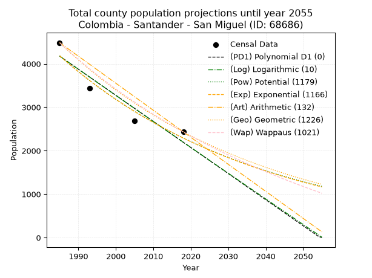
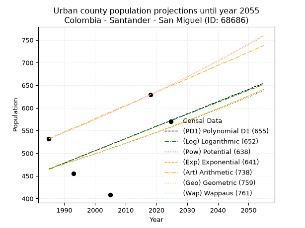
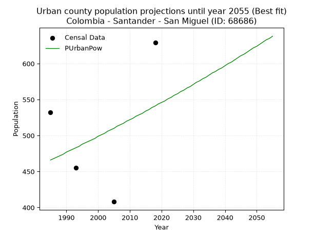
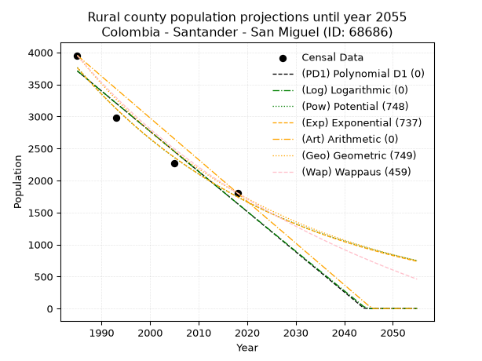
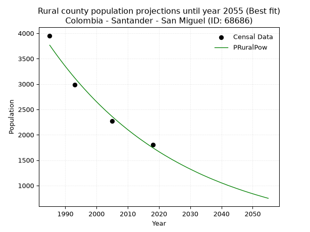

<div align="center">


</div>

# _“Population and Public Services Demand Projections (PPSD) until Year 2050 for Colombia - Santander - San Miguel (ID: 68686)”_
Keywords: `population` `public-service` `projection` `lineal` `polynomial` `logarithmic` `potential` `exponential` `arithmetic` `geometric` `wappaus` `dane` `colombia` `south-america`

PPSD are analytical estimates used by governments and planners to anticipate future changes in population size, age distribution, and the resulting community needs for utilities, healthcare, education, and infrastructure as sizing future water treatment facilities, electrical grids, and road networks based on spatial growth.

> **General running parameters**: • app_version: _v20260806_. • Python version: _3.14.7_. • Pandas version: _3.0.5_. • NumPy version: _2.5.1_. • Creates, save and include plots into reports (create_plot): _False_. • Projection until year: _2050_. • Process polynomial degree 2 and up: _False_. • Process Wappaus: _True_. • Process Wappaus: _True_. • Set negative values to zero: _True_. • Set infinite values to zero: _True_. • Drop dataset notes: _True_. 
<div align="center">

Dynamic map: [:earth_americas:Google](http://maps.google.com/maps?q=6.575314748,-72.6441232) [:earth_americas:OSM](https://www.openstreetmap.org/#map=18/6.575314748/-72.6441232&layers=P) [:earth_americas:Bing](https://www.bing.com/maps?cp=6.575314748~-72.6441232&lvl=18) [:earth_americas:Apple](https://maps.apple.com/frame?center=6.575314748%2C-72.6441232&span=0.003%2C0.006)

</div>


<div align="center">

```geojson
{
  "type": "Feature",
  "geometry": {
    "type": "Point", 
    "coordinates": [-72.6441232, 6.575314748]
  }, 
  "properties": {
    "Name": "Colombia - Santander - San Miguel (ID: 68686)"
  }
}
```

</div>


## 0. Census Data (4 records)

Census data are official statistics collected by a government about the people and housing in a country. They usually include counts of total population, age, sex, race, income, education, and jobs.

📅Global census file: [Population.xlsx](../data/Population.xlsx)

| Source   |   Year |   CountryID | CountryName   |   StateID | StateName   |   CountyID | CountyName   |   PTotal |   PUrban |   PRural |
|:---------|-------:|------------:|:--------------|----------:|:------------|-----------:|:-------------|---------:|---------:|---------:|
| DANE     |   1985 |          57 | Colombia      |        68 | Santander   |      68686 | San Miguel   |     4485 |      532 |     3953 |
| DANE     |   1993 |          57 | Colombia      |        68 | Santander   |      68686 | San Miguel   |     3437 |      455 |     2982 |
| DANE     |   2005 |          57 | Colombia      |        68 | Santander   |      68686 | San Miguel   |     2683 |      408 |     2275 |
| DANE     |   2018 |          57 | Colombia      |        68 | Santander   |      68686 | San Miguel   |     2433 |      629 |     1804 |

> 🔥Some records could had specific notes about the registered values or the corresponding urban or rural distribution.

## 1. Total

### 1.1. Coefficients and Parameters

* (PD1) Polynomial Deg 1: -60.03131272581272, 123337.1332798069 (lineal)
* (Log) Logarithmic: -120262.19228325019, 917373.3872657113
* (Pow) Potential: -36.56068517369408, 124.1902706073282
* (Exp) Exponential: -0.01825321709233023, 2.276150259470971e+19
* (Art) Arithmetic: Year diff. 2018 - 1985 = 33, Population diff. 2433 - 4485 = -2052, Annual growth = -62.18181818181818
* (Geo) Geometric: Year diff. 2018 - 1985 = 33, Population diff. 2433 - 4485 = -2052, Annual growth % = -0.0183630467460848
* (Wap) Wappaus: i = -1.7976819364503667, Condition values only valid for < 200)

<sub>
Wappaus condition values: ['-0.00', '-1.80', '-3.60', '-5.39', '-7.19', '-8.99', '-10.79', '-12.58', '-14.38', '-16.18', '-17.98', '-19.77', '-21.57', '-23.37', '-25.17', '-26.97', '-28.76', '-30.56', '-32.36', '-34.16', '-35.95', '-37.75', '-39.55', '-41.35', '-43.14', '-44.94', '-46.74', '-48.54', '-50.34', '-52.13', '-53.93', '-55.73', '-57.53', '-59.32', '-61.12', '-62.92', '-64.72', '-66.51', '-68.31', '-70.11', '-71.91', '-73.70', '-75.50', '-77.30', '-79.10', '-80.90', '-82.69', '-84.49', '-86.29', '-88.09', '-89.88', '-91.68', '-93.48', '-95.28', '-97.07', '-98.87', '-100.67', '-102.47', '-104.27', '-106.06', '-107.86', '-109.66', '-111.46', '-113.25', '-115.05', '-116.85']
</sub>


### 1.2. Projected Dataset

|   Year |   CountyID |   PTotalPD1 |   PTotalLog |   PTotalPow |   PTotalExp |   PTotalArt |   PTotalGeo |   PTotalWap |
|-------:|-----------:|------------:|------------:|------------:|------------:|------------:|------------:|------------:|
|   1985 |      68686 |        4175 |        4178 |        4187 |        4184 |        4485 |        4485 |        4485 |
|   1986 |      68686 |        4115 |        4117 |        4110 |        4108 |        4423 |        4403 |        4405 |
|   1987 |      68686 |        4055 |        4056 |        4035 |        4034 |        4361 |        4322 |        4327 |
|   1988 |      68686 |        3995 |        3996 |        3962 |        3961 |        4298 |        4242 |        4249 |
|   1989 |      68686 |        3935 |        3935 |        3890 |        3889 |        4236 |        4165 |        4174 |
|   1990 |      68686 |        3875 |        3875 |        3819 |        3819 |        4174 |        4088 |        4099 |
|   1991 |      68686 |        3815 |        3815 |        3749 |        3750 |        4112 |        4013 |        4026 |
|   1992 |      68686 |        3755 |        3754 |        3681 |        3682 |        4050 |        3939 |        3954 |
|   1993 |      68686 |        3695 |        3694 |        3614 |        3615 |        3988 |        3867 |        3883 |
|   1994 |      68686 |        3635 |        3634 |        3549 |        3550 |        3925 |        3796 |        3814 |
|   1995 |      68686 |        3575 |        3573 |        3484 |        3486 |        3863 |        3726 |        3745 |
|   1996 |      68686 |        3515 |        3513 |        3421 |        3423 |        3801 |        3658 |        3678 |
|   1997 |      68686 |        3455 |        3453 |        3359 |        3361 |        3739 |        3591 |        3612 |
|   1998 |      68686 |        3395 |        3393 |        3298 |        3300 |        3677 |        3525 |        3547 |
|   1999 |      68686 |        3335 |        3332 |        3238 |        3240 |        3614 |        3460 |        3482 |
|   2000 |      68686 |        3275 |        3272 |        3179 |        3182 |        3552 |        3396 |        3419 |
|   2001 |      68686 |        3214 |        3212 |        3122 |        3124 |        3490 |        3334 |        3357 |
|   2002 |      68686 |        3154 |        3152 |        3065 |        3068 |        3428 |        3273 |        3296 |
|   2003 |      68686 |        3094 |        3092 |        3010 |        3012 |        3366 |        3213 |        3236 |
|   2004 |      68686 |        3034 |        3032 |        2955 |        2958 |        3304 |        3154 |        3177 |
|   2005 |      68686 |        2974 |        2972 |        2902 |        2904 |        3241 |        3096 |        3118 |
|   2006 |      68686 |        2914 |        2912 |        2850 |        2852 |        3179 |        3039 |        3061 |
|   2007 |      68686 |        2854 |        2852 |        2798 |        2800 |        3117 |        2983 |        3004 |
|   2008 |      68686 |        2794 |        2792 |        2748 |        2749 |        3055 |        2928 |        2948 |
|   2009 |      68686 |        2734 |        2732 |        2698 |        2700 |        2993 |        2875 |        2893 |
|   2010 |      68686 |        2674 |        2672 |        2649 |        2651 |        2930 |        2822 |        2839 |
|   2011 |      68686 |        2614 |        2613 |        2602 |        2603 |        2868 |        2770 |        2786 |
|   2012 |      68686 |        2554 |        2553 |        2555 |        2556 |        2806 |        2719 |        2733 |
|   2013 |      68686 |        2494 |        2493 |        2509 |        2510 |        2744 |        2669 |        2681 |
|   2014 |      68686 |        2434 |        2433 |        2464 |        2464 |        2682 |        2620 |        2630 |
|   2015 |      68686 |        2374 |        2374 |        2419 |        2420 |        2620 |        2572 |        2580 |
|   2016 |      68686 |        2314 |        2314 |        2376 |        2376 |        2557 |        2525 |        2530 |
|   2017 |      68686 |        2254 |        2254 |        2333 |        2333 |        2495 |        2479 |        2481 |
|   2018 |      68686 |        2194 |        2195 |        2291 |        2291 |        2433 |        2433 |        2433 |
|   2019 |      68686 |        2134 |        2135 |        2250 |        2249 |        2371 |        2388 |        2385 |
|   2020 |      68686 |        2074 |        2076 |        2210 |        2209 |        2309 |        2344 |        2338 |
|   2021 |      68686 |        2014 |        2016 |        2170 |        2169 |        2246 |        2301 |        2292 |
|   2022 |      68686 |        1954 |        1957 |        2131 |        2129 |        2184 |        2259 |        2246 |
|   2023 |      68686 |        1894 |        1897 |        2093 |        2091 |        2122 |        2218 |        2201 |
|   2024 |      68686 |        1834 |        1838 |        2056 |        2053 |        2060 |        2177 |        2157 |
|   2025 |      68686 |        1774 |        1778 |        2019 |        2016 |        1998 |        2137 |        2113 |
|   2026 |      68686 |        1714 |        1719 |        1983 |        1979 |        1936 |        2098 |        2070 |
|   2027 |      68686 |        1654 |        1660 |        1947 |        1944 |        1873 |        2059 |        2027 |
|   2028 |      68686 |        1594 |        1600 |        1912 |        1909 |        1811 |        2021 |        1985 |
|   2029 |      68686 |        1534 |        1541 |        1878 |        1874 |        1749 |        1984 |        1943 |
|   2030 |      68686 |        1474 |        1482 |        1845 |        1840 |        1687 |        1948 |        1902 |
|   2031 |      68686 |        1414 |        1422 |        1812 |        1807 |        1625 |        1912 |        1861 |
|   2032 |      68686 |        1354 |        1363 |        1780 |        1774 |        1562 |        1877 |        1821 |
|   2033 |      68686 |        1293 |        1304 |        1748 |        1742 |        1500 |        1842 |        1781 |
|   2034 |      68686 |        1233 |        1245 |        1717 |        1711 |        1438 |        1809 |        1742 |
|   2035 |      68686 |        1173 |        1186 |        1686 |        1680 |        1376 |        1775 |        1704 |
|   2036 |      68686 |        1113 |        1127 |        1656 |        1649 |        1314 |        1743 |        1666 |
|   2037 |      68686 |        1053 |        1068 |        1627 |        1619 |        1252 |        1711 |        1628 |
|   2038 |      68686 |         993 |        1009 |        1598 |        1590 |        1189 |        1679 |        1591 |
|   2039 |      68686 |         933 |         950 |        1569 |        1561 |        1127 |        1649 |        1554 |
|   2040 |      68686 |         873 |         891 |        1541 |        1533 |        1065 |        1618 |        1518 |
|   2041 |      68686 |         813 |         832 |        1514 |        1505 |        1003 |        1589 |        1482 |
|   2042 |      68686 |         753 |         773 |        1487 |        1478 |         941 |        1559 |        1446 |
|   2043 |      68686 |         693 |         714 |        1461 |        1451 |         878 |        1531 |        1411 |
|   2044 |      68686 |         633 |         655 |        1435 |        1425 |         816 |        1503 |        1377 |
|   2045 |      68686 |         573 |         596 |        1409 |        1399 |         754 |        1475 |        1342 |
|   2046 |      68686 |         513 |         537 |        1384 |        1374 |         692 |        1448 |        1308 |
|   2047 |      68686 |         453 |         479 |        1360 |        1349 |         630 |        1421 |        1275 |
|   2048 |      68686 |         393 |         420 |        1336 |        1325 |         568 |        1395 |        1242 |
|   2049 |      68686 |         333 |         361 |        1312 |        1301 |         505 |        1370 |        1209 |
|   2050 |      68686 |         273 |         303 |        1289 |        1277 |         443 |        1345 |        1177 |
<div align="center">

</img>

</div>


### 1.3. Best fit with absolute and relative error (%)

Relative error puts that difference into context by dividing the absolute error by the true value, creating a unitless ratio or percentage that shows the scale of the mistake.

Absolute and relative error

|   Year | Source   |   CountryID | CountryName   |   StateID | StateName   |   CountyID_x | CountyName   |   PTotal |   PUrban |   PRural |   CountyID_y |   PTotalPD1 |   PTotalLog |   PTotalPow |   PTotalExp |   PTotalArt |   PTotalGeo |   PTotalWap |   PTotalPD1AbsError |   PTotalLogAbsError |   PTotalPowAbsError |   PTotalExpAbsError |   PTotalArtAbsError |   PTotalGeoAbsError |   PTotalWapAbsError |   PTotalPD1RelError |   PTotalLogRelError |   PTotalPowRelError |   PTotalExpRelError |   PTotalArtRelError |   PTotalGeoRelError |   PTotalWapRelError |
|-------:|:---------|------------:|:--------------|----------:|:------------|-------------:|:-------------|---------:|---------:|---------:|-------------:|------------:|------------:|------------:|------------:|------------:|------------:|------------:|--------------------:|--------------------:|--------------------:|--------------------:|--------------------:|--------------------:|--------------------:|--------------------:|--------------------:|--------------------:|--------------------:|--------------------:|--------------------:|--------------------:|
|   1985 | DANE     |          57 | Colombia      |        68 | Santander   |        68686 | San Miguel   |     4485 |      532 |     3953 |        68686 |        4175 |        4178 |        4187 |        4184 |        4485 |        4485 |        4485 |                 310 |                 307 |                 298 |                 301 |                   0 |                   0 |                   0 |             6.91193 |             6.84504 |             6.64437 |             6.71126 |              0      |              0      |              0      |
|   1993 | DANE     |          57 | Colombia      |        68 | Santander   |        68686 | San Miguel   |     3437 |      455 |     2982 |        68686 |        3695 |        3694 |        3614 |        3615 |        3988 |        3867 |        3883 |                 258 |                 257 |                 177 |                 178 |                 551 |                 430 |                 446 |             7.50655 |             7.47745 |             5.14984 |             5.17894 |             16.0314 |             12.5109 |             12.9764 |
|   2005 | DANE     |          57 | Colombia      |        68 | Santander   |        68686 | San Miguel   |     2683 |      408 |     2275 |        68686 |        2974 |        2972 |        2902 |        2904 |        3241 |        3096 |        3118 |                 291 |                 289 |                 219 |                 221 |                 558 |                 413 |                 435 |            10.8461  |            10.7715  |             8.1625  |             8.23705 |             20.7976 |             15.3932 |             16.2132 |
|   2018 | DANE     |          57 | Colombia      |        68 | Santander   |        68686 | San Miguel   |     2433 |      629 |     1804 |        68686 |        2194 |        2195 |        2291 |        2291 |        2433 |        2433 |        2433 |                 239 |                 238 |                 142 |                 142 |                   0 |                   0 |                   0 |             9.82326 |             9.78216 |             5.83642 |             5.83642 |              0      |              0      |              0      |

Relative error mean

| Method    |   RelError | Best   |
|:----------|-----------:|:-------|
| PTotalPD1 |    8.77195 |        |
| PTotalLog |    8.71904 |        |
| PTotalPow |    6.44828 | True   |
| PTotalExp |    6.49091 |        |
| PTotalArt |    9.20726 |        |
| PTotalGeo |    6.97603 |        |
| PTotalWap |    7.29741 |        |

💙Best method: _**PTotalPow**_
<div align="center">

</img>

</div>


### 1.4. Fresh water supply demand in liters per capita per day (lpcd)

The fresh water supply demand typically ranges from 100 to 300 liters per capita per day (lpcd) for standard domestic and municipal planning, though absolute survival minimums set by the World Health Organization are as low as 7.5 to 20 liters per day, and total consumption in high-income nations can exceed 400 liters.

> `CZ`: Level in meters above the sea level (masl).<br> `WS`: Fresh water supply demand in liters per capita per day (lpcd or l/h/d).<br> `WSAll`: Zonal fresh water supply demand in liters per second (l/s).<br> `A`: Zonal area in square meters.

Reference values (RAS Colombia)

|    CZ |   WS |
|------:|-----:|
|  1000 |  120 |
|  2000 |  130 |
| 99999 |  140 |

County shapefile geometry properties and water supply values

|   CountyID |      ATotal |   CZTotal |   WSTotal |
|-----------:|------------:|----------:|----------:|
|      68686 | 7.10559e+07 |   2295.46 |       140 |

Projected values for best method: PTotalPow

|   CountyID |   Year |   PTotalPow |   WSTotal |   WSTotalAll |
|-----------:|-------:|------------:|----------:|-------------:|
|      68686 |   1985 |        4187 |       140 |      6.78449 |
|      68686 |   1986 |        4110 |       140 |      6.65972 |
|      68686 |   1987 |        4035 |       140 |      6.53819 |
|      68686 |   1988 |        3962 |       140 |      6.41991 |
|      68686 |   1989 |        3890 |       140 |      6.30324 |
|      68686 |   1990 |        3819 |       140 |      6.18819 |
|      68686 |   1991 |        3749 |       140 |      6.07477 |
|      68686 |   1992 |        3681 |       140 |      5.96458 |
|      68686 |   1993 |        3614 |       140 |      5.85602 |
|      68686 |   1994 |        3549 |       140 |      5.75069 |
|      68686 |   1995 |        3484 |       140 |      5.64537 |
|      68686 |   1996 |        3421 |       140 |      5.54329 |
|      68686 |   1997 |        3359 |       140 |      5.44282 |
|      68686 |   1998 |        3298 |       140 |      5.34398 |
|      68686 |   1999 |        3238 |       140 |      5.24676 |
|      68686 |   2000 |        3179 |       140 |      5.15116 |
|      68686 |   2001 |        3122 |       140 |      5.0588  |
|      68686 |   2002 |        3065 |       140 |      4.96644 |
|      68686 |   2003 |        3010 |       140 |      4.87731 |
|      68686 |   2004 |        2955 |       140 |      4.78819 |
|      68686 |   2005 |        2902 |       140 |      4.70231 |
|      68686 |   2006 |        2850 |       140 |      4.61806 |
|      68686 |   2007 |        2798 |       140 |      4.5338  |
|      68686 |   2008 |        2748 |       140 |      4.45278 |
|      68686 |   2009 |        2698 |       140 |      4.37176 |
|      68686 |   2010 |        2649 |       140 |      4.29236 |
|      68686 |   2011 |        2602 |       140 |      4.2162  |
|      68686 |   2012 |        2555 |       140 |      4.14005 |
|      68686 |   2013 |        2509 |       140 |      4.06551 |
|      68686 |   2014 |        2464 |       140 |      3.99259 |
|      68686 |   2015 |        2419 |       140 |      3.91968 |
|      68686 |   2016 |        2376 |       140 |      3.85    |
|      68686 |   2017 |        2333 |       140 |      3.78032 |
|      68686 |   2018 |        2291 |       140 |      3.71227 |
|      68686 |   2019 |        2250 |       140 |      3.64583 |
|      68686 |   2020 |        2210 |       140 |      3.58102 |
|      68686 |   2021 |        2170 |       140 |      3.5162  |
|      68686 |   2022 |        2131 |       140 |      3.45301 |
|      68686 |   2023 |        2093 |       140 |      3.39144 |
|      68686 |   2024 |        2056 |       140 |      3.33148 |
|      68686 |   2025 |        2019 |       140 |      3.27153 |
|      68686 |   2026 |        1983 |       140 |      3.21319 |
|      68686 |   2027 |        1947 |       140 |      3.15486 |
|      68686 |   2028 |        1912 |       140 |      3.09815 |
|      68686 |   2029 |        1878 |       140 |      3.04306 |
|      68686 |   2030 |        1845 |       140 |      2.98958 |
|      68686 |   2031 |        1812 |       140 |      2.93611 |
|      68686 |   2032 |        1780 |       140 |      2.88426 |
|      68686 |   2033 |        1748 |       140 |      2.83241 |
|      68686 |   2034 |        1717 |       140 |      2.78218 |
|      68686 |   2035 |        1686 |       140 |      2.73194 |
|      68686 |   2036 |        1656 |       140 |      2.68333 |
|      68686 |   2037 |        1627 |       140 |      2.63634 |
|      68686 |   2038 |        1598 |       140 |      2.58935 |
|      68686 |   2039 |        1569 |       140 |      2.54236 |
|      68686 |   2040 |        1541 |       140 |      2.49699 |
|      68686 |   2041 |        1514 |       140 |      2.45324 |
|      68686 |   2042 |        1487 |       140 |      2.40949 |
|      68686 |   2043 |        1461 |       140 |      2.36736 |
|      68686 |   2044 |        1435 |       140 |      2.32523 |
|      68686 |   2045 |        1409 |       140 |      2.2831  |
|      68686 |   2046 |        1384 |       140 |      2.24259 |
|      68686 |   2047 |        1360 |       140 |      2.2037  |
|      68686 |   2048 |        1336 |       140 |      2.16481 |
|      68686 |   2049 |        1312 |       140 |      2.12593 |
|      68686 |   2050 |        1289 |       140 |      2.08866 |

## 2. Urban

### 2.1. Coefficients and Parameters

* (PD1) Polynomial Deg 1: 2.7153753512644183, -4925.429546366654 (lineal)
* (Log) Logarithmic: 5406.981529181344, -40592.50993213808
* (Pow) Potential: 9.09090141692556, -27.31144654608273
* (Exp) Exponential: 0.004569858506620546, 0.05351599793173061
* (Art) Arithmetic: Year diff. 2018 - 1985 = 33, Population diff. 629 - 532 = 97, Annual growth = 2.9393939393939394
* (Geo) Geometric: Year diff. 2018 - 1985 = 33, Population diff. 629 - 532 = 97, Annual growth % = 0.005088288483325432
* (Wap) Wappaus: i = 0.5063555451152351, Condition values only valid for < 200)

<sub>
Wappaus condition values: ['0.00', '0.51', '1.01', '1.52', '2.03', '2.53', '3.04', '3.54', '4.05', '4.56', '5.06', '5.57', '6.08', '6.58', '7.09', '7.60', '8.10', '8.61', '9.11', '9.62', '10.13', '10.63', '11.14', '11.65', '12.15', '12.66', '13.17', '13.67', '14.18', '14.68', '15.19', '15.70', '16.20', '16.71', '17.22', '17.72', '18.23', '18.74', '19.24', '19.75', '20.25', '20.76', '21.27', '21.77', '22.28', '22.79', '23.29', '23.80', '24.31', '24.81', '25.32', '25.82', '26.33', '26.84', '27.34', '27.85', '28.36', '28.86', '29.37', '29.87', '30.38', '30.89', '31.39', '31.90', '32.41', '32.91']
</sub>


### 2.2. Projected Dataset

|   Year |   CountyID |   PUrbanPD1 |   PUrbanLog |   PUrbanPow |   PUrbanExp |   PUrbanArt |   PUrbanGeo |   PUrbanWap |
|-------:|-----------:|------------:|------------:|------------:|------------:|------------:|------------:|------------:|
|   1985 |      68686 |         465 |         465 |         466 |         466 |         532 |         532 |         532 |
|   1986 |      68686 |         467 |         467 |         468 |         468 |         535 |         535 |         535 |
|   1987 |      68686 |         470 |         470 |         470 |         470 |         538 |         537 |         537 |
|   1988 |      68686 |         473 |         473 |         472 |         472 |         541 |         540 |         540 |
|   1989 |      68686 |         475 |         476 |         474 |         474 |         544 |         543 |         543 |
|   1990 |      68686 |         478 |         478 |         477 |         476 |         547 |         546 |         546 |
|   1991 |      68686 |         481 |         481 |         479 |         479 |         550 |         548 |         548 |
|   1992 |      68686 |         484 |         484 |         481 |         481 |         553 |         551 |         551 |
|   1993 |      68686 |         486 |         486 |         483 |         483 |         556 |         554 |         554 |
|   1994 |      68686 |         489 |         489 |         485 |         485 |         558 |         557 |         557 |
|   1995 |      68686 |         492 |         492 |         488 |         487 |         561 |         560 |         560 |
|   1996 |      68686 |         494 |         495 |         490 |         490 |         564 |         563 |         562 |
|   1997 |      68686 |         497 |         497 |         492 |         492 |         567 |         565 |         565 |
|   1998 |      68686 |         500 |         500 |         494 |         494 |         570 |         568 |         568 |
|   1999 |      68686 |         503 |         503 |         496 |         496 |         573 |         571 |         571 |
|   2000 |      68686 |         505 |         505 |         499 |         499 |         576 |         574 |         574 |
|   2001 |      68686 |         508 |         508 |         501 |         501 |         579 |         577 |         577 |
|   2002 |      68686 |         511 |         511 |         503 |         503 |         582 |         580 |         580 |
|   2003 |      68686 |         513 |         514 |         506 |         506 |         585 |         583 |         583 |
|   2004 |      68686 |         516 |         516 |         508 |         508 |         588 |         586 |         586 |
|   2005 |      68686 |         519 |         519 |         510 |         510 |         591 |         589 |         589 |
|   2006 |      68686 |         522 |         522 |         513 |         513 |         594 |         592 |         592 |
|   2007 |      68686 |         524 |         524 |         515 |         515 |         597 |         595 |         595 |
|   2008 |      68686 |         527 |         527 |         517 |         517 |         600 |         598 |         598 |
|   2009 |      68686 |         530 |         530 |         520 |         520 |         603 |         601 |         601 |
|   2010 |      68686 |         532 |         532 |         522 |         522 |         605 |         604 |         604 |
|   2011 |      68686 |         535 |         535 |         524 |         524 |         608 |         607 |         607 |
|   2012 |      68686 |         538 |         538 |         527 |         527 |         611 |         610 |         610 |
|   2013 |      68686 |         541 |         540 |         529 |         529 |         614 |         613 |         613 |
|   2014 |      68686 |         543 |         543 |         531 |         532 |         617 |         616 |         616 |
|   2015 |      68686 |         546 |         546 |         534 |         534 |         620 |         619 |         619 |
|   2016 |      68686 |         549 |         549 |         536 |         536 |         623 |         623 |         623 |
|   2017 |      68686 |         551 |         551 |         539 |         539 |         626 |         626 |         626 |
|   2018 |      68686 |         554 |         554 |         541 |         541 |         629 |         629 |         629 |
|   2019 |      68686 |         557 |         557 |         544 |         544 |         632 |         632 |         632 |
|   2020 |      68686 |         560 |         559 |         546 |         546 |         635 |         635 |         635 |
|   2021 |      68686 |         562 |         562 |         548 |         549 |         638 |         639 |         639 |
|   2022 |      68686 |         565 |         565 |         551 |         551 |         641 |         642 |         642 |
|   2023 |      68686 |         568 |         567 |         553 |         554 |         644 |         645 |         645 |
|   2024 |      68686 |         570 |         570 |         556 |         556 |         647 |         648 |         649 |
|   2025 |      68686 |         573 |         573 |         558 |         559 |         650 |         652 |         652 |
|   2026 |      68686 |         576 |         575 |         561 |         562 |         653 |         655 |         655 |
|   2027 |      68686 |         579 |         578 |         563 |         564 |         655 |         658 |         659 |
|   2028 |      68686 |         581 |         581 |         566 |         567 |         658 |         662 |         662 |
|   2029 |      68686 |         584 |         583 |         568 |         569 |         661 |         665 |         665 |
|   2030 |      68686 |         587 |         586 |         571 |         572 |         664 |         668 |         669 |
|   2031 |      68686 |         589 |         589 |         574 |         575 |         667 |         672 |         672 |
|   2032 |      68686 |         592 |         591 |         576 |         577 |         670 |         675 |         676 |
|   2033 |      68686 |         595 |         594 |         579 |         580 |         673 |         679 |         679 |
|   2034 |      68686 |         598 |         597 |         581 |         582 |         676 |         682 |         683 |
|   2035 |      68686 |         600 |         599 |         584 |         585 |         679 |         686 |         686 |
|   2036 |      68686 |         603 |         602 |         587 |         588 |         682 |         689 |         690 |
|   2037 |      68686 |         606 |         605 |         589 |         591 |         685 |         693 |         693 |
|   2038 |      68686 |         609 |         607 |         592 |         593 |         688 |         696 |         697 |
|   2039 |      68686 |         611 |         610 |         594 |         596 |         691 |         700 |         701 |
|   2040 |      68686 |         614 |         613 |         597 |         599 |         694 |         703 |         704 |
|   2041 |      68686 |         617 |         615 |         600 |         601 |         697 |         707 |         708 |
|   2042 |      68686 |         619 |         618 |         602 |         604 |         700 |         710 |         711 |
|   2043 |      68686 |         622 |         620 |         605 |         607 |         702 |         714 |         715 |
|   2044 |      68686 |         625 |         623 |         608 |         610 |         705 |         718 |         719 |
|   2045 |      68686 |         628 |         626 |         611 |         613 |         708 |         721 |         723 |
|   2046 |      68686 |         630 |         628 |         613 |         615 |         711 |         725 |         726 |
|   2047 |      68686 |         633 |         631 |         616 |         618 |         714 |         729 |         730 |
|   2048 |      68686 |         636 |         634 |         619 |         621 |         717 |         732 |         734 |
|   2049 |      68686 |         638 |         636 |         622 |         624 |         720 |         736 |         738 |
|   2050 |      68686 |         641 |         639 |         624 |         627 |         723 |         740 |         742 |
<div align="center">

</img>

</div>


### 2.3. Best fit with absolute and relative error (%)

Relative error puts that difference into context by dividing the absolute error by the true value, creating a unitless ratio or percentage that shows the scale of the mistake.

Absolute and relative error

|   Year | Source   |   CountryID | CountryName   |   StateID | StateName   |   CountyID_x | CountyName   |   PTotal |   PUrban |   PRural |   CountyID_y |   PUrbanPD1 |   PUrbanLog |   PUrbanPow |   PUrbanExp |   PUrbanArt |   PUrbanGeo |   PUrbanWap |   PUrbanPD1AbsError |   PUrbanLogAbsError |   PUrbanPowAbsError |   PUrbanExpAbsError |   PUrbanArtAbsError |   PUrbanGeoAbsError |   PUrbanWapAbsError |   PUrbanPD1RelError |   PUrbanLogRelError |   PUrbanPowRelError |   PUrbanExpRelError |   PUrbanArtRelError |   PUrbanGeoRelError |   PUrbanWapRelError |
|-------:|:---------|------------:|:--------------|----------:|:------------|-------------:|:-------------|---------:|---------:|---------:|-------------:|------------:|------------:|------------:|------------:|------------:|------------:|------------:|--------------------:|--------------------:|--------------------:|--------------------:|--------------------:|--------------------:|--------------------:|--------------------:|--------------------:|--------------------:|--------------------:|--------------------:|--------------------:|--------------------:|
|   1985 | DANE     |          57 | Colombia      |        68 | Santander   |        68686 | San Miguel   |     4485 |      532 |     3953 |        68686 |         465 |         465 |         466 |         466 |         532 |         532 |         532 |                  67 |                  67 |                  66 |                  66 |                   0 |                   0 |                   0 |            12.594   |            12.594   |            12.406   |            12.406   |              0      |              0      |              0      |
|   1993 | DANE     |          57 | Colombia      |        68 | Santander   |        68686 | San Miguel   |     3437 |      455 |     2982 |        68686 |         486 |         486 |         483 |         483 |         556 |         554 |         554 |                  31 |                  31 |                  28 |                  28 |                 101 |                  99 |                  99 |             6.81319 |             6.81319 |             6.15385 |             6.15385 |             22.1978 |             21.7582 |             21.7582 |
|   2005 | DANE     |          57 | Colombia      |        68 | Santander   |        68686 | San Miguel   |     2683 |      408 |     2275 |        68686 |         519 |         519 |         510 |         510 |         591 |         589 |         589 |                 111 |                 111 |                 102 |                 102 |                 183 |                 181 |                 181 |            27.2059  |            27.2059  |            25       |            25       |             44.8529 |             44.3627 |             44.3627 |
|   2018 | DANE     |          57 | Colombia      |        68 | Santander   |        68686 | San Miguel   |     2433 |      629 |     1804 |        68686 |         554 |         554 |         541 |         541 |         629 |         629 |         629 |                  75 |                  75 |                  88 |                  88 |                   0 |                   0 |                   0 |            11.9237  |            11.9237  |            13.9905  |            13.9905  |              0      |              0      |              0      |

Relative error mean

| Method    |   RelError | Best   |
|:----------|-----------:|:-------|
| PUrbanPD1 |    14.6342 |        |
| PUrbanLog |    14.6342 |        |
| PUrbanPow |    14.3876 | True   |
| PUrbanExp |    14.3876 | True   |
| PUrbanArt |    16.7627 |        |
| PUrbanGeo |    16.5302 |        |
| PUrbanWap |    16.5302 |        |

💙Best method: _**PUrbanPow**_
<div align="center">

</img>

</div>


### 2.4. Fresh water supply demand in liters per capita per day (lpcd)

The fresh water supply demand typically ranges from 100 to 300 liters per capita per day (lpcd) for standard domestic and municipal planning, though absolute survival minimums set by the World Health Organization are as low as 7.5 to 20 liters per day, and total consumption in high-income nations can exceed 400 liters.

> `CZ`: Level in meters above the sea level (masl).<br> `WS`: Fresh water supply demand in liters per capita per day (lpcd or l/h/d).<br> `WSAll`: Zonal fresh water supply demand in liters per second (l/s).<br> `A`: Zonal area in square meters.

Reference values (RAS Colombia)

|    CZ |   WS |
|------:|-----:|
|  1000 |  120 |
|  2000 |  130 |
| 99999 |  140 |

County shapefile geometry properties and water supply values

|   CountyID |   AUrban |   CZUrban |   WSUrban |
|-----------:|---------:|----------:|----------:|
|      68686 |   237275 |   1935.33 |       130 |

Projected values for best method: PUrbanPow

|   CountyID |   Year |   PUrbanPow |   WSUrban |   WSUrbanAll |
|-----------:|-------:|------------:|----------:|-------------:|
|      68686 |   1985 |         466 |       130 |     0.701157 |
|      68686 |   1986 |         468 |       130 |     0.704167 |
|      68686 |   1987 |         470 |       130 |     0.707176 |
|      68686 |   1988 |         472 |       130 |     0.710185 |
|      68686 |   1989 |         474 |       130 |     0.713194 |
|      68686 |   1990 |         477 |       130 |     0.717708 |
|      68686 |   1991 |         479 |       130 |     0.720718 |
|      68686 |   1992 |         481 |       130 |     0.723727 |
|      68686 |   1993 |         483 |       130 |     0.726736 |
|      68686 |   1994 |         485 |       130 |     0.729745 |
|      68686 |   1995 |         488 |       130 |     0.734259 |
|      68686 |   1996 |         490 |       130 |     0.737269 |
|      68686 |   1997 |         492 |       130 |     0.740278 |
|      68686 |   1998 |         494 |       130 |     0.743287 |
|      68686 |   1999 |         496 |       130 |     0.746296 |
|      68686 |   2000 |         499 |       130 |     0.75081  |
|      68686 |   2001 |         501 |       130 |     0.753819 |
|      68686 |   2002 |         503 |       130 |     0.756829 |
|      68686 |   2003 |         506 |       130 |     0.761343 |
|      68686 |   2004 |         508 |       130 |     0.764352 |
|      68686 |   2005 |         510 |       130 |     0.767361 |
|      68686 |   2006 |         513 |       130 |     0.771875 |
|      68686 |   2007 |         515 |       130 |     0.774884 |
|      68686 |   2008 |         517 |       130 |     0.777894 |
|      68686 |   2009 |         520 |       130 |     0.782407 |
|      68686 |   2010 |         522 |       130 |     0.785417 |
|      68686 |   2011 |         524 |       130 |     0.788426 |
|      68686 |   2012 |         527 |       130 |     0.79294  |
|      68686 |   2013 |         529 |       130 |     0.795949 |
|      68686 |   2014 |         531 |       130 |     0.798958 |
|      68686 |   2015 |         534 |       130 |     0.803472 |
|      68686 |   2016 |         536 |       130 |     0.806481 |
|      68686 |   2017 |         539 |       130 |     0.810995 |
|      68686 |   2018 |         541 |       130 |     0.814005 |
|      68686 |   2019 |         544 |       130 |     0.818519 |
|      68686 |   2020 |         546 |       130 |     0.821528 |
|      68686 |   2021 |         548 |       130 |     0.824537 |
|      68686 |   2022 |         551 |       130 |     0.829051 |
|      68686 |   2023 |         553 |       130 |     0.83206  |
|      68686 |   2024 |         556 |       130 |     0.836574 |
|      68686 |   2025 |         558 |       130 |     0.839583 |
|      68686 |   2026 |         561 |       130 |     0.844097 |
|      68686 |   2027 |         563 |       130 |     0.847106 |
|      68686 |   2028 |         566 |       130 |     0.85162  |
|      68686 |   2029 |         568 |       130 |     0.85463  |
|      68686 |   2030 |         571 |       130 |     0.859144 |
|      68686 |   2031 |         574 |       130 |     0.863657 |
|      68686 |   2032 |         576 |       130 |     0.866667 |
|      68686 |   2033 |         579 |       130 |     0.871181 |
|      68686 |   2034 |         581 |       130 |     0.87419  |
|      68686 |   2035 |         584 |       130 |     0.878704 |
|      68686 |   2036 |         587 |       130 |     0.883218 |
|      68686 |   2037 |         589 |       130 |     0.886227 |
|      68686 |   2038 |         592 |       130 |     0.890741 |
|      68686 |   2039 |         594 |       130 |     0.89375  |
|      68686 |   2040 |         597 |       130 |     0.898264 |
|      68686 |   2041 |         600 |       130 |     0.902778 |
|      68686 |   2042 |         602 |       130 |     0.905787 |
|      68686 |   2043 |         605 |       130 |     0.910301 |
|      68686 |   2044 |         608 |       130 |     0.914815 |
|      68686 |   2045 |         611 |       130 |     0.919329 |
|      68686 |   2046 |         613 |       130 |     0.922338 |
|      68686 |   2047 |         616 |       130 |     0.926852 |
|      68686 |   2048 |         619 |       130 |     0.931366 |
|      68686 |   2049 |         622 |       130 |     0.93588  |
|      68686 |   2050 |         624 |       130 |     0.938889 |

## 3. Rural

### 3.1. Coefficients and Parameters

* (PD1) Polynomial Deg 1: -62.74668807707714, 128262.56282617355 (lineal)
* (Log) Logarithmic: -125669.17381243149, 957965.8971978489
* (Pow) Potential: -46.63670809001113, 157.37247329772967
* (Exp) Exponential: -0.02329189770573858, 4.5162427343445025e+23
* (Art) Arithmetic: Year diff. 2018 - 1985 = 33, Population diff. 1804 - 3953 = -2149, Annual growth = -65.12121212121212
* (Geo) Geometric: Year diff. 2018 - 1985 = 33, Population diff. 1804 - 3953 = -2149, Annual growth % = -0.023491445725349558
* (Wap) Wappaus: i = -2.2623314963075254, Condition values only valid for < 200)

<sub>
Wappaus condition values: ['-0.00', '-2.26', '-4.52', '-6.79', '-9.05', '-11.31', '-13.57', '-15.84', '-18.10', '-20.36', '-22.62', '-24.89', '-27.15', '-29.41', '-31.67', '-33.93', '-36.20', '-38.46', '-40.72', '-42.98', '-45.25', '-47.51', '-49.77', '-52.03', '-54.30', '-56.56', '-58.82', '-61.08', '-63.35', '-65.61', '-67.87', '-70.13', '-72.39', '-74.66', '-76.92', '-79.18', '-81.44', '-83.71', '-85.97', '-88.23', '-90.49', '-92.76', '-95.02', '-97.28', '-99.54', '-101.80', '-104.07', '-106.33', '-108.59', '-110.85', '-113.12', '-115.38', '-117.64', '-119.90', '-122.17', '-124.43', '-126.69', '-128.95', '-131.22', '-133.48', '-135.74', '-138.00', '-140.26', '-142.53', '-144.79', '-147.05']
</sub>


### 3.2. Projected Dataset

|   Year |   CountyID |   PRuralPD1 |   PRuralLog |   PRuralPow |   PRuralExp |   PRuralArt |   PRuralGeo |   PRuralWap |
|-------:|-----------:|------------:|------------:|------------:|------------:|------------:|------------:|------------:|
|   1985 |      68686 |        3710 |        3713 |        3765 |        3762 |        3953 |        3953 |        3953 |
|   1986 |      68686 |        3648 |        3650 |        3678 |        3675 |        3888 |        3860 |        3865 |
|   1987 |      68686 |        3585 |        3586 |        3592 |        3591 |        3823 |        3769 |        3778 |
|   1988 |      68686 |        3522 |        3523 |        3509 |        3508 |        3758 |        3681 |        3694 |
|   1989 |      68686 |        3459 |        3460 |        3428 |        3427 |        3693 |        3594 |        3611 |
|   1990 |      68686 |        3397 |        3397 |        3348 |        3348 |        3627 |        3510 |        3530 |
|   1991 |      68686 |        3334 |        3334 |        3271 |        3271 |        3562 |        3428 |        3451 |
|   1992 |      68686 |        3271 |        3270 |        3195 |        3196 |        3497 |        3347 |        3373 |
|   1993 |      68686 |        3208 |        3207 |        3121 |        3122 |        3432 |        3268 |        3297 |
|   1994 |      68686 |        3146 |        3144 |        3049 |        3051 |        3367 |        3192 |        3222 |
|   1995 |      68686 |        3083 |        3081 |        2979 |        2980 |        3302 |        3117 |        3150 |
|   1996 |      68686 |        3020 |        3018 |        2910 |        2912 |        3237 |        3043 |        3078 |
|   1997 |      68686 |        2957 |        2955 |        2843 |        2845 |        3172 |        2972 |        3008 |
|   1998 |      68686 |        2895 |        2892 |        2777 |        2779 |        3106 |        2902 |        2939 |
|   1999 |      68686 |        2832 |        2830 |        2713 |        2715 |        3041 |        2834 |        2872 |
|   2000 |      68686 |        2769 |        2767 |        2650 |        2653 |        2976 |        2767 |        2806 |
|   2001 |      68686 |        2706 |        2704 |        2589 |        2592 |        2911 |        2702 |        2741 |
|   2002 |      68686 |        2644 |        2641 |        2530 |        2532 |        2846 |        2639 |        2678 |
|   2003 |      68686 |        2581 |        2578 |        2471 |        2474 |        2781 |        2577 |        2616 |
|   2004 |      68686 |        2518 |        2516 |        2415 |        2417 |        2716 |        2516 |        2554 |
|   2005 |      68686 |        2455 |        2453 |        2359 |        2361 |        2651 |        2457 |        2494 |
|   2006 |      68686 |        2393 |        2390 |        2305 |        2307 |        2585 |        2400 |        2435 |
|   2007 |      68686 |        2330 |        2328 |        2252 |        2254 |        2520 |        2343 |        2378 |
|   2008 |      68686 |        2267 |        2265 |        2200 |        2202 |        2455 |        2288 |        2321 |
|   2009 |      68686 |        2204 |        2203 |        2150 |        2151 |        2390 |        2234 |        2265 |
|   2010 |      68686 |        2142 |        2140 |        2100 |        2102 |        2325 |        2182 |        2210 |
|   2011 |      68686 |        2079 |        2077 |        2052 |        2053 |        2260 |        2131 |        2156 |
|   2012 |      68686 |        2016 |        2015 |        2005 |        2006 |        2195 |        2081 |        2103 |
|   2013 |      68686 |        1953 |        1953 |        1959 |        1960 |        2130 |        2032 |        2051 |
|   2014 |      68686 |        1891 |        1890 |        1914 |        1915 |        2064 |        1984 |        2000 |
|   2015 |      68686 |        1828 |        1828 |        1871 |        1871 |        1999 |        1937 |        1950 |
|   2016 |      68686 |        1765 |        1765 |        1828 |        1827 |        1934 |        1892 |        1900 |
|   2017 |      68686 |        1702 |        1703 |        1786 |        1785 |        1869 |        1847 |        1852 |
|   2018 |      68686 |        1640 |        1641 |        1745 |        1744 |        1804 |        1804 |        1804 |
|   2019 |      68686 |        1577 |        1579 |        1705 |        1704 |        1739 |        1762 |        1757 |
|   2020 |      68686 |        1514 |        1516 |        1666 |        1665 |        1674 |        1720 |        1711 |
|   2021 |      68686 |        1452 |        1454 |        1628 |        1627 |        1609 |        1680 |        1665 |
|   2022 |      68686 |        1389 |        1392 |        1591 |        1589 |        1544 |        1640 |        1620 |
|   2023 |      68686 |        1326 |        1330 |        1555 |        1553 |        1478 |        1602 |        1576 |
|   2024 |      68686 |        1263 |        1268 |        1519 |        1517 |        1413 |        1564 |        1533 |
|   2025 |      68686 |        1201 |        1206 |        1485 |        1482 |        1348 |        1527 |        1490 |
|   2026 |      68686 |        1138 |        1144 |        1451 |        1448 |        1283 |        1492 |        1448 |
|   2027 |      68686 |        1075 |        1082 |        1418 |        1414 |        1218 |        1457 |        1407 |
|   2028 |      68686 |        1012 |        1020 |        1386 |        1382 |        1153 |        1422 |        1366 |
|   2029 |      68686 |         950 |         958 |        1354 |        1350 |        1088 |        1389 |        1326 |
|   2030 |      68686 |         887 |         896 |        1324 |        1319 |        1023 |        1356 |        1286 |
|   2031 |      68686 |         824 |         834 |        1294 |        1289 |         957 |        1324 |        1247 |
|   2032 |      68686 |         761 |         772 |        1264 |        1259 |         892 |        1293 |        1209 |
|   2033 |      68686 |         699 |         710 |        1235 |        1230 |         827 |        1263 |        1171 |
|   2034 |      68686 |         636 |         648 |        1207 |        1202 |         762 |        1233 |        1134 |
|   2035 |      68686 |         573 |         587 |        1180 |        1174 |         697 |        1204 |        1097 |
|   2036 |      68686 |         510 |         525 |        1153 |        1147 |         632 |        1176 |        1061 |
|   2037 |      68686 |         448 |         463 |        1127 |        1121 |         567 |        1148 |        1025 |
|   2038 |      68686 |         385 |         401 |        1102 |        1095 |         502 |        1121 |         990 |
|   2039 |      68686 |         322 |         340 |        1077 |        1070 |         436 |        1095 |         955 |
|   2040 |      68686 |         259 |         278 |        1052 |        1045 |         371 |        1069 |         921 |
|   2041 |      68686 |         197 |         217 |        1029 |        1021 |         306 |        1044 |         887 |
|   2042 |      68686 |         134 |         155 |        1005 |         997 |         241 |        1020 |         854 |
|   2043 |      68686 |          71 |          94 |         983 |         974 |         176 |         996 |         821 |
|   2044 |      68686 |           8 |          32 |         961 |         952 |         111 |         972 |         789 |
|   2045 |      68686 |           0 |           0 |         939 |         930 |          46 |         949 |         757 |
|   2046 |      68686 |           0 |           0 |         918 |         909 |           0 |         927 |         725 |
|   2047 |      68686 |           0 |           0 |         897 |         888 |           0 |         905 |         694 |
|   2048 |      68686 |           0 |           0 |         877 |         867 |           0 |         884 |         663 |
|   2049 |      68686 |           0 |           0 |         857 |         847 |           0 |         863 |         633 |
|   2050 |      68686 |           0 |           0 |         838 |         828 |           0 |         843 |         603 |
<div align="center">

</img>

</div>


### 3.3. Best fit with absolute and relative error (%)

Relative error puts that difference into context by dividing the absolute error by the true value, creating a unitless ratio or percentage that shows the scale of the mistake.

Absolute and relative error

|   Year | Source   |   CountryID | CountryName   |   StateID | StateName   |   CountyID_x | CountyName   |   PTotal |   PUrban |   PRural |   CountyID_y |   PRuralPD1 |   PRuralLog |   PRuralPow |   PRuralExp |   PRuralArt |   PRuralGeo |   PRuralWap |   PRuralPD1AbsError |   PRuralLogAbsError |   PRuralPowAbsError |   PRuralExpAbsError |   PRuralArtAbsError |   PRuralGeoAbsError |   PRuralWapAbsError |   PRuralPD1RelError |   PRuralLogRelError |   PRuralPowRelError |   PRuralExpRelError |   PRuralArtRelError |   PRuralGeoRelError |   PRuralWapRelError |
|-------:|:---------|------------:|:--------------|----------:|:------------|-------------:|:-------------|---------:|---------:|---------:|-------------:|------------:|------------:|------------:|------------:|------------:|------------:|------------:|--------------------:|--------------------:|--------------------:|--------------------:|--------------------:|--------------------:|--------------------:|--------------------:|--------------------:|--------------------:|--------------------:|--------------------:|--------------------:|--------------------:|
|   1985 | DANE     |          57 | Colombia      |        68 | Santander   |        68686 | San Miguel   |     4485 |      532 |     3953 |        68686 |        3710 |        3713 |        3765 |        3762 |        3953 |        3953 |        3953 |                 243 |                 240 |                 188 |                 191 |                   0 |                   0 |                   0 |             6.14723 |             6.07134 |             4.75588 |             4.83177 |              0      |             0       |             0       |
|   1993 | DANE     |          57 | Colombia      |        68 | Santander   |        68686 | San Miguel   |     3437 |      455 |     2982 |        68686 |        3208 |        3207 |        3121 |        3122 |        3432 |        3268 |        3297 |                 226 |                 225 |                 139 |                 140 |                 450 |                 286 |                 315 |             7.57881 |             7.54527 |             4.6613  |             4.69484 |             15.0905 |             9.59088 |            10.5634  |
|   2005 | DANE     |          57 | Colombia      |        68 | Santander   |        68686 | San Miguel   |     2683 |      408 |     2275 |        68686 |        2455 |        2453 |        2359 |        2361 |        2651 |        2457 |        2494 |                 180 |                 178 |                  84 |                  86 |                 376 |                 182 |                 219 |             7.91209 |             7.82418 |             3.69231 |             3.78022 |             16.5275 |             8       |             9.62637 |
|   2018 | DANE     |          57 | Colombia      |        68 | Santander   |        68686 | San Miguel   |     2433 |      629 |     1804 |        68686 |        1640 |        1641 |        1745 |        1744 |        1804 |        1804 |        1804 |                 164 |                 163 |                  59 |                  60 |                   0 |                   0 |                   0 |             9.09091 |             9.03548 |             3.27051 |             3.32594 |              0      |             0       |             0       |

Relative error mean

| Method    |   RelError | Best   |
|:----------|-----------:|:-------|
| PRuralPD1 |    7.68226 |        |
| PRuralLog |    7.61907 |        |
| PRuralPow |    4.095   | True   |
| PRuralExp |    4.15819 |        |
| PRuralArt |    7.9045  |        |
| PRuralGeo |    4.39772 |        |
| PRuralWap |    5.04744 |        |

💙Best method: _**PRuralPow**_
<div align="center">

</img>

</div>


### 3.4. Fresh water supply demand in liters per capita per day (lpcd)

The fresh water supply demand typically ranges from 100 to 300 liters per capita per day (lpcd) for standard domestic and municipal planning, though absolute survival minimums set by the World Health Organization are as low as 7.5 to 20 liters per day, and total consumption in high-income nations can exceed 400 liters.

> `CZ`: Level in meters above the sea level (masl).<br> `WS`: Fresh water supply demand in liters per capita per day (lpcd or l/h/d).<br> `WSAll`: Zonal fresh water supply demand in liters per second (l/s).<br> `A`: Zonal area in square meters.

Reference values (RAS Colombia)

|    CZ |   WS |
|------:|-----:|
|  1000 |  120 |
|  2000 |  130 |
| 99999 |  140 |

County shapefile geometry properties and water supply values

|   CountyID |      ARural |   CZRural |   WSRural |
|-----------:|------------:|----------:|----------:|
|      68686 | 7.08187e+07 |   2296.59 |       140 |

Projected values for best method: PRuralPow

|   CountyID |   Year |   PRuralPow |   WSRural |   WSRuralAll |
|-----------:|-------:|------------:|----------:|-------------:|
|      68686 |   1985 |        3765 |       140 |      6.10069 |
|      68686 |   1986 |        3678 |       140 |      5.95972 |
|      68686 |   1987 |        3592 |       140 |      5.82037 |
|      68686 |   1988 |        3509 |       140 |      5.68588 |
|      68686 |   1989 |        3428 |       140 |      5.55463 |
|      68686 |   1990 |        3348 |       140 |      5.425   |
|      68686 |   1991 |        3271 |       140 |      5.30023 |
|      68686 |   1992 |        3195 |       140 |      5.17708 |
|      68686 |   1993 |        3121 |       140 |      5.05718 |
|      68686 |   1994 |        3049 |       140 |      4.94051 |
|      68686 |   1995 |        2979 |       140 |      4.82708 |
|      68686 |   1996 |        2910 |       140 |      4.71528 |
|      68686 |   1997 |        2843 |       140 |      4.60671 |
|      68686 |   1998 |        2777 |       140 |      4.49977 |
|      68686 |   1999 |        2713 |       140 |      4.39606 |
|      68686 |   2000 |        2650 |       140 |      4.29398 |
|      68686 |   2001 |        2589 |       140 |      4.19514 |
|      68686 |   2002 |        2530 |       140 |      4.09954 |
|      68686 |   2003 |        2471 |       140 |      4.00394 |
|      68686 |   2004 |        2415 |       140 |      3.91319 |
|      68686 |   2005 |        2359 |       140 |      3.82245 |
|      68686 |   2006 |        2305 |       140 |      3.73495 |
|      68686 |   2007 |        2252 |       140 |      3.64907 |
|      68686 |   2008 |        2200 |       140 |      3.56481 |
|      68686 |   2009 |        2150 |       140 |      3.4838  |
|      68686 |   2010 |        2100 |       140 |      3.40278 |
|      68686 |   2011 |        2052 |       140 |      3.325   |
|      68686 |   2012 |        2005 |       140 |      3.24884 |
|      68686 |   2013 |        1959 |       140 |      3.17431 |
|      68686 |   2014 |        1914 |       140 |      3.10139 |
|      68686 |   2015 |        1871 |       140 |      3.03171 |
|      68686 |   2016 |        1828 |       140 |      2.96204 |
|      68686 |   2017 |        1786 |       140 |      2.89398 |
|      68686 |   2018 |        1745 |       140 |      2.82755 |
|      68686 |   2019 |        1705 |       140 |      2.76273 |
|      68686 |   2020 |        1666 |       140 |      2.69954 |
|      68686 |   2021 |        1628 |       140 |      2.63796 |
|      68686 |   2022 |        1591 |       140 |      2.57801 |
|      68686 |   2023 |        1555 |       140 |      2.51968 |
|      68686 |   2024 |        1519 |       140 |      2.46134 |
|      68686 |   2025 |        1485 |       140 |      2.40625 |
|      68686 |   2026 |        1451 |       140 |      2.35116 |
|      68686 |   2027 |        1418 |       140 |      2.29769 |
|      68686 |   2028 |        1386 |       140 |      2.24583 |
|      68686 |   2029 |        1354 |       140 |      2.19398 |
|      68686 |   2030 |        1324 |       140 |      2.14537 |
|      68686 |   2031 |        1294 |       140 |      2.09676 |
|      68686 |   2032 |        1264 |       140 |      2.04815 |
|      68686 |   2033 |        1235 |       140 |      2.00116 |
|      68686 |   2034 |        1207 |       140 |      1.95579 |
|      68686 |   2035 |        1180 |       140 |      1.91204 |
|      68686 |   2036 |        1153 |       140 |      1.86829 |
|      68686 |   2037 |        1127 |       140 |      1.82616 |
|      68686 |   2038 |        1102 |       140 |      1.78565 |
|      68686 |   2039 |        1077 |       140 |      1.74514 |
|      68686 |   2040 |        1052 |       140 |      1.70463 |
|      68686 |   2041 |        1029 |       140 |      1.66736 |
|      68686 |   2042 |        1005 |       140 |      1.62847 |
|      68686 |   2043 |         983 |       140 |      1.59282 |
|      68686 |   2044 |         961 |       140 |      1.55718 |
|      68686 |   2045 |         939 |       140 |      1.52153 |
|      68686 |   2046 |         918 |       140 |      1.4875  |
|      68686 |   2047 |         897 |       140 |      1.45347 |
|      68686 |   2048 |         877 |       140 |      1.42106 |
|      68686 |   2049 |         857 |       140 |      1.38866 |
|      68686 |   2050 |         838 |       140 |      1.35787 |

<div align="center"><br><sub>Share this research</sub></div><br>

<sub>**APPS & TOOLS & CONTENT DISCLAIMER**: • NO WARRANTY - This content and software is provided by <a href="https://github.com/rcfdtools" target="_blank">github.com/rcfdtools</a> "as is", without any express or implied warranty, including warranties of merchantability, fitness for a particular purpose, or non-infringement. There is no guarantee that the software will be error-free or operate without interruption. • LIMITATION OF LIABILITY - Neither the authors nor copyright holders will be liable for claims or damages arising from the software or its use. You are responsible for determining if the software is appropriate for your use and assume all associated risks, including errors, legal compliance, and data loss. • NO PROFESSIONAL ADVICE - The software provides general information and does not offer professional advice. It should not replace consultation with professional advisors. [Clauses and global license for rcfdtools use.](https://github.com/rcfdtools/rcfdtools/blob/main/LICENSE.md)</sub>

| [:house: Home](Readme.md)  | [:beginner: Help / Collaborate](https://github.com/rcfdtools/R.HydroTools/discussions/31) |
|----------------------------|-------------------------------------------------------------------------------------------|