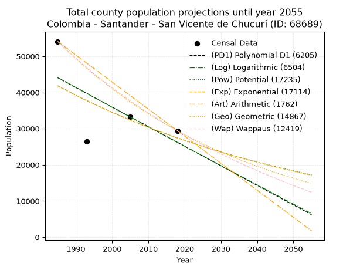
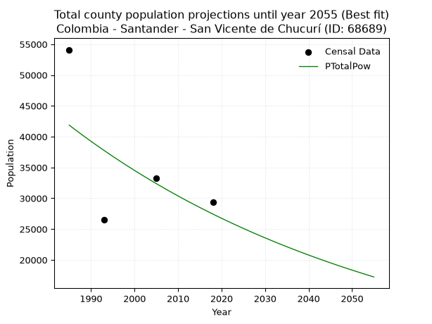
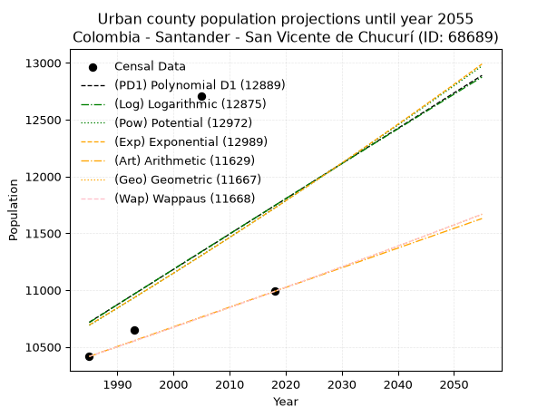
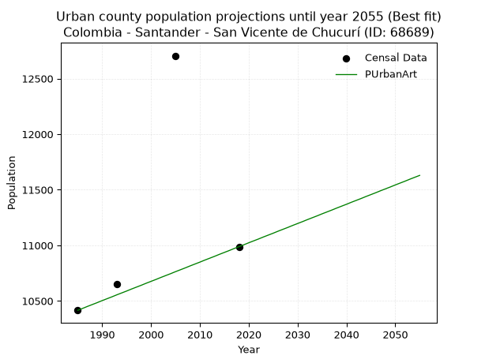
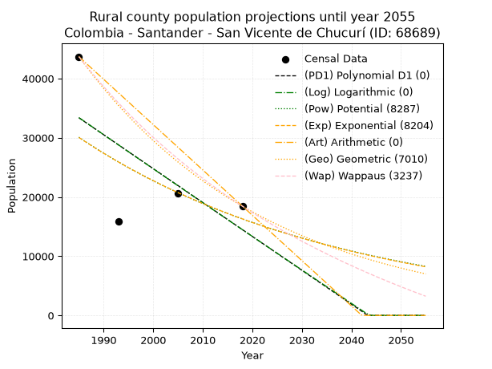
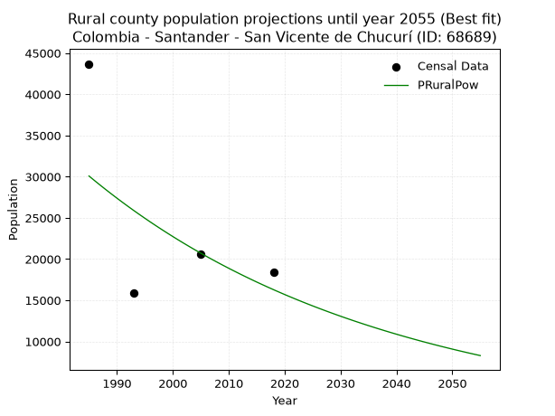

<div align="center">


</div>

# _“Population and Public Services Demand Projections (PPSD) until Year 2050 for Colombia - Santander - San Vicente de Chucurí (ID: 68689)”_
Keywords: `population` `public-service` `projection` `lineal` `polynomial` `logarithmic` `potential` `exponential` `arithmetic` `geometric` `wappaus` `dane` `colombia` `south-america`

PPSD are analytical estimates used by governments and planners to anticipate future changes in population size, age distribution, and the resulting community needs for utilities, healthcare, education, and infrastructure as sizing future water treatment facilities, electrical grids, and road networks based on spatial growth.

> **General running parameters**: • app_version: _v20260806_. • Python version: _3.14.7_. • Pandas version: _3.0.5_. • NumPy version: _2.5.1_. • Creates, save and include plots into reports (create_plot): _False_. • Projection until year: _2050_. • Process polynomial degree 2 and up: _False_. • Process Wappaus: _True_. • Process Wappaus: _True_. • Set negative values to zero: _True_. • Set infinite values to zero: _True_. • Drop dataset notes: _True_. 
<div align="center">

Dynamic map: [:earth_americas:Google](http://maps.google.com/maps?q=6.880382934,-73.4110239) [:earth_americas:OSM](https://www.openstreetmap.org/#map=18/6.880382934/-73.4110239&layers=P) [:earth_americas:Bing](https://www.bing.com/maps?cp=6.880382934~-73.4110239&lvl=18) [:earth_americas:Apple](https://maps.apple.com/frame?center=6.880382934%2C-73.4110239&span=0.003%2C0.006)

</div>


<div align="center">

```geojson
{
  "type": "Feature",
  "geometry": {
    "type": "Point", 
    "coordinates": [-73.4110239, 6.880382934]
  }, 
  "properties": {
    "Name": "Colombia - Santander - San Vicente de Chucurí (ID: 68689)"
  }
}
```

</div>


## 0. Census Data (4 records)

Census data are official statistics collected by a government about the people and housing in a country. They usually include counts of total population, age, sex, race, income, education, and jobs.

📅Global census file: [Population.xlsx](../data/Population.xlsx)

| Source   |   Year |   CountryID | CountryName   |   StateID | StateName   |   CountyID | CountyName             |   PTotal |   PUrban |   PRural |
|:---------|-------:|------------:|:--------------|----------:|:------------|-----------:|:-----------------------|---------:|---------:|---------:|
| DANE     |   1985 |          57 | Colombia      |        68 | Santander   |      68689 | San Vicente de Chucurí |    54101 |    10416 |    43685 |
| DANE     |   1993 |          57 | Colombia      |        68 | Santander   |      68689 | San Vicente De Chucurí |    26519 |    10651 |    15868 |
| DANE     |   2005 |          57 | Colombia      |        68 | Santander   |      68689 | San Vicente de Chucurí |    33267 |    12705 |    20562 |
| DANE     |   2018 |          57 | Colombia      |        68 | Santander   |      68689 | San Vicente De Chucurí |    29427 |    10988 |    18439 |

> 🔥Some records could had specific notes about the registered values or the corresponding urban or rural distribution.

## 1. Total

### 1.1. Coefficients and Parameters

* (PD1) Polynomial Deg 1: -541.076676033719, 1118117.1212364463 (lineal)
* (Log) Logarithmic: -1085159.724161757, 8284136.259277795
* (Pow) Potential: -25.601980330863025, 89.0509591696187
* (Exp) Exponential: -0.01276493244139636, 4224213820445447.5
* (Art) Arithmetic: Year diff. 2018 - 1985 = 33, Population diff. 29427 - 54101 = -24674, Annual growth = -747.6969696969697
* (Geo) Geometric: Year diff. 2018 - 1985 = 33, Population diff. 29427 - 54101 = -24674, Annual growth % = -0.018283519568718654
* (Wap) Wappaus: i = -1.790290608411478, Condition values only valid for < 200)

<sub>
Wappaus condition values: ['-0.00', '-1.79', '-3.58', '-5.37', '-7.16', '-8.95', '-10.74', '-12.53', '-14.32', '-16.11', '-17.90', '-19.69', '-21.48', '-23.27', '-25.06', '-26.85', '-28.64', '-30.43', '-32.23', '-34.02', '-35.81', '-37.60', '-39.39', '-41.18', '-42.97', '-44.76', '-46.55', '-48.34', '-50.13', '-51.92', '-53.71', '-55.50', '-57.29', '-59.08', '-60.87', '-62.66', '-64.45', '-66.24', '-68.03', '-69.82', '-71.61', '-73.40', '-75.19', '-76.98', '-78.77', '-80.56', '-82.35', '-84.14', '-85.93', '-87.72', '-89.51', '-91.30', '-93.10', '-94.89', '-96.68', '-98.47', '-100.26', '-102.05', '-103.84', '-105.63', '-107.42', '-109.21', '-111.00', '-112.79', '-114.58', '-116.37']
</sub>


### 1.2. Projected Dataset

|   Year |   CountyID |   PTotalPD1 |   PTotalLog |   PTotalPow |   PTotalExp |   PTotalArt |   PTotalGeo |   PTotalWap |
|-------:|-----------:|------------:|------------:|------------:|------------:|------------:|------------:|------------:|
|   1985 |      68689 |       44080 |       44112 |       41856 |       41824 |       54101 |       54101 |       54101 |
|   1986 |      68689 |       43539 |       43566 |       41320 |       41293 |       53353 |       53112 |       53141 |
|   1987 |      68689 |       42998 |       43020 |       40791 |       40769 |       52606 |       52141 |       52198 |
|   1988 |      68689 |       42457 |       42474 |       40269 |       40252 |       51858 |       51187 |       51271 |
|   1989 |      68689 |       41916 |       41928 |       39754 |       39742 |       51110 |       50252 |       50361 |
|   1990 |      68689 |       41375 |       41382 |       39245 |       39238 |       50363 |       49333 |       49466 |
|   1991 |      68689 |       40833 |       40837 |       38744 |       38740 |       49615 |       48431 |       48586 |
|   1992 |      68689 |       40292 |       40292 |       38249 |       38249 |       48867 |       47545 |       47721 |
|   1993 |      68689 |       39751 |       39748 |       37761 |       37764 |       48119 |       46676 |       46870 |
|   1994 |      68689 |       39210 |       39203 |       37279 |       37285 |       47372 |       45823 |       46034 |
|   1995 |      68689 |       38669 |       38659 |       36803 |       36812 |       46624 |       44985 |       45211 |
|   1996 |      68689 |       38128 |       38116 |       36334 |       36345 |       45876 |       44162 |       44402 |
|   1997 |      68689 |       37587 |       37572 |       35871 |       35884 |       45129 |       43355 |       43606 |
|   1998 |      68689 |       37046 |       37029 |       35414 |       35429 |       44381 |       42562 |       42822 |
|   1999 |      68689 |       36505 |       36486 |       34964 |       34979 |       43633 |       41784 |       42051 |
|   2000 |      68689 |       35964 |       35943 |       34519 |       34536 |       42886 |       41020 |       41292 |
|   2001 |      68689 |       35423 |       35401 |       34080 |       34098 |       42138 |       40270 |       40545 |
|   2002 |      68689 |       34882 |       34858 |       33647 |       33665 |       41390 |       39534 |       39810 |
|   2003 |      68689 |       34341 |       34317 |       33219 |       33238 |       40642 |       38811 |       39086 |
|   2004 |      68689 |       33799 |       33775 |       32797 |       32816 |       39895 |       38101 |       38373 |
|   2005 |      68689 |       33258 |       33234 |       32381 |       32400 |       39147 |       37405 |       37671 |
|   2006 |      68689 |       32717 |       32692 |       31970 |       31989 |       38399 |       36721 |       36980 |
|   2007 |      68689 |       32176 |       32152 |       31565 |       31584 |       37652 |       36049 |       36298 |
|   2008 |      68689 |       31635 |       31611 |       31165 |       31183 |       36904 |       35390 |       35627 |
|   2009 |      68689 |       31094 |       31071 |       30770 |       30787 |       36156 |       34743 |       34966 |
|   2010 |      68689 |       30553 |       30531 |       30381 |       30397 |       35409 |       34108 |       34315 |
|   2011 |      68689 |       30012 |       29991 |       29996 |       30011 |       34661 |       33484 |       33673 |
|   2012 |      68689 |       29471 |       29452 |       29617 |       29631 |       33913 |       32872 |       33040 |
|   2013 |      68689 |       28930 |       28912 |       29243 |       29255 |       33165 |       32271 |       32416 |
|   2014 |      68689 |       28389 |       28373 |       28873 |       28884 |       32418 |       31681 |       31801 |
|   2015 |      68689 |       27848 |       27835 |       28508 |       28517 |       31670 |       31102 |       31195 |
|   2016 |      68689 |       27307 |       27296 |       28149 |       28156 |       30922 |       30533 |       30598 |
|   2017 |      68689 |       26765 |       26758 |       27794 |       27799 |       30175 |       29975 |       30008 |
|   2018 |      68689 |       26224 |       26220 |       27443 |       27446 |       29427 |       29427 |       29427 |
|   2019 |      68689 |       25683 |       25683 |       27097 |       27098 |       28679 |       28889 |       28854 |
|   2020 |      68689 |       25142 |       25145 |       26756 |       26754 |       27932 |       28361 |       28288 |
|   2021 |      68689 |       24601 |       24608 |       26419 |       26415 |       27184 |       27842 |       27731 |
|   2022 |      68689 |       24060 |       24071 |       26086 |       26080 |       26436 |       27333 |       27180 |
|   2023 |      68689 |       23519 |       23535 |       25758 |       25749 |       25689 |       26833 |       26637 |
|   2024 |      68689 |       22978 |       22999 |       25434 |       25422 |       24941 |       26343 |       26102 |
|   2025 |      68689 |       22437 |       22463 |       25115 |       25100 |       24193 |       25861 |       25573 |
|   2026 |      68689 |       21896 |       21927 |       24799 |       24782 |       23445 |       25388 |       25051 |
|   2027 |      68689 |       21355 |       21391 |       24488 |       24467 |       22698 |       24924 |       24536 |
|   2028 |      68689 |       20814 |       20856 |       24181 |       24157 |       21950 |       24468 |       24028 |
|   2029 |      68689 |       20273 |       20321 |       23878 |       23851 |       21202 |       24021 |       23526 |
|   2030 |      68689 |       19731 |       19787 |       23578 |       23548 |       20455 |       23582 |       23031 |
|   2031 |      68689 |       19190 |       19252 |       23283 |       23249 |       19707 |       23151 |       22542 |
|   2032 |      68689 |       18649 |       18718 |       22991 |       22954 |       18959 |       22727 |       22059 |
|   2033 |      68689 |       18108 |       18184 |       22703 |       22663 |       18212 |       22312 |       21582 |
|   2034 |      68689 |       17567 |       17650 |       22419 |       22376 |       17464 |       21904 |       21111 |
|   2035 |      68689 |       17026 |       17117 |       22139 |       22092 |       16716 |       21504 |       20646 |
|   2036 |      68689 |       16485 |       16584 |       21862 |       21812 |       15968 |       21110 |       20187 |
|   2037 |      68689 |       15944 |       16051 |       21589 |       21535 |       15221 |       20724 |       19733 |
|   2038 |      68689 |       15403 |       15518 |       21320 |       21262 |       14473 |       20345 |       19285 |
|   2039 |      68689 |       14862 |       14986 |       21054 |       20992 |       13725 |       19973 |       18842 |
|   2040 |      68689 |       14321 |       14454 |       20791 |       20726 |       12978 |       19608 |       18404 |
|   2041 |      68689 |       13780 |       13922 |       20532 |       20463 |       12230 |       19250 |       17972 |
|   2042 |      68689 |       13239 |       13391 |       20276 |       20204 |       11482 |       18898 |       17545 |
|   2043 |      68689 |       12697 |       12859 |       20023 |       19947 |       10735 |       18552 |       17123 |
|   2044 |      68689 |       12156 |       12328 |       19774 |       19694 |        9987 |       18213 |       16706 |
|   2045 |      68689 |       11615 |       11798 |       19528 |       19445 |        9239 |       17880 |       16293 |
|   2046 |      68689 |       11074 |       11267 |       19285 |       19198 |        8491 |       17553 |       15886 |
|   2047 |      68689 |       10533 |       10737 |       19045 |       18954 |        7744 |       17232 |       15483 |
|   2048 |      68689 |        9992 |       10207 |       18809 |       18714 |        6996 |       16917 |       15084 |
|   2049 |      68689 |        9451 |        9677 |       18575 |       18477 |        6248 |       16608 |       14691 |
|   2050 |      68689 |        8910 |        9148 |       18344 |       18242 |        5501 |       16304 |       14301 |
<div align="center">

</img>

</div>


### 1.3. Best fit with absolute and relative error (%)

Relative error puts that difference into context by dividing the absolute error by the true value, creating a unitless ratio or percentage that shows the scale of the mistake.

Absolute and relative error

|   Year | Source   |   CountryID | CountryName   |   StateID | StateName   |   CountyID_x | CountyName             |   PTotal |   PUrban |   PRural |   CountyID_y |   PTotalPD1 |   PTotalLog |   PTotalPow |   PTotalExp |   PTotalArt |   PTotalGeo |   PTotalWap |   PTotalPD1AbsError |   PTotalLogAbsError |   PTotalPowAbsError |   PTotalExpAbsError |   PTotalArtAbsError |   PTotalGeoAbsError |   PTotalWapAbsError |   PTotalPD1RelError |   PTotalLogRelError |   PTotalPowRelError |   PTotalExpRelError |   PTotalArtRelError |   PTotalGeoRelError |   PTotalWapRelError |
|-------:|:---------|------------:|:--------------|----------:|:------------|-------------:|:-----------------------|---------:|---------:|---------:|-------------:|------------:|------------:|------------:|------------:|------------:|------------:|------------:|--------------------:|--------------------:|--------------------:|--------------------:|--------------------:|--------------------:|--------------------:|--------------------:|--------------------:|--------------------:|--------------------:|--------------------:|--------------------:|--------------------:|
|   1985 | DANE     |          57 | Colombia      |        68 | Santander   |        68689 | San Vicente de Chucurí |    54101 |    10416 |    43685 |        68689 |       44080 |       44112 |       41856 |       41824 |       54101 |       54101 |       54101 |               10021 |                9989 |               12245 |               12277 |                   0 |                   0 |                   0 |          18.5228    |          18.4636    |            22.6336  |            22.6927  |              0      |              0      |              0      |
|   1993 | DANE     |          57 | Colombia      |        68 | Santander   |        68689 | San Vicente De Chucurí |    26519 |    10651 |    15868 |        68689 |       39751 |       39748 |       37761 |       37764 |       48119 |       46676 |       46870 |               13232 |               13229 |               11242 |               11245 |               21600 |               20157 |               20351 |          49.8963    |          49.885     |            42.3922  |            42.4036  |             81.451  |             76.0097 |             76.7412 |
|   2005 | DANE     |          57 | Colombia      |        68 | Santander   |        68689 | San Vicente de Chucurí |    33267 |    12705 |    20562 |        68689 |       33258 |       33234 |       32381 |       32400 |       39147 |       37405 |       37671 |                   9 |                  33 |                 886 |                 867 |                5880 |                4138 |                4404 |           0.0270538 |           0.0991974 |             2.6633  |             2.60619 |             17.6752 |             12.4388 |             13.2383 |
|   2018 | DANE     |          57 | Colombia      |        68 | Santander   |        68689 | San Vicente De Chucurí |    29427 |    10988 |    18439 |        68689 |       26224 |       26220 |       27443 |       27446 |       29427 |       29427 |       29427 |                3203 |                3207 |                1984 |                1981 |                   0 |                   0 |                   0 |          10.8846    |          10.8982    |             6.74211 |             6.73191 |              0      |              0      |              0      |

Relative error mean

| Method    |   RelError | Best   |
|:----------|-----------:|:-------|
| PTotalPD1 |    19.8327 |        |
| PTotalLog |    19.8365 |        |
| PTotalPow |    18.6078 | True   |
| PTotalExp |    18.6086 |        |
| PTotalArt |    24.7816 |        |
| PTotalGeo |    22.1121 |        |
| PTotalWap |    22.4949 |        |

💙Best method: _**PTotalPow**_
<div align="center">

</img>

</div>


### 1.4. Fresh water supply demand in liters per capita per day (lpcd)

The fresh water supply demand typically ranges from 100 to 300 liters per capita per day (lpcd) for standard domestic and municipal planning, though absolute survival minimums set by the World Health Organization are as low as 7.5 to 20 liters per day, and total consumption in high-income nations can exceed 400 liters.

> `CZ`: Level in meters above the sea level (masl).<br> `WS`: Fresh water supply demand in liters per capita per day (lpcd or l/h/d).<br> `WSAll`: Zonal fresh water supply demand in liters per second (l/s).<br> `A`: Zonal area in square meters.

Reference values (RAS Colombia)

|    CZ |   WS |
|------:|-----:|
|  1000 |  120 |
|  2000 |  130 |
| 99999 |  140 |

County shapefile geometry properties and water supply values

|   CountyID |      ATotal |   CZTotal |   WSTotal |
|-----------:|------------:|----------:|----------:|
|      68689 | 1.11468e+09 |   575.307 |       120 |

Projected values for best method: PTotalPow

|   CountyID |   Year |   PTotalPow |   WSTotal |   WSTotalAll |
|-----------:|-------:|------------:|----------:|-------------:|
|      68689 |   1985 |       41856 |       120 |      58.1333 |
|      68689 |   1986 |       41320 |       120 |      57.3889 |
|      68689 |   1987 |       40791 |       120 |      56.6542 |
|      68689 |   1988 |       40269 |       120 |      55.9292 |
|      68689 |   1989 |       39754 |       120 |      55.2139 |
|      68689 |   1990 |       39245 |       120 |      54.5069 |
|      68689 |   1991 |       38744 |       120 |      53.8111 |
|      68689 |   1992 |       38249 |       120 |      53.1236 |
|      68689 |   1993 |       37761 |       120 |      52.4458 |
|      68689 |   1994 |       37279 |       120 |      51.7764 |
|      68689 |   1995 |       36803 |       120 |      51.1153 |
|      68689 |   1996 |       36334 |       120 |      50.4639 |
|      68689 |   1997 |       35871 |       120 |      49.8208 |
|      68689 |   1998 |       35414 |       120 |      49.1861 |
|      68689 |   1999 |       34964 |       120 |      48.5611 |
|      68689 |   2000 |       34519 |       120 |      47.9431 |
|      68689 |   2001 |       34080 |       120 |      47.3333 |
|      68689 |   2002 |       33647 |       120 |      46.7319 |
|      68689 |   2003 |       33219 |       120 |      46.1375 |
|      68689 |   2004 |       32797 |       120 |      45.5514 |
|      68689 |   2005 |       32381 |       120 |      44.9736 |
|      68689 |   2006 |       31970 |       120 |      44.4028 |
|      68689 |   2007 |       31565 |       120 |      43.8403 |
|      68689 |   2008 |       31165 |       120 |      43.2847 |
|      68689 |   2009 |       30770 |       120 |      42.7361 |
|      68689 |   2010 |       30381 |       120 |      42.1958 |
|      68689 |   2011 |       29996 |       120 |      41.6611 |
|      68689 |   2012 |       29617 |       120 |      41.1347 |
|      68689 |   2013 |       29243 |       120 |      40.6153 |
|      68689 |   2014 |       28873 |       120 |      40.1014 |
|      68689 |   2015 |       28508 |       120 |      39.5944 |
|      68689 |   2016 |       28149 |       120 |      39.0958 |
|      68689 |   2017 |       27794 |       120 |      38.6028 |
|      68689 |   2018 |       27443 |       120 |      38.1153 |
|      68689 |   2019 |       27097 |       120 |      37.6347 |
|      68689 |   2020 |       26756 |       120 |      37.1611 |
|      68689 |   2021 |       26419 |       120 |      36.6931 |
|      68689 |   2022 |       26086 |       120 |      36.2306 |
|      68689 |   2023 |       25758 |       120 |      35.775  |
|      68689 |   2024 |       25434 |       120 |      35.325  |
|      68689 |   2025 |       25115 |       120 |      34.8819 |
|      68689 |   2026 |       24799 |       120 |      34.4431 |
|      68689 |   2027 |       24488 |       120 |      34.0111 |
|      68689 |   2028 |       24181 |       120 |      33.5847 |
|      68689 |   2029 |       23878 |       120 |      33.1639 |
|      68689 |   2030 |       23578 |       120 |      32.7472 |
|      68689 |   2031 |       23283 |       120 |      32.3375 |
|      68689 |   2032 |       22991 |       120 |      31.9319 |
|      68689 |   2033 |       22703 |       120 |      31.5319 |
|      68689 |   2034 |       22419 |       120 |      31.1375 |
|      68689 |   2035 |       22139 |       120 |      30.7486 |
|      68689 |   2036 |       21862 |       120 |      30.3639 |
|      68689 |   2037 |       21589 |       120 |      29.9847 |
|      68689 |   2038 |       21320 |       120 |      29.6111 |
|      68689 |   2039 |       21054 |       120 |      29.2417 |
|      68689 |   2040 |       20791 |       120 |      28.8764 |
|      68689 |   2041 |       20532 |       120 |      28.5167 |
|      68689 |   2042 |       20276 |       120 |      28.1611 |
|      68689 |   2043 |       20023 |       120 |      27.8097 |
|      68689 |   2044 |       19774 |       120 |      27.4639 |
|      68689 |   2045 |       19528 |       120 |      27.1222 |
|      68689 |   2046 |       19285 |       120 |      26.7847 |
|      68689 |   2047 |       19045 |       120 |      26.4514 |
|      68689 |   2048 |       18809 |       120 |      26.1236 |
|      68689 |   2049 |       18575 |       120 |      25.7986 |
|      68689 |   2050 |       18344 |       120 |      25.4778 |

## 2. Urban

### 2.1. Coefficients and Parameters

* (PD1) Polynomial Deg 1: 31.026896828583844, -50871.55038137483 (lineal)
* (Log) Logarithmic: 62338.7066647919, -462647.00891012704
* (Pow) Potential: 5.58314824580242, -14.38289960051294
* (Exp) Exponential: 0.002779243797834972, 42.970848163505245
* (Art) Arithmetic: Year diff. 2018 - 1985 = 33, Population diff. 10988 - 10416 = 572, Annual growth = 17.333333333333332
* (Geo) Geometric: Year diff. 2018 - 1985 = 33, Population diff. 10988 - 10416 = 572, Annual growth % = 0.0016213336323236405
* (Wap) Wappaus: i = 0.16196349591976578, Condition values only valid for < 200)

<sub>
Wappaus condition values: ['0.00', '0.16', '0.32', '0.49', '0.65', '0.81', '0.97', '1.13', '1.30', '1.46', '1.62', '1.78', '1.94', '2.11', '2.27', '2.43', '2.59', '2.75', '2.92', '3.08', '3.24', '3.40', '3.56', '3.73', '3.89', '4.05', '4.21', '4.37', '4.53', '4.70', '4.86', '5.02', '5.18', '5.34', '5.51', '5.67', '5.83', '5.99', '6.15', '6.32', '6.48', '6.64', '6.80', '6.96', '7.13', '7.29', '7.45', '7.61', '7.77', '7.94', '8.10', '8.26', '8.42', '8.58', '8.75', '8.91', '9.07', '9.23', '9.39', '9.56', '9.72', '9.88', '10.04', '10.20', '10.37', '10.53']
</sub>


### 2.2. Projected Dataset

|   Year |   CountyID |   PUrbanPD1 |   PUrbanLog |   PUrbanPow |   PUrbanExp |   PUrbanArt |   PUrbanGeo |   PUrbanWap |
|-------:|-----------:|------------:|------------:|------------:|------------:|------------:|------------:|------------:|
|   1985 |      68689 |       10717 |       10714 |       10690 |       10693 |       10416 |       10416 |       10416 |
|   1986 |      68689 |       10748 |       10746 |       10720 |       10723 |       10433 |       10433 |       10433 |
|   1987 |      68689 |       10779 |       10777 |       10750 |       10752 |       10451 |       10450 |       10450 |
|   1988 |      68689 |       10810 |       10808 |       10781 |       10782 |       10468 |       10467 |       10467 |
|   1989 |      68689 |       10841 |       10840 |       10811 |       10812 |       10485 |       10484 |       10484 |
|   1990 |      68689 |       10872 |       10871 |       10841 |       10842 |       10503 |       10501 |       10501 |
|   1991 |      68689 |       10903 |       10902 |       10872 |       10873 |       10520 |       10518 |       10518 |
|   1992 |      68689 |       10934 |       10934 |       10902 |       10903 |       10537 |       10535 |       10535 |
|   1993 |      68689 |       10965 |       10965 |       10933 |       10933 |       10555 |       10552 |       10552 |
|   1994 |      68689 |       10996 |       10996 |       10964 |       10964 |       10572 |       10569 |       10569 |
|   1995 |      68689 |       11027 |       11027 |       10994 |       10994 |       10589 |       10586 |       10586 |
|   1996 |      68689 |       11058 |       11059 |       11025 |       11025 |       10607 |       10603 |       10603 |
|   1997 |      68689 |       11089 |       11090 |       11056 |       11055 |       10624 |       10620 |       10620 |
|   1998 |      68689 |       11120 |       11121 |       11087 |       11086 |       10641 |       10638 |       10638 |
|   1999 |      68689 |       11151 |       11152 |       11118 |       11117 |       10659 |       10655 |       10655 |
|   2000 |      68689 |       11182 |       11183 |       11149 |       11148 |       10676 |       10672 |       10672 |
|   2001 |      68689 |       11213 |       11215 |       11180 |       11179 |       10693 |       10690 |       10689 |
|   2002 |      68689 |       11244 |       11246 |       11212 |       11210 |       10711 |       10707 |       10707 |
|   2003 |      68689 |       11275 |       11277 |       11243 |       11241 |       10728 |       10724 |       10724 |
|   2004 |      68689 |       11306 |       11308 |       11274 |       11273 |       10745 |       10742 |       10742 |
|   2005 |      68689 |       11337 |       11339 |       11306 |       11304 |       10763 |       10759 |       10759 |
|   2006 |      68689 |       11368 |       11370 |       11337 |       11335 |       10780 |       10776 |       10776 |
|   2007 |      68689 |       11399 |       11401 |       11369 |       11367 |       10797 |       10794 |       10794 |
|   2008 |      68689 |       11430 |       11432 |       11400 |       11399 |       10815 |       10811 |       10811 |
|   2009 |      68689 |       11461 |       11463 |       11432 |       11430 |       10832 |       10829 |       10829 |
|   2010 |      68689 |       11493 |       11494 |       11464 |       11462 |       10849 |       10847 |       10846 |
|   2011 |      68689 |       11524 |       11525 |       11496 |       11494 |       10867 |       10864 |       10864 |
|   2012 |      68689 |       11555 |       11556 |       11528 |       11526 |       10884 |       10882 |       10882 |
|   2013 |      68689 |       11586 |       11587 |       11560 |       11558 |       10901 |       10899 |       10899 |
|   2014 |      68689 |       11617 |       11618 |       11592 |       11590 |       10919 |       10917 |       10917 |
|   2015 |      68689 |       11648 |       11649 |       11624 |       11623 |       10936 |       10935 |       10935 |
|   2016 |      68689 |       11679 |       11680 |       11656 |       11655 |       10953 |       10952 |       10952 |
|   2017 |      68689 |       11710 |       11711 |       11689 |       11687 |       10971 |       10970 |       10970 |
|   2018 |      68689 |       11741 |       11742 |       11721 |       11720 |       10988 |       10988 |       10988 |
|   2019 |      68689 |       11772 |       11773 |       11753 |       11752 |       11005 |       11006 |       11006 |
|   2020 |      68689 |       11803 |       11804 |       11786 |       11785 |       11023 |       11024 |       11024 |
|   2021 |      68689 |       11834 |       11835 |       11819 |       11818 |       11040 |       11042 |       11042 |
|   2022 |      68689 |       11865 |       11865 |       11851 |       11851 |       11057 |       11059 |       11059 |
|   2023 |      68689 |       11896 |       11896 |       11884 |       11884 |       11075 |       11077 |       11077 |
|   2024 |      68689 |       11927 |       11927 |       11917 |       11917 |       11092 |       11095 |       11095 |
|   2025 |      68689 |       11958 |       11958 |       11950 |       11950 |       11109 |       11113 |       11113 |
|   2026 |      68689 |       11989 |       11989 |       11983 |       11983 |       11127 |       11131 |       11131 |
|   2027 |      68689 |       12020 |       12019 |       12016 |       12017 |       11144 |       11149 |       11149 |
|   2028 |      68689 |       12051 |       12050 |       12049 |       12050 |       11161 |       11167 |       11168 |
|   2029 |      68689 |       12082 |       12081 |       12082 |       12084 |       11179 |       11186 |       11186 |
|   2030 |      68689 |       12113 |       12112 |       12115 |       12117 |       11196 |       11204 |       11204 |
|   2031 |      68689 |       12144 |       12142 |       12149 |       12151 |       11213 |       11222 |       11222 |
|   2032 |      68689 |       12175 |       12173 |       12182 |       12185 |       11231 |       11240 |       11240 |
|   2033 |      68689 |       12206 |       12204 |       12216 |       12219 |       11248 |       11258 |       11259 |
|   2034 |      68689 |       12237 |       12234 |       12249 |       12253 |       11265 |       11277 |       11277 |
|   2035 |      68689 |       12268 |       12265 |       12283 |       12287 |       11283 |       11295 |       11295 |
|   2036 |      68689 |       12299 |       12296 |       12317 |       12321 |       11300 |       11313 |       11313 |
|   2037 |      68689 |       12330 |       12326 |       12351 |       12355 |       11317 |       11331 |       11332 |
|   2038 |      68689 |       12361 |       12357 |       12384 |       12390 |       11335 |       11350 |       11350 |
|   2039 |      68689 |       12392 |       12387 |       12418 |       12424 |       11352 |       11368 |       11369 |
|   2040 |      68689 |       12423 |       12418 |       12452 |       12459 |       11369 |       11387 |       11387 |
|   2041 |      68689 |       12454 |       12448 |       12487 |       12493 |       11387 |       11405 |       11406 |
|   2042 |      68689 |       12485 |       12479 |       12521 |       12528 |       11404 |       11424 |       11424 |
|   2043 |      68689 |       12516 |       12509 |       12555 |       12563 |       11421 |       11442 |       11443 |
|   2044 |      68689 |       12547 |       12540 |       12589 |       12598 |       11439 |       11461 |       11461 |
|   2045 |      68689 |       12578 |       12570 |       12624 |       12633 |       11456 |       11479 |       11480 |
|   2046 |      68689 |       12609 |       12601 |       12658 |       12668 |       11473 |       11498 |       11499 |
|   2047 |      68689 |       12641 |       12631 |       12693 |       12704 |       11491 |       11517 |       11517 |
|   2048 |      68689 |       12672 |       12662 |       12728 |       12739 |       11508 |       11535 |       11536 |
|   2049 |      68689 |       12703 |       12692 |       12762 |       12774 |       11525 |       11554 |       11555 |
|   2050 |      68689 |       12734 |       12723 |       12797 |       12810 |       11543 |       11573 |       11573 |
<div align="center">

</img>

</div>


### 2.3. Best fit with absolute and relative error (%)

Relative error puts that difference into context by dividing the absolute error by the true value, creating a unitless ratio or percentage that shows the scale of the mistake.

Absolute and relative error

|   Year | Source   |   CountryID | CountryName   |   StateID | StateName   |   CountyID_x | CountyName             |   PTotal |   PUrban |   PRural |   CountyID_y |   PUrbanPD1 |   PUrbanLog |   PUrbanPow |   PUrbanExp |   PUrbanArt |   PUrbanGeo |   PUrbanWap |   PUrbanPD1AbsError |   PUrbanLogAbsError |   PUrbanPowAbsError |   PUrbanExpAbsError |   PUrbanArtAbsError |   PUrbanGeoAbsError |   PUrbanWapAbsError |   PUrbanPD1RelError |   PUrbanLogRelError |   PUrbanPowRelError |   PUrbanExpRelError |   PUrbanArtRelError |   PUrbanGeoRelError |   PUrbanWapRelError |
|-------:|:---------|------------:|:--------------|----------:|:------------|-------------:|:-----------------------|---------:|---------:|---------:|-------------:|------------:|------------:|------------:|------------:|------------:|------------:|------------:|--------------------:|--------------------:|--------------------:|--------------------:|--------------------:|--------------------:|--------------------:|--------------------:|--------------------:|--------------------:|--------------------:|--------------------:|--------------------:|--------------------:|
|   1985 | DANE     |          57 | Colombia      |        68 | Santander   |        68689 | San Vicente de Chucurí |    54101 |    10416 |    43685 |        68689 |       10717 |       10714 |       10690 |       10693 |       10416 |       10416 |       10416 |                 301 |                 298 |                 274 |                 277 |                   0 |                   0 |                   0 |             2.88978 |             2.86098 |             2.63057 |             2.65937 |            0        |             0       |             0       |
|   1993 | DANE     |          57 | Colombia      |        68 | Santander   |        68689 | San Vicente De Chucurí |    26519 |    10651 |    15868 |        68689 |       10965 |       10965 |       10933 |       10933 |       10555 |       10552 |       10552 |                 314 |                 314 |                 282 |                 282 |                  96 |                  99 |                  99 |             2.94808 |             2.94808 |             2.64764 |             2.64764 |            0.901324 |             0.92949 |             0.92949 |
|   2005 | DANE     |          57 | Colombia      |        68 | Santander   |        68689 | San Vicente de Chucurí |    33267 |    12705 |    20562 |        68689 |       11337 |       11339 |       11306 |       11304 |       10763 |       10759 |       10759 |                1368 |                1366 |                1399 |                1401 |                1942 |                1946 |                1946 |            10.7674  |            10.7517  |            11.0114  |            11.0272  |           15.2853   |            15.3168  |            15.3168  |
|   2018 | DANE     |          57 | Colombia      |        68 | Santander   |        68689 | San Vicente De Chucurí |    29427 |    10988 |    18439 |        68689 |       11741 |       11742 |       11721 |       11720 |       10988 |       10988 |       10988 |                 753 |                 754 |                 733 |                 732 |                   0 |                   0 |                   0 |             6.85293 |             6.86203 |             6.67091 |             6.66181 |            0        |             0       |             0       |

Relative error mean

| Method    |   RelError | Best   |
|:----------|-----------:|:-------|
| PUrbanPD1 |    5.86455 |        |
| PUrbanLog |    5.85569 |        |
| PUrbanPow |    5.74013 |        |
| PUrbanExp |    5.74899 |        |
| PUrbanArt |    4.04666 | True   |
| PUrbanGeo |    4.06157 |        |
| PUrbanWap |    4.06157 |        |

💙Best method: _**PUrbanArt**_
<div align="center">

</img>

</div>


### 2.4. Fresh water supply demand in liters per capita per day (lpcd)

The fresh water supply demand typically ranges from 100 to 300 liters per capita per day (lpcd) for standard domestic and municipal planning, though absolute survival minimums set by the World Health Organization are as low as 7.5 to 20 liters per day, and total consumption in high-income nations can exceed 400 liters.

> `CZ`: Level in meters above the sea level (masl).<br> `WS`: Fresh water supply demand in liters per capita per day (lpcd or l/h/d).<br> `WSAll`: Zonal fresh water supply demand in liters per second (l/s).<br> `A`: Zonal area in square meters.

Reference values (RAS Colombia)

|    CZ |   WS |
|------:|-----:|
|  1000 |  120 |
|  2000 |  130 |
| 99999 |  140 |

County shapefile geometry properties and water supply values

|   CountyID |    AUrban |   CZUrban |   WSUrban |
|-----------:|----------:|----------:|----------:|
|      68689 | 1.856e+06 |   648.721 |       120 |

Projected values for best method: PUrbanArt

|   CountyID |   Year |   PUrbanArt |   WSUrban |   WSUrbanAll |
|-----------:|-------:|------------:|----------:|-------------:|
|      68689 |   1985 |       10416 |       120 |      14.4667 |
|      68689 |   1986 |       10433 |       120 |      14.4903 |
|      68689 |   1987 |       10451 |       120 |      14.5153 |
|      68689 |   1988 |       10468 |       120 |      14.5389 |
|      68689 |   1989 |       10485 |       120 |      14.5625 |
|      68689 |   1990 |       10503 |       120 |      14.5875 |
|      68689 |   1991 |       10520 |       120 |      14.6111 |
|      68689 |   1992 |       10537 |       120 |      14.6347 |
|      68689 |   1993 |       10555 |       120 |      14.6597 |
|      68689 |   1994 |       10572 |       120 |      14.6833 |
|      68689 |   1995 |       10589 |       120 |      14.7069 |
|      68689 |   1996 |       10607 |       120 |      14.7319 |
|      68689 |   1997 |       10624 |       120 |      14.7556 |
|      68689 |   1998 |       10641 |       120 |      14.7792 |
|      68689 |   1999 |       10659 |       120 |      14.8042 |
|      68689 |   2000 |       10676 |       120 |      14.8278 |
|      68689 |   2001 |       10693 |       120 |      14.8514 |
|      68689 |   2002 |       10711 |       120 |      14.8764 |
|      68689 |   2003 |       10728 |       120 |      14.9    |
|      68689 |   2004 |       10745 |       120 |      14.9236 |
|      68689 |   2005 |       10763 |       120 |      14.9486 |
|      68689 |   2006 |       10780 |       120 |      14.9722 |
|      68689 |   2007 |       10797 |       120 |      14.9958 |
|      68689 |   2008 |       10815 |       120 |      15.0208 |
|      68689 |   2009 |       10832 |       120 |      15.0444 |
|      68689 |   2010 |       10849 |       120 |      15.0681 |
|      68689 |   2011 |       10867 |       120 |      15.0931 |
|      68689 |   2012 |       10884 |       120 |      15.1167 |
|      68689 |   2013 |       10901 |       120 |      15.1403 |
|      68689 |   2014 |       10919 |       120 |      15.1653 |
|      68689 |   2015 |       10936 |       120 |      15.1889 |
|      68689 |   2016 |       10953 |       120 |      15.2125 |
|      68689 |   2017 |       10971 |       120 |      15.2375 |
|      68689 |   2018 |       10988 |       120 |      15.2611 |
|      68689 |   2019 |       11005 |       120 |      15.2847 |
|      68689 |   2020 |       11023 |       120 |      15.3097 |
|      68689 |   2021 |       11040 |       120 |      15.3333 |
|      68689 |   2022 |       11057 |       120 |      15.3569 |
|      68689 |   2023 |       11075 |       120 |      15.3819 |
|      68689 |   2024 |       11092 |       120 |      15.4056 |
|      68689 |   2025 |       11109 |       120 |      15.4292 |
|      68689 |   2026 |       11127 |       120 |      15.4542 |
|      68689 |   2027 |       11144 |       120 |      15.4778 |
|      68689 |   2028 |       11161 |       120 |      15.5014 |
|      68689 |   2029 |       11179 |       120 |      15.5264 |
|      68689 |   2030 |       11196 |       120 |      15.55   |
|      68689 |   2031 |       11213 |       120 |      15.5736 |
|      68689 |   2032 |       11231 |       120 |      15.5986 |
|      68689 |   2033 |       11248 |       120 |      15.6222 |
|      68689 |   2034 |       11265 |       120 |      15.6458 |
|      68689 |   2035 |       11283 |       120 |      15.6708 |
|      68689 |   2036 |       11300 |       120 |      15.6944 |
|      68689 |   2037 |       11317 |       120 |      15.7181 |
|      68689 |   2038 |       11335 |       120 |      15.7431 |
|      68689 |   2039 |       11352 |       120 |      15.7667 |
|      68689 |   2040 |       11369 |       120 |      15.7903 |
|      68689 |   2041 |       11387 |       120 |      15.8153 |
|      68689 |   2042 |       11404 |       120 |      15.8389 |
|      68689 |   2043 |       11421 |       120 |      15.8625 |
|      68689 |   2044 |       11439 |       120 |      15.8875 |
|      68689 |   2045 |       11456 |       120 |      15.9111 |
|      68689 |   2046 |       11473 |       120 |      15.9347 |
|      68689 |   2047 |       11491 |       120 |      15.9597 |
|      68689 |   2048 |       11508 |       120 |      15.9833 |
|      68689 |   2049 |       11525 |       120 |      16.0069 |
|      68689 |   2050 |       11543 |       120 |      16.0319 |

## 3. Rural

### 3.1. Coefficients and Parameters

* (PD1) Polynomial Deg 1: -572.1035728623032, 1168988.6716178218 (lineal)
* (Log) Logarithmic: -1147498.4308265485, 8746783.268187918
* (Pow) Potential: -37.19575329749417, 127.14091676822305
* (Exp) Exponential: -0.01854253167725371, 2.9024578291566825e+20
* (Art) Arithmetic: Year diff. 2018 - 1985 = 33, Population diff. 18439 - 43685 = -25246, Annual growth = -765.030303030303
* (Geo) Geometric: Year diff. 2018 - 1985 = 33, Population diff. 18439 - 43685 = -25246, Annual growth % = -0.025798851798556677
* (Wap) Wappaus: i = -2.4629138594755746, Condition values only valid for < 200)

<sub>
Wappaus condition values: ['-0.00', '-2.46', '-4.93', '-7.39', '-9.85', '-12.31', '-14.78', '-17.24', '-19.70', '-22.17', '-24.63', '-27.09', '-29.55', '-32.02', '-34.48', '-36.94', '-39.41', '-41.87', '-44.33', '-46.80', '-49.26', '-51.72', '-54.18', '-56.65', '-59.11', '-61.57', '-64.04', '-66.50', '-68.96', '-71.42', '-73.89', '-76.35', '-78.81', '-81.28', '-83.74', '-86.20', '-88.66', '-91.13', '-93.59', '-96.05', '-98.52', '-100.98', '-103.44', '-105.91', '-108.37', '-110.83', '-113.29', '-115.76', '-118.22', '-120.68', '-123.15', '-125.61', '-128.07', '-130.53', '-133.00', '-135.46', '-137.92', '-140.39', '-142.85', '-145.31', '-147.77', '-150.24', '-152.70', '-155.16', '-157.63', '-160.09']
</sub>


### 3.2. Projected Dataset

|   Year |   CountyID |   PRuralPD1 |   PRuralLog |   PRuralPow |   PRuralExp |   PRuralArt |   PRuralGeo |   PRuralWap |
|-------:|-----------:|------------:|------------:|------------:|------------:|------------:|------------:|------------:|
|   1985 |      68689 |       33363 |       33398 |       30077 |       30041 |       43685 |       43685 |       43685 |
|   1986 |      68689 |       32791 |       32820 |       29519 |       29490 |       42920 |       42558 |       42622 |
|   1987 |      68689 |       32219 |       32243 |       28971 |       28948 |       42155 |       41460 |       41585 |
|   1988 |      68689 |       31647 |       31665 |       28434 |       28416 |       41390 |       40390 |       40572 |
|   1989 |      68689 |       31075 |       31088 |       27907 |       27894 |       40625 |       39348 |       39583 |
|   1990 |      68689 |       30503 |       30512 |       27390 |       27381 |       39860 |       38333 |       38617 |
|   1991 |      68689 |       29930 |       29935 |       26883 |       26878 |       39095 |       37344 |       37674 |
|   1992 |      68689 |       29358 |       29359 |       26385 |       26385 |       38330 |       36381 |       36751 |
|   1993 |      68689 |       28786 |       28783 |       25897 |       25900 |       37565 |       35442 |       35850 |
|   1994 |      68689 |       28214 |       28207 |       25419 |       25424 |       36800 |       34528 |       34968 |
|   1995 |      68689 |       27642 |       27632 |       24949 |       24957 |       36035 |       33637 |       34105 |
|   1996 |      68689 |       27070 |       27057 |       24488 |       24498 |       35270 |       32769 |       33262 |
|   1997 |      68689 |       26498 |       26482 |       24036 |       24048 |       34505 |       31924 |       32436 |
|   1998 |      68689 |       25926 |       25908 |       23593 |       23607 |       33740 |       31100 |       31628 |
|   1999 |      68689 |       25354 |       25334 |       23158 |       23173 |       32975 |       30298 |       30837 |
|   2000 |      68689 |       24782 |       24760 |       22731 |       22747 |       32210 |       29516 |       30062 |
|   2001 |      68689 |       24209 |       24186 |       22312 |       22329 |       31445 |       28755 |       29304 |
|   2002 |      68689 |       23637 |       23613 |       21901 |       21919 |       30679 |       28013 |       28561 |
|   2003 |      68689 |       23065 |       23040 |       21498 |       21516 |       29914 |       27290 |       27832 |
|   2004 |      68689 |       22493 |       22467 |       21103 |       21121 |       29149 |       26586 |       27119 |
|   2005 |      68689 |       21921 |       21894 |       20715 |       20733 |       28384 |       25900 |       26419 |
|   2006 |      68689 |       21349 |       21322 |       20334 |       20352 |       27619 |       25232 |       25733 |
|   2007 |      68689 |       20777 |       20750 |       19961 |       19978 |       26854 |       24581 |       25060 |
|   2008 |      68689 |       20205 |       20179 |       19594 |       19611 |       26089 |       23947 |       24401 |
|   2009 |      68689 |       19633 |       19607 |       19235 |       19251 |       25324 |       23329 |       23754 |
|   2010 |      68689 |       19060 |       19036 |       18882 |       18897 |       24559 |       22727 |       23119 |
|   2011 |      68689 |       18488 |       18466 |       18536 |       18550 |       23794 |       22141 |       22495 |
|   2012 |      68689 |       17916 |       17895 |       18196 |       18209 |       23029 |       21570 |       21884 |
|   2013 |      68689 |       17344 |       17325 |       17863 |       17875 |       22264 |       21013 |       21283 |
|   2014 |      68689 |       16772 |       16755 |       17536 |       17546 |       21499 |       20471 |       20694 |
|   2015 |      68689 |       16200 |       16185 |       17215 |       17224 |       20734 |       19943 |       20115 |
|   2016 |      68689 |       15628 |       15616 |       16901 |       16908 |       19969 |       19429 |       19546 |
|   2017 |      68689 |       15056 |       15047 |       16592 |       16597 |       19204 |       18927 |       18988 |
|   2018 |      68689 |       14484 |       14478 |       16289 |       16292 |       18439 |       18439 |       18439 |
|   2019 |      68689 |       13912 |       13910 |       15991 |       15993 |       17674 |       17963 |       17900 |
|   2020 |      68689 |       13339 |       13342 |       15699 |       15699 |       16909 |       17500 |       17370 |
|   2021 |      68689 |       12767 |       12774 |       15413 |       15410 |       16144 |       17048 |       16849 |
|   2022 |      68689 |       12195 |       12206 |       15132 |       15127 |       15379 |       16609 |       16337 |
|   2023 |      68689 |       11623 |       11639 |       14856 |       14849 |       14614 |       16180 |       15833 |
|   2024 |      68689 |       11051 |       11072 |       14586 |       14577 |       13849 |       15763 |       15338 |
|   2025 |      68689 |       10479 |       10505 |       14320 |       14309 |       13084 |       15356 |       14851 |
|   2026 |      68689 |        9907 |        9938 |       14060 |       14046 |       12319 |       14960 |       14372 |
|   2027 |      68689 |        9335 |        9372 |       13804 |       13788 |       11554 |       14574 |       13901 |
|   2028 |      68689 |        8763 |        8806 |       13553 |       13535 |       10789 |       14198 |       13437 |
|   2029 |      68689 |        8191 |        8240 |       13307 |       13286 |       10024 |       13832 |       12981 |
|   2030 |      68689 |        7618 |        7675 |       13065 |       13042 |        9259 |       13475 |       12532 |
|   2031 |      68689 |        7046 |        7110 |       12828 |       12802 |        8494 |       13127 |       12090 |
|   2032 |      68689 |        6474 |        6545 |       12595 |       12567 |        7729 |       12788 |       11655 |
|   2033 |      68689 |        5902 |        5980 |       12367 |       12336 |        6964 |       12459 |       11227 |
|   2034 |      68689 |        5330 |        5416 |       12143 |       12110 |        6199 |       12137 |       10805 |
|   2035 |      68689 |        4758 |        4852 |       11923 |       11887 |        5433 |       11824 |       10390 |
|   2036 |      68689 |        4186 |        4288 |       11707 |       11669 |        4668 |       11519 |        9981 |
|   2037 |      68689 |        3614 |        3725 |       11495 |       11454 |        3903 |       11222 |        9578 |
|   2038 |      68689 |        3042 |        3162 |       11287 |       11244 |        3138 |       10932 |        9181 |
|   2039 |      68689 |        2469 |        2599 |       11083 |       11037 |        2373 |       10650 |        8790 |
|   2040 |      68689 |        1897 |        2036 |       10883 |       10835 |        1608 |       10375 |        8405 |
|   2041 |      68689 |        1325 |        1474 |       10686 |       10635 |         843 |       10108 |        8025 |
|   2042 |      68689 |         753 |         912 |       10493 |       10440 |          78 |        9847 |        7651 |
|   2043 |      68689 |         181 |         350 |       10304 |       10248 |           0 |        9593 |        7282 |
|   2044 |      68689 |           0 |           0 |       10118 |       10060 |           0 |        9345 |        6919 |
|   2045 |      68689 |           0 |           0 |        9935 |        9875 |           0 |        9104 |        6560 |
|   2046 |      68689 |           0 |           0 |        9756 |        9694 |           0 |        8870 |        6207 |
|   2047 |      68689 |           0 |           0 |        9581 |        9516 |           0 |        8641 |        5858 |
|   2048 |      68689 |           0 |           0 |        9408 |        9341 |           0 |        8418 |        5515 |
|   2049 |      68689 |           0 |           0 |        9239 |        9169 |           0 |        8201 |        5176 |
|   2050 |      68689 |           0 |           0 |        9073 |        9001 |           0 |        7989 |        4842 |
<div align="center">

</img>

</div>


### 3.3. Best fit with absolute and relative error (%)

Relative error puts that difference into context by dividing the absolute error by the true value, creating a unitless ratio or percentage that shows the scale of the mistake.

Absolute and relative error

|   Year | Source   |   CountryID | CountryName   |   StateID | StateName   |   CountyID_x | CountyName             |   PTotal |   PUrban |   PRural |   CountyID_y |   PRuralPD1 |   PRuralLog |   PRuralPow |   PRuralExp |   PRuralArt |   PRuralGeo |   PRuralWap |   PRuralPD1AbsError |   PRuralLogAbsError |   PRuralPowAbsError |   PRuralExpAbsError |   PRuralArtAbsError |   PRuralGeoAbsError |   PRuralWapAbsError |   PRuralPD1RelError |   PRuralLogRelError |   PRuralPowRelError |   PRuralExpRelError |   PRuralArtRelError |   PRuralGeoRelError |   PRuralWapRelError |
|-------:|:---------|------------:|:--------------|----------:|:------------|-------------:|:-----------------------|---------:|---------:|---------:|-------------:|------------:|------------:|------------:|------------:|------------:|------------:|------------:|--------------------:|--------------------:|--------------------:|--------------------:|--------------------:|--------------------:|--------------------:|--------------------:|--------------------:|--------------------:|--------------------:|--------------------:|--------------------:|--------------------:|
|   1985 | DANE     |          57 | Colombia      |        68 | Santander   |        68689 | San Vicente de Chucurí |    54101 |    10416 |    43685 |        68689 |       33363 |       33398 |       30077 |       30041 |       43685 |       43685 |       43685 |               10322 |               10287 |               13608 |               13644 |                   0 |                   0 |                   0 |            23.6282  |            23.5481  |           31.1503   |           31.2327   |               0     |              0      |              0      |
|   1993 | DANE     |          57 | Colombia      |        68 | Santander   |        68689 | San Vicente De Chucurí |    26519 |    10651 |    15868 |        68689 |       28786 |       28783 |       25897 |       25900 |       37565 |       35442 |       35850 |               12918 |               12915 |               10029 |               10032 |               21697 |               19574 |               19982 |            81.4091  |            81.3902  |           63.2027   |           63.2216   |             136.734 |            123.355  |            125.926  |
|   2005 | DANE     |          57 | Colombia      |        68 | Santander   |        68689 | San Vicente de Chucurí |    33267 |    12705 |    20562 |        68689 |       21921 |       21894 |       20715 |       20733 |       28384 |       25900 |       26419 |                1359 |                1332 |                 153 |                 171 |                7822 |                5338 |                5857 |             6.60928 |             6.47797 |            0.744091 |            0.831631 |              38.041 |             25.9605 |             28.4846 |
|   2018 | DANE     |          57 | Colombia      |        68 | Santander   |        68689 | San Vicente De Chucurí |    29427 |    10988 |    18439 |        68689 |       14484 |       14478 |       16289 |       16292 |       18439 |       18439 |       18439 |                3955 |                3961 |                2150 |                2147 |                   0 |                   0 |                   0 |            21.4491  |            21.4816  |           11.6601   |           11.6438   |               0     |              0      |              0      |

Relative error mean

| Method    |   RelError | Best   |
|:----------|-----------:|:-------|
| PRuralPD1 |    33.2739 |        |
| PRuralLog |    33.2245 |        |
| PRuralPow |    26.6893 | True   |
| PRuralExp |    26.7324 |        |
| PRuralArt |    43.6938 |        |
| PRuralGeo |    37.3289 |        |
| PRuralWap |    38.6027 |        |

💙Best method: _**PRuralPow**_
<div align="center">

</img>

</div>


### 3.4. Fresh water supply demand in liters per capita per day (lpcd)

The fresh water supply demand typically ranges from 100 to 300 liters per capita per day (lpcd) for standard domestic and municipal planning, though absolute survival minimums set by the World Health Organization are as low as 7.5 to 20 liters per day, and total consumption in high-income nations can exceed 400 liters.

> `CZ`: Level in meters above the sea level (masl).<br> `WS`: Fresh water supply demand in liters per capita per day (lpcd or l/h/d).<br> `WSAll`: Zonal fresh water supply demand in liters per second (l/s).<br> `A`: Zonal area in square meters.

Reference values (RAS Colombia)

|    CZ |   WS |
|------:|-----:|
|  1000 |  120 |
|  2000 |  130 |
| 99999 |  140 |

County shapefile geometry properties and water supply values

|   CountyID |      ARural |   CZRural |   WSRural |
|-----------:|------------:|----------:|----------:|
|      68689 | 1.11283e+09 |   575.184 |       120 |

Projected values for best method: PRuralPow

|   CountyID |   Year |   PRuralPow |   WSRural |   WSRuralAll |
|-----------:|-------:|------------:|----------:|-------------:|
|      68689 |   1985 |       30077 |       120 |      41.7736 |
|      68689 |   1986 |       29519 |       120 |      40.9986 |
|      68689 |   1987 |       28971 |       120 |      40.2375 |
|      68689 |   1988 |       28434 |       120 |      39.4917 |
|      68689 |   1989 |       27907 |       120 |      38.7597 |
|      68689 |   1990 |       27390 |       120 |      38.0417 |
|      68689 |   1991 |       26883 |       120 |      37.3375 |
|      68689 |   1992 |       26385 |       120 |      36.6458 |
|      68689 |   1993 |       25897 |       120 |      35.9681 |
|      68689 |   1994 |       25419 |       120 |      35.3042 |
|      68689 |   1995 |       24949 |       120 |      34.6514 |
|      68689 |   1996 |       24488 |       120 |      34.0111 |
|      68689 |   1997 |       24036 |       120 |      33.3833 |
|      68689 |   1998 |       23593 |       120 |      32.7681 |
|      68689 |   1999 |       23158 |       120 |      32.1639 |
|      68689 |   2000 |       22731 |       120 |      31.5708 |
|      68689 |   2001 |       22312 |       120 |      30.9889 |
|      68689 |   2002 |       21901 |       120 |      30.4181 |
|      68689 |   2003 |       21498 |       120 |      29.8583 |
|      68689 |   2004 |       21103 |       120 |      29.3097 |
|      68689 |   2005 |       20715 |       120 |      28.7708 |
|      68689 |   2006 |       20334 |       120 |      28.2417 |
|      68689 |   2007 |       19961 |       120 |      27.7236 |
|      68689 |   2008 |       19594 |       120 |      27.2139 |
|      68689 |   2009 |       19235 |       120 |      26.7153 |
|      68689 |   2010 |       18882 |       120 |      26.225  |
|      68689 |   2011 |       18536 |       120 |      25.7444 |
|      68689 |   2012 |       18196 |       120 |      25.2722 |
|      68689 |   2013 |       17863 |       120 |      24.8097 |
|      68689 |   2014 |       17536 |       120 |      24.3556 |
|      68689 |   2015 |       17215 |       120 |      23.9097 |
|      68689 |   2016 |       16901 |       120 |      23.4736 |
|      68689 |   2017 |       16592 |       120 |      23.0444 |
|      68689 |   2018 |       16289 |       120 |      22.6236 |
|      68689 |   2019 |       15991 |       120 |      22.2097 |
|      68689 |   2020 |       15699 |       120 |      21.8042 |
|      68689 |   2021 |       15413 |       120 |      21.4069 |
|      68689 |   2022 |       15132 |       120 |      21.0167 |
|      68689 |   2023 |       14856 |       120 |      20.6333 |
|      68689 |   2024 |       14586 |       120 |      20.2583 |
|      68689 |   2025 |       14320 |       120 |      19.8889 |
|      68689 |   2026 |       14060 |       120 |      19.5278 |
|      68689 |   2027 |       13804 |       120 |      19.1722 |
|      68689 |   2028 |       13553 |       120 |      18.8236 |
|      68689 |   2029 |       13307 |       120 |      18.4819 |
|      68689 |   2030 |       13065 |       120 |      18.1458 |
|      68689 |   2031 |       12828 |       120 |      17.8167 |
|      68689 |   2032 |       12595 |       120 |      17.4931 |
|      68689 |   2033 |       12367 |       120 |      17.1764 |
|      68689 |   2034 |       12143 |       120 |      16.8653 |
|      68689 |   2035 |       11923 |       120 |      16.5597 |
|      68689 |   2036 |       11707 |       120 |      16.2597 |
|      68689 |   2037 |       11495 |       120 |      15.9653 |
|      68689 |   2038 |       11287 |       120 |      15.6764 |
|      68689 |   2039 |       11083 |       120 |      15.3931 |
|      68689 |   2040 |       10883 |       120 |      15.1153 |
|      68689 |   2041 |       10686 |       120 |      14.8417 |
|      68689 |   2042 |       10493 |       120 |      14.5736 |
|      68689 |   2043 |       10304 |       120 |      14.3111 |
|      68689 |   2044 |       10118 |       120 |      14.0528 |
|      68689 |   2045 |        9935 |       120 |      13.7986 |
|      68689 |   2046 |        9756 |       120 |      13.55   |
|      68689 |   2047 |        9581 |       120 |      13.3069 |
|      68689 |   2048 |        9408 |       120 |      13.0667 |
|      68689 |   2049 |        9239 |       120 |      12.8319 |
|      68689 |   2050 |        9073 |       120 |      12.6014 |

<div align="center"><br><sub>Share this research</sub></div><br>

<sub>**APPS & TOOLS & CONTENT DISCLAIMER**: • NO WARRANTY - This content and software is provided by <a href="https://github.com/rcfdtools" target="_blank">github.com/rcfdtools</a> "as is", without any express or implied warranty, including warranties of merchantability, fitness for a particular purpose, or non-infringement. There is no guarantee that the software will be error-free or operate without interruption. • LIMITATION OF LIABILITY - Neither the authors nor copyright holders will be liable for claims or damages arising from the software or its use. You are responsible for determining if the software is appropriate for your use and assume all associated risks, including errors, legal compliance, and data loss. • NO PROFESSIONAL ADVICE - The software provides general information and does not offer professional advice. It should not replace consultation with professional advisors. [Clauses and global license for rcfdtools use.](https://github.com/rcfdtools/rcfdtools/blob/main/LICENSE.md)</sub>

| [:house: Home](Readme.md)  | [:beginner: Help / Collaborate](https://github.com/rcfdtools/R.HydroTools/discussions/31) |
|----------------------------|-------------------------------------------------------------------------------------------|