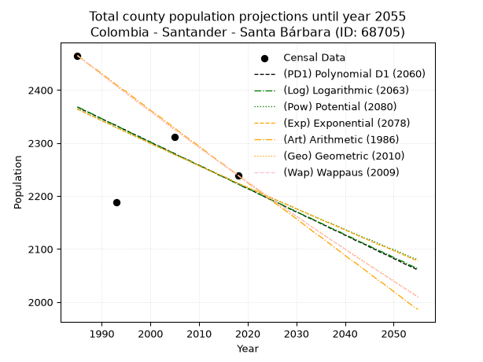
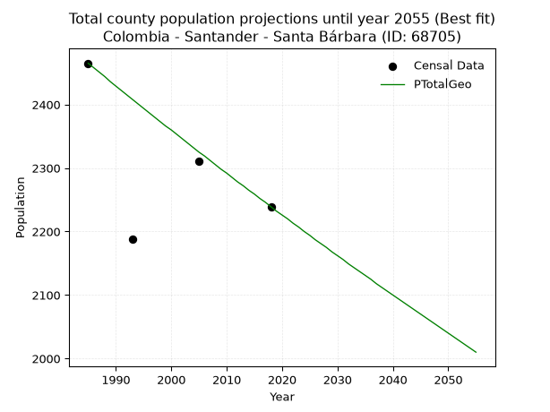
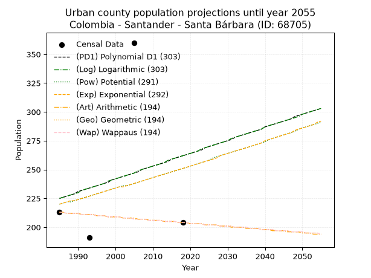
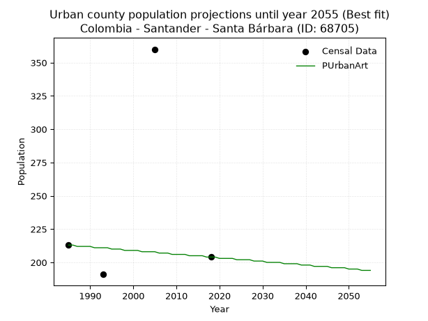
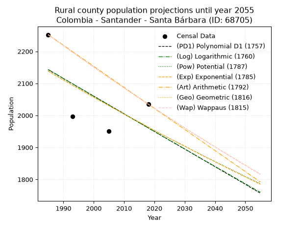
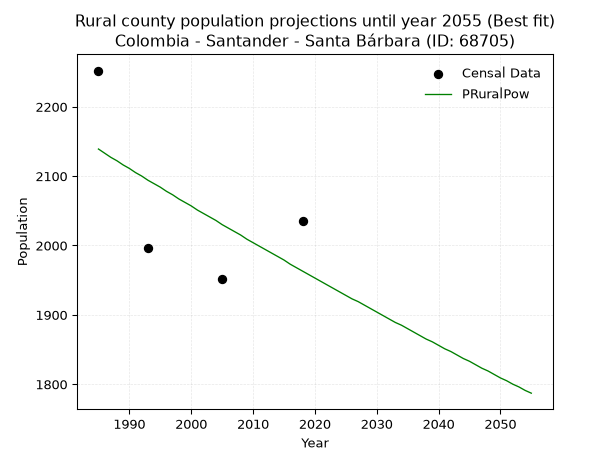

<div align="center">


</div>

# 📜 _“Population and Public Services Demand Projections (PPSD) until Year 2050 for Colombia - Santander - Santa Bárbara (ID: 68705)”_
Keywords: `population` `public-service` `projection` `lineal` `polynomial` `logarithmic` `potential` `exponential` `arithmetic` `geometric` `wappaus` `dane` `colombia` `south-america`

PPSD are analytical estimates used by governments and planners to anticipate future changes in population size, age distribution, and the resulting community needs for utilities, healthcare, education, and infrastructure as sizing future water treatment facilities, electrical grids, and road networks based on spatial growth.

<div align="center">

</img>

</div>


> **General running parameters**: • app_version: _v20260806_. • Python version: _3.14.7_. • Pandas version: _3.0.5_. • NumPy version: _2.5.1_. • Creates, save and include plots into reports (create_plot): _False_. • Projection until year: _2050_. • Process polynomial degree 2 and up: _False_. • Process Wappaus: _True_. • Process Wappaus: _True_. • Set negative values to zero: _True_. • Set infinite values to zero: _True_. • Drop dataset notes: _True_. 
<div align="center">

Maps & GIS Layers: [:earth_americas:Google](http://maps.google.com/maps?q=6.990995852,-72.9074445) [:earth_americas:OSM](https://www.openstreetmap.org/#map=18/6.990995852/-72.9074445&layers=P) [:earth_americas:Bing](https://www.bing.com/maps?cp=6.990995852~-72.9074445&lvl=18) [:earth_americas:Apple](https://maps.apple.com/frame?center=6.990995852%2C-72.9074445&span=0.003%2C0.006) [:earth_americas:GISMobile](https://github.com/rcfdtools/R.GISMobile/blob/main/file/gis/CountyLayer_CO/Readme.md)

</div>


<div align="center">

```geojson
{
  "type": "Feature",
  "geometry": {
    "type": "Point", 
    "coordinates": [-72.9074445, 6.990995852]
  }, 
  "properties": {
    "Name": "Colombia - Santander - Santa Bárbara (ID: 68705)"
  }
}
```

</div>


## 0. Census Data (4 records)

Census data are official statistics collected by a government about the people and housing in a country. They usually include counts of total population, age, sex, race, income, education, and jobs.

📅Global census file: [Population.xlsx](../data/Population.xlsx)

| Source   |   Year |   CountryID | CountryName   |   StateID | StateName   |   CountyID | CountyName    |   PTotal |   PUrban |   PRural |
|:---------|-------:|------------:|:--------------|----------:|:------------|-----------:|:--------------|---------:|---------:|---------:|
| DANE     |   1985 |          57 | Colombia      |        68 | Santander   |      68705 | Santa Bárbara |     2465 |      213 |     2252 |
| DANE     |   1993 |          57 | Colombia      |        68 | Santander   |      68705 | Santa Bárbara |     2188 |      191 |     1997 |
| DANE     |   2005 |          57 | Colombia      |        68 | Santander   |      68705 | Santa Bárbara |     2311 |      360 |     1951 |
| DANE     |   2018 |          57 | Colombia      |        68 | Santander   |      68705 | Santa Bárbara |     2239 |      204 |     2035 |

> 🔥Some records could had specific notes about the registered values or the corresponding urban or rural distribution.

📅[SUI-RUPS](https://www.datos.gov.co/Hacienda-y-Cr-dito-P-blico/Registro-nico-de-Prestadores-de-Servicios-P-blicos/4qkq-csdn/about_data) - Local public utility companies: [RUPS.csv](../data/RUPS.csv)

 | SERVICIO       | ESTADO    | NOMBRE                                                                                                                           | NIT         | DEPARTAMENTO_DOMICILIO   | MUNICIPIO_DOMICILIO   | DIRECCION         |   TELEFONO | EMAIL                     | TIPO_PRESTADOR                 | CLASIFICACION                 |
|:---------------|:----------|:---------------------------------------------------------------------------------------------------------------------------------|:------------|:-------------------------|:----------------------|:------------------|-----------:|:--------------------------|:-------------------------------|:------------------------------|
| ACUEDUCTO      | OPERATIVA | UNIDAD ADMINISTRATIVA DE LOS SERVICIOS PUBLICOS DOMICILIARIOS DE ACUEDUCTO, ALCANTARILLADO Y ASEO DEL MUNICIPIO DE SANTA BARBARA | 890205973-1 | SANTANDER                | SANTA BARBARA         | CARRERA 3 No.4-50 |    6569083 | yurypaolajaimes@gmail.com | MUNICIPIO (PRESTACIÓN DIRECTA) | MENOR O IGUAL A 2500 USUARIOS |
| ALCANTARILLADO | OPERATIVA | UNIDAD ADMINISTRATIVA DE LOS SERVICIOS PUBLICOS DOMICILIARIOS DE ACUEDUCTO, ALCANTARILLADO Y ASEO DEL MUNICIPIO DE SANTA BARBARA | 890205973-1 | SANTANDER                | SANTA BARBARA         | CARRERA 3 No.4-50 |    6569083 | yurypaolajaimes@gmail.com | MUNICIPIO (PRESTACIÓN DIRECTA) | MENOR O IGUAL A 2500 USUARIOS |

## 1. Total

### 1.1. Coefficients and Parameters

* (PD1) Polynomial Deg 1: -4.391409072661553, 11084.665997591272 (lineal)
* (Log) Logarithmic: -8806.735437821608, 69240.81663563075
* (Pow) Potential: -3.7004659358642304, 15.576948257213736
* (Exp) Exponential: -0.0018451785002302347, 92115.26150351376
* (Art) Arithmetic: Year diff. 2018 - 1985 = 33, Population diff. 2239 - 2465 = -226, Annual growth = -6.848484848484849
* (Geo) Geometric: Year diff. 2018 - 1985 = 33, Population diff. 2239 - 2465 = -226, Annual growth % = -0.002909772620282358
* (Wap) Wappaus: i = -0.29117707689136263, Condition values only valid for < 200)

<sub>
Wappaus condition values: ['-0.00', '-0.29', '-0.58', '-0.87', '-1.16', '-1.46', '-1.75', '-2.04', '-2.33', '-2.62', '-2.91', '-3.20', '-3.49', '-3.79', '-4.08', '-4.37', '-4.66', '-4.95', '-5.24', '-5.53', '-5.82', '-6.11', '-6.41', '-6.70', '-6.99', '-7.28', '-7.57', '-7.86', '-8.15', '-8.44', '-8.74', '-9.03', '-9.32', '-9.61', '-9.90', '-10.19', '-10.48', '-10.77', '-11.06', '-11.36', '-11.65', '-11.94', '-12.23', '-12.52', '-12.81', '-13.10', '-13.39', '-13.69', '-13.98', '-14.27', '-14.56', '-14.85', '-15.14', '-15.43', '-15.72', '-16.01', '-16.31', '-16.60', '-16.89', '-17.18', '-17.47', '-17.76', '-18.05', '-18.34', '-18.64', '-18.93']
</sub>


### 1.2. Projected Dataset

|   Year |   CountyID |   PTotalPD1 |   PTotalLog |   PTotalPow |   PTotalExp |   PTotalArt |   PTotalGeo |   PTotalWap |
|-------:|-----------:|------------:|------------:|------------:|------------:|------------:|------------:|------------:|
|   1985 |      68705 |        2368 |        2368 |        2364 |        2364 |        2465 |        2465 |        2465 |
|   1986 |      68705 |        2363 |        2364 |        2360 |        2360 |        2458 |        2458 |        2458 |
|   1987 |      68705 |        2359 |        2359 |        2355 |        2355 |        2451 |        2451 |        2451 |
|   1988 |      68705 |        2355 |        2355 |        2351 |        2351 |        2444 |        2444 |        2444 |
|   1989 |      68705 |        2350 |        2350 |        2347 |        2347 |        2438 |        2436 |        2436 |
|   1990 |      68705 |        2346 |        2346 |        2342 |        2342 |        2431 |        2429 |        2429 |
|   1991 |      68705 |        2341 |        2341 |        2338 |        2338 |        2424 |        2422 |        2422 |
|   1992 |      68705 |        2337 |        2337 |        2334 |        2334 |        2417 |        2415 |        2415 |
|   1993 |      68705 |        2333 |        2333 |        2329 |        2329 |        2410 |        2408 |        2408 |
|   1994 |      68705 |        2328 |        2328 |        2325 |        2325 |        2403 |        2401 |        2401 |
|   1995 |      68705 |        2324 |        2324 |        2321 |        2321 |        2397 |        2394 |        2394 |
|   1996 |      68705 |        2319 |        2319 |        2316 |        2317 |        2390 |        2387 |        2387 |
|   1997 |      68705 |        2315 |        2315 |        2312 |        2312 |        2383 |        2380 |        2380 |
|   1998 |      68705 |        2311 |        2310 |        2308 |        2308 |        2376 |        2373 |        2373 |
|   1999 |      68705 |        2306 |        2306 |        2304 |        2304 |        2369 |        2366 |        2367 |
|   2000 |      68705 |        2302 |        2302 |        2299 |        2299 |        2362 |        2360 |        2360 |
|   2001 |      68705 |        2297 |        2297 |        2295 |        2295 |        2355 |        2353 |        2353 |
|   2002 |      68705 |        2293 |        2293 |        2291 |        2291 |        2349 |        2346 |        2346 |
|   2003 |      68705 |        2289 |        2288 |        2287 |        2287 |        2342 |        2339 |        2339 |
|   2004 |      68705 |        2284 |        2284 |        2282 |        2283 |        2335 |        2332 |        2332 |
|   2005 |      68705 |        2280 |        2280 |        2278 |        2278 |        2328 |        2325 |        2326 |
|   2006 |      68705 |        2275 |        2275 |        2274 |        2274 |        2321 |        2319 |        2319 |
|   2007 |      68705 |        2271 |        2271 |        2270 |        2270 |        2314 |        2312 |        2312 |
|   2008 |      68705 |        2267 |        2267 |        2266 |        2266 |        2307 |        2305 |        2305 |
|   2009 |      68705 |        2262 |        2262 |        2261 |        2262 |        2301 |        2298 |        2299 |
|   2010 |      68705 |        2258 |        2258 |        2257 |        2257 |        2294 |        2292 |        2292 |
|   2011 |      68705 |        2254 |        2253 |        2253 |        2253 |        2287 |        2285 |        2285 |
|   2012 |      68705 |        2249 |        2249 |        2249 |        2249 |        2280 |        2278 |        2279 |
|   2013 |      68705 |        2245 |        2245 |        2245 |        2245 |        2273 |        2272 |        2272 |
|   2014 |      68705 |        2240 |        2240 |        2241 |        2241 |        2266 |        2265 |        2265 |
|   2015 |      68705 |        2236 |        2236 |        2237 |        2237 |        2260 |        2259 |        2259 |
|   2016 |      68705 |        2232 |        2232 |        2233 |        2233 |        2253 |        2252 |        2252 |
|   2017 |      68705 |        2227 |        2227 |        2228 |        2228 |        2246 |        2246 |        2246 |
|   2018 |      68705 |        2223 |        2223 |        2224 |        2224 |        2239 |        2239 |        2239 |
|   2019 |      68705 |        2218 |        2218 |        2220 |        2220 |        2232 |        2232 |        2232 |
|   2020 |      68705 |        2214 |        2214 |        2216 |        2216 |        2225 |        2226 |        2226 |
|   2021 |      68705 |        2210 |        2210 |        2212 |        2212 |        2218 |        2220 |        2219 |
|   2022 |      68705 |        2205 |        2205 |        2208 |        2208 |        2212 |        2213 |        2213 |
|   2023 |      68705 |        2201 |        2201 |        2204 |        2204 |        2205 |        2207 |        2207 |
|   2024 |      68705 |        2196 |        2197 |        2200 |        2200 |        2198 |        2200 |        2200 |
|   2025 |      68705 |        2192 |        2192 |        2196 |        2196 |        2191 |        2194 |        2194 |
|   2026 |      68705 |        2188 |        2188 |        2192 |        2192 |        2184 |        2187 |        2187 |
|   2027 |      68705 |        2183 |        2184 |        2188 |        2188 |        2177 |        2181 |        2181 |
|   2028 |      68705 |        2179 |        2179 |        2184 |        2184 |        2171 |        2175 |        2175 |
|   2029 |      68705 |        2174 |        2175 |        2180 |        2180 |        2164 |        2168 |        2168 |
|   2030 |      68705 |        2170 |        2171 |        2176 |        2176 |        2157 |        2162 |        2162 |
|   2031 |      68705 |        2166 |        2166 |        2172 |        2172 |        2150 |        2156 |        2156 |
|   2032 |      68705 |        2161 |        2162 |        2168 |        2168 |        2143 |        2149 |        2149 |
|   2033 |      68705 |        2157 |        2158 |        2164 |        2164 |        2136 |        2143 |        2143 |
|   2034 |      68705 |        2153 |        2153 |        2160 |        2160 |        2129 |        2137 |        2137 |
|   2035 |      68705 |        2148 |        2149 |        2156 |        2156 |        2123 |        2131 |        2130 |
|   2036 |      68705 |        2144 |        2145 |        2152 |        2152 |        2116 |        2125 |        2124 |
|   2037 |      68705 |        2139 |        2140 |        2149 |        2148 |        2109 |        2118 |        2118 |
|   2038 |      68705 |        2135 |        2136 |        2145 |        2144 |        2102 |        2112 |        2112 |
|   2039 |      68705 |        2131 |        2132 |        2141 |        2140 |        2095 |        2106 |        2106 |
|   2040 |      68705 |        2126 |        2127 |        2137 |        2136 |        2088 |        2100 |        2100 |
|   2041 |      68705 |        2122 |        2123 |        2133 |        2132 |        2081 |        2094 |        2093 |
|   2042 |      68705 |        2117 |        2119 |        2129 |        2128 |        2075 |        2088 |        2087 |
|   2043 |      68705 |        2113 |        2114 |        2125 |        2124 |        2068 |        2082 |        2081 |
|   2044 |      68705 |        2109 |        2110 |        2121 |        2120 |        2061 |        2076 |        2075 |
|   2045 |      68705 |        2104 |        2106 |        2118 |        2116 |        2054 |        2070 |        2069 |
|   2046 |      68705 |        2100 |        2101 |        2114 |        2112 |        2047 |        2064 |        2063 |
|   2047 |      68705 |        2095 |        2097 |        2110 |        2108 |        2040 |        2058 |        2057 |
|   2048 |      68705 |        2091 |        2093 |        2106 |        2105 |        2034 |        2052 |        2051 |
|   2049 |      68705 |        2087 |        2089 |        2102 |        2101 |        2027 |        2046 |        2045 |
|   2050 |      68705 |        2082 |        2084 |        2099 |        2097 |        2020 |        2040 |        2039 |
<div align="center">

</img>

</div>


### 1.3. Best fit with absolute and relative error (%)

Relative error puts that difference into context by dividing the absolute error by the true value, creating a unitless ratio or percentage that shows the scale of the mistake.

Absolute and relative error

|   Year | Source   |   CountryID | CountryName   |   StateID | StateName   |   CountyID_x | CountyName    |   PTotal |   PUrban |   PRural |   CountyID_y |   PTotalPD1 |   PTotalLog |   PTotalPow |   PTotalExp |   PTotalArt |   PTotalGeo |   PTotalWap |   PTotalPD1AbsError |   PTotalLogAbsError |   PTotalPowAbsError |   PTotalExpAbsError |   PTotalArtAbsError |   PTotalGeoAbsError |   PTotalWapAbsError |   PTotalPD1RelError |   PTotalLogRelError |   PTotalPowRelError |   PTotalExpRelError |   PTotalArtRelError |   PTotalGeoRelError |   PTotalWapRelError |
|-------:|:---------|------------:|:--------------|----------:|:------------|-------------:|:--------------|---------:|---------:|---------:|-------------:|------------:|------------:|------------:|------------:|------------:|------------:|------------:|--------------------:|--------------------:|--------------------:|--------------------:|--------------------:|--------------------:|--------------------:|--------------------:|--------------------:|--------------------:|--------------------:|--------------------:|--------------------:|--------------------:|
|   1985 | DANE     |          57 | Colombia      |        68 | Santander   |        68705 | Santa Bárbara |     2465 |      213 |     2252 |        68705 |        2368 |        2368 |        2364 |        2364 |        2465 |        2465 |        2465 |                  97 |                  97 |                 101 |                 101 |                   0 |                   0 |                   0 |            3.93509  |            3.93509  |            4.09736  |            4.09736  |            0        |            0        |             0       |
|   1993 | DANE     |          57 | Colombia      |        68 | Santander   |        68705 | Santa Bárbara |     2188 |      191 |     1997 |        68705 |        2333 |        2333 |        2329 |        2329 |        2410 |        2408 |        2408 |                 145 |                 145 |                 141 |                 141 |                 222 |                 220 |                 220 |            6.62706  |            6.62706  |            6.44424  |            6.44424  |           10.1463   |           10.0548   |            10.0548  |
|   2005 | DANE     |          57 | Colombia      |        68 | Santander   |        68705 | Santa Bárbara |     2311 |      360 |     1951 |        68705 |        2280 |        2280 |        2278 |        2278 |        2328 |        2325 |        2326 |                  31 |                  31 |                  33 |                  33 |                  17 |                  14 |                  15 |            1.34141  |            1.34141  |            1.42795  |            1.42795  |            0.735612 |            0.605798 |             0.64907 |
|   2018 | DANE     |          57 | Colombia      |        68 | Santander   |        68705 | Santa Bárbara |     2239 |      204 |     2035 |        68705 |        2223 |        2223 |        2224 |        2224 |        2239 |        2239 |        2239 |                  16 |                  16 |                  15 |                  15 |                   0 |                   0 |                   0 |            0.714605 |            0.714605 |            0.669942 |            0.669942 |            0        |            0        |             0       |

Relative error mean

| Method    |   RelError | Best   |
|:----------|-----------:|:-------|
| PTotalPD1 |    3.15454 |        |
| PTotalLog |    3.15454 |        |
| PTotalPow |    3.15987 |        |
| PTotalExp |    3.15987 |        |
| PTotalArt |    2.72047 |        |
| PTotalGeo |    2.66516 | True   |
| PTotalWap |    2.67598 |        |

💙Best method: _**PTotalGeo**_
<div align="center">

</img>

</div>


### 1.4. Fresh water supply demand in liters per capita per day (lpcd)

The fresh water supply demand typically ranges from 100 to 300 liters per capita per day (lpcd) for standard domestic and municipal planning, though absolute survival minimums set by the World Health Organization are as low as 7.5 to 20 liters per day, and total consumption in high-income nations can exceed 400 liters.

> `CZ`: Level in meters above the sea level (masl)<br> `WS`: Fresh water supply demand in liters per capita per day (lpcd or l/h/d)<br> `WSAll`: Zonal fresh water supply demand in liters per second (l/s)<br> `A`: Zonal area in square meters<br> `DP`: Population density (people/hectare or p/ha)

Reference values (RAS Colombia)

|    CZ |   WS |
|------:|-----:|
|  1000 |  120 |
|  2000 |  130 |
| 99999 |  140 |

County shapefile geometry properties and water supply values

|   CountyID |      ATotal |   CZTotal |   WSTotal |
|-----------:|------------:|----------:|----------:|
|      68705 | 1.78277e+08 |   2485.41 |       140 |

Projected values for best method: PTotalGeo

|   CountyID |   Year |   PTotalGeo |   DPTotal |   WSTotal |   WSTotalAll |
|-----------:|-------:|------------:|----------:|----------:|-------------:|
|      68705 |   1985 |        2465 |      0.14 |       140 |      3.99421 |
|      68705 |   1986 |        2458 |      0.14 |       140 |      3.98287 |
|      68705 |   1987 |        2451 |      0.14 |       140 |      3.97153 |
|      68705 |   1988 |        2444 |      0.14 |       140 |      3.96019 |
|      68705 |   1989 |        2436 |      0.14 |       140 |      3.94722 |
|      68705 |   1990 |        2429 |      0.14 |       140 |      3.93588 |
|      68705 |   1991 |        2422 |      0.14 |       140 |      3.92454 |
|      68705 |   1992 |        2415 |      0.14 |       140 |      3.91319 |
|      68705 |   1993 |        2408 |      0.14 |       140 |      3.90185 |
|      68705 |   1994 |        2401 |      0.13 |       140 |      3.89051 |
|      68705 |   1995 |        2394 |      0.13 |       140 |      3.87917 |
|      68705 |   1996 |        2387 |      0.13 |       140 |      3.86782 |
|      68705 |   1997 |        2380 |      0.13 |       140 |      3.85648 |
|      68705 |   1998 |        2373 |      0.13 |       140 |      3.84514 |
|      68705 |   1999 |        2366 |      0.13 |       140 |      3.8338  |
|      68705 |   2000 |        2360 |      0.13 |       140 |      3.82407 |
|      68705 |   2001 |        2353 |      0.13 |       140 |      3.81273 |
|      68705 |   2002 |        2346 |      0.13 |       140 |      3.80139 |
|      68705 |   2003 |        2339 |      0.13 |       140 |      3.79005 |
|      68705 |   2004 |        2332 |      0.13 |       140 |      3.7787  |
|      68705 |   2005 |        2325 |      0.13 |       140 |      3.76736 |
|      68705 |   2006 |        2319 |      0.13 |       140 |      3.75764 |
|      68705 |   2007 |        2312 |      0.13 |       140 |      3.7463  |
|      68705 |   2008 |        2305 |      0.13 |       140 |      3.73495 |
|      68705 |   2009 |        2298 |      0.13 |       140 |      3.72361 |
|      68705 |   2010 |        2292 |      0.13 |       140 |      3.71389 |
|      68705 |   2011 |        2285 |      0.13 |       140 |      3.70255 |
|      68705 |   2012 |        2278 |      0.13 |       140 |      3.6912  |
|      68705 |   2013 |        2272 |      0.13 |       140 |      3.68148 |
|      68705 |   2014 |        2265 |      0.13 |       140 |      3.67014 |
|      68705 |   2015 |        2259 |      0.13 |       140 |      3.66042 |
|      68705 |   2016 |        2252 |      0.13 |       140 |      3.64907 |
|      68705 |   2017 |        2246 |      0.13 |       140 |      3.63935 |
|      68705 |   2018 |        2239 |      0.13 |       140 |      3.62801 |
|      68705 |   2019 |        2232 |      0.13 |       140 |      3.61667 |
|      68705 |   2020 |        2226 |      0.12 |       140 |      3.60694 |
|      68705 |   2021 |        2220 |      0.12 |       140 |      3.59722 |
|      68705 |   2022 |        2213 |      0.12 |       140 |      3.58588 |
|      68705 |   2023 |        2207 |      0.12 |       140 |      3.57616 |
|      68705 |   2024 |        2200 |      0.12 |       140 |      3.56481 |
|      68705 |   2025 |        2194 |      0.12 |       140 |      3.55509 |
|      68705 |   2026 |        2187 |      0.12 |       140 |      3.54375 |
|      68705 |   2027 |        2181 |      0.12 |       140 |      3.53403 |
|      68705 |   2028 |        2175 |      0.12 |       140 |      3.52431 |
|      68705 |   2029 |        2168 |      0.12 |       140 |      3.51296 |
|      68705 |   2030 |        2162 |      0.12 |       140 |      3.50324 |
|      68705 |   2031 |        2156 |      0.12 |       140 |      3.49352 |
|      68705 |   2032 |        2149 |      0.12 |       140 |      3.48218 |
|      68705 |   2033 |        2143 |      0.12 |       140 |      3.47245 |
|      68705 |   2034 |        2137 |      0.12 |       140 |      3.46273 |
|      68705 |   2035 |        2131 |      0.12 |       140 |      3.45301 |
|      68705 |   2036 |        2125 |      0.12 |       140 |      3.44329 |
|      68705 |   2037 |        2118 |      0.12 |       140 |      3.43194 |
|      68705 |   2038 |        2112 |      0.12 |       140 |      3.42222 |
|      68705 |   2039 |        2106 |      0.12 |       140 |      3.4125  |
|      68705 |   2040 |        2100 |      0.12 |       140 |      3.40278 |
|      68705 |   2041 |        2094 |      0.12 |       140 |      3.39306 |
|      68705 |   2042 |        2088 |      0.12 |       140 |      3.38333 |
|      68705 |   2043 |        2082 |      0.12 |       140 |      3.37361 |
|      68705 |   2044 |        2076 |      0.12 |       140 |      3.36389 |
|      68705 |   2045 |        2070 |      0.12 |       140 |      3.35417 |
|      68705 |   2046 |        2064 |      0.12 |       140 |      3.34444 |
|      68705 |   2047 |        2058 |      0.12 |       140 |      3.33472 |
|      68705 |   2048 |        2052 |      0.12 |       140 |      3.325   |
|      68705 |   2049 |        2046 |      0.11 |       140 |      3.31528 |
|      68705 |   2050 |        2040 |      0.11 |       140 |      3.30556 |

## 2. Urban

### 2.1. Coefficients and Parameters

* (PD1) Polynomial Deg 1: 1.1208350060217644, -1999.9502207950345 (lineal)
* (Log) Logarithmic: 2260.0790481384975, -16936.87895603757
* (Pow) Potential: 8.148018416092361, -24.52839030441132
* (Exp) Exponential: 0.00404164778758164, 0.07208865612646766
* (Art) Arithmetic: Year diff. 2018 - 1985 = 33, Population diff. 204 - 213 = -9, Annual growth = -0.2727272727272727
* (Geo) Geometric: Year diff. 2018 - 1985 = 33, Population diff. 204 - 213 = -9, Annual growth % = -0.0013073922494035717
* (Wap) Wappaus: i = -0.13080444735120994, Condition values only valid for < 200)

<sub>
Wappaus condition values: ['-0.00', '-0.13', '-0.26', '-0.39', '-0.52', '-0.65', '-0.78', '-0.92', '-1.05', '-1.18', '-1.31', '-1.44', '-1.57', '-1.70', '-1.83', '-1.96', '-2.09', '-2.22', '-2.35', '-2.49', '-2.62', '-2.75', '-2.88', '-3.01', '-3.14', '-3.27', '-3.40', '-3.53', '-3.66', '-3.79', '-3.92', '-4.05', '-4.19', '-4.32', '-4.45', '-4.58', '-4.71', '-4.84', '-4.97', '-5.10', '-5.23', '-5.36', '-5.49', '-5.62', '-5.76', '-5.89', '-6.02', '-6.15', '-6.28', '-6.41', '-6.54', '-6.67', '-6.80', '-6.93', '-7.06', '-7.19', '-7.33', '-7.46', '-7.59', '-7.72', '-7.85', '-7.98', '-8.11', '-8.24', '-8.37', '-8.50']
</sub>


### 2.2. Projected Dataset

|   Year |   CountyID |   PUrbanPD1 |   PUrbanLog |   PUrbanPow |   PUrbanExp |   PUrbanArt |   PUrbanGeo |   PUrbanWap |
|-------:|-----------:|------------:|------------:|------------:|------------:|------------:|------------:|------------:|
|   1985 |      68705 |         225 |         225 |         220 |         220 |         213 |         213 |         213 |
|   1986 |      68705 |         226 |         226 |         221 |         221 |         213 |         213 |         213 |
|   1987 |      68705 |         227 |         227 |         222 |         222 |         212 |         212 |         212 |
|   1988 |      68705 |         228 |         228 |         222 |         223 |         212 |         212 |         212 |
|   1989 |      68705 |         229 |         229 |         223 |         223 |         212 |         212 |         212 |
|   1990 |      68705 |         231 |         230 |         224 |         224 |         212 |         212 |         212 |
|   1991 |      68705 |         232 |         232 |         225 |         225 |         211 |         211 |         211 |
|   1992 |      68705 |         233 |         233 |         226 |         226 |         211 |         211 |         211 |
|   1993 |      68705 |         234 |         234 |         227 |         227 |         211 |         211 |         211 |
|   1994 |      68705 |         235 |         235 |         228 |         228 |         211 |         211 |         211 |
|   1995 |      68705 |         236 |         236 |         229 |         229 |         210 |         210 |         210 |
|   1996 |      68705 |         237 |         237 |         230 |         230 |         210 |         210 |         210 |
|   1997 |      68705 |         238 |         238 |         231 |         231 |         210 |         210 |         210 |
|   1998 |      68705 |         239 |         240 |         232 |         232 |         209 |         209 |         209 |
|   1999 |      68705 |         241 |         241 |         233 |         233 |         209 |         209 |         209 |
|   2000 |      68705 |         242 |         242 |         234 |         234 |         209 |         209 |         209 |
|   2001 |      68705 |         243 |         243 |         235 |         235 |         209 |         209 |         209 |
|   2002 |      68705 |         244 |         244 |         236 |         235 |         208 |         208 |         208 |
|   2003 |      68705 |         245 |         245 |         236 |         236 |         208 |         208 |         208 |
|   2004 |      68705 |         246 |         246 |         237 |         237 |         208 |         208 |         208 |
|   2005 |      68705 |         247 |         247 |         238 |         238 |         208 |         207 |         207 |
|   2006 |      68705 |         248 |         249 |         239 |         239 |         207 |         207 |         207 |
|   2007 |      68705 |         250 |         250 |         240 |         240 |         207 |         207 |         207 |
|   2008 |      68705 |         251 |         251 |         241 |         241 |         207 |         207 |         207 |
|   2009 |      68705 |         252 |         252 |         242 |         242 |         206 |         206 |         206 |
|   2010 |      68705 |         253 |         253 |         243 |         243 |         206 |         206 |         206 |
|   2011 |      68705 |         254 |         254 |         244 |         244 |         206 |         206 |         206 |
|   2012 |      68705 |         255 |         255 |         245 |         245 |         206 |         206 |         206 |
|   2013 |      68705 |         256 |         256 |         246 |         246 |         205 |         205 |         205 |
|   2014 |      68705 |         257 |         258 |         247 |         247 |         205 |         205 |         205 |
|   2015 |      68705 |         259 |         259 |         248 |         248 |         205 |         205 |         205 |
|   2016 |      68705 |         260 |         260 |         249 |         249 |         205 |         205 |         205 |
|   2017 |      68705 |         261 |         261 |         250 |         250 |         204 |         204 |         204 |
|   2018 |      68705 |         262 |         262 |         251 |         251 |         204 |         204 |         204 |
|   2019 |      68705 |         263 |         263 |         252 |         252 |         204 |         204 |         204 |
|   2020 |      68705 |         264 |         264 |         253 |         253 |         203 |         203 |         203 |
|   2021 |      68705 |         265 |         265 |         254 |         254 |         203 |         203 |         203 |
|   2022 |      68705 |         266 |         266 |         255 |         255 |         203 |         203 |         203 |
|   2023 |      68705 |         267 |         268 |         256 |         256 |         203 |         203 |         203 |
|   2024 |      68705 |         269 |         269 |         257 |         257 |         202 |         202 |         202 |
|   2025 |      68705 |         270 |         270 |         258 |         258 |         202 |         202 |         202 |
|   2026 |      68705 |         271 |         271 |         260 |         259 |         202 |         202 |         202 |
|   2027 |      68705 |         272 |         272 |         261 |         260 |         202 |         202 |         202 |
|   2028 |      68705 |         273 |         273 |         262 |         262 |         201 |         201 |         201 |
|   2029 |      68705 |         274 |         274 |         263 |         263 |         201 |         201 |         201 |
|   2030 |      68705 |         275 |         275 |         264 |         264 |         201 |         201 |         201 |
|   2031 |      68705 |         276 |         277 |         265 |         265 |         200 |         201 |         201 |
|   2032 |      68705 |         278 |         278 |         266 |         266 |         200 |         200 |         200 |
|   2033 |      68705 |         279 |         279 |         267 |         267 |         200 |         200 |         200 |
|   2034 |      68705 |         280 |         280 |         268 |         268 |         200 |         200 |         200 |
|   2035 |      68705 |         281 |         281 |         269 |         269 |         199 |         200 |         200 |
|   2036 |      68705 |         282 |         282 |         270 |         270 |         199 |         199 |         199 |
|   2037 |      68705 |         283 |         283 |         271 |         271 |         199 |         199 |         199 |
|   2038 |      68705 |         284 |         284 |         272 |         272 |         199 |         199 |         199 |
|   2039 |      68705 |         285 |         285 |         273 |         273 |         198 |         198 |         198 |
|   2040 |      68705 |         287 |         287 |         274 |         275 |         198 |         198 |         198 |
|   2041 |      68705 |         288 |         288 |         276 |         276 |         198 |         198 |         198 |
|   2042 |      68705 |         289 |         289 |         277 |         277 |         197 |         198 |         198 |
|   2043 |      68705 |         290 |         290 |         278 |         278 |         197 |         197 |         197 |
|   2044 |      68705 |         291 |         291 |         279 |         279 |         197 |         197 |         197 |
|   2045 |      68705 |         292 |         292 |         280 |         280 |         197 |         197 |         197 |
|   2046 |      68705 |         293 |         293 |         281 |         281 |         196 |         197 |         197 |
|   2047 |      68705 |         294 |         294 |         282 |         282 |         196 |         196 |         196 |
|   2048 |      68705 |         296 |         295 |         283 |         284 |         196 |         196 |         196 |
|   2049 |      68705 |         297 |         296 |         285 |         285 |         196 |         196 |         196 |
|   2050 |      68705 |         298 |         298 |         286 |         286 |         195 |         196 |         196 |
<div align="center">

</img>

</div>


### 2.3. Best fit with absolute and relative error (%)

Relative error puts that difference into context by dividing the absolute error by the true value, creating a unitless ratio or percentage that shows the scale of the mistake.

Absolute and relative error

|   Year | Source   |   CountryID | CountryName   |   StateID | StateName   |   CountyID_x | CountyName    |   PTotal |   PUrban |   PRural |   CountyID_y |   PUrbanPD1 |   PUrbanLog |   PUrbanPow |   PUrbanExp |   PUrbanArt |   PUrbanGeo |   PUrbanWap |   PUrbanPD1AbsError |   PUrbanLogAbsError |   PUrbanPowAbsError |   PUrbanExpAbsError |   PUrbanArtAbsError |   PUrbanGeoAbsError |   PUrbanWapAbsError |   PUrbanPD1RelError |   PUrbanLogRelError |   PUrbanPowRelError |   PUrbanExpRelError |   PUrbanArtRelError |   PUrbanGeoRelError |   PUrbanWapRelError |
|-------:|:---------|------------:|:--------------|----------:|:------------|-------------:|:--------------|---------:|---------:|---------:|-------------:|------------:|------------:|------------:|------------:|------------:|------------:|------------:|--------------------:|--------------------:|--------------------:|--------------------:|--------------------:|--------------------:|--------------------:|--------------------:|--------------------:|--------------------:|--------------------:|--------------------:|--------------------:|--------------------:|
|   1985 | DANE     |          57 | Colombia      |        68 | Santander   |        68705 | Santa Bárbara |     2465 |      213 |     2252 |        68705 |         225 |         225 |         220 |         220 |         213 |         213 |         213 |                  12 |                  12 |                   7 |                   7 |                   0 |                   0 |                   0 |              5.6338 |              5.6338 |             3.28638 |             3.28638 |              0      |              0      |              0      |
|   1993 | DANE     |          57 | Colombia      |        68 | Santander   |        68705 | Santa Bárbara |     2188 |      191 |     1997 |        68705 |         234 |         234 |         227 |         227 |         211 |         211 |         211 |                  43 |                  43 |                  36 |                  36 |                  20 |                  20 |                  20 |             22.5131 |             22.5131 |            18.8482  |            18.8482  |             10.4712 |             10.4712 |             10.4712 |
|   2005 | DANE     |          57 | Colombia      |        68 | Santander   |        68705 | Santa Bárbara |     2311 |      360 |     1951 |        68705 |         247 |         247 |         238 |         238 |         208 |         207 |         207 |                 113 |                 113 |                 122 |                 122 |                 152 |                 153 |                 153 |             31.3889 |             31.3889 |            33.8889  |            33.8889  |             42.2222 |             42.5    |             42.5    |
|   2018 | DANE     |          57 | Colombia      |        68 | Santander   |        68705 | Santa Bárbara |     2239 |      204 |     2035 |        68705 |         262 |         262 |         251 |         251 |         204 |         204 |         204 |                  58 |                  58 |                  47 |                  47 |                   0 |                   0 |                   0 |             28.4314 |             28.4314 |            23.0392  |            23.0392  |              0      |              0      |              0      |

Relative error mean

| Method    |   RelError | Best   |
|:----------|-----------:|:-------|
| PUrbanPD1 |    21.9918 |        |
| PUrbanLog |    21.9918 |        |
| PUrbanPow |    19.7657 |        |
| PUrbanExp |    19.7657 |        |
| PUrbanArt |    13.1734 | True   |
| PUrbanGeo |    13.2428 |        |
| PUrbanWap |    13.2428 |        |

💙Best method: _**PUrbanArt**_
<div align="center">

</img>

</div>


### 2.4. Fresh water supply demand in liters per capita per day (lpcd)

The fresh water supply demand typically ranges from 100 to 300 liters per capita per day (lpcd) for standard domestic and municipal planning, though absolute survival minimums set by the World Health Organization are as low as 7.5 to 20 liters per day, and total consumption in high-income nations can exceed 400 liters.

> `CZ`: Level in meters above the sea level (masl)<br> `WS`: Fresh water supply demand in liters per capita per day (lpcd or l/h/d)<br> `WSAll`: Zonal fresh water supply demand in liters per second (l/s)<br> `A`: Zonal area in square meters<br> `DP`: Population density (people/hectare or p/ha)

Reference values (RAS Colombia)

|    CZ |   WS |
|------:|-----:|
|  1000 |  120 |
|  2000 |  130 |
| 99999 |  140 |

County shapefile geometry properties and water supply values

|   CountyID |   AUrban |   CZUrban |   WSUrban |
|-----------:|---------:|----------:|----------:|
|      68705 |   112504 |   1908.65 |       130 |

Projected values for best method: PUrbanArt

|   CountyID |   Year |   PUrbanArt |   DPUrban |   WSUrban |   WSUrbanAll |
|-----------:|-------:|------------:|----------:|----------:|-------------:|
|      68705 |   1985 |         213 |     18.93 |       130 |     0.320486 |
|      68705 |   1986 |         213 |     18.93 |       130 |     0.320486 |
|      68705 |   1987 |         212 |     18.84 |       130 |     0.318981 |
|      68705 |   1988 |         212 |     18.84 |       130 |     0.318981 |
|      68705 |   1989 |         212 |     18.84 |       130 |     0.318981 |
|      68705 |   1990 |         212 |     18.84 |       130 |     0.318981 |
|      68705 |   1991 |         211 |     18.75 |       130 |     0.317477 |
|      68705 |   1992 |         211 |     18.75 |       130 |     0.317477 |
|      68705 |   1993 |         211 |     18.75 |       130 |     0.317477 |
|      68705 |   1994 |         211 |     18.75 |       130 |     0.317477 |
|      68705 |   1995 |         210 |     18.67 |       130 |     0.315972 |
|      68705 |   1996 |         210 |     18.67 |       130 |     0.315972 |
|      68705 |   1997 |         210 |     18.67 |       130 |     0.315972 |
|      68705 |   1998 |         209 |     18.58 |       130 |     0.314468 |
|      68705 |   1999 |         209 |     18.58 |       130 |     0.314468 |
|      68705 |   2000 |         209 |     18.58 |       130 |     0.314468 |
|      68705 |   2001 |         209 |     18.58 |       130 |     0.314468 |
|      68705 |   2002 |         208 |     18.49 |       130 |     0.312963 |
|      68705 |   2003 |         208 |     18.49 |       130 |     0.312963 |
|      68705 |   2004 |         208 |     18.49 |       130 |     0.312963 |
|      68705 |   2005 |         208 |     18.49 |       130 |     0.312963 |
|      68705 |   2006 |         207 |     18.4  |       130 |     0.311458 |
|      68705 |   2007 |         207 |     18.4  |       130 |     0.311458 |
|      68705 |   2008 |         207 |     18.4  |       130 |     0.311458 |
|      68705 |   2009 |         206 |     18.31 |       130 |     0.309954 |
|      68705 |   2010 |         206 |     18.31 |       130 |     0.309954 |
|      68705 |   2011 |         206 |     18.31 |       130 |     0.309954 |
|      68705 |   2012 |         206 |     18.31 |       130 |     0.309954 |
|      68705 |   2013 |         205 |     18.22 |       130 |     0.308449 |
|      68705 |   2014 |         205 |     18.22 |       130 |     0.308449 |
|      68705 |   2015 |         205 |     18.22 |       130 |     0.308449 |
|      68705 |   2016 |         205 |     18.22 |       130 |     0.308449 |
|      68705 |   2017 |         204 |     18.13 |       130 |     0.306944 |
|      68705 |   2018 |         204 |     18.13 |       130 |     0.306944 |
|      68705 |   2019 |         204 |     18.13 |       130 |     0.306944 |
|      68705 |   2020 |         203 |     18.04 |       130 |     0.30544  |
|      68705 |   2021 |         203 |     18.04 |       130 |     0.30544  |
|      68705 |   2022 |         203 |     18.04 |       130 |     0.30544  |
|      68705 |   2023 |         203 |     18.04 |       130 |     0.30544  |
|      68705 |   2024 |         202 |     17.95 |       130 |     0.303935 |
|      68705 |   2025 |         202 |     17.95 |       130 |     0.303935 |
|      68705 |   2026 |         202 |     17.95 |       130 |     0.303935 |
|      68705 |   2027 |         202 |     17.95 |       130 |     0.303935 |
|      68705 |   2028 |         201 |     17.87 |       130 |     0.302431 |
|      68705 |   2029 |         201 |     17.87 |       130 |     0.302431 |
|      68705 |   2030 |         201 |     17.87 |       130 |     0.302431 |
|      68705 |   2031 |         200 |     17.78 |       130 |     0.300926 |
|      68705 |   2032 |         200 |     17.78 |       130 |     0.300926 |
|      68705 |   2033 |         200 |     17.78 |       130 |     0.300926 |
|      68705 |   2034 |         200 |     17.78 |       130 |     0.300926 |
|      68705 |   2035 |         199 |     17.69 |       130 |     0.299421 |
|      68705 |   2036 |         199 |     17.69 |       130 |     0.299421 |
|      68705 |   2037 |         199 |     17.69 |       130 |     0.299421 |
|      68705 |   2038 |         199 |     17.69 |       130 |     0.299421 |
|      68705 |   2039 |         198 |     17.6  |       130 |     0.297917 |
|      68705 |   2040 |         198 |     17.6  |       130 |     0.297917 |
|      68705 |   2041 |         198 |     17.6  |       130 |     0.297917 |
|      68705 |   2042 |         197 |     17.51 |       130 |     0.296412 |
|      68705 |   2043 |         197 |     17.51 |       130 |     0.296412 |
|      68705 |   2044 |         197 |     17.51 |       130 |     0.296412 |
|      68705 |   2045 |         197 |     17.51 |       130 |     0.296412 |
|      68705 |   2046 |         196 |     17.42 |       130 |     0.294907 |
|      68705 |   2047 |         196 |     17.42 |       130 |     0.294907 |
|      68705 |   2048 |         196 |     17.42 |       130 |     0.294907 |
|      68705 |   2049 |         196 |     17.42 |       130 |     0.294907 |
|      68705 |   2050 |         195 |     17.33 |       130 |     0.293403 |

## 3. Rural

### 3.1. Coefficients and Parameters

* (PD1) Polynomial Deg 1: -5.512244078683293, 13084.616218386256 (lineal)
* (Log) Logarithmic: -11066.814485960049, 86177.69559166791
* (Pow) Potential: -5.18677616247524, 20.434883496227606
* (Exp) Exponential: -0.002583289679971382, 360611.37094489514
* (Art) Arithmetic: Year diff. 2018 - 1985 = 33, Population diff. 2035 - 2252 = -217, Annual growth = -6.575757575757576
* (Geo) Geometric: Year diff. 2018 - 1985 = 33, Population diff. 2035 - 2252 = -217, Annual growth % = -0.003065681819148125
* (Wap) Wappaus: i = -0.3067766538725251, Condition values only valid for < 200)

<sub>
Wappaus condition values: ['-0.00', '-0.31', '-0.61', '-0.92', '-1.23', '-1.53', '-1.84', '-2.15', '-2.45', '-2.76', '-3.07', '-3.37', '-3.68', '-3.99', '-4.29', '-4.60', '-4.91', '-5.22', '-5.52', '-5.83', '-6.14', '-6.44', '-6.75', '-7.06', '-7.36', '-7.67', '-7.98', '-8.28', '-8.59', '-8.90', '-9.20', '-9.51', '-9.82', '-10.12', '-10.43', '-10.74', '-11.04', '-11.35', '-11.66', '-11.96', '-12.27', '-12.58', '-12.88', '-13.19', '-13.50', '-13.80', '-14.11', '-14.42', '-14.73', '-15.03', '-15.34', '-15.65', '-15.95', '-16.26', '-16.57', '-16.87', '-17.18', '-17.49', '-17.79', '-18.10', '-18.41', '-18.71', '-19.02', '-19.33', '-19.63', '-19.94']
</sub>


### 3.2. Projected Dataset

|   Year |   CountyID |   PRuralPD1 |   PRuralLog |   PRuralPow |   PRuralExp |   PRuralArt |   PRuralGeo |   PRuralWap |
|-------:|-----------:|------------:|------------:|------------:|------------:|------------:|------------:|------------:|
|   1985 |      68705 |        2143 |        2143 |        2139 |        2138 |        2252 |        2252 |        2252 |
|   1986 |      68705 |        2137 |        2138 |        2133 |        2133 |        2245 |        2245 |        2245 |
|   1987 |      68705 |        2132 |        2132 |        2127 |        2127 |        2239 |        2238 |        2238 |
|   1988 |      68705 |        2126 |        2127 |        2122 |        2122 |        2232 |        2231 |        2231 |
|   1989 |      68705 |        2121 |        2121 |        2116 |        2116 |        2226 |        2225 |        2225 |
|   1990 |      68705 |        2115 |        2115 |        2111 |        2111 |        2219 |        2218 |        2218 |
|   1991 |      68705 |        2110 |        2110 |        2105 |        2105 |        2213 |        2211 |        2211 |
|   1992 |      68705 |        2104 |        2104 |        2100 |        2100 |        2206 |        2204 |        2204 |
|   1993 |      68705 |        2099 |        2099 |        2094 |        2094 |        2199 |        2197 |        2197 |
|   1994 |      68705 |        2093 |        2093 |        2089 |        2089 |        2193 |        2191 |        2191 |
|   1995 |      68705 |        2088 |        2088 |        2084 |        2084 |        2186 |        2184 |        2184 |
|   1996 |      68705 |        2082 |        2082 |        2078 |        2078 |        2180 |        2177 |        2177 |
|   1997 |      68705 |        2077 |        2077 |        2073 |        2073 |        2173 |        2171 |        2171 |
|   1998 |      68705 |        2071 |        2071 |        2067 |        2068 |        2167 |        2164 |        2164 |
|   1999 |      68705 |        2066 |        2065 |        2062 |        2062 |        2160 |        2157 |        2157 |
|   2000 |      68705 |        2060 |        2060 |        2057 |        2057 |        2153 |        2151 |        2151 |
|   2001 |      68705 |        2055 |        2054 |        2051 |        2052 |        2147 |        2144 |        2144 |
|   2002 |      68705 |        2049 |        2049 |        2046 |        2046 |        2140 |        2137 |        2138 |
|   2003 |      68705 |        2044 |        2043 |        2041 |        2041 |        2134 |        2131 |        2131 |
|   2004 |      68705 |        2038 |        2038 |        2036 |        2036 |        2127 |        2124 |        2124 |
|   2005 |      68705 |        2033 |        2032 |        2030 |        2031 |        2120 |        2118 |        2118 |
|   2006 |      68705 |        2027 |        2027 |        2025 |        2025 |        2114 |        2111 |        2111 |
|   2007 |      68705 |        2022 |        2021 |        2020 |        2020 |        2107 |        2105 |        2105 |
|   2008 |      68705 |        2016 |        2016 |        2015 |        2015 |        2101 |        2098 |        2099 |
|   2009 |      68705 |        2011 |        2010 |        2009 |        2010 |        2094 |        2092 |        2092 |
|   2010 |      68705 |        2005 |        2005 |        2004 |        2004 |        2088 |        2086 |        2086 |
|   2011 |      68705 |        1999 |        1999 |        1999 |        1999 |        2081 |        2079 |        2079 |
|   2012 |      68705 |        1994 |        1994 |        1994 |        1994 |        2074 |        2073 |        2073 |
|   2013 |      68705 |        1988 |        1988 |        1989 |        1989 |        2068 |        2066 |        2067 |
|   2014 |      68705 |        1983 |        1983 |        1984 |        1984 |        2061 |        2060 |        2060 |
|   2015 |      68705 |        1977 |        1977 |        1979 |        1979 |        2055 |        2054 |        2054 |
|   2016 |      68705 |        1972 |        1972 |        1973 |        1974 |        2048 |        2048 |        2048 |
|   2017 |      68705 |        1966 |        1966 |        1968 |        1969 |        2042 |        2041 |        2041 |
|   2018 |      68705 |        1961 |        1961 |        1963 |        1963 |        2035 |        2035 |        2035 |
|   2019 |      68705 |        1955 |        1955 |        1958 |        1958 |        2028 |        2029 |        2029 |
|   2020 |      68705 |        1950 |        1950 |        1953 |        1953 |        2022 |        2023 |        2023 |
|   2021 |      68705 |        1944 |        1944 |        1948 |        1948 |        2015 |        2016 |        2016 |
|   2022 |      68705 |        1939 |        1939 |        1943 |        1943 |        2009 |        2010 |        2010 |
|   2023 |      68705 |        1933 |        1933 |        1938 |        1938 |        2002 |        2004 |        2004 |
|   2024 |      68705 |        1928 |        1928 |        1933 |        1933 |        1996 |        1998 |        1998 |
|   2025 |      68705 |        1922 |        1922 |        1928 |        1928 |        1989 |        1992 |        1992 |
|   2026 |      68705 |        1917 |        1917 |        1923 |        1923 |        1982 |        1986 |        1986 |
|   2027 |      68705 |        1911 |        1912 |        1919 |        1918 |        1976 |        1980 |        1979 |
|   2028 |      68705 |        1906 |        1906 |        1914 |        1913 |        1969 |        1973 |        1973 |
|   2029 |      68705 |        1900 |        1901 |        1909 |        1908 |        1963 |        1967 |        1967 |
|   2030 |      68705 |        1895 |        1895 |        1904 |        1904 |        1956 |        1961 |        1961 |
|   2031 |      68705 |        1889 |        1890 |        1899 |        1899 |        1950 |        1955 |        1955 |
|   2032 |      68705 |        1884 |        1884 |        1894 |        1894 |        1943 |        1949 |        1949 |
|   2033 |      68705 |        1878 |        1879 |        1889 |        1889 |        1936 |        1943 |        1943 |
|   2034 |      68705 |        1873 |        1873 |        1885 |        1884 |        1930 |        1937 |        1937 |
|   2035 |      68705 |        1867 |        1868 |        1880 |        1879 |        1923 |        1932 |        1931 |
|   2036 |      68705 |        1862 |        1862 |        1875 |        1874 |        1917 |        1926 |        1925 |
|   2037 |      68705 |        1856 |        1857 |        1870 |        1869 |        1910 |        1920 |        1919 |
|   2038 |      68705 |        1851 |        1852 |        1865 |        1865 |        1903 |        1914 |        1913 |
|   2039 |      68705 |        1845 |        1846 |        1861 |        1860 |        1897 |        1908 |        1907 |
|   2040 |      68705 |        1840 |        1841 |        1856 |        1855 |        1890 |        1902 |        1902 |
|   2041 |      68705 |        1834 |        1835 |        1851 |        1850 |        1884 |        1896 |        1896 |
|   2042 |      68705 |        1829 |        1830 |        1847 |        1845 |        1877 |        1890 |        1890 |
|   2043 |      68705 |        1823 |        1825 |        1842 |        1841 |        1871 |        1885 |        1884 |
|   2044 |      68705 |        1818 |        1819 |        1837 |        1836 |        1864 |        1879 |        1878 |
|   2045 |      68705 |        1812 |        1814 |        1833 |        1831 |        1857 |        1873 |        1872 |
|   2046 |      68705 |        1807 |        1808 |        1828 |        1826 |        1851 |        1867 |        1867 |
|   2047 |      68705 |        1801 |        1803 |        1823 |        1822 |        1844 |        1862 |        1861 |
|   2048 |      68705 |        1796 |        1797 |        1819 |        1817 |        1838 |        1856 |        1855 |
|   2049 |      68705 |        1790 |        1792 |        1814 |        1812 |        1831 |        1850 |        1849 |
|   2050 |      68705 |        1785 |        1787 |        1809 |        1808 |        1825 |        1845 |        1844 |
<div align="center">

</img>

</div>


### 3.3. Best fit with absolute and relative error (%)

Relative error puts that difference into context by dividing the absolute error by the true value, creating a unitless ratio or percentage that shows the scale of the mistake.

Absolute and relative error

|   Year | Source   |   CountryID | CountryName   |   StateID | StateName   |   CountyID_x | CountyName    |   PTotal |   PUrban |   PRural |   CountyID_y |   PRuralPD1 |   PRuralLog |   PRuralPow |   PRuralExp |   PRuralArt |   PRuralGeo |   PRuralWap |   PRuralPD1AbsError |   PRuralLogAbsError |   PRuralPowAbsError |   PRuralExpAbsError |   PRuralArtAbsError |   PRuralGeoAbsError |   PRuralWapAbsError |   PRuralPD1RelError |   PRuralLogRelError |   PRuralPowRelError |   PRuralExpRelError |   PRuralArtRelError |   PRuralGeoRelError |   PRuralWapRelError |
|-------:|:---------|------------:|:--------------|----------:|:------------|-------------:|:--------------|---------:|---------:|---------:|-------------:|------------:|------------:|------------:|------------:|------------:|------------:|------------:|--------------------:|--------------------:|--------------------:|--------------------:|--------------------:|--------------------:|--------------------:|--------------------:|--------------------:|--------------------:|--------------------:|--------------------:|--------------------:|--------------------:|
|   1985 | DANE     |          57 | Colombia      |        68 | Santander   |        68705 | Santa Bárbara |     2465 |      213 |     2252 |        68705 |        2143 |        2143 |        2139 |        2138 |        2252 |        2252 |        2252 |                 109 |                 109 |                 113 |                 114 |                   0 |                   0 |                   0 |             4.84014 |             4.84014 |             5.01776 |             5.06217 |             0       |             0       |             0       |
|   1993 | DANE     |          57 | Colombia      |        68 | Santander   |        68705 | Santa Bárbara |     2188 |      191 |     1997 |        68705 |        2099 |        2099 |        2094 |        2094 |        2199 |        2197 |        2197 |                 102 |                 102 |                  97 |                  97 |                 202 |                 200 |                 200 |             5.10766 |             5.10766 |             4.85729 |             4.85729 |            10.1152  |            10.015   |            10.015   |
|   2005 | DANE     |          57 | Colombia      |        68 | Santander   |        68705 | Santa Bárbara |     2311 |      360 |     1951 |        68705 |        2033 |        2032 |        2030 |        2031 |        2120 |        2118 |        2118 |                  82 |                  81 |                  79 |                  80 |                 169 |                 167 |                 167 |             4.20297 |             4.15172 |             4.04921 |             4.10046 |             8.66222 |             8.55971 |             8.55971 |
|   2018 | DANE     |          57 | Colombia      |        68 | Santander   |        68705 | Santa Bárbara |     2239 |      204 |     2035 |        68705 |        1961 |        1961 |        1963 |        1963 |        2035 |        2035 |        2035 |                  74 |                  74 |                  72 |                  72 |                   0 |                   0 |                   0 |             3.63636 |             3.63636 |             3.53808 |             3.53808 |             0       |             0       |             0       |

Relative error mean

| Method    |   RelError | Best   |
|:----------|-----------:|:-------|
| PRuralPD1 |    4.44679 |        |
| PRuralLog |    4.43397 |        |
| PRuralPow |    4.36558 | True   |
| PRuralExp |    4.3895  |        |
| PRuralArt |    4.69435 |        |
| PRuralGeo |    4.64368 |        |
| PRuralWap |    4.64368 |        |

💙Best method: _**PRuralPow**_
<div align="center">

</img>

</div>


### 3.4. Fresh water supply demand in liters per capita per day (lpcd)

The fresh water supply demand typically ranges from 100 to 300 liters per capita per day (lpcd) for standard domestic and municipal planning, though absolute survival minimums set by the World Health Organization are as low as 7.5 to 20 liters per day, and total consumption in high-income nations can exceed 400 liters.

> `CZ`: Level in meters above the sea level (masl)<br> `WS`: Fresh water supply demand in liters per capita per day (lpcd or l/h/d)<br> `WSAll`: Zonal fresh water supply demand in liters per second (l/s)<br> `A`: Zonal area in square meters<br> `DP`: Population density (people/hectare or p/ha)

Reference values (RAS Colombia)

|    CZ |   WS |
|------:|-----:|
|  1000 |  120 |
|  2000 |  130 |
| 99999 |  140 |

County shapefile geometry properties and water supply values

|   CountyID |      ARural |   CZRural |   WSRural |
|-----------:|------------:|----------:|----------:|
|      68705 | 1.78164e+08 |   2485.79 |       140 |

Projected values for best method: PRuralPow

|   CountyID |   Year |   PRuralPow |   DPRural |   WSRural |   WSRuralAll |
|-----------:|-------:|------------:|----------:|----------:|-------------:|
|      68705 |   1985 |        2139 |      0.12 |       140 |      3.46597 |
|      68705 |   1986 |        2133 |      0.12 |       140 |      3.45625 |
|      68705 |   1987 |        2127 |      0.12 |       140 |      3.44653 |
|      68705 |   1988 |        2122 |      0.12 |       140 |      3.43843 |
|      68705 |   1989 |        2116 |      0.12 |       140 |      3.4287  |
|      68705 |   1990 |        2111 |      0.12 |       140 |      3.4206  |
|      68705 |   1991 |        2105 |      0.12 |       140 |      3.41088 |
|      68705 |   1992 |        2100 |      0.12 |       140 |      3.40278 |
|      68705 |   1993 |        2094 |      0.12 |       140 |      3.39306 |
|      68705 |   1994 |        2089 |      0.12 |       140 |      3.38495 |
|      68705 |   1995 |        2084 |      0.12 |       140 |      3.37685 |
|      68705 |   1996 |        2078 |      0.12 |       140 |      3.36713 |
|      68705 |   1997 |        2073 |      0.12 |       140 |      3.35903 |
|      68705 |   1998 |        2067 |      0.12 |       140 |      3.34931 |
|      68705 |   1999 |        2062 |      0.12 |       140 |      3.3412  |
|      68705 |   2000 |        2057 |      0.12 |       140 |      3.3331  |
|      68705 |   2001 |        2051 |      0.12 |       140 |      3.32338 |
|      68705 |   2002 |        2046 |      0.11 |       140 |      3.31528 |
|      68705 |   2003 |        2041 |      0.11 |       140 |      3.30718 |
|      68705 |   2004 |        2036 |      0.11 |       140 |      3.29907 |
|      68705 |   2005 |        2030 |      0.11 |       140 |      3.28935 |
|      68705 |   2006 |        2025 |      0.11 |       140 |      3.28125 |
|      68705 |   2007 |        2020 |      0.11 |       140 |      3.27315 |
|      68705 |   2008 |        2015 |      0.11 |       140 |      3.26505 |
|      68705 |   2009 |        2009 |      0.11 |       140 |      3.25532 |
|      68705 |   2010 |        2004 |      0.11 |       140 |      3.24722 |
|      68705 |   2011 |        1999 |      0.11 |       140 |      3.23912 |
|      68705 |   2012 |        1994 |      0.11 |       140 |      3.23102 |
|      68705 |   2013 |        1989 |      0.11 |       140 |      3.22292 |
|      68705 |   2014 |        1984 |      0.11 |       140 |      3.21481 |
|      68705 |   2015 |        1979 |      0.11 |       140 |      3.20671 |
|      68705 |   2016 |        1973 |      0.11 |       140 |      3.19699 |
|      68705 |   2017 |        1968 |      0.11 |       140 |      3.18889 |
|      68705 |   2018 |        1963 |      0.11 |       140 |      3.18079 |
|      68705 |   2019 |        1958 |      0.11 |       140 |      3.17269 |
|      68705 |   2020 |        1953 |      0.11 |       140 |      3.16458 |
|      68705 |   2021 |        1948 |      0.11 |       140 |      3.15648 |
|      68705 |   2022 |        1943 |      0.11 |       140 |      3.14838 |
|      68705 |   2023 |        1938 |      0.11 |       140 |      3.14028 |
|      68705 |   2024 |        1933 |      0.11 |       140 |      3.13218 |
|      68705 |   2025 |        1928 |      0.11 |       140 |      3.12407 |
|      68705 |   2026 |        1923 |      0.11 |       140 |      3.11597 |
|      68705 |   2027 |        1919 |      0.11 |       140 |      3.10949 |
|      68705 |   2028 |        1914 |      0.11 |       140 |      3.10139 |
|      68705 |   2029 |        1909 |      0.11 |       140 |      3.09329 |
|      68705 |   2030 |        1904 |      0.11 |       140 |      3.08519 |
|      68705 |   2031 |        1899 |      0.11 |       140 |      3.07708 |
|      68705 |   2032 |        1894 |      0.11 |       140 |      3.06898 |
|      68705 |   2033 |        1889 |      0.11 |       140 |      3.06088 |
|      68705 |   2034 |        1885 |      0.11 |       140 |      3.0544  |
|      68705 |   2035 |        1880 |      0.11 |       140 |      3.0463  |
|      68705 |   2036 |        1875 |      0.11 |       140 |      3.03819 |
|      68705 |   2037 |        1870 |      0.1  |       140 |      3.03009 |
|      68705 |   2038 |        1865 |      0.1  |       140 |      3.02199 |
|      68705 |   2039 |        1861 |      0.1  |       140 |      3.01551 |
|      68705 |   2040 |        1856 |      0.1  |       140 |      3.00741 |
|      68705 |   2041 |        1851 |      0.1  |       140 |      2.99931 |
|      68705 |   2042 |        1847 |      0.1  |       140 |      2.99282 |
|      68705 |   2043 |        1842 |      0.1  |       140 |      2.98472 |
|      68705 |   2044 |        1837 |      0.1  |       140 |      2.97662 |
|      68705 |   2045 |        1833 |      0.1  |       140 |      2.97014 |
|      68705 |   2046 |        1828 |      0.1  |       140 |      2.96204 |
|      68705 |   2047 |        1823 |      0.1  |       140 |      2.95394 |
|      68705 |   2048 |        1819 |      0.1  |       140 |      2.94745 |
|      68705 |   2049 |        1814 |      0.1  |       140 |      2.93935 |
|      68705 |   2050 |        1809 |      0.1  |       140 |      2.93125 |

#

<div align="center"><br><sub>Share this research</sub></div><br>

<sub>**APPS & TOOLS & CONTENT DISCLAIMER**: • NO WARRANTY - This content and software is provided by <a href="https://github.com/rcfdtools" target="_blank">github.com/rcfdtools</a> "as is", without any express or implied warranty, including warranties of merchantability, fitness for a particular purpose, or non-infringement. There is no guarantee that the software will be error-free or operate without interruption. • LIMITATION OF LIABILITY - Neither the authors nor copyright holders will be liable for claims or damages arising from the software or its use. You are responsible for determining if the software is appropriate for your use and assume all associated risks, including errors, legal compliance, and data loss. • NO PROFESSIONAL ADVICE - The software provides general information and does not offer professional advice. It should not replace consultation with professional advisors. [Clauses and global license for rcfdtools use.](https://github.com/rcfdtools/rcfdtools/blob/main/LICENSE.md)</sub>

| [:house: Home](Readme.md)  | [:beginner: Help / Collab](https://github.com/rcfdtools/R.HydroTools/discussions/31) |
|----------------------------|-------------------------------------------------------------------------------------------|