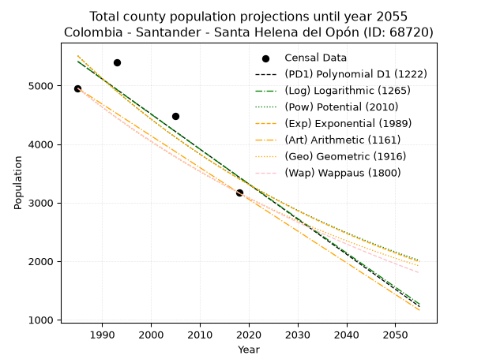
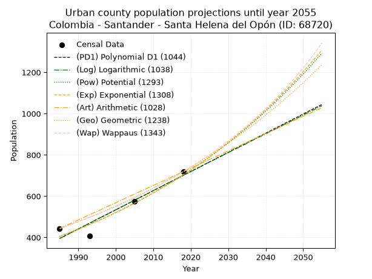
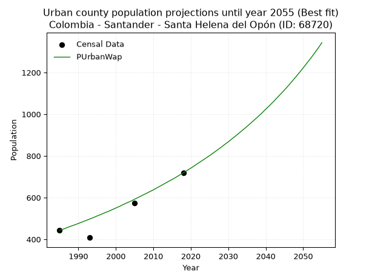
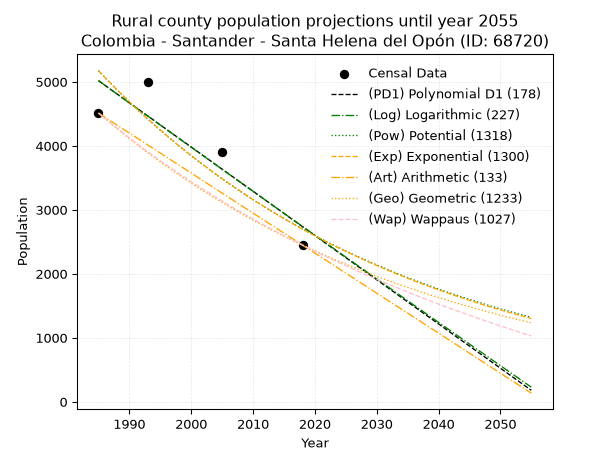
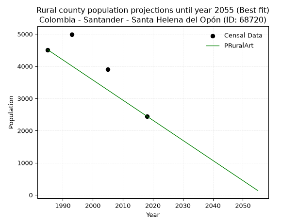

<div align="center">


</div>

# _“Population and Public Services Demand Projections (PPSD) until Year 2050 for Colombia - Santander - Santa Helena del Opón (ID: 68720)”_
Keywords: `population` `public-service` `projection` `lineal` `polynomial` `logarithmic` `potential` `exponential` `arithmetic` `geometric` `wappaus` `dane` `colombia` `south-america`

PPSD are analytical estimates used by governments and planners to anticipate future changes in population size, age distribution, and the resulting community needs for utilities, healthcare, education, and infrastructure as sizing future water treatment facilities, electrical grids, and road networks based on spatial growth.

> **General running parameters**: • app_version: _v20260806_. • Python version: _3.14.7_. • Pandas version: _3.0.5_. • NumPy version: _2.5.1_. • Creates, save and include plots into reports (create_plot): _False_. • Projection until year: _2050_. • Process polynomial degree 2 and up: _False_. • Process Wappaus: _True_. • Process Wappaus: _True_. • Set negative values to zero: _True_. • Set infinite values to zero: _True_. • Drop dataset notes: _True_. 
<div align="center">

Dynamic map: [:earth_americas:Google](http://maps.google.com/maps?q=6.339565181,-73.6167162) [:earth_americas:OSM](https://www.openstreetmap.org/#map=18/6.339565181/-73.6167162&layers=P) [:earth_americas:Bing](https://www.bing.com/maps?cp=6.339565181~-73.6167162&lvl=18) [:earth_americas:Apple](https://maps.apple.com/frame?center=6.339565181%2C-73.6167162&span=0.003%2C0.006)

</div>


<div align="center">

```geojson
{
  "type": "Feature",
  "geometry": {
    "type": "Point", 
    "coordinates": [-73.6167162, 6.339565181]
  }, 
  "properties": {
    "Name": "Colombia - Santander - Santa Helena del Opón (ID: 68720)"
  }
}
```

</div>


## 0. Census Data (4 records)

Census data are official statistics collected by a government about the people and housing in a country. They usually include counts of total population, age, sex, race, income, education, and jobs.

📅Global census file: [Population.xlsx](../data/Population.xlsx)

| Source   |   Year |   CountryID | CountryName   |   StateID | StateName   |   CountyID | CountyName            |   PTotal |   PUrban |   PRural |
|:---------|-------:|------------:|:--------------|----------:|:------------|-----------:|:----------------------|---------:|---------:|---------:|
| DANE     |   1985 |          57 | Colombia      |        68 | Santander   |      68720 | Santa Helena del Opón |     4954 |      443 |     4511 |
| DANE     |   1993 |          57 | Colombia      |        68 | Santander   |      68720 | Santa Helena del Opón |     5402 |      408 |     4994 |
| DANE     |   2005 |          57 | Colombia      |        68 | Santander   |      68720 | Santa Helena del Opón |     4473 |      575 |     3898 |
| DANE     |   2018 |          57 | Colombia      |        68 | Santander   |      68720 | Santa Helena del Opón |     3166 |      719 |     2447 |

> 🔥Some records could had specific notes about the registered values or the corresponding urban or rural distribution.

## 1. Total

### 1.1. Coefficients and Parameters

* (PD1) Polynomial Deg 1: -59.847049377759014, 124207.81051786247 (lineal)
* (Log) Logarithmic: -119661.59060457337, 914047.459093169
* (Pow) Potential: -29.087292280075534, 99.66401281198956
* (Exp) Exponential: -0.014548293927217537, 1.9174418676919876e+16
* (Art) Arithmetic: Year diff. 2018 - 1985 = 33, Population diff. 3166 - 4954 = -1788, Annual growth = -54.18181818181818
* (Geo) Geometric: Year diff. 2018 - 1985 = 33, Population diff. 3166 - 4954 = -1788, Annual growth % = -0.0134758425154059
* (Wap) Wappaus: i = -1.3345275414240931, Condition values only valid for < 200)

<sub>
Wappaus condition values: ['-0.00', '-1.33', '-2.67', '-4.00', '-5.34', '-6.67', '-8.01', '-9.34', '-10.68', '-12.01', '-13.35', '-14.68', '-16.01', '-17.35', '-18.68', '-20.02', '-21.35', '-22.69', '-24.02', '-25.36', '-26.69', '-28.03', '-29.36', '-30.69', '-32.03', '-33.36', '-34.70', '-36.03', '-37.37', '-38.70', '-40.04', '-41.37', '-42.70', '-44.04', '-45.37', '-46.71', '-48.04', '-49.38', '-50.71', '-52.05', '-53.38', '-54.72', '-56.05', '-57.38', '-58.72', '-60.05', '-61.39', '-62.72', '-64.06', '-65.39', '-66.73', '-68.06', '-69.40', '-70.73', '-72.06', '-73.40', '-74.73', '-76.07', '-77.40', '-78.74', '-80.07', '-81.41', '-82.74', '-84.08', '-85.41', '-86.74']
</sub>


### 1.2. Projected Dataset

|   Year |   CountyID |   PTotalPD1 |   PTotalLog |   PTotalPow |   PTotalExp |   PTotalArt |   PTotalGeo |   PTotalWap |
|-------:|-----------:|------------:|------------:|------------:|------------:|------------:|------------:|------------:|
|   1985 |      68720 |        5411 |        5412 |        5509 |        5508 |        4954 |        4954 |        4954 |
|   1986 |      68720 |        5352 |        5352 |        5429 |        5429 |        4900 |        4887 |        4888 |
|   1987 |      68720 |        5292 |        5292 |        5350 |        5350 |        4846 |        4821 |        4824 |
|   1988 |      68720 |        5232 |        5232 |        5272 |        5273 |        4791 |        4756 |        4760 |
|   1989 |      68720 |        5172 |        5171 |        5196 |        5197 |        4737 |        4692 |        4696 |
|   1990 |      68720 |        5112 |        5111 |        5120 |        5122 |        4683 |        4629 |        4634 |
|   1991 |      68720 |        5052 |        5051 |        5046 |        5048 |        4629 |        4567 |        4573 |
|   1992 |      68720 |        4992 |        4991 |        4973 |        4975 |        4575 |        4505 |        4512 |
|   1993 |      68720 |        4933 |        4931 |        4901 |        4903 |        4521 |        4444 |        4452 |
|   1994 |      68720 |        4873 |        4871 |        4830 |        4832 |        4466 |        4385 |        4393 |
|   1995 |      68720 |        4813 |        4811 |        4760 |        4762 |        4412 |        4325 |        4334 |
|   1996 |      68720 |        4753 |        4751 |        4691 |        4694 |        4358 |        4267 |        4276 |
|   1997 |      68720 |        4693 |        4691 |        4623 |        4626 |        4304 |        4210 |        4219 |
|   1998 |      68720 |        4633 |        4631 |        4556 |        4559 |        4250 |        4153 |        4163 |
|   1999 |      68720 |        4574 |        4571 |        4491 |        4493 |        4195 |        4097 |        4108 |
|   2000 |      68720 |        4514 |        4511 |        4426 |        4428 |        4141 |        4042 |        4053 |
|   2001 |      68720 |        4454 |        4452 |        4362 |        4364 |        4087 |        3987 |        3998 |
|   2002 |      68720 |        4394 |        4392 |        4299 |        4301 |        4033 |        3934 |        3945 |
|   2003 |      68720 |        4334 |        4332 |        4237 |        4239 |        3979 |        3881 |        3892 |
|   2004 |      68720 |        4274 |        4272 |        4176 |        4178 |        3925 |        3828 |        3839 |
|   2005 |      68720 |        4214 |        4213 |        4116 |        4118 |        3870 |        3777 |        3787 |
|   2006 |      68720 |        4155 |        4153 |        4056 |        4058 |        3816 |        3726 |        3736 |
|   2007 |      68720 |        4095 |        4093 |        3998 |        4000 |        3762 |        3676 |        3686 |
|   2008 |      68720 |        4035 |        4034 |        3941 |        3942 |        3708 |        3626 |        3636 |
|   2009 |      68720 |        3975 |        3974 |        3884 |        3885 |        3654 |        3577 |        3586 |
|   2010 |      68720 |        3915 |        3915 |        3828 |        3829 |        3599 |        3529 |        3537 |
|   2011 |      68720 |        3855 |        3855 |        3773 |        3773 |        3545 |        3481 |        3489 |
|   2012 |      68720 |        3796 |        3796 |        3719 |        3719 |        3491 |        3435 |        3441 |
|   2013 |      68720 |        3736 |        3736 |        3666 |        3665 |        3437 |        3388 |        3394 |
|   2014 |      68720 |        3676 |        3677 |        3613 |        3612 |        3383 |        3343 |        3348 |
|   2015 |      68720 |        3616 |        3617 |        3561 |        3560 |        3329 |        3298 |        3301 |
|   2016 |      68720 |        3556 |        3558 |        3510 |        3509 |        3274 |        3253 |        3256 |
|   2017 |      68720 |        3496 |        3499 |        3460 |        3458 |        3220 |        3209 |        3211 |
|   2018 |      68720 |        3436 |        3439 |        3410 |        3408 |        3166 |        3166 |        3166 |
|   2019 |      68720 |        3377 |        3380 |        3362 |        3359 |        3112 |        3123 |        3122 |
|   2020 |      68720 |        3317 |        3321 |        3314 |        3310 |        3058 |        3081 |        3078 |
|   2021 |      68720 |        3257 |        3261 |        3266 |        3263 |        3003 |        3040 |        3035 |
|   2022 |      68720 |        3197 |        3202 |        3220 |        3215 |        2949 |        2999 |        2992 |
|   2023 |      68720 |        3137 |        3143 |        3174 |        3169 |        2895 |        2958 |        2950 |
|   2024 |      68720 |        3077 |        3084 |        3128 |        3123 |        2841 |        2918 |        2908 |
|   2025 |      68720 |        3018 |        3025 |        3084 |        3078 |        2787 |        2879 |        2867 |
|   2026 |      68720 |        2958 |        2966 |        3040 |        3034 |        2733 |        2840 |        2826 |
|   2027 |      68720 |        2898 |        2907 |        2996 |        2990 |        2678 |        2802 |        2785 |
|   2028 |      68720 |        2838 |        2848 |        2954 |        2947 |        2624 |        2764 |        2745 |
|   2029 |      68720 |        2778 |        2789 |        2912 |        2904 |        2570 |        2727 |        2705 |
|   2030 |      68720 |        2718 |        2730 |        2870 |        2862 |        2516 |        2690 |        2666 |
|   2031 |      68720 |        2658 |        2671 |        2829 |        2821 |        2462 |        2654 |        2627 |
|   2032 |      68720 |        2599 |        2612 |        2789 |        2780 |        2407 |        2618 |        2589 |
|   2033 |      68720 |        2539 |        2553 |        2750 |        2740 |        2353 |        2583 |        2550 |
|   2034 |      68720 |        2479 |        2494 |        2710 |        2700 |        2299 |        2548 |        2513 |
|   2035 |      68720 |        2419 |        2435 |        2672 |        2661 |        2245 |        2514 |        2475 |
|   2036 |      68720 |        2359 |        2377 |        2634 |        2623 |        2191 |        2480 |        2438 |
|   2037 |      68720 |        2299 |        2318 |        2597 |        2585 |        2137 |        2447 |        2402 |
|   2038 |      68720 |        2240 |        2259 |        2560 |        2548 |        2082 |        2414 |        2365 |
|   2039 |      68720 |        2180 |        2200 |        2524 |        2511 |        2028 |        2381 |        2330 |
|   2040 |      68720 |        2120 |        2142 |        2488 |        2475 |        1974 |        2349 |        2294 |
|   2041 |      68720 |        2060 |        2083 |        2453 |        2439 |        1920 |        2317 |        2259 |
|   2042 |      68720 |        2000 |        2025 |        2418 |        2404 |        1866 |        2286 |        2224 |
|   2043 |      68720 |        1940 |        1966 |        2384 |        2369 |        1811 |        2255 |        2189 |
|   2044 |      68720 |        1880 |        1907 |        2350 |        2335 |        1757 |        2225 |        2155 |
|   2045 |      68720 |        1821 |        1849 |        2317 |        2301 |        1703 |        2195 |        2121 |
|   2046 |      68720 |        1761 |        1790 |        2284 |        2268 |        1649 |        2165 |        2088 |
|   2047 |      68720 |        1701 |        1732 |        2252 |        2235 |        1595 |        2136 |        2055 |
|   2048 |      68720 |        1641 |        1673 |        2220 |        2203 |        1541 |        2107 |        2022 |
|   2049 |      68720 |        1581 |        1615 |        2189 |        2171 |        1486 |        2079 |        1989 |
|   2050 |      68720 |        1521 |        1557 |        2158 |        2140 |        1432 |        2051 |        1957 |
<div align="center">

</img>

</div>


### 1.3. Best fit with absolute and relative error (%)

Relative error puts that difference into context by dividing the absolute error by the true value, creating a unitless ratio or percentage that shows the scale of the mistake.

Absolute and relative error

|   Year | Source   |   CountryID | CountryName   |   StateID | StateName   |   CountyID_x | CountyName            |   PTotal |   PUrban |   PRural |   CountyID_y |   PTotalPD1 |   PTotalLog |   PTotalPow |   PTotalExp |   PTotalArt |   PTotalGeo |   PTotalWap |   PTotalPD1AbsError |   PTotalLogAbsError |   PTotalPowAbsError |   PTotalExpAbsError |   PTotalArtAbsError |   PTotalGeoAbsError |   PTotalWapAbsError |   PTotalPD1RelError |   PTotalLogRelError |   PTotalPowRelError |   PTotalExpRelError |   PTotalArtRelError |   PTotalGeoRelError |   PTotalWapRelError |
|-------:|:---------|------------:|:--------------|----------:|:------------|-------------:|:----------------------|---------:|---------:|---------:|-------------:|------------:|------------:|------------:|------------:|------------:|------------:|------------:|--------------------:|--------------------:|--------------------:|--------------------:|--------------------:|--------------------:|--------------------:|--------------------:|--------------------:|--------------------:|--------------------:|--------------------:|--------------------:|--------------------:|
|   1985 | DANE     |          57 | Colombia      |        68 | Santander   |        68720 | Santa Helena del Opón |     4954 |      443 |     4511 |        68720 |        5411 |        5412 |        5509 |        5508 |        4954 |        4954 |        4954 |                 457 |                 458 |                 555 |                 554 |                   0 |                   0 |                   0 |             9.22487 |             9.24505 |            11.2031  |            11.1829  |              0      |              0      |              0      |
|   1993 | DANE     |          57 | Colombia      |        68 | Santander   |        68720 | Santa Helena del Opón |     5402 |      408 |     4994 |        68720 |        4933 |        4931 |        4901 |        4903 |        4521 |        4444 |        4452 |                 469 |                 471 |                 501 |                 499 |                 881 |                 958 |                 950 |             8.68197 |             8.71899 |             9.27434 |             9.23732 |             16.3088 |             17.7342 |             17.5861 |
|   2005 | DANE     |          57 | Colombia      |        68 | Santander   |        68720 | Santa Helena del Opón |     4473 |      575 |     3898 |        68720 |        4214 |        4213 |        4116 |        4118 |        3870 |        3777 |        3787 |                 259 |                 260 |                 357 |                 355 |                 603 |                 696 |                 686 |             5.7903  |             5.81265 |             7.98122 |             7.93651 |             13.4809 |             15.56   |             15.3365 |
|   2018 | DANE     |          57 | Colombia      |        68 | Santander   |        68720 | Santa Helena del Opón |     3166 |      719 |     2447 |        68720 |        3436 |        3439 |        3410 |        3408 |        3166 |        3166 |        3166 |                 270 |                 273 |                 244 |                 242 |                   0 |                   0 |                   0 |             8.52811 |             8.62287 |             7.70689 |             7.64371 |              0      |              0      |              0      |

Relative error mean

| Method    |   RelError | Best   |
|:----------|-----------:|:-------|
| PTotalPD1 |    8.05631 |        |
| PTotalLog |    8.09989 |        |
| PTotalPow |    9.04138 |        |
| PTotalExp |    9.00011 |        |
| PTotalArt |    7.44741 | True   |
| PTotalGeo |    8.32355 |        |
| PTotalWap |    8.23064 |        |

💙Best method: _**PTotalArt**_
<div align="center">

</img>

</div>


### 1.4. Fresh water supply demand in liters per capita per day (lpcd)

The fresh water supply demand typically ranges from 100 to 300 liters per capita per day (lpcd) for standard domestic and municipal planning, though absolute survival minimums set by the World Health Organization are as low as 7.5 to 20 liters per day, and total consumption in high-income nations can exceed 400 liters.

> `CZ`: Level in meters above the sea level (masl)<br> `WS`: Fresh water supply demand in liters per capita per day (lpcd or l/h/d)<br> `WSAll`: Zonal fresh water supply demand in liters per second (l/s)<br> `A`: Zonal area in square meters<br> `DP`: Population density (people/hectare)

Reference values (RAS Colombia)

|    CZ |   WS |
|------:|-----:|
|  1000 |  120 |
|  2000 |  130 |
| 99999 |  140 |

County shapefile geometry properties and water supply values

|   CountyID |      ATotal |   CZTotal |   WSTotal |
|-----------:|------------:|----------:|----------:|
|      68720 | 3.73267e+08 |   1040.33 |       130 |

Projected values for best method: PTotalArt

|   CountyID |   Year |   PTotalArt |   DPTotal |   WSTotal |   WSTotalAll |
|-----------:|-------:|------------:|----------:|----------:|-------------:|
|      68720 |   1985 |        4954 |      0.13 |       130 |      7.45394 |
|      68720 |   1986 |        4900 |      0.13 |       130 |      7.37269 |
|      68720 |   1987 |        4846 |      0.13 |       130 |      7.29144 |
|      68720 |   1988 |        4791 |      0.13 |       130 |      7.20868 |
|      68720 |   1989 |        4737 |      0.13 |       130 |      7.12743 |
|      68720 |   1990 |        4683 |      0.13 |       130 |      7.04618 |
|      68720 |   1991 |        4629 |      0.12 |       130 |      6.96493 |
|      68720 |   1992 |        4575 |      0.12 |       130 |      6.88368 |
|      68720 |   1993 |        4521 |      0.12 |       130 |      6.80243 |
|      68720 |   1994 |        4466 |      0.12 |       130 |      6.71968 |
|      68720 |   1995 |        4412 |      0.12 |       130 |      6.63843 |
|      68720 |   1996 |        4358 |      0.12 |       130 |      6.55718 |
|      68720 |   1997 |        4304 |      0.12 |       130 |      6.47593 |
|      68720 |   1998 |        4250 |      0.11 |       130 |      6.39468 |
|      68720 |   1999 |        4195 |      0.11 |       130 |      6.31192 |
|      68720 |   2000 |        4141 |      0.11 |       130 |      6.23067 |
|      68720 |   2001 |        4087 |      0.11 |       130 |      6.14942 |
|      68720 |   2002 |        4033 |      0.11 |       130 |      6.06817 |
|      68720 |   2003 |        3979 |      0.11 |       130 |      5.98692 |
|      68720 |   2004 |        3925 |      0.11 |       130 |      5.90567 |
|      68720 |   2005 |        3870 |      0.1  |       130 |      5.82292 |
|      68720 |   2006 |        3816 |      0.1  |       130 |      5.74167 |
|      68720 |   2007 |        3762 |      0.1  |       130 |      5.66042 |
|      68720 |   2008 |        3708 |      0.1  |       130 |      5.57917 |
|      68720 |   2009 |        3654 |      0.1  |       130 |      5.49792 |
|      68720 |   2010 |        3599 |      0.1  |       130 |      5.41516 |
|      68720 |   2011 |        3545 |      0.09 |       130 |      5.33391 |
|      68720 |   2012 |        3491 |      0.09 |       130 |      5.25266 |
|      68720 |   2013 |        3437 |      0.09 |       130 |      5.17141 |
|      68720 |   2014 |        3383 |      0.09 |       130 |      5.09016 |
|      68720 |   2015 |        3329 |      0.09 |       130 |      5.00891 |
|      68720 |   2016 |        3274 |      0.09 |       130 |      4.92616 |
|      68720 |   2017 |        3220 |      0.09 |       130 |      4.84491 |
|      68720 |   2018 |        3166 |      0.08 |       130 |      4.76366 |
|      68720 |   2019 |        3112 |      0.08 |       130 |      4.68241 |
|      68720 |   2020 |        3058 |      0.08 |       130 |      4.60116 |
|      68720 |   2021 |        3003 |      0.08 |       130 |      4.5184  |
|      68720 |   2022 |        2949 |      0.08 |       130 |      4.43715 |
|      68720 |   2023 |        2895 |      0.08 |       130 |      4.3559  |
|      68720 |   2024 |        2841 |      0.08 |       130 |      4.27465 |
|      68720 |   2025 |        2787 |      0.07 |       130 |      4.1934  |
|      68720 |   2026 |        2733 |      0.07 |       130 |      4.11215 |
|      68720 |   2027 |        2678 |      0.07 |       130 |      4.0294  |
|      68720 |   2028 |        2624 |      0.07 |       130 |      3.94815 |
|      68720 |   2029 |        2570 |      0.07 |       130 |      3.8669  |
|      68720 |   2030 |        2516 |      0.07 |       130 |      3.78565 |
|      68720 |   2031 |        2462 |      0.07 |       130 |      3.7044  |
|      68720 |   2032 |        2407 |      0.06 |       130 |      3.62164 |
|      68720 |   2033 |        2353 |      0.06 |       130 |      3.54039 |
|      68720 |   2034 |        2299 |      0.06 |       130 |      3.45914 |
|      68720 |   2035 |        2245 |      0.06 |       130 |      3.37789 |
|      68720 |   2036 |        2191 |      0.06 |       130 |      3.29664 |
|      68720 |   2037 |        2137 |      0.06 |       130 |      3.21539 |
|      68720 |   2038 |        2082 |      0.06 |       130 |      3.13264 |
|      68720 |   2039 |        2028 |      0.05 |       130 |      3.05139 |
|      68720 |   2040 |        1974 |      0.05 |       130 |      2.97014 |
|      68720 |   2041 |        1920 |      0.05 |       130 |      2.88889 |
|      68720 |   2042 |        1866 |      0.05 |       130 |      2.80764 |
|      68720 |   2043 |        1811 |      0.05 |       130 |      2.72488 |
|      68720 |   2044 |        1757 |      0.05 |       130 |      2.64363 |
|      68720 |   2045 |        1703 |      0.05 |       130 |      2.56238 |
|      68720 |   2046 |        1649 |      0.04 |       130 |      2.48113 |
|      68720 |   2047 |        1595 |      0.04 |       130 |      2.39988 |
|      68720 |   2048 |        1541 |      0.04 |       130 |      2.31863 |
|      68720 |   2049 |        1486 |      0.04 |       130 |      2.23588 |
|      68720 |   2050 |        1432 |      0.04 |       130 |      2.15463 |

## 2. Urban

### 2.1. Coefficients and Parameters

* (PD1) Polynomial Deg 1: 9.281011641910776, -18028.09353673203 (lineal)
* (Log) Logarithmic: 18566.13471754232, -140585.0887677055
* (Pow) Potential: 33.511960301951085, -107.90715725267954
* (Exp) Exponential: 0.016750976773532555, 1.4683611433776914e-12
* (Art) Arithmetic: Year diff. 2018 - 1985 = 33, Population diff. 719 - 443 = 276, Annual growth = 8.363636363636363
* (Geo) Geometric: Year diff. 2018 - 1985 = 33, Population diff. 719 - 443 = 276, Annual growth % = 0.014783716562424276
* (Wap) Wappaus: i = 1.439524331090596, Condition values only valid for < 200)

<sub>
Wappaus condition values: ['0.00', '1.44', '2.88', '4.32', '5.76', '7.20', '8.64', '10.08', '11.52', '12.96', '14.40', '15.83', '17.27', '18.71', '20.15', '21.59', '23.03', '24.47', '25.91', '27.35', '28.79', '30.23', '31.67', '33.11', '34.55', '35.99', '37.43', '38.87', '40.31', '41.75', '43.19', '44.63', '46.06', '47.50', '48.94', '50.38', '51.82', '53.26', '54.70', '56.14', '57.58', '59.02', '60.46', '61.90', '63.34', '64.78', '66.22', '67.66', '69.10', '70.54', '71.98', '73.42', '74.86', '76.29', '77.73', '79.17', '80.61', '82.05', '83.49', '84.93', '86.37', '87.81', '89.25', '90.69', '92.13', '93.57']
</sub>


### 2.2. Projected Dataset

|   Year |   CountyID |   PUrbanPD1 |   PUrbanLog |   PUrbanPow |   PUrbanExp |   PUrbanArt |   PUrbanGeo |   PUrbanWap |
|-------:|-----------:|------------:|------------:|------------:|------------:|------------:|------------:|------------:|
|   1985 |      68720 |         395 |         395 |         405 |         405 |         443 |         443 |         443 |
|   1986 |      68720 |         404 |         404 |         412 |         412 |         451 |         450 |         449 |
|   1987 |      68720 |         413 |         413 |         419 |         419 |         460 |         456 |         456 |
|   1988 |      68720 |         423 |         423 |         426 |         426 |         468 |         463 |         463 |
|   1989 |      68720 |         432 |         432 |         433 |         433 |         476 |         470 |         469 |
|   1990 |      68720 |         441 |         441 |         440 |         440 |         485 |         477 |         476 |
|   1991 |      68720 |         450 |         451 |         448 |         448 |         493 |         484 |         483 |
|   1992 |      68720 |         460 |         460 |         456 |         455 |         502 |         491 |         490 |
|   1993 |      68720 |         469 |         469 |         463 |         463 |         510 |         498 |         497 |
|   1994 |      68720 |         478 |         479 |         471 |         471 |         518 |         506 |         504 |
|   1995 |      68720 |         488 |         488 |         479 |         479 |         527 |         513 |         512 |
|   1996 |      68720 |         497 |         497 |         487 |         487 |         535 |         521 |         519 |
|   1997 |      68720 |         506 |         506 |         495 |         495 |         543 |         528 |         527 |
|   1998 |      68720 |         515 |         516 |         504 |         503 |         552 |         536 |         534 |
|   1999 |      68720 |         525 |         525 |         512 |         512 |         560 |         544 |         542 |
|   2000 |      68720 |         534 |         534 |         521 |         521 |         568 |         552 |         550 |
|   2001 |      68720 |         543 |         544 |         530 |         529 |         577 |         560 |         558 |
|   2002 |      68720 |         552 |         553 |         539 |         538 |         585 |         569 |         567 |
|   2003 |      68720 |         562 |         562 |         548 |         547 |         594 |         577 |         575 |
|   2004 |      68720 |         571 |         571 |         557 |         557 |         602 |         585 |         583 |
|   2005 |      68720 |         580 |         581 |         566 |         566 |         610 |         594 |         592 |
|   2006 |      68720 |         590 |         590 |         576 |         576 |         619 |         603 |         601 |
|   2007 |      68720 |         599 |         599 |         586 |         585 |         627 |         612 |         610 |
|   2008 |      68720 |         608 |         608 |         596 |         595 |         635 |         621 |         619 |
|   2009 |      68720 |         617 |         618 |         606 |         605 |         644 |         630 |         628 |
|   2010 |      68720 |         627 |         627 |         616 |         616 |         652 |         639 |         637 |
|   2011 |      68720 |         636 |         636 |         626 |         626 |         660 |         649 |         647 |
|   2012 |      68720 |         645 |         645 |         637 |         637 |         669 |         658 |         657 |
|   2013 |      68720 |         655 |         655 |         647 |         647 |         677 |         668 |         667 |
|   2014 |      68720 |         664 |         664 |         658 |         658 |         686 |         678 |         677 |
|   2015 |      68720 |         673 |         673 |         669 |         669 |         694 |         688 |         687 |
|   2016 |      68720 |         682 |         682 |         680 |         681 |         702 |         698 |         697 |
|   2017 |      68720 |         692 |         691 |         692 |         692 |         711 |         709 |         708 |
|   2018 |      68720 |         701 |         701 |         703 |         704 |         719 |         719 |         719 |
|   2019 |      68720 |         710 |         710 |         715 |         716 |         727 |         730 |         730 |
|   2020 |      68720 |         720 |         719 |         727 |         728 |         736 |         740 |         741 |
|   2021 |      68720 |         729 |         728 |         739 |         740 |         744 |         751 |         753 |
|   2022 |      68720 |         738 |         737 |         752 |         753 |         752 |         762 |         765 |
|   2023 |      68720 |         747 |         747 |         764 |         765 |         761 |         774 |         777 |
|   2024 |      68720 |         757 |         756 |         777 |         778 |         769 |         785 |         789 |
|   2025 |      68720 |         766 |         765 |         790 |         791 |         778 |         797 |         801 |
|   2026 |      68720 |         775 |         774 |         803 |         805 |         786 |         809 |         814 |
|   2027 |      68720 |         785 |         783 |         817 |         818 |         794 |         821 |         827 |
|   2028 |      68720 |         794 |         792 |         830 |         832 |         803 |         833 |         840 |
|   2029 |      68720 |         803 |         802 |         844 |         846 |         811 |         845 |         854 |
|   2030 |      68720 |         812 |         811 |         858 |         861 |         819 |         857 |         867 |
|   2031 |      68720 |         822 |         820 |         872 |         875 |         828 |         870 |         882 |
|   2032 |      68720 |         831 |         829 |         887 |         890 |         836 |         883 |         896 |
|   2033 |      68720 |         840 |         838 |         902 |         905 |         844 |         896 |         911 |
|   2034 |      68720 |         849 |         847 |         917 |         920 |         853 |         909 |         926 |
|   2035 |      68720 |         859 |         856 |         932 |         936 |         861 |         923 |         941 |
|   2036 |      68720 |         868 |         866 |         947 |         952 |         870 |         936 |         957 |
|   2037 |      68720 |         877 |         875 |         963 |         968 |         878 |         950 |         973 |
|   2038 |      68720 |         887 |         884 |         979 |         984 |         886 |         964 |         989 |
|   2039 |      68720 |         896 |         893 |         995 |        1001 |         895 |         979 |        1006 |
|   2040 |      68720 |         905 |         902 |        1012 |        1018 |         903 |         993 |        1024 |
|   2041 |      68720 |         914 |         911 |        1028 |        1035 |         911 |        1008 |        1041 |
|   2042 |      68720 |         924 |         920 |        1045 |        1052 |         920 |        1023 |        1059 |
|   2043 |      68720 |         933 |         929 |        1063 |        1070 |         928 |        1038 |        1078 |
|   2044 |      68720 |         942 |         938 |        1080 |        1088 |         936 |        1053 |        1097 |
|   2045 |      68720 |         952 |         947 |        1098 |        1106 |         945 |        1069 |        1116 |
|   2046 |      68720 |         961 |         956 |        1116 |        1125 |         953 |        1084 |        1136 |
|   2047 |      68720 |         970 |         966 |        1135 |        1144 |         962 |        1100 |        1157 |
|   2048 |      68720 |         979 |         975 |        1153 |        1163 |         970 |        1117 |        1178 |
|   2049 |      68720 |         989 |         984 |        1172 |        1183 |         978 |        1133 |        1200 |
|   2050 |      68720 |         998 |         993 |        1192 |        1203 |         987 |        1150 |        1222 |
<div align="center">

</img>

</div>


### 2.3. Best fit with absolute and relative error (%)

Relative error puts that difference into context by dividing the absolute error by the true value, creating a unitless ratio or percentage that shows the scale of the mistake.

Absolute and relative error

|   Year | Source   |   CountryID | CountryName   |   StateID | StateName   |   CountyID_x | CountyName            |   PTotal |   PUrban |   PRural |   CountyID_y |   PUrbanPD1 |   PUrbanLog |   PUrbanPow |   PUrbanExp |   PUrbanArt |   PUrbanGeo |   PUrbanWap |   PUrbanPD1AbsError |   PUrbanLogAbsError |   PUrbanPowAbsError |   PUrbanExpAbsError |   PUrbanArtAbsError |   PUrbanGeoAbsError |   PUrbanWapAbsError |   PUrbanPD1RelError |   PUrbanLogRelError |   PUrbanPowRelError |   PUrbanExpRelError |   PUrbanArtRelError |   PUrbanGeoRelError |   PUrbanWapRelError |
|-------:|:---------|------------:|:--------------|----------:|:------------|-------------:|:----------------------|---------:|---------:|---------:|-------------:|------------:|------------:|------------:|------------:|------------:|------------:|------------:|--------------------:|--------------------:|--------------------:|--------------------:|--------------------:|--------------------:|--------------------:|--------------------:|--------------------:|--------------------:|--------------------:|--------------------:|--------------------:|--------------------:|
|   1985 | DANE     |          57 | Colombia      |        68 | Santander   |        68720 | Santa Helena del Opón |     4954 |      443 |     4511 |        68720 |         395 |         395 |         405 |         405 |         443 |         443 |         443 |                  48 |                  48 |                  38 |                  38 |                   0 |                   0 |                   0 |           10.8352   |            10.8352  |             8.57788 |             8.57788 |             0       |             0       |             0       |
|   1993 | DANE     |          57 | Colombia      |        68 | Santander   |        68720 | Santa Helena del Opón |     5402 |      408 |     4994 |        68720 |         469 |         469 |         463 |         463 |         510 |         498 |         497 |                  61 |                  61 |                  55 |                  55 |                 102 |                  90 |                  89 |           14.951    |            14.951   |            13.4804  |            13.4804  |            25       |            22.0588  |            21.8137  |
|   2005 | DANE     |          57 | Colombia      |        68 | Santander   |        68720 | Santa Helena del Opón |     4473 |      575 |     3898 |        68720 |         580 |         581 |         566 |         566 |         610 |         594 |         592 |                   5 |                   6 |                   9 |                   9 |                  35 |                  19 |                  17 |            0.869565 |             1.04348 |             1.56522 |             1.56522 |             6.08696 |             3.30435 |             2.95652 |
|   2018 | DANE     |          57 | Colombia      |        68 | Santander   |        68720 | Santa Helena del Opón |     3166 |      719 |     2447 |        68720 |         701 |         701 |         703 |         704 |         719 |         719 |         719 |                  18 |                  18 |                  16 |                  15 |                   0 |                   0 |                   0 |            2.50348  |             2.50348 |             2.22531 |             2.08623 |             0       |             0       |             0       |

Relative error mean

| Method    |   RelError | Best   |
|:----------|-----------:|:-------|
| PUrbanPD1 |    7.28981 |        |
| PUrbanLog |    7.33329 |        |
| PUrbanPow |    6.4622  |        |
| PUrbanExp |    6.42743 |        |
| PUrbanArt |    7.77174 |        |
| PUrbanGeo |    6.34079 |        |
| PUrbanWap |    6.19256 | True   |

💙Best method: _**PUrbanWap**_
<div align="center">

</img>

</div>


### 2.4. Fresh water supply demand in liters per capita per day (lpcd)

The fresh water supply demand typically ranges from 100 to 300 liters per capita per day (lpcd) for standard domestic and municipal planning, though absolute survival minimums set by the World Health Organization are as low as 7.5 to 20 liters per day, and total consumption in high-income nations can exceed 400 liters.

> `CZ`: Level in meters above the sea level (masl)<br> `WS`: Fresh water supply demand in liters per capita per day (lpcd or l/h/d)<br> `WSAll`: Zonal fresh water supply demand in liters per second (l/s)<br> `A`: Zonal area in square meters<br> `DP`: Population density (people/hectare)

Reference values (RAS Colombia)

|    CZ |   WS |
|------:|-----:|
|  1000 |  120 |
|  2000 |  130 |
| 99999 |  140 |

County shapefile geometry properties and water supply values

|   CountyID |   AUrban |   CZUrban |   WSUrban |
|-----------:|---------:|----------:|----------:|
|      68720 |   190375 |   1081.13 |       130 |

Projected values for best method: PUrbanWap

|   CountyID |   Year |   PUrbanWap |   DPUrban |   WSUrban |   WSUrbanAll |
|-----------:|-------:|------------:|----------:|----------:|-------------:|
|      68720 |   1985 |         443 |     23.27 |       130 |     0.666551 |
|      68720 |   1986 |         449 |     23.59 |       130 |     0.675579 |
|      68720 |   1987 |         456 |     23.95 |       130 |     0.686111 |
|      68720 |   1988 |         463 |     24.32 |       130 |     0.696644 |
|      68720 |   1989 |         469 |     24.64 |       130 |     0.705671 |
|      68720 |   1990 |         476 |     25    |       130 |     0.716204 |
|      68720 |   1991 |         483 |     25.37 |       130 |     0.726736 |
|      68720 |   1992 |         490 |     25.74 |       130 |     0.737269 |
|      68720 |   1993 |         497 |     26.11 |       130 |     0.747801 |
|      68720 |   1994 |         504 |     26.47 |       130 |     0.758333 |
|      68720 |   1995 |         512 |     26.89 |       130 |     0.77037  |
|      68720 |   1996 |         519 |     27.26 |       130 |     0.780903 |
|      68720 |   1997 |         527 |     27.68 |       130 |     0.79294  |
|      68720 |   1998 |         534 |     28.05 |       130 |     0.803472 |
|      68720 |   1999 |         542 |     28.47 |       130 |     0.815509 |
|      68720 |   2000 |         550 |     28.89 |       130 |     0.827546 |
|      68720 |   2001 |         558 |     29.31 |       130 |     0.839583 |
|      68720 |   2002 |         567 |     29.78 |       130 |     0.853125 |
|      68720 |   2003 |         575 |     30.2  |       130 |     0.865162 |
|      68720 |   2004 |         583 |     30.62 |       130 |     0.877199 |
|      68720 |   2005 |         592 |     31.1  |       130 |     0.890741 |
|      68720 |   2006 |         601 |     31.57 |       130 |     0.904282 |
|      68720 |   2007 |         610 |     32.04 |       130 |     0.917824 |
|      68720 |   2008 |         619 |     32.51 |       130 |     0.931366 |
|      68720 |   2009 |         628 |     32.99 |       130 |     0.944907 |
|      68720 |   2010 |         637 |     33.46 |       130 |     0.958449 |
|      68720 |   2011 |         647 |     33.99 |       130 |     0.973495 |
|      68720 |   2012 |         657 |     34.51 |       130 |     0.988542 |
|      68720 |   2013 |         667 |     35.04 |       130 |     1.00359  |
|      68720 |   2014 |         677 |     35.56 |       130 |     1.01863  |
|      68720 |   2015 |         687 |     36.09 |       130 |     1.03368  |
|      68720 |   2016 |         697 |     36.61 |       130 |     1.04873  |
|      68720 |   2017 |         708 |     37.19 |       130 |     1.06528  |
|      68720 |   2018 |         719 |     37.77 |       130 |     1.08183  |
|      68720 |   2019 |         730 |     38.35 |       130 |     1.09838  |
|      68720 |   2020 |         741 |     38.92 |       130 |     1.11493  |
|      68720 |   2021 |         753 |     39.55 |       130 |     1.13299  |
|      68720 |   2022 |         765 |     40.18 |       130 |     1.15104  |
|      68720 |   2023 |         777 |     40.81 |       130 |     1.1691   |
|      68720 |   2024 |         789 |     41.44 |       130 |     1.18715  |
|      68720 |   2025 |         801 |     42.07 |       130 |     1.20521  |
|      68720 |   2026 |         814 |     42.76 |       130 |     1.22477  |
|      68720 |   2027 |         827 |     43.44 |       130 |     1.24433  |
|      68720 |   2028 |         840 |     44.12 |       130 |     1.26389  |
|      68720 |   2029 |         854 |     44.86 |       130 |     1.28495  |
|      68720 |   2030 |         867 |     45.54 |       130 |     1.30451  |
|      68720 |   2031 |         882 |     46.33 |       130 |     1.32708  |
|      68720 |   2032 |         896 |     47.06 |       130 |     1.34815  |
|      68720 |   2033 |         911 |     47.85 |       130 |     1.37072  |
|      68720 |   2034 |         926 |     48.64 |       130 |     1.39329  |
|      68720 |   2035 |         941 |     49.43 |       130 |     1.41586  |
|      68720 |   2036 |         957 |     50.27 |       130 |     1.43993  |
|      68720 |   2037 |         973 |     51.11 |       130 |     1.464    |
|      68720 |   2038 |         989 |     51.95 |       130 |     1.48808  |
|      68720 |   2039 |        1006 |     52.84 |       130 |     1.51366  |
|      68720 |   2040 |        1024 |     53.79 |       130 |     1.54074  |
|      68720 |   2041 |        1041 |     54.68 |       130 |     1.56632  |
|      68720 |   2042 |        1059 |     55.63 |       130 |     1.5934   |
|      68720 |   2043 |        1078 |     56.63 |       130 |     1.62199  |
|      68720 |   2044 |        1097 |     57.62 |       130 |     1.65058  |
|      68720 |   2045 |        1116 |     58.62 |       130 |     1.67917  |
|      68720 |   2046 |        1136 |     59.67 |       130 |     1.70926  |
|      68720 |   2047 |        1157 |     60.77 |       130 |     1.74086  |
|      68720 |   2048 |        1178 |     61.88 |       130 |     1.77245  |
|      68720 |   2049 |        1200 |     63.03 |       130 |     1.80556  |
|      68720 |   2050 |        1222 |     64.19 |       130 |     1.83866  |

## 3. Rural

### 3.1. Coefficients and Parameters

* (PD1) Polynomial Deg 1: -69.12806101966979, 142235.9040545945 (lineal)
* (Log) Logarithmic: -138227.72532211567, 1054632.5478608746
* (Pow) Potential: -39.45297892490693, 133.82032472546945
* (Exp) Exponential: -0.019732020397651925, 5.29915740887478e+20
* (Art) Arithmetic: Year diff. 2018 - 1985 = 33, Population diff. 2447 - 4511 = -2064, Annual growth = -62.54545454545455
* (Geo) Geometric: Year diff. 2018 - 1985 = 33, Population diff. 2447 - 4511 = -2064, Annual growth % = -0.018364315206313875
* (Wap) Wappaus: i = -1.797799785727351, Condition values only valid for < 200)

<sub>
Wappaus condition values: ['-0.00', '-1.80', '-3.60', '-5.39', '-7.19', '-8.99', '-10.79', '-12.58', '-14.38', '-16.18', '-17.98', '-19.78', '-21.57', '-23.37', '-25.17', '-26.97', '-28.76', '-30.56', '-32.36', '-34.16', '-35.96', '-37.75', '-39.55', '-41.35', '-43.15', '-44.94', '-46.74', '-48.54', '-50.34', '-52.14', '-53.93', '-55.73', '-57.53', '-59.33', '-61.13', '-62.92', '-64.72', '-66.52', '-68.32', '-70.11', '-71.91', '-73.71', '-75.51', '-77.31', '-79.10', '-80.90', '-82.70', '-84.50', '-86.29', '-88.09', '-89.89', '-91.69', '-93.49', '-95.28', '-97.08', '-98.88', '-100.68', '-102.47', '-104.27', '-106.07', '-107.87', '-109.67', '-111.46', '-113.26', '-115.06', '-116.86']
</sub>


### 3.2. Projected Dataset

|   Year |   CountyID |   PRuralPD1 |   PRuralLog |   PRuralPow |   PRuralExp |   PRuralArt |   PRuralGeo |   PRuralWap |
|-------:|-----------:|------------:|------------:|------------:|------------:|------------:|------------:|------------:|
|   1985 |      68720 |        5017 |        5018 |        5174 |        5173 |        4511 |        4511 |        4511 |
|   1986 |      68720 |        4948 |        4948 |        5072 |        5072 |        4448 |        4428 |        4431 |
|   1987 |      68720 |        4878 |        4879 |        4973 |        4973 |        4386 |        4347 |        4352 |
|   1988 |      68720 |        4809 |        4809 |        4875 |        4876 |        4323 |        4267 |        4274 |
|   1989 |      68720 |        4740 |        4739 |        4779 |        4780 |        4261 |        4189 |        4198 |
|   1990 |      68720 |        4671 |        4670 |        4685 |        4687 |        4198 |        4112 |        4123 |
|   1991 |      68720 |        4602 |        4601 |        4593 |        4595 |        4136 |        4036 |        4049 |
|   1992 |      68720 |        4533 |        4531 |        4503 |        4506 |        4073 |        3962 |        3977 |
|   1993 |      68720 |        4464 |        4462 |        4415 |        4418 |        4011 |        3889 |        3906 |
|   1994 |      68720 |        4395 |        4392 |        4329 |        4331 |        3948 |        3818 |        3836 |
|   1995 |      68720 |        4325 |        4323 |        4244 |        4247 |        3886 |        3748 |        3767 |
|   1996 |      68720 |        4256 |        4254 |        4161 |        4164 |        3823 |        3679 |        3699 |
|   1997 |      68720 |        4187 |        4185 |        4079 |        4082 |        3760 |        3611 |        3633 |
|   1998 |      68720 |        4118 |        4115 |        3999 |        4002 |        3698 |        3545 |        3567 |
|   1999 |      68720 |        4049 |        4046 |        3921 |        3924 |        3635 |        3480 |        3503 |
|   2000 |      68720 |        3980 |        3977 |        3845 |        3848 |        3573 |        3416 |        3439 |
|   2001 |      68720 |        3911 |        3908 |        3770 |        3772 |        3510 |        3353 |        3377 |
|   2002 |      68720 |        3842 |        3839 |        3696 |        3699 |        3448 |        3292 |        3315 |
|   2003 |      68720 |        3772 |        3770 |        3624 |        3626 |        3385 |        3231 |        3255 |
|   2004 |      68720 |        3703 |        3701 |        3553 |        3556 |        3323 |        3172 |        3195 |
|   2005 |      68720 |        3634 |        3632 |        3484 |        3486 |        3260 |        3114 |        3136 |
|   2006 |      68720 |        3565 |        3563 |        3416 |        3418 |        3198 |        3057 |        3078 |
|   2007 |      68720 |        3496 |        3494 |        3350 |        3351 |        3135 |        3000 |        3021 |
|   2008 |      68720 |        3427 |        3425 |        3284 |        3286 |        3072 |        2945 |        2965 |
|   2009 |      68720 |        3358 |        3356 |        3221 |        3222 |        3010 |        2891 |        2910 |
|   2010 |      68720 |        3289 |        3288 |        3158 |        3159 |        2947 |        2838 |        2856 |
|   2011 |      68720 |        3219 |        3219 |        3097 |        3097 |        2885 |        2786 |        2802 |
|   2012 |      68720 |        3150 |        3150 |        3036 |        3036 |        2822 |        2735 |        2749 |
|   2013 |      68720 |        3081 |        3082 |        2977 |        2977 |        2760 |        2685 |        2697 |
|   2014 |      68720 |        3012 |        3013 |        2920 |        2919 |        2697 |        2635 |        2645 |
|   2015 |      68720 |        2943 |        2944 |        2863 |        2862 |        2635 |        2587 |        2595 |
|   2016 |      68720 |        2874 |        2876 |        2808 |        2806 |        2572 |        2539 |        2545 |
|   2017 |      68720 |        2805 |        2807 |        2753 |        2751 |        2510 |        2493 |        2496 |
|   2018 |      68720 |        2735 |        2739 |        2700 |        2697 |        2447 |        2447 |        2447 |
|   2019 |      68720 |        2666 |        2670 |        2648 |        2645 |        2384 |        2402 |        2399 |
|   2020 |      68720 |        2597 |        2602 |        2596 |        2593 |        2322 |        2358 |        2352 |
|   2021 |      68720 |        2528 |        2533 |        2546 |        2542 |        2259 |        2315 |        2305 |
|   2022 |      68720 |        2459 |        2465 |        2497 |        2493 |        2197 |        2272 |        2259 |
|   2023 |      68720 |        2390 |        2397 |        2449 |        2444 |        2134 |        2230 |        2214 |
|   2024 |      68720 |        2321 |        2328 |        2401 |        2396 |        2072 |        2189 |        2169 |
|   2025 |      68720 |        2252 |        2260 |        2355 |        2349 |        2009 |        2149 |        2125 |
|   2026 |      68720 |        2182 |        2192 |        2310 |        2303 |        1947 |        2110 |        2081 |
|   2027 |      68720 |        2113 |        2123 |        2265 |        2258 |        1884 |        2071 |        2038 |
|   2028 |      68720 |        2044 |        2055 |        2221 |        2214 |        1822 |        2033 |        1996 |
|   2029 |      68720 |        1975 |        1987 |        2179 |        2171 |        1759 |        1996 |        1954 |
|   2030 |      68720 |        1906 |        1919 |        2137 |        2129 |        1696 |        1959 |        1913 |
|   2031 |      68720 |        1837 |        1851 |        2096 |        2087 |        1634 |        1923 |        1872 |
|   2032 |      68720 |        1768 |        1783 |        2055 |        2046 |        1571 |        1888 |        1831 |
|   2033 |      68720 |        1699 |        1715 |        2016 |        2006 |        1509 |        1853 |        1792 |
|   2034 |      68720 |        1629 |        1647 |        1977 |        1967 |        1446 |        1819 |        1752 |
|   2035 |      68720 |        1560 |        1579 |        1939 |        1929 |        1384 |        1786 |        1713 |
|   2036 |      68720 |        1491 |        1511 |        1902 |        1891 |        1321 |        1753 |        1675 |
|   2037 |      68720 |        1422 |        1443 |        1865 |        1854 |        1259 |        1721 |        1637 |
|   2038 |      68720 |        1353 |        1375 |        1830 |        1818 |        1196 |        1689 |        1600 |
|   2039 |      68720 |        1284 |        1308 |        1795 |        1782 |        1134 |        1658 |        1563 |
|   2040 |      68720 |        1215 |        1240 |        1760 |        1747 |        1071 |        1628 |        1526 |
|   2041 |      68720 |        1146 |        1172 |        1726 |        1713 |        1008 |        1598 |        1490 |
|   2042 |      68720 |        1076 |        1104 |        1693 |        1680 |         946 |        1568 |        1454 |
|   2043 |      68720 |        1007 |        1037 |        1661 |        1647 |         883 |        1540 |        1419 |
|   2044 |      68720 |         938 |         969 |        1629 |        1615 |         821 |        1511 |        1384 |
|   2045 |      68720 |         869 |         901 |        1598 |        1583 |         758 |        1484 |        1350 |
|   2046 |      68720 |         800 |         834 |        1568 |        1552 |         696 |        1456 |        1316 |
|   2047 |      68720 |         731 |         766 |        1538 |        1522 |         633 |        1430 |        1282 |
|   2048 |      68720 |         662 |         699 |        1508 |        1492 |         571 |        1403 |        1249 |
|   2049 |      68720 |         593 |         631 |        1480 |        1463 |         508 |        1378 |        1216 |
|   2050 |      68720 |         523 |         564 |        1451 |        1435 |         446 |        1352 |        1184 |
<div align="center">

</img>

</div>


### 3.3. Best fit with absolute and relative error (%)

Relative error puts that difference into context by dividing the absolute error by the true value, creating a unitless ratio or percentage that shows the scale of the mistake.

Absolute and relative error

|   Year | Source   |   CountryID | CountryName   |   StateID | StateName   |   CountyID_x | CountyName            |   PTotal |   PUrban |   PRural |   CountyID_y |   PRuralPD1 |   PRuralLog |   PRuralPow |   PRuralExp |   PRuralArt |   PRuralGeo |   PRuralWap |   PRuralPD1AbsError |   PRuralLogAbsError |   PRuralPowAbsError |   PRuralExpAbsError |   PRuralArtAbsError |   PRuralGeoAbsError |   PRuralWapAbsError |   PRuralPD1RelError |   PRuralLogRelError |   PRuralPowRelError |   PRuralExpRelError |   PRuralArtRelError |   PRuralGeoRelError |   PRuralWapRelError |
|-------:|:---------|------------:|:--------------|----------:|:------------|-------------:|:----------------------|---------:|---------:|---------:|-------------:|------------:|------------:|------------:|------------:|------------:|------------:|------------:|--------------------:|--------------------:|--------------------:|--------------------:|--------------------:|--------------------:|--------------------:|--------------------:|--------------------:|--------------------:|--------------------:|--------------------:|--------------------:|--------------------:|
|   1985 | DANE     |          57 | Colombia      |        68 | Santander   |        68720 | Santa Helena del Opón |     4954 |      443 |     4511 |        68720 |        5017 |        5018 |        5174 |        5173 |        4511 |        4511 |        4511 |                 506 |                 507 |                 663 |                 662 |                   0 |                   0 |                   0 |             11.217  |            11.2392  |             14.6974 |             14.6752 |              0      |              0      |              0      |
|   1993 | DANE     |          57 | Colombia      |        68 | Santander   |        68720 | Santa Helena del Opón |     5402 |      408 |     4994 |        68720 |        4464 |        4462 |        4415 |        4418 |        4011 |        3889 |        3906 |                 530 |                 532 |                 579 |                 576 |                 983 |                1105 |                1088 |             10.6127 |            10.6528  |             11.5939 |             11.5338 |             19.6836 |             22.1266 |             21.7861 |
|   2005 | DANE     |          57 | Colombia      |        68 | Santander   |        68720 | Santa Helena del Opón |     4473 |      575 |     3898 |        68720 |        3634 |        3632 |        3484 |        3486 |        3260 |        3114 |        3136 |                 264 |                 266 |                 414 |                 412 |                 638 |                 784 |                 762 |              6.7727 |             6.82401 |             10.6208 |             10.5695 |             16.3674 |             20.1129 |             19.5485 |
|   2018 | DANE     |          57 | Colombia      |        68 | Santander   |        68720 | Santa Helena del Opón |     3166 |      719 |     2447 |        68720 |        2735 |        2739 |        2700 |        2697 |        2447 |        2447 |        2447 |                 288 |                 292 |                 253 |                 250 |                   0 |                   0 |                   0 |             11.7695 |            11.933   |             10.3392 |             10.2166 |              0      |              0      |              0      |

Relative error mean

| Method    |   RelError | Best   |
|:----------|-----------:|:-------|
| PRuralPD1 |   10.093   |        |
| PRuralLog |   10.1622  |        |
| PRuralPow |   11.8128  |        |
| PRuralExp |   11.7488  |        |
| PRuralArt |    9.01275 | True   |
| PRuralGeo |   10.5599  |        |
| PRuralWap |   10.3337  |        |

💙Best method: _**PRuralArt**_
<div align="center">

</img>

</div>


### 3.4. Fresh water supply demand in liters per capita per day (lpcd)

The fresh water supply demand typically ranges from 100 to 300 liters per capita per day (lpcd) for standard domestic and municipal planning, though absolute survival minimums set by the World Health Organization are as low as 7.5 to 20 liters per day, and total consumption in high-income nations can exceed 400 liters.

> `CZ`: Level in meters above the sea level (masl)<br> `WS`: Fresh water supply demand in liters per capita per day (lpcd or l/h/d)<br> `WSAll`: Zonal fresh water supply demand in liters per second (l/s)<br> `A`: Zonal area in square meters<br> `DP`: Population density (people/hectare)

Reference values (RAS Colombia)

|    CZ |   WS |
|------:|-----:|
|  1000 |  120 |
|  2000 |  130 |
| 99999 |  140 |

County shapefile geometry properties and water supply values

|   CountyID |      ARural |   CZRural |   WSRural |
|-----------:|------------:|----------:|----------:|
|      68720 | 3.73077e+08 |    1040.3 |       130 |

Projected values for best method: PRuralArt

|   CountyID |   Year |   PRuralArt |   DPRural |   WSRural |   WSRuralAll |
|-----------:|-------:|------------:|----------:|----------:|-------------:|
|      68720 |   1985 |        4511 |      0.12 |       130 |     6.78738  |
|      68720 |   1986 |        4448 |      0.12 |       130 |     6.69259  |
|      68720 |   1987 |        4386 |      0.12 |       130 |     6.59931  |
|      68720 |   1988 |        4323 |      0.12 |       130 |     6.50451  |
|      68720 |   1989 |        4261 |      0.11 |       130 |     6.41123  |
|      68720 |   1990 |        4198 |      0.11 |       130 |     6.31644  |
|      68720 |   1991 |        4136 |      0.11 |       130 |     6.22315  |
|      68720 |   1992 |        4073 |      0.11 |       130 |     6.12836  |
|      68720 |   1993 |        4011 |      0.11 |       130 |     6.03507  |
|      68720 |   1994 |        3948 |      0.11 |       130 |     5.94028  |
|      68720 |   1995 |        3886 |      0.1  |       130 |     5.84699  |
|      68720 |   1996 |        3823 |      0.1  |       130 |     5.7522   |
|      68720 |   1997 |        3760 |      0.1  |       130 |     5.65741  |
|      68720 |   1998 |        3698 |      0.1  |       130 |     5.56412  |
|      68720 |   1999 |        3635 |      0.1  |       130 |     5.46933  |
|      68720 |   2000 |        3573 |      0.1  |       130 |     5.37604  |
|      68720 |   2001 |        3510 |      0.09 |       130 |     5.28125  |
|      68720 |   2002 |        3448 |      0.09 |       130 |     5.18796  |
|      68720 |   2003 |        3385 |      0.09 |       130 |     5.09317  |
|      68720 |   2004 |        3323 |      0.09 |       130 |     4.99988  |
|      68720 |   2005 |        3260 |      0.09 |       130 |     4.90509  |
|      68720 |   2006 |        3198 |      0.09 |       130 |     4.81181  |
|      68720 |   2007 |        3135 |      0.08 |       130 |     4.71701  |
|      68720 |   2008 |        3072 |      0.08 |       130 |     4.62222  |
|      68720 |   2009 |        3010 |      0.08 |       130 |     4.52894  |
|      68720 |   2010 |        2947 |      0.08 |       130 |     4.43414  |
|      68720 |   2011 |        2885 |      0.08 |       130 |     4.34086  |
|      68720 |   2012 |        2822 |      0.08 |       130 |     4.24606  |
|      68720 |   2013 |        2760 |      0.07 |       130 |     4.15278  |
|      68720 |   2014 |        2697 |      0.07 |       130 |     4.05799  |
|      68720 |   2015 |        2635 |      0.07 |       130 |     3.9647   |
|      68720 |   2016 |        2572 |      0.07 |       130 |     3.86991  |
|      68720 |   2017 |        2510 |      0.07 |       130 |     3.77662  |
|      68720 |   2018 |        2447 |      0.07 |       130 |     3.68183  |
|      68720 |   2019 |        2384 |      0.06 |       130 |     3.58704  |
|      68720 |   2020 |        2322 |      0.06 |       130 |     3.49375  |
|      68720 |   2021 |        2259 |      0.06 |       130 |     3.39896  |
|      68720 |   2022 |        2197 |      0.06 |       130 |     3.30567  |
|      68720 |   2023 |        2134 |      0.06 |       130 |     3.21088  |
|      68720 |   2024 |        2072 |      0.06 |       130 |     3.11759  |
|      68720 |   2025 |        2009 |      0.05 |       130 |     3.0228   |
|      68720 |   2026 |        1947 |      0.05 |       130 |     2.92951  |
|      68720 |   2027 |        1884 |      0.05 |       130 |     2.83472  |
|      68720 |   2028 |        1822 |      0.05 |       130 |     2.74144  |
|      68720 |   2029 |        1759 |      0.05 |       130 |     2.64664  |
|      68720 |   2030 |        1696 |      0.05 |       130 |     2.55185  |
|      68720 |   2031 |        1634 |      0.04 |       130 |     2.45856  |
|      68720 |   2032 |        1571 |      0.04 |       130 |     2.36377  |
|      68720 |   2033 |        1509 |      0.04 |       130 |     2.27049  |
|      68720 |   2034 |        1446 |      0.04 |       130 |     2.17569  |
|      68720 |   2035 |        1384 |      0.04 |       130 |     2.08241  |
|      68720 |   2036 |        1321 |      0.04 |       130 |     1.98762  |
|      68720 |   2037 |        1259 |      0.03 |       130 |     1.89433  |
|      68720 |   2038 |        1196 |      0.03 |       130 |     1.79954  |
|      68720 |   2039 |        1134 |      0.03 |       130 |     1.70625  |
|      68720 |   2040 |        1071 |      0.03 |       130 |     1.61146  |
|      68720 |   2041 |        1008 |      0.03 |       130 |     1.51667  |
|      68720 |   2042 |         946 |      0.03 |       130 |     1.42338  |
|      68720 |   2043 |         883 |      0.02 |       130 |     1.32859  |
|      68720 |   2044 |         821 |      0.02 |       130 |     1.2353   |
|      68720 |   2045 |         758 |      0.02 |       130 |     1.14051  |
|      68720 |   2046 |         696 |      0.02 |       130 |     1.04722  |
|      68720 |   2047 |         633 |      0.02 |       130 |     0.952431 |
|      68720 |   2048 |         571 |      0.02 |       130 |     0.859144 |
|      68720 |   2049 |         508 |      0.01 |       130 |     0.764352 |
|      68720 |   2050 |         446 |      0.01 |       130 |     0.671065 |

<div align="center"><br><sub>Share this research</sub></div><br>

<sub>**APPS & TOOLS & CONTENT DISCLAIMER**: • NO WARRANTY - This content and software is provided by <a href="https://github.com/rcfdtools" target="_blank">github.com/rcfdtools</a> "as is", without any express or implied warranty, including warranties of merchantability, fitness for a particular purpose, or non-infringement. There is no guarantee that the software will be error-free or operate without interruption. • LIMITATION OF LIABILITY - Neither the authors nor copyright holders will be liable for claims or damages arising from the software or its use. You are responsible for determining if the software is appropriate for your use and assume all associated risks, including errors, legal compliance, and data loss. • NO PROFESSIONAL ADVICE - The software provides general information and does not offer professional advice. It should not replace consultation with professional advisors. [Clauses and global license for rcfdtools use.](https://github.com/rcfdtools/rcfdtools/blob/main/LICENSE.md)</sub>

| [:house: Home](Readme.md)  | [:beginner: Help / Collaborate](https://github.com/rcfdtools/R.HydroTools/discussions/31) |
|----------------------------|-------------------------------------------------------------------------------------------|