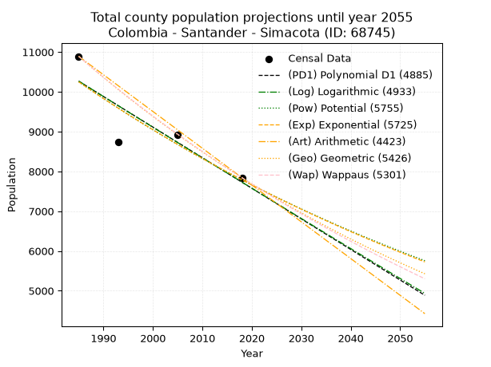
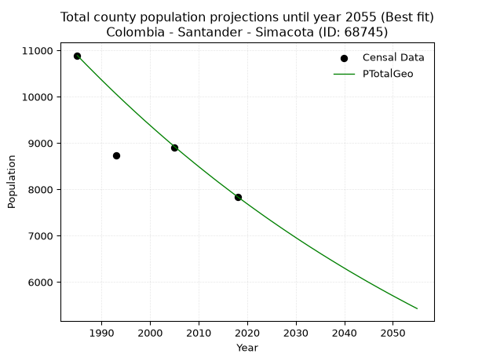
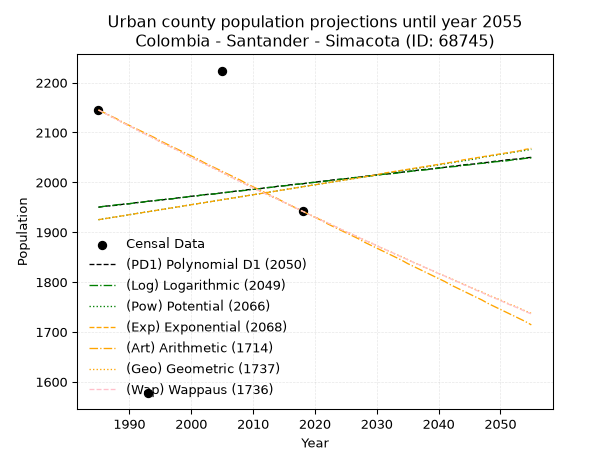
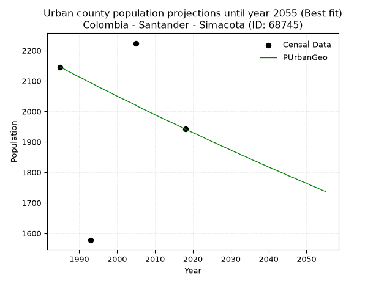
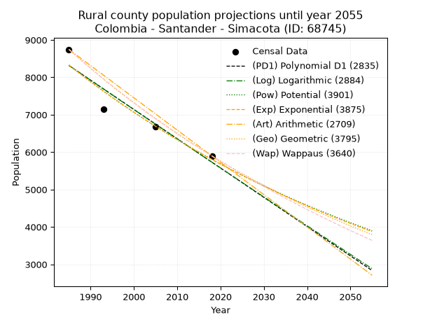
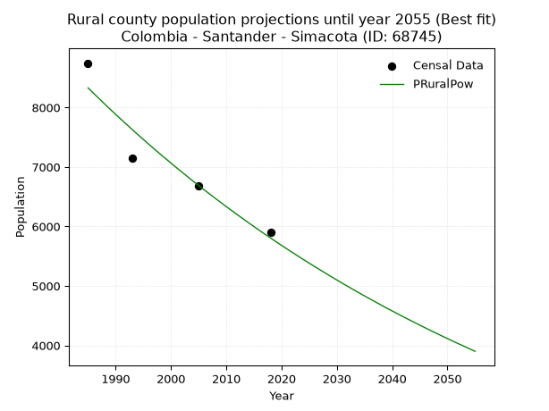

<div align="center">


</div>

# _“Population and Public Services Demand Projections (PPSD) until Year 2050 for Colombia - Santander - Simacota (ID: 68745)”_
Keywords: `population` `public-service` `projection` `lineal` `polynomial` `logarithmic` `potential` `exponential` `arithmetic` `geometric` `wappaus` `dane` `colombia` `south-america`

PPSD are analytical estimates used by governments and planners to anticipate future changes in population size, age distribution, and the resulting community needs for utilities, healthcare, education, and infrastructure as sizing future water treatment facilities, electrical grids, and road networks based on spatial growth.

> **General running parameters**: • app_version: _v20260806_. • Python version: _3.14.7_. • Pandas version: _3.0.5_. • NumPy version: _2.5.1_. • Creates, save and include plots into reports (create_plot): _False_. • Projection until year: _2050_. • Process polynomial degree 2 and up: _False_. • Process Wappaus: _True_. • Process Wappaus: _True_. • Set negative values to zero: _True_. • Set infinite values to zero: _True_. • Drop dataset notes: _True_. 
<div align="center">

Dynamic map: [:earth_americas:Google](http://maps.google.com/maps?q=6.443468585,-73.337368) [:earth_americas:OSM](https://www.openstreetmap.org/#map=18/6.443468585/-73.337368&layers=P) [:earth_americas:Bing](https://www.bing.com/maps?cp=6.443468585~-73.337368&lvl=18) [:earth_americas:Apple](https://maps.apple.com/frame?center=6.443468585%2C-73.337368&span=0.003%2C0.006)

</div>


<div align="center">

```geojson
{
  "type": "Feature",
  "geometry": {
    "type": "Point", 
    "coordinates": [-73.337368, 6.443468585]
  }, 
  "properties": {
    "Name": "Colombia - Santander - Simacota (ID: 68745)"
  }
}
```

</div>


## 0. Census Data (4 records)

Census data are official statistics collected by a government about the people and housing in a country. They usually include counts of total population, age, sex, race, income, education, and jobs.

📅Global census file: [Population.xlsx](../data/Population.xlsx)

| Source   |   Year |   CountryID | CountryName   |   StateID | StateName   |   CountyID | CountyName   |   PTotal |   PUrban |   PRural |
|:---------|-------:|------------:|:--------------|----------:|:------------|-----------:|:-------------|---------:|---------:|---------:|
| DANE     |   1985 |          57 | Colombia      |        68 | Santander   |      68745 | Simacota     |    10891 |     2145 |     8746 |
| DANE     |   1993 |          57 | Colombia      |        68 | Santander   |      68745 | Simacota     |     8731 |     1577 |     7154 |
| DANE     |   2005 |          57 | Colombia      |        68 | Santander   |      68745 | Simacota     |     8910 |     2224 |     6686 |
| DANE     |   2018 |          57 | Colombia      |        68 | Santander   |      68745 | Simacota     |     7842 |     1942 |     5900 |

> 🔥Some records could had specific notes about the registered values or the corresponding urban or rural distribution.

**Local public utility companies (RUPS)**

 | SERVICIO       | ESTADO    | NOMBRE                                                                                              | NIT         | DEPARTAMENTO_DOMICILIO   | MUNICIPIO_DOMICILIO   | DIRECCION                     |   TELEFONO | EMAIL                   | TIPO_INSCRIPCION    | REPRESENTANTE_LEGAL        | TIPO_PRESTADOR                             | CLASIFICACION                 |
|:---------------|:----------|:----------------------------------------------------------------------------------------------------|:------------|:-------------------------|:----------------------|:------------------------------|-----------:|:------------------------|:--------------------|:---------------------------|:-------------------------------------------|:------------------------------|
| ASEO           | OPERATIVA | ACUASAN E.I.C.E  E.S.P                                                                              | 800120175-7 | SANTANDER                | SAN GIL               | KM 1 VIA AL AEROPUERTO        |    7242590 | celsodiaz09@hotmail.com | Registro por la ESP | LUIS FRANCISCO RUIZ CEDIEL | EMPRESA INDUSTRIAL Y COMERCIAL DEL ESTADO  | MAYOR O IGUAL A 5001 USUARIOS |
| ACUEDUCTO      | OPERATIVA | ADMINISTRACION PUBLICA COOPERATIVA DEL MUNICIPIO DE SIMACOTA SANTANDER SIMSACOOP APC                | 900303113-1 | SANTANDER                | SIMACOTA              | calle 3 A No.6-65             |    7261507 | miye-2587@hotmail.com   | Registro por la ESP | MIREYA ARDILA GUTIERREZ    | ORGANIZACION AUTORIZADA                    | MENOR O IGUAL A 2500 USUARIOS |
| ALCANTARILLADO | OPERATIVA | ADMINISTRACION PUBLICA COOPERATIVA DEL MUNICIPIO DE SIMACOTA SANTANDER SIMSACOOP APC                | 900303113-1 | SANTANDER                | SIMACOTA              | calle 3 A No.6-65             |    7261507 | miye-2587@hotmail.com   | Registro por la ESP | MIREYA ARDILA GUTIERREZ    | ORGANIZACION AUTORIZADA                    | MENOR O IGUAL A 2500 USUARIOS |
| ASEO           | OPERATIVA | ADMINISTRACION PUBLICA COOPERATIVA DEL MUNICIPIO DE SIMACOTA SANTANDER SIMSACOOP APC                | 900303113-1 | SANTANDER                | SIMACOTA              | calle 3 A No.6-65             |    7261507 | miye-2587@hotmail.com   | Registro por la ESP | MIREYA ARDILA GUTIERREZ    | ORGANIZACION AUTORIZADA                    | MENOR O IGUAL A 2500 USUARIOS |
| ASEO           | OPERATIVA | EMPRESA DE SOLUCIONES AMBIENTALES PARA COLOMBIA S.A E.S.P.                                          | 900508526-9 | SANTANDER                | SAN GIL               | VEREDA EL CUCHARO             |    7273772 | empsacol@hotmail.com    | Registro por la ESP | JHONNATHAN VESGA PALOMINO  | SOCIEDADES (EMPRESA DE SERVICIOS PUBLICOS) | MENOR O IGUAL A 2500 USUARIOS |
| ACUEDUCTO      | OPERATIVA | CORPORACION DE SERVICIO DE ACUEDUCTO DE LAS VEREDAS LLANITA Y LLANOGRANDE DEL MUNICIPIO DE SIMACOTA | 804013937-9 | SANTANDER                | SIMACOTA              | VEREDAS LLANITA Y LLANOGRANDE |    7273010 | frezuli@gmail.com       | Registro por la ESP | LUISA LILIANA CALA SANCHEZ | ORGANIZACION AUTORIZADA                    | MENOR O IGUAL A 2500 USUARIOS |

> [📅RUPS Database: Registro Único de Prestadores de Servicios Públicos de Colombia Suramérica - RUPS](https://www.datos.gov.co/Hacienda-y-Cr-dito-P-blico/Registro-nico-de-Prestadores-de-Servicios-P-blicos/4qkq-csdn/about_data)

## 1. Total

### 1.1. Coefficients and Parameters

* (PD1) Polynomial Deg 1: -76.86792452830117, 162848.56603773442 (lineal)
* (Log) Logarithmic: -153970.70194383335, 1179426.0393188477
* (Pow) Potential: -16.661627768824957, 58.95690590755766
* (Exp) Exponential: -0.008319262150456044, 152240995586.82974
* (Art) Arithmetic: Year diff. 2018 - 1985 = 33, Population diff. 7842 - 10891 = -3049, Annual growth = -92.39393939393939
* (Geo) Geometric: Year diff. 2018 - 1985 = 33, Population diff. 7842 - 10891 = -3049, Annual growth % = -0.009903448483862487
* (Wap) Wappaus: i = -0.9864297164782938, Condition values only valid for < 200)

<sub>
Wappaus condition values: ['-0.00', '-0.99', '-1.97', '-2.96', '-3.95', '-4.93', '-5.92', '-6.91', '-7.89', '-8.88', '-9.86', '-10.85', '-11.84', '-12.82', '-13.81', '-14.80', '-15.78', '-16.77', '-17.76', '-18.74', '-19.73', '-20.72', '-21.70', '-22.69', '-23.67', '-24.66', '-25.65', '-26.63', '-27.62', '-28.61', '-29.59', '-30.58', '-31.57', '-32.55', '-33.54', '-34.53', '-35.51', '-36.50', '-37.48', '-38.47', '-39.46', '-40.44', '-41.43', '-42.42', '-43.40', '-44.39', '-45.38', '-46.36', '-47.35', '-48.34', '-49.32', '-50.31', '-51.29', '-52.28', '-53.27', '-54.25', '-55.24', '-56.23', '-57.21', '-58.20', '-59.19', '-60.17', '-61.16', '-62.15', '-63.13', '-64.12']
</sub>


### 1.2. Projected Dataset

|   Year |   CountyID |   PTotalPD1 |   PTotalLog |   PTotalPow |   PTotalExp |   PTotalArt |   PTotalGeo |   PTotalWap |
|-------:|-----------:|------------:|------------:|------------:|------------:|------------:|------------:|------------:|
|   1985 |      68745 |       10266 |       10269 |       10253 |       10250 |       10891 |       10891 |       10891 |
|   1986 |      68745 |       10189 |       10191 |       10167 |       10165 |       10799 |       10783 |       10784 |
|   1987 |      68745 |       10112 |       10114 |       10082 |       10080 |       10706 |       10676 |       10678 |
|   1988 |      68745 |       10035 |       10036 |        9998 |        9997 |       10614 |       10571 |       10573 |
|   1989 |      68745 |        9958 |        9959 |        9915 |        9914 |       10521 |       10466 |       10470 |
|   1990 |      68745 |        9881 |        9882 |        9832 |        9832 |       10429 |       10362 |       10367 |
|   1991 |      68745 |        9805 |        9804 |        9750 |        9751 |       10337 |       10260 |       10265 |
|   1992 |      68745 |        9728 |        9727 |        9669 |        9670 |       10244 |       10158 |       10164 |
|   1993 |      68745 |        9651 |        9650 |        9588 |        9590 |       10152 |       10057 |       10064 |
|   1994 |      68745 |        9574 |        9572 |        9509 |        9510 |       10059 |        9958 |        9965 |
|   1995 |      68745 |        9497 |        9495 |        9429 |        9431 |        9967 |        9859 |        9867 |
|   1996 |      68745 |        9420 |        9418 |        9351 |        9353 |        9875 |        9762 |        9770 |
|   1997 |      68745 |        9343 |        9341 |        9273 |        9276 |        9782 |        9665 |        9674 |
|   1998 |      68745 |        9266 |        9264 |        9196 |        9199 |        9690 |        9569 |        9579 |
|   1999 |      68745 |        9190 |        9187 |        9120 |        9123 |        9597 |        9474 |        9484 |
|   2000 |      68745 |        9113 |        9110 |        9044 |        9047 |        9505 |        9381 |        9391 |
|   2001 |      68745 |        9036 |        9033 |        8969 |        8972 |        9413 |        9288 |        9298 |
|   2002 |      68745 |        8959 |        8956 |        8895 |        8898 |        9320 |        9196 |        9206 |
|   2003 |      68745 |        8882 |        8879 |        8821 |        8824 |        9228 |        9105 |        9115 |
|   2004 |      68745 |        8805 |        8802 |        8748 |        8751 |        9136 |        9014 |        9025 |
|   2005 |      68745 |        8728 |        8725 |        8676 |        8679 |        9043 |        8925 |        8935 |
|   2006 |      68745 |        8652 |        8649 |        8604 |        8607 |        8951 |        8837 |        8847 |
|   2007 |      68745 |        8575 |        8572 |        8533 |        8535 |        8858 |        8749 |        8759 |
|   2008 |      68745 |        8498 |        8495 |        8462 |        8465 |        8766 |        8663 |        8672 |
|   2009 |      68745 |        8421 |        8418 |        8392 |        8395 |        8674 |        8577 |        8586 |
|   2010 |      68745 |        8344 |        8342 |        8323 |        8325 |        8581 |        8492 |        8500 |
|   2011 |      68745 |        8267 |        8265 |        8254 |        8256 |        8489 |        8408 |        8415 |
|   2012 |      68745 |        8190 |        8189 |        8186 |        8188 |        8396 |        8325 |        8331 |
|   2013 |      68745 |        8113 |        8112 |        8119 |        8120 |        8304 |        8242 |        8248 |
|   2014 |      68745 |        8037 |        8036 |        8052 |        8052 |        8212 |        8160 |        8165 |
|   2015 |      68745 |        7960 |        7959 |        7986 |        7986 |        8119 |        8080 |        8083 |
|   2016 |      68745 |        7883 |        7883 |        7920 |        7920 |        8027 |        8000 |        8002 |
|   2017 |      68745 |        7806 |        7807 |        7855 |        7854 |        7934 |        7920 |        7922 |
|   2018 |      68745 |        7729 |        7730 |        7790 |        7789 |        7842 |        7842 |        7842 |
|   2019 |      68745 |        7652 |        7654 |        7726 |        7724 |        7750 |        7764 |        7763 |
|   2020 |      68745 |        7575 |        7578 |        7663 |        7660 |        7657 |        7687 |        7684 |
|   2021 |      68745 |        7498 |        7501 |        7600 |        7597 |        7565 |        7611 |        7607 |
|   2022 |      68745 |        7422 |        7425 |        7537 |        7534 |        7472 |        7536 |        7529 |
|   2023 |      68745 |        7345 |        7349 |        7475 |        7472 |        7380 |        7461 |        7453 |
|   2024 |      68745 |        7268 |        7273 |        7414 |        7410 |        7288 |        7387 |        7377 |
|   2025 |      68745 |        7191 |        7197 |        7353 |        7348 |        7195 |        7314 |        7302 |
|   2026 |      68745 |        7114 |        7121 |        7293 |        7287 |        7103 |        7242 |        7227 |
|   2027 |      68745 |        7037 |        7045 |        7233 |        7227 |        7010 |        7170 |        7153 |
|   2028 |      68745 |        6960 |        6969 |        7174 |        7167 |        6918 |        7099 |        7080 |
|   2029 |      68745 |        6884 |        6893 |        7115 |        7108 |        6826 |        7029 |        7007 |
|   2030 |      68745 |        6807 |        6817 |        7057 |        7049 |        6733 |        6959 |        6935 |
|   2031 |      68745 |        6730 |        6742 |        7000 |        6991 |        6641 |        6890 |        6863 |
|   2032 |      68745 |        6653 |        6666 |        6942 |        6933 |        6548 |        6822 |        6792 |
|   2033 |      68745 |        6576 |        6590 |        6886 |        6875 |        6456 |        6754 |        6721 |
|   2034 |      68745 |        6499 |        6514 |        6830 |        6818 |        6364 |        6688 |        6651 |
|   2035 |      68745 |        6422 |        6439 |        6774 |        6762 |        6271 |        6621 |        6582 |
|   2036 |      68745 |        6345 |        6363 |        6719 |        6706 |        6179 |        6556 |        6513 |
|   2037 |      68745 |        6269 |        6287 |        6664 |        6650 |        6087 |        6491 |        6445 |
|   2038 |      68745 |        6192 |        6212 |        6610 |        6595 |        5994 |        6427 |        6377 |
|   2039 |      68745 |        6115 |        6136 |        6556 |        6540 |        5902 |        6363 |        6310 |
|   2040 |      68745 |        6038 |        6061 |        6502 |        6486 |        5809 |        6300 |        6243 |
|   2041 |      68745 |        5961 |        5985 |        6450 |        6432 |        5717 |        6237 |        6177 |
|   2042 |      68745 |        5884 |        5910 |        6397 |        6379 |        5625 |        6176 |        6111 |
|   2043 |      68745 |        5807 |        5834 |        6345 |        6326 |        5532 |        6115 |        6046 |
|   2044 |      68745 |        5731 |        5759 |        6294 |        6274 |        5440 |        6054 |        5981 |
|   2045 |      68745 |        5654 |        5684 |        6243 |        6222 |        5347 |        5994 |        5917 |
|   2046 |      68745 |        5577 |        5609 |        6192 |        6170 |        5255 |        5935 |        5853 |
|   2047 |      68745 |        5500 |        5533 |        6142 |        6119 |        5163 |        5876 |        5790 |
|   2048 |      68745 |        5423 |        5458 |        6092 |        6069 |        5070 |        5818 |        5727 |
|   2049 |      68745 |        5346 |        5383 |        6043 |        6018 |        4978 |        5760 |        5665 |
|   2050 |      68745 |        5269 |        5308 |        5994 |        5968 |        4885 |        5703 |        5603 |
<div align="center">

</img>

</div>


### 1.3. Best fit with absolute and relative error (%)

Relative error puts that difference into context by dividing the absolute error by the true value, creating a unitless ratio or percentage that shows the scale of the mistake.

Absolute and relative error

|   Year | Source   |   CountryID | CountryName   |   StateID | StateName   |   CountyID_x | CountyName   |   PTotal |   PUrban |   PRural |   CountyID_y |   PTotalPD1 |   PTotalLog |   PTotalPow |   PTotalExp |   PTotalArt |   PTotalGeo |   PTotalWap |   PTotalPD1AbsError |   PTotalLogAbsError |   PTotalPowAbsError |   PTotalExpAbsError |   PTotalArtAbsError |   PTotalGeoAbsError |   PTotalWapAbsError |   PTotalPD1RelError |   PTotalLogRelError |   PTotalPowRelError |   PTotalExpRelError |   PTotalArtRelError |   PTotalGeoRelError |   PTotalWapRelError |
|-------:|:---------|------------:|:--------------|----------:|:------------|-------------:|:-------------|---------:|---------:|---------:|-------------:|------------:|------------:|------------:|------------:|------------:|------------:|------------:|--------------------:|--------------------:|--------------------:|--------------------:|--------------------:|--------------------:|--------------------:|--------------------:|--------------------:|--------------------:|--------------------:|--------------------:|--------------------:|--------------------:|
|   1985 | DANE     |          57 | Colombia      |        68 | Santander   |        68745 | Simacota     |    10891 |     2145 |     8746 |        68745 |       10266 |       10269 |       10253 |       10250 |       10891 |       10891 |       10891 |                 625 |                 622 |                 638 |                 641 |                   0 |                   0 |                   0 |             5.73868 |             5.71114 |            5.85805  |            5.88559  |              0      |             0       |            0        |
|   1993 | DANE     |          57 | Colombia      |        68 | Santander   |        68745 | Simacota     |     8731 |     1577 |     7154 |        68745 |        9651 |        9650 |        9588 |        9590 |       10152 |       10057 |       10064 |                 920 |                 919 |                 857 |                 859 |                1421 |                1326 |                1333 |            10.5372  |            10.5257  |            9.8156   |            9.83851  |             16.2753 |            15.1873  |           15.2674   |
|   2005 | DANE     |          57 | Colombia      |        68 | Santander   |        68745 | Simacota     |     8910 |     2224 |     6686 |        68745 |        8728 |        8725 |        8676 |        8679 |        9043 |        8925 |        8935 |                 182 |                 185 |                 234 |                 231 |                 133 |                  15 |                  25 |             2.04265 |             2.07632 |            2.62626  |            2.59259  |              1.4927 |             0.16835 |            0.280584 |
|   2018 | DANE     |          57 | Colombia      |        68 | Santander   |        68745 | Simacota     |     7842 |     1942 |     5900 |        68745 |        7729 |        7730 |        7790 |        7789 |        7842 |        7842 |        7842 |                 113 |                 112 |                  52 |                  53 |                   0 |                   0 |                   0 |             1.44096 |             1.42821 |            0.663096 |            0.675848 |              0      |             0       |            0        |

Relative error mean

| Method    |   RelError | Best   |
|:----------|-----------:|:-------|
| PTotalPD1 |    4.93986 |        |
| PTotalLog |    4.93534 |        |
| PTotalPow |    4.74075 |        |
| PTotalExp |    4.74814 |        |
| PTotalArt |    4.44201 |        |
| PTotalGeo |    3.8389  | True   |
| PTotalWap |    3.88701 |        |

💙Best method: _**PTotalGeo**_
<div align="center">

</img>

</div>


### 1.4. Fresh water supply demand in liters per capita per day (lpcd)

The fresh water supply demand typically ranges from 100 to 300 liters per capita per day (lpcd) for standard domestic and municipal planning, though absolute survival minimums set by the World Health Organization are as low as 7.5 to 20 liters per day, and total consumption in high-income nations can exceed 400 liters.

> `CZ`: Level in meters above the sea level (masl)<br> `WS`: Fresh water supply demand in liters per capita per day (lpcd or l/h/d)<br> `WSAll`: Zonal fresh water supply demand in liters per second (l/s)<br> `A`: Zonal area in square meters<br> `DP`: Population density (people/hectare or p/ha)

Reference values (RAS Colombia)

|    CZ |   WS |
|------:|-----:|
|  1000 |  120 |
|  2000 |  130 |
| 99999 |  140 |

County shapefile geometry properties and water supply values

|   CountyID |      ATotal |   CZTotal |   WSTotal |
|-----------:|------------:|----------:|----------:|
|      68745 | 9.03359e+08 |   642.735 |       120 |

Projected values for best method: PTotalGeo

|   CountyID |   Year |   PTotalGeo |   DPTotal |   WSTotal |   WSTotalAll |
|-----------:|-------:|------------:|----------:|----------:|-------------:|
|      68745 |   1985 |       10891 |      0.12 |       120 |     15.1264  |
|      68745 |   1986 |       10783 |      0.12 |       120 |     14.9764  |
|      68745 |   1987 |       10676 |      0.12 |       120 |     14.8278  |
|      68745 |   1988 |       10571 |      0.12 |       120 |     14.6819  |
|      68745 |   1989 |       10466 |      0.12 |       120 |     14.5361  |
|      68745 |   1990 |       10362 |      0.11 |       120 |     14.3917  |
|      68745 |   1991 |       10260 |      0.11 |       120 |     14.25    |
|      68745 |   1992 |       10158 |      0.11 |       120 |     14.1083  |
|      68745 |   1993 |       10057 |      0.11 |       120 |     13.9681  |
|      68745 |   1994 |        9958 |      0.11 |       120 |     13.8306  |
|      68745 |   1995 |        9859 |      0.11 |       120 |     13.6931  |
|      68745 |   1996 |        9762 |      0.11 |       120 |     13.5583  |
|      68745 |   1997 |        9665 |      0.11 |       120 |     13.4236  |
|      68745 |   1998 |        9569 |      0.11 |       120 |     13.2903  |
|      68745 |   1999 |        9474 |      0.1  |       120 |     13.1583  |
|      68745 |   2000 |        9381 |      0.1  |       120 |     13.0292  |
|      68745 |   2001 |        9288 |      0.1  |       120 |     12.9     |
|      68745 |   2002 |        9196 |      0.1  |       120 |     12.7722  |
|      68745 |   2003 |        9105 |      0.1  |       120 |     12.6458  |
|      68745 |   2004 |        9014 |      0.1  |       120 |     12.5194  |
|      68745 |   2005 |        8925 |      0.1  |       120 |     12.3958  |
|      68745 |   2006 |        8837 |      0.1  |       120 |     12.2736  |
|      68745 |   2007 |        8749 |      0.1  |       120 |     12.1514  |
|      68745 |   2008 |        8663 |      0.1  |       120 |     12.0319  |
|      68745 |   2009 |        8577 |      0.09 |       120 |     11.9125  |
|      68745 |   2010 |        8492 |      0.09 |       120 |     11.7944  |
|      68745 |   2011 |        8408 |      0.09 |       120 |     11.6778  |
|      68745 |   2012 |        8325 |      0.09 |       120 |     11.5625  |
|      68745 |   2013 |        8242 |      0.09 |       120 |     11.4472  |
|      68745 |   2014 |        8160 |      0.09 |       120 |     11.3333  |
|      68745 |   2015 |        8080 |      0.09 |       120 |     11.2222  |
|      68745 |   2016 |        8000 |      0.09 |       120 |     11.1111  |
|      68745 |   2017 |        7920 |      0.09 |       120 |     11       |
|      68745 |   2018 |        7842 |      0.09 |       120 |     10.8917  |
|      68745 |   2019 |        7764 |      0.09 |       120 |     10.7833  |
|      68745 |   2020 |        7687 |      0.09 |       120 |     10.6764  |
|      68745 |   2021 |        7611 |      0.08 |       120 |     10.5708  |
|      68745 |   2022 |        7536 |      0.08 |       120 |     10.4667  |
|      68745 |   2023 |        7461 |      0.08 |       120 |     10.3625  |
|      68745 |   2024 |        7387 |      0.08 |       120 |     10.2597  |
|      68745 |   2025 |        7314 |      0.08 |       120 |     10.1583  |
|      68745 |   2026 |        7242 |      0.08 |       120 |     10.0583  |
|      68745 |   2027 |        7170 |      0.08 |       120 |      9.95833 |
|      68745 |   2028 |        7099 |      0.08 |       120 |      9.85972 |
|      68745 |   2029 |        7029 |      0.08 |       120 |      9.7625  |
|      68745 |   2030 |        6959 |      0.08 |       120 |      9.66528 |
|      68745 |   2031 |        6890 |      0.08 |       120 |      9.56944 |
|      68745 |   2032 |        6822 |      0.08 |       120 |      9.475   |
|      68745 |   2033 |        6754 |      0.07 |       120 |      9.38056 |
|      68745 |   2034 |        6688 |      0.07 |       120 |      9.28889 |
|      68745 |   2035 |        6621 |      0.07 |       120 |      9.19583 |
|      68745 |   2036 |        6556 |      0.07 |       120 |      9.10556 |
|      68745 |   2037 |        6491 |      0.07 |       120 |      9.01528 |
|      68745 |   2038 |        6427 |      0.07 |       120 |      8.92639 |
|      68745 |   2039 |        6363 |      0.07 |       120 |      8.8375  |
|      68745 |   2040 |        6300 |      0.07 |       120 |      8.75    |
|      68745 |   2041 |        6237 |      0.07 |       120 |      8.6625  |
|      68745 |   2042 |        6176 |      0.07 |       120 |      8.57778 |
|      68745 |   2043 |        6115 |      0.07 |       120 |      8.49306 |
|      68745 |   2044 |        6054 |      0.07 |       120 |      8.40833 |
|      68745 |   2045 |        5994 |      0.07 |       120 |      8.325   |
|      68745 |   2046 |        5935 |      0.07 |       120 |      8.24306 |
|      68745 |   2047 |        5876 |      0.07 |       120 |      8.16111 |
|      68745 |   2048 |        5818 |      0.06 |       120 |      8.08056 |
|      68745 |   2049 |        5760 |      0.06 |       120 |      8       |
|      68745 |   2050 |        5703 |      0.06 |       120 |      7.92083 |

## 2. Urban

### 2.1. Coefficients and Parameters

* (PD1) Polynomial Deg 1: 1.4291449217183227, -886.6471296670744 (lineal)
* (Log) Logarithmic: 2849.793174149237, -19689.30075351763
* (Pow) Potential: 2.0407757306078897, -3.4455947037978647
* (Exp) Exponential: 0.001023334719173879, 252.4598960583154
* (Art) Arithmetic: Year diff. 2018 - 1985 = 33, Population diff. 1942 - 2145 = -203, Annual growth = -6.151515151515151
* (Geo) Geometric: Year diff. 2018 - 1985 = 33, Population diff. 1942 - 2145 = -203, Annual growth % = -0.003008229289869657
* (Wap) Wappaus: i = -0.3010283900912724, Condition values only valid for < 200)

<sub>
Wappaus condition values: ['-0.00', '-0.30', '-0.60', '-0.90', '-1.20', '-1.51', '-1.81', '-2.11', '-2.41', '-2.71', '-3.01', '-3.31', '-3.61', '-3.91', '-4.21', '-4.52', '-4.82', '-5.12', '-5.42', '-5.72', '-6.02', '-6.32', '-6.62', '-6.92', '-7.22', '-7.53', '-7.83', '-8.13', '-8.43', '-8.73', '-9.03', '-9.33', '-9.63', '-9.93', '-10.23', '-10.54', '-10.84', '-11.14', '-11.44', '-11.74', '-12.04', '-12.34', '-12.64', '-12.94', '-13.25', '-13.55', '-13.85', '-14.15', '-14.45', '-14.75', '-15.05', '-15.35', '-15.65', '-15.95', '-16.26', '-16.56', '-16.86', '-17.16', '-17.46', '-17.76', '-18.06', '-18.36', '-18.66', '-18.96', '-19.27', '-19.57']
</sub>


### 2.2. Projected Dataset

|   Year |   CountyID |   PUrbanPD1 |   PUrbanLog |   PUrbanPow |   PUrbanExp |   PUrbanArt |   PUrbanGeo |   PUrbanWap |
|-------:|-----------:|------------:|------------:|------------:|------------:|------------:|------------:|------------:|
|   1985 |      68745 |        1950 |        1950 |        1925 |        1925 |        2145 |        2145 |        2145 |
|   1986 |      68745 |        1952 |        1952 |        1927 |        1927 |        2139 |        2139 |        2139 |
|   1987 |      68745 |        1953 |        1953 |        1929 |        1929 |        2133 |        2132 |        2132 |
|   1988 |      68745 |        1954 |        1955 |        1931 |        1931 |        2127 |        2126 |        2126 |
|   1989 |      68745 |        1956 |        1956 |        1933 |        1933 |        2120 |        2119 |        2119 |
|   1990 |      68745 |        1957 |        1957 |        1935 |        1935 |        2114 |        2113 |        2113 |
|   1991 |      68745 |        1959 |        1959 |        1937 |        1937 |        2108 |        2107 |        2107 |
|   1992 |      68745 |        1960 |        1960 |        1939 |        1939 |        2102 |        2100 |        2100 |
|   1993 |      68745 |        1962 |        1962 |        1941 |        1941 |        2096 |        2094 |        2094 |
|   1994 |      68745 |        1963 |        1963 |        1943 |        1943 |        2090 |        2088 |        2088 |
|   1995 |      68745 |        1964 |        1965 |        1945 |        1945 |        2083 |        2081 |        2081 |
|   1996 |      68745 |        1966 |        1966 |        1947 |        1947 |        2077 |        2075 |        2075 |
|   1997 |      68745 |        1967 |        1967 |        1949 |        1949 |        2071 |        2069 |        2069 |
|   1998 |      68745 |        1969 |        1969 |        1951 |        1951 |        2065 |        2063 |        2063 |
|   1999 |      68745 |        1970 |        1970 |        1953 |        1953 |        2059 |        2056 |        2056 |
|   2000 |      68745 |        1972 |        1972 |        1955 |        1955 |        2053 |        2050 |        2050 |
|   2001 |      68745 |        1973 |        1973 |        1957 |        1957 |        2047 |        2044 |        2044 |
|   2002 |      68745 |        1975 |        1975 |        1959 |        1959 |        2040 |        2038 |        2038 |
|   2003 |      68745 |        1976 |        1976 |        1961 |        1961 |        2034 |        2032 |        2032 |
|   2004 |      68745 |        1977 |        1977 |        1963 |        1963 |        2028 |        2026 |        2026 |
|   2005 |      68745 |        1979 |        1979 |        1965 |        1965 |        2022 |        2020 |        2020 |
|   2006 |      68745 |        1980 |        1980 |        1967 |        1967 |        2016 |        2013 |        2014 |
|   2007 |      68745 |        1982 |        1982 |        1969 |        1969 |        2010 |        2007 |        2007 |
|   2008 |      68745 |        1983 |        1983 |        1971 |        1971 |        2004 |        2001 |        2001 |
|   2009 |      68745 |        1985 |        1984 |        1973 |        1973 |        1997 |        1995 |        1995 |
|   2010 |      68745 |        1986 |        1986 |        1975 |        1975 |        1991 |        1989 |        1989 |
|   2011 |      68745 |        1987 |        1987 |        1977 |        1977 |        1985 |        1983 |        1983 |
|   2012 |      68745 |        1989 |        1989 |        1979 |        1979 |        1979 |        1977 |        1977 |
|   2013 |      68745 |        1990 |        1990 |        1981 |        1981 |        1973 |        1971 |        1972 |
|   2014 |      68745 |        1992 |        1992 |        1983 |        1983 |        1967 |        1966 |        1966 |
|   2015 |      68745 |        1993 |        1993 |        1985 |        1985 |        1960 |        1960 |        1960 |
|   2016 |      68745 |        1995 |        1994 |        1987 |        1987 |        1954 |        1954 |        1954 |
|   2017 |      68745 |        1996 |        1996 |        1989 |        1989 |        1948 |        1948 |        1948 |
|   2018 |      68745 |        1997 |        1997 |        1991 |        1991 |        1942 |        1942 |        1942 |
|   2019 |      68745 |        1999 |        1999 |        1993 |        1993 |        1936 |        1936 |        1936 |
|   2020 |      68745 |        2000 |        2000 |        1995 |        1995 |        1930 |        1930 |        1930 |
|   2021 |      68745 |        2002 |        2001 |        1997 |        1997 |        1924 |        1925 |        1924 |
|   2022 |      68745 |        2003 |        2003 |        1999 |        1999 |        1917 |        1919 |        1919 |
|   2023 |      68745 |        2005 |        2004 |        2001 |        2001 |        1911 |        1913 |        1913 |
|   2024 |      68745 |        2006 |        2006 |        2003 |        2003 |        1905 |        1907 |        1907 |
|   2025 |      68745 |        2007 |        2007 |        2005 |        2005 |        1899 |        1901 |        1901 |
|   2026 |      68745 |        2009 |        2009 |        2007 |        2007 |        1893 |        1896 |        1896 |
|   2027 |      68745 |        2010 |        2010 |        2009 |        2009 |        1887 |        1890 |        1890 |
|   2028 |      68745 |        2012 |        2011 |        2011 |        2011 |        1880 |        1884 |        1884 |
|   2029 |      68745 |        2013 |        2013 |        2013 |        2013 |        1874 |        1879 |        1879 |
|   2030 |      68745 |        2015 |        2014 |        2015 |        2015 |        1868 |        1873 |        1873 |
|   2031 |      68745 |        2016 |        2016 |        2017 |        2018 |        1862 |        1867 |        1867 |
|   2032 |      68745 |        2017 |        2017 |        2019 |        2020 |        1856 |        1862 |        1862 |
|   2033 |      68745 |        2019 |        2018 |        2021 |        2022 |        1850 |        1856 |        1856 |
|   2034 |      68745 |        2020 |        2020 |        2023 |        2024 |        1844 |        1851 |        1850 |
|   2035 |      68745 |        2022 |        2021 |        2025 |        2026 |        1837 |        1845 |        1845 |
|   2036 |      68745 |        2023 |        2023 |        2027 |        2028 |        1831 |        1839 |        1839 |
|   2037 |      68745 |        2025 |        2024 |        2029 |        2030 |        1825 |        1834 |        1834 |
|   2038 |      68745 |        2026 |        2025 |        2031 |        2032 |        1819 |        1828 |        1828 |
|   2039 |      68745 |        2027 |        2027 |        2033 |        2034 |        1813 |        1823 |        1823 |
|   2040 |      68745 |        2029 |        2028 |        2035 |        2036 |        1807 |        1817 |        1817 |
|   2041 |      68745 |        2030 |        2030 |        2037 |        2038 |        1801 |        1812 |        1812 |
|   2042 |      68745 |        2032 |        2031 |        2039 |        2040 |        1794 |        1807 |        1806 |
|   2043 |      68745 |        2033 |        2032 |        2041 |        2042 |        1788 |        1801 |        1801 |
|   2044 |      68745 |        2035 |        2034 |        2043 |        2045 |        1782 |        1796 |        1795 |
|   2045 |      68745 |        2036 |        2035 |        2045 |        2047 |        1776 |        1790 |        1790 |
|   2046 |      68745 |        2037 |        2037 |        2047 |        2049 |        1770 |        1785 |        1784 |
|   2047 |      68745 |        2039 |        2038 |        2050 |        2051 |        1764 |        1780 |        1779 |
|   2048 |      68745 |        2040 |        2039 |        2052 |        2053 |        1757 |        1774 |        1773 |
|   2049 |      68745 |        2042 |        2041 |        2054 |        2055 |        1751 |        1769 |        1768 |
|   2050 |      68745 |        2043 |        2042 |        2056 |        2057 |        1745 |        1764 |        1763 |
<div align="center">

</img>

</div>


### 2.3. Best fit with absolute and relative error (%)

Relative error puts that difference into context by dividing the absolute error by the true value, creating a unitless ratio or percentage that shows the scale of the mistake.

Absolute and relative error

|   Year | Source   |   CountryID | CountryName   |   StateID | StateName   |   CountyID_x | CountyName   |   PTotal |   PUrban |   PRural |   CountyID_y |   PUrbanPD1 |   PUrbanLog |   PUrbanPow |   PUrbanExp |   PUrbanArt |   PUrbanGeo |   PUrbanWap |   PUrbanPD1AbsError |   PUrbanLogAbsError |   PUrbanPowAbsError |   PUrbanExpAbsError |   PUrbanArtAbsError |   PUrbanGeoAbsError |   PUrbanWapAbsError |   PUrbanPD1RelError |   PUrbanLogRelError |   PUrbanPowRelError |   PUrbanExpRelError |   PUrbanArtRelError |   PUrbanGeoRelError |   PUrbanWapRelError |
|-------:|:---------|------------:|:--------------|----------:|:------------|-------------:|:-------------|---------:|---------:|---------:|-------------:|------------:|------------:|------------:|------------:|------------:|------------:|------------:|--------------------:|--------------------:|--------------------:|--------------------:|--------------------:|--------------------:|--------------------:|--------------------:|--------------------:|--------------------:|--------------------:|--------------------:|--------------------:|--------------------:|
|   1985 | DANE     |          57 | Colombia      |        68 | Santander   |        68745 | Simacota     |    10891 |     2145 |     8746 |        68745 |        1950 |        1950 |        1925 |        1925 |        2145 |        2145 |        2145 |                 195 |                 195 |                 220 |                 220 |                   0 |                   0 |                   0 |             9.09091 |             9.09091 |            10.2564  |            10.2564  |             0       |             0       |             0       |
|   1993 | DANE     |          57 | Colombia      |        68 | Santander   |        68745 | Simacota     |     8731 |     1577 |     7154 |        68745 |        1962 |        1962 |        1941 |        1941 |        2096 |        2094 |        2094 |                 385 |                 385 |                 364 |                 364 |                 519 |                 517 |                 517 |            24.4134  |            24.4134  |            23.0818  |            23.0818  |            32.9106  |            32.7838  |            32.7838  |
|   2005 | DANE     |          57 | Colombia      |        68 | Santander   |        68745 | Simacota     |     8910 |     2224 |     6686 |        68745 |        1979 |        1979 |        1965 |        1965 |        2022 |        2020 |        2020 |                 245 |                 245 |                 259 |                 259 |                 202 |                 204 |                 204 |            11.0162  |            11.0162  |            11.6457  |            11.6457  |             9.08273 |             9.17266 |             9.17266 |
|   2018 | DANE     |          57 | Colombia      |        68 | Santander   |        68745 | Simacota     |     7842 |     1942 |     5900 |        68745 |        1997 |        1997 |        1991 |        1991 |        1942 |        1942 |        1942 |                  55 |                  55 |                  49 |                  49 |                   0 |                   0 |                   0 |             2.83213 |             2.83213 |             2.52317 |             2.52317 |             0       |             0       |             0       |

Relative error mean

| Method    |   RelError | Best   |
|:----------|-----------:|:-------|
| PUrbanPD1 |    11.8382 |        |
| PUrbanLog |    11.8382 |        |
| PUrbanPow |    11.8768 |        |
| PUrbanExp |    11.8768 |        |
| PUrbanArt |    10.4983 |        |
| PUrbanGeo |    10.4891 | True   |
| PUrbanWap |    10.4891 | True   |

💙Best method: _**PUrbanGeo**_
<div align="center">

</img>

</div>


### 2.4. Fresh water supply demand in liters per capita per day (lpcd)

The fresh water supply demand typically ranges from 100 to 300 liters per capita per day (lpcd) for standard domestic and municipal planning, though absolute survival minimums set by the World Health Organization are as low as 7.5 to 20 liters per day, and total consumption in high-income nations can exceed 400 liters.

> `CZ`: Level in meters above the sea level (masl)<br> `WS`: Fresh water supply demand in liters per capita per day (lpcd or l/h/d)<br> `WSAll`: Zonal fresh water supply demand in liters per second (l/s)<br> `A`: Zonal area in square meters<br> `DP`: Population density (people/hectare or p/ha)

Reference values (RAS Colombia)

|    CZ |   WS |
|------:|-----:|
|  1000 |  120 |
|  2000 |  130 |
| 99999 |  140 |

County shapefile geometry properties and water supply values

|   CountyID |   AUrban |   CZUrban |   WSUrban |
|-----------:|---------:|----------:|----------:|
|      68745 |   382796 |   1063.44 |       130 |

Projected values for best method: PUrbanGeo

|   CountyID |   Year |   PUrbanGeo |   DPUrban |   WSUrban |   WSUrbanAll |
|-----------:|-------:|------------:|----------:|----------:|-------------:|
|      68745 |   1985 |        2145 |     56.04 |       130 |      3.22743 |
|      68745 |   1986 |        2139 |     55.88 |       130 |      3.2184  |
|      68745 |   1987 |        2132 |     55.7  |       130 |      3.20787 |
|      68745 |   1988 |        2126 |     55.54 |       130 |      3.19884 |
|      68745 |   1989 |        2119 |     55.36 |       130 |      3.18831 |
|      68745 |   1990 |        2113 |     55.2  |       130 |      3.17928 |
|      68745 |   1991 |        2107 |     55.04 |       130 |      3.17025 |
|      68745 |   1992 |        2100 |     54.86 |       130 |      3.15972 |
|      68745 |   1993 |        2094 |     54.7  |       130 |      3.15069 |
|      68745 |   1994 |        2088 |     54.55 |       130 |      3.14167 |
|      68745 |   1995 |        2081 |     54.36 |       130 |      3.13113 |
|      68745 |   1996 |        2075 |     54.21 |       130 |      3.12211 |
|      68745 |   1997 |        2069 |     54.05 |       130 |      3.11308 |
|      68745 |   1998 |        2063 |     53.89 |       130 |      3.10405 |
|      68745 |   1999 |        2056 |     53.71 |       130 |      3.09352 |
|      68745 |   2000 |        2050 |     53.55 |       130 |      3.08449 |
|      68745 |   2001 |        2044 |     53.4  |       130 |      3.07546 |
|      68745 |   2002 |        2038 |     53.24 |       130 |      3.06644 |
|      68745 |   2003 |        2032 |     53.08 |       130 |      3.05741 |
|      68745 |   2004 |        2026 |     52.93 |       130 |      3.04838 |
|      68745 |   2005 |        2020 |     52.77 |       130 |      3.03935 |
|      68745 |   2006 |        2013 |     52.59 |       130 |      3.02882 |
|      68745 |   2007 |        2007 |     52.43 |       130 |      3.01979 |
|      68745 |   2008 |        2001 |     52.27 |       130 |      3.01076 |
|      68745 |   2009 |        1995 |     52.12 |       130 |      3.00174 |
|      68745 |   2010 |        1989 |     51.96 |       130 |      2.99271 |
|      68745 |   2011 |        1983 |     51.8  |       130 |      2.98368 |
|      68745 |   2012 |        1977 |     51.65 |       130 |      2.97465 |
|      68745 |   2013 |        1971 |     51.49 |       130 |      2.96563 |
|      68745 |   2014 |        1966 |     51.36 |       130 |      2.9581  |
|      68745 |   2015 |        1960 |     51.2  |       130 |      2.94907 |
|      68745 |   2016 |        1954 |     51.05 |       130 |      2.94005 |
|      68745 |   2017 |        1948 |     50.89 |       130 |      2.93102 |
|      68745 |   2018 |        1942 |     50.73 |       130 |      2.92199 |
|      68745 |   2019 |        1936 |     50.58 |       130 |      2.91296 |
|      68745 |   2020 |        1930 |     50.42 |       130 |      2.90394 |
|      68745 |   2021 |        1925 |     50.29 |       130 |      2.89641 |
|      68745 |   2022 |        1919 |     50.13 |       130 |      2.88738 |
|      68745 |   2023 |        1913 |     49.97 |       130 |      2.87836 |
|      68745 |   2024 |        1907 |     49.82 |       130 |      2.86933 |
|      68745 |   2025 |        1901 |     49.66 |       130 |      2.8603  |
|      68745 |   2026 |        1896 |     49.53 |       130 |      2.85278 |
|      68745 |   2027 |        1890 |     49.37 |       130 |      2.84375 |
|      68745 |   2028 |        1884 |     49.22 |       130 |      2.83472 |
|      68745 |   2029 |        1879 |     49.09 |       130 |      2.8272  |
|      68745 |   2030 |        1873 |     48.93 |       130 |      2.81817 |
|      68745 |   2031 |        1867 |     48.77 |       130 |      2.80914 |
|      68745 |   2032 |        1862 |     48.64 |       130 |      2.80162 |
|      68745 |   2033 |        1856 |     48.49 |       130 |      2.79259 |
|      68745 |   2034 |        1851 |     48.35 |       130 |      2.78507 |
|      68745 |   2035 |        1845 |     48.2  |       130 |      2.77604 |
|      68745 |   2036 |        1839 |     48.04 |       130 |      2.76701 |
|      68745 |   2037 |        1834 |     47.91 |       130 |      2.75949 |
|      68745 |   2038 |        1828 |     47.75 |       130 |      2.75046 |
|      68745 |   2039 |        1823 |     47.62 |       130 |      2.74294 |
|      68745 |   2040 |        1817 |     47.47 |       130 |      2.73391 |
|      68745 |   2041 |        1812 |     47.34 |       130 |      2.72639 |
|      68745 |   2042 |        1807 |     47.21 |       130 |      2.71887 |
|      68745 |   2043 |        1801 |     47.05 |       130 |      2.70984 |
|      68745 |   2044 |        1796 |     46.92 |       130 |      2.70231 |
|      68745 |   2045 |        1790 |     46.76 |       130 |      2.69329 |
|      68745 |   2046 |        1785 |     46.63 |       130 |      2.68576 |
|      68745 |   2047 |        1780 |     46.5  |       130 |      2.67824 |
|      68745 |   2048 |        1774 |     46.34 |       130 |      2.66921 |
|      68745 |   2049 |        1769 |     46.21 |       130 |      2.66169 |
|      68745 |   2050 |        1764 |     46.08 |       130 |      2.65417 |

## 3. Rural

### 3.1. Coefficients and Parameters

* (PD1) Polynomial Deg 1: -78.29706945001949, 163735.2131674015 (lineal)
* (Log) Logarithmic: -156820.49511798247, 1199115.3400723643
* (Pow) Potential: -21.886912315702055, 76.09845159367526
* (Exp) Exponential: -0.010929323295870354, 21997353348984.973
* (Art) Arithmetic: Year diff. 2018 - 1985 = 33, Population diff. 5900 - 8746 = -2846, Annual growth = -86.24242424242425
* (Geo) Geometric: Year diff. 2018 - 1985 = 33, Population diff. 5900 - 8746 = -2846, Annual growth % = -0.011857745344502235
* (Wap) Wappaus: i = -1.1776925336941724, Condition values only valid for < 200)

<sub>
Wappaus condition values: ['-0.00', '-1.18', '-2.36', '-3.53', '-4.71', '-5.89', '-7.07', '-8.24', '-9.42', '-10.60', '-11.78', '-12.95', '-14.13', '-15.31', '-16.49', '-17.67', '-18.84', '-20.02', '-21.20', '-22.38', '-23.55', '-24.73', '-25.91', '-27.09', '-28.26', '-29.44', '-30.62', '-31.80', '-32.98', '-34.15', '-35.33', '-36.51', '-37.69', '-38.86', '-40.04', '-41.22', '-42.40', '-43.57', '-44.75', '-45.93', '-47.11', '-48.29', '-49.46', '-50.64', '-51.82', '-53.00', '-54.17', '-55.35', '-56.53', '-57.71', '-58.88', '-60.06', '-61.24', '-62.42', '-63.60', '-64.77', '-65.95', '-67.13', '-68.31', '-69.48', '-70.66', '-71.84', '-73.02', '-74.19', '-75.37', '-76.55']
</sub>


### 3.2. Projected Dataset

|   Year |   CountyID |   PRuralPD1 |   PRuralLog |   PRuralPow |   PRuralExp |   PRuralArt |   PRuralGeo |   PRuralWap |
|-------:|-----------:|------------:|------------:|------------:|------------:|------------:|------------:|------------:|
|   1985 |      68745 |        8316 |        8319 |        8330 |        8327 |        8746 |        8746 |        8746 |
|   1986 |      68745 |        8237 |        8240 |        8239 |        8236 |        8660 |        8642 |        8644 |
|   1987 |      68745 |        8159 |        8161 |        8149 |        8147 |        8574 |        8540 |        8542 |
|   1988 |      68745 |        8081 |        8082 |        8059 |        8058 |        8487 |        8439 |        8442 |
|   1989 |      68745 |        8002 |        8003 |        7971 |        7971 |        8401 |        8338 |        8343 |
|   1990 |      68745 |        7924 |        7924 |        7884 |        7884 |        8315 |        8240 |        8246 |
|   1991 |      68745 |        7846 |        7845 |        7798 |        7798 |        8229 |        8142 |        8149 |
|   1992 |      68745 |        7767 |        7767 |        7713 |        7714 |        8142 |        8045 |        8054 |
|   1993 |      68745 |        7689 |        7688 |        7628 |        7630 |        8056 |        7950 |        7959 |
|   1994 |      68745 |        7611 |        7609 |        7545 |        7547 |        7970 |        7856 |        7866 |
|   1995 |      68745 |        7533 |        7531 |        7463 |        7465 |        7884 |        7763 |        7773 |
|   1996 |      68745 |        7454 |        7452 |        7381 |        7384 |        7797 |        7670 |        7682 |
|   1997 |      68745 |        7376 |        7373 |        7301 |        7303 |        7711 |        7580 |        7592 |
|   1998 |      68745 |        7298 |        7295 |        7221 |        7224 |        7625 |        7490 |        7502 |
|   1999 |      68745 |        7219 |        7216 |        7143 |        7145 |        7539 |        7401 |        7414 |
|   2000 |      68745 |        7141 |        7138 |        7065 |        7068 |        7452 |        7313 |        7326 |
|   2001 |      68745 |        7063 |        7060 |        6988 |        6991 |        7366 |        7226 |        7240 |
|   2002 |      68745 |        6984 |        6981 |        6912 |        6915 |        7280 |        7141 |        7154 |
|   2003 |      68745 |        6906 |        6903 |        6837 |        6840 |        7194 |        7056 |        7070 |
|   2004 |      68745 |        6828 |        6825 |        6762 |        6765 |        7107 |        6972 |        6986 |
|   2005 |      68745 |        6750 |        6746 |        6689 |        6692 |        7021 |        6890 |        6903 |
|   2006 |      68745 |        6671 |        6668 |        6616 |        6619 |        6935 |        6808 |        6821 |
|   2007 |      68745 |        6593 |        6590 |        6545 |        6547 |        6849 |        6727 |        6740 |
|   2008 |      68745 |        6515 |        6512 |        6474 |        6476 |        6762 |        6647 |        6660 |
|   2009 |      68745 |        6436 |        6434 |        6404 |        6406 |        6676 |        6569 |        6580 |
|   2010 |      68745 |        6358 |        6356 |        6334 |        6336 |        6590 |        6491 |        6501 |
|   2011 |      68745 |        6280 |        6278 |        6266 |        6267 |        6504 |        6414 |        6424 |
|   2012 |      68745 |        6202 |        6200 |        6198 |        6199 |        6417 |        6338 |        6346 |
|   2013 |      68745 |        6123 |        6122 |        6131 |        6132 |        6331 |        6263 |        6270 |
|   2014 |      68745 |        6045 |        6044 |        6064 |        6065 |        6245 |        6188 |        6195 |
|   2015 |      68745 |        5967 |        5966 |        5999 |        5999 |        6159 |        6115 |        6120 |
|   2016 |      68745 |        5888 |        5888 |        5934 |        5934 |        6072 |        6042 |        6046 |
|   2017 |      68745 |        5810 |        5811 |        5870 |        5869 |        5986 |        5971 |        5973 |
|   2018 |      68745 |        5732 |        5733 |        5807 |        5806 |        5900 |        5900 |        5900 |
|   2019 |      68745 |        5653 |        5655 |        5744 |        5742 |        5814 |        5830 |        5828 |
|   2020 |      68745 |        5575 |        5578 |        5682 |        5680 |        5728 |        5761 |        5757 |
|   2021 |      68745 |        5497 |        5500 |        5621 |        5618 |        5641 |        5693 |        5687 |
|   2022 |      68745 |        5419 |        5422 |        5560 |        5557 |        5555 |        5625 |        5617 |
|   2023 |      68745 |        5340 |        5345 |        5501 |        5497 |        5469 |        5558 |        5548 |
|   2024 |      68745 |        5262 |        5267 |        5441 |        5437 |        5383 |        5492 |        5479 |
|   2025 |      68745 |        5184 |        5190 |        5383 |        5378 |        5296 |        5427 |        5411 |
|   2026 |      68745 |        5105 |        5113 |        5325 |        5319 |        5210 |        5363 |        5344 |
|   2027 |      68745 |        5027 |        5035 |        5268 |        5262 |        5124 |        5299 |        5278 |
|   2028 |      68745 |        4949 |        4958 |        5211 |        5204 |        5038 |        5237 |        5212 |
|   2029 |      68745 |        4870 |        4880 |        5155 |        5148 |        4951 |        5174 |        5147 |
|   2030 |      68745 |        4792 |        4803 |        5100 |        5092 |        4865 |        5113 |        5082 |
|   2031 |      68745 |        4714 |        4726 |        5045 |        5037 |        4779 |        5052 |        5018 |
|   2032 |      68745 |        4636 |        4649 |        4991 |        4982 |        4693 |        4993 |        4954 |
|   2033 |      68745 |        4557 |        4572 |        4938 |        4928 |        4606 |        4933 |        4891 |
|   2034 |      68745 |        4479 |        4495 |        4885 |        4874 |        4520 |        4875 |        4829 |
|   2035 |      68745 |        4401 |        4417 |        4833 |        4821 |        4434 |        4817 |        4767 |
|   2036 |      68745 |        4322 |        4340 |        4781 |        4769 |        4348 |        4760 |        4706 |
|   2037 |      68745 |        4244 |        4263 |        4730 |        4717 |        4261 |        4704 |        4646 |
|   2038 |      68745 |        4166 |        4186 |        4679 |        4666 |        4175 |        4648 |        4585 |
|   2039 |      68745 |        4087 |        4109 |        4629 |        4615 |        4089 |        4593 |        4526 |
|   2040 |      68745 |        4009 |        4033 |        4580 |        4565 |        4003 |        4538 |        4467 |
|   2041 |      68745 |        3931 |        3956 |        4531 |        4515 |        3916 |        4484 |        4408 |
|   2042 |      68745 |        3853 |        3879 |        4483 |        4466 |        3830 |        4431 |        4350 |
|   2043 |      68745 |        3774 |        3802 |        4435 |        4418 |        3744 |        4379 |        4293 |
|   2044 |      68745 |        3696 |        3725 |        4388 |        4370 |        3658 |        4327 |        4236 |
|   2045 |      68745 |        3618 |        3649 |        4341 |        4322 |        3571 |        4275 |        4179 |
|   2046 |      68745 |        3539 |        3572 |        4295 |        4275 |        3485 |        4225 |        4123 |
|   2047 |      68745 |        3461 |        3495 |        4249 |        4229 |        3399 |        4175 |        4068 |
|   2048 |      68745 |        3383 |        3419 |        4204 |        4183 |        3313 |        4125 |        4013 |
|   2049 |      68745 |        3305 |        3342 |        4159 |        4137 |        3226 |        4076 |        3958 |
|   2050 |      68745 |        3226 |        3266 |        4115 |        4092 |        3140 |        4028 |        3904 |
<div align="center">

</img>

</div>


### 3.3. Best fit with absolute and relative error (%)

Relative error puts that difference into context by dividing the absolute error by the true value, creating a unitless ratio or percentage that shows the scale of the mistake.

Absolute and relative error

|   Year | Source   |   CountryID | CountryName   |   StateID | StateName   |   CountyID_x | CountyName   |   PTotal |   PUrban |   PRural |   CountyID_y |   PRuralPD1 |   PRuralLog |   PRuralPow |   PRuralExp |   PRuralArt |   PRuralGeo |   PRuralWap |   PRuralPD1AbsError |   PRuralLogAbsError |   PRuralPowAbsError |   PRuralExpAbsError |   PRuralArtAbsError |   PRuralGeoAbsError |   PRuralWapAbsError |   PRuralPD1RelError |   PRuralLogRelError |   PRuralPowRelError |   PRuralExpRelError |   PRuralArtRelError |   PRuralGeoRelError |   PRuralWapRelError |
|-------:|:---------|------------:|:--------------|----------:|:------------|-------------:|:-------------|---------:|---------:|---------:|-------------:|------------:|------------:|------------:|------------:|------------:|------------:|------------:|--------------------:|--------------------:|--------------------:|--------------------:|--------------------:|--------------------:|--------------------:|--------------------:|--------------------:|--------------------:|--------------------:|--------------------:|--------------------:|--------------------:|
|   1985 | DANE     |          57 | Colombia      |        68 | Santander   |        68745 | Simacota     |    10891 |     2145 |     8746 |        68745 |        8316 |        8319 |        8330 |        8327 |        8746 |        8746 |        8746 |                 430 |                 427 |                 416 |                 419 |                   0 |                   0 |                   0 |            4.91653  |            4.88223  |           4.75646   |           4.79076   |             0       |             0       |             0       |
|   1993 | DANE     |          57 | Colombia      |        68 | Santander   |        68745 | Simacota     |     8731 |     1577 |     7154 |        68745 |        7689 |        7688 |        7628 |        7630 |        8056 |        7950 |        7959 |                 535 |                 534 |                 474 |                 476 |                 902 |                 796 |                 805 |            7.47833  |            7.46436  |           6.62566   |           6.65362   |            12.6083  |            11.1266  |            11.2524  |
|   2005 | DANE     |          57 | Colombia      |        68 | Santander   |        68745 | Simacota     |     8910 |     2224 |     6686 |        68745 |        6750 |        6746 |        6689 |        6692 |        7021 |        6890 |        6903 |                  64 |                  60 |                   3 |                   6 |                 335 |                 204 |                 217 |            0.957224 |            0.897398 |           0.0448699 |           0.0897398 |             5.01047 |             3.05115 |             3.24559 |
|   2018 | DANE     |          57 | Colombia      |        68 | Santander   |        68745 | Simacota     |     7842 |     1942 |     5900 |        68745 |        5732 |        5733 |        5807 |        5806 |        5900 |        5900 |        5900 |                 168 |                 167 |                  93 |                  94 |                   0 |                   0 |                   0 |            2.84746  |            2.83051  |           1.57627   |           1.59322   |             0       |             0       |             0       |

Relative error mean

| Method    |   RelError | Best   |
|:----------|-----------:|:-------|
| PRuralPD1 |    4.04989 |        |
| PRuralLog |    4.01862 |        |
| PRuralPow |    3.25082 | True   |
| PRuralExp |    3.28184 |        |
| PRuralArt |    4.4047  |        |
| PRuralGeo |    3.54445 |        |
| PRuralWap |    3.62451 |        |

💙Best method: _**PRuralPow**_
<div align="center">

</img>

</div>


### 3.4. Fresh water supply demand in liters per capita per day (lpcd)

The fresh water supply demand typically ranges from 100 to 300 liters per capita per day (lpcd) for standard domestic and municipal planning, though absolute survival minimums set by the World Health Organization are as low as 7.5 to 20 liters per day, and total consumption in high-income nations can exceed 400 liters.

> `CZ`: Level in meters above the sea level (masl)<br> `WS`: Fresh water supply demand in liters per capita per day (lpcd or l/h/d)<br> `WSAll`: Zonal fresh water supply demand in liters per second (l/s)<br> `A`: Zonal area in square meters<br> `DP`: Population density (people/hectare or p/ha)

Reference values (RAS Colombia)

|    CZ |   WS |
|------:|-----:|
|  1000 |  120 |
|  2000 |  130 |
| 99999 |  140 |

County shapefile geometry properties and water supply values

|   CountyID |      ARural |   CZRural |   WSRural |
|-----------:|------------:|----------:|----------:|
|      68745 | 9.02976e+08 |   642.553 |       120 |

Projected values for best method: PRuralPow

|   CountyID |   Year |   PRuralPow |   DPRural |   WSRural |   WSRuralAll |
|-----------:|-------:|------------:|----------:|----------:|-------------:|
|      68745 |   1985 |        8330 |      0.09 |       120 |     11.5694  |
|      68745 |   1986 |        8239 |      0.09 |       120 |     11.4431  |
|      68745 |   1987 |        8149 |      0.09 |       120 |     11.3181  |
|      68745 |   1988 |        8059 |      0.09 |       120 |     11.1931  |
|      68745 |   1989 |        7971 |      0.09 |       120 |     11.0708  |
|      68745 |   1990 |        7884 |      0.09 |       120 |     10.95    |
|      68745 |   1991 |        7798 |      0.09 |       120 |     10.8306  |
|      68745 |   1992 |        7713 |      0.09 |       120 |     10.7125  |
|      68745 |   1993 |        7628 |      0.08 |       120 |     10.5944  |
|      68745 |   1994 |        7545 |      0.08 |       120 |     10.4792  |
|      68745 |   1995 |        7463 |      0.08 |       120 |     10.3653  |
|      68745 |   1996 |        7381 |      0.08 |       120 |     10.2514  |
|      68745 |   1997 |        7301 |      0.08 |       120 |     10.1403  |
|      68745 |   1998 |        7221 |      0.08 |       120 |     10.0292  |
|      68745 |   1999 |        7143 |      0.08 |       120 |      9.92083 |
|      68745 |   2000 |        7065 |      0.08 |       120 |      9.8125  |
|      68745 |   2001 |        6988 |      0.08 |       120 |      9.70556 |
|      68745 |   2002 |        6912 |      0.08 |       120 |      9.6     |
|      68745 |   2003 |        6837 |      0.08 |       120 |      9.49583 |
|      68745 |   2004 |        6762 |      0.07 |       120 |      9.39167 |
|      68745 |   2005 |        6689 |      0.07 |       120 |      9.29028 |
|      68745 |   2006 |        6616 |      0.07 |       120 |      9.18889 |
|      68745 |   2007 |        6545 |      0.07 |       120 |      9.09028 |
|      68745 |   2008 |        6474 |      0.07 |       120 |      8.99167 |
|      68745 |   2009 |        6404 |      0.07 |       120 |      8.89444 |
|      68745 |   2010 |        6334 |      0.07 |       120 |      8.79722 |
|      68745 |   2011 |        6266 |      0.07 |       120 |      8.70278 |
|      68745 |   2012 |        6198 |      0.07 |       120 |      8.60833 |
|      68745 |   2013 |        6131 |      0.07 |       120 |      8.51528 |
|      68745 |   2014 |        6064 |      0.07 |       120 |      8.42222 |
|      68745 |   2015 |        5999 |      0.07 |       120 |      8.33194 |
|      68745 |   2016 |        5934 |      0.07 |       120 |      8.24167 |
|      68745 |   2017 |        5870 |      0.07 |       120 |      8.15278 |
|      68745 |   2018 |        5807 |      0.06 |       120 |      8.06528 |
|      68745 |   2019 |        5744 |      0.06 |       120 |      7.97778 |
|      68745 |   2020 |        5682 |      0.06 |       120 |      7.89167 |
|      68745 |   2021 |        5621 |      0.06 |       120 |      7.80694 |
|      68745 |   2022 |        5560 |      0.06 |       120 |      7.72222 |
|      68745 |   2023 |        5501 |      0.06 |       120 |      7.64028 |
|      68745 |   2024 |        5441 |      0.06 |       120 |      7.55694 |
|      68745 |   2025 |        5383 |      0.06 |       120 |      7.47639 |
|      68745 |   2026 |        5325 |      0.06 |       120 |      7.39583 |
|      68745 |   2027 |        5268 |      0.06 |       120 |      7.31667 |
|      68745 |   2028 |        5211 |      0.06 |       120 |      7.2375  |
|      68745 |   2029 |        5155 |      0.06 |       120 |      7.15972 |
|      68745 |   2030 |        5100 |      0.06 |       120 |      7.08333 |
|      68745 |   2031 |        5045 |      0.06 |       120 |      7.00694 |
|      68745 |   2032 |        4991 |      0.06 |       120 |      6.93194 |
|      68745 |   2033 |        4938 |      0.05 |       120 |      6.85833 |
|      68745 |   2034 |        4885 |      0.05 |       120 |      6.78472 |
|      68745 |   2035 |        4833 |      0.05 |       120 |      6.7125  |
|      68745 |   2036 |        4781 |      0.05 |       120 |      6.64028 |
|      68745 |   2037 |        4730 |      0.05 |       120 |      6.56944 |
|      68745 |   2038 |        4679 |      0.05 |       120 |      6.49861 |
|      68745 |   2039 |        4629 |      0.05 |       120 |      6.42917 |
|      68745 |   2040 |        4580 |      0.05 |       120 |      6.36111 |
|      68745 |   2041 |        4531 |      0.05 |       120 |      6.29306 |
|      68745 |   2042 |        4483 |      0.05 |       120 |      6.22639 |
|      68745 |   2043 |        4435 |      0.05 |       120 |      6.15972 |
|      68745 |   2044 |        4388 |      0.05 |       120 |      6.09444 |
|      68745 |   2045 |        4341 |      0.05 |       120 |      6.02917 |
|      68745 |   2046 |        4295 |      0.05 |       120 |      5.96528 |
|      68745 |   2047 |        4249 |      0.05 |       120 |      5.90139 |
|      68745 |   2048 |        4204 |      0.05 |       120 |      5.83889 |
|      68745 |   2049 |        4159 |      0.05 |       120 |      5.77639 |
|      68745 |   2050 |        4115 |      0.05 |       120 |      5.71528 |

<div align="center"><br><sub>Share this research</sub></div><br>

<sub>**APPS & TOOLS & CONTENT DISCLAIMER**: • NO WARRANTY - This content and software is provided by <a href="https://github.com/rcfdtools" target="_blank">github.com/rcfdtools</a> "as is", without any express or implied warranty, including warranties of merchantability, fitness for a particular purpose, or non-infringement. There is no guarantee that the software will be error-free or operate without interruption. • LIMITATION OF LIABILITY - Neither the authors nor copyright holders will be liable for claims or damages arising from the software or its use. You are responsible for determining if the software is appropriate for your use and assume all associated risks, including errors, legal compliance, and data loss. • NO PROFESSIONAL ADVICE - The software provides general information and does not offer professional advice. It should not replace consultation with professional advisors. [Clauses and global license for rcfdtools use.](https://github.com/rcfdtools/rcfdtools/blob/main/LICENSE.md)</sub>

| [:house: Home](Readme.md)  | [:beginner: Help / Collaborate](https://github.com/rcfdtools/R.HydroTools/discussions/31) |
|----------------------------|-------------------------------------------------------------------------------------------|