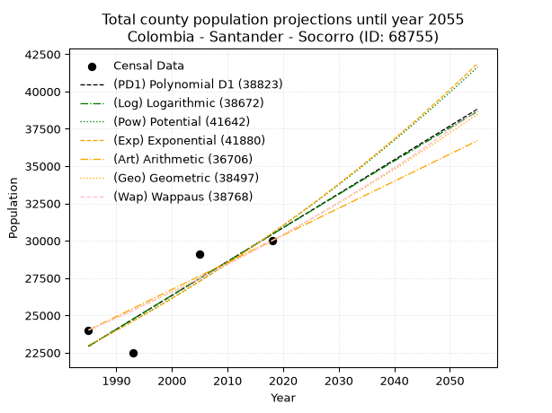
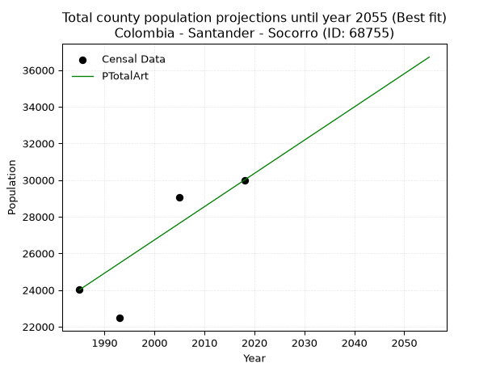
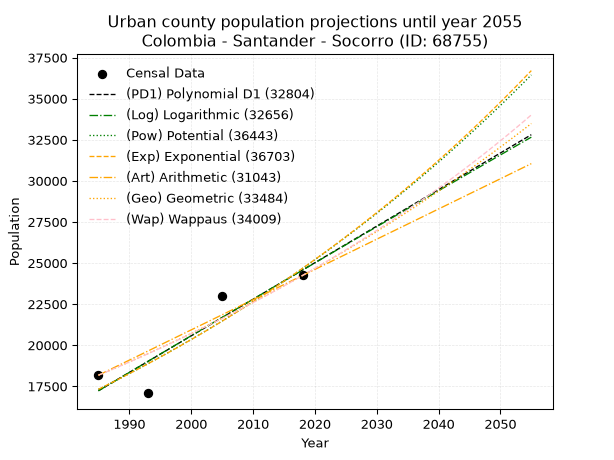
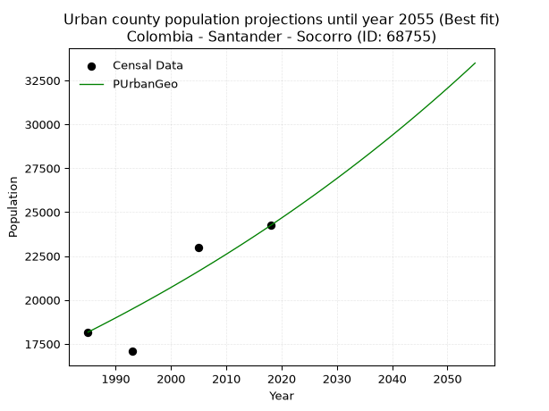
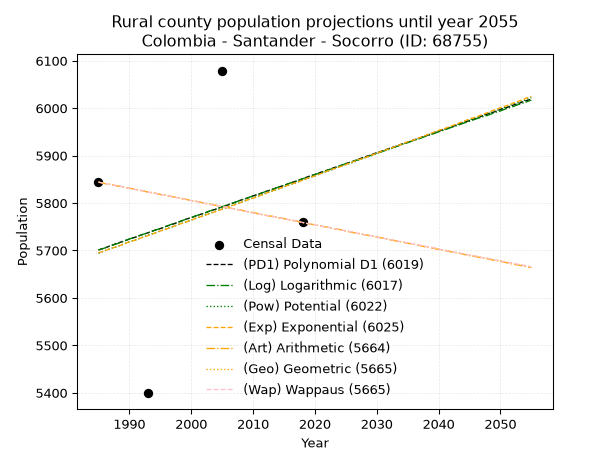
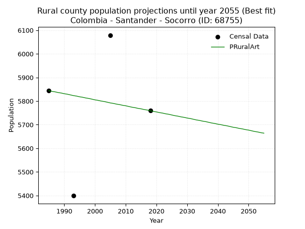

<div align="center">


</div>

# _“Population and Public Services Demand Projections (PPSD) until Year 2050 for Colombia - Santander - Socorro (ID: 68755)”_
Keywords: `population` `public-service` `projection` `lineal` `polynomial` `logarithmic` `potential` `exponential` `arithmetic` `geometric` `wappaus` `dane` `colombia` `south-america`

PPSD are analytical estimates used by governments and planners to anticipate future changes in population size, age distribution, and the resulting community needs for utilities, healthcare, education, and infrastructure as sizing future water treatment facilities, electrical grids, and road networks based on spatial growth.

> **General running parameters**: • app_version: _v20260806_. • Python version: _3.14.7_. • Pandas version: _3.0.5_. • NumPy version: _2.5.1_. • Creates, save and include plots into reports (create_plot): _False_. • Projection until year: _2050_. • Process polynomial degree 2 and up: _False_. • Process Wappaus: _True_. • Process Wappaus: _True_. • Set negative values to zero: _True_. • Set infinite values to zero: _True_. • Drop dataset notes: _True_. 
<div align="center">

Dynamic map: [:earth_americas:Google](http://maps.google.com/maps?q=6.463869638,-73.2611982) [:earth_americas:OSM](https://www.openstreetmap.org/#map=18/6.463869638/-73.2611982&layers=P) [:earth_americas:Bing](https://www.bing.com/maps?cp=6.463869638~-73.2611982&lvl=18) [:earth_americas:Apple](https://maps.apple.com/frame?center=6.463869638%2C-73.2611982&span=0.003%2C0.006)

</div>


<div align="center">

```geojson
{
  "type": "Feature",
  "geometry": {
    "type": "Point", 
    "coordinates": [-73.2611982, 6.463869638]
  }, 
  "properties": {
    "Name": "Colombia - Santander - Socorro (ID: 68755)"
  }
}
```

</div>


## 0. Census Data (4 records)

Census data are official statistics collected by a government about the people and housing in a country. They usually include counts of total population, age, sex, race, income, education, and jobs.

📅Global census file: [Population.xlsx](../data/Population.xlsx)

| Source   |   Year |   CountryID | CountryName   |   StateID | StateName   |   CountyID | CountyName   |   PTotal |   PUrban |   PRural |
|:---------|-------:|------------:|:--------------|----------:|:------------|-----------:|:-------------|---------:|---------:|---------:|
| DANE     |   1985 |          57 | Colombia      |        68 | Santander   |      68755 | Socorro      |    24013 |    18169 |     5844 |
| DANE     |   1993 |          57 | Colombia      |        68 | Santander   |      68755 | Socorro      |    22475 |    17076 |     5399 |
| DANE     |   2005 |          57 | Colombia      |        68 | Santander   |      68755 | Socorro      |    29076 |    22997 |     6079 |
| DANE     |   2018 |          57 | Colombia      |        68 | Santander   |      68755 | Socorro      |    29997 |    24238 |     5759 |

> 🔥Some records could had specific notes about the registered values or the corresponding urban or rural distribution.

## 1. Total

### 1.1. Coefficients and Parameters

* (PD1) Polynomial Deg 1: 227.08269771176128, -427831.91609795054 (lineal)
* (Log) Logarithmic: 454503.1698125241, -3428291.9859048203
* (Pow) Potential: 17.15603759198725, -52.21519150525003
* (Exp) Exponential: 0.008571755231274581, 0.0009374044056524067
* (Art) Arithmetic: Year diff. 2018 - 1985 = 33, Population diff. 29997 - 24013 = 5984, Annual growth = 181.33333333333334
* (Geo) Geometric: Year diff. 2018 - 1985 = 33, Population diff. 29997 - 24013 = 5984, Annual growth % = 0.006765267374707173
* (Wap) Wappaus: i = 0.6714805900141949, Condition values only valid for < 200)

<sub>
Wappaus condition values: ['0.00', '0.67', '1.34', '2.01', '2.69', '3.36', '4.03', '4.70', '5.37', '6.04', '6.71', '7.39', '8.06', '8.73', '9.40', '10.07', '10.74', '11.42', '12.09', '12.76', '13.43', '14.10', '14.77', '15.44', '16.12', '16.79', '17.46', '18.13', '18.80', '19.47', '20.14', '20.82', '21.49', '22.16', '22.83', '23.50', '24.17', '24.84', '25.52', '26.19', '26.86', '27.53', '28.20', '28.87', '29.55', '30.22', '30.89', '31.56', '32.23', '32.90', '33.57', '34.25', '34.92', '35.59', '36.26', '36.93', '37.60', '38.27', '38.95', '39.62', '40.29', '40.96', '41.63', '42.30', '42.97', '43.65']
</sub>


### 1.2. Projected Dataset

|   Year |   CountyID |   PTotalPD1 |   PTotalLog |   PTotalPow |   PTotalExp |   PTotalArt |   PTotalGeo |   PTotalWap |
|-------:|-----------:|------------:|------------:|------------:|------------:|------------:|------------:|------------:|
|   1985 |      68755 |       22927 |       22921 |       22978 |       22984 |       24013 |       24013 |       24013 |
|   1986 |      68755 |       23154 |       23150 |       23177 |       23182 |       24194 |       24175 |       24175 |
|   1987 |      68755 |       23381 |       23378 |       23378 |       23381 |       24376 |       24339 |       24338 |
|   1988 |      68755 |       23608 |       23607 |       23581 |       23582 |       24557 |       24504 |       24502 |
|   1989 |      68755 |       23836 |       23836 |       23785 |       23785 |       24738 |       24669 |       24667 |
|   1990 |      68755 |       24063 |       24064 |       23991 |       23990 |       24920 |       24836 |       24833 |
|   1991 |      68755 |       24290 |       24292 |       24199 |       24197 |       25101 |       25004 |       25000 |
|   1992 |      68755 |       24517 |       24521 |       24408 |       24405 |       25282 |       25174 |       25169 |
|   1993 |      68755 |       24744 |       24749 |       24620 |       24615 |       25464 |       25344 |       25339 |
|   1994 |      68755 |       24971 |       24977 |       24832 |       24827 |       25645 |       25515 |       25509 |
|   1995 |      68755 |       25198 |       25205 |       25047 |       25041 |       25826 |       25688 |       25681 |
|   1996 |      68755 |       25425 |       25432 |       25263 |       25256 |       26008 |       25862 |       25855 |
|   1997 |      68755 |       25652 |       25660 |       25481 |       25474 |       26189 |       26037 |       26029 |
|   1998 |      68755 |       25879 |       25888 |       25701 |       25693 |       26370 |       26213 |       26205 |
|   1999 |      68755 |       26106 |       26115 |       25922 |       25914 |       26552 |       26390 |       26382 |
|   2000 |      68755 |       26333 |       26342 |       26146 |       26137 |       26733 |       26569 |       26560 |
|   2001 |      68755 |       26561 |       26569 |       26371 |       26362 |       26914 |       26748 |       26739 |
|   2002 |      68755 |       26788 |       26797 |       26598 |       26589 |       27096 |       26929 |       26920 |
|   2003 |      68755 |       27015 |       27024 |       26827 |       26818 |       27277 |       27112 |       27102 |
|   2004 |      68755 |       27242 |       27250 |       27058 |       27049 |       27458 |       27295 |       27285 |
|   2005 |      68755 |       27469 |       27477 |       27290 |       27282 |       27640 |       27480 |       27470 |
|   2006 |      68755 |       27696 |       27704 |       27525 |       27517 |       27821 |       27666 |       27656 |
|   2007 |      68755 |       27923 |       27930 |       27761 |       27753 |       28002 |       27853 |       27843 |
|   2008 |      68755 |       28150 |       28157 |       27999 |       27992 |       28184 |       28041 |       28032 |
|   2009 |      68755 |       28377 |       28383 |       28239 |       28233 |       28365 |       28231 |       28222 |
|   2010 |      68755 |       28604 |       28609 |       28482 |       28476 |       28546 |       28422 |       28413 |
|   2011 |      68755 |       28831 |       28835 |       28726 |       28722 |       28728 |       28614 |       28606 |
|   2012 |      68755 |       29058 |       29061 |       28972 |       28969 |       28909 |       28808 |       28801 |
|   2013 |      68755 |       29286 |       29287 |       29220 |       29218 |       29090 |       29003 |       28996 |
|   2014 |      68755 |       29513 |       29513 |       29470 |       29470 |       29272 |       29199 |       29193 |
|   2015 |      68755 |       29740 |       29738 |       29722 |       29723 |       29453 |       29396 |       29392 |
|   2016 |      68755 |       29967 |       29964 |       29976 |       29979 |       29634 |       29595 |       29592 |
|   2017 |      68755 |       30194 |       30189 |       30232 |       30237 |       29816 |       29795 |       29794 |
|   2018 |      68755 |       30421 |       30415 |       30490 |       30498 |       29997 |       29997 |       29997 |
|   2019 |      68755 |       30648 |       30640 |       30750 |       30760 |       30178 |       30200 |       30202 |
|   2020 |      68755 |       30875 |       30865 |       31013 |       31025 |       30360 |       30404 |       30408 |
|   2021 |      68755 |       31102 |       31090 |       31277 |       31292 |       30541 |       30610 |       30616 |
|   2022 |      68755 |       31329 |       31315 |       31544 |       31562 |       30722 |       30817 |       30825 |
|   2023 |      68755 |       31556 |       31539 |       31813 |       31833 |       30904 |       31026 |       31036 |
|   2024 |      68755 |       31783 |       31764 |       32083 |       32107 |       31085 |       31235 |       31249 |
|   2025 |      68755 |       32011 |       31988 |       32356 |       32384 |       31266 |       31447 |       31463 |
|   2026 |      68755 |       32238 |       32213 |       32632 |       32662 |       31448 |       31659 |       31679 |
|   2027 |      68755 |       32465 |       32437 |       32909 |       32944 |       31629 |       31874 |       31897 |
|   2028 |      68755 |       32692 |       32661 |       33189 |       33227 |       31810 |       32089 |       32116 |
|   2029 |      68755 |       32919 |       32885 |       33471 |       33513 |       31992 |       32306 |       32337 |
|   2030 |      68755 |       33146 |       33109 |       33755 |       33802 |       32173 |       32525 |       32560 |
|   2031 |      68755 |       33373 |       33333 |       34041 |       34093 |       32354 |       32745 |       32785 |
|   2032 |      68755 |       33600 |       33557 |       34330 |       34386 |       32536 |       32967 |       33011 |
|   2033 |      68755 |       33827 |       33780 |       34621 |       34682 |       32717 |       33190 |       33240 |
|   2034 |      68755 |       34054 |       34004 |       34914 |       34981 |       32898 |       33414 |       33470 |
|   2035 |      68755 |       34281 |       34227 |       35210 |       35282 |       33080 |       33640 |       33702 |
|   2036 |      68755 |       34508 |       34451 |       35508 |       35586 |       33261 |       33868 |       33935 |
|   2037 |      68755 |       34736 |       34674 |       35808 |       35892 |       33442 |       34097 |       34171 |
|   2038 |      68755 |       34963 |       34897 |       36111 |       36201 |       33624 |       34328 |       34409 |
|   2039 |      68755 |       35190 |       35120 |       36416 |       36513 |       33805 |       34560 |       34648 |
|   2040 |      68755 |       35417 |       35343 |       36724 |       36827 |       33986 |       34794 |       34890 |
|   2041 |      68755 |       35644 |       35565 |       37034 |       37144 |       34168 |       35029 |       35133 |
|   2042 |      68755 |       35871 |       35788 |       37346 |       37464 |       34349 |       35266 |       35379 |
|   2043 |      68755 |       36098 |       36011 |       37661 |       37786 |       34530 |       35505 |       35627 |
|   2044 |      68755 |       36325 |       36233 |       37979 |       38112 |       34712 |       35745 |       35876 |
|   2045 |      68755 |       36552 |       36455 |       38299 |       38440 |       34893 |       35987 |       36128 |
|   2046 |      68755 |       36779 |       36677 |       38622 |       38771 |       35074 |       36230 |       36382 |
|   2047 |      68755 |       37006 |       36900 |       38947 |       39104 |       35256 |       36475 |       36638 |
|   2048 |      68755 |       37233 |       37122 |       39274 |       39441 |       35437 |       36722 |       36896 |
|   2049 |      68755 |       37461 |       37343 |       39605 |       39780 |       35618 |       36970 |       37157 |
|   2050 |      68755 |       37688 |       37565 |       39938 |       40123 |       35800 |       37220 |       37419 |
<div align="center">

</img>

</div>


### 1.3. Best fit with absolute and relative error (%)

Relative error puts that difference into context by dividing the absolute error by the true value, creating a unitless ratio or percentage that shows the scale of the mistake.

Absolute and relative error

|   Year | Source   |   CountryID | CountryName   |   StateID | StateName   |   CountyID_x | CountyName   |   PTotal |   PUrban |   PRural |   CountyID_y |   PTotalPD1 |   PTotalLog |   PTotalPow |   PTotalExp |   PTotalArt |   PTotalGeo |   PTotalWap |   PTotalPD1AbsError |   PTotalLogAbsError |   PTotalPowAbsError |   PTotalExpAbsError |   PTotalArtAbsError |   PTotalGeoAbsError |   PTotalWapAbsError |   PTotalPD1RelError |   PTotalLogRelError |   PTotalPowRelError |   PTotalExpRelError |   PTotalArtRelError |   PTotalGeoRelError |   PTotalWapRelError |
|-------:|:---------|------------:|:--------------|----------:|:------------|-------------:|:-------------|---------:|---------:|---------:|-------------:|------------:|------------:|------------:|------------:|------------:|------------:|------------:|--------------------:|--------------------:|--------------------:|--------------------:|--------------------:|--------------------:|--------------------:|--------------------:|--------------------:|--------------------:|--------------------:|--------------------:|--------------------:|--------------------:|
|   1985 | DANE     |          57 | Colombia      |        68 | Santander   |        68755 | Socorro      |    24013 |    18169 |     5844 |        68755 |       22927 |       22921 |       22978 |       22984 |       24013 |       24013 |       24013 |                1086 |                1092 |                1035 |                1029 |                   0 |                   0 |                   0 |             4.52255 |             4.54754 |             4.31017 |             4.28518 |             0       |             0       |             0       |
|   1993 | DANE     |          57 | Colombia      |        68 | Santander   |        68755 | Socorro      |    22475 |    17076 |     5399 |        68755 |       24744 |       24749 |       24620 |       24615 |       25464 |       25344 |       25339 |                2269 |                2274 |                2145 |                2140 |                2989 |                2869 |                2864 |            10.0957  |            10.1179  |             9.54394 |             9.52169 |            13.2992  |            12.7653  |            12.743   |
|   2005 | DANE     |          57 | Colombia      |        68 | Santander   |        68755 | Socorro      |    29076 |    22997 |     6079 |        68755 |       27469 |       27477 |       27290 |       27282 |       27640 |       27480 |       27470 |                1607 |                1599 |                1786 |                1794 |                1436 |                1596 |                1606 |             5.5269  |             5.49938 |             6.14252 |             6.17004 |             4.93878 |             5.48906 |             5.52346 |
|   2018 | DANE     |          57 | Colombia      |        68 | Santander   |        68755 | Socorro      |    29997 |    24238 |     5759 |        68755 |       30421 |       30415 |       30490 |       30498 |       29997 |       29997 |       29997 |                 424 |                 418 |                 493 |                 501 |                   0 |                   0 |                   0 |             1.41347 |             1.39347 |             1.6435  |             1.67017 |             0       |             0       |             0       |

Relative error mean

| Method    |   RelError | Best   |
|:----------|-----------:|:-------|
| PTotalPD1 |    5.38965 |        |
| PTotalLog |    5.38957 |        |
| PTotalPow |    5.41003 |        |
| PTotalExp |    5.41177 |        |
| PTotalArt |    4.5595  | True   |
| PTotalGeo |    4.56359 |        |
| PTotalWap |    4.56663 |        |

💙Best method: _**PTotalArt**_
<div align="center">

</img>

</div>


### 1.4. Fresh water supply demand in liters per capita per day (lpcd)

The fresh water supply demand typically ranges from 100 to 300 liters per capita per day (lpcd) for standard domestic and municipal planning, though absolute survival minimums set by the World Health Organization are as low as 7.5 to 20 liters per day, and total consumption in high-income nations can exceed 400 liters.

> `CZ`: Level in meters above the sea level (masl)<br> `WS`: Fresh water supply demand in liters per capita per day (lpcd or l/h/d)<br> `WSAll`: Zonal fresh water supply demand in liters per second (l/s)<br> `A`: Zonal area in square meters<br> `DP`: Population density (people/hectare)

Reference values (RAS Colombia)

|    CZ |   WS |
|------:|-----:|
|  1000 |  120 |
|  2000 |  130 |
| 99999 |  140 |

County shapefile geometry properties and water supply values

|   CountyID |      ATotal |   CZTotal |   WSTotal |
|-----------:|------------:|----------:|----------:|
|      68755 | 1.27597e+08 |    1339.8 |       130 |

Projected values for best method: PTotalArt

|   CountyID |   Year |   PTotalArt |   DPTotal |   WSTotal |   WSTotalAll |
|-----------:|-------:|------------:|----------:|----------:|-------------:|
|      68755 |   1985 |       24013 |      1.88 |       130 |      36.1307 |
|      68755 |   1986 |       24194 |      1.9  |       130 |      36.403  |
|      68755 |   1987 |       24376 |      1.91 |       130 |      36.6769 |
|      68755 |   1988 |       24557 |      1.92 |       130 |      36.9492 |
|      68755 |   1989 |       24738 |      1.94 |       130 |      37.2215 |
|      68755 |   1990 |       24920 |      1.95 |       130 |      37.4954 |
|      68755 |   1991 |       25101 |      1.97 |       130 |      37.7677 |
|      68755 |   1992 |       25282 |      1.98 |       130 |      38.04   |
|      68755 |   1993 |       25464 |      2    |       130 |      38.3139 |
|      68755 |   1994 |       25645 |      2.01 |       130 |      38.5862 |
|      68755 |   1995 |       25826 |      2.02 |       130 |      38.8586 |
|      68755 |   1996 |       26008 |      2.04 |       130 |      39.1324 |
|      68755 |   1997 |       26189 |      2.05 |       130 |      39.4047 |
|      68755 |   1998 |       26370 |      2.07 |       130 |      39.6771 |
|      68755 |   1999 |       26552 |      2.08 |       130 |      39.9509 |
|      68755 |   2000 |       26733 |      2.1  |       130 |      40.2233 |
|      68755 |   2001 |       26914 |      2.11 |       130 |      40.4956 |
|      68755 |   2002 |       27096 |      2.12 |       130 |      40.7694 |
|      68755 |   2003 |       27277 |      2.14 |       130 |      41.0418 |
|      68755 |   2004 |       27458 |      2.15 |       130 |      41.3141 |
|      68755 |   2005 |       27640 |      2.17 |       130 |      41.588  |
|      68755 |   2006 |       27821 |      2.18 |       130 |      41.8603 |
|      68755 |   2007 |       28002 |      2.19 |       130 |      42.1326 |
|      68755 |   2008 |       28184 |      2.21 |       130 |      42.4065 |
|      68755 |   2009 |       28365 |      2.22 |       130 |      42.6788 |
|      68755 |   2010 |       28546 |      2.24 |       130 |      42.9512 |
|      68755 |   2011 |       28728 |      2.25 |       130 |      43.225  |
|      68755 |   2012 |       28909 |      2.27 |       130 |      43.4973 |
|      68755 |   2013 |       29090 |      2.28 |       130 |      43.7697 |
|      68755 |   2014 |       29272 |      2.29 |       130 |      44.0435 |
|      68755 |   2015 |       29453 |      2.31 |       130 |      44.3159 |
|      68755 |   2016 |       29634 |      2.32 |       130 |      44.5882 |
|      68755 |   2017 |       29816 |      2.34 |       130 |      44.862  |
|      68755 |   2018 |       29997 |      2.35 |       130 |      45.1344 |
|      68755 |   2019 |       30178 |      2.37 |       130 |      45.4067 |
|      68755 |   2020 |       30360 |      2.38 |       130 |      45.6806 |
|      68755 |   2021 |       30541 |      2.39 |       130 |      45.9529 |
|      68755 |   2022 |       30722 |      2.41 |       130 |      46.2252 |
|      68755 |   2023 |       30904 |      2.42 |       130 |      46.4991 |
|      68755 |   2024 |       31085 |      2.44 |       130 |      46.7714 |
|      68755 |   2025 |       31266 |      2.45 |       130 |      47.0438 |
|      68755 |   2026 |       31448 |      2.46 |       130 |      47.3176 |
|      68755 |   2027 |       31629 |      2.48 |       130 |      47.5899 |
|      68755 |   2028 |       31810 |      2.49 |       130 |      47.8623 |
|      68755 |   2029 |       31992 |      2.51 |       130 |      48.1361 |
|      68755 |   2030 |       32173 |      2.52 |       130 |      48.4084 |
|      68755 |   2031 |       32354 |      2.54 |       130 |      48.6808 |
|      68755 |   2032 |       32536 |      2.55 |       130 |      48.9546 |
|      68755 |   2033 |       32717 |      2.56 |       130 |      49.227  |
|      68755 |   2034 |       32898 |      2.58 |       130 |      49.4993 |
|      68755 |   2035 |       33080 |      2.59 |       130 |      49.7731 |
|      68755 |   2036 |       33261 |      2.61 |       130 |      50.0455 |
|      68755 |   2037 |       33442 |      2.62 |       130 |      50.3178 |
|      68755 |   2038 |       33624 |      2.64 |       130 |      50.5917 |
|      68755 |   2039 |       33805 |      2.65 |       130 |      50.864  |
|      68755 |   2040 |       33986 |      2.66 |       130 |      51.1363 |
|      68755 |   2041 |       34168 |      2.68 |       130 |      51.4102 |
|      68755 |   2042 |       34349 |      2.69 |       130 |      51.6825 |
|      68755 |   2043 |       34530 |      2.71 |       130 |      51.9549 |
|      68755 |   2044 |       34712 |      2.72 |       130 |      52.2287 |
|      68755 |   2045 |       34893 |      2.73 |       130 |      52.501  |
|      68755 |   2046 |       35074 |      2.75 |       130 |      52.7734 |
|      68755 |   2047 |       35256 |      2.76 |       130 |      53.0472 |
|      68755 |   2048 |       35437 |      2.78 |       130 |      53.3196 |
|      68755 |   2049 |       35618 |      2.79 |       130 |      53.5919 |
|      68755 |   2050 |       35800 |      2.81 |       130 |      53.8657 |

## 2. Urban

### 2.1. Coefficients and Parameters

* (PD1) Polynomial Deg 1: 222.5323163388185, -424500.2657567217 (lineal)
* (Log) Logarithmic: 445389.6321250009, -3364790.162910648
* (Pow) Potential: 21.484325170439394, -66.61191541356467
* (Exp) Exponential: 0.01073427384488841, 9.65237151259071e-06
* (Art) Arithmetic: Year diff. 2018 - 1985 = 33, Population diff. 24238 - 18169 = 6069, Annual growth = 183.9090909090909
* (Geo) Geometric: Year diff. 2018 - 1985 = 33, Population diff. 24238 - 18169 = 6069, Annual growth % = 0.008771727014258879
* (Wap) Wappaus: i = 0.867352516844346, Condition values only valid for < 200)

<sub>
Wappaus condition values: ['0.00', '0.87', '1.73', '2.60', '3.47', '4.34', '5.20', '6.07', '6.94', '7.81', '8.67', '9.54', '10.41', '11.28', '12.14', '13.01', '13.88', '14.74', '15.61', '16.48', '17.35', '18.21', '19.08', '19.95', '20.82', '21.68', '22.55', '23.42', '24.29', '25.15', '26.02', '26.89', '27.76', '28.62', '29.49', '30.36', '31.22', '32.09', '32.96', '33.83', '34.69', '35.56', '36.43', '37.30', '38.16', '39.03', '39.90', '40.77', '41.63', '42.50', '43.37', '44.23', '45.10', '45.97', '46.84', '47.70', '48.57', '49.44', '50.31', '51.17', '52.04', '52.91', '53.78', '54.64', '55.51', '56.38']
</sub>


### 2.2. Projected Dataset

|   Year |   CountyID |   PUrbanPD1 |   PUrbanLog |   PUrbanPow |   PUrbanExp |   PUrbanArt |   PUrbanGeo |   PUrbanWap |
|-------:|-----------:|------------:|------------:|------------:|------------:|------------:|------------:|------------:|
|   1985 |      68755 |       17226 |       17220 |       17308 |       17313 |       18169 |       18169 |       18169 |
|   1986 |      68755 |       17449 |       17444 |       17496 |       17500 |       18353 |       18328 |       18327 |
|   1987 |      68755 |       17671 |       17669 |       17686 |       17689 |       18537 |       18489 |       18487 |
|   1988 |      68755 |       17894 |       17893 |       17879 |       17880 |       18721 |       18651 |       18648 |
|   1989 |      68755 |       18117 |       18117 |       18073 |       18073 |       18905 |       18815 |       18810 |
|   1990 |      68755 |       18339 |       18340 |       18269 |       18268 |       19089 |       18980 |       18974 |
|   1991 |      68755 |       18562 |       18564 |       18467 |       18465 |       19272 |       19146 |       19140 |
|   1992 |      68755 |       18784 |       18788 |       18668 |       18664 |       19456 |       19314 |       19307 |
|   1993 |      68755 |       19007 |       19011 |       18870 |       18866 |       19640 |       19484 |       19475 |
|   1994 |      68755 |       19229 |       19235 |       19074 |       19069 |       19824 |       19655 |       19645 |
|   1995 |      68755 |       19452 |       19458 |       19281 |       19275 |       20008 |       19827 |       19816 |
|   1996 |      68755 |       19674 |       19681 |       19490 |       19483 |       20192 |       20001 |       19989 |
|   1997 |      68755 |       19897 |       19904 |       19701 |       19693 |       20376 |       20177 |       20164 |
|   1998 |      68755 |       20119 |       20127 |       19914 |       19906 |       20560 |       20353 |       20340 |
|   1999 |      68755 |       20342 |       20350 |       20129 |       20121 |       20744 |       20532 |       20518 |
|   2000 |      68755 |       20564 |       20573 |       20346 |       20338 |       20928 |       20712 |       20697 |
|   2001 |      68755 |       20787 |       20796 |       20566 |       20557 |       21112 |       20894 |       20878 |
|   2002 |      68755 |       21009 |       21018 |       20788 |       20779 |       21295 |       21077 |       21061 |
|   2003 |      68755 |       21232 |       21241 |       21012 |       21003 |       21479 |       21262 |       21246 |
|   2004 |      68755 |       21454 |       21463 |       21239 |       21230 |       21663 |       21448 |       21432 |
|   2005 |      68755 |       21677 |       21685 |       21468 |       21459 |       21847 |       21637 |       21620 |
|   2006 |      68755 |       21900 |       21907 |       21699 |       21691 |       22031 |       21826 |       21810 |
|   2007 |      68755 |       22122 |       22129 |       21932 |       21925 |       22215 |       22018 |       22002 |
|   2008 |      68755 |       22345 |       22351 |       22168 |       22162 |       22399 |       22211 |       22195 |
|   2009 |      68755 |       22567 |       22573 |       22407 |       22401 |       22583 |       22406 |       22391 |
|   2010 |      68755 |       22790 |       22794 |       22648 |       22642 |       22767 |       22602 |       22588 |
|   2011 |      68755 |       23012 |       23016 |       22891 |       22887 |       22951 |       22801 |       22787 |
|   2012 |      68755 |       23235 |       23237 |       23137 |       23134 |       23135 |       23001 |       22988 |
|   2013 |      68755 |       23457 |       23459 |       23385 |       23384 |       23318 |       23202 |       23191 |
|   2014 |      68755 |       23680 |       23680 |       23636 |       23636 |       23502 |       23406 |       23397 |
|   2015 |      68755 |       23902 |       23901 |       23889 |       23891 |       23686 |       23611 |       23604 |
|   2016 |      68755 |       24125 |       24122 |       24145 |       24149 |       23870 |       23818 |       23813 |
|   2017 |      68755 |       24347 |       24343 |       24404 |       24409 |       24054 |       24027 |       24024 |
|   2018 |      68755 |       24570 |       24564 |       24665 |       24673 |       24238 |       24238 |       24238 |
|   2019 |      68755 |       24792 |       24784 |       24929 |       24939 |       24422 |       24451 |       24454 |
|   2020 |      68755 |       25015 |       25005 |       25196 |       25208 |       24606 |       24665 |       24672 |
|   2021 |      68755 |       25238 |       25225 |       25465 |       25480 |       24790 |       24881 |       24892 |
|   2022 |      68755 |       25460 |       25446 |       25737 |       25755 |       24974 |       25100 |       25114 |
|   2023 |      68755 |       25683 |       25666 |       26012 |       26033 |       25158 |       25320 |       25339 |
|   2024 |      68755 |       25905 |       25886 |       26290 |       26314 |       25341 |       25542 |       25566 |
|   2025 |      68755 |       26128 |       26106 |       26570 |       26598 |       25525 |       25766 |       25796 |
|   2026 |      68755 |       26350 |       26326 |       26854 |       26885 |       25709 |       25992 |       26027 |
|   2027 |      68755 |       26573 |       26546 |       27140 |       27175 |       25893 |       26220 |       26262 |
|   2028 |      68755 |       26795 |       26765 |       27429 |       27469 |       26077 |       26450 |       26499 |
|   2029 |      68755 |       27018 |       26985 |       27721 |       27765 |       26261 |       26682 |       26738 |
|   2030 |      68755 |       27240 |       27204 |       28016 |       28065 |       26445 |       26916 |       26980 |
|   2031 |      68755 |       27463 |       27424 |       28314 |       28368 |       26629 |       27152 |       27225 |
|   2032 |      68755 |       27685 |       27643 |       28615 |       28674 |       26813 |       27390 |       27472 |
|   2033 |      68755 |       27908 |       27862 |       28919 |       28983 |       26997 |       27631 |       27722 |
|   2034 |      68755 |       28130 |       28081 |       29226 |       29296 |       27181 |       27873 |       27975 |
|   2035 |      68755 |       28353 |       28300 |       29536 |       29612 |       27364 |       28117 |       28230 |
|   2036 |      68755 |       28576 |       28519 |       29850 |       29932 |       27548 |       28364 |       28488 |
|   2037 |      68755 |       28798 |       28737 |       30166 |       30255 |       27732 |       28613 |       28750 |
|   2038 |      68755 |       29021 |       28956 |       30486 |       30581 |       27916 |       28864 |       29014 |
|   2039 |      68755 |       29243 |       29174 |       30809 |       30911 |       28100 |       29117 |       29281 |
|   2040 |      68755 |       29466 |       29393 |       31135 |       31245 |       28284 |       29372 |       29551 |
|   2041 |      68755 |       29688 |       29611 |       31465 |       31582 |       28468 |       29630 |       29825 |
|   2042 |      68755 |       29911 |       29829 |       31798 |       31923 |       28652 |       29890 |       30101 |
|   2043 |      68755 |       30133 |       30047 |       32134 |       32267 |       28836 |       30152 |       30381 |
|   2044 |      68755 |       30356 |       30265 |       32474 |       32616 |       29020 |       30417 |       30664 |
|   2045 |      68755 |       30578 |       30483 |       32817 |       32968 |       29204 |       30684 |       30950 |
|   2046 |      68755 |       30801 |       30701 |       33163 |       33323 |       29387 |       30953 |       31240 |
|   2047 |      68755 |       31023 |       30919 |       33513 |       33683 |       29571 |       31224 |       31533 |
|   2048 |      68755 |       31246 |       31136 |       33867 |       34047 |       29755 |       31498 |       31829 |
|   2049 |      68755 |       31468 |       31354 |       34224 |       34414 |       29939 |       31774 |       32129 |
|   2050 |      68755 |       31691 |       31571 |       34584 |       34785 |       30123 |       32053 |       32433 |
<div align="center">

</img>

</div>


### 2.3. Best fit with absolute and relative error (%)

Relative error puts that difference into context by dividing the absolute error by the true value, creating a unitless ratio or percentage that shows the scale of the mistake.

Absolute and relative error

|   Year | Source   |   CountryID | CountryName   |   StateID | StateName   |   CountyID_x | CountyName   |   PTotal |   PUrban |   PRural |   CountyID_y |   PUrbanPD1 |   PUrbanLog |   PUrbanPow |   PUrbanExp |   PUrbanArt |   PUrbanGeo |   PUrbanWap |   PUrbanPD1AbsError |   PUrbanLogAbsError |   PUrbanPowAbsError |   PUrbanExpAbsError |   PUrbanArtAbsError |   PUrbanGeoAbsError |   PUrbanWapAbsError |   PUrbanPD1RelError |   PUrbanLogRelError |   PUrbanPowRelError |   PUrbanExpRelError |   PUrbanArtRelError |   PUrbanGeoRelError |   PUrbanWapRelError |
|-------:|:---------|------------:|:--------------|----------:|:------------|-------------:|:-------------|---------:|---------:|---------:|-------------:|------------:|------------:|------------:|------------:|------------:|------------:|------------:|--------------------:|--------------------:|--------------------:|--------------------:|--------------------:|--------------------:|--------------------:|--------------------:|--------------------:|--------------------:|--------------------:|--------------------:|--------------------:|--------------------:|
|   1985 | DANE     |          57 | Colombia      |        68 | Santander   |        68755 | Socorro      |    24013 |    18169 |     5844 |        68755 |       17226 |       17220 |       17308 |       17313 |       18169 |       18169 |       18169 |                 943 |                 949 |                 861 |                 856 |                   0 |                   0 |                   0 |             5.19016 |             5.22318 |             4.73884 |             4.71132 |             0       |             0       |             0       |
|   1993 | DANE     |          57 | Colombia      |        68 | Santander   |        68755 | Socorro      |    22475 |    17076 |     5399 |        68755 |       19007 |       19011 |       18870 |       18866 |       19640 |       19484 |       19475 |                1931 |                1935 |                1794 |                1790 |                2564 |                2408 |                2399 |            11.3083  |            11.3317  |            10.506   |            10.4825  |            15.0152  |            14.1017  |            14.049   |
|   2005 | DANE     |          57 | Colombia      |        68 | Santander   |        68755 | Socorro      |    29076 |    22997 |     6079 |        68755 |       21677 |       21685 |       21468 |       21459 |       21847 |       21637 |       21620 |                1320 |                1312 |                1529 |                1538 |                1150 |                1360 |                1377 |             5.73988 |             5.70509 |             6.64869 |             6.68783 |             5.00065 |             5.91381 |             5.98774 |
|   2018 | DANE     |          57 | Colombia      |        68 | Santander   |        68755 | Socorro      |    29997 |    24238 |     5759 |        68755 |       24570 |       24564 |       24665 |       24673 |       24238 |       24238 |       24238 |                 332 |                 326 |                 427 |                 435 |                   0 |                   0 |                   0 |             1.36975 |             1.345   |             1.7617  |             1.7947  |             0       |             0       |             0       |

Relative error mean

| Method    |   RelError | Best   |
|:----------|-----------:|:-------|
| PUrbanPD1 |    5.90201 |        |
| PUrbanLog |    5.90124 |        |
| PUrbanPow |    5.9138  |        |
| PUrbanExp |    5.9191  |        |
| PUrbanArt |    5.00397 |        |
| PUrbanGeo |    5.00387 | True   |
| PUrbanWap |    5.00917 |        |

💙Best method: _**PUrbanGeo**_
<div align="center">

</img>

</div>


### 2.4. Fresh water supply demand in liters per capita per day (lpcd)

The fresh water supply demand typically ranges from 100 to 300 liters per capita per day (lpcd) for standard domestic and municipal planning, though absolute survival minimums set by the World Health Organization are as low as 7.5 to 20 liters per day, and total consumption in high-income nations can exceed 400 liters.

> `CZ`: Level in meters above the sea level (masl)<br> `WS`: Fresh water supply demand in liters per capita per day (lpcd or l/h/d)<br> `WSAll`: Zonal fresh water supply demand in liters per second (l/s)<br> `A`: Zonal area in square meters<br> `DP`: Population density (people/hectare)

Reference values (RAS Colombia)

|    CZ |   WS |
|------:|-----:|
|  1000 |  120 |
|  2000 |  130 |
| 99999 |  140 |

County shapefile geometry properties and water supply values

|   CountyID |      AUrban |   CZUrban |   WSUrban |
|-----------:|------------:|----------:|----------:|
|      68755 | 4.11982e+06 |    1271.6 |       130 |

Projected values for best method: PUrbanGeo

|   CountyID |   Year |   PUrbanGeo |   DPUrban |   WSUrban |   WSUrbanAll |
|-----------:|-------:|------------:|----------:|----------:|-------------:|
|      68755 |   1985 |       18169 |     44.1  |       130 |      27.3376 |
|      68755 |   1986 |       18328 |     44.49 |       130 |      27.5769 |
|      68755 |   1987 |       18489 |     44.88 |       130 |      27.8191 |
|      68755 |   1988 |       18651 |     45.27 |       130 |      28.0628 |
|      68755 |   1989 |       18815 |     45.67 |       130 |      28.3096 |
|      68755 |   1990 |       18980 |     46.07 |       130 |      28.5579 |
|      68755 |   1991 |       19146 |     46.47 |       130 |      28.8076 |
|      68755 |   1992 |       19314 |     46.88 |       130 |      29.0604 |
|      68755 |   1993 |       19484 |     47.29 |       130 |      29.3162 |
|      68755 |   1994 |       19655 |     47.71 |       130 |      29.5735 |
|      68755 |   1995 |       19827 |     48.13 |       130 |      29.8323 |
|      68755 |   1996 |       20001 |     48.55 |       130 |      30.0941 |
|      68755 |   1997 |       20177 |     48.98 |       130 |      30.3589 |
|      68755 |   1998 |       20353 |     49.4  |       130 |      30.6237 |
|      68755 |   1999 |       20532 |     49.84 |       130 |      30.8931 |
|      68755 |   2000 |       20712 |     50.27 |       130 |      31.1639 |
|      68755 |   2001 |       20894 |     50.72 |       130 |      31.4377 |
|      68755 |   2002 |       21077 |     51.16 |       130 |      31.7131 |
|      68755 |   2003 |       21262 |     51.61 |       130 |      31.9914 |
|      68755 |   2004 |       21448 |     52.06 |       130 |      32.2713 |
|      68755 |   2005 |       21637 |     52.52 |       130 |      32.5557 |
|      68755 |   2006 |       21826 |     52.98 |       130 |      32.84   |
|      68755 |   2007 |       22018 |     53.44 |       130 |      33.1289 |
|      68755 |   2008 |       22211 |     53.91 |       130 |      33.4193 |
|      68755 |   2009 |       22406 |     54.39 |       130 |      33.7127 |
|      68755 |   2010 |       22602 |     54.86 |       130 |      34.0076 |
|      68755 |   2011 |       22801 |     55.34 |       130 |      34.3071 |
|      68755 |   2012 |       23001 |     55.83 |       130 |      34.608  |
|      68755 |   2013 |       23202 |     56.32 |       130 |      34.9104 |
|      68755 |   2014 |       23406 |     56.81 |       130 |      35.2174 |
|      68755 |   2015 |       23611 |     57.31 |       130 |      35.5258 |
|      68755 |   2016 |       23818 |     57.81 |       130 |      35.8373 |
|      68755 |   2017 |       24027 |     58.32 |       130 |      36.1517 |
|      68755 |   2018 |       24238 |     58.83 |       130 |      36.4692 |
|      68755 |   2019 |       24451 |     59.35 |       130 |      36.7897 |
|      68755 |   2020 |       24665 |     59.87 |       130 |      37.1117 |
|      68755 |   2021 |       24881 |     60.39 |       130 |      37.4367 |
|      68755 |   2022 |       25100 |     60.93 |       130 |      37.7662 |
|      68755 |   2023 |       25320 |     61.46 |       130 |      38.0972 |
|      68755 |   2024 |       25542 |     62    |       130 |      38.4312 |
|      68755 |   2025 |       25766 |     62.54 |       130 |      38.7683 |
|      68755 |   2026 |       25992 |     63.09 |       130 |      39.1083 |
|      68755 |   2027 |       26220 |     63.64 |       130 |      39.4514 |
|      68755 |   2028 |       26450 |     64.2  |       130 |      39.7975 |
|      68755 |   2029 |       26682 |     64.77 |       130 |      40.1465 |
|      68755 |   2030 |       26916 |     65.33 |       130 |      40.4986 |
|      68755 |   2031 |       27152 |     65.91 |       130 |      40.8537 |
|      68755 |   2032 |       27390 |     66.48 |       130 |      41.2118 |
|      68755 |   2033 |       27631 |     67.07 |       130 |      41.5744 |
|      68755 |   2034 |       27873 |     67.66 |       130 |      41.9385 |
|      68755 |   2035 |       28117 |     68.25 |       130 |      42.3057 |
|      68755 |   2036 |       28364 |     68.85 |       130 |      42.6773 |
|      68755 |   2037 |       28613 |     69.45 |       130 |      43.052  |
|      68755 |   2038 |       28864 |     70.06 |       130 |      43.4296 |
|      68755 |   2039 |       29117 |     70.68 |       130 |      43.8103 |
|      68755 |   2040 |       29372 |     71.29 |       130 |      44.194  |
|      68755 |   2041 |       29630 |     71.92 |       130 |      44.5822 |
|      68755 |   2042 |       29890 |     72.55 |       130 |      44.9734 |
|      68755 |   2043 |       30152 |     73.19 |       130 |      45.3676 |
|      68755 |   2044 |       30417 |     73.83 |       130 |      45.7663 |
|      68755 |   2045 |       30684 |     74.48 |       130 |      46.1681 |
|      68755 |   2046 |       30953 |     75.13 |       130 |      46.5728 |
|      68755 |   2047 |       31224 |     75.79 |       130 |      46.9806 |
|      68755 |   2048 |       31498 |     76.45 |       130 |      47.3928 |
|      68755 |   2049 |       31774 |     77.12 |       130 |      47.8081 |
|      68755 |   2050 |       32053 |     77.8  |       130 |      48.2279 |

## 3. Rural

### 3.1. Coefficients and Parameters

* (PD1) Polynomial Deg 1: 4.550381372942773, -3331.6503412287825 (lineal)
* (Log) Logarithmic: 9113.537687522881, -63501.82299416906
* (Pow) Potential: 1.6122620991284957, -1.5613987694467133
* (Exp) Exponential: 0.0008051598951277327, 1151.7554368956908
* (Art) Arithmetic: Year diff. 2018 - 1985 = 33, Population diff. 5759 - 5844 = -85, Annual growth = -2.5757575757575757
* (Geo) Geometric: Year diff. 2018 - 1985 = 33, Population diff. 5759 - 5844 = -85, Annual growth % = -0.00044389070480888027
* (Wap) Wappaus: i = -0.04439813109984617, Condition values only valid for < 200)

<sub>
Wappaus condition values: ['-0.00', '-0.04', '-0.09', '-0.13', '-0.18', '-0.22', '-0.27', '-0.31', '-0.36', '-0.40', '-0.44', '-0.49', '-0.53', '-0.58', '-0.62', '-0.67', '-0.71', '-0.75', '-0.80', '-0.84', '-0.89', '-0.93', '-0.98', '-1.02', '-1.07', '-1.11', '-1.15', '-1.20', '-1.24', '-1.29', '-1.33', '-1.38', '-1.42', '-1.47', '-1.51', '-1.55', '-1.60', '-1.64', '-1.69', '-1.73', '-1.78', '-1.82', '-1.86', '-1.91', '-1.95', '-2.00', '-2.04', '-2.09', '-2.13', '-2.18', '-2.22', '-2.26', '-2.31', '-2.35', '-2.40', '-2.44', '-2.49', '-2.53', '-2.58', '-2.62', '-2.66', '-2.71', '-2.75', '-2.80', '-2.84', '-2.89']
</sub>


### 3.2. Projected Dataset

|   Year |   CountyID |   PRuralPD1 |   PRuralLog |   PRuralPow |   PRuralExp |   PRuralArt |   PRuralGeo |   PRuralWap |
|-------:|-----------:|------------:|------------:|------------:|------------:|------------:|------------:|------------:|
|   1985 |      68755 |        5701 |        5701 |        5694 |        5695 |        5844 |        5844 |        5844 |
|   1986 |      68755 |        5705 |        5705 |        5699 |        5699 |        5841 |        5841 |        5841 |
|   1987 |      68755 |        5710 |        5710 |        5704 |        5704 |        5839 |        5839 |        5839 |
|   1988 |      68755 |        5715 |        5714 |        5708 |        5708 |        5836 |        5836 |        5836 |
|   1989 |      68755 |        5719 |        5719 |        5713 |        5713 |        5834 |        5834 |        5834 |
|   1990 |      68755 |        5724 |        5724 |        5718 |        5718 |        5831 |        5831 |        5831 |
|   1991 |      68755 |        5728 |        5728 |        5722 |        5722 |        5829 |        5828 |        5828 |
|   1992 |      68755 |        5733 |        5733 |        5727 |        5727 |        5826 |        5826 |        5826 |
|   1993 |      68755 |        5737 |        5737 |        5732 |        5731 |        5823 |        5823 |        5823 |
|   1994 |      68755 |        5742 |        5742 |        5736 |        5736 |        5821 |        5821 |        5821 |
|   1995 |      68755 |        5746 |        5746 |        5741 |        5741 |        5818 |        5818 |        5818 |
|   1996 |      68755 |        5751 |        5751 |        5745 |        5745 |        5816 |        5816 |        5816 |
|   1997 |      68755 |        5755 |        5756 |        5750 |        5750 |        5813 |        5813 |        5813 |
|   1998 |      68755 |        5760 |        5760 |        5755 |        5755 |        5811 |        5810 |        5810 |
|   1999 |      68755 |        5765 |        5765 |        5759 |        5759 |        5808 |        5808 |        5808 |
|   2000 |      68755 |        5769 |        5769 |        5764 |        5764 |        5805 |        5805 |        5805 |
|   2001 |      68755 |        5774 |        5774 |        5769 |        5769 |        5803 |        5803 |        5803 |
|   2002 |      68755 |        5778 |        5778 |        5773 |        5773 |        5800 |        5800 |        5800 |
|   2003 |      68755 |        5783 |        5783 |        5778 |        5778 |        5798 |        5797 |        5797 |
|   2004 |      68755 |        5787 |        5787 |        5783 |        5782 |        5795 |        5795 |        5795 |
|   2005 |      68755 |        5792 |        5792 |        5787 |        5787 |        5792 |        5792 |        5792 |
|   2006 |      68755 |        5796 |        5797 |        5792 |        5792 |        5790 |        5790 |        5790 |
|   2007 |      68755 |        5801 |        5801 |        5797 |        5796 |        5787 |        5787 |        5787 |
|   2008 |      68755 |        5806 |        5806 |        5801 |        5801 |        5785 |        5785 |        5785 |
|   2009 |      68755 |        5810 |        5810 |        5806 |        5806 |        5782 |        5782 |        5782 |
|   2010 |      68755 |        5815 |        5815 |        5811 |        5810 |        5780 |        5779 |        5779 |
|   2011 |      68755 |        5819 |        5819 |        5815 |        5815 |        5777 |        5777 |        5777 |
|   2012 |      68755 |        5824 |        5824 |        5820 |        5820 |        5774 |        5774 |        5774 |
|   2013 |      68755 |        5828 |        5828 |        5825 |        5825 |        5772 |        5772 |        5772 |
|   2014 |      68755 |        5833 |        5833 |        5829 |        5829 |        5769 |        5769 |        5769 |
|   2015 |      68755 |        5837 |        5837 |        5834 |        5834 |        5767 |        5767 |        5767 |
|   2016 |      68755 |        5842 |        5842 |        5839 |        5839 |        5764 |        5764 |        5764 |
|   2017 |      68755 |        5846 |        5846 |        5843 |        5843 |        5762 |        5762 |        5762 |
|   2018 |      68755 |        5851 |        5851 |        5848 |        5848 |        5759 |        5759 |        5759 |
|   2019 |      68755 |        5856 |        5855 |        5853 |        5853 |        5756 |        5756 |        5756 |
|   2020 |      68755 |        5860 |        5860 |        5857 |        5857 |        5754 |        5754 |        5754 |
|   2021 |      68755 |        5865 |        5864 |        5862 |        5862 |        5751 |        5751 |        5751 |
|   2022 |      68755 |        5869 |        5869 |        5867 |        5867 |        5749 |        5749 |        5749 |
|   2023 |      68755 |        5874 |        5873 |        5871 |        5872 |        5746 |        5746 |        5746 |
|   2024 |      68755 |        5878 |        5878 |        5876 |        5876 |        5744 |        5744 |        5744 |
|   2025 |      68755 |        5883 |        5883 |        5881 |        5881 |        5741 |        5741 |        5741 |
|   2026 |      68755 |        5887 |        5887 |        5885 |        5886 |        5738 |        5739 |        5739 |
|   2027 |      68755 |        5892 |        5891 |        5890 |        5891 |        5736 |        5736 |        5736 |
|   2028 |      68755 |        5897 |        5896 |        5895 |        5895 |        5733 |        5733 |        5733 |
|   2029 |      68755 |        5901 |        5900 |        5899 |        5900 |        5731 |        5731 |        5731 |
|   2030 |      68755 |        5906 |        5905 |        5904 |        5905 |        5728 |        5728 |        5728 |
|   2031 |      68755 |        5910 |        5909 |        5909 |        5910 |        5726 |        5726 |        5726 |
|   2032 |      68755 |        5915 |        5914 |        5913 |        5914 |        5723 |        5723 |        5723 |
|   2033 |      68755 |        5919 |        5918 |        5918 |        5919 |        5720 |        5721 |        5721 |
|   2034 |      68755 |        5924 |        5923 |        5923 |        5924 |        5718 |        5718 |        5718 |
|   2035 |      68755 |        5928 |        5927 |        5928 |        5929 |        5715 |        5716 |        5716 |
|   2036 |      68755 |        5933 |        5932 |        5932 |        5933 |        5713 |        5713 |        5713 |
|   2037 |      68755 |        5937 |        5936 |        5937 |        5938 |        5710 |        5711 |        5711 |
|   2038 |      68755 |        5942 |        5941 |        5942 |        5943 |        5707 |        5708 |        5708 |
|   2039 |      68755 |        5947 |        5945 |        5946 |        5948 |        5705 |        5706 |        5706 |
|   2040 |      68755 |        5951 |        5950 |        5951 |        5953 |        5702 |        5703 |        5703 |
|   2041 |      68755 |        5956 |        5954 |        5956 |        5957 |        5700 |        5700 |        5700 |
|   2042 |      68755 |        5960 |        5959 |        5960 |        5962 |        5697 |        5698 |        5698 |
|   2043 |      68755 |        5965 |        5963 |        5965 |        5967 |        5695 |        5695 |        5695 |
|   2044 |      68755 |        5969 |        5968 |        5970 |        5972 |        5692 |        5693 |        5693 |
|   2045 |      68755 |        5974 |        5972 |        5975 |        5977 |        5689 |        5690 |        5690 |
|   2046 |      68755 |        5978 |        5977 |        5979 |        5981 |        5687 |        5688 |        5688 |
|   2047 |      68755 |        5983 |        5981 |        5984 |        5986 |        5684 |        5685 |        5685 |
|   2048 |      68755 |        5988 |        5985 |        5989 |        5991 |        5682 |        5683 |        5683 |
|   2049 |      68755 |        5992 |        5990 |        5993 |        5996 |        5679 |        5680 |        5680 |
|   2050 |      68755 |        5997 |        5994 |        5998 |        6001 |        5677 |        5678 |        5678 |
<div align="center">

</img>

</div>


### 3.3. Best fit with absolute and relative error (%)

Relative error puts that difference into context by dividing the absolute error by the true value, creating a unitless ratio or percentage that shows the scale of the mistake.

Absolute and relative error

|   Year | Source   |   CountryID | CountryName   |   StateID | StateName   |   CountyID_x | CountyName   |   PTotal |   PUrban |   PRural |   CountyID_y |   PRuralPD1 |   PRuralLog |   PRuralPow |   PRuralExp |   PRuralArt |   PRuralGeo |   PRuralWap |   PRuralPD1AbsError |   PRuralLogAbsError |   PRuralPowAbsError |   PRuralExpAbsError |   PRuralArtAbsError |   PRuralGeoAbsError |   PRuralWapAbsError |   PRuralPD1RelError |   PRuralLogRelError |   PRuralPowRelError |   PRuralExpRelError |   PRuralArtRelError |   PRuralGeoRelError |   PRuralWapRelError |
|-------:|:---------|------------:|:--------------|----------:|:------------|-------------:|:-------------|---------:|---------:|---------:|-------------:|------------:|------------:|------------:|------------:|------------:|------------:|------------:|--------------------:|--------------------:|--------------------:|--------------------:|--------------------:|--------------------:|--------------------:|--------------------:|--------------------:|--------------------:|--------------------:|--------------------:|--------------------:|--------------------:|
|   1985 | DANE     |          57 | Colombia      |        68 | Santander   |        68755 | Socorro      |    24013 |    18169 |     5844 |        68755 |        5701 |        5701 |        5694 |        5695 |        5844 |        5844 |        5844 |                 143 |                 143 |                 150 |                 149 |                   0 |                   0 |                   0 |             2.44695 |             2.44695 |             2.56674 |             2.54962 |             0       |             0       |             0       |
|   1993 | DANE     |          57 | Colombia      |        68 | Santander   |        68755 | Socorro      |    22475 |    17076 |     5399 |        68755 |        5737 |        5737 |        5732 |        5731 |        5823 |        5823 |        5823 |                 338 |                 338 |                 333 |                 332 |                 424 |                 424 |                 424 |             6.26042 |             6.26042 |             6.16781 |             6.14929 |             7.85331 |             7.85331 |             7.85331 |
|   2005 | DANE     |          57 | Colombia      |        68 | Santander   |        68755 | Socorro      |    29076 |    22997 |     6079 |        68755 |        5792 |        5792 |        5787 |        5787 |        5792 |        5792 |        5792 |                 287 |                 287 |                 292 |                 292 |                 287 |                 287 |                 287 |             4.72117 |             4.72117 |             4.80342 |             4.80342 |             4.72117 |             4.72117 |             4.72117 |
|   2018 | DANE     |          57 | Colombia      |        68 | Santander   |        68755 | Socorro      |    29997 |    24238 |     5759 |        68755 |        5851 |        5851 |        5848 |        5848 |        5759 |        5759 |        5759 |                  92 |                  92 |                  89 |                  89 |                   0 |                   0 |                   0 |             1.5975  |             1.5975  |             1.54541 |             1.54541 |             0       |             0       |             0       |

Relative error mean

| Method    |   RelError | Best   |
|:----------|-----------:|:-------|
| PRuralPD1 |    3.75651 |        |
| PRuralLog |    3.75651 |        |
| PRuralPow |    3.77084 |        |
| PRuralExp |    3.76193 |        |
| PRuralArt |    3.14362 | True   |
| PRuralGeo |    3.14362 | True   |
| PRuralWap |    3.14362 | True   |

💙Best method: _**PRuralArt**_
<div align="center">

</img>

</div>


### 3.4. Fresh water supply demand in liters per capita per day (lpcd)

The fresh water supply demand typically ranges from 100 to 300 liters per capita per day (lpcd) for standard domestic and municipal planning, though absolute survival minimums set by the World Health Organization are as low as 7.5 to 20 liters per day, and total consumption in high-income nations can exceed 400 liters.

> `CZ`: Level in meters above the sea level (masl)<br> `WS`: Fresh water supply demand in liters per capita per day (lpcd or l/h/d)<br> `WSAll`: Zonal fresh water supply demand in liters per second (l/s)<br> `A`: Zonal area in square meters<br> `DP`: Population density (people/hectare)

Reference values (RAS Colombia)

|    CZ |   WS |
|------:|-----:|
|  1000 |  120 |
|  2000 |  130 |
| 99999 |  140 |

County shapefile geometry properties and water supply values

|   CountyID |      ARural |   CZRural |   WSRural |
|-----------:|------------:|----------:|----------:|
|      68755 | 1.23477e+08 |   1342.09 |       130 |

Projected values for best method: PRuralArt

|   CountyID |   Year |   PRuralArt |   DPRural |   WSRural |   WSRuralAll |
|-----------:|-------:|------------:|----------:|----------:|-------------:|
|      68755 |   1985 |        5844 |      0.47 |       130 |      8.79306 |
|      68755 |   1986 |        5841 |      0.47 |       130 |      8.78854 |
|      68755 |   1987 |        5839 |      0.47 |       130 |      8.78553 |
|      68755 |   1988 |        5836 |      0.47 |       130 |      8.78102 |
|      68755 |   1989 |        5834 |      0.47 |       130 |      8.77801 |
|      68755 |   1990 |        5831 |      0.47 |       130 |      8.7735  |
|      68755 |   1991 |        5829 |      0.47 |       130 |      8.77049 |
|      68755 |   1992 |        5826 |      0.47 |       130 |      8.76597 |
|      68755 |   1993 |        5823 |      0.47 |       130 |      8.76146 |
|      68755 |   1994 |        5821 |      0.47 |       130 |      8.75845 |
|      68755 |   1995 |        5818 |      0.47 |       130 |      8.75394 |
|      68755 |   1996 |        5816 |      0.47 |       130 |      8.75093 |
|      68755 |   1997 |        5813 |      0.47 |       130 |      8.74641 |
|      68755 |   1998 |        5811 |      0.47 |       130 |      8.7434  |
|      68755 |   1999 |        5808 |      0.47 |       130 |      8.73889 |
|      68755 |   2000 |        5805 |      0.47 |       130 |      8.73438 |
|      68755 |   2001 |        5803 |      0.47 |       130 |      8.73137 |
|      68755 |   2002 |        5800 |      0.47 |       130 |      8.72685 |
|      68755 |   2003 |        5798 |      0.47 |       130 |      8.72384 |
|      68755 |   2004 |        5795 |      0.47 |       130 |      8.71933 |
|      68755 |   2005 |        5792 |      0.47 |       130 |      8.71481 |
|      68755 |   2006 |        5790 |      0.47 |       130 |      8.71181 |
|      68755 |   2007 |        5787 |      0.47 |       130 |      8.70729 |
|      68755 |   2008 |        5785 |      0.47 |       130 |      8.70428 |
|      68755 |   2009 |        5782 |      0.47 |       130 |      8.69977 |
|      68755 |   2010 |        5780 |      0.47 |       130 |      8.69676 |
|      68755 |   2011 |        5777 |      0.47 |       130 |      8.69225 |
|      68755 |   2012 |        5774 |      0.47 |       130 |      8.68773 |
|      68755 |   2013 |        5772 |      0.47 |       130 |      8.68472 |
|      68755 |   2014 |        5769 |      0.47 |       130 |      8.68021 |
|      68755 |   2015 |        5767 |      0.47 |       130 |      8.6772  |
|      68755 |   2016 |        5764 |      0.47 |       130 |      8.67269 |
|      68755 |   2017 |        5762 |      0.47 |       130 |      8.66968 |
|      68755 |   2018 |        5759 |      0.47 |       130 |      8.66516 |
|      68755 |   2019 |        5756 |      0.47 |       130 |      8.66065 |
|      68755 |   2020 |        5754 |      0.47 |       130 |      8.65764 |
|      68755 |   2021 |        5751 |      0.47 |       130 |      8.65312 |
|      68755 |   2022 |        5749 |      0.47 |       130 |      8.65012 |
|      68755 |   2023 |        5746 |      0.47 |       130 |      8.6456  |
|      68755 |   2024 |        5744 |      0.47 |       130 |      8.64259 |
|      68755 |   2025 |        5741 |      0.46 |       130 |      8.63808 |
|      68755 |   2026 |        5738 |      0.46 |       130 |      8.63356 |
|      68755 |   2027 |        5736 |      0.46 |       130 |      8.63056 |
|      68755 |   2028 |        5733 |      0.46 |       130 |      8.62604 |
|      68755 |   2029 |        5731 |      0.46 |       130 |      8.62303 |
|      68755 |   2030 |        5728 |      0.46 |       130 |      8.61852 |
|      68755 |   2031 |        5726 |      0.46 |       130 |      8.61551 |
|      68755 |   2032 |        5723 |      0.46 |       130 |      8.611   |
|      68755 |   2033 |        5720 |      0.46 |       130 |      8.60648 |
|      68755 |   2034 |        5718 |      0.46 |       130 |      8.60347 |
|      68755 |   2035 |        5715 |      0.46 |       130 |      8.59896 |
|      68755 |   2036 |        5713 |      0.46 |       130 |      8.59595 |
|      68755 |   2037 |        5710 |      0.46 |       130 |      8.59144 |
|      68755 |   2038 |        5707 |      0.46 |       130 |      8.58692 |
|      68755 |   2039 |        5705 |      0.46 |       130 |      8.58391 |
|      68755 |   2040 |        5702 |      0.46 |       130 |      8.5794  |
|      68755 |   2041 |        5700 |      0.46 |       130 |      8.57639 |
|      68755 |   2042 |        5697 |      0.46 |       130 |      8.57188 |
|      68755 |   2043 |        5695 |      0.46 |       130 |      8.56887 |
|      68755 |   2044 |        5692 |      0.46 |       130 |      8.56435 |
|      68755 |   2045 |        5689 |      0.46 |       130 |      8.55984 |
|      68755 |   2046 |        5687 |      0.46 |       130 |      8.55683 |
|      68755 |   2047 |        5684 |      0.46 |       130 |      8.55231 |
|      68755 |   2048 |        5682 |      0.46 |       130 |      8.54931 |
|      68755 |   2049 |        5679 |      0.46 |       130 |      8.54479 |
|      68755 |   2050 |        5677 |      0.46 |       130 |      8.54178 |

<div align="center"><br><sub>Share this research</sub></div><br>

<sub>**APPS & TOOLS & CONTENT DISCLAIMER**: • NO WARRANTY - This content and software is provided by <a href="https://github.com/rcfdtools" target="_blank">github.com/rcfdtools</a> "as is", without any express or implied warranty, including warranties of merchantability, fitness for a particular purpose, or non-infringement. There is no guarantee that the software will be error-free or operate without interruption. • LIMITATION OF LIABILITY - Neither the authors nor copyright holders will be liable for claims or damages arising from the software or its use. You are responsible for determining if the software is appropriate for your use and assume all associated risks, including errors, legal compliance, and data loss. • NO PROFESSIONAL ADVICE - The software provides general information and does not offer professional advice. It should not replace consultation with professional advisors. [Clauses and global license for rcfdtools use.](https://github.com/rcfdtools/rcfdtools/blob/main/LICENSE.md)</sub>

| [:house: Home](Readme.md)  | [:beginner: Help / Collaborate](https://github.com/rcfdtools/R.HydroTools/discussions/31) |
|----------------------------|-------------------------------------------------------------------------------------------|