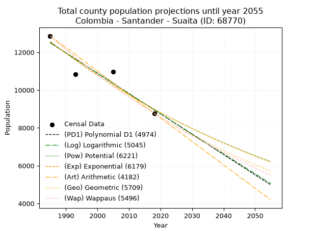
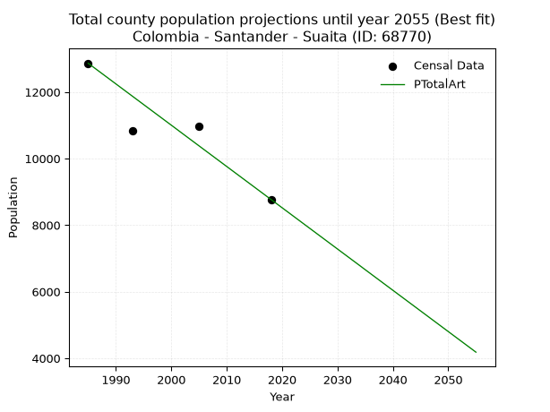
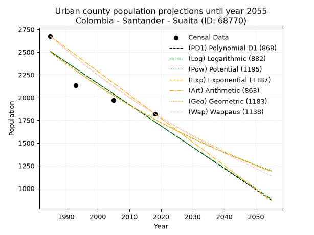
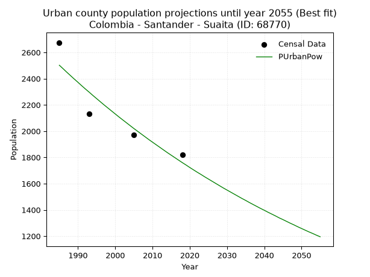
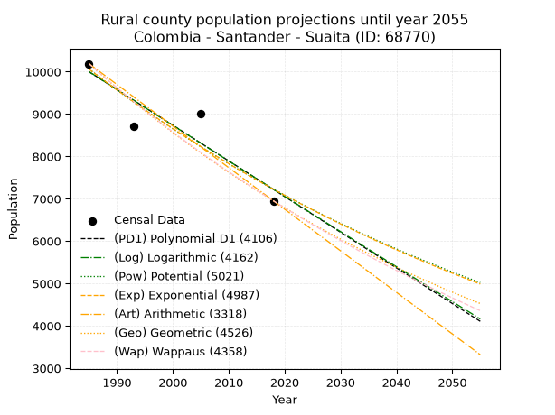
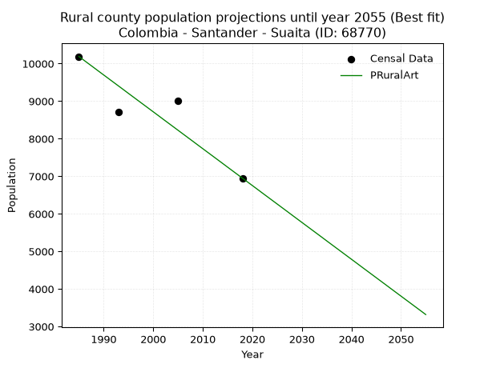

<div align="center">


</div>

# _“Population and Public Services Demand Projections (PPSD) until Year 2050 for Colombia - Santander - Suaita (ID: 68770)”_
Keywords: `population` `public-service` `projection` `lineal` `polynomial` `logarithmic` `potential` `exponential` `arithmetic` `geometric` `wappaus` `dane` `colombia` `south-america`

PPSD are analytical estimates used by governments and planners to anticipate future changes in population size, age distribution, and the resulting community needs for utilities, healthcare, education, and infrastructure as sizing future water treatment facilities, electrical grids, and road networks based on spatial growth.

> **General running parameters**: • app_version: _v20260806_. • Python version: _3.14.7_. • Pandas version: _3.0.5_. • NumPy version: _2.5.1_. • Creates, save and include plots into reports (create_plot): _False_. • Projection until year: _2050_. • Process polynomial degree 2 and up: _False_. • Process Wappaus: _True_. • Process Wappaus: _True_. • Set negative values to zero: _True_. • Set infinite values to zero: _True_. • Drop dataset notes: _True_. 
<div align="center">

Dynamic map: [:earth_americas:Google](http://maps.google.com/maps?q=6.101328834,-73.4416501) [:earth_americas:OSM](https://www.openstreetmap.org/#map=18/6.101328834/-73.4416501&layers=P) [:earth_americas:Bing](https://www.bing.com/maps?cp=6.101328834~-73.4416501&lvl=18) [:earth_americas:Apple](https://maps.apple.com/frame?center=6.101328834%2C-73.4416501&span=0.003%2C0.006)

</div>


<div align="center">

```geojson
{
  "type": "Feature",
  "geometry": {
    "type": "Point", 
    "coordinates": [-73.4416501, 6.101328834]
  }, 
  "properties": {
    "Name": "Colombia - Santander - Suaita (ID: 68770)"
  }
}
```

</div>


## 0. Census Data (4 records)

Census data are official statistics collected by a government about the people and housing in a country. They usually include counts of total population, age, sex, race, income, education, and jobs.

📅Global census file: [Population.xlsx](../data/Population.xlsx)

| Source   |   Year |   CountryID | CountryName   |   StateID | StateName   |   CountyID | CountyName   |   PTotal |   PUrban |   PRural |
|:---------|-------:|------------:|:--------------|----------:|:------------|-----------:|:-------------|---------:|---------:|---------:|
| DANE     |   1985 |          57 | Colombia      |        68 | Santander   |      68770 | Suaita       |    12864 |     2675 |    10189 |
| DANE     |   1993 |          57 | Colombia      |        68 | Santander   |      68770 | Suaita       |    10847 |     2131 |     8716 |
| DANE     |   2005 |          57 | Colombia      |        68 | Santander   |      68770 | Suaita       |    10975 |     1969 |     9006 |
| DANE     |   2018 |          57 | Colombia      |        68 | Santander   |      68770 | Suaita       |     8771 |     1821 |     6950 |

> 🔥Some records could had specific notes about the registered values or the corresponding urban or rural distribution.

**Local public utility companies (RUPS)**

 | SERVICIO       | ESTADO      | NOMBRE                                                                                                 | NIT         | DEPARTAMENTO_DOMICILIO   | MUNICIPIO_DOMICILIO   | DIRECCION                   |   TELEFONO | EMAIL                                     | TIPO_INSCRIPCION    | REPRESENTANTE_LEGAL           | TIPO_PRESTADOR                             | CLASIFICACION                 |
|:---------------|:------------|:-------------------------------------------------------------------------------------------------------|:------------|:-------------------------|:----------------------|:----------------------------|-----------:|:------------------------------------------|:--------------------|:------------------------------|:-------------------------------------------|:------------------------------|
| ASEO           | OPERATIVA   | ACUASAN E.I.C.E  E.S.P                                                                                 | 800120175-7 | SANTANDER                | SAN GIL               | KM 1 VIA AL AEROPUERTO      |    7242590 | celsodiaz09@hotmail.com                   | Registro por la ESP | LUIS FRANCISCO RUIZ CEDIEL    | EMPRESA INDUSTRIAL Y COMERCIAL DEL ESTADO  | MAYOR O IGUAL A 5001 USUARIOS |
| ACUEDUCTO      | CANCELACION | UNIDAD DE SERVICIOS PÚBLICOS MUNICIPIO DE SUAITA                                                       | 890204985-5 | SANTANDER                | SUAITA                | Calle 5 No. 8-32            |    7580243 | servipublicos.sui2@gmail.com              | Registro por la ESP | ELKIN JAVIER CHACON SANABRÍA  | nan                                        | nan                           |
| ALCANTARILLADO | CANCELACION | UNIDAD DE SERVICIOS PÚBLICOS MUNICIPIO DE SUAITA                                                       | 890204985-5 | SANTANDER                | SUAITA                | Calle 5 No. 8-32            |    7580243 | servipublicos.sui2@gmail.com              | Registro por la ESP | ELKIN JAVIER CHACON SANABRÍA  | nan                                        | nan                           |
| ASEO           | CANCELACION | UNIDAD DE SERVICIOS PÚBLICOS MUNICIPIO DE SUAITA                                                       | 890204985-5 | SANTANDER                | SUAITA                | Calle 5 No. 8-32            |    7580243 | servipublicos.sui2@gmail.com              | Registro por la ESP | ELKIN JAVIER CHACON SANABRÍA  | nan                                        | nan                           |
| ASEO           | OPERATIVA   | ECOSANGIL SAS E.S.P.                                                                                   | 900328213-6 | SANTANDER                | SAN GIL               | KM 7 VÍA SAN GIL - CABRERA  |    6084034 | ECOSANGILSAS.ESP@GMAIL.COM                | Registro por la ESP | JORGE MAYORGA RUIZ            | SOCIEDADES (EMPRESA DE SERVICIOS PUBLICOS) | MENOR O IGUAL A 2500 USUARIOS |
| ACUEDUCTO      | OPERATIVA   | ASOCIACIÓN DE USUARIOS DEL ACUEDUCTO VEREDAL EL HIMAL, VEREDAS DAN Y BENJAMIN, DEL MUNICIPIO DE SUAITA | 900343121-1 | SANTANDER                | SUAITA                | finca el alto de la argelia |    7580243 | gilberardila@yahoo.com                    | Registro por la ESP | GILBER ANTONIO ARDILA ARDILA  | ORGANIZACION AUTORIZADA                    | HASTA 2500 SUSCRIPTORES       |
| ASEO           | OPERATIVA   | EMPRESA DE SOLUCIONES AMBIENTALES PARA COLOMBIA S.A E.S.P.                                             | 900508526-9 | SANTANDER                | SAN GIL               | VEREDA EL CUCHARO           |    7273772 | empsacol@hotmail.com                      | Registro por la ESP | JHONNATHAN VESGA PALOMINO     | SOCIEDADES (EMPRESA DE SERVICIOS PUBLICOS) | MENOR O IGUAL A 2500 USUARIOS |
| ACUEDUCTO      | OPERATIVA   | EMPRESA DE SERVICIOS PÚBLICOS DE ACUEDUCTO, ALCANTARILLADO Y ASEO DE SUAITA S.A. E.S.P                 | 901142488-8 | SANTANDER                | SUAITA                | CALLE 5 # 8 - 26            |    3222125 | serviciospublicos@suaita-santander.gov.co | Registro por la ESP | JUAN SEBASTIAN TORRES LOMBANA | SOCIEDADES (EMPRESA DE SERVICIOS PUBLICOS) | MENOR O IGUAL A 2500 USUARIOS |
| ALCANTARILLADO | OPERATIVA   | EMPRESA DE SERVICIOS PÚBLICOS DE ACUEDUCTO, ALCANTARILLADO Y ASEO DE SUAITA S.A. E.S.P                 | 901142488-8 | SANTANDER                | SUAITA                | CALLE 5 # 8 - 26            |    3222125 | serviciospublicos@suaita-santander.gov.co | Registro por la ESP | JUAN SEBASTIAN TORRES LOMBANA | SOCIEDADES (EMPRESA DE SERVICIOS PUBLICOS) | MENOR O IGUAL A 2500 USUARIOS |
| ASEO           | OPERATIVA   | EMPRESA DE SERVICIOS PÚBLICOS DE ACUEDUCTO, ALCANTARILLADO Y ASEO DE SUAITA S.A. E.S.P                 | 901142488-8 | SANTANDER                | SUAITA                | CALLE 5 # 8 - 26            |    3222125 | serviciospublicos@suaita-santander.gov.co | Registro por la ESP | JUAN SEBASTIAN TORRES LOMBANA | SOCIEDADES (EMPRESA DE SERVICIOS PUBLICOS) | MENOR O IGUAL A 2500 USUARIOS |

> [📅RUPS Database: Registro Único de Prestadores de Servicios Públicos de Colombia Suramérica - RUPS](https://www.datos.gov.co/Hacienda-y-Cr-dito-P-blico/Registro-nico-de-Prestadores-de-Servicios-P-blicos/4qkq-csdn/about_data)

## 1. Total

### 1.1. Coefficients and Parameters

* (PD1) Polynomial Deg 1: -107.58771577679511, 226066.57848253442 (lineal)
* (Log) Logarithmic: -215348.54631195907, 1647730.2762121477
* (Pow) Potential: -20.296722368467254, 71.03305461204788
* (Exp) Exponential: -0.01014186087645018, 6954155477139.924
* (Art) Arithmetic: Year diff. 2018 - 1985 = 33, Population diff. 8771 - 12864 = -4093, Annual growth = -124.03030303030303
* (Geo) Geometric: Year diff. 2018 - 1985 = 33, Population diff. 8771 - 12864 = -4093, Annual growth % = -0.01153842755626766
* (Wap) Wappaus: i = -1.1465708623092492, Condition values only valid for < 200)

<sub>
Wappaus condition values: ['-0.00', '-1.15', '-2.29', '-3.44', '-4.59', '-5.73', '-6.88', '-8.03', '-9.17', '-10.32', '-11.47', '-12.61', '-13.76', '-14.91', '-16.05', '-17.20', '-18.35', '-19.49', '-20.64', '-21.78', '-22.93', '-24.08', '-25.22', '-26.37', '-27.52', '-28.66', '-29.81', '-30.96', '-32.10', '-33.25', '-34.40', '-35.54', '-36.69', '-37.84', '-38.98', '-40.13', '-41.28', '-42.42', '-43.57', '-44.72', '-45.86', '-47.01', '-48.16', '-49.30', '-50.45', '-51.60', '-52.74', '-53.89', '-55.04', '-56.18', '-57.33', '-58.48', '-59.62', '-60.77', '-61.91', '-63.06', '-64.21', '-65.35', '-66.50', '-67.65', '-68.79', '-69.94', '-71.09', '-72.23', '-73.38', '-74.53']
</sub>


### 1.2. Projected Dataset

|   Year |   CountyID |   PTotalPD1 |   PTotalLog |   PTotalPow |   PTotalExp |   PTotalArt |   PTotalGeo |   PTotalWap |
|-------:|-----------:|------------:|------------:|------------:|------------:|------------:|------------:|------------:|
|   1985 |      68770 |       12505 |       12508 |       12570 |       12566 |       12864 |       12864 |       12864 |
|   1986 |      68770 |       12397 |       12400 |       12442 |       12439 |       12740 |       12716 |       12717 |
|   1987 |      68770 |       12290 |       12291 |       12315 |       12314 |       12616 |       12569 |       12572 |
|   1988 |      68770 |       12182 |       12183 |       12190 |       12190 |       12492 |       12424 |       12429 |
|   1989 |      68770 |       12075 |       12075 |       12066 |       12067 |       12368 |       12280 |       12287 |
|   1990 |      68770 |       11967 |       11966 |       11944 |       11945 |       12244 |       12139 |       12147 |
|   1991 |      68770 |       11859 |       11858 |       11823 |       11824 |       12120 |       11999 |       12008 |
|   1992 |      68770 |       11752 |       11750 |       11703 |       11705 |       11996 |       11860 |       11871 |
|   1993 |      68770 |       11644 |       11642 |       11584 |       11587 |       11872 |       11723 |       11736 |
|   1994 |      68770 |       11537 |       11534 |       11467 |       11470 |       11748 |       11588 |       11602 |
|   1995 |      68770 |       11429 |       11426 |       11351 |       11354 |       11624 |       11454 |       11469 |
|   1996 |      68770 |       11321 |       11318 |       11236 |       11240 |       11500 |       11322 |       11338 |
|   1997 |      68770 |       11214 |       11210 |       11122 |       11126 |       11376 |       11192 |       11208 |
|   1998 |      68770 |       11106 |       11102 |       11010 |       11014 |       11252 |       11063 |       11080 |
|   1999 |      68770 |       10999 |       10995 |       10899 |       10903 |       11128 |       10935 |       10952 |
|   2000 |      68770 |       10891 |       10887 |       10789 |       10793 |       11004 |       10809 |       10827 |
|   2001 |      68770 |       10784 |       10779 |       10680 |       10684 |       10880 |       10684 |       10702 |
|   2002 |      68770 |       10676 |       10672 |       10572 |       10576 |       10755 |       10561 |       10579 |
|   2003 |      68770 |       10568 |       10564 |       10465 |       10469 |       10631 |       10439 |       10457 |
|   2004 |      68770 |       10461 |       10457 |       10360 |       10364 |       10507 |       10318 |       10337 |
|   2005 |      68770 |       10353 |       10349 |       10255 |       10259 |       10383 |       10199 |       10218 |
|   2006 |      68770 |       10246 |       10242 |       10152 |       10156 |       10259 |       10082 |       10099 |
|   2007 |      68770 |       10138 |       10135 |       10050 |       10053 |       10135 |        9965 |        9983 |
|   2008 |      68770 |       10030 |       10027 |        9949 |        9952 |       10011 |        9850 |        9867 |
|   2009 |      68770 |        9923 |        9920 |        9849 |        9851 |        9887 |        9737 |        9752 |
|   2010 |      68770 |        9815 |        9813 |        9750 |        9752 |        9763 |        9624 |        9639 |
|   2011 |      68770 |        9708 |        9706 |        9652 |        9654 |        9639 |        9513 |        9527 |
|   2012 |      68770 |        9600 |        9599 |        9555 |        9556 |        9515 |        9404 |        9415 |
|   2013 |      68770 |        9493 |        9492 |        9459 |        9460 |        9391 |        9295 |        9305 |
|   2014 |      68770 |        9385 |        9385 |        9364 |        9364 |        9267 |        9188 |        9196 |
|   2015 |      68770 |        9277 |        9278 |        9270 |        9270 |        9143 |        9082 |        9088 |
|   2016 |      68770 |        9170 |        9171 |        9178 |        9176 |        9019 |        8977 |        8982 |
|   2017 |      68770 |        9062 |        9064 |        9086 |        9084 |        8895 |        8873 |        8876 |
|   2018 |      68770 |        8955 |        8958 |        8995 |        8992 |        8771 |        8771 |        8771 |
|   2019 |      68770 |        8847 |        8851 |        8905 |        8901 |        8647 |        8670 |        8667 |
|   2020 |      68770 |        8739 |        8744 |        8816 |        8811 |        8523 |        8570 |        8564 |
|   2021 |      68770 |        8632 |        8638 |        8728 |        8722 |        8399 |        8471 |        8463 |
|   2022 |      68770 |        8524 |        8531 |        8640 |        8634 |        8275 |        8373 |        8362 |
|   2023 |      68770 |        8417 |        8425 |        8554 |        8547 |        8151 |        8277 |        8262 |
|   2024 |      68770 |        8309 |        8318 |        8469 |        8461 |        8027 |        8181 |        8163 |
|   2025 |      68770 |        8201 |        8212 |        8384 |        8376 |        7903 |        8087 |        8065 |
|   2026 |      68770 |        8094 |        8105 |        8301 |        8291 |        7779 |        7993 |        7968 |
|   2027 |      68770 |        7986 |        7999 |        8218 |        8208 |        7655 |        7901 |        7871 |
|   2028 |      68770 |        7879 |        7893 |        8136 |        8125 |        7531 |        7810 |        7776 |
|   2029 |      68770 |        7771 |        7787 |        8055 |        8043 |        7407 |        7720 |        7681 |
|   2030 |      68770 |        7664 |        7681 |        7975 |        7962 |        7283 |        7631 |        7588 |
|   2031 |      68770 |        7556 |        7575 |        7896 |        7881 |        7159 |        7543 |        7495 |
|   2032 |      68770 |        7448 |        7469 |        7817 |        7802 |        7035 |        7456 |        7403 |
|   2033 |      68770 |        7341 |        7363 |        7739 |        7723 |        6911 |        7370 |        7312 |
|   2034 |      68770 |        7233 |        7257 |        7663 |        7645 |        6787 |        7285 |        7222 |
|   2035 |      68770 |        7126 |        7151 |        7586 |        7568 |        6662 |        7201 |        7132 |
|   2036 |      68770 |        7018 |        7045 |        7511 |        7492 |        6538 |        7117 |        7044 |
|   2037 |      68770 |        6910 |        6939 |        7437 |        7416 |        6414 |        7035 |        6956 |
|   2038 |      68770 |        6803 |        6834 |        7363 |        7341 |        6290 |        6954 |        6868 |
|   2039 |      68770 |        6695 |        6728 |        7290 |        7267 |        6166 |        6874 |        6782 |
|   2040 |      68770 |        6588 |        6623 |        7218 |        7194 |        6042 |        6795 |        6696 |
|   2041 |      68770 |        6480 |        6517 |        7146 |        7121 |        5918 |        6716 |        6612 |
|   2042 |      68770 |        6372 |        6411 |        7076 |        7049 |        5794 |        6639 |        6527 |
|   2043 |      68770 |        6265 |        6306 |        7006 |        6978 |        5670 |        6562 |        6444 |
|   2044 |      68770 |        6157 |        6201 |        6937 |        6908 |        5546 |        6486 |        6361 |
|   2045 |      68770 |        6050 |        6095 |        6868 |        6838 |        5422 |        6412 |        6279 |
|   2046 |      68770 |        5942 |        5990 |        6800 |        6769 |        5298 |        6338 |        6198 |
|   2047 |      68770 |        5835 |        5885 |        6733 |        6701 |        5174 |        6264 |        6117 |
|   2048 |      68770 |        5727 |        5780 |        6667 |        6633 |        5050 |        6192 |        6037 |
|   2049 |      68770 |        5619 |        5675 |        6601 |        6566 |        4926 |        6121 |        5958 |
|   2050 |      68770 |        5512 |        5569 |        6536 |        6500 |        4802 |        6050 |        5880 |
<div align="center">

</img>

</div>


### 1.3. Best fit with absolute and relative error (%)

Relative error puts that difference into context by dividing the absolute error by the true value, creating a unitless ratio or percentage that shows the scale of the mistake.

Absolute and relative error

|   Year | Source   |   CountryID | CountryName   |   StateID | StateName   |   CountyID_x | CountyName   |   PTotal |   PUrban |   PRural |   CountyID_y |   PTotalPD1 |   PTotalLog |   PTotalPow |   PTotalExp |   PTotalArt |   PTotalGeo |   PTotalWap |   PTotalPD1AbsError |   PTotalLogAbsError |   PTotalPowAbsError |   PTotalExpAbsError |   PTotalArtAbsError |   PTotalGeoAbsError |   PTotalWapAbsError |   PTotalPD1RelError |   PTotalLogRelError |   PTotalPowRelError |   PTotalExpRelError |   PTotalArtRelError |   PTotalGeoRelError |   PTotalWapRelError |
|-------:|:---------|------------:|:--------------|----------:|:------------|-------------:|:-------------|---------:|---------:|---------:|-------------:|------------:|------------:|------------:|------------:|------------:|------------:|------------:|--------------------:|--------------------:|--------------------:|--------------------:|--------------------:|--------------------:|--------------------:|--------------------:|--------------------:|--------------------:|--------------------:|--------------------:|--------------------:|--------------------:|
|   1985 | DANE     |          57 | Colombia      |        68 | Santander   |        68770 | Suaita       |    12864 |     2675 |    10189 |        68770 |       12505 |       12508 |       12570 |       12566 |       12864 |       12864 |       12864 |                 359 |                 356 |                 294 |                 298 |                   0 |                   0 |                   0 |             2.79073 |             2.76741 |             2.28545 |             2.31654 |             0       |             0       |             0       |
|   1993 | DANE     |          57 | Colombia      |        68 | Santander   |        68770 | Suaita       |    10847 |     2131 |     8716 |        68770 |       11644 |       11642 |       11584 |       11587 |       11872 |       11723 |       11736 |                 797 |                 795 |                 737 |                 740 |                1025 |                 876 |                 889 |             7.34765 |             7.32922 |             6.79451 |             6.82216 |             9.44962 |             8.07597 |             8.19581 |
|   2005 | DANE     |          57 | Colombia      |        68 | Santander   |        68770 | Suaita       |    10975 |     1969 |     9006 |        68770 |       10353 |       10349 |       10255 |       10259 |       10383 |       10199 |       10218 |                 622 |                 626 |                 720 |                 716 |                 592 |                 776 |                 757 |             5.66743 |             5.70387 |             6.56036 |             6.52392 |             5.39408 |             7.07062 |             6.89749 |
|   2018 | DANE     |          57 | Colombia      |        68 | Santander   |        68770 | Suaita       |     8771 |     1821 |     6950 |        68770 |        8955 |        8958 |        8995 |        8992 |        8771 |        8771 |        8771 |                 184 |                 187 |                 224 |                 221 |                   0 |                   0 |                   0 |             2.09782 |             2.13203 |             2.55387 |             2.51967 |             0       |             0       |             0       |

Relative error mean

| Method    |   RelError | Best   |
|:----------|-----------:|:-------|
| PTotalPD1 |    4.47591 |        |
| PTotalLog |    4.48313 |        |
| PTotalPow |    4.54855 |        |
| PTotalExp |    4.54557 |        |
| PTotalArt |    3.71092 | True   |
| PTotalGeo |    3.78665 |        |
| PTotalWap |    3.77333 |        |

💙Best method: _**PTotalArt**_
<div align="center">

</img>

</div>


### 1.4. Fresh water supply demand in liters per capita per day (lpcd)

The fresh water supply demand typically ranges from 100 to 300 liters per capita per day (lpcd) for standard domestic and municipal planning, though absolute survival minimums set by the World Health Organization are as low as 7.5 to 20 liters per day, and total consumption in high-income nations can exceed 400 liters.

> `CZ`: Level in meters above the sea level (masl)<br> `WS`: Fresh water supply demand in liters per capita per day (lpcd or l/h/d)<br> `WSAll`: Zonal fresh water supply demand in liters per second (l/s)<br> `A`: Zonal area in square meters<br> `DP`: Population density (people/hectare or p/ha)

Reference values (RAS Colombia)

|    CZ |   WS |
|------:|-----:|
|  1000 |  120 |
|  2000 |  130 |
| 99999 |  140 |

County shapefile geometry properties and water supply values

|   CountyID |      ATotal |   CZTotal |   WSTotal |
|-----------:|------------:|----------:|----------:|
|      68770 | 2.82927e+08 |   1677.86 |       130 |

Projected values for best method: PTotalArt

|   CountyID |   Year |   PTotalArt |   DPTotal |   WSTotal |   WSTotalAll |
|-----------:|-------:|------------:|----------:|----------:|-------------:|
|      68770 |   1985 |       12864 |      0.45 |       130 |     19.3556  |
|      68770 |   1986 |       12740 |      0.45 |       130 |     19.169   |
|      68770 |   1987 |       12616 |      0.45 |       130 |     18.9824  |
|      68770 |   1988 |       12492 |      0.44 |       130 |     18.7958  |
|      68770 |   1989 |       12368 |      0.44 |       130 |     18.6093  |
|      68770 |   1990 |       12244 |      0.43 |       130 |     18.4227  |
|      68770 |   1991 |       12120 |      0.43 |       130 |     18.2361  |
|      68770 |   1992 |       11996 |      0.42 |       130 |     18.0495  |
|      68770 |   1993 |       11872 |      0.42 |       130 |     17.863   |
|      68770 |   1994 |       11748 |      0.42 |       130 |     17.6764  |
|      68770 |   1995 |       11624 |      0.41 |       130 |     17.4898  |
|      68770 |   1996 |       11500 |      0.41 |       130 |     17.3032  |
|      68770 |   1997 |       11376 |      0.4  |       130 |     17.1167  |
|      68770 |   1998 |       11252 |      0.4  |       130 |     16.9301  |
|      68770 |   1999 |       11128 |      0.39 |       130 |     16.7435  |
|      68770 |   2000 |       11004 |      0.39 |       130 |     16.5569  |
|      68770 |   2001 |       10880 |      0.38 |       130 |     16.3704  |
|      68770 |   2002 |       10755 |      0.38 |       130 |     16.1823  |
|      68770 |   2003 |       10631 |      0.38 |       130 |     15.9957  |
|      68770 |   2004 |       10507 |      0.37 |       130 |     15.8091  |
|      68770 |   2005 |       10383 |      0.37 |       130 |     15.6226  |
|      68770 |   2006 |       10259 |      0.36 |       130 |     15.436   |
|      68770 |   2007 |       10135 |      0.36 |       130 |     15.2494  |
|      68770 |   2008 |       10011 |      0.35 |       130 |     15.0628  |
|      68770 |   2009 |        9887 |      0.35 |       130 |     14.8763  |
|      68770 |   2010 |        9763 |      0.35 |       130 |     14.6897  |
|      68770 |   2011 |        9639 |      0.34 |       130 |     14.5031  |
|      68770 |   2012 |        9515 |      0.34 |       130 |     14.3166  |
|      68770 |   2013 |        9391 |      0.33 |       130 |     14.13    |
|      68770 |   2014 |        9267 |      0.33 |       130 |     13.9434  |
|      68770 |   2015 |        9143 |      0.32 |       130 |     13.7568  |
|      68770 |   2016 |        9019 |      0.32 |       130 |     13.5703  |
|      68770 |   2017 |        8895 |      0.31 |       130 |     13.3837  |
|      68770 |   2018 |        8771 |      0.31 |       130 |     13.1971  |
|      68770 |   2019 |        8647 |      0.31 |       130 |     13.0105  |
|      68770 |   2020 |        8523 |      0.3  |       130 |     12.824   |
|      68770 |   2021 |        8399 |      0.3  |       130 |     12.6374  |
|      68770 |   2022 |        8275 |      0.29 |       130 |     12.4508  |
|      68770 |   2023 |        8151 |      0.29 |       130 |     12.2642  |
|      68770 |   2024 |        8027 |      0.28 |       130 |     12.0777  |
|      68770 |   2025 |        7903 |      0.28 |       130 |     11.8911  |
|      68770 |   2026 |        7779 |      0.27 |       130 |     11.7045  |
|      68770 |   2027 |        7655 |      0.27 |       130 |     11.5179  |
|      68770 |   2028 |        7531 |      0.27 |       130 |     11.3314  |
|      68770 |   2029 |        7407 |      0.26 |       130 |     11.1448  |
|      68770 |   2030 |        7283 |      0.26 |       130 |     10.9582  |
|      68770 |   2031 |        7159 |      0.25 |       130 |     10.7716  |
|      68770 |   2032 |        7035 |      0.25 |       130 |     10.5851  |
|      68770 |   2033 |        6911 |      0.24 |       130 |     10.3985  |
|      68770 |   2034 |        6787 |      0.24 |       130 |     10.2119  |
|      68770 |   2035 |        6662 |      0.24 |       130 |     10.0238  |
|      68770 |   2036 |        6538 |      0.23 |       130 |      9.83727 |
|      68770 |   2037 |        6414 |      0.23 |       130 |      9.65069 |
|      68770 |   2038 |        6290 |      0.22 |       130 |      9.46412 |
|      68770 |   2039 |        6166 |      0.22 |       130 |      9.27755 |
|      68770 |   2040 |        6042 |      0.21 |       130 |      9.09097 |
|      68770 |   2041 |        5918 |      0.21 |       130 |      8.9044  |
|      68770 |   2042 |        5794 |      0.2  |       130 |      8.71782 |
|      68770 |   2043 |        5670 |      0.2  |       130 |      8.53125 |
|      68770 |   2044 |        5546 |      0.2  |       130 |      8.34468 |
|      68770 |   2045 |        5422 |      0.19 |       130 |      8.1581  |
|      68770 |   2046 |        5298 |      0.19 |       130 |      7.97153 |
|      68770 |   2047 |        5174 |      0.18 |       130 |      7.78495 |
|      68770 |   2048 |        5050 |      0.18 |       130 |      7.59838 |
|      68770 |   2049 |        4926 |      0.17 |       130 |      7.41181 |
|      68770 |   2050 |        4802 |      0.17 |       130 |      7.22523 |

## 2. Urban

### 2.1. Coefficients and Parameters

* (PD1) Polynomial Deg 1: -23.393014853472383, 48940.87796065813 (lineal)
* (Log) Logarithmic: -46868.52473751293, 358397.03211062186
* (Pow) Potential: -21.33764885737681, 73.76481278948155
* (Exp) Exponential: -0.01065141685876866, 3806057278441.2183
* (Art) Arithmetic: Year diff. 2018 - 1985 = 33, Population diff. 1821 - 2675 = -854, Annual growth = -25.87878787878788
* (Geo) Geometric: Year diff. 2018 - 1985 = 33, Population diff. 1821 - 2675 = -854, Annual growth % = -0.01158580344801552
* (Wap) Wappaus: i = -1.1511916316186779, Condition values only valid for < 200)

<sub>
Wappaus condition values: ['-0.00', '-1.15', '-2.30', '-3.45', '-4.60', '-5.76', '-6.91', '-8.06', '-9.21', '-10.36', '-11.51', '-12.66', '-13.81', '-14.97', '-16.12', '-17.27', '-18.42', '-19.57', '-20.72', '-21.87', '-23.02', '-24.18', '-25.33', '-26.48', '-27.63', '-28.78', '-29.93', '-31.08', '-32.23', '-33.38', '-34.54', '-35.69', '-36.84', '-37.99', '-39.14', '-40.29', '-41.44', '-42.59', '-43.75', '-44.90', '-46.05', '-47.20', '-48.35', '-49.50', '-50.65', '-51.80', '-52.95', '-54.11', '-55.26', '-56.41', '-57.56', '-58.71', '-59.86', '-61.01', '-62.16', '-63.32', '-64.47', '-65.62', '-66.77', '-67.92', '-69.07', '-70.22', '-71.37', '-72.53', '-73.68', '-74.83']
</sub>


### 2.2. Projected Dataset

|   Year |   CountyID |   PUrbanPD1 |   PUrbanLog |   PUrbanPow |   PUrbanExp |   PUrbanArt |   PUrbanGeo |   PUrbanWap |
|-------:|-----------:|------------:|------------:|------------:|------------:|------------:|------------:|------------:|
|   1985 |      68770 |        2506 |        2507 |        2502 |        2501 |        2675 |        2675 |        2675 |
|   1986 |      68770 |        2482 |        2483 |        2476 |        2475 |        2649 |        2644 |        2644 |
|   1987 |      68770 |        2459 |        2460 |        2449 |        2449 |        2623 |        2613 |        2614 |
|   1988 |      68770 |        2436 |        2436 |        2423 |        2423 |        2597 |        2583 |        2584 |
|   1989 |      68770 |        2412 |        2412 |        2397 |        2397 |        2571 |        2553 |        2555 |
|   1990 |      68770 |        2389 |        2389 |        2372 |        2372 |        2546 |        2524 |        2525 |
|   1991 |      68770 |        2365 |        2365 |        2346 |        2346 |        2520 |        2494 |        2496 |
|   1992 |      68770 |        2342 |        2342 |        2321 |        2322 |        2494 |        2465 |        2468 |
|   1993 |      68770 |        2319 |        2318 |        2297 |        2297 |        2468 |        2437 |        2439 |
|   1994 |      68770 |        2295 |        2295 |        2272 |        2273 |        2442 |        2409 |        2412 |
|   1995 |      68770 |        2272 |        2271 |        2248 |        2249 |        2416 |        2381 |        2384 |
|   1996 |      68770 |        2248 |        2248 |        2224 |        2225 |        2390 |        2353 |        2356 |
|   1997 |      68770 |        2225 |        2224 |        2200 |        2201 |        2364 |        2326 |        2329 |
|   1998 |      68770 |        2202 |        2201 |        2177 |        2178 |        2339 |        2299 |        2303 |
|   1999 |      68770 |        2178 |        2177 |        2154 |        2155 |        2313 |        2272 |        2276 |
|   2000 |      68770 |        2155 |        2154 |        2131 |        2132 |        2287 |        2246 |        2250 |
|   2001 |      68770 |        2131 |        2131 |        2108 |        2109 |        2261 |        2220 |        2224 |
|   2002 |      68770 |        2108 |        2107 |        2086 |        2087 |        2235 |        2194 |        2198 |
|   2003 |      68770 |        2085 |        2084 |        2064 |        2065 |        2209 |        2169 |        2173 |
|   2004 |      68770 |        2061 |        2060 |        2042 |        2043 |        2183 |        2144 |        2148 |
|   2005 |      68770 |        2038 |        2037 |        2020 |        2021 |        2157 |        2119 |        2123 |
|   2006 |      68770 |        2014 |        2014 |        1999 |        2000 |        2132 |        2094 |        2098 |
|   2007 |      68770 |        1991 |        1990 |        1978 |        1979 |        2106 |        2070 |        2074 |
|   2008 |      68770 |        1968 |        1967 |        1957 |        1958 |        2080 |        2046 |        2050 |
|   2009 |      68770 |        1944 |        1944 |        1936 |        1937 |        2054 |        2022 |        2026 |
|   2010 |      68770 |        1921 |        1920 |        1916 |        1917 |        2028 |        1999 |        2002 |
|   2011 |      68770 |        1898 |        1897 |        1896 |        1896 |        2002 |        1976 |        1979 |
|   2012 |      68770 |        1874 |        1874 |        1876 |        1876 |        1976 |        1953 |        1955 |
|   2013 |      68770 |        1851 |        1850 |        1856 |        1856 |        1950 |        1930 |        1932 |
|   2014 |      68770 |        1827 |        1827 |        1836 |        1837 |        1925 |        1908 |        1910 |
|   2015 |      68770 |        1804 |        1804 |        1817 |        1817 |        1899 |        1886 |        1887 |
|   2016 |      68770 |        1781 |        1780 |        1798 |        1798 |        1873 |        1864 |        1865 |
|   2017 |      68770 |        1757 |        1757 |        1779 |        1779 |        1847 |        1842 |        1843 |
|   2018 |      68770 |        1734 |        1734 |        1760 |        1760 |        1821 |        1821 |        1821 |
|   2019 |      68770 |        1710 |        1711 |        1742 |        1741 |        1795 |        1800 |        1799 |
|   2020 |      68770 |        1687 |        1688 |        1723 |        1723 |        1769 |        1779 |        1778 |
|   2021 |      68770 |        1664 |        1664 |        1705 |        1705 |        1743 |        1758 |        1757 |
|   2022 |      68770 |        1640 |        1641 |        1687 |        1687 |        1717 |        1738 |        1736 |
|   2023 |      68770 |        1617 |        1618 |        1670 |        1669 |        1692 |        1718 |        1715 |
|   2024 |      68770 |        1593 |        1595 |        1652 |        1651 |        1666 |        1698 |        1694 |
|   2025 |      68770 |        1570 |        1572 |        1635 |        1634 |        1640 |        1678 |        1674 |
|   2026 |      68770 |        1547 |        1549 |        1618 |        1616 |        1614 |        1659 |        1653 |
|   2027 |      68770 |        1523 |        1525 |        1601 |        1599 |        1588 |        1640 |        1633 |
|   2028 |      68770 |        1500 |        1502 |        1584 |        1582 |        1562 |        1621 |        1614 |
|   2029 |      68770 |        1476 |        1479 |        1567 |        1565 |        1536 |        1602 |        1594 |
|   2030 |      68770 |        1453 |        1456 |        1551 |        1549 |        1510 |        1583 |        1574 |
|   2031 |      68770 |        1430 |        1433 |        1535 |        1532 |        1485 |        1565 |        1555 |
|   2032 |      68770 |        1406 |        1410 |        1519 |        1516 |        1459 |        1547 |        1536 |
|   2033 |      68770 |        1383 |        1387 |        1503 |        1500 |        1433 |        1529 |        1517 |
|   2034 |      68770 |        1359 |        1364 |        1487 |        1484 |        1407 |        1511 |        1498 |
|   2035 |      68770 |        1336 |        1341 |        1472 |        1468 |        1381 |        1494 |        1479 |
|   2036 |      68770 |        1313 |        1318 |        1456 |        1453 |        1355 |        1476 |        1461 |
|   2037 |      68770 |        1289 |        1295 |        1441 |        1438 |        1329 |        1459 |        1443 |
|   2038 |      68770 |        1266 |        1272 |        1426 |        1422 |        1303 |        1442 |        1424 |
|   2039 |      68770 |        1243 |        1249 |        1411 |        1407 |        1278 |        1426 |        1406 |
|   2040 |      68770 |        1219 |        1226 |        1397 |        1392 |        1252 |        1409 |        1389 |
|   2041 |      68770 |        1196 |        1203 |        1382 |        1378 |        1226 |        1393 |        1371 |
|   2042 |      68770 |        1172 |        1180 |        1368 |        1363 |        1200 |        1377 |        1353 |
|   2043 |      68770 |        1149 |        1157 |        1354 |        1349 |        1174 |        1361 |        1336 |
|   2044 |      68770 |        1126 |        1134 |        1339 |        1334 |        1148 |        1345 |        1319 |
|   2045 |      68770 |        1102 |        1111 |        1326 |        1320 |        1122 |        1329 |        1302 |
|   2046 |      68770 |        1079 |        1088 |        1312 |        1306 |        1096 |        1314 |        1285 |
|   2047 |      68770 |        1055 |        1065 |        1298 |        1292 |        1071 |        1299 |        1268 |
|   2048 |      68770 |        1032 |        1042 |        1285 |        1279 |        1045 |        1284 |        1251 |
|   2049 |      68770 |        1009 |        1020 |        1271 |        1265 |        1019 |        1269 |        1235 |
|   2050 |      68770 |         985 |         997 |        1258 |        1252 |         993 |        1254 |        1218 |
<div align="center">

</img>

</div>


### 2.3. Best fit with absolute and relative error (%)

Relative error puts that difference into context by dividing the absolute error by the true value, creating a unitless ratio or percentage that shows the scale of the mistake.

Absolute and relative error

|   Year | Source   |   CountryID | CountryName   |   StateID | StateName   |   CountyID_x | CountyName   |   PTotal |   PUrban |   PRural |   CountyID_y |   PUrbanPD1 |   PUrbanLog |   PUrbanPow |   PUrbanExp |   PUrbanArt |   PUrbanGeo |   PUrbanWap |   PUrbanPD1AbsError |   PUrbanLogAbsError |   PUrbanPowAbsError |   PUrbanExpAbsError |   PUrbanArtAbsError |   PUrbanGeoAbsError |   PUrbanWapAbsError |   PUrbanPD1RelError |   PUrbanLogRelError |   PUrbanPowRelError |   PUrbanExpRelError |   PUrbanArtRelError |   PUrbanGeoRelError |   PUrbanWapRelError |
|-------:|:---------|------------:|:--------------|----------:|:------------|-------------:|:-------------|---------:|---------:|---------:|-------------:|------------:|------------:|------------:|------------:|------------:|------------:|------------:|--------------------:|--------------------:|--------------------:|--------------------:|--------------------:|--------------------:|--------------------:|--------------------:|--------------------:|--------------------:|--------------------:|--------------------:|--------------------:|--------------------:|
|   1985 | DANE     |          57 | Colombia      |        68 | Santander   |        68770 | Suaita       |    12864 |     2675 |    10189 |        68770 |        2506 |        2507 |        2502 |        2501 |        2675 |        2675 |        2675 |                 169 |                 168 |                 173 |                 174 |                   0 |                   0 |                   0 |             6.31776 |             6.28037 |             6.46729 |             6.50467 |             0       |             0       |             0       |
|   1993 | DANE     |          57 | Colombia      |        68 | Santander   |        68770 | Suaita       |    10847 |     2131 |     8716 |        68770 |        2319 |        2318 |        2297 |        2297 |        2468 |        2437 |        2439 |                 188 |                 187 |                 166 |                 166 |                 337 |                 306 |                 308 |             8.82215 |             8.77522 |             7.78977 |             7.78977 |            15.8142  |            14.3595  |            14.4533  |
|   2005 | DANE     |          57 | Colombia      |        68 | Santander   |        68770 | Suaita       |    10975 |     1969 |     9006 |        68770 |        2038 |        2037 |        2020 |        2021 |        2157 |        2119 |        2123 |                  69 |                  68 |                  51 |                  52 |                 188 |                 150 |                 154 |             3.50432 |             3.45353 |             2.59015 |             2.64093 |             9.54799 |             7.61808 |             7.82123 |
|   2018 | DANE     |          57 | Colombia      |        68 | Santander   |        68770 | Suaita       |     8771 |     1821 |     6950 |        68770 |        1734 |        1734 |        1760 |        1760 |        1821 |        1821 |        1821 |                  87 |                  87 |                  61 |                  61 |                   0 |                   0 |                   0 |             4.77759 |             4.77759 |             3.34981 |             3.34981 |             0       |             0       |             0       |

Relative error mean

| Method    |   RelError | Best   |
|:----------|-----------:|:-------|
| PUrbanPD1 |    5.85545 |        |
| PUrbanLog |    5.82168 |        |
| PUrbanPow |    5.04925 | True   |
| PUrbanExp |    5.0713  |        |
| PUrbanArt |    6.34054 |        |
| PUrbanGeo |    5.49438 |        |
| PUrbanWap |    5.56863 |        |

💙Best method: _**PUrbanPow**_
<div align="center">

</img>

</div>


### 2.4. Fresh water supply demand in liters per capita per day (lpcd)

The fresh water supply demand typically ranges from 100 to 300 liters per capita per day (lpcd) for standard domestic and municipal planning, though absolute survival minimums set by the World Health Organization are as low as 7.5 to 20 liters per day, and total consumption in high-income nations can exceed 400 liters.

> `CZ`: Level in meters above the sea level (masl)<br> `WS`: Fresh water supply demand in liters per capita per day (lpcd or l/h/d)<br> `WSAll`: Zonal fresh water supply demand in liters per second (l/s)<br> `A`: Zonal area in square meters<br> `DP`: Population density (people/hectare or p/ha)

Reference values (RAS Colombia)

|    CZ |   WS |
|------:|-----:|
|  1000 |  120 |
|  2000 |  130 |
| 99999 |  140 |

County shapefile geometry properties and water supply values

|   CountyID |   AUrban |   CZUrban |   WSUrban |
|-----------:|---------:|----------:|----------:|
|      68770 |   605571 |   1633.29 |       130 |

Projected values for best method: PUrbanPow

|   CountyID |   Year |   PUrbanPow |   DPUrban |   WSUrban |   WSUrbanAll |
|-----------:|-------:|------------:|----------:|----------:|-------------:|
|      68770 |   1985 |        2502 |     41.32 |       130 |      3.76458 |
|      68770 |   1986 |        2476 |     40.89 |       130 |      3.72546 |
|      68770 |   1987 |        2449 |     40.44 |       130 |      3.68484 |
|      68770 |   1988 |        2423 |     40.01 |       130 |      3.64572 |
|      68770 |   1989 |        2397 |     39.58 |       130 |      3.6066  |
|      68770 |   1990 |        2372 |     39.17 |       130 |      3.56898 |
|      68770 |   1991 |        2346 |     38.74 |       130 |      3.52986 |
|      68770 |   1992 |        2321 |     38.33 |       130 |      3.49225 |
|      68770 |   1993 |        2297 |     37.93 |       130 |      3.45613 |
|      68770 |   1994 |        2272 |     37.52 |       130 |      3.41852 |
|      68770 |   1995 |        2248 |     37.12 |       130 |      3.38241 |
|      68770 |   1996 |        2224 |     36.73 |       130 |      3.3463  |
|      68770 |   1997 |        2200 |     36.33 |       130 |      3.31019 |
|      68770 |   1998 |        2177 |     35.95 |       130 |      3.27558 |
|      68770 |   1999 |        2154 |     35.57 |       130 |      3.24097 |
|      68770 |   2000 |        2131 |     35.19 |       130 |      3.20637 |
|      68770 |   2001 |        2108 |     34.81 |       130 |      3.17176 |
|      68770 |   2002 |        2086 |     34.45 |       130 |      3.13866 |
|      68770 |   2003 |        2064 |     34.08 |       130 |      3.10556 |
|      68770 |   2004 |        2042 |     33.72 |       130 |      3.07245 |
|      68770 |   2005 |        2020 |     33.36 |       130 |      3.03935 |
|      68770 |   2006 |        1999 |     33.01 |       130 |      3.00775 |
|      68770 |   2007 |        1978 |     32.66 |       130 |      2.97616 |
|      68770 |   2008 |        1957 |     32.32 |       130 |      2.94456 |
|      68770 |   2009 |        1936 |     31.97 |       130 |      2.91296 |
|      68770 |   2010 |        1916 |     31.64 |       130 |      2.88287 |
|      68770 |   2011 |        1896 |     31.31 |       130 |      2.85278 |
|      68770 |   2012 |        1876 |     30.98 |       130 |      2.82269 |
|      68770 |   2013 |        1856 |     30.65 |       130 |      2.79259 |
|      68770 |   2014 |        1836 |     30.32 |       130 |      2.7625  |
|      68770 |   2015 |        1817 |     30    |       130 |      2.73391 |
|      68770 |   2016 |        1798 |     29.69 |       130 |      2.70532 |
|      68770 |   2017 |        1779 |     29.38 |       130 |      2.67674 |
|      68770 |   2018 |        1760 |     29.06 |       130 |      2.64815 |
|      68770 |   2019 |        1742 |     28.77 |       130 |      2.62106 |
|      68770 |   2020 |        1723 |     28.45 |       130 |      2.59248 |
|      68770 |   2021 |        1705 |     28.16 |       130 |      2.56539 |
|      68770 |   2022 |        1687 |     27.86 |       130 |      2.53831 |
|      68770 |   2023 |        1670 |     27.58 |       130 |      2.51273 |
|      68770 |   2024 |        1652 |     27.28 |       130 |      2.48565 |
|      68770 |   2025 |        1635 |     27    |       130 |      2.46007 |
|      68770 |   2026 |        1618 |     26.72 |       130 |      2.43449 |
|      68770 |   2027 |        1601 |     26.44 |       130 |      2.40891 |
|      68770 |   2028 |        1584 |     26.16 |       130 |      2.38333 |
|      68770 |   2029 |        1567 |     25.88 |       130 |      2.35775 |
|      68770 |   2030 |        1551 |     25.61 |       130 |      2.33368 |
|      68770 |   2031 |        1535 |     25.35 |       130 |      2.30961 |
|      68770 |   2032 |        1519 |     25.08 |       130 |      2.28553 |
|      68770 |   2033 |        1503 |     24.82 |       130 |      2.26146 |
|      68770 |   2034 |        1487 |     24.56 |       130 |      2.23738 |
|      68770 |   2035 |        1472 |     24.31 |       130 |      2.21481 |
|      68770 |   2036 |        1456 |     24.04 |       130 |      2.19074 |
|      68770 |   2037 |        1441 |     23.8  |       130 |      2.16817 |
|      68770 |   2038 |        1426 |     23.55 |       130 |      2.1456  |
|      68770 |   2039 |        1411 |     23.3  |       130 |      2.12303 |
|      68770 |   2040 |        1397 |     23.07 |       130 |      2.10197 |
|      68770 |   2041 |        1382 |     22.82 |       130 |      2.0794  |
|      68770 |   2042 |        1368 |     22.59 |       130 |      2.05833 |
|      68770 |   2043 |        1354 |     22.36 |       130 |      2.03727 |
|      68770 |   2044 |        1339 |     22.11 |       130 |      2.0147  |
|      68770 |   2045 |        1326 |     21.9  |       130 |      1.99514 |
|      68770 |   2046 |        1312 |     21.67 |       130 |      1.97407 |
|      68770 |   2047 |        1298 |     21.43 |       130 |      1.95301 |
|      68770 |   2048 |        1285 |     21.22 |       130 |      1.93345 |
|      68770 |   2049 |        1271 |     20.99 |       130 |      1.91238 |
|      68770 |   2050 |        1258 |     20.77 |       130 |      1.89282 |

## 3. Rural

### 3.1. Coefficients and Parameters

* (PD1) Polynomial Deg 1: -84.19470092332271, 177125.70052187625 (lineal)
* (Log) Logarithmic: -168480.0215744463, 1289333.2441015271
* (Pow) Potential: -20.063050292477126, 70.16589192306392
* (Exp) Exponential: -0.01002765795915511, 4438570864369.58
* (Art) Arithmetic: Year diff. 2018 - 1985 = 33, Population diff. 6950 - 10189 = -3239, Annual growth = -98.15151515151516
* (Geo) Geometric: Year diff. 2018 - 1985 = 33, Population diff. 6950 - 10189 = -3239, Annual growth % = -0.011526001616043002
* (Wap) Wappaus: i = -1.1453587158120677, Condition values only valid for < 200)

<sub>
Wappaus condition values: ['-0.00', '-1.15', '-2.29', '-3.44', '-4.58', '-5.73', '-6.87', '-8.02', '-9.16', '-10.31', '-11.45', '-12.60', '-13.74', '-14.89', '-16.04', '-17.18', '-18.33', '-19.47', '-20.62', '-21.76', '-22.91', '-24.05', '-25.20', '-26.34', '-27.49', '-28.63', '-29.78', '-30.92', '-32.07', '-33.22', '-34.36', '-35.51', '-36.65', '-37.80', '-38.94', '-40.09', '-41.23', '-42.38', '-43.52', '-44.67', '-45.81', '-46.96', '-48.11', '-49.25', '-50.40', '-51.54', '-52.69', '-53.83', '-54.98', '-56.12', '-57.27', '-58.41', '-59.56', '-60.70', '-61.85', '-62.99', '-64.14', '-65.29', '-66.43', '-67.58', '-68.72', '-69.87', '-71.01', '-72.16', '-73.30', '-74.45']
</sub>


### 3.2. Projected Dataset

|   Year |   CountyID |   PRuralPD1 |   PRuralLog |   PRuralPow |   PRuralExp |   PRuralArt |   PRuralGeo |   PRuralWap |
|-------:|-----------:|------------:|------------:|------------:|------------:|------------:|------------:|------------:|
|   1985 |      68770 |        9999 |       10001 |       10064 |       10061 |       10189 |       10189 |       10189 |
|   1986 |      68770 |        9915 |        9917 |        9963 |        9961 |       10091 |       10072 |       10073 |
|   1987 |      68770 |        9831 |        9832 |        9862 |        9862 |        9993 |        9955 |        9958 |
|   1988 |      68770 |        9747 |        9747 |        9763 |        9763 |        9895 |        9841 |        9845 |
|   1989 |      68770 |        9662 |        9662 |        9665 |        9666 |        9796 |        9727 |        9733 |
|   1990 |      68770 |        9578 |        9578 |        9568 |        9569 |        9698 |        9615 |        9622 |
|   1991 |      68770 |        9494 |        9493 |        9472 |        9474 |        9600 |        9504 |        9512 |
|   1992 |      68770 |        9410 |        9408 |        9377 |        9379 |        9502 |        9395 |        9404 |
|   1993 |      68770 |        9326 |        9324 |        9283 |        9286 |        9404 |        9287 |        9296 |
|   1994 |      68770 |        9241 |        9239 |        9191 |        9193 |        9306 |        9179 |        9190 |
|   1995 |      68770 |        9157 |        9155 |        9099 |        9101 |        9207 |        9074 |        9085 |
|   1996 |      68770 |        9073 |        9070 |        9008 |        9011 |        9109 |        8969 |        8981 |
|   1997 |      68770 |        8989 |        8986 |        8917 |        8921 |        9011 |        8866 |        8879 |
|   1998 |      68770 |        8905 |        8902 |        8828 |        8832 |        8913 |        8764 |        8777 |
|   1999 |      68770 |        8820 |        8817 |        8740 |        8743 |        8815 |        8663 |        8676 |
|   2000 |      68770 |        8736 |        8733 |        8653 |        8656 |        8717 |        8563 |        8577 |
|   2001 |      68770 |        8652 |        8649 |        8567 |        8570 |        8619 |        8464 |        8479 |
|   2002 |      68770 |        8568 |        8565 |        8481 |        8484 |        8520 |        8366 |        8381 |
|   2003 |      68770 |        8484 |        8481 |        8397 |        8400 |        8422 |        8270 |        8285 |
|   2004 |      68770 |        8400 |        8396 |        8313 |        8316 |        8324 |        8175 |        8189 |
|   2005 |      68770 |        8315 |        8312 |        8230 |        8233 |        8226 |        8080 |        8095 |
|   2006 |      68770 |        8231 |        8228 |        8148 |        8151 |        8128 |        7987 |        8001 |
|   2007 |      68770 |        8147 |        8144 |        8067 |        8069 |        8030 |        7895 |        7909 |
|   2008 |      68770 |        8063 |        8060 |        7987 |        7989 |        7932 |        7804 |        7817 |
|   2009 |      68770 |        7979 |        7977 |        7908 |        7909 |        7833 |        7714 |        7727 |
|   2010 |      68770 |        7894 |        7893 |        7829 |        7830 |        7735 |        7625 |        7637 |
|   2011 |      68770 |        7810 |        7809 |        7751 |        7752 |        7637 |        7538 |        7548 |
|   2012 |      68770 |        7726 |        7725 |        7674 |        7675 |        7539 |        7451 |        7460 |
|   2013 |      68770 |        7642 |        7641 |        7598 |        7598 |        7441 |        7365 |        7373 |
|   2014 |      68770 |        7558 |        7558 |        7523 |        7522 |        7343 |        7280 |        7287 |
|   2015 |      68770 |        7473 |        7474 |        7448 |        7447 |        7244 |        7196 |        7201 |
|   2016 |      68770 |        7389 |        7391 |        7374 |        7373 |        7146 |        7113 |        7117 |
|   2017 |      68770 |        7305 |        7307 |        7301 |        7300 |        7048 |        7031 |        7033 |
|   2018 |      68770 |        7221 |        7223 |        7229 |        7227 |        6950 |        6950 |        6950 |
|   2019 |      68770 |        7137 |        7140 |        7158 |        7155 |        6852 |        6870 |        6868 |
|   2020 |      68770 |        7052 |        7057 |        7087 |        7083 |        6754 |        6791 |        6786 |
|   2021 |      68770 |        6968 |        6973 |        7017 |        7013 |        6656 |        6712 |        6706 |
|   2022 |      68770 |        6884 |        6890 |        6948 |        6943 |        6557 |        6635 |        6626 |
|   2023 |      68770 |        6800 |        6807 |        6879 |        6873 |        6459 |        6559 |        6547 |
|   2024 |      68770 |        6716 |        6723 |        6811 |        6805 |        6361 |        6483 |        6469 |
|   2025 |      68770 |        6631 |        6640 |        6744 |        6737 |        6263 |        6408 |        6391 |
|   2026 |      68770 |        6547 |        6557 |        6678 |        6670 |        6165 |        6334 |        6314 |
|   2027 |      68770 |        6463 |        6474 |        6612 |        6603 |        6067 |        6261 |        6238 |
|   2028 |      68770 |        6379 |        6391 |        6547 |        6537 |        5968 |        6189 |        6162 |
|   2029 |      68770 |        6295 |        6308 |        6482 |        6472 |        5870 |        6118 |        6088 |
|   2030 |      68770 |        6210 |        6225 |        6418 |        6407 |        5772 |        6047 |        6014 |
|   2031 |      68770 |        6126 |        6142 |        6355 |        6343 |        5674 |        5978 |        5940 |
|   2032 |      68770 |        6042 |        6059 |        6293 |        6280 |        5576 |        5909 |        5867 |
|   2033 |      68770 |        5958 |        5976 |        6231 |        6218 |        5478 |        5841 |        5795 |
|   2034 |      68770 |        5874 |        5893 |        6170 |        6155 |        5380 |        5773 |        5724 |
|   2035 |      68770 |        5789 |        5810 |        6109 |        6094 |        5281 |        5707 |        5653 |
|   2036 |      68770 |        5705 |        5727 |        6049 |        6033 |        5183 |        5641 |        5583 |
|   2037 |      68770 |        5621 |        5645 |        5990 |        5973 |        5085 |        5576 |        5513 |
|   2038 |      68770 |        5537 |        5562 |        5931 |        5913 |        4987 |        5512 |        5444 |
|   2039 |      68770 |        5453 |        5479 |        5873 |        5854 |        4889 |        5448 |        5376 |
|   2040 |      68770 |        5369 |        5397 |        5816 |        5796 |        4791 |        5385 |        5308 |
|   2041 |      68770 |        5284 |        5314 |        5759 |        5738 |        4693 |        5323 |        5241 |
|   2042 |      68770 |        5200 |        5232 |        5703 |        5681 |        4594 |        5262 |        5174 |
|   2043 |      68770 |        5116 |        5149 |        5647 |        5624 |        4496 |        5201 |        5108 |
|   2044 |      68770 |        5032 |        5067 |        5592 |        5568 |        4398 |        5141 |        5043 |
|   2045 |      68770 |        4948 |        4984 |        5537 |        5513 |        4300 |        5082 |        4978 |
|   2046 |      68770 |        4863 |        4902 |        5483 |        5458 |        4202 |        5024 |        4913 |
|   2047 |      68770 |        4779 |        4820 |        5430 |        5403 |        4104 |        4966 |        4849 |
|   2048 |      68770 |        4695 |        4737 |        5377 |        5349 |        4005 |        4908 |        4786 |
|   2049 |      68770 |        4611 |        4655 |        5324 |        5296 |        3907 |        4852 |        4723 |
|   2050 |      68770 |        4527 |        4573 |        5272 |        5243 |        3809 |        4796 |        4661 |
<div align="center">

</img>

</div>


### 3.3. Best fit with absolute and relative error (%)

Relative error puts that difference into context by dividing the absolute error by the true value, creating a unitless ratio or percentage that shows the scale of the mistake.

Absolute and relative error

|   Year | Source   |   CountryID | CountryName   |   StateID | StateName   |   CountyID_x | CountyName   |   PTotal |   PUrban |   PRural |   CountyID_y |   PRuralPD1 |   PRuralLog |   PRuralPow |   PRuralExp |   PRuralArt |   PRuralGeo |   PRuralWap |   PRuralPD1AbsError |   PRuralLogAbsError |   PRuralPowAbsError |   PRuralExpAbsError |   PRuralArtAbsError |   PRuralGeoAbsError |   PRuralWapAbsError |   PRuralPD1RelError |   PRuralLogRelError |   PRuralPowRelError |   PRuralExpRelError |   PRuralArtRelError |   PRuralGeoRelError |   PRuralWapRelError |
|-------:|:---------|------------:|:--------------|----------:|:------------|-------------:|:-------------|---------:|---------:|---------:|-------------:|------------:|------------:|------------:|------------:|------------:|------------:|------------:|--------------------:|--------------------:|--------------------:|--------------------:|--------------------:|--------------------:|--------------------:|--------------------:|--------------------:|--------------------:|--------------------:|--------------------:|--------------------:|--------------------:|
|   1985 | DANE     |          57 | Colombia      |        68 | Santander   |        68770 | Suaita       |    12864 |     2675 |    10189 |        68770 |        9999 |       10001 |       10064 |       10061 |       10189 |       10189 |       10189 |                 190 |                 188 |                 125 |                 128 |                   0 |                   0 |                   0 |             1.86476 |             1.84513 |             1.22681 |             1.25626 |             0       |             0       |             0       |
|   1993 | DANE     |          57 | Colombia      |        68 | Santander   |        68770 | Suaita       |    10847 |     2131 |     8716 |        68770 |        9326 |        9324 |        9283 |        9286 |        9404 |        9287 |        9296 |                 610 |                 608 |                 567 |                 570 |                 688 |                 571 |                 580 |             6.99862 |             6.97568 |             6.50528 |             6.5397  |             7.89353 |             6.55117 |             6.65443 |
|   2005 | DANE     |          57 | Colombia      |        68 | Santander   |        68770 | Suaita       |    10975 |     1969 |     9006 |        68770 |        8315 |        8312 |        8230 |        8233 |        8226 |        8080 |        8095 |                 691 |                 694 |                 776 |                 773 |                 780 |                 926 |                 911 |             7.67266 |             7.70597 |             8.61648 |             8.58317 |             8.66089 |            10.282   |            10.1155  |
|   2018 | DANE     |          57 | Colombia      |        68 | Santander   |        68770 | Suaita       |     8771 |     1821 |     6950 |        68770 |        7221 |        7223 |        7229 |        7227 |        6950 |        6950 |        6950 |                 271 |                 273 |                 279 |                 277 |                   0 |                   0 |                   0 |             3.89928 |             3.92806 |             4.01439 |             3.98561 |             0       |             0       |             0       |

Relative error mean

| Method    |   RelError | Best   |
|:----------|-----------:|:-------|
| PRuralPD1 |    5.10883 |        |
| PRuralLog |    5.11371 |        |
| PRuralPow |    5.09074 |        |
| PRuralExp |    5.09118 |        |
| PRuralArt |    4.13861 | True   |
| PRuralGeo |    4.2083  |        |
| PRuralWap |    4.19248 |        |

💙Best method: _**PRuralArt**_
<div align="center">

</img>

</div>


### 3.4. Fresh water supply demand in liters per capita per day (lpcd)

The fresh water supply demand typically ranges from 100 to 300 liters per capita per day (lpcd) for standard domestic and municipal planning, though absolute survival minimums set by the World Health Organization are as low as 7.5 to 20 liters per day, and total consumption in high-income nations can exceed 400 liters.

> `CZ`: Level in meters above the sea level (masl)<br> `WS`: Fresh water supply demand in liters per capita per day (lpcd or l/h/d)<br> `WSAll`: Zonal fresh water supply demand in liters per second (l/s)<br> `A`: Zonal area in square meters<br> `DP`: Population density (people/hectare or p/ha)

Reference values (RAS Colombia)

|    CZ |   WS |
|------:|-----:|
|  1000 |  120 |
|  2000 |  130 |
| 99999 |  140 |

County shapefile geometry properties and water supply values

|   CountyID |      ARural |   CZRural |   WSRural |
|-----------:|------------:|----------:|----------:|
|      68770 | 2.82321e+08 |   1677.95 |       130 |

Projected values for best method: PRuralArt

|   CountyID |   Year |   PRuralArt |   DPRural |   WSRural |   WSRuralAll |
|-----------:|-------:|------------:|----------:|----------:|-------------:|
|      68770 |   1985 |       10189 |      0.36 |       130 |     15.3307  |
|      68770 |   1986 |       10091 |      0.36 |       130 |     15.1832  |
|      68770 |   1987 |        9993 |      0.35 |       130 |     15.0358  |
|      68770 |   1988 |        9895 |      0.35 |       130 |     14.8883  |
|      68770 |   1989 |        9796 |      0.35 |       130 |     14.7394  |
|      68770 |   1990 |        9698 |      0.34 |       130 |     14.5919  |
|      68770 |   1991 |        9600 |      0.34 |       130 |     14.4444  |
|      68770 |   1992 |        9502 |      0.34 |       130 |     14.297   |
|      68770 |   1993 |        9404 |      0.33 |       130 |     14.1495  |
|      68770 |   1994 |        9306 |      0.33 |       130 |     14.0021  |
|      68770 |   1995 |        9207 |      0.33 |       130 |     13.8531  |
|      68770 |   1996 |        9109 |      0.32 |       130 |     13.7057  |
|      68770 |   1997 |        9011 |      0.32 |       130 |     13.5582  |
|      68770 |   1998 |        8913 |      0.32 |       130 |     13.4108  |
|      68770 |   1999 |        8815 |      0.31 |       130 |     13.2633  |
|      68770 |   2000 |        8717 |      0.31 |       130 |     13.1159  |
|      68770 |   2001 |        8619 |      0.31 |       130 |     12.9684  |
|      68770 |   2002 |        8520 |      0.3  |       130 |     12.8194  |
|      68770 |   2003 |        8422 |      0.3  |       130 |     12.672   |
|      68770 |   2004 |        8324 |      0.29 |       130 |     12.5245  |
|      68770 |   2005 |        8226 |      0.29 |       130 |     12.3771  |
|      68770 |   2006 |        8128 |      0.29 |       130 |     12.2296  |
|      68770 |   2007 |        8030 |      0.28 |       130 |     12.0822  |
|      68770 |   2008 |        7932 |      0.28 |       130 |     11.9347  |
|      68770 |   2009 |        7833 |      0.28 |       130 |     11.7858  |
|      68770 |   2010 |        7735 |      0.27 |       130 |     11.6383  |
|      68770 |   2011 |        7637 |      0.27 |       130 |     11.4909  |
|      68770 |   2012 |        7539 |      0.27 |       130 |     11.3434  |
|      68770 |   2013 |        7441 |      0.26 |       130 |     11.1959  |
|      68770 |   2014 |        7343 |      0.26 |       130 |     11.0485  |
|      68770 |   2015 |        7244 |      0.26 |       130 |     10.8995  |
|      68770 |   2016 |        7146 |      0.25 |       130 |     10.7521  |
|      68770 |   2017 |        7048 |      0.25 |       130 |     10.6046  |
|      68770 |   2018 |        6950 |      0.25 |       130 |     10.4572  |
|      68770 |   2019 |        6852 |      0.24 |       130 |     10.3097  |
|      68770 |   2020 |        6754 |      0.24 |       130 |     10.1623  |
|      68770 |   2021 |        6656 |      0.24 |       130 |     10.0148  |
|      68770 |   2022 |        6557 |      0.23 |       130 |      9.86586 |
|      68770 |   2023 |        6459 |      0.23 |       130 |      9.7184  |
|      68770 |   2024 |        6361 |      0.23 |       130 |      9.57095 |
|      68770 |   2025 |        6263 |      0.22 |       130 |      9.4235  |
|      68770 |   2026 |        6165 |      0.22 |       130 |      9.27604 |
|      68770 |   2027 |        6067 |      0.21 |       130 |      9.12859 |
|      68770 |   2028 |        5968 |      0.21 |       130 |      8.97963 |
|      68770 |   2029 |        5870 |      0.21 |       130 |      8.83218 |
|      68770 |   2030 |        5772 |      0.2  |       130 |      8.68472 |
|      68770 |   2031 |        5674 |      0.2  |       130 |      8.53727 |
|      68770 |   2032 |        5576 |      0.2  |       130 |      8.38981 |
|      68770 |   2033 |        5478 |      0.19 |       130 |      8.24236 |
|      68770 |   2034 |        5380 |      0.19 |       130 |      8.09491 |
|      68770 |   2035 |        5281 |      0.19 |       130 |      7.94595 |
|      68770 |   2036 |        5183 |      0.18 |       130 |      7.7985  |
|      68770 |   2037 |        5085 |      0.18 |       130 |      7.65104 |
|      68770 |   2038 |        4987 |      0.18 |       130 |      7.50359 |
|      68770 |   2039 |        4889 |      0.17 |       130 |      7.35613 |
|      68770 |   2040 |        4791 |      0.17 |       130 |      7.20868 |
|      68770 |   2041 |        4693 |      0.17 |       130 |      7.06123 |
|      68770 |   2042 |        4594 |      0.16 |       130 |      6.91227 |
|      68770 |   2043 |        4496 |      0.16 |       130 |      6.76481 |
|      68770 |   2044 |        4398 |      0.16 |       130 |      6.61736 |
|      68770 |   2045 |        4300 |      0.15 |       130 |      6.46991 |
|      68770 |   2046 |        4202 |      0.15 |       130 |      6.32245 |
|      68770 |   2047 |        4104 |      0.15 |       130 |      6.175   |
|      68770 |   2048 |        4005 |      0.14 |       130 |      6.02604 |
|      68770 |   2049 |        3907 |      0.14 |       130 |      5.87859 |
|      68770 |   2050 |        3809 |      0.13 |       130 |      5.73113 |

<div align="center"><br><sub>Share this research</sub></div><br>

<sub>**APPS & TOOLS & CONTENT DISCLAIMER**: • NO WARRANTY - This content and software is provided by <a href="https://github.com/rcfdtools" target="_blank">github.com/rcfdtools</a> "as is", without any express or implied warranty, including warranties of merchantability, fitness for a particular purpose, or non-infringement. There is no guarantee that the software will be error-free or operate without interruption. • LIMITATION OF LIABILITY - Neither the authors nor copyright holders will be liable for claims or damages arising from the software or its use. You are responsible for determining if the software is appropriate for your use and assume all associated risks, including errors, legal compliance, and data loss. • NO PROFESSIONAL ADVICE - The software provides general information and does not offer professional advice. It should not replace consultation with professional advisors. [Clauses and global license for rcfdtools use.](https://github.com/rcfdtools/rcfdtools/blob/main/LICENSE.md)</sub>

| [:house: Home](Readme.md)  | [:beginner: Help / Collaborate](https://github.com/rcfdtools/R.HydroTools/discussions/31) |
|----------------------------|-------------------------------------------------------------------------------------------|