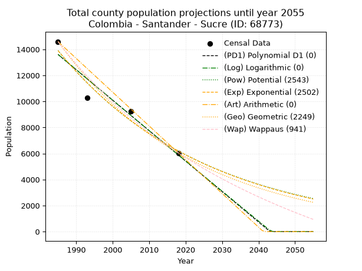
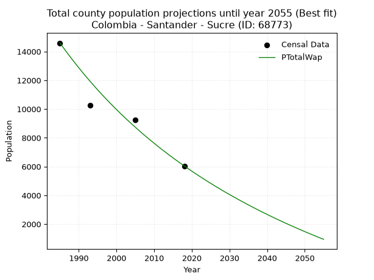
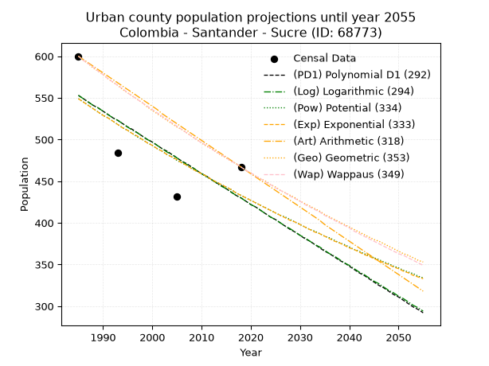
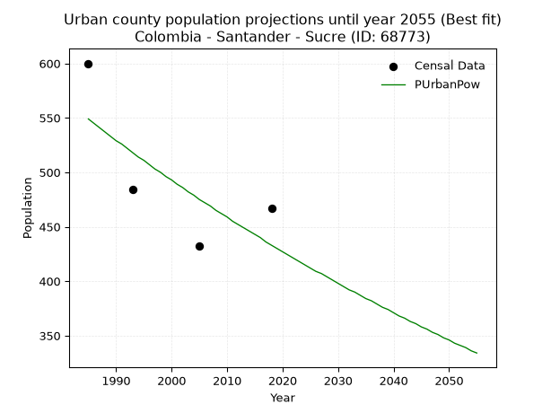
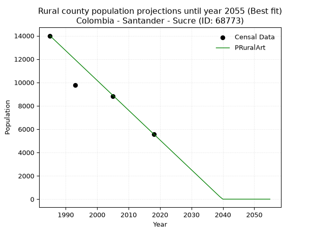

<div align="center">


</div>

# 📜 _“Population and Public Services Demand Projections (PPSD) until Year 2050 for Colombia - Santander - Sucre (ID: 68773)”_
Keywords: `population` `public-service` `projection` `lineal` `polynomial` `logarithmic` `potential` `exponential` `arithmetic` `geometric` `wappaus` `dane` `colombia` `south-america`

PPSD are analytical estimates used by governments and planners to anticipate future changes in population size, age distribution, and the resulting community needs for utilities, healthcare, education, and infrastructure as sizing future water treatment facilities, electrical grids, and road networks based on spatial growth.

<div align="center">

</img>

</div>


> **General running parameters**: • app_version: _v20260806_. • Python version: _3.14.7_. • Pandas version: _3.0.5_. • NumPy version: _2.5.1_. • Creates, save and include plots into reports (create_plot): _False_. • Projection until year: _2050_. • Process polynomial degree 2 and up: _False_. • Process Wappaus: _True_. • Process Wappaus: _True_. • Set negative values to zero: _True_. • Set infinite values to zero: _True_. • Drop dataset notes: _True_. 
<div align="center">

Dynamic map: [:earth_americas:Google](http://maps.google.com/maps?q=5.918743424,-73.7909746) [:earth_americas:OSM](https://www.openstreetmap.org/#map=18/5.918743424/-73.7909746&layers=P) [:earth_americas:Bing](https://www.bing.com/maps?cp=5.918743424~-73.7909746&lvl=18) [:earth_americas:Apple](https://maps.apple.com/frame?center=5.918743424%2C-73.7909746&span=0.003%2C0.006)

</div>


<div align="center">

```geojson
{
  "type": "Feature",
  "geometry": {
    "type": "Point", 
    "coordinates": [-73.7909746, 5.918743424]
  }, 
  "properties": {
    "Name": "Colombia - Santander - Sucre (ID: 68773)"
  }
}
```

</div>


## 0. Census Data (4 records)

Census data are official statistics collected by a government about the people and housing in a country. They usually include counts of total population, age, sex, race, income, education, and jobs.

📅Global census file: [Population.xlsx](../data/Population.xlsx)

| Source   |   Year |   CountryID | CountryName   |   StateID | StateName   |   CountyID | CountyName   |   PTotal |   PUrban |   PRural |
|:---------|-------:|------------:|:--------------|----------:|:------------|-----------:|:-------------|---------:|---------:|---------:|
| DANE     |   1985 |          57 | Colombia      |        68 | Santander   |      68773 | Sucre        |    14595 |      600 |    13995 |
| DANE     |   1993 |          57 | Colombia      |        68 | Santander   |      68773 | Sucre        |    10258 |      484 |     9774 |
| DANE     |   2005 |          57 | Colombia      |        68 | Santander   |      68773 | Sucre        |     9256 |      432 |     8824 |
| DANE     |   2018 |          57 | Colombia      |        68 | Santander   |      68773 | Sucre        |     6044 |      467 |     5577 |

> 🔥Some records could had specific notes about the registered values or the corresponding urban or rural distribution.

📅[SUI-RUPS](https://www.datos.gov.co/Hacienda-y-Cr-dito-P-blico/Registro-nico-de-Prestadores-de-Servicios-P-blicos/4qkq-csdn/about_data) - Local public utility companies: [RUPS.csv](../data/RUPS.csv)

 | SERVICIO       | ESTADO    | NOMBRE             | NIT         | DEPARTAMENTO_DOMICILIO   | MUNICIPIO_DOMICILIO   | DIRECCION                        |   TELEFONO | EMAIL                               | TIPO_PRESTADOR                 | CLASIFICACION                 |
|:---------------|:----------|:-------------------|:------------|:-------------------------|:----------------------|:---------------------------------|-----------:|:------------------------------------|:-------------------------------|:------------------------------|
| ACUEDUCTO      | OPERATIVA | MUNICIPIO DE SUCRE | 890210883-7 | SANTANDER                | SUCRE                 | PALACIO MUNICIPAL SUCRE SANTADER |    7565626 | planeacion.sucre2016.2019@gmail.com | MUNICIPIO (PRESTACIÓN DIRECTA) | MENOR O IGUAL A 2500 USUARIOS |
| ALCANTARILLADO | OPERATIVA | MUNICIPIO DE SUCRE | 890210883-7 | SANTANDER                | SUCRE                 | PALACIO MUNICIPAL SUCRE SANTADER |    7565626 | planeacion.sucre2016.2019@gmail.com | MUNICIPIO (PRESTACIÓN DIRECTA) | MENOR O IGUAL A 2500 USUARIOS |

## 1. Total

### 1.1. Coefficients and Parameters

* (PD1) Polynomial Deg 1: -233.95784825371123, 478012.43596948596 (lineal)
* (Log) Logarithmic: -468464.06941917876, 3570837.3956906297
* (Pow) Potential: -49.03305266660082, 165.84257902903065
* (Exp) Exponential: -0.024496684496842416, 1.823740935946615e+25
* (Art) Arithmetic: Year diff. 2018 - 1985 = 33, Population diff. 6044 - 14595 = -8551, Annual growth = -259.1212121212121
* (Geo) Geometric: Year diff. 2018 - 1985 = 33, Population diff. 6044 - 14595 = -8551, Annual growth % = -0.026361840879695286
* (Wap) Wappaus: i = -2.5109861148428907, Condition values only valid for < 200)

<sub>
Wappaus condition values: ['-0.00', '-2.51', '-5.02', '-7.53', '-10.04', '-12.55', '-15.07', '-17.58', '-20.09', '-22.60', '-25.11', '-27.62', '-30.13', '-32.64', '-35.15', '-37.66', '-40.18', '-42.69', '-45.20', '-47.71', '-50.22', '-52.73', '-55.24', '-57.75', '-60.26', '-62.77', '-65.29', '-67.80', '-70.31', '-72.82', '-75.33', '-77.84', '-80.35', '-82.86', '-85.37', '-87.88', '-90.40', '-92.91', '-95.42', '-97.93', '-100.44', '-102.95', '-105.46', '-107.97', '-110.48', '-112.99', '-115.51', '-118.02', '-120.53', '-123.04', '-125.55', '-128.06', '-130.57', '-133.08', '-135.59', '-138.10', '-140.62', '-143.13', '-145.64', '-148.15', '-150.66', '-153.17', '-155.68', '-158.19', '-160.70', '-163.21']
</sub>


### 1.2. Projected Dataset

|   Year |   CountyID |   PTotalPD1 |   PTotalLog |   PTotalPow |   PTotalExp |   PTotalArt |   PTotalGeo |   PTotalWap |
|-------:|-----------:|------------:|------------:|------------:|------------:|------------:|------------:|------------:|
|   1985 |      68773 |       13606 |       13614 |       13910 |       13899 |       14595 |       14595 |       14595 |
|   1986 |      68773 |       13372 |       13378 |       13570 |       13563 |       14336 |       14210 |       14233 |
|   1987 |      68773 |       13138 |       13143 |       13239 |       13235 |       14077 |       13836 |       13880 |
|   1988 |      68773 |       12904 |       12907 |       12917 |       12915 |       13818 |       13471 |       13535 |
|   1989 |      68773 |       12670 |       12671 |       12602 |       12602 |       13559 |       13116 |       13199 |
|   1990 |      68773 |       12436 |       12436 |       12295 |       12297 |       13299 |       12770 |       12871 |
|   1991 |      68773 |       12202 |       12201 |       11996 |       11999 |       13040 |       12433 |       12550 |
|   1992 |      68773 |       11968 |       11965 |       11704 |       11709 |       12781 |       12106 |       12237 |
|   1993 |      68773 |       11734 |       11730 |       11420 |       11426 |       12522 |       11786 |       11931 |
|   1994 |      68773 |       11500 |       11495 |       11142 |       11149 |       12263 |       11476 |       11632 |
|   1995 |      68773 |       11267 |       11260 |       10872 |       10879 |       12004 |       11173 |       11339 |
|   1996 |      68773 |       11033 |       11026 |       10608 |       10616 |       11745 |       10879 |       11053 |
|   1997 |      68773 |       10799 |       10791 |       10351 |       10359 |       11486 |       10592 |       10773 |
|   1998 |      68773 |       10565 |       10556 |       10100 |       10109 |       11226 |       10313 |       10499 |
|   1999 |      68773 |       10331 |       10322 |        9855 |        9864 |       10967 |       10041 |       10231 |
|   2000 |      68773 |       10097 |       10088 |        9616 |        9625 |       10708 |        9776 |        9969 |
|   2001 |      68773 |        9863 |        9854 |        9383 |        9392 |       10449 |        9518 |        9712 |
|   2002 |      68773 |        9629 |        9619 |        9156 |        9165 |       10190 |        9268 |        9461 |
|   2003 |      68773 |        9395 |        9386 |        8935 |        8943 |        9931 |        9023 |        9214 |
|   2004 |      68773 |        9161 |        9152 |        8719 |        8727 |        9672 |        8785 |        8973 |
|   2005 |      68773 |        8927 |        8918 |        8508 |        8516 |        9413 |        8554 |        8736 |
|   2006 |      68773 |        8693 |        8684 |        8303 |        8310 |        9153 |        8328 |        8505 |
|   2007 |      68773 |        8459 |        8451 |        8102 |        8109 |        8894 |        8109 |        8277 |
|   2008 |      68773 |        8225 |        8218 |        7907 |        7912 |        8635 |        7895 |        8055 |
|   2009 |      68773 |        7991 |        7984 |        7716 |        7721 |        8376 |        7687 |        7836 |
|   2010 |      68773 |        7757 |        7751 |        7530 |        7534 |        8117 |        7484 |        7622 |
|   2011 |      68773 |        7523 |        7518 |        7349 |        7352 |        7858 |        7287 |        7411 |
|   2012 |      68773 |        7289 |        7285 |        7172 |        7174 |        7599 |        7095 |        7205 |
|   2013 |      68773 |        7055 |        7053 |        6999 |        7000 |        7340 |        6908 |        7003 |
|   2014 |      68773 |        6821 |        6820 |        6831 |        6831 |        7080 |        6726 |        6804 |
|   2015 |      68773 |        6587 |        6587 |        6666 |        6665 |        6821 |        6548 |        6609 |
|   2016 |      68773 |        6353 |        6355 |        6506 |        6504 |        6562 |        6376 |        6417 |
|   2017 |      68773 |        6119 |        6123 |        6350 |        6347 |        6303 |        6208 |        6229 |
|   2018 |      68773 |        5885 |        5890 |        6197 |        6193 |        6044 |        6044 |        6044 |
|   2019 |      68773 |        5652 |        5658 |        6049 |        6043 |        5785 |        5885 |        5862 |
|   2020 |      68773 |        5418 |        5426 |        5904 |        5897 |        5526 |        5730 |        5684 |
|   2021 |      68773 |        5184 |        5194 |        5762 |        5754 |        5267 |        5578 |        5509 |
|   2022 |      68773 |        4950 |        4963 |        5624 |        5615 |        5008 |        5431 |        5336 |
|   2023 |      68773 |        4716 |        4731 |        5489 |        5479 |        4748 |        5288 |        5167 |
|   2024 |      68773 |        4482 |        4500 |        5358 |        5347 |        4489 |        5149 |        5000 |
|   2025 |      68773 |        4248 |        4268 |        5230 |        5217 |        4230 |        5013 |        4837 |
|   2026 |      68773 |        4014 |        4037 |        5104 |        5091 |        3971 |        4881 |        4675 |
|   2027 |      68773 |        3780 |        3806 |        4982 |        4968 |        3712 |        4752 |        4517 |
|   2028 |      68773 |        3546 |        3575 |        4863 |        4848 |        3453 |        4627 |        4361 |
|   2029 |      68773 |        3312 |        3344 |        4747 |        4730 |        3194 |        4505 |        4208 |
|   2030 |      68773 |        3078 |        3113 |        4634 |        4616 |        2935 |        4386 |        4057 |
|   2031 |      68773 |        2844 |        2882 |        4523 |        4504 |        2675 |        4271 |        3909 |
|   2032 |      68773 |        2610 |        2652 |        4416 |        4395 |        2416 |        4158 |        3763 |
|   2033 |      68773 |        2376 |        2421 |        4310 |        4289 |        2157 |        4048 |        3619 |
|   2034 |      68773 |        2142 |        2191 |        4208 |        4185 |        1898 |        3942 |        3477 |
|   2035 |      68773 |        1908 |        1960 |        4107 |        4084 |        1639 |        3838 |        3338 |
|   2036 |      68773 |        1674 |        1730 |        4010 |        3985 |        1380 |        3737 |        3201 |
|   2037 |      68773 |        1440 |        1500 |        3914 |        3888 |        1121 |        3638 |        3065 |
|   2038 |      68773 |        1206 |        1270 |        3821 |        3794 |         862 |        3542 |        2932 |
|   2039 |      68773 |         972 |        1041 |        3730 |        3703 |         602 |        3449 |        2801 |
|   2040 |      68773 |         738 |         811 |        3642 |        3613 |         343 |        3358 |        2672 |
|   2041 |      68773 |         504 |         581 |        3555 |        3526 |          84 |        3269 |        2545 |
|   2042 |      68773 |         271 |         352 |        3471 |        3440 |           0 |        3183 |        2419 |
|   2043 |      68773 |          37 |         122 |        3389 |        3357 |           0 |        3099 |        2296 |
|   2044 |      68773 |           0 |           0 |        3308 |        3276 |           0 |        3018 |        2174 |
|   2045 |      68773 |           0 |           0 |        3230 |        3196 |           0 |        2938 |        2054 |
|   2046 |      68773 |           0 |           0 |        3153 |        3119 |           0 |        2861 |        1935 |
|   2047 |      68773 |           0 |           0 |        3079 |        3044 |           0 |        2785 |        1819 |
|   2048 |      68773 |           0 |           0 |        3006 |        2970 |           0 |        2712 |        1704 |
|   2049 |      68773 |           0 |           0 |        2935 |        2898 |           0 |        2640 |        1590 |
|   2050 |      68773 |           0 |           0 |        2865 |        2828 |           0 |        2571 |        1478 |
<div align="center">

</img>

</div>


### 1.3. Best fit with absolute and relative error (%)

Relative error puts that difference into context by dividing the absolute error by the true value, creating a unitless ratio or percentage that shows the scale of the mistake.

Absolute and relative error

|   Year | Source   |   CountryID | CountryName   |   StateID | StateName   |   CountyID_x | CountyName   |   PTotal |   PUrban |   PRural |   CountyID_y |   PTotalPD1 |   PTotalLog |   PTotalPow |   PTotalExp |   PTotalArt |   PTotalGeo |   PTotalWap |   PTotalPD1AbsError |   PTotalLogAbsError |   PTotalPowAbsError |   PTotalExpAbsError |   PTotalArtAbsError |   PTotalGeoAbsError |   PTotalWapAbsError |   PTotalPD1RelError |   PTotalLogRelError |   PTotalPowRelError |   PTotalExpRelError |   PTotalArtRelError |   PTotalGeoRelError |   PTotalWapRelError |
|-------:|:---------|------------:|:--------------|----------:|:------------|-------------:|:-------------|---------:|---------:|---------:|-------------:|------------:|------------:|------------:|------------:|------------:|------------:|------------:|--------------------:|--------------------:|--------------------:|--------------------:|--------------------:|--------------------:|--------------------:|--------------------:|--------------------:|--------------------:|--------------------:|--------------------:|--------------------:|--------------------:|
|   1985 | DANE     |          57 | Colombia      |        68 | Santander   |        68773 | Sucre        |    14595 |      600 |    13995 |        68773 |       13606 |       13614 |       13910 |       13899 |       14595 |       14595 |       14595 |                 989 |                 981 |                 685 |                 696 |                   0 |                   0 |                   0 |             6.77629 |             6.72148 |             4.69339 |             4.76876 |              0      |             0       |             0       |
|   1993 | DANE     |          57 | Colombia      |        68 | Santander   |        68773 | Sucre        |    10258 |      484 |     9774 |        68773 |       11734 |       11730 |       11420 |       11426 |       12522 |       11786 |       11931 |                1476 |                1472 |                1162 |                1168 |                2264 |                1528 |                1673 |            14.3888  |            14.3498  |            11.3277  |            11.3862  |             22.0706 |            14.8957  |            16.3092  |
|   2005 | DANE     |          57 | Colombia      |        68 | Santander   |        68773 | Sucre        |     9256 |      432 |     8824 |        68773 |        8927 |        8918 |        8508 |        8516 |        9413 |        8554 |        8736 |                 329 |                 338 |                 748 |                 740 |                 157 |                 702 |                 520 |             3.55445 |             3.65169 |             8.08124 |             7.99481 |              1.6962 |             7.58427 |             5.61798 |
|   2018 | DANE     |          57 | Colombia      |        68 | Santander   |        68773 | Sucre        |     6044 |      467 |     5577 |        68773 |        5885 |        5890 |        6197 |        6193 |        6044 |        6044 |        6044 |                 159 |                 154 |                 153 |                 149 |                   0 |                   0 |                   0 |             2.63071 |             2.54798 |             2.53144 |             2.46525 |              0      |             0       |             0       |

Relative error mean

| Method    |   RelError | Best   |
|:----------|-----------:|:-------|
| PTotalPD1 |    6.83756 |        |
| PTotalLog |    6.81773 |        |
| PTotalPow |    6.65845 |        |
| PTotalExp |    6.65377 |        |
| PTotalArt |    5.94169 |        |
| PTotalGeo |    5.61999 |        |
| PTotalWap |    5.4818  | True   |

💙Best method: _**PTotalWap**_
<div align="center">

</img>

</div>


### 1.4. Fresh water supply demand in liters per capita per day (lpcd)

The fresh water supply demand typically ranges from 100 to 300 liters per capita per day (lpcd) for standard domestic and municipal planning, though absolute survival minimums set by the World Health Organization are as low as 7.5 to 20 liters per day, and total consumption in high-income nations can exceed 400 liters.

> `CZ`: Level in meters above the sea level (masl)<br> `WS`: Fresh water supply demand in liters per capita per day (lpcd or l/h/d)<br> `WSAll`: Zonal fresh water supply demand in liters per second (l/s)<br> `A`: Zonal area in square meters<br> `DP`: Population density (people/hectare or p/ha)

Reference values (RAS Colombia)

|    CZ |   WS |
|------:|-----:|
|  1000 |  120 |
|  2000 |  130 |
| 99999 |  140 |

County shapefile geometry properties and water supply values

|   CountyID |      ATotal |   CZTotal |   WSTotal |
|-----------:|------------:|----------:|----------:|
|      68773 | 5.21847e+08 |   1559.31 |       130 |

Projected values for best method: PTotalWap

|   CountyID |   Year |   PTotalWap |   DPTotal |   WSTotal |   WSTotalAll |
|-----------:|-------:|------------:|----------:|----------:|-------------:|
|      68773 |   1985 |       14595 |      0.28 |       130 |     21.9601  |
|      68773 |   1986 |       14233 |      0.27 |       130 |     21.4154  |
|      68773 |   1987 |       13880 |      0.27 |       130 |     20.8843  |
|      68773 |   1988 |       13535 |      0.26 |       130 |     20.3652  |
|      68773 |   1989 |       13199 |      0.25 |       130 |     19.8596  |
|      68773 |   1990 |       12871 |      0.25 |       130 |     19.3661  |
|      68773 |   1991 |       12550 |      0.24 |       130 |     18.8831  |
|      68773 |   1992 |       12237 |      0.23 |       130 |     18.4122  |
|      68773 |   1993 |       11931 |      0.23 |       130 |     17.9517  |
|      68773 |   1994 |       11632 |      0.22 |       130 |     17.5019  |
|      68773 |   1995 |       11339 |      0.22 |       130 |     17.061   |
|      68773 |   1996 |       11053 |      0.21 |       130 |     16.6307  |
|      68773 |   1997 |       10773 |      0.21 |       130 |     16.2094  |
|      68773 |   1998 |       10499 |      0.2  |       130 |     15.7971  |
|      68773 |   1999 |       10231 |      0.2  |       130 |     15.3939  |
|      68773 |   2000 |        9969 |      0.19 |       130 |     14.9997  |
|      68773 |   2001 |        9712 |      0.19 |       130 |     14.613   |
|      68773 |   2002 |        9461 |      0.18 |       130 |     14.2353  |
|      68773 |   2003 |        9214 |      0.18 |       130 |     13.8637  |
|      68773 |   2004 |        8973 |      0.17 |       130 |     13.501   |
|      68773 |   2005 |        8736 |      0.17 |       130 |     13.1444  |
|      68773 |   2006 |        8505 |      0.16 |       130 |     12.7969  |
|      68773 |   2007 |        8277 |      0.16 |       130 |     12.4538  |
|      68773 |   2008 |        8055 |      0.15 |       130 |     12.1198  |
|      68773 |   2009 |        7836 |      0.15 |       130 |     11.7903  |
|      68773 |   2010 |        7622 |      0.15 |       130 |     11.4683  |
|      68773 |   2011 |        7411 |      0.14 |       130 |     11.1508  |
|      68773 |   2012 |        7205 |      0.14 |       130 |     10.8409  |
|      68773 |   2013 |        7003 |      0.13 |       130 |     10.5369  |
|      68773 |   2014 |        6804 |      0.13 |       130 |     10.2375  |
|      68773 |   2015 |        6609 |      0.13 |       130 |      9.9441  |
|      68773 |   2016 |        6417 |      0.12 |       130 |      9.65521 |
|      68773 |   2017 |        6229 |      0.12 |       130 |      9.37234 |
|      68773 |   2018 |        6044 |      0.12 |       130 |      9.09398 |
|      68773 |   2019 |        5862 |      0.11 |       130 |      8.82014 |
|      68773 |   2020 |        5684 |      0.11 |       130 |      8.55231 |
|      68773 |   2021 |        5509 |      0.11 |       130 |      8.289   |
|      68773 |   2022 |        5336 |      0.1  |       130 |      8.0287  |
|      68773 |   2023 |        5167 |      0.1  |       130 |      7.77442 |
|      68773 |   2024 |        5000 |      0.1  |       130 |      7.52315 |
|      68773 |   2025 |        4837 |      0.09 |       130 |      7.27789 |
|      68773 |   2026 |        4675 |      0.09 |       130 |      7.03414 |
|      68773 |   2027 |        4517 |      0.09 |       130 |      6.79641 |
|      68773 |   2028 |        4361 |      0.08 |       130 |      6.56169 |
|      68773 |   2029 |        4208 |      0.08 |       130 |      6.33148 |
|      68773 |   2030 |        4057 |      0.08 |       130 |      6.10428 |
|      68773 |   2031 |        3909 |      0.07 |       130 |      5.8816  |
|      68773 |   2032 |        3763 |      0.07 |       130 |      5.66192 |
|      68773 |   2033 |        3619 |      0.07 |       130 |      5.44525 |
|      68773 |   2034 |        3477 |      0.07 |       130 |      5.2316  |
|      68773 |   2035 |        3338 |      0.06 |       130 |      5.02245 |
|      68773 |   2036 |        3201 |      0.06 |       130 |      4.81632 |
|      68773 |   2037 |        3065 |      0.06 |       130 |      4.61169 |
|      68773 |   2038 |        2932 |      0.06 |       130 |      4.41157 |
|      68773 |   2039 |        2801 |      0.05 |       130 |      4.21447 |
|      68773 |   2040 |        2672 |      0.05 |       130 |      4.02037 |
|      68773 |   2041 |        2545 |      0.05 |       130 |      3.82928 |
|      68773 |   2042 |        2419 |      0.05 |       130 |      3.6397  |
|      68773 |   2043 |        2296 |      0.04 |       130 |      3.45463 |
|      68773 |   2044 |        2174 |      0.04 |       130 |      3.27106 |
|      68773 |   2045 |        2054 |      0.04 |       130 |      3.09051 |
|      68773 |   2046 |        1935 |      0.04 |       130 |      2.91146 |
|      68773 |   2047 |        1819 |      0.03 |       130 |      2.73692 |
|      68773 |   2048 |        1704 |      0.03 |       130 |      2.56389 |
|      68773 |   2049 |        1590 |      0.03 |       130 |      2.39236 |
|      68773 |   2050 |        1478 |      0.03 |       130 |      2.22384 |

## 2. Urban

### 2.1. Coefficients and Parameters

* (PD1) Polynomial Deg 1: -3.7217984745082484, 7940.277398635123 (lineal)
* (Log) Logarithmic: -7465.475386850792, 57240.88824001809
* (Pow) Potential: -14.33702464432828, 50.0195549400717
* (Exp) Exponential: -0.007147213083836803, 795638363.1353935
* (Art) Arithmetic: Year diff. 2018 - 1985 = 33, Population diff. 467 - 600 = -133, Annual growth = -4.03030303030303
* (Geo) Geometric: Year diff. 2018 - 1985 = 33, Population diff. 467 - 600 = -133, Annual growth % = -0.007565190241349273
* (Wap) Wappaus: i = -0.7554457413876345, Condition values only valid for < 200)

<sub>
Wappaus condition values: ['-0.00', '-0.76', '-1.51', '-2.27', '-3.02', '-3.78', '-4.53', '-5.29', '-6.04', '-6.80', '-7.55', '-8.31', '-9.07', '-9.82', '-10.58', '-11.33', '-12.09', '-12.84', '-13.60', '-14.35', '-15.11', '-15.86', '-16.62', '-17.38', '-18.13', '-18.89', '-19.64', '-20.40', '-21.15', '-21.91', '-22.66', '-23.42', '-24.17', '-24.93', '-25.69', '-26.44', '-27.20', '-27.95', '-28.71', '-29.46', '-30.22', '-30.97', '-31.73', '-32.48', '-33.24', '-34.00', '-34.75', '-35.51', '-36.26', '-37.02', '-37.77', '-38.53', '-39.28', '-40.04', '-40.79', '-41.55', '-42.30', '-43.06', '-43.82', '-44.57', '-45.33', '-46.08', '-46.84', '-47.59', '-48.35', '-49.10']
</sub>


### 2.2. Projected Dataset

|   Year |   CountyID |   PUrbanPD1 |   PUrbanLog |   PUrbanPow |   PUrbanExp |   PUrbanArt |   PUrbanGeo |   PUrbanWap |
|-------:|-----------:|------------:|------------:|------------:|------------:|------------:|------------:|------------:|
|   1985 |      68773 |         553 |         553 |         549 |         549 |         600 |         600 |         600 |
|   1986 |      68773 |         549 |         549 |         545 |         545 |         596 |         595 |         595 |
|   1987 |      68773 |         545 |         545 |         541 |         541 |         592 |         591 |         591 |
|   1988 |      68773 |         541 |         541 |         537 |         537 |         588 |         586 |         587 |
|   1989 |      68773 |         538 |         538 |         533 |         533 |         584 |         582 |         582 |
|   1990 |      68773 |         534 |         534 |         529 |         529 |         580 |         578 |         578 |
|   1991 |      68773 |         530 |         530 |         526 |         526 |         576 |         573 |         573 |
|   1992 |      68773 |         526 |         526 |         522 |         522 |         572 |         569 |         569 |
|   1993 |      68773 |         523 |         523 |         518 |         518 |         568 |         565 |         565 |
|   1994 |      68773 |         519 |         519 |         514 |         514 |         564 |         560 |         561 |
|   1995 |      68773 |         515 |         515 |         511 |         511 |         560 |         556 |         556 |
|   1996 |      68773 |         512 |         511 |         507 |         507 |         556 |         552 |         552 |
|   1997 |      68773 |         508 |         508 |         503 |         504 |         552 |         548 |         548 |
|   1998 |      68773 |         504 |         504 |         500 |         500 |         548 |         544 |         544 |
|   1999 |      68773 |         500 |         500 |         496 |         496 |         544 |         539 |         540 |
|   2000 |      68773 |         497 |         497 |         493 |         493 |         540 |         535 |         536 |
|   2001 |      68773 |         493 |         493 |         489 |         489 |         536 |         531 |         532 |
|   2002 |      68773 |         489 |         489 |         486 |         486 |         531 |         527 |         528 |
|   2003 |      68773 |         486 |         485 |         482 |         482 |         527 |         523 |         524 |
|   2004 |      68773 |         482 |         482 |         479 |         479 |         523 |         519 |         520 |
|   2005 |      68773 |         478 |         478 |         475 |         476 |         519 |         515 |         516 |
|   2006 |      68773 |         474 |         474 |         472 |         472 |         515 |         512 |         512 |
|   2007 |      68773 |         471 |         470 |         469 |         469 |         511 |         508 |         508 |
|   2008 |      68773 |         467 |         467 |         465 |         465 |         507 |         504 |         504 |
|   2009 |      68773 |         463 |         463 |         462 |         462 |         503 |         500 |         500 |
|   2010 |      68773 |         459 |         459 |         459 |         459 |         499 |         496 |         496 |
|   2011 |      68773 |         456 |         456 |         455 |         456 |         495 |         492 |         493 |
|   2012 |      68773 |         452 |         452 |         452 |         452 |         491 |         489 |         489 |
|   2013 |      68773 |         448 |         448 |         449 |         449 |         487 |         485 |         485 |
|   2014 |      68773 |         445 |         444 |         446 |         446 |         483 |         481 |         482 |
|   2015 |      68773 |         441 |         441 |         443 |         443 |         479 |         478 |         478 |
|   2016 |      68773 |         437 |         437 |         440 |         440 |         475 |         474 |         474 |
|   2017 |      68773 |         433 |         433 |         436 |         436 |         471 |         471 |         471 |
|   2018 |      68773 |         430 |         430 |         433 |         433 |         467 |         467 |         467 |
|   2019 |      68773 |         426 |         426 |         430 |         430 |         463 |         463 |         463 |
|   2020 |      68773 |         422 |         422 |         427 |         427 |         459 |         460 |         460 |
|   2021 |      68773 |         419 |         419 |         424 |         424 |         455 |         456 |         456 |
|   2022 |      68773 |         415 |         415 |         421 |         421 |         451 |         453 |         453 |
|   2023 |      68773 |         411 |         411 |         418 |         418 |         447 |         450 |         449 |
|   2024 |      68773 |         407 |         407 |         415 |         415 |         443 |         446 |         446 |
|   2025 |      68773 |         404 |         404 |         412 |         412 |         439 |         443 |         442 |
|   2026 |      68773 |         400 |         400 |         409 |         409 |         435 |         439 |         439 |
|   2027 |      68773 |         396 |         396 |         407 |         406 |         431 |         436 |         436 |
|   2028 |      68773 |         392 |         393 |         404 |         403 |         427 |         433 |         432 |
|   2029 |      68773 |         389 |         389 |         401 |         401 |         423 |         430 |         429 |
|   2030 |      68773 |         385 |         385 |         398 |         398 |         419 |         426 |         426 |
|   2031 |      68773 |         381 |         382 |         395 |         395 |         415 |         423 |         422 |
|   2032 |      68773 |         378 |         378 |         392 |         392 |         411 |         420 |         419 |
|   2033 |      68773 |         374 |         374 |         390 |         389 |         407 |         417 |         416 |
|   2034 |      68773 |         370 |         371 |         387 |         387 |         403 |         414 |         413 |
|   2035 |      68773 |         366 |         367 |         384 |         384 |         398 |         410 |         409 |
|   2036 |      68773 |         363 |         363 |         382 |         381 |         394 |         407 |         406 |
|   2037 |      68773 |         359 |         360 |         379 |         378 |         390 |         404 |         403 |
|   2038 |      68773 |         355 |         356 |         376 |         376 |         386 |         401 |         400 |
|   2039 |      68773 |         352 |         352 |         374 |         373 |         382 |         398 |         397 |
|   2040 |      68773 |         348 |         349 |         371 |         370 |         378 |         395 |         394 |
|   2041 |      68773 |         344 |         345 |         368 |         368 |         374 |         392 |         390 |
|   2042 |      68773 |         340 |         341 |         366 |         365 |         370 |         389 |         387 |
|   2043 |      68773 |         337 |         338 |         363 |         362 |         366 |         386 |         384 |
|   2044 |      68773 |         333 |         334 |         361 |         360 |         362 |         383 |         381 |
|   2045 |      68773 |         329 |         330 |         358 |         357 |         358 |         380 |         378 |
|   2046 |      68773 |         325 |         327 |         356 |         355 |         354 |         378 |         375 |
|   2047 |      68773 |         322 |         323 |         353 |         352 |         350 |         375 |         372 |
|   2048 |      68773 |         318 |         319 |         351 |         350 |         346 |         372 |         369 |
|   2049 |      68773 |         314 |         316 |         348 |         347 |         342 |         369 |         366 |
|   2050 |      68773 |         311 |         312 |         346 |         345 |         338 |         366 |         363 |
<div align="center">

</img>

</div>


### 2.3. Best fit with absolute and relative error (%)

Relative error puts that difference into context by dividing the absolute error by the true value, creating a unitless ratio or percentage that shows the scale of the mistake.

Absolute and relative error

|   Year | Source   |   CountryID | CountryName   |   StateID | StateName   |   CountyID_x | CountyName   |   PTotal |   PUrban |   PRural |   CountyID_y |   PUrbanPD1 |   PUrbanLog |   PUrbanPow |   PUrbanExp |   PUrbanArt |   PUrbanGeo |   PUrbanWap |   PUrbanPD1AbsError |   PUrbanLogAbsError |   PUrbanPowAbsError |   PUrbanExpAbsError |   PUrbanArtAbsError |   PUrbanGeoAbsError |   PUrbanWapAbsError |   PUrbanPD1RelError |   PUrbanLogRelError |   PUrbanPowRelError |   PUrbanExpRelError |   PUrbanArtRelError |   PUrbanGeoRelError |   PUrbanWapRelError |
|-------:|:---------|------------:|:--------------|----------:|:------------|-------------:|:-------------|---------:|---------:|---------:|-------------:|------------:|------------:|------------:|------------:|------------:|------------:|------------:|--------------------:|--------------------:|--------------------:|--------------------:|--------------------:|--------------------:|--------------------:|--------------------:|--------------------:|--------------------:|--------------------:|--------------------:|--------------------:|--------------------:|
|   1985 | DANE     |          57 | Colombia      |        68 | Santander   |        68773 | Sucre        |    14595 |      600 |    13995 |        68773 |         553 |         553 |         549 |         549 |         600 |         600 |         600 |                  47 |                  47 |                  51 |                  51 |                   0 |                   0 |                   0 |             7.83333 |             7.83333 |             8.5     |             8.5     |              0      |              0      |              0      |
|   1993 | DANE     |          57 | Colombia      |        68 | Santander   |        68773 | Sucre        |    10258 |      484 |     9774 |        68773 |         523 |         523 |         518 |         518 |         568 |         565 |         565 |                  39 |                  39 |                  34 |                  34 |                  84 |                  81 |                  81 |             8.05785 |             8.05785 |             7.02479 |             7.02479 |             17.3554 |             16.7355 |             16.7355 |
|   2005 | DANE     |          57 | Colombia      |        68 | Santander   |        68773 | Sucre        |     9256 |      432 |     8824 |        68773 |         478 |         478 |         475 |         476 |         519 |         515 |         516 |                  46 |                  46 |                  43 |                  44 |                  87 |                  83 |                  84 |            10.6481  |            10.6481  |             9.9537  |            10.1852  |             20.1389 |             19.213  |             19.4444 |
|   2018 | DANE     |          57 | Colombia      |        68 | Santander   |        68773 | Sucre        |     6044 |      467 |     5577 |        68773 |         430 |         430 |         433 |         433 |         467 |         467 |         467 |                  37 |                  37 |                  34 |                  34 |                   0 |                   0 |                   0 |             7.92291 |             7.92291 |             7.28051 |             7.28051 |              0      |              0      |              0      |

Relative error mean

| Method    |   RelError | Best   |
|:----------|-----------:|:-------|
| PUrbanPD1 |    8.61556 |        |
| PUrbanLog |    8.61556 |        |
| PUrbanPow |    8.18975 | True   |
| PUrbanExp |    8.24762 |        |
| PUrbanArt |    9.37357 |        |
| PUrbanGeo |    8.98713 |        |
| PUrbanWap |    9.045   |        |

💙Best method: _**PUrbanPow**_
<div align="center">

</img>

</div>


### 2.4. Fresh water supply demand in liters per capita per day (lpcd)

The fresh water supply demand typically ranges from 100 to 300 liters per capita per day (lpcd) for standard domestic and municipal planning, though absolute survival minimums set by the World Health Organization are as low as 7.5 to 20 liters per day, and total consumption in high-income nations can exceed 400 liters.

> `CZ`: Level in meters above the sea level (masl)<br> `WS`: Fresh water supply demand in liters per capita per day (lpcd or l/h/d)<br> `WSAll`: Zonal fresh water supply demand in liters per second (l/s)<br> `A`: Zonal area in square meters<br> `DP`: Population density (people/hectare or p/ha)

Reference values (RAS Colombia)

|    CZ |   WS |
|------:|-----:|
|  1000 |  120 |
|  2000 |  130 |
| 99999 |  140 |

County shapefile geometry properties and water supply values

|   CountyID |   AUrban |   CZUrban |   WSUrban |
|-----------:|---------:|----------:|----------:|
|      68773 |   202667 |   2157.39 |       140 |

Projected values for best method: PUrbanPow

|   CountyID |   Year |   PUrbanPow |   DPUrban |   WSUrban |   WSUrbanAll |
|-----------:|-------:|------------:|----------:|----------:|-------------:|
|      68773 |   1985 |         549 |     27.09 |       140 |     0.889583 |
|      68773 |   1986 |         545 |     26.89 |       140 |     0.883102 |
|      68773 |   1987 |         541 |     26.69 |       140 |     0.87662  |
|      68773 |   1988 |         537 |     26.5  |       140 |     0.870139 |
|      68773 |   1989 |         533 |     26.3  |       140 |     0.863657 |
|      68773 |   1990 |         529 |     26.1  |       140 |     0.857176 |
|      68773 |   1991 |         526 |     25.95 |       140 |     0.852315 |
|      68773 |   1992 |         522 |     25.76 |       140 |     0.845833 |
|      68773 |   1993 |         518 |     25.56 |       140 |     0.839352 |
|      68773 |   1994 |         514 |     25.36 |       140 |     0.83287  |
|      68773 |   1995 |         511 |     25.21 |       140 |     0.828009 |
|      68773 |   1996 |         507 |     25.02 |       140 |     0.821528 |
|      68773 |   1997 |         503 |     24.82 |       140 |     0.815046 |
|      68773 |   1998 |         500 |     24.67 |       140 |     0.810185 |
|      68773 |   1999 |         496 |     24.47 |       140 |     0.803704 |
|      68773 |   2000 |         493 |     24.33 |       140 |     0.798843 |
|      68773 |   2001 |         489 |     24.13 |       140 |     0.792361 |
|      68773 |   2002 |         486 |     23.98 |       140 |     0.7875   |
|      68773 |   2003 |         482 |     23.78 |       140 |     0.781019 |
|      68773 |   2004 |         479 |     23.63 |       140 |     0.776157 |
|      68773 |   2005 |         475 |     23.44 |       140 |     0.769676 |
|      68773 |   2006 |         472 |     23.29 |       140 |     0.764815 |
|      68773 |   2007 |         469 |     23.14 |       140 |     0.759954 |
|      68773 |   2008 |         465 |     22.94 |       140 |     0.753472 |
|      68773 |   2009 |         462 |     22.8  |       140 |     0.748611 |
|      68773 |   2010 |         459 |     22.65 |       140 |     0.74375  |
|      68773 |   2011 |         455 |     22.45 |       140 |     0.737269 |
|      68773 |   2012 |         452 |     22.3  |       140 |     0.732407 |
|      68773 |   2013 |         449 |     22.15 |       140 |     0.727546 |
|      68773 |   2014 |         446 |     22.01 |       140 |     0.722685 |
|      68773 |   2015 |         443 |     21.86 |       140 |     0.717824 |
|      68773 |   2016 |         440 |     21.71 |       140 |     0.712963 |
|      68773 |   2017 |         436 |     21.51 |       140 |     0.706481 |
|      68773 |   2018 |         433 |     21.37 |       140 |     0.70162  |
|      68773 |   2019 |         430 |     21.22 |       140 |     0.696759 |
|      68773 |   2020 |         427 |     21.07 |       140 |     0.691898 |
|      68773 |   2021 |         424 |     20.92 |       140 |     0.687037 |
|      68773 |   2022 |         421 |     20.77 |       140 |     0.682176 |
|      68773 |   2023 |         418 |     20.62 |       140 |     0.677315 |
|      68773 |   2024 |         415 |     20.48 |       140 |     0.672454 |
|      68773 |   2025 |         412 |     20.33 |       140 |     0.667593 |
|      68773 |   2026 |         409 |     20.18 |       140 |     0.662731 |
|      68773 |   2027 |         407 |     20.08 |       140 |     0.659491 |
|      68773 |   2028 |         404 |     19.93 |       140 |     0.65463  |
|      68773 |   2029 |         401 |     19.79 |       140 |     0.649769 |
|      68773 |   2030 |         398 |     19.64 |       140 |     0.644907 |
|      68773 |   2031 |         395 |     19.49 |       140 |     0.640046 |
|      68773 |   2032 |         392 |     19.34 |       140 |     0.635185 |
|      68773 |   2033 |         390 |     19.24 |       140 |     0.631944 |
|      68773 |   2034 |         387 |     19.1  |       140 |     0.627083 |
|      68773 |   2035 |         384 |     18.95 |       140 |     0.622222 |
|      68773 |   2036 |         382 |     18.85 |       140 |     0.618981 |
|      68773 |   2037 |         379 |     18.7  |       140 |     0.61412  |
|      68773 |   2038 |         376 |     18.55 |       140 |     0.609259 |
|      68773 |   2039 |         374 |     18.45 |       140 |     0.606019 |
|      68773 |   2040 |         371 |     18.31 |       140 |     0.601157 |
|      68773 |   2041 |         368 |     18.16 |       140 |     0.596296 |
|      68773 |   2042 |         366 |     18.06 |       140 |     0.593056 |
|      68773 |   2043 |         363 |     17.91 |       140 |     0.588194 |
|      68773 |   2044 |         361 |     17.81 |       140 |     0.584954 |
|      68773 |   2045 |         358 |     17.66 |       140 |     0.580093 |
|      68773 |   2046 |         356 |     17.57 |       140 |     0.576852 |
|      68773 |   2047 |         353 |     17.42 |       140 |     0.571991 |
|      68773 |   2048 |         351 |     17.32 |       140 |     0.56875  |
|      68773 |   2049 |         348 |     17.17 |       140 |     0.563889 |
|      68773 |   2050 |         346 |     17.07 |       140 |     0.560648 |

## 3. Rural

### 3.1. Coefficients and Parameters

* (PD1) Polynomial Deg 1: -230.23604977920294, 470072.15857085073 (lineal)
* (Log) Logarithmic: -460998.5940323279, 3513596.5074506113
* (Pow) Potential: -51.16441502812552, 172.85464201733942
* (Exp) Exponential: -0.025562627255962755, 1.4561938507592128e+26
* (Art) Arithmetic: Year diff. 2018 - 1985 = 33, Population diff. 5577 - 13995 = -8418, Annual growth = -255.0909090909091
* (Geo) Geometric: Year diff. 2018 - 1985 = 33, Population diff. 5577 - 13995 = -8418, Annual growth % = -0.027495208522110737
* (Wap) Wappaus: i = -2.6066923062631218, Condition values only valid for < 200)

<sub>
Wappaus condition values: ['-0.00', '-2.61', '-5.21', '-7.82', '-10.43', '-13.03', '-15.64', '-18.25', '-20.85', '-23.46', '-26.07', '-28.67', '-31.28', '-33.89', '-36.49', '-39.10', '-41.71', '-44.31', '-46.92', '-49.53', '-52.13', '-54.74', '-57.35', '-59.95', '-62.56', '-65.17', '-67.77', '-70.38', '-72.99', '-75.59', '-78.20', '-80.81', '-83.41', '-86.02', '-88.63', '-91.23', '-93.84', '-96.45', '-99.05', '-101.66', '-104.27', '-106.87', '-109.48', '-112.09', '-114.69', '-117.30', '-119.91', '-122.51', '-125.12', '-127.73', '-130.33', '-132.94', '-135.55', '-138.15', '-140.76', '-143.37', '-145.97', '-148.58', '-151.19', '-153.79', '-156.40', '-159.01', '-161.61', '-164.22', '-166.83', '-169.43']
</sub>


### 3.2. Projected Dataset

|   Year |   CountyID |   PRuralPD1 |   PRuralLog |   PRuralPow |   PRuralExp |   PRuralArt |   PRuralGeo |   PRuralWap |
|-------:|-----------:|------------:|------------:|------------:|------------:|------------:|------------:|------------:|
|   1985 |      68773 |       13054 |       13062 |       13386 |       13376 |       13995 |       13995 |       13995 |
|   1986 |      68773 |       12823 |       12829 |       13046 |       13038 |       13740 |       13610 |       13635 |
|   1987 |      68773 |       12593 |       12597 |       12714 |       12709 |       13485 |       13236 |       13284 |
|   1988 |      68773 |       12363 |       12365 |       12391 |       12389 |       13230 |       12872 |       12942 |
|   1989 |      68773 |       12133 |       12134 |       12076 |       12076 |       12975 |       12518 |       12608 |
|   1990 |      68773 |       11902 |       11902 |       11769 |       11771 |       12720 |       12174 |       12283 |
|   1991 |      68773 |       11672 |       11670 |       11471 |       11474 |       12464 |       11839 |       11965 |
|   1992 |      68773 |       11442 |       11439 |       11180 |       11185 |       12209 |       11514 |       11655 |
|   1993 |      68773 |       11212 |       11207 |       10896 |       10902 |       11954 |       11197 |       11352 |
|   1994 |      68773 |       10981 |       10976 |       10620 |       10627 |       11699 |       10889 |       11056 |
|   1995 |      68773 |       10751 |       10745 |       10351 |       10359 |       11444 |       10590 |       10768 |
|   1996 |      68773 |       10521 |       10514 |       10089 |       10097 |       11189 |       10299 |       10485 |
|   1997 |      68773 |       10291 |       10283 |        9834 |        9843 |       10934 |       10016 |       10209 |
|   1998 |      68773 |       10061 |       10052 |        9585 |        9594 |       10679 |        9740 |        9940 |
|   1999 |      68773 |        9830 |        9822 |        9343 |        9352 |       10424 |        9472 |        9676 |
|   2000 |      68773 |        9600 |        9591 |        9107 |        9116 |       10169 |        9212 |        9418 |
|   2001 |      68773 |        9370 |        9361 |        8877 |        8886 |        9914 |        8959 |        9165 |
|   2002 |      68773 |        9140 |        9130 |        8653 |        8662 |        9658 |        8712 |        8918 |
|   2003 |      68773 |        8909 |        8900 |        8435 |        8443 |        9403 |        8473 |        8676 |
|   2004 |      68773 |        8679 |        8670 |        8222 |        8230 |        9148 |        8240 |        8439 |
|   2005 |      68773 |        8449 |        8440 |        8015 |        8022 |        8893 |        8013 |        8207 |
|   2006 |      68773 |        8219 |        8210 |        7813 |        7820 |        8638 |        7793 |        7980 |
|   2007 |      68773 |        7988 |        7980 |        7616 |        7622 |        8383 |        7579 |        7758 |
|   2008 |      68773 |        7758 |        7751 |        7425 |        7430 |        8128 |        7370 |        7540 |
|   2009 |      68773 |        7528 |        7521 |        7238 |        7242 |        7873 |        7168 |        7326 |
|   2010 |      68773 |        7298 |        7292 |        7056 |        7060 |        7618 |        6971 |        7116 |
|   2011 |      68773 |        7067 |        7063 |        6879 |        6882 |        7363 |        6779 |        6911 |
|   2012 |      68773 |        6837 |        6833 |        6706 |        6708 |        7108 |        6593 |        6709 |
|   2013 |      68773 |        6607 |        6604 |        6537 |        6539 |        6852 |        6411 |        6511 |
|   2014 |      68773 |        6377 |        6375 |        6373 |        6374 |        6597 |        6235 |        6317 |
|   2015 |      68773 |        6147 |        6147 |        6214 |        6213 |        6342 |        6064 |        6127 |
|   2016 |      68773 |        5916 |        5918 |        6058 |        6056 |        6087 |        5897 |        5940 |
|   2017 |      68773 |        5686 |        5689 |        5906 |        5903 |        5832 |        5735 |        5757 |
|   2018 |      68773 |        5456 |        5461 |        5758 |        5754 |        5577 |        5577 |        5577 |
|   2019 |      68773 |        5226 |        5232 |        5614 |        5609 |        5322 |        5424 |        5400 |
|   2020 |      68773 |        4995 |        5004 |        5474 |        5467 |        5067 |        5275 |        5227 |
|   2021 |      68773 |        4765 |        4776 |        5337 |        5329 |        4812 |        5130 |        5056 |
|   2022 |      68773 |        4535 |        4548 |        5203 |        5195 |        4557 |        4988 |        4889 |
|   2023 |      68773 |        4305 |        4320 |        5073 |        5064 |        4302 |        4851 |        4724 |
|   2024 |      68773 |        4074 |        4092 |        4947 |        4936 |        4046 |        4718 |        4562 |
|   2025 |      68773 |        3844 |        3864 |        4823 |        4811 |        3791 |        4588 |        4403 |
|   2026 |      68773 |        3614 |        3637 |        4703 |        4690 |        3536 |        4462 |        4247 |
|   2027 |      68773 |        3384 |        3409 |        4586 |        4571 |        3281 |        4339 |        4093 |
|   2028 |      68773 |        3153 |        3182 |        4471 |        4456 |        3026 |        4220 |        3942 |
|   2029 |      68773 |        2923 |        2955 |        4360 |        4344 |        2771 |        4104 |        3794 |
|   2030 |      68773 |        2693 |        2728 |        4251 |        4234 |        2516 |        3991 |        3648 |
|   2031 |      68773 |        2463 |        2500 |        4146 |        4127 |        2261 |        3881 |        3504 |
|   2032 |      68773 |        2233 |        2274 |        4043 |        4023 |        2006 |        3775 |        3362 |
|   2033 |      68773 |        2002 |        2047 |        3942 |        3921 |        1751 |        3671 |        3223 |
|   2034 |      68773 |        1772 |        1820 |        3844 |        3822 |        1496 |        3570 |        3086 |
|   2035 |      68773 |        1542 |        1593 |        3749 |        3726 |        1240 |        3472 |        2951 |
|   2036 |      68773 |        1312 |        1367 |        3656 |        3632 |         985 |        3376 |        2819 |
|   2037 |      68773 |        1081 |        1141 |        3565 |        3540 |         730 |        3284 |        2688 |
|   2038 |      68773 |         851 |         914 |        3477 |        3451 |         475 |        3193 |        2560 |
|   2039 |      68773 |         621 |         688 |        3390 |        3364 |         220 |        3105 |        2433 |
|   2040 |      68773 |         391 |         462 |        3306 |        3279 |           0 |        3020 |        2308 |
|   2041 |      68773 |         160 |         236 |        3224 |        3196 |           0 |        2937 |        2185 |
|   2042 |      68773 |           0 |          10 |        3145 |        3116 |           0 |        2856 |        2064 |
|   2043 |      68773 |           0 |           0 |        3067 |        3037 |           0 |        2778 |        1945 |
|   2044 |      68773 |           0 |           0 |        2991 |        2960 |           0 |        2701 |        1828 |
|   2045 |      68773 |           0 |           0 |        2917 |        2886 |           0 |        2627 |        1712 |
|   2046 |      68773 |           0 |           0 |        2845 |        2813 |           0 |        2555 |        1598 |
|   2047 |      68773 |           0 |           0 |        2775 |        2742 |           0 |        2485 |        1486 |
|   2048 |      68773 |           0 |           0 |        2706 |        2673 |           0 |        2416 |        1375 |
|   2049 |      68773 |           0 |           0 |        2640 |        2605 |           0 |        2350 |        1266 |
|   2050 |      68773 |           0 |           0 |        2575 |        2539 |           0 |        2285 |        1158 |
<div align="center">

</img>

</div>


### 3.3. Best fit with absolute and relative error (%)

Relative error puts that difference into context by dividing the absolute error by the true value, creating a unitless ratio or percentage that shows the scale of the mistake.

Absolute and relative error

|   Year | Source   |   CountryID | CountryName   |   StateID | StateName   |   CountyID_x | CountyName   |   PTotal |   PUrban |   PRural |   CountyID_y |   PRuralPD1 |   PRuralLog |   PRuralPow |   PRuralExp |   PRuralArt |   PRuralGeo |   PRuralWap |   PRuralPD1AbsError |   PRuralLogAbsError |   PRuralPowAbsError |   PRuralExpAbsError |   PRuralArtAbsError |   PRuralGeoAbsError |   PRuralWapAbsError |   PRuralPD1RelError |   PRuralLogRelError |   PRuralPowRelError |   PRuralExpRelError |   PRuralArtRelError |   PRuralGeoRelError |   PRuralWapRelError |
|-------:|:---------|------------:|:--------------|----------:|:------------|-------------:|:-------------|---------:|---------:|---------:|-------------:|------------:|------------:|------------:|------------:|------------:|------------:|------------:|--------------------:|--------------------:|--------------------:|--------------------:|--------------------:|--------------------:|--------------------:|--------------------:|--------------------:|--------------------:|--------------------:|--------------------:|--------------------:|--------------------:|
|   1985 | DANE     |          57 | Colombia      |        68 | Santander   |        68773 | Sucre        |    14595 |      600 |    13995 |        68773 |       13054 |       13062 |       13386 |       13376 |       13995 |       13995 |       13995 |                 941 |                 933 |                 609 |                 619 |                   0 |                   0 |                   0 |             6.72383 |             6.66667 |             4.35155 |             4.42301 |            0        |             0       |             0       |
|   1993 | DANE     |          57 | Colombia      |        68 | Santander   |        68773 | Sucre        |    10258 |      484 |     9774 |        68773 |       11212 |       11207 |       10896 |       10902 |       11954 |       11197 |       11352 |                1438 |                1433 |                1122 |                1128 |                2180 |                1423 |                1578 |            14.7125  |            14.6613  |            11.4794  |            11.5408  |           22.3041   |            14.559   |            16.1449  |
|   2005 | DANE     |          57 | Colombia      |        68 | Santander   |        68773 | Sucre        |     9256 |      432 |     8824 |        68773 |        8449 |        8440 |        8015 |        8022 |        8893 |        8013 |        8207 |                 375 |                 384 |                 809 |                 802 |                  69 |                 811 |                 617 |             4.24977 |             4.35177 |             9.16818 |             9.08885 |            0.781958 |             9.19084 |             6.99229 |
|   2018 | DANE     |          57 | Colombia      |        68 | Santander   |        68773 | Sucre        |     6044 |      467 |     5577 |        68773 |        5456 |        5461 |        5758 |        5754 |        5577 |        5577 |        5577 |                 121 |                 116 |                 181 |                 177 |                   0 |                   0 |                   0 |             2.16963 |             2.07997 |             3.24547 |             3.17375 |            0        |             0       |             0       |

Relative error mean

| Method    |   RelError | Best   |
|:----------|-----------:|:-------|
| PRuralPD1 |    6.96393 |        |
| PRuralLog |    6.93994 |        |
| PRuralPow |    7.06116 |        |
| PRuralExp |    7.05661 |        |
| PRuralArt |    5.77151 | True   |
| PRuralGeo |    5.93747 |        |
| PRuralWap |    5.78429 |        |

💙Best method: _**PRuralArt**_
<div align="center">

</img>

</div>


### 3.4. Fresh water supply demand in liters per capita per day (lpcd)

The fresh water supply demand typically ranges from 100 to 300 liters per capita per day (lpcd) for standard domestic and municipal planning, though absolute survival minimums set by the World Health Organization are as low as 7.5 to 20 liters per day, and total consumption in high-income nations can exceed 400 liters.

> `CZ`: Level in meters above the sea level (masl)<br> `WS`: Fresh water supply demand in liters per capita per day (lpcd or l/h/d)<br> `WSAll`: Zonal fresh water supply demand in liters per second (l/s)<br> `A`: Zonal area in square meters<br> `DP`: Population density (people/hectare or p/ha)

Reference values (RAS Colombia)

|    CZ |   WS |
|------:|-----:|
|  1000 |  120 |
|  2000 |  130 |
| 99999 |  140 |

County shapefile geometry properties and water supply values

|   CountyID |      ARural |   CZRural |   WSRural |
|-----------:|------------:|----------:|----------:|
|      68773 | 5.21644e+08 |   1559.07 |       130 |

Projected values for best method: PRuralArt

|   CountyID |   Year |   PRuralArt |   DPRural |   WSRural |   WSRuralAll |
|-----------:|-------:|------------:|----------:|----------:|-------------:|
|      68773 |   1985 |       13995 |      0.27 |       130 |    21.0573   |
|      68773 |   1986 |       13740 |      0.26 |       130 |    20.6736   |
|      68773 |   1987 |       13485 |      0.26 |       130 |    20.2899   |
|      68773 |   1988 |       13230 |      0.25 |       130 |    19.9062   |
|      68773 |   1989 |       12975 |      0.25 |       130 |    19.5226   |
|      68773 |   1990 |       12720 |      0.24 |       130 |    19.1389   |
|      68773 |   1991 |       12464 |      0.24 |       130 |    18.7537   |
|      68773 |   1992 |       12209 |      0.23 |       130 |    18.37     |
|      68773 |   1993 |       11954 |      0.23 |       130 |    17.9863   |
|      68773 |   1994 |       11699 |      0.22 |       130 |    17.6027   |
|      68773 |   1995 |       11444 |      0.22 |       130 |    17.219    |
|      68773 |   1996 |       11189 |      0.21 |       130 |    16.8353   |
|      68773 |   1997 |       10934 |      0.21 |       130 |    16.4516   |
|      68773 |   1998 |       10679 |      0.2  |       130 |    16.0679   |
|      68773 |   1999 |       10424 |      0.2  |       130 |    15.6843   |
|      68773 |   2000 |       10169 |      0.19 |       130 |    15.3006   |
|      68773 |   2001 |        9914 |      0.19 |       130 |    14.9169   |
|      68773 |   2002 |        9658 |      0.19 |       130 |    14.5317   |
|      68773 |   2003 |        9403 |      0.18 |       130 |    14.148    |
|      68773 |   2004 |        9148 |      0.18 |       130 |    13.7644   |
|      68773 |   2005 |        8893 |      0.17 |       130 |    13.3807   |
|      68773 |   2006 |        8638 |      0.17 |       130 |    12.997    |
|      68773 |   2007 |        8383 |      0.16 |       130 |    12.6133   |
|      68773 |   2008 |        8128 |      0.16 |       130 |    12.2296   |
|      68773 |   2009 |        7873 |      0.15 |       130 |    11.8459   |
|      68773 |   2010 |        7618 |      0.15 |       130 |    11.4623   |
|      68773 |   2011 |        7363 |      0.14 |       130 |    11.0786   |
|      68773 |   2012 |        7108 |      0.14 |       130 |    10.6949   |
|      68773 |   2013 |        6852 |      0.13 |       130 |    10.3097   |
|      68773 |   2014 |        6597 |      0.13 |       130 |     9.92604  |
|      68773 |   2015 |        6342 |      0.12 |       130 |     9.54236  |
|      68773 |   2016 |        6087 |      0.12 |       130 |     9.15868  |
|      68773 |   2017 |        5832 |      0.11 |       130 |     8.775    |
|      68773 |   2018 |        5577 |      0.11 |       130 |     8.39132  |
|      68773 |   2019 |        5322 |      0.1  |       130 |     8.00764  |
|      68773 |   2020 |        5067 |      0.1  |       130 |     7.62396  |
|      68773 |   2021 |        4812 |      0.09 |       130 |     7.24028  |
|      68773 |   2022 |        4557 |      0.09 |       130 |     6.8566   |
|      68773 |   2023 |        4302 |      0.08 |       130 |     6.47292  |
|      68773 |   2024 |        4046 |      0.08 |       130 |     6.08773  |
|      68773 |   2025 |        3791 |      0.07 |       130 |     5.70405  |
|      68773 |   2026 |        3536 |      0.07 |       130 |     5.32037  |
|      68773 |   2027 |        3281 |      0.06 |       130 |     4.93669  |
|      68773 |   2028 |        3026 |      0.06 |       130 |     4.55301  |
|      68773 |   2029 |        2771 |      0.05 |       130 |     4.16933  |
|      68773 |   2030 |        2516 |      0.05 |       130 |     3.78565  |
|      68773 |   2031 |        2261 |      0.04 |       130 |     3.40197  |
|      68773 |   2032 |        2006 |      0.04 |       130 |     3.01829  |
|      68773 |   2033 |        1751 |      0.03 |       130 |     2.63461  |
|      68773 |   2034 |        1496 |      0.03 |       130 |     2.25093  |
|      68773 |   2035 |        1240 |      0.02 |       130 |     1.86574  |
|      68773 |   2036 |         985 |      0.02 |       130 |     1.48206  |
|      68773 |   2037 |         730 |      0.01 |       130 |     1.09838  |
|      68773 |   2038 |         475 |      0.01 |       130 |     0.714699 |
|      68773 |   2039 |         220 |      0    |       130 |     0.331019 |
|      68773 |   2040 |           0 |      0    |       130 |     0        |
|      68773 |   2041 |           0 |      0    |       130 |     0        |
|      68773 |   2042 |           0 |      0    |       130 |     0        |
|      68773 |   2043 |           0 |      0    |       130 |     0        |
|      68773 |   2044 |           0 |      0    |       130 |     0        |
|      68773 |   2045 |           0 |      0    |       130 |     0        |
|      68773 |   2046 |           0 |      0    |       130 |     0        |
|      68773 |   2047 |           0 |      0    |       130 |     0        |
|      68773 |   2048 |           0 |      0    |       130 |     0        |
|      68773 |   2049 |           0 |      0    |       130 |     0        |
|      68773 |   2050 |           0 |      0    |       130 |     0        |

#

<div align="center"><br><sub>Share this research</sub></div><br>

<sub>**APPS & TOOLS & CONTENT DISCLAIMER**: • NO WARRANTY - This content and software is provided by <a href="https://github.com/rcfdtools" target="_blank">github.com/rcfdtools</a> "as is", without any express or implied warranty, including warranties of merchantability, fitness for a particular purpose, or non-infringement. There is no guarantee that the software will be error-free or operate without interruption. • LIMITATION OF LIABILITY - Neither the authors nor copyright holders will be liable for claims or damages arising from the software or its use. You are responsible for determining if the software is appropriate for your use and assume all associated risks, including errors, legal compliance, and data loss. • NO PROFESSIONAL ADVICE - The software provides general information and does not offer professional advice. It should not replace consultation with professional advisors. [Clauses and global license for rcfdtools use.](https://github.com/rcfdtools/rcfdtools/blob/main/LICENSE.md)</sub>

| [:house: Home](Readme.md)  | [:beginner: Help / Collab](https://github.com/rcfdtools/R.HydroTools/discussions/31) |
|----------------------------|-------------------------------------------------------------------------------------------|