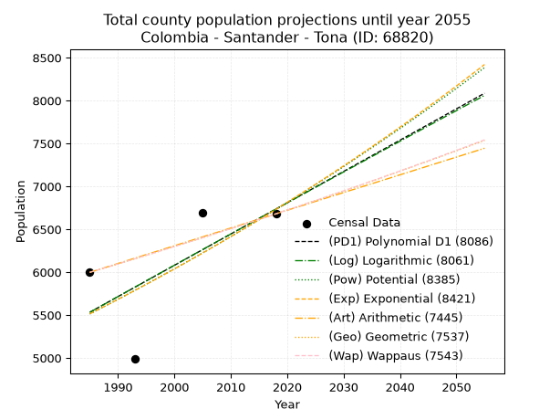
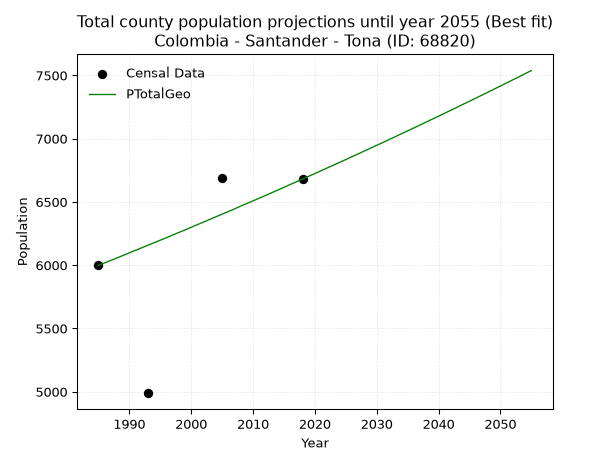
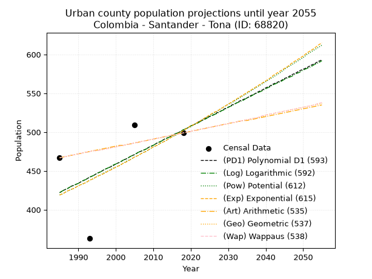
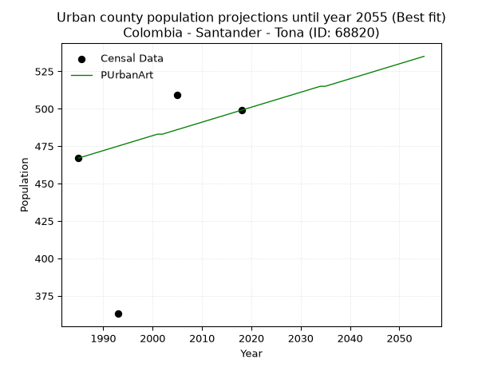
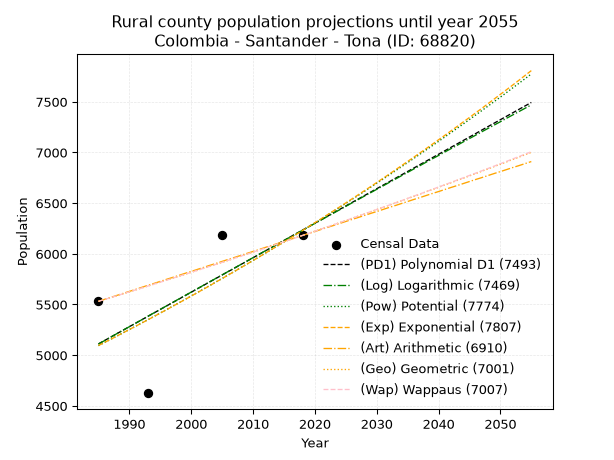
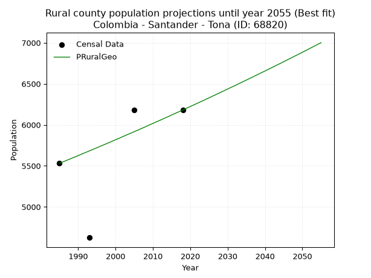

<div align="center">


</div>

# 📜 _“Population and Public Services Demand Projections (PPSD) until Year 2050 for Colombia - Santander - Tona (ID: 68820)”_
Keywords: `population` `public-service` `projection` `lineal` `polynomial` `logarithmic` `potential` `exponential` `arithmetic` `geometric` `wappaus` `dane` `colombia` `south-america`

PPSD are analytical estimates used by governments and planners to anticipate future changes in population size, age distribution, and the resulting community needs for utilities, healthcare, education, and infrastructure as sizing future water treatment facilities, electrical grids, and road networks based on spatial growth.

<div align="center">

</img>

</div>


> **General running parameters**: • app_version: _v20260806_. • Python version: _3.14.7_. • Pandas version: _3.0.5_. • NumPy version: _2.5.1_. • Creates, save and include plots into reports (create_plot): _False_. • Projection until year: _2050_. • Process polynomial degree 2 and up: _False_. • Process Wappaus: _True_. • Process Wappaus: _True_. • Set negative values to zero: _True_. • Set infinite values to zero: _True_. • Drop dataset notes: _True_. 
<div align="center">

Dynamic map: [:earth_americas:Google](http://maps.google.com/maps?q=7.20141692,-72.9670225) [:earth_americas:OSM](https://www.openstreetmap.org/#map=18/7.20141692/-72.9670225&layers=P) [:earth_americas:Bing](https://www.bing.com/maps?cp=7.20141692~-72.9670225&lvl=18) [:earth_americas:Apple](https://maps.apple.com/frame?center=7.20141692%2C-72.9670225&span=0.003%2C0.006)

</div>


<div align="center">

```geojson
{
  "type": "Feature",
  "geometry": {
    "type": "Point", 
    "coordinates": [-72.9670225, 7.20141692]
  }, 
  "properties": {
    "Name": "Colombia - Santander - Tona (ID: 68820)"
  }
}
```

</div>


## 0. Census Data (4 records)

Census data are official statistics collected by a government about the people and housing in a country. They usually include counts of total population, age, sex, race, income, education, and jobs.

📅Global census file: [Population.xlsx](../data/Population.xlsx)

| Source   |   Year |   CountryID | CountryName   |   StateID | StateName   |   CountyID | CountyName   |   PTotal |   PUrban |   PRural |
|:---------|-------:|------------:|:--------------|----------:|:------------|-----------:|:-------------|---------:|---------:|---------:|
| DANE     |   1985 |          57 | Colombia      |        68 | Santander   |      68820 | Tona         |     5998 |      467 |     5531 |
| DANE     |   1993 |          57 | Colombia      |        68 | Santander   |      68820 | Tona         |     4988 |      363 |     4625 |
| DANE     |   2005 |          57 | Colombia      |        68 | Santander   |      68820 | Tona         |     6690 |      509 |     6181 |
| DANE     |   2018 |          57 | Colombia      |        68 | Santander   |      68820 | Tona         |     6680 |      499 |     6181 |

> 🔥Some records could had specific notes about the registered values or the corresponding urban or rural distribution.

📅[SUI-RUPS](https://www.datos.gov.co/Hacienda-y-Cr-dito-P-blico/Registro-nico-de-Prestadores-de-Servicios-P-blicos/4qkq-csdn/about_data) - Local public utility companies: [RUPS.csv](../data/RUPS.csv)

 | SERVICIO       | ESTADO    | NOMBRE                                                            | NIT         | DEPARTAMENTO_DOMICILIO   | MUNICIPIO_DOMICILIO   | DIRECCION       |   TELEFONO | EMAIL                           | TIPO_PRESTADOR                 | CLASIFICACION                 |
|:---------------|:----------|:------------------------------------------------------------------|:------------|:-------------------------|:----------------------|:----------------|-----------:|:--------------------------------|:-------------------------------|:------------------------------|
| ACUEDUCTO      | OPERATIVA | UNIDAD DE SERVICIOS PUBLICOS DEL MUNICIPIO DE TONA                | 890205581-8 | SANTANDER                | TONA                  | CALLE 7 N  3-11 |    6277521 | serviciospublicostona@gmail.com | MUNICIPIO (PRESTACIÓN DIRECTA) | MENOR O IGUAL A 2500 USUARIOS |
| ALCANTARILLADO | OPERATIVA | UNIDAD DE SERVICIOS PUBLICOS DEL MUNICIPIO DE TONA                | 890205581-8 | SANTANDER                | TONA                  | CALLE 7 N  3-11 |    6277521 | serviciospublicostona@gmail.com | MUNICIPIO (PRESTACIÓN DIRECTA) | MENOR O IGUAL A 2500 USUARIOS |
| ACUEDUCTO      | OPERATIVA | CORPORACION DE SERVICIOS DEL ACUEDUCTO Y ALCANTARILLADO DE BERLIN | 800134998-2 | SANTANDER                | TONA                  | Calle 8 #3-99   |    6569238 | corpaberlintona@gmail.com       | ORGANIZACION AUTORIZADA        | MENOR O IGUAL A 2500 USUARIOS |

## 1. Total

### 1.1. Coefficients and Parameters

* (PD1) Polynomial Deg 1: 36.475311120032025, -66870.74106784406 (lineal)
* (Log) Logarithmic: 72964.20802248477, -548512.5298773746
* (Pow) Potential: 12.09892569501347, -36.15793739583544
* (Exp) Exponential: 0.006048989971079304, 0.033634980467947564
* (Art) Arithmetic: Year diff. 2018 - 1985 = 33, Population diff. 6680 - 5998 = 682, Annual growth = 20.666666666666668
* (Geo) Geometric: Year diff. 2018 - 1985 = 33, Population diff. 6680 - 5998 = 682, Annual growth % = 0.003268721785854911
* (Wap) Wappaus: i = 0.3260240837145712, Condition values only valid for < 200)

<sub>
Wappaus condition values: ['0.00', '0.33', '0.65', '0.98', '1.30', '1.63', '1.96', '2.28', '2.61', '2.93', '3.26', '3.59', '3.91', '4.24', '4.56', '4.89', '5.22', '5.54', '5.87', '6.19', '6.52', '6.85', '7.17', '7.50', '7.82', '8.15', '8.48', '8.80', '9.13', '9.45', '9.78', '10.11', '10.43', '10.76', '11.08', '11.41', '11.74', '12.06', '12.39', '12.71', '13.04', '13.37', '13.69', '14.02', '14.35', '14.67', '15.00', '15.32', '15.65', '15.98', '16.30', '16.63', '16.95', '17.28', '17.61', '17.93', '18.26', '18.58', '18.91', '19.24', '19.56', '19.89', '20.21', '20.54', '20.87', '21.19']
</sub>


### 1.2. Projected Dataset

|   Year |   CountyID |   PTotalPD1 |   PTotalLog |   PTotalPow |   PTotalExp |   PTotalArt |   PTotalGeo |   PTotalWap |
|-------:|-----------:|------------:|------------:|------------:|------------:|------------:|------------:|------------:|
|   1985 |      68820 |        5533 |        5532 |        5513 |        5514 |        5998 |        5998 |        5998 |
|   1986 |      68820 |        5569 |        5569 |        5547 |        5548 |        6019 |        6018 |        6018 |
|   1987 |      68820 |        5606 |        5605 |        5581 |        5581 |        6039 |        6037 |        6037 |
|   1988 |      68820 |        5642 |        5642 |        5615 |        5615 |        6060 |        6057 |        6057 |
|   1989 |      68820 |        5679 |        5679 |        5649 |        5649 |        6081 |        6077 |        6077 |
|   1990 |      68820 |        5715 |        5716 |        5684 |        5683 |        6101 |        6097 |        6097 |
|   1991 |      68820 |        5752 |        5752 |        5718 |        5718 |        6122 |        6117 |        6116 |
|   1992 |      68820 |        5788 |        5789 |        5753 |        5753 |        6143 |        6137 |        6136 |
|   1993 |      68820 |        5825 |        5825 |        5788 |        5787 |        6163 |        6157 |        6157 |
|   1994 |      68820 |        5861 |        5862 |        5824 |        5823 |        6184 |        6177 |        6177 |
|   1995 |      68820 |        5898 |        5899 |        5859 |        5858 |        6205 |        6197 |        6197 |
|   1996 |      68820 |        5934 |        5935 |        5895 |        5893 |        6225 |        6217 |        6217 |
|   1997 |      68820 |        5970 |        5972 |        5931 |        5929 |        6246 |        6238 |        6237 |
|   1998 |      68820 |        6007 |        6008 |        5967 |        5965 |        6267 |        6258 |        6258 |
|   1999 |      68820 |        6043 |        6045 |        6003 |        6001 |        6287 |        6278 |        6278 |
|   2000 |      68820 |        6080 |        6081 |        6039 |        6038 |        6308 |        6299 |        6299 |
|   2001 |      68820 |        6116 |        6118 |        6076 |        6074 |        6329 |        6320 |        6319 |
|   2002 |      68820 |        6153 |        6154 |        6113 |        6111 |        6349 |        6340 |        6340 |
|   2003 |      68820 |        6189 |        6191 |        6150 |        6148 |        6370 |        6361 |        6361 |
|   2004 |      68820 |        6226 |        6227 |        6187 |        6186 |        6391 |        6382 |        6381 |
|   2005 |      68820 |        6262 |        6263 |        6224 |        6223 |        6411 |        6403 |        6402 |
|   2006 |      68820 |        6299 |        6300 |        6262 |        6261 |        6432 |        6423 |        6423 |
|   2007 |      68820 |        6335 |        6336 |        6300 |        6299 |        6453 |        6444 |        6444 |
|   2008 |      68820 |        6372 |        6373 |        6338 |        6337 |        6473 |        6466 |        6465 |
|   2009 |      68820 |        6408 |        6409 |        6376 |        6376 |        6494 |        6487 |        6486 |
|   2010 |      68820 |        6445 |        6445 |        6415 |        6414 |        6515 |        6508 |        6508 |
|   2011 |      68820 |        6481 |        6482 |        6454 |        6453 |        6535 |        6529 |        6529 |
|   2012 |      68820 |        6518 |        6518 |        6493 |        6492 |        6556 |        6550 |        6550 |
|   2013 |      68820 |        6554 |        6554 |        6532 |        6532 |        6577 |        6572 |        6572 |
|   2014 |      68820 |        6591 |        6590 |        6571 |        6571 |        6597 |        6593 |        6593 |
|   2015 |      68820 |        6627 |        6626 |        6611 |        6611 |        6618 |        6615 |        6615 |
|   2016 |      68820 |        6663 |        6663 |        6650 |        6651 |        6639 |        6637 |        6636 |
|   2017 |      68820 |        6700 |        6699 |        6690 |        6692 |        6659 |        6658 |        6658 |
|   2018 |      68820 |        6736 |        6735 |        6731 |        6732 |        6680 |        6680 |        6680 |
|   2019 |      68820 |        6773 |        6771 |        6771 |        6773 |        6701 |        6702 |        6702 |
|   2020 |      68820 |        6809 |        6807 |        6812 |        6814 |        6721 |        6724 |        6724 |
|   2021 |      68820 |        6846 |        6843 |        6853 |        6856 |        6742 |        6746 |        6746 |
|   2022 |      68820 |        6882 |        6880 |        6894 |        6897 |        6763 |        6768 |        6768 |
|   2023 |      68820 |        6919 |        6916 |        6935 |        6939 |        6783 |        6790 |        6790 |
|   2024 |      68820 |        6955 |        6952 |        6977 |        6981 |        6804 |        6812 |        6812 |
|   2025 |      68820 |        6992 |        6988 |        7019 |        7023 |        6825 |        6834 |        6835 |
|   2026 |      68820 |        7028 |        7024 |        7061 |        7066 |        6845 |        6857 |        6857 |
|   2027 |      68820 |        7065 |        7060 |        7103 |        7109 |        6866 |        6879 |        6880 |
|   2028 |      68820 |        7101 |        7096 |        7145 |        7152 |        6887 |        6902 |        6902 |
|   2029 |      68820 |        7138 |        7132 |        7188 |        7196 |        6907 |        6924 |        6925 |
|   2030 |      68820 |        7174 |        7168 |        7231 |        7239 |        6928 |        6947 |        6948 |
|   2031 |      68820 |        7211 |        7204 |        7274 |        7283 |        6949 |        6969 |        6970 |
|   2032 |      68820 |        7247 |        7239 |        7318 |        7327 |        6969 |        6992 |        6993 |
|   2033 |      68820 |        7284 |        7275 |        7362 |        7372 |        6990 |        7015 |        7016 |
|   2034 |      68820 |        7320 |        7311 |        7406 |        7416 |        7011 |        7038 |        7039 |
|   2035 |      68820 |        7357 |        7347 |        7450 |        7461 |        7031 |        7061 |        7063 |
|   2036 |      68820 |        7393 |        7383 |        7494 |        7507 |        7052 |        7084 |        7086 |
|   2037 |      68820 |        7429 |        7419 |        7539 |        7552 |        7073 |        7107 |        7109 |
|   2038 |      68820 |        7466 |        7455 |        7584 |        7598 |        7093 |        7131 |        7132 |
|   2039 |      68820 |        7502 |        7490 |        7629 |        7644 |        7114 |        7154 |        7156 |
|   2040 |      68820 |        7539 |        7526 |        7674 |        7691 |        7135 |        7177 |        7179 |
|   2041 |      68820 |        7575 |        7562 |        7720 |        7737 |        7155 |        7201 |        7203 |
|   2042 |      68820 |        7612 |        7598 |        7766 |        7784 |        7176 |        7224 |        7227 |
|   2043 |      68820 |        7648 |        7633 |        7812 |        7831 |        7197 |        7248 |        7251 |
|   2044 |      68820 |        7685 |        7669 |        7858 |        7879 |        7217 |        7272 |        7275 |
|   2045 |      68820 |        7721 |        7705 |        7905 |        7927 |        7238 |        7295 |        7298 |
|   2046 |      68820 |        7758 |        7740 |        7952 |        7975 |        7259 |        7319 |        7323 |
|   2047 |      68820 |        7794 |        7776 |        7999 |        8023 |        7279 |        7343 |        7347 |
|   2048 |      68820 |        7831 |        7812 |        8046 |        8072 |        7300 |        7367 |        7371 |
|   2049 |      68820 |        7867 |        7847 |        8094 |        8121 |        7321 |        7391 |        7395 |
|   2050 |      68820 |        7904 |        7883 |        8142 |        8170 |        7341 |        7415 |        7420 |
<div align="center">

</img>

</div>


### 1.3. Best fit with absolute and relative error (%)

Relative error puts that difference into context by dividing the absolute error by the true value, creating a unitless ratio or percentage that shows the scale of the mistake.

Absolute and relative error

|   Year | Source   |   CountryID | CountryName   |   StateID | StateName   |   CountyID_x | CountyName   |   PTotal |   PUrban |   PRural |   CountyID_y |   PTotalPD1 |   PTotalLog |   PTotalPow |   PTotalExp |   PTotalArt |   PTotalGeo |   PTotalWap |   PTotalPD1AbsError |   PTotalLogAbsError |   PTotalPowAbsError |   PTotalExpAbsError |   PTotalArtAbsError |   PTotalGeoAbsError |   PTotalWapAbsError |   PTotalPD1RelError |   PTotalLogRelError |   PTotalPowRelError |   PTotalExpRelError |   PTotalArtRelError |   PTotalGeoRelError |   PTotalWapRelError |
|-------:|:---------|------------:|:--------------|----------:|:------------|-------------:|:-------------|---------:|---------:|---------:|-------------:|------------:|------------:|------------:|------------:|------------:|------------:|------------:|--------------------:|--------------------:|--------------------:|--------------------:|--------------------:|--------------------:|--------------------:|--------------------:|--------------------:|--------------------:|--------------------:|--------------------:|--------------------:|--------------------:|
|   1985 | DANE     |          57 | Colombia      |        68 | Santander   |        68820 | Tona         |     5998 |      467 |     5531 |        68820 |        5533 |        5532 |        5513 |        5514 |        5998 |        5998 |        5998 |                 465 |                 466 |                 485 |                 484 |                   0 |                   0 |                   0 |            7.75258  |            7.76926  |            8.08603  |            8.06936  |              0      |             0       |             0       |
|   1993 | DANE     |          57 | Colombia      |        68 | Santander   |        68820 | Tona         |     4988 |      363 |     4625 |        68820 |        5825 |        5825 |        5788 |        5787 |        6163 |        6157 |        6157 |                 837 |                 837 |                 800 |                 799 |                1175 |                1169 |                1169 |           16.7803   |           16.7803   |           16.0385   |           16.0184   |             23.5565 |            23.4362  |            23.4362  |
|   2005 | DANE     |          57 | Colombia      |        68 | Santander   |        68820 | Tona         |     6690 |      509 |     6181 |        68820 |        6262 |        6263 |        6224 |        6223 |        6411 |        6403 |        6402 |                 428 |                 427 |                 466 |                 467 |                 279 |                 287 |                 288 |            6.39761  |            6.38266  |            6.96562  |            6.98057  |              4.1704 |             4.28999 |             4.30493 |
|   2018 | DANE     |          57 | Colombia      |        68 | Santander   |        68820 | Tona         |     6680 |      499 |     6181 |        68820 |        6736 |        6735 |        6731 |        6732 |        6680 |        6680 |        6680 |                  56 |                  55 |                  51 |                  52 |                   0 |                   0 |                   0 |            0.838323 |            0.823353 |            0.763473 |            0.778443 |              0      |             0       |             0       |

Relative error mean

| Method    |   RelError | Best   |
|:----------|-----------:|:-------|
| PTotalPD1 |    7.9422  |        |
| PTotalLog |    7.93889 |        |
| PTotalPow |    7.9634  |        |
| PTotalExp |    7.9617  |        |
| PTotalArt |    6.93173 |        |
| PTotalGeo |    6.93156 | True   |
| PTotalWap |    6.93529 |        |

💙Best method: _**PTotalGeo**_
<div align="center">

</img>

</div>


### 1.4. Fresh water supply demand in liters per capita per day (lpcd)

The fresh water supply demand typically ranges from 100 to 300 liters per capita per day (lpcd) for standard domestic and municipal planning, though absolute survival minimums set by the World Health Organization are as low as 7.5 to 20 liters per day, and total consumption in high-income nations can exceed 400 liters.

> `CZ`: Level in meters above the sea level (masl)<br> `WS`: Fresh water supply demand in liters per capita per day (lpcd or l/h/d)<br> `WSAll`: Zonal fresh water supply demand in liters per second (l/s)<br> `A`: Zonal area in square meters<br> `DP`: Population density (people/hectare or p/ha)

Reference values (RAS Colombia)

|    CZ |   WS |
|------:|-----:|
|  1000 |  120 |
|  2000 |  130 |
| 99999 |  140 |

County shapefile geometry properties and water supply values

|   CountyID |      ATotal |   CZTotal |   WSTotal |
|-----------:|------------:|----------:|----------:|
|      68820 | 3.30121e+08 |   2901.32 |       140 |

Projected values for best method: PTotalGeo

|   CountyID |   Year |   PTotalGeo |   DPTotal |   WSTotal |   WSTotalAll |
|-----------:|-------:|------------:|----------:|----------:|-------------:|
|      68820 |   1985 |        5998 |      0.18 |       140 |      9.71898 |
|      68820 |   1986 |        6018 |      0.18 |       140 |      9.75139 |
|      68820 |   1987 |        6037 |      0.18 |       140 |      9.78218 |
|      68820 |   1988 |        6057 |      0.18 |       140 |      9.81458 |
|      68820 |   1989 |        6077 |      0.18 |       140 |      9.84699 |
|      68820 |   1990 |        6097 |      0.18 |       140 |      9.8794  |
|      68820 |   1991 |        6117 |      0.19 |       140 |      9.91181 |
|      68820 |   1992 |        6137 |      0.19 |       140 |      9.94421 |
|      68820 |   1993 |        6157 |      0.19 |       140 |      9.97662 |
|      68820 |   1994 |        6177 |      0.19 |       140 |     10.009   |
|      68820 |   1995 |        6197 |      0.19 |       140 |     10.0414  |
|      68820 |   1996 |        6217 |      0.19 |       140 |     10.0738  |
|      68820 |   1997 |        6238 |      0.19 |       140 |     10.1079  |
|      68820 |   1998 |        6258 |      0.19 |       140 |     10.1403  |
|      68820 |   1999 |        6278 |      0.19 |       140 |     10.1727  |
|      68820 |   2000 |        6299 |      0.19 |       140 |     10.2067  |
|      68820 |   2001 |        6320 |      0.19 |       140 |     10.2407  |
|      68820 |   2002 |        6340 |      0.19 |       140 |     10.2731  |
|      68820 |   2003 |        6361 |      0.19 |       140 |     10.3072  |
|      68820 |   2004 |        6382 |      0.19 |       140 |     10.3412  |
|      68820 |   2005 |        6403 |      0.19 |       140 |     10.3752  |
|      68820 |   2006 |        6423 |      0.19 |       140 |     10.4076  |
|      68820 |   2007 |        6444 |      0.2  |       140 |     10.4417  |
|      68820 |   2008 |        6466 |      0.2  |       140 |     10.4773  |
|      68820 |   2009 |        6487 |      0.2  |       140 |     10.5113  |
|      68820 |   2010 |        6508 |      0.2  |       140 |     10.5454  |
|      68820 |   2011 |        6529 |      0.2  |       140 |     10.5794  |
|      68820 |   2012 |        6550 |      0.2  |       140 |     10.6134  |
|      68820 |   2013 |        6572 |      0.2  |       140 |     10.6491  |
|      68820 |   2014 |        6593 |      0.2  |       140 |     10.6831  |
|      68820 |   2015 |        6615 |      0.2  |       140 |     10.7188  |
|      68820 |   2016 |        6637 |      0.2  |       140 |     10.7544  |
|      68820 |   2017 |        6658 |      0.2  |       140 |     10.7884  |
|      68820 |   2018 |        6680 |      0.2  |       140 |     10.8241  |
|      68820 |   2019 |        6702 |      0.2  |       140 |     10.8597  |
|      68820 |   2020 |        6724 |      0.2  |       140 |     10.8954  |
|      68820 |   2021 |        6746 |      0.2  |       140 |     10.931   |
|      68820 |   2022 |        6768 |      0.21 |       140 |     10.9667  |
|      68820 |   2023 |        6790 |      0.21 |       140 |     11.0023  |
|      68820 |   2024 |        6812 |      0.21 |       140 |     11.038   |
|      68820 |   2025 |        6834 |      0.21 |       140 |     11.0736  |
|      68820 |   2026 |        6857 |      0.21 |       140 |     11.1109  |
|      68820 |   2027 |        6879 |      0.21 |       140 |     11.1465  |
|      68820 |   2028 |        6902 |      0.21 |       140 |     11.1838  |
|      68820 |   2029 |        6924 |      0.21 |       140 |     11.2194  |
|      68820 |   2030 |        6947 |      0.21 |       140 |     11.2567  |
|      68820 |   2031 |        6969 |      0.21 |       140 |     11.2924  |
|      68820 |   2032 |        6992 |      0.21 |       140 |     11.3296  |
|      68820 |   2033 |        7015 |      0.21 |       140 |     11.3669  |
|      68820 |   2034 |        7038 |      0.21 |       140 |     11.4042  |
|      68820 |   2035 |        7061 |      0.21 |       140 |     11.4414  |
|      68820 |   2036 |        7084 |      0.21 |       140 |     11.4787  |
|      68820 |   2037 |        7107 |      0.22 |       140 |     11.516   |
|      68820 |   2038 |        7131 |      0.22 |       140 |     11.5549  |
|      68820 |   2039 |        7154 |      0.22 |       140 |     11.5921  |
|      68820 |   2040 |        7177 |      0.22 |       140 |     11.6294  |
|      68820 |   2041 |        7201 |      0.22 |       140 |     11.6683  |
|      68820 |   2042 |        7224 |      0.22 |       140 |     11.7056  |
|      68820 |   2043 |        7248 |      0.22 |       140 |     11.7444  |
|      68820 |   2044 |        7272 |      0.22 |       140 |     11.7833  |
|      68820 |   2045 |        7295 |      0.22 |       140 |     11.8206  |
|      68820 |   2046 |        7319 |      0.22 |       140 |     11.8595  |
|      68820 |   2047 |        7343 |      0.22 |       140 |     11.8984  |
|      68820 |   2048 |        7367 |      0.22 |       140 |     11.9373  |
|      68820 |   2049 |        7391 |      0.22 |       140 |     11.9762  |
|      68820 |   2050 |        7415 |      0.22 |       140 |     12.015   |

## 2. Urban

### 2.1. Coefficients and Parameters

* (PD1) Polynomial Deg 1: 2.443195503813728, -4427.501806503409 (lineal)
* (Log) Logarithmic: 4885.564176700138, -36675.712457552014
* (Pow) Potential: 10.954101398212543, -33.50180898509518
* (Exp) Exponential: 0.005478835086846352, 0.007926106627676812
* (Art) Arithmetic: Year diff. 2018 - 1985 = 33, Population diff. 499 - 467 = 32, Annual growth = 0.9696969696969697
* (Geo) Geometric: Year diff. 2018 - 1985 = 33, Population diff. 499 - 467 = 32, Annual growth % = 0.0020104071969202497
* (Wap) Wappaus: i = 0.2007654181567225, Condition values only valid for < 200)

<sub>
Wappaus condition values: ['0.00', '0.20', '0.40', '0.60', '0.80', '1.00', '1.20', '1.41', '1.61', '1.81', '2.01', '2.21', '2.41', '2.61', '2.81', '3.01', '3.21', '3.41', '3.61', '3.81', '4.02', '4.22', '4.42', '4.62', '4.82', '5.02', '5.22', '5.42', '5.62', '5.82', '6.02', '6.22', '6.42', '6.63', '6.83', '7.03', '7.23', '7.43', '7.63', '7.83', '8.03', '8.23', '8.43', '8.63', '8.83', '9.03', '9.24', '9.44', '9.64', '9.84', '10.04', '10.24', '10.44', '10.64', '10.84', '11.04', '11.24', '11.44', '11.64', '11.85', '12.05', '12.25', '12.45', '12.65', '12.85', '13.05']
</sub>


### 2.2. Projected Dataset

|   Year |   CountyID |   PUrbanPD1 |   PUrbanLog |   PUrbanPow |   PUrbanExp |   PUrbanArt |   PUrbanGeo |   PUrbanWap |
|-------:|-----------:|------------:|------------:|------------:|------------:|------------:|------------:|------------:|
|   1985 |      68820 |         422 |         422 |         419 |         419 |         467 |         467 |         467 |
|   1986 |      68820 |         425 |         425 |         421 |         421 |         468 |         468 |         468 |
|   1987 |      68820 |         427 |         427 |         424 |         424 |         469 |         469 |         469 |
|   1988 |      68820 |         430 |         430 |         426 |         426 |         470 |         470 |         470 |
|   1989 |      68820 |         432 |         432 |         428 |         428 |         471 |         471 |         471 |
|   1990 |      68820 |         434 |         434 |         431 |         431 |         472 |         472 |         472 |
|   1991 |      68820 |         437 |         437 |         433 |         433 |         473 |         473 |         473 |
|   1992 |      68820 |         439 |         439 |         435 |         435 |         474 |         474 |         474 |
|   1993 |      68820 |         442 |         442 |         438 |         438 |         475 |         475 |         475 |
|   1994 |      68820 |         444 |         444 |         440 |         440 |         476 |         476 |         476 |
|   1995 |      68820 |         447 |         447 |         443 |         443 |         477 |         476 |         476 |
|   1996 |      68820 |         449 |         449 |         445 |         445 |         478 |         477 |         477 |
|   1997 |      68820 |         452 |         452 |         448 |         447 |         479 |         478 |         478 |
|   1998 |      68820 |         454 |         454 |         450 |         450 |         480 |         479 |         479 |
|   1999 |      68820 |         456 |         457 |         453 |         452 |         481 |         480 |         480 |
|   2000 |      68820 |         459 |         459 |         455 |         455 |         482 |         481 |         481 |
|   2001 |      68820 |         461 |         461 |         457 |         457 |         483 |         482 |         482 |
|   2002 |      68820 |         464 |         464 |         460 |         460 |         483 |         483 |         483 |
|   2003 |      68820 |         466 |         466 |         463 |         462 |         484 |         484 |         484 |
|   2004 |      68820 |         469 |         469 |         465 |         465 |         485 |         485 |         485 |
|   2005 |      68820 |         471 |         471 |         468 |         468 |         486 |         486 |         486 |
|   2006 |      68820 |         474 |         474 |         470 |         470 |         487 |         487 |         487 |
|   2007 |      68820 |         476 |         476 |         473 |         473 |         488 |         488 |         488 |
|   2008 |      68820 |         478 |         478 |         475 |         475 |         489 |         489 |         489 |
|   2009 |      68820 |         481 |         481 |         478 |         478 |         490 |         490 |         490 |
|   2010 |      68820 |         483 |         483 |         481 |         481 |         491 |         491 |         491 |
|   2011 |      68820 |         486 |         486 |         483 |         483 |         492 |         492 |         492 |
|   2012 |      68820 |         488 |         488 |         486 |         486 |         493 |         493 |         493 |
|   2013 |      68820 |         491 |         491 |         488 |         488 |         494 |         494 |         494 |
|   2014 |      68820 |         493 |         493 |         491 |         491 |         495 |         495 |         495 |
|   2015 |      68820 |         496 |         495 |         494 |         494 |         496 |         496 |         496 |
|   2016 |      68820 |         498 |         498 |         496 |         497 |         497 |         497 |         497 |
|   2017 |      68820 |         500 |         500 |         499 |         499 |         498 |         498 |         498 |
|   2018 |      68820 |         503 |         503 |         502 |         502 |         499 |         499 |         499 |
|   2019 |      68820 |         505 |         505 |         505 |         505 |         500 |         500 |         500 |
|   2020 |      68820 |         508 |         508 |         507 |         508 |         501 |         501 |         501 |
|   2021 |      68820 |         510 |         510 |         510 |         510 |         502 |         502 |         502 |
|   2022 |      68820 |         513 |         512 |         513 |         513 |         503 |         503 |         503 |
|   2023 |      68820 |         515 |         515 |         516 |         516 |         504 |         504 |         504 |
|   2024 |      68820 |         518 |         517 |         519 |         519 |         505 |         505 |         505 |
|   2025 |      68820 |         520 |         520 |         521 |         522 |         506 |         506 |         506 |
|   2026 |      68820 |         522 |         522 |         524 |         525 |         507 |         507 |         507 |
|   2027 |      68820 |         525 |         524 |         527 |         527 |         508 |         508 |         508 |
|   2028 |      68820 |         527 |         527 |         530 |         530 |         509 |         509 |         509 |
|   2029 |      68820 |         530 |         529 |         533 |         533 |         510 |         510 |         510 |
|   2030 |      68820 |         532 |         532 |         536 |         536 |         511 |         511 |         511 |
|   2031 |      68820 |         535 |         534 |         538 |         539 |         512 |         512 |         512 |
|   2032 |      68820 |         537 |         537 |         541 |         542 |         513 |         513 |         513 |
|   2033 |      68820 |         540 |         539 |         544 |         545 |         514 |         514 |         514 |
|   2034 |      68820 |         542 |         541 |         547 |         548 |         515 |         515 |         515 |
|   2035 |      68820 |         544 |         544 |         550 |         551 |         515 |         516 |         516 |
|   2036 |      68820 |         547 |         546 |         553 |         554 |         516 |         517 |         517 |
|   2037 |      68820 |         549 |         549 |         556 |         557 |         517 |         518 |         518 |
|   2038 |      68820 |         552 |         551 |         559 |         560 |         518 |         519 |         519 |
|   2039 |      68820 |         554 |         553 |         562 |         563 |         519 |         520 |         521 |
|   2040 |      68820 |         557 |         556 |         565 |         566 |         520 |         522 |         522 |
|   2041 |      68820 |         559 |         558 |         568 |         569 |         521 |         523 |         523 |
|   2042 |      68820 |         562 |         561 |         571 |         573 |         522 |         524 |         524 |
|   2043 |      68820 |         564 |         563 |         574 |         576 |         523 |         525 |         525 |
|   2044 |      68820 |         566 |         565 |         577 |         579 |         524 |         526 |         526 |
|   2045 |      68820 |         569 |         568 |         581 |         582 |         525 |         527 |         527 |
|   2046 |      68820 |         571 |         570 |         584 |         585 |         526 |         528 |         528 |
|   2047 |      68820 |         574 |         572 |         587 |         589 |         527 |         529 |         529 |
|   2048 |      68820 |         576 |         575 |         590 |         592 |         528 |         530 |         530 |
|   2049 |      68820 |         579 |         577 |         593 |         595 |         529 |         531 |         531 |
|   2050 |      68820 |         581 |         580 |         596 |         598 |         530 |         532 |         532 |
<div align="center">

</img>

</div>


### 2.3. Best fit with absolute and relative error (%)

Relative error puts that difference into context by dividing the absolute error by the true value, creating a unitless ratio or percentage that shows the scale of the mistake.

Absolute and relative error

|   Year | Source   |   CountryID | CountryName   |   StateID | StateName   |   CountyID_x | CountyName   |   PTotal |   PUrban |   PRural |   CountyID_y |   PUrbanPD1 |   PUrbanLog |   PUrbanPow |   PUrbanExp |   PUrbanArt |   PUrbanGeo |   PUrbanWap |   PUrbanPD1AbsError |   PUrbanLogAbsError |   PUrbanPowAbsError |   PUrbanExpAbsError |   PUrbanArtAbsError |   PUrbanGeoAbsError |   PUrbanWapAbsError |   PUrbanPD1RelError |   PUrbanLogRelError |   PUrbanPowRelError |   PUrbanExpRelError |   PUrbanArtRelError |   PUrbanGeoRelError |   PUrbanWapRelError |
|-------:|:---------|------------:|:--------------|----------:|:------------|-------------:|:-------------|---------:|---------:|---------:|-------------:|------------:|------------:|------------:|------------:|------------:|------------:|------------:|--------------------:|--------------------:|--------------------:|--------------------:|--------------------:|--------------------:|--------------------:|--------------------:|--------------------:|--------------------:|--------------------:|--------------------:|--------------------:|--------------------:|
|   1985 | DANE     |          57 | Colombia      |        68 | Santander   |        68820 | Tona         |     5998 |      467 |     5531 |        68820 |         422 |         422 |         419 |         419 |         467 |         467 |         467 |                  45 |                  45 |                  48 |                  48 |                   0 |                   0 |                   0 |            9.63597  |            9.63597  |           10.2784   |           10.2784   |             0       |             0       |             0       |
|   1993 | DANE     |          57 | Colombia      |        68 | Santander   |        68820 | Tona         |     4988 |      363 |     4625 |        68820 |         442 |         442 |         438 |         438 |         475 |         475 |         475 |                  79 |                  79 |                  75 |                  75 |                 112 |                 112 |                 112 |           21.7631   |           21.7631   |           20.6612   |           20.6612   |            30.854   |            30.854   |            30.854   |
|   2005 | DANE     |          57 | Colombia      |        68 | Santander   |        68820 | Tona         |     6690 |      509 |     6181 |        68820 |         471 |         471 |         468 |         468 |         486 |         486 |         486 |                  38 |                  38 |                  41 |                  41 |                  23 |                  23 |                  23 |            7.46562  |            7.46562  |            8.05501  |            8.05501  |             4.51866 |             4.51866 |             4.51866 |
|   2018 | DANE     |          57 | Colombia      |        68 | Santander   |        68820 | Tona         |     6680 |      499 |     6181 |        68820 |         503 |         503 |         502 |         502 |         499 |         499 |         499 |                   4 |                   4 |                   3 |                   3 |                   0 |                   0 |                   0 |            0.801603 |            0.801603 |            0.601202 |            0.601202 |             0       |             0       |             0       |

Relative error mean

| Method    |   RelError | Best   |
|:----------|-----------:|:-------|
| PUrbanPD1 |    9.91657 |        |
| PUrbanLog |    9.91657 |        |
| PUrbanPow |    9.89894 |        |
| PUrbanExp |    9.89894 |        |
| PUrbanArt |    8.84316 | True   |
| PUrbanGeo |    8.84316 | True   |
| PUrbanWap |    8.84316 | True   |

💙Best method: _**PUrbanArt**_
<div align="center">

</img>

</div>


### 2.4. Fresh water supply demand in liters per capita per day (lpcd)

The fresh water supply demand typically ranges from 100 to 300 liters per capita per day (lpcd) for standard domestic and municipal planning, though absolute survival minimums set by the World Health Organization are as low as 7.5 to 20 liters per day, and total consumption in high-income nations can exceed 400 liters.

> `CZ`: Level in meters above the sea level (masl)<br> `WS`: Fresh water supply demand in liters per capita per day (lpcd or l/h/d)<br> `WSAll`: Zonal fresh water supply demand in liters per second (l/s)<br> `A`: Zonal area in square meters<br> `DP`: Population density (people/hectare or p/ha)

Reference values (RAS Colombia)

|    CZ |   WS |
|------:|-----:|
|  1000 |  120 |
|  2000 |  130 |
| 99999 |  140 |

County shapefile geometry properties and water supply values

|   CountyID |   AUrban |   CZUrban |   WSUrban |
|-----------:|---------:|----------:|----------:|
|      68820 |   137323 |   1867.83 |       130 |

Projected values for best method: PUrbanArt

|   CountyID |   Year |   PUrbanArt |   DPUrban |   WSUrban |   WSUrbanAll |
|-----------:|-------:|------------:|----------:|----------:|-------------:|
|      68820 |   1985 |         467 |     34.01 |       130 |     0.702662 |
|      68820 |   1986 |         468 |     34.08 |       130 |     0.704167 |
|      68820 |   1987 |         469 |     34.15 |       130 |     0.705671 |
|      68820 |   1988 |         470 |     34.23 |       130 |     0.707176 |
|      68820 |   1989 |         471 |     34.3  |       130 |     0.708681 |
|      68820 |   1990 |         472 |     34.37 |       130 |     0.710185 |
|      68820 |   1991 |         473 |     34.44 |       130 |     0.71169  |
|      68820 |   1992 |         474 |     34.52 |       130 |     0.713194 |
|      68820 |   1993 |         475 |     34.59 |       130 |     0.714699 |
|      68820 |   1994 |         476 |     34.66 |       130 |     0.716204 |
|      68820 |   1995 |         477 |     34.74 |       130 |     0.717708 |
|      68820 |   1996 |         478 |     34.81 |       130 |     0.719213 |
|      68820 |   1997 |         479 |     34.88 |       130 |     0.720718 |
|      68820 |   1998 |         480 |     34.95 |       130 |     0.722222 |
|      68820 |   1999 |         481 |     35.03 |       130 |     0.723727 |
|      68820 |   2000 |         482 |     35.1  |       130 |     0.725231 |
|      68820 |   2001 |         483 |     35.17 |       130 |     0.726736 |
|      68820 |   2002 |         483 |     35.17 |       130 |     0.726736 |
|      68820 |   2003 |         484 |     35.25 |       130 |     0.728241 |
|      68820 |   2004 |         485 |     35.32 |       130 |     0.729745 |
|      68820 |   2005 |         486 |     35.39 |       130 |     0.73125  |
|      68820 |   2006 |         487 |     35.46 |       130 |     0.732755 |
|      68820 |   2007 |         488 |     35.54 |       130 |     0.734259 |
|      68820 |   2008 |         489 |     35.61 |       130 |     0.735764 |
|      68820 |   2009 |         490 |     35.68 |       130 |     0.737269 |
|      68820 |   2010 |         491 |     35.75 |       130 |     0.738773 |
|      68820 |   2011 |         492 |     35.83 |       130 |     0.740278 |
|      68820 |   2012 |         493 |     35.9  |       130 |     0.741782 |
|      68820 |   2013 |         494 |     35.97 |       130 |     0.743287 |
|      68820 |   2014 |         495 |     36.05 |       130 |     0.744792 |
|      68820 |   2015 |         496 |     36.12 |       130 |     0.746296 |
|      68820 |   2016 |         497 |     36.19 |       130 |     0.747801 |
|      68820 |   2017 |         498 |     36.26 |       130 |     0.749306 |
|      68820 |   2018 |         499 |     36.34 |       130 |     0.75081  |
|      68820 |   2019 |         500 |     36.41 |       130 |     0.752315 |
|      68820 |   2020 |         501 |     36.48 |       130 |     0.753819 |
|      68820 |   2021 |         502 |     36.56 |       130 |     0.755324 |
|      68820 |   2022 |         503 |     36.63 |       130 |     0.756829 |
|      68820 |   2023 |         504 |     36.7  |       130 |     0.758333 |
|      68820 |   2024 |         505 |     36.77 |       130 |     0.759838 |
|      68820 |   2025 |         506 |     36.85 |       130 |     0.761343 |
|      68820 |   2026 |         507 |     36.92 |       130 |     0.762847 |
|      68820 |   2027 |         508 |     36.99 |       130 |     0.764352 |
|      68820 |   2028 |         509 |     37.07 |       130 |     0.765856 |
|      68820 |   2029 |         510 |     37.14 |       130 |     0.767361 |
|      68820 |   2030 |         511 |     37.21 |       130 |     0.768866 |
|      68820 |   2031 |         512 |     37.28 |       130 |     0.77037  |
|      68820 |   2032 |         513 |     37.36 |       130 |     0.771875 |
|      68820 |   2033 |         514 |     37.43 |       130 |     0.77338  |
|      68820 |   2034 |         515 |     37.5  |       130 |     0.774884 |
|      68820 |   2035 |         515 |     37.5  |       130 |     0.774884 |
|      68820 |   2036 |         516 |     37.58 |       130 |     0.776389 |
|      68820 |   2037 |         517 |     37.65 |       130 |     0.777894 |
|      68820 |   2038 |         518 |     37.72 |       130 |     0.779398 |
|      68820 |   2039 |         519 |     37.79 |       130 |     0.780903 |
|      68820 |   2040 |         520 |     37.87 |       130 |     0.782407 |
|      68820 |   2041 |         521 |     37.94 |       130 |     0.783912 |
|      68820 |   2042 |         522 |     38.01 |       130 |     0.785417 |
|      68820 |   2043 |         523 |     38.09 |       130 |     0.786921 |
|      68820 |   2044 |         524 |     38.16 |       130 |     0.788426 |
|      68820 |   2045 |         525 |     38.23 |       130 |     0.789931 |
|      68820 |   2046 |         526 |     38.3  |       130 |     0.791435 |
|      68820 |   2047 |         527 |     38.38 |       130 |     0.79294  |
|      68820 |   2048 |         528 |     38.45 |       130 |     0.794444 |
|      68820 |   2049 |         529 |     38.52 |       130 |     0.795949 |
|      68820 |   2050 |         530 |     38.6  |       130 |     0.797454 |

## 3. Rural

### 3.1. Coefficients and Parameters

* (PD1) Polynomial Deg 1: 34.03211561621837, -62443.239261340794 (lineal)
* (Log) Logarithmic: 68078.64384578464, -511836.8174198227
* (Pow) Potential: 12.195540556823298, -36.51089603260319
* (Exp) Exponential: 0.00609711164641105, 0.028246350772770393
* (Art) Arithmetic: Year diff. 2018 - 1985 = 33, Population diff. 6181 - 5531 = 650, Annual growth = 19.696969696969695
* (Geo) Geometric: Year diff. 2018 - 1985 = 33, Population diff. 6181 - 5531 = 650, Annual growth % = 0.003372688079734898
* (Wap) Wappaus: i = 0.3363553568471601, Condition values only valid for < 200)

<sub>
Wappaus condition values: ['0.00', '0.34', '0.67', '1.01', '1.35', '1.68', '2.02', '2.35', '2.69', '3.03', '3.36', '3.70', '4.04', '4.37', '4.71', '5.05', '5.38', '5.72', '6.05', '6.39', '6.73', '7.06', '7.40', '7.74', '8.07', '8.41', '8.75', '9.08', '9.42', '9.75', '10.09', '10.43', '10.76', '11.10', '11.44', '11.77', '12.11', '12.45', '12.78', '13.12', '13.45', '13.79', '14.13', '14.46', '14.80', '15.14', '15.47', '15.81', '16.15', '16.48', '16.82', '17.15', '17.49', '17.83', '18.16', '18.50', '18.84', '19.17', '19.51', '19.84', '20.18', '20.52', '20.85', '21.19', '21.53', '21.86']
</sub>


### 3.2. Projected Dataset

|   Year |   CountyID |   PRuralPD1 |   PRuralLog |   PRuralPow |   PRuralExp |   PRuralArt |   PRuralGeo |   PRuralWap |
|-------:|-----------:|------------:|------------:|------------:|------------:|------------:|------------:|------------:|
|   1985 |      68820 |        5111 |        5110 |        5094 |        5095 |        5531 |        5531 |        5531 |
|   1986 |      68820 |        5145 |        5144 |        5126 |        5126 |        5551 |        5550 |        5550 |
|   1987 |      68820 |        5179 |        5178 |        5157 |        5157 |        5570 |        5568 |        5568 |
|   1988 |      68820 |        5213 |        5213 |        5189 |        5189 |        5590 |        5587 |        5587 |
|   1989 |      68820 |        5247 |        5247 |        5221 |        5221 |        5610 |        5606 |        5606 |
|   1990 |      68820 |        5281 |        5281 |        5253 |        5253 |        5629 |        5625 |        5625 |
|   1991 |      68820 |        5315 |        5315 |        5285 |        5285 |        5649 |        5644 |        5644 |
|   1992 |      68820 |        5349 |        5349 |        5318 |        5317 |        5669 |        5663 |        5663 |
|   1993 |      68820 |        5383 |        5384 |        5350 |        5349 |        5689 |        5682 |        5682 |
|   1994 |      68820 |        5417 |        5418 |        5383 |        5382 |        5708 |        5701 |        5701 |
|   1995 |      68820 |        5451 |        5452 |        5416 |        5415 |        5728 |        5720 |        5720 |
|   1996 |      68820 |        5485 |        5486 |        5449 |        5448 |        5748 |        5740 |        5739 |
|   1997 |      68820 |        5519 |        5520 |        5483 |        5482 |        5767 |        5759 |        5759 |
|   1998 |      68820 |        5553 |        5554 |        5516 |        5515 |        5787 |        5778 |        5778 |
|   1999 |      68820 |        5587 |        5588 |        5550 |        5549 |        5807 |        5798 |        5798 |
|   2000 |      68820 |        5621 |        5622 |        5584 |        5583 |        5826 |        5818 |        5817 |
|   2001 |      68820 |        5655 |        5656 |        5618 |        5617 |        5846 |        5837 |        5837 |
|   2002 |      68820 |        5689 |        5690 |        5653 |        5651 |        5866 |        5857 |        5857 |
|   2003 |      68820 |        5723 |        5724 |        5687 |        5686 |        5886 |        5877 |        5876 |
|   2004 |      68820 |        5757 |        5758 |        5722 |        5721 |        5905 |        5896 |        5896 |
|   2005 |      68820 |        5791 |        5792 |        5757 |        5756 |        5925 |        5916 |        5916 |
|   2006 |      68820 |        5825 |        5826 |        5792 |        5791 |        5945 |        5936 |        5936 |
|   2007 |      68820 |        5859 |        5860 |        5827 |        5826 |        5964 |        5956 |        5956 |
|   2008 |      68820 |        5893 |        5894 |        5863 |        5862 |        5984 |        5976 |        5976 |
|   2009 |      68820 |        5927 |        5928 |        5898 |        5898 |        6004 |        5997 |        5996 |
|   2010 |      68820 |        5961 |        5962 |        5934 |        5934 |        6023 |        6017 |        6017 |
|   2011 |      68820 |        5995 |        5996 |        5970 |        5970 |        6043 |        6037 |        6037 |
|   2012 |      68820 |        6029 |        6030 |        6007 |        6007 |        6063 |        6057 |        6057 |
|   2013 |      68820 |        6063 |        6063 |        6043 |        6043 |        6083 |        6078 |        6078 |
|   2014 |      68820 |        6097 |        6097 |        6080 |        6080 |        6102 |        6098 |        6098 |
|   2015 |      68820 |        6131 |        6131 |        6117 |        6117 |        6122 |        6119 |        6119 |
|   2016 |      68820 |        6166 |        6165 |        6154 |        6155 |        6142 |        6140 |        6139 |
|   2017 |      68820 |        6200 |        6199 |        6191 |        6192 |        6161 |        6160 |        6160 |
|   2018 |      68820 |        6234 |        6232 |        6229 |        6230 |        6181 |        6181 |        6181 |
|   2019 |      68820 |        6268 |        6266 |        6267 |        6268 |        6201 |        6202 |        6202 |
|   2020 |      68820 |        6302 |        6300 |        6304 |        6307 |        6220 |        6223 |        6223 |
|   2021 |      68820 |        6336 |        6333 |        6343 |        6345 |        6240 |        6244 |        6244 |
|   2022 |      68820 |        6370 |        6367 |        6381 |        6384 |        6260 |        6265 |        6265 |
|   2023 |      68820 |        6404 |        6401 |        6420 |        6423 |        6279 |        6286 |        6286 |
|   2024 |      68820 |        6438 |        6434 |        6458 |        6462 |        6299 |        6307 |        6307 |
|   2025 |      68820 |        6472 |        6468 |        6497 |        6502 |        6319 |        6328 |        6329 |
|   2026 |      68820 |        6506 |        6502 |        6537 |        6542 |        6339 |        6350 |        6350 |
|   2027 |      68820 |        6540 |        6535 |        6576 |        6582 |        6358 |        6371 |        6372 |
|   2028 |      68820 |        6574 |        6569 |        6616 |        6622 |        6378 |        6393 |        6393 |
|   2029 |      68820 |        6608 |        6602 |        6656 |        6662 |        6398 |        6414 |        6415 |
|   2030 |      68820 |        6642 |        6636 |        6696 |        6703 |        6417 |        6436 |        6437 |
|   2031 |      68820 |        6676 |        6669 |        6736 |        6744 |        6437 |        6458 |        6459 |
|   2032 |      68820 |        6710 |        6703 |        6777 |        6785 |        6457 |        6479 |        6480 |
|   2033 |      68820 |        6744 |        6736 |        6818 |        6827 |        6476 |        6501 |        6502 |
|   2034 |      68820 |        6778 |        6770 |        6859 |        6869 |        6496 |        6523 |        6524 |
|   2035 |      68820 |        6812 |        6803 |        6900 |        6911 |        6516 |        6545 |        6547 |
|   2036 |      68820 |        6846 |        6837 |        6941 |        6953 |        6536 |        6567 |        6569 |
|   2037 |      68820 |        6880 |        6870 |        6983 |        6996 |        6555 |        6589 |        6591 |
|   2038 |      68820 |        6914 |        6904 |        7025 |        7038 |        6575 |        6612 |        6613 |
|   2039 |      68820 |        6948 |        6937 |        7067 |        7081 |        6595 |        6634 |        6636 |
|   2040 |      68820 |        6982 |        6970 |        7109 |        7125 |        6614 |        6656 |        6659 |
|   2041 |      68820 |        7016 |        7004 |        7152 |        7168 |        6634 |        6679 |        6681 |
|   2042 |      68820 |        7050 |        7037 |        7195 |        7212 |        6654 |        6701 |        6704 |
|   2043 |      68820 |        7084 |        7070 |        7238 |        7256 |        6673 |        6724 |        6727 |
|   2044 |      68820 |        7118 |        7104 |        7281 |        7301 |        6693 |        6746 |        6750 |
|   2045 |      68820 |        7152 |        7137 |        7325 |        7345 |        6713 |        6769 |        6773 |
|   2046 |      68820 |        7186 |        7170 |        7369 |        7390 |        6733 |        6792 |        6796 |
|   2047 |      68820 |        7221 |        7204 |        7413 |        7435 |        6752 |        6815 |        6819 |
|   2048 |      68820 |        7255 |        7237 |        7457 |        7481 |        6772 |        6838 |        6842 |
|   2049 |      68820 |        7289 |        7270 |        7502 |        7527 |        6792 |        6861 |        6865 |
|   2050 |      68820 |        7323 |        7303 |        7546 |        7573 |        6811 |        6884 |        6889 |
<div align="center">

</img>

</div>


### 3.3. Best fit with absolute and relative error (%)

Relative error puts that difference into context by dividing the absolute error by the true value, creating a unitless ratio or percentage that shows the scale of the mistake.

Absolute and relative error

|   Year | Source   |   CountryID | CountryName   |   StateID | StateName   |   CountyID_x | CountyName   |   PTotal |   PUrban |   PRural |   CountyID_y |   PRuralPD1 |   PRuralLog |   PRuralPow |   PRuralExp |   PRuralArt |   PRuralGeo |   PRuralWap |   PRuralPD1AbsError |   PRuralLogAbsError |   PRuralPowAbsError |   PRuralExpAbsError |   PRuralArtAbsError |   PRuralGeoAbsError |   PRuralWapAbsError |   PRuralPD1RelError |   PRuralLogRelError |   PRuralPowRelError |   PRuralExpRelError |   PRuralArtRelError |   PRuralGeoRelError |   PRuralWapRelError |
|-------:|:---------|------------:|:--------------|----------:|:------------|-------------:|:-------------|---------:|---------:|---------:|-------------:|------------:|------------:|------------:|------------:|------------:|------------:|------------:|--------------------:|--------------------:|--------------------:|--------------------:|--------------------:|--------------------:|--------------------:|--------------------:|--------------------:|--------------------:|--------------------:|--------------------:|--------------------:|--------------------:|
|   1985 | DANE     |          57 | Colombia      |        68 | Santander   |        68820 | Tona         |     5998 |      467 |     5531 |        68820 |        5111 |        5110 |        5094 |        5095 |        5531 |        5531 |        5531 |                 420 |                 421 |                 437 |                 436 |                   0 |                   0 |                   0 |            7.59356  |            7.61164  |            7.90092  |            7.88284  |             0       |             0       |             0       |
|   1993 | DANE     |          57 | Colombia      |        68 | Santander   |        68820 | Tona         |     4988 |      363 |     4625 |        68820 |        5383 |        5384 |        5350 |        5349 |        5689 |        5682 |        5682 |                 758 |                 759 |                 725 |                 724 |                1064 |                1057 |                1057 |           16.3892   |           16.4108   |           15.6757   |           15.6541   |            23.0054  |            22.8541  |            22.8541  |
|   2005 | DANE     |          57 | Colombia      |        68 | Santander   |        68820 | Tona         |     6690 |      509 |     6181 |        68820 |        5791 |        5792 |        5757 |        5756 |        5925 |        5916 |        5916 |                 390 |                 389 |                 424 |                 425 |                 256 |                 265 |                 265 |            6.30966  |            6.29348  |            6.85973  |            6.87591  |             4.14172 |             4.28733 |             4.28733 |
|   2018 | DANE     |          57 | Colombia      |        68 | Santander   |        68820 | Tona         |     6680 |      499 |     6181 |        68820 |        6234 |        6232 |        6229 |        6230 |        6181 |        6181 |        6181 |                  53 |                  51 |                  48 |                  49 |                   0 |                   0 |                   0 |            0.857466 |            0.825109 |            0.776573 |            0.792752 |             0       |             0       |             0       |

Relative error mean

| Method    |   RelError | Best   |
|:----------|-----------:|:-------|
| PRuralPD1 |    7.78747 |        |
| PRuralLog |    7.78526 |        |
| PRuralPow |    7.80323 |        |
| PRuralExp |    7.80139 |        |
| PRuralArt |    6.78678 |        |
| PRuralGeo |    6.78535 | True   |
| PRuralWap |    6.78535 | True   |

💙Best method: _**PRuralGeo**_
<div align="center">

</img>

</div>


### 3.4. Fresh water supply demand in liters per capita per day (lpcd)

The fresh water supply demand typically ranges from 100 to 300 liters per capita per day (lpcd) for standard domestic and municipal planning, though absolute survival minimums set by the World Health Organization are as low as 7.5 to 20 liters per day, and total consumption in high-income nations can exceed 400 liters.

> `CZ`: Level in meters above the sea level (masl)<br> `WS`: Fresh water supply demand in liters per capita per day (lpcd or l/h/d)<br> `WSAll`: Zonal fresh water supply demand in liters per second (l/s)<br> `A`: Zonal area in square meters<br> `DP`: Population density (people/hectare or p/ha)

Reference values (RAS Colombia)

|    CZ |   WS |
|------:|-----:|
|  1000 |  120 |
|  2000 |  130 |
| 99999 |  140 |

County shapefile geometry properties and water supply values

|   CountyID |      ARural |   CZRural |   WSRural |
|-----------:|------------:|----------:|----------:|
|      68820 | 3.29984e+08 |   2901.77 |       140 |

Projected values for best method: PRuralGeo

|   CountyID |   Year |   PRuralGeo |   DPRural |   WSRural |   WSRuralAll |
|-----------:|-------:|------------:|----------:|----------:|-------------:|
|      68820 |   1985 |        5531 |      0.17 |       140 |      8.96227 |
|      68820 |   1986 |        5550 |      0.17 |       140 |      8.99306 |
|      68820 |   1987 |        5568 |      0.17 |       140 |      9.02222 |
|      68820 |   1988 |        5587 |      0.17 |       140 |      9.05301 |
|      68820 |   1989 |        5606 |      0.17 |       140 |      9.0838  |
|      68820 |   1990 |        5625 |      0.17 |       140 |      9.11458 |
|      68820 |   1991 |        5644 |      0.17 |       140 |      9.14537 |
|      68820 |   1992 |        5663 |      0.17 |       140 |      9.17616 |
|      68820 |   1993 |        5682 |      0.17 |       140 |      9.20694 |
|      68820 |   1994 |        5701 |      0.17 |       140 |      9.23773 |
|      68820 |   1995 |        5720 |      0.17 |       140 |      9.26852 |
|      68820 |   1996 |        5740 |      0.17 |       140 |      9.30093 |
|      68820 |   1997 |        5759 |      0.17 |       140 |      9.33171 |
|      68820 |   1998 |        5778 |      0.18 |       140 |      9.3625  |
|      68820 |   1999 |        5798 |      0.18 |       140 |      9.39491 |
|      68820 |   2000 |        5818 |      0.18 |       140 |      9.42731 |
|      68820 |   2001 |        5837 |      0.18 |       140 |      9.4581  |
|      68820 |   2002 |        5857 |      0.18 |       140 |      9.49051 |
|      68820 |   2003 |        5877 |      0.18 |       140 |      9.52292 |
|      68820 |   2004 |        5896 |      0.18 |       140 |      9.5537  |
|      68820 |   2005 |        5916 |      0.18 |       140 |      9.58611 |
|      68820 |   2006 |        5936 |      0.18 |       140 |      9.61852 |
|      68820 |   2007 |        5956 |      0.18 |       140 |      9.65093 |
|      68820 |   2008 |        5976 |      0.18 |       140 |      9.68333 |
|      68820 |   2009 |        5997 |      0.18 |       140 |      9.71736 |
|      68820 |   2010 |        6017 |      0.18 |       140 |      9.74977 |
|      68820 |   2011 |        6037 |      0.18 |       140 |      9.78218 |
|      68820 |   2012 |        6057 |      0.18 |       140 |      9.81458 |
|      68820 |   2013 |        6078 |      0.18 |       140 |      9.84861 |
|      68820 |   2014 |        6098 |      0.18 |       140 |      9.88102 |
|      68820 |   2015 |        6119 |      0.19 |       140 |      9.91505 |
|      68820 |   2016 |        6140 |      0.19 |       140 |      9.94907 |
|      68820 |   2017 |        6160 |      0.19 |       140 |      9.98148 |
|      68820 |   2018 |        6181 |      0.19 |       140 |     10.0155  |
|      68820 |   2019 |        6202 |      0.19 |       140 |     10.0495  |
|      68820 |   2020 |        6223 |      0.19 |       140 |     10.0836  |
|      68820 |   2021 |        6244 |      0.19 |       140 |     10.1176  |
|      68820 |   2022 |        6265 |      0.19 |       140 |     10.1516  |
|      68820 |   2023 |        6286 |      0.19 |       140 |     10.1856  |
|      68820 |   2024 |        6307 |      0.19 |       140 |     10.2197  |
|      68820 |   2025 |        6328 |      0.19 |       140 |     10.2537  |
|      68820 |   2026 |        6350 |      0.19 |       140 |     10.2894  |
|      68820 |   2027 |        6371 |      0.19 |       140 |     10.3234  |
|      68820 |   2028 |        6393 |      0.19 |       140 |     10.359   |
|      68820 |   2029 |        6414 |      0.19 |       140 |     10.3931  |
|      68820 |   2030 |        6436 |      0.2  |       140 |     10.4287  |
|      68820 |   2031 |        6458 |      0.2  |       140 |     10.4644  |
|      68820 |   2032 |        6479 |      0.2  |       140 |     10.4984  |
|      68820 |   2033 |        6501 |      0.2  |       140 |     10.534   |
|      68820 |   2034 |        6523 |      0.2  |       140 |     10.5697  |
|      68820 |   2035 |        6545 |      0.2  |       140 |     10.6053  |
|      68820 |   2036 |        6567 |      0.2  |       140 |     10.641   |
|      68820 |   2037 |        6589 |      0.2  |       140 |     10.6766  |
|      68820 |   2038 |        6612 |      0.2  |       140 |     10.7139  |
|      68820 |   2039 |        6634 |      0.2  |       140 |     10.7495  |
|      68820 |   2040 |        6656 |      0.2  |       140 |     10.7852  |
|      68820 |   2041 |        6679 |      0.2  |       140 |     10.8225  |
|      68820 |   2042 |        6701 |      0.2  |       140 |     10.8581  |
|      68820 |   2043 |        6724 |      0.2  |       140 |     10.8954  |
|      68820 |   2044 |        6746 |      0.2  |       140 |     10.931   |
|      68820 |   2045 |        6769 |      0.21 |       140 |     10.9683  |
|      68820 |   2046 |        6792 |      0.21 |       140 |     11.0056  |
|      68820 |   2047 |        6815 |      0.21 |       140 |     11.0428  |
|      68820 |   2048 |        6838 |      0.21 |       140 |     11.0801  |
|      68820 |   2049 |        6861 |      0.21 |       140 |     11.1174  |
|      68820 |   2050 |        6884 |      0.21 |       140 |     11.1546  |

#

<div align="center"><br><sub>Share this research</sub></div><br>

<sub>**APPS & TOOLS & CONTENT DISCLAIMER**: • NO WARRANTY - This content and software is provided by <a href="https://github.com/rcfdtools" target="_blank">github.com/rcfdtools</a> "as is", without any express or implied warranty, including warranties of merchantability, fitness for a particular purpose, or non-infringement. There is no guarantee that the software will be error-free or operate without interruption. • LIMITATION OF LIABILITY - Neither the authors nor copyright holders will be liable for claims or damages arising from the software or its use. You are responsible for determining if the software is appropriate for your use and assume all associated risks, including errors, legal compliance, and data loss. • NO PROFESSIONAL ADVICE - The software provides general information and does not offer professional advice. It should not replace consultation with professional advisors. [Clauses and global license for rcfdtools use.](https://github.com/rcfdtools/rcfdtools/blob/main/LICENSE.md)</sub>

| [:house: Home](Readme.md)  | [:beginner: Help / Collab](https://github.com/rcfdtools/R.HydroTools/discussions/31) |
|----------------------------|-------------------------------------------------------------------------------------------|