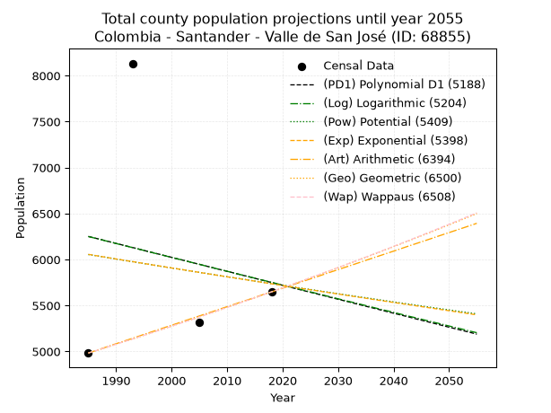
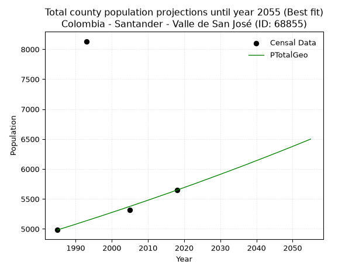
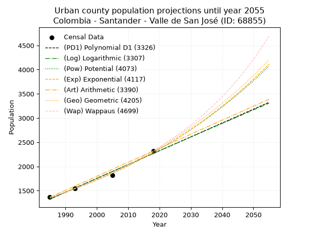
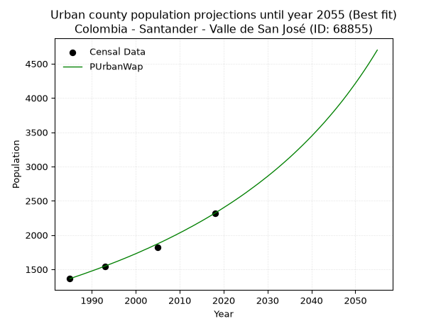
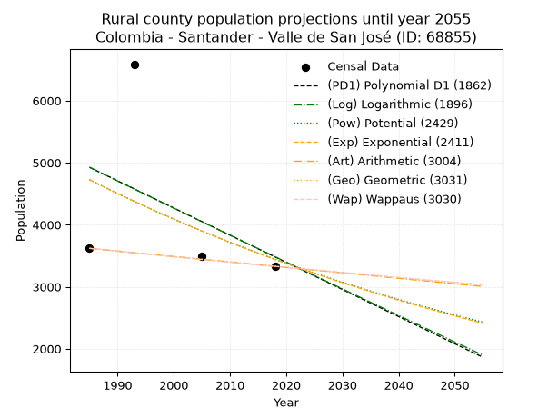
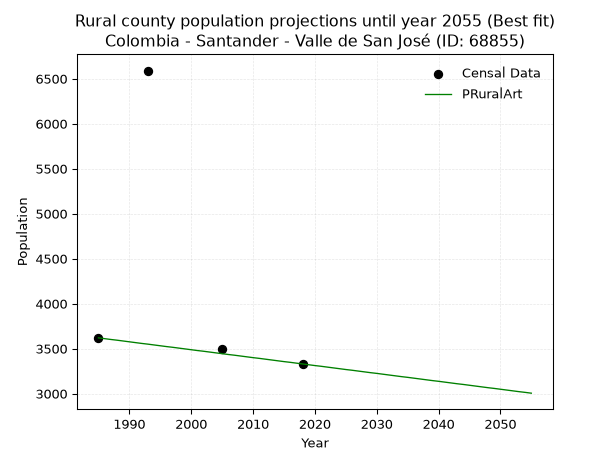

<div align="center">


</div>

# _“Population and Public Services Demand Projections (PPSD) until Year 2050 for Colombia - Santander - Valle de San José (ID: 68855)”_
Keywords: `population` `public-service` `projection` `lineal` `polynomial` `logarithmic` `potential` `exponential` `arithmetic` `geometric` `wappaus` `dane` `colombia` `south-america`

PPSD are analytical estimates used by governments and planners to anticipate future changes in population size, age distribution, and the resulting community needs for utilities, healthcare, education, and infrastructure as sizing future water treatment facilities, electrical grids, and road networks based on spatial growth.

> **General running parameters**: • app_version: _v20260806_. • Python version: _3.14.7_. • Pandas version: _3.0.5_. • NumPy version: _2.5.1_. • Creates, save and include plots into reports (create_plot): _False_. • Projection until year: _2050_. • Process polynomial degree 2 and up: _False_. • Process Wappaus: _True_. • Process Wappaus: _True_. • Set negative values to zero: _True_. • Set infinite values to zero: _True_. • Drop dataset notes: _True_. 
<div align="center">

Dynamic map: [:earth_americas:Google](http://maps.google.com/maps?q=6.448027924,-73.1435067) [:earth_americas:OSM](https://www.openstreetmap.org/#map=18/6.448027924/-73.1435067&layers=P) [:earth_americas:Bing](https://www.bing.com/maps?cp=6.448027924~-73.1435067&lvl=18) [:earth_americas:Apple](https://maps.apple.com/frame?center=6.448027924%2C-73.1435067&span=0.003%2C0.006)

</div>


<div align="center">

```geojson
{
  "type": "Feature",
  "geometry": {
    "type": "Point", 
    "coordinates": [-73.1435067, 6.448027924]
  }, 
  "properties": {
    "Name": "Colombia - Santander - Valle de San José (ID: 68855)"
  }
}
```

</div>


## 0. Census Data (4 records)

Census data are official statistics collected by a government about the people and housing in a country. They usually include counts of total population, age, sex, race, income, education, and jobs.

📅Global census file: [Population.xlsx](../data/Population.xlsx)

| Source   |   Year |   CountryID | CountryName   |   StateID | StateName   |   CountyID | CountyName        |   PTotal |   PUrban |   PRural |
|:---------|-------:|------------:|:--------------|----------:|:------------|-----------:|:------------------|---------:|---------:|---------:|
| DANE     |   1985 |          57 | Colombia      |        68 | Santander   |      68855 | Valle de San José |     4983 |     1364 |     3619 |
| DANE     |   1993 |          57 | Colombia      |        68 | Santander   |      68855 | Valle De San José |     8133 |     1544 |     6589 |
| DANE     |   2005 |          57 | Colombia      |        68 | Santander   |      68855 | Valle de San José |     5315 |     1818 |     3497 |
| DANE     |   2018 |          57 | Colombia      |        68 | Santander   |      68855 | Valle De San José |     5648 |     2319 |     3329 |

> 🔥Some records has specific notes about the registered values or the corresponding urban or rural distribution.

## 1. Total

### 1.1. Coefficients and Parameters

* (PD1) Polynomial Deg 1: -15.185467683661226, 36394.48173424337 (lineal)
* (Log) Logarithmic: -30204.84730829145, 235607.03643677902
* (Pow) Potential: -3.255125087223661, 14.51669967647453
* (Exp) Exponential: -0.0016408636916774755, 157289.29009560173
* (Art) Arithmetic: Year diff. 2018 - 1985 = 33, Population diff. 5648 - 4983 = 665, Annual growth = 20.151515151515152
* (Geo) Geometric: Year diff. 2018 - 1985 = 33, Population diff. 5648 - 4983 = 665, Annual growth % = 0.003803255937491201
* (Wap) Wappaus: i = 0.37910855331605964, Condition values only valid for < 200)

<sub>
Wappaus condition values: ['0.00', '0.38', '0.76', '1.14', '1.52', '1.90', '2.27', '2.65', '3.03', '3.41', '3.79', '4.17', '4.55', '4.93', '5.31', '5.69', '6.07', '6.44', '6.82', '7.20', '7.58', '7.96', '8.34', '8.72', '9.10', '9.48', '9.86', '10.24', '10.62', '10.99', '11.37', '11.75', '12.13', '12.51', '12.89', '13.27', '13.65', '14.03', '14.41', '14.79', '15.16', '15.54', '15.92', '16.30', '16.68', '17.06', '17.44', '17.82', '18.20', '18.58', '18.96', '19.33', '19.71', '20.09', '20.47', '20.85', '21.23', '21.61', '21.99', '22.37', '22.75', '23.13', '23.50', '23.88', '24.26', '24.64']
</sub>


### 1.2. Projected Dataset

|   Year |   CountyID |   PTotalPD1 |   PTotalLog |   PTotalPow |   PTotalExp |   PTotalArt |   PTotalGeo |   PTotalWap |
|-------:|-----------:|------------:|------------:|------------:|------------:|------------:|------------:|------------:|
|   1985 |      68855 |        6251 |        6250 |        6054 |        6056 |        4983 |        4983 |        4983 |
|   1986 |      68855 |        6236 |        6235 |        6045 |        6046 |        5003 |        5002 |        5002 |
|   1987 |      68855 |        6221 |        6220 |        6035 |        6036 |        5023 |        5021 |        5021 |
|   1988 |      68855 |        6206 |        6205 |        6025 |        6026 |        5043 |        5040 |        5040 |
|   1989 |      68855 |        6191 |        6190 |        6015 |        6016 |        5064 |        5059 |        5059 |
|   1990 |      68855 |        6175 |        6174 |        6005 |        6006 |        5084 |        5078 |        5078 |
|   1991 |      68855 |        6160 |        6159 |        5995 |        5996 |        5104 |        5098 |        5098 |
|   1992 |      68855 |        6145 |        6144 |        5985 |        5986 |        5124 |        5117 |        5117 |
|   1993 |      68855 |        6130 |        6129 |        5976 |        5977 |        5144 |        5137 |        5136 |
|   1994 |      68855 |        6115 |        6114 |        5966 |        5967 |        5164 |        5156 |        5156 |
|   1995 |      68855 |        6099 |        6099 |        5956 |        5957 |        5185 |        5176 |        5176 |
|   1996 |      68855 |        6084 |        6083 |        5947 |        5947 |        5205 |        5195 |        5195 |
|   1997 |      68855 |        6069 |        6068 |        5937 |        5937 |        5225 |        5215 |        5215 |
|   1998 |      68855 |        6054 |        6053 |        5927 |        5928 |        5245 |        5235 |        5235 |
|   1999 |      68855 |        6039 |        6038 |        5918 |        5918 |        5265 |        5255 |        5255 |
|   2000 |      68855 |        6024 |        6023 |        5908 |        5908 |        5285 |        5275 |        5275 |
|   2001 |      68855 |        6008 |        6008 |        5898 |        5899 |        5305 |        5295 |        5295 |
|   2002 |      68855 |        5993 |        5993 |        5889 |        5889 |        5326 |        5315 |        5315 |
|   2003 |      68855 |        5978 |        5978 |        5879 |        5879 |        5346 |        5335 |        5335 |
|   2004 |      68855 |        5963 |        5963 |        5870 |        5870 |        5366 |        5356 |        5355 |
|   2005 |      68855 |        5948 |        5948 |        5860 |        5860 |        5386 |        5376 |        5376 |
|   2006 |      68855 |        5932 |        5932 |        5851 |        5850 |        5406 |        5396 |        5396 |
|   2007 |      68855 |        5917 |        5917 |        5841 |        5841 |        5426 |        5417 |        5417 |
|   2008 |      68855 |        5902 |        5902 |        5832 |        5831 |        5446 |        5438 |        5437 |
|   2009 |      68855 |        5887 |        5887 |        5822 |        5822 |        5467 |        5458 |        5458 |
|   2010 |      68855 |        5872 |        5872 |        5813 |        5812 |        5487 |        5479 |        5479 |
|   2011 |      68855 |        5857 |        5857 |        5803 |        5803 |        5507 |        5500 |        5500 |
|   2012 |      68855 |        5841 |        5842 |        5794 |        5793 |        5527 |        5521 |        5521 |
|   2013 |      68855 |        5826 |        5827 |        5785 |        5784 |        5547 |        5542 |        5542 |
|   2014 |      68855 |        5811 |        5812 |        5775 |        5774 |        5567 |        5563 |        5563 |
|   2015 |      68855 |        5796 |        5797 |        5766 |        5765 |        5588 |        5584 |        5584 |
|   2016 |      68855 |        5781 |        5782 |        5757 |        5755 |        5608 |        5605 |        5605 |
|   2017 |      68855 |        5765 |        5767 |        5747 |        5746 |        5628 |        5627 |        5627 |
|   2018 |      68855 |        5750 |        5752 |        5738 |        5736 |        5648 |        5648 |        5648 |
|   2019 |      68855 |        5735 |        5737 |        5729 |        5727 |        5668 |        5669 |        5670 |
|   2020 |      68855 |        5720 |        5722 |        5720 |        5718 |        5688 |        5691 |        5691 |
|   2021 |      68855 |        5705 |        5707 |        5710 |        5708 |        5708 |        5713 |        5713 |
|   2022 |      68855 |        5689 |        5692 |        5701 |        5699 |        5729 |        5734 |        5735 |
|   2023 |      68855 |        5674 |        5678 |        5692 |        5689 |        5749 |        5756 |        5757 |
|   2024 |      68855 |        5659 |        5663 |        5683 |        5680 |        5769 |        5778 |        5779 |
|   2025 |      68855 |        5644 |        5648 |        5674 |        5671 |        5789 |        5800 |        5801 |
|   2026 |      68855 |        5629 |        5633 |        5665 |        5662 |        5809 |        5822 |        5823 |
|   2027 |      68855 |        5614 |        5618 |        5656 |        5652 |        5829 |        5844 |        5845 |
|   2028 |      68855 |        5598 |        5603 |        5647 |        5643 |        5850 |        5867 |        5867 |
|   2029 |      68855 |        5583 |        5588 |        5637 |        5634 |        5870 |        5889 |        5890 |
|   2030 |      68855 |        5568 |        5573 |        5628 |        5625 |        5890 |        5911 |        5912 |
|   2031 |      68855 |        5553 |        5558 |        5619 |        5615 |        5910 |        5934 |        5935 |
|   2032 |      68855 |        5538 |        5543 |        5610 |        5606 |        5930 |        5956 |        5958 |
|   2033 |      68855 |        5522 |        5529 |        5601 |        5597 |        5950 |        5979 |        5981 |
|   2034 |      68855 |        5507 |        5514 |        5592 |        5588 |        5970 |        6002 |        6003 |
|   2035 |      68855 |        5492 |        5499 |        5584 |        5579 |        5991 |        6024 |        6026 |
|   2036 |      68855 |        5477 |        5484 |        5575 |        5569 |        6011 |        6047 |        6050 |
|   2037 |      68855 |        5462 |        5469 |        5566 |        5560 |        6031 |        6070 |        6073 |
|   2038 |      68855 |        5446 |        5454 |        5557 |        5551 |        6051 |        6093 |        6096 |
|   2039 |      68855 |        5431 |        5440 |        5548 |        5542 |        6071 |        6117 |        6119 |
|   2040 |      68855 |        5416 |        5425 |        5539 |        5533 |        6091 |        6140 |        6143 |
|   2041 |      68855 |        5401 |        5410 |        5530 |        5524 |        6111 |        6163 |        6167 |
|   2042 |      68855 |        5386 |        5395 |        5521 |        5515 |        6132 |        6187 |        6190 |
|   2043 |      68855 |        5371 |        5380 |        5513 |        5506 |        6152 |        6210 |        6214 |
|   2044 |      68855 |        5355 |        5366 |        5504 |        5497 |        6172 |        6234 |        6238 |
|   2045 |      68855 |        5340 |        5351 |        5495 |        5488 |        6192 |        6258 |        6262 |
|   2046 |      68855 |        5325 |        5336 |        5486 |        5479 |        6212 |        6281 |        6286 |
|   2047 |      68855 |        5310 |        5321 |        5478 |        5470 |        6232 |        6305 |        6310 |
|   2048 |      68855 |        5295 |        5307 |        5469 |        5461 |        6253 |        6329 |        6335 |
|   2049 |      68855 |        5279 |        5292 |        5460 |        5452 |        6273 |        6353 |        6359 |
|   2050 |      68855 |        5264 |        5277 |        5452 |        5443 |        6293 |        6377 |        6383 |
<div align="center">

</img>

</div>


### 1.3. Best fit with absolute error and relative error (%)

Relative error puts that difference into context by dividing the absolute error by the true value, creating a unitless ratio or percentage that shows the scale of the mistake.

Absolute and relative error

|   Year | Source   |   CountryID | CountryName   |   StateID | StateName   |   CountyID_x | CountyName        |   PTotal |   PUrban |   PRural |   CountyID_y |   PTotalPD1 |   PTotalLog |   PTotalPow |   PTotalExp |   PTotalArt |   PTotalGeo |   PTotalWap |   PTotalPD1AbsError |   PTotalLogAbsError |   PTotalPowAbsError |   PTotalExpAbsError |   PTotalArtAbsError |   PTotalGeoAbsError |   PTotalWapAbsError |   PTotalPD1RelError |   PTotalLogRelError |   PTotalPowRelError |   PTotalExpRelError |   PTotalArtRelError |   PTotalGeoRelError |   PTotalWapRelError |
|-------:|:---------|------------:|:--------------|----------:|:------------|-------------:|:------------------|---------:|---------:|---------:|-------------:|------------:|------------:|------------:|------------:|------------:|------------:|------------:|--------------------:|--------------------:|--------------------:|--------------------:|--------------------:|--------------------:|--------------------:|--------------------:|--------------------:|--------------------:|--------------------:|--------------------:|--------------------:|--------------------:|
|   1985 | DANE     |          57 | Colombia      |        68 | Santander   |        68855 | Valle de San José |     4983 |     1364 |     3619 |        68855 |        6251 |        6250 |        6054 |        6056 |        4983 |        4983 |        4983 |                1268 |                1267 |                1071 |                1073 |                   0 |                   0 |                   0 |            25.4465  |            25.4264  |            21.4931  |            21.5332  |             0       |              0      |              0      |
|   1993 | DANE     |          57 | Colombia      |        68 | Santander   |        68855 | Valle De San José |     8133 |     1544 |     6589 |        68855 |        6130 |        6129 |        5976 |        5977 |        5144 |        5137 |        5136 |                2003 |                2004 |                2157 |                2156 |                2989 |                2996 |                2997 |            24.6281  |            24.6404  |            26.5216  |            26.5093  |            36.7515  |             36.8376 |             36.8499 |
|   2005 | DANE     |          57 | Colombia      |        68 | Santander   |        68855 | Valle de San José |     5315 |     1818 |     3497 |        68855 |        5948 |        5948 |        5860 |        5860 |        5386 |        5376 |        5376 |                 633 |                 633 |                 545 |                 545 |                  71 |                  61 |                  61 |            11.9097  |            11.9097  |            10.254   |            10.254   |             1.33584 |              1.1477 |              1.1477 |
|   2018 | DANE     |          57 | Colombia      |        68 | Santander   |        68855 | Valle De San José |     5648 |     2319 |     3329 |        68855 |        5750 |        5752 |        5738 |        5736 |        5648 |        5648 |        5648 |                 102 |                 104 |                  90 |                  88 |                   0 |                   0 |                   0 |             1.80595 |             1.84136 |             1.59348 |             1.55807 |             0       |              0      |              0      |

Relative error mean

| Method    |   RelError | Best   |
|:----------|-----------:|:-------|
| PTotalPD1 |   15.9476  |        |
| PTotalLog |   15.9545  |        |
| PTotalPow |   14.9655  |        |
| PTotalExp |   14.9636  |        |
| PTotalArt |    9.52184 |        |
| PTotalGeo |    9.49632 | True   |
| PTotalWap |    9.49939 |        |

💙Best method: _**PTotalGeo**_
<div align="center">

</img>

</div>


### 1.4. Fresh water supply demand in liters per capita per day (lpcd)

The fresh water supply demand typically ranges from 100 to 300 liters per capita per day (lpcd) for standard domestic and municipal planning, though absolute survival minimums set by the World Health Organization are as low as 7.5 to 20 liters per day, and total consumption in high-income nations can exceed 400 liters.

> `CZ`: Level in meters above the sea level (masl).<br> `WS`: Fresh water supply demand in liters per capita per day (lpcd or l/h/d).<br> `WSAll`: Zonal fresh water supply demand in liters per second (l/s).<br> `A`: Zonal area in square meters.

Reference values (RAS Colombia)

|    CZ |   WS |
|------:|-----:|
|  1000 |  120 |
|  2000 |  130 |
| 99999 |  140 |

County shapefile geometry properties and water supply values

|   CountyID |      ATotal |   CZTotal |   WSTotal |
|-----------:|------------:|----------:|----------:|
|      68855 | 8.09625e+07 |   1567.27 |       130 |

Projected values for best method: PTotalGeo

|   CountyID |   Year |   PTotalGeo |   WSTotal |   WSTotalAll |
|-----------:|-------:|------------:|----------:|-------------:|
|      68855 |   1985 |        4983 |       130 |      7.49757 |
|      68855 |   1986 |        5002 |       130 |      7.52616 |
|      68855 |   1987 |        5021 |       130 |      7.55475 |
|      68855 |   1988 |        5040 |       130 |      7.58333 |
|      68855 |   1989 |        5059 |       130 |      7.61192 |
|      68855 |   1990 |        5078 |       130 |      7.64051 |
|      68855 |   1991 |        5098 |       130 |      7.6706  |
|      68855 |   1992 |        5117 |       130 |      7.69919 |
|      68855 |   1993 |        5137 |       130 |      7.72928 |
|      68855 |   1994 |        5156 |       130 |      7.75787 |
|      68855 |   1995 |        5176 |       130 |      7.78796 |
|      68855 |   1996 |        5195 |       130 |      7.81655 |
|      68855 |   1997 |        5215 |       130 |      7.84664 |
|      68855 |   1998 |        5235 |       130 |      7.87674 |
|      68855 |   1999 |        5255 |       130 |      7.90683 |
|      68855 |   2000 |        5275 |       130 |      7.93692 |
|      68855 |   2001 |        5295 |       130 |      7.96701 |
|      68855 |   2002 |        5315 |       130 |      7.99711 |
|      68855 |   2003 |        5335 |       130 |      8.0272  |
|      68855 |   2004 |        5356 |       130 |      8.0588  |
|      68855 |   2005 |        5376 |       130 |      8.08889 |
|      68855 |   2006 |        5396 |       130 |      8.11898 |
|      68855 |   2007 |        5417 |       130 |      8.15058 |
|      68855 |   2008 |        5438 |       130 |      8.18218 |
|      68855 |   2009 |        5458 |       130 |      8.21227 |
|      68855 |   2010 |        5479 |       130 |      8.24387 |
|      68855 |   2011 |        5500 |       130 |      8.27546 |
|      68855 |   2012 |        5521 |       130 |      8.30706 |
|      68855 |   2013 |        5542 |       130 |      8.33866 |
|      68855 |   2014 |        5563 |       130 |      8.37025 |
|      68855 |   2015 |        5584 |       130 |      8.40185 |
|      68855 |   2016 |        5605 |       130 |      8.43345 |
|      68855 |   2017 |        5627 |       130 |      8.46655 |
|      68855 |   2018 |        5648 |       130 |      8.49815 |
|      68855 |   2019 |        5669 |       130 |      8.52975 |
|      68855 |   2020 |        5691 |       130 |      8.56285 |
|      68855 |   2021 |        5713 |       130 |      8.59595 |
|      68855 |   2022 |        5734 |       130 |      8.62755 |
|      68855 |   2023 |        5756 |       130 |      8.66065 |
|      68855 |   2024 |        5778 |       130 |      8.69375 |
|      68855 |   2025 |        5800 |       130 |      8.72685 |
|      68855 |   2026 |        5822 |       130 |      8.75995 |
|      68855 |   2027 |        5844 |       130 |      8.79306 |
|      68855 |   2028 |        5867 |       130 |      8.82766 |
|      68855 |   2029 |        5889 |       130 |      8.86076 |
|      68855 |   2030 |        5911 |       130 |      8.89387 |
|      68855 |   2031 |        5934 |       130 |      8.92847 |
|      68855 |   2032 |        5956 |       130 |      8.96157 |
|      68855 |   2033 |        5979 |       130 |      8.99618 |
|      68855 |   2034 |        6002 |       130 |      9.03079 |
|      68855 |   2035 |        6024 |       130 |      9.06389 |
|      68855 |   2036 |        6047 |       130 |      9.0985  |
|      68855 |   2037 |        6070 |       130 |      9.1331  |
|      68855 |   2038 |        6093 |       130 |      9.16771 |
|      68855 |   2039 |        6117 |       130 |      9.20382 |
|      68855 |   2040 |        6140 |       130 |      9.23843 |
|      68855 |   2041 |        6163 |       130 |      9.27303 |
|      68855 |   2042 |        6187 |       130 |      9.30914 |
|      68855 |   2043 |        6210 |       130 |      9.34375 |
|      68855 |   2044 |        6234 |       130 |      9.37986 |
|      68855 |   2045 |        6258 |       130 |      9.41597 |
|      68855 |   2046 |        6281 |       130 |      9.45058 |
|      68855 |   2047 |        6305 |       130 |      9.48669 |
|      68855 |   2048 |        6329 |       130 |      9.5228  |
|      68855 |   2049 |        6353 |       130 |      9.55891 |
|      68855 |   2050 |        6377 |       130 |      9.59502 |

## 2. Urban

### 2.1. Coefficients and Parameters

* (PD1) Polynomial Deg 1: 28.587314331593404, -55420.52549176971 (lineal)
* (Log) Logarithmic: 57202.870410730575, -433038.22638699814
* (Pow) Potential: 31.77170951392951, -101.64373350837091
* (Exp) Exponential: 0.015875162920750127, 2.7949506109480262e-11
* (Art) Arithmetic: Year diff. 2018 - 1985 = 33, Population diff. 2319 - 1364 = 955, Annual growth = 28.939393939393938
* (Geo) Geometric: Year diff. 2018 - 1985 = 33, Population diff. 2319 - 1364 = 955, Annual growth % = 0.01621227309088047
* (Wap) Wappaus: i = 1.571512024946725, Condition values only valid for < 200)

<sub>
Wappaus condition values: ['0.00', '1.57', '3.14', '4.71', '6.29', '7.86', '9.43', '11.00', '12.57', '14.14', '15.72', '17.29', '18.86', '20.43', '22.00', '23.57', '25.14', '26.72', '28.29', '29.86', '31.43', '33.00', '34.57', '36.14', '37.72', '39.29', '40.86', '42.43', '44.00', '45.57', '47.15', '48.72', '50.29', '51.86', '53.43', '55.00', '56.57', '58.15', '59.72', '61.29', '62.86', '64.43', '66.00', '67.58', '69.15', '70.72', '72.29', '73.86', '75.43', '77.00', '78.58', '80.15', '81.72', '83.29', '84.86', '86.43', '88.00', '89.58', '91.15', '92.72', '94.29', '95.86', '97.43', '99.01', '100.58', '102.15']
</sub>


### 2.2. Projected Dataset

|   Year |   CountyID |   PUrbanPD1 |   PUrbanLog |   PUrbanPow |   PUrbanExp |   PUrbanArt |   PUrbanGeo |   PUrbanWap |
|-------:|-----------:|------------:|------------:|------------:|------------:|------------:|------------:|------------:|
|   1985 |      68855 |        1325 |        1325 |        1354 |        1355 |        1364 |        1364 |        1364 |
|   1986 |      68855 |        1354 |        1353 |        1376 |        1377 |        1393 |        1386 |        1386 |
|   1987 |      68855 |        1382 |        1382 |        1398 |        1399 |        1422 |        1409 |        1408 |
|   1988 |      68855 |        1411 |        1411 |        1421 |        1421 |        1451 |        1431 |        1430 |
|   1989 |      68855 |        1440 |        1440 |        1444 |        1444 |        1480 |        1455 |        1453 |
|   1990 |      68855 |        1468 |        1468 |        1467 |        1467 |        1509 |        1478 |        1476 |
|   1991 |      68855 |        1497 |        1497 |        1491 |        1490 |        1538 |        1502 |        1499 |
|   1992 |      68855 |        1525 |        1526 |        1515 |        1514 |        1567 |        1527 |        1523 |
|   1993 |      68855 |        1554 |        1555 |        1539 |        1539 |        1596 |        1551 |        1547 |
|   1994 |      68855 |        1583 |        1583 |        1564 |        1563 |        1624 |        1576 |        1572 |
|   1995 |      68855 |        1611 |        1612 |        1589 |        1588 |        1653 |        1602 |        1597 |
|   1996 |      68855 |        1640 |        1641 |        1614 |        1614 |        1682 |        1628 |        1622 |
|   1997 |      68855 |        1668 |        1669 |        1640 |        1639 |        1711 |        1654 |        1648 |
|   1998 |      68855 |        1697 |        1698 |        1667 |        1666 |        1740 |        1681 |        1674 |
|   1999 |      68855 |        1726 |        1727 |        1693 |        1692 |        1769 |        1708 |        1701 |
|   2000 |      68855 |        1754 |        1755 |        1720 |        1719 |        1798 |        1736 |        1728 |
|   2001 |      68855 |        1783 |        1784 |        1748 |        1747 |        1827 |        1764 |        1756 |
|   2002 |      68855 |        1811 |        1812 |        1776 |        1775 |        1856 |        1793 |        1785 |
|   2003 |      68855 |        1840 |        1841 |        1804 |        1803 |        1885 |        1822 |        1813 |
|   2004 |      68855 |        1868 |        1870 |        1833 |        1832 |        1914 |        1851 |        1843 |
|   2005 |      68855 |        1897 |        1898 |        1862 |        1861 |        1943 |        1881 |        1873 |
|   2006 |      68855 |        1926 |        1927 |        1892 |        1891 |        1972 |        1912 |        1903 |
|   2007 |      68855 |        1954 |        1955 |        1922 |        1921 |        2001 |        1943 |        1934 |
|   2008 |      68855 |        1983 |        1984 |        1953 |        1952 |        2030 |        1974 |        1966 |
|   2009 |      68855 |        2011 |        2012 |        1984 |        1983 |        2059 |        2007 |        1998 |
|   2010 |      68855 |        2040 |        2041 |        2016 |        2015 |        2087 |        2039 |        2031 |
|   2011 |      68855 |        2069 |        2069 |        2048 |        2047 |        2116 |        2072 |        2064 |
|   2012 |      68855 |        2097 |        2097 |        2081 |        2080 |        2145 |        2106 |        2099 |
|   2013 |      68855 |        2126 |        2126 |        2114 |        2113 |        2174 |        2140 |        2133 |
|   2014 |      68855 |        2154 |        2154 |        2147 |        2147 |        2203 |        2175 |        2169 |
|   2015 |      68855 |        2183 |        2183 |        2181 |        2182 |        2232 |        2210 |        2205 |
|   2016 |      68855 |        2212 |        2211 |        2216 |        2217 |        2261 |        2246 |        2242 |
|   2017 |      68855 |        2240 |        2239 |        2251 |        2252 |        2290 |        2282 |        2280 |
|   2018 |      68855 |        2269 |        2268 |        2287 |        2288 |        2319 |        2319 |        2319 |
|   2019 |      68855 |        2297 |        2296 |        2323 |        2325 |        2348 |        2357 |        2358 |
|   2020 |      68855 |        2326 |        2324 |        2360 |        2362 |        2377 |        2395 |        2399 |
|   2021 |      68855 |        2354 |        2353 |        2398 |        2400 |        2406 |        2434 |        2440 |
|   2022 |      68855 |        2383 |        2381 |        2435 |        2438 |        2435 |        2473 |        2482 |
|   2023 |      68855 |        2412 |        2409 |        2474 |        2477 |        2464 |        2513 |        2525 |
|   2024 |      68855 |        2440 |        2438 |        2513 |        2517 |        2493 |        2554 |        2569 |
|   2025 |      68855 |        2469 |        2466 |        2553 |        2557 |        2522 |        2595 |        2614 |
|   2026 |      68855 |        2497 |        2494 |        2593 |        2598 |        2551 |        2637 |        2661 |
|   2027 |      68855 |        2526 |        2522 |        2634 |        2639 |        2579 |        2680 |        2708 |
|   2028 |      68855 |        2555 |        2550 |        2676 |        2682 |        2608 |        2724 |        2756 |
|   2029 |      68855 |        2583 |        2579 |        2718 |        2725 |        2637 |        2768 |        2806 |
|   2030 |      68855 |        2612 |        2607 |        2761 |        2768 |        2666 |        2813 |        2856 |
|   2031 |      68855 |        2640 |        2635 |        2805 |        2813 |        2695 |        2858 |        2908 |
|   2032 |      68855 |        2669 |        2663 |        2849 |        2858 |        2724 |        2905 |        2961 |
|   2033 |      68855 |        2697 |        2691 |        2894 |        2903 |        2753 |        2952 |        3016 |
|   2034 |      68855 |        2726 |        2719 |        2939 |        2950 |        2782 |        3000 |        3072 |
|   2035 |      68855 |        2755 |        2748 |        2985 |        2997 |        2811 |        3048 |        3129 |
|   2036 |      68855 |        2783 |        2776 |        3032 |        3045 |        2840 |        3098 |        3188 |
|   2037 |      68855 |        2812 |        2804 |        3080 |        3094 |        2869 |        3148 |        3249 |
|   2038 |      68855 |        2840 |        2832 |        3129 |        3143 |        2898 |        3199 |        3311 |
|   2039 |      68855 |        2869 |        2860 |        3178 |        3193 |        2927 |        3251 |        3375 |
|   2040 |      68855 |        2898 |        2888 |        3228 |        3244 |        2956 |        3303 |        3440 |
|   2041 |      68855 |        2926 |        2916 |        3278 |        3296 |        2985 |        3357 |        3508 |
|   2042 |      68855 |        2955 |        2944 |        3330 |        3349 |        3014 |        3411 |        3577 |
|   2043 |      68855 |        2983 |        2972 |        3382 |        3403 |        3042 |        3467 |        3648 |
|   2044 |      68855 |        3012 |        3000 |        3435 |        3457 |        3071 |        3523 |        3722 |
|   2045 |      68855 |        3041 |        3028 |        3489 |        3513 |        3100 |        3580 |        3797 |
|   2046 |      68855 |        3069 |        3056 |        3543 |        3569 |        3129 |        3638 |        3875 |
|   2047 |      68855 |        3098 |        3084 |        3599 |        3626 |        3158 |        3697 |        3955 |
|   2048 |      68855 |        3126 |        3112 |        3655 |        3684 |        3187 |        3757 |        4038 |
|   2049 |      68855 |        3155 |        3140 |        3712 |        3743 |        3216 |        3818 |        4124 |
|   2050 |      68855 |        3183 |        3168 |        3770 |        3803 |        3245 |        3880 |        4212 |
<div align="center">

</img>

</div>


### 2.3. Best fit with absolute error and relative error (%)

Relative error puts that difference into context by dividing the absolute error by the true value, creating a unitless ratio or percentage that shows the scale of the mistake.

Absolute and relative error

|   Year | Source   |   CountryID | CountryName   |   StateID | StateName   |   CountyID_x | CountyName        |   PTotal |   PUrban |   PRural |   CountyID_y |   PUrbanPD1 |   PUrbanLog |   PUrbanPow |   PUrbanExp |   PUrbanArt |   PUrbanGeo |   PUrbanWap |   PUrbanPD1AbsError |   PUrbanLogAbsError |   PUrbanPowAbsError |   PUrbanExpAbsError |   PUrbanArtAbsError |   PUrbanGeoAbsError |   PUrbanWapAbsError |   PUrbanPD1RelError |   PUrbanLogRelError |   PUrbanPowRelError |   PUrbanExpRelError |   PUrbanArtRelError |   PUrbanGeoRelError |   PUrbanWapRelError |
|-------:|:---------|------------:|:--------------|----------:|:------------|-------------:|:------------------|---------:|---------:|---------:|-------------:|------------:|------------:|------------:|------------:|------------:|------------:|------------:|--------------------:|--------------------:|--------------------:|--------------------:|--------------------:|--------------------:|--------------------:|--------------------:|--------------------:|--------------------:|--------------------:|--------------------:|--------------------:|--------------------:|
|   1985 | DANE     |          57 | Colombia      |        68 | Santander   |        68855 | Valle de San José |     4983 |     1364 |     3619 |        68855 |        1325 |        1325 |        1354 |        1355 |        1364 |        1364 |        1364 |                  39 |                  39 |                  10 |                   9 |                   0 |                   0 |                   0 |            2.85924  |            2.85924  |            0.733138 |            0.659824 |             0       |            0        |            0        |
|   1993 | DANE     |          57 | Colombia      |        68 | Santander   |        68855 | Valle De San José |     8133 |     1544 |     6589 |        68855 |        1554 |        1555 |        1539 |        1539 |        1596 |        1551 |        1547 |                  10 |                  11 |                   5 |                   5 |                  52 |                   7 |                   3 |            0.647668 |            0.712435 |            0.323834 |            0.323834 |             3.36788 |            0.453368 |            0.194301 |
|   2005 | DANE     |          57 | Colombia      |        68 | Santander   |        68855 | Valle de San José |     5315 |     1818 |     3497 |        68855 |        1897 |        1898 |        1862 |        1861 |        1943 |        1881 |        1873 |                  79 |                  80 |                  44 |                  43 |                 125 |                  63 |                  55 |            4.34543  |            4.40044  |            2.42024  |            2.36524  |             6.87569 |            3.46535  |            3.0253   |
|   2018 | DANE     |          57 | Colombia      |        68 | Santander   |        68855 | Valle De San José |     5648 |     2319 |     3329 |        68855 |        2269 |        2268 |        2287 |        2288 |        2319 |        2319 |        2319 |                  50 |                  51 |                  32 |                  31 |                   0 |                   0 |                   0 |            2.1561   |            2.19922  |            1.37991  |            1.33678  |             0       |            0        |            0        |

Relative error mean

| Method    |   RelError | Best   |
|:----------|-----------:|:-------|
| PUrbanPD1 |   2.50211  |        |
| PUrbanLog |   2.54283  |        |
| PUrbanPow |   1.21428  |        |
| PUrbanExp |   1.17142  |        |
| PUrbanArt |   2.56089  |        |
| PUrbanGeo |   0.979679 |        |
| PUrbanWap |   0.804901 | True   |

💙Best method: _**PUrbanWap**_
<div align="center">

</img>

</div>


### 2.4. Fresh water supply demand in liters per capita per day (lpcd)

The fresh water supply demand typically ranges from 100 to 300 liters per capita per day (lpcd) for standard domestic and municipal planning, though absolute survival minimums set by the World Health Organization are as low as 7.5 to 20 liters per day, and total consumption in high-income nations can exceed 400 liters.

> `CZ`: Level in meters above the sea level (masl).<br> `WS`: Fresh water supply demand in liters per capita per day (lpcd or l/h/d).<br> `WSAll`: Zonal fresh water supply demand in liters per second (l/s).<br> `A`: Zonal area in square meters.

Reference values (RAS Colombia)

|    CZ |   WS |
|------:|-----:|
|  1000 |  120 |
|  2000 |  130 |
| 99999 |  140 |

County shapefile geometry properties and water supply values

|   CountyID |   AUrban |   CZUrban |   WSUrban |
|-----------:|---------:|----------:|----------:|
|      68855 |   413805 |   1234.28 |       130 |

Projected values for best method: PUrbanWap

|   CountyID |   Year |   PUrbanWap |   WSUrban |   WSUrbanAll |
|-----------:|-------:|------------:|----------:|-------------:|
|      68855 |   1985 |        1364 |       130 |      2.05231 |
|      68855 |   1986 |        1386 |       130 |      2.08542 |
|      68855 |   1987 |        1408 |       130 |      2.11852 |
|      68855 |   1988 |        1430 |       130 |      2.15162 |
|      68855 |   1989 |        1453 |       130 |      2.18623 |
|      68855 |   1990 |        1476 |       130 |      2.22083 |
|      68855 |   1991 |        1499 |       130 |      2.25544 |
|      68855 |   1992 |        1523 |       130 |      2.29155 |
|      68855 |   1993 |        1547 |       130 |      2.32766 |
|      68855 |   1994 |        1572 |       130 |      2.36528 |
|      68855 |   1995 |        1597 |       130 |      2.40289 |
|      68855 |   1996 |        1622 |       130 |      2.44051 |
|      68855 |   1997 |        1648 |       130 |      2.47963 |
|      68855 |   1998 |        1674 |       130 |      2.51875 |
|      68855 |   1999 |        1701 |       130 |      2.55938 |
|      68855 |   2000 |        1728 |       130 |      2.6     |
|      68855 |   2001 |        1756 |       130 |      2.64213 |
|      68855 |   2002 |        1785 |       130 |      2.68576 |
|      68855 |   2003 |        1813 |       130 |      2.72789 |
|      68855 |   2004 |        1843 |       130 |      2.77303 |
|      68855 |   2005 |        1873 |       130 |      2.81817 |
|      68855 |   2006 |        1903 |       130 |      2.86331 |
|      68855 |   2007 |        1934 |       130 |      2.90995 |
|      68855 |   2008 |        1966 |       130 |      2.9581  |
|      68855 |   2009 |        1998 |       130 |      3.00625 |
|      68855 |   2010 |        2031 |       130 |      3.0559  |
|      68855 |   2011 |        2064 |       130 |      3.10556 |
|      68855 |   2012 |        2099 |       130 |      3.15822 |
|      68855 |   2013 |        2133 |       130 |      3.20938 |
|      68855 |   2014 |        2169 |       130 |      3.26354 |
|      68855 |   2015 |        2205 |       130 |      3.31771 |
|      68855 |   2016 |        2242 |       130 |      3.37338 |
|      68855 |   2017 |        2280 |       130 |      3.43056 |
|      68855 |   2018 |        2319 |       130 |      3.48924 |
|      68855 |   2019 |        2358 |       130 |      3.54792 |
|      68855 |   2020 |        2399 |       130 |      3.60961 |
|      68855 |   2021 |        2440 |       130 |      3.6713  |
|      68855 |   2022 |        2482 |       130 |      3.73449 |
|      68855 |   2023 |        2525 |       130 |      3.79919 |
|      68855 |   2024 |        2569 |       130 |      3.86539 |
|      68855 |   2025 |        2614 |       130 |      3.9331  |
|      68855 |   2026 |        2661 |       130 |      4.00382 |
|      68855 |   2027 |        2708 |       130 |      4.07454 |
|      68855 |   2028 |        2756 |       130 |      4.14676 |
|      68855 |   2029 |        2806 |       130 |      4.22199 |
|      68855 |   2030 |        2856 |       130 |      4.29722 |
|      68855 |   2031 |        2908 |       130 |      4.37546 |
|      68855 |   2032 |        2961 |       130 |      4.45521 |
|      68855 |   2033 |        3016 |       130 |      4.53796 |
|      68855 |   2034 |        3072 |       130 |      4.62222 |
|      68855 |   2035 |        3129 |       130 |      4.70799 |
|      68855 |   2036 |        3188 |       130 |      4.79676 |
|      68855 |   2037 |        3249 |       130 |      4.88854 |
|      68855 |   2038 |        3311 |       130 |      4.98183 |
|      68855 |   2039 |        3375 |       130 |      5.07812 |
|      68855 |   2040 |        3440 |       130 |      5.17593 |
|      68855 |   2041 |        3508 |       130 |      5.27824 |
|      68855 |   2042 |        3577 |       130 |      5.38206 |
|      68855 |   2043 |        3648 |       130 |      5.48889 |
|      68855 |   2044 |        3722 |       130 |      5.60023 |
|      68855 |   2045 |        3797 |       130 |      5.71308 |
|      68855 |   2046 |        3875 |       130 |      5.83044 |
|      68855 |   2047 |        3955 |       130 |      5.95081 |
|      68855 |   2048 |        4038 |       130 |      6.07569 |
|      68855 |   2049 |        4124 |       130 |      6.20509 |
|      68855 |   2050 |        4212 |       130 |      6.3375  |

## 3. Rural

### 3.1. Coefficients and Parameters

* (PD1) Polynomial Deg 1: -43.77278201525463, 91815.00722601308 (lineal)
* (Log) Logarithmic: -87407.71771902211, 668645.2628237779
* (Pow) Potential: -19.20870369342274, 67.02024200513453
* (Exp) Exponential: -0.009618143645868295, 924936843589.2676
* (Art) Arithmetic: Year diff. 2018 - 1985 = 33, Population diff. 3329 - 3619 = -290, Annual growth = -8.787878787878787
* (Geo) Geometric: Year diff. 2018 - 1985 = 33, Population diff. 3329 - 3619 = -290, Annual growth % = -0.0025278839305291623
* (Wap) Wappaus: i = -0.2529613928577659, Condition values only valid for < 200)

<sub>
Wappaus condition values: ['-0.00', '-0.25', '-0.51', '-0.76', '-1.01', '-1.26', '-1.52', '-1.77', '-2.02', '-2.28', '-2.53', '-2.78', '-3.04', '-3.29', '-3.54', '-3.79', '-4.05', '-4.30', '-4.55', '-4.81', '-5.06', '-5.31', '-5.57', '-5.82', '-6.07', '-6.32', '-6.58', '-6.83', '-7.08', '-7.34', '-7.59', '-7.84', '-8.09', '-8.35', '-8.60', '-8.85', '-9.11', '-9.36', '-9.61', '-9.87', '-10.12', '-10.37', '-10.62', '-10.88', '-11.13', '-11.38', '-11.64', '-11.89', '-12.14', '-12.40', '-12.65', '-12.90', '-13.15', '-13.41', '-13.66', '-13.91', '-14.17', '-14.42', '-14.67', '-14.92', '-15.18', '-15.43', '-15.68', '-15.94', '-16.19', '-16.44']
</sub>


### 3.2. Projected Dataset

|   Year |   CountyID |   PRuralPD1 |   PRuralLog |   PRuralPow |   PRuralExp |   PRuralArt |   PRuralGeo |   PRuralWap |
|-------:|-----------:|------------:|------------:|------------:|------------:|------------:|------------:|------------:|
|   1985 |      68855 |        4926 |        4926 |        4726 |        4727 |        3619 |        3619 |        3619 |
|   1986 |      68855 |        4882 |        4882 |        4681 |        4681 |        3610 |        3610 |        3610 |
|   1987 |      68855 |        4838 |        4838 |        4636 |        4637 |        3601 |        3601 |        3601 |
|   1988 |      68855 |        4795 |        4794 |        4591 |        4592 |        3593 |        3592 |        3592 |
|   1989 |      68855 |        4751 |        4750 |        4547 |        4548 |        3584 |        3583 |        3583 |
|   1990 |      68855 |        4707 |        4706 |        4504 |        4505 |        3575 |        3573 |        3574 |
|   1991 |      68855 |        4663 |        4662 |        4460 |        4462 |        3566 |        3564 |        3564 |
|   1992 |      68855 |        4620 |        4618 |        4417 |        4419 |        3557 |        3555 |        3555 |
|   1993 |      68855 |        4576 |        4574 |        4375 |        4377 |        3549 |        3546 |        3546 |
|   1994 |      68855 |        4532 |        4530 |        4333 |        4335 |        3540 |        3537 |        3538 |
|   1995 |      68855 |        4488 |        4487 |        4292 |        4293 |        3531 |        3529 |        3529 |
|   1996 |      68855 |        4445 |        4443 |        4250 |        4252 |        3522 |        3520 |        3520 |
|   1997 |      68855 |        4401 |        4399 |        4210 |        4211 |        3514 |        3511 |        3511 |
|   1998 |      68855 |        4357 |        4355 |        4169 |        4171 |        3505 |        3502 |        3502 |
|   1999 |      68855 |        4313 |        4311 |        4130 |        4131 |        3496 |        3493 |        3493 |
|   2000 |      68855 |        4269 |        4268 |        4090 |        4092 |        3487 |        3484 |        3484 |
|   2001 |      68855 |        4226 |        4224 |        4051 |        4052 |        3478 |        3475 |        3475 |
|   2002 |      68855 |        4182 |        4180 |        4012 |        4014 |        3470 |        3467 |        3467 |
|   2003 |      68855 |        4138 |        4137 |        3974 |        3975 |        3461 |        3458 |        3458 |
|   2004 |      68855 |        4094 |        4093 |        3936 |        3937 |        3452 |        3449 |        3449 |
|   2005 |      68855 |        4051 |        4049 |        3899 |        3900 |        3443 |        3440 |        3440 |
|   2006 |      68855 |        4007 |        4006 |        3861 |        3862 |        3434 |        3432 |        3432 |
|   2007 |      68855 |        3963 |        3962 |        3825 |        3825 |        3426 |        3423 |        3423 |
|   2008 |      68855 |        3919 |        3919 |        3788 |        3789 |        3417 |        3414 |        3414 |
|   2009 |      68855 |        3875 |        3875 |        3752 |        3752 |        3408 |        3406 |        3406 |
|   2010 |      68855 |        3832 |        3832 |        3716 |        3716 |        3399 |        3397 |        3397 |
|   2011 |      68855 |        3788 |        3788 |        3681 |        3681 |        3391 |        3389 |        3389 |
|   2012 |      68855 |        3744 |        3745 |        3646 |        3646 |        3382 |        3380 |        3380 |
|   2013 |      68855 |        3700 |        3701 |        3611 |        3611 |        3373 |        3371 |        3371 |
|   2014 |      68855 |        3657 |        3658 |        3577 |        3576 |        3364 |        3363 |        3363 |
|   2015 |      68855 |        3613 |        3615 |        3543 |        3542 |        3355 |        3354 |        3354 |
|   2016 |      68855 |        3569 |        3571 |        3510 |        3508 |        3347 |        3346 |        3346 |
|   2017 |      68855 |        3525 |        3528 |        3476 |        3474 |        3338 |        3337 |        3337 |
|   2018 |      68855 |        3482 |        3485 |        3443 |        3441 |        3329 |        3329 |        3329 |
|   2019 |      68855 |        3438 |        3441 |        3411 |        3408 |        3320 |        3321 |        3321 |
|   2020 |      68855 |        3394 |        3398 |        3379 |        3376 |        3311 |        3312 |        3312 |
|   2021 |      68855 |        3350 |        3355 |        3347 |        3343 |        3303 |        3304 |        3304 |
|   2022 |      68855 |        3306 |        3311 |        3315 |        3311 |        3294 |        3295 |        3295 |
|   2023 |      68855 |        3263 |        3268 |        3284 |        3280 |        3285 |        3287 |        3287 |
|   2024 |      68855 |        3219 |        3225 |        3253 |        3248 |        3276 |        3279 |        3279 |
|   2025 |      68855 |        3175 |        3182 |        3222 |        3217 |        3267 |        3271 |        3270 |
|   2026 |      68855 |        3131 |        3139 |        3191 |        3186 |        3259 |        3262 |        3262 |
|   2027 |      68855 |        3088 |        3096 |        3161 |        3156 |        3250 |        3254 |        3254 |
|   2028 |      68855 |        3044 |        3053 |        3132 |        3126 |        3241 |        3246 |        3246 |
|   2029 |      68855 |        3000 |        3009 |        3102 |        3096 |        3232 |        3238 |        3237 |
|   2030 |      68855 |        2956 |        2966 |        3073 |        3066 |        3224 |        3229 |        3229 |
|   2031 |      68855 |        2912 |        2923 |        3044 |        3037 |        3215 |        3221 |        3221 |
|   2032 |      68855 |        2869 |        2880 |        3015 |        3008 |        3206 |        3213 |        3213 |
|   2033 |      68855 |        2825 |        2837 |        2987 |        2979 |        3197 |        3205 |        3205 |
|   2034 |      68855 |        2781 |        2794 |        2959 |        2950 |        3188 |        3197 |        3197 |
|   2035 |      68855 |        2737 |        2751 |        2931 |        2922 |        3180 |        3189 |        3188 |
|   2036 |      68855 |        2694 |        2708 |        2903 |        2894 |        3171 |        3181 |        3180 |
|   2037 |      68855 |        2650 |        2665 |        2876 |        2866 |        3162 |        3173 |        3172 |
|   2038 |      68855 |        2606 |        2623 |        2849 |        2839 |        3153 |        3165 |        3164 |
|   2039 |      68855 |        2562 |        2580 |        2822 |        2812 |        3144 |        3157 |        3156 |
|   2040 |      68855 |        2519 |        2537 |        2796 |        2785 |        3136 |        3149 |        3148 |
|   2041 |      68855 |        2475 |        2494 |        2770 |        2758 |        3127 |        3141 |        3140 |
|   2042 |      68855 |        2431 |        2451 |        2744 |        2732 |        3118 |        3133 |        3132 |
|   2043 |      68855 |        2387 |        2408 |        2718 |        2706 |        3109 |        3125 |        3124 |
|   2044 |      68855 |        2343 |        2366 |        2693 |        2680 |        3101 |        3117 |        3116 |
|   2045 |      68855 |        2300 |        2323 |        2668 |        2654 |        3092 |        3109 |        3108 |
|   2046 |      68855 |        2256 |        2280 |        2643 |        2629 |        3083 |        3101 |        3101 |
|   2047 |      68855 |        2212 |        2237 |        2618 |        2604 |        3074 |        3093 |        3093 |
|   2048 |      68855 |        2168 |        2195 |        2593 |        2579 |        3065 |        3086 |        3085 |
|   2049 |      68855 |        2125 |        2152 |        2569 |        2554 |        3057 |        3078 |        3077 |
|   2050 |      68855 |        2081 |        2109 |        2545 |        2530 |        3048 |        3070 |        3069 |
<div align="center">

</img>

</div>


### 3.3. Best fit with absolute error and relative error (%)

Relative error puts that difference into context by dividing the absolute error by the true value, creating a unitless ratio or percentage that shows the scale of the mistake.

Absolute and relative error

|   Year | Source   |   CountryID | CountryName   |   StateID | StateName   |   CountyID_x | CountyName        |   PTotal |   PUrban |   PRural |   CountyID_y |   PRuralPD1 |   PRuralLog |   PRuralPow |   PRuralExp |   PRuralArt |   PRuralGeo |   PRuralWap |   PRuralPD1AbsError |   PRuralLogAbsError |   PRuralPowAbsError |   PRuralExpAbsError |   PRuralArtAbsError |   PRuralGeoAbsError |   PRuralWapAbsError |   PRuralPD1RelError |   PRuralLogRelError |   PRuralPowRelError |   PRuralExpRelError |   PRuralArtRelError |   PRuralGeoRelError |   PRuralWapRelError |
|-------:|:---------|------------:|:--------------|----------:|:------------|-------------:|:------------------|---------:|---------:|---------:|-------------:|------------:|------------:|------------:|------------:|------------:|------------:|------------:|--------------------:|--------------------:|--------------------:|--------------------:|--------------------:|--------------------:|--------------------:|--------------------:|--------------------:|--------------------:|--------------------:|--------------------:|--------------------:|--------------------:|
|   1985 | DANE     |          57 | Colombia      |        68 | Santander   |        68855 | Valle de San José |     4983 |     1364 |     3619 |        68855 |        4926 |        4926 |        4726 |        4727 |        3619 |        3619 |        3619 |                1307 |                1307 |                1107 |                1108 |                   0 |                   0 |                   0 |            36.1149  |            36.1149  |            30.5886  |            30.6162  |             0       |             0       |             0       |
|   1993 | DANE     |          57 | Colombia      |        68 | Santander   |        68855 | Valle De San José |     8133 |     1544 |     6589 |        68855 |        4576 |        4574 |        4375 |        4377 |        3549 |        3546 |        3546 |                2013 |                2015 |                2214 |                2212 |                3040 |                3043 |                3043 |            30.5509  |            30.5813  |            33.6015  |            33.5711  |            46.1375  |            46.183   |            46.183   |
|   2005 | DANE     |          57 | Colombia      |        68 | Santander   |        68855 | Valle de San José |     5315 |     1818 |     3497 |        68855 |        4051 |        4049 |        3899 |        3900 |        3443 |        3440 |        3440 |                 554 |                 552 |                 402 |                 403 |                  54 |                  57 |                  57 |            15.8422  |            15.785   |            11.4956  |            11.5242  |             1.54418 |             1.62997 |             1.62997 |
|   2018 | DANE     |          57 | Colombia      |        68 | Santander   |        68855 | Valle De San José |     5648 |     2319 |     3329 |        68855 |        3482 |        3485 |        3443 |        3441 |        3329 |        3329 |        3329 |                 153 |                 156 |                 114 |                 112 |                   0 |                   0 |                   0 |             4.59597 |             4.68609 |             3.42445 |             3.36437 |             0       |             0       |             0       |

Relative error mean

| Method    |   RelError | Best   |
|:----------|-----------:|:-------|
| PRuralPD1 |    21.776  |        |
| PRuralLog |    21.7918 |        |
| PRuralPow |    19.7775 |        |
| PRuralExp |    19.769  |        |
| PRuralArt |    11.9204 | True   |
| PRuralGeo |    11.9533 |        |
| PRuralWap |    11.9533 |        |

💙Best method: _**PRuralArt**_
<div align="center">

</img>

</div>


### 3.4. Fresh water supply demand in liters per capita per day (lpcd)

The fresh water supply demand typically ranges from 100 to 300 liters per capita per day (lpcd) for standard domestic and municipal planning, though absolute survival minimums set by the World Health Organization are as low as 7.5 to 20 liters per day, and total consumption in high-income nations can exceed 400 liters.

> `CZ`: Level in meters above the sea level (masl).<br> `WS`: Fresh water supply demand in liters per capita per day (lpcd or l/h/d).<br> `WSAll`: Zonal fresh water supply demand in liters per second (l/s).<br> `A`: Zonal area in square meters.

Reference values (RAS Colombia)

|    CZ |   WS |
|------:|-----:|
|  1000 |  120 |
|  2000 |  130 |
| 99999 |  140 |

County shapefile geometry properties and water supply values

|   CountyID |      ARural |   CZRural |   WSRural |
|-----------:|------------:|----------:|----------:|
|      68855 | 8.05487e+07 |   1568.96 |       130 |

Projected values for best method: PRuralArt

|   CountyID |   Year |   PRuralArt |   WSRural |   WSRuralAll |
|-----------:|-------:|------------:|----------:|-------------:|
|      68855 |   1985 |        3619 |       130 |      5.44525 |
|      68855 |   1986 |        3610 |       130 |      5.43171 |
|      68855 |   1987 |        3601 |       130 |      5.41817 |
|      68855 |   1988 |        3593 |       130 |      5.40613 |
|      68855 |   1989 |        3584 |       130 |      5.39259 |
|      68855 |   1990 |        3575 |       130 |      5.37905 |
|      68855 |   1991 |        3566 |       130 |      5.36551 |
|      68855 |   1992 |        3557 |       130 |      5.35197 |
|      68855 |   1993 |        3549 |       130 |      5.33993 |
|      68855 |   1994 |        3540 |       130 |      5.32639 |
|      68855 |   1995 |        3531 |       130 |      5.31285 |
|      68855 |   1996 |        3522 |       130 |      5.29931 |
|      68855 |   1997 |        3514 |       130 |      5.28727 |
|      68855 |   1998 |        3505 |       130 |      5.27373 |
|      68855 |   1999 |        3496 |       130 |      5.26019 |
|      68855 |   2000 |        3487 |       130 |      5.24664 |
|      68855 |   2001 |        3478 |       130 |      5.2331  |
|      68855 |   2002 |        3470 |       130 |      5.22106 |
|      68855 |   2003 |        3461 |       130 |      5.20752 |
|      68855 |   2004 |        3452 |       130 |      5.19398 |
|      68855 |   2005 |        3443 |       130 |      5.18044 |
|      68855 |   2006 |        3434 |       130 |      5.1669  |
|      68855 |   2007 |        3426 |       130 |      5.15486 |
|      68855 |   2008 |        3417 |       130 |      5.14132 |
|      68855 |   2009 |        3408 |       130 |      5.12778 |
|      68855 |   2010 |        3399 |       130 |      5.11424 |
|      68855 |   2011 |        3391 |       130 |      5.1022  |
|      68855 |   2012 |        3382 |       130 |      5.08866 |
|      68855 |   2013 |        3373 |       130 |      5.07512 |
|      68855 |   2014 |        3364 |       130 |      5.06157 |
|      68855 |   2015 |        3355 |       130 |      5.04803 |
|      68855 |   2016 |        3347 |       130 |      5.036   |
|      68855 |   2017 |        3338 |       130 |      5.02245 |
|      68855 |   2018 |        3329 |       130 |      5.00891 |
|      68855 |   2019 |        3320 |       130 |      4.99537 |
|      68855 |   2020 |        3311 |       130 |      4.98183 |
|      68855 |   2021 |        3303 |       130 |      4.96979 |
|      68855 |   2022 |        3294 |       130 |      4.95625 |
|      68855 |   2023 |        3285 |       130 |      4.94271 |
|      68855 |   2024 |        3276 |       130 |      4.92917 |
|      68855 |   2025 |        3267 |       130 |      4.91563 |
|      68855 |   2026 |        3259 |       130 |      4.90359 |
|      68855 |   2027 |        3250 |       130 |      4.89005 |
|      68855 |   2028 |        3241 |       130 |      4.8765  |
|      68855 |   2029 |        3232 |       130 |      4.86296 |
|      68855 |   2030 |        3224 |       130 |      4.85093 |
|      68855 |   2031 |        3215 |       130 |      4.83738 |
|      68855 |   2032 |        3206 |       130 |      4.82384 |
|      68855 |   2033 |        3197 |       130 |      4.8103  |
|      68855 |   2034 |        3188 |       130 |      4.79676 |
|      68855 |   2035 |        3180 |       130 |      4.78472 |
|      68855 |   2036 |        3171 |       130 |      4.77118 |
|      68855 |   2037 |        3162 |       130 |      4.75764 |
|      68855 |   2038 |        3153 |       130 |      4.7441  |
|      68855 |   2039 |        3144 |       130 |      4.73056 |
|      68855 |   2040 |        3136 |       130 |      4.71852 |
|      68855 |   2041 |        3127 |       130 |      4.70498 |
|      68855 |   2042 |        3118 |       130 |      4.69144 |
|      68855 |   2043 |        3109 |       130 |      4.67789 |
|      68855 |   2044 |        3101 |       130 |      4.66586 |
|      68855 |   2045 |        3092 |       130 |      4.65231 |
|      68855 |   2046 |        3083 |       130 |      4.63877 |
|      68855 |   2047 |        3074 |       130 |      4.62523 |
|      68855 |   2048 |        3065 |       130 |      4.61169 |
|      68855 |   2049 |        3057 |       130 |      4.59965 |
|      68855 |   2050 |        3048 |       130 |      4.58611 |

<div align="center"><br><sub>Share this research</sub></div><br>

<sub>**APPS & TOOLS & CONTENT DISCLAIMER**: • NO WARRANTY - This content and software is provided by <a href="https://github.com/rcfdtools" target="_blank">github.com/rcfdtools</a> "as is", without any express or implied warranty, including warranties of merchantability, fitness for a particular purpose, or non-infringement. There is no guarantee that the software will be error-free or operate without interruption. • LIMITATION OF LIABILITY - Neither the authors nor copyright holders will be liable for claims or damages arising from the software or its use. You are responsible for determining if the software is appropriate for your use and assume all associated risks, including errors, legal compliance, and data loss. • NO PROFESSIONAL ADVICE - The software provides general information and does not offer professional advice. It should not replace consultation with professional advisors. [Clauses and global license for rcfdtools use.](https://github.com/rcfdtools/rcfdtools/blob/main/LICENSE.md)</sub>