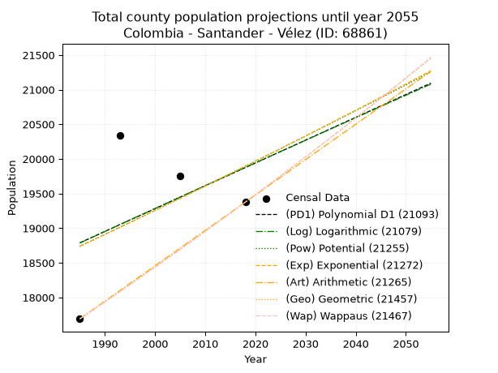
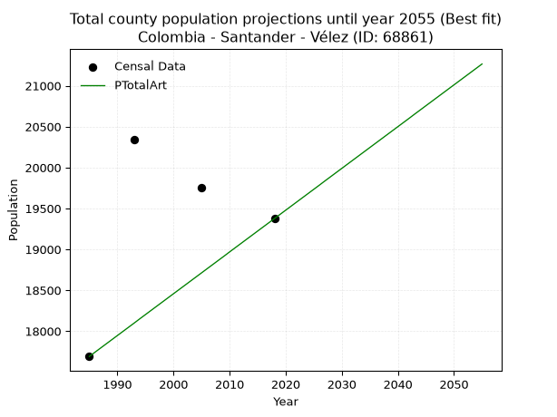
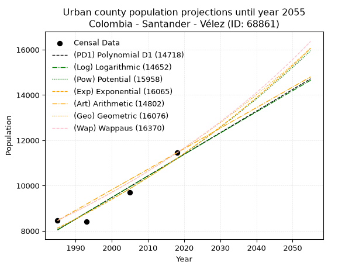

<div align="center">


</div>

# _“Population and Public Services Demand Projections (PPSD) until Year 2050 for Colombia - Santander - Vélez (ID: 68861)”_
Keywords: `population` `public-service` `projection` `lineal` `polynomial` `logarithmic` `potential` `exponential` `arithmetic` `geometric` `wappaus` `dane` `colombia` `south-america`

PPSD are analytical estimates used by governments and planners to anticipate future changes in population size, age distribution, and the resulting community needs for utilities, healthcare, education, and infrastructure as sizing future water treatment facilities, electrical grids, and road networks based on spatial growth.

> **General running parameters**: • app_version: _v20260806_. • Python version: _3.14.7_. • Pandas version: _3.0.5_. • NumPy version: _2.5.1_. • Creates, save and include plots into reports (create_plot): _False_. • Projection until year: _2050_. • Process polynomial degree 2 and up: _False_. • Process Wappaus: _True_. • Process Wappaus: _True_. • Set negative values to zero: _True_. • Set infinite values to zero: _True_. • Drop dataset notes: _True_. 
<div align="center">

Dynamic map: [:earth_americas:Google](http://maps.google.com/maps?q=6.009275416,-73.6724467) [:earth_americas:OSM](https://www.openstreetmap.org/#map=18/6.009275416/-73.6724467&layers=P) [:earth_americas:Bing](https://www.bing.com/maps?cp=6.009275416~-73.6724467&lvl=18) [:earth_americas:Apple](https://maps.apple.com/frame?center=6.009275416%2C-73.6724467&span=0.003%2C0.006)

</div>


<div align="center">

```geojson
{
  "type": "Feature",
  "geometry": {
    "type": "Point", 
    "coordinates": [-73.6724467, 6.009275416]
  }, 
  "properties": {
    "Name": "Colombia - Santander - Vélez (ID: 68861)"
  }
}
```

</div>


## 0. Census Data (4 records)

Census data are official statistics collected by a government about the people and housing in a country. They usually include counts of total population, age, sex, race, income, education, and jobs.

📅Global census file: [Population.xlsx](../data/Population.xlsx)

| Source   |   Year |   CountryID | CountryName   |   StateID | StateName   |   CountyID | CountyName   |   PTotal |   PUrban |   PRural |
|:---------|-------:|------------:|:--------------|----------:|:------------|-----------:|:-------------|---------:|---------:|---------:|
| DANE     |   1985 |          57 | Colombia      |        68 | Santander   |      68861 | Vélez        |    17691 |     8460 |     9231 |
| DANE     |   1993 |          57 | Colombia      |        68 | Santander   |      68861 | Vélez        |    20340 |     8400 |    11940 |
| DANE     |   2005 |          57 | Colombia      |        68 | Santander   |      68861 | Vélez        |    19755 |     9690 |    10065 |
| DANE     |   2018 |          57 | Colombia      |        68 | Santander   |      68861 | Vélez        |    19376 |    11450 |     7926 |

> 🔥Some records could had specific notes about the registered values or the corresponding urban or rural distribution.

## 1. Total

### 1.1. Coefficients and Parameters

* (PD1) Polynomial Deg 1: 32.93054997992811, -46578.83259735122 (lineal)
* (Log) Logarithmic: 66186.20607951922, -483791.3827933948
* (Pow) Potential: 3.6380507712645733, -7.724720372672828
* (Exp) Exponential: 0.0018104028952624456, 515.3100183767957
* (Art) Arithmetic: Year diff. 2018 - 1985 = 33, Population diff. 19376 - 17691 = 1685, Annual growth = 51.06060606060606
* (Geo) Geometric: Year diff. 2018 - 1985 = 33, Population diff. 19376 - 17691 = 1685, Annual growth % = 0.0027607478383764317
* (Wap) Wappaus: i = 0.2755043896760248, Condition values only valid for < 200)

<sub>
Wappaus condition values: ['0.00', '0.28', '0.55', '0.83', '1.10', '1.38', '1.65', '1.93', '2.20', '2.48', '2.76', '3.03', '3.31', '3.58', '3.86', '4.13', '4.41', '4.68', '4.96', '5.23', '5.51', '5.79', '6.06', '6.34', '6.61', '6.89', '7.16', '7.44', '7.71', '7.99', '8.27', '8.54', '8.82', '9.09', '9.37', '9.64', '9.92', '10.19', '10.47', '10.74', '11.02', '11.30', '11.57', '11.85', '12.12', '12.40', '12.67', '12.95', '13.22', '13.50', '13.78', '14.05', '14.33', '14.60', '14.88', '15.15', '15.43', '15.70', '15.98', '16.25', '16.53', '16.81', '17.08', '17.36', '17.63', '17.91']
</sub>


### 1.2. Projected Dataset

|   Year |   CountyID |   PTotalPD1 |   PTotalLog |   PTotalPow |   PTotalExp |   PTotalArt |   PTotalGeo |   PTotalWap |
|-------:|-----------:|------------:|------------:|------------:|------------:|------------:|------------:|------------:|
|   1985 |      68861 |       18788 |       18785 |       18737 |       18740 |       17691 |       17691 |       17691 |
|   1986 |      68861 |       18821 |       18819 |       18771 |       18774 |       17742 |       17740 |       17740 |
|   1987 |      68861 |       18854 |       18852 |       18806 |       18808 |       17793 |       17789 |       17789 |
|   1988 |      68861 |       18887 |       18885 |       18840 |       18842 |       17844 |       17838 |       17838 |
|   1989 |      68861 |       18920 |       18918 |       18875 |       18876 |       17895 |       17887 |       17887 |
|   1990 |      68861 |       18953 |       18952 |       18909 |       18910 |       17946 |       17937 |       17936 |
|   1991 |      68861 |       18986 |       18985 |       18944 |       18945 |       17997 |       17986 |       17986 |
|   1992 |      68861 |       19019 |       19018 |       18978 |       18979 |       18048 |       18036 |       18035 |
|   1993 |      68861 |       19052 |       19051 |       19013 |       19013 |       18099 |       18086 |       18085 |
|   1994 |      68861 |       19085 |       19085 |       19048 |       19048 |       18151 |       18135 |       18135 |
|   1995 |      68861 |       19118 |       19118 |       19083 |       19082 |       18202 |       18186 |       18185 |
|   1996 |      68861 |       19151 |       19151 |       19118 |       19117 |       18253 |       18236 |       18235 |
|   1997 |      68861 |       19183 |       19184 |       19152 |       19152 |       18304 |       18286 |       18286 |
|   1998 |      68861 |       19216 |       19217 |       19187 |       19186 |       18355 |       18337 |       18336 |
|   1999 |      68861 |       19249 |       19250 |       19222 |       19221 |       18406 |       18387 |       18387 |
|   2000 |      68861 |       19282 |       19284 |       19257 |       19256 |       18457 |       18438 |       18438 |
|   2001 |      68861 |       19315 |       19317 |       19292 |       19291 |       18508 |       18489 |       18488 |
|   2002 |      68861 |       19348 |       19350 |       19327 |       19326 |       18559 |       18540 |       18539 |
|   2003 |      68861 |       19381 |       19383 |       19363 |       19361 |       18610 |       18591 |       18591 |
|   2004 |      68861 |       19414 |       19416 |       19398 |       19396 |       18661 |       18642 |       18642 |
|   2005 |      68861 |       19447 |       19449 |       19433 |       19431 |       18712 |       18694 |       18693 |
|   2006 |      68861 |       19480 |       19482 |       19468 |       19466 |       18763 |       18745 |       18745 |
|   2007 |      68861 |       19513 |       19515 |       19504 |       19502 |       18814 |       18797 |       18797 |
|   2008 |      68861 |       19546 |       19548 |       19539 |       19537 |       18865 |       18849 |       18849 |
|   2009 |      68861 |       19579 |       19581 |       19574 |       19572 |       18916 |       18901 |       18901 |
|   2010 |      68861 |       19612 |       19614 |       19610 |       19608 |       18968 |       18953 |       18953 |
|   2011 |      68861 |       19645 |       19647 |       19645 |       19643 |       19019 |       19006 |       19005 |
|   2012 |      68861 |       19677 |       19679 |       19681 |       19679 |       19070 |       19058 |       19058 |
|   2013 |      68861 |       19710 |       19712 |       19717 |       19715 |       19121 |       19111 |       19110 |
|   2014 |      68861 |       19743 |       19745 |       19752 |       19750 |       19172 |       19163 |       19163 |
|   2015 |      68861 |       19776 |       19778 |       19788 |       19786 |       19223 |       19216 |       19216 |
|   2016 |      68861 |       19809 |       19811 |       19824 |       19822 |       19274 |       19269 |       19269 |
|   2017 |      68861 |       19842 |       19844 |       19859 |       19858 |       19325 |       19323 |       19323 |
|   2018 |      68861 |       19875 |       19877 |       19895 |       19894 |       19376 |       19376 |       19376 |
|   2019 |      68861 |       19908 |       19909 |       19931 |       19930 |       19427 |       19429 |       19430 |
|   2020 |      68861 |       19941 |       19942 |       19967 |       19966 |       19478 |       19483 |       19483 |
|   2021 |      68861 |       19974 |       19975 |       20003 |       20002 |       19529 |       19537 |       19537 |
|   2022 |      68861 |       20007 |       20008 |       20039 |       20038 |       19580 |       19591 |       19591 |
|   2023 |      68861 |       20040 |       20040 |       20075 |       20075 |       19631 |       19645 |       19645 |
|   2024 |      68861 |       20073 |       20073 |       20111 |       20111 |       19682 |       19699 |       19700 |
|   2025 |      68861 |       20106 |       20106 |       20148 |       20147 |       19733 |       19754 |       19754 |
|   2026 |      68861 |       20138 |       20138 |       20184 |       20184 |       19784 |       19808 |       19809 |
|   2027 |      68861 |       20171 |       20171 |       20220 |       20221 |       19836 |       19863 |       19864 |
|   2028 |      68861 |       20204 |       20204 |       20256 |       20257 |       19887 |       19918 |       19919 |
|   2029 |      68861 |       20237 |       20236 |       20293 |       20294 |       19938 |       19973 |       19974 |
|   2030 |      68861 |       20270 |       20269 |       20329 |       20331 |       19989 |       20028 |       20029 |
|   2031 |      68861 |       20303 |       20302 |       20366 |       20368 |       20040 |       20083 |       20085 |
|   2032 |      68861 |       20336 |       20334 |       20402 |       20404 |       20091 |       20138 |       20140 |
|   2033 |      68861 |       20369 |       20367 |       20439 |       20441 |       20142 |       20194 |       20196 |
|   2034 |      68861 |       20402 |       20399 |       20475 |       20478 |       20193 |       20250 |       20252 |
|   2035 |      68861 |       20435 |       20432 |       20512 |       20516 |       20244 |       20306 |       20308 |
|   2036 |      68861 |       20468 |       20464 |       20549 |       20553 |       20295 |       20362 |       20365 |
|   2037 |      68861 |       20501 |       20497 |       20585 |       20590 |       20346 |       20418 |       20421 |
|   2038 |      68861 |       20534 |       20529 |       20622 |       20627 |       20397 |       20474 |       20478 |
|   2039 |      68861 |       20567 |       20562 |       20659 |       20665 |       20448 |       20531 |       20534 |
|   2040 |      68861 |       20599 |       20594 |       20696 |       20702 |       20499 |       20588 |       20591 |
|   2041 |      68861 |       20632 |       20627 |       20733 |       20740 |       20550 |       20644 |       20649 |
|   2042 |      68861 |       20665 |       20659 |       20770 |       20777 |       20601 |       20701 |       20706 |
|   2043 |      68861 |       20698 |       20691 |       20807 |       20815 |       20653 |       20759 |       20763 |
|   2044 |      68861 |       20731 |       20724 |       20844 |       20853 |       20704 |       20816 |       20821 |
|   2045 |      68861 |       20764 |       20756 |       20881 |       20890 |       20755 |       20873 |       20879 |
|   2046 |      68861 |       20797 |       20789 |       20918 |       20928 |       20806 |       20931 |       20937 |
|   2047 |      68861 |       20830 |       20821 |       20955 |       20966 |       20857 |       20989 |       20995 |
|   2048 |      68861 |       20863 |       20853 |       20993 |       21004 |       20908 |       21047 |       21053 |
|   2049 |      68861 |       20896 |       20886 |       21030 |       21042 |       20959 |       21105 |       21112 |
|   2050 |      68861 |       20929 |       20918 |       21067 |       21080 |       21010 |       21163 |       21171 |
<div align="center">

</img>

</div>


### 1.3. Best fit with absolute and relative error (%)

Relative error puts that difference into context by dividing the absolute error by the true value, creating a unitless ratio or percentage that shows the scale of the mistake.

Absolute and relative error

|   Year | Source   |   CountryID | CountryName   |   StateID | StateName   |   CountyID_x | CountyName   |   PTotal |   PUrban |   PRural |   CountyID_y |   PTotalPD1 |   PTotalLog |   PTotalPow |   PTotalExp |   PTotalArt |   PTotalGeo |   PTotalWap |   PTotalPD1AbsError |   PTotalLogAbsError |   PTotalPowAbsError |   PTotalExpAbsError |   PTotalArtAbsError |   PTotalGeoAbsError |   PTotalWapAbsError |   PTotalPD1RelError |   PTotalLogRelError |   PTotalPowRelError |   PTotalExpRelError |   PTotalArtRelError |   PTotalGeoRelError |   PTotalWapRelError |
|-------:|:---------|------------:|:--------------|----------:|:------------|-------------:|:-------------|---------:|---------:|---------:|-------------:|------------:|------------:|------------:|------------:|------------:|------------:|------------:|--------------------:|--------------------:|--------------------:|--------------------:|--------------------:|--------------------:|--------------------:|--------------------:|--------------------:|--------------------:|--------------------:|--------------------:|--------------------:|--------------------:|
|   1985 | DANE     |          57 | Colombia      |        68 | Santander   |        68861 | Vélez        |    17691 |     8460 |     9231 |        68861 |       18788 |       18785 |       18737 |       18740 |       17691 |       17691 |       17691 |                1097 |                1094 |                1046 |                1049 |                   0 |                   0 |                   0 |             6.20089 |             6.18394 |             5.91261 |             5.92957 |             0       |             0       |             0       |
|   1993 | DANE     |          57 | Colombia      |        68 | Santander   |        68861 | Vélez        |    20340 |     8400 |    11940 |        68861 |       19052 |       19051 |       19013 |       19013 |       18099 |       18086 |       18085 |                1288 |                1289 |                1327 |                1327 |                2241 |                2254 |                2255 |             6.33235 |             6.33727 |             6.52409 |             6.52409 |            11.0177  |            11.0816  |            11.0865  |
|   2005 | DANE     |          57 | Colombia      |        68 | Santander   |        68861 | Vélez        |    19755 |     9690 |    10065 |        68861 |       19447 |       19449 |       19433 |       19431 |       18712 |       18694 |       18693 |                 308 |                 306 |                 322 |                 324 |                1043 |                1061 |                1062 |             1.5591  |             1.54897 |             1.62997 |             1.64009 |             5.27968 |             5.37079 |             5.37585 |
|   2018 | DANE     |          57 | Colombia      |        68 | Santander   |        68861 | Vélez        |    19376 |    11450 |     7926 |        68861 |       19875 |       19877 |       19895 |       19894 |       19376 |       19376 |       19376 |                 499 |                 501 |                 519 |                 518 |                   0 |                   0 |                   0 |             2.57535 |             2.58567 |             2.67857 |             2.67341 |             0       |             0       |             0       |

Relative error mean

| Method    |   RelError | Best   |
|:----------|-----------:|:-------|
| PTotalPD1 |    4.16692 |        |
| PTotalLog |    4.16396 |        |
| PTotalPow |    4.18631 |        |
| PTotalExp |    4.19179 |        |
| PTotalArt |    4.07434 | True   |
| PTotalGeo |    4.1131  |        |
| PTotalWap |    4.1156  |        |

💙Best method: _**PTotalArt**_
<div align="center">

</img>

</div>


### 1.4. Fresh water supply demand in liters per capita per day (lpcd)

The fresh water supply demand typically ranges from 100 to 300 liters per capita per day (lpcd) for standard domestic and municipal planning, though absolute survival minimums set by the World Health Organization are as low as 7.5 to 20 liters per day, and total consumption in high-income nations can exceed 400 liters.

> `CZ`: Level in meters above the sea level (masl).<br> `WS`: Fresh water supply demand in liters per capita per day (lpcd or l/h/d).<br> `WSAll`: Zonal fresh water supply demand in liters per second (l/s).<br> `A`: Zonal area in square meters.

Reference values (RAS Colombia)

|    CZ |   WS |
|------:|-----:|
|  1000 |  120 |
|  2000 |  130 |
| 99999 |  140 |

County shapefile geometry properties and water supply values

|   CountyID |      ATotal |   CZTotal |   WSTotal |
|-----------:|------------:|----------:|----------:|
|      68861 | 4.46984e+08 |   1282.59 |       130 |

Projected values for best method: PTotalArt

|   CountyID |   Year |   PTotalArt |   WSTotal |   WSTotalAll |
|-----------:|-------:|------------:|----------:|-------------:|
|      68861 |   1985 |       17691 |       130 |      26.6184 |
|      68861 |   1986 |       17742 |       130 |      26.6951 |
|      68861 |   1987 |       17793 |       130 |      26.7719 |
|      68861 |   1988 |       17844 |       130 |      26.8486 |
|      68861 |   1989 |       17895 |       130 |      26.9253 |
|      68861 |   1990 |       17946 |       130 |      27.0021 |
|      68861 |   1991 |       17997 |       130 |      27.0788 |
|      68861 |   1992 |       18048 |       130 |      27.1556 |
|      68861 |   1993 |       18099 |       130 |      27.2323 |
|      68861 |   1994 |       18151 |       130 |      27.3105 |
|      68861 |   1995 |       18202 |       130 |      27.3873 |
|      68861 |   1996 |       18253 |       130 |      27.464  |
|      68861 |   1997 |       18304 |       130 |      27.5407 |
|      68861 |   1998 |       18355 |       130 |      27.6175 |
|      68861 |   1999 |       18406 |       130 |      27.6942 |
|      68861 |   2000 |       18457 |       130 |      27.7709 |
|      68861 |   2001 |       18508 |       130 |      27.8477 |
|      68861 |   2002 |       18559 |       130 |      27.9244 |
|      68861 |   2003 |       18610 |       130 |      28.0012 |
|      68861 |   2004 |       18661 |       130 |      28.0779 |
|      68861 |   2005 |       18712 |       130 |      28.1546 |
|      68861 |   2006 |       18763 |       130 |      28.2314 |
|      68861 |   2007 |       18814 |       130 |      28.3081 |
|      68861 |   2008 |       18865 |       130 |      28.3848 |
|      68861 |   2009 |       18916 |       130 |      28.4616 |
|      68861 |   2010 |       18968 |       130 |      28.5398 |
|      68861 |   2011 |       19019 |       130 |      28.6166 |
|      68861 |   2012 |       19070 |       130 |      28.6933 |
|      68861 |   2013 |       19121 |       130 |      28.77   |
|      68861 |   2014 |       19172 |       130 |      28.8468 |
|      68861 |   2015 |       19223 |       130 |      28.9235 |
|      68861 |   2016 |       19274 |       130 |      29.0002 |
|      68861 |   2017 |       19325 |       130 |      29.077  |
|      68861 |   2018 |       19376 |       130 |      29.1537 |
|      68861 |   2019 |       19427 |       130 |      29.2304 |
|      68861 |   2020 |       19478 |       130 |      29.3072 |
|      68861 |   2021 |       19529 |       130 |      29.3839 |
|      68861 |   2022 |       19580 |       130 |      29.4606 |
|      68861 |   2023 |       19631 |       130 |      29.5374 |
|      68861 |   2024 |       19682 |       130 |      29.6141 |
|      68861 |   2025 |       19733 |       130 |      29.6909 |
|      68861 |   2026 |       19784 |       130 |      29.7676 |
|      68861 |   2027 |       19836 |       130 |      29.8458 |
|      68861 |   2028 |       19887 |       130 |      29.9226 |
|      68861 |   2029 |       19938 |       130 |      29.9993 |
|      68861 |   2030 |       19989 |       130 |      30.076  |
|      68861 |   2031 |       20040 |       130 |      30.1528 |
|      68861 |   2032 |       20091 |       130 |      30.2295 |
|      68861 |   2033 |       20142 |       130 |      30.3062 |
|      68861 |   2034 |       20193 |       130 |      30.383  |
|      68861 |   2035 |       20244 |       130 |      30.4597 |
|      68861 |   2036 |       20295 |       130 |      30.5365 |
|      68861 |   2037 |       20346 |       130 |      30.6132 |
|      68861 |   2038 |       20397 |       130 |      30.6899 |
|      68861 |   2039 |       20448 |       130 |      30.7667 |
|      68861 |   2040 |       20499 |       130 |      30.8434 |
|      68861 |   2041 |       20550 |       130 |      30.9201 |
|      68861 |   2042 |       20601 |       130 |      30.9969 |
|      68861 |   2043 |       20653 |       130 |      31.0751 |
|      68861 |   2044 |       20704 |       130 |      31.1519 |
|      68861 |   2045 |       20755 |       130 |      31.2286 |
|      68861 |   2046 |       20806 |       130 |      31.3053 |
|      68861 |   2047 |       20857 |       130 |      31.3821 |
|      68861 |   2048 |       20908 |       130 |      31.4588 |
|      68861 |   2049 |       20959 |       130 |      31.5355 |
|      68861 |   2050 |       21010 |       130 |      31.6123 |

## 2. Urban

### 2.1. Coefficients and Parameters

* (PD1) Polynomial Deg 1: 95.3030911280599, -181130.00802890182 (lineal)
* (Log) Logarithmic: 190639.98515057663, -1439556.054822497
* (Pow) Potential: 19.493427792179986, -60.37508874006311
* (Exp) Exponential: 0.00974429781687411, 3.231076277541087e-05
* (Art) Arithmetic: Year diff. 2018 - 1985 = 33, Population diff. 11450 - 8460 = 2990, Annual growth = 90.60606060606061
* (Geo) Geometric: Year diff. 2018 - 1985 = 33, Population diff. 11450 - 8460 = 2990, Annual growth % = 0.009213107742459314
* (Wap) Wappaus: i = 0.9101563094531452, Condition values only valid for < 200)

<sub>
Wappaus condition values: ['0.00', '0.91', '1.82', '2.73', '3.64', '4.55', '5.46', '6.37', '7.28', '8.19', '9.10', '10.01', '10.92', '11.83', '12.74', '13.65', '14.56', '15.47', '16.38', '17.29', '18.20', '19.11', '20.02', '20.93', '21.84', '22.75', '23.66', '24.57', '25.48', '26.39', '27.30', '28.21', '29.13', '30.04', '30.95', '31.86', '32.77', '33.68', '34.59', '35.50', '36.41', '37.32', '38.23', '39.14', '40.05', '40.96', '41.87', '42.78', '43.69', '44.60', '45.51', '46.42', '47.33', '48.24', '49.15', '50.06', '50.97', '51.88', '52.79', '53.70', '54.61', '55.52', '56.43', '57.34', '58.25', '59.16']
</sub>


### 2.2. Projected Dataset

|   Year |   CountyID |   PUrbanPD1 |   PUrbanLog |   PUrbanPow |   PUrbanExp |   PUrbanArt |   PUrbanGeo |   PUrbanWap |
|-------:|-----------:|------------:|------------:|------------:|------------:|------------:|------------:|------------:|
|   1985 |      68861 |        8047 |        8045 |        8120 |        8122 |        8460 |        8460 |        8460 |
|   1986 |      68861 |        8142 |        8141 |        8200 |        8201 |        8551 |        8538 |        8537 |
|   1987 |      68861 |        8237 |        8237 |        8281 |        8282 |        8641 |        8617 |        8615 |
|   1988 |      68861 |        8333 |        8333 |        8363 |        8363 |        8732 |        8696 |        8694 |
|   1989 |      68861 |        8428 |        8428 |        8445 |        8445 |        8822 |        8776 |        8774 |
|   1990 |      68861 |        8523 |        8524 |        8528 |        8527 |        8913 |        8857 |        8854 |
|   1991 |      68861 |        8618 |        8620 |        8612 |        8611 |        9004 |        8939 |        8935 |
|   1992 |      68861 |        8714 |        8716 |        8697 |        8695 |        9094 |        9021 |        9017 |
|   1993 |      68861 |        8809 |        8811 |        8783 |        8780 |        9185 |        9104 |        9099 |
|   1994 |      68861 |        8904 |        8907 |        8869 |        8866 |        9275 |        9188 |        9183 |
|   1995 |      68861 |        9000 |        9003 |        8956 |        8953 |        9366 |        9273 |        9267 |
|   1996 |      68861 |        9095 |        9098 |        9044 |        9041 |        9457 |        9358 |        9352 |
|   1997 |      68861 |        9190 |        9194 |        9133 |        9129 |        9547 |        9444 |        9437 |
|   1998 |      68861 |        9286 |        9289 |        9222 |        9219 |        9638 |        9531 |        9524 |
|   1999 |      68861 |        9381 |        9385 |        9313 |        9309 |        9728 |        9619 |        9611 |
|   2000 |      68861 |        9476 |        9480 |        9404 |        9400 |        9819 |        9708 |        9700 |
|   2001 |      68861 |        9571 |        9575 |        9496 |        9492 |        9910 |        9797 |        9789 |
|   2002 |      68861 |        9667 |        9670 |        9589 |        9585 |       10000 |        9887 |        9879 |
|   2003 |      68861 |        9762 |        9766 |        9683 |        9679 |       10091 |        9978 |        9970 |
|   2004 |      68861 |        9857 |        9861 |        9777 |        9774 |       10182 |       10070 |       10061 |
|   2005 |      68861 |        9953 |        9956 |        9873 |        9870 |       10272 |       10163 |       10154 |
|   2006 |      68861 |       10048 |       10051 |        9969 |        9966 |       10363 |       10257 |       10248 |
|   2007 |      68861 |       10143 |       10146 |       10067 |       10064 |       10453 |       10351 |       10342 |
|   2008 |      68861 |       10239 |       10241 |       10165 |       10162 |       10544 |       10447 |       10438 |
|   2009 |      68861 |       10334 |       10336 |       10264 |       10262 |       10635 |       10543 |       10535 |
|   2010 |      68861 |       10429 |       10431 |       10364 |       10362 |       10725 |       10640 |       10632 |
|   2011 |      68861 |       10525 |       10526 |       10465 |       10464 |       10816 |       10738 |       10731 |
|   2012 |      68861 |       10620 |       10620 |       10567 |       10566 |       10906 |       10837 |       10830 |
|   2013 |      68861 |       10715 |       10715 |       10670 |       10670 |       10997 |       10937 |       10931 |
|   2014 |      68861 |       10810 |       10810 |       10773 |       10774 |       11088 |       11038 |       11032 |
|   2015 |      68861 |       10906 |       10904 |       10878 |       10880 |       11178 |       11139 |       11135 |
|   2016 |      68861 |       11001 |       10999 |       10984 |       10986 |       11269 |       11242 |       11239 |
|   2017 |      68861 |       11096 |       11093 |       11091 |       11094 |       11359 |       11345 |       11344 |
|   2018 |      68861 |       11192 |       11188 |       11198 |       11202 |       11450 |       11450 |       11450 |
|   2019 |      68861 |       11287 |       11282 |       11307 |       11312 |       11541 |       11555 |       11557 |
|   2020 |      68861 |       11382 |       11377 |       11417 |       11423 |       11631 |       11662 |       11666 |
|   2021 |      68861 |       11478 |       11471 |       11527 |       11535 |       11722 |       11769 |       11775 |
|   2022 |      68861 |       11573 |       11565 |       11639 |       11648 |       11812 |       11878 |       11886 |
|   2023 |      68861 |       11668 |       11660 |       11752 |       11762 |       11903 |       11987 |       11998 |
|   2024 |      68861 |       11763 |       11754 |       11866 |       11877 |       11994 |       12098 |       12111 |
|   2025 |      68861 |       11859 |       11848 |       11980 |       11993 |       12084 |       12209 |       12225 |
|   2026 |      68861 |       11954 |       11942 |       12096 |       12111 |       12175 |       12322 |       12341 |
|   2027 |      68861 |       12049 |       12036 |       12213 |       12229 |       12265 |       12435 |       12458 |
|   2028 |      68861 |       12145 |       12130 |       12331 |       12349 |       12356 |       12550 |       12576 |
|   2029 |      68861 |       12240 |       12224 |       12450 |       12470 |       12447 |       12665 |       12696 |
|   2030 |      68861 |       12335 |       12318 |       12570 |       12592 |       12537 |       12782 |       12817 |
|   2031 |      68861 |       12431 |       12412 |       12692 |       12715 |       12628 |       12900 |       12940 |
|   2032 |      68861 |       12526 |       12506 |       12814 |       12840 |       12718 |       13019 |       13064 |
|   2033 |      68861 |       12621 |       12600 |       12937 |       12966 |       12809 |       13139 |       13189 |
|   2034 |      68861 |       12716 |       12694 |       13062 |       13092 |       12900 |       13260 |       13316 |
|   2035 |      68861 |       12812 |       12787 |       13188 |       13221 |       12990 |       13382 |       13444 |
|   2036 |      68861 |       12907 |       12881 |       13315 |       13350 |       13081 |       13505 |       13574 |
|   2037 |      68861 |       13002 |       12974 |       13443 |       13481 |       13172 |       13630 |       13705 |
|   2038 |      68861 |       13098 |       13068 |       13572 |       13613 |       13262 |       13755 |       13838 |
|   2039 |      68861 |       13193 |       13162 |       13702 |       13746 |       13353 |       13882 |       13973 |
|   2040 |      68861 |       13288 |       13255 |       13834 |       13881 |       13443 |       14010 |       14109 |
|   2041 |      68861 |       13384 |       13348 |       13967 |       14017 |       13534 |       14139 |       14247 |
|   2042 |      68861 |       13479 |       13442 |       14101 |       14154 |       13625 |       14269 |       14386 |
|   2043 |      68861 |       13574 |       13535 |       14236 |       14293 |       13715 |       14400 |       14527 |
|   2044 |      68861 |       13670 |       13628 |       14372 |       14432 |       13806 |       14533 |       14670 |
|   2045 |      68861 |       13765 |       13722 |       14510 |       14574 |       13896 |       14667 |       14815 |
|   2046 |      68861 |       13860 |       13815 |       14649 |       14716 |       13987 |       14802 |       14962 |
|   2047 |      68861 |       13955 |       13908 |       14789 |       14861 |       14078 |       14939 |       15110 |
|   2048 |      68861 |       14051 |       14001 |       14931 |       15006 |       14168 |       15076 |       15261 |
|   2049 |      68861 |       14146 |       14094 |       15074 |       15153 |       14259 |       15215 |       15413 |
|   2050 |      68861 |       14241 |       14187 |       15218 |       15301 |       14349 |       15355 |       15567 |
<div align="center">

</img>

</div>

