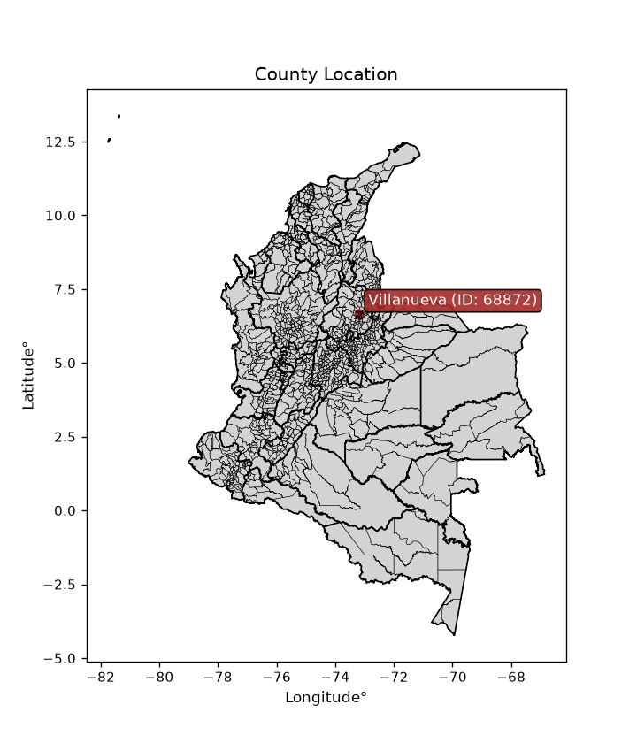
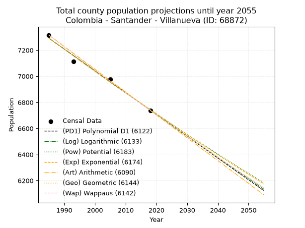
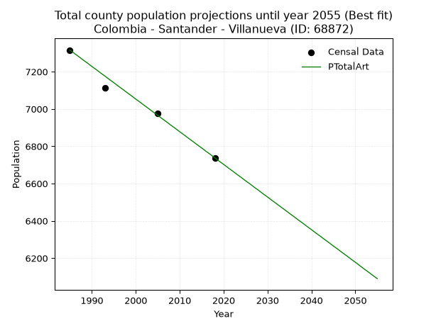
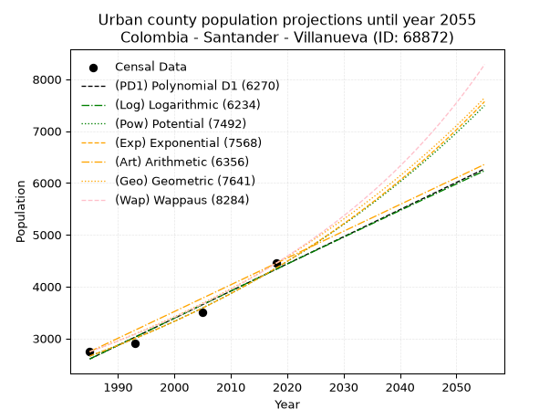
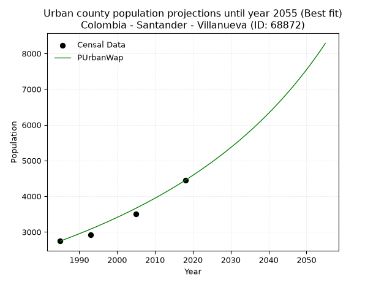
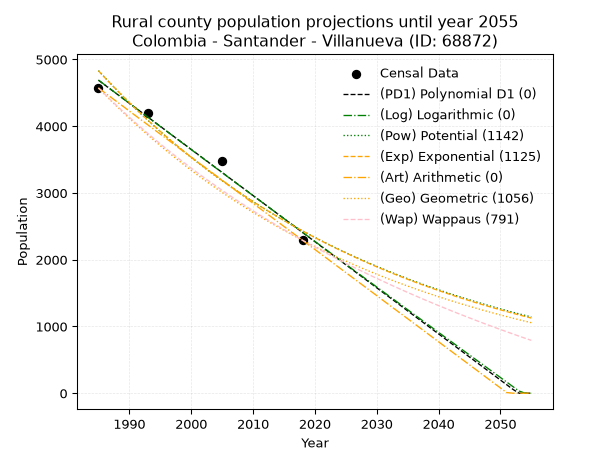
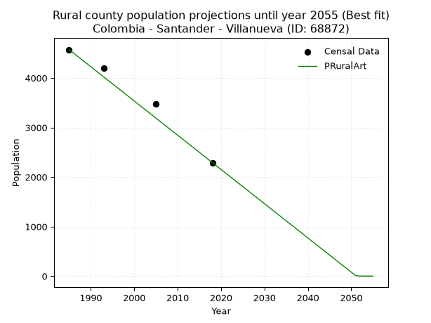

<div align="center">


</div>

# _“Population and Public Services Demand Projections (PPSD) until Year 2050 for Colombia - Santander - Villanueva (ID: 68872)”_
Keywords: `population` `public-service` `projection` `lineal` `polynomial` `logarithmic` `potential` `exponential` `arithmetic` `geometric` `wappaus` `dane` `colombia` `south-america`

PPSD are analytical estimates used by governments and planners to anticipate future changes in population size, age distribution, and the resulting community needs for utilities, healthcare, education, and infrastructure as sizing future water treatment facilities, electrical grids, and road networks based on spatial growth.

<div align="center">

</img>

</div>


> **General running parameters**: • app_version: _v20260806_. • Python version: _3.14.7_. • Pandas version: _3.0.5_. • NumPy version: _2.5.1_. • Creates, save and include plots into reports (create_plot): _False_. • Projection until year: _2050_. • Process polynomial degree 2 and up: _False_. • Process Wappaus: _True_. • Process Wappaus: _True_. • Set negative values to zero: _True_. • Set infinite values to zero: _True_. • Drop dataset notes: _True_. 
<div align="center">

Dynamic map: [:earth_americas:Google](http://maps.google.com/maps?q=6.670077671,-73.1743066) [:earth_americas:OSM](https://www.openstreetmap.org/#map=18/6.670077671/-73.1743066&layers=P) [:earth_americas:Bing](https://www.bing.com/maps?cp=6.670077671~-73.1743066&lvl=18) [:earth_americas:Apple](https://maps.apple.com/frame?center=6.670077671%2C-73.1743066&span=0.003%2C0.006)

</div>


<div align="center">

```geojson
{
  "type": "Feature",
  "geometry": {
    "type": "Point", 
    "coordinates": [-73.1743066, 6.670077671]
  }, 
  "properties": {
    "Name": "Colombia - Santander - Villanueva (ID: 68872)"
  }
}
```

</div>


## 0. Census Data (4 records)

Census data are official statistics collected by a government about the people and housing in a country. They usually include counts of total population, age, sex, race, income, education, and jobs.

📅Global census file: [Population.xlsx](../data/Population.xlsx)

| Source   |   Year |   CountryID | CountryName   |   StateID | StateName   |   CountyID | CountyName   |   PTotal |   PUrban |   PRural |
|:---------|-------:|------------:|:--------------|----------:|:------------|-----------:|:-------------|---------:|---------:|---------:|
| DANE     |   1985 |          57 | Colombia      |        68 | Santander   |      68872 | Villanueva   |     7316 |     2744 |     4572 |
| DANE     |   1993 |          57 | Colombia      |        68 | Santander   |      68872 | Villanueva   |     7115 |     2912 |     4203 |
| DANE     |   2005 |          57 | Colombia      |        68 | Santander   |      68872 | Villanueva   |     6978 |     3505 |     3473 |
| DANE     |   2018 |          57 | Colombia      |        68 | Santander   |      68872 | Villanueva   |     6738 |     4447 |     2291 |

> 🔥Some records could had specific notes about the registered values or the corresponding urban or rural distribution.

📅[SUI-RUPS](https://www.datos.gov.co/Hacienda-y-Cr-dito-P-blico/Registro-nico-de-Prestadores-de-Servicios-P-blicos/4qkq-csdn/about_data) - Local public utility companies: [RUPS.csv](../data/RUPS.xlsx)

 | SERVICIO       | ESTADO    | NOMBRE                                                                                     | NIT         | DEPARTAMENTO_DOMICILIO   | MUNICIPIO_DOMICILIO   | DIRECCION            |   TELEFONO | EMAIL                                | TIPO_PRESTADOR                 | CLASIFICACION                 |
|:---------------|:----------|:-------------------------------------------------------------------------------------------|:------------|:-------------------------|:----------------------|:---------------------|-----------:|:-------------------------------------|:-------------------------------|:------------------------------|
| ACUEDUCTO      | OPERATIVA | ACUEDUCTO REGIONAL COOPERATIVO EL COMUN  ACUASCOOP  - EMPRESA DE SERVICIOS PUBLICOS E.S.P. | 890212954-0 | SANTANDER                | BARICHARA             | Carrera 8  4 - 89    |    7267165 | acuascoop@yahoo.com                  | ORGANIZACION AUTORIZADA        | MENOR O IGUAL A 2500 USUARIOS |
| ACUEDUCTO      | OPERATIVA | MUNICIPIO DE VILLANUEVA                                                                    | 890206250-1 | SANTANDER                | VILLANUEVA            | CARRERA 15 # 13-27   |    7166216 | ALCALDIA@VILLANUEVA-SANTANDER.GOV.CO | MUNICIPIO (PRESTACIÓN DIRECTA) | MENOR O IGUAL A 2500 USUARIOS |
| ALCANTARILLADO | OPERATIVA | MUNICIPIO DE VILLANUEVA                                                                    | 890206250-1 | SANTANDER                | VILLANUEVA            | CARRERA 15 # 13-27   |    7166216 | ALCALDIA@VILLANUEVA-SANTANDER.GOV.CO | MUNICIPIO (PRESTACIÓN DIRECTA) | MENOR O IGUAL A 2500 USUARIOS |
| ACUEDUCTO      | OPERATIVA | CORPORACION ACUEDUCTO REGIONAL MACAREGUA                                                   | 804017927-3 | SANTANDER                | VILLANUEVA            | CALLE 15 13 - 56     |    7166220 | zaidaludin80@hiotmail.com            | ORGANIZACION AUTORIZADA        | HASTA 2500 SUSCRIPTORES       |
| ACUEDUCTO      | OPERATIVA | CORPORACION DE SERVICIOS DE ACUEDUCTO Y ALCANTARILLADO DEL CHORO AGUACHORO                 | 804009151-1 | SANTANDER                | VILLANUEVA            | CRA  14 No. 14 - 64  |    7166272 | zaidaludin80@hotmail.com             | ORGANIZACION AUTORIZADA        | MENOR O IGUAL A 2500 USUARIOS |
| ACUEDUCTO      | OPERATIVA | CORPORACION DE ACUEDUCTO Y ALCANTARILLADO REGIONAL DE AGUAFRIA                             | 804010121-2 | SANTANDER                | VILLANUEVA            | carrera 15 Nª13 - 07 |    7166373 | jorodu04@hotmail.com                 | ORGANIZACION AUTORIZADA        | HASTA 2500 SUSCRIPTORES       |

## 1. Total

### 1.1. Coefficients and Parameters

* (PD1) Polynomial Deg 1: -16.712565234845307, 40466.05861099933 (lineal)
* (Log) Logarithmic: -33454.82696544843, 261327.15785453178
* (Pow) Potential: -4.768574176307711, 19.588602634379928
* (Exp) Exponential: -0.0023822446690251924, 825330.1694538674
* (Art) Arithmetic: Year diff. 2018 - 1985 = 33, Population diff. 6738 - 7316 = -578, Annual growth = -17.515151515151516
* (Geo) Geometric: Year diff. 2018 - 1985 = 33, Population diff. 6738 - 7316 = -578, Annual growth % = -0.002490849810319662
* (Wap) Wappaus: i = -0.24925503792730205, Condition values only valid for < 200)

<sub>
Wappaus condition values: ['-0.00', '-0.25', '-0.50', '-0.75', '-1.00', '-1.25', '-1.50', '-1.74', '-1.99', '-2.24', '-2.49', '-2.74', '-2.99', '-3.24', '-3.49', '-3.74', '-3.99', '-4.24', '-4.49', '-4.74', '-4.99', '-5.23', '-5.48', '-5.73', '-5.98', '-6.23', '-6.48', '-6.73', '-6.98', '-7.23', '-7.48', '-7.73', '-7.98', '-8.23', '-8.47', '-8.72', '-8.97', '-9.22', '-9.47', '-9.72', '-9.97', '-10.22', '-10.47', '-10.72', '-10.97', '-11.22', '-11.47', '-11.71', '-11.96', '-12.21', '-12.46', '-12.71', '-12.96', '-13.21', '-13.46', '-13.71', '-13.96', '-14.21', '-14.46', '-14.71', '-14.96', '-15.20', '-15.45', '-15.70', '-15.95', '-16.20']
</sub>


### 1.2. Projected Dataset

|   Year |   CountyID |   PTotalPD1 |   PTotalLog |   PTotalPow |   PTotalExp |   PTotalArt |   PTotalGeo |   PTotalWap |
|-------:|-----------:|------------:|------------:|------------:|------------:|------------:|------------:|------------:|
|   1985 |      68872 |        7292 |        7292 |        7294 |        7294 |        7316 |        7316 |        7316 |
|   1986 |      68872 |        7275 |        7275 |        7277 |        7276 |        7298 |        7298 |        7298 |
|   1987 |      68872 |        7258 |        7258 |        7259 |        7259 |        7281 |        7280 |        7280 |
|   1988 |      68872 |        7241 |        7242 |        7242 |        7242 |        7263 |        7261 |        7261 |
|   1989 |      68872 |        7225 |        7225 |        7225 |        7225 |        7246 |        7243 |        7243 |
|   1990 |      68872 |        7208 |        7208 |        7207 |        7207 |        7228 |        7225 |        7225 |
|   1991 |      68872 |        7191 |        7191 |        7190 |        7190 |        7211 |        7207 |        7207 |
|   1992 |      68872 |        7175 |        7174 |        7173 |        7173 |        7193 |        7189 |        7189 |
|   1993 |      68872 |        7158 |        7158 |        7156 |        7156 |        7176 |        7171 |        7172 |
|   1994 |      68872 |        7141 |        7141 |        7139 |        7139 |        7158 |        7154 |        7154 |
|   1995 |      68872 |        7124 |        7124 |        7122 |        7122 |        7141 |        7136 |        7136 |
|   1996 |      68872 |        7108 |        7107 |        7105 |        7105 |        7123 |        7118 |        7118 |
|   1997 |      68872 |        7091 |        7091 |        7088 |        7088 |        7106 |        7100 |        7100 |
|   1998 |      68872 |        7074 |        7074 |        7071 |        7071 |        7088 |        7083 |        7083 |
|   1999 |      68872 |        7058 |        7057 |        7054 |        7055 |        7071 |        7065 |        7065 |
|   2000 |      68872 |        7041 |        7040 |        7037 |        7038 |        7053 |        7047 |        7047 |
|   2001 |      68872 |        7024 |        7024 |        7020 |        7021 |        7036 |        7030 |        7030 |
|   2002 |      68872 |        7008 |        7007 |        7004 |        7004 |        7018 |        7012 |        7012 |
|   2003 |      68872 |        6991 |        6990 |        6987 |        6988 |        7001 |        6995 |        6995 |
|   2004 |      68872 |        6974 |        6973 |        6970 |        6971 |        6983 |        6977 |        6978 |
|   2005 |      68872 |        6957 |        6957 |        6954 |        6954 |        6966 |        6960 |        6960 |
|   2006 |      68872 |        6941 |        6940 |        6937 |        6938 |        6948 |        6943 |        6943 |
|   2007 |      68872 |        6924 |        6923 |        6921 |        6921 |        6931 |        6925 |        6926 |
|   2008 |      68872 |        6907 |        6907 |        6904 |        6905 |        6913 |        6908 |        6908 |
|   2009 |      68872 |        6891 |        6890 |        6888 |        6889 |        6896 |        6891 |        6891 |
|   2010 |      68872 |        6874 |        6873 |        6872 |        6872 |        6878 |        6874 |        6874 |
|   2011 |      68872 |        6857 |        6857 |        6855 |        6856 |        6861 |        6857 |        6857 |
|   2012 |      68872 |        6840 |        6840 |        6839 |        6839 |        6843 |        6840 |        6840 |
|   2013 |      68872 |        6824 |        6824 |        6823 |        6823 |        6826 |        6823 |        6823 |
|   2014 |      68872 |        6807 |        6807 |        6807 |        6807 |        6808 |        6806 |        6806 |
|   2015 |      68872 |        6790 |        6790 |        6791 |        6791 |        6791 |        6789 |        6789 |
|   2016 |      68872 |        6774 |        6774 |        6775 |        6775 |        6773 |        6772 |        6772 |
|   2017 |      68872 |        6757 |        6757 |        6759 |        6758 |        6756 |        6755 |        6755 |
|   2018 |      68872 |        6740 |        6741 |        6743 |        6742 |        6738 |        6738 |        6738 |
|   2019 |      68872 |        6723 |        6724 |        6727 |        6726 |        6720 |        6721 |        6721 |
|   2020 |      68872 |        6707 |        6707 |        6711 |        6710 |        6703 |        6704 |        6704 |
|   2021 |      68872 |        6690 |        6691 |        6695 |        6694 |        6685 |        6688 |        6688 |
|   2022 |      68872 |        6673 |        6674 |        6679 |        6678 |        6668 |        6671 |        6671 |
|   2023 |      68872 |        6657 |        6658 |        6664 |        6663 |        6650 |        6655 |        6654 |
|   2024 |      68872 |        6640 |        6641 |        6648 |        6647 |        6633 |        6638 |        6638 |
|   2025 |      68872 |        6623 |        6625 |        6632 |        6631 |        6615 |        6621 |        6621 |
|   2026 |      68872 |        6606 |        6608 |        6617 |        6615 |        6598 |        6605 |        6605 |
|   2027 |      68872 |        6590 |        6592 |        6601 |        6599 |        6580 |        6588 |        6588 |
|   2028 |      68872 |        6573 |        6575 |        6586 |        6584 |        6563 |        6572 |        6572 |
|   2029 |      68872 |        6556 |        6559 |        6570 |        6568 |        6545 |        6556 |        6555 |
|   2030 |      68872 |        6540 |        6542 |        6555 |        6552 |        6528 |        6539 |        6539 |
|   2031 |      68872 |        6523 |        6526 |        6539 |        6537 |        6510 |        6523 |        6523 |
|   2032 |      68872 |        6506 |        6509 |        6524 |        6521 |        6493 |        6507 |        6506 |
|   2033 |      68872 |        6489 |        6493 |        6509 |        6506 |        6475 |        6491 |        6490 |
|   2034 |      68872 |        6473 |        6476 |        6494 |        6490 |        6458 |        6474 |        6474 |
|   2035 |      68872 |        6456 |        6460 |        6478 |        6475 |        6440 |        6458 |        6458 |
|   2036 |      68872 |        6439 |        6443 |        6463 |        6459 |        6423 |        6442 |        6442 |
|   2037 |      68872 |        6423 |        6427 |        6448 |        6444 |        6405 |        6426 |        6425 |
|   2038 |      68872 |        6406 |        6411 |        6433 |        6429 |        6388 |        6410 |        6409 |
|   2039 |      68872 |        6389 |        6394 |        6418 |        6413 |        6370 |        6394 |        6393 |
|   2040 |      68872 |        6372 |        6378 |        6403 |        6398 |        6353 |        6378 |        6377 |
|   2041 |      68872 |        6356 |        6361 |        6388 |        6383 |        6335 |        6362 |        6361 |
|   2042 |      68872 |        6339 |        6345 |        6373 |        6368 |        6318 |        6347 |        6346 |
|   2043 |      68872 |        6322 |        6329 |        6358 |        6353 |        6300 |        6331 |        6330 |
|   2044 |      68872 |        6306 |        6312 |        6343 |        6337 |        6283 |        6315 |        6314 |
|   2045 |      68872 |        6289 |        6296 |        6329 |        6322 |        6265 |        6299 |        6298 |
|   2046 |      68872 |        6272 |        6280 |        6314 |        6307 |        6248 |        6284 |        6282 |
|   2047 |      68872 |        6255 |        6263 |        6299 |        6292 |        6230 |        6268 |        6266 |
|   2048 |      68872 |        6239 |        6247 |        6285 |        6277 |        6213 |        6252 |        6251 |
|   2049 |      68872 |        6222 |        6231 |        6270 |        6262 |        6195 |        6237 |        6235 |
|   2050 |      68872 |        6205 |        6214 |        6255 |        6248 |        6178 |        6221 |        6220 |
<div align="center">

</img>

</div>


### 1.3. Best fit with absolute and relative error (%)

Relative error puts that difference into context by dividing the absolute error by the true value, creating a unitless ratio or percentage that shows the scale of the mistake.

Absolute and relative error

|   Year | Source   |   CountryID | CountryName   |   StateID | StateName   |   CountyID_x | CountyName   |   PTotal |   PUrban |   PRural |   CountyID_y |   PTotalPD1 |   PTotalLog |   PTotalPow |   PTotalExp |   PTotalArt |   PTotalGeo |   PTotalWap |   PTotalPD1AbsError |   PTotalLogAbsError |   PTotalPowAbsError |   PTotalExpAbsError |   PTotalArtAbsError |   PTotalGeoAbsError |   PTotalWapAbsError |   PTotalPD1RelError |   PTotalLogRelError |   PTotalPowRelError |   PTotalExpRelError |   PTotalArtRelError |   PTotalGeoRelError |   PTotalWapRelError |
|-------:|:---------|------------:|:--------------|----------:|:------------|-------------:|:-------------|---------:|---------:|---------:|-------------:|------------:|------------:|------------:|------------:|------------:|------------:|------------:|--------------------:|--------------------:|--------------------:|--------------------:|--------------------:|--------------------:|--------------------:|--------------------:|--------------------:|--------------------:|--------------------:|--------------------:|--------------------:|--------------------:|
|   1985 | DANE     |          57 | Colombia      |        68 | Santander   |        68872 | Villanueva   |     7316 |     2744 |     4572 |        68872 |        7292 |        7292 |        7294 |        7294 |        7316 |        7316 |        7316 |                  24 |                  24 |                  22 |                  22 |                   0 |                   0 |                   0 |           0.328048  |           0.328048  |            0.300711 |           0.300711  |            0        |            0        |            0        |
|   1993 | DANE     |          57 | Colombia      |        68 | Santander   |        68872 | Villanueva   |     7115 |     2912 |     4203 |        68872 |        7158 |        7158 |        7156 |        7156 |        7176 |        7171 |        7172 |                  43 |                  43 |                  41 |                  41 |                  61 |                  56 |                  57 |           0.604357  |           0.604357  |            0.576247 |           0.576247  |            0.857344 |            0.78707  |            0.801124 |
|   2005 | DANE     |          57 | Colombia      |        68 | Santander   |        68872 | Villanueva   |     6978 |     3505 |     3473 |        68872 |        6957 |        6957 |        6954 |        6954 |        6966 |        6960 |        6960 |                  21 |                  21 |                  24 |                  24 |                  12 |                  18 |                  18 |           0.300946  |           0.300946  |            0.343938 |           0.343938  |            0.171969 |            0.257954 |            0.257954 |
|   2018 | DANE     |          57 | Colombia      |        68 | Santander   |        68872 | Villanueva   |     6738 |     4447 |     2291 |        68872 |        6740 |        6741 |        6743 |        6742 |        6738 |        6738 |        6738 |                   2 |                   3 |                   5 |                   4 |                   0 |                   0 |                   0 |           0.0296824 |           0.0445236 |            0.074206 |           0.0593648 |            0        |            0        |            0        |

Relative error mean

| Method    |   RelError | Best   |
|:----------|-----------:|:-------|
| PTotalPD1 |   0.315758 |        |
| PTotalLog |   0.319469 |        |
| PTotalPow |   0.323776 |        |
| PTotalExp |   0.320065 |        |
| PTotalArt |   0.257328 | True   |
| PTotalGeo |   0.261256 |        |
| PTotalWap |   0.264769 |        |

💙Best method: _**PTotalArt**_
<div align="center">

</img>

</div>


### 1.4. Fresh water supply demand in liters per capita per day (lpcd)

The fresh water supply demand typically ranges from 100 to 300 liters per capita per day (lpcd) for standard domestic and municipal planning, though absolute survival minimums set by the World Health Organization are as low as 7.5 to 20 liters per day, and total consumption in high-income nations can exceed 400 liters.

> `CZ`: Level in meters above the sea level (masl)<br> `WS`: Fresh water supply demand in liters per capita per day (lpcd or l/h/d)<br> `WSAll`: Zonal fresh water supply demand in liters per second (l/s)<br> `A`: Zonal area in square meters<br> `DP`: Population density (people/hectare or p/ha)

Reference values (RAS Colombia)

|    CZ |   WS |
|------:|-----:|
|  1000 |  120 |
|  2000 |  130 |
| 99999 |  140 |

County shapefile geometry properties and water supply values

|   CountyID |     ATotal |   CZTotal |   WSTotal |
|-----------:|-----------:|----------:|----------:|
|      68872 | 9.7427e+07 |   1308.39 |       130 |

Projected values for best method: PTotalArt

|   CountyID |   Year |   PTotalArt |   DPTotal |   WSTotal |   WSTotalAll |
|-----------:|-------:|------------:|----------:|----------:|-------------:|
|      68872 |   1985 |        7316 |      0.75 |       130 |     11.0079  |
|      68872 |   1986 |        7298 |      0.75 |       130 |     10.9808  |
|      68872 |   1987 |        7281 |      0.75 |       130 |     10.9552  |
|      68872 |   1988 |        7263 |      0.75 |       130 |     10.9281  |
|      68872 |   1989 |        7246 |      0.74 |       130 |     10.9025  |
|      68872 |   1990 |        7228 |      0.74 |       130 |     10.8755  |
|      68872 |   1991 |        7211 |      0.74 |       130 |     10.8499  |
|      68872 |   1992 |        7193 |      0.74 |       130 |     10.8228  |
|      68872 |   1993 |        7176 |      0.74 |       130 |     10.7972  |
|      68872 |   1994 |        7158 |      0.73 |       130 |     10.7701  |
|      68872 |   1995 |        7141 |      0.73 |       130 |     10.7446  |
|      68872 |   1996 |        7123 |      0.73 |       130 |     10.7175  |
|      68872 |   1997 |        7106 |      0.73 |       130 |     10.6919  |
|      68872 |   1998 |        7088 |      0.73 |       130 |     10.6648  |
|      68872 |   1999 |        7071 |      0.73 |       130 |     10.6392  |
|      68872 |   2000 |        7053 |      0.72 |       130 |     10.6122  |
|      68872 |   2001 |        7036 |      0.72 |       130 |     10.5866  |
|      68872 |   2002 |        7018 |      0.72 |       130 |     10.5595  |
|      68872 |   2003 |        7001 |      0.72 |       130 |     10.5339  |
|      68872 |   2004 |        6983 |      0.72 |       130 |     10.5068  |
|      68872 |   2005 |        6966 |      0.71 |       130 |     10.4812  |
|      68872 |   2006 |        6948 |      0.71 |       130 |     10.4542  |
|      68872 |   2007 |        6931 |      0.71 |       130 |     10.4286  |
|      68872 |   2008 |        6913 |      0.71 |       130 |     10.4015  |
|      68872 |   2009 |        6896 |      0.71 |       130 |     10.3759  |
|      68872 |   2010 |        6878 |      0.71 |       130 |     10.3488  |
|      68872 |   2011 |        6861 |      0.7  |       130 |     10.3233  |
|      68872 |   2012 |        6843 |      0.7  |       130 |     10.2962  |
|      68872 |   2013 |        6826 |      0.7  |       130 |     10.2706  |
|      68872 |   2014 |        6808 |      0.7  |       130 |     10.2435  |
|      68872 |   2015 |        6791 |      0.7  |       130 |     10.2179  |
|      68872 |   2016 |        6773 |      0.7  |       130 |     10.1909  |
|      68872 |   2017 |        6756 |      0.69 |       130 |     10.1653  |
|      68872 |   2018 |        6738 |      0.69 |       130 |     10.1382  |
|      68872 |   2019 |        6720 |      0.69 |       130 |     10.1111  |
|      68872 |   2020 |        6703 |      0.69 |       130 |     10.0855  |
|      68872 |   2021 |        6685 |      0.69 |       130 |     10.0584  |
|      68872 |   2022 |        6668 |      0.68 |       130 |     10.0329  |
|      68872 |   2023 |        6650 |      0.68 |       130 |     10.0058  |
|      68872 |   2024 |        6633 |      0.68 |       130 |      9.98021 |
|      68872 |   2025 |        6615 |      0.68 |       130 |      9.95312 |
|      68872 |   2026 |        6598 |      0.68 |       130 |      9.92755 |
|      68872 |   2027 |        6580 |      0.68 |       130 |      9.90046 |
|      68872 |   2028 |        6563 |      0.67 |       130 |      9.87488 |
|      68872 |   2029 |        6545 |      0.67 |       130 |      9.8478  |
|      68872 |   2030 |        6528 |      0.67 |       130 |      9.82222 |
|      68872 |   2031 |        6510 |      0.67 |       130 |      9.79514 |
|      68872 |   2032 |        6493 |      0.67 |       130 |      9.76956 |
|      68872 |   2033 |        6475 |      0.66 |       130 |      9.74248 |
|      68872 |   2034 |        6458 |      0.66 |       130 |      9.7169  |
|      68872 |   2035 |        6440 |      0.66 |       130 |      9.68981 |
|      68872 |   2036 |        6423 |      0.66 |       130 |      9.66424 |
|      68872 |   2037 |        6405 |      0.66 |       130 |      9.63715 |
|      68872 |   2038 |        6388 |      0.66 |       130 |      9.61157 |
|      68872 |   2039 |        6370 |      0.65 |       130 |      9.58449 |
|      68872 |   2040 |        6353 |      0.65 |       130 |      9.55891 |
|      68872 |   2041 |        6335 |      0.65 |       130 |      9.53183 |
|      68872 |   2042 |        6318 |      0.65 |       130 |      9.50625 |
|      68872 |   2043 |        6300 |      0.65 |       130 |      9.47917 |
|      68872 |   2044 |        6283 |      0.64 |       130 |      9.45359 |
|      68872 |   2045 |        6265 |      0.64 |       130 |      9.4265  |
|      68872 |   2046 |        6248 |      0.64 |       130 |      9.40093 |
|      68872 |   2047 |        6230 |      0.64 |       130 |      9.37384 |
|      68872 |   2048 |        6213 |      0.64 |       130 |      9.34826 |
|      68872 |   2049 |        6195 |      0.64 |       130 |      9.32118 |
|      68872 |   2050 |        6178 |      0.63 |       130 |      9.2956  |

## 2. Urban

### 2.1. Coefficients and Parameters

* (PD1) Polynomial Deg 1: 52.38859895624182, -101388.2950622227 (lineal)
* (Log) Logarithmic: 104813.94806385034, -793289.6591595932
* (Pow) Potential: 29.88801165722411, -95.13876044518696
* (Exp) Exponential: 0.014936630399996357, 3.535237630809155e-10
* (Art) Arithmetic: Year diff. 2018 - 1985 = 33, Population diff. 4447 - 2744 = 1703, Annual growth = 51.60606060606061
* (Geo) Geometric: Year diff. 2018 - 1985 = 33, Population diff. 4447 - 2744 = 1703, Annual growth % = 0.014738249550491078
* (Wap) Wappaus: i = 1.4352958032557532, Condition values only valid for < 200)

<sub>
Wappaus condition values: ['0.00', '1.44', '2.87', '4.31', '5.74', '7.18', '8.61', '10.05', '11.48', '12.92', '14.35', '15.79', '17.22', '18.66', '20.09', '21.53', '22.96', '24.40', '25.84', '27.27', '28.71', '30.14', '31.58', '33.01', '34.45', '35.88', '37.32', '38.75', '40.19', '41.62', '43.06', '44.49', '45.93', '47.36', '48.80', '50.24', '51.67', '53.11', '54.54', '55.98', '57.41', '58.85', '60.28', '61.72', '63.15', '64.59', '66.02', '67.46', '68.89', '70.33', '71.76', '73.20', '74.64', '76.07', '77.51', '78.94', '80.38', '81.81', '83.25', '84.68', '86.12', '87.55', '88.99', '90.42', '91.86', '93.29']
</sub>


### 2.2. Projected Dataset

|   Year |   CountyID |   PUrbanPD1 |   PUrbanLog |   PUrbanPow |   PUrbanExp |   PUrbanArt |   PUrbanGeo |   PUrbanWap |
|-------:|-----------:|------------:|------------:|------------:|------------:|------------:|------------:|------------:|
|   1985 |      68872 |        2603 |        2602 |        2659 |        2660 |        2744 |        2744 |        2744 |
|   1986 |      68872 |        2655 |        2655 |        2699 |        2700 |        2796 |        2784 |        2784 |
|   1987 |      68872 |        2708 |        2707 |        2740 |        2741 |        2847 |        2825 |        2824 |
|   1988 |      68872 |        2760 |        2760 |        2782 |        2782 |        2899 |        2867 |        2865 |
|   1989 |      68872 |        2813 |        2813 |        2824 |        2824 |        2950 |        2909 |        2906 |
|   1990 |      68872 |        2865 |        2866 |        2867 |        2866 |        3002 |        2952 |        2948 |
|   1991 |      68872 |        2917 |        2918 |        2910 |        2910 |        3054 |        2996 |        2991 |
|   1992 |      68872 |        2970 |        2971 |        2954 |        2953 |        3105 |        3040 |        3034 |
|   1993 |      68872 |        3022 |        3023 |        2999 |        2998 |        3157 |        3085 |        3078 |
|   1994 |      68872 |        3075 |        3076 |        3044 |        3043 |        3208 |        3130 |        3123 |
|   1995 |      68872 |        3127 |        3129 |        3090 |        3089 |        3260 |        3176 |        3168 |
|   1996 |      68872 |        3179 |        3181 |        3137 |        3135 |        3312 |        3223 |        3214 |
|   1997 |      68872 |        3232 |        3234 |        3184 |        3182 |        3363 |        3271 |        3261 |
|   1998 |      68872 |        3284 |        3286 |        3232 |        3230 |        3415 |        3319 |        3309 |
|   1999 |      68872 |        3337 |        3339 |        3281 |        3279 |        3466 |        3368 |        3357 |
|   2000 |      68872 |        3389 |        3391 |        3330 |        3328 |        3518 |        3417 |        3406 |
|   2001 |      68872 |        3441 |        3443 |        3380 |        3378 |        3570 |        3468 |        3456 |
|   2002 |      68872 |        3494 |        3496 |        3431 |        3429 |        3621 |        3519 |        3507 |
|   2003 |      68872 |        3546 |        3548 |        3483 |        3481 |        3673 |        3571 |        3558 |
|   2004 |      68872 |        3598 |        3600 |        3535 |        3533 |        3725 |        3623 |        3610 |
|   2005 |      68872 |        3651 |        3653 |        3588 |        3586 |        3776 |        3677 |        3664 |
|   2006 |      68872 |        3703 |        3705 |        3642 |        3640 |        3828 |        3731 |        3718 |
|   2007 |      68872 |        3756 |        3757 |        3697 |        3695 |        3879 |        3786 |        3773 |
|   2008 |      68872 |        3808 |        3809 |        3752 |        3751 |        3931 |        3842 |        3829 |
|   2009 |      68872 |        3860 |        3862 |        3808 |        3807 |        3983 |        3898 |        3886 |
|   2010 |      68872 |        3913 |        3914 |        3865 |        3864 |        4034 |        3956 |        3944 |
|   2011 |      68872 |        3965 |        3966 |        3923 |        3923 |        4086 |        4014 |        4003 |
|   2012 |      68872 |        4018 |        4018 |        3982 |        3982 |        4137 |        4073 |        4063 |
|   2013 |      68872 |        4070 |        4070 |        4042 |        4041 |        4189 |        4133 |        4124 |
|   2014 |      68872 |        4122 |        4122 |        4102 |        4102 |        4241 |        4194 |        4186 |
|   2015 |      68872 |        4175 |        4174 |        4163 |        4164 |        4292 |        4256 |        4250 |
|   2016 |      68872 |        4227 |        4226 |        4226 |        4227 |        4344 |        4319 |        4314 |
|   2017 |      68872 |        4280 |        4278 |        4289 |        4290 |        4395 |        4382 |        4380 |
|   2018 |      68872 |        4332 |        4330 |        4353 |        4355 |        4447 |        4447 |        4447 |
|   2019 |      68872 |        4384 |        4382 |        4418 |        4420 |        4499 |        4513 |        4515 |
|   2020 |      68872 |        4437 |        4434 |        4484 |        4487 |        4550 |        4579 |        4585 |
|   2021 |      68872 |        4489 |        4486 |        4550 |        4554 |        4602 |        4647 |        4656 |
|   2022 |      68872 |        4541 |        4538 |        4618 |        4623 |        4653 |        4715 |        4728 |
|   2023 |      68872 |        4594 |        4589 |        4687 |        4693 |        4705 |        4785 |        4802 |
|   2024 |      68872 |        4646 |        4641 |        4757 |        4763 |        4757 |        4855 |        4877 |
|   2025 |      68872 |        4699 |        4693 |        4827 |        4835 |        4808 |        4927 |        4954 |
|   2026 |      68872 |        4751 |        4745 |        4899 |        4908 |        4860 |        4999 |        5032 |
|   2027 |      68872 |        4803 |        4796 |        4972 |        4981 |        4911 |        5073 |        5112 |
|   2028 |      68872 |        4856 |        4848 |        5046 |        5056 |        4963 |        5148 |        5193 |
|   2029 |      68872 |        4908 |        4900 |        5121 |        5133 |        5015 |        5223 |        5277 |
|   2030 |      68872 |        4961 |        4951 |        5197 |        5210 |        5066 |        5300 |        5362 |
|   2031 |      68872 |        5013 |        5003 |        5274 |        5288 |        5118 |        5379 |        5448 |
|   2032 |      68872 |        5065 |        5055 |        5352 |        5368 |        5169 |        5458 |        5537 |
|   2033 |      68872 |        5118 |        5106 |        5431 |        5449 |        5221 |        5538 |        5628 |
|   2034 |      68872 |        5170 |        5158 |        5512 |        5531 |        5273 |        5620 |        5721 |
|   2035 |      68872 |        5223 |        5209 |        5593 |        5614 |        5324 |        5703 |        5815 |
|   2036 |      68872 |        5275 |        5261 |        5676 |        5698 |        5376 |        5787 |        5912 |
|   2037 |      68872 |        5327 |        5312 |        5760 |        5784 |        5428 |        5872 |        6011 |
|   2038 |      68872 |        5380 |        5364 |        5845 |        5871 |        5479 |        5959 |        6113 |
|   2039 |      68872 |        5432 |        5415 |        5931 |        5959 |        5531 |        6046 |        6216 |
|   2040 |      68872 |        5484 |        5467 |        6019 |        6049 |        5582 |        6136 |        6323 |
|   2041 |      68872 |        5537 |        5518 |        6108 |        6140 |        5634 |        6226 |        6431 |
|   2042 |      68872 |        5589 |        5569 |        6198 |        6232 |        5686 |        6318 |        6543 |
|   2043 |      68872 |        5642 |        5621 |        6289 |        6326 |        5737 |        6411 |        6657 |
|   2044 |      68872 |        5694 |        5672 |        6382 |        6421 |        5789 |        6505 |        6774 |
|   2045 |      68872 |        5746 |        5723 |        6476 |        6518 |        5840 |        6601 |        6894 |
|   2046 |      68872 |        5799 |        5774 |        6571 |        6616 |        5892 |        6699 |        7017 |
|   2047 |      68872 |        5851 |        5826 |        6668 |        6716 |        5944 |        6797 |        7143 |
|   2048 |      68872 |        5904 |        5877 |        6766 |        6817 |        5995 |        6897 |        7273 |
|   2049 |      68872 |        5956 |        5928 |        6865 |        6919 |        6047 |        6999 |        7406 |
|   2050 |      68872 |        6008 |        5979 |        6966 |        7024 |        6098 |        7102 |        7542 |
<div align="center">

</img>

</div>


### 2.3. Best fit with absolute and relative error (%)

Relative error puts that difference into context by dividing the absolute error by the true value, creating a unitless ratio or percentage that shows the scale of the mistake.

Absolute and relative error

|   Year | Source   |   CountryID | CountryName   |   StateID | StateName   |   CountyID_x | CountyName   |   PTotal |   PUrban |   PRural |   CountyID_y |   PUrbanPD1 |   PUrbanLog |   PUrbanPow |   PUrbanExp |   PUrbanArt |   PUrbanGeo |   PUrbanWap |   PUrbanPD1AbsError |   PUrbanLogAbsError |   PUrbanPowAbsError |   PUrbanExpAbsError |   PUrbanArtAbsError |   PUrbanGeoAbsError |   PUrbanWapAbsError |   PUrbanPD1RelError |   PUrbanLogRelError |   PUrbanPowRelError |   PUrbanExpRelError |   PUrbanArtRelError |   PUrbanGeoRelError |   PUrbanWapRelError |
|-------:|:---------|------------:|:--------------|----------:|:------------|-------------:|:-------------|---------:|---------:|---------:|-------------:|------------:|------------:|------------:|------------:|------------:|------------:|------------:|--------------------:|--------------------:|--------------------:|--------------------:|--------------------:|--------------------:|--------------------:|--------------------:|--------------------:|--------------------:|--------------------:|--------------------:|--------------------:|--------------------:|
|   1985 | DANE     |          57 | Colombia      |        68 | Santander   |        68872 | Villanueva   |     7316 |     2744 |     4572 |        68872 |        2603 |        2602 |        2659 |        2660 |        2744 |        2744 |        2744 |                 141 |                 142 |                  85 |                  84 |                   0 |                   0 |                   0 |             5.13848 |             5.17493 |             3.09767 |             3.06122 |             0       |             0       |             0       |
|   1993 | DANE     |          57 | Colombia      |        68 | Santander   |        68872 | Villanueva   |     7115 |     2912 |     4203 |        68872 |        3022 |        3023 |        2999 |        2998 |        3157 |        3085 |        3078 |                 110 |                 111 |                  87 |                  86 |                 245 |                 173 |                 166 |             3.77747 |             3.81181 |             2.98764 |             2.9533  |             8.41346 |             5.94093 |             5.70055 |
|   2005 | DANE     |          57 | Colombia      |        68 | Santander   |        68872 | Villanueva   |     6978 |     3505 |     3473 |        68872 |        3651 |        3653 |        3588 |        3586 |        3776 |        3677 |        3664 |                 146 |                 148 |                  83 |                  81 |                 271 |                 172 |                 159 |             4.16548 |             4.22254 |             2.36805 |             2.31098 |             7.73181 |             4.90728 |             4.53638 |
|   2018 | DANE     |          57 | Colombia      |        68 | Santander   |        68872 | Villanueva   |     6738 |     4447 |     2291 |        68872 |        4332 |        4330 |        4353 |        4355 |        4447 |        4447 |        4447 |                 115 |                 117 |                  94 |                  92 |                   0 |                   0 |                   0 |             2.58601 |             2.63099 |             2.11378 |             2.06881 |             0       |             0       |             0       |

Relative error mean

| Method    |   RelError | Best   |
|:----------|-----------:|:-------|
| PUrbanPD1 |    3.91686 |        |
| PUrbanLog |    3.96007 |        |
| PUrbanPow |    2.64178 |        |
| PUrbanExp |    2.59858 |        |
| PUrbanArt |    4.03632 |        |
| PUrbanGeo |    2.71205 |        |
| PUrbanWap |    2.55923 | True   |

💙Best method: _**PUrbanWap**_
<div align="center">

</img>

</div>


### 2.4. Fresh water supply demand in liters per capita per day (lpcd)

The fresh water supply demand typically ranges from 100 to 300 liters per capita per day (lpcd) for standard domestic and municipal planning, though absolute survival minimums set by the World Health Organization are as low as 7.5 to 20 liters per day, and total consumption in high-income nations can exceed 400 liters.

> `CZ`: Level in meters above the sea level (masl)<br> `WS`: Fresh water supply demand in liters per capita per day (lpcd or l/h/d)<br> `WSAll`: Zonal fresh water supply demand in liters per second (l/s)<br> `A`: Zonal area in square meters<br> `DP`: Population density (people/hectare or p/ha)

Reference values (RAS Colombia)

|    CZ |   WS |
|------:|-----:|
|  1000 |  120 |
|  2000 |  130 |
| 99999 |  140 |

County shapefile geometry properties and water supply values

|   CountyID |     AUrban |   CZUrban |   WSUrban |
|-----------:|-----------:|----------:|----------:|
|      68872 | 1.5233e+06 |   1458.16 |       130 |

Projected values for best method: PUrbanWap

|   CountyID |   Year |   PUrbanWap |   DPUrban |   WSUrban |   WSUrbanAll |
|-----------:|-------:|------------:|----------:|----------:|-------------:|
|      68872 |   1985 |        2744 |     18.01 |       130 |      4.1287  |
|      68872 |   1986 |        2784 |     18.28 |       130 |      4.18889 |
|      68872 |   1987 |        2824 |     18.54 |       130 |      4.24907 |
|      68872 |   1988 |        2865 |     18.81 |       130 |      4.31076 |
|      68872 |   1989 |        2906 |     19.08 |       130 |      4.37245 |
|      68872 |   1990 |        2948 |     19.35 |       130 |      4.43565 |
|      68872 |   1991 |        2991 |     19.64 |       130 |      4.50035 |
|      68872 |   1992 |        3034 |     19.92 |       130 |      4.56505 |
|      68872 |   1993 |        3078 |     20.21 |       130 |      4.63125 |
|      68872 |   1994 |        3123 |     20.5  |       130 |      4.69896 |
|      68872 |   1995 |        3168 |     20.8  |       130 |      4.76667 |
|      68872 |   1996 |        3214 |     21.1  |       130 |      4.83588 |
|      68872 |   1997 |        3261 |     21.41 |       130 |      4.9066  |
|      68872 |   1998 |        3309 |     21.72 |       130 |      4.97882 |
|      68872 |   1999 |        3357 |     22.04 |       130 |      5.05104 |
|      68872 |   2000 |        3406 |     22.36 |       130 |      5.12477 |
|      68872 |   2001 |        3456 |     22.69 |       130 |      5.2     |
|      68872 |   2002 |        3507 |     23.02 |       130 |      5.27674 |
|      68872 |   2003 |        3558 |     23.36 |       130 |      5.35347 |
|      68872 |   2004 |        3610 |     23.7  |       130 |      5.43171 |
|      68872 |   2005 |        3664 |     24.05 |       130 |      5.51296 |
|      68872 |   2006 |        3718 |     24.41 |       130 |      5.59421 |
|      68872 |   2007 |        3773 |     24.77 |       130 |      5.67697 |
|      68872 |   2008 |        3829 |     25.14 |       130 |      5.76123 |
|      68872 |   2009 |        3886 |     25.51 |       130 |      5.84699 |
|      68872 |   2010 |        3944 |     25.89 |       130 |      5.93426 |
|      68872 |   2011 |        4003 |     26.28 |       130 |      6.02303 |
|      68872 |   2012 |        4063 |     26.67 |       130 |      6.11331 |
|      68872 |   2013 |        4124 |     27.07 |       130 |      6.20509 |
|      68872 |   2014 |        4186 |     27.48 |       130 |      6.29838 |
|      68872 |   2015 |        4250 |     27.9  |       130 |      6.39468 |
|      68872 |   2016 |        4314 |     28.32 |       130 |      6.49097 |
|      68872 |   2017 |        4380 |     28.75 |       130 |      6.59028 |
|      68872 |   2018 |        4447 |     29.19 |       130 |      6.69109 |
|      68872 |   2019 |        4515 |     29.64 |       130 |      6.7934  |
|      68872 |   2020 |        4585 |     30.1  |       130 |      6.89873 |
|      68872 |   2021 |        4656 |     30.57 |       130 |      7.00556 |
|      68872 |   2022 |        4728 |     31.04 |       130 |      7.11389 |
|      68872 |   2023 |        4802 |     31.52 |       130 |      7.22523 |
|      68872 |   2024 |        4877 |     32.02 |       130 |      7.33808 |
|      68872 |   2025 |        4954 |     32.52 |       130 |      7.45394 |
|      68872 |   2026 |        5032 |     33.03 |       130 |      7.5713  |
|      68872 |   2027 |        5112 |     33.56 |       130 |      7.69167 |
|      68872 |   2028 |        5193 |     34.09 |       130 |      7.81354 |
|      68872 |   2029 |        5277 |     34.64 |       130 |      7.93993 |
|      68872 |   2030 |        5362 |     35.2  |       130 |      8.06782 |
|      68872 |   2031 |        5448 |     35.76 |       130 |      8.19722 |
|      68872 |   2032 |        5537 |     36.35 |       130 |      8.33113 |
|      68872 |   2033 |        5628 |     36.95 |       130 |      8.46806 |
|      68872 |   2034 |        5721 |     37.56 |       130 |      8.60799 |
|      68872 |   2035 |        5815 |     38.17 |       130 |      8.74942 |
|      68872 |   2036 |        5912 |     38.81 |       130 |      8.89537 |
|      68872 |   2037 |        6011 |     39.46 |       130 |      9.04433 |
|      68872 |   2038 |        6113 |     40.13 |       130 |      9.1978  |
|      68872 |   2039 |        6216 |     40.81 |       130 |      9.35278 |
|      68872 |   2040 |        6323 |     41.51 |       130 |      9.51377 |
|      68872 |   2041 |        6431 |     42.22 |       130 |      9.67627 |
|      68872 |   2042 |        6543 |     42.95 |       130 |      9.84479 |
|      68872 |   2043 |        6657 |     43.7  |       130 |     10.0163  |
|      68872 |   2044 |        6774 |     44.47 |       130 |     10.1924  |
|      68872 |   2045 |        6894 |     45.26 |       130 |     10.3729  |
|      68872 |   2046 |        7017 |     46.06 |       130 |     10.558   |
|      68872 |   2047 |        7143 |     46.89 |       130 |     10.7476  |
|      68872 |   2048 |        7273 |     47.75 |       130 |     10.9432  |
|      68872 |   2049 |        7406 |     48.62 |       130 |     11.1433  |
|      68872 |   2050 |        7542 |     49.51 |       130 |     11.3479  |

## 3. Rural

### 3.1. Coefficients and Parameters

* (PD1) Polynomial Deg 1: -69.10116419108714, 141854.35367322207 (lineal)
* (Log) Logarithmic: -138268.77502929876, 1054616.8170141247
* (Pow) Potential: -41.63442034744279, 140.98447787433722
* (Exp) Exponential: -0.020811569762588886, 4.217530906310982e+21
* (Art) Arithmetic: Year diff. 2018 - 1985 = 33, Population diff. 2291 - 4572 = -2281, Annual growth = -69.12121212121212
* (Geo) Geometric: Year diff. 2018 - 1985 = 33, Population diff. 2291 - 4572 = -2281, Annual growth % = -0.02072056953632695
* (Wap) Wappaus: i = -2.014314792983014, Condition values only valid for < 200)

<sub>
Wappaus condition values: ['-0.00', '-2.01', '-4.03', '-6.04', '-8.06', '-10.07', '-12.09', '-14.10', '-16.11', '-18.13', '-20.14', '-22.16', '-24.17', '-26.19', '-28.20', '-30.21', '-32.23', '-34.24', '-36.26', '-38.27', '-40.29', '-42.30', '-44.31', '-46.33', '-48.34', '-50.36', '-52.37', '-54.39', '-56.40', '-58.42', '-60.43', '-62.44', '-64.46', '-66.47', '-68.49', '-70.50', '-72.52', '-74.53', '-76.54', '-78.56', '-80.57', '-82.59', '-84.60', '-86.62', '-88.63', '-90.64', '-92.66', '-94.67', '-96.69', '-98.70', '-100.72', '-102.73', '-104.74', '-106.76', '-108.77', '-110.79', '-112.80', '-114.82', '-116.83', '-118.84', '-120.86', '-122.87', '-124.89', '-126.90', '-128.92', '-130.93']
</sub>


### 3.2. Projected Dataset

|   Year |   CountyID |   PRuralPD1 |   PRuralLog |   PRuralPow |   PRuralExp |   PRuralArt |   PRuralGeo |   PRuralWap |
|-------:|-----------:|------------:|------------:|------------:|------------:|------------:|------------:|------------:|
|   1985 |      68872 |        4689 |        4690 |        4832 |        4830 |        4572 |        4572 |        4572 |
|   1986 |      68872 |        4619 |        4621 |        4732 |        4730 |        4503 |        4477 |        4481 |
|   1987 |      68872 |        4550 |        4551 |        4634 |        4633 |        4434 |        4384 |        4391 |
|   1988 |      68872 |        4481 |        4481 |        4538 |        4538 |        4365 |        4294 |        4304 |
|   1989 |      68872 |        4412 |        4412 |        4444 |        4444 |        4296 |        4205 |        4218 |
|   1990 |      68872 |        4343 |        4342 |        4352 |        4353 |        4226 |        4118 |        4134 |
|   1991 |      68872 |        4274 |        4273 |        4261 |        4263 |        4157 |        4032 |        4051 |
|   1992 |      68872 |        4205 |        4204 |        4173 |        4175 |        4088 |        3949 |        3970 |
|   1993 |      68872 |        4136 |        4134 |        4087 |        4089 |        4019 |        3867 |        3890 |
|   1994 |      68872 |        4067 |        4065 |        4003 |        4005 |        3950 |        3787 |        3812 |
|   1995 |      68872 |        3998 |        3995 |        3920 |        3922 |        3881 |        3708 |        3735 |
|   1996 |      68872 |        3928 |        3926 |        3839 |        3842 |        3812 |        3631 |        3660 |
|   1997 |      68872 |        3859 |        3857 |        3760 |        3762 |        3743 |        3556 |        3586 |
|   1998 |      68872 |        3790 |        3788 |        3682 |        3685 |        3673 |        3483 |        3513 |
|   1999 |      68872 |        3721 |        3718 |        3606 |        3609 |        3604 |        3410 |        3442 |
|   2000 |      68872 |        3652 |        3649 |        3532 |        3535 |        3535 |        3340 |        3372 |
|   2001 |      68872 |        3583 |        3580 |        3459 |        3462 |        3466 |        3270 |        3303 |
|   2002 |      68872 |        3514 |        3511 |        3388 |        3391 |        3397 |        3203 |        3235 |
|   2003 |      68872 |        3445 |        3442 |        3318 |        3321 |        3328 |        3136 |        3169 |
|   2004 |      68872 |        3376 |        3373 |        3250 |        3252 |        3259 |        3071 |        3103 |
|   2005 |      68872 |        3307 |        3304 |        3183 |        3185 |        3190 |        3008 |        3039 |
|   2006 |      68872 |        3237 |        3235 |        3118 |        3120 |        3120 |        2945 |        2976 |
|   2007 |      68872 |        3168 |        3166 |        3054 |        3056 |        3051 |        2884 |        2913 |
|   2008 |      68872 |        3099 |        3097 |        2991 |        2993 |        2982 |        2825 |        2852 |
|   2009 |      68872 |        3030 |        3029 |        2930 |        2931 |        2913 |        2766 |        2792 |
|   2010 |      68872 |        2961 |        2960 |        2870 |        2871 |        2844 |        2709 |        2733 |
|   2011 |      68872 |        2892 |        2891 |        2811 |        2811 |        2775 |        2653 |        2674 |
|   2012 |      68872 |        2823 |        2822 |        2753 |        2754 |        2706 |        2598 |        2617 |
|   2013 |      68872 |        2754 |        2754 |        2697 |        2697 |        2637 |        2544 |        2561 |
|   2014 |      68872 |        2685 |        2685 |        2642 |        2641 |        2567 |        2491 |        2505 |
|   2015 |      68872 |        2616 |        2616 |        2588 |        2587 |        2498 |        2440 |        2450 |
|   2016 |      68872 |        2546 |        2548 |        2535 |        2534 |        2429 |        2389 |        2396 |
|   2017 |      68872 |        2477 |        2479 |        2483 |        2481 |        2360 |        2339 |        2343 |
|   2018 |      68872 |        2408 |        2410 |        2432 |        2430 |        2291 |        2291 |        2291 |
|   2019 |      68872 |        2339 |        2342 |        2383 |        2380 |        2222 |        2244 |        2240 |
|   2020 |      68872 |        2270 |        2274 |        2334 |        2331 |        2153 |        2197 |        2189 |
|   2021 |      68872 |        2201 |        2205 |        2286 |        2283 |        2084 |        2152 |        2139 |
|   2022 |      68872 |        2132 |        2137 |        2240 |        2236 |        2015 |        2107 |        2090 |
|   2023 |      68872 |        2063 |        2068 |        2194 |        2190 |        1945 |        2063 |        2041 |
|   2024 |      68872 |        1994 |        2000 |        2149 |        2145 |        1876 |        2021 |        1993 |
|   2025 |      68872 |        1924 |        1932 |        2106 |        2101 |        1807 |        1979 |        1946 |
|   2026 |      68872 |        1855 |        1863 |        2063 |        2058 |        1738 |        1938 |        1900 |
|   2027 |      68872 |        1786 |        1795 |        2021 |        2015 |        1669 |        1898 |        1854 |
|   2028 |      68872 |        1717 |        1727 |        1980 |        1974 |        1600 |        1858 |        1809 |
|   2029 |      68872 |        1648 |        1659 |        1940 |        1933 |        1531 |        1820 |        1764 |
|   2030 |      68872 |        1579 |        1591 |        1900 |        1893 |        1462 |        1782 |        1720 |
|   2031 |      68872 |        1510 |        1523 |        1862 |        1854 |        1392 |        1745 |        1677 |
|   2032 |      68872 |        1441 |        1455 |        1824 |        1816 |        1323 |        1709 |        1634 |
|   2033 |      68872 |        1372 |        1387 |        1787 |        1779 |        1254 |        1673 |        1592 |
|   2034 |      68872 |        1303 |        1319 |        1751 |        1742 |        1185 |        1639 |        1551 |
|   2035 |      68872 |        1233 |        1251 |        1715 |        1706 |        1116 |        1605 |        1509 |
|   2036 |      68872 |        1164 |        1183 |        1680 |        1671 |        1047 |        1572 |        1469 |
|   2037 |      68872 |        1095 |        1115 |        1646 |        1637 |         978 |        1539 |        1429 |
|   2038 |      68872 |        1026 |        1047 |        1613 |        1603 |         909 |        1507 |        1390 |
|   2039 |      68872 |         957 |         979 |        1581 |        1570 |         839 |        1476 |        1351 |
|   2040 |      68872 |         888 |         911 |        1549 |        1538 |         770 |        1445 |        1312 |
|   2041 |      68872 |         819 |         843 |        1517 |        1506 |         701 |        1415 |        1275 |
|   2042 |      68872 |         750 |         776 |        1487 |        1475 |         632 |        1386 |        1237 |
|   2043 |      68872 |         681 |         708 |        1457 |        1444 |         563 |        1357 |        1200 |
|   2044 |      68872 |         612 |         640 |        1427 |        1415 |         494 |        1329 |        1164 |
|   2045 |      68872 |         542 |         573 |        1399 |        1386 |         425 |        1302 |        1128 |
|   2046 |      68872 |         473 |         505 |        1370 |        1357 |         356 |        1275 |        1092 |
|   2047 |      68872 |         404 |         438 |        1343 |        1329 |         286 |        1248 |        1057 |
|   2048 |      68872 |         335 |         370 |        1316 |        1302 |         217 |        1222 |        1022 |
|   2049 |      68872 |         266 |         303 |        1289 |        1275 |         148 |        1197 |         988 |
|   2050 |      68872 |         197 |         235 |        1263 |        1249 |          79 |        1172 |         954 |
<div align="center">

</img>

</div>


### 3.3. Best fit with absolute and relative error (%)

Relative error puts that difference into context by dividing the absolute error by the true value, creating a unitless ratio or percentage that shows the scale of the mistake.

Absolute and relative error

|   Year | Source   |   CountryID | CountryName   |   StateID | StateName   |   CountyID_x | CountyName   |   PTotal |   PUrban |   PRural |   CountyID_y |   PRuralPD1 |   PRuralLog |   PRuralPow |   PRuralExp |   PRuralArt |   PRuralGeo |   PRuralWap |   PRuralPD1AbsError |   PRuralLogAbsError |   PRuralPowAbsError |   PRuralExpAbsError |   PRuralArtAbsError |   PRuralGeoAbsError |   PRuralWapAbsError |   PRuralPD1RelError |   PRuralLogRelError |   PRuralPowRelError |   PRuralExpRelError |   PRuralArtRelError |   PRuralGeoRelError |   PRuralWapRelError |
|-------:|:---------|------------:|:--------------|----------:|:------------|-------------:|:-------------|---------:|---------:|---------:|-------------:|------------:|------------:|------------:|------------:|------------:|------------:|------------:|--------------------:|--------------------:|--------------------:|--------------------:|--------------------:|--------------------:|--------------------:|--------------------:|--------------------:|--------------------:|--------------------:|--------------------:|--------------------:|--------------------:|
|   1985 | DANE     |          57 | Colombia      |        68 | Santander   |        68872 | Villanueva   |     7316 |     2744 |     4572 |        68872 |        4689 |        4690 |        4832 |        4830 |        4572 |        4572 |        4572 |                 117 |                 118 |                 260 |                 258 |                   0 |                   0 |                   0 |             2.55906 |             2.58093 |             5.68679 |             5.64304 |             0       |             0       |             0       |
|   1993 | DANE     |          57 | Colombia      |        68 | Santander   |        68872 | Villanueva   |     7115 |     2912 |     4203 |        68872 |        4136 |        4134 |        4087 |        4089 |        4019 |        3867 |        3890 |                  67 |                  69 |                 116 |                 114 |                 184 |                 336 |                 313 |             1.5941  |             1.64168 |             2.75993 |             2.71235 |             4.37783 |             7.99429 |             7.44706 |
|   2005 | DANE     |          57 | Colombia      |        68 | Santander   |        68872 | Villanueva   |     6978 |     3505 |     3473 |        68872 |        3307 |        3304 |        3183 |        3185 |        3190 |        3008 |        3039 |                 166 |                 169 |                 290 |                 288 |                 283 |                 465 |                 434 |             4.77973 |             4.86611 |             8.35013 |             8.29254 |             8.14857 |            13.389   |            12.4964  |
|   2018 | DANE     |          57 | Colombia      |        68 | Santander   |        68872 | Villanueva   |     6738 |     4447 |     2291 |        68872 |        2408 |        2410 |        2432 |        2430 |        2291 |        2291 |        2291 |                 117 |                 119 |                 141 |                 139 |                   0 |                   0 |                   0 |             5.10694 |             5.19424 |             6.15452 |             6.06722 |             0       |             0       |             0       |

Relative error mean

| Method    |   RelError | Best   |
|:----------|-----------:|:-------|
| PRuralPD1 |    3.50996 |        |
| PRuralLog |    3.57074 |        |
| PRuralPow |    5.73784 |        |
| PRuralExp |    5.67879 |        |
| PRuralArt |    3.1316  | True   |
| PRuralGeo |    5.34582 |        |
| PRuralWap |    4.98587 |        |

💙Best method: _**PRuralArt**_
<div align="center">

</img>

</div>


### 3.4. Fresh water supply demand in liters per capita per day (lpcd)

The fresh water supply demand typically ranges from 100 to 300 liters per capita per day (lpcd) for standard domestic and municipal planning, though absolute survival minimums set by the World Health Organization are as low as 7.5 to 20 liters per day, and total consumption in high-income nations can exceed 400 liters.

> `CZ`: Level in meters above the sea level (masl)<br> `WS`: Fresh water supply demand in liters per capita per day (lpcd or l/h/d)<br> `WSAll`: Zonal fresh water supply demand in liters per second (l/s)<br> `A`: Zonal area in square meters<br> `DP`: Population density (people/hectare or p/ha)

Reference values (RAS Colombia)

|    CZ |   WS |
|------:|-----:|
|  1000 |  120 |
|  2000 |  130 |
| 99999 |  140 |

County shapefile geometry properties and water supply values

|   CountyID |      ARural |   CZRural |   WSRural |
|-----------:|------------:|----------:|----------:|
|      68872 | 9.59037e+07 |   1306.04 |       130 |

Projected values for best method: PRuralArt

|   CountyID |   Year |   PRuralArt |   DPRural |   WSRural |   WSRuralAll |
|-----------:|-------:|------------:|----------:|----------:|-------------:|
|      68872 |   1985 |        4572 |      0.48 |       130 |     6.87917  |
|      68872 |   1986 |        4503 |      0.47 |       130 |     6.77535  |
|      68872 |   1987 |        4434 |      0.46 |       130 |     6.67153  |
|      68872 |   1988 |        4365 |      0.46 |       130 |     6.56771  |
|      68872 |   1989 |        4296 |      0.45 |       130 |     6.46389  |
|      68872 |   1990 |        4226 |      0.44 |       130 |     6.35856  |
|      68872 |   1991 |        4157 |      0.43 |       130 |     6.25475  |
|      68872 |   1992 |        4088 |      0.43 |       130 |     6.15093  |
|      68872 |   1993 |        4019 |      0.42 |       130 |     6.04711  |
|      68872 |   1994 |        3950 |      0.41 |       130 |     5.94329  |
|      68872 |   1995 |        3881 |      0.4  |       130 |     5.83947  |
|      68872 |   1996 |        3812 |      0.4  |       130 |     5.73565  |
|      68872 |   1997 |        3743 |      0.39 |       130 |     5.63183  |
|      68872 |   1998 |        3673 |      0.38 |       130 |     5.5265   |
|      68872 |   1999 |        3604 |      0.38 |       130 |     5.42269  |
|      68872 |   2000 |        3535 |      0.37 |       130 |     5.31887  |
|      68872 |   2001 |        3466 |      0.36 |       130 |     5.21505  |
|      68872 |   2002 |        3397 |      0.35 |       130 |     5.11123  |
|      68872 |   2003 |        3328 |      0.35 |       130 |     5.00741  |
|      68872 |   2004 |        3259 |      0.34 |       130 |     4.90359  |
|      68872 |   2005 |        3190 |      0.33 |       130 |     4.79977  |
|      68872 |   2006 |        3120 |      0.33 |       130 |     4.69444  |
|      68872 |   2007 |        3051 |      0.32 |       130 |     4.59063  |
|      68872 |   2008 |        2982 |      0.31 |       130 |     4.48681  |
|      68872 |   2009 |        2913 |      0.3  |       130 |     4.38299  |
|      68872 |   2010 |        2844 |      0.3  |       130 |     4.27917  |
|      68872 |   2011 |        2775 |      0.29 |       130 |     4.17535  |
|      68872 |   2012 |        2706 |      0.28 |       130 |     4.07153  |
|      68872 |   2013 |        2637 |      0.27 |       130 |     3.96771  |
|      68872 |   2014 |        2567 |      0.27 |       130 |     3.86238  |
|      68872 |   2015 |        2498 |      0.26 |       130 |     3.75856  |
|      68872 |   2016 |        2429 |      0.25 |       130 |     3.65475  |
|      68872 |   2017 |        2360 |      0.25 |       130 |     3.55093  |
|      68872 |   2018 |        2291 |      0.24 |       130 |     3.44711  |
|      68872 |   2019 |        2222 |      0.23 |       130 |     3.34329  |
|      68872 |   2020 |        2153 |      0.22 |       130 |     3.23947  |
|      68872 |   2021 |        2084 |      0.22 |       130 |     3.13565  |
|      68872 |   2022 |        2015 |      0.21 |       130 |     3.03183  |
|      68872 |   2023 |        1945 |      0.2  |       130 |     2.9265   |
|      68872 |   2024 |        1876 |      0.2  |       130 |     2.82269  |
|      68872 |   2025 |        1807 |      0.19 |       130 |     2.71887  |
|      68872 |   2026 |        1738 |      0.18 |       130 |     2.61505  |
|      68872 |   2027 |        1669 |      0.17 |       130 |     2.51123  |
|      68872 |   2028 |        1600 |      0.17 |       130 |     2.40741  |
|      68872 |   2029 |        1531 |      0.16 |       130 |     2.30359  |
|      68872 |   2030 |        1462 |      0.15 |       130 |     2.19977  |
|      68872 |   2031 |        1392 |      0.15 |       130 |     2.09444  |
|      68872 |   2032 |        1323 |      0.14 |       130 |     1.99063  |
|      68872 |   2033 |        1254 |      0.13 |       130 |     1.88681  |
|      68872 |   2034 |        1185 |      0.12 |       130 |     1.78299  |
|      68872 |   2035 |        1116 |      0.12 |       130 |     1.67917  |
|      68872 |   2036 |        1047 |      0.11 |       130 |     1.57535  |
|      68872 |   2037 |         978 |      0.1  |       130 |     1.47153  |
|      68872 |   2038 |         909 |      0.09 |       130 |     1.36771  |
|      68872 |   2039 |         839 |      0.09 |       130 |     1.26238  |
|      68872 |   2040 |         770 |      0.08 |       130 |     1.15856  |
|      68872 |   2041 |         701 |      0.07 |       130 |     1.05475  |
|      68872 |   2042 |         632 |      0.07 |       130 |     0.950926 |
|      68872 |   2043 |         563 |      0.06 |       130 |     0.847106 |
|      68872 |   2044 |         494 |      0.05 |       130 |     0.743287 |
|      68872 |   2045 |         425 |      0.04 |       130 |     0.639468 |
|      68872 |   2046 |         356 |      0.04 |       130 |     0.535648 |
|      68872 |   2047 |         286 |      0.03 |       130 |     0.430324 |
|      68872 |   2048 |         217 |      0.02 |       130 |     0.326505 |
|      68872 |   2049 |         148 |      0.02 |       130 |     0.222685 |
|      68872 |   2050 |          79 |      0.01 |       130 |     0.118866 |

<div align="center"><br><sub>Share this research</sub></div><br>

<sub>**APPS & TOOLS & CONTENT DISCLAIMER**: • NO WARRANTY - This content and software is provided by <a href="https://github.com/rcfdtools" target="_blank">github.com/rcfdtools</a> "as is", without any express or implied warranty, including warranties of merchantability, fitness for a particular purpose, or non-infringement. There is no guarantee that the software will be error-free or operate without interruption. • LIMITATION OF LIABILITY - Neither the authors nor copyright holders will be liable for claims or damages arising from the software or its use. You are responsible for determining if the software is appropriate for your use and assume all associated risks, including errors, legal compliance, and data loss. • NO PROFESSIONAL ADVICE - The software provides general information and does not offer professional advice. It should not replace consultation with professional advisors. [Clauses and global license for rcfdtools use.](https://github.com/rcfdtools/rcfdtools/blob/main/LICENSE.md)</sub>

| [:house: Home](Readme.md)  | [:beginner: Help / Collab](https://github.com/rcfdtools/R.HydroTools/discussions/31) |
|----------------------------|-------------------------------------------------------------------------------------------|