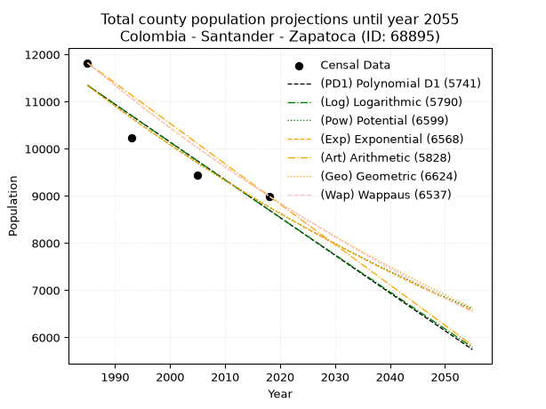
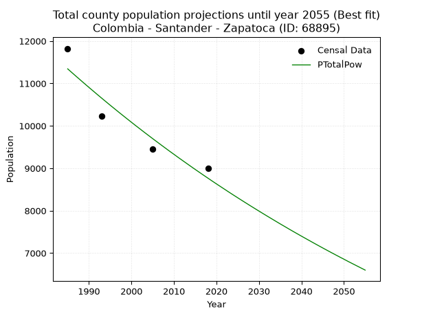
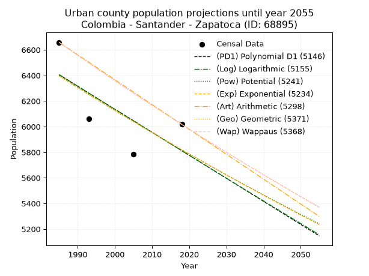
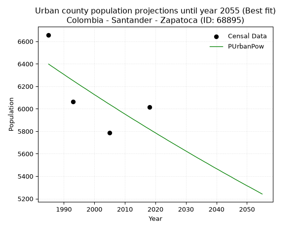
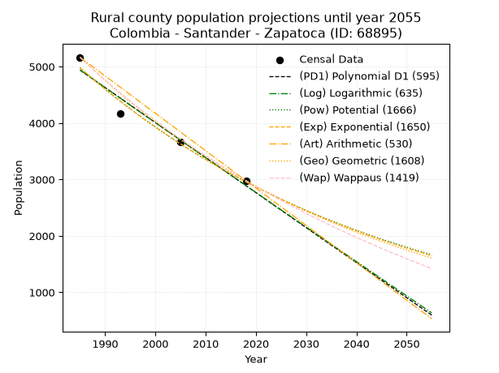
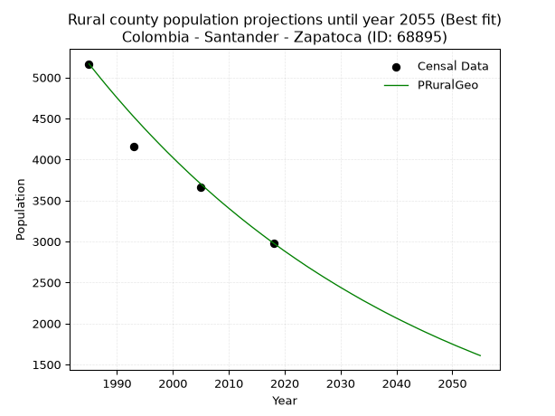

<div align="center">


</div>

# _“Population and Public Services Demand Projections (PPSD) until Year 2050 for Colombia - Santander - Zapatoca (ID: 68895)”_
Keywords: `population` `public-service` `projection` `lineal` `polynomial` `logarithmic` `potential` `exponential` `arithmetic` `geometric` `wappaus` `dane` `colombia` `south-america`

PPSD are analytical estimates used by governments and planners to anticipate future changes in population size, age distribution, and the resulting community needs for utilities, healthcare, education, and infrastructure as sizing future water treatment facilities, electrical grids, and road networks based on spatial growth.

> **General running parameters**: • app_version: _v20260806_. • Python version: _3.14.7_. • Pandas version: _3.0.5_. • NumPy version: _2.5.1_. • Creates, save and include plots into reports (create_plot): _False_. • Projection until year: _2050_. • Process polynomial degree 2 and up: _False_. • Process Wappaus: _True_. • Process Wappaus: _True_. • Set negative values to zero: _True_. • Set infinite values to zero: _True_. • Drop dataset notes: _True_. 
<div align="center">

Dynamic map: [:earth_americas:Google](http://maps.google.com/maps?q=6.814386773,-73.2680341) [:earth_americas:OSM](https://www.openstreetmap.org/#map=18/6.814386773/-73.2680341&layers=P) [:earth_americas:Bing](https://www.bing.com/maps?cp=6.814386773~-73.2680341&lvl=18) [:earth_americas:Apple](https://maps.apple.com/frame?center=6.814386773%2C-73.2680341&span=0.003%2C0.006)

</div>


<div align="center">

```geojson
{
  "type": "Feature",
  "geometry": {
    "type": "Point", 
    "coordinates": [-73.2680341, 6.814386773]
  }, 
  "properties": {
    "Name": "Colombia - Santander - Zapatoca (ID: 68895)"
  }
}
```

</div>


## 0. Census Data (4 records)

Census data are official statistics collected by a government about the people and housing in a country. They usually include counts of total population, age, sex, race, income, education, and jobs.

📅Global census file: [Population.xlsx](../data/Population.xlsx)

| Source   |   Year |   CountryID | CountryName   |   StateID | StateName   |   CountyID | CountyName   |   PTotal |   PUrban |   PRural |
|:---------|-------:|------------:|:--------------|----------:|:------------|-----------:|:-------------|---------:|---------:|---------:|
| DANE     |   1985 |          57 | Colombia      |        68 | Santander   |      68895 | Zapatoca     |    11823 |     6658 |     5165 |
| DANE     |   1993 |          57 | Colombia      |        68 | Santander   |      68895 | Zapatoca     |    10224 |     6063 |     4161 |
| DANE     |   2005 |          57 | Colombia      |        68 | Santander   |      68895 | Zapatoca     |     9449 |     5786 |     3663 |
| DANE     |   2018 |          57 | Colombia      |        68 | Santander   |      68895 | Zapatoca     |     8997 |     6017 |     2980 |

> 🔥Some records could had specific notes about the registered values or the corresponding urban or rural distribution.

## 1. Total

### 1.1. Coefficients and Parameters

* (PD1) Polynomial Deg 1: -80.04054596547539, 170224.35206744217 (lineal)
* (Log) Logarithmic: -160349.37978030692, 1228940.1706693992
* (Pow) Potential: -15.631952063797366, 55.605217270477254
* (Exp) Exponential: -0.00780357657650201, 60520956069.32388
* (Art) Arithmetic: Year diff. 2018 - 1985 = 33, Population diff. 8997 - 11823 = -2826, Annual growth = -85.63636363636364
* (Geo) Geometric: Year diff. 2018 - 1985 = 33, Population diff. 8997 - 11823 = -2826, Annual growth % = -0.008243278678664923
* (Wap) Wappaus: i = -0.8226355776788054, Condition values only valid for < 200)

<sub>
Wappaus condition values: ['-0.00', '-0.82', '-1.65', '-2.47', '-3.29', '-4.11', '-4.94', '-5.76', '-6.58', '-7.40', '-8.23', '-9.05', '-9.87', '-10.69', '-11.52', '-12.34', '-13.16', '-13.98', '-14.81', '-15.63', '-16.45', '-17.28', '-18.10', '-18.92', '-19.74', '-20.57', '-21.39', '-22.21', '-23.03', '-23.86', '-24.68', '-25.50', '-26.32', '-27.15', '-27.97', '-28.79', '-29.61', '-30.44', '-31.26', '-32.08', '-32.91', '-33.73', '-34.55', '-35.37', '-36.20', '-37.02', '-37.84', '-38.66', '-39.49', '-40.31', '-41.13', '-41.95', '-42.78', '-43.60', '-44.42', '-45.24', '-46.07', '-46.89', '-47.71', '-48.54', '-49.36', '-50.18', '-51.00', '-51.83', '-52.65', '-53.47']
</sub>


### 1.2. Projected Dataset

|   Year |   CountyID |   PTotalPD1 |   PTotalLog |   PTotalPow |   PTotalExp |   PTotalArt |   PTotalGeo |   PTotalWap |
|-------:|-----------:|------------:|------------:|------------:|------------:|------------:|------------:|------------:|
|   1985 |      68895 |       11344 |       11347 |       11344 |       11341 |       11823 |       11823 |       11823 |
|   1986 |      68895 |       11264 |       11267 |       11255 |       11253 |       11737 |       11726 |       11726 |
|   1987 |      68895 |       11184 |       11186 |       11167 |       11165 |       11652 |       11629 |       11630 |
|   1988 |      68895 |       11104 |       11105 |       11080 |       11078 |       11566 |       11533 |       11535 |
|   1989 |      68895 |       11024 |       11025 |       10993 |       10992 |       11480 |       11438 |       11440 |
|   1990 |      68895 |       10944 |       10944 |       10907 |       10907 |       11395 |       11344 |       11346 |
|   1991 |      68895 |       10864 |       10863 |       10822 |       10822 |       11309 |       11250 |       11253 |
|   1992 |      68895 |       10784 |       10783 |       10737 |       10738 |       11224 |       11157 |       11161 |
|   1993 |      68895 |       10704 |       10702 |       10653 |       10654 |       11138 |       11065 |       11070 |
|   1994 |      68895 |       10624 |       10622 |       10570 |       10572 |       11052 |       10974 |       10979 |
|   1995 |      68895 |       10543 |       10542 |       10487 |       10489 |       10967 |       10884 |       10889 |
|   1996 |      68895 |       10463 |       10461 |       10406 |       10408 |       10881 |       10794 |       10799 |
|   1997 |      68895 |       10383 |       10381 |       10324 |       10327 |       10795 |       10705 |       10711 |
|   1998 |      68895 |       10303 |       10301 |       10244 |       10247 |       10710 |       10617 |       10623 |
|   1999 |      68895 |       10223 |       10220 |       10164 |       10167 |       10624 |       10529 |       10535 |
|   2000 |      68895 |       10143 |       10140 |       10085 |       10088 |       10538 |       10443 |       10449 |
|   2001 |      68895 |       10063 |       10060 |       10006 |       10010 |       10453 |       10356 |       10363 |
|   2002 |      68895 |        9983 |        9980 |        9929 |        9932 |       10367 |       10271 |       10278 |
|   2003 |      68895 |        9903 |        9900 |        9851 |        9855 |       10282 |       10186 |       10193 |
|   2004 |      68895 |        9823 |        9820 |        9775 |        9778 |       10196 |       10102 |       10109 |
|   2005 |      68895 |        9743 |        9740 |        9699 |        9702 |       10110 |       10019 |       10026 |
|   2006 |      68895 |        9663 |        9660 |        9624 |        9627 |       10025 |        9937 |        9943 |
|   2007 |      68895 |        9583 |        9580 |        9549 |        9552 |        9939 |        9855 |        9861 |
|   2008 |      68895 |        9503 |        9500 |        9475 |        9477 |        9853 |        9773 |        9779 |
|   2009 |      68895 |        9423 |        9420 |        9401 |        9404 |        9768 |        9693 |        9698 |
|   2010 |      68895 |        9343 |        9340 |        9329 |        9331 |        9682 |        9613 |        9618 |
|   2011 |      68895 |        9263 |        9261 |        9256 |        9258 |        9596 |        9534 |        9539 |
|   2012 |      68895 |        9183 |        9181 |        9185 |        9186 |        9511 |        9455 |        9459 |
|   2013 |      68895 |        9103 |        9101 |        9114 |        9115 |        9425 |        9377 |        9381 |
|   2014 |      68895 |        9023 |        9022 |        9043 |        9044 |        9340 |        9300 |        9303 |
|   2015 |      68895 |        8943 |        8942 |        8973 |        8974 |        9254 |        9223 |        9226 |
|   2016 |      68895 |        8863 |        8862 |        8904 |        8904 |        9168 |        9147 |        9149 |
|   2017 |      68895 |        8783 |        8783 |        8835 |        8835 |        9083 |        9072 |        9073 |
|   2018 |      68895 |        8703 |        8703 |        8767 |        8766 |        8997 |        8997 |        8997 |
|   2019 |      68895 |        8622 |        8624 |        8699 |        8698 |        8911 |        8923 |        8922 |
|   2020 |      68895 |        8542 |        8545 |        8632 |        8630 |        8826 |        8849 |        8847 |
|   2021 |      68895 |        8462 |        8465 |        8566 |        8563 |        8740 |        8776 |        8773 |
|   2022 |      68895 |        8382 |        8386 |        8500 |        8497 |        8654 |        8704 |        8700 |
|   2023 |      68895 |        8302 |        8307 |        8434 |        8431 |        8569 |        8632 |        8627 |
|   2024 |      68895 |        8222 |        8227 |        8369 |        8365 |        8483 |        8561 |        8554 |
|   2025 |      68895 |        8142 |        8148 |        8305 |        8300 |        8398 |        8491 |        8482 |
|   2026 |      68895 |        8062 |        8069 |        8241 |        8236 |        8312 |        8421 |        8411 |
|   2027 |      68895 |        7982 |        7990 |        8178 |        8171 |        8226 |        8351 |        8340 |
|   2028 |      68895 |        7902 |        7911 |        8115 |        8108 |        8141 |        8282 |        8269 |
|   2029 |      68895 |        7822 |        7832 |        8053 |        8045 |        8055 |        8214 |        8199 |
|   2030 |      68895 |        7742 |        7753 |        7991 |        7982 |        7969 |        8146 |        8130 |
|   2031 |      68895 |        7662 |        7674 |        7930 |        7920 |        7884 |        8079 |        8061 |
|   2032 |      68895 |        7582 |        7595 |        7869 |        7859 |        7798 |        8013 |        7992 |
|   2033 |      68895 |        7502 |        7516 |        7809 |        7798 |        7712 |        7946 |        7924 |
|   2034 |      68895 |        7422 |        7437 |        7749 |        7737 |        7627 |        7881 |        7857 |
|   2035 |      68895 |        7342 |        7358 |        7689 |        7677 |        7541 |        7816 |        7790 |
|   2036 |      68895 |        7262 |        7280 |        7631 |        7617 |        7456 |        7752 |        7723 |
|   2037 |      68895 |        7182 |        7201 |        7572 |        7558 |        7370 |        7688 |        7657 |
|   2038 |      68895 |        7102 |        7122 |        7514 |        7499 |        7284 |        7624 |        7591 |
|   2039 |      68895 |        7022 |        7043 |        7457 |        7441 |        7199 |        7561 |        7525 |
|   2040 |      68895 |        6942 |        6965 |        7400 |        7383 |        7113 |        7499 |        7461 |
|   2041 |      68895 |        6862 |        6886 |        7344 |        7326 |        7027 |        7437 |        7396 |
|   2042 |      68895 |        6782 |        6808 |        7288 |        7269 |        6942 |        7376 |        7332 |
|   2043 |      68895 |        6702 |        6729 |        7232 |        7212 |        6856 |        7315 |        7268 |
|   2044 |      68895 |        6621 |        6651 |        7177 |        7156 |        6770 |        7255 |        7205 |
|   2045 |      68895 |        6541 |        6572 |        7122 |        7101 |        6685 |        7195 |        7142 |
|   2046 |      68895 |        6461 |        6494 |        7068 |        7045 |        6599 |        7136 |        7080 |
|   2047 |      68895 |        6381 |        6416 |        7014 |        6991 |        6514 |        7077 |        7018 |
|   2048 |      68895 |        6301 |        6337 |        6961 |        6936 |        6428 |        7019 |        6957 |
|   2049 |      68895 |        6221 |        6259 |        6908 |        6882 |        6342 |        6961 |        6895 |
|   2050 |      68895 |        6141 |        6181 |        6856 |        6829 |        6257 |        6903 |        6835 |
<div align="center">

</img>

</div>


### 1.3. Best fit with absolute and relative error (%)

Relative error puts that difference into context by dividing the absolute error by the true value, creating a unitless ratio or percentage that shows the scale of the mistake.

Absolute and relative error

|   Year | Source   |   CountryID | CountryName   |   StateID | StateName   |   CountyID_x | CountyName   |   PTotal |   PUrban |   PRural |   CountyID_y |   PTotalPD1 |   PTotalLog |   PTotalPow |   PTotalExp |   PTotalArt |   PTotalGeo |   PTotalWap |   PTotalPD1AbsError |   PTotalLogAbsError |   PTotalPowAbsError |   PTotalExpAbsError |   PTotalArtAbsError |   PTotalGeoAbsError |   PTotalWapAbsError |   PTotalPD1RelError |   PTotalLogRelError |   PTotalPowRelError |   PTotalExpRelError |   PTotalArtRelError |   PTotalGeoRelError |   PTotalWapRelError |
|-------:|:---------|------------:|:--------------|----------:|:------------|-------------:|:-------------|---------:|---------:|---------:|-------------:|------------:|------------:|------------:|------------:|------------:|------------:|------------:|--------------------:|--------------------:|--------------------:|--------------------:|--------------------:|--------------------:|--------------------:|--------------------:|--------------------:|--------------------:|--------------------:|--------------------:|--------------------:|--------------------:|
|   1985 | DANE     |          57 | Colombia      |        68 | Santander   |        68895 | Zapatoca     |    11823 |     6658 |     5165 |        68895 |       11344 |       11347 |       11344 |       11341 |       11823 |       11823 |       11823 |                 479 |                 476 |                 479 |                 482 |                   0 |                   0 |                   0 |             4.05143 |             4.02605 |             4.05143 |             4.0768  |             0       |             0       |             0       |
|   1993 | DANE     |          57 | Colombia      |        68 | Santander   |        68895 | Zapatoca     |    10224 |     6063 |     4161 |        68895 |       10704 |       10702 |       10653 |       10654 |       11138 |       11065 |       11070 |                 480 |                 478 |                 429 |                 430 |                 914 |                 841 |                 846 |             4.69484 |             4.67527 |             4.19601 |             4.20579 |             8.93975 |             8.22574 |             8.27465 |
|   2005 | DANE     |          57 | Colombia      |        68 | Santander   |        68895 | Zapatoca     |     9449 |     5786 |     3663 |        68895 |        9743 |        9740 |        9699 |        9702 |       10110 |       10019 |       10026 |                 294 |                 291 |                 250 |                 253 |                 661 |                 570 |                 577 |             3.11144 |             3.07969 |             2.64578 |             2.67753 |             6.99545 |             6.03238 |             6.10647 |
|   2018 | DANE     |          57 | Colombia      |        68 | Santander   |        68895 | Zapatoca     |     8997 |     6017 |     2980 |        68895 |        8703 |        8703 |        8767 |        8766 |        8997 |        8997 |        8997 |                 294 |                 294 |                 230 |                 231 |                   0 |                   0 |                   0 |             3.26776 |             3.26776 |             2.55641 |             2.56752 |             0       |             0       |             0       |

Relative error mean

| Method    |   RelError | Best   |
|:----------|-----------:|:-------|
| PTotalPD1 |    3.78136 |        |
| PTotalLog |    3.76219 |        |
| PTotalPow |    3.36241 | True   |
| PTotalExp |    3.38191 |        |
| PTotalArt |    3.9838  |        |
| PTotalGeo |    3.56453 |        |
| PTotalWap |    3.59528 |        |

💙Best method: _**PTotalPow**_
<div align="center">

</img>

</div>


### 1.4. Fresh water supply demand in liters per capita per day (lpcd)

The fresh water supply demand typically ranges from 100 to 300 liters per capita per day (lpcd) for standard domestic and municipal planning, though absolute survival minimums set by the World Health Organization are as low as 7.5 to 20 liters per day, and total consumption in high-income nations can exceed 400 liters.

> `CZ`: Level in meters above the sea level (masl)<br> `WS`: Fresh water supply demand in liters per capita per day (lpcd or l/h/d)<br> `WSAll`: Zonal fresh water supply demand in liters per second (l/s)<br> `A`: Zonal area in square meters<br> `DP`: Population density (people/hectare)

Reference values (RAS Colombia)

|    CZ |   WS |
|------:|-----:|
|  1000 |  120 |
|  2000 |  130 |
| 99999 |  140 |

County shapefile geometry properties and water supply values

|   CountyID |      ATotal |   CZTotal |   WSTotal |
|-----------:|------------:|----------:|----------:|
|      68895 | 3.63774e+08 |   1344.54 |       130 |

Projected values for best method: PTotalPow

|   CountyID |   Year |   PTotalPow |   DPTotal |   WSTotal |   WSTotalAll |
|-----------:|-------:|------------:|----------:|----------:|-------------:|
|      68895 |   1985 |       11344 |      0.31 |       130 |      17.0685 |
|      68895 |   1986 |       11255 |      0.31 |       130 |      16.9346 |
|      68895 |   1987 |       11167 |      0.31 |       130 |      16.8022 |
|      68895 |   1988 |       11080 |      0.3  |       130 |      16.6713 |
|      68895 |   1989 |       10993 |      0.3  |       130 |      16.5404 |
|      68895 |   1990 |       10907 |      0.3  |       130 |      16.411  |
|      68895 |   1991 |       10822 |      0.3  |       130 |      16.2831 |
|      68895 |   1992 |       10737 |      0.3  |       130 |      16.1552 |
|      68895 |   1993 |       10653 |      0.29 |       130 |      16.0288 |
|      68895 |   1994 |       10570 |      0.29 |       130 |      15.9039 |
|      68895 |   1995 |       10487 |      0.29 |       130 |      15.7791 |
|      68895 |   1996 |       10406 |      0.29 |       130 |      15.6572 |
|      68895 |   1997 |       10324 |      0.28 |       130 |      15.5338 |
|      68895 |   1998 |       10244 |      0.28 |       130 |      15.4134 |
|      68895 |   1999 |       10164 |      0.28 |       130 |      15.2931 |
|      68895 |   2000 |       10085 |      0.28 |       130 |      15.1742 |
|      68895 |   2001 |       10006 |      0.28 |       130 |      15.0553 |
|      68895 |   2002 |        9929 |      0.27 |       130 |      14.9395 |
|      68895 |   2003 |        9851 |      0.27 |       130 |      14.8221 |
|      68895 |   2004 |        9775 |      0.27 |       130 |      14.7078 |
|      68895 |   2005 |        9699 |      0.27 |       130 |      14.5934 |
|      68895 |   2006 |        9624 |      0.26 |       130 |      14.4806 |
|      68895 |   2007 |        9549 |      0.26 |       130 |      14.3677 |
|      68895 |   2008 |        9475 |      0.26 |       130 |      14.2564 |
|      68895 |   2009 |        9401 |      0.26 |       130 |      14.145  |
|      68895 |   2010 |        9329 |      0.26 |       130 |      14.0367 |
|      68895 |   2011 |        9256 |      0.25 |       130 |      13.9269 |
|      68895 |   2012 |        9185 |      0.25 |       130 |      13.82   |
|      68895 |   2013 |        9114 |      0.25 |       130 |      13.7132 |
|      68895 |   2014 |        9043 |      0.25 |       130 |      13.6064 |
|      68895 |   2015 |        8973 |      0.25 |       130 |      13.501  |
|      68895 |   2016 |        8904 |      0.24 |       130 |      13.3972 |
|      68895 |   2017 |        8835 |      0.24 |       130 |      13.2934 |
|      68895 |   2018 |        8767 |      0.24 |       130 |      13.1911 |
|      68895 |   2019 |        8699 |      0.24 |       130 |      13.0888 |
|      68895 |   2020 |        8632 |      0.24 |       130 |      12.988  |
|      68895 |   2021 |        8566 |      0.24 |       130 |      12.8887 |
|      68895 |   2022 |        8500 |      0.23 |       130 |      12.7894 |
|      68895 |   2023 |        8434 |      0.23 |       130 |      12.69   |
|      68895 |   2024 |        8369 |      0.23 |       130 |      12.5922 |
|      68895 |   2025 |        8305 |      0.23 |       130 |      12.4959 |
|      68895 |   2026 |        8241 |      0.23 |       130 |      12.3997 |
|      68895 |   2027 |        8178 |      0.22 |       130 |      12.3049 |
|      68895 |   2028 |        8115 |      0.22 |       130 |      12.2101 |
|      68895 |   2029 |        8053 |      0.22 |       130 |      12.1168 |
|      68895 |   2030 |        7991 |      0.22 |       130 |      12.0235 |
|      68895 |   2031 |        7930 |      0.22 |       130 |      11.9317 |
|      68895 |   2032 |        7869 |      0.22 |       130 |      11.8399 |
|      68895 |   2033 |        7809 |      0.21 |       130 |      11.7497 |
|      68895 |   2034 |        7749 |      0.21 |       130 |      11.6594 |
|      68895 |   2035 |        7689 |      0.21 |       130 |      11.5691 |
|      68895 |   2036 |        7631 |      0.21 |       130 |      11.4818 |
|      68895 |   2037 |        7572 |      0.21 |       130 |      11.3931 |
|      68895 |   2038 |        7514 |      0.21 |       130 |      11.3058 |
|      68895 |   2039 |        7457 |      0.2  |       130 |      11.22   |
|      68895 |   2040 |        7400 |      0.2  |       130 |      11.1343 |
|      68895 |   2041 |        7344 |      0.2  |       130 |      11.05   |
|      68895 |   2042 |        7288 |      0.2  |       130 |      10.9657 |
|      68895 |   2043 |        7232 |      0.2  |       130 |      10.8815 |
|      68895 |   2044 |        7177 |      0.2  |       130 |      10.7987 |
|      68895 |   2045 |        7122 |      0.2  |       130 |      10.716  |
|      68895 |   2046 |        7068 |      0.19 |       130 |      10.6347 |
|      68895 |   2047 |        7014 |      0.19 |       130 |      10.5535 |
|      68895 |   2048 |        6961 |      0.19 |       130 |      10.4737 |
|      68895 |   2049 |        6908 |      0.19 |       130 |      10.394  |
|      68895 |   2050 |        6856 |      0.19 |       130 |      10.3157 |

## 2. Urban

### 2.1. Coefficients and Parameters

* (PD1) Polynomial Deg 1: -17.99437976716189, 42124.25812926557 (lineal)
* (Log) Logarithmic: -36104.01073687322, 280557.87493035797
* (Pow) Potential: -5.750941014637962, 22.771239874342626
* (Exp) Exponential: -0.002866205185260147, 1891528.268682841
* (Art) Arithmetic: Year diff. 2018 - 1985 = 33, Population diff. 6017 - 6658 = -641, Annual growth = -19.424242424242426
* (Geo) Geometric: Year diff. 2018 - 1985 = 33, Population diff. 6017 - 6658 = -641, Annual growth % = -0.0030628859138909226
* (Wap) Wappaus: i = -0.30649692188153727, Condition values only valid for < 200)

<sub>
Wappaus condition values: ['-0.00', '-0.31', '-0.61', '-0.92', '-1.23', '-1.53', '-1.84', '-2.15', '-2.45', '-2.76', '-3.06', '-3.37', '-3.68', '-3.98', '-4.29', '-4.60', '-4.90', '-5.21', '-5.52', '-5.82', '-6.13', '-6.44', '-6.74', '-7.05', '-7.36', '-7.66', '-7.97', '-8.28', '-8.58', '-8.89', '-9.19', '-9.50', '-9.81', '-10.11', '-10.42', '-10.73', '-11.03', '-11.34', '-11.65', '-11.95', '-12.26', '-12.57', '-12.87', '-13.18', '-13.49', '-13.79', '-14.10', '-14.41', '-14.71', '-15.02', '-15.32', '-15.63', '-15.94', '-16.24', '-16.55', '-16.86', '-17.16', '-17.47', '-17.78', '-18.08', '-18.39', '-18.70', '-19.00', '-19.31', '-19.62', '-19.92']
</sub>


### 2.2. Projected Dataset

|   Year |   CountyID |   PUrbanPD1 |   PUrbanLog |   PUrbanPow |   PUrbanExp |   PUrbanArt |   PUrbanGeo |   PUrbanWap |
|-------:|-----------:|------------:|------------:|------------:|------------:|------------:|------------:|------------:|
|   1985 |      68895 |        6405 |        6407 |        6398 |        6396 |        6658 |        6658 |        6658 |
|   1986 |      68895 |        6387 |        6388 |        6379 |        6378 |        6639 |        6638 |        6638 |
|   1987 |      68895 |        6369 |        6370 |        6361 |        6360 |        6619 |        6617 |        6617 |
|   1988 |      68895 |        6351 |        6352 |        6342 |        6342 |        6600 |        6597 |        6597 |
|   1989 |      68895 |        6333 |        6334 |        6324 |        6323 |        6580 |        6577 |        6577 |
|   1990 |      68895 |        6315 |        6316 |        6306 |        6305 |        6561 |        6557 |        6557 |
|   1991 |      68895 |        6297 |        6298 |        6287 |        6287 |        6541 |        6537 |        6537 |
|   1992 |      68895 |        6279 |        6280 |        6269 |        6269 |        6522 |        6517 |        6517 |
|   1993 |      68895 |        6261 |        6261 |        6251 |        6251 |        6503 |        6497 |        6497 |
|   1994 |      68895 |        6243 |        6243 |        6233 |        6233 |        6483 |        6477 |        6477 |
|   1995 |      68895 |        6225 |        6225 |        6215 |        6216 |        6464 |        6457 |        6457 |
|   1996 |      68895 |        6207 |        6207 |        6197 |        6198 |        6444 |        6437 |        6437 |
|   1997 |      68895 |        6189 |        6189 |        6180 |        6180 |        6425 |        6417 |        6418 |
|   1998 |      68895 |        6171 |        6171 |        6162 |        6162 |        6405 |        6398 |        6398 |
|   1999 |      68895 |        6153 |        6153 |        6144 |        6145 |        6386 |        6378 |        6378 |
|   2000 |      68895 |        6135 |        6135 |        6126 |        6127 |        6367 |        6359 |        6359 |
|   2001 |      68895 |        6118 |        6117 |        6109 |        6110 |        6347 |        6339 |        6339 |
|   2002 |      68895 |        6100 |        6099 |        6091 |        6092 |        6328 |        6320 |        6320 |
|   2003 |      68895 |        6082 |        6081 |        6074 |        6075 |        6308 |        6300 |        6301 |
|   2004 |      68895 |        6064 |        6063 |        6056 |        6057 |        6289 |        6281 |        6281 |
|   2005 |      68895 |        6046 |        6045 |        6039 |        6040 |        6270 |        6262 |        6262 |
|   2006 |      68895 |        6028 |        6027 |        6022 |        6023 |        6250 |        6243 |        6243 |
|   2007 |      68895 |        6010 |        6009 |        6005 |        6005 |        6231 |        6223 |        6224 |
|   2008 |      68895 |        5992 |        5991 |        5987 |        5988 |        6211 |        6204 |        6205 |
|   2009 |      68895 |        5974 |        5973 |        5970 |        5971 |        6192 |        6185 |        6186 |
|   2010 |      68895 |        5956 |        5955 |        5953 |        5954 |        6172 |        6166 |        6167 |
|   2011 |      68895 |        5938 |        5937 |        5936 |        5937 |        6153 |        6148 |        6148 |
|   2012 |      68895 |        5920 |        5919 |        5919 |        5920 |        6134 |        6129 |        6129 |
|   2013 |      68895 |        5902 |        5901 |        5902 |        5903 |        6114 |        6110 |        6110 |
|   2014 |      68895 |        5884 |        5883 |        5886 |        5886 |        6095 |        6091 |        6091 |
|   2015 |      68895 |        5866 |        5865 |        5869 |        5869 |        6075 |        6073 |        6073 |
|   2016 |      68895 |        5848 |        5847 |        5852 |        5853 |        6056 |        6054 |        6054 |
|   2017 |      68895 |        5830 |        5829 |        5835 |        5836 |        6036 |        6035 |        6036 |
|   2018 |      68895 |        5812 |        5811 |        5819 |        5819 |        6017 |        6017 |        6017 |
|   2019 |      68895 |        5794 |        5793 |        5802 |        5802 |        5998 |        5999 |        5999 |
|   2020 |      68895 |        5776 |        5776 |        5786 |        5786 |        5978 |        5980 |        5980 |
|   2021 |      68895 |        5758 |        5758 |        5769 |        5769 |        5959 |        5962 |        5962 |
|   2022 |      68895 |        5740 |        5740 |        5753 |        5753 |        5939 |        5944 |        5943 |
|   2023 |      68895 |        5722 |        5722 |        5737 |        5736 |        5920 |        5925 |        5925 |
|   2024 |      68895 |        5704 |        5704 |        5720 |        5720 |        5900 |        5907 |        5907 |
|   2025 |      68895 |        5686 |        5686 |        5704 |        5703 |        5881 |        5889 |        5889 |
|   2026 |      68895 |        5668 |        5668 |        5688 |        5687 |        5862 |        5871 |        5871 |
|   2027 |      68895 |        5650 |        5651 |        5672 |        5671 |        5842 |        5853 |        5853 |
|   2028 |      68895 |        5632 |        5633 |        5656 |        5655 |        5823 |        5835 |        5835 |
|   2029 |      68895 |        5614 |        5615 |        5640 |        5638 |        5803 |        5817 |        5817 |
|   2030 |      68895 |        5596 |        5597 |        5624 |        5622 |        5784 |        5800 |        5799 |
|   2031 |      68895 |        5578 |        5579 |        5608 |        5606 |        5764 |        5782 |        5781 |
|   2032 |      68895 |        5560 |        5562 |        5592 |        5590 |        5745 |        5764 |        5763 |
|   2033 |      68895 |        5542 |        5544 |        5576 |        5574 |        5726 |        5746 |        5746 |
|   2034 |      68895 |        5524 |        5526 |        5560 |        5558 |        5706 |        5729 |        5728 |
|   2035 |      68895 |        5506 |        5508 |        5545 |        5542 |        5687 |        5711 |        5710 |
|   2036 |      68895 |        5488 |        5491 |        5529 |        5526 |        5667 |        5694 |        5693 |
|   2037 |      68895 |        5470 |        5473 |        5514 |        5511 |        5648 |        5676 |        5675 |
|   2038 |      68895 |        5452 |        5455 |        5498 |        5495 |        5629 |        5659 |        5658 |
|   2039 |      68895 |        5434 |        5438 |        5482 |        5479 |        5609 |        5642 |        5640 |
|   2040 |      68895 |        5416 |        5420 |        5467 |        5463 |        5590 |        5624 |        5623 |
|   2041 |      68895 |        5398 |        5402 |        5452 |        5448 |        5570 |        5607 |        5606 |
|   2042 |      68895 |        5380 |        5384 |        5436 |        5432 |        5551 |        5590 |        5588 |
|   2043 |      68895 |        5362 |        5367 |        5421 |        5417 |        5531 |        5573 |        5571 |
|   2044 |      68895 |        5344 |        5349 |        5406 |        5401 |        5512 |        5556 |        5554 |
|   2045 |      68895 |        5326 |        5331 |        5391 |        5386 |        5493 |        5539 |        5537 |
|   2046 |      68895 |        5308 |        5314 |        5375 |        5370 |        5473 |        5522 |        5520 |
|   2047 |      68895 |        5290 |        5296 |        5360 |        5355 |        5454 |        5505 |        5503 |
|   2048 |      68895 |        5272 |        5279 |        5345 |        5340 |        5434 |        5488 |        5486 |
|   2049 |      68895 |        5254 |        5261 |        5330 |        5324 |        5415 |        5471 |        5469 |
|   2050 |      68895 |        5236 |        5243 |        5315 |        5309 |        5395 |        5454 |        5452 |
<div align="center">

</img>

</div>


### 2.3. Best fit with absolute and relative error (%)

Relative error puts that difference into context by dividing the absolute error by the true value, creating a unitless ratio or percentage that shows the scale of the mistake.

Absolute and relative error

|   Year | Source   |   CountryID | CountryName   |   StateID | StateName   |   CountyID_x | CountyName   |   PTotal |   PUrban |   PRural |   CountyID_y |   PUrbanPD1 |   PUrbanLog |   PUrbanPow |   PUrbanExp |   PUrbanArt |   PUrbanGeo |   PUrbanWap |   PUrbanPD1AbsError |   PUrbanLogAbsError |   PUrbanPowAbsError |   PUrbanExpAbsError |   PUrbanArtAbsError |   PUrbanGeoAbsError |   PUrbanWapAbsError |   PUrbanPD1RelError |   PUrbanLogRelError |   PUrbanPowRelError |   PUrbanExpRelError |   PUrbanArtRelError |   PUrbanGeoRelError |   PUrbanWapRelError |
|-------:|:---------|------------:|:--------------|----------:|:------------|-------------:|:-------------|---------:|---------:|---------:|-------------:|------------:|------------:|------------:|------------:|------------:|------------:|------------:|--------------------:|--------------------:|--------------------:|--------------------:|--------------------:|--------------------:|--------------------:|--------------------:|--------------------:|--------------------:|--------------------:|--------------------:|--------------------:|--------------------:|
|   1985 | DANE     |          57 | Colombia      |        68 | Santander   |        68895 | Zapatoca     |    11823 |     6658 |     5165 |        68895 |        6405 |        6407 |        6398 |        6396 |        6658 |        6658 |        6658 |                 253 |                 251 |                 260 |                 262 |                   0 |                   0 |                   0 |             3.79994 |             3.7699  |             3.90508 |             3.93512 |             0       |             0       |             0       |
|   1993 | DANE     |          57 | Colombia      |        68 | Santander   |        68895 | Zapatoca     |    10224 |     6063 |     4161 |        68895 |        6261 |        6261 |        6251 |        6251 |        6503 |        6497 |        6497 |                 198 |                 198 |                 188 |                 188 |                 440 |                 434 |                 434 |             3.26571 |             3.26571 |             3.10078 |             3.10078 |             7.25713 |             7.15817 |             7.15817 |
|   2005 | DANE     |          57 | Colombia      |        68 | Santander   |        68895 | Zapatoca     |     9449 |     5786 |     3663 |        68895 |        6046 |        6045 |        6039 |        6040 |        6270 |        6262 |        6262 |                 260 |                 259 |                 253 |                 254 |                 484 |                 476 |                 476 |             4.49361 |             4.47632 |             4.37262 |             4.38991 |             8.36502 |             8.22675 |             8.22675 |
|   2018 | DANE     |          57 | Colombia      |        68 | Santander   |        68895 | Zapatoca     |     8997 |     6017 |     2980 |        68895 |        5812 |        5811 |        5819 |        5819 |        6017 |        6017 |        6017 |                 205 |                 206 |                 198 |                 198 |                   0 |                   0 |                   0 |             3.40701 |             3.42363 |             3.29068 |             3.29068 |             0       |             0       |             0       |

Relative error mean

| Method    |   RelError | Best   |
|:----------|-----------:|:-------|
| PUrbanPD1 |    3.74157 |        |
| PUrbanLog |    3.73389 |        |
| PUrbanPow |    3.66729 | True   |
| PUrbanExp |    3.67912 |        |
| PUrbanArt |    3.90554 |        |
| PUrbanGeo |    3.84623 |        |
| PUrbanWap |    3.84623 |        |

💙Best method: _**PUrbanPow**_
<div align="center">

</img>

</div>


### 2.4. Fresh water supply demand in liters per capita per day (lpcd)

The fresh water supply demand typically ranges from 100 to 300 liters per capita per day (lpcd) for standard domestic and municipal planning, though absolute survival minimums set by the World Health Organization are as low as 7.5 to 20 liters per day, and total consumption in high-income nations can exceed 400 liters.

> `CZ`: Level in meters above the sea level (masl)<br> `WS`: Fresh water supply demand in liters per capita per day (lpcd or l/h/d)<br> `WSAll`: Zonal fresh water supply demand in liters per second (l/s)<br> `A`: Zonal area in square meters<br> `DP`: Population density (people/hectare)

Reference values (RAS Colombia)

|    CZ |   WS |
|------:|-----:|
|  1000 |  120 |
|  2000 |  130 |
| 99999 |  140 |

County shapefile geometry properties and water supply values

|   CountyID |      AUrban |   CZUrban |   WSUrban |
|-----------:|------------:|----------:|----------:|
|      68895 | 2.57693e+06 |   1702.05 |       130 |

Projected values for best method: PUrbanPow

|   CountyID |   Year |   PUrbanPow |   DPUrban |   WSUrban |   WSUrbanAll |
|-----------:|-------:|------------:|----------:|----------:|-------------:|
|      68895 |   1985 |        6398 |     24.83 |       130 |      9.62662 |
|      68895 |   1986 |        6379 |     24.75 |       130 |      9.59803 |
|      68895 |   1987 |        6361 |     24.68 |       130 |      9.57095 |
|      68895 |   1988 |        6342 |     24.61 |       130 |      9.54236 |
|      68895 |   1989 |        6324 |     24.54 |       130 |      9.51528 |
|      68895 |   1990 |        6306 |     24.47 |       130 |      9.48819 |
|      68895 |   1991 |        6287 |     24.4  |       130 |      9.45961 |
|      68895 |   1992 |        6269 |     24.33 |       130 |      9.43252 |
|      68895 |   1993 |        6251 |     24.26 |       130 |      9.40544 |
|      68895 |   1994 |        6233 |     24.19 |       130 |      9.37836 |
|      68895 |   1995 |        6215 |     24.12 |       130 |      9.35127 |
|      68895 |   1996 |        6197 |     24.05 |       130 |      9.32419 |
|      68895 |   1997 |        6180 |     23.98 |       130 |      9.29861 |
|      68895 |   1998 |        6162 |     23.91 |       130 |      9.27153 |
|      68895 |   1999 |        6144 |     23.84 |       130 |      9.24444 |
|      68895 |   2000 |        6126 |     23.77 |       130 |      9.21736 |
|      68895 |   2001 |        6109 |     23.71 |       130 |      9.19178 |
|      68895 |   2002 |        6091 |     23.64 |       130 |      9.1647  |
|      68895 |   2003 |        6074 |     23.57 |       130 |      9.13912 |
|      68895 |   2004 |        6056 |     23.5  |       130 |      9.11204 |
|      68895 |   2005 |        6039 |     23.43 |       130 |      9.08646 |
|      68895 |   2006 |        6022 |     23.37 |       130 |      9.06088 |
|      68895 |   2007 |        6005 |     23.3  |       130 |      9.0353  |
|      68895 |   2008 |        5987 |     23.23 |       130 |      9.00822 |
|      68895 |   2009 |        5970 |     23.17 |       130 |      8.98264 |
|      68895 |   2010 |        5953 |     23.1  |       130 |      8.95706 |
|      68895 |   2011 |        5936 |     23.04 |       130 |      8.93148 |
|      68895 |   2012 |        5919 |     22.97 |       130 |      8.9059  |
|      68895 |   2013 |        5902 |     22.9  |       130 |      8.88032 |
|      68895 |   2014 |        5886 |     22.84 |       130 |      8.85625 |
|      68895 |   2015 |        5869 |     22.78 |       130 |      8.83067 |
|      68895 |   2016 |        5852 |     22.71 |       130 |      8.80509 |
|      68895 |   2017 |        5835 |     22.64 |       130 |      8.77951 |
|      68895 |   2018 |        5819 |     22.58 |       130 |      8.75544 |
|      68895 |   2019 |        5802 |     22.52 |       130 |      8.72986 |
|      68895 |   2020 |        5786 |     22.45 |       130 |      8.70579 |
|      68895 |   2021 |        5769 |     22.39 |       130 |      8.68021 |
|      68895 |   2022 |        5753 |     22.33 |       130 |      8.65613 |
|      68895 |   2023 |        5737 |     22.26 |       130 |      8.63206 |
|      68895 |   2024 |        5720 |     22.2  |       130 |      8.60648 |
|      68895 |   2025 |        5704 |     22.13 |       130 |      8.58241 |
|      68895 |   2026 |        5688 |     22.07 |       130 |      8.55833 |
|      68895 |   2027 |        5672 |     22.01 |       130 |      8.53426 |
|      68895 |   2028 |        5656 |     21.95 |       130 |      8.51019 |
|      68895 |   2029 |        5640 |     21.89 |       130 |      8.48611 |
|      68895 |   2030 |        5624 |     21.82 |       130 |      8.46204 |
|      68895 |   2031 |        5608 |     21.76 |       130 |      8.43796 |
|      68895 |   2032 |        5592 |     21.7  |       130 |      8.41389 |
|      68895 |   2033 |        5576 |     21.64 |       130 |      8.38981 |
|      68895 |   2034 |        5560 |     21.58 |       130 |      8.36574 |
|      68895 |   2035 |        5545 |     21.52 |       130 |      8.34317 |
|      68895 |   2036 |        5529 |     21.46 |       130 |      8.3191  |
|      68895 |   2037 |        5514 |     21.4  |       130 |      8.29653 |
|      68895 |   2038 |        5498 |     21.34 |       130 |      8.27245 |
|      68895 |   2039 |        5482 |     21.27 |       130 |      8.24838 |
|      68895 |   2040 |        5467 |     21.22 |       130 |      8.22581 |
|      68895 |   2041 |        5452 |     21.16 |       130 |      8.20324 |
|      68895 |   2042 |        5436 |     21.09 |       130 |      8.17917 |
|      68895 |   2043 |        5421 |     21.04 |       130 |      8.1566  |
|      68895 |   2044 |        5406 |     20.98 |       130 |      8.13403 |
|      68895 |   2045 |        5391 |     20.92 |       130 |      8.11146 |
|      68895 |   2046 |        5375 |     20.86 |       130 |      8.08738 |
|      68895 |   2047 |        5360 |     20.8  |       130 |      8.06481 |
|      68895 |   2048 |        5345 |     20.74 |       130 |      8.04225 |
|      68895 |   2049 |        5330 |     20.68 |       130 |      8.01968 |
|      68895 |   2050 |        5315 |     20.63 |       130 |      7.99711 |

## 3. Rural

### 3.1. Coefficients and Parameters

* (PD1) Polynomial Deg 1: -62.04616619831347, 128100.09393817653 (lineal)
* (Log) Logarithmic: -124245.36904343372, 948382.2957390416
* (Pow) Potential: -31.593280069355238, 107.88439375980654
* (Exp) Exponential: -0.015780488638307753, 2.000100993590031e+17
* (Art) Arithmetic: Year diff. 2018 - 1985 = 33, Population diff. 2980 - 5165 = -2185, Annual growth = -66.21212121212122
* (Geo) Geometric: Year diff. 2018 - 1985 = 33, Population diff. 2980 - 5165 = -2185, Annual growth % = -0.01652800384004738
* (Wap) Wappaus: i = -1.6258347750060458, Condition values only valid for < 200)

<sub>
Wappaus condition values: ['-0.00', '-1.63', '-3.25', '-4.88', '-6.50', '-8.13', '-9.76', '-11.38', '-13.01', '-14.63', '-16.26', '-17.88', '-19.51', '-21.14', '-22.76', '-24.39', '-26.01', '-27.64', '-29.27', '-30.89', '-32.52', '-34.14', '-35.77', '-37.39', '-39.02', '-40.65', '-42.27', '-43.90', '-45.52', '-47.15', '-48.78', '-50.40', '-52.03', '-53.65', '-55.28', '-56.90', '-58.53', '-60.16', '-61.78', '-63.41', '-65.03', '-66.66', '-68.29', '-69.91', '-71.54', '-73.16', '-74.79', '-76.41', '-78.04', '-79.67', '-81.29', '-82.92', '-84.54', '-86.17', '-87.80', '-89.42', '-91.05', '-92.67', '-94.30', '-95.92', '-97.55', '-99.18', '-100.80', '-102.43', '-104.05', '-105.68']
</sub>


### 3.2. Projected Dataset

|   Year |   CountyID |   PRuralPD1 |   PRuralLog |   PRuralPow |   PRuralExp |   PRuralArt |   PRuralGeo |   PRuralWap |
|-------:|-----------:|------------:|------------:|------------:|------------:|------------:|------------:|------------:|
|   1985 |      68895 |        4938 |        4941 |        4981 |        4978 |        5165 |        5165 |        5165 |
|   1986 |      68895 |        4876 |        4878 |        4902 |        4901 |        5099 |        5080 |        5082 |
|   1987 |      68895 |        4814 |        4816 |        4825 |        4824 |        5033 |        4996 |        5000 |
|   1988 |      68895 |        4752 |        4753 |        4749 |        4748 |        4966 |        4913 |        4919 |
|   1989 |      68895 |        4690 |        4691 |        4674 |        4674 |        4900 |        4832 |        4840 |
|   1990 |      68895 |        4628 |        4628 |        4600 |        4601 |        4834 |        4752 |        4762 |
|   1991 |      68895 |        4566 |        4566 |        4528 |        4529 |        4768 |        4674 |        4685 |
|   1992 |      68895 |        4504 |        4503 |        4457 |        4458 |        4702 |        4596 |        4609 |
|   1993 |      68895 |        4442 |        4441 |        4387 |        4388 |        4635 |        4520 |        4534 |
|   1994 |      68895 |        4380 |        4379 |        4318 |        4319 |        4569 |        4446 |        4461 |
|   1995 |      68895 |        4318 |        4316 |        4250 |        4252 |        4503 |        4372 |        4388 |
|   1996 |      68895 |        4256 |        4254 |        4183 |        4185 |        4437 |        4300 |        4317 |
|   1997 |      68895 |        4194 |        4192 |        4117 |        4120 |        4370 |        4229 |        4247 |
|   1998 |      68895 |        4132 |        4130 |        4053 |        4055 |        4304 |        4159 |        4178 |
|   1999 |      68895 |        4070 |        4068 |        3989 |        3992 |        4238 |        4090 |        4109 |
|   2000 |      68895 |        4008 |        4005 |        3927 |        3929 |        4172 |        4023 |        4042 |
|   2001 |      68895 |        3946 |        3943 |        3865 |        3868 |        4106 |        3956 |        3976 |
|   2002 |      68895 |        3884 |        3881 |        3805 |        3807 |        4039 |        3891 |        3911 |
|   2003 |      68895 |        3822 |        3819 |        3745 |        3747 |        3973 |        3826 |        3846 |
|   2004 |      68895 |        3760 |        3757 |        3687 |        3689 |        3907 |        3763 |        3783 |
|   2005 |      68895 |        3698 |        3695 |        3629 |        3631 |        3841 |        3701 |        3720 |
|   2006 |      68895 |        3635 |        3633 |        3572 |        3574 |        3775 |        3640 |        3659 |
|   2007 |      68895 |        3573 |        3571 |        3516 |        3518 |        3708 |        3580 |        3598 |
|   2008 |      68895 |        3511 |        3509 |        3461 |        3463 |        3642 |        3520 |        3538 |
|   2009 |      68895 |        3449 |        3448 |        3407 |        3409 |        3576 |        3462 |        3479 |
|   2010 |      68895 |        3387 |        3386 |        3354 |        3356 |        3510 |        3405 |        3420 |
|   2011 |      68895 |        3325 |        3324 |        3302 |        3303 |        3443 |        3349 |        3363 |
|   2012 |      68895 |        3263 |        3262 |        3250 |        3251 |        3377 |        3293 |        3306 |
|   2013 |      68895 |        3201 |        3200 |        3200 |        3200 |        3311 |        3239 |        3250 |
|   2014 |      68895 |        3139 |        3139 |        3150 |        3150 |        3245 |        3185 |        3194 |
|   2015 |      68895 |        3077 |        3077 |        3101 |        3101 |        3179 |        3133 |        3140 |
|   2016 |      68895 |        3015 |        3015 |        3053 |        3052 |        3112 |        3081 |        3086 |
|   2017 |      68895 |        2953 |        2954 |        3005 |        3005 |        3046 |        3030 |        3033 |
|   2018 |      68895 |        2891 |        2892 |        2959 |        2958 |        2980 |        2980 |        2980 |
|   2019 |      68895 |        2829 |        2831 |        2913 |        2911 |        2914 |        2931 |        2928 |
|   2020 |      68895 |        2767 |        2769 |        2867 |        2866 |        2848 |        2882 |        2877 |
|   2021 |      68895 |        2705 |        2708 |        2823 |        2821 |        2781 |        2835 |        2826 |
|   2022 |      68895 |        2643 |        2646 |        2779 |        2777 |        2715 |        2788 |        2776 |
|   2023 |      68895 |        2581 |        2585 |        2736 |        2733 |        2649 |        2742 |        2727 |
|   2024 |      68895 |        2519 |        2523 |        2694 |        2690 |        2583 |        2696 |        2678 |
|   2025 |      68895 |        2457 |        2462 |        2652 |        2648 |        2517 |        2652 |        2630 |
|   2026 |      68895 |        2395 |        2401 |        2611 |        2607 |        2450 |        2608 |        2583 |
|   2027 |      68895 |        2333 |        2339 |        2571 |        2566 |        2384 |        2565 |        2536 |
|   2028 |      68895 |        2270 |        2278 |        2531 |        2526 |        2318 |        2523 |        2489 |
|   2029 |      68895 |        2208 |        2217 |        2492 |        2486 |        2252 |        2481 |        2444 |
|   2030 |      68895 |        2146 |        2156 |        2453 |        2447 |        2185 |        2440 |        2398 |
|   2031 |      68895 |        2084 |        2094 |        2415 |        2409 |        2119 |        2400 |        2354 |
|   2032 |      68895 |        2022 |        2033 |        2378 |        2371 |        2053 |        2360 |        2309 |
|   2033 |      68895 |        1960 |        1972 |        2341 |        2334 |        1987 |        2321 |        2266 |
|   2034 |      68895 |        1898 |        1911 |        2305 |        2298 |        1921 |        2282 |        2222 |
|   2035 |      68895 |        1836 |        1850 |        2270 |        2262 |        1854 |        2245 |        2180 |
|   2036 |      68895 |        1774 |        1789 |        2235 |        2226 |        1788 |        2208 |        2137 |
|   2037 |      68895 |        1712 |        1728 |        2200 |        2191 |        1722 |        2171 |        2096 |
|   2038 |      68895 |        1650 |        1667 |        2167 |        2157 |        1656 |        2135 |        2055 |
|   2039 |      68895 |        1588 |        1606 |        2133 |        2123 |        1590 |        2100 |        2014 |
|   2040 |      68895 |        1526 |        1545 |        2100 |        2090 |        1523 |        2065 |        1973 |
|   2041 |      68895 |        1464 |        1484 |        2068 |        2057 |        1457 |        2031 |        1934 |
|   2042 |      68895 |        1402 |        1423 |        2036 |        2025 |        1391 |        1998 |        1894 |
|   2043 |      68895 |        1340 |        1362 |        2005 |        1993 |        1325 |        1965 |        1855 |
|   2044 |      68895 |        1278 |        1302 |        1974 |        1962 |        1258 |        1932 |        1817 |
|   2045 |      68895 |        1216 |        1241 |        1944 |        1931 |        1192 |        1900 |        1778 |
|   2046 |      68895 |        1154 |        1180 |        1914 |        1901 |        1126 |        1869 |        1741 |
|   2047 |      68895 |        1092 |        1119 |        1885 |        1871 |        1060 |        1838 |        1703 |
|   2048 |      68895 |        1030 |        1059 |        1856 |        1842 |         994 |        1807 |        1666 |
|   2049 |      68895 |         967 |         998 |        1828 |        1813 |         927 |        1778 |        1630 |
|   2050 |      68895 |         905 |         937 |        1800 |        1785 |         861 |        1748 |        1594 |
<div align="center">

</img>

</div>


### 3.3. Best fit with absolute and relative error (%)

Relative error puts that difference into context by dividing the absolute error by the true value, creating a unitless ratio or percentage that shows the scale of the mistake.

Absolute and relative error

|   Year | Source   |   CountryID | CountryName   |   StateID | StateName   |   CountyID_x | CountyName   |   PTotal |   PUrban |   PRural |   CountyID_y |   PRuralPD1 |   PRuralLog |   PRuralPow |   PRuralExp |   PRuralArt |   PRuralGeo |   PRuralWap |   PRuralPD1AbsError |   PRuralLogAbsError |   PRuralPowAbsError |   PRuralExpAbsError |   PRuralArtAbsError |   PRuralGeoAbsError |   PRuralWapAbsError |   PRuralPD1RelError |   PRuralLogRelError |   PRuralPowRelError |   PRuralExpRelError |   PRuralArtRelError |   PRuralGeoRelError |   PRuralWapRelError |
|-------:|:---------|------------:|:--------------|----------:|:------------|-------------:|:-------------|---------:|---------:|---------:|-------------:|------------:|------------:|------------:|------------:|------------:|------------:|------------:|--------------------:|--------------------:|--------------------:|--------------------:|--------------------:|--------------------:|--------------------:|--------------------:|--------------------:|--------------------:|--------------------:|--------------------:|--------------------:|--------------------:|
|   1985 | DANE     |          57 | Colombia      |        68 | Santander   |        68895 | Zapatoca     |    11823 |     6658 |     5165 |        68895 |        4938 |        4941 |        4981 |        4978 |        5165 |        5165 |        5165 |                 227 |                 224 |                 184 |                 187 |                   0 |                   0 |                   0 |            4.39497  |            4.33688  |            3.56244  |            3.62052  |              0      |             0       |             0       |
|   1993 | DANE     |          57 | Colombia      |        68 | Santander   |        68895 | Zapatoca     |    10224 |     6063 |     4161 |        68895 |        4442 |        4441 |        4387 |        4388 |        4635 |        4520 |        4534 |                 281 |                 280 |                 226 |                 227 |                 474 |                 359 |                 373 |            6.75318  |            6.72915  |            5.43139  |            5.45542  |             11.3915 |             8.62773 |             8.96419 |
|   2005 | DANE     |          57 | Colombia      |        68 | Santander   |        68895 | Zapatoca     |     9449 |     5786 |     3663 |        68895 |        3698 |        3695 |        3629 |        3631 |        3841 |        3701 |        3720 |                  35 |                  32 |                  34 |                  32 |                 178 |                  38 |                  57 |            0.955501 |            0.873601 |            0.928201 |            0.873601 |              4.8594 |             1.0374  |             1.5561  |
|   2018 | DANE     |          57 | Colombia      |        68 | Santander   |        68895 | Zapatoca     |     8997 |     6017 |     2980 |        68895 |        2891 |        2892 |        2959 |        2958 |        2980 |        2980 |        2980 |                  89 |                  88 |                  21 |                  22 |                   0 |                   0 |                   0 |            2.98658  |            2.95302  |            0.704698 |            0.738255 |              0      |             0       |             0       |

Relative error mean

| Method    |   RelError | Best   |
|:----------|-----------:|:-------|
| PRuralPD1 |    3.77256 |        |
| PRuralLog |    3.72316 |        |
| PRuralPow |    2.65668 |        |
| PRuralExp |    2.67195 |        |
| PRuralArt |    4.06272 |        |
| PRuralGeo |    2.41628 | True   |
| PRuralWap |    2.63007 |        |

💙Best method: _**PRuralGeo**_
<div align="center">

</img>

</div>


### 3.4. Fresh water supply demand in liters per capita per day (lpcd)

The fresh water supply demand typically ranges from 100 to 300 liters per capita per day (lpcd) for standard domestic and municipal planning, though absolute survival minimums set by the World Health Organization are as low as 7.5 to 20 liters per day, and total consumption in high-income nations can exceed 400 liters.

> `CZ`: Level in meters above the sea level (masl)<br> `WS`: Fresh water supply demand in liters per capita per day (lpcd or l/h/d)<br> `WSAll`: Zonal fresh water supply demand in liters per second (l/s)<br> `A`: Zonal area in square meters<br> `DP`: Population density (people/hectare)

Reference values (RAS Colombia)

|    CZ |   WS |
|------:|-----:|
|  1000 |  120 |
|  2000 |  130 |
| 99999 |  140 |

County shapefile geometry properties and water supply values

|   CountyID |      ARural |   CZRural |   WSRural |
|-----------:|------------:|----------:|----------:|
|      68895 | 3.61197e+08 |      1342 |       130 |

Projected values for best method: PRuralGeo

|   CountyID |   Year |   PRuralGeo |   DPRural |   WSRural |   WSRuralAll |
|-----------:|-------:|------------:|----------:|----------:|-------------:|
|      68895 |   1985 |        5165 |      0.14 |       130 |      7.77141 |
|      68895 |   1986 |        5080 |      0.14 |       130 |      7.64352 |
|      68895 |   1987 |        4996 |      0.14 |       130 |      7.51713 |
|      68895 |   1988 |        4913 |      0.14 |       130 |      7.39225 |
|      68895 |   1989 |        4832 |      0.13 |       130 |      7.27037 |
|      68895 |   1990 |        4752 |      0.13 |       130 |      7.15    |
|      68895 |   1991 |        4674 |      0.13 |       130 |      7.03264 |
|      68895 |   1992 |        4596 |      0.13 |       130 |      6.91528 |
|      68895 |   1993 |        4520 |      0.13 |       130 |      6.80093 |
|      68895 |   1994 |        4446 |      0.12 |       130 |      6.68958 |
|      68895 |   1995 |        4372 |      0.12 |       130 |      6.57824 |
|      68895 |   1996 |        4300 |      0.12 |       130 |      6.46991 |
|      68895 |   1997 |        4229 |      0.12 |       130 |      6.36308 |
|      68895 |   1998 |        4159 |      0.12 |       130 |      6.25775 |
|      68895 |   1999 |        4090 |      0.11 |       130 |      6.15394 |
|      68895 |   2000 |        4023 |      0.11 |       130 |      6.05312 |
|      68895 |   2001 |        3956 |      0.11 |       130 |      5.95231 |
|      68895 |   2002 |        3891 |      0.11 |       130 |      5.85451 |
|      68895 |   2003 |        3826 |      0.11 |       130 |      5.75671 |
|      68895 |   2004 |        3763 |      0.1  |       130 |      5.66192 |
|      68895 |   2005 |        3701 |      0.1  |       130 |      5.56863 |
|      68895 |   2006 |        3640 |      0.1  |       130 |      5.47685 |
|      68895 |   2007 |        3580 |      0.1  |       130 |      5.38657 |
|      68895 |   2008 |        3520 |      0.1  |       130 |      5.2963  |
|      68895 |   2009 |        3462 |      0.1  |       130 |      5.20903 |
|      68895 |   2010 |        3405 |      0.09 |       130 |      5.12326 |
|      68895 |   2011 |        3349 |      0.09 |       130 |      5.039   |
|      68895 |   2012 |        3293 |      0.09 |       130 |      4.95475 |
|      68895 |   2013 |        3239 |      0.09 |       130 |      4.8735  |
|      68895 |   2014 |        3185 |      0.09 |       130 |      4.79225 |
|      68895 |   2015 |        3133 |      0.09 |       130 |      4.714   |
|      68895 |   2016 |        3081 |      0.09 |       130 |      4.63576 |
|      68895 |   2017 |        3030 |      0.08 |       130 |      4.55903 |
|      68895 |   2018 |        2980 |      0.08 |       130 |      4.4838  |
|      68895 |   2019 |        2931 |      0.08 |       130 |      4.41007 |
|      68895 |   2020 |        2882 |      0.08 |       130 |      4.33634 |
|      68895 |   2021 |        2835 |      0.08 |       130 |      4.26562 |
|      68895 |   2022 |        2788 |      0.08 |       130 |      4.19491 |
|      68895 |   2023 |        2742 |      0.08 |       130 |      4.12569 |
|      68895 |   2024 |        2696 |      0.07 |       130 |      4.05648 |
|      68895 |   2025 |        2652 |      0.07 |       130 |      3.99028 |
|      68895 |   2026 |        2608 |      0.07 |       130 |      3.92407 |
|      68895 |   2027 |        2565 |      0.07 |       130 |      3.85938 |
|      68895 |   2028 |        2523 |      0.07 |       130 |      3.79618 |
|      68895 |   2029 |        2481 |      0.07 |       130 |      3.73299 |
|      68895 |   2030 |        2440 |      0.07 |       130 |      3.6713  |
|      68895 |   2031 |        2400 |      0.07 |       130 |      3.61111 |
|      68895 |   2032 |        2360 |      0.07 |       130 |      3.55093 |
|      68895 |   2033 |        2321 |      0.06 |       130 |      3.49225 |
|      68895 |   2034 |        2282 |      0.06 |       130 |      3.43356 |
|      68895 |   2035 |        2245 |      0.06 |       130 |      3.37789 |
|      68895 |   2036 |        2208 |      0.06 |       130 |      3.32222 |
|      68895 |   2037 |        2171 |      0.06 |       130 |      3.26655 |
|      68895 |   2038 |        2135 |      0.06 |       130 |      3.21238 |
|      68895 |   2039 |        2100 |      0.06 |       130 |      3.15972 |
|      68895 |   2040 |        2065 |      0.06 |       130 |      3.10706 |
|      68895 |   2041 |        2031 |      0.06 |       130 |      3.0559  |
|      68895 |   2042 |        1998 |      0.06 |       130 |      3.00625 |
|      68895 |   2043 |        1965 |      0.05 |       130 |      2.9566  |
|      68895 |   2044 |        1932 |      0.05 |       130 |      2.90694 |
|      68895 |   2045 |        1900 |      0.05 |       130 |      2.8588  |
|      68895 |   2046 |        1869 |      0.05 |       130 |      2.81215 |
|      68895 |   2047 |        1838 |      0.05 |       130 |      2.76551 |
|      68895 |   2048 |        1807 |      0.05 |       130 |      2.71887 |
|      68895 |   2049 |        1778 |      0.05 |       130 |      2.67523 |
|      68895 |   2050 |        1748 |      0.05 |       130 |      2.63009 |

<div align="center"><br><sub>Share this research</sub></div><br>

<sub>**APPS & TOOLS & CONTENT DISCLAIMER**: • NO WARRANTY - This content and software is provided by <a href="https://github.com/rcfdtools" target="_blank">github.com/rcfdtools</a> "as is", without any express or implied warranty, including warranties of merchantability, fitness for a particular purpose, or non-infringement. There is no guarantee that the software will be error-free or operate without interruption. • LIMITATION OF LIABILITY - Neither the authors nor copyright holders will be liable for claims or damages arising from the software or its use. You are responsible for determining if the software is appropriate for your use and assume all associated risks, including errors, legal compliance, and data loss. • NO PROFESSIONAL ADVICE - The software provides general information and does not offer professional advice. It should not replace consultation with professional advisors. [Clauses and global license for rcfdtools use.](https://github.com/rcfdtools/rcfdtools/blob/main/LICENSE.md)</sub>

| [:house: Home](Readme.md)  | [:beginner: Help / Collaborate](https://github.com/rcfdtools/R.HydroTools/discussions/31) |
|----------------------------|-------------------------------------------------------------------------------------------|