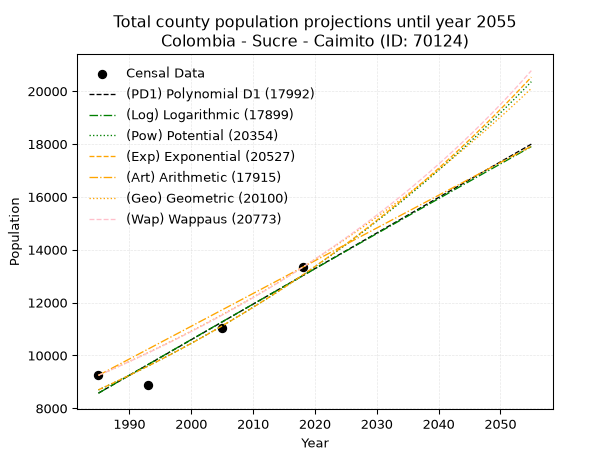
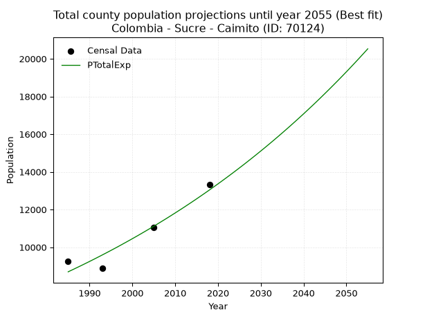
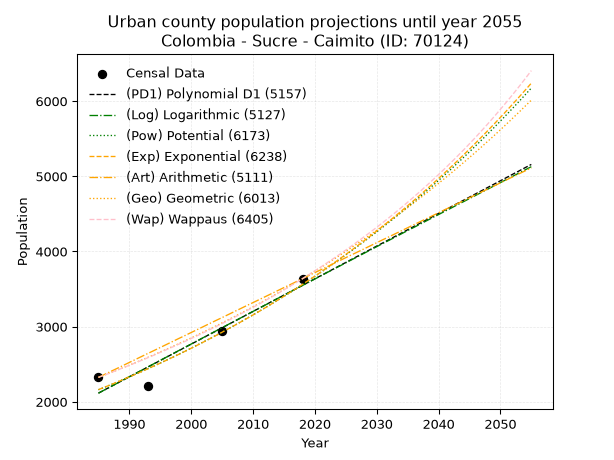
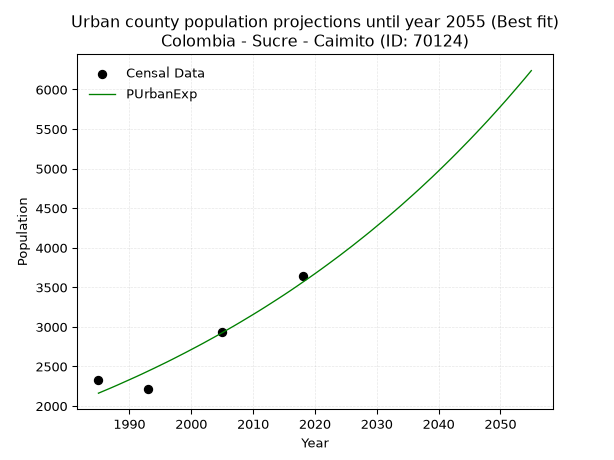
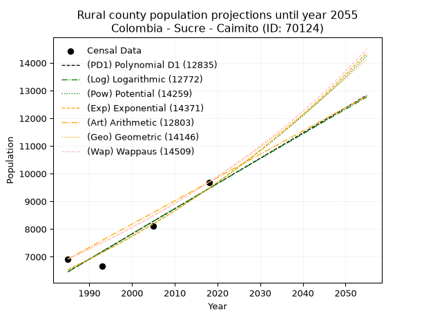
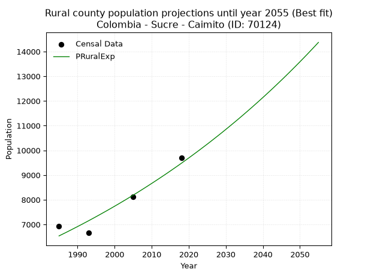

<div align="center">


</div>

# _“Population and Public Services Demand Projections (PPSD) until Year 2050 for Colombia - Sucre - Caimito (ID: 70124)”_
Keywords: `population` `public-service` `projection` `lineal` `polynomial` `logarithmic` `potential` `exponential` `arithmetic` `geometric` `wappaus` `dane` `colombia` `south-america`

PPSD are analytical estimates used by governments and planners to anticipate future changes in population size, age distribution, and the resulting community needs for utilities, healthcare, education, and infrastructure as sizing future water treatment facilities, electrical grids, and road networks based on spatial growth.

> **General running parameters**: • app_version: _v20260806_. • Python version: _3.14.7_. • Pandas version: _3.0.5_. • NumPy version: _2.5.1_. • Creates, save and include plots into reports (create_plot): _False_. • Projection until year: _2050_. • Process polynomial degree 2 and up: _False_. • Process Wappaus: _True_. • Process Wappaus: _True_. • Set negative values to zero: _True_. • Set infinite values to zero: _True_. • Drop dataset notes: _True_. 
<div align="center">

Dynamic map: [:earth_americas:Google](http://maps.google.com/maps?q=8.789323933,-75.1171408) [:earth_americas:OSM](https://www.openstreetmap.org/#map=18/8.789323933/-75.1171408&layers=P) [:earth_americas:Bing](https://www.bing.com/maps?cp=8.789323933~-75.1171408&lvl=18) [:earth_americas:Apple](https://maps.apple.com/frame?center=8.789323933%2C-75.1171408&span=0.003%2C0.006)

</div>


<div align="center">

```geojson
{
  "type": "Feature",
  "geometry": {
    "type": "Point", 
    "coordinates": [-75.1171408, 8.789323933]
  }, 
  "properties": {
    "Name": "Colombia - Sucre - Caimito (ID: 70124)"
  }
}
```

</div>


## 0. Census Data (4 records)

Census data are official statistics collected by a government about the people and housing in a country. They usually include counts of total population, age, sex, race, income, education, and jobs.

📅Global census file: [Population.xlsx](../data/Population.xlsx)

| Source   |   Year |   CountryID | CountryName   |   StateID | StateName   |   CountyID | CountyName   |   PTotal |   PUrban |   PRural |
|:---------|-------:|------------:|:--------------|----------:|:------------|-----------:|:-------------|---------:|---------:|---------:|
| DANE     |   1985 |          57 | Colombia      |        70 | Sucre       |      70124 | Caimito      |     9243 |     2324 |     6919 |
| DANE     |   1993 |          57 | Colombia      |        70 | Sucre       |      70124 | Caimito      |     8875 |     2210 |     6665 |
| DANE     |   2005 |          57 | Colombia      |        70 | Sucre       |      70124 | Caimito      |    11048 |     2938 |     8110 |
| DANE     |   2018 |          57 | Colombia      |        70 | Sucre       |      70124 | Caimito      |    13331 |     3638 |     9693 |

> 🔥Some records could had specific notes about the registered values or the corresponding urban or rural distribution.

## 1. Total

### 1.1. Coefficients and Parameters

* (PD1) Polynomial Deg 1: 134.57045363307748, -258550.29987956324 (lineal)
* (Log) Logarithmic: 269189.48762555304, -2035487.2025910018
* (Pow) Potential: 24.550121130812162, -77.02127973718841
* (Exp) Exponential: 0.012271984277257321, 2.2902843538106498e-07
* (Art) Arithmetic: Year diff. 2018 - 1985 = 33, Population diff. 13331 - 9243 = 4088, Annual growth = 123.87878787878788
* (Geo) Geometric: Year diff. 2018 - 1985 = 33, Population diff. 13331 - 9243 = 4088, Annual growth % = 0.01115955514699074
* (Wap) Wappaus: i = 1.0975351101159554, Condition values only valid for < 200)

<sub>
Wappaus condition values: ['0.00', '1.10', '2.20', '3.29', '4.39', '5.49', '6.59', '7.68', '8.78', '9.88', '10.98', '12.07', '13.17', '14.27', '15.37', '16.46', '17.56', '18.66', '19.76', '20.85', '21.95', '23.05', '24.15', '25.24', '26.34', '27.44', '28.54', '29.63', '30.73', '31.83', '32.93', '34.02', '35.12', '36.22', '37.32', '38.41', '39.51', '40.61', '41.71', '42.80', '43.90', '45.00', '46.10', '47.19', '48.29', '49.39', '50.49', '51.58', '52.68', '53.78', '54.88', '55.97', '57.07', '58.17', '59.27', '60.36', '61.46', '62.56', '63.66', '64.75', '65.85', '66.95', '68.05', '69.14', '70.24', '71.34']
</sub>


### 1.2. Projected Dataset

|   Year |   CountyID |   PTotalPD1 |   PTotalLog |   PTotalPow |   PTotalExp |   PTotalArt |   PTotalGeo |   PTotalWap |
|-------:|-----------:|------------:|------------:|------------:|------------:|------------:|------------:|------------:|
|   1985 |      70124 |        8572 |        8569 |        8692 |        8695 |        9243 |        9243 |        9243 |
|   1986 |      70124 |        8707 |        8705 |        8801 |        8802 |        9367 |        9346 |        9345 |
|   1987 |      70124 |        8841 |        8840 |        8910 |        8911 |        9491 |        9450 |        9448 |
|   1988 |      70124 |        8976 |        8976 |        9021 |        9021 |        9615 |        9556 |        9552 |
|   1989 |      70124 |        9110 |        9111 |        9133 |        9132 |        9739 |        9663 |        9658 |
|   1990 |      70124 |        9245 |        9247 |        9246 |        9245 |        9862 |        9770 |        9765 |
|   1991 |      70124 |        9379 |        9382 |        9361 |        9359 |        9986 |        9879 |        9872 |
|   1992 |      70124 |        9514 |        9517 |        9477 |        9475 |       10110 |        9990 |        9981 |
|   1993 |      70124 |        9649 |        9652 |        9595 |        9592 |       10234 |       10101 |       10092 |
|   1994 |      70124 |        9783 |        9787 |        9713 |        9710 |       10358 |       10214 |       10203 |
|   1995 |      70124 |        9918 |        9922 |        9834 |        9830 |       10482 |       10328 |       10316 |
|   1996 |      70124 |       10052 |       10057 |        9955 |        9951 |       10606 |       10443 |       10431 |
|   1997 |      70124 |       10187 |       10192 |       10079 |       10074 |       10730 |       10560 |       10546 |
|   1998 |      70124 |       10321 |       10327 |       10203 |       10199 |       10853 |       10677 |       10663 |
|   1999 |      70124 |       10456 |       10461 |       10329 |       10325 |       10977 |       10797 |       10781 |
|   2000 |      70124 |       10591 |       10596 |       10457 |       10452 |       11101 |       10917 |       10901 |
|   2001 |      70124 |       10725 |       10730 |       10586 |       10581 |       11225 |       11039 |       11022 |
|   2002 |      70124 |       10860 |       10865 |       10717 |       10712 |       11349 |       11162 |       11145 |
|   2003 |      70124 |       10994 |       10999 |       10849 |       10844 |       11473 |       11287 |       11269 |
|   2004 |      70124 |       11129 |       11134 |       10983 |       10978 |       11597 |       11413 |       11395 |
|   2005 |      70124 |       11263 |       11268 |       11118 |       11113 |       11721 |       11540 |       11522 |
|   2006 |      70124 |       11398 |       11402 |       11255 |       11251 |       11844 |       11669 |       11651 |
|   2007 |      70124 |       11533 |       11536 |       11394 |       11390 |       11968 |       11799 |       11781 |
|   2008 |      70124 |       11667 |       11670 |       11534 |       11530 |       12092 |       11931 |       11913 |
|   2009 |      70124 |       11802 |       11804 |       11676 |       11673 |       12216 |       12064 |       12047 |
|   2010 |      70124 |       11936 |       11938 |       11819 |       11817 |       12340 |       12198 |       12182 |
|   2011 |      70124 |       12071 |       12072 |       11964 |       11963 |       12464 |       12335 |       12320 |
|   2012 |      70124 |       12205 |       12206 |       12111 |       12110 |       12588 |       12472 |       12458 |
|   2013 |      70124 |       12340 |       12340 |       12260 |       12260 |       12712 |       12611 |       12599 |
|   2014 |      70124 |       12475 |       12474 |       12410 |       12411 |       12835 |       12752 |       12742 |
|   2015 |      70124 |       12609 |       12607 |       12562 |       12564 |       12959 |       12894 |       12886 |
|   2016 |      70124 |       12744 |       12741 |       12716 |       12720 |       13083 |       13038 |       13032 |
|   2017 |      70124 |       12878 |       12874 |       12872 |       12877 |       13207 |       13184 |       13181 |
|   2018 |      70124 |       13013 |       13008 |       13030 |       13036 |       13331 |       13331 |       13331 |
|   2019 |      70124 |       13147 |       13141 |       13189 |       13197 |       13455 |       13480 |       13483 |
|   2020 |      70124 |       13282 |       13274 |       13350 |       13360 |       13579 |       13630 |       13638 |
|   2021 |      70124 |       13417 |       13408 |       13514 |       13525 |       13703 |       13782 |       13794 |
|   2022 |      70124 |       13551 |       13541 |       13679 |       13692 |       13827 |       13936 |       13953 |
|   2023 |      70124 |       13686 |       13674 |       13846 |       13861 |       13950 |       14092 |       14114 |
|   2024 |      70124 |       13820 |       13807 |       14015 |       14032 |       14074 |       14249 |       14277 |
|   2025 |      70124 |       13955 |       13940 |       14186 |       14205 |       14198 |       14408 |       14442 |
|   2026 |      70124 |       14089 |       14073 |       14359 |       14380 |       14322 |       14569 |       14610 |
|   2027 |      70124 |       14224 |       14206 |       14534 |       14558 |       14446 |       14731 |       14780 |
|   2028 |      70124 |       14359 |       14338 |       14711 |       14738 |       14570 |       14896 |       14952 |
|   2029 |      70124 |       14493 |       14471 |       14890 |       14920 |       14694 |       15062 |       15127 |
|   2030 |      70124 |       14628 |       14604 |       15071 |       15104 |       14818 |       15230 |       15305 |
|   2031 |      70124 |       14762 |       14736 |       15255 |       15290 |       14941 |       15400 |       15485 |
|   2032 |      70124 |       14897 |       14869 |       15440 |       15479 |       15065 |       15572 |       15668 |
|   2033 |      70124 |       15031 |       15001 |       15628 |       15670 |       15189 |       15746 |       15854 |
|   2034 |      70124 |       15166 |       15134 |       15817 |       15864 |       15313 |       15921 |       16042 |
|   2035 |      70124 |       15301 |       15266 |       16009 |       16060 |       15437 |       16099 |       16233 |
|   2036 |      70124 |       15435 |       15398 |       16204 |       16258 |       15561 |       16279 |       16427 |
|   2037 |      70124 |       15570 |       15530 |       16400 |       16459 |       15685 |       16460 |       16625 |
|   2038 |      70124 |       15704 |       15662 |       16599 |       16662 |       15809 |       16644 |       16825 |
|   2039 |      70124 |       15839 |       15795 |       16800 |       16868 |       15932 |       16830 |       17028 |
|   2040 |      70124 |       15973 |       15926 |       17004 |       17076 |       16056 |       17018 |       17234 |
|   2041 |      70124 |       16108 |       16058 |       17209 |       17287 |       16180 |       17207 |       17444 |
|   2042 |      70124 |       16243 |       16190 |       17418 |       17500 |       16304 |       17399 |       17657 |
|   2043 |      70124 |       16377 |       16322 |       17628 |       17716 |       16428 |       17594 |       17874 |
|   2044 |      70124 |       16512 |       16454 |       17841 |       17935 |       16552 |       17790 |       18094 |
|   2045 |      70124 |       16646 |       16585 |       18057 |       18157 |       16676 |       17988 |       18318 |
|   2046 |      70124 |       16781 |       16717 |       18275 |       18381 |       16800 |       18189 |       18545 |
|   2047 |      70124 |       16915 |       16849 |       18495 |       18608 |       16923 |       18392 |       18776 |
|   2048 |      70124 |       17050 |       16980 |       18719 |       18837 |       17047 |       18597 |       19011 |
|   2049 |      70124 |       17185 |       17111 |       18944 |       19070 |       17171 |       18805 |       19250 |
|   2050 |      70124 |       17319 |       17243 |       19172 |       19306 |       17295 |       19015 |       19493 |
<div align="center">

</img>

</div>


### 1.3. Best fit with absolute and relative error (%)

Relative error puts that difference into context by dividing the absolute error by the true value, creating a unitless ratio or percentage that shows the scale of the mistake.

Absolute and relative error

|   Year | Source   |   CountryID | CountryName   |   StateID | StateName   |   CountyID_x | CountyName   |   PTotal |   PUrban |   PRural |   CountyID_y |   PTotalPD1 |   PTotalLog |   PTotalPow |   PTotalExp |   PTotalArt |   PTotalGeo |   PTotalWap |   PTotalPD1AbsError |   PTotalLogAbsError |   PTotalPowAbsError |   PTotalExpAbsError |   PTotalArtAbsError |   PTotalGeoAbsError |   PTotalWapAbsError |   PTotalPD1RelError |   PTotalLogRelError |   PTotalPowRelError |   PTotalExpRelError |   PTotalArtRelError |   PTotalGeoRelError |   PTotalWapRelError |
|-------:|:---------|------------:|:--------------|----------:|:------------|-------------:|:-------------|---------:|---------:|---------:|-------------:|------------:|------------:|------------:|------------:|------------:|------------:|------------:|--------------------:|--------------------:|--------------------:|--------------------:|--------------------:|--------------------:|--------------------:|--------------------:|--------------------:|--------------------:|--------------------:|--------------------:|--------------------:|--------------------:|
|   1985 | DANE     |          57 | Colombia      |        70 | Sucre       |        70124 | Caimito      |     9243 |     2324 |     6919 |        70124 |        8572 |        8569 |        8692 |        8695 |        9243 |        9243 |        9243 |                 671 |                 674 |                 551 |                 548 |                   0 |                   0 |                   0 |             7.25955 |             7.292   |            5.96127  |            5.92881  |              0      |             0       |             0       |
|   1993 | DANE     |          57 | Colombia      |        70 | Sucre       |        70124 | Caimito      |     8875 |     2210 |     6665 |        70124 |        9649 |        9652 |        9595 |        9592 |       10234 |       10101 |       10092 |                 774 |                 777 |                 720 |                 717 |                1359 |                1226 |                1217 |             8.72113 |             8.75493 |            8.11268  |            8.07887  |             15.3127 |            13.8141  |            13.7127  |
|   2005 | DANE     |          57 | Colombia      |        70 | Sucre       |        70124 | Caimito      |    11048 |     2938 |     8110 |        70124 |       11263 |       11268 |       11118 |       11113 |       11721 |       11540 |       11522 |                 215 |                 220 |                  70 |                  65 |                 673 |                 492 |                 474 |             1.94605 |             1.99131 |            0.633599 |            0.588342 |              6.0916 |             4.45329 |             4.29037 |
|   2018 | DANE     |          57 | Colombia      |        70 | Sucre       |        70124 | Caimito      |    13331 |     3638 |     9693 |        70124 |       13013 |       13008 |       13030 |       13036 |       13331 |       13331 |       13331 |                 318 |                 323 |                 301 |                 295 |                   0 |                   0 |                   0 |             2.38542 |             2.42292 |            2.2579   |            2.21289  |              0      |             0       |             0       |

Relative error mean

| Method    |   RelError | Best   |
|:----------|-----------:|:-------|
| PTotalPD1 |    5.07804 |        |
| PTotalLog |    5.11529 |        |
| PTotalPow |    4.24136 |        |
| PTotalExp |    4.20223 | True   |
| PTotalArt |    5.35107 |        |
| PTotalGeo |    4.56684 |        |
| PTotalWap |    4.50076 |        |

💙Best method: _**PTotalExp**_
<div align="center">

</img>

</div>


### 1.4. Fresh water supply demand in liters per capita per day (lpcd)

The fresh water supply demand typically ranges from 100 to 300 liters per capita per day (lpcd) for standard domestic and municipal planning, though absolute survival minimums set by the World Health Organization are as low as 7.5 to 20 liters per day, and total consumption in high-income nations can exceed 400 liters.

> `CZ`: Level in meters above the sea level (masl).<br> `WS`: Fresh water supply demand in liters per capita per day (lpcd or l/h/d).<br> `WSAll`: Zonal fresh water supply demand in liters per second (l/s).<br> `A`: Zonal area in square meters.

Reference values (RAS Colombia)

|    CZ |   WS |
|------:|-----:|
|  1000 |  120 |
|  2000 |  130 |
| 99999 |  140 |

County shapefile geometry properties and water supply values

|   CountyID |      ATotal |   CZTotal |   WSTotal |
|-----------:|------------:|----------:|----------:|
|      70124 | 4.12224e+08 |   26.3148 |       120 |

Projected values for best method: PTotalExp

|   CountyID |   Year |   PTotalExp |   WSTotal |   WSTotalAll |
|-----------:|-------:|------------:|----------:|-------------:|
|      70124 |   1985 |        8695 |       120 |      12.0764 |
|      70124 |   1986 |        8802 |       120 |      12.225  |
|      70124 |   1987 |        8911 |       120 |      12.3764 |
|      70124 |   1988 |        9021 |       120 |      12.5292 |
|      70124 |   1989 |        9132 |       120 |      12.6833 |
|      70124 |   1990 |        9245 |       120 |      12.8403 |
|      70124 |   1991 |        9359 |       120 |      12.9986 |
|      70124 |   1992 |        9475 |       120 |      13.1597 |
|      70124 |   1993 |        9592 |       120 |      13.3222 |
|      70124 |   1994 |        9710 |       120 |      13.4861 |
|      70124 |   1995 |        9830 |       120 |      13.6528 |
|      70124 |   1996 |        9951 |       120 |      13.8208 |
|      70124 |   1997 |       10074 |       120 |      13.9917 |
|      70124 |   1998 |       10199 |       120 |      14.1653 |
|      70124 |   1999 |       10325 |       120 |      14.3403 |
|      70124 |   2000 |       10452 |       120 |      14.5167 |
|      70124 |   2001 |       10581 |       120 |      14.6958 |
|      70124 |   2002 |       10712 |       120 |      14.8778 |
|      70124 |   2003 |       10844 |       120 |      15.0611 |
|      70124 |   2004 |       10978 |       120 |      15.2472 |
|      70124 |   2005 |       11113 |       120 |      15.4347 |
|      70124 |   2006 |       11251 |       120 |      15.6264 |
|      70124 |   2007 |       11390 |       120 |      15.8194 |
|      70124 |   2008 |       11530 |       120 |      16.0139 |
|      70124 |   2009 |       11673 |       120 |      16.2125 |
|      70124 |   2010 |       11817 |       120 |      16.4125 |
|      70124 |   2011 |       11963 |       120 |      16.6153 |
|      70124 |   2012 |       12110 |       120 |      16.8194 |
|      70124 |   2013 |       12260 |       120 |      17.0278 |
|      70124 |   2014 |       12411 |       120 |      17.2375 |
|      70124 |   2015 |       12564 |       120 |      17.45   |
|      70124 |   2016 |       12720 |       120 |      17.6667 |
|      70124 |   2017 |       12877 |       120 |      17.8847 |
|      70124 |   2018 |       13036 |       120 |      18.1056 |
|      70124 |   2019 |       13197 |       120 |      18.3292 |
|      70124 |   2020 |       13360 |       120 |      18.5556 |
|      70124 |   2021 |       13525 |       120 |      18.7847 |
|      70124 |   2022 |       13692 |       120 |      19.0167 |
|      70124 |   2023 |       13861 |       120 |      19.2514 |
|      70124 |   2024 |       14032 |       120 |      19.4889 |
|      70124 |   2025 |       14205 |       120 |      19.7292 |
|      70124 |   2026 |       14380 |       120 |      19.9722 |
|      70124 |   2027 |       14558 |       120 |      20.2194 |
|      70124 |   2028 |       14738 |       120 |      20.4694 |
|      70124 |   2029 |       14920 |       120 |      20.7222 |
|      70124 |   2030 |       15104 |       120 |      20.9778 |
|      70124 |   2031 |       15290 |       120 |      21.2361 |
|      70124 |   2032 |       15479 |       120 |      21.4986 |
|      70124 |   2033 |       15670 |       120 |      21.7639 |
|      70124 |   2034 |       15864 |       120 |      22.0333 |
|      70124 |   2035 |       16060 |       120 |      22.3056 |
|      70124 |   2036 |       16258 |       120 |      22.5806 |
|      70124 |   2037 |       16459 |       120 |      22.8597 |
|      70124 |   2038 |       16662 |       120 |      23.1417 |
|      70124 |   2039 |       16868 |       120 |      23.4278 |
|      70124 |   2040 |       17076 |       120 |      23.7167 |
|      70124 |   2041 |       17287 |       120 |      24.0097 |
|      70124 |   2042 |       17500 |       120 |      24.3056 |
|      70124 |   2043 |       17716 |       120 |      24.6056 |
|      70124 |   2044 |       17935 |       120 |      24.9097 |
|      70124 |   2045 |       18157 |       120 |      25.2181 |
|      70124 |   2046 |       18381 |       120 |      25.5292 |
|      70124 |   2047 |       18608 |       120 |      25.8444 |
|      70124 |   2048 |       18837 |       120 |      26.1625 |
|      70124 |   2049 |       19070 |       120 |      26.4861 |
|      70124 |   2050 |       19306 |       120 |      26.8139 |

## 2. Urban

### 2.1. Coefficients and Parameters

* (PD1) Polynomial Deg 1: 43.462866318747, -84159.09835407369 (lineal)
* (Log) Logarithmic: 86945.94418006227, -658099.3184537232
* (Pow) Potential: 30.303624591304, -96.59967719595156
* (Exp) Exponential: 0.0151470128604428, 1.8910932725419618e-10
* (Art) Arithmetic: Year diff. 2018 - 1985 = 33, Population diff. 3638 - 2324 = 1314, Annual growth = 39.81818181818182
* (Geo) Geometric: Year diff. 2018 - 1985 = 33, Population diff. 3638 - 2324 = 1314, Annual growth % = 0.013672757292265247
* (Wap) Wappaus: i = 1.3357323655881186, Condition values only valid for < 200)

<sub>
Wappaus condition values: ['0.00', '1.34', '2.67', '4.01', '5.34', '6.68', '8.01', '9.35', '10.69', '12.02', '13.36', '14.69', '16.03', '17.36', '18.70', '20.04', '21.37', '22.71', '24.04', '25.38', '26.71', '28.05', '29.39', '30.72', '32.06', '33.39', '34.73', '36.06', '37.40', '38.74', '40.07', '41.41', '42.74', '44.08', '45.41', '46.75', '48.09', '49.42', '50.76', '52.09', '53.43', '54.77', '56.10', '57.44', '58.77', '60.11', '61.44', '62.78', '64.12', '65.45', '66.79', '68.12', '69.46', '70.79', '72.13', '73.47', '74.80', '76.14', '77.47', '78.81', '80.14', '81.48', '82.82', '84.15', '85.49', '86.82']
</sub>


### 2.2. Projected Dataset

|   Year |   CountyID |   PUrbanPD1 |   PUrbanLog |   PUrbanPow |   PUrbanExp |   PUrbanArt |   PUrbanGeo |   PUrbanWap |
|-------:|-----------:|------------:|------------:|------------:|------------:|------------:|------------:|------------:|
|   1985 |      70124 |        2115 |        2114 |        2160 |        2161 |        2324 |        2324 |        2324 |
|   1986 |      70124 |        2158 |        2158 |        2193 |        2194 |        2364 |        2356 |        2355 |
|   1987 |      70124 |        2202 |        2201 |        2227 |        2227 |        2404 |        2388 |        2387 |
|   1988 |      70124 |        2245 |        2245 |        2261 |        2261 |        2443 |        2421 |        2419 |
|   1989 |      70124 |        2289 |        2289 |        2296 |        2296 |        2483 |        2454 |        2452 |
|   1990 |      70124 |        2332 |        2333 |        2331 |        2331 |        2523 |        2487 |        2485 |
|   1991 |      70124 |        2375 |        2376 |        2367 |        2366 |        2563 |        2521 |        2518 |
|   1992 |      70124 |        2419 |        2420 |        2403 |        2402 |        2603 |        2556 |        2552 |
|   1993 |      70124 |        2462 |        2463 |        2440 |        2439 |        2643 |        2591 |        2586 |
|   1994 |      70124 |        2506 |        2507 |        2477 |        2476 |        2682 |        2626 |        2621 |
|   1995 |      70124 |        2549 |        2551 |        2515 |        2514 |        2722 |        2662 |        2657 |
|   1996 |      70124 |        2593 |        2594 |        2554 |        2552 |        2762 |        2698 |        2693 |
|   1997 |      70124 |        2636 |        2638 |        2593 |        2591 |        2802 |        2735 |        2729 |
|   1998 |      70124 |        2680 |        2681 |        2632 |        2631 |        2842 |        2773 |        2766 |
|   1999 |      70124 |        2723 |        2725 |        2672 |        2671 |        2881 |        2811 |        2803 |
|   2000 |      70124 |        2767 |        2768 |        2713 |        2712 |        2921 |        2849 |        2841 |
|   2001 |      70124 |        2810 |        2812 |        2755 |        2753 |        2961 |        2888 |        2880 |
|   2002 |      70124 |        2854 |        2855 |        2797 |        2795 |        3001 |        2928 |        2919 |
|   2003 |      70124 |        2897 |        2899 |        2839 |        2838 |        3041 |        2968 |        2959 |
|   2004 |      70124 |        2940 |        2942 |        2883 |        2881 |        3081 |        3008 |        3000 |
|   2005 |      70124 |        2984 |        2985 |        2927 |        2925 |        3120 |        3049 |        3041 |
|   2006 |      70124 |        3027 |        3029 |        2971 |        2970 |        3160 |        3091 |        3082 |
|   2007 |      70124 |        3071 |        3072 |        3016 |        3015 |        3200 |        3133 |        3125 |
|   2008 |      70124 |        3114 |        3115 |        3062 |        3061 |        3240 |        3176 |        3168 |
|   2009 |      70124 |        3158 |        3159 |        3109 |        3108 |        3280 |        3219 |        3211 |
|   2010 |      70124 |        3201 |        3202 |        3156 |        3155 |        3319 |        3263 |        3256 |
|   2011 |      70124 |        3245 |        3245 |        3204 |        3203 |        3359 |        3308 |        3301 |
|   2012 |      70124 |        3288 |        3288 |        3253 |        3252 |        3399 |        3353 |        3347 |
|   2013 |      70124 |        3332 |        3332 |        3302 |        3302 |        3439 |        3399 |        3393 |
|   2014 |      70124 |        3375 |        3375 |        3352 |        3352 |        3479 |        3446 |        3440 |
|   2015 |      70124 |        3419 |        3418 |        3403 |        3403 |        3519 |        3493 |        3489 |
|   2016 |      70124 |        3462 |        3461 |        3454 |        3455 |        3558 |        3541 |        3538 |
|   2017 |      70124 |        3506 |        3504 |        3507 |        3508 |        3598 |        3589 |        3587 |
|   2018 |      70124 |        3549 |        3547 |        3560 |        3562 |        3638 |        3638 |        3638 |
|   2019 |      70124 |        3592 |        3590 |        3614 |        3616 |        3678 |        3688 |        3690 |
|   2020 |      70124 |        3636 |        3633 |        3668 |        3671 |        3718 |        3738 |        3742 |
|   2021 |      70124 |        3679 |        3676 |        3724 |        3727 |        3757 |        3789 |        3795 |
|   2022 |      70124 |        3723 |        3720 |        3780 |        3784 |        3797 |        3841 |        3850 |
|   2023 |      70124 |        3766 |        3762 |        3837 |        3842 |        3837 |        3894 |        3905 |
|   2024 |      70124 |        3810 |        3805 |        3895 |        3900 |        3877 |        3947 |        3961 |
|   2025 |      70124 |        3853 |        3848 |        3954 |        3960 |        3917 |        4001 |        4018 |
|   2026 |      70124 |        3897 |        3891 |        4013 |        4020 |        3957 |        4056 |        4077 |
|   2027 |      70124 |        3940 |        3934 |        4074 |        4082 |        3996 |        4111 |        4136 |
|   2028 |      70124 |        3984 |        3977 |        4135 |        4144 |        4036 |        4167 |        4197 |
|   2029 |      70124 |        4027 |        4020 |        4197 |        4207 |        4076 |        4224 |        4258 |
|   2030 |      70124 |        4071 |        4063 |        4260 |        4272 |        4116 |        4282 |        4321 |
|   2031 |      70124 |        4114 |        4106 |        4324 |        4337 |        4156 |        4340 |        4385 |
|   2032 |      70124 |        4157 |        4148 |        4389 |        4403 |        4195 |        4400 |        4450 |
|   2033 |      70124 |        4201 |        4191 |        4455 |        4470 |        4235 |        4460 |        4517 |
|   2034 |      70124 |        4244 |        4234 |        4522 |        4538 |        4275 |        4521 |        4585 |
|   2035 |      70124 |        4288 |        4277 |        4590 |        4608 |        4315 |        4583 |        4654 |
|   2036 |      70124 |        4331 |        4319 |        4659 |        4678 |        4355 |        4645 |        4725 |
|   2037 |      70124 |        4375 |        4362 |        4729 |        4749 |        4395 |        4709 |        4797 |
|   2038 |      70124 |        4418 |        4405 |        4800 |        4822 |        4434 |        4773 |        4871 |
|   2039 |      70124 |        4462 |        4447 |        4871 |        4895 |        4474 |        4839 |        4946 |
|   2040 |      70124 |        4505 |        4490 |        4944 |        4970 |        4514 |        4905 |        5023 |
|   2041 |      70124 |        4549 |        4533 |        5018 |        5046 |        4554 |        4972 |        5101 |
|   2042 |      70124 |        4592 |        4575 |        5093 |        5123 |        4594 |        5040 |        5181 |
|   2043 |      70124 |        4636 |        4618 |        5170 |        5201 |        4633 |        5109 |        5263 |
|   2044 |      70124 |        4679 |        4660 |        5247 |        5281 |        4673 |        5179 |        5346 |
|   2045 |      70124 |        4722 |        4703 |        5325 |        5361 |        4713 |        5249 |        5432 |
|   2046 |      70124 |        4766 |        4745 |        5405 |        5443 |        4753 |        5321 |        5519 |
|   2047 |      70124 |        4809 |        4788 |        5485 |        5526 |        4793 |        5394 |        5609 |
|   2048 |      70124 |        4853 |        4830 |        5567 |        5610 |        4833 |        5468 |        5700 |
|   2049 |      70124 |        4896 |        4873 |        5650 |        5696 |        4872 |        5542 |        5794 |
|   2050 |      70124 |        4940 |        4915 |        5734 |        5783 |        4912 |        5618 |        5890 |
<div align="center">

</img>

</div>


### 2.3. Best fit with absolute and relative error (%)

Relative error puts that difference into context by dividing the absolute error by the true value, creating a unitless ratio or percentage that shows the scale of the mistake.

Absolute and relative error

|   Year | Source   |   CountryID | CountryName   |   StateID | StateName   |   CountyID_x | CountyName   |   PTotal |   PUrban |   PRural |   CountyID_y |   PUrbanPD1 |   PUrbanLog |   PUrbanPow |   PUrbanExp |   PUrbanArt |   PUrbanGeo |   PUrbanWap |   PUrbanPD1AbsError |   PUrbanLogAbsError |   PUrbanPowAbsError |   PUrbanExpAbsError |   PUrbanArtAbsError |   PUrbanGeoAbsError |   PUrbanWapAbsError |   PUrbanPD1RelError |   PUrbanLogRelError |   PUrbanPowRelError |   PUrbanExpRelError |   PUrbanArtRelError |   PUrbanGeoRelError |   PUrbanWapRelError |
|-------:|:---------|------------:|:--------------|----------:|:------------|-------------:|:-------------|---------:|---------:|---------:|-------------:|------------:|------------:|------------:|------------:|------------:|------------:|------------:|--------------------:|--------------------:|--------------------:|--------------------:|--------------------:|--------------------:|--------------------:|--------------------:|--------------------:|--------------------:|--------------------:|--------------------:|--------------------:|--------------------:|
|   1985 | DANE     |          57 | Colombia      |        70 | Sucre       |        70124 | Caimito      |     9243 |     2324 |     6919 |        70124 |        2115 |        2114 |        2160 |        2161 |        2324 |        2324 |        2324 |                 209 |                 210 |                 164 |                 163 |                   0 |                   0 |                   0 |             8.99312 |             9.03614 |            7.0568   |            7.01377  |             0       |             0       |             0       |
|   1993 | DANE     |          57 | Colombia      |        70 | Sucre       |        70124 | Caimito      |     8875 |     2210 |     6665 |        70124 |        2462 |        2463 |        2440 |        2439 |        2643 |        2591 |        2586 |                 252 |                 253 |                 230 |                 229 |                 433 |                 381 |                 376 |            11.4027  |            11.448   |           10.4072   |           10.362    |            19.5928  |            17.2398  |            17.0136  |
|   2005 | DANE     |          57 | Colombia      |        70 | Sucre       |        70124 | Caimito      |    11048 |     2938 |     8110 |        70124 |        2984 |        2985 |        2927 |        2925 |        3120 |        3049 |        3041 |                  46 |                  47 |                  11 |                  13 |                 182 |                 111 |                 103 |             1.56569 |             1.59973 |            0.374404 |            0.442478 |             6.19469 |             3.77808 |             3.50579 |
|   2018 | DANE     |          57 | Colombia      |        70 | Sucre       |        70124 | Caimito      |    13331 |     3638 |     9693 |        70124 |        3549 |        3547 |        3560 |        3562 |        3638 |        3638 |        3638 |                  89 |                  91 |                  78 |                  76 |                   0 |                   0 |                   0 |             2.4464  |             2.50137 |            2.14404  |            2.08906  |             0       |             0       |             0       |

Relative error mean

| Method    |   RelError | Best   |
|:----------|-----------:|:-------|
| PUrbanPD1 |    6.10198 |        |
| PUrbanLog |    6.1463  |        |
| PUrbanPow |    4.99562 |        |
| PUrbanExp |    4.97682 | True   |
| PUrbanArt |    6.44686 |        |
| PUrbanGeo |    5.25447 |        |
| PUrbanWap |    5.12984 |        |

💙Best method: _**PUrbanExp**_
<div align="center">

</img>

</div>


### 2.4. Fresh water supply demand in liters per capita per day (lpcd)

The fresh water supply demand typically ranges from 100 to 300 liters per capita per day (lpcd) for standard domestic and municipal planning, though absolute survival minimums set by the World Health Organization are as low as 7.5 to 20 liters per day, and total consumption in high-income nations can exceed 400 liters.

> `CZ`: Level in meters above the sea level (masl).<br> `WS`: Fresh water supply demand in liters per capita per day (lpcd or l/h/d).<br> `WSAll`: Zonal fresh water supply demand in liters per second (l/s).<br> `A`: Zonal area in square meters.

Reference values (RAS Colombia)

|    CZ |   WS |
|------:|-----:|
|  1000 |  120 |
|  2000 |  130 |
| 99999 |  140 |

County shapefile geometry properties and water supply values

|   CountyID |      AUrban |   CZUrban |   WSUrban |
|-----------:|------------:|----------:|----------:|
|      70124 | 1.00459e+06 |   26.1264 |       120 |

Projected values for best method: PUrbanExp

|   CountyID |   Year |   PUrbanExp |   WSUrban |   WSUrbanAll |
|-----------:|-------:|------------:|----------:|-------------:|
|      70124 |   1985 |        2161 |       120 |      3.00139 |
|      70124 |   1986 |        2194 |       120 |      3.04722 |
|      70124 |   1987 |        2227 |       120 |      3.09306 |
|      70124 |   1988 |        2261 |       120 |      3.14028 |
|      70124 |   1989 |        2296 |       120 |      3.18889 |
|      70124 |   1990 |        2331 |       120 |      3.2375  |
|      70124 |   1991 |        2366 |       120 |      3.28611 |
|      70124 |   1992 |        2402 |       120 |      3.33611 |
|      70124 |   1993 |        2439 |       120 |      3.3875  |
|      70124 |   1994 |        2476 |       120 |      3.43889 |
|      70124 |   1995 |        2514 |       120 |      3.49167 |
|      70124 |   1996 |        2552 |       120 |      3.54444 |
|      70124 |   1997 |        2591 |       120 |      3.59861 |
|      70124 |   1998 |        2631 |       120 |      3.65417 |
|      70124 |   1999 |        2671 |       120 |      3.70972 |
|      70124 |   2000 |        2712 |       120 |      3.76667 |
|      70124 |   2001 |        2753 |       120 |      3.82361 |
|      70124 |   2002 |        2795 |       120 |      3.88194 |
|      70124 |   2003 |        2838 |       120 |      3.94167 |
|      70124 |   2004 |        2881 |       120 |      4.00139 |
|      70124 |   2005 |        2925 |       120 |      4.0625  |
|      70124 |   2006 |        2970 |       120 |      4.125   |
|      70124 |   2007 |        3015 |       120 |      4.1875  |
|      70124 |   2008 |        3061 |       120 |      4.25139 |
|      70124 |   2009 |        3108 |       120 |      4.31667 |
|      70124 |   2010 |        3155 |       120 |      4.38194 |
|      70124 |   2011 |        3203 |       120 |      4.44861 |
|      70124 |   2012 |        3252 |       120 |      4.51667 |
|      70124 |   2013 |        3302 |       120 |      4.58611 |
|      70124 |   2014 |        3352 |       120 |      4.65556 |
|      70124 |   2015 |        3403 |       120 |      4.72639 |
|      70124 |   2016 |        3455 |       120 |      4.79861 |
|      70124 |   2017 |        3508 |       120 |      4.87222 |
|      70124 |   2018 |        3562 |       120 |      4.94722 |
|      70124 |   2019 |        3616 |       120 |      5.02222 |
|      70124 |   2020 |        3671 |       120 |      5.09861 |
|      70124 |   2021 |        3727 |       120 |      5.17639 |
|      70124 |   2022 |        3784 |       120 |      5.25556 |
|      70124 |   2023 |        3842 |       120 |      5.33611 |
|      70124 |   2024 |        3900 |       120 |      5.41667 |
|      70124 |   2025 |        3960 |       120 |      5.5     |
|      70124 |   2026 |        4020 |       120 |      5.58333 |
|      70124 |   2027 |        4082 |       120 |      5.66944 |
|      70124 |   2028 |        4144 |       120 |      5.75556 |
|      70124 |   2029 |        4207 |       120 |      5.84306 |
|      70124 |   2030 |        4272 |       120 |      5.93333 |
|      70124 |   2031 |        4337 |       120 |      6.02361 |
|      70124 |   2032 |        4403 |       120 |      6.11528 |
|      70124 |   2033 |        4470 |       120 |      6.20833 |
|      70124 |   2034 |        4538 |       120 |      6.30278 |
|      70124 |   2035 |        4608 |       120 |      6.4     |
|      70124 |   2036 |        4678 |       120 |      6.49722 |
|      70124 |   2037 |        4749 |       120 |      6.59583 |
|      70124 |   2038 |        4822 |       120 |      6.69722 |
|      70124 |   2039 |        4895 |       120 |      6.79861 |
|      70124 |   2040 |        4970 |       120 |      6.90278 |
|      70124 |   2041 |        5046 |       120 |      7.00833 |
|      70124 |   2042 |        5123 |       120 |      7.11528 |
|      70124 |   2043 |        5201 |       120 |      7.22361 |
|      70124 |   2044 |        5281 |       120 |      7.33472 |
|      70124 |   2045 |        5361 |       120 |      7.44583 |
|      70124 |   2046 |        5443 |       120 |      7.55972 |
|      70124 |   2047 |        5526 |       120 |      7.675   |
|      70124 |   2048 |        5610 |       120 |      7.79167 |
|      70124 |   2049 |        5696 |       120 |      7.91111 |
|      70124 |   2050 |        5783 |       120 |      8.03194 |

## 3. Rural

### 3.1. Coefficients and Parameters

* (PD1) Polynomial Deg 1: 91.10758731433052, -174391.20152548963 (lineal)
* (Log) Logarithmic: 182243.54344549068, -1377387.884137278
* (Pow) Potential: 22.517021303509306, -70.44056431210018
* (Exp) Exponential: 0.011256028429889861, 1.2934405124771152e-06
* (Art) Arithmetic: Year diff. 2018 - 1985 = 33, Population diff. 9693 - 6919 = 2774, Annual growth = 84.06060606060606
* (Geo) Geometric: Year diff. 2018 - 1985 = 33, Population diff. 9693 - 6919 = 2774, Annual growth % = 0.010268506136286382
* (Wap) Wappaus: i = 1.0120467861859628, Condition values only valid for < 200)

<sub>
Wappaus condition values: ['0.00', '1.01', '2.02', '3.04', '4.05', '5.06', '6.07', '7.08', '8.10', '9.11', '10.12', '11.13', '12.14', '13.16', '14.17', '15.18', '16.19', '17.20', '18.22', '19.23', '20.24', '21.25', '22.27', '23.28', '24.29', '25.30', '26.31', '27.33', '28.34', '29.35', '30.36', '31.37', '32.39', '33.40', '34.41', '35.42', '36.43', '37.45', '38.46', '39.47', '40.48', '41.49', '42.51', '43.52', '44.53', '45.54', '46.55', '47.57', '48.58', '49.59', '50.60', '51.61', '52.63', '53.64', '54.65', '55.66', '56.67', '57.69', '58.70', '59.71', '60.72', '61.73', '62.75', '63.76', '64.77', '65.78']
</sub>


### 3.2. Projected Dataset

|   Year |   CountyID |   PRuralPD1 |   PRuralLog |   PRuralPow |   PRuralExp |   PRuralArt |   PRuralGeo |   PRuralWap |
|-------:|-----------:|------------:|------------:|------------:|------------:|------------:|------------:|------------:|
|   1985 |      70124 |        6457 |        6456 |        6534 |        6536 |        6919 |        6919 |        6919 |
|   1986 |      70124 |        6548 |        6547 |        6609 |        6610 |        7003 |        6990 |        6989 |
|   1987 |      70124 |        6640 |        6639 |        6684 |        6684 |        7087 |        7062 |        7060 |
|   1988 |      70124 |        6731 |        6731 |        6760 |        6760 |        7171 |        7134 |        7132 |
|   1989 |      70124 |        6822 |        6822 |        6837 |        6837 |        7255 |        7208 |        7205 |
|   1990 |      70124 |        6913 |        6914 |        6915 |        6914 |        7339 |        7282 |        7278 |
|   1991 |      70124 |        7004 |        7006 |        6993 |        6992 |        7423 |        7356 |        7352 |
|   1992 |      70124 |        7095 |        7097 |        7073 |        7071 |        7507 |        7432 |        7427 |
|   1993 |      70124 |        7186 |        7189 |        7153 |        7151 |        7591 |        7508 |        7503 |
|   1994 |      70124 |        7277 |        7280 |        7235 |        7232 |        7676 |        7585 |        7579 |
|   1995 |      70124 |        7368 |        7371 |        7317 |        7314 |        7760 |        7663 |        7657 |
|   1996 |      70124 |        7460 |        7463 |        7400 |        7397 |        7844 |        7742 |        7735 |
|   1997 |      70124 |        7551 |        7554 |        7484 |        7481 |        7928 |        7821 |        7814 |
|   1998 |      70124 |        7642 |        7645 |        7569 |        7565 |        8012 |        7902 |        7893 |
|   1999 |      70124 |        7733 |        7736 |        7654 |        7651 |        8096 |        7983 |        7974 |
|   2000 |      70124 |        7824 |        7828 |        7741 |        7738 |        8180 |        8065 |        8056 |
|   2001 |      70124 |        7915 |        7919 |        7829 |        7825 |        8264 |        8148 |        8138 |
|   2002 |      70124 |        8006 |        8010 |        7917 |        7914 |        8348 |        8231 |        8221 |
|   2003 |      70124 |        8097 |        8101 |        8007 |        8003 |        8432 |        8316 |        8306 |
|   2004 |      70124 |        8188 |        8192 |        8097 |        8094 |        8516 |        8401 |        8391 |
|   2005 |      70124 |        8280 |        8283 |        8189 |        8186 |        8600 |        8487 |        8477 |
|   2006 |      70124 |        8371 |        8373 |        8281 |        8278 |        8684 |        8575 |        8564 |
|   2007 |      70124 |        8462 |        8464 |        8375 |        8372 |        8768 |        8663 |        8652 |
|   2008 |      70124 |        8553 |        8555 |        8469 |        8467 |        8852 |        8752 |        8742 |
|   2009 |      70124 |        8644 |        8646 |        8565 |        8563 |        8936 |        8842 |        8832 |
|   2010 |      70124 |        8735 |        8736 |        8661 |        8660 |        9021 |        8932 |        8923 |
|   2011 |      70124 |        8826 |        8827 |        8759 |        8758 |        9105 |        9024 |        9015 |
|   2012 |      70124 |        8917 |        8918 |        8857 |        8857 |        9189 |        9117 |        9109 |
|   2013 |      70124 |        9008 |        9008 |        8957 |        8957 |        9273 |        9210 |        9203 |
|   2014 |      70124 |        9099 |        9099 |        9058 |        9058 |        9357 |        9305 |        9299 |
|   2015 |      70124 |        9191 |        9189 |        9159 |        9161 |        9441 |        9400 |        9396 |
|   2016 |      70124 |        9282 |        9280 |        9262 |        9265 |        9525 |        9497 |        9494 |
|   2017 |      70124 |        9373 |        9370 |        9366 |        9369 |        9609 |        9594 |        9593 |
|   2018 |      70124 |        9464 |        9460 |        9471 |        9475 |        9693 |        9693 |        9693 |
|   2019 |      70124 |        9555 |        9551 |        9578 |        9583 |        9777 |        9793 |        9795 |
|   2020 |      70124 |        9646 |        9641 |        9685 |        9691 |        9861 |        9893 |        9897 |
|   2021 |      70124 |        9737 |        9731 |        9794 |        9801 |        9945 |        9995 |       10001 |
|   2022 |      70124 |        9828 |        9821 |        9903 |        9912 |       10029 |       10097 |       10107 |
|   2023 |      70124 |        9919 |        9911 |       10014 |       10024 |       10113 |       10201 |       10213 |
|   2024 |      70124 |       10011 |       10001 |       10126 |       10138 |       10197 |       10306 |       10321 |
|   2025 |      70124 |       10102 |       10091 |       10239 |       10252 |       10281 |       10412 |       10431 |
|   2026 |      70124 |       10193 |       10181 |       10354 |       10368 |       10365 |       10518 |       10542 |
|   2027 |      70124 |       10284 |       10271 |       10470 |       10486 |       10450 |       10626 |       10654 |
|   2028 |      70124 |       10375 |       10361 |       10587 |       10604 |       10534 |       10736 |       10767 |
|   2029 |      70124 |       10466 |       10451 |       10705 |       10724 |       10618 |       10846 |       10883 |
|   2030 |      70124 |       10557 |       10541 |       10824 |       10846 |       10702 |       10957 |       10999 |
|   2031 |      70124 |       10648 |       10631 |       10945 |       10969 |       10786 |       11070 |       11117 |
|   2032 |      70124 |       10739 |       10720 |       11067 |       11093 |       10870 |       11183 |       11237 |
|   2033 |      70124 |       10831 |       10810 |       11190 |       11218 |       10954 |       11298 |       11358 |
|   2034 |      70124 |       10922 |       10900 |       11315 |       11345 |       11038 |       11414 |       11481 |
|   2035 |      70124 |       11013 |       10989 |       11441 |       11474 |       11122 |       11531 |       11606 |
|   2036 |      70124 |       11104 |       11079 |       11568 |       11604 |       11206 |       11650 |       11732 |
|   2037 |      70124 |       11195 |       11168 |       11697 |       11735 |       11290 |       11769 |       11860 |
|   2038 |      70124 |       11286 |       11258 |       11827 |       11868 |       11374 |       11890 |       11990 |
|   2039 |      70124 |       11377 |       11347 |       11958 |       12002 |       11458 |       12012 |       12122 |
|   2040 |      70124 |       11468 |       11436 |       12091 |       12138 |       11542 |       12136 |       12256 |
|   2041 |      70124 |       11559 |       11526 |       12225 |       12275 |       11626 |       12260 |       12391 |
|   2042 |      70124 |       11650 |       11615 |       12360 |       12414 |       11710 |       12386 |       12528 |
|   2043 |      70124 |       11742 |       11704 |       12497 |       12555 |       11795 |       12513 |       12668 |
|   2044 |      70124 |       11833 |       11793 |       12636 |       12697 |       11879 |       12642 |       12809 |
|   2045 |      70124 |       11924 |       11883 |       12776 |       12841 |       11963 |       12772 |       12952 |
|   2046 |      70124 |       12015 |       11972 |       12917 |       12986 |       12047 |       12903 |       13098 |
|   2047 |      70124 |       12106 |       12061 |       13060 |       13133 |       12131 |       13035 |       13245 |
|   2048 |      70124 |       12197 |       12150 |       13205 |       13282 |       12215 |       13169 |       13395 |
|   2049 |      70124 |       12288 |       12239 |       13350 |       13432 |       12299 |       13305 |       13547 |
|   2050 |      70124 |       12379 |       12328 |       13498 |       13584 |       12383 |       13441 |       13701 |
<div align="center">

</img>

</div>


### 3.3. Best fit with absolute and relative error (%)

Relative error puts that difference into context by dividing the absolute error by the true value, creating a unitless ratio or percentage that shows the scale of the mistake.

Absolute and relative error

|   Year | Source   |   CountryID | CountryName   |   StateID | StateName   |   CountyID_x | CountyName   |   PTotal |   PUrban |   PRural |   CountyID_y |   PRuralPD1 |   PRuralLog |   PRuralPow |   PRuralExp |   PRuralArt |   PRuralGeo |   PRuralWap |   PRuralPD1AbsError |   PRuralLogAbsError |   PRuralPowAbsError |   PRuralExpAbsError |   PRuralArtAbsError |   PRuralGeoAbsError |   PRuralWapAbsError |   PRuralPD1RelError |   PRuralLogRelError |   PRuralPowRelError |   PRuralExpRelError |   PRuralArtRelError |   PRuralGeoRelError |   PRuralWapRelError |
|-------:|:---------|------------:|:--------------|----------:|:------------|-------------:|:-------------|---------:|---------:|---------:|-------------:|------------:|------------:|------------:|------------:|------------:|------------:|------------:|--------------------:|--------------------:|--------------------:|--------------------:|--------------------:|--------------------:|--------------------:|--------------------:|--------------------:|--------------------:|--------------------:|--------------------:|--------------------:|--------------------:|
|   1985 | DANE     |          57 | Colombia      |        70 | Sucre       |        70124 | Caimito      |     9243 |     2324 |     6919 |        70124 |        6457 |        6456 |        6534 |        6536 |        6919 |        6919 |        6919 |                 462 |                 463 |                 385 |                 383 |                   0 |                   0 |                   0 |             6.67727 |             6.69172 |            5.56439  |            5.53548  |             0       |             0       |             0       |
|   1993 | DANE     |          57 | Colombia      |        70 | Sucre       |        70124 | Caimito      |     8875 |     2210 |     6665 |        70124 |        7186 |        7189 |        7153 |        7151 |        7591 |        7508 |        7503 |                 521 |                 524 |                 488 |                 486 |                 926 |                 843 |                 838 |             7.81695 |             7.86197 |            7.32183  |            7.29182  |            13.8935  |            12.6482  |            12.5731  |
|   2005 | DANE     |          57 | Colombia      |        70 | Sucre       |        70124 | Caimito      |    11048 |     2938 |     8110 |        70124 |        8280 |        8283 |        8189 |        8186 |        8600 |        8487 |        8477 |                 170 |                 173 |                  79 |                  76 |                 490 |                 377 |                 367 |             2.09618 |             2.13317 |            0.974106 |            0.937115 |             6.04192 |             4.64858 |             4.52528 |
|   2018 | DANE     |          57 | Colombia      |        70 | Sucre       |        70124 | Caimito      |    13331 |     3638 |     9693 |        70124 |        9464 |        9460 |        9471 |        9475 |        9693 |        9693 |        9693 |                 229 |                 233 |                 222 |                 218 |                   0 |                   0 |                   0 |             2.36253 |             2.4038  |            2.29031  |            2.24905  |             0       |             0       |             0       |

Relative error mean

| Method    |   RelError | Best   |
|:----------|-----------:|:-------|
| PRuralPD1 |    4.73823 |        |
| PRuralLog |    4.77266 |        |
| PRuralPow |    4.03766 |        |
| PRuralExp |    4.00337 | True   |
| PRuralArt |    4.98385 |        |
| PRuralGeo |    4.32419 |        |
| PRuralWap |    4.27461 |        |

💙Best method: _**PRuralExp**_
<div align="center">

</img>

</div>


### 3.4. Fresh water supply demand in liters per capita per day (lpcd)

The fresh water supply demand typically ranges from 100 to 300 liters per capita per day (lpcd) for standard domestic and municipal planning, though absolute survival minimums set by the World Health Organization are as low as 7.5 to 20 liters per day, and total consumption in high-income nations can exceed 400 liters.

> `CZ`: Level in meters above the sea level (masl).<br> `WS`: Fresh water supply demand in liters per capita per day (lpcd or l/h/d).<br> `WSAll`: Zonal fresh water supply demand in liters per second (l/s).<br> `A`: Zonal area in square meters.

Reference values (RAS Colombia)

|    CZ |   WS |
|------:|-----:|
|  1000 |  120 |
|  2000 |  130 |
| 99999 |  140 |

County shapefile geometry properties and water supply values

|   CountyID |      ARural |   CZRural |   WSRural |
|-----------:|------------:|----------:|----------:|
|      70124 | 4.11219e+08 |   26.3153 |       120 |

Projected values for best method: PRuralExp

|   CountyID |   Year |   PRuralExp |   WSRural |   WSRuralAll |
|-----------:|-------:|------------:|----------:|-------------:|
|      70124 |   1985 |        6536 |       120 |      9.07778 |
|      70124 |   1986 |        6610 |       120 |      9.18056 |
|      70124 |   1987 |        6684 |       120 |      9.28333 |
|      70124 |   1988 |        6760 |       120 |      9.38889 |
|      70124 |   1989 |        6837 |       120 |      9.49583 |
|      70124 |   1990 |        6914 |       120 |      9.60278 |
|      70124 |   1991 |        6992 |       120 |      9.71111 |
|      70124 |   1992 |        7071 |       120 |      9.82083 |
|      70124 |   1993 |        7151 |       120 |      9.93194 |
|      70124 |   1994 |        7232 |       120 |     10.0444  |
|      70124 |   1995 |        7314 |       120 |     10.1583  |
|      70124 |   1996 |        7397 |       120 |     10.2736  |
|      70124 |   1997 |        7481 |       120 |     10.3903  |
|      70124 |   1998 |        7565 |       120 |     10.5069  |
|      70124 |   1999 |        7651 |       120 |     10.6264  |
|      70124 |   2000 |        7738 |       120 |     10.7472  |
|      70124 |   2001 |        7825 |       120 |     10.8681  |
|      70124 |   2002 |        7914 |       120 |     10.9917  |
|      70124 |   2003 |        8003 |       120 |     11.1153  |
|      70124 |   2004 |        8094 |       120 |     11.2417  |
|      70124 |   2005 |        8186 |       120 |     11.3694  |
|      70124 |   2006 |        8278 |       120 |     11.4972  |
|      70124 |   2007 |        8372 |       120 |     11.6278  |
|      70124 |   2008 |        8467 |       120 |     11.7597  |
|      70124 |   2009 |        8563 |       120 |     11.8931  |
|      70124 |   2010 |        8660 |       120 |     12.0278  |
|      70124 |   2011 |        8758 |       120 |     12.1639  |
|      70124 |   2012 |        8857 |       120 |     12.3014  |
|      70124 |   2013 |        8957 |       120 |     12.4403  |
|      70124 |   2014 |        9058 |       120 |     12.5806  |
|      70124 |   2015 |        9161 |       120 |     12.7236  |
|      70124 |   2016 |        9265 |       120 |     12.8681  |
|      70124 |   2017 |        9369 |       120 |     13.0125  |
|      70124 |   2018 |        9475 |       120 |     13.1597  |
|      70124 |   2019 |        9583 |       120 |     13.3097  |
|      70124 |   2020 |        9691 |       120 |     13.4597  |
|      70124 |   2021 |        9801 |       120 |     13.6125  |
|      70124 |   2022 |        9912 |       120 |     13.7667  |
|      70124 |   2023 |       10024 |       120 |     13.9222  |
|      70124 |   2024 |       10138 |       120 |     14.0806  |
|      70124 |   2025 |       10252 |       120 |     14.2389  |
|      70124 |   2026 |       10368 |       120 |     14.4     |
|      70124 |   2027 |       10486 |       120 |     14.5639  |
|      70124 |   2028 |       10604 |       120 |     14.7278  |
|      70124 |   2029 |       10724 |       120 |     14.8944  |
|      70124 |   2030 |       10846 |       120 |     15.0639  |
|      70124 |   2031 |       10969 |       120 |     15.2347  |
|      70124 |   2032 |       11093 |       120 |     15.4069  |
|      70124 |   2033 |       11218 |       120 |     15.5806  |
|      70124 |   2034 |       11345 |       120 |     15.7569  |
|      70124 |   2035 |       11474 |       120 |     15.9361  |
|      70124 |   2036 |       11604 |       120 |     16.1167  |
|      70124 |   2037 |       11735 |       120 |     16.2986  |
|      70124 |   2038 |       11868 |       120 |     16.4833  |
|      70124 |   2039 |       12002 |       120 |     16.6694  |
|      70124 |   2040 |       12138 |       120 |     16.8583  |
|      70124 |   2041 |       12275 |       120 |     17.0486  |
|      70124 |   2042 |       12414 |       120 |     17.2417  |
|      70124 |   2043 |       12555 |       120 |     17.4375  |
|      70124 |   2044 |       12697 |       120 |     17.6347  |
|      70124 |   2045 |       12841 |       120 |     17.8347  |
|      70124 |   2046 |       12986 |       120 |     18.0361  |
|      70124 |   2047 |       13133 |       120 |     18.2403  |
|      70124 |   2048 |       13282 |       120 |     18.4472  |
|      70124 |   2049 |       13432 |       120 |     18.6556  |
|      70124 |   2050 |       13584 |       120 |     18.8667  |

<div align="center"><br><sub>Share this research</sub></div><br>

<sub>**APPS & TOOLS & CONTENT DISCLAIMER**: • NO WARRANTY - This content and software is provided by <a href="https://github.com/rcfdtools" target="_blank">github.com/rcfdtools</a> "as is", without any express or implied warranty, including warranties of merchantability, fitness for a particular purpose, or non-infringement. There is no guarantee that the software will be error-free or operate without interruption. • LIMITATION OF LIABILITY - Neither the authors nor copyright holders will be liable for claims or damages arising from the software or its use. You are responsible for determining if the software is appropriate for your use and assume all associated risks, including errors, legal compliance, and data loss. • NO PROFESSIONAL ADVICE - The software provides general information and does not offer professional advice. It should not replace consultation with professional advisors. [Clauses and global license for rcfdtools use.](https://github.com/rcfdtools/rcfdtools/blob/main/LICENSE.md)</sub>

| [:house: Home](Readme.md)  | [:beginner: Help / Collaborate](https://github.com/rcfdtools/R.HydroTools/discussions/31) |
|----------------------------|-------------------------------------------------------------------------------------------|