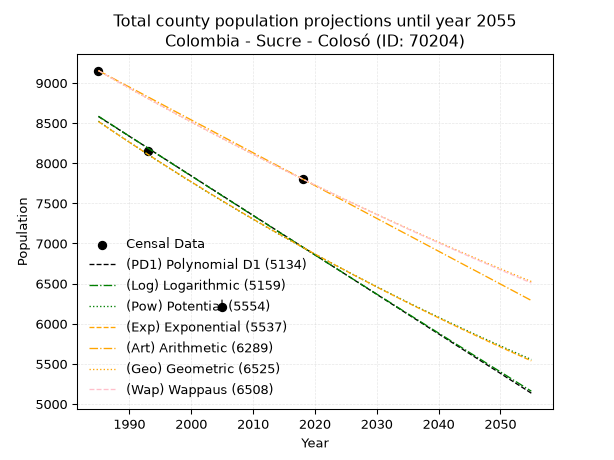
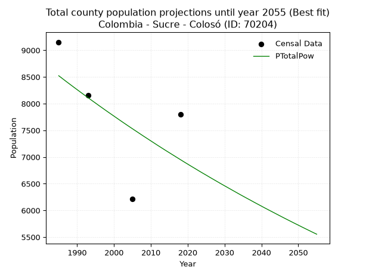
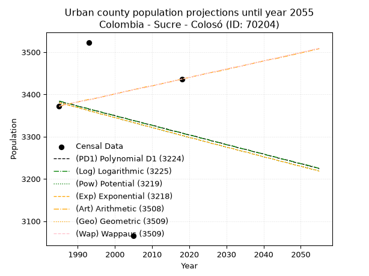
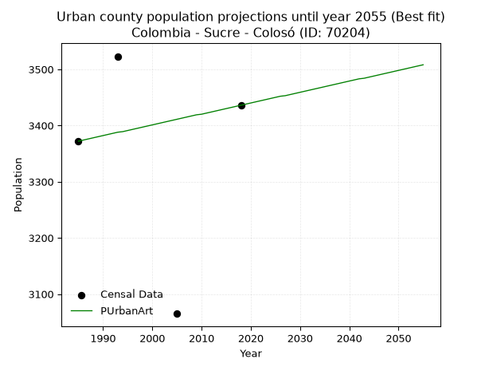
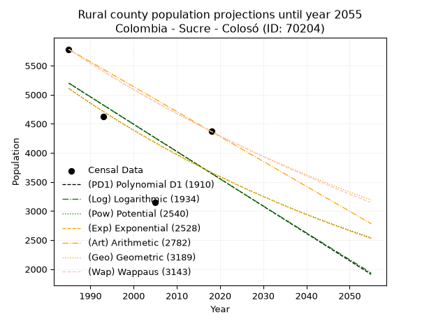
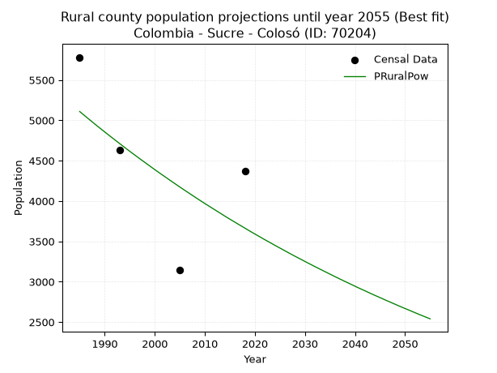

<div align="center">


</div>

# _“Population and Public Services Demand Projections (PPSD) until Year 2050 for Colombia - Sucre - Coloso (ID: 70204)”_
Keywords: `population` `public-service` `projection` `lineal` `polynomial` `logarithmic` `potential` `exponential` `arithmetic` `geometric` `wappaus` `dane` `colombia` `south-america`

PPSD are analytical estimates used by governments and planners to anticipate future changes in population size, age distribution, and the resulting community needs for utilities, healthcare, education, and infrastructure as sizing future water treatment facilities, electrical grids, and road networks based on spatial growth.

> **General running parameters**: • app_version: _v20260806_. • Python version: _3.14.7_. • Pandas version: _3.0.5_. • NumPy version: _2.5.1_. • Creates, save and include plots into reports (create_plot): _False_. • Projection until year: _2050_. • Process polynomial degree 2 and up: _False_. • Process Wappaus: _True_. • Process Wappaus: _True_. • Set negative values to zero: _True_. • Set infinite values to zero: _True_. • Drop dataset notes: _True_. 
<div align="center">

Dynamic map: [:earth_americas:Google](http://maps.google.com/maps?q=9.494191916,-75.353256) [:earth_americas:OSM](https://www.openstreetmap.org/#map=18/9.494191916/-75.353256&layers=P) [:earth_americas:Bing](https://www.bing.com/maps?cp=9.494191916~-75.353256&lvl=18) [:earth_americas:Apple](https://maps.apple.com/frame?center=9.494191916%2C-75.353256&span=0.003%2C0.006)

</div>


<div align="center">

```geojson
{
  "type": "Feature",
  "geometry": {
    "type": "Point", 
    "coordinates": [-75.353256, 9.494191916]
  }, 
  "properties": {
    "Name": "Colombia - Sucre - Coloso (ID: 70204)"
  }
}
```

</div>


## 0. Census Data (4 records)

Census data are official statistics collected by a government about the people and housing in a country. They usually include counts of total population, age, sex, race, income, education, and jobs.

📅Global census file: [Population.xlsx](../data/Population.xlsx)

| Source   |   Year |   CountryID | CountryName   |   StateID | StateName   |   CountyID | CountyName   |   PTotal |   PUrban |   PRural |
|:---------|-------:|------------:|:--------------|----------:|:------------|-----------:|:-------------|---------:|---------:|---------:|
| DANE     |   1985 |          57 | Colombia      |        70 | Sucre       |      70204 | Coloso       |     9153 |     3372 |     5781 |
| DANE     |   1993 |          57 | Colombia      |        70 | Sucre       |      70204 | Colosó       |     8152 |     3523 |     4629 |
| DANE     |   2005 |          57 | Colombia      |        70 | Sucre       |      70204 | Coloso       |     6214 |     3065 |     3149 |
| DANE     |   2018 |          57 | Colombia      |        70 | Sucre       |      70204 | Colosó       |     7803 |     3436 |     4367 |

> 🔥Some records has specific notes about the registered values or the corresponding urban or rural distribution.

## 1. Total

### 1.1. Coefficients and Parameters

* (PD1) Polynomial Deg 1: -49.242071457246965, 106326.95343235823 (lineal)
* (Log) Logarithmic: -98858.00261439243, 759250.9700703121
* (Pow) Potential: -12.356950012138647, 44.680844228415225
* (Exp) Exponential: -0.006153849858389813, 1719686729.7781835
* (Art) Arithmetic: Year diff. 2018 - 1985 = 33, Population diff. 7803 - 9153 = -1350, Annual growth = -40.90909090909091
* (Geo) Geometric: Year diff. 2018 - 1985 = 33, Population diff. 7803 - 9153 = -1350, Annual growth % = -0.004823885670192207
* (Wap) Wappaus: i = -0.4825323296660876, Condition values only valid for < 200)

<sub>
Wappaus condition values: ['-0.00', '-0.48', '-0.97', '-1.45', '-1.93', '-2.41', '-2.90', '-3.38', '-3.86', '-4.34', '-4.83', '-5.31', '-5.79', '-6.27', '-6.76', '-7.24', '-7.72', '-8.20', '-8.69', '-9.17', '-9.65', '-10.13', '-10.62', '-11.10', '-11.58', '-12.06', '-12.55', '-13.03', '-13.51', '-13.99', '-14.48', '-14.96', '-15.44', '-15.92', '-16.41', '-16.89', '-17.37', '-17.85', '-18.34', '-18.82', '-19.30', '-19.78', '-20.27', '-20.75', '-21.23', '-21.71', '-22.20', '-22.68', '-23.16', '-23.64', '-24.13', '-24.61', '-25.09', '-25.57', '-26.06', '-26.54', '-27.02', '-27.50', '-27.99', '-28.47', '-28.95', '-29.43', '-29.92', '-30.40', '-30.88', '-31.36']
</sub>


### 1.2. Projected Dataset

|   Year |   CountyID |   PTotalPD1 |   PTotalLog |   PTotalPow |   PTotalExp |   PTotalArt |   PTotalGeo |   PTotalWap |
|-------:|-----------:|------------:|------------:|------------:|------------:|------------:|------------:|------------:|
|   1985 |      70204 |        8581 |        8585 |        8523 |        8519 |        9153 |        9153 |        9153 |
|   1986 |      70204 |        8532 |        8535 |        8470 |        8466 |        9112 |        9109 |        9109 |
|   1987 |      70204 |        8483 |        8486 |        8417 |        8414 |        9071 |        9065 |        9065 |
|   1988 |      70204 |        8434 |        8436 |        8365 |        8363 |        9030 |        9021 |        9021 |
|   1989 |      70204 |        8384 |        8386 |        8313 |        8312 |        8989 |        8978 |        8978 |
|   1990 |      70204 |        8335 |        8336 |        8262 |        8261 |        8948 |        8934 |        8935 |
|   1991 |      70204 |        8286 |        8287 |        8211 |        8210 |        8908 |        8891 |        8892 |
|   1992 |      70204 |        8237 |        8237 |        8160 |        8160 |        8867 |        8848 |        8849 |
|   1993 |      70204 |        8188 |        8188 |        8110 |        8109 |        8826 |        8806 |        8806 |
|   1994 |      70204 |        8138 |        8138 |        8059 |        8060 |        8785 |        8763 |        8764 |
|   1995 |      70204 |        8089 |        8088 |        8010 |        8010 |        8744 |        8721 |        8722 |
|   1996 |      70204 |        8040 |        8039 |        7960 |        7961 |        8703 |        8679 |        8680 |
|   1997 |      70204 |        7991 |        7989 |        7911 |        7912 |        8662 |        8637 |        8638 |
|   1998 |      70204 |        7941 |        7940 |        7862 |        7864 |        8621 |        8595 |        8596 |
|   1999 |      70204 |        7892 |        7890 |        7814 |        7815 |        8580 |        8554 |        8555 |
|   2000 |      70204 |        7843 |        7841 |        7766 |        7768 |        8539 |        8513 |        8514 |
|   2001 |      70204 |        7794 |        7792 |        7718 |        7720 |        8498 |        8472 |        8473 |
|   2002 |      70204 |        7744 |        7742 |        7670 |        7673 |        8458 |        8431 |        8432 |
|   2003 |      70204 |        7695 |        7693 |        7623 |        7625 |        8417 |        8390 |        8391 |
|   2004 |      70204 |        7646 |        7643 |        7576 |        7579 |        8376 |        8350 |        8351 |
|   2005 |      70204 |        7597 |        7594 |        7530 |        7532 |        8335 |        8309 |        8310 |
|   2006 |      70204 |        7547 |        7545 |        7484 |        7486 |        8294 |        8269 |        8270 |
|   2007 |      70204 |        7498 |        7496 |        7438 |        7440 |        8253 |        8229 |        8230 |
|   2008 |      70204 |        7449 |        7446 |        7392 |        7394 |        8212 |        8190 |        8191 |
|   2009 |      70204 |        7400 |        7397 |        7347 |        7349 |        8171 |        8150 |        8151 |
|   2010 |      70204 |        7350 |        7348 |        7302 |        7304 |        8130 |        8111 |        8112 |
|   2011 |      70204 |        7301 |        7299 |        7257 |        7259 |        8089 |        8072 |        8072 |
|   2012 |      70204 |        7252 |        7250 |        7212 |        7215 |        8048 |        8033 |        8033 |
|   2013 |      70204 |        7203 |        7200 |        7168 |        7170 |        8008 |        7994 |        7995 |
|   2014 |      70204 |        7153 |        7151 |        7124 |        7126 |        7967 |        7955 |        7956 |
|   2015 |      70204 |        7104 |        7102 |        7081 |        7083 |        7926 |        7917 |        7917 |
|   2016 |      70204 |        7055 |        7053 |        7038 |        7039 |        7885 |        7879 |        7879 |
|   2017 |      70204 |        7006 |        7004 |        6995 |        6996 |        7844 |        7841 |        7841 |
|   2018 |      70204 |        6956 |        6955 |        6952 |        6953 |        7803 |        7803 |        7803 |
|   2019 |      70204 |        6907 |        6906 |        6909 |        6910 |        7762 |        7765 |        7765 |
|   2020 |      70204 |        6858 |        6857 |        6867 |        6868 |        7721 |        7728 |        7728 |
|   2021 |      70204 |        6809 |        6808 |        6825 |        6826 |        7680 |        7691 |        7690 |
|   2022 |      70204 |        6759 |        6759 |        6784 |        6784 |        7639 |        7654 |        7653 |
|   2023 |      70204 |        6710 |        6711 |        6742 |        6742 |        7598 |        7617 |        7616 |
|   2024 |      70204 |        6661 |        6662 |        6701 |        6701 |        7558 |        7580 |        7579 |
|   2025 |      70204 |        6612 |        6613 |        6661 |        6660 |        7517 |        7543 |        7542 |
|   2026 |      70204 |        6563 |        6564 |        6620 |        6619 |        7476 |        7507 |        7505 |
|   2027 |      70204 |        6513 |        6515 |        6580 |        6578 |        7435 |        7471 |        7469 |
|   2028 |      70204 |        6464 |        6467 |        6540 |        6538 |        7394 |        7435 |        7432 |
|   2029 |      70204 |        6415 |        6418 |        6500 |        6498 |        7353 |        7399 |        7396 |
|   2030 |      70204 |        6366 |        6369 |        6461 |        6458 |        7312 |        7363 |        7360 |
|   2031 |      70204 |        6316 |        6320 |        6422 |        6418 |        7271 |        7328 |        7324 |
|   2032 |      70204 |        6267 |        6272 |        6383 |        6379 |        7230 |        7292 |        7289 |
|   2033 |      70204 |        6218 |        6223 |        6344 |        6340 |        7189 |        7257 |        7253 |
|   2034 |      70204 |        6169 |        6174 |        6305 |        6301 |        7148 |        7222 |        7218 |
|   2035 |      70204 |        6119 |        6126 |        6267 |        6262 |        7108 |        7187 |        7182 |
|   2036 |      70204 |        6070 |        6077 |        6229 |        6224 |        7067 |        7153 |        7147 |
|   2037 |      70204 |        6021 |        6029 |        6192 |        6186 |        7026 |        7118 |        7112 |
|   2038 |      70204 |        5972 |        5980 |        6154 |        6148 |        6985 |        7084 |        7078 |
|   2039 |      70204 |        5922 |        5932 |        6117 |        6110 |        6944 |        7050 |        7043 |
|   2040 |      70204 |        5873 |        5883 |        6080 |        6073 |        6903 |        7016 |        7008 |
|   2041 |      70204 |        5824 |        5835 |        6043 |        6035 |        6862 |        6982 |        6974 |
|   2042 |      70204 |        5775 |        5786 |        6007 |        5998 |        6821 |        6948 |        6940 |
|   2043 |      70204 |        5725 |        5738 |        5971 |        5962 |        6780 |        6914 |        6906 |
|   2044 |      70204 |        5676 |        5690 |        5935 |        5925 |        6739 |        6881 |        6872 |
|   2045 |      70204 |        5627 |        5641 |        5899 |        5889 |        6698 |        6848 |        6838 |
|   2046 |      70204 |        5578 |        5593 |        5863 |        5853 |        6658 |        6815 |        6804 |
|   2047 |      70204 |        5528 |        5545 |        5828 |        5817 |        6617 |        6782 |        6771 |
|   2048 |      70204 |        5479 |        5496 |        5793 |        5781 |        6576 |        6749 |        6738 |
|   2049 |      70204 |        5430 |        5448 |        5758 |        5745 |        6535 |        6717 |        6704 |
|   2050 |      70204 |        5381 |        5400 |        5724 |        5710 |        6494 |        6684 |        6671 |
<div align="center">

</img>

</div>


### 1.3. Best fit with absolute error and relative error (%)

Relative error puts that difference into context by dividing the absolute error by the true value, creating a unitless ratio or percentage that shows the scale of the mistake.

Absolute and relative error

|   Year | Source   |   CountryID | CountryName   |   StateID | StateName   |   CountyID_x | CountyName   |   PTotal |   PUrban |   PRural |   CountyID_y |   PTotalPD1 |   PTotalLog |   PTotalPow |   PTotalExp |   PTotalArt |   PTotalGeo |   PTotalWap |   PTotalPD1AbsError |   PTotalLogAbsError |   PTotalPowAbsError |   PTotalExpAbsError |   PTotalArtAbsError |   PTotalGeoAbsError |   PTotalWapAbsError |   PTotalPD1RelError |   PTotalLogRelError |   PTotalPowRelError |   PTotalExpRelError |   PTotalArtRelError |   PTotalGeoRelError |   PTotalWapRelError |
|-------:|:---------|------------:|:--------------|----------:|:------------|-------------:|:-------------|---------:|---------:|---------:|-------------:|------------:|------------:|------------:|------------:|------------:|------------:|------------:|--------------------:|--------------------:|--------------------:|--------------------:|--------------------:|--------------------:|--------------------:|--------------------:|--------------------:|--------------------:|--------------------:|--------------------:|--------------------:|--------------------:|
|   1985 | DANE     |          57 | Colombia      |        70 | Sucre       |        70204 | Coloso       |     9153 |     3372 |     5781 |        70204 |        8581 |        8585 |        8523 |        8519 |        9153 |        9153 |        9153 |                 572 |                 568 |                 630 |                 634 |                   0 |                   0 |                   0 |            6.24932  |            6.20562  |            6.88299  |            6.92669  |             0       |             0       |             0       |
|   1993 | DANE     |          57 | Colombia      |        70 | Sucre       |        70204 | Colosó       |     8152 |     3523 |     4629 |        70204 |        8188 |        8188 |        8110 |        8109 |        8826 |        8806 |        8806 |                  36 |                  36 |                  42 |                  43 |                 674 |                 654 |                 654 |            0.441609 |            0.441609 |            0.515211 |            0.527478 |             8.26791 |             8.02257 |             8.02257 |
|   2005 | DANE     |          57 | Colombia      |        70 | Sucre       |        70204 | Coloso       |     6214 |     3065 |     3149 |        70204 |        7597 |        7594 |        7530 |        7532 |        8335 |        8309 |        8310 |                1383 |                1380 |                1316 |                1318 |                2121 |                2095 |                2096 |           22.2562   |           22.2079   |           21.178    |           21.2102   |            34.1326  |            33.7142  |            33.7303  |
|   2018 | DANE     |          57 | Colombia      |        70 | Sucre       |        70204 | Colosó       |     7803 |     3436 |     4367 |        70204 |        6956 |        6955 |        6952 |        6953 |        7803 |        7803 |        7803 |                 847 |                 848 |                 851 |                 850 |                   0 |                   0 |                   0 |           10.8548   |           10.8676   |           10.9061   |           10.8932   |             0       |             0       |             0       |

Relative error mean

| Method    |   RelError | Best   |
|:----------|-----------:|:-------|
| PTotalPD1 |    9.95048 |        |
| PTotalLog |    9.93069 |        |
| PTotalPow |    9.87056 | True   |
| PTotalExp |    9.8894  |        |
| PTotalArt |   10.6001  |        |
| PTotalGeo |   10.4342  |        |
| PTotalWap |   10.4382  |        |

💙Best method: _**PTotalPow**_
<div align="center">

</img>

</div>


### 1.4. Fresh water supply demand in liters per capita per day (lpcd)

The fresh water supply demand typically ranges from 100 to 300 liters per capita per day (lpcd) for standard domestic and municipal planning, though absolute survival minimums set by the World Health Organization are as low as 7.5 to 20 liters per day, and total consumption in high-income nations can exceed 400 liters.

> `CZ`: Level in meters above the sea level (masl).<br> `WS`: Fresh water supply demand in liters per capita per day (lpcd or l/h/d).<br> `WSAll`: Zonal fresh water supply demand in liters per second (l/s).<br> `A`: Zonal area in square meters.

Reference values (RAS Colombia)

|    CZ |   WS |
|------:|-----:|
|  1000 |  120 |
|  2000 |  130 |
| 99999 |  140 |

County shapefile geometry properties and water supply values

|   CountyID |      ATotal |   CZTotal |   WSTotal |
|-----------:|------------:|----------:|----------:|
|      70204 | 1.31093e+08 |   200.251 |       120 |

Projected values for best method: PTotalPow

|   CountyID |   Year |   PTotalPow |   WSTotal |   WSTotalAll |
|-----------:|-------:|------------:|----------:|-------------:|
|      70204 |   1985 |        8523 |       120 |     11.8375  |
|      70204 |   1986 |        8470 |       120 |     11.7639  |
|      70204 |   1987 |        8417 |       120 |     11.6903  |
|      70204 |   1988 |        8365 |       120 |     11.6181  |
|      70204 |   1989 |        8313 |       120 |     11.5458  |
|      70204 |   1990 |        8262 |       120 |     11.475   |
|      70204 |   1991 |        8211 |       120 |     11.4042  |
|      70204 |   1992 |        8160 |       120 |     11.3333  |
|      70204 |   1993 |        8110 |       120 |     11.2639  |
|      70204 |   1994 |        8059 |       120 |     11.1931  |
|      70204 |   1995 |        8010 |       120 |     11.125   |
|      70204 |   1996 |        7960 |       120 |     11.0556  |
|      70204 |   1997 |        7911 |       120 |     10.9875  |
|      70204 |   1998 |        7862 |       120 |     10.9194  |
|      70204 |   1999 |        7814 |       120 |     10.8528  |
|      70204 |   2000 |        7766 |       120 |     10.7861  |
|      70204 |   2001 |        7718 |       120 |     10.7194  |
|      70204 |   2002 |        7670 |       120 |     10.6528  |
|      70204 |   2003 |        7623 |       120 |     10.5875  |
|      70204 |   2004 |        7576 |       120 |     10.5222  |
|      70204 |   2005 |        7530 |       120 |     10.4583  |
|      70204 |   2006 |        7484 |       120 |     10.3944  |
|      70204 |   2007 |        7438 |       120 |     10.3306  |
|      70204 |   2008 |        7392 |       120 |     10.2667  |
|      70204 |   2009 |        7347 |       120 |     10.2042  |
|      70204 |   2010 |        7302 |       120 |     10.1417  |
|      70204 |   2011 |        7257 |       120 |     10.0792  |
|      70204 |   2012 |        7212 |       120 |     10.0167  |
|      70204 |   2013 |        7168 |       120 |      9.95556 |
|      70204 |   2014 |        7124 |       120 |      9.89444 |
|      70204 |   2015 |        7081 |       120 |      9.83472 |
|      70204 |   2016 |        7038 |       120 |      9.775   |
|      70204 |   2017 |        6995 |       120 |      9.71528 |
|      70204 |   2018 |        6952 |       120 |      9.65556 |
|      70204 |   2019 |        6909 |       120 |      9.59583 |
|      70204 |   2020 |        6867 |       120 |      9.5375  |
|      70204 |   2021 |        6825 |       120 |      9.47917 |
|      70204 |   2022 |        6784 |       120 |      9.42222 |
|      70204 |   2023 |        6742 |       120 |      9.36389 |
|      70204 |   2024 |        6701 |       120 |      9.30694 |
|      70204 |   2025 |        6661 |       120 |      9.25139 |
|      70204 |   2026 |        6620 |       120 |      9.19444 |
|      70204 |   2027 |        6580 |       120 |      9.13889 |
|      70204 |   2028 |        6540 |       120 |      9.08333 |
|      70204 |   2029 |        6500 |       120 |      9.02778 |
|      70204 |   2030 |        6461 |       120 |      8.97361 |
|      70204 |   2031 |        6422 |       120 |      8.91944 |
|      70204 |   2032 |        6383 |       120 |      8.86528 |
|      70204 |   2033 |        6344 |       120 |      8.81111 |
|      70204 |   2034 |        6305 |       120 |      8.75694 |
|      70204 |   2035 |        6267 |       120 |      8.70417 |
|      70204 |   2036 |        6229 |       120 |      8.65139 |
|      70204 |   2037 |        6192 |       120 |      8.6     |
|      70204 |   2038 |        6154 |       120 |      8.54722 |
|      70204 |   2039 |        6117 |       120 |      8.49583 |
|      70204 |   2040 |        6080 |       120 |      8.44444 |
|      70204 |   2041 |        6043 |       120 |      8.39306 |
|      70204 |   2042 |        6007 |       120 |      8.34306 |
|      70204 |   2043 |        5971 |       120 |      8.29306 |
|      70204 |   2044 |        5935 |       120 |      8.24306 |
|      70204 |   2045 |        5899 |       120 |      8.19306 |
|      70204 |   2046 |        5863 |       120 |      8.14306 |
|      70204 |   2047 |        5828 |       120 |      8.09444 |
|      70204 |   2048 |        5793 |       120 |      8.04583 |
|      70204 |   2049 |        5758 |       120 |      7.99722 |
|      70204 |   2050 |        5724 |       120 |      7.95    |

## 2. Urban

### 2.1. Coefficients and Parameters

* (PD1) Polynomial Deg 1: -2.2753914090728595, 7900.351665997987 (lineal)
* (Log) Logarithmic: -4586.075210265026, 38207.79442372476
* (Pow) Potential: -1.4154708621376755, 8.196897621999526
* (Exp) Exponential: -0.0007021960734212115, 13624.386664860545
* (Art) Arithmetic: Year diff. 2018 - 1985 = 33, Population diff. 3436 - 3372 = 64, Annual growth = 1.9393939393939394
* (Geo) Geometric: Year diff. 2018 - 1985 = 33, Population diff. 3436 - 3372 = 64, Annual growth % = 0.0005699188263712518
* (Wap) Wappaus: i = 0.05697397001744828, Condition values only valid for < 200)

<sub>
Wappaus condition values: ['0.00', '0.06', '0.11', '0.17', '0.23', '0.28', '0.34', '0.40', '0.46', '0.51', '0.57', '0.63', '0.68', '0.74', '0.80', '0.85', '0.91', '0.97', '1.03', '1.08', '1.14', '1.20', '1.25', '1.31', '1.37', '1.42', '1.48', '1.54', '1.60', '1.65', '1.71', '1.77', '1.82', '1.88', '1.94', '1.99', '2.05', '2.11', '2.17', '2.22', '2.28', '2.34', '2.39', '2.45', '2.51', '2.56', '2.62', '2.68', '2.73', '2.79', '2.85', '2.91', '2.96', '3.02', '3.08', '3.13', '3.19', '3.25', '3.30', '3.36', '3.42', '3.48', '3.53', '3.59', '3.65', '3.70']
</sub>


### 2.2. Projected Dataset

|   Year |   CountyID |   PUrbanPD1 |   PUrbanLog |   PUrbanPow |   PUrbanExp |   PUrbanArt |   PUrbanGeo |   PUrbanWap |
|-------:|-----------:|------------:|------------:|------------:|------------:|------------:|------------:|------------:|
|   1985 |      70204 |        3384 |        3384 |        3381 |        3380 |        3372 |        3372 |        3372 |
|   1986 |      70204 |        3381 |        3382 |        3378 |        3378 |        3374 |        3374 |        3374 |
|   1987 |      70204 |        3379 |        3379 |        3376 |        3376 |        3376 |        3376 |        3376 |
|   1988 |      70204 |        3377 |        3377 |        3374 |        3373 |        3378 |        3378 |        3378 |
|   1989 |      70204 |        3375 |        3375 |        3371 |        3371 |        3380 |        3380 |        3380 |
|   1990 |      70204 |        3372 |        3372 |        3369 |        3369 |        3382 |        3382 |        3382 |
|   1991 |      70204 |        3370 |        3370 |        3366 |        3366 |        3384 |        3384 |        3384 |
|   1992 |      70204 |        3368 |        3368 |        3364 |        3364 |        3386 |        3385 |        3385 |
|   1993 |      70204 |        3365 |        3366 |        3362 |        3361 |        3388 |        3387 |        3387 |
|   1994 |      70204 |        3363 |        3363 |        3359 |        3359 |        3389 |        3389 |        3389 |
|   1995 |      70204 |        3361 |        3361 |        3357 |        3357 |        3391 |        3391 |        3391 |
|   1996 |      70204 |        3359 |        3359 |        3354 |        3354 |        3393 |        3393 |        3393 |
|   1997 |      70204 |        3356 |        3356 |        3352 |        3352 |        3395 |        3395 |        3395 |
|   1998 |      70204 |        3354 |        3354 |        3350 |        3350 |        3397 |        3397 |        3397 |
|   1999 |      70204 |        3352 |        3352 |        3347 |        3347 |        3399 |        3399 |        3399 |
|   2000 |      70204 |        3350 |        3349 |        3345 |        3345 |        3401 |        3401 |        3401 |
|   2001 |      70204 |        3347 |        3347 |        3343 |        3343 |        3403 |        3403 |        3403 |
|   2002 |      70204 |        3345 |        3345 |        3340 |        3340 |        3405 |        3405 |        3405 |
|   2003 |      70204 |        3343 |        3343 |        3338 |        3338 |        3407 |        3407 |        3407 |
|   2004 |      70204 |        3340 |        3340 |        3335 |        3336 |        3409 |        3409 |        3409 |
|   2005 |      70204 |        3338 |        3338 |        3333 |        3333 |        3411 |        3411 |        3411 |
|   2006 |      70204 |        3336 |        3336 |        3331 |        3331 |        3413 |        3413 |        3413 |
|   2007 |      70204 |        3334 |        3333 |        3328 |        3329 |        3415 |        3415 |        3415 |
|   2008 |      70204 |        3331 |        3331 |        3326 |        3326 |        3417 |        3416 |        3416 |
|   2009 |      70204 |        3329 |        3329 |        3324 |        3324 |        3419 |        3418 |        3418 |
|   2010 |      70204 |        3327 |        3327 |        3321 |        3322 |        3420 |        3420 |        3420 |
|   2011 |      70204 |        3325 |        3324 |        3319 |        3319 |        3422 |        3422 |        3422 |
|   2012 |      70204 |        3322 |        3322 |        3317 |        3317 |        3424 |        3424 |        3424 |
|   2013 |      70204 |        3320 |        3320 |        3314 |        3315 |        3426 |        3426 |        3426 |
|   2014 |      70204 |        3318 |        3317 |        3312 |        3312 |        3428 |        3428 |        3428 |
|   2015 |      70204 |        3315 |        3315 |        3310 |        3310 |        3430 |        3430 |        3430 |
|   2016 |      70204 |        3313 |        3313 |        3307 |        3308 |        3432 |        3432 |        3432 |
|   2017 |      70204 |        3311 |        3311 |        3305 |        3305 |        3434 |        3434 |        3434 |
|   2018 |      70204 |        3309 |        3308 |        3303 |        3303 |        3436 |        3436 |        3436 |
|   2019 |      70204 |        3306 |        3306 |        3300 |        3301 |        3438 |        3438 |        3438 |
|   2020 |      70204 |        3304 |        3304 |        3298 |        3298 |        3440 |        3440 |        3440 |
|   2021 |      70204 |        3302 |        3302 |        3296 |        3296 |        3442 |        3442 |        3442 |
|   2022 |      70204 |        3300 |        3299 |        3294 |        3294 |        3444 |        3444 |        3444 |
|   2023 |      70204 |        3297 |        3297 |        3291 |        3291 |        3446 |        3446 |        3446 |
|   2024 |      70204 |        3295 |        3295 |        3289 |        3289 |        3448 |        3448 |        3448 |
|   2025 |      70204 |        3293 |        3293 |        3287 |        3287 |        3450 |        3450 |        3450 |
|   2026 |      70204 |        3290 |        3290 |        3284 |        3284 |        3452 |        3452 |        3452 |
|   2027 |      70204 |        3288 |        3288 |        3282 |        3282 |        3453 |        3454 |        3454 |
|   2028 |      70204 |        3286 |        3286 |        3280 |        3280 |        3455 |        3456 |        3456 |
|   2029 |      70204 |        3284 |        3283 |        3277 |        3278 |        3457 |        3458 |        3458 |
|   2030 |      70204 |        3281 |        3281 |        3275 |        3275 |        3459 |        3460 |        3460 |
|   2031 |      70204 |        3279 |        3279 |        3273 |        3273 |        3461 |        3462 |        3462 |
|   2032 |      70204 |        3277 |        3277 |        3271 |        3271 |        3463 |        3464 |        3464 |
|   2033 |      70204 |        3274 |        3274 |        3268 |        3268 |        3465 |        3465 |        3465 |
|   2034 |      70204 |        3272 |        3272 |        3266 |        3266 |        3467 |        3467 |        3467 |
|   2035 |      70204 |        3270 |        3270 |        3264 |        3264 |        3469 |        3469 |        3469 |
|   2036 |      70204 |        3268 |        3268 |        3262 |        3262 |        3471 |        3471 |        3471 |
|   2037 |      70204 |        3265 |        3265 |        3259 |        3259 |        3473 |        3473 |        3473 |
|   2038 |      70204 |        3263 |        3263 |        3257 |        3257 |        3475 |        3475 |        3475 |
|   2039 |      70204 |        3261 |        3261 |        3255 |        3255 |        3477 |        3477 |        3477 |
|   2040 |      70204 |        3259 |        3259 |        3252 |        3252 |        3479 |        3479 |        3479 |
|   2041 |      70204 |        3256 |        3256 |        3250 |        3250 |        3481 |        3481 |        3481 |
|   2042 |      70204 |        3254 |        3254 |        3248 |        3248 |        3483 |        3483 |        3483 |
|   2043 |      70204 |        3252 |        3252 |        3246 |        3246 |        3484 |        3485 |        3485 |
|   2044 |      70204 |        3249 |        3250 |        3243 |        3243 |        3486 |        3487 |        3487 |
|   2045 |      70204 |        3247 |        3247 |        3241 |        3241 |        3488 |        3489 |        3489 |
|   2046 |      70204 |        3245 |        3245 |        3239 |        3239 |        3490 |        3491 |        3491 |
|   2047 |      70204 |        3243 |        3243 |        3237 |        3236 |        3492 |        3493 |        3493 |
|   2048 |      70204 |        3240 |        3241 |        3234 |        3234 |        3494 |        3495 |        3495 |
|   2049 |      70204 |        3238 |        3238 |        3232 |        3232 |        3496 |        3497 |        3497 |
|   2050 |      70204 |        3236 |        3236 |        3230 |        3230 |        3498 |        3499 |        3499 |
<div align="center">

</img>

</div>


### 2.3. Best fit with absolute error and relative error (%)

Relative error puts that difference into context by dividing the absolute error by the true value, creating a unitless ratio or percentage that shows the scale of the mistake.

Absolute and relative error

|   Year | Source   |   CountryID | CountryName   |   StateID | StateName   |   CountyID_x | CountyName   |   PTotal |   PUrban |   PRural |   CountyID_y |   PUrbanPD1 |   PUrbanLog |   PUrbanPow |   PUrbanExp |   PUrbanArt |   PUrbanGeo |   PUrbanWap |   PUrbanPD1AbsError |   PUrbanLogAbsError |   PUrbanPowAbsError |   PUrbanExpAbsError |   PUrbanArtAbsError |   PUrbanGeoAbsError |   PUrbanWapAbsError |   PUrbanPD1RelError |   PUrbanLogRelError |   PUrbanPowRelError |   PUrbanExpRelError |   PUrbanArtRelError |   PUrbanGeoRelError |   PUrbanWapRelError |
|-------:|:---------|------------:|:--------------|----------:|:------------|-------------:|:-------------|---------:|---------:|---------:|-------------:|------------:|------------:|------------:|------------:|------------:|------------:|------------:|--------------------:|--------------------:|--------------------:|--------------------:|--------------------:|--------------------:|--------------------:|--------------------:|--------------------:|--------------------:|--------------------:|--------------------:|--------------------:|--------------------:|
|   1985 | DANE     |          57 | Colombia      |        70 | Sucre       |        70204 | Coloso       |     9153 |     3372 |     5781 |        70204 |        3384 |        3384 |        3381 |        3380 |        3372 |        3372 |        3372 |                  12 |                  12 |                   9 |                   8 |                   0 |                   0 |                   0 |            0.355872 |            0.355872 |            0.266904 |            0.237248 |             0       |             0       |             0       |
|   1993 | DANE     |          57 | Colombia      |        70 | Sucre       |        70204 | Colosó       |     8152 |     3523 |     4629 |        70204 |        3365 |        3366 |        3362 |        3361 |        3388 |        3387 |        3387 |                 158 |                 157 |                 161 |                 162 |                 135 |                 136 |                 136 |            4.48481  |            4.45643  |            4.56997  |            4.59835  |             3.83196 |             3.86035 |             3.86035 |
|   2005 | DANE     |          57 | Colombia      |        70 | Sucre       |        70204 | Coloso       |     6214 |     3065 |     3149 |        70204 |        3338 |        3338 |        3333 |        3333 |        3411 |        3411 |        3411 |                 273 |                 273 |                 268 |                 268 |                 346 |                 346 |                 346 |            8.90701  |            8.90701  |            8.74388  |            8.74388  |            11.2887  |            11.2887  |            11.2887  |
|   2018 | DANE     |          57 | Colombia      |        70 | Sucre       |        70204 | Colosó       |     7803 |     3436 |     4367 |        70204 |        3309 |        3308 |        3303 |        3303 |        3436 |        3436 |        3436 |                 127 |                 128 |                 133 |                 133 |                   0 |                   0 |                   0 |            3.69616  |            3.72526  |            3.87078  |            3.87078  |             0       |             0       |             0       |

Relative error mean

| Method    |   RelError | Best   |
|:----------|-----------:|:-------|
| PUrbanPD1 |    4.36096 |        |
| PUrbanLog |    4.36114 |        |
| PUrbanPow |    4.36288 |        |
| PUrbanExp |    4.36257 |        |
| PUrbanArt |    3.78018 | True   |
| PUrbanGeo |    3.78727 |        |
| PUrbanWap |    3.78727 |        |

💙Best method: _**PUrbanArt**_
<div align="center">

</img>

</div>


### 2.4. Fresh water supply demand in liters per capita per day (lpcd)

The fresh water supply demand typically ranges from 100 to 300 liters per capita per day (lpcd) for standard domestic and municipal planning, though absolute survival minimums set by the World Health Organization are as low as 7.5 to 20 liters per day, and total consumption in high-income nations can exceed 400 liters.

> `CZ`: Level in meters above the sea level (masl).<br> `WS`: Fresh water supply demand in liters per capita per day (lpcd or l/h/d).<br> `WSAll`: Zonal fresh water supply demand in liters per second (l/s).<br> `A`: Zonal area in square meters.

Reference values (RAS Colombia)

|    CZ |   WS |
|------:|-----:|
|  1000 |  120 |
|  2000 |  130 |
| 99999 |  140 |

County shapefile geometry properties and water supply values

|   CountyID |   AUrban |   CZUrban |   WSUrban |
|-----------:|---------:|----------:|----------:|
|      70204 |   772304 |   145.295 |       120 |

Projected values for best method: PUrbanArt

|   CountyID |   Year |   PUrbanArt |   WSUrban |   WSUrbanAll |
|-----------:|-------:|------------:|----------:|-------------:|
|      70204 |   1985 |        3372 |       120 |      4.68333 |
|      70204 |   1986 |        3374 |       120 |      4.68611 |
|      70204 |   1987 |        3376 |       120 |      4.68889 |
|      70204 |   1988 |        3378 |       120 |      4.69167 |
|      70204 |   1989 |        3380 |       120 |      4.69444 |
|      70204 |   1990 |        3382 |       120 |      4.69722 |
|      70204 |   1991 |        3384 |       120 |      4.7     |
|      70204 |   1992 |        3386 |       120 |      4.70278 |
|      70204 |   1993 |        3388 |       120 |      4.70556 |
|      70204 |   1994 |        3389 |       120 |      4.70694 |
|      70204 |   1995 |        3391 |       120 |      4.70972 |
|      70204 |   1996 |        3393 |       120 |      4.7125  |
|      70204 |   1997 |        3395 |       120 |      4.71528 |
|      70204 |   1998 |        3397 |       120 |      4.71806 |
|      70204 |   1999 |        3399 |       120 |      4.72083 |
|      70204 |   2000 |        3401 |       120 |      4.72361 |
|      70204 |   2001 |        3403 |       120 |      4.72639 |
|      70204 |   2002 |        3405 |       120 |      4.72917 |
|      70204 |   2003 |        3407 |       120 |      4.73194 |
|      70204 |   2004 |        3409 |       120 |      4.73472 |
|      70204 |   2005 |        3411 |       120 |      4.7375  |
|      70204 |   2006 |        3413 |       120 |      4.74028 |
|      70204 |   2007 |        3415 |       120 |      4.74306 |
|      70204 |   2008 |        3417 |       120 |      4.74583 |
|      70204 |   2009 |        3419 |       120 |      4.74861 |
|      70204 |   2010 |        3420 |       120 |      4.75    |
|      70204 |   2011 |        3422 |       120 |      4.75278 |
|      70204 |   2012 |        3424 |       120 |      4.75556 |
|      70204 |   2013 |        3426 |       120 |      4.75833 |
|      70204 |   2014 |        3428 |       120 |      4.76111 |
|      70204 |   2015 |        3430 |       120 |      4.76389 |
|      70204 |   2016 |        3432 |       120 |      4.76667 |
|      70204 |   2017 |        3434 |       120 |      4.76944 |
|      70204 |   2018 |        3436 |       120 |      4.77222 |
|      70204 |   2019 |        3438 |       120 |      4.775   |
|      70204 |   2020 |        3440 |       120 |      4.77778 |
|      70204 |   2021 |        3442 |       120 |      4.78056 |
|      70204 |   2022 |        3444 |       120 |      4.78333 |
|      70204 |   2023 |        3446 |       120 |      4.78611 |
|      70204 |   2024 |        3448 |       120 |      4.78889 |
|      70204 |   2025 |        3450 |       120 |      4.79167 |
|      70204 |   2026 |        3452 |       120 |      4.79444 |
|      70204 |   2027 |        3453 |       120 |      4.79583 |
|      70204 |   2028 |        3455 |       120 |      4.79861 |
|      70204 |   2029 |        3457 |       120 |      4.80139 |
|      70204 |   2030 |        3459 |       120 |      4.80417 |
|      70204 |   2031 |        3461 |       120 |      4.80694 |
|      70204 |   2032 |        3463 |       120 |      4.80972 |
|      70204 |   2033 |        3465 |       120 |      4.8125  |
|      70204 |   2034 |        3467 |       120 |      4.81528 |
|      70204 |   2035 |        3469 |       120 |      4.81806 |
|      70204 |   2036 |        3471 |       120 |      4.82083 |
|      70204 |   2037 |        3473 |       120 |      4.82361 |
|      70204 |   2038 |        3475 |       120 |      4.82639 |
|      70204 |   2039 |        3477 |       120 |      4.82917 |
|      70204 |   2040 |        3479 |       120 |      4.83194 |
|      70204 |   2041 |        3481 |       120 |      4.83472 |
|      70204 |   2042 |        3483 |       120 |      4.8375  |
|      70204 |   2043 |        3484 |       120 |      4.83889 |
|      70204 |   2044 |        3486 |       120 |      4.84167 |
|      70204 |   2045 |        3488 |       120 |      4.84444 |
|      70204 |   2046 |        3490 |       120 |      4.84722 |
|      70204 |   2047 |        3492 |       120 |      4.85    |
|      70204 |   2048 |        3494 |       120 |      4.85278 |
|      70204 |   2049 |        3496 |       120 |      4.85556 |
|      70204 |   2050 |        3498 |       120 |      4.85833 |

## 3. Rural

### 3.1. Coefficients and Parameters

* (PD1) Polynomial Deg 1: -46.966680048174055, 98426.60176636015 (lineal)
* (Log) Logarithmic: -94271.92740412735, 721043.175646587
* (Pow) Potential: -20.160672779717885, 70.19337127477922
* (Exp) Exponential: -0.010041362092952283, 2314024875408.9175
* (Art) Arithmetic: Year diff. 2018 - 1985 = 33, Population diff. 4367 - 5781 = -1414, Annual growth = -42.84848484848485
* (Geo) Geometric: Year diff. 2018 - 1985 = 33, Population diff. 4367 - 5781 = -1414, Annual growth % = -0.008463989263726601
* (Wap) Wappaus: i = -0.8444715184959568, Condition values only valid for < 200)

<sub>
Wappaus condition values: ['-0.00', '-0.84', '-1.69', '-2.53', '-3.38', '-4.22', '-5.07', '-5.91', '-6.76', '-7.60', '-8.44', '-9.29', '-10.13', '-10.98', '-11.82', '-12.67', '-13.51', '-14.36', '-15.20', '-16.04', '-16.89', '-17.73', '-18.58', '-19.42', '-20.27', '-21.11', '-21.96', '-22.80', '-23.65', '-24.49', '-25.33', '-26.18', '-27.02', '-27.87', '-28.71', '-29.56', '-30.40', '-31.25', '-32.09', '-32.93', '-33.78', '-34.62', '-35.47', '-36.31', '-37.16', '-38.00', '-38.85', '-39.69', '-40.53', '-41.38', '-42.22', '-43.07', '-43.91', '-44.76', '-45.60', '-46.45', '-47.29', '-48.13', '-48.98', '-49.82', '-50.67', '-51.51', '-52.36', '-53.20', '-54.05', '-54.89']
</sub>


### 3.2. Projected Dataset

|   Year |   CountyID |   PRuralPD1 |   PRuralLog |   PRuralPow |   PRuralExp |   PRuralArt |   PRuralGeo |   PRuralWap |
|-------:|-----------:|------------:|------------:|------------:|------------:|------------:|------------:|------------:|
|   1985 |      70204 |        5198 |        5201 |        5109 |        5105 |        5781 |        5781 |        5781 |
|   1986 |      70204 |        5151 |        5154 |        5057 |        5054 |        5738 |        5732 |        5732 |
|   1987 |      70204 |        5104 |        5106 |        5006 |        5003 |        5695 |        5684 |        5684 |
|   1988 |      70204 |        5057 |        5059 |        4955 |        4953 |        5652 |        5635 |        5636 |
|   1989 |      70204 |        5010 |        5011 |        4905 |        4904 |        5610 |        5588 |        5589 |
|   1990 |      70204 |        4963 |        4964 |        4856 |        4855 |        5567 |        5540 |        5542 |
|   1991 |      70204 |        4916 |        4917 |        4807 |        4806 |        5524 |        5494 |        5495 |
|   1992 |      70204 |        4869 |        4869 |        4759 |        4758 |        5481 |        5447 |        5449 |
|   1993 |      70204 |        4822 |        4822 |        4711 |        4711 |        5438 |        5401 |        5403 |
|   1994 |      70204 |        4775 |        4775 |        4663 |        4664 |        5395 |        5355 |        5358 |
|   1995 |      70204 |        4728 |        4727 |        4616 |        4617 |        5353 |        5310 |        5313 |
|   1996 |      70204 |        4681 |        4680 |        4570 |        4571 |        5310 |        5265 |        5268 |
|   1997 |      70204 |        4634 |        4633 |        4524 |        4525 |        5267 |        5220 |        5223 |
|   1998 |      70204 |        4587 |        4586 |        4479 |        4480 |        5224 |        5176 |        5179 |
|   1999 |      70204 |        4540 |        4539 |        4434 |        4435 |        5181 |        5132 |        5136 |
|   2000 |      70204 |        4493 |        4491 |        4389 |        4391 |        5138 |        5089 |        5092 |
|   2001 |      70204 |        4446 |        4444 |        4345 |        4347 |        5095 |        5046 |        5049 |
|   2002 |      70204 |        4399 |        4397 |        4302 |        4304 |        5053 |        5003 |        5007 |
|   2003 |      70204 |        4352 |        4350 |        4259 |        4261 |        5010 |        4961 |        4964 |
|   2004 |      70204 |        4305 |        4303 |        4216 |        4218 |        4967 |        4919 |        4922 |
|   2005 |      70204 |        4258 |        4256 |        4174 |        4176 |        4924 |        4877 |        4881 |
|   2006 |      70204 |        4211 |        4209 |        4132 |        4134 |        4881 |        4836 |        4839 |
|   2007 |      70204 |        4164 |        4162 |        4091 |        4093 |        4838 |        4795 |        4798 |
|   2008 |      70204 |        4118 |        4115 |        4050 |        4052 |        4795 |        4754 |        4758 |
|   2009 |      70204 |        4071 |        4068 |        4009 |        4011 |        4753 |        4714 |        4717 |
|   2010 |      70204 |        4024 |        4021 |        3969 |        3971 |        4710 |        4674 |        4677 |
|   2011 |      70204 |        3977 |        3974 |        3930 |        3932 |        4667 |        4635 |        4637 |
|   2012 |      70204 |        3930 |        3928 |        3891 |        3892 |        4624 |        4595 |        4598 |
|   2013 |      70204 |        3883 |        3881 |        3852 |        3854 |        4581 |        4557 |        4559 |
|   2014 |      70204 |        3836 |        3834 |        3813 |        3815 |        4538 |        4518 |        4520 |
|   2015 |      70204 |        3789 |        3787 |        3775 |        3777 |        4496 |        4480 |        4481 |
|   2016 |      70204 |        3742 |        3740 |        3738 |        3739 |        4453 |        4442 |        4443 |
|   2017 |      70204 |        3695 |        3694 |        3701 |        3702 |        4410 |        4404 |        4405 |
|   2018 |      70204 |        3648 |        3647 |        3664 |        3665 |        4367 |        4367 |        4367 |
|   2019 |      70204 |        3601 |        3600 |        3627 |        3628 |        4324 |        4330 |        4330 |
|   2020 |      70204 |        3554 |        3553 |        3591 |        3592 |        4281 |        4293 |        4292 |
|   2021 |      70204 |        3507 |        3507 |        3556 |        3556 |        4238 |        4257 |        4255 |
|   2022 |      70204 |        3460 |        3460 |        3520 |        3521 |        4196 |        4221 |        4219 |
|   2023 |      70204 |        3413 |        3414 |        3486 |        3485 |        4153 |        4185 |        4182 |
|   2024 |      70204 |        3366 |        3367 |        3451 |        3451 |        4110 |        4150 |        4146 |
|   2025 |      70204 |        3319 |        3320 |        3417 |        3416 |        4067 |        4115 |        4110 |
|   2026 |      70204 |        3272 |        3274 |        3383 |        3382 |        4024 |        4080 |        4075 |
|   2027 |      70204 |        3225 |        3227 |        3349 |        3348 |        3981 |        4045 |        4039 |
|   2028 |      70204 |        3178 |        3181 |        3316 |        3315 |        3939 |        4011 |        4004 |
|   2029 |      70204 |        3131 |        3134 |        3284 |        3282 |        3896 |        3977 |        3970 |
|   2030 |      70204 |        3084 |        3088 |        3251 |        3249 |        3853 |        3944 |        3935 |
|   2031 |      70204 |        3037 |        3041 |        3219 |        3216 |        3810 |        3910 |        3901 |
|   2032 |      70204 |        2990 |        2995 |        3187 |        3184 |        3767 |        3877 |        3866 |
|   2033 |      70204 |        2943 |        2949 |        3156 |        3152 |        3724 |        3844 |        3833 |
|   2034 |      70204 |        2896 |        2902 |        3125 |        3121 |        3681 |        3812 |        3799 |
|   2035 |      70204 |        2849 |        2856 |        3094 |        3090 |        3639 |        3779 |        3766 |
|   2036 |      70204 |        2802 |        2810 |        3063 |        3059 |        3596 |        3747 |        3732 |
|   2037 |      70204 |        2755 |        2763 |        3033 |        3028 |        3553 |        3716 |        3699 |
|   2038 |      70204 |        2709 |        2717 |        3003 |        2998 |        3510 |        3684 |        3667 |
|   2039 |      70204 |        2662 |        2671 |        2974 |        2968 |        3467 |        3653 |        3634 |
|   2040 |      70204 |        2615 |        2625 |        2944 |        2938 |        3424 |        3622 |        3602 |
|   2041 |      70204 |        2568 |        2578 |        2915 |        2909 |        3381 |        3592 |        3570 |
|   2042 |      70204 |        2521 |        2532 |        2887 |        2880 |        3339 |        3561 |        3538 |
|   2043 |      70204 |        2474 |        2486 |        2858 |        2851 |        3296 |        3531 |        3507 |
|   2044 |      70204 |        2427 |        2440 |        2830 |        2823 |        3253 |        3501 |        3475 |
|   2045 |      70204 |        2380 |        2394 |        2803 |        2795 |        3210 |        3471 |        3444 |
|   2046 |      70204 |        2333 |        2348 |        2775 |        2767 |        3167 |        3442 |        3413 |
|   2047 |      70204 |        2286 |        2302 |        2748 |        2739 |        3124 |        3413 |        3382 |
|   2048 |      70204 |        2239 |        2256 |        2721 |        2712 |        3082 |        3384 |        3352 |
|   2049 |      70204 |        2192 |        2210 |        2694 |        2685 |        3039 |        3355 |        3321 |
|   2050 |      70204 |        2145 |        2164 |        2668 |        2658 |        2996 |        3327 |        3291 |
<div align="center">

</img>

</div>


### 3.3. Best fit with absolute error and relative error (%)

Relative error puts that difference into context by dividing the absolute error by the true value, creating a unitless ratio or percentage that shows the scale of the mistake.

Absolute and relative error

|   Year | Source   |   CountryID | CountryName   |   StateID | StateName   |   CountyID_x | CountyName   |   PTotal |   PUrban |   PRural |   CountyID_y |   PRuralPD1 |   PRuralLog |   PRuralPow |   PRuralExp |   PRuralArt |   PRuralGeo |   PRuralWap |   PRuralPD1AbsError |   PRuralLogAbsError |   PRuralPowAbsError |   PRuralExpAbsError |   PRuralArtAbsError |   PRuralGeoAbsError |   PRuralWapAbsError |   PRuralPD1RelError |   PRuralLogRelError |   PRuralPowRelError |   PRuralExpRelError |   PRuralArtRelError |   PRuralGeoRelError |   PRuralWapRelError |
|-------:|:---------|------------:|:--------------|----------:|:------------|-------------:|:-------------|---------:|---------:|---------:|-------------:|------------:|------------:|------------:|------------:|------------:|------------:|------------:|--------------------:|--------------------:|--------------------:|--------------------:|--------------------:|--------------------:|--------------------:|--------------------:|--------------------:|--------------------:|--------------------:|--------------------:|--------------------:|--------------------:|
|   1985 | DANE     |          57 | Colombia      |        70 | Sucre       |        70204 | Coloso       |     9153 |     3372 |     5781 |        70204 |        5198 |        5201 |        5109 |        5105 |        5781 |        5781 |        5781 |                 583 |                 580 |                 672 |                 676 |                   0 |                   0 |                   0 |            10.0848  |            10.0329  |            11.6243  |            11.6935  |              0      |              0      |              0      |
|   1993 | DANE     |          57 | Colombia      |        70 | Sucre       |        70204 | Colosó       |     8152 |     3523 |     4629 |        70204 |        4822 |        4822 |        4711 |        4711 |        5438 |        5401 |        5403 |                 193 |                 193 |                  82 |                  82 |                 809 |                 772 |                 774 |             4.16937 |             4.16937 |             1.77144 |             1.77144 |             17.4768 |             16.6775 |             16.7207 |
|   2005 | DANE     |          57 | Colombia      |        70 | Sucre       |        70204 | Coloso       |     6214 |     3065 |     3149 |        70204 |        4258 |        4256 |        4174 |        4176 |        4924 |        4877 |        4881 |                1109 |                1107 |                1025 |                1027 |                1775 |                1728 |                1732 |            35.2175  |            35.154   |            32.55    |            32.6135  |             56.3671 |             54.8746 |             55.0016 |
|   2018 | DANE     |          57 | Colombia      |        70 | Sucre       |        70204 | Colosó       |     7803 |     3436 |     4367 |        70204 |        3648 |        3647 |        3664 |        3665 |        4367 |        4367 |        4367 |                 719 |                 720 |                 703 |                 702 |                   0 |                   0 |                   0 |            16.4644  |            16.4873  |            16.098   |            16.0751  |              0      |              0      |              0      |

Relative error mean

| Method    |   RelError | Best   |
|:----------|-----------:|:-------|
| PRuralPD1 |    16.484  |        |
| PRuralLog |    16.4609 |        |
| PRuralPow |    15.5109 | True   |
| PRuralExp |    15.5384 |        |
| PRuralArt |    18.461  |        |
| PRuralGeo |    17.888  |        |
| PRuralWap |    17.9306 |        |

💙Best method: _**PRuralPow**_
<div align="center">

</img>

</div>


### 3.4. Fresh water supply demand in liters per capita per day (lpcd)

The fresh water supply demand typically ranges from 100 to 300 liters per capita per day (lpcd) for standard domestic and municipal planning, though absolute survival minimums set by the World Health Organization are as low as 7.5 to 20 liters per day, and total consumption in high-income nations can exceed 400 liters.

> `CZ`: Level in meters above the sea level (masl).<br> `WS`: Fresh water supply demand in liters per capita per day (lpcd or l/h/d).<br> `WSAll`: Zonal fresh water supply demand in liters per second (l/s).<br> `A`: Zonal area in square meters.

Reference values (RAS Colombia)

|    CZ |   WS |
|------:|-----:|
|  1000 |  120 |
|  2000 |  130 |
| 99999 |  140 |

County shapefile geometry properties and water supply values

|   CountyID |      ARural |   CZRural |   WSRural |
|-----------:|------------:|----------:|----------:|
|      70204 | 1.30321e+08 |   200.578 |       120 |

Projected values for best method: PRuralPow

|   CountyID |   Year |   PRuralPow |   WSRural |   WSRuralAll |
|-----------:|-------:|------------:|----------:|-------------:|
|      70204 |   1985 |        5109 |       120 |      7.09583 |
|      70204 |   1986 |        5057 |       120 |      7.02361 |
|      70204 |   1987 |        5006 |       120 |      6.95278 |
|      70204 |   1988 |        4955 |       120 |      6.88194 |
|      70204 |   1989 |        4905 |       120 |      6.8125  |
|      70204 |   1990 |        4856 |       120 |      6.74444 |
|      70204 |   1991 |        4807 |       120 |      6.67639 |
|      70204 |   1992 |        4759 |       120 |      6.60972 |
|      70204 |   1993 |        4711 |       120 |      6.54306 |
|      70204 |   1994 |        4663 |       120 |      6.47639 |
|      70204 |   1995 |        4616 |       120 |      6.41111 |
|      70204 |   1996 |        4570 |       120 |      6.34722 |
|      70204 |   1997 |        4524 |       120 |      6.28333 |
|      70204 |   1998 |        4479 |       120 |      6.22083 |
|      70204 |   1999 |        4434 |       120 |      6.15833 |
|      70204 |   2000 |        4389 |       120 |      6.09583 |
|      70204 |   2001 |        4345 |       120 |      6.03472 |
|      70204 |   2002 |        4302 |       120 |      5.975   |
|      70204 |   2003 |        4259 |       120 |      5.91528 |
|      70204 |   2004 |        4216 |       120 |      5.85556 |
|      70204 |   2005 |        4174 |       120 |      5.79722 |
|      70204 |   2006 |        4132 |       120 |      5.73889 |
|      70204 |   2007 |        4091 |       120 |      5.68194 |
|      70204 |   2008 |        4050 |       120 |      5.625   |
|      70204 |   2009 |        4009 |       120 |      5.56806 |
|      70204 |   2010 |        3969 |       120 |      5.5125  |
|      70204 |   2011 |        3930 |       120 |      5.45833 |
|      70204 |   2012 |        3891 |       120 |      5.40417 |
|      70204 |   2013 |        3852 |       120 |      5.35    |
|      70204 |   2014 |        3813 |       120 |      5.29583 |
|      70204 |   2015 |        3775 |       120 |      5.24306 |
|      70204 |   2016 |        3738 |       120 |      5.19167 |
|      70204 |   2017 |        3701 |       120 |      5.14028 |
|      70204 |   2018 |        3664 |       120 |      5.08889 |
|      70204 |   2019 |        3627 |       120 |      5.0375  |
|      70204 |   2020 |        3591 |       120 |      4.9875  |
|      70204 |   2021 |        3556 |       120 |      4.93889 |
|      70204 |   2022 |        3520 |       120 |      4.88889 |
|      70204 |   2023 |        3486 |       120 |      4.84167 |
|      70204 |   2024 |        3451 |       120 |      4.79306 |
|      70204 |   2025 |        3417 |       120 |      4.74583 |
|      70204 |   2026 |        3383 |       120 |      4.69861 |
|      70204 |   2027 |        3349 |       120 |      4.65139 |
|      70204 |   2028 |        3316 |       120 |      4.60556 |
|      70204 |   2029 |        3284 |       120 |      4.56111 |
|      70204 |   2030 |        3251 |       120 |      4.51528 |
|      70204 |   2031 |        3219 |       120 |      4.47083 |
|      70204 |   2032 |        3187 |       120 |      4.42639 |
|      70204 |   2033 |        3156 |       120 |      4.38333 |
|      70204 |   2034 |        3125 |       120 |      4.34028 |
|      70204 |   2035 |        3094 |       120 |      4.29722 |
|      70204 |   2036 |        3063 |       120 |      4.25417 |
|      70204 |   2037 |        3033 |       120 |      4.2125  |
|      70204 |   2038 |        3003 |       120 |      4.17083 |
|      70204 |   2039 |        2974 |       120 |      4.13056 |
|      70204 |   2040 |        2944 |       120 |      4.08889 |
|      70204 |   2041 |        2915 |       120 |      4.04861 |
|      70204 |   2042 |        2887 |       120 |      4.00972 |
|      70204 |   2043 |        2858 |       120 |      3.96944 |
|      70204 |   2044 |        2830 |       120 |      3.93056 |
|      70204 |   2045 |        2803 |       120 |      3.89306 |
|      70204 |   2046 |        2775 |       120 |      3.85417 |
|      70204 |   2047 |        2748 |       120 |      3.81667 |
|      70204 |   2048 |        2721 |       120 |      3.77917 |
|      70204 |   2049 |        2694 |       120 |      3.74167 |
|      70204 |   2050 |        2668 |       120 |      3.70556 |

<div align="center"><br><sub>Share this research</sub></div><br>

<sub>**APPS & TOOLS & CONTENT DISCLAIMER**: • NO WARRANTY - This content and software is provided by <a href="https://github.com/rcfdtools" target="_blank">github.com/rcfdtools</a> "as is", without any express or implied warranty, including warranties of merchantability, fitness for a particular purpose, or non-infringement. There is no guarantee that the software will be error-free or operate without interruption. • LIMITATION OF LIABILITY - Neither the authors nor copyright holders will be liable for claims or damages arising from the software or its use. You are responsible for determining if the software is appropriate for your use and assume all associated risks, including errors, legal compliance, and data loss. • NO PROFESSIONAL ADVICE - The software provides general information and does not offer professional advice. It should not replace consultation with professional advisors. [Clauses and global license for rcfdtools use.](https://github.com/rcfdtools/rcfdtools/blob/main/LICENSE.md)</sub>