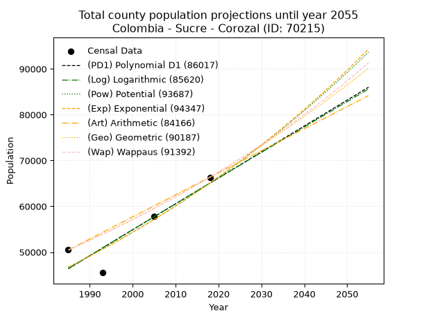
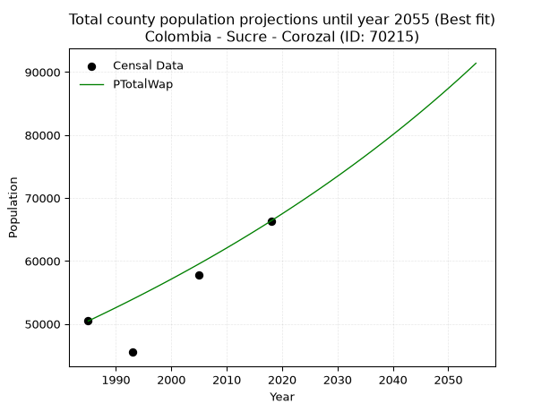
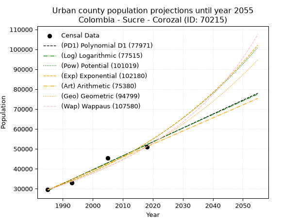
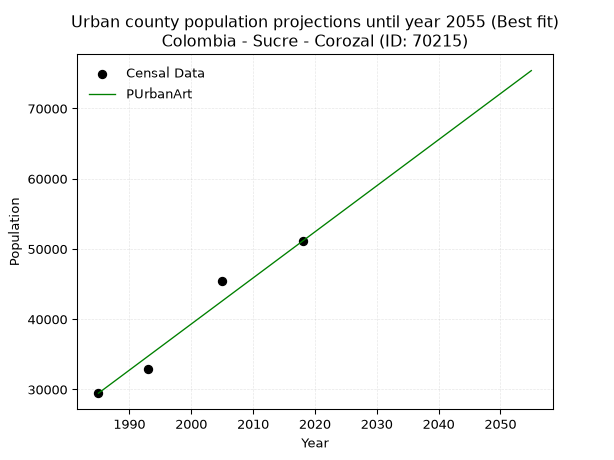
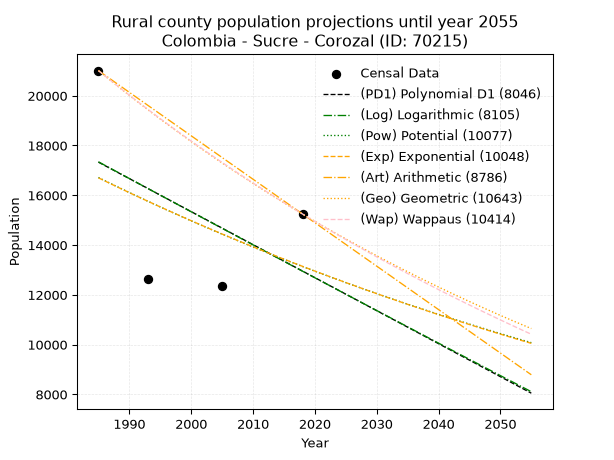
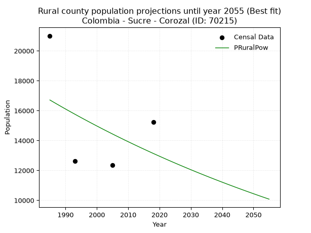

<div align="center">


</div>

# _“Population and Public Services Demand Projections (PPSD) until Year 2050 for Colombia - Sucre - Corozal (ID: 70215)”_
Keywords: `population` `public-service` `projection` `lineal` `polynomial` `logarithmic` `potential` `exponential` `arithmetic` `geometric` `wappaus` `dane` `colombia` `south-america`

PPSD are analytical estimates used by governments and planners to anticipate future changes in population size, age distribution, and the resulting community needs for utilities, healthcare, education, and infrastructure as sizing future water treatment facilities, electrical grids, and road networks based on spatial growth.

> **General running parameters**: • app_version: _v20260806_. • Python version: _3.14.7_. • Pandas version: _3.0.5_. • NumPy version: _2.5.1_. • Creates, save and include plots into reports (create_plot): _False_. • Projection until year: _2050_. • Process polynomial degree 2 and up: _False_. • Process Wappaus: _True_. • Process Wappaus: _True_. • Set negative values to zero: _True_. • Set infinite values to zero: _True_. • Drop dataset notes: _True_. 
<div align="center">

Dynamic map: [:earth_americas:Google](http://maps.google.com/maps?q=9.31874906,-75.2930477) [:earth_americas:OSM](https://www.openstreetmap.org/#map=18/9.31874906/-75.2930477&layers=P) [:earth_americas:Bing](https://www.bing.com/maps?cp=9.31874906~-75.2930477&lvl=18) [:earth_americas:Apple](https://maps.apple.com/frame?center=9.31874906%2C-75.2930477&span=0.003%2C0.006)

</div>


<div align="center">

```geojson
{
  "type": "Feature",
  "geometry": {
    "type": "Point", 
    "coordinates": [-75.2930477, 9.31874906]
  }, 
  "properties": {
    "Name": "Colombia - Sucre - Corozal (ID: 70215)"
  }
}
```

</div>


## 0. Census Data (4 records)

Census data are official statistics collected by a government about the people and housing in a country. They usually include counts of total population, age, sex, race, income, education, and jobs.

📅Global census file: [Population.xlsx](../data/Population.xlsx)

| Source   |   Year |   CountryID | CountryName   |   StateID | StateName   |   CountyID | CountyName   |   PTotal |   PUrban |   PRural |
|:---------|-------:|------------:|:--------------|----------:|:------------|-----------:|:-------------|---------:|---------:|---------:|
| DANE     |   1985 |          57 | Colombia      |        70 | Sucre       |      70215 | Corozal      |    50460 |    29452 |    21008 |
| DANE     |   1993 |          57 | Colombia      |        70 | Sucre       |      70215 | Corozal      |    45511 |    32887 |    12624 |
| DANE     |   2005 |          57 | Colombia      |        70 | Sucre       |      70215 | Corozal      |    57756 |    45402 |    12354 |
| DANE     |   2018 |          57 | Colombia      |        70 | Sucre       |      70215 | Corozal      |    66350 |    51104 |    15246 |

> 🔥Some records has specific notes about the registered values or the corresponding urban or rural distribution.

## 1. Total

### 1.1. Coefficients and Parameters

* (PD1) Polynomial Deg 1: 566.172219991965, -1077466.7330389281 (lineal)
* (Log) Logarithmic: 1132401.692374869, -8552375.08823903
* (Pow) Potential: 20.070888641229484, -61.519400109139404
* (Exp) Exponential: 0.010034772961429277, 0.00010445827617449486
* (Art) Arithmetic: Year diff. 2018 - 1985 = 33, Population diff. 66350 - 50460 = 15890, Annual growth = 481.5151515151515
* (Geo) Geometric: Year diff. 2018 - 1985 = 33, Population diff. 66350 - 50460 = 15890, Annual growth % = 0.008330348814094668
* (Wap) Wappaus: i = 0.8244416599865619, Condition values only valid for < 200)

<sub>
Wappaus condition values: ['0.00', '0.82', '1.65', '2.47', '3.30', '4.12', '4.95', '5.77', '6.60', '7.42', '8.24', '9.07', '9.89', '10.72', '11.54', '12.37', '13.19', '14.02', '14.84', '15.66', '16.49', '17.31', '18.14', '18.96', '19.79', '20.61', '21.44', '22.26', '23.08', '23.91', '24.73', '25.56', '26.38', '27.21', '28.03', '28.86', '29.68', '30.50', '31.33', '32.15', '32.98', '33.80', '34.63', '35.45', '36.28', '37.10', '37.92', '38.75', '39.57', '40.40', '41.22', '42.05', '42.87', '43.70', '44.52', '45.34', '46.17', '46.99', '47.82', '48.64', '49.47', '50.29', '51.12', '51.94', '52.76', '53.59']
</sub>


### 1.2. Projected Dataset

|   Year |   CountyID |   PTotalPD1 |   PTotalLog |   PTotalPow |   PTotalExp |   PTotalArt |   PTotalGeo |   PTotalWap |
|-------:|-----------:|------------:|------------:|------------:|------------:|------------:|------------:|------------:|
|   1985 |      70215 |       46385 |       46375 |       46729 |       46737 |       50460 |       50460 |       50460 |
|   1986 |      70215 |       46951 |       46945 |       47203 |       47209 |       50942 |       50880 |       50878 |
|   1987 |      70215 |       47517 |       47515 |       47683 |       47685 |       51423 |       51304 |       51299 |
|   1988 |      70215 |       48084 |       48085 |       48167 |       48166 |       51905 |       51732 |       51724 |
|   1989 |      70215 |       48650 |       48654 |       48655 |       48652 |       52386 |       52163 |       52152 |
|   1990 |      70215 |       49216 |       49224 |       49149 |       49142 |       52868 |       52597 |       52584 |
|   1991 |      70215 |       49782 |       49792 |       49647 |       49638 |       53349 |       53035 |       53019 |
|   1992 |      70215 |       50348 |       50361 |       50150 |       50139 |       53831 |       53477 |       53459 |
|   1993 |      70215 |       50915 |       50929 |       50657 |       50644 |       54312 |       53922 |       53902 |
|   1994 |      70215 |       51481 |       51497 |       51170 |       51155 |       54794 |       54372 |       54348 |
|   1995 |      70215 |       52047 |       52065 |       51688 |       51671 |       55275 |       54825 |       54799 |
|   1996 |      70215 |       52613 |       52633 |       52210 |       52192 |       55757 |       55281 |       55254 |
|   1997 |      70215 |       53179 |       53200 |       52738 |       52718 |       56238 |       55742 |       55712 |
|   1998 |      70215 |       53745 |       53767 |       53270 |       53250 |       56720 |       56206 |       56174 |
|   1999 |      70215 |       54312 |       54333 |       53808 |       53787 |       57201 |       56674 |       56641 |
|   2000 |      70215 |       54878 |       54900 |       54351 |       54330 |       57683 |       57147 |       57111 |
|   2001 |      70215 |       55444 |       55466 |       54899 |       54877 |       58164 |       57623 |       57586 |
|   2002 |      70215 |       56010 |       56032 |       55452 |       55431 |       58646 |       58103 |       58065 |
|   2003 |      70215 |       56576 |       56597 |       56011 |       55990 |       59127 |       58587 |       58548 |
|   2004 |      70215 |       57142 |       57162 |       56575 |       56555 |       59609 |       59075 |       59036 |
|   2005 |      70215 |       57709 |       57727 |       57144 |       57125 |       60090 |       59567 |       59528 |
|   2006 |      70215 |       58275 |       58292 |       57719 |       57701 |       60572 |       60063 |       60024 |
|   2007 |      70215 |       58841 |       58856 |       58299 |       58283 |       61053 |       60563 |       60525 |
|   2008 |      70215 |       59407 |       59420 |       58885 |       58871 |       61535 |       61068 |       61031 |
|   2009 |      70215 |       59973 |       59984 |       59476 |       59465 |       62016 |       61577 |       61541 |
|   2010 |      70215 |       60539 |       60548 |       60073 |       60064 |       62498 |       62090 |       62055 |
|   2011 |      70215 |       61106 |       61111 |       60676 |       60670 |       62979 |       62607 |       62575 |
|   2012 |      70215 |       61672 |       61674 |       61284 |       61282 |       63461 |       63128 |       63099 |
|   2013 |      70215 |       62238 |       62237 |       61899 |       61900 |       63942 |       63654 |       63628 |
|   2014 |      70215 |       62804 |       62799 |       62519 |       62524 |       64424 |       64184 |       64162 |
|   2015 |      70215 |       63370 |       63361 |       63145 |       63155 |       64905 |       64719 |       64702 |
|   2016 |      70215 |       63936 |       63923 |       63777 |       63792 |       65387 |       65258 |       65246 |
|   2017 |      70215 |       64503 |       64484 |       64415 |       64435 |       65868 |       65802 |       65795 |
|   2018 |      70215 |       65069 |       65046 |       65059 |       65085 |       66350 |       66350 |       66350 |
|   2019 |      70215 |       65635 |       65607 |       65709 |       65741 |       66832 |       66903 |       66910 |
|   2020 |      70215 |       66201 |       66167 |       66365 |       66404 |       67313 |       67460 |       67475 |
|   2021 |      70215 |       66767 |       66728 |       67028 |       67074 |       67795 |       68022 |       68046 |
|   2022 |      70215 |       67333 |       67288 |       67696 |       67751 |       68276 |       68589 |       68623 |
|   2023 |      70215 |       67900 |       67848 |       68371 |       68434 |       68758 |       69160 |       69205 |
|   2024 |      70215 |       68466 |       68408 |       69053 |       69124 |       69239 |       69736 |       69793 |
|   2025 |      70215 |       69032 |       68967 |       69741 |       69821 |       69721 |       70317 |       70386 |
|   2026 |      70215 |       69598 |       69526 |       70436 |       70525 |       70202 |       70903 |       70986 |
|   2027 |      70215 |       70164 |       70085 |       71137 |       71237 |       70684 |       71493 |       71591 |
|   2028 |      70215 |       70731 |       70643 |       71844 |       71955 |       71165 |       72089 |       72203 |
|   2029 |      70215 |       71297 |       71202 |       72559 |       72681 |       71647 |       72690 |       72820 |
|   2030 |      70215 |       71863 |       71760 |       73280 |       73414 |       72128 |       73295 |       73444 |
|   2031 |      70215 |       72429 |       72317 |       74008 |       74154 |       72610 |       73906 |       74074 |
|   2032 |      70215 |       72995 |       72875 |       74743 |       74902 |       73091 |       74521 |       74711 |
|   2033 |      70215 |       73561 |       73432 |       75484 |       75657 |       73573 |       75142 |       75354 |
|   2034 |      70215 |       74128 |       73989 |       76233 |       76420 |       74054 |       75768 |       76004 |
|   2035 |      70215 |       74694 |       74545 |       76989 |       77191 |       74536 |       76399 |       76661 |
|   2036 |      70215 |       75260 |       75102 |       77752 |       77970 |       75017 |       77036 |       77324 |
|   2037 |      70215 |       75826 |       75658 |       78522 |       78756 |       75499 |       77677 |       77995 |
|   2038 |      70215 |       76392 |       76214 |       79299 |       79550 |       75980 |       78325 |       78672 |
|   2039 |      70215 |       76958 |       76769 |       80084 |       80353 |       76462 |       78977 |       79357 |
|   2040 |      70215 |       77525 |       77324 |       80876 |       81163 |       76943 |       79635 |       80049 |
|   2041 |      70215 |       78091 |       77879 |       81675 |       81981 |       77425 |       80298 |       80749 |
|   2042 |      70215 |       78657 |       78434 |       82482 |       82808 |       77906 |       80967 |       81456 |
|   2043 |      70215 |       79223 |       78988 |       83297 |       83643 |       78388 |       81642 |       82170 |
|   2044 |      70215 |       79789 |       79542 |       84119 |       84487 |       78869 |       82322 |       82893 |
|   2045 |      70215 |       80355 |       80096 |       84949 |       85339 |       79351 |       83008 |       83623 |
|   2046 |      70215 |       80922 |       80650 |       85786 |       86200 |       79832 |       83699 |       84362 |
|   2047 |      70215 |       81488 |       81203 |       86632 |       87069 |       80314 |       84396 |       85108 |
|   2048 |      70215 |       82054 |       81756 |       87485 |       87947 |       80795 |       85099 |       85863 |
|   2049 |      70215 |       82620 |       82309 |       88347 |       88834 |       81277 |       85808 |       86626 |
|   2050 |      70215 |       83186 |       82862 |       89216 |       89730 |       81758 |       86523 |       87398 |
<div align="center">

</img>

</div>


### 1.3. Best fit with absolute error and relative error (%)

Relative error puts that difference into context by dividing the absolute error by the true value, creating a unitless ratio or percentage that shows the scale of the mistake.

Absolute and relative error

|   Year | Source   |   CountryID | CountryName   |   StateID | StateName   |   CountyID_x | CountyName   |   PTotal |   PUrban |   PRural |   CountyID_y |   PTotalPD1 |   PTotalLog |   PTotalPow |   PTotalExp |   PTotalArt |   PTotalGeo |   PTotalWap |   PTotalPD1AbsError |   PTotalLogAbsError |   PTotalPowAbsError |   PTotalExpAbsError |   PTotalArtAbsError |   PTotalGeoAbsError |   PTotalWapAbsError |   PTotalPD1RelError |   PTotalLogRelError |   PTotalPowRelError |   PTotalExpRelError |   PTotalArtRelError |   PTotalGeoRelError |   PTotalWapRelError |
|-------:|:---------|------------:|:--------------|----------:|:------------|-------------:|:-------------|---------:|---------:|---------:|-------------:|------------:|------------:|------------:|------------:|------------:|------------:|------------:|--------------------:|--------------------:|--------------------:|--------------------:|--------------------:|--------------------:|--------------------:|--------------------:|--------------------:|--------------------:|--------------------:|--------------------:|--------------------:|--------------------:|
|   1985 | DANE     |          57 | Colombia      |        70 | Sucre       |        70215 | Corozal      |    50460 |    29452 |    21008 |        70215 |       46385 |       46375 |       46729 |       46737 |       50460 |       50460 |       50460 |                4075 |                4085 |                3731 |                3723 |                   0 |                   0 |                   0 |           8.0757    |           8.09552   |             7.39398 |             7.37812 |             0       |              0      |             0       |
|   1993 | DANE     |          57 | Colombia      |        70 | Sucre       |        70215 | Corozal      |    45511 |    32887 |    12624 |        70215 |       50915 |       50929 |       50657 |       50644 |       54312 |       53922 |       53902 |                5404 |                5418 |                5146 |                5133 |                8801 |                8411 |                8391 |          11.8741    |          11.9048    |            11.3072  |            11.2786  |            19.3382  |             18.4812 |            18.4373  |
|   2005 | DANE     |          57 | Colombia      |        70 | Sucre       |        70215 | Corozal      |    57756 |    45402 |    12354 |        70215 |       57709 |       57727 |       57144 |       57125 |       60090 |       59567 |       59528 |                  47 |                  29 |                 612 |                 631 |                2334 |                1811 |                1772 |           0.0813768 |           0.0502112 |             1.05963 |             1.09253 |             4.04114 |              3.1356 |             3.06808 |
|   2018 | DANE     |          57 | Colombia      |        70 | Sucre       |        70215 | Corozal      |    66350 |    51104 |    15246 |        70215 |       65069 |       65046 |       65059 |       65085 |       66350 |       66350 |       66350 |                1281 |                1304 |                1291 |                1265 |                   0 |                   0 |                   0 |           1.93067   |           1.96534   |             1.94574 |             1.90656 |             0       |              0      |             0       |

Relative error mean

| Method    |   RelError | Best   |
|:----------|-----------:|:-------|
| PTotalPD1 |    5.49045 |        |
| PTotalLog |    5.50397 |        |
| PTotalPow |    5.42663 |        |
| PTotalExp |    5.41395 |        |
| PTotalArt |    5.84483 |        |
| PTotalGeo |    5.40421 |        |
| PTotalWap |    5.37635 | True   |

💙Best method: _**PTotalWap**_
<div align="center">

</img>

</div>


### 1.4. Fresh water supply demand in liters per capita per day (lpcd)

The fresh water supply demand typically ranges from 100 to 300 liters per capita per day (lpcd) for standard domestic and municipal planning, though absolute survival minimums set by the World Health Organization are as low as 7.5 to 20 liters per day, and total consumption in high-income nations can exceed 400 liters.

> `CZ`: Level in meters above the sea level (masl).<br> `WS`: Fresh water supply demand in liters per capita per day (lpcd or l/h/d).<br> `WSAll`: Zonal fresh water supply demand in liters per second (l/s).<br> `A`: Zonal area in square meters.

Reference values (RAS Colombia)

|    CZ |   WS |
|------:|-----:|
|  1000 |  120 |
|  2000 |  130 |
| 99999 |  140 |

County shapefile geometry properties and water supply values

|   CountyID |      ATotal |   CZTotal |   WSTotal |
|-----------:|------------:|----------:|----------:|
|      70215 | 2.85513e+08 |   127.823 |       120 |

Projected values for best method: PTotalWap

|   CountyID |   Year |   PTotalWap |   WSTotal |   WSTotalAll |
|-----------:|-------:|------------:|----------:|-------------:|
|      70215 |   1985 |       50460 |       120 |      70.0833 |
|      70215 |   1986 |       50878 |       120 |      70.6639 |
|      70215 |   1987 |       51299 |       120 |      71.2486 |
|      70215 |   1988 |       51724 |       120 |      71.8389 |
|      70215 |   1989 |       52152 |       120 |      72.4333 |
|      70215 |   1990 |       52584 |       120 |      73.0333 |
|      70215 |   1991 |       53019 |       120 |      73.6375 |
|      70215 |   1992 |       53459 |       120 |      74.2486 |
|      70215 |   1993 |       53902 |       120 |      74.8639 |
|      70215 |   1994 |       54348 |       120 |      75.4833 |
|      70215 |   1995 |       54799 |       120 |      76.1097 |
|      70215 |   1996 |       55254 |       120 |      76.7417 |
|      70215 |   1997 |       55712 |       120 |      77.3778 |
|      70215 |   1998 |       56174 |       120 |      78.0194 |
|      70215 |   1999 |       56641 |       120 |      78.6681 |
|      70215 |   2000 |       57111 |       120 |      79.3208 |
|      70215 |   2001 |       57586 |       120 |      79.9806 |
|      70215 |   2002 |       58065 |       120 |      80.6458 |
|      70215 |   2003 |       58548 |       120 |      81.3167 |
|      70215 |   2004 |       59036 |       120 |      81.9944 |
|      70215 |   2005 |       59528 |       120 |      82.6778 |
|      70215 |   2006 |       60024 |       120 |      83.3667 |
|      70215 |   2007 |       60525 |       120 |      84.0625 |
|      70215 |   2008 |       61031 |       120 |      84.7653 |
|      70215 |   2009 |       61541 |       120 |      85.4736 |
|      70215 |   2010 |       62055 |       120 |      86.1875 |
|      70215 |   2011 |       62575 |       120 |      86.9097 |
|      70215 |   2012 |       63099 |       120 |      87.6375 |
|      70215 |   2013 |       63628 |       120 |      88.3722 |
|      70215 |   2014 |       64162 |       120 |      89.1139 |
|      70215 |   2015 |       64702 |       120 |      89.8639 |
|      70215 |   2016 |       65246 |       120 |      90.6194 |
|      70215 |   2017 |       65795 |       120 |      91.3819 |
|      70215 |   2018 |       66350 |       120 |      92.1528 |
|      70215 |   2019 |       66910 |       120 |      92.9306 |
|      70215 |   2020 |       67475 |       120 |      93.7153 |
|      70215 |   2021 |       68046 |       120 |      94.5083 |
|      70215 |   2022 |       68623 |       120 |      95.3097 |
|      70215 |   2023 |       69205 |       120 |      96.1181 |
|      70215 |   2024 |       69793 |       120 |      96.9347 |
|      70215 |   2025 |       70386 |       120 |      97.7583 |
|      70215 |   2026 |       70986 |       120 |      98.5917 |
|      70215 |   2027 |       71591 |       120 |      99.4319 |
|      70215 |   2028 |       72203 |       120 |     100.282  |
|      70215 |   2029 |       72820 |       120 |     101.139  |
|      70215 |   2030 |       73444 |       120 |     102.006  |
|      70215 |   2031 |       74074 |       120 |     102.881  |
|      70215 |   2032 |       74711 |       120 |     103.765  |
|      70215 |   2033 |       75354 |       120 |     104.658  |
|      70215 |   2034 |       76004 |       120 |     105.561  |
|      70215 |   2035 |       76661 |       120 |     106.474  |
|      70215 |   2036 |       77324 |       120 |     107.394  |
|      70215 |   2037 |       77995 |       120 |     108.326  |
|      70215 |   2038 |       78672 |       120 |     109.267  |
|      70215 |   2039 |       79357 |       120 |     110.218  |
|      70215 |   2040 |       80049 |       120 |     111.179  |
|      70215 |   2041 |       80749 |       120 |     112.151  |
|      70215 |   2042 |       81456 |       120 |     113.133  |
|      70215 |   2043 |       82170 |       120 |     114.125  |
|      70215 |   2044 |       82893 |       120 |     115.129  |
|      70215 |   2045 |       83623 |       120 |     116.143  |
|      70215 |   2046 |       84362 |       120 |     117.169  |
|      70215 |   2047 |       85108 |       120 |     118.206  |
|      70215 |   2048 |       85863 |       120 |     119.254  |
|      70215 |   2049 |       86626 |       120 |     120.314  |
|      70215 |   2050 |       87398 |       120 |     121.386  |

## 2. Urban

### 2.1. Coefficients and Parameters

* (PD1) Polynomial Deg 1: 698.8065034122798, -1358076.4584504124 (lineal)
* (Log) Logarithmic: 1398957.0406305164, -10593772.426370716
* (Pow) Potential: 35.48808787849073, -112.56095217061245
* (Exp) Exponential: 0.017724651530313607, 1.550801084689777e-11
* (Art) Arithmetic: Year diff. 2018 - 1985 = 33, Population diff. 51104 - 29452 = 21652, Annual growth = 656.1212121212121
* (Geo) Geometric: Year diff. 2018 - 1985 = 33, Population diff. 51104 - 29452 = 21652, Annual growth % = 0.01684025384601795
* (Wap) Wappaus: i = 1.6289816081265507, Condition values only valid for < 200)

<sub>
Wappaus condition values: ['0.00', '1.63', '3.26', '4.89', '6.52', '8.14', '9.77', '11.40', '13.03', '14.66', '16.29', '17.92', '19.55', '21.18', '22.81', '24.43', '26.06', '27.69', '29.32', '30.95', '32.58', '34.21', '35.84', '37.47', '39.10', '40.72', '42.35', '43.98', '45.61', '47.24', '48.87', '50.50', '52.13', '53.76', '55.39', '57.01', '58.64', '60.27', '61.90', '63.53', '65.16', '66.79', '68.42', '70.05', '71.68', '73.30', '74.93', '76.56', '78.19', '79.82', '81.45', '83.08', '84.71', '86.34', '87.97', '89.59', '91.22', '92.85', '94.48', '96.11', '97.74', '99.37', '101.00', '102.63', '104.25', '105.88']
</sub>


### 2.2. Projected Dataset

|   Year |   CountyID |   PUrbanPD1 |   PUrbanLog |   PUrbanPow |   PUrbanExp |   PUrbanArt |   PUrbanGeo |   PUrbanWap |
|-------:|-----------:|------------:|------------:|------------:|------------:|------------:|------------:|------------:|
|   1985 |      70215 |       29054 |       29032 |       29530 |       29548 |       29452 |       29452 |       29452 |
|   1986 |      70215 |       29753 |       29736 |       30062 |       30076 |       30108 |       29948 |       29936 |
|   1987 |      70215 |       30452 |       30441 |       30604 |       30614 |       30764 |       30452 |       30427 |
|   1988 |      70215 |       31151 |       31145 |       31156 |       31162 |       31420 |       30965 |       30927 |
|   1989 |      70215 |       31850 |       31848 |       31717 |       31719 |       32076 |       31487 |       31436 |
|   1990 |      70215 |       32548 |       32551 |       32288 |       32286 |       32733 |       32017 |       31953 |
|   1991 |      70215 |       33247 |       33254 |       32868 |       32863 |       33389 |       32556 |       32479 |
|   1992 |      70215 |       33946 |       33957 |       33459 |       33451 |       34045 |       33104 |       33013 |
|   1993 |      70215 |       34645 |       34659 |       34061 |       34049 |       34701 |       33662 |       33558 |
|   1994 |      70215 |       35344 |       35360 |       34672 |       34658 |       35357 |       34229 |       34111 |
|   1995 |      70215 |       36043 |       36062 |       35295 |       35278 |       36013 |       34805 |       34675 |
|   1996 |      70215 |       36741 |       36763 |       35928 |       35909 |       36669 |       35391 |       35249 |
|   1997 |      70215 |       37440 |       37464 |       36572 |       36551 |       37325 |       35987 |       35833 |
|   1998 |      70215 |       38139 |       38164 |       37228 |       37205 |       37982 |       36593 |       36428 |
|   1999 |      70215 |       38838 |       38864 |       37895 |       37870 |       38638 |       37209 |       37033 |
|   2000 |      70215 |       39537 |       39564 |       38574 |       38547 |       39294 |       37836 |       37650 |
|   2001 |      70215 |       40235 |       40263 |       39264 |       39237 |       39950 |       38473 |       38279 |
|   2002 |      70215 |       40934 |       40962 |       39966 |       39938 |       40606 |       39121 |       38919 |
|   2003 |      70215 |       41633 |       41660 |       40681 |       40652 |       41262 |       39780 |       39571 |
|   2004 |      70215 |       42332 |       42359 |       41408 |       41379 |       41918 |       40450 |       40237 |
|   2005 |      70215 |       43031 |       43057 |       42148 |       42119 |       42574 |       41131 |       40915 |
|   2006 |      70215 |       43729 |       43754 |       42900 |       42873 |       43231 |       41824 |       41606 |
|   2007 |      70215 |       44428 |       44451 |       43666 |       43639 |       43887 |       42528 |       42311 |
|   2008 |      70215 |       45127 |       45148 |       44444 |       44420 |       44543 |       43244 |       43030 |
|   2009 |      70215 |       45826 |       45845 |       45237 |       45214 |       45199 |       43972 |       43764 |
|   2010 |      70215 |       46525 |       46541 |       46043 |       46022 |       45855 |       44713 |       44513 |
|   2011 |      70215 |       47223 |       47237 |       46863 |       46845 |       46511 |       45466 |       45277 |
|   2012 |      70215 |       47922 |       47932 |       47697 |       47683 |       47167 |       46232 |       46057 |
|   2013 |      70215 |       48621 |       48627 |       48545 |       48536 |       47823 |       47010 |       46854 |
|   2014 |      70215 |       49320 |       49322 |       49408 |       49404 |       48480 |       47802 |       47668 |
|   2015 |      70215 |       50019 |       50017 |       50286 |       50287 |       49136 |       48607 |       48499 |
|   2016 |      70215 |       50717 |       50711 |       51180 |       51187 |       49792 |       49425 |       49349 |
|   2017 |      70215 |       51416 |       51404 |       52088 |       52102 |       50448 |       50258 |       50217 |
|   2018 |      70215 |       52115 |       52098 |       53013 |       53034 |       51104 |       51104 |       51104 |
|   2019 |      70215 |       52814 |       52791 |       53953 |       53982 |       51760 |       51965 |       52011 |
|   2020 |      70215 |       53513 |       53484 |       54910 |       54947 |       52416 |       52840 |       52939 |
|   2021 |      70215 |       54211 |       54176 |       55882 |       55930 |       53072 |       53730 |       53889 |
|   2022 |      70215 |       54910 |       54868 |       56872 |       56930 |       53728 |       54634 |       54861 |
|   2023 |      70215 |       55609 |       55560 |       57879 |       57948 |       54385 |       55554 |       55855 |
|   2024 |      70215 |       56308 |       56251 |       58903 |       58985 |       55041 |       56490 |       56873 |
|   2025 |      70215 |       57007 |       56942 |       59945 |       60039 |       55697 |       57441 |       57916 |
|   2026 |      70215 |       57706 |       57633 |       61004 |       61113 |       56353 |       58409 |       58985 |
|   2027 |      70215 |       58404 |       58323 |       62082 |       62206 |       57009 |       59392 |       60079 |
|   2028 |      70215 |       59103 |       59013 |       63178 |       63318 |       57665 |       60392 |       61202 |
|   2029 |      70215 |       59802 |       59703 |       64293 |       64451 |       58321 |       61409 |       62353 |
|   2030 |      70215 |       60501 |       60392 |       65427 |       65603 |       58977 |       62444 |       63533 |
|   2031 |      70215 |       61200 |       61081 |       66581 |       66776 |       59634 |       63495 |       64744 |
|   2032 |      70215 |       61898 |       61770 |       67754 |       67970 |       60290 |       64564 |       65987 |
|   2033 |      70215 |       62597 |       62458 |       68947 |       69186 |       60946 |       65652 |       67263 |
|   2034 |      70215 |       63296 |       63146 |       70161 |       70423 |       61602 |       66757 |       68574 |
|   2035 |      70215 |       63995 |       63834 |       71396 |       71682 |       62258 |       67881 |       69921 |
|   2036 |      70215 |       64694 |       64521 |       72651 |       72964 |       62914 |       69025 |       71306 |
|   2037 |      70215 |       65392 |       65208 |       73929 |       74269 |       63570 |       70187 |       72729 |
|   2038 |      70215 |       66091 |       65894 |       75227 |       75597 |       64226 |       71369 |       74194 |
|   2039 |      70215 |       66790 |       66581 |       76549 |       76949 |       64883 |       72571 |       75701 |
|   2040 |      70215 |       67489 |       67267 |       77892 |       78325 |       65539 |       73793 |       77252 |
|   2041 |      70215 |       68188 |       67952 |       79259 |       79726 |       66195 |       75036 |       78850 |
|   2042 |      70215 |       68886 |       68637 |       80649 |       81152 |       66851 |       76299 |       80497 |
|   2043 |      70215 |       69585 |       69322 |       82062 |       82603 |       67507 |       77584 |       82194 |
|   2044 |      70215 |       70284 |       70007 |       83500 |       84080 |       68163 |       78891 |       83945 |
|   2045 |      70215 |       70983 |       70691 |       84962 |       85584 |       68819 |       80219 |       85751 |
|   2046 |      70215 |       71682 |       71375 |       86449 |       87114 |       69475 |       81570 |       87616 |
|   2047 |      70215 |       72380 |       72059 |       87961 |       88672 |       70132 |       82944 |       89542 |
|   2048 |      70215 |       73079 |       72742 |       89499 |       90257 |       70788 |       84341 |       91533 |
|   2049 |      70215 |       73778 |       73425 |       91063 |       91872 |       71444 |       85761 |       93591 |
|   2050 |      70215 |       74477 |       74107 |       92653 |       93514 |       72100 |       87205 |       95721 |
<div align="center">

</img>

</div>


### 2.3. Best fit with absolute error and relative error (%)

Relative error puts that difference into context by dividing the absolute error by the true value, creating a unitless ratio or percentage that shows the scale of the mistake.

Absolute and relative error

|   Year | Source   |   CountryID | CountryName   |   StateID | StateName   |   CountyID_x | CountyName   |   PTotal |   PUrban |   PRural |   CountyID_y |   PUrbanPD1 |   PUrbanLog |   PUrbanPow |   PUrbanExp |   PUrbanArt |   PUrbanGeo |   PUrbanWap |   PUrbanPD1AbsError |   PUrbanLogAbsError |   PUrbanPowAbsError |   PUrbanExpAbsError |   PUrbanArtAbsError |   PUrbanGeoAbsError |   PUrbanWapAbsError |   PUrbanPD1RelError |   PUrbanLogRelError |   PUrbanPowRelError |   PUrbanExpRelError |   PUrbanArtRelError |   PUrbanGeoRelError |   PUrbanWapRelError |
|-------:|:---------|------------:|:--------------|----------:|:------------|-------------:|:-------------|---------:|---------:|---------:|-------------:|------------:|------------:|------------:|------------:|------------:|------------:|------------:|--------------------:|--------------------:|--------------------:|--------------------:|--------------------:|--------------------:|--------------------:|--------------------:|--------------------:|--------------------:|--------------------:|--------------------:|--------------------:|--------------------:|
|   1985 | DANE     |          57 | Colombia      |        70 | Sucre       |        70215 | Corozal      |    50460 |    29452 |    21008 |        70215 |       29054 |       29032 |       29530 |       29548 |       29452 |       29452 |       29452 |                 398 |                 420 |                  78 |                  96 |                   0 |                   0 |                   0 |             1.35135 |             1.42605 |            0.264838 |            0.325954 |             0       |             0       |             0       |
|   1993 | DANE     |          57 | Colombia      |        70 | Sucre       |        70215 | Corozal      |    45511 |    32887 |    12624 |        70215 |       34645 |       34659 |       34061 |       34049 |       34701 |       33662 |       33558 |                1758 |                1772 |                1174 |                1162 |                1814 |                 775 |                 671 |             5.34558 |             5.38815 |            3.5698   |            3.53331  |             5.51586 |             2.35655 |             2.04032 |
|   2005 | DANE     |          57 | Colombia      |        70 | Sucre       |        70215 | Corozal      |    57756 |    45402 |    12354 |        70215 |       43031 |       43057 |       42148 |       42119 |       42574 |       41131 |       40915 |                2371 |                2345 |                3254 |                3283 |                2828 |                4271 |                4487 |             5.22224 |             5.16497 |            7.16709  |            7.23096  |             6.2288  |             9.40707 |             9.88282 |
|   2018 | DANE     |          57 | Colombia      |        70 | Sucre       |        70215 | Corozal      |    66350 |    51104 |    15246 |        70215 |       52115 |       52098 |       53013 |       53034 |       51104 |       51104 |       51104 |                1011 |                 994 |                1909 |                1930 |                   0 |                   0 |                   0 |             1.97832 |             1.94505 |            3.73552  |            3.77661  |             0       |             0       |             0       |

Relative error mean

| Method    |   RelError | Best   |
|:----------|-----------:|:-------|
| PUrbanPD1 |    3.47437 |        |
| PUrbanLog |    3.48106 |        |
| PUrbanPow |    3.68431 |        |
| PUrbanExp |    3.71671 |        |
| PUrbanArt |    2.93616 | True   |
| PUrbanGeo |    2.94091 |        |
| PUrbanWap |    2.98079 |        |

💙Best method: _**PUrbanArt**_
<div align="center">

</img>

</div>


### 2.4. Fresh water supply demand in liters per capita per day (lpcd)

The fresh water supply demand typically ranges from 100 to 300 liters per capita per day (lpcd) for standard domestic and municipal planning, though absolute survival minimums set by the World Health Organization are as low as 7.5 to 20 liters per day, and total consumption in high-income nations can exceed 400 liters.

> `CZ`: Level in meters above the sea level (masl).<br> `WS`: Fresh water supply demand in liters per capita per day (lpcd or l/h/d).<br> `WSAll`: Zonal fresh water supply demand in liters per second (l/s).<br> `A`: Zonal area in square meters.

Reference values (RAS Colombia)

|    CZ |   WS |
|------:|-----:|
|  1000 |  120 |
|  2000 |  130 |
| 99999 |  140 |

County shapefile geometry properties and water supply values

|   CountyID |      AUrban |   CZUrban |   WSUrban |
|-----------:|------------:|----------:|----------:|
|      70215 | 4.94561e+06 |   156.509 |       120 |

Projected values for best method: PUrbanArt

|   CountyID |   Year |   PUrbanArt |   WSUrban |   WSUrbanAll |
|-----------:|-------:|------------:|----------:|-------------:|
|      70215 |   1985 |       29452 |       120 |      40.9056 |
|      70215 |   1986 |       30108 |       120 |      41.8167 |
|      70215 |   1987 |       30764 |       120 |      42.7278 |
|      70215 |   1988 |       31420 |       120 |      43.6389 |
|      70215 |   1989 |       32076 |       120 |      44.55   |
|      70215 |   1990 |       32733 |       120 |      45.4625 |
|      70215 |   1991 |       33389 |       120 |      46.3736 |
|      70215 |   1992 |       34045 |       120 |      47.2847 |
|      70215 |   1993 |       34701 |       120 |      48.1958 |
|      70215 |   1994 |       35357 |       120 |      49.1069 |
|      70215 |   1995 |       36013 |       120 |      50.0181 |
|      70215 |   1996 |       36669 |       120 |      50.9292 |
|      70215 |   1997 |       37325 |       120 |      51.8403 |
|      70215 |   1998 |       37982 |       120 |      52.7528 |
|      70215 |   1999 |       38638 |       120 |      53.6639 |
|      70215 |   2000 |       39294 |       120 |      54.575  |
|      70215 |   2001 |       39950 |       120 |      55.4861 |
|      70215 |   2002 |       40606 |       120 |      56.3972 |
|      70215 |   2003 |       41262 |       120 |      57.3083 |
|      70215 |   2004 |       41918 |       120 |      58.2194 |
|      70215 |   2005 |       42574 |       120 |      59.1306 |
|      70215 |   2006 |       43231 |       120 |      60.0431 |
|      70215 |   2007 |       43887 |       120 |      60.9542 |
|      70215 |   2008 |       44543 |       120 |      61.8653 |
|      70215 |   2009 |       45199 |       120 |      62.7764 |
|      70215 |   2010 |       45855 |       120 |      63.6875 |
|      70215 |   2011 |       46511 |       120 |      64.5986 |
|      70215 |   2012 |       47167 |       120 |      65.5097 |
|      70215 |   2013 |       47823 |       120 |      66.4208 |
|      70215 |   2014 |       48480 |       120 |      67.3333 |
|      70215 |   2015 |       49136 |       120 |      68.2444 |
|      70215 |   2016 |       49792 |       120 |      69.1556 |
|      70215 |   2017 |       50448 |       120 |      70.0667 |
|      70215 |   2018 |       51104 |       120 |      70.9778 |
|      70215 |   2019 |       51760 |       120 |      71.8889 |
|      70215 |   2020 |       52416 |       120 |      72.8    |
|      70215 |   2021 |       53072 |       120 |      73.7111 |
|      70215 |   2022 |       53728 |       120 |      74.6222 |
|      70215 |   2023 |       54385 |       120 |      75.5347 |
|      70215 |   2024 |       55041 |       120 |      76.4458 |
|      70215 |   2025 |       55697 |       120 |      77.3569 |
|      70215 |   2026 |       56353 |       120 |      78.2681 |
|      70215 |   2027 |       57009 |       120 |      79.1792 |
|      70215 |   2028 |       57665 |       120 |      80.0903 |
|      70215 |   2029 |       58321 |       120 |      81.0014 |
|      70215 |   2030 |       58977 |       120 |      81.9125 |
|      70215 |   2031 |       59634 |       120 |      82.825  |
|      70215 |   2032 |       60290 |       120 |      83.7361 |
|      70215 |   2033 |       60946 |       120 |      84.6472 |
|      70215 |   2034 |       61602 |       120 |      85.5583 |
|      70215 |   2035 |       62258 |       120 |      86.4694 |
|      70215 |   2036 |       62914 |       120 |      87.3806 |
|      70215 |   2037 |       63570 |       120 |      88.2917 |
|      70215 |   2038 |       64226 |       120 |      89.2028 |
|      70215 |   2039 |       64883 |       120 |      90.1153 |
|      70215 |   2040 |       65539 |       120 |      91.0264 |
|      70215 |   2041 |       66195 |       120 |      91.9375 |
|      70215 |   2042 |       66851 |       120 |      92.8486 |
|      70215 |   2043 |       67507 |       120 |      93.7597 |
|      70215 |   2044 |       68163 |       120 |      94.6708 |
|      70215 |   2045 |       68819 |       120 |      95.5819 |
|      70215 |   2046 |       69475 |       120 |      96.4931 |
|      70215 |   2047 |       70132 |       120 |      97.4056 |
|      70215 |   2048 |       70788 |       120 |      98.3167 |
|      70215 |   2049 |       71444 |       120 |      99.2278 |
|      70215 |   2050 |       72100 |       120 |     100.139  |

## 3. Rural

### 3.1. Coefficients and Parameters

* (PD1) Polynomial Deg 1: -132.6342834203149, 280609.72541148483 (lineal)
* (Log) Logarithmic: -266555.3482556488, 2041397.3381316916
* (Pow) Potential: -14.595800581716894, 52.356480926134104
* (Exp) Exponential: -0.00725787160128342, 30166955923.88354
* (Art) Arithmetic: Year diff. 2018 - 1985 = 33, Population diff. 15246 - 21008 = -5762, Annual growth = -174.6060606060606
* (Geo) Geometric: Year diff. 2018 - 1985 = 33, Population diff. 15246 - 21008 = -5762, Annual growth % = -0.009667696066682607
* (Wap) Wappaus: i = -0.9632374943788857, Condition values only valid for < 200)

<sub>
Wappaus condition values: ['-0.00', '-0.96', '-1.93', '-2.89', '-3.85', '-4.82', '-5.78', '-6.74', '-7.71', '-8.67', '-9.63', '-10.60', '-11.56', '-12.52', '-13.49', '-14.45', '-15.41', '-16.38', '-17.34', '-18.30', '-19.26', '-20.23', '-21.19', '-22.15', '-23.12', '-24.08', '-25.04', '-26.01', '-26.97', '-27.93', '-28.90', '-29.86', '-30.82', '-31.79', '-32.75', '-33.71', '-34.68', '-35.64', '-36.60', '-37.57', '-38.53', '-39.49', '-40.46', '-41.42', '-42.38', '-43.35', '-44.31', '-45.27', '-46.24', '-47.20', '-48.16', '-49.13', '-50.09', '-51.05', '-52.01', '-52.98', '-53.94', '-54.90', '-55.87', '-56.83', '-57.79', '-58.76', '-59.72', '-60.68', '-61.65', '-62.61']
</sub>


### 3.2. Projected Dataset

|   Year |   CountyID |   PRuralPD1 |   PRuralLog |   PRuralPow |   PRuralExp |   PRuralArt |   PRuralGeo |   PRuralWap |
|-------:|-----------:|------------:|------------:|------------:|------------:|------------:|------------:|------------:|
|   1985 |      70215 |       17331 |       17343 |       16712 |       16700 |       21008 |       21008 |       21008 |
|   1986 |      70215 |       17198 |       17209 |       16590 |       16579 |       20833 |       20805 |       20807 |
|   1987 |      70215 |       17065 |       17074 |       16468 |       16459 |       20659 |       20604 |       20607 |
|   1988 |      70215 |       16933 |       16940 |       16348 |       16340 |       20484 |       20405 |       20410 |
|   1989 |      70215 |       16800 |       16806 |       16228 |       16222 |       20310 |       20207 |       20214 |
|   1990 |      70215 |       16668 |       16672 |       16109 |       16104 |       20135 |       20012 |       20020 |
|   1991 |      70215 |       16535 |       16538 |       15992 |       15988 |       19960 |       19818 |       19828 |
|   1992 |      70215 |       16402 |       16404 |       15875 |       15872 |       19786 |       19627 |       19638 |
|   1993 |      70215 |       16270 |       16271 |       15759 |       15758 |       19611 |       19437 |       19449 |
|   1994 |      70215 |       16137 |       16137 |       15644 |       15644 |       19437 |       19249 |       19262 |
|   1995 |      70215 |       16004 |       16003 |       15530 |       15530 |       19262 |       19063 |       19077 |
|   1996 |      70215 |       15872 |       15870 |       15417 |       15418 |       19087 |       18879 |       18894 |
|   1997 |      70215 |       15739 |       15736 |       15305 |       15307 |       18913 |       18696 |       18712 |
|   1998 |      70215 |       15606 |       15603 |       15193 |       15196 |       18738 |       18516 |       18532 |
|   1999 |      70215 |       15474 |       15469 |       15083 |       15086 |       18564 |       18337 |       18354 |
|   2000 |      70215 |       15341 |       15336 |       14973 |       14977 |       18389 |       18159 |       18177 |
|   2001 |      70215 |       15209 |       15203 |       14864 |       14869 |       18214 |       17984 |       18002 |
|   2002 |      70215 |       15076 |       15070 |       14756 |       14761 |       18040 |       17810 |       17828 |
|   2003 |      70215 |       14943 |       14937 |       14649 |       14654 |       17865 |       17638 |       17656 |
|   2004 |      70215 |       14811 |       14804 |       14543 |       14548 |       17690 |       17467 |       17486 |
|   2005 |      70215 |       14678 |       14671 |       14437 |       14443 |       17516 |       17298 |       17316 |
|   2006 |      70215 |       14545 |       14538 |       14332 |       14339 |       17341 |       17131 |       17149 |
|   2007 |      70215 |       14413 |       14405 |       14228 |       14235 |       17167 |       16965 |       16983 |
|   2008 |      70215 |       14280 |       14272 |       14125 |       14132 |       16992 |       16801 |       16818 |
|   2009 |      70215 |       14147 |       14139 |       14023 |       14030 |       16817 |       16639 |       16655 |
|   2010 |      70215 |       14015 |       14007 |       13922 |       13928 |       16643 |       16478 |       16493 |
|   2011 |      70215 |       13882 |       13874 |       13821 |       13828 |       16468 |       16319 |       16332 |
|   2012 |      70215 |       13750 |       13742 |       13721 |       13728 |       16294 |       16161 |       16173 |
|   2013 |      70215 |       13617 |       13609 |       13622 |       13628 |       16119 |       16005 |       16015 |
|   2014 |      70215 |       13484 |       13477 |       13523 |       13530 |       15944 |       15850 |       15859 |
|   2015 |      70215 |       13352 |       13344 |       13426 |       13432 |       15770 |       15697 |       15704 |
|   2016 |      70215 |       13219 |       13212 |       13329 |       13335 |       15595 |       15545 |       15550 |
|   2017 |      70215 |       13086 |       13080 |       13233 |       13239 |       15421 |       15395 |       15397 |
|   2018 |      70215 |       12954 |       12948 |       13137 |       13143 |       15246 |       15246 |       15246 |
|   2019 |      70215 |       12821 |       12816 |       13043 |       13048 |       15071 |       15099 |       15096 |
|   2020 |      70215 |       12688 |       12684 |       12949 |       12953 |       14897 |       14953 |       14947 |
|   2021 |      70215 |       12556 |       12552 |       12856 |       12860 |       14722 |       14808 |       14800 |
|   2022 |      70215 |       12423 |       12420 |       12763 |       12767 |       14548 |       14665 |       14653 |
|   2023 |      70215 |       12291 |       12288 |       12671 |       12674 |       14373 |       14523 |       14508 |
|   2024 |      70215 |       12158 |       12157 |       12580 |       12583 |       14198 |       14383 |       14364 |
|   2025 |      70215 |       12025 |       12025 |       12490 |       12492 |       14024 |       14244 |       14221 |
|   2026 |      70215 |       11893 |       11893 |       12400 |       12401 |       13849 |       14106 |       14079 |
|   2027 |      70215 |       11760 |       11762 |       12311 |       12312 |       13675 |       13970 |       13939 |
|   2028 |      70215 |       11627 |       11630 |       12223 |       12223 |       13500 |       13835 |       13800 |
|   2029 |      70215 |       11495 |       11499 |       12135 |       12134 |       13325 |       13701 |       13661 |
|   2030 |      70215 |       11362 |       11367 |       12048 |       12047 |       13151 |       13568 |       13524 |
|   2031 |      70215 |       11229 |       11236 |       11962 |       11959 |       12976 |       13437 |       13388 |
|   2032 |      70215 |       11097 |       11105 |       11876 |       11873 |       12802 |       13307 |       13253 |
|   2033 |      70215 |       10964 |       10974 |       11791 |       11787 |       12627 |       13179 |       13119 |
|   2034 |      70215 |       10832 |       10843 |       11707 |       11702 |       12452 |       13051 |       12986 |
|   2035 |      70215 |       10699 |       10712 |       11623 |       11617 |       12278 |       12925 |       12854 |
|   2036 |      70215 |       10566 |       10581 |       11540 |       11533 |       12103 |       12800 |       12723 |
|   2037 |      70215 |       10434 |       10450 |       11458 |       11450 |       11928 |       12676 |       12593 |
|   2038 |      70215 |       10301 |       10319 |       11376 |       11367 |       11754 |       12554 |       12464 |
|   2039 |      70215 |       10168 |       10188 |       11295 |       11285 |       11579 |       12432 |       12336 |
|   2040 |      70215 |       10036 |       10058 |       11214 |       11203 |       11405 |       12312 |       12209 |
|   2041 |      70215 |        9903 |        9927 |       11135 |       11122 |       11230 |       12193 |       12083 |
|   2042 |      70215 |        9771 |        9796 |       11055 |       11042 |       11055 |       12075 |       11958 |
|   2043 |      70215 |        9638 |        9666 |       10977 |       10962 |       10881 |       11959 |       11834 |
|   2044 |      70215 |        9505 |        9535 |       10898 |       10883 |       10706 |       11843 |       11711 |
|   2045 |      70215 |        9373 |        9405 |       10821 |       10804 |       10532 |       11728 |       11589 |
|   2046 |      70215 |        9240 |        9275 |       10744 |       10726 |       10357 |       11615 |       11467 |
|   2047 |      70215 |        9107 |        9145 |       10668 |       10648 |       10182 |       11503 |       11347 |
|   2048 |      70215 |        8975 |        9014 |       10592 |       10571 |       10008 |       11392 |       11227 |
|   2049 |      70215 |        8842 |        8884 |       10517 |       10495 |        9833 |       11281 |       11109 |
|   2050 |      70215 |        8709 |        8754 |       10442 |       10419 |        9659 |       11172 |       10991 |
<div align="center">

</img>

</div>


### 3.3. Best fit with absolute error and relative error (%)

Relative error puts that difference into context by dividing the absolute error by the true value, creating a unitless ratio or percentage that shows the scale of the mistake.

Absolute and relative error

|   Year | Source   |   CountryID | CountryName   |   StateID | StateName   |   CountyID_x | CountyName   |   PTotal |   PUrban |   PRural |   CountyID_y |   PRuralPD1 |   PRuralLog |   PRuralPow |   PRuralExp |   PRuralArt |   PRuralGeo |   PRuralWap |   PRuralPD1AbsError |   PRuralLogAbsError |   PRuralPowAbsError |   PRuralExpAbsError |   PRuralArtAbsError |   PRuralGeoAbsError |   PRuralWapAbsError |   PRuralPD1RelError |   PRuralLogRelError |   PRuralPowRelError |   PRuralExpRelError |   PRuralArtRelError |   PRuralGeoRelError |   PRuralWapRelError |
|-------:|:---------|------------:|:--------------|----------:|:------------|-------------:|:-------------|---------:|---------:|---------:|-------------:|------------:|------------:|------------:|------------:|------------:|------------:|------------:|--------------------:|--------------------:|--------------------:|--------------------:|--------------------:|--------------------:|--------------------:|--------------------:|--------------------:|--------------------:|--------------------:|--------------------:|--------------------:|--------------------:|
|   1985 | DANE     |          57 | Colombia      |        70 | Sucre       |        70215 | Corozal      |    50460 |    29452 |    21008 |        70215 |       17331 |       17343 |       16712 |       16700 |       21008 |       21008 |       21008 |                3677 |                3665 |                4296 |                4308 |                   0 |                   0 |                   0 |             17.5029 |             17.4457 |             20.4494 |             20.5065 |               0     |              0      |              0      |
|   1993 | DANE     |          57 | Colombia      |        70 | Sucre       |        70215 | Corozal      |    45511 |    32887 |    12624 |        70215 |       16270 |       16271 |       15759 |       15758 |       19611 |       19437 |       19449 |                3646 |                3647 |                3135 |                3134 |                6987 |                6813 |                6825 |             28.8815 |             28.8894 |             24.8337 |             24.8257 |              55.347 |             53.9686 |             54.0637 |
|   2005 | DANE     |          57 | Colombia      |        70 | Sucre       |        70215 | Corozal      |    57756 |    45402 |    12354 |        70215 |       14678 |       14671 |       14437 |       14443 |       17516 |       17298 |       17316 |                2324 |                2317 |                2083 |                2089 |                5162 |                4944 |                4962 |             18.8117 |             18.7551 |             16.8609 |             16.9095 |              41.784 |             40.0194 |             40.1651 |
|   2018 | DANE     |          57 | Colombia      |        70 | Sucre       |        70215 | Corozal      |    66350 |    51104 |    15246 |        70215 |       12954 |       12948 |       13137 |       13143 |       15246 |       15246 |       15246 |                2292 |                2298 |                2109 |                2103 |                   0 |                   0 |                   0 |             15.0335 |             15.0728 |             13.8331 |             13.7938 |               0     |              0      |              0      |

Relative error mean

| Method    |   RelError | Best   |
|:----------|-----------:|:-------|
| PRuralPD1 |    20.0574 |        |
| PRuralLog |    20.0408 |        |
| PRuralPow |    18.9943 | True   |
| PRuralExp |    19.0089 |        |
| PRuralArt |    24.2827 |        |
| PRuralGeo |    23.497  |        |
| PRuralWap |    23.5572 |        |

💙Best method: _**PRuralPow**_
<div align="center">

</img>

</div>


### 3.4. Fresh water supply demand in liters per capita per day (lpcd)

The fresh water supply demand typically ranges from 100 to 300 liters per capita per day (lpcd) for standard domestic and municipal planning, though absolute survival minimums set by the World Health Organization are as low as 7.5 to 20 liters per day, and total consumption in high-income nations can exceed 400 liters.

> `CZ`: Level in meters above the sea level (masl).<br> `WS`: Fresh water supply demand in liters per capita per day (lpcd or l/h/d).<br> `WSAll`: Zonal fresh water supply demand in liters per second (l/s).<br> `A`: Zonal area in square meters.

Reference values (RAS Colombia)

|    CZ |   WS |
|------:|-----:|
|  1000 |  120 |
|  2000 |  130 |
| 99999 |  140 |

County shapefile geometry properties and water supply values

|   CountyID |      ARural |   CZRural |   WSRural |
|-----------:|------------:|----------:|----------:|
|      70215 | 2.80568e+08 |   127.322 |       120 |

Projected values for best method: PRuralPow

|   CountyID |   Year |   PRuralPow |   WSRural |   WSRuralAll |
|-----------:|-------:|------------:|----------:|-------------:|
|      70215 |   1985 |       16712 |       120 |      23.2111 |
|      70215 |   1986 |       16590 |       120 |      23.0417 |
|      70215 |   1987 |       16468 |       120 |      22.8722 |
|      70215 |   1988 |       16348 |       120 |      22.7056 |
|      70215 |   1989 |       16228 |       120 |      22.5389 |
|      70215 |   1990 |       16109 |       120 |      22.3736 |
|      70215 |   1991 |       15992 |       120 |      22.2111 |
|      70215 |   1992 |       15875 |       120 |      22.0486 |
|      70215 |   1993 |       15759 |       120 |      21.8875 |
|      70215 |   1994 |       15644 |       120 |      21.7278 |
|      70215 |   1995 |       15530 |       120 |      21.5694 |
|      70215 |   1996 |       15417 |       120 |      21.4125 |
|      70215 |   1997 |       15305 |       120 |      21.2569 |
|      70215 |   1998 |       15193 |       120 |      21.1014 |
|      70215 |   1999 |       15083 |       120 |      20.9486 |
|      70215 |   2000 |       14973 |       120 |      20.7958 |
|      70215 |   2001 |       14864 |       120 |      20.6444 |
|      70215 |   2002 |       14756 |       120 |      20.4944 |
|      70215 |   2003 |       14649 |       120 |      20.3458 |
|      70215 |   2004 |       14543 |       120 |      20.1986 |
|      70215 |   2005 |       14437 |       120 |      20.0514 |
|      70215 |   2006 |       14332 |       120 |      19.9056 |
|      70215 |   2007 |       14228 |       120 |      19.7611 |
|      70215 |   2008 |       14125 |       120 |      19.6181 |
|      70215 |   2009 |       14023 |       120 |      19.4764 |
|      70215 |   2010 |       13922 |       120 |      19.3361 |
|      70215 |   2011 |       13821 |       120 |      19.1958 |
|      70215 |   2012 |       13721 |       120 |      19.0569 |
|      70215 |   2013 |       13622 |       120 |      18.9194 |
|      70215 |   2014 |       13523 |       120 |      18.7819 |
|      70215 |   2015 |       13426 |       120 |      18.6472 |
|      70215 |   2016 |       13329 |       120 |      18.5125 |
|      70215 |   2017 |       13233 |       120 |      18.3792 |
|      70215 |   2018 |       13137 |       120 |      18.2458 |
|      70215 |   2019 |       13043 |       120 |      18.1153 |
|      70215 |   2020 |       12949 |       120 |      17.9847 |
|      70215 |   2021 |       12856 |       120 |      17.8556 |
|      70215 |   2022 |       12763 |       120 |      17.7264 |
|      70215 |   2023 |       12671 |       120 |      17.5986 |
|      70215 |   2024 |       12580 |       120 |      17.4722 |
|      70215 |   2025 |       12490 |       120 |      17.3472 |
|      70215 |   2026 |       12400 |       120 |      17.2222 |
|      70215 |   2027 |       12311 |       120 |      17.0986 |
|      70215 |   2028 |       12223 |       120 |      16.9764 |
|      70215 |   2029 |       12135 |       120 |      16.8542 |
|      70215 |   2030 |       12048 |       120 |      16.7333 |
|      70215 |   2031 |       11962 |       120 |      16.6139 |
|      70215 |   2032 |       11876 |       120 |      16.4944 |
|      70215 |   2033 |       11791 |       120 |      16.3764 |
|      70215 |   2034 |       11707 |       120 |      16.2597 |
|      70215 |   2035 |       11623 |       120 |      16.1431 |
|      70215 |   2036 |       11540 |       120 |      16.0278 |
|      70215 |   2037 |       11458 |       120 |      15.9139 |
|      70215 |   2038 |       11376 |       120 |      15.8    |
|      70215 |   2039 |       11295 |       120 |      15.6875 |
|      70215 |   2040 |       11214 |       120 |      15.575  |
|      70215 |   2041 |       11135 |       120 |      15.4653 |
|      70215 |   2042 |       11055 |       120 |      15.3542 |
|      70215 |   2043 |       10977 |       120 |      15.2458 |
|      70215 |   2044 |       10898 |       120 |      15.1361 |
|      70215 |   2045 |       10821 |       120 |      15.0292 |
|      70215 |   2046 |       10744 |       120 |      14.9222 |
|      70215 |   2047 |       10668 |       120 |      14.8167 |
|      70215 |   2048 |       10592 |       120 |      14.7111 |
|      70215 |   2049 |       10517 |       120 |      14.6069 |
|      70215 |   2050 |       10442 |       120 |      14.5028 |

<div align="center"><br><sub>Share this research</sub></div><br>

<sub>**APPS & TOOLS & CONTENT DISCLAIMER**: • NO WARRANTY - This content and software is provided by <a href="https://github.com/rcfdtools" target="_blank">github.com/rcfdtools</a> "as is", without any express or implied warranty, including warranties of merchantability, fitness for a particular purpose, or non-infringement. There is no guarantee that the software will be error-free or operate without interruption. • LIMITATION OF LIABILITY - Neither the authors nor copyright holders will be liable for claims or damages arising from the software or its use. You are responsible for determining if the software is appropriate for your use and assume all associated risks, including errors, legal compliance, and data loss. • NO PROFESSIONAL ADVICE - The software provides general information and does not offer professional advice. It should not replace consultation with professional advisors. [Clauses and global license for rcfdtools use.](https://github.com/rcfdtools/rcfdtools/blob/main/LICENSE.md)</sub>