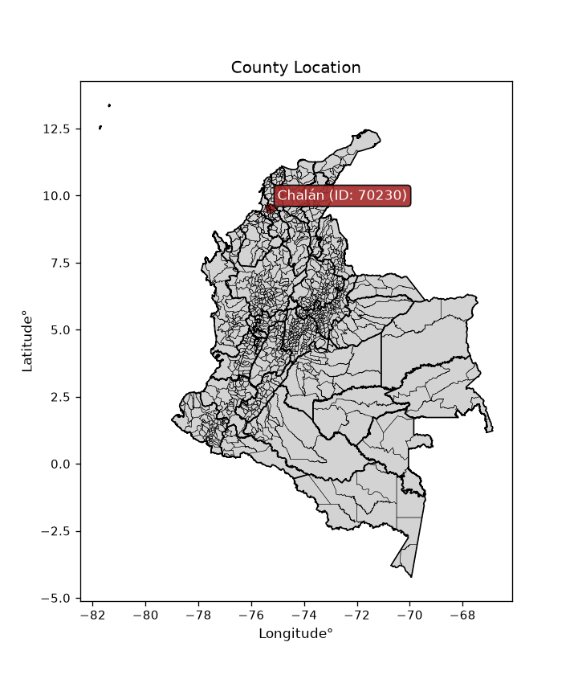
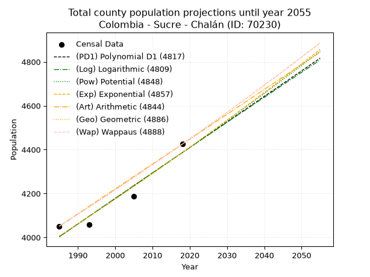
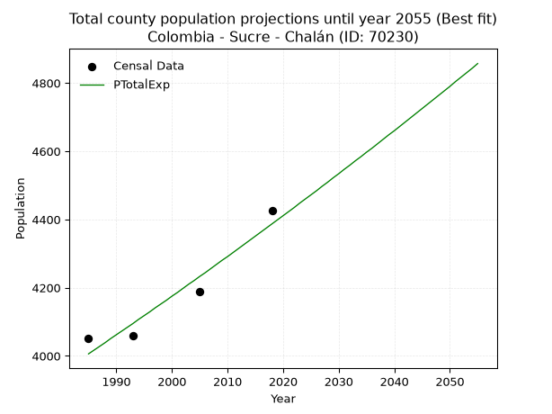
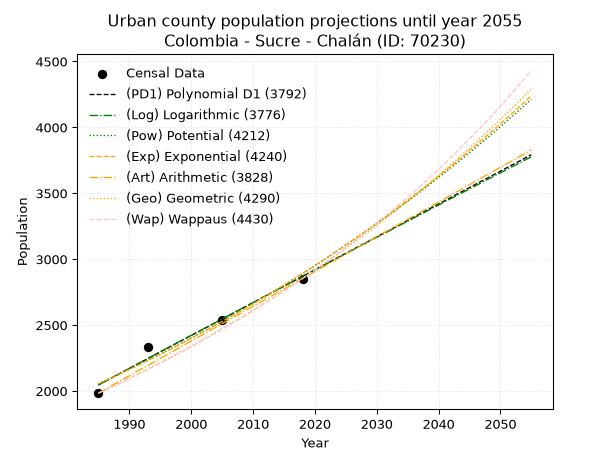
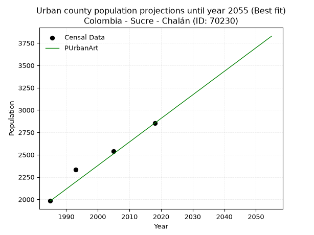
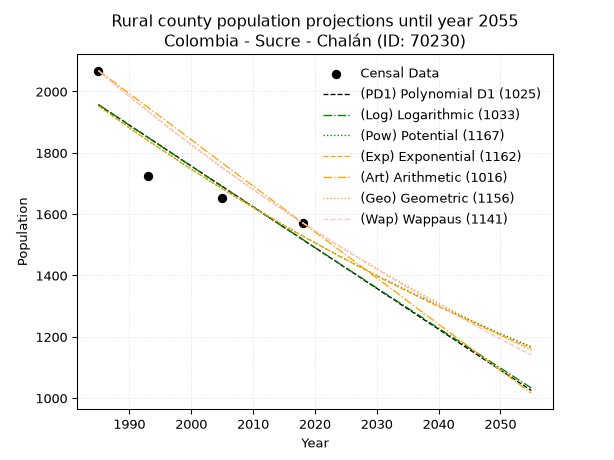
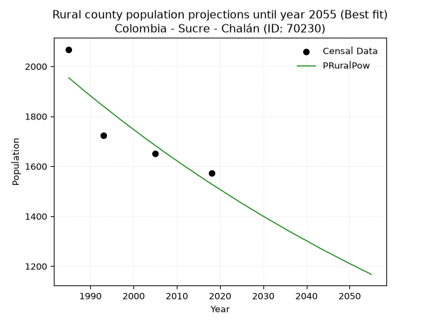

<div align="center">


</div>

# _“Population and Public Services Demand Projections (PPSD) until Year 2050 for Colombia - Sucre - Chalán (ID: 70230)”_
Keywords: `population` `public-service` `projection` `lineal` `polynomial` `logarithmic` `potential` `exponential` `arithmetic` `geometric` `wappaus` `dane` `colombia` `south-america`

PPSD are analytical estimates used by governments and planners to anticipate future changes in population size, age distribution, and the resulting community needs for utilities, healthcare, education, and infrastructure as sizing future water treatment facilities, electrical grids, and road networks based on spatial growth.

<div align="center">

</img>

</div>


> **General running parameters**: • app_version: _v20260806_. • Python version: _3.14.7_. • Pandas version: _3.0.5_. • NumPy version: _2.5.1_. • Creates, save and include plots into reports (create_plot): _False_. • Projection until year: _2050_. • Process polynomial degree 2 and up: _False_. • Process Wappaus: _True_. • Process Wappaus: _True_. • Set negative values to zero: _True_. • Set infinite values to zero: _True_. • Drop dataset notes: _True_. 
<div align="center">

Dynamic map: [:earth_americas:Google](http://maps.google.com/maps?q=9.545351523,-75.3126971) [:earth_americas:OSM](https://www.openstreetmap.org/#map=18/9.545351523/-75.3126971&layers=P) [:earth_americas:Bing](https://www.bing.com/maps?cp=9.545351523~-75.3126971&lvl=18) [:earth_americas:Apple](https://maps.apple.com/frame?center=9.545351523%2C-75.3126971&span=0.003%2C0.006)

</div>


<div align="center">

```geojson
{
  "type": "Feature",
  "geometry": {
    "type": "Point", 
    "coordinates": [-75.3126971, 9.545351523]
  }, 
  "properties": {
    "Name": "Colombia - Sucre - Chalán (ID: 70230)"
  }
}
```

</div>


## 0. Census Data (4 records)

Census data are official statistics collected by a government about the people and housing in a country. They usually include counts of total population, age, sex, race, income, education, and jobs.

📅Global census file: [Population.xlsx](../data/Population.xlsx)

| Source   |   Year |   CountryID | CountryName   |   StateID | StateName   |   CountyID | CountyName   |   PTotal |   PUrban |   PRural |
|:---------|-------:|------------:|:--------------|----------:|:------------|-----------:|:-------------|---------:|---------:|---------:|
| DANE     |   1985 |          57 | Colombia      |        70 | Sucre       |      70230 | Chalán       |     4051 |     1983 |     2068 |
| DANE     |   1993 |          57 | Colombia      |        70 | Sucre       |      70230 | Chalán       |     4058 |     2334 |     1724 |
| DANE     |   2005 |          57 | Colombia      |        70 | Sucre       |      70230 | Chalán       |     4188 |     2537 |     1651 |
| DANE     |   2018 |          57 | Colombia      |        70 | Sucre       |      70230 | Chalán       |     4425 |     2853 |     1572 |

> 🔥Some records could had specific notes about the registered values or the corresponding urban or rural distribution.

📅   [RUPS](https://www.datos.gov.co/Hacienda-y-Cr-dito-P-blico/Registro-nico-de-Prestadores-de-Servicios-P-blicos/4qkq-csdn/about_data) - Local public utility companies: [RUPS.csv](../data/RUPS.xlsx)

 | SERVICIO       | ESTADO    | NOMBRE                                                                    | NIT         | DEPARTAMENTO_DOMICILIO   | MUNICIPIO_DOMICILIO   | DIRECCION       |   TELEFONO | EMAIL                          | TIPO_PRESTADOR                             | CLASIFICACION                 |
|:---------------|:----------|:--------------------------------------------------------------------------|:------------|:-------------------------|:----------------------|:----------------|-----------:|:-------------------------------|:-------------------------------------------|:------------------------------|
| ACUEDUCTO      | OPERATIVA | EMPRESA DE ACUEDUCTO ALCANTARILLADO Y ASEO DEL MUNICIPIO DE CHALAN SA ESP | 900306983-4 | SUCRE                    | CHALAN                | CL 6A CR 3 - 20 |    0000000 | aguasdechalansaesp@hotmail.com | SOCIEDADES (EMPRESA DE SERVICIOS PUBLICOS) | MENOR O IGUAL A 2500 USUARIOS |
| ALCANTARILLADO | OPERATIVA | EMPRESA DE ACUEDUCTO ALCANTARILLADO Y ASEO DEL MUNICIPIO DE CHALAN SA ESP | 900306983-4 | SUCRE                    | CHALAN                | CL 6A CR 3 - 20 |    0000000 | aguasdechalansaesp@hotmail.com | SOCIEDADES (EMPRESA DE SERVICIOS PUBLICOS) | MENOR O IGUAL A 2500 USUARIOS |

## 1. Total

### 1.1. Coefficients and Parameters

* (PD1) Polynomial Deg 1: 11.623444399839295, -19069.294660778556 (lineal)
* (Log) Logarithmic: 23249.62086650777, -172540.05451709448
* (Pow) Potential: 5.501871568978157, -14.541146737053973
* (Exp) Exponential: 0.0027505522760542167, 17.043177603210857
* (Art) Arithmetic: Year diff. 2018 - 1985 = 33, Population diff. 4425 - 4051 = 374, Annual growth = 11.333333333333334
* (Geo) Geometric: Year diff. 2018 - 1985 = 33, Population diff. 4425 - 4051 = 374, Annual growth % = 0.0026795385402407224
* (Wap) Wappaus: i = 0.26742173981437783, Condition values only valid for < 200)

<sub>
Wappaus condition values: ['0.00', '0.27', '0.53', '0.80', '1.07', '1.34', '1.60', '1.87', '2.14', '2.41', '2.67', '2.94', '3.21', '3.48', '3.74', '4.01', '4.28', '4.55', '4.81', '5.08', '5.35', '5.62', '5.88', '6.15', '6.42', '6.69', '6.95', '7.22', '7.49', '7.76', '8.02', '8.29', '8.56', '8.82', '9.09', '9.36', '9.63', '9.89', '10.16', '10.43', '10.70', '10.96', '11.23', '11.50', '11.77', '12.03', '12.30', '12.57', '12.84', '13.10', '13.37', '13.64', '13.91', '14.17', '14.44', '14.71', '14.98', '15.24', '15.51', '15.78', '16.05', '16.31', '16.58', '16.85', '17.11', '17.38']
</sub>


### 1.2. Projected Dataset

|   Year |   CountyID |   PTotalPD1 |   PTotalLog |   PTotalPow |   PTotalExp |   PTotalArt |   PTotalGeo |   PTotalWap |
|-------:|-----------:|------------:|------------:|------------:|------------:|------------:|------------:|------------:|
|   1985 |      70230 |        4003 |        4003 |        4006 |        4006 |        4051 |        4051 |        4051 |
|   1986 |      70230 |        4015 |        4015 |        4017 |        4017 |        4062 |        4062 |        4062 |
|   1987 |      70230 |        4026 |        4026 |        4028 |        4028 |        4074 |        4073 |        4073 |
|   1988 |      70230 |        4038 |        4038 |        4039 |        4039 |        4085 |        4084 |        4084 |
|   1989 |      70230 |        4050 |        4050 |        4051 |        4051 |        4096 |        4095 |        4095 |
|   1990 |      70230 |        4061 |        4062 |        4062 |        4062 |        4108 |        4106 |        4106 |
|   1991 |      70230 |        4073 |        4073 |        4073 |        4073 |        4119 |        4117 |        4117 |
|   1992 |      70230 |        4085 |        4085 |        4084 |        4084 |        4130 |        4128 |        4128 |
|   1993 |      70230 |        4096 |        4097 |        4096 |        4095 |        4142 |        4139 |        4139 |
|   1994 |      70230 |        4108 |        4108 |        4107 |        4107 |        4153 |        4150 |        4150 |
|   1995 |      70230 |        4119 |        4120 |        4118 |        4118 |        4164 |        4161 |        4161 |
|   1996 |      70230 |        4131 |        4132 |        4130 |        4129 |        4176 |        4172 |        4172 |
|   1997 |      70230 |        4143 |        4143 |        4141 |        4141 |        4187 |        4183 |        4183 |
|   1998 |      70230 |        4154 |        4155 |        4152 |        4152 |        4198 |        4194 |        4194 |
|   1999 |      70230 |        4166 |        4166 |        4164 |        4163 |        4210 |        4206 |        4206 |
|   2000 |      70230 |        4178 |        4178 |        4175 |        4175 |        4221 |        4217 |        4217 |
|   2001 |      70230 |        4189 |        4190 |        4187 |        4186 |        4232 |        4228 |        4228 |
|   2002 |      70230 |        4201 |        4201 |        4198 |        4198 |        4244 |        4240 |        4239 |
|   2003 |      70230 |        4212 |        4213 |        4210 |        4210 |        4255 |        4251 |        4251 |
|   2004 |      70230 |        4224 |        4224 |        4222 |        4221 |        4266 |        4262 |        4262 |
|   2005 |      70230 |        4236 |        4236 |        4233 |        4233 |        4278 |        4274 |        4274 |
|   2006 |      70230 |        4247 |        4248 |        4245 |        4244 |        4289 |        4285 |        4285 |
|   2007 |      70230 |        4259 |        4259 |        4256 |        4256 |        4300 |        4297 |        4297 |
|   2008 |      70230 |        4271 |        4271 |        4268 |        4268 |        4312 |        4308 |        4308 |
|   2009 |      70230 |        4282 |        4282 |        4280 |        4280 |        4323 |        4320 |        4320 |
|   2010 |      70230 |        4294 |        4294 |        4292 |        4291 |        4334 |        4331 |        4331 |
|   2011 |      70230 |        4305 |        4306 |        4303 |        4303 |        4346 |        4343 |        4343 |
|   2012 |      70230 |        4317 |        4317 |        4315 |        4315 |        4357 |        4355 |        4354 |
|   2013 |      70230 |        4329 |        4329 |        4327 |        4327 |        4368 |        4366 |        4366 |
|   2014 |      70230 |        4340 |        4340 |        4339 |        4339 |        4380 |        4378 |        4378 |
|   2015 |      70230 |        4352 |        4352 |        4351 |        4351 |        4391 |        4390 |        4390 |
|   2016 |      70230 |        4364 |        4363 |        4363 |        4363 |        4402 |        4401 |        4401 |
|   2017 |      70230 |        4375 |        4375 |        4374 |        4375 |        4414 |        4413 |        4413 |
|   2018 |      70230 |        4387 |        4386 |        4386 |        4387 |        4425 |        4425 |        4425 |
|   2019 |      70230 |        4398 |        4398 |        4398 |        4399 |        4436 |        4437 |        4437 |
|   2020 |      70230 |        4410 |        4409 |        4410 |        4411 |        4448 |        4449 |        4449 |
|   2021 |      70230 |        4422 |        4421 |        4422 |        4423 |        4459 |        4461 |        4461 |
|   2022 |      70230 |        4433 |        4432 |        4434 |        4435 |        4470 |        4473 |        4473 |
|   2023 |      70230 |        4445 |        4444 |        4446 |        4448 |        4482 |        4485 |        4485 |
|   2024 |      70230 |        4457 |        4455 |        4459 |        4460 |        4493 |        4497 |        4497 |
|   2025 |      70230 |        4468 |        4467 |        4471 |        4472 |        4504 |        4509 |        4509 |
|   2026 |      70230 |        4480 |        4478 |        4483 |        4484 |        4516 |        4521 |        4521 |
|   2027 |      70230 |        4491 |        4490 |        4495 |        4497 |        4527 |        4533 |        4533 |
|   2028 |      70230 |        4503 |        4501 |        4507 |        4509 |        4538 |        4545 |        4545 |
|   2029 |      70230 |        4515 |        4513 |        4520 |        4522 |        4550 |        4557 |        4557 |
|   2030 |      70230 |        4526 |        4524 |        4532 |        4534 |        4561 |        4569 |        4570 |
|   2031 |      70230 |        4538 |        4536 |        4544 |        4547 |        4572 |        4582 |        4582 |
|   2032 |      70230 |        4550 |        4547 |        4556 |        4559 |        4584 |        4594 |        4594 |
|   2033 |      70230 |        4561 |        4559 |        4569 |        4572 |        4595 |        4606 |        4607 |
|   2034 |      70230 |        4573 |        4570 |        4581 |        4584 |        4606 |        4619 |        4619 |
|   2035 |      70230 |        4584 |        4581 |        4594 |        4597 |        4618 |        4631 |        4631 |
|   2036 |      70230 |        4596 |        4593 |        4606 |        4609 |        4629 |        4643 |        4644 |
|   2037 |      70230 |        4608 |        4604 |        4618 |        4622 |        4640 |        4656 |        4656 |
|   2038 |      70230 |        4619 |        4616 |        4631 |        4635 |        4652 |        4668 |        4669 |
|   2039 |      70230 |        4631 |        4627 |        4643 |        4648 |        4663 |        4681 |        4682 |
|   2040 |      70230 |        4643 |        4638 |        4656 |        4660 |        4674 |        4693 |        4694 |
|   2041 |      70230 |        4654 |        4650 |        4669 |        4673 |        4686 |        4706 |        4707 |
|   2042 |      70230 |        4666 |        4661 |        4681 |        4686 |        4697 |        4719 |        4719 |
|   2043 |      70230 |        4677 |        4673 |        4694 |        4699 |        4708 |        4731 |        4732 |
|   2044 |      70230 |        4689 |        4684 |        4706 |        4712 |        4720 |        4744 |        4745 |
|   2045 |      70230 |        4701 |        4695 |        4719 |        4725 |        4731 |        4757 |        4758 |
|   2046 |      70230 |        4712 |        4707 |        4732 |        4738 |        4742 |        4769 |        4771 |
|   2047 |      70230 |        4724 |        4718 |        4745 |        4751 |        4754 |        4782 |        4783 |
|   2048 |      70230 |        4736 |        4729 |        4757 |        4764 |        4765 |        4795 |        4796 |
|   2049 |      70230 |        4747 |        4741 |        4770 |        4777 |        4776 |        4808 |        4809 |
|   2050 |      70230 |        4759 |        4752 |        4783 |        4790 |        4788 |        4821 |        4822 |
<div align="center">

</img>

</div>


### 1.3. Best fit with absolute and relative error (%)

Relative error puts that difference into context by dividing the absolute error by the true value, creating a unitless ratio or percentage that shows the scale of the mistake.

Absolute and relative error

|   Year | Source   |   CountryID | CountryName   |   StateID | StateName   |   CountyID_x | CountyName   |   PTotal |   PUrban |   PRural |   CountyID_y |   PTotalPD1 |   PTotalLog |   PTotalPow |   PTotalExp |   PTotalArt |   PTotalGeo |   PTotalWap |   PTotalPD1AbsError |   PTotalLogAbsError |   PTotalPowAbsError |   PTotalExpAbsError |   PTotalArtAbsError |   PTotalGeoAbsError |   PTotalWapAbsError |   PTotalPD1RelError |   PTotalLogRelError |   PTotalPowRelError |   PTotalExpRelError |   PTotalArtRelError |   PTotalGeoRelError |   PTotalWapRelError |
|-------:|:---------|------------:|:--------------|----------:|:------------|-------------:|:-------------|---------:|---------:|---------:|-------------:|------------:|------------:|------------:|------------:|------------:|------------:|------------:|--------------------:|--------------------:|--------------------:|--------------------:|--------------------:|--------------------:|--------------------:|--------------------:|--------------------:|--------------------:|--------------------:|--------------------:|--------------------:|--------------------:|
|   1985 | DANE     |          57 | Colombia      |        70 | Sucre       |        70230 | Chalán       |     4051 |     1983 |     2068 |        70230 |        4003 |        4003 |        4006 |        4006 |        4051 |        4051 |        4051 |                  48 |                  48 |                  45 |                  45 |                   0 |                   0 |                   0 |            1.18489  |            1.18489  |            1.11084  |            1.11084  |             0       |             0       |             0       |
|   1993 | DANE     |          57 | Colombia      |        70 | Sucre       |        70230 | Chalán       |     4058 |     2334 |     1724 |        70230 |        4096 |        4097 |        4096 |        4095 |        4142 |        4139 |        4139 |                  38 |                  39 |                  38 |                  37 |                  84 |                  81 |                  81 |            0.936422 |            0.961065 |            0.936422 |            0.911779 |             2.06999 |             1.99606 |             1.99606 |
|   2005 | DANE     |          57 | Colombia      |        70 | Sucre       |        70230 | Chalán       |     4188 |     2537 |     1651 |        70230 |        4236 |        4236 |        4233 |        4233 |        4278 |        4274 |        4274 |                  48 |                  48 |                  45 |                  45 |                  90 |                  86 |                  86 |            1.14613  |            1.14613  |            1.0745   |            1.0745   |             2.149   |             2.05349 |             2.05349 |
|   2018 | DANE     |          57 | Colombia      |        70 | Sucre       |        70230 | Chalán       |     4425 |     2853 |     1572 |        70230 |        4387 |        4386 |        4386 |        4387 |        4425 |        4425 |        4425 |                  38 |                  39 |                  39 |                  38 |                   0 |                   0 |                   0 |            0.858757 |            0.881356 |            0.881356 |            0.858757 |             0       |             0       |             0       |

Relative error mean

| Method    |   RelError | Best   |
|:----------|-----------:|:-------|
| PTotalPD1 |   1.03155  |        |
| PTotalLog |   1.04336  |        |
| PTotalPow |   1.00078  |        |
| PTotalExp |   0.988968 | True   |
| PTotalArt |   1.05475  |        |
| PTotalGeo |   1.01239  |        |
| PTotalWap |   1.01239  |        |

💙Best method: _**PTotalExp**_
<div align="center">

</img>

</div>


### 1.4. Fresh water supply demand in liters per capita per day (lpcd)

The fresh water supply demand typically ranges from 100 to 300 liters per capita per day (lpcd) for standard domestic and municipal planning, though absolute survival minimums set by the World Health Organization are as low as 7.5 to 20 liters per day, and total consumption in high-income nations can exceed 400 liters.

> `CZ`: Level in meters above the sea level (masl)<br> `WS`: Fresh water supply demand in liters per capita per day (lpcd or l/h/d)<br> `WSAll`: Zonal fresh water supply demand in liters per second (l/s)<br> `A`: Zonal area in square meters<br> `DP`: Population density (people/hectare or p/ha)

Reference values (RAS Colombia)

|    CZ |   WS |
|------:|-----:|
|  1000 |  120 |
|  2000 |  130 |
| 99999 |  140 |

County shapefile geometry properties and water supply values

|   CountyID |      ATotal |   CZTotal |   WSTotal |
|-----------:|------------:|----------:|----------:|
|      70230 | 8.52468e+07 |   341.217 |       120 |

Projected values for best method: PTotalExp

|   CountyID |   Year |   PTotalExp |   DPTotal |   WSTotal |   WSTotalAll |
|-----------:|-------:|------------:|----------:|----------:|-------------:|
|      70230 |   1985 |        4006 |      0.47 |       120 |      5.56389 |
|      70230 |   1986 |        4017 |      0.47 |       120 |      5.57917 |
|      70230 |   1987 |        4028 |      0.47 |       120 |      5.59444 |
|      70230 |   1988 |        4039 |      0.47 |       120 |      5.60972 |
|      70230 |   1989 |        4051 |      0.48 |       120 |      5.62639 |
|      70230 |   1990 |        4062 |      0.48 |       120 |      5.64167 |
|      70230 |   1991 |        4073 |      0.48 |       120 |      5.65694 |
|      70230 |   1992 |        4084 |      0.48 |       120 |      5.67222 |
|      70230 |   1993 |        4095 |      0.48 |       120 |      5.6875  |
|      70230 |   1994 |        4107 |      0.48 |       120 |      5.70417 |
|      70230 |   1995 |        4118 |      0.48 |       120 |      5.71944 |
|      70230 |   1996 |        4129 |      0.48 |       120 |      5.73472 |
|      70230 |   1997 |        4141 |      0.49 |       120 |      5.75139 |
|      70230 |   1998 |        4152 |      0.49 |       120 |      5.76667 |
|      70230 |   1999 |        4163 |      0.49 |       120 |      5.78194 |
|      70230 |   2000 |        4175 |      0.49 |       120 |      5.79861 |
|      70230 |   2001 |        4186 |      0.49 |       120 |      5.81389 |
|      70230 |   2002 |        4198 |      0.49 |       120 |      5.83056 |
|      70230 |   2003 |        4210 |      0.49 |       120 |      5.84722 |
|      70230 |   2004 |        4221 |      0.5  |       120 |      5.8625  |
|      70230 |   2005 |        4233 |      0.5  |       120 |      5.87917 |
|      70230 |   2006 |        4244 |      0.5  |       120 |      5.89444 |
|      70230 |   2007 |        4256 |      0.5  |       120 |      5.91111 |
|      70230 |   2008 |        4268 |      0.5  |       120 |      5.92778 |
|      70230 |   2009 |        4280 |      0.5  |       120 |      5.94444 |
|      70230 |   2010 |        4291 |      0.5  |       120 |      5.95972 |
|      70230 |   2011 |        4303 |      0.5  |       120 |      5.97639 |
|      70230 |   2012 |        4315 |      0.51 |       120 |      5.99306 |
|      70230 |   2013 |        4327 |      0.51 |       120 |      6.00972 |
|      70230 |   2014 |        4339 |      0.51 |       120 |      6.02639 |
|      70230 |   2015 |        4351 |      0.51 |       120 |      6.04306 |
|      70230 |   2016 |        4363 |      0.51 |       120 |      6.05972 |
|      70230 |   2017 |        4375 |      0.51 |       120 |      6.07639 |
|      70230 |   2018 |        4387 |      0.51 |       120 |      6.09306 |
|      70230 |   2019 |        4399 |      0.52 |       120 |      6.10972 |
|      70230 |   2020 |        4411 |      0.52 |       120 |      6.12639 |
|      70230 |   2021 |        4423 |      0.52 |       120 |      6.14306 |
|      70230 |   2022 |        4435 |      0.52 |       120 |      6.15972 |
|      70230 |   2023 |        4448 |      0.52 |       120 |      6.17778 |
|      70230 |   2024 |        4460 |      0.52 |       120 |      6.19444 |
|      70230 |   2025 |        4472 |      0.52 |       120 |      6.21111 |
|      70230 |   2026 |        4484 |      0.53 |       120 |      6.22778 |
|      70230 |   2027 |        4497 |      0.53 |       120 |      6.24583 |
|      70230 |   2028 |        4509 |      0.53 |       120 |      6.2625  |
|      70230 |   2029 |        4522 |      0.53 |       120 |      6.28056 |
|      70230 |   2030 |        4534 |      0.53 |       120 |      6.29722 |
|      70230 |   2031 |        4547 |      0.53 |       120 |      6.31528 |
|      70230 |   2032 |        4559 |      0.53 |       120 |      6.33194 |
|      70230 |   2033 |        4572 |      0.54 |       120 |      6.35    |
|      70230 |   2034 |        4584 |      0.54 |       120 |      6.36667 |
|      70230 |   2035 |        4597 |      0.54 |       120 |      6.38472 |
|      70230 |   2036 |        4609 |      0.54 |       120 |      6.40139 |
|      70230 |   2037 |        4622 |      0.54 |       120 |      6.41944 |
|      70230 |   2038 |        4635 |      0.54 |       120 |      6.4375  |
|      70230 |   2039 |        4648 |      0.55 |       120 |      6.45556 |
|      70230 |   2040 |        4660 |      0.55 |       120 |      6.47222 |
|      70230 |   2041 |        4673 |      0.55 |       120 |      6.49028 |
|      70230 |   2042 |        4686 |      0.55 |       120 |      6.50833 |
|      70230 |   2043 |        4699 |      0.55 |       120 |      6.52639 |
|      70230 |   2044 |        4712 |      0.55 |       120 |      6.54444 |
|      70230 |   2045 |        4725 |      0.55 |       120 |      6.5625  |
|      70230 |   2046 |        4738 |      0.56 |       120 |      6.58056 |
|      70230 |   2047 |        4751 |      0.56 |       120 |      6.59861 |
|      70230 |   2048 |        4764 |      0.56 |       120 |      6.61667 |
|      70230 |   2049 |        4777 |      0.56 |       120 |      6.63472 |
|      70230 |   2050 |        4790 |      0.56 |       120 |      6.65278 |

## 2. Urban

### 2.1. Coefficients and Parameters

* (PD1) Polynomial Deg 1: 24.936571657968457, -47452.627458851406 (lineal)
* (Log) Logarithmic: 49926.03032968682, -377061.40661804785
* (Pow) Potential: 20.724780289148722, -65.03280999184693
* (Exp) Exponential: 0.010349990026611211, 2.456125774968341e-06
* (Art) Arithmetic: Year diff. 2018 - 1985 = 33, Population diff. 2853 - 1983 = 870, Annual growth = 26.363636363636363
* (Geo) Geometric: Year diff. 2018 - 1985 = 33, Population diff. 2853 - 1983 = 870, Annual growth % = 0.011084014570764467
* (Wap) Wappaus: i = 1.090307541920445, Condition values only valid for < 200)

<sub>
Wappaus condition values: ['0.00', '1.09', '2.18', '3.27', '4.36', '5.45', '6.54', '7.63', '8.72', '9.81', '10.90', '11.99', '13.08', '14.17', '15.26', '16.35', '17.44', '18.54', '19.63', '20.72', '21.81', '22.90', '23.99', '25.08', '26.17', '27.26', '28.35', '29.44', '30.53', '31.62', '32.71', '33.80', '34.89', '35.98', '37.07', '38.16', '39.25', '40.34', '41.43', '42.52', '43.61', '44.70', '45.79', '46.88', '47.97', '49.06', '50.15', '51.24', '52.33', '53.43', '54.52', '55.61', '56.70', '57.79', '58.88', '59.97', '61.06', '62.15', '63.24', '64.33', '65.42', '66.51', '67.60', '68.69', '69.78', '70.87']
</sub>


### 2.2. Projected Dataset

|   Year |   CountyID |   PUrbanPD1 |   PUrbanLog |   PUrbanPow |   PUrbanExp |   PUrbanArt |   PUrbanGeo |   PUrbanWap |
|-------:|-----------:|------------:|------------:|------------:|------------:|------------:|------------:|------------:|
|   1985 |      70230 |        2046 |        2046 |        2054 |        2055 |        1983 |        1983 |        1983 |
|   1986 |      70230 |        2071 |        2071 |        2075 |        2076 |        2009 |        2005 |        2005 |
|   1987 |      70230 |        2096 |        2096 |        2097 |        2098 |        2036 |        2027 |        2027 |
|   1988 |      70230 |        2121 |        2121 |        2119 |        2119 |        2062 |        2050 |        2049 |
|   1989 |      70230 |        2146 |        2146 |        2141 |        2141 |        2088 |        2072 |        2071 |
|   1990 |      70230 |        2171 |        2171 |        2164 |        2164 |        2115 |        2095 |        2094 |
|   1991 |      70230 |        2196 |        2196 |        2186 |        2186 |        2141 |        2119 |        2117 |
|   1992 |      70230 |        2221 |        2221 |        2209 |        2209 |        2168 |        2142 |        2140 |
|   1993 |      70230 |        2246 |        2246 |        2232 |        2232 |        2194 |        2166 |        2164 |
|   1994 |      70230 |        2271 |        2271 |        2256 |        2255 |        2220 |        2190 |        2188 |
|   1995 |      70230 |        2296 |        2297 |        2279 |        2279 |        2247 |        2214 |        2212 |
|   1996 |      70230 |        2321 |        2322 |        2303 |        2302 |        2273 |        2239 |        2236 |
|   1997 |      70230 |        2346 |        2347 |        2327 |        2326 |        2299 |        2263 |        2261 |
|   1998 |      70230 |        2371 |        2372 |        2351 |        2350 |        2326 |        2289 |        2286 |
|   1999 |      70230 |        2396 |        2397 |        2376 |        2375 |        2352 |        2314 |        2311 |
|   2000 |      70230 |        2421 |        2421 |        2401 |        2400 |        2378 |        2340 |        2336 |
|   2001 |      70230 |        2445 |        2446 |        2426 |        2425 |        2405 |        2365 |        2362 |
|   2002 |      70230 |        2470 |        2471 |        2451 |        2450 |        2431 |        2392 |        2388 |
|   2003 |      70230 |        2495 |        2496 |        2476 |        2475 |        2458 |        2418 |        2415 |
|   2004 |      70230 |        2520 |        2521 |        2502 |        2501 |        2484 |        2445 |        2441 |
|   2005 |      70230 |        2545 |        2546 |        2528 |        2527 |        2510 |        2472 |        2468 |
|   2006 |      70230 |        2570 |        2571 |        2554 |        2553 |        2537 |        2500 |        2496 |
|   2007 |      70230 |        2595 |        2596 |        2581 |        2580 |        2563 |        2527 |        2523 |
|   2008 |      70230 |        2620 |        2621 |        2608 |        2607 |        2589 |        2555 |        2552 |
|   2009 |      70230 |        2645 |        2646 |        2635 |        2634 |        2616 |        2584 |        2580 |
|   2010 |      70230 |        2670 |        2670 |        2662 |        2661 |        2642 |        2612 |        2609 |
|   2011 |      70230 |        2695 |        2695 |        2690 |        2689 |        2668 |        2641 |        2638 |
|   2012 |      70230 |        2720 |        2720 |        2717 |        2717 |        2695 |        2670 |        2668 |
|   2013 |      70230 |        2745 |        2745 |        2746 |        2745 |        2721 |        2700 |        2697 |
|   2014 |      70230 |        2770 |        2770 |        2774 |        2774 |        2748 |        2730 |        2728 |
|   2015 |      70230 |        2795 |        2795 |        2803 |        2803 |        2774 |        2760 |        2758 |
|   2016 |      70230 |        2820 |        2819 |        2832 |        2832 |        2800 |        2791 |        2790 |
|   2017 |      70230 |        2844 |        2844 |        2861 |        2861 |        2827 |        2822 |        2821 |
|   2018 |      70230 |        2869 |        2869 |        2890 |        2891 |        2853 |        2853 |        2853 |
|   2019 |      70230 |        2894 |        2894 |        2920 |        2921 |        2879 |        2885 |        2885 |
|   2020 |      70230 |        2919 |        2918 |        2950 |        2951 |        2906 |        2917 |        2918 |
|   2021 |      70230 |        2944 |        2943 |        2981 |        2982 |        2932 |        2949 |        2951 |
|   2022 |      70230 |        2969 |        2968 |        3011 |        3013 |        2958 |        2982 |        2985 |
|   2023 |      70230 |        2994 |        2992 |        3042 |        3045 |        2985 |        3015 |        3019 |
|   2024 |      70230 |        3019 |        3017 |        3074 |        3076 |        3011 |        3048 |        3054 |
|   2025 |      70230 |        3044 |        3042 |        3105 |        3108 |        3038 |        3082 |        3089 |
|   2026 |      70230 |        3069 |        3066 |        3137 |        3141 |        3064 |        3116 |        3125 |
|   2027 |      70230 |        3094 |        3091 |        3170 |        3173 |        3090 |        3151 |        3161 |
|   2028 |      70230 |        3119 |        3116 |        3202 |        3206 |        3117 |        3185 |        3197 |
|   2029 |      70230 |        3144 |        3140 |        3235 |        3240 |        3143 |        3221 |        3235 |
|   2030 |      70230 |        3169 |        3165 |        3268 |        3273 |        3169 |        3256 |        3272 |
|   2031 |      70230 |        3194 |        3189 |        3302 |        3307 |        3196 |        3293 |        3310 |
|   2032 |      70230 |        3218 |        3214 |        3336 |        3342 |        3222 |        3329 |        3349 |
|   2033 |      70230 |        3243 |        3239 |        3370 |        3377 |        3248 |        3366 |        3389 |
|   2034 |      70230 |        3268 |        3263 |        3404 |        3412 |        3275 |        3403 |        3429 |
|   2035 |      70230 |        3293 |        3288 |        3439 |        3447 |        3301 |        3441 |        3469 |
|   2036 |      70230 |        3318 |        3312 |        3474 |        3483 |        3328 |        3479 |        3510 |
|   2037 |      70230 |        3343 |        3337 |        3510 |        3519 |        3354 |        3518 |        3552 |
|   2038 |      70230 |        3368 |        3361 |        3546 |        3556 |        3380 |        3557 |        3595 |
|   2039 |      70230 |        3393 |        3386 |        3582 |        3593 |        3407 |        3596 |        3638 |
|   2040 |      70230 |        3418 |        3410 |        3619 |        3630 |        3433 |        3636 |        3681 |
|   2041 |      70230 |        3443 |        3435 |        3656 |        3668 |        3459 |        3676 |        3726 |
|   2042 |      70230 |        3468 |        3459 |        3693 |        3706 |        3486 |        3717 |        3771 |
|   2043 |      70230 |        3493 |        3484 |        3731 |        3745 |        3512 |        3758 |        3817 |
|   2044 |      70230 |        3518 |        3508 |        3769 |        3784 |        3538 |        3800 |        3863 |
|   2045 |      70230 |        3543 |        3532 |        3807 |        3823 |        3565 |        3842 |        3911 |
|   2046 |      70230 |        3568 |        3557 |        3846 |        3863 |        3591 |        3885 |        3959 |
|   2047 |      70230 |        3593 |        3581 |        3885 |        3903 |        3618 |        3928 |        4008 |
|   2048 |      70230 |        3617 |        3606 |        3924 |        3944 |        3644 |        3971 |        4058 |
|   2049 |      70230 |        3642 |        3630 |        3964 |        3985 |        3670 |        4015 |        4108 |
|   2050 |      70230 |        3667 |        3654 |        4005 |        4026 |        3697 |        4060 |        4160 |
<div align="center">

</img>

</div>


### 2.3. Best fit with absolute and relative error (%)

Relative error puts that difference into context by dividing the absolute error by the true value, creating a unitless ratio or percentage that shows the scale of the mistake.

Absolute and relative error

|   Year | Source   |   CountryID | CountryName   |   StateID | StateName   |   CountyID_x | CountyName   |   PTotal |   PUrban |   PRural |   CountyID_y |   PUrbanPD1 |   PUrbanLog |   PUrbanPow |   PUrbanExp |   PUrbanArt |   PUrbanGeo |   PUrbanWap |   PUrbanPD1AbsError |   PUrbanLogAbsError |   PUrbanPowAbsError |   PUrbanExpAbsError |   PUrbanArtAbsError |   PUrbanGeoAbsError |   PUrbanWapAbsError |   PUrbanPD1RelError |   PUrbanLogRelError |   PUrbanPowRelError |   PUrbanExpRelError |   PUrbanArtRelError |   PUrbanGeoRelError |   PUrbanWapRelError |
|-------:|:---------|------------:|:--------------|----------:|:------------|-------------:|:-------------|---------:|---------:|---------:|-------------:|------------:|------------:|------------:|------------:|------------:|------------:|------------:|--------------------:|--------------------:|--------------------:|--------------------:|--------------------:|--------------------:|--------------------:|--------------------:|--------------------:|--------------------:|--------------------:|--------------------:|--------------------:|--------------------:|
|   1985 | DANE     |          57 | Colombia      |        70 | Sucre       |        70230 | Chalán       |     4051 |     1983 |     2068 |        70230 |        2046 |        2046 |        2054 |        2055 |        1983 |        1983 |        1983 |                  63 |                  63 |                  71 |                  72 |                   0 |                   0 |                   0 |            3.177    |            3.177    |             3.58043 |            3.63086  |             0       |             0       |             0       |
|   1993 | DANE     |          57 | Colombia      |        70 | Sucre       |        70230 | Chalán       |     4058 |     2334 |     1724 |        70230 |        2246 |        2246 |        2232 |        2232 |        2194 |        2166 |        2164 |                  88 |                  88 |                 102 |                 102 |                 140 |                 168 |                 170 |            3.77035  |            3.77035  |             4.37018 |            4.37018  |             5.99829 |             7.19794 |             7.28363 |
|   2005 | DANE     |          57 | Colombia      |        70 | Sucre       |        70230 | Chalán       |     4188 |     2537 |     1651 |        70230 |        2545 |        2546 |        2528 |        2527 |        2510 |        2472 |        2468 |                   8 |                   9 |                   9 |                  10 |                  27 |                  65 |                  69 |            0.315333 |            0.35475  |             0.35475 |            0.394166 |             1.06425 |             2.56208 |             2.71975 |
|   2018 | DANE     |          57 | Colombia      |        70 | Sucre       |        70230 | Chalán       |     4425 |     2853 |     1572 |        70230 |        2869 |        2869 |        2890 |        2891 |        2853 |        2853 |        2853 |                  16 |                  16 |                  37 |                  38 |                   0 |                   0 |                   0 |            0.560813 |            0.560813 |             1.29688 |            1.33193  |             0       |             0       |             0       |

Relative error mean

| Method    |   RelError | Best   |
|:----------|-----------:|:-------|
| PUrbanPD1 |    1.95588 |        |
| PUrbanLog |    1.96573 |        |
| PUrbanPow |    2.40056 |        |
| PUrbanExp |    2.43178 |        |
| PUrbanArt |    1.76563 | True   |
| PUrbanGeo |    2.44001 |        |
| PUrbanWap |    2.50085 |        |

💙Best method: _**PUrbanArt**_
<div align="center">

</img>

</div>


### 2.4. Fresh water supply demand in liters per capita per day (lpcd)

The fresh water supply demand typically ranges from 100 to 300 liters per capita per day (lpcd) for standard domestic and municipal planning, though absolute survival minimums set by the World Health Organization are as low as 7.5 to 20 liters per day, and total consumption in high-income nations can exceed 400 liters.

> `CZ`: Level in meters above the sea level (masl)<br> `WS`: Fresh water supply demand in liters per capita per day (lpcd or l/h/d)<br> `WSAll`: Zonal fresh water supply demand in liters per second (l/s)<br> `A`: Zonal area in square meters<br> `DP`: Population density (people/hectare or p/ha)

Reference values (RAS Colombia)

|    CZ |   WS |
|------:|-----:|
|  1000 |  120 |
|  2000 |  130 |
| 99999 |  140 |

County shapefile geometry properties and water supply values

|   CountyID |   AUrban |   CZUrban |   WSUrban |
|-----------:|---------:|----------:|----------:|
|      70230 |   494166 |    287.29 |       120 |

Projected values for best method: PUrbanArt

|   CountyID |   Year |   PUrbanArt |   DPUrban |   WSUrban |   WSUrbanAll |
|-----------:|-------:|------------:|----------:|----------:|-------------:|
|      70230 |   1985 |        1983 |     40.13 |       120 |      2.75417 |
|      70230 |   1986 |        2009 |     40.65 |       120 |      2.79028 |
|      70230 |   1987 |        2036 |     41.2  |       120 |      2.82778 |
|      70230 |   1988 |        2062 |     41.73 |       120 |      2.86389 |
|      70230 |   1989 |        2088 |     42.25 |       120 |      2.9     |
|      70230 |   1990 |        2115 |     42.8  |       120 |      2.9375  |
|      70230 |   1991 |        2141 |     43.33 |       120 |      2.97361 |
|      70230 |   1992 |        2168 |     43.87 |       120 |      3.01111 |
|      70230 |   1993 |        2194 |     44.4  |       120 |      3.04722 |
|      70230 |   1994 |        2220 |     44.92 |       120 |      3.08333 |
|      70230 |   1995 |        2247 |     45.47 |       120 |      3.12083 |
|      70230 |   1996 |        2273 |     46    |       120 |      3.15694 |
|      70230 |   1997 |        2299 |     46.52 |       120 |      3.19306 |
|      70230 |   1998 |        2326 |     47.07 |       120 |      3.23056 |
|      70230 |   1999 |        2352 |     47.6  |       120 |      3.26667 |
|      70230 |   2000 |        2378 |     48.12 |       120 |      3.30278 |
|      70230 |   2001 |        2405 |     48.67 |       120 |      3.34028 |
|      70230 |   2002 |        2431 |     49.19 |       120 |      3.37639 |
|      70230 |   2003 |        2458 |     49.74 |       120 |      3.41389 |
|      70230 |   2004 |        2484 |     50.27 |       120 |      3.45    |
|      70230 |   2005 |        2510 |     50.79 |       120 |      3.48611 |
|      70230 |   2006 |        2537 |     51.34 |       120 |      3.52361 |
|      70230 |   2007 |        2563 |     51.87 |       120 |      3.55972 |
|      70230 |   2008 |        2589 |     52.39 |       120 |      3.59583 |
|      70230 |   2009 |        2616 |     52.94 |       120 |      3.63333 |
|      70230 |   2010 |        2642 |     53.46 |       120 |      3.66944 |
|      70230 |   2011 |        2668 |     53.99 |       120 |      3.70556 |
|      70230 |   2012 |        2695 |     54.54 |       120 |      3.74306 |
|      70230 |   2013 |        2721 |     55.06 |       120 |      3.77917 |
|      70230 |   2014 |        2748 |     55.61 |       120 |      3.81667 |
|      70230 |   2015 |        2774 |     56.13 |       120 |      3.85278 |
|      70230 |   2016 |        2800 |     56.66 |       120 |      3.88889 |
|      70230 |   2017 |        2827 |     57.21 |       120 |      3.92639 |
|      70230 |   2018 |        2853 |     57.73 |       120 |      3.9625  |
|      70230 |   2019 |        2879 |     58.26 |       120 |      3.99861 |
|      70230 |   2020 |        2906 |     58.81 |       120 |      4.03611 |
|      70230 |   2021 |        2932 |     59.33 |       120 |      4.07222 |
|      70230 |   2022 |        2958 |     59.86 |       120 |      4.10833 |
|      70230 |   2023 |        2985 |     60.4  |       120 |      4.14583 |
|      70230 |   2024 |        3011 |     60.93 |       120 |      4.18194 |
|      70230 |   2025 |        3038 |     61.48 |       120 |      4.21944 |
|      70230 |   2026 |        3064 |     62    |       120 |      4.25556 |
|      70230 |   2027 |        3090 |     62.53 |       120 |      4.29167 |
|      70230 |   2028 |        3117 |     63.08 |       120 |      4.32917 |
|      70230 |   2029 |        3143 |     63.6  |       120 |      4.36528 |
|      70230 |   2030 |        3169 |     64.13 |       120 |      4.40139 |
|      70230 |   2031 |        3196 |     64.67 |       120 |      4.43889 |
|      70230 |   2032 |        3222 |     65.2  |       120 |      4.475   |
|      70230 |   2033 |        3248 |     65.73 |       120 |      4.51111 |
|      70230 |   2034 |        3275 |     66.27 |       120 |      4.54861 |
|      70230 |   2035 |        3301 |     66.8  |       120 |      4.58472 |
|      70230 |   2036 |        3328 |     67.35 |       120 |      4.62222 |
|      70230 |   2037 |        3354 |     67.87 |       120 |      4.65833 |
|      70230 |   2038 |        3380 |     68.4  |       120 |      4.69444 |
|      70230 |   2039 |        3407 |     68.94 |       120 |      4.73194 |
|      70230 |   2040 |        3433 |     69.47 |       120 |      4.76806 |
|      70230 |   2041 |        3459 |     70    |       120 |      4.80417 |
|      70230 |   2042 |        3486 |     70.54 |       120 |      4.84167 |
|      70230 |   2043 |        3512 |     71.07 |       120 |      4.87778 |
|      70230 |   2044 |        3538 |     71.6  |       120 |      4.91389 |
|      70230 |   2045 |        3565 |     72.14 |       120 |      4.95139 |
|      70230 |   2046 |        3591 |     72.67 |       120 |      4.9875  |
|      70230 |   2047 |        3618 |     73.21 |       120 |      5.025   |
|      70230 |   2048 |        3644 |     73.74 |       120 |      5.06111 |
|      70230 |   2049 |        3670 |     74.27 |       120 |      5.09722 |
|      70230 |   2050 |        3697 |     74.81 |       120 |      5.13472 |

## 3. Rural

### 3.1. Coefficients and Parameters

* (PD1) Polynomial Deg 1: -13.31312725812922, 28383.332798072974 (lineal)
* (Log) Logarithmic: -26676.409463179014, 204521.352100953
* (Pow) Potential: -14.858650270057622, 52.29110323207941
* (Exp) Exponential: -0.007416004794099051, 4828774836.218828
* (Art) Arithmetic: Year diff. 2018 - 1985 = 33, Population diff. 1572 - 2068 = -496, Annual growth = -15.030303030303031
* (Geo) Geometric: Year diff. 2018 - 1985 = 33, Population diff. 1572 - 2068 = -496, Annual growth % = -0.00827566544399172
* (Wap) Wappaus: i = -0.8258408258408259, Condition values only valid for < 200)

<sub>
Wappaus condition values: ['-0.00', '-0.83', '-1.65', '-2.48', '-3.30', '-4.13', '-4.96', '-5.78', '-6.61', '-7.43', '-8.26', '-9.08', '-9.91', '-10.74', '-11.56', '-12.39', '-13.21', '-14.04', '-14.87', '-15.69', '-16.52', '-17.34', '-18.17', '-18.99', '-19.82', '-20.65', '-21.47', '-22.30', '-23.12', '-23.95', '-24.78', '-25.60', '-26.43', '-27.25', '-28.08', '-28.90', '-29.73', '-30.56', '-31.38', '-32.21', '-33.03', '-33.86', '-34.69', '-35.51', '-36.34', '-37.16', '-37.99', '-38.81', '-39.64', '-40.47', '-41.29', '-42.12', '-42.94', '-43.77', '-44.60', '-45.42', '-46.25', '-47.07', '-47.90', '-48.72', '-49.55', '-50.38', '-51.20', '-52.03', '-52.85', '-53.68']
</sub>


### 3.2. Projected Dataset

|   Year |   CountyID |   PRuralPD1 |   PRuralLog |   PRuralPow |   PRuralExp |   PRuralArt |   PRuralGeo |   PRuralWap |
|-------:|-----------:|------------:|------------:|------------:|------------:|------------:|------------:|------------:|
|   1985 |      70230 |        1957 |        1957 |        1954 |        1953 |        2068 |        2068 |        2068 |
|   1986 |      70230 |        1943 |        1944 |        1939 |        1939 |        2053 |        2051 |        2051 |
|   1987 |      70230 |        1930 |        1931 |        1925 |        1924 |        2038 |        2034 |        2034 |
|   1988 |      70230 |        1917 |        1917 |        1910 |        1910 |        2023 |        2017 |        2017 |
|   1989 |      70230 |        1904 |        1904 |        1896 |        1896 |        2008 |        2000 |        2001 |
|   1990 |      70230 |        1890 |        1890 |        1882 |        1882 |        1993 |        1984 |        1984 |
|   1991 |      70230 |        1877 |        1877 |        1868 |        1868 |        1978 |        1967 |        1968 |
|   1992 |      70230 |        1864 |        1863 |        1854 |        1854 |        1963 |        1951 |        1952 |
|   1993 |      70230 |        1850 |        1850 |        1840 |        1840 |        1948 |        1935 |        1936 |
|   1994 |      70230 |        1837 |        1837 |        1827 |        1827 |        1933 |        1919 |        1920 |
|   1995 |      70230 |        1824 |        1823 |        1813 |        1813 |        1918 |        1903 |        1904 |
|   1996 |      70230 |        1810 |        1810 |        1800 |        1800 |        1903 |        1887 |        1888 |
|   1997 |      70230 |        1797 |        1797 |        1786 |        1787 |        1888 |        1872 |        1873 |
|   1998 |      70230 |        1784 |        1783 |        1773 |        1773 |        1873 |        1856 |        1857 |
|   1999 |      70230 |        1770 |        1770 |        1760 |        1760 |        1858 |        1841 |        1842 |
|   2000 |      70230 |        1757 |        1757 |        1747 |        1747 |        1843 |        1826 |        1827 |
|   2001 |      70230 |        1744 |        1743 |        1734 |        1734 |        1828 |        1811 |        1812 |
|   2002 |      70230 |        1730 |        1730 |        1721 |        1722 |        1812 |        1796 |        1797 |
|   2003 |      70230 |        1717 |        1717 |        1708 |        1709 |        1797 |        1781 |        1782 |
|   2004 |      70230 |        1704 |        1703 |        1696 |        1696 |        1782 |        1766 |        1767 |
|   2005 |      70230 |        1691 |        1690 |        1683 |        1684 |        1767 |        1751 |        1752 |
|   2006 |      70230 |        1677 |        1677 |        1671 |        1671 |        1752 |        1737 |        1738 |
|   2007 |      70230 |        1664 |        1663 |        1658 |        1659 |        1737 |        1722 |        1724 |
|   2008 |      70230 |        1651 |        1650 |        1646 |        1647 |        1722 |        1708 |        1709 |
|   2009 |      70230 |        1637 |        1637 |        1634 |        1635 |        1707 |        1694 |        1695 |
|   2010 |      70230 |        1624 |        1624 |        1622 |        1622 |        1692 |        1680 |        1681 |
|   2011 |      70230 |        1611 |        1610 |        1610 |        1610 |        1677 |        1666 |        1667 |
|   2012 |      70230 |        1597 |        1597 |        1598 |        1599 |        1662 |        1652 |        1653 |
|   2013 |      70230 |        1584 |        1584 |        1587 |        1587 |        1647 |        1639 |        1639 |
|   2014 |      70230 |        1571 |        1570 |        1575 |        1575 |        1632 |        1625 |        1626 |
|   2015 |      70230 |        1557 |        1557 |        1563 |        1563 |        1617 |        1612 |        1612 |
|   2016 |      70230 |        1544 |        1544 |        1552 |        1552 |        1602 |        1598 |        1599 |
|   2017 |      70230 |        1531 |        1531 |        1540 |        1540 |        1587 |        1585 |        1585 |
|   2018 |      70230 |        1517 |        1518 |        1529 |        1529 |        1572 |        1572 |        1572 |
|   2019 |      70230 |        1504 |        1504 |        1518 |        1518 |        1557 |        1559 |        1559 |
|   2020 |      70230 |        1491 |        1491 |        1507 |        1506 |        1542 |        1546 |        1546 |
|   2021 |      70230 |        1478 |        1478 |        1496 |        1495 |        1527 |        1533 |        1533 |
|   2022 |      70230 |        1464 |        1465 |        1485 |        1484 |        1512 |        1521 |        1520 |
|   2023 |      70230 |        1451 |        1452 |        1474 |        1473 |        1497 |        1508 |        1507 |
|   2024 |      70230 |        1438 |        1438 |        1463 |        1462 |        1482 |        1496 |        1494 |
|   2025 |      70230 |        1424 |        1425 |        1452 |        1452 |        1467 |        1483 |        1482 |
|   2026 |      70230 |        1411 |        1412 |        1442 |        1441 |        1452 |        1471 |        1469 |
|   2027 |      70230 |        1398 |        1399 |        1431 |        1430 |        1437 |        1459 |        1457 |
|   2028 |      70230 |        1384 |        1386 |        1421 |        1420 |        1422 |        1447 |        1444 |
|   2029 |      70230 |        1371 |        1373 |        1410 |        1409 |        1407 |        1435 |        1432 |
|   2030 |      70230 |        1358 |        1359 |        1400 |        1399 |        1392 |        1423 |        1420 |
|   2031 |      70230 |        1344 |        1346 |        1390 |        1388 |        1377 |        1411 |        1408 |
|   2032 |      70230 |        1331 |        1333 |        1380 |        1378 |        1362 |        1399 |        1396 |
|   2033 |      70230 |        1318 |        1320 |        1370 |        1368 |        1347 |        1388 |        1384 |
|   2034 |      70230 |        1304 |        1307 |        1360 |        1358 |        1332 |        1376 |        1372 |
|   2035 |      70230 |        1291 |        1294 |        1350 |        1348 |        1316 |        1365 |        1360 |
|   2036 |      70230 |        1278 |        1281 |        1340 |        1338 |        1301 |        1354 |        1349 |
|   2037 |      70230 |        1264 |        1268 |        1330 |        1328 |        1286 |        1342 |        1337 |
|   2038 |      70230 |        1251 |        1254 |        1321 |        1318 |        1271 |        1331 |        1325 |
|   2039 |      70230 |        1238 |        1241 |        1311 |        1308 |        1256 |        1320 |        1314 |
|   2040 |      70230 |        1225 |        1228 |        1302 |        1299 |        1241 |        1309 |        1303 |
|   2041 |      70230 |        1211 |        1215 |        1292 |        1289 |        1226 |        1299 |        1291 |
|   2042 |      70230 |        1198 |        1202 |        1283 |        1280 |        1211 |        1288 |        1280 |
|   2043 |      70230 |        1185 |        1189 |        1273 |        1270 |        1196 |        1277 |        1269 |
|   2044 |      70230 |        1171 |        1176 |        1264 |        1261 |        1181 |        1267 |        1258 |
|   2045 |      70230 |        1158 |        1163 |        1255 |        1252 |        1166 |        1256 |        1247 |
|   2046 |      70230 |        1145 |        1150 |        1246 |        1242 |        1151 |        1246 |        1236 |
|   2047 |      70230 |        1131 |        1137 |        1237 |        1233 |        1136 |        1235 |        1225 |
|   2048 |      70230 |        1118 |        1124 |        1228 |        1224 |        1121 |        1225 |        1214 |
|   2049 |      70230 |        1105 |        1111 |        1219 |        1215 |        1106 |        1215 |        1203 |
|   2050 |      70230 |        1091 |        1098 |        1210 |        1206 |        1091 |        1205 |        1193 |
<div align="center">

</img>

</div>


### 3.3. Best fit with absolute and relative error (%)

Relative error puts that difference into context by dividing the absolute error by the true value, creating a unitless ratio or percentage that shows the scale of the mistake.

Absolute and relative error

|   Year | Source   |   CountryID | CountryName   |   StateID | StateName   |   CountyID_x | CountyName   |   PTotal |   PUrban |   PRural |   CountyID_y |   PRuralPD1 |   PRuralLog |   PRuralPow |   PRuralExp |   PRuralArt |   PRuralGeo |   PRuralWap |   PRuralPD1AbsError |   PRuralLogAbsError |   PRuralPowAbsError |   PRuralExpAbsError |   PRuralArtAbsError |   PRuralGeoAbsError |   PRuralWapAbsError |   PRuralPD1RelError |   PRuralLogRelError |   PRuralPowRelError |   PRuralExpRelError |   PRuralArtRelError |   PRuralGeoRelError |   PRuralWapRelError |
|-------:|:---------|------------:|:--------------|----------:|:------------|-------------:|:-------------|---------:|---------:|---------:|-------------:|------------:|------------:|------------:|------------:|------------:|------------:|------------:|--------------------:|--------------------:|--------------------:|--------------------:|--------------------:|--------------------:|--------------------:|--------------------:|--------------------:|--------------------:|--------------------:|--------------------:|--------------------:|--------------------:|
|   1985 | DANE     |          57 | Colombia      |        70 | Sucre       |        70230 | Chalán       |     4051 |     1983 |     2068 |        70230 |        1957 |        1957 |        1954 |        1953 |        2068 |        2068 |        2068 |                 111 |                 111 |                 114 |                 115 |                   0 |                   0 |                   0 |             5.3675  |             5.3675  |             5.51257 |             5.56093 |             0       |             0       |              0      |
|   1993 | DANE     |          57 | Colombia      |        70 | Sucre       |        70230 | Chalán       |     4058 |     2334 |     1724 |        70230 |        1850 |        1850 |        1840 |        1840 |        1948 |        1935 |        1936 |                 126 |                 126 |                 116 |                 116 |                 224 |                 211 |                 212 |             7.30858 |             7.30858 |             6.72854 |             6.72854 |            12.993   |            12.239   |             12.297  |
|   2005 | DANE     |          57 | Colombia      |        70 | Sucre       |        70230 | Chalán       |     4188 |     2537 |     1651 |        70230 |        1691 |        1690 |        1683 |        1684 |        1767 |        1751 |        1752 |                  40 |                  39 |                  32 |                  33 |                 116 |                 100 |                 101 |             2.42277 |             2.3622  |             1.93822 |             1.99879 |             7.02604 |             6.05694 |              6.1175 |
|   2018 | DANE     |          57 | Colombia      |        70 | Sucre       |        70230 | Chalán       |     4425 |     2853 |     1572 |        70230 |        1517 |        1518 |        1529 |        1529 |        1572 |        1572 |        1572 |                  55 |                  54 |                  43 |                  43 |                   0 |                   0 |                   0 |             3.49873 |             3.43511 |             2.73537 |             2.73537 |             0       |             0       |              0      |

Relative error mean

| Method    |   RelError | Best   |
|:----------|-----------:|:-------|
| PRuralPD1 |    4.6494  |        |
| PRuralLog |    4.61835 |        |
| PRuralPow |    4.22867 | True   |
| PRuralExp |    4.25591 |        |
| PRuralArt |    5.00477 |        |
| PRuralGeo |    4.57398 |        |
| PRuralWap |    4.60362 |        |

💙Best method: _**PRuralPow**_
<div align="center">

</img>

</div>


### 3.4. Fresh water supply demand in liters per capita per day (lpcd)

The fresh water supply demand typically ranges from 100 to 300 liters per capita per day (lpcd) for standard domestic and municipal planning, though absolute survival minimums set by the World Health Organization are as low as 7.5 to 20 liters per day, and total consumption in high-income nations can exceed 400 liters.

> `CZ`: Level in meters above the sea level (masl)<br> `WS`: Fresh water supply demand in liters per capita per day (lpcd or l/h/d)<br> `WSAll`: Zonal fresh water supply demand in liters per second (l/s)<br> `A`: Zonal area in square meters<br> `DP`: Population density (people/hectare or p/ha)

Reference values (RAS Colombia)

|    CZ |   WS |
|------:|-----:|
|  1000 |  120 |
|  2000 |  130 |
| 99999 |  140 |

County shapefile geometry properties and water supply values

|   CountyID |      ARural |   CZRural |   WSRural |
|-----------:|------------:|----------:|----------:|
|      70230 | 8.47526e+07 |   341.544 |       120 |

Projected values for best method: PRuralPow

|   CountyID |   Year |   PRuralPow |   DPRural |   WSRural |   WSRuralAll |
|-----------:|-------:|------------:|----------:|----------:|-------------:|
|      70230 |   1985 |        1954 |      0.23 |       120 |      2.71389 |
|      70230 |   1986 |        1939 |      0.23 |       120 |      2.69306 |
|      70230 |   1987 |        1925 |      0.23 |       120 |      2.67361 |
|      70230 |   1988 |        1910 |      0.23 |       120 |      2.65278 |
|      70230 |   1989 |        1896 |      0.22 |       120 |      2.63333 |
|      70230 |   1990 |        1882 |      0.22 |       120 |      2.61389 |
|      70230 |   1991 |        1868 |      0.22 |       120 |      2.59444 |
|      70230 |   1992 |        1854 |      0.22 |       120 |      2.575   |
|      70230 |   1993 |        1840 |      0.22 |       120 |      2.55556 |
|      70230 |   1994 |        1827 |      0.22 |       120 |      2.5375  |
|      70230 |   1995 |        1813 |      0.21 |       120 |      2.51806 |
|      70230 |   1996 |        1800 |      0.21 |       120 |      2.5     |
|      70230 |   1997 |        1786 |      0.21 |       120 |      2.48056 |
|      70230 |   1998 |        1773 |      0.21 |       120 |      2.4625  |
|      70230 |   1999 |        1760 |      0.21 |       120 |      2.44444 |
|      70230 |   2000 |        1747 |      0.21 |       120 |      2.42639 |
|      70230 |   2001 |        1734 |      0.2  |       120 |      2.40833 |
|      70230 |   2002 |        1721 |      0.2  |       120 |      2.39028 |
|      70230 |   2003 |        1708 |      0.2  |       120 |      2.37222 |
|      70230 |   2004 |        1696 |      0.2  |       120 |      2.35556 |
|      70230 |   2005 |        1683 |      0.2  |       120 |      2.3375  |
|      70230 |   2006 |        1671 |      0.2  |       120 |      2.32083 |
|      70230 |   2007 |        1658 |      0.2  |       120 |      2.30278 |
|      70230 |   2008 |        1646 |      0.19 |       120 |      2.28611 |
|      70230 |   2009 |        1634 |      0.19 |       120 |      2.26944 |
|      70230 |   2010 |        1622 |      0.19 |       120 |      2.25278 |
|      70230 |   2011 |        1610 |      0.19 |       120 |      2.23611 |
|      70230 |   2012 |        1598 |      0.19 |       120 |      2.21944 |
|      70230 |   2013 |        1587 |      0.19 |       120 |      2.20417 |
|      70230 |   2014 |        1575 |      0.19 |       120 |      2.1875  |
|      70230 |   2015 |        1563 |      0.18 |       120 |      2.17083 |
|      70230 |   2016 |        1552 |      0.18 |       120 |      2.15556 |
|      70230 |   2017 |        1540 |      0.18 |       120 |      2.13889 |
|      70230 |   2018 |        1529 |      0.18 |       120 |      2.12361 |
|      70230 |   2019 |        1518 |      0.18 |       120 |      2.10833 |
|      70230 |   2020 |        1507 |      0.18 |       120 |      2.09306 |
|      70230 |   2021 |        1496 |      0.18 |       120 |      2.07778 |
|      70230 |   2022 |        1485 |      0.18 |       120 |      2.0625  |
|      70230 |   2023 |        1474 |      0.17 |       120 |      2.04722 |
|      70230 |   2024 |        1463 |      0.17 |       120 |      2.03194 |
|      70230 |   2025 |        1452 |      0.17 |       120 |      2.01667 |
|      70230 |   2026 |        1442 |      0.17 |       120 |      2.00278 |
|      70230 |   2027 |        1431 |      0.17 |       120 |      1.9875  |
|      70230 |   2028 |        1421 |      0.17 |       120 |      1.97361 |
|      70230 |   2029 |        1410 |      0.17 |       120 |      1.95833 |
|      70230 |   2030 |        1400 |      0.17 |       120 |      1.94444 |
|      70230 |   2031 |        1390 |      0.16 |       120 |      1.93056 |
|      70230 |   2032 |        1380 |      0.16 |       120 |      1.91667 |
|      70230 |   2033 |        1370 |      0.16 |       120 |      1.90278 |
|      70230 |   2034 |        1360 |      0.16 |       120 |      1.88889 |
|      70230 |   2035 |        1350 |      0.16 |       120 |      1.875   |
|      70230 |   2036 |        1340 |      0.16 |       120 |      1.86111 |
|      70230 |   2037 |        1330 |      0.16 |       120 |      1.84722 |
|      70230 |   2038 |        1321 |      0.16 |       120 |      1.83472 |
|      70230 |   2039 |        1311 |      0.15 |       120 |      1.82083 |
|      70230 |   2040 |        1302 |      0.15 |       120 |      1.80833 |
|      70230 |   2041 |        1292 |      0.15 |       120 |      1.79444 |
|      70230 |   2042 |        1283 |      0.15 |       120 |      1.78194 |
|      70230 |   2043 |        1273 |      0.15 |       120 |      1.76806 |
|      70230 |   2044 |        1264 |      0.15 |       120 |      1.75556 |
|      70230 |   2045 |        1255 |      0.15 |       120 |      1.74306 |
|      70230 |   2046 |        1246 |      0.15 |       120 |      1.73056 |
|      70230 |   2047 |        1237 |      0.15 |       120 |      1.71806 |
|      70230 |   2048 |        1228 |      0.14 |       120 |      1.70556 |
|      70230 |   2049 |        1219 |      0.14 |       120 |      1.69306 |
|      70230 |   2050 |        1210 |      0.14 |       120 |      1.68056 |

<div align="center"><br><sub>Share this research</sub></div><br>

<sub>**APPS & TOOLS & CONTENT DISCLAIMER**: • NO WARRANTY - This content and software is provided by <a href="https://github.com/rcfdtools" target="_blank">github.com/rcfdtools</a> "as is", without any express or implied warranty, including warranties of merchantability, fitness for a particular purpose, or non-infringement. There is no guarantee that the software will be error-free or operate without interruption. • LIMITATION OF LIABILITY - Neither the authors nor copyright holders will be liable for claims or damages arising from the software or its use. You are responsible for determining if the software is appropriate for your use and assume all associated risks, including errors, legal compliance, and data loss. • NO PROFESSIONAL ADVICE - The software provides general information and does not offer professional advice. It should not replace consultation with professional advisors. [Clauses and global license for rcfdtools use.](https://github.com/rcfdtools/rcfdtools/blob/main/LICENSE.md)</sub>

| [:house: Home](Readme.md)  | [:beginner: Help / Collab](https://github.com/rcfdtools/R.HydroTools/discussions/31) |
|----------------------------|-------------------------------------------------------------------------------------------|