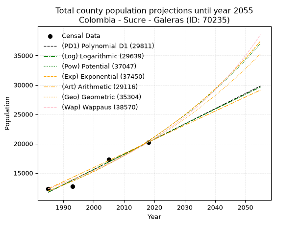
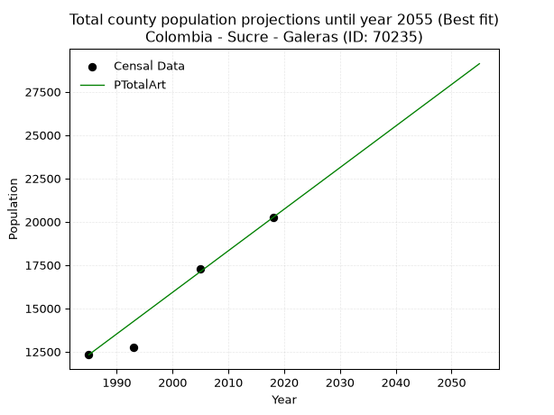
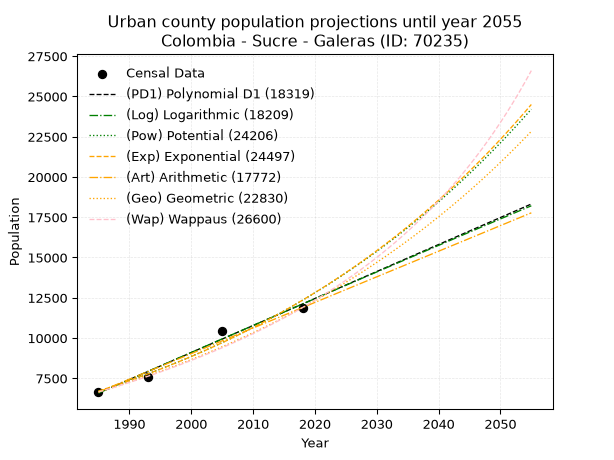
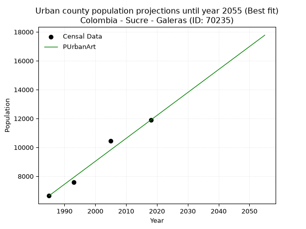
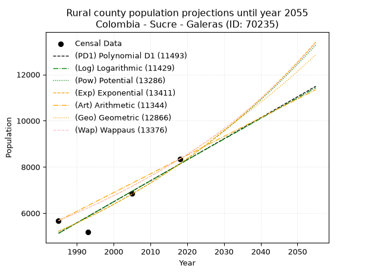
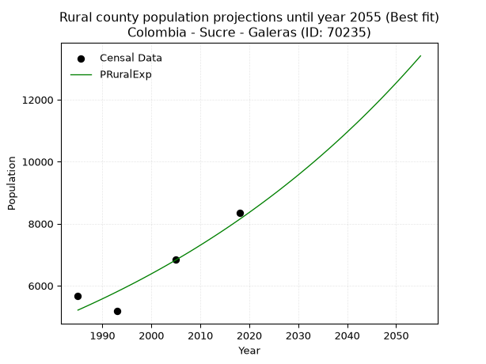

<div align="center">


</div>

# 📜 _“Population and Public Services Demand Projections (PPSD) until Year 2050 for Colombia - Sucre - Galeras (ID: 70235)”_
Keywords: `population` `public-service` `projection` `lineal` `polynomial` `logarithmic` `potential` `exponential` `arithmetic` `geometric` `wappaus` `dane` `colombia` `south-america`

PPSD are analytical estimates used by governments and planners to anticipate future changes in population size, age distribution, and the resulting community needs for utilities, healthcare, education, and infrastructure as sizing future water treatment facilities, electrical grids, and road networks based on spatial growth.

<div align="center">

</img>

</div>


> **General running parameters**: • app_version: _v20260806_. • Python version: _3.14.7_. • Pandas version: _3.0.5_. • NumPy version: _2.5.1_. • Creates, save and include plots into reports (create_plot): _False_. • Projection until year: _2050_. • Process polynomial degree 2 and up: _False_. • Process Wappaus: _True_. • Process Wappaus: _True_. • Set negative values to zero: _True_. • Set infinite values to zero: _True_. • Drop dataset notes: _True_. 
<div align="center">

Dynamic map: [:earth_americas:Google](http://maps.google.com/maps?q=9.16037917,-75.0495898) [:earth_americas:OSM](https://www.openstreetmap.org/#map=18/9.16037917/-75.0495898&layers=P) [:earth_americas:Bing](https://www.bing.com/maps?cp=9.16037917~-75.0495898&lvl=18) [:earth_americas:Apple](https://maps.apple.com/frame?center=9.16037917%2C-75.0495898&span=0.003%2C0.006)

</div>


<div align="center">

```geojson
{
  "type": "Feature",
  "geometry": {
    "type": "Point", 
    "coordinates": [-75.0495898, 9.16037917]
  }, 
  "properties": {
    "Name": "Colombia - Sucre - Galeras (ID: 70235)"
  }
}
```

</div>


## 0. Census Data (4 records)

Census data are official statistics collected by a government about the people and housing in a country. They usually include counts of total population, age, sex, race, income, education, and jobs.

📅Global census file: [Population.xlsx](../data/Population.xlsx)

| Source   |   Year |   CountryID | CountryName   |   StateID | StateName   |   CountyID | CountyName   |   PTotal |   PUrban |   PRural |
|:---------|-------:|------------:|:--------------|----------:|:------------|-----------:|:-------------|---------:|---------:|---------:|
| DANE     |   1985 |          57 | Colombia      |        70 | Sucre       |      70235 | Galeras      |    12322 |     6646 |     5676 |
| DANE     |   1993 |          57 | Colombia      |        70 | Sucre       |      70235 | Galeras      |    12750 |     7571 |     5179 |
| DANE     |   2005 |          57 | Colombia      |        70 | Sucre       |      70235 | Galeras      |    17297 |    10443 |     6854 |
| DANE     |   2018 |          57 | Colombia      |        70 | Sucre       |      70235 | Galeras      |    20239 |    11891 |     8348 |

> 🔥Some records could had specific notes about the registered values or the corresponding urban or rural distribution.

📅[SUI-RUPS](https://www.datos.gov.co/Hacienda-y-Cr-dito-P-blico/Registro-nico-de-Prestadores-de-Servicios-P-blicos/4qkq-csdn/about_data) - Local public utility companies: [RUPS.csv](../data/RUPS.xlsx)

 | SERVICIO       | ESTADO    | NOMBRE                                                         | NIT         | DEPARTAMENTO_DOMICILIO   | MUNICIPIO_DOMICILIO   | DIRECCION                       |   TELEFONO | EMAIL                      | TIPO_PRESTADOR                             | CLASIFICACION                 |
|:---------------|:----------|:---------------------------------------------------------------|:------------|:-------------------------|:----------------------|:--------------------------------|-----------:|:---------------------------|:-------------------------------------------|:------------------------------|
| ACUEDUCTO      | OPERATIVA | EMPRESA DE SERVICIOS PUBLICOS DE GALERAS S.A. E.S.P.           | 900264081-4 | SUCRE                    | GALERAS               | Kra 11 No 12-24 Plaza Principal |    2893020 | empagal@colombia.com       | SOCIEDADES (EMPRESA DE SERVICIOS PUBLICOS) | HASTA 2500 SUSCRIPTORES       |
| ALCANTARILLADO | OPERATIVA | EMPRESA DE SERVICIOS PUBLICOS DE GALERAS S.A. E.S.P.           | 900264081-4 | SUCRE                    | GALERAS               | Kra 11 No 12-24 Plaza Principal |    2893020 | empagal@colombia.com       | SOCIEDADES (EMPRESA DE SERVICIOS PUBLICOS) | HASTA 2500 SUSCRIPTORES       |
| ACUEDUCTO      | OPERATIVA | JUNTA DE ACCION COMUNAL DEL CORREGIMIENTO PUEBLO NUEVO PRIMERO | 901282764-6 | SUCRE                    | GALERAS               | CRA 2 # 1-35                    |    8219820 | jacjunnin@gmail.com        | ORGANIZACION AUTORIZADA                    | MENOR O IGUAL A 2500 USUARIOS |
| ACUEDUCTO      | OPERATIVA | JUNTA DE ACCION COMUNAL DEL CORREGIMIENTO SAN ANDRES PALOMO    | 901401196-4 | SUCRE                    | GALERAS               | CALLE 2  1 40P                  |    3137670 | salcedosilvio344@gmail.com | ORGANIZACION AUTORIZADA                    | MENOR O IGUAL A 2500 USUARIOS |

## 1. Total

### 1.1. Coefficients and Parameters

* (PD1) Polynomial Deg 1: 258.6190285026072, -501650.71176234004 (lineal)
* (Log) Logarithmic: 517578.68478454964, -3918467.7306626416
* (Pow) Potential: 32.69130119124237, -103.73137664160566
* (Exp) Exponential: 0.01633302701424278, 9.922645143304452e-11
* (Art) Arithmetic: Year diff. 2018 - 1985 = 33, Population diff. 20239 - 12322 = 7917, Annual growth = 239.9090909090909
* (Geo) Geometric: Year diff. 2018 - 1985 = 33, Population diff. 20239 - 12322 = 7917, Annual growth % = 0.015150752264264655
* (Wap) Wappaus: i = 1.4735978066342612, Condition values only valid for < 200)

<sub>
Wappaus condition values: ['0.00', '1.47', '2.95', '4.42', '5.89', '7.37', '8.84', '10.32', '11.79', '13.26', '14.74', '16.21', '17.68', '19.16', '20.63', '22.10', '23.58', '25.05', '26.52', '28.00', '29.47', '30.95', '32.42', '33.89', '35.37', '36.84', '38.31', '39.79', '41.26', '42.73', '44.21', '45.68', '47.16', '48.63', '50.10', '51.58', '53.05', '54.52', '56.00', '57.47', '58.94', '60.42', '61.89', '63.36', '64.84', '66.31', '67.79', '69.26', '70.73', '72.21', '73.68', '75.15', '76.63', '78.10', '79.57', '81.05', '82.52', '84.00', '85.47', '86.94', '88.42', '89.89', '91.36', '92.84', '94.31', '95.78']
</sub>


### 1.2. Projected Dataset

|   Year |   CountyID |   PTotalPD1 |   PTotalLog |   PTotalPow |   PTotalExp |   PTotalArt |   PTotalGeo |   PTotalWap |
|-------:|-----------:|------------:|------------:|------------:|------------:|------------:|------------:|------------:|
|   1985 |      70235 |       11708 |       11701 |       11932 |       11938 |       12322 |       12322 |       12322 |
|   1986 |      70235 |       11967 |       11962 |       12130 |       12134 |       12562 |       12509 |       12505 |
|   1987 |      70235 |       12225 |       12222 |       12331 |       12334 |       12802 |       12698 |       12691 |
|   1988 |      70235 |       12484 |       12483 |       12536 |       12537 |       13042 |       12891 |       12879 |
|   1989 |      70235 |       12743 |       12743 |       12743 |       12743 |       13282 |       13086 |       13070 |
|   1990 |      70235 |       13001 |       13003 |       12955 |       12953 |       13522 |       13284 |       13265 |
|   1991 |      70235 |       13260 |       13263 |       13169 |       13167 |       13761 |       13485 |       13462 |
|   1992 |      70235 |       13518 |       13523 |       13387 |       13383 |       14001 |       13690 |       13662 |
|   1993 |      70235 |       13777 |       13783 |       13608 |       13604 |       14241 |       13897 |       13866 |
|   1994 |      70235 |       14036 |       14042 |       13834 |       13828 |       14481 |       14108 |       14072 |
|   1995 |      70235 |       14294 |       14302 |       14062 |       14056 |       14721 |       14321 |       14282 |
|   1996 |      70235 |       14553 |       14561 |       14294 |       14287 |       14961 |       14538 |       14496 |
|   1997 |      70235 |       14811 |       14820 |       14530 |       14522 |       15201 |       14759 |       14712 |
|   1998 |      70235 |       15070 |       15080 |       14770 |       14761 |       15441 |       14982 |       14933 |
|   1999 |      70235 |       15329 |       15339 |       15014 |       15004 |       15681 |       15209 |       15156 |
|   2000 |      70235 |       15587 |       15597 |       15261 |       15252 |       15921 |       15440 |       15384 |
|   2001 |      70235 |       15846 |       15856 |       15513 |       15503 |       16161 |       15674 |       15615 |
|   2002 |      70235 |       16105 |       16115 |       15768 |       15758 |       16400 |       15911 |       15851 |
|   2003 |      70235 |       16363 |       16373 |       16028 |       16017 |       16640 |       16152 |       16090 |
|   2004 |      70235 |       16622 |       16631 |       16291 |       16281 |       16880 |       16397 |       16334 |
|   2005 |      70235 |       16880 |       16890 |       16559 |       16549 |       17120 |       16645 |       16581 |
|   2006 |      70235 |       17139 |       17148 |       16831 |       16822 |       17360 |       16898 |       16833 |
|   2007 |      70235 |       17398 |       17406 |       17108 |       17099 |       17600 |       17154 |       17089 |
|   2008 |      70235 |       17656 |       17664 |       17389 |       17380 |       17840 |       17413 |       17350 |
|   2009 |      70235 |       17915 |       17921 |       17674 |       17667 |       18080 |       17677 |       17616 |
|   2010 |      70235 |       18174 |       18179 |       17964 |       17958 |       18320 |       17945 |       17886 |
|   2011 |      70235 |       18432 |       18436 |       18258 |       18253 |       18560 |       18217 |       18162 |
|   2012 |      70235 |       18691 |       18694 |       18558 |       18554 |       18800 |       18493 |       18442 |
|   2013 |      70235 |       18949 |       18951 |       18861 |       18859 |       19039 |       18773 |       18728 |
|   2014 |      70235 |       19208 |       19208 |       19170 |       19170 |       19279 |       19058 |       19019 |
|   2015 |      70235 |       19467 |       19465 |       19484 |       19486 |       19519 |       19346 |       19315 |
|   2016 |      70235 |       19725 |       19722 |       19802 |       19807 |       19759 |       19639 |       19617 |
|   2017 |      70235 |       19984 |       19978 |       20126 |       20133 |       19999 |       19937 |       19925 |
|   2018 |      70235 |       20242 |       20235 |       20455 |       20464 |       20239 |       20239 |       20239 |
|   2019 |      70235 |       20501 |       20491 |       20789 |       20801 |       20479 |       20546 |       20559 |
|   2020 |      70235 |       20760 |       20747 |       21128 |       21144 |       20719 |       20857 |       20886 |
|   2021 |      70235 |       21018 |       21004 |       21473 |       21492 |       20959 |       21173 |       21219 |
|   2022 |      70235 |       21277 |       21260 |       21823 |       21846 |       21199 |       21494 |       21558 |
|   2023 |      70235 |       21536 |       21516 |       22178 |       22206 |       21439 |       21819 |       21905 |
|   2024 |      70235 |       21794 |       21771 |       22540 |       22571 |       21678 |       22150 |       22259 |
|   2025 |      70235 |       22053 |       22027 |       22907 |       22943 |       21918 |       22486 |       22620 |
|   2026 |      70235 |       22311 |       22283 |       23279 |       23321 |       22158 |       22826 |       22989 |
|   2027 |      70235 |       22570 |       22538 |       23658 |       23705 |       22398 |       23172 |       23366 |
|   2028 |      70235 |       22829 |       22793 |       24042 |       24095 |       22638 |       23523 |       23751 |
|   2029 |      70235 |       23087 |       23048 |       24433 |       24492 |       22878 |       23879 |       24144 |
|   2030 |      70235 |       23346 |       23303 |       24830 |       24895 |       23118 |       24241 |       24546 |
|   2031 |      70235 |       23605 |       23558 |       25233 |       25305 |       23358 |       24609 |       24957 |
|   2032 |      70235 |       23863 |       23813 |       25642 |       25722 |       23598 |       24981 |       25377 |
|   2033 |      70235 |       24122 |       24068 |       26058 |       26145 |       23838 |       25360 |       25807 |
|   2034 |      70235 |       24380 |       24322 |       26480 |       26576 |       24078 |       25744 |       26246 |
|   2035 |      70235 |       24639 |       24577 |       26909 |       27014 |       24317 |       26134 |       26696 |
|   2036 |      70235 |       24898 |       24831 |       27345 |       27458 |       24557 |       26530 |       27157 |
|   2037 |      70235 |       25156 |       25085 |       27787 |       27911 |       24797 |       26932 |       27628 |
|   2038 |      70235 |       25415 |       25339 |       28237 |       28370 |       25037 |       27340 |       28111 |
|   2039 |      70235 |       25673 |       25593 |       28693 |       28837 |       25277 |       27754 |       28606 |
|   2040 |      70235 |       25932 |       25847 |       29157 |       29312 |       25517 |       28175 |       29113 |
|   2041 |      70235 |       26191 |       26100 |       29628 |       29795 |       25757 |       28602 |       29633 |
|   2042 |      70235 |       26449 |       26354 |       30106 |       30286 |       25997 |       29035 |       30166 |
|   2043 |      70235 |       26708 |       26607 |       30592 |       30784 |       26237 |       29475 |       30713 |
|   2044 |      70235 |       26967 |       26861 |       31085 |       31291 |       26477 |       29921 |       31273 |
|   2045 |      70235 |       27225 |       27114 |       31586 |       31806 |       26717 |       30375 |       31849 |
|   2046 |      70235 |       27484 |       27367 |       32095 |       32330 |       26956 |       30835 |       32440 |
|   2047 |      70235 |       27742 |       27620 |       32612 |       32863 |       27196 |       31302 |       33047 |
|   2048 |      70235 |       28001 |       27873 |       33137 |       33404 |       27436 |       31776 |       33671 |
|   2049 |      70235 |       28260 |       28125 |       33670 |       33954 |       27676 |       32258 |       34313 |
|   2050 |      70235 |       28518 |       28378 |       34211 |       34513 |       27916 |       32747 |       34972 |
<div align="center">

</img>

</div>


### 1.3. Best fit with absolute and relative error (%)

Relative error puts that difference into context by dividing the absolute error by the true value, creating a unitless ratio or percentage that shows the scale of the mistake.

Absolute and relative error

|   Year | Source   |   CountryID | CountryName   |   StateID | StateName   |   CountyID_x | CountyName   |   PTotal |   PUrban |   PRural |   CountyID_y |   PTotalPD1 |   PTotalLog |   PTotalPow |   PTotalExp |   PTotalArt |   PTotalGeo |   PTotalWap |   PTotalPD1AbsError |   PTotalLogAbsError |   PTotalPowAbsError |   PTotalExpAbsError |   PTotalArtAbsError |   PTotalGeoAbsError |   PTotalWapAbsError |   PTotalPD1RelError |   PTotalLogRelError |   PTotalPowRelError |   PTotalExpRelError |   PTotalArtRelError |   PTotalGeoRelError |   PTotalWapRelError |
|-------:|:---------|------------:|:--------------|----------:|:------------|-------------:|:-------------|---------:|---------:|---------:|-------------:|------------:|------------:|------------:|------------:|------------:|------------:|------------:|--------------------:|--------------------:|--------------------:|--------------------:|--------------------:|--------------------:|--------------------:|--------------------:|--------------------:|--------------------:|--------------------:|--------------------:|--------------------:|--------------------:|
|   1985 | DANE     |          57 | Colombia      |        70 | Sucre       |        70235 | Galeras      |    12322 |     6646 |     5676 |        70235 |       11708 |       11701 |       11932 |       11938 |       12322 |       12322 |       12322 |                 614 |                 621 |                 390 |                 384 |                   0 |                   0 |                   0 |           4.98296   |           5.03977   |             3.16507 |             3.11638 |              0      |             0       |             0       |
|   1993 | DANE     |          57 | Colombia      |        70 | Sucre       |        70235 | Galeras      |    12750 |     7571 |     5179 |        70235 |       13777 |       13783 |       13608 |       13604 |       14241 |       13897 |       13866 |                1027 |                1033 |                 858 |                 854 |                1491 |                1147 |                1116 |           8.0549    |           8.10196   |             6.72941 |             6.69804 |             11.6941 |             8.99608 |             8.75294 |
|   2005 | DANE     |          57 | Colombia      |        70 | Sucre       |        70235 | Galeras      |    17297 |    10443 |     6854 |        70235 |       16880 |       16890 |       16559 |       16549 |       17120 |       16645 |       16581 |                 417 |                 407 |                 738 |                 748 |                 177 |                 652 |                 716 |           2.41082   |           2.35301   |             4.26664 |             4.32445 |              1.0233 |             3.76944 |             4.13945 |
|   2018 | DANE     |          57 | Colombia      |        70 | Sucre       |        70235 | Galeras      |    20239 |    11891 |     8348 |        70235 |       20242 |       20235 |       20455 |       20464 |       20239 |       20239 |       20239 |                   3 |                   4 |                 216 |                 225 |                   0 |                   0 |                   0 |           0.0148229 |           0.0197638 |             1.06725 |             1.11172 |              0      |             0       |             0       |

Relative error mean

| Method    |   RelError | Best   |
|:----------|-----------:|:-------|
| PTotalPD1 |    3.86588 |        |
| PTotalLog |    3.87863 |        |
| PTotalPow |    3.80709 |        |
| PTotalExp |    3.81265 |        |
| PTotalArt |    3.17935 | True   |
| PTotalGeo |    3.19138 |        |
| PTotalWap |    3.2231  |        |

💙Best method: _**PTotalArt**_
<div align="center">

</img>

</div>


### 1.4. Fresh water supply demand in liters per capita per day (lpcd)

The fresh water supply demand typically ranges from 100 to 300 liters per capita per day (lpcd) for standard domestic and municipal planning, though absolute survival minimums set by the World Health Organization are as low as 7.5 to 20 liters per day, and total consumption in high-income nations can exceed 400 liters.

> `CZ`: Level in meters above the sea level (masl)<br> `WS`: Fresh water supply demand in liters per capita per day (lpcd or l/h/d)<br> `WSAll`: Zonal fresh water supply demand in liters per second (l/s)<br> `A`: Zonal area in square meters<br> `DP`: Population density (people/hectare or p/ha)

Reference values (RAS Colombia)

|    CZ |   WS |
|------:|-----:|
|  1000 |  120 |
|  2000 |  130 |
| 99999 |  140 |

County shapefile geometry properties and water supply values

|   CountyID |      ATotal |   CZTotal |   WSTotal |
|-----------:|------------:|----------:|----------:|
|      70235 | 3.21636e+08 |   51.4374 |       120 |

Projected values for best method: PTotalArt

|   CountyID |   Year |   PTotalArt |   DPTotal |   WSTotal |   WSTotalAll |
|-----------:|-------:|------------:|----------:|----------:|-------------:|
|      70235 |   1985 |       12322 |      0.38 |       120 |      17.1139 |
|      70235 |   1986 |       12562 |      0.39 |       120 |      17.4472 |
|      70235 |   1987 |       12802 |      0.4  |       120 |      17.7806 |
|      70235 |   1988 |       13042 |      0.41 |       120 |      18.1139 |
|      70235 |   1989 |       13282 |      0.41 |       120 |      18.4472 |
|      70235 |   1990 |       13522 |      0.42 |       120 |      18.7806 |
|      70235 |   1991 |       13761 |      0.43 |       120 |      19.1125 |
|      70235 |   1992 |       14001 |      0.44 |       120 |      19.4458 |
|      70235 |   1993 |       14241 |      0.44 |       120 |      19.7792 |
|      70235 |   1994 |       14481 |      0.45 |       120 |      20.1125 |
|      70235 |   1995 |       14721 |      0.46 |       120 |      20.4458 |
|      70235 |   1996 |       14961 |      0.47 |       120 |      20.7792 |
|      70235 |   1997 |       15201 |      0.47 |       120 |      21.1125 |
|      70235 |   1998 |       15441 |      0.48 |       120 |      21.4458 |
|      70235 |   1999 |       15681 |      0.49 |       120 |      21.7792 |
|      70235 |   2000 |       15921 |      0.5  |       120 |      22.1125 |
|      70235 |   2001 |       16161 |      0.5  |       120 |      22.4458 |
|      70235 |   2002 |       16400 |      0.51 |       120 |      22.7778 |
|      70235 |   2003 |       16640 |      0.52 |       120 |      23.1111 |
|      70235 |   2004 |       16880 |      0.52 |       120 |      23.4444 |
|      70235 |   2005 |       17120 |      0.53 |       120 |      23.7778 |
|      70235 |   2006 |       17360 |      0.54 |       120 |      24.1111 |
|      70235 |   2007 |       17600 |      0.55 |       120 |      24.4444 |
|      70235 |   2008 |       17840 |      0.55 |       120 |      24.7778 |
|      70235 |   2009 |       18080 |      0.56 |       120 |      25.1111 |
|      70235 |   2010 |       18320 |      0.57 |       120 |      25.4444 |
|      70235 |   2011 |       18560 |      0.58 |       120 |      25.7778 |
|      70235 |   2012 |       18800 |      0.58 |       120 |      26.1111 |
|      70235 |   2013 |       19039 |      0.59 |       120 |      26.4431 |
|      70235 |   2014 |       19279 |      0.6  |       120 |      26.7764 |
|      70235 |   2015 |       19519 |      0.61 |       120 |      27.1097 |
|      70235 |   2016 |       19759 |      0.61 |       120 |      27.4431 |
|      70235 |   2017 |       19999 |      0.62 |       120 |      27.7764 |
|      70235 |   2018 |       20239 |      0.63 |       120 |      28.1097 |
|      70235 |   2019 |       20479 |      0.64 |       120 |      28.4431 |
|      70235 |   2020 |       20719 |      0.64 |       120 |      28.7764 |
|      70235 |   2021 |       20959 |      0.65 |       120 |      29.1097 |
|      70235 |   2022 |       21199 |      0.66 |       120 |      29.4431 |
|      70235 |   2023 |       21439 |      0.67 |       120 |      29.7764 |
|      70235 |   2024 |       21678 |      0.67 |       120 |      30.1083 |
|      70235 |   2025 |       21918 |      0.68 |       120 |      30.4417 |
|      70235 |   2026 |       22158 |      0.69 |       120 |      30.775  |
|      70235 |   2027 |       22398 |      0.7  |       120 |      31.1083 |
|      70235 |   2028 |       22638 |      0.7  |       120 |      31.4417 |
|      70235 |   2029 |       22878 |      0.71 |       120 |      31.775  |
|      70235 |   2030 |       23118 |      0.72 |       120 |      32.1083 |
|      70235 |   2031 |       23358 |      0.73 |       120 |      32.4417 |
|      70235 |   2032 |       23598 |      0.73 |       120 |      32.775  |
|      70235 |   2033 |       23838 |      0.74 |       120 |      33.1083 |
|      70235 |   2034 |       24078 |      0.75 |       120 |      33.4417 |
|      70235 |   2035 |       24317 |      0.76 |       120 |      33.7736 |
|      70235 |   2036 |       24557 |      0.76 |       120 |      34.1069 |
|      70235 |   2037 |       24797 |      0.77 |       120 |      34.4403 |
|      70235 |   2038 |       25037 |      0.78 |       120 |      34.7736 |
|      70235 |   2039 |       25277 |      0.79 |       120 |      35.1069 |
|      70235 |   2040 |       25517 |      0.79 |       120 |      35.4403 |
|      70235 |   2041 |       25757 |      0.8  |       120 |      35.7736 |
|      70235 |   2042 |       25997 |      0.81 |       120 |      36.1069 |
|      70235 |   2043 |       26237 |      0.82 |       120 |      36.4403 |
|      70235 |   2044 |       26477 |      0.82 |       120 |      36.7736 |
|      70235 |   2045 |       26717 |      0.83 |       120 |      37.1069 |
|      70235 |   2046 |       26956 |      0.84 |       120 |      37.4389 |
|      70235 |   2047 |       27196 |      0.85 |       120 |      37.7722 |
|      70235 |   2048 |       27436 |      0.85 |       120 |      38.1056 |
|      70235 |   2049 |       27676 |      0.86 |       120 |      38.4389 |
|      70235 |   2050 |       27916 |      0.87 |       120 |      38.7722 |

## 2. Urban

### 2.1. Coefficients and Parameters

* (PD1) Polynomial Deg 1: 167.68887996788337, -326281.9321557587 (lineal)
* (Log) Logarithmic: 335699.10716806154, -2542513.8537082504
* (Pow) Potential: 37.064532801965605, -118.40389433828716
* (Exp) Exponential: 0.01851178630485605, 7.375579247075952e-13
* (Art) Arithmetic: Year diff. 2018 - 1985 = 33, Population diff. 11891 - 6646 = 5245, Annual growth = 158.93939393939394
* (Geo) Geometric: Year diff. 2018 - 1985 = 33, Population diff. 11891 - 6646 = 5245, Annual growth % = 0.017785605351068545
* (Wap) Wappaus: i = 1.7148340501633914, Condition values only valid for < 200)

<sub>
Wappaus condition values: ['0.00', '1.71', '3.43', '5.14', '6.86', '8.57', '10.29', '12.00', '13.72', '15.43', '17.15', '18.86', '20.58', '22.29', '24.01', '25.72', '27.44', '29.15', '30.87', '32.58', '34.30', '36.01', '37.73', '39.44', '41.16', '42.87', '44.59', '46.30', '48.02', '49.73', '51.45', '53.16', '54.87', '56.59', '58.30', '60.02', '61.73', '63.45', '65.16', '66.88', '68.59', '70.31', '72.02', '73.74', '75.45', '77.17', '78.88', '80.60', '82.31', '84.03', '85.74', '87.46', '89.17', '90.89', '92.60', '94.32', '96.03', '97.75', '99.46', '101.18', '102.89', '104.60', '106.32', '108.03', '109.75', '111.46']
</sub>


### 2.2. Projected Dataset

|   Year |   CountyID |   PUrbanPD1 |   PUrbanLog |   PUrbanPow |   PUrbanExp |   PUrbanArt |   PUrbanGeo |   PUrbanWap |
|-------:|-----------:|------------:|------------:|------------:|------------:|------------:|------------:|------------:|
|   1985 |      70235 |        6580 |        6575 |        6700 |        6704 |        6646 |        6646 |        6646 |
|   1986 |      70235 |        6748 |        6744 |        6826 |        6829 |        6805 |        6764 |        6761 |
|   1987 |      70235 |        6916 |        6913 |        6955 |        6957 |        6964 |        6885 |        6878 |
|   1988 |      70235 |        7084 |        7082 |        7085 |        7087 |        7123 |        7007 |        6997 |
|   1989 |      70235 |        7251 |        7251 |        7219 |        7219 |        7282 |        7132 |        7118 |
|   1990 |      70235 |        7419 |        7420 |        7355 |        7354 |        7441 |        7258 |        7241 |
|   1991 |      70235 |        7587 |        7588 |        7493 |        7492 |        7600 |        7388 |        7367 |
|   1992 |      70235 |        7754 |        7757 |        7633 |        7632 |        7759 |        7519 |        7495 |
|   1993 |      70235 |        7922 |        7925 |        7777 |        7774 |        7918 |        7653 |        7625 |
|   1994 |      70235 |        8090 |        8094 |        7923 |        7919 |        8076 |        7789 |        7757 |
|   1995 |      70235 |        8257 |        8262 |        8071 |        8067 |        8235 |        7927 |        7893 |
|   1996 |      70235 |        8425 |        8430 |        8223 |        8218 |        8394 |        8068 |        8030 |
|   1997 |      70235 |        8593 |        8598 |        8377 |        8372 |        8553 |        8212 |        8170 |
|   1998 |      70235 |        8760 |        8766 |        8534 |        8528 |        8712 |        8358 |        8313 |
|   1999 |      70235 |        8928 |        8934 |        8693 |        8687 |        8871 |        8506 |        8459 |
|   2000 |      70235 |        9096 |        9102 |        8856 |        8850 |        9030 |        8658 |        8608 |
|   2001 |      70235 |        9264 |        9270 |        9022 |        9015 |        9189 |        8812 |        8759 |
|   2002 |      70235 |        9431 |        9438 |        9190 |        9184 |        9348 |        8968 |        8914 |
|   2003 |      70235 |        9599 |        9605 |        9362 |        9355 |        9507 |        9128 |        9072 |
|   2004 |      70235 |        9767 |        9773 |        9537 |        9530 |        9666 |        9290 |        9233 |
|   2005 |      70235 |        9934 |        9941 |        9715 |        9708 |        9825 |        9456 |        9397 |
|   2006 |      70235 |       10102 |       10108 |        9896 |        9889 |        9984 |        9624 |        9565 |
|   2007 |      70235 |       10270 |       10275 |       10080 |       10074 |       10143 |        9795 |        9736 |
|   2008 |      70235 |       10437 |       10442 |       10268 |       10262 |       10302 |        9969 |        9911 |
|   2009 |      70235 |       10605 |       10610 |       10460 |       10454 |       10461 |       10146 |       10090 |
|   2010 |      70235 |       10773 |       10777 |       10654 |       10649 |       10619 |       10327 |       10273 |
|   2011 |      70235 |       10940 |       10944 |       10853 |       10848 |       10778 |       10511 |       10459 |
|   2012 |      70235 |       11108 |       11110 |       11054 |       11051 |       10937 |       10697 |       10650 |
|   2013 |      70235 |       11276 |       11277 |       11260 |       11258 |       11096 |       10888 |       10845 |
|   2014 |      70235 |       11443 |       11444 |       11469 |       11468 |       11255 |       11081 |       11045 |
|   2015 |      70235 |       11611 |       11611 |       11682 |       11682 |       11414 |       11278 |       11249 |
|   2016 |      70235 |       11779 |       11777 |       11899 |       11900 |       11573 |       11479 |       11458 |
|   2017 |      70235 |       11947 |       11944 |       12120 |       12123 |       11732 |       11683 |       11672 |
|   2018 |      70235 |       12114 |       12110 |       12344 |       12349 |       11891 |       11891 |       11891 |
|   2019 |      70235 |       12282 |       12276 |       12573 |       12580 |       12050 |       12102 |       12115 |
|   2020 |      70235 |       12450 |       12443 |       12806 |       12815 |       12209 |       12318 |       12345 |
|   2021 |      70235 |       12617 |       12609 |       13043 |       13055 |       12368 |       12537 |       12581 |
|   2022 |      70235 |       12785 |       12775 |       13284 |       13298 |       12527 |       12760 |       12822 |
|   2023 |      70235 |       12953 |       12941 |       13530 |       13547 |       12686 |       12987 |       13070 |
|   2024 |      70235 |       13120 |       13107 |       13780 |       13800 |       12845 |       13218 |       13324 |
|   2025 |      70235 |       13288 |       13273 |       14035 |       14058 |       13004 |       13453 |       13584 |
|   2026 |      70235 |       13456 |       13438 |       14294 |       14320 |       13163 |       13692 |       13852 |
|   2027 |      70235 |       13623 |       13604 |       14558 |       14588 |       13321 |       13936 |       14126 |
|   2028 |      70235 |       13791 |       13770 |       14826 |       14861 |       13480 |       14183 |       14409 |
|   2029 |      70235 |       13959 |       13935 |       15100 |       15138 |       13639 |       14436 |       14699 |
|   2030 |      70235 |       14126 |       14100 |       15378 |       15421 |       13798 |       14692 |       14996 |
|   2031 |      70235 |       14294 |       14266 |       15661 |       15709 |       13957 |       14954 |       15303 |
|   2032 |      70235 |       14462 |       14431 |       15950 |       16003 |       14116 |       15220 |       15618 |
|   2033 |      70235 |       14630 |       14596 |       16243 |       16302 |       14275 |       15490 |       15943 |
|   2034 |      70235 |       14797 |       14761 |       16542 |       16606 |       14434 |       15766 |       16277 |
|   2035 |      70235 |       14965 |       14926 |       16846 |       16917 |       14593 |       16046 |       16621 |
|   2036 |      70235 |       15133 |       15091 |       17156 |       17233 |       14752 |       16332 |       16975 |
|   2037 |      70235 |       15300 |       15256 |       17471 |       17555 |       14911 |       16622 |       17341 |
|   2038 |      70235 |       15468 |       15421 |       17791 |       17883 |       15070 |       16918 |       17718 |
|   2039 |      70235 |       15636 |       15585 |       18118 |       18217 |       15229 |       17219 |       18107 |
|   2040 |      70235 |       15803 |       15750 |       18450 |       18557 |       15388 |       17525 |       18508 |
|   2041 |      70235 |       15971 |       15915 |       18788 |       18904 |       15547 |       17837 |       18923 |
|   2042 |      70235 |       16139 |       16079 |       19133 |       19257 |       15706 |       18154 |       19352 |
|   2043 |      70235 |       16306 |       16243 |       19483 |       19617 |       15864 |       18477 |       19795 |
|   2044 |      70235 |       16474 |       16408 |       19840 |       19983 |       16023 |       18805 |       20254 |
|   2045 |      70235 |       16642 |       16572 |       20203 |       20357 |       16182 |       19140 |       20729 |
|   2046 |      70235 |       16810 |       16736 |       20572 |       20737 |       16341 |       19480 |       21221 |
|   2047 |      70235 |       16977 |       16900 |       20948 |       21125 |       16500 |       19827 |       21731 |
|   2048 |      70235 |       17145 |       17064 |       21331 |       21519 |       16659 |       20179 |       22261 |
|   2049 |      70235 |       17313 |       17228 |       21720 |       21921 |       16818 |       20538 |       22810 |
|   2050 |      70235 |       17480 |       17392 |       22116 |       22331 |       16977 |       20904 |       23380 |
<div align="center">

</img>

</div>


### 2.3. Best fit with absolute and relative error (%)

Relative error puts that difference into context by dividing the absolute error by the true value, creating a unitless ratio or percentage that shows the scale of the mistake.

Absolute and relative error

|   Year | Source   |   CountryID | CountryName   |   StateID | StateName   |   CountyID_x | CountyName   |   PTotal |   PUrban |   PRural |   CountyID_y |   PUrbanPD1 |   PUrbanLog |   PUrbanPow |   PUrbanExp |   PUrbanArt |   PUrbanGeo |   PUrbanWap |   PUrbanPD1AbsError |   PUrbanLogAbsError |   PUrbanPowAbsError |   PUrbanExpAbsError |   PUrbanArtAbsError |   PUrbanGeoAbsError |   PUrbanWapAbsError |   PUrbanPD1RelError |   PUrbanLogRelError |   PUrbanPowRelError |   PUrbanExpRelError |   PUrbanArtRelError |   PUrbanGeoRelError |   PUrbanWapRelError |
|-------:|:---------|------------:|:--------------|----------:|:------------|-------------:|:-------------|---------:|---------:|---------:|-------------:|------------:|------------:|------------:|------------:|------------:|------------:|------------:|--------------------:|--------------------:|--------------------:|--------------------:|--------------------:|--------------------:|--------------------:|--------------------:|--------------------:|--------------------:|--------------------:|--------------------:|--------------------:|--------------------:|
|   1985 | DANE     |          57 | Colombia      |        70 | Sucre       |        70235 | Galeras      |    12322 |     6646 |     5676 |        70235 |        6580 |        6575 |        6700 |        6704 |        6646 |        6646 |        6646 |                  66 |                  71 |                  54 |                  58 |                   0 |                   0 |                   0 |            0.993079 |             1.06831 |            0.812519 |            0.872705 |             0       |             0       |            0        |
|   1993 | DANE     |          57 | Colombia      |        70 | Sucre       |        70235 | Galeras      |    12750 |     7571 |     5179 |        70235 |        7922 |        7925 |        7777 |        7774 |        7918 |        7653 |        7625 |                 351 |                 354 |                 206 |                 203 |                 347 |                  82 |                  54 |            4.63611  |             4.67574 |            2.72091  |            2.68128  |             4.58328 |             1.08308 |            0.713248 |
|   2005 | DANE     |          57 | Colombia      |        70 | Sucre       |        70235 | Galeras      |    17297 |    10443 |     6854 |        70235 |        9934 |        9941 |        9715 |        9708 |        9825 |        9456 |        9397 |                 509 |                 502 |                 728 |                 735 |                 618 |                 987 |                1046 |            4.87408  |             4.80705 |            6.97118  |            7.03821  |             5.91784 |             9.45131 |           10.0163   |
|   2018 | DANE     |          57 | Colombia      |        70 | Sucre       |        70235 | Galeras      |    20239 |    11891 |     8348 |        70235 |       12114 |       12110 |       12344 |       12349 |       11891 |       11891 |       11891 |                 223 |                 219 |                 453 |                 458 |                   0 |                   0 |                   0 |            1.87537  |             1.84173 |            3.8096   |            3.85165  |             0       |             0       |            0        |

Relative error mean

| Method    |   RelError | Best   |
|:----------|-----------:|:-------|
| PUrbanPD1 |    3.09466 |        |
| PUrbanLog |    3.09821 |        |
| PUrbanPow |    3.57855 |        |
| PUrbanExp |    3.61096 |        |
| PUrbanArt |    2.62528 | True   |
| PUrbanGeo |    2.6336  |        |
| PUrbanWap |    2.68238 |        |

💙Best method: _**PUrbanArt**_
<div align="center">

</img>

</div>


### 2.4. Fresh water supply demand in liters per capita per day (lpcd)

The fresh water supply demand typically ranges from 100 to 300 liters per capita per day (lpcd) for standard domestic and municipal planning, though absolute survival minimums set by the World Health Organization are as low as 7.5 to 20 liters per day, and total consumption in high-income nations can exceed 400 liters.

> `CZ`: Level in meters above the sea level (masl)<br> `WS`: Fresh water supply demand in liters per capita per day (lpcd or l/h/d)<br> `WSAll`: Zonal fresh water supply demand in liters per second (l/s)<br> `A`: Zonal area in square meters<br> `DP`: Population density (people/hectare or p/ha)

Reference values (RAS Colombia)

|    CZ |   WS |
|------:|-----:|
|  1000 |  120 |
|  2000 |  130 |
| 99999 |  140 |

County shapefile geometry properties and water supply values

|   CountyID |      AUrban |   CZUrban |   WSUrban |
|-----------:|------------:|----------:|----------:|
|      70235 | 2.06711e+06 |   85.5708 |       120 |

Projected values for best method: PUrbanArt

|   CountyID |   Year |   PUrbanArt |   DPUrban |   WSUrban |   WSUrbanAll |
|-----------:|-------:|------------:|----------:|----------:|-------------:|
|      70235 |   1985 |        6646 |     32.15 |       120 |      9.23056 |
|      70235 |   1986 |        6805 |     32.92 |       120 |      9.45139 |
|      70235 |   1987 |        6964 |     33.69 |       120 |      9.67222 |
|      70235 |   1988 |        7123 |     34.46 |       120 |      9.89306 |
|      70235 |   1989 |        7282 |     35.23 |       120 |     10.1139  |
|      70235 |   1990 |        7441 |     36    |       120 |     10.3347  |
|      70235 |   1991 |        7600 |     36.77 |       120 |     10.5556  |
|      70235 |   1992 |        7759 |     37.54 |       120 |     10.7764  |
|      70235 |   1993 |        7918 |     38.3  |       120 |     10.9972  |
|      70235 |   1994 |        8076 |     39.07 |       120 |     11.2167  |
|      70235 |   1995 |        8235 |     39.84 |       120 |     11.4375  |
|      70235 |   1996 |        8394 |     40.61 |       120 |     11.6583  |
|      70235 |   1997 |        8553 |     41.38 |       120 |     11.8792  |
|      70235 |   1998 |        8712 |     42.15 |       120 |     12.1     |
|      70235 |   1999 |        8871 |     42.92 |       120 |     12.3208  |
|      70235 |   2000 |        9030 |     43.68 |       120 |     12.5417  |
|      70235 |   2001 |        9189 |     44.45 |       120 |     12.7625  |
|      70235 |   2002 |        9348 |     45.22 |       120 |     12.9833  |
|      70235 |   2003 |        9507 |     45.99 |       120 |     13.2042  |
|      70235 |   2004 |        9666 |     46.76 |       120 |     13.425   |
|      70235 |   2005 |        9825 |     47.53 |       120 |     13.6458  |
|      70235 |   2006 |        9984 |     48.3  |       120 |     13.8667  |
|      70235 |   2007 |       10143 |     49.07 |       120 |     14.0875  |
|      70235 |   2008 |       10302 |     49.84 |       120 |     14.3083  |
|      70235 |   2009 |       10461 |     50.61 |       120 |     14.5292  |
|      70235 |   2010 |       10619 |     51.37 |       120 |     14.7486  |
|      70235 |   2011 |       10778 |     52.14 |       120 |     14.9694  |
|      70235 |   2012 |       10937 |     52.91 |       120 |     15.1903  |
|      70235 |   2013 |       11096 |     53.68 |       120 |     15.4111  |
|      70235 |   2014 |       11255 |     54.45 |       120 |     15.6319  |
|      70235 |   2015 |       11414 |     55.22 |       120 |     15.8528  |
|      70235 |   2016 |       11573 |     55.99 |       120 |     16.0736  |
|      70235 |   2017 |       11732 |     56.76 |       120 |     16.2944  |
|      70235 |   2018 |       11891 |     57.52 |       120 |     16.5153  |
|      70235 |   2019 |       12050 |     58.29 |       120 |     16.7361  |
|      70235 |   2020 |       12209 |     59.06 |       120 |     16.9569  |
|      70235 |   2021 |       12368 |     59.83 |       120 |     17.1778  |
|      70235 |   2022 |       12527 |     60.6  |       120 |     17.3986  |
|      70235 |   2023 |       12686 |     61.37 |       120 |     17.6194  |
|      70235 |   2024 |       12845 |     62.14 |       120 |     17.8403  |
|      70235 |   2025 |       13004 |     62.91 |       120 |     18.0611  |
|      70235 |   2026 |       13163 |     63.68 |       120 |     18.2819  |
|      70235 |   2027 |       13321 |     64.44 |       120 |     18.5014  |
|      70235 |   2028 |       13480 |     65.21 |       120 |     18.7222  |
|      70235 |   2029 |       13639 |     65.98 |       120 |     18.9431  |
|      70235 |   2030 |       13798 |     66.75 |       120 |     19.1639  |
|      70235 |   2031 |       13957 |     67.52 |       120 |     19.3847  |
|      70235 |   2032 |       14116 |     68.29 |       120 |     19.6056  |
|      70235 |   2033 |       14275 |     69.06 |       120 |     19.8264  |
|      70235 |   2034 |       14434 |     69.83 |       120 |     20.0472  |
|      70235 |   2035 |       14593 |     70.6  |       120 |     20.2681  |
|      70235 |   2036 |       14752 |     71.37 |       120 |     20.4889  |
|      70235 |   2037 |       14911 |     72.13 |       120 |     20.7097  |
|      70235 |   2038 |       15070 |     72.9  |       120 |     20.9306  |
|      70235 |   2039 |       15229 |     73.67 |       120 |     21.1514  |
|      70235 |   2040 |       15388 |     74.44 |       120 |     21.3722  |
|      70235 |   2041 |       15547 |     75.21 |       120 |     21.5931  |
|      70235 |   2042 |       15706 |     75.98 |       120 |     21.8139  |
|      70235 |   2043 |       15864 |     76.74 |       120 |     22.0333  |
|      70235 |   2044 |       16023 |     77.51 |       120 |     22.2542  |
|      70235 |   2045 |       16182 |     78.28 |       120 |     22.475   |
|      70235 |   2046 |       16341 |     79.05 |       120 |     22.6958  |
|      70235 |   2047 |       16500 |     79.82 |       120 |     22.9167  |
|      70235 |   2048 |       16659 |     80.59 |       120 |     23.1375  |
|      70235 |   2049 |       16818 |     81.36 |       120 |     23.3583  |
|      70235 |   2050 |       16977 |     82.13 |       120 |     23.5792  |

## 3. Rural

### 3.1. Coefficients and Parameters

* (PD1) Polynomial Deg 1: 90.930148534724, -175368.77960658167 (lineal)
* (Log) Logarithmic: 181879.577616488, -1375953.8769543895
* (Pow) Potential: 27.00590628072784, -85.34209097445836
* (Exp) Exponential: 0.013500833932910853, 1.1976020171888615e-08
* (Art) Arithmetic: Year diff. 2018 - 1985 = 33, Population diff. 8348 - 5676 = 2672, Annual growth = 80.96969696969697
* (Geo) Geometric: Year diff. 2018 - 1985 = 33, Population diff. 8348 - 5676 = 2672, Annual growth % = 0.011758755427458523
* (Wap) Wappaus: i = 1.1547304188490726, Condition values only valid for < 200)

<sub>
Wappaus condition values: ['0.00', '1.15', '2.31', '3.46', '4.62', '5.77', '6.93', '8.08', '9.24', '10.39', '11.55', '12.70', '13.86', '15.01', '16.17', '17.32', '18.48', '19.63', '20.79', '21.94', '23.09', '24.25', '25.40', '26.56', '27.71', '28.87', '30.02', '31.18', '32.33', '33.49', '34.64', '35.80', '36.95', '38.11', '39.26', '40.42', '41.57', '42.73', '43.88', '45.03', '46.19', '47.34', '48.50', '49.65', '50.81', '51.96', '53.12', '54.27', '55.43', '56.58', '57.74', '58.89', '60.05', '61.20', '62.36', '63.51', '64.66', '65.82', '66.97', '68.13', '69.28', '70.44', '71.59', '72.75', '73.90', '75.06']
</sub>


### 3.2. Projected Dataset

|   Year |   CountyID |   PRuralPD1 |   PRuralLog |   PRuralPow |   PRuralExp |   PRuralArt |   PRuralGeo |   PRuralWap |
|-------:|-----------:|------------:|------------:|------------:|------------:|------------:|------------:|------------:|
|   1985 |      70235 |        5128 |        5126 |        5211 |        5212 |        5676 |        5676 |        5676 |
|   1986 |      70235 |        5218 |        5217 |        5282 |        5283 |        5757 |        5743 |        5742 |
|   1987 |      70235 |        5309 |        5309 |        5355 |        5355 |        5838 |        5810 |        5809 |
|   1988 |      70235 |        5400 |        5400 |        5428 |        5428 |        5919 |        5879 |        5876 |
|   1989 |      70235 |        5491 |        5492 |        5502 |        5502 |        6000 |        5948 |        5944 |
|   1990 |      70235 |        5582 |        5583 |        5577 |        5576 |        6081 |        6018 |        6013 |
|   1991 |      70235 |        5673 |        5675 |        5654 |        5652 |        6162 |        6088 |        6083 |
|   1992 |      70235 |        5764 |        5766 |        5731 |        5729 |        6243 |        6160 |        6154 |
|   1993 |      70235 |        5855 |        5857 |        5809 |        5807 |        6324 |        6232 |        6226 |
|   1994 |      70235 |        5946 |        5949 |        5888 |        5886 |        6405 |        6306 |        6298 |
|   1995 |      70235 |        6037 |        6040 |        5968 |        5966 |        6486 |        6380 |        6372 |
|   1996 |      70235 |        6128 |        6131 |        6050 |        6047 |        6567 |        6455 |        6446 |
|   1997 |      70235 |        6219 |        6222 |        6132 |        6129 |        6648 |        6531 |        6521 |
|   1998 |      70235 |        6310 |        6313 |        6216 |        6212 |        6729 |        6608 |        6597 |
|   1999 |      70235 |        6401 |        6404 |        6300 |        6297 |        6810 |        6685 |        6674 |
|   2000 |      70235 |        6492 |        6495 |        6386 |        6382 |        6891 |        6764 |        6752 |
|   2001 |      70235 |        6582 |        6586 |        6473 |        6469 |        6972 |        6843 |        6831 |
|   2002 |      70235 |        6673 |        6677 |        6561 |        6557 |        7052 |        6924 |        6911 |
|   2003 |      70235 |        6764 |        6768 |        6650 |        6646 |        7133 |        7005 |        6993 |
|   2004 |      70235 |        6855 |        6858 |        6740 |        6737 |        7214 |        7088 |        7075 |
|   2005 |      70235 |        6946 |        6949 |        6831 |        6828 |        7295 |        7171 |        7158 |
|   2006 |      70235 |        7037 |        7040 |        6924 |        6921 |        7376 |        7255 |        7242 |
|   2007 |      70235 |        7128 |        7131 |        7018 |        7015 |        7457 |        7341 |        7328 |
|   2008 |      70235 |        7219 |        7221 |        7113 |        7110 |        7538 |        7427 |        7414 |
|   2009 |      70235 |        7310 |        7312 |        7209 |        7207 |        7619 |        7514 |        7502 |
|   2010 |      70235 |        7401 |        7402 |        7307 |        7305 |        7700 |        7603 |        7591 |
|   2011 |      70235 |        7492 |        7493 |        7405 |        7404 |        7781 |        7692 |        7681 |
|   2012 |      70235 |        7583 |        7583 |        7505 |        7505 |        7862 |        7783 |        7772 |
|   2013 |      70235 |        7674 |        7673 |        7607 |        7607 |        7943 |        7874 |        7865 |
|   2014 |      70235 |        7765 |        7764 |        7710 |        7710 |        8024 |        7967 |        7959 |
|   2015 |      70235 |        7855 |        7854 |        7814 |        7815 |        8105 |        8060 |        8054 |
|   2016 |      70235 |        7946 |        7944 |        7919 |        7921 |        8186 |        8155 |        8151 |
|   2017 |      70235 |        8037 |        8034 |        8026 |        8029 |        8267 |        8251 |        8249 |
|   2018 |      70235 |        8128 |        8125 |        8134 |        8138 |        8348 |        8348 |        8348 |
|   2019 |      70235 |        8219 |        8215 |        8243 |        8249 |        8429 |        8446 |        8449 |
|   2020 |      70235 |        8310 |        8305 |        8354 |        8361 |        8510 |        8545 |        8551 |
|   2021 |      70235 |        8401 |        8395 |        8467 |        8475 |        8591 |        8646 |        8655 |
|   2022 |      70235 |        8492 |        8485 |        8581 |        8590 |        8672 |        8748 |        8760 |
|   2023 |      70235 |        8583 |        8575 |        8696 |        8707 |        8753 |        8850 |        8867 |
|   2024 |      70235 |        8674 |        8665 |        8813 |        8825 |        8834 |        8955 |        8975 |
|   2025 |      70235 |        8765 |        8754 |        8931 |        8945 |        8915 |        9060 |        9085 |
|   2026 |      70235 |        8856 |        8844 |        9051 |        9066 |        8996 |        9166 |        9197 |
|   2027 |      70235 |        8947 |        8934 |        9173 |        9190 |        9077 |        9274 |        9310 |
|   2028 |      70235 |        9038 |        9024 |        9296 |        9315 |        9158 |        9383 |        9425 |
|   2029 |      70235 |        9128 |        9113 |        9420 |        9441 |        9239 |        9494 |        9542 |
|   2030 |      70235 |        9219 |        9203 |        9546 |        9569 |        9320 |        9605 |        9661 |
|   2031 |      70235 |        9310 |        9293 |        9674 |        9700 |        9401 |        9718 |        9781 |
|   2032 |      70235 |        9401 |        9382 |        9804 |        9831 |        9482 |        9832 |        9904 |
|   2033 |      70235 |        9492 |        9472 |        9935 |        9965 |        9563 |        9948 |       10028 |
|   2034 |      70235 |        9583 |        9561 |       10068 |       10100 |        9644 |       10065 |       10155 |
|   2035 |      70235 |        9674 |        9650 |       10202 |       10238 |        9724 |       10183 |       10283 |
|   2036 |      70235 |        9765 |        9740 |       10338 |       10377 |        9805 |       10303 |       10414 |
|   2037 |      70235 |        9856 |        9829 |       10476 |       10518 |        9886 |       10424 |       10546 |
|   2038 |      70235 |        9947 |        9918 |       10616 |       10661 |        9967 |       10547 |       10681 |
|   2039 |      70235 |       10038 |       10008 |       10758 |       10806 |       10048 |       10671 |       10819 |
|   2040 |      70235 |       10129 |       10097 |       10901 |       10953 |       10129 |       10796 |       10958 |
|   2041 |      70235 |       10220 |       10186 |       11046 |       11102 |       10210 |       10923 |       11100 |
|   2042 |      70235 |       10311 |       10275 |       11193 |       11252 |       10291 |       11052 |       11245 |
|   2043 |      70235 |       10402 |       10364 |       11342 |       11405 |       10372 |       11182 |       11391 |
|   2044 |      70235 |       10492 |       10453 |       11493 |       11560 |       10453 |       11313 |       11541 |
|   2045 |      70235 |       10583 |       10542 |       11646 |       11718 |       10534 |       11446 |       11693 |
|   2046 |      70235 |       10674 |       10631 |       11801 |       11877 |       10615 |       11581 |       11848 |
|   2047 |      70235 |       10765 |       10720 |       11958 |       12038 |       10696 |       11717 |       12005 |
|   2048 |      70235 |       10856 |       10809 |       12116 |       12202 |       10777 |       11855 |       12166 |
|   2049 |      70235 |       10947 |       10897 |       12277 |       12368 |       10858 |       11994 |       12329 |
|   2050 |      70235 |       11038 |       10986 |       12440 |       12536 |       10939 |       12135 |       12496 |
<div align="center">

</img>

</div>


### 3.3. Best fit with absolute and relative error (%)

Relative error puts that difference into context by dividing the absolute error by the true value, creating a unitless ratio or percentage that shows the scale of the mistake.

Absolute and relative error

|   Year | Source   |   CountryID | CountryName   |   StateID | StateName   |   CountyID_x | CountyName   |   PTotal |   PUrban |   PRural |   CountyID_y |   PRuralPD1 |   PRuralLog |   PRuralPow |   PRuralExp |   PRuralArt |   PRuralGeo |   PRuralWap |   PRuralPD1AbsError |   PRuralLogAbsError |   PRuralPowAbsError |   PRuralExpAbsError |   PRuralArtAbsError |   PRuralGeoAbsError |   PRuralWapAbsError |   PRuralPD1RelError |   PRuralLogRelError |   PRuralPowRelError |   PRuralExpRelError |   PRuralArtRelError |   PRuralGeoRelError |   PRuralWapRelError |
|-------:|:---------|------------:|:--------------|----------:|:------------|-------------:|:-------------|---------:|---------:|---------:|-------------:|------------:|------------:|------------:|------------:|------------:|------------:|------------:|--------------------:|--------------------:|--------------------:|--------------------:|--------------------:|--------------------:|--------------------:|--------------------:|--------------------:|--------------------:|--------------------:|--------------------:|--------------------:|--------------------:|
|   1985 | DANE     |          57 | Colombia      |        70 | Sucre       |        70235 | Galeras      |    12322 |     6646 |     5676 |        70235 |        5128 |        5126 |        5211 |        5212 |        5676 |        5676 |        5676 |                 548 |                 550 |                 465 |                 464 |                   0 |                   0 |                   0 |             9.65469 |             9.68992 |             8.19239 |            8.17477  |              0      |             0       |             0       |
|   1993 | DANE     |          57 | Colombia      |        70 | Sucre       |        70235 | Galeras      |    12750 |     7571 |     5179 |        70235 |        5855 |        5857 |        5809 |        5807 |        6324 |        6232 |        6226 |                 676 |                 678 |                 630 |                 628 |                1145 |                1053 |                1047 |            13.0527  |            13.0913  |            12.1645  |           12.1259   |             22.1085 |            20.3321  |            20.2163  |
|   2005 | DANE     |          57 | Colombia      |        70 | Sucre       |        70235 | Galeras      |    17297 |    10443 |     6854 |        70235 |        6946 |        6949 |        6831 |        6828 |        7295 |        7171 |        7158 |                  92 |                  95 |                  23 |                  26 |                 441 |                 317 |                 304 |             1.34228 |             1.38605 |             0.33557 |            0.379341 |              6.4342 |             4.62504 |             4.43537 |
|   2018 | DANE     |          57 | Colombia      |        70 | Sucre       |        70235 | Galeras      |    20239 |    11891 |     8348 |        70235 |        8128 |        8125 |        8134 |        8138 |        8348 |        8348 |        8348 |                 220 |                 223 |                 214 |                 210 |                   0 |                   0 |                   0 |             2.63536 |             2.6713  |             2.56349 |            2.51557  |              0      |             0       |             0       |

Relative error mean

| Method    |   RelError | Best   |
|:----------|-----------:|:-------|
| PRuralPD1 |    6.67126 |        |
| PRuralLog |    6.70965 |        |
| PRuralPow |    5.81399 |        |
| PRuralExp |    5.79889 | True   |
| PRuralArt |    7.13568 |        |
| PRuralGeo |    6.23929 |        |
| PRuralWap |    6.16291 |        |

💙Best method: _**PRuralExp**_
<div align="center">

</img>

</div>


### 3.4. Fresh water supply demand in liters per capita per day (lpcd)

The fresh water supply demand typically ranges from 100 to 300 liters per capita per day (lpcd) for standard domestic and municipal planning, though absolute survival minimums set by the World Health Organization are as low as 7.5 to 20 liters per day, and total consumption in high-income nations can exceed 400 liters.

> `CZ`: Level in meters above the sea level (masl)<br> `WS`: Fresh water supply demand in liters per capita per day (lpcd or l/h/d)<br> `WSAll`: Zonal fresh water supply demand in liters per second (l/s)<br> `A`: Zonal area in square meters<br> `DP`: Population density (people/hectare or p/ha)

Reference values (RAS Colombia)

|    CZ |   WS |
|------:|-----:|
|  1000 |  120 |
|  2000 |  130 |
| 99999 |  140 |

County shapefile geometry properties and water supply values

|   CountyID |      ARural |   CZRural |   WSRural |
|-----------:|------------:|----------:|----------:|
|      70235 | 3.19569e+08 |   51.2148 |       120 |

Projected values for best method: PRuralExp

|   CountyID |   Year |   PRuralExp |   DPRural |   WSRural |   WSRuralAll |
|-----------:|-------:|------------:|----------:|----------:|-------------:|
|      70235 |   1985 |        5212 |      0.16 |       120 |      7.23889 |
|      70235 |   1986 |        5283 |      0.17 |       120 |      7.3375  |
|      70235 |   1987 |        5355 |      0.17 |       120 |      7.4375  |
|      70235 |   1988 |        5428 |      0.17 |       120 |      7.53889 |
|      70235 |   1989 |        5502 |      0.17 |       120 |      7.64167 |
|      70235 |   1990 |        5576 |      0.17 |       120 |      7.74444 |
|      70235 |   1991 |        5652 |      0.18 |       120 |      7.85    |
|      70235 |   1992 |        5729 |      0.18 |       120 |      7.95694 |
|      70235 |   1993 |        5807 |      0.18 |       120 |      8.06528 |
|      70235 |   1994 |        5886 |      0.18 |       120 |      8.175   |
|      70235 |   1995 |        5966 |      0.19 |       120 |      8.28611 |
|      70235 |   1996 |        6047 |      0.19 |       120 |      8.39861 |
|      70235 |   1997 |        6129 |      0.19 |       120 |      8.5125  |
|      70235 |   1998 |        6212 |      0.19 |       120 |      8.62778 |
|      70235 |   1999 |        6297 |      0.2  |       120 |      8.74583 |
|      70235 |   2000 |        6382 |      0.2  |       120 |      8.86389 |
|      70235 |   2001 |        6469 |      0.2  |       120 |      8.98472 |
|      70235 |   2002 |        6557 |      0.21 |       120 |      9.10694 |
|      70235 |   2003 |        6646 |      0.21 |       120 |      9.23056 |
|      70235 |   2004 |        6737 |      0.21 |       120 |      9.35694 |
|      70235 |   2005 |        6828 |      0.21 |       120 |      9.48333 |
|      70235 |   2006 |        6921 |      0.22 |       120 |      9.6125  |
|      70235 |   2007 |        7015 |      0.22 |       120 |      9.74306 |
|      70235 |   2008 |        7110 |      0.22 |       120 |      9.875   |
|      70235 |   2009 |        7207 |      0.23 |       120 |     10.0097  |
|      70235 |   2010 |        7305 |      0.23 |       120 |     10.1458  |
|      70235 |   2011 |        7404 |      0.23 |       120 |     10.2833  |
|      70235 |   2012 |        7505 |      0.23 |       120 |     10.4236  |
|      70235 |   2013 |        7607 |      0.24 |       120 |     10.5653  |
|      70235 |   2014 |        7710 |      0.24 |       120 |     10.7083  |
|      70235 |   2015 |        7815 |      0.24 |       120 |     10.8542  |
|      70235 |   2016 |        7921 |      0.25 |       120 |     11.0014  |
|      70235 |   2017 |        8029 |      0.25 |       120 |     11.1514  |
|      70235 |   2018 |        8138 |      0.25 |       120 |     11.3028  |
|      70235 |   2019 |        8249 |      0.26 |       120 |     11.4569  |
|      70235 |   2020 |        8361 |      0.26 |       120 |     11.6125  |
|      70235 |   2021 |        8475 |      0.27 |       120 |     11.7708  |
|      70235 |   2022 |        8590 |      0.27 |       120 |     11.9306  |
|      70235 |   2023 |        8707 |      0.27 |       120 |     12.0931  |
|      70235 |   2024 |        8825 |      0.28 |       120 |     12.2569  |
|      70235 |   2025 |        8945 |      0.28 |       120 |     12.4236  |
|      70235 |   2026 |        9066 |      0.28 |       120 |     12.5917  |
|      70235 |   2027 |        9190 |      0.29 |       120 |     12.7639  |
|      70235 |   2028 |        9315 |      0.29 |       120 |     12.9375  |
|      70235 |   2029 |        9441 |      0.3  |       120 |     13.1125  |
|      70235 |   2030 |        9569 |      0.3  |       120 |     13.2903  |
|      70235 |   2031 |        9700 |      0.3  |       120 |     13.4722  |
|      70235 |   2032 |        9831 |      0.31 |       120 |     13.6542  |
|      70235 |   2033 |        9965 |      0.31 |       120 |     13.8403  |
|      70235 |   2034 |       10100 |      0.32 |       120 |     14.0278  |
|      70235 |   2035 |       10238 |      0.32 |       120 |     14.2194  |
|      70235 |   2036 |       10377 |      0.32 |       120 |     14.4125  |
|      70235 |   2037 |       10518 |      0.33 |       120 |     14.6083  |
|      70235 |   2038 |       10661 |      0.33 |       120 |     14.8069  |
|      70235 |   2039 |       10806 |      0.34 |       120 |     15.0083  |
|      70235 |   2040 |       10953 |      0.34 |       120 |     15.2125  |
|      70235 |   2041 |       11102 |      0.35 |       120 |     15.4194  |
|      70235 |   2042 |       11252 |      0.35 |       120 |     15.6278  |
|      70235 |   2043 |       11405 |      0.36 |       120 |     15.8403  |
|      70235 |   2044 |       11560 |      0.36 |       120 |     16.0556  |
|      70235 |   2045 |       11718 |      0.37 |       120 |     16.275   |
|      70235 |   2046 |       11877 |      0.37 |       120 |     16.4958  |
|      70235 |   2047 |       12038 |      0.38 |       120 |     16.7194  |
|      70235 |   2048 |       12202 |      0.38 |       120 |     16.9472  |
|      70235 |   2049 |       12368 |      0.39 |       120 |     17.1778  |
|      70235 |   2050 |       12536 |      0.39 |       120 |     17.4111  |

#

<div align="center"><br><sub>Share this research</sub></div><br>

<sub>**APPS & TOOLS & CONTENT DISCLAIMER**: • NO WARRANTY - This content and software is provided by <a href="https://github.com/rcfdtools" target="_blank">github.com/rcfdtools</a> "as is", without any express or implied warranty, including warranties of merchantability, fitness for a particular purpose, or non-infringement. There is no guarantee that the software will be error-free or operate without interruption. • LIMITATION OF LIABILITY - Neither the authors nor copyright holders will be liable for claims or damages arising from the software or its use. You are responsible for determining if the software is appropriate for your use and assume all associated risks, including errors, legal compliance, and data loss. • NO PROFESSIONAL ADVICE - The software provides general information and does not offer professional advice. It should not replace consultation with professional advisors. [Clauses and global license for rcfdtools use.](https://github.com/rcfdtools/rcfdtools/blob/main/LICENSE.md)</sub>

| [:house: Home](Readme.md)  | [:beginner: Help / Collab](https://github.com/rcfdtools/R.HydroTools/discussions/31) |
|----------------------------|-------------------------------------------------------------------------------------------|