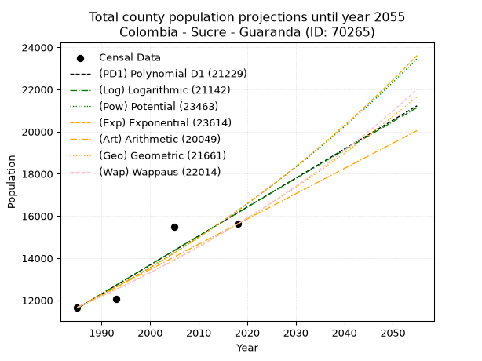
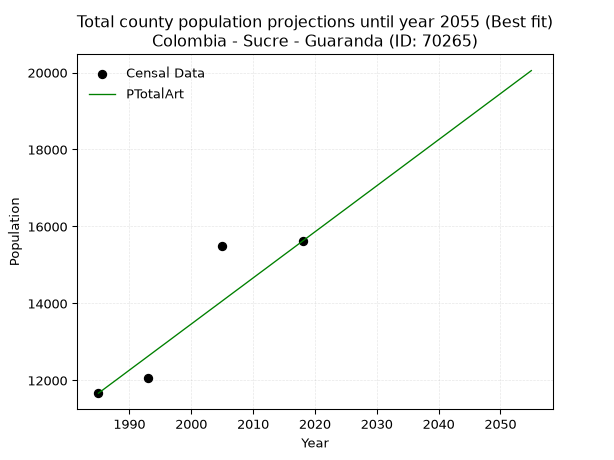
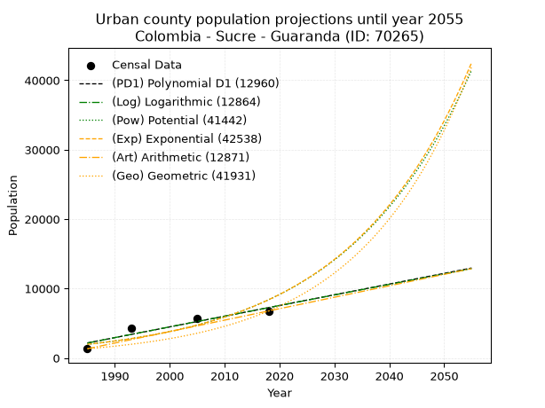
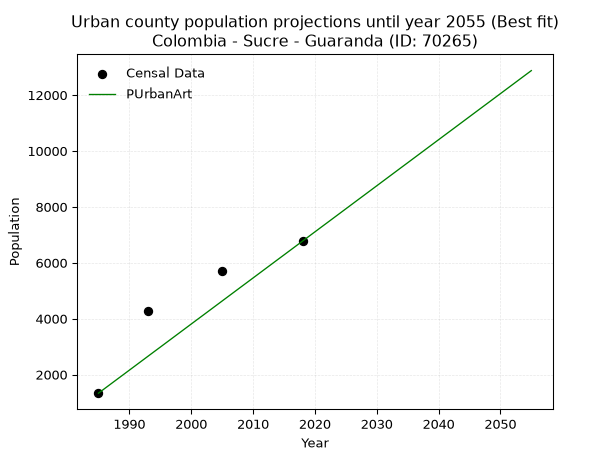
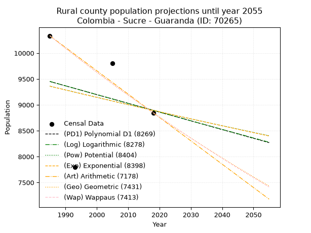
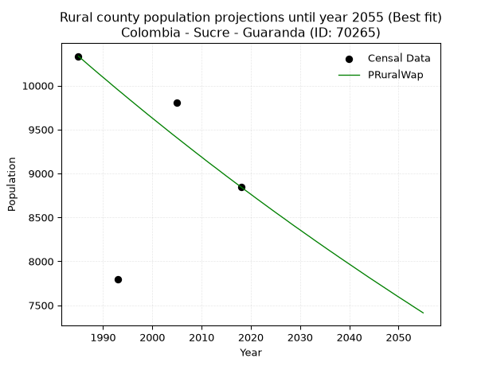

<div align="center">


</div>

# _“Population and Public Services Demand Projections (PPSD) until Year 2050 for Colombia - Sucre - Guaranda (ID: 70265)”_
Keywords: `population` `public-service` `projection` `lineal` `polynomial` `logarithmic` `potential` `exponential` `arithmetic` `geometric` `wappaus` `dane` `colombia` `south-america`

PPSD are analytical estimates used by governments and planners to anticipate future changes in population size, age distribution, and the resulting community needs for utilities, healthcare, education, and infrastructure as sizing future water treatment facilities, electrical grids, and road networks based on spatial growth.

> **General running parameters**: • app_version: _v20260806_. • Python version: _3.14.7_. • Pandas version: _3.0.5_. • NumPy version: _2.5.1_. • Creates, save and include plots into reports (create_plot): _False_. • Projection until year: _2050_. • Process polynomial degree 2 and up: _False_. • Process Wappaus: _True_. • Process Wappaus: _True_. • Set negative values to zero: _True_. • Set infinite values to zero: _True_. • Drop dataset notes: _True_. 
<div align="center">

Dynamic map: [:earth_americas:Google](http://maps.google.com/maps?q=8.468555611,-74.5377493) [:earth_americas:OSM](https://www.openstreetmap.org/#map=18/8.468555611/-74.5377493&layers=P) [:earth_americas:Bing](https://www.bing.com/maps?cp=8.468555611~-74.5377493&lvl=18) [:earth_americas:Apple](https://maps.apple.com/frame?center=8.468555611%2C-74.5377493&span=0.003%2C0.006)

</div>


<div align="center">

```geojson
{
  "type": "Feature",
  "geometry": {
    "type": "Point", 
    "coordinates": [-74.5377493, 8.468555611]
  }, 
  "properties": {
    "Name": "Colombia - Sucre - Guaranda (ID: 70265)"
  }
}
```

</div>


## 0. Census Data (4 records)

Census data are official statistics collected by a government about the people and housing in a country. They usually include counts of total population, age, sex, race, income, education, and jobs.

📅Global census file: [Population.xlsx](../data/Population.xlsx)

| Source   |   Year |   CountryID | CountryName   |   StateID | StateName   |   CountyID | CountyName   |   PTotal |   PUrban |   PRural |
|:---------|-------:|------------:|:--------------|----------:|:------------|-----------:|:-------------|---------:|---------:|---------:|
| DANE     |   1985 |          57 | Colombia      |        70 | Sucre       |      70265 | Guaranda     |    11666 |     1332 |    10334 |
| DANE     |   1993 |          57 | Colombia      |        70 | Sucre       |      70265 | Guaranda     |    12054 |     4261 |     7793 |
| DANE     |   2005 |          57 | Colombia      |        70 | Sucre       |      70265 | Guaranda     |    15498 |     5696 |     9802 |
| DANE     |   2018 |          57 | Colombia      |        70 | Sucre       |      70265 | Guaranda     |    15618 |     6772 |     8846 |

> 🔥Some records could had specific notes about the registered values or the corresponding urban or rural distribution.

## 1. Total

### 1.1. Coefficients and Parameters

* (PD1) Polynomial Deg 1: 137.35367322360463, -261032.68486551518 (lineal)
* (Log) Logarithmic: 275060.8224441395, -2077030.515597002
* (Pow) Potential: 20.22854363036461, -62.64296804064903
* (Exp) Exponential: 0.010101052999030424, 2.2815431817889376e-05
* (Art) Arithmetic: Year diff. 2018 - 1985 = 33, Population diff. 15618 - 11666 = 3952, Annual growth = 119.75757575757575
* (Geo) Geometric: Year diff. 2018 - 1985 = 33, Population diff. 15618 - 11666 = 3952, Annual growth % = 0.008879966766519143
* (Wap) Wappaus: i = 0.8778593736811007, Condition values only valid for < 200)

<sub>
Wappaus condition values: ['0.00', '0.88', '1.76', '2.63', '3.51', '4.39', '5.27', '6.15', '7.02', '7.90', '8.78', '9.66', '10.53', '11.41', '12.29', '13.17', '14.05', '14.92', '15.80', '16.68', '17.56', '18.44', '19.31', '20.19', '21.07', '21.95', '22.82', '23.70', '24.58', '25.46', '26.34', '27.21', '28.09', '28.97', '29.85', '30.73', '31.60', '32.48', '33.36', '34.24', '35.11', '35.99', '36.87', '37.75', '38.63', '39.50', '40.38', '41.26', '42.14', '43.02', '43.89', '44.77', '45.65', '46.53', '47.40', '48.28', '49.16', '50.04', '50.92', '51.79', '52.67', '53.55', '54.43', '55.31', '56.18', '57.06']
</sub>


### 1.2. Projected Dataset

|   Year |   CountyID |   PTotalPD1 |   PTotalLog |   PTotalPow |   PTotalExp |   PTotalArt |   PTotalGeo |   PTotalWap |
|-------:|-----------:|------------:|------------:|------------:|------------:|------------:|------------:|------------:|
|   1985 |      70265 |       11614 |       11609 |       11639 |       11644 |       11666 |       11666 |       11666 |
|   1986 |      70265 |       11752 |       11748 |       11758 |       11762 |       11786 |       11770 |       11769 |
|   1987 |      70265 |       11889 |       11886 |       11879 |       11881 |       11906 |       11874 |       11873 |
|   1988 |      70265 |       12026 |       12025 |       12000 |       12002 |       12025 |       11980 |       11977 |
|   1989 |      70265 |       12164 |       12163 |       12123 |       12124 |       12145 |       12086 |       12083 |
|   1990 |      70265 |       12301 |       12301 |       12247 |       12247 |       12265 |       12193 |       12190 |
|   1991 |      70265 |       12438 |       12439 |       12372 |       12371 |       12385 |       12302 |       12297 |
|   1992 |      70265 |       12576 |       12578 |       12498 |       12497 |       12504 |       12411 |       12406 |
|   1993 |      70265 |       12713 |       12716 |       12626 |       12624 |       12624 |       12521 |       12515 |
|   1994 |      70265 |       12851 |       12854 |       12755 |       12752 |       12744 |       12632 |       12626 |
|   1995 |      70265 |       12988 |       12991 |       12885 |       12881 |       12864 |       12744 |       12737 |
|   1996 |      70265 |       13125 |       13129 |       13016 |       13012 |       12983 |       12857 |       12850 |
|   1997 |      70265 |       13263 |       13267 |       13148 |       13144 |       13103 |       12972 |       12963 |
|   1998 |      70265 |       13400 |       13405 |       13282 |       13278 |       13223 |       13087 |       13078 |
|   1999 |      70265 |       13537 |       13542 |       13417 |       13412 |       13343 |       13203 |       13194 |
|   2000 |      70265 |       13675 |       13680 |       13554 |       13549 |       13462 |       13320 |       13310 |
|   2001 |      70265 |       13812 |       13817 |       13692 |       13686 |       13582 |       13439 |       13428 |
|   2002 |      70265 |       13949 |       13955 |       13831 |       13825 |       13702 |       13558 |       13547 |
|   2003 |      70265 |       14087 |       14092 |       13971 |       13965 |       13822 |       13678 |       13668 |
|   2004 |      70265 |       14224 |       14230 |       14113 |       14107 |       13941 |       13800 |       13789 |
|   2005 |      70265 |       14361 |       14367 |       14256 |       14250 |       14061 |       13922 |       13911 |
|   2006 |      70265 |       14499 |       14504 |       14400 |       14395 |       14181 |       14046 |       14035 |
|   2007 |      70265 |       14636 |       14641 |       14546 |       14541 |       14301 |       14171 |       14160 |
|   2008 |      70265 |       14773 |       14778 |       14694 |       14689 |       14420 |       14297 |       14286 |
|   2009 |      70265 |       14911 |       14915 |       14842 |       14838 |       14540 |       14423 |       14413 |
|   2010 |      70265 |       15048 |       15052 |       14993 |       14989 |       14660 |       14552 |       14542 |
|   2011 |      70265 |       15186 |       15189 |       15144 |       15141 |       14780 |       14681 |       14672 |
|   2012 |      70265 |       15323 |       15325 |       15297 |       15294 |       14899 |       14811 |       14803 |
|   2013 |      70265 |       15460 |       15462 |       15452 |       15450 |       15019 |       14943 |       14935 |
|   2014 |      70265 |       15598 |       15599 |       15608 |       15607 |       15139 |       15075 |       15069 |
|   2015 |      70265 |       15735 |       15735 |       15765 |       15765 |       15259 |       15209 |       15204 |
|   2016 |      70265 |       15872 |       15872 |       15924 |       15925 |       15378 |       15344 |       15341 |
|   2017 |      70265 |       16010 |       16008 |       16085 |       16087 |       15498 |       15481 |       15479 |
|   2018 |      70265 |       16147 |       16144 |       16247 |       16250 |       15618 |       15618 |       15618 |
|   2019 |      70265 |       16284 |       16281 |       16411 |       16415 |       15738 |       15757 |       15759 |
|   2020 |      70265 |       16422 |       16417 |       16576 |       16582 |       15858 |       15897 |       15901 |
|   2021 |      70265 |       16559 |       16553 |       16743 |       16750 |       15977 |       16038 |       16045 |
|   2022 |      70265 |       16696 |       16689 |       16911 |       16920 |       16097 |       16180 |       16190 |
|   2023 |      70265 |       16834 |       16825 |       17081 |       17092 |       16217 |       16324 |       16337 |
|   2024 |      70265 |       16971 |       16961 |       17253 |       17265 |       16337 |       16469 |       16485 |
|   2025 |      70265 |       17109 |       17097 |       17426 |       17441 |       16456 |       16615 |       16635 |
|   2026 |      70265 |       17246 |       17233 |       17601 |       17618 |       16576 |       16763 |       16786 |
|   2027 |      70265 |       17383 |       17368 |       17777 |       17797 |       16696 |       16911 |       16939 |
|   2028 |      70265 |       17521 |       17504 |       17956 |       17977 |       16816 |       17062 |       17094 |
|   2029 |      70265 |       17658 |       17640 |       18136 |       18160 |       16935 |       17213 |       17251 |
|   2030 |      70265 |       17795 |       17775 |       18317 |       18344 |       17055 |       17366 |       17409 |
|   2031 |      70265 |       17933 |       17911 |       18501 |       18530 |       17175 |       17520 |       17569 |
|   2032 |      70265 |       18070 |       18046 |       18686 |       18718 |       17295 |       17676 |       17730 |
|   2033 |      70265 |       18207 |       18181 |       18873 |       18909 |       17414 |       17833 |       17894 |
|   2034 |      70265 |       18345 |       18317 |       19061 |       19100 |       17534 |       17991 |       18059 |
|   2035 |      70265 |       18482 |       18452 |       19252 |       19294 |       17654 |       18151 |       18226 |
|   2036 |      70265 |       18619 |       18587 |       19444 |       19490 |       17774 |       18312 |       18395 |
|   2037 |      70265 |       18757 |       18722 |       19638 |       19688 |       17893 |       18475 |       18566 |
|   2038 |      70265 |       18894 |       18857 |       19834 |       19888 |       18013 |       18639 |       18739 |
|   2039 |      70265 |       19031 |       18992 |       20032 |       20090 |       18133 |       18804 |       18914 |
|   2040 |      70265 |       19169 |       19127 |       20232 |       20294 |       18253 |       18971 |       19091 |
|   2041 |      70265 |       19306 |       19262 |       20433 |       20500 |       18372 |       19140 |       19270 |
|   2042 |      70265 |       19444 |       19396 |       20637 |       20708 |       18492 |       19310 |       19451 |
|   2043 |      70265 |       19581 |       19531 |       20842 |       20918 |       18612 |       19481 |       19634 |
|   2044 |      70265 |       19718 |       19666 |       21049 |       21131 |       18732 |       19654 |       19820 |
|   2045 |      70265 |       19856 |       19800 |       21259 |       21345 |       18851 |       19829 |       20007 |
|   2046 |      70265 |       19993 |       19935 |       21470 |       21562 |       18971 |       20005 |       20197 |
|   2047 |      70265 |       20130 |       20069 |       21683 |       21781 |       19091 |       20182 |       20389 |
|   2048 |      70265 |       20268 |       20203 |       21899 |       22002 |       19211 |       20362 |       20584 |
|   2049 |      70265 |       20405 |       20338 |       22116 |       22225 |       19330 |       20542 |       20781 |
|   2050 |      70265 |       20542 |       20472 |       22335 |       22451 |       19450 |       20725 |       20980 |
<div align="center">

</img>

</div>


### 1.3. Best fit with absolute and relative error (%)

Relative error puts that difference into context by dividing the absolute error by the true value, creating a unitless ratio or percentage that shows the scale of the mistake.

Absolute and relative error

|   Year | Source   |   CountryID | CountryName   |   StateID | StateName   |   CountyID_x | CountyName   |   PTotal |   PUrban |   PRural |   CountyID_y |   PTotalPD1 |   PTotalLog |   PTotalPow |   PTotalExp |   PTotalArt |   PTotalGeo |   PTotalWap |   PTotalPD1AbsError |   PTotalLogAbsError |   PTotalPowAbsError |   PTotalExpAbsError |   PTotalArtAbsError |   PTotalGeoAbsError |   PTotalWapAbsError |   PTotalPD1RelError |   PTotalLogRelError |   PTotalPowRelError |   PTotalExpRelError |   PTotalArtRelError |   PTotalGeoRelError |   PTotalWapRelError |
|-------:|:---------|------------:|:--------------|----------:|:------------|-------------:|:-------------|---------:|---------:|---------:|-------------:|------------:|------------:|------------:|------------:|------------:|------------:|------------:|--------------------:|--------------------:|--------------------:|--------------------:|--------------------:|--------------------:|--------------------:|--------------------:|--------------------:|--------------------:|--------------------:|--------------------:|--------------------:|--------------------:|
|   1985 | DANE     |          57 | Colombia      |        70 | Sucre       |        70265 | Guaranda     |    11666 |     1332 |    10334 |        70265 |       11614 |       11609 |       11639 |       11644 |       11666 |       11666 |       11666 |                  52 |                  57 |                  27 |                  22 |                   0 |                   0 |                   0 |             0.44574 |            0.488599 |            0.231442 |            0.188582 |             0       |             0       |             0       |
|   1993 | DANE     |          57 | Colombia      |        70 | Sucre       |        70265 | Guaranda     |    12054 |     4261 |     7793 |        70265 |       12713 |       12716 |       12626 |       12624 |       12624 |       12521 |       12515 |                 659 |                 662 |                 572 |                 570 |                 570 |                 467 |                 461 |             5.46706 |            5.49195  |            4.74531  |            4.72872  |             4.72872 |             3.87423 |             3.82446 |
|   2005 | DANE     |          57 | Colombia      |        70 | Sucre       |        70265 | Guaranda     |    15498 |     5696 |     9802 |        70265 |       14361 |       14367 |       14256 |       14250 |       14061 |       13922 |       13911 |                1137 |                1131 |                1242 |                1248 |                1437 |                1576 |                1587 |             7.33643 |            7.29772  |            8.01394  |            8.05265  |             9.27216 |            10.1691  |            10.24    |
|   2018 | DANE     |          57 | Colombia      |        70 | Sucre       |        70265 | Guaranda     |    15618 |     6772 |     8846 |        70265 |       16147 |       16144 |       16247 |       16250 |       15618 |       15618 |       15618 |                 529 |                 526 |                 629 |                 632 |                   0 |                   0 |                   0 |             3.38712 |            3.36791  |            4.0274   |            4.04661  |             0       |             0       |             0       |

Relative error mean

| Method    |   RelError | Best   |
|:----------|-----------:|:-------|
| PTotalPD1 |    4.15909 |        |
| PTotalLog |    4.16154 |        |
| PTotalPow |    4.25452 |        |
| PTotalExp |    4.25414 |        |
| PTotalArt |    3.50022 | True   |
| PTotalGeo |    3.51082 |        |
| PTotalWap |    3.51612 |        |

💙Best method: _**PTotalArt**_
<div align="center">

</img>

</div>


### 1.4. Fresh water supply demand in liters per capita per day (lpcd)

The fresh water supply demand typically ranges from 100 to 300 liters per capita per day (lpcd) for standard domestic and municipal planning, though absolute survival minimums set by the World Health Organization are as low as 7.5 to 20 liters per day, and total consumption in high-income nations can exceed 400 liters.

> `CZ`: Level in meters above the sea level (masl)<br> `WS`: Fresh water supply demand in liters per capita per day (lpcd or l/h/d)<br> `WSAll`: Zonal fresh water supply demand in liters per second (l/s)<br> `A`: Zonal area in square meters<br> `DP`: Population density (people/hectare)

Reference values (RAS Colombia)

|    CZ |   WS |
|------:|-----:|
|  1000 |  120 |
|  2000 |  130 |
| 99999 |  140 |

County shapefile geometry properties and water supply values

|   CountyID |      ATotal |   CZTotal |   WSTotal |
|-----------:|------------:|----------:|----------:|
|      70265 | 3.61397e+08 |   26.1222 |       120 |

Projected values for best method: PTotalArt

|   CountyID |   Year |   PTotalArt |   DPTotal |   WSTotal |   WSTotalAll |
|-----------:|-------:|------------:|----------:|----------:|-------------:|
|      70265 |   1985 |       11666 |      0.32 |       120 |      16.2028 |
|      70265 |   1986 |       11786 |      0.33 |       120 |      16.3694 |
|      70265 |   1987 |       11906 |      0.33 |       120 |      16.5361 |
|      70265 |   1988 |       12025 |      0.33 |       120 |      16.7014 |
|      70265 |   1989 |       12145 |      0.34 |       120 |      16.8681 |
|      70265 |   1990 |       12265 |      0.34 |       120 |      17.0347 |
|      70265 |   1991 |       12385 |      0.34 |       120 |      17.2014 |
|      70265 |   1992 |       12504 |      0.35 |       120 |      17.3667 |
|      70265 |   1993 |       12624 |      0.35 |       120 |      17.5333 |
|      70265 |   1994 |       12744 |      0.35 |       120 |      17.7    |
|      70265 |   1995 |       12864 |      0.36 |       120 |      17.8667 |
|      70265 |   1996 |       12983 |      0.36 |       120 |      18.0319 |
|      70265 |   1997 |       13103 |      0.36 |       120 |      18.1986 |
|      70265 |   1998 |       13223 |      0.37 |       120 |      18.3653 |
|      70265 |   1999 |       13343 |      0.37 |       120 |      18.5319 |
|      70265 |   2000 |       13462 |      0.37 |       120 |      18.6972 |
|      70265 |   2001 |       13582 |      0.38 |       120 |      18.8639 |
|      70265 |   2002 |       13702 |      0.38 |       120 |      19.0306 |
|      70265 |   2003 |       13822 |      0.38 |       120 |      19.1972 |
|      70265 |   2004 |       13941 |      0.39 |       120 |      19.3625 |
|      70265 |   2005 |       14061 |      0.39 |       120 |      19.5292 |
|      70265 |   2006 |       14181 |      0.39 |       120 |      19.6958 |
|      70265 |   2007 |       14301 |      0.4  |       120 |      19.8625 |
|      70265 |   2008 |       14420 |      0.4  |       120 |      20.0278 |
|      70265 |   2009 |       14540 |      0.4  |       120 |      20.1944 |
|      70265 |   2010 |       14660 |      0.41 |       120 |      20.3611 |
|      70265 |   2011 |       14780 |      0.41 |       120 |      20.5278 |
|      70265 |   2012 |       14899 |      0.41 |       120 |      20.6931 |
|      70265 |   2013 |       15019 |      0.42 |       120 |      20.8597 |
|      70265 |   2014 |       15139 |      0.42 |       120 |      21.0264 |
|      70265 |   2015 |       15259 |      0.42 |       120 |      21.1931 |
|      70265 |   2016 |       15378 |      0.43 |       120 |      21.3583 |
|      70265 |   2017 |       15498 |      0.43 |       120 |      21.525  |
|      70265 |   2018 |       15618 |      0.43 |       120 |      21.6917 |
|      70265 |   2019 |       15738 |      0.44 |       120 |      21.8583 |
|      70265 |   2020 |       15858 |      0.44 |       120 |      22.025  |
|      70265 |   2021 |       15977 |      0.44 |       120 |      22.1903 |
|      70265 |   2022 |       16097 |      0.45 |       120 |      22.3569 |
|      70265 |   2023 |       16217 |      0.45 |       120 |      22.5236 |
|      70265 |   2024 |       16337 |      0.45 |       120 |      22.6903 |
|      70265 |   2025 |       16456 |      0.46 |       120 |      22.8556 |
|      70265 |   2026 |       16576 |      0.46 |       120 |      23.0222 |
|      70265 |   2027 |       16696 |      0.46 |       120 |      23.1889 |
|      70265 |   2028 |       16816 |      0.47 |       120 |      23.3556 |
|      70265 |   2029 |       16935 |      0.47 |       120 |      23.5208 |
|      70265 |   2030 |       17055 |      0.47 |       120 |      23.6875 |
|      70265 |   2031 |       17175 |      0.48 |       120 |      23.8542 |
|      70265 |   2032 |       17295 |      0.48 |       120 |      24.0208 |
|      70265 |   2033 |       17414 |      0.48 |       120 |      24.1861 |
|      70265 |   2034 |       17534 |      0.49 |       120 |      24.3528 |
|      70265 |   2035 |       17654 |      0.49 |       120 |      24.5194 |
|      70265 |   2036 |       17774 |      0.49 |       120 |      24.6861 |
|      70265 |   2037 |       17893 |      0.5  |       120 |      24.8514 |
|      70265 |   2038 |       18013 |      0.5  |       120 |      25.0181 |
|      70265 |   2039 |       18133 |      0.5  |       120 |      25.1847 |
|      70265 |   2040 |       18253 |      0.51 |       120 |      25.3514 |
|      70265 |   2041 |       18372 |      0.51 |       120 |      25.5167 |
|      70265 |   2042 |       18492 |      0.51 |       120 |      25.6833 |
|      70265 |   2043 |       18612 |      0.52 |       120 |      25.85   |
|      70265 |   2044 |       18732 |      0.52 |       120 |      26.0167 |
|      70265 |   2045 |       18851 |      0.52 |       120 |      26.1819 |
|      70265 |   2046 |       18971 |      0.52 |       120 |      26.3486 |
|      70265 |   2047 |       19091 |      0.53 |       120 |      26.5153 |
|      70265 |   2048 |       19211 |      0.53 |       120 |      26.6819 |
|      70265 |   2049 |       19330 |      0.53 |       120 |      26.8472 |
|      70265 |   2050 |       19450 |      0.54 |       120 |      27.0139 |

## 2. Urban

### 2.1. Coefficients and Parameters

* (PD1) Polynomial Deg 1: 154.24126856683984, -304005.84745082137 (lineal)
* (Log) Logarithmic: 308965.1345755289, -2343931.2137997984
* (Pow) Potential: 87.96600949498583, -286.79739276337733
* (Exp) Exponential: 0.04389437174271013, 2.845398069217486e-35
* (Art) Arithmetic: Year diff. 2018 - 1985 = 33, Population diff. 6772 - 1332 = 5440, Annual growth = 164.84848484848484
* (Geo) Geometric: Year diff. 2018 - 1985 = 33, Population diff. 6772 - 1332 = 5440, Annual growth % = 0.050510470963663456
* (Wap) Wappaus: i = 4.0683239103772175, Condition values only valid for < 200)

<sub>
Wappaus condition values: ['0.00', '4.07', '8.14', '12.20', '16.27', '20.34', '24.41', '28.48', '32.55', '36.61', '40.68', '44.75', '48.82', '52.89', '56.96', '61.02', '65.09', '69.16', '73.23', '77.30', '81.37', '85.43', '89.50', '93.57', '97.64', '101.71', '105.78', '109.84', '113.91', '117.98', '122.05', '126.12', '130.19', '134.25', '138.32', '142.39', '146.46', '150.53', '154.60', '158.66', '162.73', '166.80', '170.87', '174.94', '179.01', '183.07', '187.14', '191.21', '195.28', '199.35', '203.42', '207.48', '211.55', '215.62', '219.69', '223.76', '227.83', '231.89', '235.96', '240.03', '244.10', '248.17', '252.24', '256.30', '260.37', '264.44']
</sub>


### 2.2. Projected Dataset

|   Year |   CountyID |   PUrbanPD1 |   PUrbanLog |   PUrbanPow |   PUrbanExp |   PUrbanArt |   PUrbanGeo |
|-------:|-----------:|------------:|------------:|------------:|------------:|------------:|------------:|
|   1985 |      70265 |        2163 |        2157 |        1965 |        1970 |        1332 |        1332 |
|   1986 |      70265 |        2317 |        2312 |        2054 |        2058 |        1497 |        1399 |
|   1987 |      70265 |        2472 |        2468 |        2147 |        2150 |        1662 |        1470 |
|   1988 |      70265 |        2626 |        2623 |        2245 |        2247 |        1827 |        1544 |
|   1989 |      70265 |        2780 |        2779 |        2346 |        2348 |        1991 |        1622 |
|   1990 |      70265 |        2934 |        2934 |        2452 |        2453 |        2156 |        1704 |
|   1991 |      70265 |        3089 |        3089 |        2563 |        2563 |        2321 |        1790 |
|   1992 |      70265 |        3243 |        3244 |        2679 |        2678 |        2486 |        1881 |
|   1993 |      70265 |        3397 |        3399 |        2800 |        2798 |        2651 |        1976 |
|   1994 |      70265 |        3551 |        3554 |        2926 |        2924 |        2816 |        2075 |
|   1995 |      70265 |        3705 |        3709 |        3058 |        3055 |        2980 |        2180 |
|   1996 |      70265 |        3860 |        3864 |        3196 |        3192 |        3145 |        2290 |
|   1997 |      70265 |        4014 |        4019 |        3340 |        3335 |        3310 |        2406 |
|   1998 |      70265 |        4168 |        4174 |        3490 |        3485 |        3475 |        2528 |
|   1999 |      70265 |        4322 |        4328 |        3647 |        3641 |        3640 |        2655 |
|   2000 |      70265 |        4477 |        4483 |        3811 |        3805 |        3805 |        2789 |
|   2001 |      70265 |        4631 |        4637 |        3982 |        3975 |        3970 |        2930 |
|   2002 |      70265 |        4785 |        4791 |        4161 |        4154 |        4134 |        3078 |
|   2003 |      70265 |        4939 |        4946 |        4348 |        4340 |        4299 |        3234 |
|   2004 |      70265 |        5094 |        5100 |        4543 |        4535 |        4464 |        3397 |
|   2005 |      70265 |        5248 |        5254 |        4747 |        4738 |        4629 |        3569 |
|   2006 |      70265 |        5402 |        5408 |        4960 |        4951 |        4794 |        3749 |
|   2007 |      70265 |        5556 |        5562 |        5182 |        5173 |        4959 |        3938 |
|   2008 |      70265 |        5711 |        5716 |        5414 |        5405 |        5124 |        4137 |
|   2009 |      70265 |        5865 |        5870 |        5657 |        5648 |        5288 |        4346 |
|   2010 |      70265 |        6019 |        6024 |        5910 |        5901 |        5453 |        4566 |
|   2011 |      70265 |        6173 |        6177 |        6174 |        6166 |        5618 |        4796 |
|   2012 |      70265 |        6328 |        6331 |        6450 |        6443 |        5783 |        5039 |
|   2013 |      70265 |        6482 |        6484 |        6738 |        6732 |        5948 |        5293 |
|   2014 |      70265 |        6636 |        6638 |        7039 |        7034 |        6113 |        5561 |
|   2015 |      70265 |        6790 |        6791 |        7354 |        7349 |        6277 |        5841 |
|   2016 |      70265 |        6945 |        6945 |        7682 |        7679 |        6442 |        6136 |
|   2017 |      70265 |        7099 |        7098 |        8024 |        8024 |        6607 |        6446 |
|   2018 |      70265 |        7253 |        7251 |        8382 |        8384 |        6772 |        6772 |
|   2019 |      70265 |        7407 |        7404 |        8755 |        8760 |        6937 |        7114 |
|   2020 |      70265 |        7562 |        7557 |        9145 |        9153 |        7102 |        7473 |
|   2021 |      70265 |        7716 |        7710 |        9552 |        9564 |        7267 |        7851 |
|   2022 |      70265 |        7870 |        7863 |        9977 |        9993 |        7431 |        8247 |
|   2023 |      70265 |        8024 |        8015 |       10420 |       10441 |        7596 |        8664 |
|   2024 |      70265 |        8178 |        8168 |       10883 |       10910 |        7761 |        9102 |
|   2025 |      70265 |        8333 |        8321 |       11366 |       11400 |        7926 |        9561 |
|   2026 |      70265 |        8487 |        8473 |       11871 |       11911 |        8091 |       10044 |
|   2027 |      70265 |        8641 |        8626 |       12398 |       12446 |        8256 |       10552 |
|   2028 |      70265 |        8795 |        8778 |       12947 |       13004 |        8420 |       11085 |
|   2029 |      70265 |        8950 |        8930 |       13521 |       13587 |        8585 |       11645 |
|   2030 |      70265 |        9104 |        9083 |       14120 |       14197 |        8750 |       12233 |
|   2031 |      70265 |        9258 |        9235 |       14745 |       14834 |        8915 |       12851 |
|   2032 |      70265 |        9412 |        9387 |       15398 |       15500 |        9080 |       13500 |
|   2033 |      70265 |        9567 |        9539 |       16079 |       16195 |        9245 |       14182 |
|   2034 |      70265 |        9721 |        9691 |       16790 |       16922 |        9410 |       14898 |
|   2035 |      70265 |        9875 |        9843 |       17531 |       17681 |        9574 |       15650 |
|   2036 |      70265 |       10029 |        9995 |       18306 |       18475 |        9739 |       16441 |
|   2037 |      70265 |       10184 |       10146 |       19114 |       19304 |        9904 |       17271 |
|   2038 |      70265 |       10338 |       10298 |       19957 |       20170 |       10069 |       18144 |
|   2039 |      70265 |       10492 |       10449 |       20837 |       21075 |       10234 |       19060 |
|   2040 |      70265 |       10646 |       10601 |       21755 |       22021 |       10399 |       20023 |
|   2041 |      70265 |       10801 |       10752 |       22714 |       23009 |       10564 |       21034 |
|   2042 |      70265 |       10955 |       10904 |       23714 |       24041 |       10728 |       22097 |
|   2043 |      70265 |       11109 |       11055 |       24757 |       25120 |       10893 |       23213 |
|   2044 |      70265 |       11263 |       11206 |       25846 |       26247 |       11058 |       24385 |
|   2045 |      70265 |       11418 |       11357 |       26983 |       27425 |       11223 |       25617 |
|   2046 |      70265 |       11572 |       11508 |       28168 |       28656 |       11388 |       26911 |
|   2047 |      70265 |       11726 |       11659 |       29406 |       29942 |       11553 |       28270 |
|   2048 |      70265 |       11880 |       11810 |       30697 |       31285 |       11717 |       29698 |
|   2049 |      70265 |       12035 |       11961 |       32043 |       32689 |       11882 |       31198 |
|   2050 |      70265 |       12189 |       12112 |       33449 |       34156 |       12047 |       32774 |
<div align="center">

</img>

</div>


### 2.3. Best fit with absolute and relative error (%)

Relative error puts that difference into context by dividing the absolute error by the true value, creating a unitless ratio or percentage that shows the scale of the mistake.

Absolute and relative error

|   Year | Source   |   CountryID | CountryName   |   StateID | StateName   |   CountyID_x | CountyName   |   PTotal |   PUrban |   PRural |   CountyID_y |   PUrbanPD1 |   PUrbanLog |   PUrbanPow |   PUrbanExp |   PUrbanArt |   PUrbanGeo |   PUrbanPD1AbsError |   PUrbanLogAbsError |   PUrbanPowAbsError |   PUrbanExpAbsError |   PUrbanArtAbsError |   PUrbanGeoAbsError |   PUrbanPD1RelError |   PUrbanLogRelError |   PUrbanPowRelError |   PUrbanExpRelError |   PUrbanArtRelError |   PUrbanGeoRelError |
|-------:|:---------|------------:|:--------------|----------:|:------------|-------------:|:-------------|---------:|---------:|---------:|-------------:|------------:|------------:|------------:|------------:|------------:|------------:|--------------------:|--------------------:|--------------------:|--------------------:|--------------------:|--------------------:|--------------------:|--------------------:|--------------------:|--------------------:|--------------------:|--------------------:|
|   1985 | DANE     |          57 | Colombia      |        70 | Sucre       |        70265 | Guaranda     |    11666 |     1332 |    10334 |        70265 |        2163 |        2157 |        1965 |        1970 |        1332 |        1332 |                 831 |                 825 |                 633 |                 638 |                   0 |                   0 |            62.3874  |            61.9369  |             47.5225 |             47.8979 |              0      |              0      |
|   1993 | DANE     |          57 | Colombia      |        70 | Sucre       |        70265 | Guaranda     |    12054 |     4261 |     7793 |        70265 |        3397 |        3399 |        2800 |        2798 |        2651 |        1976 |                 864 |                 862 |                1461 |                1463 |                1610 |                2285 |            20.2769  |            20.23    |             34.2877 |             34.3347 |             37.7846 |             53.6259 |
|   2005 | DANE     |          57 | Colombia      |        70 | Sucre       |        70265 | Guaranda     |    15498 |     5696 |     9802 |        70265 |        5248 |        5254 |        4747 |        4738 |        4629 |        3569 |                 448 |                 442 |                 949 |                 958 |                1067 |                2127 |             7.86517 |             7.75983 |             16.6608 |             16.8188 |             18.7324 |             37.342  |
|   2018 | DANE     |          57 | Colombia      |        70 | Sucre       |        70265 | Guaranda     |    15618 |     6772 |     8846 |        70265 |        7253 |        7251 |        8382 |        8384 |        6772 |        6772 |                 481 |                 479 |                1610 |                1612 |                   0 |                   0 |             7.10278 |             7.07324 |             23.7744 |             23.8039 |              0      |              0      |

Relative error mean

| Method    |   RelError | Best   |
|:----------|-----------:|:-------|
| PUrbanPD1 |    24.4081 |        |
| PUrbanLog |    24.25   |        |
| PUrbanPow |    30.5614 |        |
| PUrbanExp |    30.7138 |        |
| PUrbanArt |    14.1293 | True   |
| PUrbanGeo |    22.742  |        |

💙Best method: _**PUrbanArt**_
<div align="center">

</img>

</div>


### 2.4. Fresh water supply demand in liters per capita per day (lpcd)

The fresh water supply demand typically ranges from 100 to 300 liters per capita per day (lpcd) for standard domestic and municipal planning, though absolute survival minimums set by the World Health Organization are as low as 7.5 to 20 liters per day, and total consumption in high-income nations can exceed 400 liters.

> `CZ`: Level in meters above the sea level (masl)<br> `WS`: Fresh water supply demand in liters per capita per day (lpcd or l/h/d)<br> `WSAll`: Zonal fresh water supply demand in liters per second (l/s)<br> `A`: Zonal area in square meters<br> `DP`: Population density (people/hectare)

Reference values (RAS Colombia)

|    CZ |   WS |
|------:|-----:|
|  1000 |  120 |
|  2000 |  130 |
| 99999 |  140 |

County shapefile geometry properties and water supply values

|   CountyID |      AUrban |   CZUrban |   WSUrban |
|-----------:|------------:|----------:|----------:|
|      70265 | 1.04122e+06 |   25.9869 |       120 |

Projected values for best method: PUrbanArt

|   CountyID |   Year |   PUrbanArt |   DPUrban |   WSUrban |   WSUrbanAll |
|-----------:|-------:|------------:|----------:|----------:|-------------:|
|      70265 |   1985 |        1332 |     12.79 |       120 |      1.85    |
|      70265 |   1986 |        1497 |     14.38 |       120 |      2.07917 |
|      70265 |   1987 |        1662 |     15.96 |       120 |      2.30833 |
|      70265 |   1988 |        1827 |     17.55 |       120 |      2.5375  |
|      70265 |   1989 |        1991 |     19.12 |       120 |      2.76528 |
|      70265 |   1990 |        2156 |     20.71 |       120 |      2.99444 |
|      70265 |   1991 |        2321 |     22.29 |       120 |      3.22361 |
|      70265 |   1992 |        2486 |     23.88 |       120 |      3.45278 |
|      70265 |   1993 |        2651 |     25.46 |       120 |      3.68194 |
|      70265 |   1994 |        2816 |     27.05 |       120 |      3.91111 |
|      70265 |   1995 |        2980 |     28.62 |       120 |      4.13889 |
|      70265 |   1996 |        3145 |     30.21 |       120 |      4.36806 |
|      70265 |   1997 |        3310 |     31.79 |       120 |      4.59722 |
|      70265 |   1998 |        3475 |     33.37 |       120 |      4.82639 |
|      70265 |   1999 |        3640 |     34.96 |       120 |      5.05556 |
|      70265 |   2000 |        3805 |     36.54 |       120 |      5.28472 |
|      70265 |   2001 |        3970 |     38.13 |       120 |      5.51389 |
|      70265 |   2002 |        4134 |     39.7  |       120 |      5.74167 |
|      70265 |   2003 |        4299 |     41.29 |       120 |      5.97083 |
|      70265 |   2004 |        4464 |     42.87 |       120 |      6.2     |
|      70265 |   2005 |        4629 |     44.46 |       120 |      6.42917 |
|      70265 |   2006 |        4794 |     46.04 |       120 |      6.65833 |
|      70265 |   2007 |        4959 |     47.63 |       120 |      6.8875  |
|      70265 |   2008 |        5124 |     49.21 |       120 |      7.11667 |
|      70265 |   2009 |        5288 |     50.79 |       120 |      7.34444 |
|      70265 |   2010 |        5453 |     52.37 |       120 |      7.57361 |
|      70265 |   2011 |        5618 |     53.96 |       120 |      7.80278 |
|      70265 |   2012 |        5783 |     55.54 |       120 |      8.03194 |
|      70265 |   2013 |        5948 |     57.13 |       120 |      8.26111 |
|      70265 |   2014 |        6113 |     58.71 |       120 |      8.49028 |
|      70265 |   2015 |        6277 |     60.29 |       120 |      8.71806 |
|      70265 |   2016 |        6442 |     61.87 |       120 |      8.94722 |
|      70265 |   2017 |        6607 |     63.45 |       120 |      9.17639 |
|      70265 |   2018 |        6772 |     65.04 |       120 |      9.40556 |
|      70265 |   2019 |        6937 |     66.62 |       120 |      9.63472 |
|      70265 |   2020 |        7102 |     68.21 |       120 |      9.86389 |
|      70265 |   2021 |        7267 |     69.79 |       120 |     10.0931  |
|      70265 |   2022 |        7431 |     71.37 |       120 |     10.3208  |
|      70265 |   2023 |        7596 |     72.95 |       120 |     10.55    |
|      70265 |   2024 |        7761 |     74.54 |       120 |     10.7792  |
|      70265 |   2025 |        7926 |     76.12 |       120 |     11.0083  |
|      70265 |   2026 |        8091 |     77.71 |       120 |     11.2375  |
|      70265 |   2027 |        8256 |     79.29 |       120 |     11.4667  |
|      70265 |   2028 |        8420 |     80.87 |       120 |     11.6944  |
|      70265 |   2029 |        8585 |     82.45 |       120 |     11.9236  |
|      70265 |   2030 |        8750 |     84.04 |       120 |     12.1528  |
|      70265 |   2031 |        8915 |     85.62 |       120 |     12.3819  |
|      70265 |   2032 |        9080 |     87.21 |       120 |     12.6111  |
|      70265 |   2033 |        9245 |     88.79 |       120 |     12.8403  |
|      70265 |   2034 |        9410 |     90.37 |       120 |     13.0694  |
|      70265 |   2035 |        9574 |     91.95 |       120 |     13.2972  |
|      70265 |   2036 |        9739 |     93.53 |       120 |     13.5264  |
|      70265 |   2037 |        9904 |     95.12 |       120 |     13.7556  |
|      70265 |   2038 |       10069 |     96.7  |       120 |     13.9847  |
|      70265 |   2039 |       10234 |     98.29 |       120 |     14.2139  |
|      70265 |   2040 |       10399 |     99.87 |       120 |     14.4431  |
|      70265 |   2041 |       10564 |    101.46 |       120 |     14.6722  |
|      70265 |   2042 |       10728 |    103.03 |       120 |     14.9     |
|      70265 |   2043 |       10893 |    104.62 |       120 |     15.1292  |
|      70265 |   2044 |       11058 |    106.2  |       120 |     15.3583  |
|      70265 |   2045 |       11223 |    107.79 |       120 |     15.5875  |
|      70265 |   2046 |       11388 |    109.37 |       120 |     15.8167  |
|      70265 |   2047 |       11553 |    110.96 |       120 |     16.0458  |
|      70265 |   2048 |       11717 |    112.53 |       120 |     16.2736  |
|      70265 |   2049 |       11882 |    114.12 |       120 |     16.5028  |
|      70265 |   2050 |       12047 |    115.7  |       120 |     16.7319  |

## 3. Rural

### 3.1. Coefficients and Parameters

* (PD1) Polynomial Deg 1: -16.88759534323518, 42973.16258530618 (lineal)
* (Log) Logarithmic: -33904.31213138943, 266900.69820279727
* (Pow) Potential: -3.112024749574989, 14.234038397143657
* (Exp) Exponential: -0.001549045262469078, 202609.82271241597
* (Art) Arithmetic: Year diff. 2018 - 1985 = 33, Population diff. 8846 - 10334 = -1488, Annual growth = -45.09090909090909
* (Geo) Geometric: Year diff. 2018 - 1985 = 33, Population diff. 8846 - 10334 = -1488, Annual growth % = -0.004700253931909981
* (Wap) Wappaus: i = -0.47018674755901035, Condition values only valid for < 200)

<sub>
Wappaus condition values: ['-0.00', '-0.47', '-0.94', '-1.41', '-1.88', '-2.35', '-2.82', '-3.29', '-3.76', '-4.23', '-4.70', '-5.17', '-5.64', '-6.11', '-6.58', '-7.05', '-7.52', '-7.99', '-8.46', '-8.93', '-9.40', '-9.87', '-10.34', '-10.81', '-11.28', '-11.75', '-12.22', '-12.70', '-13.17', '-13.64', '-14.11', '-14.58', '-15.05', '-15.52', '-15.99', '-16.46', '-16.93', '-17.40', '-17.87', '-18.34', '-18.81', '-19.28', '-19.75', '-20.22', '-20.69', '-21.16', '-21.63', '-22.10', '-22.57', '-23.04', '-23.51', '-23.98', '-24.45', '-24.92', '-25.39', '-25.86', '-26.33', '-26.80', '-27.27', '-27.74', '-28.21', '-28.68', '-29.15', '-29.62', '-30.09', '-30.56']
</sub>


### 3.2. Projected Dataset

|   Year |   CountyID |   PRuralPD1 |   PRuralLog |   PRuralPow |   PRuralExp |   PRuralArt |   PRuralGeo |   PRuralWap |
|-------:|-----------:|------------:|------------:|------------:|------------:|------------:|------------:|------------:|
|   1985 |      70265 |        9451 |        9453 |        9361 |        9360 |       10334 |       10334 |       10334 |
|   1986 |      70265 |        9434 |        9435 |        9346 |        9345 |       10289 |       10285 |       10286 |
|   1987 |      70265 |        9418 |        9418 |        9332 |        9331 |       10244 |       10237 |       10237 |
|   1988 |      70265 |        9401 |        9401 |        9317 |        9316 |       10199 |       10189 |       10189 |
|   1989 |      70265 |        9384 |        9384 |        9303 |        9302 |       10154 |       10141 |       10141 |
|   1990 |      70265 |        9367 |        9367 |        9288 |        9288 |       10109 |       10093 |       10094 |
|   1991 |      70265 |        9350 |        9350 |        9274 |        9273 |       10063 |       10046 |       10047 |
|   1992 |      70265 |        9333 |        9333 |        9259 |        9259 |       10018 |        9999 |        9999 |
|   1993 |      70265 |        9316 |        9316 |        9245 |        9245 |        9973 |        9952 |        9952 |
|   1994 |      70265 |        9299 |        9299 |        9230 |        9230 |        9928 |        9905 |        9906 |
|   1995 |      70265 |        9282 |        9282 |        9216 |        9216 |        9883 |        9858 |        9859 |
|   1996 |      70265 |        9266 |        9265 |        9201 |        9202 |        9838 |        9812 |        9813 |
|   1997 |      70265 |        9249 |        9248 |        9187 |        9187 |        9793 |        9766 |        9767 |
|   1998 |      70265 |        9232 |        9231 |        9173 |        9173 |        9748 |        9720 |        9721 |
|   1999 |      70265 |        9215 |        9214 |        9159 |        9159 |        9703 |        9674 |        9675 |
|   2000 |      70265 |        9198 |        9197 |        9144 |        9145 |        9658 |        9629 |        9630 |
|   2001 |      70265 |        9181 |        9180 |        9130 |        9131 |        9613 |        9584 |        9585 |
|   2002 |      70265 |        9164 |        9163 |        9116 |        9117 |        9567 |        9539 |        9540 |
|   2003 |      70265 |        9147 |        9147 |        9102 |        9102 |        9522 |        9494 |        9495 |
|   2004 |      70265 |        9130 |        9130 |        9088 |        9088 |        9477 |        9449 |        9450 |
|   2005 |      70265 |        9114 |        9113 |        9074 |        9074 |        9432 |        9405 |        9406 |
|   2006 |      70265 |        9097 |        9096 |        9059 |        9060 |        9387 |        9361 |        9362 |
|   2007 |      70265 |        9080 |        9079 |        9045 |        9046 |        9342 |        9317 |        9318 |
|   2008 |      70265 |        9063 |        9062 |        9031 |        9032 |        9297 |        9273 |        9274 |
|   2009 |      70265 |        9046 |        9045 |        9017 |        9018 |        9252 |        9229 |        9230 |
|   2010 |      70265 |        9029 |        9028 |        9003 |        9004 |        9207 |        9186 |        9187 |
|   2011 |      70265 |        9012 |        9011 |        8990 |        8990 |        9162 |        9143 |        9143 |
|   2012 |      70265 |        8995 |        8995 |        8976 |        8976 |        9117 |        9100 |        9100 |
|   2013 |      70265 |        8978 |        8978 |        8962 |        8963 |        9071 |        9057 |        9058 |
|   2014 |      70265 |        8962 |        8961 |        8948 |        8949 |        9026 |        9014 |        9015 |
|   2015 |      70265 |        8945 |        8944 |        8934 |        8935 |        8981 |        8972 |        8972 |
|   2016 |      70265 |        8928 |        8927 |        8920 |        8921 |        8936 |        8930 |        8930 |
|   2017 |      70265 |        8911 |        8910 |        8907 |        8907 |        8891 |        8888 |        8888 |
|   2018 |      70265 |        8894 |        8894 |        8893 |        8893 |        8846 |        8846 |        8846 |
|   2019 |      70265 |        8877 |        8877 |        8879 |        8880 |        8801 |        8804 |        8804 |
|   2020 |      70265 |        8860 |        8860 |        8865 |        8866 |        8756 |        8763 |        8763 |
|   2021 |      70265 |        8843 |        8843 |        8852 |        8852 |        8711 |        8722 |        8721 |
|   2022 |      70265 |        8826 |        8826 |        8838 |        8838 |        8666 |        8681 |        8680 |
|   2023 |      70265 |        8810 |        8810 |        8825 |        8825 |        8621 |        8640 |        8639 |
|   2024 |      70265 |        8793 |        8793 |        8811 |        8811 |        8575 |        8599 |        8598 |
|   2025 |      70265 |        8776 |        8776 |        8798 |        8797 |        8530 |        8559 |        8557 |
|   2026 |      70265 |        8759 |        8759 |        8784 |        8784 |        8485 |        8519 |        8517 |
|   2027 |      70265 |        8742 |        8743 |        8771 |        8770 |        8440 |        8479 |        8477 |
|   2028 |      70265 |        8725 |        8726 |        8757 |        8757 |        8395 |        8439 |        8436 |
|   2029 |      70265 |        8708 |        8709 |        8744 |        8743 |        8350 |        8399 |        8396 |
|   2030 |      70265 |        8691 |        8693 |        8730 |        8730 |        8305 |        8360 |        8357 |
|   2031 |      70265 |        8674 |        8676 |        8717 |        8716 |        8260 |        8320 |        8317 |
|   2032 |      70265 |        8658 |        8659 |        8704 |        8703 |        8215 |        8281 |        8278 |
|   2033 |      70265 |        8641 |        8642 |        8690 |        8689 |        8170 |        8242 |        8238 |
|   2034 |      70265 |        8624 |        8626 |        8677 |        8676 |        8125 |        8204 |        8199 |
|   2035 |      70265 |        8607 |        8609 |        8664 |        8662 |        8079 |        8165 |        8160 |
|   2036 |      70265 |        8590 |        8592 |        8650 |        8649 |        8034 |        8127 |        8121 |
|   2037 |      70265 |        8573 |        8576 |        8637 |        8635 |        7989 |        8089 |        8083 |
|   2038 |      70265 |        8556 |        8559 |        8624 |        8622 |        7944 |        8051 |        8044 |
|   2039 |      70265 |        8539 |        8543 |        8611 |        8609 |        7899 |        8013 |        8006 |
|   2040 |      70265 |        8522 |        8526 |        8598 |        8595 |        7854 |        7975 |        7968 |
|   2041 |      70265 |        8506 |        8509 |        8585 |        8582 |        7809 |        7938 |        7930 |
|   2042 |      70265 |        8489 |        8493 |        8572 |        8569 |        7764 |        7900 |        7892 |
|   2043 |      70265 |        8472 |        8476 |        8559 |        8556 |        7719 |        7863 |        7854 |
|   2044 |      70265 |        8455 |        8460 |        8546 |        8542 |        7674 |        7826 |        7816 |
|   2045 |      70265 |        8438 |        8443 |        8533 |        8529 |        7629 |        7789 |        7779 |
|   2046 |      70265 |        8421 |        8426 |        8520 |        8516 |        7583 |        7753 |        7742 |
|   2047 |      70265 |        8404 |        8410 |        8507 |        8503 |        7538 |        7716 |        7705 |
|   2048 |      70265 |        8387 |        8393 |        8494 |        8490 |        7493 |        7680 |        7668 |
|   2049 |      70265 |        8370 |        8377 |        8481 |        8476 |        7448 |        7644 |        7631 |
|   2050 |      70265 |        8354 |        8360 |        8468 |        8463 |        7403 |        7608 |        7594 |
<div align="center">

</img>

</div>


### 3.3. Best fit with absolute and relative error (%)

Relative error puts that difference into context by dividing the absolute error by the true value, creating a unitless ratio or percentage that shows the scale of the mistake.

Absolute and relative error

|   Year | Source   |   CountryID | CountryName   |   StateID | StateName   |   CountyID_x | CountyName   |   PTotal |   PUrban |   PRural |   CountyID_y |   PRuralPD1 |   PRuralLog |   PRuralPow |   PRuralExp |   PRuralArt |   PRuralGeo |   PRuralWap |   PRuralPD1AbsError |   PRuralLogAbsError |   PRuralPowAbsError |   PRuralExpAbsError |   PRuralArtAbsError |   PRuralGeoAbsError |   PRuralWapAbsError |   PRuralPD1RelError |   PRuralLogRelError |   PRuralPowRelError |   PRuralExpRelError |   PRuralArtRelError |   PRuralGeoRelError |   PRuralWapRelError |
|-------:|:---------|------------:|:--------------|----------:|:------------|-------------:|:-------------|---------:|---------:|---------:|-------------:|------------:|------------:|------------:|------------:|------------:|------------:|------------:|--------------------:|--------------------:|--------------------:|--------------------:|--------------------:|--------------------:|--------------------:|--------------------:|--------------------:|--------------------:|--------------------:|--------------------:|--------------------:|--------------------:|
|   1985 | DANE     |          57 | Colombia      |        70 | Sucre       |        70265 | Guaranda     |    11666 |     1332 |    10334 |        70265 |        9451 |        9453 |        9361 |        9360 |       10334 |       10334 |       10334 |                 883 |                 881 |                 973 |                 974 |                   0 |                   0 |                   0 |            8.54461  |            8.52526  |            9.41552  |            9.4252   |             0       |             0       |             0       |
|   1993 | DANE     |          57 | Colombia      |        70 | Sucre       |        70265 | Guaranda     |    12054 |     4261 |     7793 |        70265 |        9316 |        9316 |        9245 |        9245 |        9973 |        9952 |        9952 |                1523 |                1523 |                1452 |                1452 |                2180 |                2159 |                2159 |           19.5432   |           19.5432   |           18.6321   |           18.6321   |            27.9738  |            27.7044  |            27.7044  |
|   2005 | DANE     |          57 | Colombia      |        70 | Sucre       |        70265 | Guaranda     |    15498 |     5696 |     9802 |        70265 |        9114 |        9113 |        9074 |        9074 |        9432 |        9405 |        9406 |                 688 |                 689 |                 728 |                 728 |                 370 |                 397 |                 396 |            7.01898  |            7.02918  |            7.42706  |            7.42706  |             3.77474 |             4.05019 |             4.03999 |
|   2018 | DANE     |          57 | Colombia      |        70 | Sucre       |        70265 | Guaranda     |    15618 |     6772 |     8846 |        70265 |        8894 |        8894 |        8893 |        8893 |        8846 |        8846 |        8846 |                  48 |                  48 |                  47 |                  47 |                   0 |                   0 |                   0 |            0.542618 |            0.542618 |            0.531314 |            0.531314 |             0       |             0       |             0       |

Relative error mean

| Method    |   RelError | Best   |
|:----------|-----------:|:-------|
| PRuralPD1 |    8.91235 |        |
| PRuralLog |    8.91006 |        |
| PRuralPow |    9.0015  |        |
| PRuralExp |    9.00392 |        |
| PRuralArt |    7.93714 |        |
| PRuralGeo |    7.93864 |        |
| PRuralWap |    7.93609 | True   |

💙Best method: _**PRuralWap**_
<div align="center">

</img>

</div>


### 3.4. Fresh water supply demand in liters per capita per day (lpcd)

The fresh water supply demand typically ranges from 100 to 300 liters per capita per day (lpcd) for standard domestic and municipal planning, though absolute survival minimums set by the World Health Organization are as low as 7.5 to 20 liters per day, and total consumption in high-income nations can exceed 400 liters.

> `CZ`: Level in meters above the sea level (masl)<br> `WS`: Fresh water supply demand in liters per capita per day (lpcd or l/h/d)<br> `WSAll`: Zonal fresh water supply demand in liters per second (l/s)<br> `A`: Zonal area in square meters<br> `DP`: Population density (people/hectare)

Reference values (RAS Colombia)

|    CZ |   WS |
|------:|-----:|
|  1000 |  120 |
|  2000 |  130 |
| 99999 |  140 |

County shapefile geometry properties and water supply values

|   CountyID |      ARural |   CZRural |   WSRural |
|-----------:|------------:|----------:|----------:|
|      70265 | 3.60356e+08 |   26.1226 |       120 |

Projected values for best method: PRuralWap

|   CountyID |   Year |   PRuralWap |   DPRural |   WSRural |   WSRuralAll |
|-----------:|-------:|------------:|----------:|----------:|-------------:|
|      70265 |   1985 |       10334 |      0.29 |       120 |      14.3528 |
|      70265 |   1986 |       10286 |      0.29 |       120 |      14.2861 |
|      70265 |   1987 |       10237 |      0.28 |       120 |      14.2181 |
|      70265 |   1988 |       10189 |      0.28 |       120 |      14.1514 |
|      70265 |   1989 |       10141 |      0.28 |       120 |      14.0847 |
|      70265 |   1990 |       10094 |      0.28 |       120 |      14.0194 |
|      70265 |   1991 |       10047 |      0.28 |       120 |      13.9542 |
|      70265 |   1992 |        9999 |      0.28 |       120 |      13.8875 |
|      70265 |   1993 |        9952 |      0.28 |       120 |      13.8222 |
|      70265 |   1994 |        9906 |      0.27 |       120 |      13.7583 |
|      70265 |   1995 |        9859 |      0.27 |       120 |      13.6931 |
|      70265 |   1996 |        9813 |      0.27 |       120 |      13.6292 |
|      70265 |   1997 |        9767 |      0.27 |       120 |      13.5653 |
|      70265 |   1998 |        9721 |      0.27 |       120 |      13.5014 |
|      70265 |   1999 |        9675 |      0.27 |       120 |      13.4375 |
|      70265 |   2000 |        9630 |      0.27 |       120 |      13.375  |
|      70265 |   2001 |        9585 |      0.27 |       120 |      13.3125 |
|      70265 |   2002 |        9540 |      0.26 |       120 |      13.25   |
|      70265 |   2003 |        9495 |      0.26 |       120 |      13.1875 |
|      70265 |   2004 |        9450 |      0.26 |       120 |      13.125  |
|      70265 |   2005 |        9406 |      0.26 |       120 |      13.0639 |
|      70265 |   2006 |        9362 |      0.26 |       120 |      13.0028 |
|      70265 |   2007 |        9318 |      0.26 |       120 |      12.9417 |
|      70265 |   2008 |        9274 |      0.26 |       120 |      12.8806 |
|      70265 |   2009 |        9230 |      0.26 |       120 |      12.8194 |
|      70265 |   2010 |        9187 |      0.25 |       120 |      12.7597 |
|      70265 |   2011 |        9143 |      0.25 |       120 |      12.6986 |
|      70265 |   2012 |        9100 |      0.25 |       120 |      12.6389 |
|      70265 |   2013 |        9058 |      0.25 |       120 |      12.5806 |
|      70265 |   2014 |        9015 |      0.25 |       120 |      12.5208 |
|      70265 |   2015 |        8972 |      0.25 |       120 |      12.4611 |
|      70265 |   2016 |        8930 |      0.25 |       120 |      12.4028 |
|      70265 |   2017 |        8888 |      0.25 |       120 |      12.3444 |
|      70265 |   2018 |        8846 |      0.25 |       120 |      12.2861 |
|      70265 |   2019 |        8804 |      0.24 |       120 |      12.2278 |
|      70265 |   2020 |        8763 |      0.24 |       120 |      12.1708 |
|      70265 |   2021 |        8721 |      0.24 |       120 |      12.1125 |
|      70265 |   2022 |        8680 |      0.24 |       120 |      12.0556 |
|      70265 |   2023 |        8639 |      0.24 |       120 |      11.9986 |
|      70265 |   2024 |        8598 |      0.24 |       120 |      11.9417 |
|      70265 |   2025 |        8557 |      0.24 |       120 |      11.8847 |
|      70265 |   2026 |        8517 |      0.24 |       120 |      11.8292 |
|      70265 |   2027 |        8477 |      0.24 |       120 |      11.7736 |
|      70265 |   2028 |        8436 |      0.23 |       120 |      11.7167 |
|      70265 |   2029 |        8396 |      0.23 |       120 |      11.6611 |
|      70265 |   2030 |        8357 |      0.23 |       120 |      11.6069 |
|      70265 |   2031 |        8317 |      0.23 |       120 |      11.5514 |
|      70265 |   2032 |        8278 |      0.23 |       120 |      11.4972 |
|      70265 |   2033 |        8238 |      0.23 |       120 |      11.4417 |
|      70265 |   2034 |        8199 |      0.23 |       120 |      11.3875 |
|      70265 |   2035 |        8160 |      0.23 |       120 |      11.3333 |
|      70265 |   2036 |        8121 |      0.23 |       120 |      11.2792 |
|      70265 |   2037 |        8083 |      0.22 |       120 |      11.2264 |
|      70265 |   2038 |        8044 |      0.22 |       120 |      11.1722 |
|      70265 |   2039 |        8006 |      0.22 |       120 |      11.1194 |
|      70265 |   2040 |        7968 |      0.22 |       120 |      11.0667 |
|      70265 |   2041 |        7930 |      0.22 |       120 |      11.0139 |
|      70265 |   2042 |        7892 |      0.22 |       120 |      10.9611 |
|      70265 |   2043 |        7854 |      0.22 |       120 |      10.9083 |
|      70265 |   2044 |        7816 |      0.22 |       120 |      10.8556 |
|      70265 |   2045 |        7779 |      0.22 |       120 |      10.8042 |
|      70265 |   2046 |        7742 |      0.21 |       120 |      10.7528 |
|      70265 |   2047 |        7705 |      0.21 |       120 |      10.7014 |
|      70265 |   2048 |        7668 |      0.21 |       120 |      10.65   |
|      70265 |   2049 |        7631 |      0.21 |       120 |      10.5986 |
|      70265 |   2050 |        7594 |      0.21 |       120 |      10.5472 |

<div align="center"><br><sub>Share this research</sub></div><br>

<sub>**APPS & TOOLS & CONTENT DISCLAIMER**: • NO WARRANTY - This content and software is provided by <a href="https://github.com/rcfdtools" target="_blank">github.com/rcfdtools</a> "as is", without any express or implied warranty, including warranties of merchantability, fitness for a particular purpose, or non-infringement. There is no guarantee that the software will be error-free or operate without interruption. • LIMITATION OF LIABILITY - Neither the authors nor copyright holders will be liable for claims or damages arising from the software or its use. You are responsible for determining if the software is appropriate for your use and assume all associated risks, including errors, legal compliance, and data loss. • NO PROFESSIONAL ADVICE - The software provides general information and does not offer professional advice. It should not replace consultation with professional advisors. [Clauses and global license for rcfdtools use.](https://github.com/rcfdtools/rcfdtools/blob/main/LICENSE.md)</sub>

| [:house: Home](Readme.md)  | [:beginner: Help / Collaborate](https://github.com/rcfdtools/R.HydroTools/discussions/31) |
|----------------------------|-------------------------------------------------------------------------------------------|